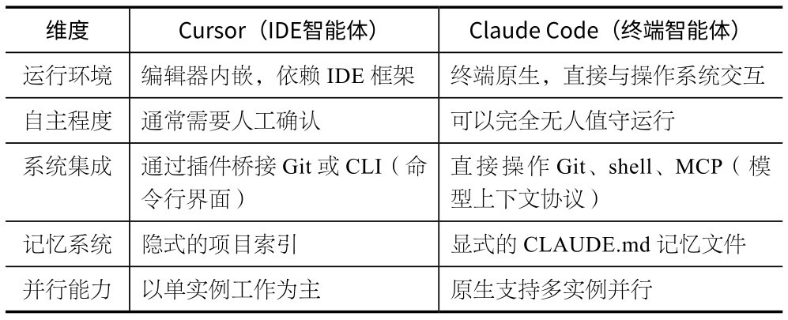
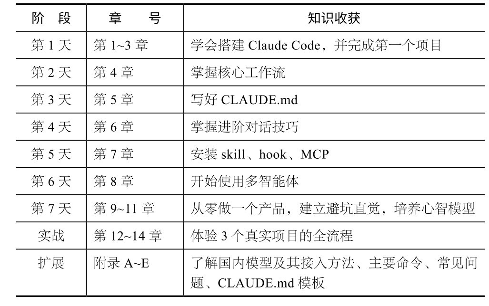

## 第1章 为什么选择Claude Code

本章将回答一个最朴素的问题：为什么选择Claude Code？要回答这个问题，先要把AI编程工具最近几年的演变路径梳理清楚——从Copilot的代码补全，到Cursor的IDE原生集成，再到Claude Code的“命令行 + 自主智能体”范式。读完本章，你将理解Claude Code的独特之处，以及它到底是否适合你。

### 1.1 3年变了3次

AI编程工具在3年间发生了3次重大变化。搞清楚这个演变路径，你就能理解Claude Code到底在做一件什么不一样的事。

2022年，GitHub Copilot正式发布。你写上半句，它猜下半句，就像一名坐在你旁边的实习生。输入速度确实快了，但本质没变：你还是那个写代码的人。

2023年到2024年，Cursor火了。你可以用自然语言让编辑器帮你改函数、重构模块，不必精确描述“怎么写”，只需要说“我想要什么效果”。后来，Cursor也有了智能体（Agent）模式，能跨文件操作、自动运行命令。但它始终在IDE中，是编辑器的延伸。

2025年，Claude Code问世。它不依赖任何编辑器，直接在终端运行。你描述一个需求，它会自己规划步骤、读代码、写代码、跑测试、操作Git，整个循环自动完成。你的角色从“写代码的人”变成了“给指令的人”。

3次变化，关键并不在于技术变得多先进，而是你和AI之间的关系：Copilot像智能输入法，Cursor像你的结对伙伴，Claude Code像你的独立工程师团队。

### 1.2 这不是增长，是爆发

Claude Code在2025年2月公开发布（研究预览版），同年5月正式发布。正式发布后仅6个月，年化收入就达到10亿美元。这在SaaS历史上极其罕见。

企业端应用也很迅速。Netflix、Spotify、DoorDash、Notion、Vercel等在内部大规模使用Claude Code。Anthropic的数据显示，使用Claude Code的团队平均提效2～5倍。Rakuten的新功能上线时间从24天压缩到5天；Zapier全组织AI采用率达97%，部署了800多个智能体。

Anthropic于2026年年初发布“2026 Agentic Coding Trends Report”（《2026年智能体编码趋势报告》），其中有几个数字很能说明问题：78%的Claude Code会话涉及多文件编辑（1年前只有34%）；平均会话时长从4分钟增加到23分钟；单次会话平均完成47次工具调用。这不是在“补全代码”，而是在“执行项目”。

根据The Pragmatic Engineer于2026年2月发布的开发者调查报告，Claude Code的复杂任务（多文件重构、架构决策、大规模调试）市场份额达到44%，在8个月内超过了GitHub Copilot和Cursor；初创公司采用率达75%;“最受喜爱”占比为46%，远高于Cursor（19%）和GitHub Copilot（9%）。

这些数字释放出一个信号：智能体式编程不再是极客的玩具，它正在变成软件开发的标准方式。

### 1.3 Claude Code与Cursor到底有什么不一样

这是我被问得最多的问题：“Cursor也有智能体模式了，与Claude Code有什么不同？不都是AI帮我写代码吗？”

确实，2024年之后的Cursor已经非常强大，能跨文件操作、理解整个项目、自动执行命令。它与Claude Code的差异不在“能不能做”，而在“做到什么程度”。

重点在最后两行。你可以把项目知识、编码规范和架构决策写入CLAUDE.md文件，Claude Code每次启动时都会自动读取，这相当于为AI建立持久的项目记忆。支持多实例并行意味着你可以同时让几个Claude Code各自处理不同的模块，它们就像一个小团队。

打个比方：Cursor就像你在IDE中的结对伙伴，你们看着同一块屏幕协作；Claude Code更像一位独立干活的工程师，你只需要告诉他需求，他会自己拉取代码、编写代码、运行测试、提交代码，你可以去喝杯咖啡，回来看结果就好。

这种工作方式，已经不只是设想。

Claude Code的创建者Boris Cherny曾说，自己使用Claude Opus 4.5之后就再也没有手写过一行代码。他在47天中有46天在使用Claude Code，最长单次会话持续了1天18小时50分钟。这不是营销话术，而是正在大规模发生的现实。

**花****叔****的****经****验**

我本人从未手写过代码，所有产品（包括App Store付费榜第一的“小猫补光灯Pro”）都是用AI完成的。Claude Code让“不会写代码但能构建产品”这件事，从少数人的实验变成了大多数人的可能。

### 1.4 Claude Code其实不是在帮你写代码

这句话听起来有点儿奇怪，但确实是我使用半年之后最大的感受：Claude Code其实不是在帮你写代码，而是在帮你构建产品。

传统AI编程工具关心的是代码生产效率：怎么更快地写出一个函数、一个组件。Claude Code关心的是产品构建效率：怎么更快地将一个想法变成一个能运行的产品。

例

**推****荐**

**用****C****l****a****u****d****e****C****o****d****e**

Claude Code会：分析需求→选技术方案→创建项目→逐步实现→运行测试→修复bug→完成。

全

**不****推****荐**

**用****I****D****E****智****能****体**

体验也不差，但你始终需要坐在旁边：盯着IDE，看它改了什么→出问题后手动切回→它不太敢自己运行命令，需要你确认。

全程你是监工。

前者，你在做产品决策；后者，你在做过程监督。随着AI能力的持续提升，“盯着AI干活”的回报会越来越低，产品决策能力将越来越重要。

Claude Code之所以增长迅猛，是因为命中了一个痛点：许多人缺的不是想法，是把想法变成产品的能力。

### 1.5 为什么是Claude，而不是其他模型

市面上不缺AI编程工具。GitHub Copilot有OpenAI的模型， Cursor集成了多家的模型，还有各种开源方案。Claude Code能脱颖而出，靠的是“两条腿同时走”：**模****型****能****力****和****工****程****设****计****。**

先说模型能力。当前，Claude Code背后主要有3个模型。

**O****p****u****s****4****.****6****：**推理能力最强，善于处理复杂任务和架构决策。

**S****o****n****n****e****t****4****.****6****：**性价比最优，是日常编码的主力。

**H****a****i****k****u****4****.****5****：**响应最快，适合简单查询和补全。

编程任务对模型的要求和聊天不一样。聊天追求“听起来对”，编程要求“跑起来对”。写错函数的一个字符会产生bug，做错一个架构决策则可能要返工几天。这对模型的推理深度、长上下文理解、指令遵循能力要求极高。

Claude在这几个维度上的表现一直稳定在第一梯队。Opus 4.6在SWE-bench（真实GitHub Issue修复基准）上持续领先，Sonnet 4.6在同等价位段几乎没有对手。更关键的是，1M token（100万个词元）的上下文窗口，意味着Claude能一次“看到”一个大型项目的几乎全部代码，而不是只盯着当前打开的文件。

再说工程设计。很多人低估了工程设计对体验的影响。同一个模型，套不同的壳，效果可能天差地别。Claude Code做对了几件事。

**终****端****原****生****。**不受IDE框架的限制，直接与操作系统交互。想运行什么命令就运行什么命令，想操作什么文件就操作什么文件。

**记****忆****系****统****。**CLAUDE.md不是噱头，它让Claude Code有了跨会话的持久记忆。项目规范、架构偏好、编码习惯，写一次就永远生效。

**工****具****生****态****。**skill让能力可复用，hook（钩子）让流程可自动化， MCP让外部服务可连接。三者加在一起，构成了一个完整的harness工具链。

**多****智****能****体****架****构****。**从SubAgents到Agent Teams,Claude Code从第一天起就在为“一群AI协作”而非“一个AI干活”做设计。

模型提供智力，工程提供杠杆。若模型强大但没有好的工程设计，产品用起来会很别扭；若工程设计优秀但模型能力有限，则产品的天花板太低。Claude Code兼具强大的模型能力与精良的工程设计，这正是它能在企业级场景中站稳的原因。

**核****心****建****议**

如果你在国内访问Anthropic API有困难，也不用担心。Claude Code支持配置第三方模型，附录A是一份详细的国内模型接入指南，介绍了DeepSeek、智谱、Kimi（月之暗面）、MiniMax和阿里云百炼等主流平台的配置方法。

### 1.6 不只是编程工具

如果你以为Claude Code只能写代码，那你低估它了。

我用Claude Code写了4本“橙皮书”（你现在读的就是其中一本），运营着30多万粉丝的自媒体账号，管理整个内容创作流程（从选题调研、写文章、生成配图、审校，到排版发布、多平台分发，全流程都在终端完成）。

这不是我一个人的极端用法，而是一个已经显现的趋势：**越****来****越****多****的****产****品****和****服****务****开****始****为****A****I****而****非****人****类****设****计****接****口****。**

如果你留意，就会发现这个变化已经悄悄发生。下面是你可能已经注意到的几个信号。

**企****业****协****作****平****台****推****出****C****L****I****。**飞书、钉钉、企业微信等平台已提供命令行接口和API，允许AI智能体直接发消息、创建文档、管理日程。你不用再打开网页一个个单击。

**新****兴****A****I****工****具****原****生****内****置****s****k****i****l****l****。**像LibTV（AI视频创作平台）这样的新工具，在发布第一天就提供了Claude Code的skill集成。用户不需要学习新界面，直接在终端说出要求（如“帮我生成一个30秒的产品演示视频”）即可。

**A****P****I****优****先****转****向****智****能****体****优****先****。**以前，做产品先设计用户界面，API是附属品。现在，越来越多的产品先确保AI能用，用户界面反而退居其次。

想一下，这意味着什么？如果未来80%的软件有智能体接口，那么你跟这些软件交互的方式就不再是打开App、找菜单、点按钮，而是直接将具体需求告诉你的AI智能体，让它执行。

**C****l****a****u****d****e****C****o****d****e****就****是****你****通****往****这****个****未****来****的****起****点****之****一****。**

学会用Claude Code，你学到的不只是“怎么让AI帮你写代码”，更是“怎么让AI帮你做一切需要在计算机上完成的事情”。这种能力的杠杆效应，远比编码本身大得多。

**花****叔****的****实****践**

目前，我在Claude Code中安装了60多个skill，覆盖内容创作、视频制作、图片生成、数据分析、项目管理等场景。在我每天和Claude Code的交互中，写代码的部分可能只占30%，剩下的70%是内容创作、调研、文件管理和跨平台协作等。这就是终端智能体的真正威力——不挑活。

### 1.7 这本书写给谁

本书适合以下人阅读。

**工****程****师****，****想****大****幅****提****高****效****率****。**你已经会写代码，但每天将大量时间花在写样板代码、进行调试、写测试及处理CI/CD（持续集成与持续交付/部署）上。Claude Code能接管这些工作，让你把精力集中在架构决策和产品思考上。

**产****品****经****理****，****想****自****己****做****M****V****P****（****最****小****可****行****产****品****）****。**你有产品直觉和用户洞察，但受限于开发资源。Claude Code能让你在一个周末做出可运行的原型，不用等排期，也不用写PRD（产品需求文档）等。

**创****业****者****，****想****实****现****一****人****公****司****。**你想验证商业想法，但不想在技术上花太多钱和时间。Claude Code能让你拥有小团队的开发能力，一个人搞定网站、App和后端API。

**核****心****建****议**

不管你属于哪一类，本书都假设你聪明、有想法，但可能从没用过AI编程工具。我们会从零开始讲解，但不会在基础概念上花费太多时间。

### 1.8 全书路线图

全书按一条主线走：**一****个****聪****明****人****在****一****周****内****从****零****开****始****用****A****I****构****建****产****品****。**

本书几乎每章都有实操部分，你可以跟着做。不用一口气读完，读一章、实践一章，再读下一章，完全没问题。

下一章，我们将花10分钟把Claude Code装好。
