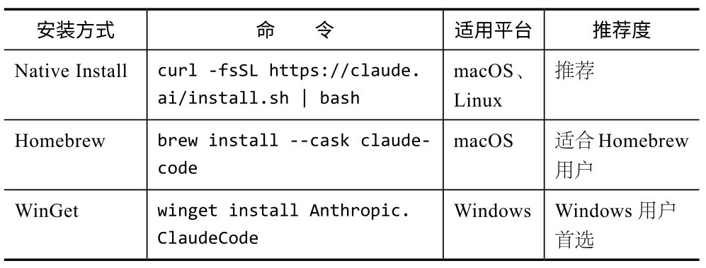
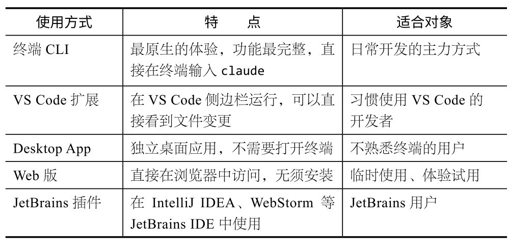
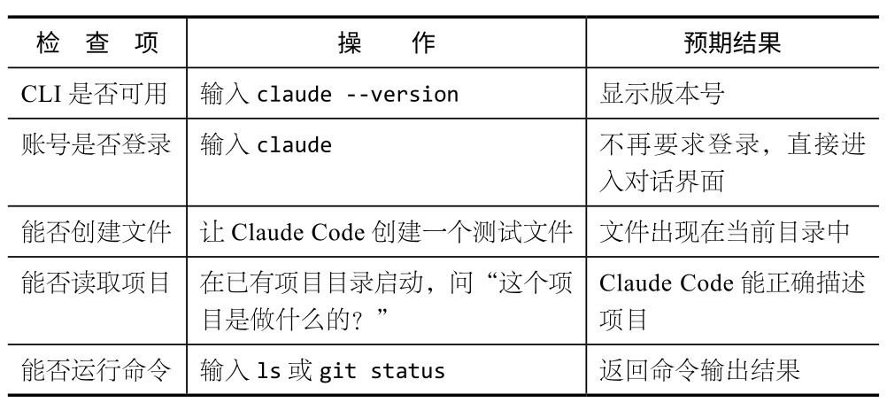

## 第2章 10分钟快速起步：安装与配置

Claude Code的安装过程比你想象的简单，本章将介绍其安装步骤、环境选择和计费方案等，并带你开启与Claude Code的第一次对话。

我第一次安装Claude Code的时候，只在终端输入了一行命令，30秒后就自动安装完成。接着，在对话框中输入claude并按Enter键，屏幕上立即出现闪烁的光标。我输入“你好”，它立刻进行了回复。整个过程不到1分钟。

我当时的感觉是：就这？

是的，就这。没有复杂的IDE配置和插件冲突，也没有难缠的环境变量。后来，我帮不少朋友安装，最常遇到的不是技术层面的问题，而是心理层面的：他们不相信真的这么简单。因此，我在本章中将把每一步都写清楚，包括我和朋友们踩过的坑。

### 2.1 3种安装方式

Claude Code支持macOS、Linux和Windows平台。关键问题不是“能不能装”，而是用哪种方式最省事。

**核****心****建****议**

不知道选哪种？可以试试这样选。

不想折腾：选择Native Install（最简单）。

本来就在用Homebrew：选择Homebrew。

Windows用户：选择WinGet。

如果你不确定，默认选Native Install。它的优势很简单：一条命令，直接可用。

### 2.2 开始安装

**1****.****m****a****c****O****S****/****L****i****n****u****x**

打开终端（在macOS中使用Terminal或iTerm2，在Linux中使用你习惯的终端），运行以下命令：

curl -fsSL https://claude.ai/install.sh | bash

脚本会自动检测系统、下载二进制文件、把claude命令加到你的PATH中。Homebrew用户可以使用brew install --cask claude-code命令，效果一样。

安装完成后，输入claude就能启动。

**2****.****W****i****n****d****o****w****s**

在Windows中的安装多一个前置步骤：需要先安装Git for Windows，用来提供基本的UNIX工具环境。

(1) 安装Git for Windows。主要有两种安装方式。

从官网下载并安装。

使用WinGet：在终端输入winget install Git.Git命令。

安装时保持默认设置即可，Git自动附带一个Git Bash终端。

(2) 安装Claude Code。打开PowerShell或Git Bash，运行以下命令：

winget install Anthropic.ClaudeCode

(3) 验证安装。重新打开终端，输入claude --version，如果能看到版本号，就说明安装成功。

**核****心****建****议**

Windows用户请注意，Claude Code需要Git Bash提供的UNIX工具链。如果直接在CMD中运行，可能会遇到问题，建议使用PowerShell或Git Bash。

### 2.3 各平台“踩坑”详解

虽然官方宣传“一行命令搞定安装”，但在实际帮几十个人安装后，我发现各平台都存在不少坑。下面按平台列举一些最常见也最容易卡住的问题。

**1****.****m****a****c****O****S****中****的****常****见****问****题**

**未****安****装****X****c****o****d****e****C****o****m****m****a****n****d****L****i****n****e****T****o****o****l****s****。**Claude Code依赖Git，而在macOS中，需要先安装Xcode命令行工具才能使用Git。如果你从来没在Mac上进行过开发，第一次在终端运行git时，系统会弹出安装提示。单击安装即可，大概需要5分钟。安装完成后重新运行git命令。

**A****p****p****l****e****S****i****l****i****c****o****n****和****I****n****t****e****l****的****差****异****。**M系列芯片和Intel Mac的安装命令完全一样，安装脚本会自动检测架构。但如果你用Rosetta 2运行Intel终端环境，可能会安装Intel版。验证方法是运行file $(which claude)，如果输出中有arm64，说明安装的是Apple Silicon版。

**P****A****T****H****环****境****变****量****。**如果安装完成后输入claude，系统提示command not found,99%是PATH配置问题。检查～/.zshrc （macOS Catalina之后默认为zsh）中是否有以下配置：

export PATH="$HOME/.local/bin:$PATH"

如果没有，添加之后运行source ～/.zshrc，或者重新打开终端。

**2****.****L****i****n****u****x****中****的****常****见****问****题**

**g****l****i****b****c****版****本****。**在极少数情况下，老旧的Linux发行版（如CentOS 7等）因glibc版本太低而报错。解决方案是升级系统，或者使用Docker运行Claude Code。

**无****图****形****界****面****的****服****务****器****。**首次使用Claude Code时需要通过浏览器进行认证。如果你在一台无图形界面的服务器上安装，登录时系统会给你一个URL和验证码。你可以在另一台有浏览器的计算机上打开URL，输入验证码，完成认证。

**3****.****W****i****n****d****o****w****s****中****的****常****见****问****题**

**终****端****选****择****。**Windows的终端选择较多，很容易混淆。推荐优先级为Windows Terminal>PowerShell>Git Bash>CMD。最好不要用CMD，因为它版本老旧，不支持很多命令。Windows Terminal是微软官方的新终端，可从Microsoft Store免费下载。

**W****S****L****用****户****。**如果你习惯用WSL（Windows Subsystem for Linux，适用于Linux的Windows子系统），可以直接在WSL中安装Linux版Claude Code。效果和原生Linux一样，而且不用配置Windows环境。WSL中的Claude Code和Windows原生版Claude Code相互独立，互不影响。

**杀****毒****软****件****。**一些杀毒软件（如360杀毒、金山毒霸、Windows Defender的严格模式）可能会拦截curl下载。如果遇到这种情况，可以临时关闭杀毒软件，或者使用WinGet安装。WinGet通过微软官方渠道安装，通常不会被杀毒软件拦截。

**注****意**

一些企业网络部署了SSL中间人证书（用于监控流量），可能导致SSL验证失败。常见报错为UNABLE_TO_VERIFY_LEAF_SIGNATURE或CERT_HAS_EXPIRED。解决方案是在环境变量中指定公司的CA证书：

export NODE_EXTRA_CA_CERTS=/path/to/company-ca.pem

如果你不知道公司CA证书的位置，可以通过IT部门获取。这个问题不只影响Claude Code，所有Node.js程序在企业网络中都可能遇到。

### 2.4 5种用法，怎么选更合适

使用Claude Code的方式主要有5种，体验各不相同。

**核****心****建****议**

本书后续所有演示都基于终端CLI。如果你平时习惯用VS Code或JetBrains，建议先在终端熟悉Claude Code的全部功能，之后再切换到IDE插件。终端能够展现Claude Code的完整能力。

### 2.5 账号与计费方案

使用Claude Code需要Anthropic账号。首次启动Claude Code时，系统会自动弹出浏览器，提示你登录或注册一个Anthropic账号以继续使用。

目前官方提供3种计费方案。

怎么选？一个简单的参考标准：如果每天使用超过2小时，选Pro方案大概率会突破限额。这时升级为Max 5x方案是值得的。虽然100美元/月看起来不便宜，但跟它节省的时间成本比，还是挺划算的。

**核****心****建****议**

先从Pro方案开始。使用几天，你自然知道够不够用。很多人选择方案的路径是：第1周觉得Pro方案够用，第2周开始上瘾，用量大增，于是升级为Max方案。

企业用户还可以通过Anthropic API按词元用量计费，适合需要自定义集成或有合规要求的团队。Claude Code v2.1.88新增了claude auth login --console命令，可以直接用Anthropic Console账号登录（通过API计费），无须单独配置API密钥。但对本书读者来说，直接订阅是最简单的开始方式。

### 2.6 你的第一条指令

下面试试发出你的第一条指令吧。

(1) 打开终端，进入一个项目目录。Claude Code会以你当前所在的目录为工作目录。建议新建一个测试文件夹：

mkdir ～/my-first-project && cd ～/my-first-project

(2) 启动Claude Code：

claude

首次启动时，系统会打开浏览器，提醒你登录Anthropic账号。登录成功后，终端会显示Claude Code的交互界面。

(3) 发送你的第一条指令，例如：

创建一个简单的HTML页面，显示“Hello, Claude Code!”，用好看的CSS样式。

你会看到Claude Code开始工作：在你的目录中创建一个HTML文件，写入完整的代码。整个过程仅需10～30秒。

(4) 查看结果。Claude Code创建完文件后，你可以直接在浏览器中查看效果：

# macOS用户

open index.html

# Linux用户

xdg-open index.html

# Windows用户

start index.html

如果你能看到一个带样式的“Hello, Claude Code!”页面，恭喜你，一切正常。

这看起来非常简单，但意义不容忽视：一句自然语言，就让AI完成了“理解需求→创建文件→编写代码”的全过程。后面的所有进阶操作都是在这个基础上展开的。

### 2.7 检查环境是否正常

检查以下各项。

如果各项都达预期结果，那么一切正常，可以放心进行产品开发了。

### 2.8 遇到问题了？快速排查

**1****.****无****法****连****接****和****登****录**

Claude Code需要访问Anthropic的API服务器。若连接超时或报错，先在终端运行curl -I https://api.anthropic.com，检查网络连通性。如果返回HTTP状态码（不管是什么数字），说明网络连接正常；如果提示超时，需要检查你的网络环境。

**2****.****安****装****时****报****P****e****r****m****i****s****s****i****o****n****d****e****n****i****e****d**

macOS/Linux用户若遇到权限错误，不要用sudo，可以这样做：

# 确保本地bin目录存在且有写权限

mkdir -p ～/.local/bin

# 重新运行安装脚本

curl -fsSL https://claude.ai/install.sh | bash

如果问题仍然存在，检查你的PATH中是否包含～/.local/bin。

**3****.****提****示****有****新****版****本**

当Claude Code提示有新版本时，若选择手动更新，重新运行一遍安装命令即可。

# Native Install用户

curl -fsSL https://claude.ai/install.sh | bash

# Homebrew用户

brew upgrade --cask claude-code

# WinGet用户

winget upgrade Anthropic.ClaudeCode

**核****心****建****议**

请保持更新。Claude Code迭代极快，几乎每周都会推出新功能。新版本不只是修复bug，经常带来能力的明显提升。建议至少每两周更新一次。

**4****．****安****装****V****S****C****o****d****e****扩****展**

如果想在VS Code中使用Claude Code，可进行以下操作。

(1) 打开VS Code的扩展市场（快捷键为Cmd+Shift+X或Ctrl+Shift+X）。

(2) 搜索“Claude Code”。

(3) 安装Anthropic官方的扩展。

(4) 安装成功后，侧边栏中会出现Claude Code的图标，单击该图标即可开始对话。

VS Code扩展底层调用的是同一个CLI，因此不需要单独配置账号，登录状态是共享的。

**5****．****安****装****D****e****s****k****t****o****p****A****p****p**

不习惯使用终端的用户可以选择使用桌面应用。只需在官方下载页面下载安装包，双击安装即可。桌面应用本质上是终端CLI的图形界面包装。

**核****心****建****议**

不管你选哪种方式，都先把CLI装好。CLI是基础，VS Code扩展和Desktop App都依赖它。CLI可用，其他环境基本不会有问题。

工具装好了，账号登录成功了，第一次对话也顺利进行了。下一章，我们将正式开始做一个真实项目。

### 2.9 本章练习

**练****习****1****：****跟****C****l****a****u****d****e****C****o****d****e****打****个****招****呼****。**安装完成后，打开终端，输入claude，然后问：“你是谁？你能帮我做什么？”看它怎么回答。再输入/status，看看你的账号状态和当前模型。

**练****习****2****：****试****试****管****道****输****入****。**在你的计算机中任选一个文本文件（如README.md），运行cat README.md | claude -p "用一句话总结这个文件的内容"，感受一下非交互模式。
