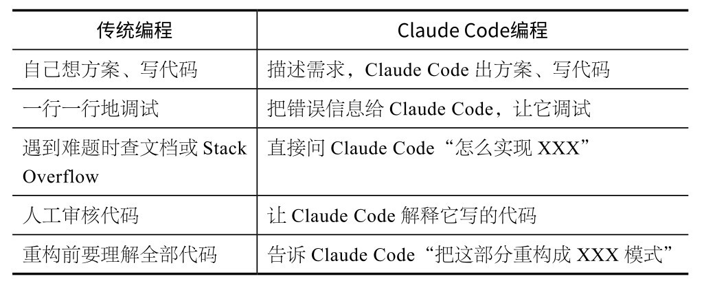

## 第3章 你的第一个项目

了解理论知识后，接下来我们就要动手实践了。本章将带你从零开始开发一个真实可用的CLI工具。完成之后，你就能真正理解对话式编程是怎么回事了。

“小猫补光灯”上架那天，女朋友问我从有想法到做出成品一共用了多长时间。我说大概1小时，她并不相信。但这是实话：5分钟判断需求，然后与AI编程工具进行几轮对话，就完成了。

当然，“小猫补光灯”是用Cursor做的（那时候Claude Code还没发布）。但核心体验是一样的：你描述想要什么，AI帮你实现。不需要先花3个月学编程，也不需要理解什么是SwiftUI或React Native，你只需要知道自己想做什么。

在本章中，我们将用Claude Code做一个“每日AI新闻聚合器”。它的规模比“小猫补光灯”小，但流程完全一样：先想清楚做什么，然后让Claude Code干活。

### 3.1 热身：5分钟做一个个人主页

在做正式项目之前，先花5分钟热身。这个小练习的目的是让你亲自体验一次“说→做→看”的完整流程。

(1) 在终端执行以下命令（如果你已经进入Claude Code界面，可以按Ctrl+C组合键退出，建好目录后再进入）：

mkdir my-homepage && cd my-homepage

claude

(2) 进入Claude Code后，提出需求：

帮我做一个个人主页。单页HTML，要好看。

内容：我叫[你的名字]，是一个[你的职业/身份]。

加一句自我介绍，一段关于我的描述，底部放几个社交媒体链接的placeholder。

用现代简约风格，响应式布局。

Claude Code会在30秒内生成一个完整的HTML文件。

(3) 执行以下命令，打开该HTML文件看看：

open index.html　　　# macOS用户

xdg-open index.html　# Linux用户

start index.html　　 # Windows用户

你应该可以看到一个不错的页面。但它也许不是你理想中的样子——配色可能太普通，或者布局可以更好。没关系，可以继续提需求：

改一下配色，用深色背景+亮色文字。字体换成衬线体。

加一个渐变的背景动画效果。

Claude Code会自动修改文件，刷新浏览器就能看到变化。你可以再调几轮，直到满意为止。

整个过程不超过5分钟，但你已经完成了一次完整的对话式编程：描述需求→Claude Code实现→查看结果→提出修改→Claude Code调整。后续所有项目，不管多复杂，都遵循这个流程。

**核****心****建****议**

如果你想让别人也能看到这个页面，可以将它部署上线：

帮我把这个页面部署到GitHub Pages。

Claude Code会帮你创建Git仓库、推送代码、配置GitHub Pages。整个过程大概需要5分钟。这样，你就有了一个真实的在线个人主页——用AI做的第一个上线项目。

热身结束。接下来，我们做一个稍微复杂的项目。

### 3.2 实战：每日AI新闻聚合器

“每日AI新闻聚合器”是一个CLI工具，功能非常简单：

从几个RSS源（如TechCrunch AI、The Verge AI、Hacker News等）抓取最新文章；

用AI总结每篇文章的要点；

输出一份格式整齐的Markdown日报。

为什么选择这个项目？因为它够小，一个下午就能做完；它又够完整，涉及网络请求、数据处理、AI调用和文件输出。通过这个项目，我们能全面体验Claude Code的各种能力。

先转换一下心态：从现在开始，你是产品经理，Claude Code是你的工程师。你要做的是说清楚要什么，而不是写代码。哪怕你是资深程序员，也请先按这个方式操作一遍。

**1****．****告****诉****C****l****a****u****d****e****C****o****d****e****你****要****什****么**

打开终端，建一个空文件夹，启动Claude Code：

mkdir ai-news-digest && cd ai-news-digest

claude

然后，用自然语言告诉Claude Code你想要什么：

帮我做一个AI新闻聚合CLI工具，需求如下。

1.从以下RSS源抓取最近24小时的文章

- TechCrunch AI频道

- The Verge AI频道

- Hacker News AI标签流

2.提取每篇文章的标题、链接、发布时间、来源

3.按时间倒序排列，输出一份Markdown格式的日报到output/目录

4.用TypeScript写，用tsx直接运行

先别急着写代码，给我一个实现方案。

注意，最后那句“先别急着写代码，给我一个实现方案。”并不是客气话，而是一个重要技巧：**让****C****l****a****u****d****e****C****o****d****e****先****想****清****楚****再****动****手****。**

**核****心****建****议**

需求描述的质量直接决定输出质量。建议遵循几个原则：说清楚最终产物什么样（Markdown日报）；指定技术选型（TypeScript+ tsx）；给出具体的数据源URL。描述越具体越好。

**2****．****看****它****是****怎****么****想****的**

Claude Code在收到上述需求后，不会直接写代码，而是先给你一个方案。大致如下：

我来帮你做这个AI新闻聚合工具。先说一下方案：

项目结构：

ai-news-digest/

├── src/

│　├──index.ts　　 #入口文件

│　├──fetcher.ts　　#RSS抓取逻辑

│　├──formatter.ts　 #Markdown格式化

│　└──types.ts　　　#类型定义

├──output/　　　　 #日报输出目录

├── package.json

└── tsconfig.json

技术方案：

- RSS解析用rss-parser库

- HTTP请求用node内置的fetch

- 日期处理用date-fns

- 用tsx直接运行TypeScript，不需要编译步骤

实现流程：

1.并行抓取3个RSS源

2.统一格式，过滤24小时内的文章

3.按时间排序

4.生成Markdown格式日报

5.写入 output/YYYY-MM-DD.md

需要我开始实现吗？

这时，你就是在看工程方案的产品经理。如果觉得方案可行，就直接说“好”；如果想调整，则提出修改意见，比如：

# 你的反馈

方案没问题。补充两点：

1.为日报里的文章加一句话摘要（从文章description里截取前100个字）

2.日报开头加统计数据：共收录X篇，来自Y个源

这一来一回就是对话式编程的核心：Claude Code出方案，你补充细节，Claude Code修正。不用画流程图，也不用写技术文档，直接像平时说话一样沟通就行。

**3****．****看****它****干****活**

确认方案后，Claude Code开始执行。你可以在终端看到一系列操作。

(1) 初始化项目。Claude Code会运行npm init -y，然后安装依赖包。你会看到它请求运行命令的权限提示：

Claude wants to run: npm init -y

Allow? (y/n)

按Y键表示允许，按N键表示不允许。之后，它还会请求安装rss-parser、date-fns、tsx等包。

(2) 创建源代码文件。Claude Code逐个创建TypeScript文件。你会看到它写入代码的过程，每个文件都会展示差异（diff）。不需要逐行看，你可以快速扫一眼文件结构是否合理。

(3) 运行测试。写完代码后，Claude Code通常会试着运行一次看看有没有报错。如果报错，它会自己读错误信息、找问题、修代码、再运行，形成一个自动修复循环。

整个过程需要2～5分钟。你要做什么？**看****着****就****行****。**就像把任务交给新同事，前几次你会盯着看他怎么做事，等熟悉了他的风格，就可以放心地让他自己处理。

**注****意**

在执行过程中，Claude Code可能会多次请求权限。初期，建议你每次都看一下它要执行的命令。熟悉后可以用/permissions预授权常见命令（第4章会细讲），或者直接启用Auto模式。

**4****．****查****看****结****果**

Claude Code干完活后，你可以运行以下命令查看结果：

npx tsx src/index.ts

如果一切顺利，你会在output/目录下看到一个Markdown文件，内容大致如下：

# AI新闻日报——2026-03-28

> 共收录23篇文章，来自3个源

---

## TechCrunch AI

#

2026-03-28 14:30

> OpenAI今日发布了GPT-5.4版本，最大的变化是上下文窗口从100万个词元扩展至200万个词元……

#

2026-03-28 11:00

> Anthropic宣布Claude Code正式推出桌面应用程序，支持macOS和Windows……

---

## The Verge AI

……

打开文件看看格式和内容。大多数情况下，第一次就能顺利完成。如果报错，直接把错误信息给Claude Code：

运行报错了：

TypeError: Cannot read properties of undefined (reading 'map') at formatArticles (src/formatter.ts:15:23)

Claude Code会自动读取错误信息、定位问题、修改代码、再次运行。一般进行1～2轮报错到修复的循环就能搞定。

**5****．****添****加****功****能**

完成后，如果你想添加功能，直接用自然语言告诉Claude Code即可：

# 第一个改进：加AI摘要

现在每篇文章的摘要是从description里截取的，比较粗糙。

改成用AI来总结：对每篇文章的标题+description，用Claude API

生成一句话总结。

API key从环境变量ANTHROPIC_API_KEY读取。

Claude Code会修改代码，加入API调用逻辑。验证后，你可以继续添加功能：

# 第二个改进：加定时运行

加一个cron模式，每天早上8点自动运行一次，用node-cron实现。

加一个命令行参数：

- `npx tsx src/index.ts`立即运行一次

- `npx tsx src/index.ts --cron`开启定时模式

# 第三个改进：加去重逻辑

有些文章在多个源里重复出现了。加一个基于URL的去重。

每一轮，Claude Code都自动修改代码、运行测试、确认结果。你始终只需做两件事：说清楚要什么、验证结果。

到这里，第一个项目就完成了。回头看看整个过程：

不管项目大小，也不管是小工具还是完整产品，底层模式都是这5步。

### 3.3 一个重要的心态转变

做完这个项目，你应该有一个直观的感受：**你****的****价****值****不****在****于****写****代****码****，****而****在****于****定****义****做****什****么****、****判****断****做****得****对****不****对****。**

很多工程师第一次用Claude Code时，本能地想看每一行代码、理解每个实现细节。这是正常反应，但这样做会降低效率。

更高效的方式是把Claude Code当团队成员来管理。

这并不是说完全不管代码，而是你的注意力应该集中在更高层面：需求是否准确？方案是否合理？结果是否符合预期？这些才是你该花时间思考的事情。

### 3.4 新手心法：如何与Claude Code配合

**1****．****看****不****懂****代****码****，****怎****么****办**

你可以直接问Claude Code：

解释一下fetcher.ts的实现逻辑。

Claude Code会用自然语言讲清楚。你还可以追问：

为什么用Promise.allSettled而不是Promise.all？

它会解释背后的技术选择。

你不需要能够写出一段代码，但需要理解它在做什么。就像你不必会造发动机，但要知道它是否在正常运转。

**2****．****结****果****不****对****，****怎****么****办**

你不需要知道怎么改，直接描述哪里不对就行：

运行后只输出了TechCrunch的文章，没有另外两个源的文章。检查一下抓取逻辑。

你也不用像下面这样定位代码错误：

你的代码第23行有bug。

描述现象往往比定位代码行更有效，除非你确实知道问题出在哪儿。

Claude Code可能会发现，问题的根源不在你以为的地方。

**3****．****该****管****到****什****么****程****度**

一个基本原则：**信****任****但****验****证****。**让Claude Code去做，但检查每一步的结果。

**方****案****阶****段****：**仔细看，确保方向对。

**编****码****阶****段****：**大致看一下文件结构。

**执****行****阶****段****：**检查输出是否符合预期。

**改****进****阶****段****：**多测试边界情况，如空数据、网络超时、格式异常。

做完几个项目后，你自然会掌握这个分寸。

**4****．****跑****偏****了****，****怎****么****办**

这分为两种情况。

偏得不远，直接纠正。例如：

停，不要用XXX库，换YYY。

偏得太远，直接中断。

�按Esc键停止，重新描述需求。

�按两次Esc键，打开Rewind（回滚）菜单，可以回滚对话和文件，或者两者都回滚。

**核****心****建****议**

若纠正两次还不行，就果断停下来重来。在错误的基础上打补丁，只会越补越乱。

### 3.5 常见问题与排错指南

在做第一个项目的过程中，你大概率会遇到一些问题。我和朋友也都遇到过，这些问题几乎都有标准解法。

**1****.****C****l****a****u****d****e****C****o****d****e****创****建****了****文****件****，****但****运****行****报****错**

这是最常见的问题，通常是因为依赖没有安装好，或者环境变量没有正确设置。解决方法很简单：把完整的报错信息粘贴给Claude Code。

运行报错了，报错信息：

[粘贴完整的报错信息]

帮我修复一下。

Claude Code会读报错信息、定位问题并修复代码。在绝大多数情况下，一轮就能解决。如果两轮之后还没解决，说明可能是环境问题（如Node.js版本、系统权限等），这时需要描述你的系统环境。

我的环境：macOS 15.3,Node.js v22.5.0,npm 10.8.0

修改了两次还是报这个错，可能是环境问题？

**2****.****C****l****a****u****d****e****C****o****d****e****一****直****在****“****思****考****”****，****没****有****输****出**

如果Claude Code超过1分钟没有任何输出，可以按Esc键中断，然后重新发送你的请求。如果频繁卡住，可能是网络问题，需检查网络连接是否稳定。

另一个可能的原因是单次请求的内容体量过大，比如让Claude Code一次性处理包含几千行代码的文件，这可能需要很长时间。试试拆分请求：

先看前100行，有什么问题？

**3****.****C****l****a****u****d****e****C****o****d****e****的****输****出****与****预****期****不****符**

这往往是需求描述的问题。回顾一下你说了什么，对比一下Claude Code做了什么。常见问题如下。

**太****模****糊****。**例如，你让Claude Code“做个好看的页面”，它不知道你觉得什么好看。可以改成“深色背景、大字标题、卡片布局、圆角设计”。

**假****设****C****l****a****u****d****e****C****o****d****e****知****道****上****下****文****。**例如，你说“把那个功能加上去”,Claude Code不知道 “那个”是什么。每个需求都要自包含。

**一****次****说****太****多****。**如果10个需求挤在一条消息里，Claude Code可能会漏掉几个。可以将需求分开描述。

**4****.****C****l****a****u****d****e****C****o****d****e****改****了****不****该****改****的****文****件**

这类问题偶尔会发生。按两次Esc键，打开Rewind菜单，你可以进行以下操作。

**回****滚****对****话****：**撤销最后几轮对话，从某个节点重新开始。

**回****滚****文****件****：**把被修改的文件恢复到之前的状态。

**两****者****都****回****滚****：**同时恢复对话和文件。

Rewind菜单是你的“安全网”。有它在，你不需要紧张。

**5****．****依****赖****安****装****失****败****（****n****p****m****/****p****i****p****报****错****）**

在国内网络环境下，npm install可能很慢或者失败。常用的两种解决方案如下。

方案一：使用npmmirror镜像站（阿里云镜像）。

npm config set registry https://registry.npmmirror.com

方案二：让Claude Code用国内可用的替代包。

无法通过npm安装这个包，是否有替代方案或者是否可以不用这个依赖。

Python用户遇到pip问题时类似，比如可以使用清华大学开源软件镜像站：

pip install -i https://pypi.tuna.tsinghua.edu.cn/simple 包名

**6****．****词****元****用****完****了****/****被****限****额****了**

选择Pro方案的用户每天有词元使用限额。如果系统提示limit reached，你有3个选择：

等几个小时，限额会自动重置；

升级到Max 5x方案，获得更高词元额度；

今天先停止使用，明天再继续。

长对话会消耗大量词元，因为每次发消息都要发送完整的对话历史。用/compact命令压缩对话历史，可以减少词元消耗量。

**核****心****建****议**

最重要的排错技巧：把完整的报错信息发给Claude Code。不要手打报错信息（容易打错），可以直接从终端复制，然后粘贴给Claude Code。Claude Code看到完整报错，能解决90%的问题。

**本****章****核****心**

描述需求、审查方案、确认执行、验证结果、迭代改进。你管“要什么”和“好不好”,Claude Code管“怎么实现”。形成这种分工默契之后，生产力将迎来质的飞跃。

### 3.6 本章练习

**练****习****1****：****做****一****个****小****工****具****。**想一件你在日常生活和工作中重复做的事情（如整理照片、批量重命名文件、生成每日任务清单等），然后告诉Claude Code:“帮我做一个XXX的命令行工具。”完成后，截图发给朋友。

**练****习****2****：****故****意****给****一****个****模****糊****的****需****求****。**输入“帮我做一个有意思的东西”，看Claude Code怎么回应。然后，给出具体需求，并对比结果。这个练习的目的是让你感受需求清晰度对输出结果的影响。
