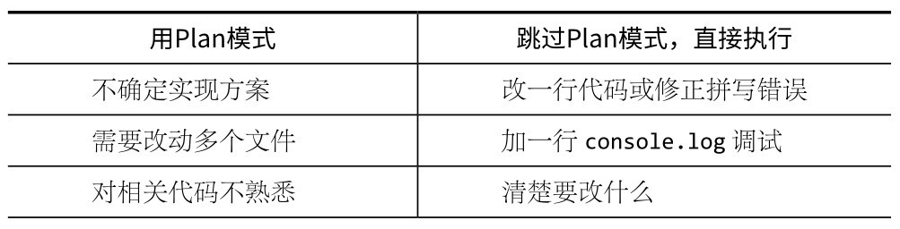
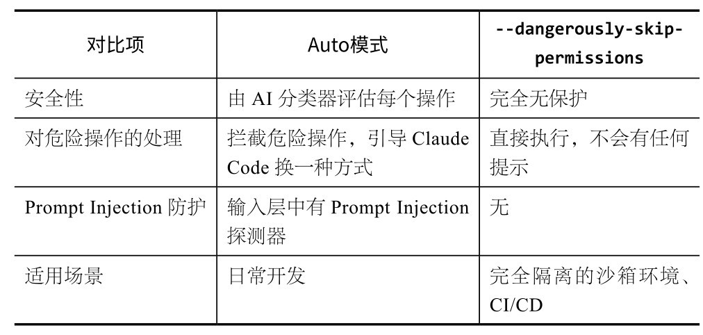
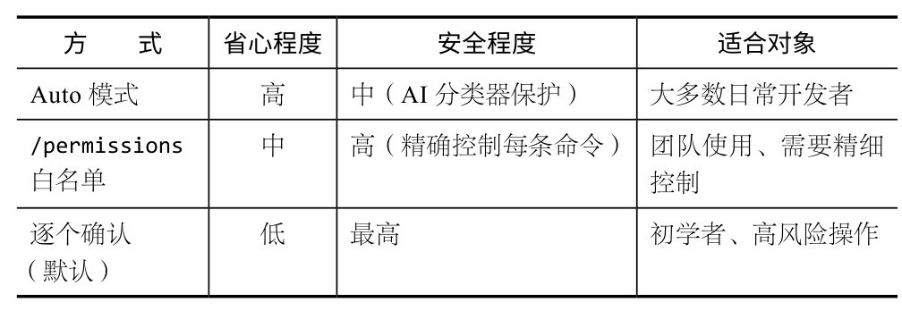
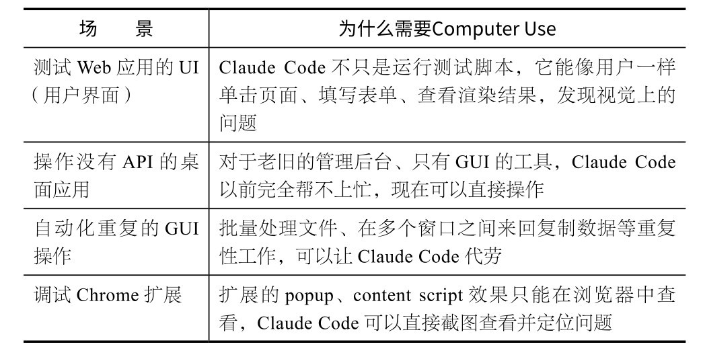
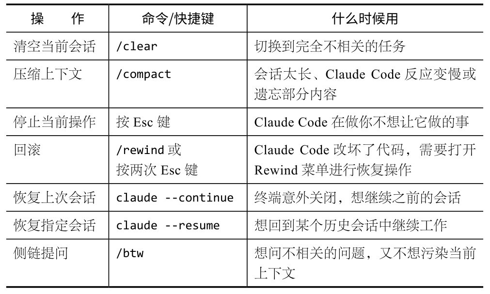

## 第4章 核心工作模式：把Claude Code变成真正的“生产力工具”

完成第一个项目之后，你可能觉得使用Claude Code也就这样——它写代码，你确认权限、看结果。但实际使用一段时间你就会发现，真正拉开效率差距的是几个核心工作模式。

有一次，我让Claude Code帮我修复一个iOS项目的bug。按Enter键后，我去倒了杯水，回来发现它已经改完了——连改了7个文件，并运行了测试，全部通过。我翻看它的操作记录：先读了报错日志，定位到根因是一个数据类型转换问题，于是改了核心文件，然后追踪到6个引用了这个数据类型的文件，逐一更新，最后运行测试并确认。整个过程大概用了3分钟。

如果换作我自己，光是理解这7个文件之间的关系就要半个小时。可转念一想：如果它改错了呢？如果它误解了bug的原因呢？我看都没看就让它全改了。

这件事让我意识到：使用Claude Code的核心不是“它能不能做”，而是“你要不要先考虑一下再让它做”。这就是本章要讲的工作模式问题。

### 4.1 Plan模式：先讨论再执行

Boris说过一句话：**“****一****个****好****的****计****划****真****的****很****重****要****。****”**他与Claude Code的大多数会话是从Plan模式开始的。

Plan模式的作用很明确：Claude Code只负责规划，不执行。Claude Code会告诉你它打算怎么做，但不会修改代码、安装包或运行命令。你可以和Claude Code反复讨论方案，确认后再放手让它去做。

### 4.1.1 如何进入Plan模式

在默认情况下，按两次Shift+Tab组合键，即可将Claude Code切换到Plan模式。此时，Claude Code的行为会改变：

它可以读取文件来理解代码，但不会修改任何文件；

它会给出详细的实现方案，包括要改哪些文件、怎么改；

它允许你和它反复讨论并修改方案。

### 4.1.2 Plan模式的黄金工作流

Boris推荐的完整工作流如下。

(1) 在Plan模式下描述需求，反复讨论。

按两次Shift+Tab组合键进入Plan模式，描述你的需求。Claude Code给出方案后，你可以反复调整，比如输入“第三步换个方式”“这里的库用✕✕✕替换”等。

(2) 用编辑器写一份详细的执行指令。

初步确定方案后，按Ctrl+G组合键，打开默认编辑器（由$EDITOR环境变量决定）。你可以在编辑器中写一份完整的执行指令，包括在讨论中确认的方案细节和约束条件等。保存后，内容会自动填充到Claude Code的输入框中，作为下一步的提示词。

(3) 切换到正常（Normal）模式，开启Auto-accept edits模式。

确认上一步的方案后，按两次Shift+Tab组合键切回正常模式。由于方案已经过充分讨论，你也可以放心地开启Auto-accept edits模式，让Claude Code一次性完成执行，不需要逐步确认。

这个流程的精髓在于：**把****问****题****放****在****方****案****阶****段****解****决****，****执****行****阶****段****一****气****呵****成****。**边做边改、反复返工是最浪费词元的用法。

### 4.1.3 什么时候该用Plan模式

我们通过一些简单的对比示例来看看，什么时候该用Plan模式。

看完这些例子，其实可以抽象出一个简单的判断方法：是“需要想清楚”，还是“直接动手就行”？

**核****心****建****议**

如果你需要先解释，才能让Claude Code执行，就值得用Plan模式；如果你能用一句话说清楚任务，直接让Claude Code执行即可。

### 4.2 Auto模式：更安全的“自动驾驶”

使用Claude Code一段时间后，你大概已经体会到那种“烦躁感”了：每次写文件都要确认，运行命令也要确认，安装依赖还要确认。当你第50次按Y键时，根本不再看它要执行什么了。

Anthropic内部的数据证实了这一点：**超****过****9****0****%****的****权****限****请****求****被****用****户****直****接****批****准****。****“**审批疲劳”让安全机制形同虚设。

Auto模式就是为解决这个问题而设计的，其核心思路是由AI分类器替用户判断权限——自动放行安全操作，只拦截危险操作。

### 4.2.1 Auto模式的工作原理

Auto模式有两层防御。

**输****入****层****：**Prompt Injection探测器会扫描Claude Code读取的所有内容，包括文件、网页、命令输出等。一旦发现疑似劫持Claude Code的内容（如某个文件包含“忽略之前的指令”语句），探测器会在内容传给Claude Code之前附加一条警告。

**输****出****层****：**Transcript分类器会在每个操作执行前进行风险评估。分类器分两个阶段运行。

�第一阶段：快速判断（一个词元的判断），倾向于谨慎，误报率较低。一旦判断为可疑，立刻进入第二阶段。

�第二阶段：只对第一阶段标记的操作进行深度推理，进一步降低误报率。

大部分安全操作在第一阶段直接通过，只有可疑操作才会触发第二阶段的深度分析。

### 4.2.2 Auto模式会拦截什么

Auto模式会拦截以下行为（均为Anthropic从内部事件日志中提炼出的真实案例）。

**范****围****升****级****。**用户要求“清理旧分支”,Claude Code把远程分支也删除了。Auto模式会拦截此操作，因为“清理”这个词太模糊，不构成删除远程分支的授权。

**凭****证****探****索****。**Claude Code遇到认证错误，开始自行在环境变量中搜索其他API凭证。

**绕****过****安****全****检****查****。**部署命令预检失败，Claude Code用--skip-verify重试。

**数****据****外****泄****。**Claude Code想分享代码，自行创建了一个公开的GitHub Gist。

### 4.2.3 如何启用Auto模式

启用Auto模式的指令如下：

# 启动时指定

claude --permission-mode auto

在运行中，也可以按Shift+Tab组合键循环切换模式，顺序为：Normal→Auto-accept edits→Plan→Auto→Normal。Auto模式目前是Team plan的Research Preview（研究预览版）功能。

**注****意**

Auto模式不是万能的。Anthropic公开的数据显示，对于“过度主动行为”，分类器仍有17%的漏检率。因此，对于操作生产数据库、管理云基础设施这类任务，还是手动确认更加稳妥。Auto模式最适合日常开发，如编写代码、运行测试、执行Git操作等。

### 4.2.4 Auto模式与--dangerously-skip-permissions

你可能在社区中看到有人推荐用--dangerously-skip-permissions命令来跳过所有权限提示。了解Auto模式与--dangerously-skip-permissions的区别很关键。

Boris的做法是两者都不用。他用/permissions预授权安全命令（详见4.3.1节）。但对大多数人来说，Auto模式是一个很好的平衡点，兼顾了效率与安全。

### 4.3 权限管理：你来定规矩

除了Auto模式，Claude Code还有更精细的权限管理。

### 4.3.1 /permissions：提前设好“安全护栏”

在Claude Code中输入/permissions预授权安全命令，打开权限管理界面。你可以预先允许Claude Code执行某些操作，这样它就不会每次都向你确认了。

权限规则支持通配符匹配：

# 允许运行所有npm脚本

Bash(npm run *)

# 允许编辑docs目录下的所有文件

Edit(/docs/**)

# 允许运行测试Bash(npx vitest *)

Bash(npx jest *)

# 允许Git操作

Bash(git add *)

Bash(git commit *)

Bash(git push)

你可以将这些规则保存到．claude/settings.json并提交到Git，让整个团队共享同一套权限配置。

**核****心****建****议**

Boris用/permissions仔细配置了一份白名单，并提交到Git，与团队共享。这是最精细且最安全的方案，只是初始配置需要花点时间。

### 4.3.2 权限选择：放权尺度，决定风险边界

下表对Claude Code的权限体系进行了总结（从最省心到最精细）。

刚开始使用时，建议选择逐个确认方式。等做完几个项目，知道Claude Code通常会执行哪些命令之后，再切换到Auto模式或配置白名单。

### 4.4 Git操作：Claude Code天然就懂

Claude Code对Git的理解不只是帮你执行git命令。它知道项目当前的版本控制状态，知道你改了哪些文件、在哪个分支上。

### 4.4.1 一句话完成commit（提交）和PR（拉取请求）

最常用的操作：

# 让Claude Code自己看看改了什么，写一个commit message

提交当前的改动，写一个有意义的commit message

# 或者更具体一点

commit这些变更，描述清楚我们添加了RSS抓取功能

# 直接创建PR

创建一个PR，在标题和描述中写清楚这个功能的作用

Claude Code会分析你的代码变更，生成一个描述性的commit message，然后执行git add 和 git commit。创建PR时，它还会自动生成PR描述，包括改了什么、为什么改。

### 4.4.2 worktree：并行工作利器

这是Boris首推的技巧。worktree允许你在同一个仓库中checkout （切换并管理）多个分支，每个分支有自己的工作目录。

# 创建一个worktree，在新目录中开始工作

claude --worktree

--worktree会让Claude Code自动创建一个新的worktree，在一个隔离的目录中工作。这样做的好处是：

不影响当前分支的代码；

可以同时创建多个worktree，分别处理不同的任务；

每个worktree有独立的工作目录，不会互相干扰。

这在多任务并行时特别有用。比如你在修复一个bug的同时，想让Claude Code在另一个分支开发新功能，使用worktree就能让两项工作互不干扰。

**核****心****建****议**

Boris在终端同时运行5个Claude Code实例，每个实例在不同的worktree中工作。加上Claude网页端的5～10个会话，他一个人就能同时推进十几个任务。这就是智能体式工作的威力：你不需要自己做所有事，而是管理一群智能体帮你做事。

### 4.5 Computer Use:AI长了眼睛和手

前面提到的所有工作流，Claude Code都是在文本世界里操作的：读代码、写代码、运行命令行。它在文字处理方面确实很强大，但对于Figma、Photoshop等桌面应用，或者只有GUI（图形用户界面）而没有API的老旧管理后台，它是无法操作的。

Computer Use改变了这一点，它使得Claude Code能够直接看到你的屏幕，然后操控鼠标和键盘。这不是模拟，也不是调用API，而是真的在看屏幕、移动光标、单击按钮。

### 4.5.1 怎么用

Pro和Max订阅用户自动可用Computer Use，无须打开任何开关，也不用进行任何配置。在工作过程中，如果Claude Code判断需要操作GUI，便会自己截屏“看”当前画面，然后决定下一步该点哪里、该输入什么。

你也可以主动让Claude Code看屏幕：

# 让Claude Code看看当前屏幕

看一下我的屏幕，告诉我，这个页面的布局有什么问题

# 让它操作一个GUI应用

打开系统偏好设置，把暗色模式关掉

# 测试你正在开发的Web应用

在浏览器中打开localhost:3000，走一遍注册流程，看看有没有bug

### 4.5.2 应用场景

根据我的使用经验，Computer Use最适合以下场景。

### 4.5.3 AI从写代码走向操作界面

Computer Use看起来只是一个新功能，但往深层想，它代表AI编程工具的一次方向性转变。

以前，AI编程的所有能力都建立在文本操作之上：读文件、写文件、执行命令、分析日志，整个交互界面就是一个终端。换句话说，AI只能操作那些可以被文本描述的东西。

Computer Use打破了这个边界。AI获得了和人类一样的GUI操作能力，它能看到屏幕上的一切，并且做出反应。

为什么这件事如此重要？因为**它****直****接****扩****大****了****“****谁****能****用****A****I****编****程****工****具****”****的****范****围****。**以前，你至少要理解命令行，知道什么是终端，才能跟Claude Code协作。现在，产品经理可以直接对Claude Code说“帮我在Figma里把这个按钮改成蓝色”，运营人员可以直接说“帮我在后台把这批用户状态改成VIP”，完全不需要掌握任何技术。

从长远来看，**A****I****的****操****作****范****围****将****从****“****能****写****代****码****的****地****方****”****扩****展****到****“****屏****幕****上****看****得****到****的****一****切****”****。**这将是一个质变。

### 4.5.4 当前的限制

现阶段，Computer Use存在明显短板。

**慢****。**每一步操作都需要截图、分析、决定、执行，人类只需0.5秒就能完成的单击，Claude Code可能需要数秒才能完成。

**精****细****操****作****不****稳****定****。**执行拖曳一个滑块到精确位置、在一个密密麻麻的表格里选中某个特定单元格这类操作时，经常出现偏差。

**不****适****合****需****要****快****速****反****应****的****场****景****。**在实时交互和游戏测试等场景中， Claude Code的反应速度过慢。

**核****心****建****议**

目前，你可以把Computer Use当成一个耐心但手速慢的测试员。交给它那些按照固定流程重复操作的任务，它能做得很好。需要灵活判断和快速反应的任务，还是自己执行。

### 4.6 Voice Mode：能开口说话，就能编程

在Claude Code中输入/voice，可以启动Voice Mode（语音模式）。它支持包括中文在内的20多种语言。按住空格键说出你的需求，松手后，Claude Code就会把语音转成文字，并像对待正常输入一样进行处理。

### 4.6.1 适配场景

语音不是用来替代键盘的，它有自己的适配场景。

**打****字****不****方****便****时****。**比如，走路时想到一个bug的修复思路，做饭时突然想起一个需求。对着手机（前提是你用SSH连接了服务器）或者计算机直接说出来，比用键盘输入更方便。

**头****脑****风****暴****时****。**想法源源不断地涌现，打字速度已跟不上。你可以把零散、混乱的思路说给Claude Code，让它帮你整理成结构化的需求。

**描****述****空****间****和****视****觉****概****念****时****。**比如，“我想要左边是侧边栏，右边分上下两栏，上面是图表，下面是表格”，这种需求说出来比画ASCII图更便捷。

Voice Mode适用于启动任务和快速交互，如告诉Claude Code“帮我运行一下测试”“把这个函数重命名成✕✕✕”“看看这个文件有什么问题”等。

### 4.6.2 交互方式的变化比功能更新重要

Voice Mode功能本身很简单，就是语音转文字。但它带来的交互方式的变化，比功能的更新更具影响力。

从键盘、鼠标、触屏到语音，回头看，每一次交互方式的变化，都让用工具的人多了一大圈：鼠标让不会打字的人也能操作计算机，触屏让老人和小孩轻松玩转手机，那么语音呢？

现在把Voice Mode和Computer Use放在一起看：用语音描述你想要什么，Claude Code通过Computer Use操作屏幕帮你实现。**V****o****i****c****e****M****o****d****e****负****责****转****述****需****求****，****C****o****m****p****u****t****e****r****U****s****e****负****责****执****行****操****作****。****人****可****以****完****全****脱****离****键****盘****和****编****码****，****仅****靠****说****话****就****能****让****A****I****完****成****大****部****分****构****建****工****作****。**

我们离“对着计算机说话就能做出一个产品”，已经比大多数人想象的更近了。

### 4.6.3 当前的限制

目前，Voice Mode存在以下限制。

需要相对安静的环境，嘈杂背景下的识别率明显下降。

不适用于长指令。口述一段200字的详细技术需求，中间可能出现识别错误，不如打字可靠。

**核****心****建****议**

一个实用的组合：使用Voice Mode快速启动任务，然后切回键盘，输入精确的细节和约束条件。两种交互方式混用比单用一种效率更高。

### 4.7 会话管理：别让上下文变成垃圾场

Claude Code有上下文窗口限制。对话越长，Claude Code对当前任务的注意力越分散。因此，会话管理至关重要。

### 4.7.1 核心命令速查

在实际使用中，下面的命令或快捷操作方式几乎可以决定你的效率上限。

### 4.7.2 /clear的使用时机

/clear命令比你想象的更重要。它会清空当前会话的所有对话历史，回到一个干净的起点。Claude Code启动时读取的CLAUDE. md和项目文件不受影响。

什么时候使用该命令？**当****你****想****要****开****启****一****个****与****之****前****的****对****话****完****全****不****同****的****任****务****时****。**

比

**推****荐**

修

**不****推****荐**

修完API bug→直接输入“接下来帮我做一个前端组件”

### 4.7.3 /compact和/btw的妙用

/compact不会清空对话，而是让Claude Code把当前对话压缩成一份摘要，适合在长会话中途使用。比如你和Claude Code已经讨论了很多内容，上下文太长而影响了性能，但你不想丢失已有结论，使用/compact可以保留关键信息，同时释放上下文空间。

/btw是一个容易被忽视但非常实用的命令。它可以开启一段侧链对话：你可以问Claude Code与当前任务不相关的问题，问完之后侧链自动关闭，主对话的上下文不受影响。比如，你正在让Claude Code重构一段代码，突然想问“TypeScript的Record类型怎么用”，使用/btw不会污染重构任务的上下文。

### 4.8 6个常见误区

下面聊聊使用Claude Code时最常见的误区。这些坑我自己踩过，官方Best Practices（最佳实践）反复提，在社区中也频频出现。

**1****.****什****么****都****往****一****个****会****话****里****塞**

把修复bug、添加功能、重构代码、写文档等全都塞入一个会话，上下文被塞满，会导致Claude Code对每个任务的理解都很浅。

正确做法：一个会话聚焦一个任务，完成后使用/clear命令清空会话，或者开启新的终端窗口。

**2****.****反****复****纠****正****，****越****改****越****偏**

Claude Code做错了一步，你纠正；改后又在别处出错，你再纠正；纠正多次还是不对。你花在纠错上的时间比自己动手实现的时间还多。

正确做法：若纠正两次仍不对，果断使用/clear命令清空会话，然后重新描述需求，越具体越好。在一个已经跑偏的对话上修补，远不如推倒重来。

**3****.****看****着****像****对****的****就****接****受****了**

Claude Code写了一大堆代码，输出看着挺合理，你没有实际运行就接受了，结果几天后发现边界情况的bug。

正确做法：每一轮改动后都要实际运行一次。“代码看起来对”和“代码确实对”的差距可能很大。Boris反复强调一条原则：**给****C****l****a****u****d****e****C****o****d****e****一****种****验****证****工****作****的****方****式****。**你自己也一样。

**4****.****过****度****微****操**

Claude Code每写一个文件你都要看，每改一行代码你都要评论，结果你和Claude Code都很慢，而且你其实在用Claude Code进行传统编程。

正确做法：关注结果。让Claude Code把一个任务做完，你重点关注最终输出是否符合预期。除非中间过程明显跑偏，否则不要频繁干预。

**5****.****需****求****模****糊****，****怪****C****l****a****u****d****e****C****o****d****e****不****懂****你**

收到“帮我优化一下这个代码”“让这个页面好看点”这样的模糊需求，Claude Code只能靠猜，而它猜的方向很可能不是你想要的。

正确做法：给出具体的、可验证的需求，比如“把这个API的响应时间从2s优化到500ms以内，瓶颈在数据库查询，考虑加缓存或优化SQL”。需求越具体，输出越接近预期。

**6****.****不****写****C****L****A****U****D****E****.****m****d**

项目根目录中没有CLAUDE.md，或者有但从不更新。每次开启新会话都要重新解释项目背景、代码规范、技术选型等。

CLAUDE.md太重要了，值得单独用一章来详细讲解。下一章，我们就来看看CLAUDE.md。

**本****章****核****心**

Plan模式先想清楚再动手，Auto模式减少审批疲劳，/permissions精细控权限，Git集成管版本，会话管理保持上下文干净。这5个工作模式覆盖90%的日常场景，剩下10%的高级用法将在后面几章中展开。

### 4.9 本章练习

**练****习****1****：****体****验****P****l****a****n****模****式****。**切换到Plan模式，描述一个你想做的功能，看Claude Code给出的方案，并提出你的修改意见。如此讨论2～3轮，感受“先讨论再执行”和“直接让它做”的区别。

**练****习****2****：****试****试****A****u****t****o****模****式****。**切换到Auto模式，给Claude Code一个明确的任务（如“在当前目录创建一个index.html，内容是个人介绍”），然后观察它自动完成的过程。注意看哪些操作它会直接执行，哪些操作仍需你手动确认。
