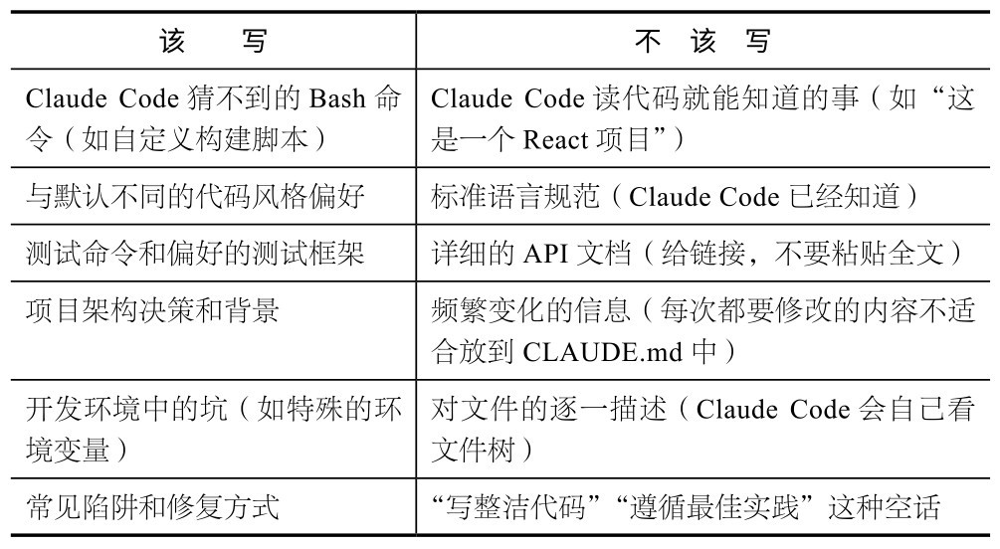
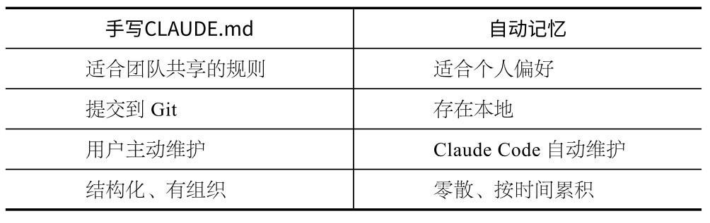

## 第5章 CLAUDE.md：给AI一张地图

Claude Code在每次对话开始时会自动读取CLAUDE.md。这个文件不是说明书，它更像一份契约。你和AI之间关于怎么干活的约定，就写在这个文件中。

我写公众号文章有一条规则：不用破折号。我把这条规则写进CLAUDE.md之后，Claude Code就会遵守。但有一次，长对话持续了快1小时，上下文被自动压缩——压缩时会丢掉早期的对话内容，包括CLAUDE.md注入的部分——Claude Code又开始疯狂使用破折号。我才意识到：对话内容会被压缩遗忘，但CLAUDE.md会在每次会话启动时被重新读取。

从那以后，我养成了一个习惯：把对Claude Code说过两次以上的要求都写进CLAUDE.md。半年下来，我的写作项目CLAUDE.md从空白文件变为一套完整的路由系统——根目录的CLAUDE.md负责分发任务到不同的子目录，每个子目录都有自己的规则文件。60多个skill、数百条规则，全是这样慢慢积累起来的。

### 5.1 为什么CLAUDE.md是最重要的文件

用Claude Code写代码，你会接触到很多配置文件，比如package. json、tsconfig.json、.eslintrc等，但有一个文件，比它们加起来都重要，那就是CLAUDE.md。

原因很简单：**每****次****启****动****新****会****话****时****，****C****l****a****u****d****e****C****o****d****e****做****的****第****一****件****事****就****是****读****取****C****L****A****U****D****E****.****m****d****文****件****。**Claude Code从文件中了解项目结构、代码风格、测试命令和常见陷阱等。没有这个文件，Claude Code就像空降到陌生代码库的新人，什么都得从头摸索；有了这个文件，Claude Code一进来就知道规矩。

Shrivu Shankar（Abnormal AI的AI战略副总裁，其团队每月消耗数十亿个词元进行代码生成）说得很直白：“在有效使用Claude Code时，代码库中最重要的文件就是根目录的CLAUDE.md。这个文件是智能体的‘宪法’，是智能体了解你的特定代码库如何工作的主要真相来源。”

他用了“宪法”这个词，以表示精练、原则性强、不处理细节。这个比喻很精确。

### 5.2 从“护栏”开始，别写“百科全书”

新手写CLAUDE.md时，最常犯的错是试图写一本“百科全书”：把每个函数的用法、每个文件的作用、每个API的参数都塞进去。

结果写了几千行，Claude Code光是读这个文件就占用大量上下文，真正干活的空间反而被挤小了。

Boris团队的CLAUDE.md只有大约2500个词元，大概100行。管理Claude Code的核心规则文件，就是这么精简。

Shrivu分享了一个更有意思的做法：“你的CLAUDE.md应该从小开始，基于Claude Code做错的事情来记录。不要试图预先写一本完整手册，而是每次Claude Code犯错，就加一条规则。”这就是“从‘护栏’开始”的意思。这个方法好在哪儿？规则文件永远精准，因为每条规则都对应一个真实陷阱。文件也可以保持精简，因为只记录了真正犯过的错。

Boris在他的使用技巧中还提到一个飞轮效应。

他进行代码审查时，甚至会在同事的PR中写入@.claude，让Claude Code自动把某条规则加到CLAUDE.md中。团队共享一个CLAUDE.md文件，提交给Git统一管理，每周都有人更新。**这****个****文****件****是****“****活****”****的****，****不****是****写****完****就****放****在****那****，****没****人****再****管****。**

Boris说过：“Claude Code非常擅长为自己编写规则。”你告诉它犯了什么错，它自己就能写出精确的规则，防止下次再犯。

### 5.3 CLAUDE.md中到底该写什么

这部分内容非常实用。判断标准就一条：**C****l****a****u****d****e****C****o****d****e****能****从****代****码****里****读****出****来****的****，****不****要****写****；****C****l****a****u****d****e****C****o****d****e****猜****不****到****的****，****必****须****写****。**

Shrivu补充了几个常见的反模式。

**用**@**引****用****大****文****档****。**在CLAUDE.md中@一个长文件，每次会话开始时，该文件都被完整嵌入，白白占用上下文。正确的做法是给出路径，告诉Claude Code在什么情况下去读，比如“遇到FooBarError时，参阅docs/troubleshooting.md了解故障排除步骤”。

**只****写****“****永****远****不****要****做****X****”****。**当Claude Code觉得必须做X时便会卡住。正确的做法是提供替代方案，比如“不要用--foo-bar标志，改用--baz”。

**把****C****L****A****U****D****E****.****m****d****当****作****简****化****代****码****库****的****强****制****函****数****。**如果某个CLI命令复杂到需要在CLAUDE.md中写几段话来解释，就说明这个命令本身需要简化。正确的做法是写一个Bash包装器，用清晰的API，然后只在CLAUDE.md中记录这个包装器。

### 5.4 结构设计：分层与组织

CLAUDE.md不只是一个文件，还是一套层级系统。Claude Code会自动按顺序读取多个位置的CLAUDE.md。

～/.claude/CLAUDE.md：全局级，所有项目共用的偏好。

�./CLAUDE.md：项目级，提交到Git统一管理，与团队共享。

�./src/CLAUDE.md：子目录级，monorepo中特定模块的规则。

�./src/api/CLAUDE.md：更深层子目录级。

**1****．****全****局****级****C****L****A****U****D****E****.****m****d**

用于存放你的通用偏好，比如优先用TypeScript、测试框架偏好Jest、commit message用英文等。这些规则在所有项目中生效，不需要为每个项目都写一遍。

**2****．****项****目****级****C****L****A****U****D****E****.****m****d**

用于存放项目特有的规则（如代码风格、架构约束、测试命令、常见陷阱等），并提交到Git统一管理，供团队成员共享。Boris团队就是这么做的。

**3****．****子****目****录****级****C****L****A****U****D****E****.****m****d**

在monorepo场景下，这一层特别有用。你可以在不同子目录中分别放置CLAUDE.md，例如前端目录存放前端的规则，后端目录存放后端的规则，互不干扰。当Claude Code进入某个目录时，会自动加载对应的CLAUDE.md。

另外，还有一个@引用语法，可以在CLAUDE.md中导入其他文件：

# CLAUDE.md

@docs/coding-standards.md

@docs/api-conventions.md

但是，需要注意前面说的：被@引用的文件会完整嵌入上下文。因此，只引用那些每次都真正需要的短文件。

### 5.5 一个优秀的CLAUDE.md示例

下面是一个简洁精练的项目级CLAUDE.md示例。

# MyApp

## 架构

- Next.js 15 + TypeScript + Tailwind CSS

- 数据库：PostgreSQL + Drizzle ORM

- 认证：Better Auth

- 状态管理：Zustand（不要用Redux）

## 开发命令

- 启动开发服务器：pnpm dev

- 跑测试：pnpm test（Jest + React Testing Library）

- 类型检查：pnpm typecheck

- Lint:pnpm lint

## 代码风格

- 组件用函数式，不用class

- 样式用Tailwind，不要写CSS文件

- 数据获取用server component，不用useEffect

- 错误处理用error.tsx边界，不用try-catch包裹组件

## 常见陷阱

- Drizzle迁移后必须运行pnpm db:generate，否则类型不同步

- 环境变量改了之后要重启dev server

- better-auth的会话检查在middleware中，不要在页面组件里重复检查

## 不要做

- 不要安装新依赖，除非我明确同意

- 不要修改drizzle.config.ts

- 不要在client component中直接调数据库

整个文件不到300字，但每一行都有价值：要么是Claude Code猜不到的命令，要么是自己踩坑后总结的经验。

**注****意**

不要直接复制这个示例。好的CLAUDE.md是从你自己的项目中“长出来”的。从空文件开始，Claude Code犯一次错就加一条。3个月后，那个文件就是你的“定制护栏”。

### 5.6 自动记忆：Claude Code“自己记住”的规则

除了手写的CLAUDE.md,Claude Code还内置了一套自动记忆机制。

当你在对话中纠正Claude Code的行为（如“以后commit message都用英文”“测试文件放在__tests__目录”）时，Claude Code会自动把这些偏好保存下来。下次对话时，Claude Code可以自动遵守，不需要你再说一遍，也不需要你手动写进CLAUDE.md。

这些自动记忆存储在～/.claude/projects/<项目>/memory/目录下，以MEMORY.md为入口文件，和CLAUDE.md并行工作。手写CLAUDE.md和自动记忆的区别如下。

两者配合使用效果最好：将团队规则写进项目CLAUDE.md，个人偏好则由自动记忆机制自动处理。

### 5.7 迭代飞轮：让Claude Code越用越好的方法

回到之前说过的飞轮效应。这不只是一个比喻，它就是Claude Code用户的真实体验曲线。

Mitchell Hashimoto（HashiCorp联合创始人，Terraform的创造者）描述过一模一样的过程。他为Ghostty搭建AI工作流时，配置文件里的每一行都对应智能体犯过的一次错。**文****件****是****“****活****”****的****，****一****直****在****“****生****长****”****。**这个过程大致分为4个阶段。

**1****.****第****1****周****：****空****文****件**

你只写了基本的项目架构和开发命令，规则几乎为空。Claude Code经常犯错，你需要不断纠正。

**2****.****第****2****周****：****护****栏****初****现**

你把Claude Code犯过的错一条条记下来，逐步形成规则，例如不要在这个文件里用相对路径、迁移后记得重新生成类型等。规则开始累积，错误率开始下降。

**3****.****第****1****个****月****：****飞****轮****启****动**

CLAUDE.md中有了20～30条规则，都是真实踩坑经验。Claude Code的输出质量明显提升，需要你纠正的次数越来越少。

**4****.****之****后****：****持****续****迭****代**

偶尔加入新规则，偶尔删除过时内容。文件保持精简但高度定制。

你把同样的方法迁移到新项目，启动速度越来越快。

这就是为什么说CLAUDE.md是最重要的文件：每一条规则背后都是真实踩坑的沉淀，每一次迭代都让Claude Code更懂你的项目。

**本****章****核****心**

CLAUDE.md从空文件开始，每踩一次坑、每纠正一次错误就加一条规则，并保持精简（Boris团队只用了约2500个词元），通过Git与团队共享。花3个月“养”出来的文件，是你最有价值的AI资产。

### 5.8 本章练习

**练****习****1****：****创****建****你****的****第****一****个****C****L****A****U****D****E****.****m****d****。**在任意项目目录下运行/init，打开生成的CLAUDE.md，加入3条你自己制定的规则，比如代码注释用中文、commit message用英文、文件命名用kebabcase，然后开启一个新对话，验证Claude Code是否遵守这些规则。

**练****习****2****：****测****试****遗****忘****。**在对话中告诉Claude Code一条规则（如“每次回复都用emoji开头”），然后对话10轮，看它是否还记得。把这条规则写进CLAUDE.md，然后开启新对话，感受对话记忆和CLAUDE.md记忆的区别。
