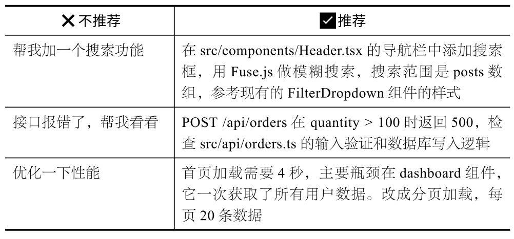
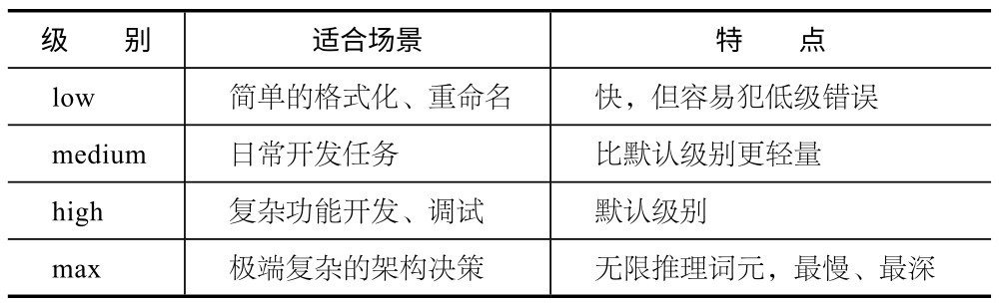

## 第6章 进阶对话技巧

Claude Code不是搜索引擎，你不需要精心雕琢关键词。但你跟它说话的方式，确实会影响输出质量。本章将要介绍的都是实战中真正管用的对话策略，不讲空泛的理论。

我曾告诉Claude Code:“帮我优化一下这个页面的样式。”本意只是调几处间距和字号，结果它把整个CSS文件重构了，还“顺手”加了一堆我没要求的改动，把我花一下午调好的排版全毁了。我又花了半小时才回退到之前的状态。

后来我吸取了教训。同样的需求，我改成：“把标题的font-size从16px改成18px，段落间距从10px改成14px，只改这两处，不要修改其他样式。”Claude Code仅用30秒就改完了。

区别在哪儿？不是Claude Code变聪明了，是我说话变清楚了。本章不会教你写花哨的提示词，而是教你怎么说话才能让Claude Code准确执行。

### 6.1 怎么说话，Claude Code才听得懂

很多人第一次用Claude Code时，会这样写：

帮我做一个用户管理系统。

Claude Code会做，但做出来的东西大概率不是你想要的，因为你给的信息太少，它只能靠猜。

根据官方最佳实践，我总结了4条实用原则。

(1) 具体化：指定文件、场景、偏好。

文件路径、技术选型和参考模式等越具体，Claude Code越知道该怎么执行，输出越精确。比如，不要说“做个登录功能”，要说“在src/auth/目录下新增Google OAuth登录功能，用Better Auth库，参考现有的GitHub登录实现方式”。

(2) 指向已有模式：“照着这个做”。

Claude Code读代码的能力极强，给它一个范本比写10行描述有效。比如，项目中有一个UserWidget写得很好，直接告诉Claude:“看src/components/UserWidget.tsx的实现方式，照着做一个CalendarWidget。”

(3) 描述症状，不要猜原因。

Claude Code能看到全部代码，让它自己定位原因比你猜测更靠谱。比如，遇到bug，不要说“凭证刷新逻辑有问题”（除非你确定），建议这样说：“用户在会话超时后登录失败，请检查src/auth/下的凭证刷新流程。”

(4) 克制，一次只做一件事。

若任务复杂，就分步来，每步确认结果后再进行下一步。在一条消息中塞入3个不相关的需求，Claude Code大概率只能做好其中一个。

我觉得一个好的心态是：把Claude Code当成一个非常聪明但刚入职的同事。虽然它的能力很强，但不了解项目的历史和惯例。你给的上下文越精准，它的产出越接近预期。同样的需求，说清楚与否，最终效果差距可能非常大。

### 6.2 上下文工程：信息不是越多越好

第11章将详细介绍harness工程的三层架构：prompt（提示词）、context（上下文）、harness（承载Claude Code运行的整个外部环境——CLAUDE.md、skill、hook、MCP、project结构都在这一层）。本节先介绍context。

context不只是你输入的指令，CLAUDE.md的内容、Claude Code读过的文件、你粘贴的截图、对话历史等都是context。

直觉上，你可能觉得给Claude Code的信息越多越好。

恰恰相反。

Anthropic工程团队发现，**上****下****文****太****多****，****模****型****表****现****反****而****变****差****。**它会在海量信息中迷失，做出混乱的决策。Shrivu建议定期用/context命令查看上下文窗口的使用情况。他在monorepo中测试过，一个新会话仅加载基础配置就占用约2万个词元，剩下18万个词元才是干活的空间。

**核****心****建****议**

上下文管理的核心原则：**不****是****给****所****有****信****息****，****而****是****给****对****的****信****息****。**让Claude Code看到解决当前问题需要的上下文，而不是整个项目的“百科全书”。

你可以通过以下几种方式主动管理上下文。

@**引****用****文****件****：**用@src/utils/auth.ts告诉Claude Code读取某个特定文件。

**粘****贴****截****图****：**对于UI问题，直接截图粘贴比用文字描述准确得多。

**P****i****p****e****数****据****：**使用管道命令（如cat error.log | claude），直接把文件内容传给Claude Code。

**给****U****R****L****:**Claude Code可以读取网页内容，直接给它API文档的链接比复制和粘贴具体内容更好。

### 6.3 让Claude Code采访你

当你要做一个比较复杂的功能（如从零搭建一个支付系统）时，不要一上来就写需求文档，可以先对Claude Code说：

我想做一个支付功能，在动手之前，先采访我，问清楚你需要知道的所有事情。

Claude Code会问你一系列问题：支持哪些支付方式？需要处理退款吗？预估并发量为多少？需要支持webhook回调吗？用什么货币？

在这些问题中，至少有一半是你没考虑过的。Claude Code相当于做了需求分析师的工作。

采访结束后，让Claude Code把答案整理成一份规格文档。然后，就是关键操作了：**开****启****一****个****全****新****的****会****话****，**把规格文档提供给Claude Code，让它执行。

为什么要开启新会话？因为采访过程中积累了很长的对话历史，占用了大量上下文。新会话从一份干净的规格文档开始，Claude Code能更专注地执行，不会被讨论过程干扰。

### 6.4 把Claude Code当作代码库的资深向导

很多人只把Claude Code当作写代码的工具，其实它还是一位极好的代码库导航员。

你可以直接问它：

�“项目里的logging是怎么工作的？”

�“怎么新建一个API endpoint?”

�“这个useAuth hook的调用链是什么？”

�“src/lib/db.ts和src/utils/database.ts有什么区别？为什么有两个？”

……

Claude Code会读相关代码，然后给你一个结构化的解释。这比读文档快，比问同事方便，尤其是刚接手一个新项目的时候。

Boris团队的人就是这么做的。新成员加入后，不是先读一堆wiki文档，而是直接问Claude Code。它对代码库的理解往往比过时的文档更准确。

**核****心****建****议**

加入一个新项目后，先花10分钟问Claude Code：这个项目的架构是什么？核心模块有哪些？数据流是怎么样的？你会省下翻文档的时间。

### 6.5 多轮对话策略：如何在对话中持续推进任务

你与Claude Code的对话通常不是一次性的，而是一个**多****轮****迭****代****的****过****程****。**复杂任务往往需要在多轮对话中逐步推进。这里介绍几个经过实战验证的策略。

**1****．****紧****密****反****馈****循****环**

别等Claude Code写完500行代码再看结果。**发****现****方****向****偏****了****，****立****刻****纠****正****。**越早纠正，成本越低。Claude Code写了10行代码时你说“不对，换个方式”，成本几乎为零；等实现完整功能再推倒重来，浪费的是大量词元和时间。

**2****．****纠****正****两****次****还****不****行****，****换****条****路**

纠正了两次，Claude Code还是没有理解你的意思？那就别再继续纠正了。使用/clear命令清理上下文，用一个更好的初始提示词重新开始。在一个已经跑偏的对话中纠缠，往往越绕越远。

**3****．****换****任****务****就****清****理****上****下****文**

写完一个组件后，要修改数据库schema，这时可以使用/clear命令。不同的任务有不同的上下文需求，把前一个任务的对话历史带进新任务只会增加噪声。Shrivu推荐的做法是：使用/clear命令清理上下文之后，运行一个自定义的/catchup命令，让Claude Code读取当前Git分支中的变更来恢复上下文。

**4****．****用****s****u****b****a****g****e****n****t****做****调****研**

有时，你需要Claude Code先调研再动手，比如“看看这个库怎么用”“分析一下竞品的实现方式”。这些调研任务可以用subagent来做，调研结果返回主会话，中间的思考过程不会污染主上下文。

**注****意**

Shrivu特别提醒：不要依赖/compact（自动压缩）。它的处理过程不透明且容易出错。需要重新开启对话时，优先用/clear，不要用/compact。

### 6.6 effort级别：控制Claude Code的“思考深度”

Claude Code有4个effort级别——low、medium、high、max，用于控制Claude Code执行任务时投入多少推理资源。

high是默认级别，Boris的做法是从不把级别调低，理由和他坚持用Opus一样：Claude Code想得更深，需要返工的次数更少，总体效率反而更高。

很多人觉得，对于简单任务，调到low级别可以节省时间。但是，Claude Code在low级别容易出错，一旦做错，纠正它所花的时间，可能比直接用high级别做对还要长。

**核****心****建****议**

如果你用的是Max付费方案，high就是默认级别，不需要额外调整。别为了节省几秒而把effort的级别调低，修改低级错误花的时间远不止几秒。

**本****章****核****心**

好的对话靠的不是花哨的提示词，而是精准的上下文：具体化需求、让Claude Code采访你来补盲点、用/clear命令保持干净、别把effort的级别调低。说到底，最有效的进阶方法是在实践中积累与Claude Code协作的直觉，而不是学更多提示词技巧。

### 6.7 本章练习

**练****习****1****：****同****一****个****需****求****，****两****种****说****法****。**先用模糊的方式描述一个需求（如“帮我改一下这个页面”），记录Claude Code的行为。然后用具体的方式描述同一个需求（如“把index.html第15行的标题从h2改为h1，字号改为24px”），对比两次的输出质量和你的满意度。

**练****习****2****：****试****试****用**@**引****用****文****件****。**在对话中输入@，然后选择一个文件，问Claude Claude:“这个文件是干什么的，有哪些地方可以改进？”体验主动给Claude Claude上下文和让它自己找的区别。
