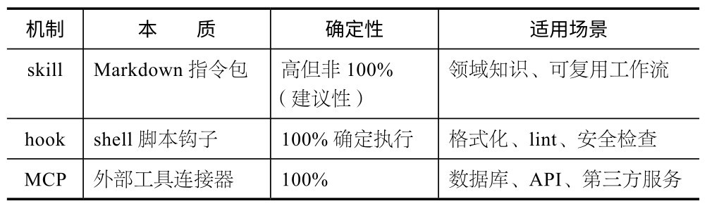
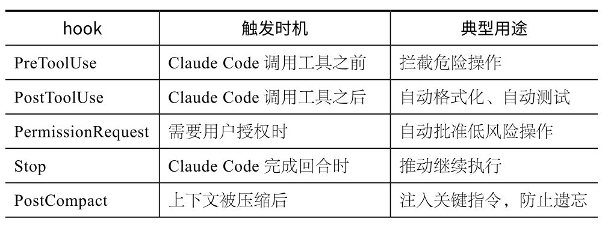
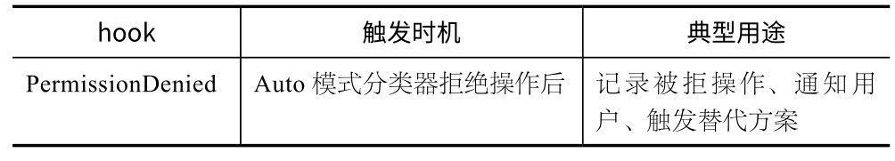
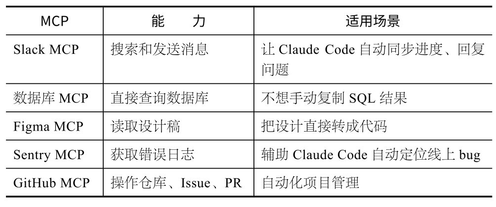
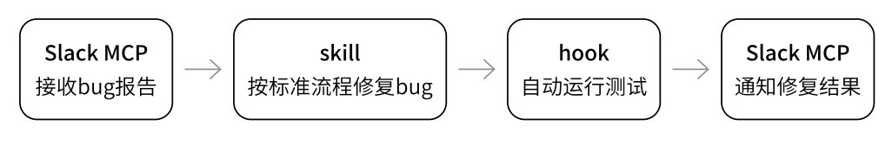
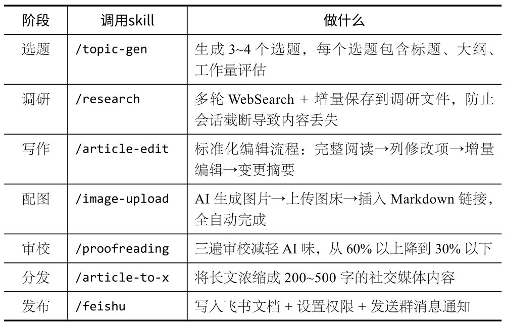

## 第7章 扩展能力：skill、hook与MCP

用久了你会发现，Claude Code的真正价值不是它本身有多强，而是它的扩展能力。skill、hook与MCP这3种扩展机制，让Claude Code从一个终端工具变成一个可以无限生长的工作台。

### 7.1 为什么需要扩展能力

我一开始以为，安装好Claude Code直接使用就行。后来发现自己总在进行重复操作：每次提交代码前都要提醒先进行lint检查，每次新建组件都要交代一遍项目规范，每次查数据都要手动复制SQL结果并粘贴给Claude Code……

通常，重复操作一旦超过3次，就该想办法自动化了。Claude Code提供了3种扩展机制，分别解决不同层面的问题。



三者与Claude Code的关系可以简单理解为：**s****k****i****l****l****教****C****l****a****u****d****e****C****o****d****e****怎****么****做****事****，****h****o****o****k****在****关****键****节****点****自****动****执****行****检****查****，****M****C****P****把****外****面****的****世****界****接****进****来****。**我个人用得最多的是skill，几乎每天都在增加新的。

### 7.2 skill：最值得优先掌握

skill是最容易上手的扩展机制，其原理极其简单：在．claude/skills/目录下创建一个文件夹，在其中存放一个SKILL.md文件，Claude Code就会根据上下文自动加载该文件中的指令。

.claude/skills/

├── react-component/

│　└──SKILL.md　　#创建React组件的规范和步骤

├── fix-issue/

│　└──SKILL.md　　#修复bug的标准流程

└── deploy-preview/

└──SKILL.md　　#部署预览环境的步骤

通过/skill-name命令可以手动调用某个skill,Claude Code也会根据对话内容自动判断是否加载相应的skill。比如，你说：“帮我创建一个新的React组件。”Claude Code就会自动加载reactcomponent skill中的规范。

### 7.2.1 两种类型的skill

**知****识****型****s****k****i****l****l****：**告诉Claude Code“这个项目里的事情应该怎么做”，比如API规范、编码风格、项目约定。这类skill更像文档，Claude Code读完会按其中的规则办事。

**工****作****流****型****s****k****i****l****l****：**告诉Claude Code“遇到特定任务按什么步骤执行”，比如/fix-issue（修复bug的标准流程）、/review-pr （代码审查流程）。这类skill更像SOP（标准操作流程），有明确的步骤和检查点。

Boris有一个实用的判断标准：**如****果****一****件****事****你****每****天****做****超****过****一****次****，****就****应****该****把****它****变****成****s****k****i****l****l****或****c****o****m****m****a****n****d****（**自定义快捷命令，常被称为“斜杠命令”）。我自己更激进一点，只要发现一件事在不同的任务中出现过两次，就将其写成skill。

**实****际****案****例****：****创****建****/****t****e****c****h****d****e****b****t****命****令**

把“发现技术债→评估影响→创建Issue→关联到Sprint”这个流程写成skill，以后若发现技术债，直接输入/techdebt,Claude Code会自动走完整个流程，包括评估优先级、创建GitHub Issue、加上正确的标签。

### 7.2.2 工作流型skill的关键配置：禁止自动触发

工作流型skill通常会执行有副作用的操作（如创建Issue、发消息、部署）。为了防止Claude Code在不合适的时候自动触发这类skill，可以在SKILL.md的front matter中加一行：

---

disable-model-invocation: true

---

添加这个配置后，skill只能通过/skill-name命令手动调用，Claude Code不能自作主张地触发。

### 7.2.3 安装别人的skill

skill可以共享。Boris公开了他常用的skill集合。你不需要记住具体地址，可以直接告诉Claude Code:“帮我安装Boris的skill集合。”它就会自动找到对应的公开仓库，把SKILL.md下载到本地的～/.claude/skills/boris/目录下。

安装后，你就拥有了Boris日常使用的工作流，包括他的commit规范、PR模板、代码审查标准等。社区也在不断贡献新的skill，你可以在Claude Code中通过/plugin命令浏览。

**核****心****建****议**

写skill的最佳实践：从常对Claude Code说的那句话开始。比如，你总是在提交前说：“先进行测试，再格式化代码，然后提交。”这就是一个skill的雏形。把这些步骤写进SKILL.md，以后只需输入一个斜杠命令就可以搞定整个流程。

### 7.3 hook：不是建议，是强制执行

skill有一个天然的局限：它本质上是对Claude Code的“建议”。Claude Code会尽量遵守，但遵从率不是100%，尤其是在长对话的后期，它可能就忘了。skill在大多数场景下够用，但有时你需要100%的确定性。比如我曾经踩过一个坑：在CLAUDE.md中写了“每次编辑文件后运行eslint进行格式化”，前几轮对话都正常，但随着对话的推进，上下文被压缩，这条规则失效了。

hook就是为了解决这个问题。

**1****.****h****o****o****k****与****C****L****A****U****D****E****.****m****d****的****本****质****区****别**

**C****L****A****U****D****E****.****m****d****是****建****议****，****h****o****o****k****是****强****制****执****行****。**CLAUDE.md通过自然语言影响Claude Code的行为；hook是Claude Code平台层面的机制，在特定的生命周期节点触发shell脚本，Claude Code无法跳过或忽略。

**2****．****生****命****周****期****h****o****o****k**

hook支持多个触发时机。





**3****．****实****用****案****例**

**案****例****1****：****自****动****格****式****化****。**每次编辑文件后自动运行eslint，不依赖Claude Code“记住”进行格式化。

// .claude/settings.json

{

"hooks": {

"PostToolUse": [

{

"matcher": "Edit|Write",

"command": "npx eslint --fix $CLAUDE_FILE_PATH"

}

]

}

}

**案****例****2****：****自****动****批****准****低****风****险****操****作****。**用PermissionRequest hook把权限请求路由到一个脚本，由脚本判断操作类型，低风险操作（如读文件、运行测试）自动批准，高风险操作（如删除文件、推送代码）需要人工确认。

**案****例****3****：****上****下****文****压****缩****后****注****入****关****键****指****令****。**在长对话中，Claude Code会压缩上下文以节省词元。压缩后，早期的一些重要指令可能丢失。PostCompact hook可以在压缩发生后自动把关键规则重新注入，确保Claude Code不会“失忆”。

**案****例****4****：****推****动****C****l****a****u****d****e****C****o****d****e****继****续****。**Claude Code有时会在一个复杂任务中途停下来问“要继续吗？”。Stop hook可以检测这种情况，自动让Claude Code继续执行，适合无人值守的批处理场景。

**核****心****建****议**

你不需要自己从零开始写hook。比如，直接告诉Claude Code:“帮我写一个hook，每次编辑文件后自动运行eslint。”它会帮你生成配置并写入．claude/settings.json文件。

### 7.4 MCP：让Claude Code看到外面的世界

skill教Claude Code知识，hook保证执行的确定性，但它们都在Claude Code的内部世界运作。如果你想让Claude Code直接查数据库、调用API、读取设计稿，就需要MCP。

MCP是Anthropic推出的开放标准，能让AI工具连接外部数据源和服务。你可以把它想象成Claude Code的USB接口：插上不同的MCP服务器，Claude Code就获得了相应的能力。

**1****．****添****加****M****C****P****服****务****器**

添加MCP服务器的代码如下：

# 添加一个MCP服务器

claude mcp add slack -- npx -y @modelcontextprotocol/

server-slack

# 查看已安装的MCP

claude mcp list

添加后，MCP服务器的能力会以“工具”的形式提供给Claude Code。比如安装了Slack MCP后，Claude Code就可以搜索Slack消息、发送消息、创建频道。

**2****．****实****用****M****C****P****推****荐**

下表推荐了几个实用的MCP。



Boris有一个经典用法：他给Claude Code接上Slack MCP，当有人在Slack里报告bug时，Claude Code会自动读取bug描述、找到相关代码、尝试修复、提交PR，然后在Slack里回复“已修复， PR链接在这里”。整个过程不需要人工介入。

**3****.****M****C****P****的****配****置****文****件**

MCP的配置文件存在项目根目录的．mcp.json中，可以跟代码一起提交到Git仓库，这样团队成员克隆项目后，就自动获得相同的MCP配置。.mcp.json文件的内容如下：

// .mcp.json

{

"mcpServers": {

"slack": {

"command": "npx",

"args": ["-y", "@modelcontextprotocol/server-slack"],

"env": {

"SLACK_TOKEN": "${SLACK_TOKEN}"

}

},

"postgres": {

"command": "npx",

"args": ["-y", "@modelcontextprotocol/server-postgres","${DATABASE_URL}"]

}

}

}

MCP服务器会获得对外部服务的访问权限。在添加新的MCP前，必须确认你了解它会访问哪些数据。需要注意的是，不要将敏感凭证硬编码在．mcp.json里，而应通过环境变量引用。

### 7.5 plugin：打包好的扩展包

skill、hook、MCP可以各自独立使用，但组合起来更强大，而plugin就是这种组合的打包形式。

在Claude Code中输入/plugin，即可浏览一个不断增长的插件市场。每个plugin可能包含skill、hook、agents、MCP配置中的一种或多种，一键安装即可全部配置好。

比如一个“代码智能”plugin，可能同时包含以下内容。

一个skill：告诉Claude Code如何利用符号导航理解代码结构。

一个hook：编辑后自动运行类型检查。

一个MCP：连接语言服务器，获取精确的符号信息。

三者配合使用，可以让Claude Code在理解和修改代码时更准确，而你只需要进行一次安装。

### 7.6 command：带预计算的快捷入口

除了可以用/skill-name调用skill，还有一种更灵活的方式：command，即斜杠命令。

command在．claude/commands/目录中。与skill不同的是，command可以包含内联的bash脚本来预计算信息。在Claude Code读取提示词之前，command先运行一些shell命令，把结果嵌入。

下面这段command 配置实现的是在每次提交代码前，自动把当前git diff的内容嵌入提示词，让 Claude Code 一并审查。这是预计算的典型用法。

# .claude/commands/commit-push-pr.md

帮我完成以下操作：

1.查看当前的git diff：

```bash

git diff --stat

```

2.生成commit message并提交

3.推送到远程分支

4.创建PR，标题基于commit内容

注意：PR描述要包含变更摘要。

输入/commit-push-pr后，Claude Code就会按照以上流程自动执行。由于command文件在．claude/commands/中，会随Git一起提交，因此团队成员都能用。

**s****k****i****l****l****与****c****o****m****m****a****n****d****选****择****指****南**

两者有重叠，但定位不同。skill更像“知识和能力”,Claude Code根据上下文自动应用或手动调用；command更像“宏”，包含预计算步骤，强调执行流程。

经验法则：如果需要Claude Code“知道什么”，用skill；如果需要Claude Code“做一连串事情”，用command。

### 7.7 3种扩展机制的协作

在实际项目中，3种机制经常协同工作。下面是一个完整的例子。

假设你的团队有这样一个工作流：收到bug报告→定位问题→修复→测试→提交PR→通知相关人员。3种机制的协作如下。



**M****C****P****（**Slack MCP）让Claude Code接收bug报告并能回复修复结果。

**s****k****i****l****l****（**fix-issue）指导Claude Code按标准流程定位和修复问题。

**h****o****o****k****（**PostToolUse）确保每次修改后都自动进行测试和格式化。

单独使用任何一种扩展能力都有价值，但将它们组合起来，就能形成一条完整的自动化bug修复流水线。

### 7.8 花叔的skill实战：从0到60多个skill的过程

说了这么多机制，分享一下我自己的实际用法。目前，我在Claude Code中安装了超过60个skill，覆盖内容创作、电子书写作、视频制作、项目管理等场景。这些skill并不是一次性安装的，而是在半年里一个一个被需求“逼”出来的。

**1****．****第****一****个****s****k****i****l****l****：****三****遍****审****校**

最早让我意识到“该写skill了”的场景是文章审校。我写完文章后，总要对Claude Code说一大段话：“帮我减轻AI味，不要用破折号，不要用‘说白了’这类套话，检查有没有虚假数据，每段都过一遍……”每写完一篇文章都要重复一遍，有时候还会漏几条。

于是，我写了第一个skill:huashu-proofreading。

# SKILL.md核心结构（简化）

三遍审校流程：

第一遍：内容事实核查

- 所有数据、日期、产品名是否准确

- 有没有编造的内容

第二遍：减轻AI味

- 检查六大类AI腔：破折号过多、排比三连、假设性开头……

- 花叔的禁用词：说白了、简单来说、换句话说……

第三遍：风格打磨

- 引号规范

- 加粗标记重点（每篇约10处）

- 检查段落紧凑度

写完这个skill后，审校从每次需要15分钟的口述，变成用一个/proofreading命令就能搞定。更重要的是，规则不会因为上下文压缩而丢失。

**2****.****从****单****点****优****化****，****到****整****条****创****作****链**

尝到甜头后，我开始把所有重复流程都“skill化”。半年下来，形成了一个覆盖完整内容创作链的skill体系。



一篇文章的完整生命周期，从选题到发布，全部有对应的skill。每个skill的背后都是我从踩过的坑中淬炼出的规则。

**3****．****最****意****外****的****用****途****：****写****作****+****视****频****脚****本****流****水****线**

我有一个名为huashu-book-pdf的skill，负责“橙皮书”的全流程：调研→章节规划→多智能体并行写作→HTML片段构建→EPUB生成→微信读书上架。这个skill把一本电子书的生产流程压缩到仅需几小时。

更有意思的是视频方向的skill。huashu-video-director可以从创意开始，经过角色设定、分镜设计、提示词生成，调用AI视频生成模型完成多镜头视频。huashu-script-polish做的事更细：把书面化的脚本改成适合直接说出来的口语化脚本，并进行三轮审校，确保“像人在说话”。

**4****.****s****k****i****l****l****不****是****给****你****的****，****是****给****A****I****用****的**

这里有一个思维转变值得说清楚。

很多人的第一反应是：“skill就是一个SOP文档嘛，我自己看着执行也一样。”从技术上讲，这没错，但抓错了重点。

skill的读者不是你，而是AI。skill的措辞、结构、检查点，都是为了让Claude Code更好地执行而优化的。人看文档可能会“跳着看”,AI则会逐字逐句地看。人容易忘记边界条件，AI不会。人执行SOP依靠意志力，AI不需要。

我的一些skill包含2000多行指令。如果我自己执行这些步骤，每写一篇文章，可能要花3～4小时在流程操作上。使用skill之后，我的时间几乎都花在真正需要判断力的地方：选题好不好、论点立不立得住、读者看完能不能立刻执行……

目前，越来越多的第三方工具在发布当天就提供面向Claude Code的skill。比如LibTV在上线第一天就发布了相应的skill，用户不用学习新界面，可以直接在终端生成视频。飞书、钉钉等企业平台也相继推出CLI。这意味着skill生态越来越丰富，你可能很快就能用一行/xxx命令完成现在需要打开5个App才能完成的事情。

**核****心****建****议**

不要一开始就试图搭建一套完整的扩展体系。从你最不想再做的那个重复操作开始：总在口述规则？写个skill。总忘记进行lint检查？加个hook。总在手动倒腾数据？接个MCP。一个一个地添加，慢慢地，你的Claude Code就会变成一个为你量身定制的工作台。

### 7.9 本章练习

**练****习****1****：****编****写****你****的****第****一****个****s****k****i****l****l****。**想一句你每天都对Claude Code重复说的话（如“帮我把这个Markdown文件格式化，标题用##，列表用-”），把它写成规则，保存到．claude/skills/format/SKILL.md中，然后用/format命令调用。

**练****习****2****：****添****加****一****个****M****C****P****。**运行claude mcp add，添加任意一个MCP服务器（推荐从文件系统MCP开始），然后让Claude Code通过MCP读取指定路径的文件，感受Claude Code从“只能看当前目录”到“能看任何地方”的变化。
