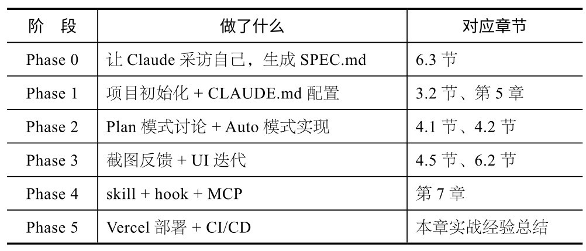
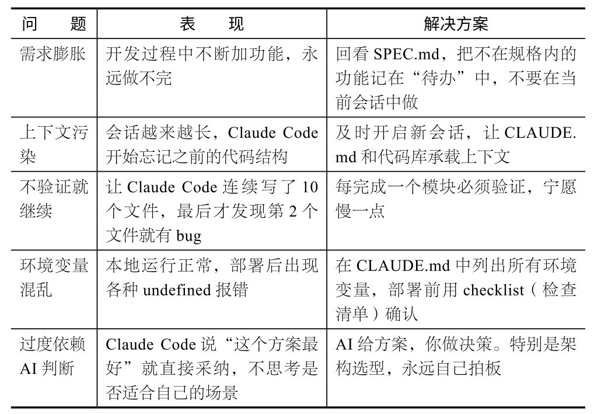

## 第9章 从零开始构建一个完整产品

前8章讲“零件”，本章将介绍“组装”，即用一个真实项目把前面的知识串起来。你会发现，Claude Code真正的威力不在于某个单一功能，而在于多个功能组合之后产生的化学反应。

央视新闻频道采访我的那天，记者问我能不能现场“手搓”一个App。我打开终端，启动Claude Code，只用了10分钟就做出一个能正常运行的小产品。摄像机全程对着我的屏幕拍摄。后来，有人在B站评论区说：“10分钟做出来的东西能叫产品吗？”说实话，不能。10分钟做出来的只是一个能运行的原型。从原型到产品，中间还有大量工作：用户反馈处理、边界情况覆盖、性能优化、上架审核。我用大约1小时做出“小猫补光灯”，免费上架后积累了一些反馈。两个月后，我把核心需求重新打磨了一遍，做出“小猫补光灯Pro”，上架仅两天就冲上App Store付费榜第一。从第一版到Pro版，我没有大改技术栈，只是把“产品边界”想得更清楚了。

本章将要讲的就是“从原型到产品”的完整过程，最终做出一个能交付、能使用、能迭代的真实产品——AI周报助手。

### 9.1 为什么以“AI周报助手”为例

选这个项目我想了一会儿。好的教学案例需要满足几个条件：真实有用（不是做完就再也不会打开的产品）、复杂度适中（半天到一天就能完成，但涉及前后端、API和AI调用）、技术栈匹配（Next.js和Tailwind CSS是Claude Code最擅长的组合）。

“AI周报助手”做的事情简单直接：连接GitHub，获取本周所有提交记录，用AI总结成一份可读的周报，支持一键分享给同事。这是很多工程师每周五要做的事情，通常会花半小时，我们要把它缩短到10秒。

这个项目会用到前面几乎所有章节的内容，不过你不需要全记住，跟着做就行。

### 9.2 Phase 0：先别急着写代码

我一开始做产品时犯过一个错：想到什么就立刻让Claude Code开始写代码，结果做到一半发现需求没想清楚，只能推翻重来。

后来我养成了一个习惯：先让Claude Code采访我。

Claude，我想开发一个周报工具。在写代码之前，请先通过采访我了解需求。请逐一询问关于目标用户、核心功能和技术限制等方面的问题。

Claude会像产品经理一样采访你。

目标用户是谁？（是个人开发者，还是团队？）

核心功能有哪些？（只需生成周报，还是需要分享？）

技术偏好如何？（部署到哪里？用什么框架？）

有没有设计参考？（周报长什么样？）

回答完这些问题后，你可以让Claude把结论整理成一份规格文档：

根据我们之前的讨论，请创建一个SPEC.md 文件，在其中记录所有需求、用户故事以及技术决策。

SPEC.md文档是整个项目的锚点。后续所有开发都围绕它展开。

**新****会****话****，****干****净****的****开****始**

需求分析是对话密集的过程，会消耗大量上下文窗口。在确认完SPEC.md后，开启一个新会话开始开发。新会话会自动读取SPEC.md和CLAUDE.md，拥有干净的上下文空间来写代码。

### 9.3 Phase 1：项目初始化

用一句话创建项目骨架：

创建一个名为weekly-report的Next.js项目，并配置Tailwind CSS。按照SPEC.md中的需求搭建基础目录结构。请使用TypeScript，并配置好ESLint。

Claude Code会执行一连串操作：运行npx create-next-app、安装依赖、配置Tailwind CSS、创建基础目录结构。你在终端看到的是它自动执行的每一条命令和创建的每一个文件。

项目创建完成后，文件结构大致如下：

weekly-report/

├── app/

│ ├── layout.tsx

│ ├── page.tsx

│ ├── api/

│ │ ├── github/route.ts

│ │ ├── summarize/route.ts

│ │ └── auth/[...nextauth]/route.ts

│ └── report/[id]/page.tsx

├── components/

├── lib/

├── CLAUDE.md

├── SPEC.md

├── tailwind.config.ts

└── package.json

接下来是非常关键的一步——配置CLAUDE.md。这是第5章的核心内容，现在进行实战：

# CLAUDE.md

## 项目概述

AI驱动的周报生成器。连接GitHub，通过AI总结提交记录，生成可分享的周报页面。

## 技术栈

- Next.js 15 (App Router) + TypeScript

- Tailwind CSS样式

- NextAuth.js实现GitHub OAuth

- Claude API（通过Anthropic SDK）实现总结功能

## 代码规范

- 默认使用服务端组件，仅在必要时使用’use client'

- API路由统一存放在app/api/目录下，使用Route Handlers

- 优先使用具名导出

- 异常处理：API路由中始终使用try-catch

## 测试要求

- 提交前运行npm run lint

- 构建UI前，先用curl测试API路由

有了这份CLAUDE.md，后续每次开启新会话时，Claude Code都能够了解这个项目的技术决策和代码规范，不需要你重复说明。

### 9.4 Phase 2：正式开发（最耗时但也最有成就感的部分）

到这里才真正开始写代码。我一般会先用Plan模式与Claude Code讨论一下架构，不急于动手。在终端输入/plan切换到Plan模式，然后输入以下提示词：

我需要实现核心流程：GitHub OAuth登录 → 获取本周提交记录 → 发送给Claude API进行总结 → 生成报告展示。在编写代码之前，让我们先讨论一下具体的架构设计。

Claude Code会给出一个完整的技术方案：API路由如何设计、数据流怎么走、组件怎么拆分。你可以在这个阶段提出疑问、调整方案。这就像与一位高级工程师在白板前讨论。

确认方案后，退出Plan模式，让Claude Code开始实现：

方案没问题，现在逐步实现它。先从GitHub OAuth开始，然后是提交记录获取API，最后是AI总结功能。

Claude Code会按照讨论好的方案，逐步创建文件、写代码、安装必要的依赖包。你会看到它先在终端创建app/api/auth/[...nextauth]/route.ts（配置NextAuth），再创建lib/github.ts（封装GitHub API调用），然后创建app/api/summarize/route.ts（接入Claude API）。

每完成一个模块，进行一次验证。

(1) GitHub OAuth。运行npm run dev，打开浏览器，单击登录按钮，看能不能跳转到GitHub授权页面。如果报错，把错误信息粘贴给Claude Code，它会自己修正。

(2) 提交记录获取API。登录成功后，用curl测试API路由：curl localhost:3000/api/github，看返回的提交记录数据是否正确。

(3) AI总结生成。使用真实的提交记录数据调用总结接口，检查AI生成的周报内容是否合理、是否有幻觉。

**注****意**

每完成一步就立即验证，这是我踩过无数坑之后总结出来的最重要的经验。不要等Claude Code写完所有代码再测试。越早发现问题，越容易修正。我曾经让Claude Code连续写了8个文件，最后才发现第2个文件的API路由写错了，导致后续工作几乎全部作废。

### 9.5 Phase 3：美化界面

功能已经实现，但界面很可能不美观，这很正常。我做产品时，通常先确保功能正常，再看是否美观。

Claude Code支持图片输入。美化界面最直接的方式是给Claude Code一张截图，并提出修改要求：

这是当前报告页面的截图。

[粘贴截图]

存在的问题：1) 页眉（Header）太拥挤；2) 提交列表的间距需要优化；3) 请在右上角添加一个分享按钮。

Claude Code会看到截图，理解当前的视觉问题，然后精准地修改对应的CSS和组件代码。

这种“截图→反馈→修改”循环非常高效。在传统开发中，你需要在设计稿和代码之间反复对照；现在，你只需要截图、说问题、等修改好。

几轮迭代后，继续打磨响应式设计：

请在移动端视口（宽度：375像素）下测试报告页面，修复所有布局问题。分享按钮在移动端应为全宽显示。

Claude Code会自己调整浏览器视口大小（如果你用了VS Code集成），或者直接修改Tailwind CSS的响应式类名。

**核****心****建****议**

UI打磨阶段最高效的做法是：把所有问题列出来，让Claude Code批量修改，而不是改一个看一个。批量反馈能让Claude Code更好地理解整体设计意图。

### 9.6 Phase 4：扩展能力实战

产品的核心功能已经实现。现在进入第7章内容的实战环节：为项目添加skill、hook和MCP。

**1****．****创****建****一****个****s****k****i****l****l**

每次生成周报都要打开项目并执行一系列操作，能不能用一句话搞定？当然可以，用skill就能实现。

在项目根目录创建．claude/skills/generate-report/SKILL.md：

# /weekly-report

生成本周报告。

## 步骤

1.如果开发服务器未运行，先启动它

2.调用/api/github获取周一以来的所有提交记录

3.调用/api/summarize生成周报

4.在浏览器中打开周报页面

5.显示可分享的周报链接

配置完成后，输入/weekly-report,Claude Code会自动执行以上所有步骤。只需一条命令，10秒即可生成周报。这就是skill的威力：把重复流程变成一键操作。

**2****．****设****置****h****o****o****k**

你可以要求Claude Code在每次提交代码前，自动运行lint检查：

设置一个pre-commit hook，在提交前运行ESLint和TypeScript类型检查。如果发现错误，在提交前自动修复。

这样，Claude Code每次执行git commit时，都会先确保代码质量。这是hook的典型用法：在关键节点注入自动检查。

**3****．****添****加****M****C****P**

周报生成后，手动发到Slack频道太麻烦。你可以用MCP把两者打通：

添加一个Slack MCP服务器，使生成的周报可以自动发布到#teamupdates频道。使用Slack Web API，并通过bot token进行认证。

Claude Code会帮你配置MCP服务器，并在．claude/mcp.json中注册Slack连接。配置完成后，你可以在/weekly-report skill中加上最后一步：把周报内容发送到Slack。

### 9.7 Phase 5：部署上线

如果想让其他人使用你的产品，可以将其部署上线：

将该项目部署到Vercel。配置GitHub OAuth、Claude API key 和Slack bot token的环境变量。同时，创建一个 GitHub Actions工作流，在每个PR上运行lint和类型检查。

Claude Code会执行部署命令、配置环境变量、创建CI/CD配置文件。整个过程你不需要打开Vercel的dashboard，也不需要手写GitHub Actions的YAML。

部署完成后，你会得到一个URL。在浏览器中打开，走一遍完整流程：登录→获取提交记录→生成周报→分享，验证是否一切正常。

如果你的团队也在用Claude Code，还可以加上一个额外步骤：

在GitHub仓库中添加一个Claude Code Action，用于自动审查PR的代码质量并检测潜在bug。

这样，每当有人提交PR时，Claude Code就会自动进行代码审查，并在PR中留下评论。CI/CD的完整闭环就建立起来了。

### 9.8 项目复盘：这个项目用到的技术

回头看看，我们都做了什么。一个完整的Web应用，从想法到上线，全部在终端完成。

如果全程比较顺利，整个过程可能需要5～8小时。如果进展不顺利，耗费一天也很正常。最耗时的是Phase 2（核心功能开发）:OAuth配置和API调试需要反复验证，环境变量、回调URL等琐碎的配置项，每一项都可能耗费十几分钟来调整。

同样的项目，如果纯手写呢？一个熟悉Next.js和OAuth的全栈工程师可能需要2～3天；不太熟悉的话可能需要一周。差距不只是速度，更重要的是：你在整个过程中做的是产品决策而不是代码实现。你在思考周报应该包含哪些信息、分享页面是否需要登录等产品问题，而不是在Stack Overflow上查“NextAuth.js GitHub provider怎么配置”。

### 9.9 实战经验总结

“小猫补光灯Pro”冲到App Store付费榜第一的时候，很多人问我是不是有一个开发团队。答案是没有。从第一行代码到上架审核，全都是由AI完成的，我从未手写过代码。但这并不意味着开发过程很轻松。恰恰相反，我踩过很多坑，也总结出几条核心经验。

**1****．****需****求****拆****小****，****每****次****只****做****一****步**

新手最常见的做法是：兴奋地把整个产品需求一股脑地甩给Claude Code:“帮我做一个完整的✕✕应用，需要实现登录、数据库存储、支付、推送、分享……”Claude Code确实会开始做，但最终产出往往一团乱。

我

**推****荐**

**这****样****给****需****求****：**

先实现GitHub OAuth登录。登录成功后在页面中显示用户名和头像。

**验****证****通****过****后****：**

现

**不****推****荐**

**这****样****给****需****求****：**

做一个周报工具，需要实现GitHub登录、获取提交记录、利用AI总结、有漂亮的UI、支持分享功能、发送Slack通知、可部署到Vercel。

**2****．****先****实****现****最****小****功****能****，****再****一****步****步****加**

这条经验和上一条有关，但侧重点不一样。需求拆小是关于怎么给Claude Code下指令的，这一条是关于产品策略的。

“小猫补光灯”第一版只有一个功能：打开App，屏幕变白，亮度拉满。就这么简单。我用它自拍了一张，确认补光效果还可以，才开始添加色温调节、亮度滑块、定时拍照等功能。

开发其他产品也一样：先做一个能运行的最简版本，自己用两天，发现真正需求后再添加新功能。你想象的功能和实际需要的功能往往差异很大。

**3****．****验****证****比****开****发****更****重****要**

我反复强调这一点。Claude Code写代码的速度很快，快到可能让你产生一种幻觉：它写得这么快，应该是对的吧？

不一定。AI生成的代码同样需要验证，就像人写的代码需要测试一样。区别在于：人一天可能写200行代码，验证成本可控；Claude Code一小时能写2000行，如果不及时验证，问题可能会在后面以更高的成本爆发出来。

我的做法是：**每****完****成****一****个****功****能****模****块****，****立****刻****打****开****浏****览****器****预****览****或****运****行****测****试****。****发****现****问****题****立****刻****修****改****，****不****让****问****题****堆****积****。**

**4****．****不****要****在****一****个****会****话****中****做****太****多****不****相****关****的****事**

Claude Code的每个会话都有上下文窗口限制。如果你在一个会话中改前端、调后端、配部署、修复bug……到后期，上下文会变得很混乱，Claude Code的回答质量也会明显下降。

在实际开发中，我通常按以下方式分配会话任务。

会话1：项目初始化 + 基础架构

会话2：核心后端逻辑

会话3：前端页面和交互

会话4：测试和bug修复

会话5：部署和CI/CD

每个会话专注于处理一类任务，会话之间通过CLAUDE.md和代码本身传递上下文。这比在一个超长会话中塞满各类任务要高效得多。

**5****．****产****品****感****知****才****是****你****最****大****的****杠****杆**

这是最重要的一条。

Claude Code能帮你写代码、调UI、配部署、修复bug，但它无法帮你决策：这个产品到底应该解决什么问题？目标用户是谁？哪些功能该做，哪些功能该删？

这些是产品判断，来自你对用户的理解、对市场的感知和对自己能力的诚实评估。AI能让你的执行速度提升10倍，但如果方向错了，你只是以10倍的速度走向错误。

“小猫补光灯”之所以成功，不是因为代码写得好（代码非常普通），而是因为它精准地击中了一个真实需求：用户想自拍好看，但不想下载复杂的修图App。一个简单的补光功能，解决了一个简单的问题。

**“****一****人****公****司****”****的****产****品****节****奏**

想法→1天做出MVP→自己用3天→找10个人测试→根据反馈迭代→上架→通过数据评估产品表现。在这个流程中，Claude Code覆盖的是“1天做出MVP”和“根据反馈迭代”这两步。其他步骤则依赖你的判断力。

### 9.10 我踩过的坑，你别再踩

下面列举几个在实际产品开发中经常遇到的问题。提前了解这些坑，你能省下不少返工时间。

### 9.11 本章练习

**练****习****1****：****周****末****项****目****。**选一个你真正想做的项目（如Chrome扩展、个人网站或小工具等），用一个周末完成。从Plan模式开始，拆分任务，逐步实现。做完之后，分享给你的朋友。

**练****习****2****：****回****顾****你****的****C****L****A****U****D****E****.****m****d****。**经过前面的练习，你的CLAUDE. md应该积累了一些规则。打开看看，检查有没有重复或已经不再需要的规则，整理一下，控制在200行以内。这就是你的第一次CLAUDE.md维护。
