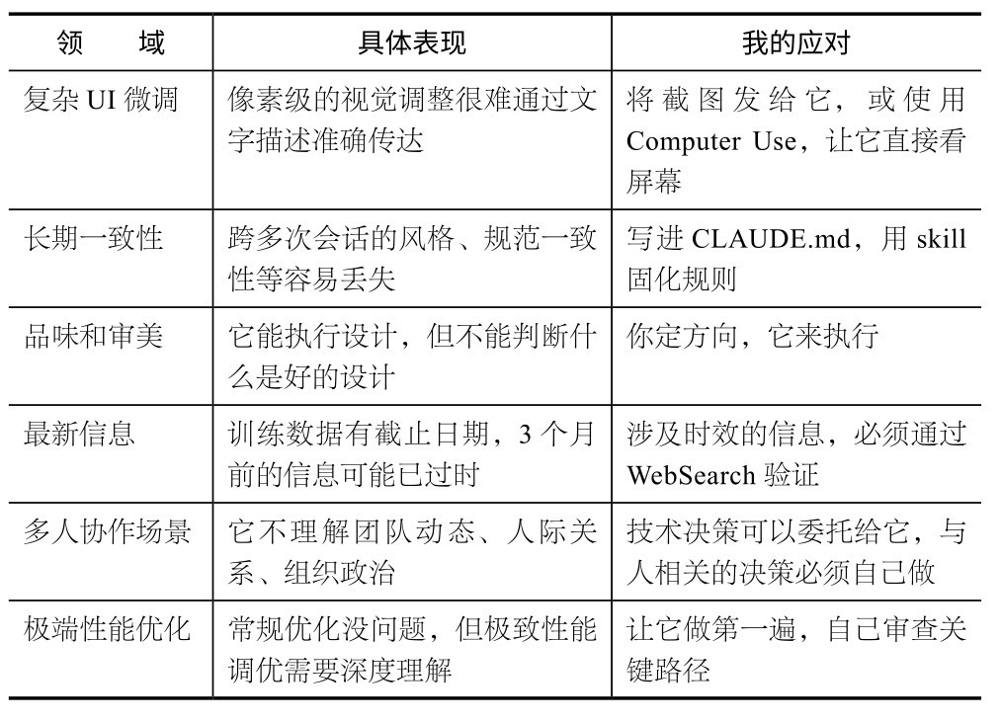

## 第10章 避坑指南：AI编程的边界

前面讲了Claude Code能做什么，本章讲讲它做不好什么，你会在哪里栽跟头，以及该怎么避免。这些全是真实经历，而不是理论推演。

### 10.1 关于“自信错误”：它不会说不知道

有一次，我让Claude Code帮我查一个AI产品的最新定价，它非常自信地给了我一组数字，我直接写进了文章。发布之后，读者指出：定价不对，那是3个月前的价格。

Claude Code不会说“我不确定”。它会基于训练数据给你一个看起来很合理的答案，哪怕那个答案已经过时。对AI工具的信息来说， 3个月就是一个生命周期。

**教****训****：****任****何****涉****及****具****体****数****据****、****日****期****、****定****价****、****产****品****特****性****等****的****内****容****，****都****必****须****用****W****e****b****S****e****a****r****c****h****验****证****。**不要因为Claude Code回答得很自信就直接采用。我将这条规则写在CLAUDE.md的“绝对原则”里，并且排在第一位。

### 10.2 关于“词元成本”：可能非常昂贵

Agent Teams是我用过最强大的功能之一，但也是最贵的。每个智能体维护独立的上下文窗口，整体词元消耗量是单会话的6～8倍（具体取决于子任务数量和上下文复用率等）。有一次，我用Agent Teams并行写6章书稿，一下午大约花了50美元。

另外，还有一个容易被忽略的成本来源：MCP服务器。每个MCP服务器的工具定义都会占用上下文空间。有一段时间，我同时打开8个MCP服务器，后来发现仅工具描述就占用了15%的上下文，相当于每次对话的有效空间少了15%。

**教****训****：**

用/cost和/context定期检查消耗；

及时关闭闲置的MCP服务器；

将大任务拆成小会话，比在一个巨长的会话中实现更省钱也更稳定；

只在真正需要并行的时候才用Agent Teams，不要为了炫技而使用。

### 10.3 关于“AI味”：写出来的东西“一眼假”

这可能是我花最多时间去解决的问题。Claude Code生成的文字有一些非常明显的特征。

破折号频繁出现：一段话中有3个以上破折号。

排比三连：如“它不是X，不是Y，而是Z”。

假设性开头：如“想象一下，如果……”。

中性套话：如“说白了”“简单来说”“换句话说”。

信息含量为零的总结句：如“总而言之，这就是……”。

对仗工整但无实质内容的并列结构。

我第一次把Claude Code写的文章直接发布后，读者反馈最多的是：AI味。后来，我花了好几个月摸索出一套三遍审校流程，目标是把AI检测率从60%以上降到30%以下。现在这套流程成了一个skill（/proofreading），每篇文章都必过一遍。

**教****训****：****让****A****I****写****初****稿****没****问****题****，****但****绝****对****不****能****直****接****发****布****，****至****少****要****经****过****一****遍****减****轻****A****I****味****的****审****校****。**如果你写的是给人看的内容（不是代码），这一步比写初稿本身更重要。

### 10.4 关于“依赖”：你可能会丧失判断力

这个坑比前面的几个更隐蔽。

使用Claude Code半年之后，我发现自己有时候会不加思考地接受它的方案。因为之前它给的方案大多数是对的，所以我开始偷懒，不去想“为什么用方案A而不用方案B”。

直到有一次，它建议我在项目中使用一个我完全不了解的技术栈。完成之后才发现性能很差，但我已经投入了两天的工作量。如果我在最初花10分钟想一下技术选型，这条弯路完全可以避免。

**教****训****：****C****l****a****u****d****e****C****o****d****e****是****工****程****师****，****不****是****产****品****经****理****。**在执行层面，你可以完全信任它，但方向性决策（如做什么、用什么技术、面向谁）必须由你自己来做。Anthropic在《2026年智能体编码趋势报告》中指出，尽管开发者在大约60%的工作中使用了AI，但仅0～20%的任务可以“完全委托”。那些需要人类判断的部分，恰恰是价值最高的部分。

### 10.5 关于“没有银弹”：它真的搞不定的事

说了这么多踩坑经验，下面也列举一些目前我发现Claude Code确实做不好的事情。

### 10.6 心态建议：把它当作勤奋但需要审查的协作者

第6章讲过，我们可以把Claude Code当作代码库的资深向导来提问，那是从“它知道什么”的角度看。本节换一个角度：从“它产出什么”看，把它当作极其勤奋但偶尔粗心的协作者更准确。

能力强并不代表不需要监督：

它打字极快，不会抱怨加班，能同时处理多个任务，但偶尔会犯低级错误，需要你检查；

它不会主动告诉你“这个方向可能有问题”，你得自己判断；

它执行力极强，但缺乏全局视野，你得给它指明方向。

如果抱着这样的心态去使用，你会发现，它带给你的惊喜远多于失望。

**核****心****建****议**

“手搓经济”的本质，不是让所有人都去开发App、去当“赛博个体户”。它的意义是：门打开了。你可以选择走进去，也可以不进去，但至少这扇门以前是关着的，现在开了。使用Claude Code也一样：知道它的能力边界，才能真正用好它的能力。
