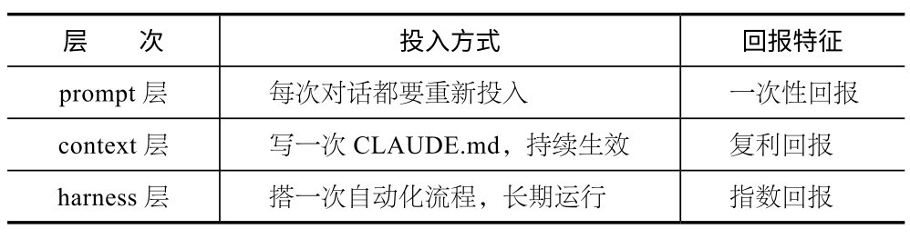
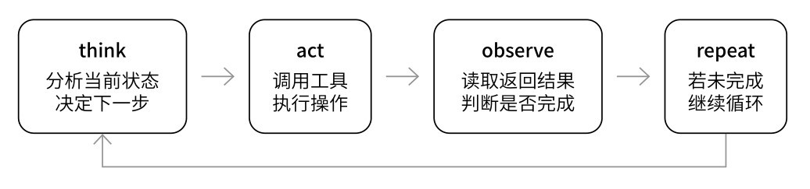
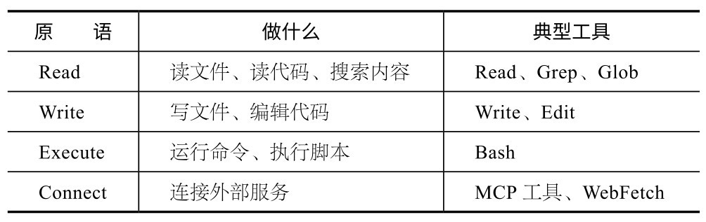

## 第11章 心智模型与持续进化

工具会过时，功能会更新，但好的思维方式永远不会贬值。本章聊聊我觉得比具体操作更重要的东西。

### 11.1 三层模型：你的时间该花在哪儿

讲了这么多具体操作，现在值得建立一个全局视角。Claude Code的所有能力，其实可以归入3个层次。

**p****r****o****m****p****t****层****：**你在终端输入的每一句话，比如“帮我加一个登录页面”“修复这个bug”等。大多数初学者的全部交互停留在这一层。它有效，但每次都需要你手动输入，每次都从零开始。

**c****o****n****t****e****x****t****层****：**Claude Code在回答之前所“看到”的所有信息，包括CLAUDE.md文件、项目的文件结构、Git提交历史、package.json中的依赖列表等。这些信息不需要你每次重复提供，Claude Code会自动读取。第5章讲的CLAUDE.md，本质上就是在优化这一层。

**h****a****r****n****e****s****s****层****：**你搭建的自动化环境。skill把常用工作流封装成可复用的指令；hook让特定事件自动触发操作；MCP可以连接外部服务；Agent Teams让多个Claude Code智能体并行协作。这一层的特点是一旦搭建完成，就一直工作，不需要你每次手动触发。

prompt层像你开口说的话，context层像你提前准备好的PPT, harness层则是你搭建的舞台。演员（Claude Code）的表现，取决于这3层的综合质量。

初学者往往把所有精力都集中在prompt层，反复琢磨措辞、研究提示词技巧。这样做没有错，但提升空间有限。高手的做法是：**尽****量****把****信****息****沉****淀****到****c****o****n****t****e****x****t****层****，****把****重****复****操****作****交****给****h****a****r****n****e****s****s****层****，****只****在****p****r****o****m****p****t****层****处****理****真****正****需****要****临****时****决****策****的****事****情****。**

如果你读完本书只记住一件事，那么请记住：**把****时****间****花****在****构****建****c****o****n****t****e****x****t****层****和****h****a****r****n****e****s****s****层****上****，****而****不****是****优****化****p****r****o****m****p****t****层****。**

### 11.2 harness工程实战：搭建自己的工具链

三层模型提供了理论框架，但你可能更关心具体该怎么搭。搭建harness是有方法论的（业内有人称其为harness工程）。这里分享一个从空白到完整harness的实现路径。

**1****．****从****C****L****A****U****D****E****.****m****d****开****始****（****c****o****n****t****e****x****t****层****）**

开启新项目的第一天，先创建CLAUDE.md。内容不用太多，可以从3件事开始：

# 项目名称

## 技术栈

- Next.js 15 + TypeScript + Tailwind CSS

- PostgreSQL + Drizzle ORM

## 约定

- 组件存放于src/components/，按功能分子目录

- API路由存放于src/app/api/

- 提交信息用中文，格式：类型：描述

## 已知坑

-Drizzle的migrate命令需要先执行export DATABASE_URL

- 部署到Vercel时，环境变量名不能以下划线开头

“已知坑”部分特别重要。每次你踩到坑，只需告诉Claude Code“记住这个坑”，它就会自动写入CLAUDE.md。下次再遇到同样的场景，Claude Code会主动避开。这就是Boris说的“犯错→记录→迭代”飞轮。

**2****．****把****重****复****操****作****变****成****s****k****i****l****l****（****h****a****r****n****e****s****s****层****入****门****）**

项目进行一两周后，你会发现自己反复对Claude Code说类似的话，比如每次写完代码都要说“运行测试，lint一下，然后提交”。

这就是你的第一个skill。你可以在．claude/skills/ship/SKILL.md中定义：

---

description： 提交代码的标准流程

---

1.运行所有测试，确保通过

2.运行eslint --fix格式化代码

3.运行git add添加变更的文件（不要添加．env等敏感文件）

4.生成简洁的commit message并提交

5.如果有远程分支，推送到远程

以后只要输入/ship，即可自动执行上述操作。

**3****．****加****h****o****o****k****保****障****确****定****性**

skill更像建议，Claude Code偶尔会忘。对于“绝不能忘”的事情，要用hook。

我有两个实用的hook。

PostToolUse hook：每次Claude Code编辑TypeScript文件后，自动运行类型检查。

PostCompact hook：上下文被压缩后，自动注入3条核心规则，防止Claude Code在长会话中“失忆”。

**4****．****用****M****C****P****连****接****外****部****世****界**

当你的项目需要和外部服务交互时，可以接入MCP。我最常用的3个MCP如下。

**浏****览****器****M****C****P****：**让Claude Code直接操作浏览器，包括截图、填表单、读取网页内容。

**飞****书****M****C****P****：**创建文档、发消息、管理知识库。

**文****件****系****统****M****C****P****：**操作本机文件，适合跨项目的工作流。

**5****．****一****个****完****整****的****h****a****r****n****e****s****s****什****么****样**

以我的写作项目为例，经过半年迭代，最终形成了如下结构：

～/Documents/写作/

├──CLAUDE.md　　　←路由器：根据任务关键词分发到子目录

├── 01-公众号写作/

│　 ├──CLAUDE.md　←写作风格、审校规则、发布流程

│　 └──项目/

│　　　└──2026.03-某项目/

│　　　　　└──README.md　←项目状态和文件说明

└── .claude/

└── skills/

├──huashu-proofreading/　 ←三遍审校

├──huashu-research/　　　←结构化调研

└──huashu-image-upload/　←配图

根目录的CLAUDE.md不超过8KB，它的职责是“路由”：看到“写文章”这个关键词就读取公众号写作的CLAUDE.md，看到“做视频”就读取视频创作的CLAUDE.md。这样，每个工作区都有自己的规则，互不干扰。

这个harness并不是一天搭好的，而是在半年的实践中，一条规则一条规则地积累出来的。重点不在于规模，而在于**每****次****遇****到****重****复****、****遗****忘****、****错****误****时****，****把****解****决****方****案****固****化****到****c****o****n****t****e****x****t****层****或****h****a****r****n****e****s****s****层****。**日积月累，你的Claude Code就会变成一个越来越了解你、越来越少出错的协作者。

**延****伸****阅****读**

如果你对harness工程的理论和更多案例感兴趣，可以到微信读书上阅读我写的《Harness Engineering橙皮书：AI编程时代的工程方法论》，该书详细拆解了这个概念的起源，OpenAI、Anthropic、Stripe等团队的实践，以及从零搭建harness的完整方法论。

### 11.3 Claude Code的底层原理

用了这么久Claude Code，你有没有好奇过：在你按Enter键之后，到底发生了什么？

我花了一些时间研究Claude Code的内部架构。这不是为了炫技，而是理解机制之后，之前困扰我的很多现象就说得通了。为什么有时候它会“绕弯路”？为什么执行/compact之后，它偶尔会忘记一些细节？为什么在Auto模式下，有些操作直接放行，而有些却需要你确认？这些都不是随机行为，其背后有清晰的设计逻辑。

### 11.3.1 核心循环：TAOR

Claude Code的“心脏”是一个叫作TAOR（think→act→observe→repeat）的智能体循环。收到指令后，它并不是直接生成一整段代码，而是做了以下事情。

先分析当前状态，决定下一步做什么；再调用一个工具，执行操作（如读一个文件、运行一条命令）；然后观察返回结果，判断任务是否完成；若未完成，则回到think继续循环。这个循环可能进行几十轮才结束。

这就解释了为什么Claude Code有时候看起来像“绕弯路”。它不是一个从输入到输出的直线程序，而是一个不断试探和调整的循环体。每一步都在根据新的观察做决策。有时候，它试了一个方案发现行不通，就会回退换另一条路，这其实是设计的一部分，不是bug。

正因如此，**给****C****l****a****u****d****e****C****o****d****e****明****确****的****验****证****标****准****特****别****重****要****。**循环需要一个停止条件。如果需求描述模糊，它不知道怎样算“完成”，就会不停地修改、循环。明确告诉它“测试通过就停”或“生成文件就行”，它的收敛速度会快很多。

### 11.3.2 技术栈：终端的React

一个有趣的事实是：你在终端看到的Claude Code界面，其实是由React组件渲染的。

Claude Code运行在Bun而不是Node.js上，使用React的Ink框架来渲染终端UI。代码全部采用严格模式的TypeScript编写， Schema验证基于Zod。入口文件压缩后大小为785KB，对一个终端工具来说体量不小，但也说明了它的功能密度之高。

这解释了Claude Code为什么能实现如此丰富的交互体验。权限确认弹窗、多行代码高亮显示、进度指示器等在传统终端工具中很难实现的功能，借助React的组件模型就变得自然可行。你感受到的“流畅”不是错觉，而是工程选型的结果。

### 11.3.3 40多个工具，4个能力原语

Claude Code内部有40多个工具，每个工具都有独立的权限管理。但从本质来看，这些工具提供的能力其实可以归结为4个原语。

这个设计非常巧妙，关键在于Bash工具。它是一个万能适配器，让Claude Code能够使用人类开发者的所有命令行工具。不需要为每种编程语言单独集成，也不需要为每个框架专门写插件。例如， npm install、python test.py、git push等都可以通过Execute+ Bash实现。这也是Claude Code能在几乎任何技术栈的项目中工作的原因，而不像某些IDE插件，只支持特定语言。

### 11.3.4 上下文压缩：为什么Claude Code会“失忆”

你可能遇到过这种情况：和Claude Code聊了很久之后，它突然忘了你之前说过的某个要求；或者你手动执行/compact之后，它记不清某些细节了。这不是它在敷衍你。

当上下文窗口快满的时候，系统会把整个对话历史压缩成一份摘要。这份摘要成为下一轮对话的起点，之前的对话被丢掉。**压****缩****是****有****损****的****：**核心信息可以保留，但具体措辞、边角细节、语气暗示等很容易在压缩过程中丢失。

更糟糕的是，长对话如果经历多次压缩，**信****息****损****失****会****累****积****。**每压缩一次就损失一些信息，几次之后，最早的上下文可能只剩一个模糊的影子。

**核****心****建****议**

将重要的约束和要求写进CLAUDE.md，而不是只在对话中说一次。对话会被压缩，但每次开启新会话时，CLAUDE.md都会被重新读取。这也呼应了前面的结论：把信息沉淀到context层。

### 11.3.5 权限系统：不只是yes/no

Auto模式不是简单地全放行。系统内部有一个分类器，它把每个操作的风险分成3级：low、medium和high。读文件通常是low级，可以直接放行；写配置文件通常是medium级或high级，需要用户确认。

一些文件（如．gitconfig、.bashrc、.zshrc等系统配置文件）被硬编码为受保护状态，无论权限模式如何，系统都会谨慎处理。此外，系统还有路径穿越攻击的防御机制，用于防止恶意代码通过Unicode字符或大小写混淆等手段绕过权限检查。

权限确认弹窗中的说明文字不是预设的模板，而是实时生成的。由于系统会单独调用LLM（大语言模型）来生成说明文字，因此每次的措辞都略有不同。这不是不稳定，而是设计本就如此。

### 11.3.6 自动记忆维护

Claude Code有一个后台子代理，会定期整理你的记忆文件（包括CLAUDE.md和相关配置）。整理过程分为4步：审阅现有内容、提取新的有用信息、整合重复条目、修剪过长的部分，目标是把记忆文件保持在合理规模（大约200行）。

为什么长期使用Claude Code之后，你会觉得它越来越“懂你”？不完全因为模型变聪明了，还因为**你****的****偏****好****、****习****惯****和****项****目****上****下****文****，****都****被****记****忆****系****统****持****续****积****累****和****维****护****。**

**核****心****建****议**

理解Claude Code的内部机制不是为了把它当黑盒拆开，而是当你知道循环怎么转、上下文怎么压缩、权限怎么判断之后，你就能更好地与它协作。

### 11.4 身份转变：从写代码到构建产品

这个转变比大多数人预期的要快。

Boris曾公开表示，自己超过90%的代码由Claude Code生成。他的日常工作更多是描述需求、审查输出、做架构决策。他说过一句耐人寻味的话：“我现在更像是一名有技术判断力的产品经理。”

我自己的经历更极端。我从未手写过代码，所有产品都是用AI构建的。很多人觉得不可思议，但真正用过Claude Code就会发现，这完全合理。决定一个产品好坏的，从来不是代码是否精妙，而是需求定义是否准确、用户体验是否流畅。

这意味着关键能力正在发生转移。

旧能力（重要性下降）：

编码能力

框架与API记忆能力

手动调试技巧

代码模板积累

新能力（重要性上升）：

需求拆解能力

架构判断力

输出质量评审能力

产品品味

注意，我说的是“重要性下降”，而不是“没用”。理解代码仍然有价值，它能帮你更好地描述需求，更准确地评审输出。但你不再需要从零开始手写一个完整应用，你需要的是判断一个应用写得好不好的能力。

这个转变的核心是：**从****“****怎****么****写****”****到****“****写****什****么****”****。**

以前，你可能将80%的时间花在“怎么实现这个功能”上，只用20%的时间思考“应该做什么功能”。现在，时间分配倒过来了。Claude Code解决了“怎么写”的问题，但“写什么”这个问题，它帮不了你太多。你需要自己想清楚：这个产品解决什么问题？目标用户是谁？核心体验是什么？哪些功能必须有，哪些可以砍掉？

**核****心****建****议**

与其焦虑是否会被AI取代，不如学会定义需求、设计交互和评审质量。这些能力不会因为AI变强而贬值。

### 11.5 迭代这么快，怎么跟上

回看Claude Code的功能时间线可以发现，它的迭代速度确实很快。

2024年11月，MCP发布，Claude Code获得连接外部服务的能力。

2025年2月，Beta版公开发布，Claude Code从内部工具变成公共产品。

2025年5月，GA版正式发布，稳定性大幅提升。

2025年7月，SubAgents上线，Claude Code可以启动子智能体并行工作。

2025年9月，引入hook机制，事件驱动的自动化成为可能。

2025年10月，skill系统发布，社区可以共享和复用能力包。

2026年2月，Agent Teams正式推出，多智能体协作进入实用阶段。

2026年3月，Computer Use上线，Claude获得操作屏幕的能力；Voice Mode上线，支持语音操作终端。

2026年3月，源码意外公开，外界首次窥见智能体系统的完整架构。

平均每两个月更新一个大功能。这意味着，你手上这本书中的某些具体操作步骤，可能在3个月后就需要更新了。

怎么跟上功能迭代的步伐？我推荐几个稳定的信息渠道。

**1****．****官****方****第****一****手****信****息**

Claude Code官方更新日志：每次更新都有详细说明。

Anthropic官方博客：发布重大功能时会配深度文章。

Anthropic Academy：十余门免费课程，内容覆盖基础到进阶。

**2****．****创****建****者****和****团****队****的****分****享**

Boris Cherny的X账号（@bcherny）：经常分享使用技巧和设计思路。

How Boris Cherny Uses Claude Code网站：汇集了Boris Cherny在X上分享的使用经验。

�“How Anthropic Teams Use Claude Code”：官方团队的真实工作流。

**3****．****高****质****量****播****客****访****谈****（****了****解****设****计****哲****学****）**

Lenny's Podcast:2026年2月，Boris深度谈产品设计和AI编程的未来。

Pragmatic Engineer：技术视角的深度对话。

YC Lightcone：从创业者视角讨论AI工具如何改变构建产品的方式。

**注****意**

不要试图跟踪每一个小更新。每月花30分钟浏览一次更新日志就够了。

你真正应该关注的不是具体功能的变化，而是变化方向。Claude Code的演进始终遵循3个不变的趋势。

(1) **自****主****性****持****续****增****强****。**从依赖逐步指令，到能自主规划和执行。

(2) **上****下****文****窗****口****持****续****扩****大****。**从8000个词元到20万个词元，再到100万个词元，Claude能“看到”的项目规模越来越大。

(3) **协****作****模****式****持****续****丰****富****。**从单智能体到SubAgents、Agent Teams，多智能体协作越来越自然。

这意味着，学习如何与AI协作不会过时。具体命令可能变，但“描述需求→审查输出→迭代改进”这个核心循环，在可预见的未来不会变。

写这本书的时候，我时不时会想：AI编程的终局是什么？

想了很久也没想明白，但有一件事我十分确定：过去一年多，我用Claude Code构建了十几个产品，包括iOS应用、Chrome扩展和PDF生成工具等。每一个产品的质量，都不是由AI的能力上限决定的，而是由我对“什么是好的”的判断决定的。

AI可以在30秒内写出一个登录页面，但是否需要登录页面、登录后应该看到什么、什么样的体验才算流畅，这些只能由人来判断。

因此，我唯一的建议是：别花太多时间研究工具，动手构建吧。找一个你真正想解决的问题，打开终端，开始和Claude对话。卡住了就翻翻这本书，然后继续做。

从想法到产品的距离，现在已经短到超乎想象。
