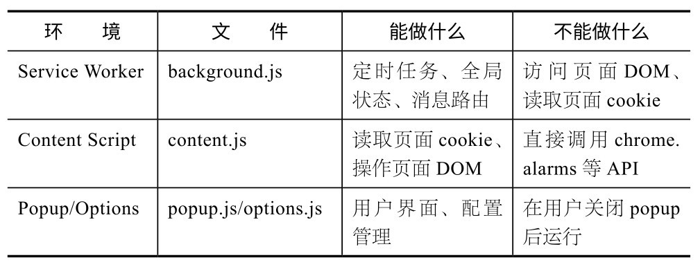
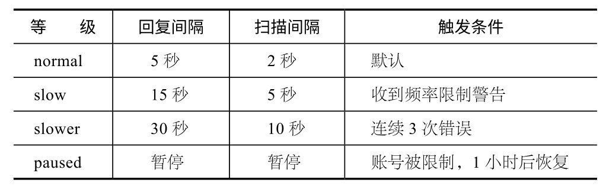
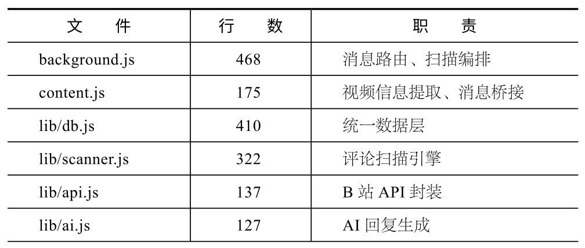
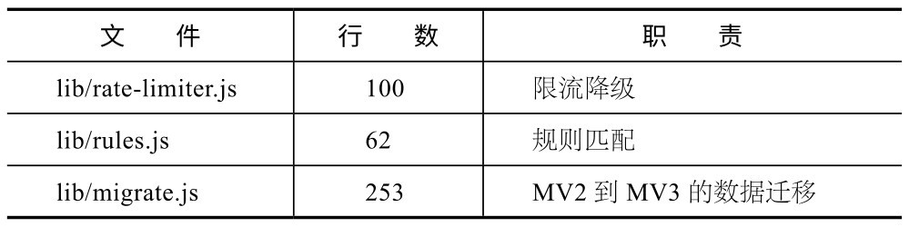

## 第12章 实战项目1:Chrome扩展

本章将从零开始，用Claude Code做一个真正能用、有人在用的Chrome扩展。你将经历从需求分析到打包安装的完整流程，体验最真实的踩坑和重构过程。

我最初做B站UP主运营助手插件，纯粹因为懒。每天需要回复几十条评论，每次打开B站后台，都要一条一条地点回复、打字、发送。两周之后，我实在受不了了，于是打开终端对Claude Code说：“帮我做一个自动回复B站评论的Chrome扩展。”

v1.0（最初的版本）大概2小时就运行起来了。虽然能用，但代码全堆在一个content.js文件中，共1211行，任何一次修改都像在拆炸弹。后来，我花了几天做v3.0重构，将content.js缩到175行，并把业务逻辑拆分为7个独立模块。在重构过程中学到的东西，远比做v1.0时学到的多。

下面我将带你走一遍完整的开发流程。目标是“可维护”，仅“能运行”远远不够。

### 12.1 为什么从Chrome扩展开始

学完前面的章节之后，Chrome扩展是一个很合适的进阶项目。

**技****术****门****槛****适****中****。**不需要学习Swift或者搭建后端。HTML、CSS和JavaScript是Claude Code最擅长的技术栈。虽然Manifest V3（MV3）的规则比Manifest V2（MV2）复杂，但Claude Code对MV3的理解非常到位，你只需要描述功能，它会自动处理Service Worker和权限声明等细节。

**有****真****实****应****用****场****景****。**你几乎每天都在用浏览器，一个好的扩展能改善你的日常工作流。相比做一个永远不会打开第二次的“待办清单”，做一个自己天天用的工具，学习动力完全不同。

**反****馈****循****环****极****短****。**改完代码后，在Chrome扩展管理页面单击“重新加载”，刷新页面就能看到效果，不需要编译、部署和审核。这种即时反馈让你可以快速迭代。

### 12.2 Phase 0：需求分析——你到底想让它做什么

我一开始犯的错误是直接说“做个自动回复插件”。结果Claude Code做了一个非常简单的版本：检测到新评论就回复“谢谢支持”。虽然能用，但完全不是我想要的。

后来我学会了先在Plan模式下把需求说清楚：

我想做一个B站UP主运营助手Chrome扩展，核心需求：

1.自动扫描视频评论

2.根据关键词规则匹配评论并自动回复

3.支持全局规则和单视频规则

4.不重复回复

5.提供一个简单的管理面板，用于查看运行状态

先帮我分析这个需求，给出技术方案。

Claude Code会输出一份完整的技术方案，包括文件结构、技术选型、难点分析。这时不要急着让它开始做，应先仔细看方案，提出你的疑问和修改意见。

**核****心****建****议**

在Plan模式下讨论需求所花的时间，远比事后推翻重做耗费的时间少。我做v1.0时没有经过讨论就直接做，只用了大约2小时，但随后又用了好几天做重构。如果一开始在Plan模式下花30分钟把架构梳理清楚，可以避免大部分重构工作。

### 12.3 Phase 1：项目初始化

确认方案后，切回正常模式，让Claude Code创建项目：

按我们讨论的方案，创建Chrome扩展项目。先做项目骨架：

- manifest.json（MV3）

- background.js（Service Worker）

- content.js（Content Script）

- popup.html + popup.js（管理面板）

- lib/目录（业务模块）

权限只申请必需的，不要多申请。

需要注意以下几个关键决策。

**M****V****3****。**MV2已经被Chrome废弃，Claude Code会自动用MV3的写法。但要注意，网上很多Chrome扩展教程还是基于MV2的，如果你让Claude Code参考那些教程，可能会混用两套API。建议在CLAUDE.md中写清楚，必须使用MV3。

**S****e****r****v****i****c****e****W****o****r****k****e****r****。**MV3最大的变化是background script变成了Service Worker，这意味着它随时可能被浏览器终止。因此，不能再用setInterval做定时任务，而要用chrome.alarms。Claude Code知道这个区别，但如果CLAUDE.md没有明确说明，它偶尔会用以前的命令。

**权****限****最****小****化****。**只申请真正需要的权限。提交到Chrome Web Store审核时，权限越多越容易被拒，而且用户看到一长串权限请求也会犹豫。

Claude Code会生成一个完整的项目结构，其中manifest.json是Chrome扩展的灵魂文件，用于声明扩展名称、版本与权限，指定后台运行脚本、页面注入脚本，以及单击图标后的弹出界面等。

### 12.4 Phase 2：构建核心架构

开发Chrome扩展最容易踩的坑是“代码放错地方”。MV3有3个运行环境，职责完全不同。

我做v1.0的教训是把所有代码都塞进content.js：扫描逻辑、API调用、规则匹配、回复发送、状态管理等代码全在一个文件中，足足1211行。想要修改任何一个功能都要翻查半天。

v3.0的架构如下：

background.js（指挥中心）

├── 拥有定时扫描循环（chrome.alarms，每分钟一次）

├── 路由所有消息（popup/content/widget，统一处理）

└── 管理全局状态（开关、限流等级等）

↕ chrome.runtime.sendMessage

content.js（前线哨兵）

├── 提取当前视频信息（BV号、标题等）

├── 代理API调用（因为需要页面cookie）

└── 转发日志和状态给浮窗

↕ 消息通信

lib/（业务大脑）

├──db.js　　　　　　←统一数据层，所有读写存储的操作都通过该层进行

├──scanner.js　　　　←评论扫描引擎

├──rules.js　　　　　←规则匹配逻辑

├──api.js　　　　　 ←B站API封装

├──ai.js　　　　　　←AI生成回复

└──rate-limiter.js　　　←4级限流降级

关键设计原则是：**c****o****n****t****e****n****t****.****j****s****只****做****它****必****须****做****的****事****。**哪些是它必须做的？读取页面cookie（background.js在MV3下读不到）和操作页面DOM。除此之外，一切业务逻辑都在background.js和lib/中。

你在Claude Code中可以这样描述这个架构：

架构原则：

1. content.js是薄壳，只负责提取视频信息和代理API调用

2. background.js是指挥中心，拥有扫描循环和状态管理

3.所有业务逻辑放在lib/目录下的独立模块中

4.数据存储统一通过lib/db.js进行，不在其他文件里直接操作chrome.storage

5.模块间通过消息通信，不共享状态

把这些写进项目的CLAUDE.md中。

**核****心****建****议**

让Claude Code帮你写项目的CLAUDE.md，并把架构原则写进去。以后每次对话，Claude Code都会自动遵守。这就是第5章内容在实战中的应用。

### 12.5 Phase 3：逐个模块开发

在确定架构之后，开发过程就变成了逐个模块实现。我建议按以下顺序进行。

**1****.****数****据****层****（****d****b****.****j****s****）**

这是地基，其他模块都依赖它。

先做lib/db.js，统一数据访问层。需要这些接口：

- getSystemState() / setSystemState(partial)

- getConfig() / setConfig(partial)

- getRules() / setRules(rules)

- getVideo(bvid) / setVideo(bvid, data)

- markReplied(bvid, rpid)

存储结构：

- 'sys:state'　→系统状态（开关、限流等级等）

- 'sys:config' →配置（扫描间隔、回复延迟等）

- 'sys:rules'　→规则（全局规则和视频专属规则）

- 'sys:logs'　 →日志

- 'v:{bvid}' → 每个视频的独立数据

所有写操作必须是原子的：先读，再合并，最后写入，防止并发覆盖。

从20多个散落的storage key收敛到4个核心命名空间key和一类视频级key，这个改变让后续所有模块都变得简单——没有“数据到底存在哪里”的困惑，全部由db.js处理。

**2****.****规****则****匹****配****（****r****u****l****e****s****.****j****s****）**

这是最小的模块，只有62行代码。它的输入是一条评论和一组规则，输出是匹配结果。该模块采用纯函数设计，没有副作用，非常容易测试。

**3****.****A****P****I****封****装****（****a****p****i****.****j****s****）**

该模块把B站的评论获取和回复发送封装成干净的函数。注意，B站的API需要页面cookie认证，因此这些函数实际上会在content.js的上下文中执行，通过消息传递结果。

**4****．****扫****描****引****擎****（****s****c****a****n****n****e****r****.****j****s****）**

该模块可以把前面3个模块串起来，核心逻辑是：获取评论→过滤已回复的评论→匹配规则→生成回复→发送。

这里有一个关键设计——依赖注入。scanner.js不直接调用API，而是接收外部传入的函数：

async function scanOneVideo(bvid, rules, config, {

sendReplyFn,　　　　　　// 发送回复的函数

fetchCommentsFn,　　　　 // 获取评论的函数

logFn　　　　　　　　　 // 日志函数

}) {

// 业务逻辑

}

为什么这样设计？因为scanner.js在background.js中运行，但API调用需要在content.js的上下文中执行，通过依赖注入， background.js可以传入“通过消息转发到content.js执行”的函数，而scanner.js完全不需要知道这个细节。

**5****.****限****流****器****（****r****a****t****e****-****l****i****m****i****t****e****r****.****j****s****）**

B站对评论回复频率有限制。如果你在1秒内发送5条回复，账号会被临时限制。我采用4级限流降级策略。

每次成功回复后，错误计数器会递减，自动恢复到normal。这就像弹簧一样，被压下去还能弹回来。

**6****.****背****景****脚****本****（****b****a****c****k****g****r****o****u****n****d****.****j****s****）**

把所有模块组装起来，实现扫描循环。每分钟被chrome.alarms唤醒一次，按优先级扫描视频（当前打开的标签页优先）。

**7****.****C****o****n****t****e****n****t****S****c****r****i****p****t****和****U****I**

最后设计界面。content.js只暴露几个简单方法给浮窗，popup.js负责实现管理面板。

### 12.6 Phase 4：调试技巧

Chrome扩展的调试和普通网页不太一样，下面分享几个实用技巧。

**S****e****r****v****i****c****e****W****o****r****k****e****r****调****试****。**打开Chrome扩展管理页面，单击你的扩展下面的Service Worker链接，即可打开独立的DevTools。background.js中的console.log会出现在这里，而不是在网页的控制台中。

**C****o****n****t****e****n****t****S****c****r****i****p****t****调****试****。**在网页的DevTools控制台中可以直接看到content.js的日志。但要注意，content.js运行在一个隔离的执行环境中，不与网页的JavaScript共享全局变量。

**重****新****加****载****。**改完代码后，在Chrome扩展管理页面单击扩展的刷新按钮。popup和option页面需要关闭后重新打开。content.js改动需要刷新目标网页才能生效。Service Worker改动后，需要单击Service Worker旁边的“更新”按钮重载。

Claude Code可以帮你写调试辅助代码。比如，让它在content.js中添加一个日志系统，对所有关键操作进行记录，方便排查问题。在v3.0中，我做了一个简单的日志系统，最多保留200条记录，自动滚动清理，并可以在popup面板中查看。

### 12.7 Phase 5：安装和测试

开发阶段不需要将扩展发布到Chrome Web Store。在Chrome扩展管理页面打开“开发者模式”，单击“加载已解压的扩展程序”，然后选择你的项目目录即可。

测试清单（可以让Claude Code帮你生成）主要包括如下内容。

**基****本****功****能****：**添加规则→扫描评论→自动回复。

**去****重****：**同一条评论不会被回复两次。

**限****流****：**快速连续回复会自动降速。

**持****久****化****：**关闭浏览器后重新打开，状态和数据都还在。

**多****标****签****：**同时打开多个视频页面，各自独立运行。

### 12.8 从1211行到175行：一个典型的重构案例

重构过程值得单独讲解，因为它是Claude Code辅助重构的一个典型案例。

v1.0虽然能用，但痛点很多：content.js文件有1211行，API调用、扫描逻辑、规则匹配和UI更新等全混在一起，要修改一个功能得翻查好久才能找到相应代码；MV3的Service Worker可能随时休眠，用setInterval做定时任务很不稳定。

重构并不是我一开始就计划好的。某天，我想加一个新功能（AI辅助回复），却发现在1211行的content.js中根本无从下手，于是决定重构。

我告诉Claude Code：

当前content.js有1211行，所有逻辑都在里面。我要重构成：

- background.js作为运行中枢

- content.js变成薄壳（只做视频信息提取和API代理）

- lib/目录放所有业务模块

不要一步到位，分步骤来。先帮我分析当前代码，列出每一块逻辑

应该去哪里。

Claude Code给出了一个详细的迁移计划，把1211行代码按功能拆分为7个独立模块和2个入口文件（content.js精简版、background.js），并标注了每块代码应该去哪个模块。然后我们一步一步执行，每迁移一块就测试一次，确保没有退化。最后的结果如下表所示。

重构后，content.js文件从1211行缩至175行，从“什么都做”变成了“只做必须做的事”。虽然项目的总代码量反而增加了（从1211行变为2054行），但每个文件的职责更加清晰，可以独立理解和修改。**重****构****的****意****义****从****来****不****在****于****减****少****代****码****量****，****而****在****于****降****低****认****知****负****担****。**

**核****心****提****醒**

重构时最容易犯的错误是“一步到位”。不要让Claude Code一次性重写所有代码，而应分步骤迁移，且每完成一步，都要测试功能是否正常。我在重构过程中，每迁移一个模块就在浏览器中过一遍完整的测试流程。慢一点没关系，稳比快更重要。

### 12.9 项目实践建议

如果你想跟着做一个Chrome扩展，不一定要做B站插件。这里提供几个参考方向。

**网****页****标****注****工****具****：**选中文字后高亮标注，并保存到本地。涉及Content Script操作DOM和storage持久化。

**页****面****翻****译****助****手****：**选中段落后调用AI翻译。涉及Content Script和外部API调用。

**社****交****媒****体****定****时****器****：**记录你在各个网站中的停留时间，超时提醒。涉及chrome.alarms和多站点Content Script。

**G****i****t****H****u****b****增****强****：**在PR页面显示CI状态，并自动添加标签。涉及GitHub API和Content Script注入。

不管做哪个项目，核心流程都是一样的：在Plan模式下分析需求→定义架构（谁管什么）→写CLAUDE.md固化架构原则→逐模块实现→调试测试。

Chrome扩展项目是一个很好的起点，因为它证明了一件事：Claude Code的能力远不止于写网页。浏览器插件、自动化工具，甚至操作系统级的脚本，只要用代码能解决，Claude Code都能帮你实现。接下来两章，我们将进一步拓展这个边界。
