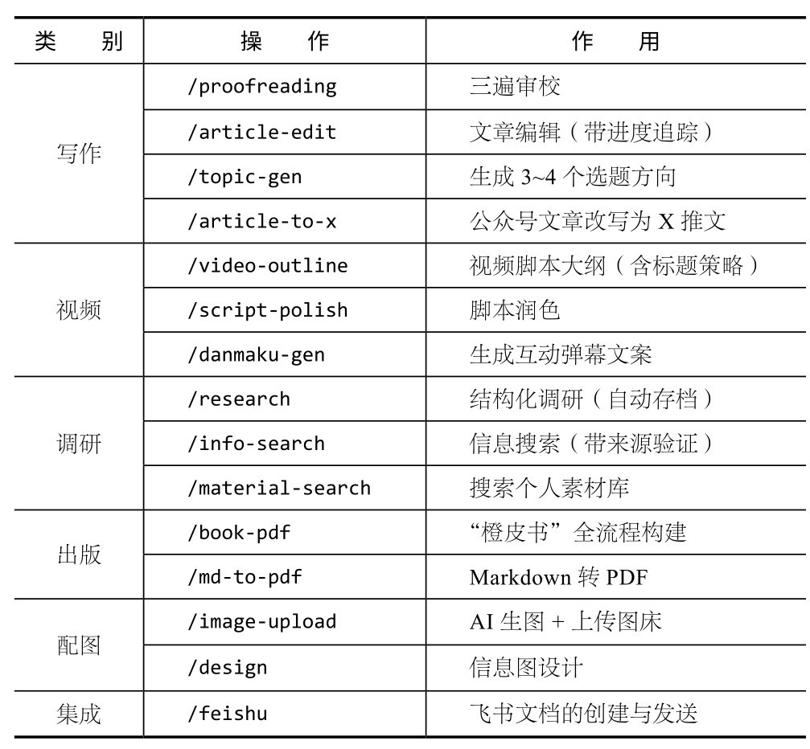

## 第13章 实战项目2：内容创作自动化

Claude Code最被低估的能力，不是写代码。在本章中，我将展示自己每天真实的工作流——用Claude Code进行内容创作。从选题、调研、写作、审校到发布，全流程自动化。当你把Claude Code当作“通用智能体”来用时，它的价值会翻好几倍。

我从事自媒体创作，大概30%的时间用AI进行开发，70%的时间做内容：写公众号文章、做小红书图文、写视频脚本、做调研报告。很长一段时间，我做开发用Claude Code，写文章用ChatGPT或Claude Code网页版。直到有一天，我意识到一个问题：我在Claude Code中积累的所有偏好、规则和风格要求，换到网页版就全丢了。每次开启新会话都要重新交代一遍：不要用破折号、用中文引号、搜索最近3个月的信息……

那天，我把写作规则写进了CLAUDE.md，然后加了几个skill，逐步搭建起一条完整的内容生产线。现在回头看，这可能是我用Claude Code做过的最有价值的事情。它不是某个具体的代码项目，而是每天都在帮我节省时间的内容自动化系统。

本章不讲理论，每一个实现我自己每天都在用。你可以完全照搬，也可以按自己的需求修改。

### 13.1 CLAUDE.md路由系统

如果你只做一个项目，维护一个CLAUDE.md就够用。但如果你需要应对多种工作场景，比如同时进行写作、开发、视频制作等，就需要一个路由系统。

所谓路由系统，是指根目录的CLAUDE.md（根CLAUDE.md）充当“指挥”，根据你说的话判断你要做什么，然后读取对应子目录的CLAUDE.md。

我的项目结构如下：

写作/

├──CLAUDE.md　　　　　　←路由器（约8KB）

├── 01-公众号写作/

│　 ├──CLAUDE.md　　　　 ←公众号写作的完整规则

│　 └──项目/

├── 02-小红书写作/

│　 ├──CLAUDE.md　　　　 ←小红书写作规则

│　 └──项目/

├── 03-视频创作/

│　 ├──CLAUDE.md　　　　 ←视频脚本规则

│　 └──项目/

├── 04-写作参考/

│　 └──SHARED-RULES.md　 ←跨工作区共享规则

├──.claude/skills/　　　　　　←27个skill

└──10-橙皮书/　　　　　　 ←你正在看的这本书

根CLAUDE.md的核心是路由表：

## 工作区路由

收到任务后，先判断工作区，读取对应的CLAUDE.md：

|关键词　　　　　　|工作区　　|读取文件　　　　　　　　|

|---------------------------------|------------------|--------------------------------------------|

|写文章、商单、公众号|公众号写作|/01-公众号写作/CLAUDE.md |

|小红书、笔记、图文　|小红书写作|/02-小红书写作/CLAUDE.md |

|视频脚本、视频创作　|视频创作　|/03-视频创作/CLAUDE.md　 |

|橙皮书、EPUB　　　|橙皮书　 |/10-橙皮书/CLAUDE.md　　 |

路由原则：任务模糊→询问确认；涉及多工作区→依次读取。

当我说“写一篇关于Claude Code的公众号文章”时，Claude Code会执行以下操作。

(1) 读取根CLAUDE.md，看到关键词“公众号”，自动匹配到“公众号写作”。

(2) 自动读取“/01-公众号写作/CLAUDE.md”，加载写作规则。

(3) 按照公众号的风格规范工作。

这样做的好处是：根CLAUDE.md保持精简（约8KB），不会浪费上下文窗口；每个工作区的规则可以独立维护，互不干扰；新增工作区只需要加一行路由。

**核****心****建****议**

如果你同时管理多个项目（工作项目、副业项目、学习笔记），可以创建一个统一的工作目录，由根CLAUDE.md负责路由，每个项目有各自的规则。不必完全照搬我的项目结构，核心思想是：**一****个****入****口****，****多****个****出****口****。**

### 13.2 共享规则，跨项目的一致性

有些规则不属于任何一个工作区，而是所有场景都需要遵守的，比如：

搜索信息要用最近3个月的来源

三遍审校流程（审内容→审风格→审细节）

配图流程（截图→AI生成→上传图床）

文件命名规范

你可以将这类规则放在SHARED-RULES.md中，供所有工作区的CLAUDE.md引用。

最值得展开讲的是三遍审校流程，因为这个规则直接影响输出质量。

**第****一****遍****：****审****内****容****。**检查事实是否正确、逻辑是否严谨、结构是否完整。这一遍不审查文字风格。

**第****二****遍****：****审****风****格****。**这一遍专门检测AI味（详见10.3节）。

**第****三****遍****：****审****细****节****。**比如，句子长度控制在15～25字、段落间留白、加粗标记（全篇约10处）、规范使用引号等。

将三遍审校流程写进SHARED-RULES.md后，不管我在哪个工作区写作，Claude Code都会按这个规则检查。另外，我可以随时用/proofreading这个skill命令来触发审校，不需要每次手动描述流程。

### 13.3 创建你的第一个skill

第7章简单介绍过skill。这里用一个真实例子展示怎么从零开始创建一个skill。

我创建的第一个skill就是上面提到的三遍审校流程。创建方法如下：

# 在项目目录下创建skill文件

mkdir -p .claude/skills/huashu-proofreading

# 写SKILL.md

SKILL.md的格式如下：

---

name: proofreading

description: |

三遍审校流程，降低AI检测率到30%以下

自动触发：用户说“审校”“减轻AI味”“改一改”

手动触发：/proofreading

---

# 三遍审校

## 第一遍：审内容

- 事实核查：所有数据、日期、版本号是否正确

- 逻辑检查：因果关系是否成立

- 结构检查：是否有遗漏的要点

## 第二遍：审风格

检测AI味，逐一修改：

1.套话连篇→删除

2. AI句式→改为口语化

3.过度书面→换日常用词

4.结构机械→打乱，用叙事串联

5.态度中立→加个人立场

6.细节缺失→补具体数据

## 第三遍：审细节

- 句子长度：15～25字为主

- 段落长度：3～5句

- 加粗标记：全篇约10处

- 破折号：全篇最多2处

写好之后，输入/proofreading,Claude Code就会按这个流程审校当前文档。你也可以直接说“帮我审校一下”,Claude Code看到关键词“审校”，会自动触发这个skill。

这里有一个重要的心智转变：**s****k****i****l****l****是****写****给****A****I****的****，****不****是****写****给****你****的****。**你不需要记住三遍审校的所有检查项，只需要记住/proofreading命令。所有细节都被封装进skill中，Claude Code负责执行。

当你养成把重复工作封装成skill的习惯后，skill会迅速增加。目前，我已写了27个skill，覆盖内容创作的每一个环节。以下是我常用的skill。

每个skill都经过实战打磨。这些skill并不是我一次性写好的，而是在日常工作中，每遇到重复性操作就封装成一个skill，大概花了两个月积累的。

### 13.4 完整工作流演示，从选题到发布

介绍了这么多组件，下面我用一个完整的例子把它们串起来。假设今天我要写一篇公众号文章，完整工作流如下。

**1****.****1****0****:****0****0****—****—****选****题**

我在终端打开Claude Code，进入写作项目目录，输入以下指令：

最近Claude Code更新了一些功能，帮我想几个公众号选题方向。

Claude Code看到关键词“公众号”，就自动路由到公众号工作区，加载对应的写作规则。然后调用/topic-gen，输出3～4个选题方向，每个选题包含标题建议、大纲、工作量评估（从☆到☆☆☆）。

**2****.****1****0****:****1****0****—****—****调****研**

我选了第二个方向，工作量评估是☆☆。

选第二个方向。先做调研，搜集Claude Code最近一个月的重要更新和用户反馈。

这时，Claude Code调用/research，执行以下操作。

(1) 立刻创建一个调研文件：_knowledge_base/research-claude-code-更新-20260403.md。

(2) 每搜索一轮，就把结果追加写入文件（防止因对话中断丢失数据）。

(3) 搜索3轮后，输出阶段性总结。

(4) 给出结构化报告：关键事实、信息来源、空白点、写作建议。

这个“边搜边存”的设计是被“逼”出来的。有一次，调研做到一半，会话因为上下文太长而被压缩了，之前搜到的信息全部丢失。从那以后，我的每个调研skill都强制要求实时写入文件。

**3****.****1****0****:****3****0****—****—****写****草****稿**

调研结束后，开始写文章。

调研差不多了。根据调研结果，写一篇公众号文章。

要求：

- 文章保存到“项目/2026.04-Claude-Code更新/草稿．md”

- 3000字左右

- 有明确的个人观点，不要写成新闻稿

Claude Code会创建项目目录，然后开始写作，写完后将文章保存到．md文件中。注意，根CLAUDE.md中有一条偏好：“文章必须写入．md文件，不要直接写在回复里。”这是因为，回复内容在对话结束后就被清空了，但．md文件一直在。

**4****.****1****1****:****0****0****—****—****审****校**

写完文章后，还需进行审校。

/proofreading 草稿．md

Claude Code收到指令后自动执行三遍审校：先读取文件，然后按照三遍审校流程逐项检查，最后输出修改建议。待我确认后，它直接在文件中修改。通常一次审校能发现10～20处AI味问题。

**5****.****1****1****:****2****0****—****—****配****图**

根据文章内容，生成配图。

给这篇文章配一张封面图。

这会触发配图流程。Claude Code根据文章内容生成图片提示词，然后调用 AI 生图，完成后将图片上传到图床，并把图片链接插入文章的对应位置。整个过程自动完成，我只需最后审阅图片效果。

**6****.****1****1****:****3****0****—****—****发****布**

完成以上操作后，发布文章。

文章审校完了，发到飞书文档。

Claude Code调用/feishu，把．md文件转换成飞书文档格式，通过API创建文档并设置权限后发给我。我在飞书中进行最后一轮人工检查，然后复制到公众号编辑器发布。

从选题到文档就绪，大概只需一个半小时。如果没有这套系统，可能需要半天才能完成这些工作。

### 13.5 多智能体并行实践

上面的工作流是串行的：一步做完再做下一步。但在实际工作中，很多环节可以并行。比如，写这本书的时候，我同时打开了4个智能体。

# 终端1：调研智能体，查找最新的Claude Code更新

claude -p "调研Claude Code最近3个月的重大更新"

--dangerously-skip-permissions

# 终端2：写作智能体，写第7章

claude -p "根据以下大纲写第7章"

--dangerously-skip-permissions

# 终端3：审校智能体，审校已完成的第5章

claude -p "审校fragments/part5-claude-md.html"

--dangerously-skip-permissions

# 终端4：配图智能体，为已审校的章节配图

claude -p "为第3章配图"

--dangerously-skip-permissions

每个智能体独立运行，互不干扰。4个智能体同时运行，整本书的构建效率提升了好几倍。API成本大概是50美元，比雇一个助理便宜得多。

**注****意**

**并****行****的****前****提****是****任****务****互****相****独****立****。**如果智能体B需要智能体A的输出，就不能并行。比如，“先调研再写作”必须串行，但“写第3章”和“写第5章”可以并行，因为它们操作不同的文件，不会发生冲突。

### 13.6 CLAUDE.md、skill、hook和MCP的配合

到这里，我们已经用到了CLAUDE.md（规则持久化）和skill（封装重复流程），再加上hook和MCP，就可以构成完整的harness。

**1****.****h****o****o****k****做****什****么**

hook是事件驱动的，比如：

每次创建新文件时，自动检查文件名是否符合命名规范；

每次编辑．md文件后，自动运行格式化（统一引号样式、删除多余空行）；

每次提交前，检查是否有未完成的TODO标记。

hook的价值在于“防遗忘”。人可能会忘记检查命名规范，但hook不会。

**2****.****M****C****P****做****什****么**

MCP让Claude Code能够连接和调用外部服务。在我的内容创作工作流中，MCP有3个核心用途。

**连****接****飞****书****：**直接创建和编辑飞书文档。

**连****接****浏****览****器****：**在Chrome中操作页面、读取信息。

**连****接****文****件****系****统****：**读取写作目录之外的参考资料。

**3****.****四****者****的****关****系**

CLAUDE.md、skill、hook和MCP分别具有以下作用。

**C****L****A****U****D****E****.****m****d****：**定义规则和偏好（被动，每次对话自动加载）。

**s****k****i****l****l****：**封装工作流程（主动触发或关键词触发）。

**h****o****o****k****：**自动化检查（事件驱动，不需要人参与）。

**M****C****P****：**连接外部世界（扩展Claude Code的能力边界）。

如果把Claude Code比作一名员工，那么CLAUDE.md是他的岗位手册，skill是他学会的技能，hook是他养成的好习惯，MCP是他能用的工具。四者叠加，就是一个完整的“AI员工”系统。

### 13.7 搭建你的内容自动化系统

你不需要一步到位搭建起具有27个skill的系统，我建议你分3步走。

**第****1****周****：****创****建****C****L****A****U****D****E****.****m****d****。**创建根CLAUDE.md，写入3～5条你最在意的规则，比如写作风格偏好、文件命名规范、常用的项目结构等。不需要写很多，简单够用就行。

**第****2****周****：****创****建****第****一****个****s****k****i****l****l****。**观察一周，留意你重复最多的指令是什么，把它封装成一个skill。可能是“帮我审校”“帮我翻译”或“帮我总结会议记录”……不管是什么，先创建一个skill，用起来。

**从****第****3****周****开****始****：****按****需****扩****展****。**每遇到一个重复操作，就问自己：“这个操作值得做成skill吗？”如果一个操作你一周会执行3次以上，答案就是值得。3个月后，你会有10～15个skill，覆盖日常工作中的大部分重复性操作。

搭建内容自动化系统的关键不是追求skill的数量，而是养成习惯。当你习惯了用CLAUDE.md固化规则、用skill封装重复操作、用MCP连接外部服务时，你的工作效率将实现质的提升。这就是第11章讲的harness工程在实际工作中的应用。

**写****给****非****程****序****员****读****者**

本章的所有操作都不需要你会写代码：创建CLAUDE.md本质上是写规则文档，创建skill则是写操作手册，配置MCP只需填几个参数。无论是做内容、做运营，还是做产品，任何需要重复性输出的工作，都可以直接复用这套方法。Claude Code不只是编程工具，它是一个通用的AI工作站。这可能是本书最重要的一个观点。
