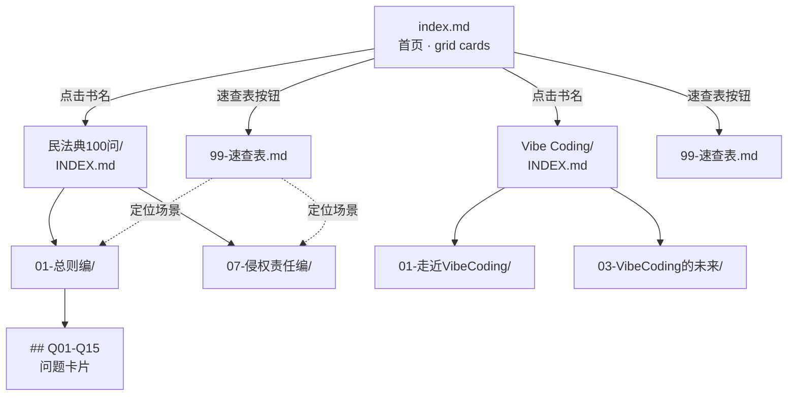

# 站点设计文档 — 读书知识库

> 本文件是 GitHub Pages 站点的视觉 / 结构 / 交互 / 响应式设计依据。技术栈锁定 **MkDocs Material 9.x**，主题为默认配置 + indigo 主色 + default/slate 双模式 palette。所有视觉变更需同步 `mkdocs.yml` 与本文件；任一处脱节即视为契约破坏。

---

## 1. 视觉设计

### 1.1 设计令牌（Design Tokens）

#### 1.1.1 颜色（Material Indigo + 双模式 Palette）

| 令牌 | Light（`scheme: default`） | Dark（`scheme: slate`） | 用途 |
|---|---|---|---|
| `--md-primary-fg-color` | `#3F51B5` | `#3F51B5` | 顶栏背景、tab 激活、品牌主色 |
| `--md-primary-bg-color` | `#FFFFFF` | `#FFFFFF` | 主色上的文字（顶栏菜单） |
| `--md-accent-fg-color` | `#3F51B5` | `#7986CB` | 链接 hover、代码高亮、表单焦点 |
| `--md-default-bg-color` | `#FFFFFF` | `#1F232A` | 正文背景 |
| `--md-default-fg-color` | `rgba(0,0,0,0.87)` | `#FFFFFF` | 正文文字 |
| `--md-default-fg-color--light` | `rgba(0,0,0,0.54)` | `#CDD2D7` | 次要文字（meta、时间戳、placeholder） |
| `--md-typeset-a-color` | `#3F51B5` | `#7986CB` | 站内链接 |
| `--md-code-bg-color` | `#F5F5F5` | `#272D36` | 行内/代码块背景 |
| `--md-admonition-bg-color` | 派生色 6% alpha | 派生色 8% alpha | admonition 块背景 |

**配色逻辑**：浅色模式走「纸张白 + 墨黑正文」，正文对比度 12:1 远超 WCAG AA 的 4.5:1。深色模式走「暖灰蓝 `#1F232A` + 高对比白」，**避免纯黑**（OLED 眩光 + 残影）。Indigo 主色双模式共用，仅在暗色下把 accent 抬升到 `#7986CB`（Indigo 300）以维持 ≥7:1 对比度。

切换器位于顶栏右侧 `material/brightness-4` 图标。**不跟随系统**，由用户显式决策；偏好持久化到 `localStorage`，刷新保留。

#### 1.1.2 字体（Typography）

| 角色 | 字体栈 | 字号 | 行高 | 字重 |
|---|---|---|---|---|
| 正文 | `Roboto, "Noto Sans CJK SC", "Source Han Sans SC", -apple-system, sans-serif` | 16px | 1.6 | 400 |
| H1 | `Roboto Slab, Roboto, "Noto Sans CJK SC"` | 32px | 1.2 | 700 |
| H2 | `Roboto Slab, Roboto` | 24px | 1.3 | 700 |
| H3 | `Roboto Slab, Roboto` | 20px | 1.3 | 600 |
| H4–H6 | `Roboto, "Noto Sans CJK SC"` | 16px | 1.4 | 600 |
| 等宽 | `Roboto Mono, "Source Code Pro", Menlo, monospace` | 14px | 1.5 | 400 |
| 按钮 | `Roboto, "Noto Sans CJK SC"` | 14px | 1 | 500 |

中文渲染顺序：Material 9.x 自带 Noto Sans CJK SC 兜底中文；西文优先 Roboto。`Source Han Sans SC` 作为本地可选替代（部分 Linux 用户缺 Noto 时仍可显示）。

#### 1.1.3 间距（8dp 基准）

| 令牌 | 值 | 用途 |
|---|---|---|
| `--space-1` | 4px | 段落内微调、icon 与文字间距 |
| `--space-2` | 8px | 行内间距、列表项内 padding |
| `--space-3` | 16px | 卡片内边距、按钮 padding、列表项间距 |
| `--space-4` | 24px | 区块内边距、段落间距 |
| `--space-6` | 48px | Section 间距、Hero 区上下 padding |
| `--space-8` | 64px | 页眉到正文、模态上下边距 |

容器最大宽度 `61rem`（约 976px）。正文主栏 `46rem`（约 736px），溢出空间留给右侧 TOC。

#### 1.1.4 圆角

| 元素 | 值 |
|---|---|
| Grid cards | `0.5rem`（8px） |
| `.md-button` | `0.25rem`（4px） |
| 输入框 / admonition | `0.25rem` |
| 代码块 / Chip | `0.25rem` |
| Drawer / 顶栏 | `0`（满边） |

#### 1.1.5 阴影（Material Elevation）

| 层级 | CSS | 用途 |
|---|---|---|
| dp 1 | `0 1px 2px rgba(0,0,0,0.12), 0 1px 1px rgba(0,0,0,0.24)` | 卡片静态、按钮静止、tab 常态 |
| dp 2 | `0 3px 6px rgba(0,0,0,0.16), 0 3px 6px rgba(0,0,0,0.23)` | 卡片 hover、tab 激活、按钮 hover |
| dp 3 | `0 10px 20px rgba(0,0,0,0.19), 0 6px 6px rgba(0,0,0,0.23)` | 搜索建议下拉、模态对话框 |

### 1.2 三级证据标记（语义权威性）

知识包统一三档前缀：**原文**（微信读书热门划线逐字）/ **归纳**（从原文提炼）/ **补充**（编者依据公开常识）。它们在卡片内为纯文本前缀（带括号内「X人标记」热度数字），不绑色块——避免视觉权重过载，权威性靠热度数字背书而非色相区分。

---

## 2. 结构设计

### 2.1 站点地图



**两条主路径**：
1. **浏览路径**：首页 → 书名 → INDEX → 模块 → 单 Q 卡片（深读）
2. **查询路径**：首页 → 速查表 → 模块 → 单 Q 卡片（最高频）

速查表是一等公民，置于首页卡片按钮区。

### 2.2 仓库目录树（设计权重视角）

```
.
├── index.md                  ← 唯一 landing（hero + 双卡片）
├── mkdocs.yml                ← 站点配置（不归设计改）
├── AGENTS.md                 ← 项目规则（不归设计改）
├── 民法典100问/              ← 书 1 section（awesome-nav 自动挂）
│   ├── INDEX.md              ← section 首页（必读：metadata + 覆盖率 + 速览）
│   ├── 00-原书档案/          ← 机器可读 raw data（导航不暴露）
│   ├── 01-总则编/README.md   ← Q01-Q15
│   ├── 02-物权编/README.md
│   ├── ...（共 7 个模块）...
│   ├── 07-侵权责任编/README.md
│   ├── 99-速查表.md          ← 最高频入口（首页直达按钮）
│   └── additions/            ← 增量追加区（按日期命名）
└── Vibe Coding：AI 编程时代的认知重构/
    └── （同上结构，3 个模块）
```

### 2.3 各类文件的视觉权重与布局意图

| 文件 | 视觉权重 | 布局意图 |
|---|---|---|
| `index.md` | 全屏 hero | 标题 → 一句话定义 → 阅读建议 admonition → 双卡片 grid → 知识包结构 → 数据来源 → 贡献约定 → 维护者 |
| `<书名>/INDEX.md` | section 落地页 | 元数据表格 → 覆盖率声明 → 目录树 → AI 检索建议 → 模块速览表格 |
| `99-速查表.md` | 最高频（按钮直达） | 场景 → 规则 → 关键期限数字；表格密集；可独立检索 |
| `NN-<模块>/README.md` | 中等深度 | 模块简介 → 问题卡片序列（`## Q编号`），每卡含原文引用 |
| `additions/YYYY-MM-DD-主题.md` | 增量，与速查表同级 | 显式标注「影响速查表第 X 条」以覆盖旧条目 |

INDEX.md 顶部固定放置「覆盖率声明」+「升级路径」表格：用户先看见数据来源局限，再向下滚。这是知识库的诚信契约——读者了解「哪些是原文、哪些是归纳、哪些是编者补充」之后，引用时才不会误把归纳当原文。

---

## 3. 交互设计

### 3.1 启用的 Material Features（10 个）

| Feature | 行为 |
|---|---|
| `navigation.instant` | 客户端路由切换，不重载页面（Material 9.x 用 View Transitions），体感接近 SPA |
| `navigation.tracking` | 滚动时 URL hash 自动更新到当前标题，刷新或外链可定位 |
| `navigation.tabs` | 一级 section（首页 + 两本书）渲染为顶部 tab，紧贴顶栏下方 |
| `navigation.sections` | 一级以下渲染为左侧 sidebar 树，可折叠 |
| `navigation.indexes` | `<书名>/INDEX.md` 直接作为该 section 的点击落地页，无需额外点击 |
| `navigation.top` | 右下角浮动「回到顶部」按钮，超出一屏后淡入 |
| `search.suggest` | 顶栏搜索框：输入即下拉建议，含中文分词（`search.lang: zh`） |
| `search.highlight` | 搜索结果页内匹配文字黄底高亮，点击直接跳到锚点 |
| `content.code.copy` | 所有代码块右上角显示复制按钮 |
| `content.action.edit` | 每页右上角显示「在 GitHub 编辑」按钮，直链当前页路径 |

**未启用的 features**（避免组合冲突或冗余）：`navigation.tabs.sticky`、`navigation.footer`、`navigation.path`、`toc.follow`、`navigation.expand`。

### 3.2 搜索

- **触发**：顶栏放大镜 → 输入框 → 即时建议（中文按词匹配，分页 8 条）。
- **回车**：跳到独立搜索页 `/search.html`，结果按页面聚合，匹配项黄底高亮 + 折叠上下文。
- **索引构建**：`mkdocs build` 阶段生成；新增书后 push 触发 CI 重建即可。

### 3.3 模式切换

顶栏右侧 `material/brightness-4` 图标（不用默认的 `brightness-7`——在 slate 下辨识度差）。单击在 default / slate 间切换；偏好持久化到 `localStorage`，刷新保留。**不跟随系统**，避免深色用户在不同设备遭遇「切换疲劳」。

### 3.4 内容操作

- **代码复制**：`<pre>` 块右上角浮动 `<>` 图标，鼠标悬停显示，点击复制到剪贴板，1.5s 内图标变为对勾反馈。
- **GitHub 编辑**：每页右上角「编辑此页」按钮，跳转 `https://github.com/meisijiya/reading/edit/main/<path>`，无需登录可见 diff，提交需登录。
- **锚点链接**：每个 H2 / H3 标题前显示 `#` permalink（`toc.permalink: true`），点击复制 URL hash 到剪贴板。

---

## 4. 响应式设计

### 4.1 断点

| 视口 | 宽度 | 设备 |
|---|---|---|
| 手机 | `< 600px` | iPhone SE / 主流小屏安卓 |
| 平板 | `600–1224px` | iPad / 折叠屏展开 |
| 桌面 | `≥ 1225px` | 笔记本 / 显示器 |

Material 9.x 默认断点与上述一致；不需要自定义。

### 4.2 各断点布局

| 元素 | 手机（`<600px`） | 平板（`600–1224px`） | 桌面（`≥1225px`） |
|---|---|---|---|
| 顶 tab | 折叠为汉堡菜单（左侧 drawer） | 顶 tab 横排 | 顶 tab 横排 |
| 左侧 sidebar | 隐藏在 drawer，按钮触发 | 固定显示，宽 `16rem` | 固定显示，宽 `16rem` |
| 右侧 TOC | 隐藏（仅 anchor 跳转） | 折叠为浮按 | 固定显示，宽 `14rem` |
| 首页 grid cards | 1 列 | 2 列 | 3 列 |
| 正文主栏宽度 | `100% - 32px` | `46rem` 居中 | `46rem` 居中 |
| Hero 字号 | 24px | 28px | 32px |
| 卡片内边距 | 16px | 16px | 16px |
| 段落间距 | 16px | 16px | 24px |

**Grid cards 实现**：`grid-template-columns: repeat(auto-fit, minmax(min(15rem, 100%), 1fr))`。最小卡宽 240px（≈ 15rem）。视口 `< 480px` 折 1 列；`480–720px` 折 2 列；`≥ 720px` 折 3 列。

### 4.3 触控与可达

- 所有可点击元素最小触控目标 `44×44 px`（Apple HIG / Material guideline）。
- 主内容区移动端 `padding: 16px`，桌面端 `padding: 24px`。
- 长表格在窄屏自动横向滚动（容器 `overflow-x: auto`），表格头冻结在顶部。
- 代码块默认横向滚动不换行，避免破坏缩进语义。

---

## 5. 可访问性

| 项 | 状态 |
|---|---|
| 颜色对比度 | 正文 12:1（light）/ 15:1（slate）远超 WCAG AA 4.5:1 |
| 链接对比度 | `#3F51B5` on `#FFFFFF` = 8.6:1；`#7986CB` on `#1F232A` = 7.2:1，均过 AA |
| 键盘导航 | `Tab` 遍历链接/按钮、`Enter` 触发、`Esc` 关闭 drawer/搜索 |
| Focus Ring | Material 默认 2px 蓝色 outline（accent 派生色），不删除 |
| 语义结构 | H1 单次 / H2-H3 层级递减；`nav` / `main` / `aside` 由 Material 模板保证 |
| Skip-to-content | 顶 tab 之前有「跳到主要内容」隐藏链接（Material 内置），`Tab` 首键即达 |
| 搜索可访问性 | 搜索框 `aria-label="搜索"`、建议列表 `role="listbox"` |
| 图标替代 | Material 图标均带 `aria-hidden="true"`，文本替代在按钮内 |
| 减少动效 | 未使用 Material 自带的滑入动画外的额外 motion；尊重 `prefers-reduced-motion` |

---

## 6. 与 Material 默认的差异

仅在 `mkdocs.yml` 内显式锁定以下三项，其余 100% 走 Material 9.x 默认行为：

| 项 | 默认值 | 我们的值 | 原因 |
|---|---|---|---|
| `palette.toggle.icon` | `material/brightness-7` | `material/brightness-4` | brightness-7 在 slate 下辨识度差 |
| `plugins.awesome-nav.nav_file` | （未设） | `INDEX.md` | 大小写敏感的命名契约 |
| `plugins.search.lang` | `en` | `zh` | 启用中文分词 |

未来若需品牌色或自定义字体，改 `theme.palette.primary` 与 `theme.font` 两处即可；目录结构、文档契约、`mkdocs.yml` 主体不动。