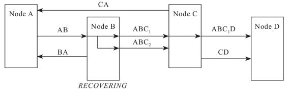

## 第2章 访问远程服务

远程服务将计算机程序的工作范围从单机扩展至网络，从本地延伸至远程，是构建分布式系统的首要基础。而远程服务又不仅仅是为分布式系统服务的，在网络时代，浏览器、移动设备、桌面应用和服务端的程序，普遍都有与其他设备交互的需求，所以今天已经很难找到没有开发和使用过远程服务的程序员了，但是没有正确理解远程服务的程序员却不少。

### 2.1 远程服务调用

远程服务调用（Remote Procedure Call，RPC）在计算机科学中已经存在超过四十年时间，但在今天仍然可以在各种论坛、技术网站上遇见“什么是RPC”“如何评价某某RPC技术”“RPC更好还是REST更好”之类的问题，仍然有新的不同形状的RPC轮子被发明制造出来，仍然有层出不穷的文章去比对Google gRPC、Facebook Thrift等各家的RPC组件库的优劣。

像计算机科学这种快速更迭的领域，一项四十岁高龄的技术能有如此关注度，可算是相当罕见的现象，这一方面是由于微服务风潮带来的热度，另一方面，也不得不承认，确实有不少开发者对RPC本身解决什么问题、如何解决这些问题、为什么要这样解决存在认知模糊的情况。本节，笔者会从历史到现状，从现象到本质，尽可能深入地解释清楚RPC的来龙去脉。

#### 2.1.1 进程间通信

尽管今天的大多数RPC技术已经不再追求这个目标了，但不可否认，RPC出现的最初目的，就是为了让计算机能够与调用本地方法一样去调用远程方法。所以，我们先来看一下调用本地方法时，计算机是如何处理的。笔者通过以下这段Java风格的伪代码来定义几个稍后要用到的概念：

```
// Caller    :  调用者，代码里的main()
// Callee    ： 被调用者，代码里的println()
// Call Site ： 调用点，即发生方法调用的指令流位置
// Parameter ： 参数，由Caller传递给Callee的数据，即“hello world”
// Retval    ： 返回值，由Callee传递给Caller的数据，如果方法能够正常结束，它是void，
    如果方法异常完成，它是对应的异常
public static void main(String[] args) {
    System.out.println("hello world");
}
```

在完全不考虑编译器优化的前提下，程序运行至调用println()方法输出hello world这行时，计算机（物理机或者虚拟机）要完成以下几项工作。

1）传递方法参数：将字符串hello world的引用地址压栈。

2）确定方法版本：根据println()方法的签名，确定其执行版本。这其实并不是一个简单的过程，无论是编译时静态解析，还是运行时动态分派，都必须根据某些语言规范中明确定义的原则，找到明确的Callee，“明确”是指唯一的一个Callee，或者有严格优先级的多个Callee，譬如不同的重载版本。笔者曾在《深入理解Java虚拟机》的第8章介绍该过程，有兴趣的读者可以参考，这里不再赘述。

3）执行被调方法：从栈中弹出Parameter的值或引用，并以此为输入，执行Callee内部的逻辑。这里我们只关心方法是如何调用的，而不关心方法内部具体是如何执行的。

4）返回执行结果：将Callee的执行结果压栈，并将程序的指令流恢复到Call Site的下一条指令，继续向下执行。

我们再来考虑如果println()方法不在当前进程的内存地址空间中会发生什么问题。不难想到，这样会至少面临两个直接的障碍。首先，第一步和第四步所做的传递参数、传回结果都依赖于栈内存，如果Caller与Callee分属不同的进程，就不会拥有相同的栈内存，此时将参数在Caller进程的内存中压栈，对于Callee进程的执行毫无意义。其次，第二步的方法版本选择依赖于语言规则，如果Caller与Callee不是同一种语言实现的程序，方法版本选择就将是一项模糊的不可知行为。

为了简化讨论，我们暂时忽略第二个障碍，假设Caller与Callee是使用同一种语言实现的，先来解决两个进程之间如何交换数据的问题，这件事情在计算机科学中被称为“进程间通信”（Inter-Process Communication，IPC）。可以考虑的解决办法有以下几种。

·管道（Pipe）或者具名管道（Named Pipe）：管道类似于两个进程间的桥梁，可通过管道在进程间传递少量的字符流或字节流。普通管道只用于有亲缘关系的进程（由一个进程启动的另外一个进程）间的通信，具名管道摆脱了普通管道没有名字的限制，除具有管道的所有功能外，它还允许无亲缘关系的进程间的通信。管道典型的应用就是命令行中的“|”操作符，譬如：

```
ps -ef | grep java
```

ps与grep都有独立的进程，以上命令就是通过管道操作符“|”将ps命令的标准输出连接到grep命令的标准输入上。

·信号（Signal）：信号用于通知目标进程有某种事件发生。除了进程间通信外，进程还可以给进程自身发送信号。信号的典型应用是kill命令，譬如：

```
kill -9 pid
```

以上命令即表示由Shell进程向指定PID的进程发送SIGKILL信号。

·信号量（Semaphore）：信号量用于在两个进程之间同步协作手段，它相当于操作系统提供的一个特殊变量，程序可以在上面进行wait()和notify()操作。

·消息队列（Message Queue）：以上三种方式只适合传递少量消息，POSIX标准中定义了可用于进程间数据量较多的通信的消息队列。进程可以向队列添加消息，被赋予读权限的进程还可以从队列消费消息。消息队列克服了信号承载信息量少、管道只能用于无格式字节流以及缓冲区大小受限等缺点，但实时性相对受限。

·共享内存（Shared Memory）：允许多个进程访问同一块公共内存空间，这是效率最高的进程间通信形式。原本每个进程的内存地址空间都是相互隔离的，但操作系统提供了让进程主动创建、映射、分离、控制某一块内存的程序接口。当一块内存被多进程共享时，各个进程往往会与其他通信机制，譬如与信号量结合使用，来达到进程间同步及互斥的协调操作。

·本地套接字接口（IPC Socket）：消息队列与共享内存只适合单机多进程间的通信，套接字接口则是更普适的进程间通信机制，可用于不同机器之间的进程通信。套接字（Socket）起初是由UNIX系统的BSD分支开发出来的，现在已经移植到所有主流的操作系统上。出于效率考虑，当仅限于本机进程间通信时，套接字接口是被优化过的，不会经过网络协议栈，不需要打包拆包、计算校验和、维护序号和应答等操作，只是简单地将应用层数据从一个进程复制到另一个进程，这种进程间通信方式即本地套接字接口（UNIX Domain Socket），又叫作IPC Socket。

#### 2.1.2 通信的成本

之所以花费那么多篇幅来介绍IPC的手段，是因为最初计算机科学家们的想法，就是将RPC作为IPC的一种特例来看待，这个观点在今天，仅从分类上说也仍然合理，只是到具体操作手段上就不合适了。

请特别注意最后一种基于套接字接口的通信方式（IPC Socket），它不仅适用于本地相同机器的不同进程间通信，由于Socket是网络栈的统一接口，它也能支持基于网络的跨机进程间通信。譬如Linux系统的图形化界面、X Window服务器和GUI程序之间的交互就是由这套机制来实现的。这样做的好处是，由于Socket是各个操作系统都提供的标准接口，完全有可能把远程方法调用的通信细节隐藏在操作系统底层，从应用层面上来看可以做到远程调用与本地的进程间通信在编码上完全一致。事实上，在原始分布式时代的早期确实是奔着这个目标去做的，但这种透明的调用形式反而给程序员带来通信无成本的假象，因而被滥用，以致于显著降低了分布式系统的性能。1987年，在“透明的RPC调用”一度成为主流范式的时候，Andrew Tanenbaum教授曾发表论文“A Critique of The Remote Procedure Call Paradigm”[1]，对这种透明的RPC范式提出一系列质问。

·两个进程通信，谁作为服务端，谁作为客户端？

·怎样进行异常处理？异常该如何让调用者获知？

·服务端出现多线程竞争之后怎么办？

·如何提高网络利用的效率？连接是否可被多个请求复用以减少开销？是否支持多播？

·参数、返回值如何表示？应该有怎样的字节序？

·如何保证网络的可靠性？调用期间某个链接忽然断开了怎么办？

·发送的请求服务端收不到回复怎么办？

论文的中心观点是：把本地调用与远程调用当作同样的调用来处理，这是犯了方向性的错误，把系统间的调用透明化，反而会增加程序员工作的复杂度。此后几年，关于RPC应该如何发展、如何实现的论文层出不穷，透明通信的支持者有之，反对者有之，冷静分析者有之，狂热唾骂者也有之，但历史逐渐证明Andrew Tanenbaum的预言是正确的。最终，到1994年至1997年间，由ACM和Sun院士Peter Deutsch、套接字接口发明者Bill Joy、Java之父James Gosling等一众在Sun公司工作的专家们共同总结了通过网络进行分布式运算的八宗罪（8 Fallacies of Distributed Computing）[2]。

1）The network is reliable.——网络是可靠的。

2）Latency is zero.——延迟是不存在的。

3）Bandwidth is infinite.——带宽是无限的。

4）The network is secure.——网络是安全的。

5）Topology doesn’t change.——拓扑结构是一成不变的。

6）There is one administrator.——总会有一个管理员。

7）Transport cost is zero.——不必考虑传输成本。

8）The network is homogeneous.——网络都是同质化的。

以上这八条反话被认为是程序员在网络编程中经常忽略的八大问题，潜台词就是如果远程服务调用要透明化，就必须为这些罪过埋单，这算是给RPC能否等同于IPC来暂时定下了一个具有公信力的结论。至此，“RPC应该是一种高层次的或者说语言层次的特征，而不是像IPC那样，是低层次的或者说系统层次的特征”的观点成为工业界、学术界的主流观点。

在20世纪80年代初期，传奇的施乐Palo Alto研究中心发布了基于Cedar语言的RPC框架——Lupine，并实现了世界上第一个基于RPC的商业应用——Courier，这里施乐Palo Alto研究中心所定义的“远程服务调用”的概念就是完全符合以上对RPC的结论的，所以，尽管此前已经有用其他名词指代“调用远程服务”的操作，一般仍认为RPC的概念最早是由施乐公司提出的。

额外知识

首次提出远程服务调用的定义

远程服务调用是指位于互不重合的内存地址空间中的两个程序，在语言层面上，以同步的方式使用带宽有限的信道来传输程序控制信息。



——Bruce Jay Nelson，Remote Procedure Call，Xerox PARC，1981

[1] 下载地址：https://www.cs.vu.nl/~ast/Publications/Papers/euteco-1988.pdf。

[2] 详见：https://en.wikipedia.org/wiki/Fallacies_of_distributed_computing。

#### 2.1.3 三个基本问题

20世纪80年代中后期，惠普和Apollo提出了网络运算架构（Network Computing Architecture，NCA）的设想，并随后在DCE项目中将其发展成在UNIX系统下的远程服务调用框架DCE/RPC。笔者曾经在1.1节中介绍过DEC，这是历史上第一次对分布式的有组织的探索尝试，由于DEC本身是基于UNIX操作系统的，所以DEC/RPC通常也仅适合在UNIX系统程序之间使用。（微软COM/DCOM的前身MS RPC算是DCE的一种变体，把这些派生版算进去的话就要普适一些。）在1988年，Sun公司起草并向互联网工程任务组（Internet Engineering Task Force，IETF）提交了RFC 1050规范，此规范中设计了一套面向广域网或混合网络环境的、基于TCP/IP的、支持C语言的RPC协议，后被称为ONC RPC（Open Network Computing RPC，也被称为Sun RPC），这两套RPC协议就算是如今各种RPC协议和框架的鼻祖了，从它们开始，直至接下来这几十年所有流行过的RPC协议，都不外乎变着花样使用各种手段来解决以下三个基本问题。

1.如何表示数据

这里的数据包括传递给方法的参数以及方法执行后的返回值。无论是将参数传递给另外一个进程，还是从另外一个进程中取回执行结果，都涉及数据表示问题。对于进程内的方法调用，使用程序语言预置和程序员自定义的数据类型，就很容易解决数据表示问题；对于远程方法调用，则完全可能面临交互双方各自使用不同程序语言的情况，即使只支持一种程序语言的RPC协议，在不同硬件指令集、不同操作系统下，同样的数据类型也完全可能有不一样的表现细节，譬如数据宽度、字节序的差异等。有效的做法是将交互双方所涉及的数据转换为某种事先约定好的中立数据流格式来进行传输，将数据流转换回不同语言中对应的数据类型来使用。这个过程说起来拗口，但相信大家一定很熟悉，就是序列化与反序列化。每种RPC协议都应该要有对应的序列化协议，譬如：

·ONC RPC的外部数据表示（External Data Representation，XDR）

·CORBA的通用数据表示（Common Data Representation，CDR）

·Java RMI的Java对象序列化流协议（Java Object Serialization Stream Protocol）

·gRPC的Protocol Buffers

·Web Service的XML序列化

·众多轻量级RPC支持的JSON序列化

2.如何传递数据

如何传递数据，准确地说，是指如何通过网络，在两个服务的Endpoint之间相互操作、交换数据。这里“交换数据”通常指的是应用层协议，实际传输一般是基于TCP、UDP等标准的传输层协议来完成的。两个服务交互不是只扔个序列化数据流来表示参数和结果就行，许多在此之外的信息，譬如异常、超时、安全、认证、授权、事务等，都可能产生双方需要交换信息的需求。在计算机科学中，专门有一个名词“Wire Protocol”来表示这种两个Endpoint之间交换这类数据的行为，常见的Wire Protocol如下。

·Java RMI的Java远程消息交换协议（Java Remote Message Protocol，JRMP，也支持RMI-IIOP）

·CORBA的互联网ORB间协议（Internet Inter ORB Protocol，IIOP，是GIOP协议在IP协议上的实现版本）

·DDS的实时发布订阅协议（Real Time Publish Subscribe Protocol，RTPS）

·Web Service的简单对象访问协议（Simple Object Access Protocol，SOAP）

·如果要求足够简单，双方都是HTTP Endpoint，直接使用HTTP协议也是可以的（如JSON-RPC）

3.如何表示方法

确定表示方法在本地方法调用中并不是太大的问题，编译器或者解释器会根据语言规范，将调用的方法签名转换为进程空间中子过程入口位置的指针。不过一旦要考虑不同语言，事情又立刻麻烦起来，每种语言的方法签名都可能有差别，所以“如何表示同一个方法”“如何找到对应的方法”还是需要一个统一的跨语言的标准才行。这个标准可以非常简单，譬如直接给程序的每个方法都规定一个唯一的、在任何机器上都绝不重复的编号，调用时压根不管它是什么方法、签名是如何定义的，直接传这个编号就能找到对应的方法。这种听起既粗鲁又寒碜的办法，还真的就是DCE/RPC当初准备的解决方案。虽然最终DCE还是弄出了一套与语言无关的接口描述语言（Interface Description Language，IDL），成为此后许多RPC参考或依赖的基础（如CORBA的OMG IDL），但那个唯一的绝不重复的编码方案UUID（Universally Unique Identifier）也被保留且广为流传开来，并被广泛应用于程序开发的方方面面。类似地，用于表示方法的协议还有：

·Android的Android接口定义语言（Android Interface Definition Language，AIDL）

·CORBA的OMG接口定义语言（OMG Interface Definition Language，OMG IDL）

·Web Service的Web服务描述语言（Web Service Description Language，WSDL）

·JSON-RPC的JSON Web服务协议（JSON Web Service Protocol，JSON-WSP）

以上RPC中的三个基本问题，全部都可以在本地方法调用过程中找到对应的解决方案。RPC的设计始于本地方法调用，尽管早已不再追求实现与本地方法调用完全一致的目的，但其设计思路仍然带有本地方法调用的深刻烙印，抓住两者间的联系来类比，对我们更深刻地理解RPC的本质会很有帮助。

#### 2.1.4 统一的RPC

虽然DEC/RPC与ONC RPC都有很浓厚的UNIX痕迹，但是它们并没有真正在UNIX系统以外大规模流行过，而且它们还有一个“大问题”：只支持传递值而不支持传递对象。尽管ONC RPC的XDR的序列化器能用于序列化结构体，但结构体毕竟不是对象，这两种RPC协议都是面向C语言设计的，根本就没有对象的概念。然而20世纪90年代正好又是面向对象编程（Object-Oriented Programming，OOP）风头正盛的年代，所以在1991年，对象管理组织（Object Management Group，OMG）发布了跨进程的、面向异构语言的、支持面向对象的服务调用协议：CORBA 1.0（Common Object Request Broker Architecture）。CORBA的1.0和1.1版本只提供了C、C++语言的支持，到了末代的CORBA 3.0版本，不仅支持C、C++、Java、Object Pascal、Python、Ruby等多种主流编程语言，还支持Lisp、Smalltalk、Ada、COBOL等非主流语言，阵营不可谓不强大。CORBA是一套由国际标准组织牵头，由多家软件提供商共同参与制定的分布式规范，论影响力，当时只有微软私有的DCOM能够与之稍微抗衡，但微软的DCOM与DCE一样，是受限于操作系统的（尽管DCOM比DCE更强大些，能跨多语言），所以同时支持跨系统、跨语言的CORBA原本是最有机会统一RPC这个领域的有力竞争者。

但无奈CORBA本身设计得实在太过于烦琐，甚至有些规定简直到了荒谬的程度——写一个对象请求代理（ORB，这是CORBA中的核心概念）大概要200行代码，其中大概有170行都是纯粹无用的废话——这句话是CORBA的首席科学家Michi Henning在文章“The Rise and Fall of CORBA”[1]中提出的愤怒批评。另一方面，为CORBA制定规范的专家逐渐脱离实际，使得CORBA规范晦涩难懂，各家语言的厂商都有自己的解读，导致CORBA实现互不兼容，实在是对CORBA号称支持众多异构语言的莫大讽刺。这也间接导致稍后W3C Web Service出现后，CORBA与Web Service竞争时犹如十八路诸侯讨伐董卓，互乱阵脚，一触即溃，最终惨败。CORBA的最终归宿是与DCOM一同被扫进计算机历史的博物馆中。

CORBA没有把握住统一RPC的大好时机，很快另外一个更有希望的机会降临。1998年，XML 1.0发布，并成为万维网联盟（World Wide Web Consortium，W3C）的推荐标准。1999年末，SOAP 1.0（Simple Object Access Protocol）规范的发布，标志着一种被称为“Web Service”的全新的RPC协议的诞生。Web Service是由微软和DevelopMentor公司共同起草的远程服务协议，随后提交给W3C投票成为国际标准，所以Web Service也被称为W3C Web Service。Web Service采用XML作为远程过程调用的序列化、接口描述、服务发现等所有编码的载体，当时XML是计算机工业最新的银弹，只要是定义为XML的东西几乎都被认为是好的，风头一时无两，连微软自己都主动宣布放弃DCOM，迅速转投Web Service的怀抱。

交给W3C管理后，Web Service再没有天生属于哪家公司的烙印，商业运作非常成功，大量的厂商都想分一杯羹。但从技术角度来看，它设计得并不优秀，甚至同样可以说是有显著缺陷的。对于开发者而言，Web Service的一大缺点是它过于严格的数据和接口定义所带来的性能问题，尽管Web Service吸取了CORBA失败的教训，不需要程序员手工编写对象的描述和服务代理，可是，XML作为一门描述性语言本身信息密度就相对低下，（都不用与二进制协议比，与今天的JSON或YAML比一下就知道了。）Web Service又是跨语言的RPC协议，这使得一个简单的字段，为了在不同语言中不会产生歧义，要以XML严谨描述的话，往往需要比原本存储这个字段值多出十几倍、几十倍乃至上百倍的空间。这个特点一方面导致了使用Web Service必须要专门的客户端去调用和解析SOAP内容，也需要专门的服务去部署（如Java中的Apache Axis/CXF），更关键的是导致了每一次数据交互都包含大量的冗余信息，性能奇差。

如果只是需要客户端，传输性能差也就算了，又不是不能用。既然选择了XML，获得自描述能力，本来就没有打算把性能放到第一位，但Web Service还有另外一个缺点：贪婪。“贪婪”是指它希望在一套协议上一揽子解决分布式计算中可能遇到的所有问题，这促使Web Service生出了整个家族的协议——去网上搜索一下就知道这句话不是拟人修辞[2]。Web Service协议家族中，除它本身包括的SOAP、WSDL、UDDI协议外，还有一堆数不清的，以WS-*命名的，用于解决事务、一致性、事件、通知、业务描述、安全、防重放等子功能的协议，让开发者学习负担沉重。

当程序员们对Web Service的热情迅速兴起，又逐渐冷却之后，自己也不禁开始反思：那些面向透明的、简单的RPC协议，如DCE/RPC、DCOM、Java RMI，要么依赖于操作系统，要么依赖于特定语言，总有一些先天约束；那些面向通用的、普适的RPC协议，如CORBA，就无法逃过使用复杂性的困扰，CORBA烦琐的OMG IDL、ORB都是很好的佐证；而那些意图通过技术手段来屏蔽复杂性的RPC协议，如Web Service，又不免受到性能问题的束缚。简单、普适、高性能这三点，似乎真的很难同时满足。

[1] 下载地址：https://dl.acm.org/doi/pdf/10.1145/1142031.1142044。

[2] 维基百科中收录了部分WS-*的子协议：https://en.wikipedia.org/wiki/List_of_web_service_specifications。

#### 2.1.5 分裂的RPC

由于一直没有一个同时满足以上三点的“完美RPC协议”出现，所以远程服务器调用这个小小的领域，逐渐进入群雄混战、百家争鸣的战国时代，距离“统一”越来越远，并一直延续至今。现在，已经相继出现过RMI（Sun/Oracle）、Thrift（Facebook/Apache）、Dubbo（阿里巴巴/Apache）、gRPC（Google）、Motan1/2（新浪）、Finagle（Twitter）、brpc（百度/Apache）、.NET Remoting（微软）、Arvo（Hadoop）、JSON-RPC 2.0（公开规范，JSON-RPC工作组）等难以穷举的协议和框架。这些RPC功能、特点不尽相同，有的是某种语言私有，有的支持跨越多种语言，有的运行在应用层HTTP协议之上，有的直接运行于传输层TCP/UDP协议之上，但并不存在哪一款是“最完美的RPC”。今时今日，任何一款具有生命力的RPC框架，都不再去追求大而全的“完美”，而是以某个具有针对性的特点作为主要的发展方向，举例分析如下。

·朝着面向对象发展，不满足于RPC将面向过程的编码方式带到分布式，希望在分布式系统中也能够进行跨进程的面向对象编程，代表为RMI、.NET Remoting，之前的CORBA和DCOM也可以归入这类。这种方式有一个别名叫作分布式对象（Distributed Object）。

·朝着性能发展，代表为gRPC和Thrift。决定RPC性能的主要因素有两个：序列化效率和信息密度。序列化效率很好理解，序列化输出结果的容量越小，速度越快，效率自然越高；信息密度则取决于协议中有效负载（Payload）所占总传输数据的比例大小，使用传输协议的层次越高，信息密度就越低，SOAP使用XML拙劣的性能表现就是前车之鉴。gRPC和Thrift都有自己优秀的专有序列化器，而传输协议方面，gRPC是基于HTTP/2的，支持多路复用和Header压缩，Thrift则直接基于传输层的TCP协议来实现，省去了应用层协议的额外开销。

·朝着简化发展，代表为JSON-RPC，说要选功能最强、速度最快的RPC可能会很有争议，但选功能弱的、速度慢的，JSON-RPC肯定会是候选人之一。牺牲了功能和效率，换来的是协议的简单轻便，接口与格式都更为通用，尤其适合用于Web浏览器这类一般不会有额外协议支持、额外客户端支持的应用场合。

经历了RPC框架的“战国时代”，开发者们终于认可了不同的RPC框架所提供的特性或多或少是有矛盾的，很难有某一种框架能满足所有需求。若要朝着面向对象发展，就注定不会太简单，如建Stub、Skeleton就很烦了，即使由IDL生成也很麻烦；功能多起来，协议就会更复杂，效率一般也会受影响；要简单易用，那很多事情就必须遵循约定而不是自行配置；要重视效率，那就需要采用二进制的序列化器和较底层的传输协议，支持的语言范围容易受限。也正是每一种RPC框架都有不完美的地方，所以才导致不断有新的RPC轮子出现，也决定了在选择框架时，在获得一些利益的同时，要付出另外一些代价。

到了最近几年，RPC框架有明显向更高层次（不仅仅负责调用远程服务，还管理远程服务）与插件化方向发展的趋势，不再追求独立地解决RPC的全部三个问题（表示数据、传递数据、表示方法），而是将一部分功能设计成扩展点，让用户自己选择。框架聚焦于提供核心的、更高层次的能力，譬如提供负载均衡、服务注册、可观察性等方面的支持。这一类框架的代表有Facebook的Thrift与阿里的Dubbo，尤其是断更多年后重启的Dubbo表现得更为明显。Dubbo默认有自己的传输协议（Dubbo协议），同时也支持其他协议；默认采用Hessian 2作为序列化器，如果你有JSON的需求，可以替换为Fastjson，如果你对性能有更高的追求，可以替换为Kryo、FST、Protocol Buffers等效率更好的序列化器，如果你不想依赖其他组件库，也可以直接使用JDK自带的序列化器。这种设计在一定程度上缓和了RPC框架必须取舍、难以完美的缺憾。

最后，笔者提个问题，大家不妨来反思一下：开发一个分布式系统，是不是就一定要用RPC呢？RPC的三大问题源自于对本地方法调用的类比模拟，如果我们把思维从“方法调用”的约束中挣脱，那在解决参数与结果如何表示、数据如何传递、方法如何表示这些问题时都会有焕然一新的视角。但是我们写程序，真的可能不面向方法来编程吗？这就是笔者下一节准备谈的话题了。

后记

前文提及DCOM、CORBA、Web Service的失败时，可能笔者的口吻多少有一些戏谑，这只是落笔行文的方式。这些框架即使没有成功，但作为早期的探索先驱，并没有什么该去讽刺的地方。而且它们的后续发展，都称得上是知耻后勇，都值得我们赞赏。譬如说到CORBA的消亡，OMG痛定思痛之后，提出了基于RTPS协议栈的“数据分发服务”（Data Distribution Service，DDS）商业标准（就是要付费使用的意思），如今主要流行于物联网领域，能够做到微秒级延时，还能支持大规模并发通信。譬如说到DCOM的失败和Web Service的式微，微软在它们的基础上推出的.NET WCF（Windows Communication Foundation，Windows通信基础），不仅同时将REST、TCP、SOAP等不同形式的调用自动封装为完全一致的如同本地方法调用一般的程序接口，还依靠自家的“地表最强IDE”Visual Studio将工作量减少到只需要指定一个远程服务地址，就可以获取服务描述、绑定各种特性（譬如安全传输）、自动生成客户端调用代码，甚至还能选择同步或者异步之类细节的程度。尽管.NET WCF只支持.NET平台，而且与传统Web Service一样采用XML描述，但使用体验异常畅快，能挽回Web Service中得罪开发者丢掉的全部印象分。

### 2.2 REST设计风格

很多人会拿REST与RPC相比较，其实，REST无论是在思想上、在概念上，还是在使用范围上，与RPC都不尽相同，充其量只能算是有一些相似，应用会有一部分重合之处，但本质上并不是同一类型的东西。

REST与RPC在思想上差异的核心是抽象的目标不一样，即面向过程的编程思想与面向资源的编程思想两者之间的区别。面向过程编程、面向对象编程想必大家都听说过，但什么是面向资源编程呢？这个问题等介绍完REST的特征之后我们再细说。

REST与RPC在概念上的不同是指REST并不是一种远程服务调用协议，甚至可以把定语也去掉，它就不是一种协议。协议都带有一定的规范性和强制性，最起码也有一个规约文档，譬如JSON-RPC，哪怕再简单，也有《JSON-RPC规范》[1]来规定协议的格式细节、异常、响应码等信息，但是REST并没有定义这些内容，尽管有一些指导原则，但实际上并不受任何强制的约束。常有人批评某个系统接口“设计得不够RESTful”，其实这句话本身就有些争议，REST只能说是风格而不是规范、协议，并且能完全符合REST所有指导原则的系统也是不多见的，这一点我们同样将在后文中详细讨论。

至于使用范围，REST与RPC作为主流的两种远程调用方式，在使用上确有重合，但重合区域的大小就见仁见智了。上一节提到了当前的RPC协议框架都各有侧重点，并且列举了RPC的一些发展方向，如分布式对象、提升调用效率、简化调用复杂性，等等。这里面分布式对象的应用与REST可以说是毫无关联；而能够重视远程服务调用效率的应用场景，就基本排除了REST应用得最多的供浏览器端消费的远程服务，因为以浏览器作为前端，对于传输协议、序列化器的可选择性不多，哪怕想要更高效率也有心无力。而在移动端、桌面端或者分布式服务端的节点之间通信这一块，REST虽然有宽阔的用武之地，只要支持HTTP就可以用于任何语言之间的交互，不过通常都会以网络没有成为性能瓶颈为使用前提，在需要追求传输效率的场景里，REST提升传输效率的潜力有限，死磕REST又想要好的网络性能，一般不会有好的效果；对追求简化调用的场景——前面提到的浏览器端就属于这一类的典型，众多RPC里也只有JSON-RPC有机会与REST竞争，其他RPC协议与框架，哪怕能够支持HTTP协议，提供了JavaScript版本的客户端（如gRPC-Web），也只是具备前端使用的理论可行性，很少有实际项目把它们真正用到浏览器上。

尽管有着种种不同，REST与RPC还是引发了很频繁的比较与争论，这两种分别面向资源和过程的远程调用方式，就如同当年面向对象与过程的编程思想一样，非得分出高低不可。

[1] JSON-RPC 2.0规范地址：https://www.jsonrpc.org/specification。

#### 2.2.1 理解REST

个人会有好恶偏爱，但计算机科学是务实的，有了RPC，还会提出REST，有了面向过程编程之后还会产生面向资源编程，并引起广泛的关注、使用和讨论，说明后者一定是有一些前者没有的闪光点，或者解决、避免了一些前者的缺陷。我们不妨先去理解REST为什么会出现，再来讨论评价它。

REST源于Roy Thomas Fielding在2000年发表的博士论文“Architectural Styles and the Design of Network-based Software Architectures”[1]，此文的确是REST的源头，但我们不应该忽略Fielding的身份和他此前的工作背景，这些信息对理解REST的设计思想至关重要。

首先，Fielding是一名很优秀的软件工程师，他是Apache服务器的核心开发者，后来成为著名的Apache软件基金会的联合创始人；同时，Fielding也是HTTP 1.0协议（1996年发布）的专家组成员，后来还晋升为HTTP 1.1协议（1999年发布）的负责人。HTTP 1.1协议设计得极为成功，以至于在发布之后长达十年的时间里，都没有收到多少修订的意见。用来指导HTTP 1.1协议设计的理论和思想，最初是以备忘录的形式供专家组成员之间交流，除了IETF、W3C的专家外，并没有在外界广泛流传。

从时间上看，对HTTP 1.1协议的设计工作贯穿了Fielding的整个博士研究生涯，当起草HTTP 1.1协议的工作完成后，Fielding回到了加州大学欧文分校继续攻读自己的博士学位。第二年，他更为系统、严谨地阐述了这套理论框架，同时以这套理论框架导出了一种新的编程思想，并为这种程序设计风格取了一个很多人难以理解，但是今天已经广为人知的名字——REST（Representational State Transfer，表征状态转移）。

哪怕对编程和网络都很熟悉的同学，也不太可能直接从名字弄明白什么叫“表征”、什么东西的“状态”、从哪“转移”到哪。尽管在论文中确有论述这些概念，但写得相当晦涩[2]，所以笔者比较推荐先理解什么是HTTP，再配合一些实际例子来对两者进行类比，以更清楚地了解REST，你会发现REST实际上是“HTT”（Hypertext Transfer）的进一步抽象，两者的关系就如同接口与实现类的关系一般。

HTTP中使用的“超文本”（Hypertext）一词是美国社会学家Theodor Holm Nelson在1967年于“Brief Words on the Hypertext”一文里提出的，下面引用的是他本人在1992年修正后的定义：

额外知识

现在，“超文本”一词已被普遍接受，它指的是能够进行分支判断和差异响应的文本，相应地，“超媒体”一词指的是能够进行分支判断和差异响应的图像、电影和声音（也包括文本）的复合体。

——Theodor Holm Nelson，Literary Machines，1992

以上定义描述的“超文本（或超媒体）”是一种“能够对操作进行判断和响应的文本（或声音、图像等）”，这个概念在20世纪60年代提出时应该还属于科幻的范畴，但是今天大众已经完全接受了它，互联网中一段文字可以点击、可以触发脚本执行、可以调用服务端已毫不稀奇。下面我们继续尝试从“超文本”或者“超媒体”的含义来理解什么是“表征”以及REST中的其他关键概念，这里使用一个具体事例将其描述如下。

·资源（Resource）：譬如你现在正在阅读一篇名为《REST设计风格》的文章，这篇文章的内容本身（你可以将其理解为蕴含的信息、数据）称之为“资源”。无论你是通过阅读购买的图书、浏览器上的网页还是打印出来的文稿，无论是在电脑屏幕上阅读还是在手机上阅读，尽管呈现的样子各不相同，但其中的信息是不变的，你所阅读的仍是同一份“资源”。

·表征（Representation）：当你通过浏览器阅读此文章时，浏览器会向服务端发出“我需要这个资源的HTML格式”的请求，服务端向浏览器返回的这个HTML就被称为“表征”，你也可以通过其他方式拿到本文的PDF、Markdown、RSS等其他形式的版本，它们同样是一个资源的多种表征。可见“表征”是指信息与用户交互时的表示形式，这与我们软件分层架构中常说的“表示层”（Presentation Layer）的语义其实是一致的。

·状态（State）：当你读完了这篇文章，想看后面是什么内容时，你向服务端发出“给我下一篇文章”的请求。但是“下一篇”是个相对概念，必须依赖“当前你正在阅读的文章是哪一篇”才能正确回应，这类在特定语境中才能产生的上下文信息被称为“状态”。我们所说的有状态（Stateful）抑或是无状态（Stateless），都是只相对于服务端来说的，服务端要完成“取下一篇”的请求，要么自己记住用户的状态，如这个用户现在阅读的是哪一篇文章，这称为有状态；要么由客户端来记住状态，在请求的时候明确告诉服务端，如我正在阅读某某文章，现在要读它的下一篇，这称为无状态。

·转移（Transfer）：无论状态是由服务端还是由客户端来提供，“取下一篇文章”这个行为逻辑只能由服务端来提供，因为只有服务端拥有该资源及其表征形式。服务端通过某种方式，把“用户当前阅读的文章”转变成“下一篇文章”，这就被称为“表征状态转移”。

通过“阅读文章”这个例子，相信你应该能够理解“表征状态转移”的含义了。借着这个故事的上下文状态，笔者再继续介绍几个现在不涉及但稍后要用到的概念。

·统一接口（Uniform Interface）：上面说的服务端“通过某种方式”让表征状态转移，那具体是什么方式呢？如果你真的是用浏览器阅读本文电子版的话，请把本文滚动到结尾处，右下角有下一篇文章的URI超链接地址，这是服务端渲染这篇文章时就预置好的，点击它让页面跳转到下一篇，就是所谓“某种方式”的其中一种方式。任何人都不会对点击超链接网页出现跳转感到奇怪，但你细想一下，URI的含义是统一资源标识符，是一个名词，如何能表达出“转移”动作的含义呢？答案是HTTP协议中已经提前约定好了一套“统一接口”，它包括GET、HEAD、POST、PUT、DELETE、TRACE、OPTIONS七种基本操作，任何一个支持HTTP协议的服务器都会遵守这套规定，对特定的URI采取这些操作，服务器就会触发相应的表征状态转移。

·超文本驱动（Hypertext Driven）：尽管表征状态转移是由浏览器主动向服务器发出请求所引发的，该请求导致了“在浏览器屏幕上显示出了下一篇文章的内容”的结果。但是，我们都清楚这不可能真的是浏览器的主动意图，浏览器是根据用户输入的URI地址来找到网站首页，读取服务器给予的首页超文本内容后，浏览器再通过超文本内部的链接来导航到这篇文章，阅读结束时，也是通过超文本内部的链接再导航到下一篇。浏览器作为所有网站的通用的客户端，任何网站的导航（状态转移）行为都不可能是预置于浏览器代码之中，而是由服务器发出的请求响应信息（超文本）来驱动的。这点与其他带有客户端的软件有十分本质的区别，在那些软件中，业务逻辑往往是预置于程序代码之中的，有专门的页面控制器（无论在服务端还是在客户端中）来驱动页面的状态转移。

·自描述消息（Self-Descriptive Message）：由于资源的表征可能存在多种不同形态，在消息中应当有明确的信息来告知客户端该消息的类型以及应如何处理这条消息。一种被广泛采用的自描述方法是在名为“Content-Type”的HTTP Header中标识出互联网媒体类型（MIME type），譬如“Content-Type:application/json;charset=utf-8”说明该资源会以JSON的格式来返回，请使用UTF-8字符集进行处理。

除了以上列出的这些概念外，在理解REST的过程中，还有一个常见的误区值得注意：Fielding提出REST时所谈论的范围是“架构风格与网络的软件架构设计”（Architectural Styles and Design of Network-based Software Architecture），而不是现在被人们所狭义理解的一种“远程服务设计风格”，这两者的范围差别就好比本书所谈论的话题“软件架构”与本章谈论话题“访问远程服务”的关系那样，前者是后者的一个很大的超集，尽管基于本节的主题和多数人的关注点考虑，我们确实会以“远程服务设计风格”作为讨论的重点，但至少应该说清楚它们范围上的差别。

[1] 下载地址：https://www.ics.uci.edu/~fielding/pubs/dissertation/top.htm。

[2] 不想读英文的同学从此处获得中文翻译版本：https://www.infoq.cn/article/2007/07/dlee-fielding-rest/。

#### 2.2.2 RESTful的系统

如果你已经理解了上面这些概念，我们就可以开始讨论面向资源的编程思想与Fielding所提出的几个具体的软件架构设计原则了。Fielding认为，一套理想的、完全满足REST风格的系统应该满足以下六大原则。

1.客户端与服务端分离（Client-Server）

将用户界面所关注的逻辑和数据存储所关注的逻辑分离开来，有助于提高用户界面的跨平台的可移植性，也越来越受到广大开发者所认可，以前完全基于服务端控制和渲染（如JSF这类）框架的实际用户已甚少，而在服务端进行界面控制（Controller），通过服务端或者客户端的模板渲染引擎来进行界面渲染的框架（如Struts、SpringMVC这类）也受到了颇大冲击。这一点与REST可能关系并不大，前端技术（从ES规范，到语言实现，再到前端框架等）在近年来的高速发展，使得前端表达能力大幅度加强才是真正的幕后推手。由于前端的日渐强势，现在还流行起由前端代码反过来驱动服务端进行渲染的SSR（Server-Side Rendering）技术，在Serverless、SEO等场景中已经占领了一席之地。

2.无状态（Stateless）

无状态是REST的一条核心原则，部分开发者在做服务接口规划时，觉得REST风格的服务怎么设计都感觉别扭，很可能的一个原因是服务端持有比较重的状态。REST希望服务端不用负责维护状态，每一次从客户端发送的请求中，应包括所有必要的上下文信息，会话信息也由客户端负责保存维护，服务端只依据客户端传递的状态来执行业务处理逻辑，驱动整个应用的状态变迁。客户端承担状态维护职责以后，会产生一些新的问题，譬如身份认证、授权等可信问题，它们都应有针对性的解决方案[1]。

但必须承认的是，目前大多数系统都达不到这个要求，且越复杂、越大型的系统越是如此。服务端无状态可以在分布式计算中获得非常高价值的回报，但大型系统的上下文状态数量完全可能膨胀到客户端无法承受的程度，在服务端的内存、会话、数据库或者缓存等地方持有一定的状态成为一种事实上存在，并将长期存在、被广泛使用的主流方案。

3.可缓存（Cacheability）

无状态服务虽然提升了系统的可见性、可靠性和可伸缩性，但降低了系统的网络性。“降低网络性”的通俗解释是某个功能使用有状态的设计时只需要一次（或少量）请求就能完成，使用无状态的设计时则可能会需要多次请求，或者在请求中带有额外冗余的信息。为了缓解这个矛盾，REST希望软件系统能够如同万维网一样，允许客户端和中间的通信传递者（譬如代理）将部分服务端的应答缓存起来。当然，为了缓存能够正确地运作，服务端的应答中必须直接或者间接地表明本身是否可以进行缓存、可以缓存多长时间，以避免客户端在将来进行请求的时候得到过时的数据。运作良好的缓存机制可以减少客户端、服务端之间的交互，甚至有些场景中可以完全避免交互，这就进一步提高了性能。

4.分层系统（Layered System）

这里所指的分层并不是表示层、服务层、持久层这种意义上的分层，而是指客户端一般不需要知道是否直接连接到了最终的服务器，抑或连接到路径上的中间服务器。中间服务器可以通过负载均衡和共享缓存的机制提高系统的可扩展性，这样也便于缓存、伸缩和安全策略的部署。该原则的典型应用是内容分发网络（Content Distribution Network，CDN）。如果你是通过网站浏览到这篇文章的话，你所发出的请求一般（假设你在中国境内的话）并不是直接访问位于GitHub Pages的源服务器，而是访问了位于国内的CDN服务器，但作为用户，你完全不需要感知到这一点。我们将在第4章讨论如何构建自动、可缓存的分层系统。

5.统一接口（Uniform Interface）

这是REST的另一条核心原则，REST希望开发者面向资源编程，希望软件系统设计的重点放在抽象系统该有哪些资源，而不是抽象系统该有哪些行为（服务）上。这条原则你可以类比计算机中对文件管理的操作来理解，管理文件可能会涉及创建、修改、删除、移动等操作，这些操作数量是可数的，而且对所有文件都是固定、统一的。如果面向资源来设计系统，同样会具有类似的操作特征，由于REST并没有设计新的协议，所以这些操作都借用了HTTP协议中固有的操作命令来完成。

统一接口也是REST最容易陷入争论的地方，基于网络的软件系统，到底是面向资源合适，还是面向服务更合适，这个问题恐怕在很长时间里都不会有定论，也许永远都没有。但是，已经有一个基本清晰的结论是：面向资源编程的抽象程度通常更高。抽象程度高带来的坏处是距离人类的思维方式往往会更远，而好处是通用程度往往会更好。用这样的语言去诠释REST，还是有些抽象，下面以一个例子来说明：譬如，对于几乎每个系统都有的登录和注销功能，如果你理解成登录对应于login()服务，注销对应于logout()服务这样两个独立服务，这是“符合人类思维”的；如果你理解成登录是PUT Session，注销是DELETE Session，这样你只需要设计一种“Session资源”即可满足需求，甚至以后对Session的其他需求，如查询登录用户的信息，就是GET Session而已，其他操作如修改用户信息等也都可以被这同一套设计囊括在内，这便是“抽象程度更高”带来的好处。

如果想要在架构设计中合理恰当地利用统一接口，Fielding建议系统应能做到每次请求中都包含资源的ID，所有操作均通过资源ID来进行；建议每个资源都应该是自描述的消息；建议通过超文本来驱动应用状态的转移。

6.按需代码（Code-On-Demand）

按需代码被Fielding列为一条可选原则。它是指任何按照客户端（譬如浏览器）的请求，将可执行的软件程序从服务端发送到客户端的技术。按需代码赋予了客户端无须事先知道所有来自服务端的信息应该如何处理、如何运行的宽容度。举个具体例子，以前的Java Applet技术，今天的WebAssembly等都属于典型的按需代码，蕴含着具体执行逻辑的代码是存放在服务端，只有当客户端请求了某个Java Applet之后，代码才会被传输并在客户端机器中运行，结束后通常也会随即在客户端中被销毁。将按需代码列为可选原则的原因并非是它特别难以达到，更多是出于必要性和性价比的实际考虑。

至此，REST中的主要概念与思想原则已经介绍完毕，我们再回过头来讨论本节开篇提出的REST与RPC在思想上的差异。REST的基本思想是面向资源来抽象问题，它与此前流行的编程思想——面向过程的编程在抽象主体上有本质的差别。在REST提出以前，人们设计分布式系统服务的唯一方案就只有RPC，RPC是将本地的方法调用思路迁移到远程方法调用上，开发者是围绕“远程方法”去设计两个系统间交互的，譬如CORBA、RMI、DCOM，等等。这样做的坏处不仅使“如何在异构系统间表示一个方法”“如何获得接口能够提供的方法清单”成为需要专门协议去解决的问题（RPC的三大基本问题之一），而且对于服务使用者来说，由于服务的每个方法都是完全独立的，他们必须逐个学习才能正确地使用这些方法。Google在“Google API Design Guide”[2]中曾经写下这样一段话。

额外知识

以前，人们面向方法去设计RPC API，譬如CORBA和DCOM，随着时间推移，接口与方法越来越多却又各不相同，开发人员必须了解每一个方法才能正确使用它们，这样既耗时又容易出错。

——Google API Deign Guide，2017

REST提出以资源为主体的服务设计风格，可以带来不少好处。（自然也有坏处，笔者将在下一节集中谈论REST的不足与争议。）

·降低服务接口的学习成本。统一接口是REST的重要标志，它将对资源的标准操作都映射到标准的HTTP方法上去，这些方法对于每个资源的用法都是一致的，语义都是类似的，不需要刻意去学习，更不需要有诸如IDL之类的协议存在。

·资源天然具有集合与层次结构。以方法为中心抽象的接口，由于方法是动词，逻辑上决定了每个接口都是互相独立的；但以资源为中心抽象的接口，由于资源是名词，天然就可以产生集合与层次结构。举个具体例子，假设一个商城用户中心的接口设计：用户资源会拥有多个不同的下级的资源，譬如若干条短消息资源、一份用户资料资源、一辆购物车资源，购物车中又会有自己的下级资源，譬如多本图书资源。你很容易在程序接口中构造出这些资源的集合关系与层次关系，而且这些关系是符合人们长期在单机或网络环境中管理数据的经验的。相信你不需要专门阅读接口说明书，就能轻易推断出获取用户icyfenix的购物车中的第2本书的REST接口应该表示为：

```
GET /users/icyfenix/cart/2
```

·REST绑定于HTTP协议。面向资源编程不是必须构筑在HTTP之上，但REST是，这是缺点，也是优点。因为HTTP本来就是面向资源设计的网络协议，纯粹只用HTTP（而不是SOAP over HTTP那样再构筑协议）带来的好处是无须考虑RPC中的Wire Protocol问题，REST将复用HTTP协议中已经定义的概念和相关基础支持来解决问题。HTTP协议已经有效运作了三十年，其相关的技术基础设施已是千锤百炼，无比成熟。而坏处自然是，当你想去考虑那些HTTP不提供的特性时，便会彻底束手无策。

以上列举了一些面向资源编程的优点，但笔者并非要证明它比面向过程、面向对象编程更优秀，是否选用REST的API设计风格，需要结合你的需求场景、你团队的设计和开发人员是否能够适应面向资源的思想来设计软件来权衡。在互联网中，面向资源进行网络传输是这三十年来HTTP协议精心培养出来的用户习惯，如果开发者能够适应REST这种不太符合人类思维习惯的抽象方式，使用REST匹配在HTTP基础上构建的互联网，相信在效率与扩展性方面会有可观的收益。

[1] 这部分内容可参见本书第5章。

[2] 地址：https://cloud.google.com/apis/design。

#### 2.2.3 RMM

前面我们花费大量篇幅讨论了REST的思想、概念和指导原则等理论方面的内容，在本节中，我们将把重心放在实践上，把目光从整个软件架构设计进一步聚焦到REST接口设计上，以切合2.2节的标题，也顺带填了前面埋下的“如何评价服务是否RESTful”的坑。

RESTful Web APIs和RESTful Web Services的作者Leonard Richardson曾提出一个衡量“服务有多么REST”的Richardson成熟度模型（Richardson Maturity Model，RMM），以便让那些原本不使用REST的系统，能够逐步地导入REST。Richardson将服务接口“REST的程度”从低到高，分为0至3级。

·第0级（The Swamp of Plain Old XML）：完全不REST。

·第1级（Resources）：开始引入资源的概念。

·第2级（HTTP Verbs）：引入统一接口，映射到HTTP协议的方法上。

·第3级（Hypermedia Controls）：超媒体控制，在本文里面的说法是“超文本驱动”，在Fielding论文里的说法是“Hypertext As The Engine Of Application State，HATEOAS”，其实都是指同一件事情。

下面笔者借用Martin Fowler撰写的关于RMM的文章中的实际例子（原文是XML写的，这里简化为JSON表示），来具体展示一下四种不同程度的REST反映到实际接口中会是怎样的。假设你是一名软件工程师，接到的需求（原文中的需求复杂一些，这里简化了）描述是这样的：

医生预约系统

作为一名病人，我想要从系统中得知指定日期内我熟悉的医生是否具有空闲时间，以便于我向该医生预约就诊。

第0级

医院开放了一个/appointmentService的Web API，传入日期、医生姓名等参数，可以得到该时间段内该名医生的空闲时间，该API的一次HTTP调用如下所示：

```
POST /appointmentService?action=query HTTP/1.1

{date: "2020-03-04", doctor: "mjones"}
```

然后服务器会传回一个包含了所需信息的回应：

```
HTTP/1.1 200 OK

[
    {start:"14:00", end: "14:50", doctor: "mjones"},
    {start:"16:00", end: "16:50", doctor: "mjones"}
]
```

得到了医生空闲的结果后，笔者觉得14:00比较合适，于是进行预约确认，并提交了个人基本信息：

```
POST /appointmentService?action=comfirm HTTP/1.1

{
    appointment: {date: "2020-03-04", start:"14:00", doctor: "mjones"},
    patient: {name: icyfenix, age: 30, ……}
}
```

如果预约成功，那我能够收到一个预约成功的响应：

```
HTTP/1.1 200 OK

{
    code: 0,
    message: "Successful confirmation of appointment"
}
```

如果出现问题，譬如有人在我前面抢先预约了，那么我会在响应中收到某种错误消息：

```
HTTP/1.1 200 OK

{
    code: 1
    message: "doctor not available"
}
```

至此，整个预约服务宣告完成，直接明了，我们采用的是非常直观的基于RPC风格的服务设计，似乎很容易就解决了所有问题，但真的是这样吗？

第1级

第0级是RPC的风格，如果需求永远不会变化，那它完全可以良好地工作下去。但是，如果你不想为预约医生之外的其他操作、为获取空闲时间之外的其他信息去编写额外的方法，或者改动现有方法的接口，那还是应该考虑一下如何使用REST来抽象资源。

通往REST的第一步是引入资源的概念，在API中的基本体现是围绕资源而不是过程来设计服务，说得直白一点，可以理解为服务的Endpoint应该是一个名词而不是动词。此外，每次请求中都应包含资源的ID，所有操作均通过资源ID来进行，譬如，获取医生指定时间的空闲档期：

```
POST /doctors/mjones HTTP/1.1

{date: "2020-03-04"}
```

然后服务器传回一组包含了ID信息的档期清单，注意，ID是资源的唯一编号，有ID即代表“医生的档期”被视为一种资源：

```
HTTP/1.1 200 OK

[
    {id: 1234, start:"14:00", end: "14:50", doctor: "mjones"},
    {id: 5678, start:"16:00", end: "16:50", doctor: "mjones"}
]
```

笔者还是觉得14:00的时间比较合适，于是又进行预约确认，并提交了个人基本信息：

```
POST /schedules/1234 HTTP/1.1

{name: icyfenix, age: 30, ……}
```

后面预约成功或者失败的响应消息在这个级别里面与之前一致，就不重复了。比起第0级，第1级的特征是引入了资源，通过资源ID作为主要线索与服务交互，但第1级至少还有三个问题没有解决：一是只处理了查询和预约，如果临时想换个时间，要调整预约，或者病忽然好了，想删除预约，这都需要提供新的服务接口；二是处理结果响应时，只能依靠结果中的code、message这些字段做分支判断，每一套服务都要设计可能发生错误的code，这很难考虑全面，而且也不利于对某些通用的错误做统一处理；三是没有考虑认证授权等安全方面的内容，譬如要求只有登录用户才允许查询医生档期时间，某些医生可能只对VIP开放，需要特定级别的病人才能预约，等等。

第2级

第1级遗留的三个问题都可以通过引入统一接口来解决。HTTP协议的七个标准方法是经过精心设计的，只要架构师的抽象能力够用，它们几乎能涵盖资源可能遇到的所有操作场景。REST的具体做法是：把不同业务需求抽象为对资源的增加、修改、删除等操作来解决第一个问题；使用HTTP协议的Status Code，它可以涵盖大多数资源操作可能出现的异常，也可以自定义扩展，以此解决第二个问题；依靠HTTP Header中携带的额外认证、授权信息来解决第三个问题，这个在实战中并没有体现，后文会在5.3节中介绍相关内容。

按这个思路，获取医生档期，应采用具有查询语义的GET操作进行：

```
GET /doctors/mjones/schedule?date=2020-03-04&status=open HTTP/1.1
```

然后服务器会传回一个包含了所需信息的回应：

```
HTTP/1.1 200 OK

[
    {id: 1234, start:"14:00", end: "14:50", doctor: "mjones"},
    {id: 5678, start:"16:00", end: "16:50", doctor: "mjones"}
]
```

笔者仍然觉得14:00的时间比较合适，于是进行预约确认，并提交了个人基本信息，用以创建预约，这是符合POST的语义的：

```
POST /schedules/1234 HTTP/1.1

{name: icyfenix, age: 30, ......}
```

如果预约成功，那笔者能够收到一个预约成功的响应：

```
HTTP/1.1 201 Created

Successful confirmation of appointment
```

如果出现问题，譬如有人抢先预约了，那么笔者会在响应中收到某种错误消息：

```
HTTP/1.1 409 Conflict

doctor not available
```

第3级

第2级是目前绝大多数系统所到达的REST级别，但仍不是完美的，至少还存在一个问题：你是如何知道预约mjones医生的档期是需要访问“/schedules/1234”这个服务Endpoint的？也许你第一时间甚至无法理解为何我会有这样的疑问，这当然是程序代码写的呀！但REST并不认同这种已烙在程序员脑海中许久的想法。RMM中的超文本控制、Fielding论文中的HATEOAS和现在提的比较多的“超文本驱动”，所希望的是除了第一个请求是由你在浏览器地址栏输入驱动之外，其他的请求都应该能够自己描述清楚后续可能发生的状态转移，由超文本自身来驱动。所以，当你输入了查询的指令之后：

```
GET /doctors/mjones/schedule?date=2020-03-04&status=open HTTP/1.1
```

服务器传回的响应信息应该包括诸如如何预约档期、如何了解医生信息等可能的后续操作：

```
HTTP/1.1 200 OK

{
    schedules：[
        {
            id: 1234, start:"14:00", end: "14:50", doctor: "mjones",
            links: [
                {rel: "comfirm schedule", href: "/schedules/1234"}
            ]
        },
        {
            id: 5678, start:"16:00", end: "16:50", doctor: "mjones",
            links: [
                {rel: "comfirm schedule", href: "/schedules/5678"}
            ]
        }
    ],
    links: [
        {rel: "doctor info", href: "/doctors/mjones/info"}
    ]
}
```

如果做到了第3级REST，那服务端的API和客户端也是完全解耦的，此时如果你要调整服务数量，或者对同一个服务做API升级时将会变得非常简单。

#### 2.2.4 不足与争议

以下是笔者所见过的关于REST能否在实践中真正良好应用的部分争议问题，笔者将自己的观点总结如下。

1）面向资源的编程思想只适合做CRUD，面向过程、面向对象编程才能处理真正复杂的业务逻辑。

这是遇到最多的一个问题。HTTP的四个最基础的命令POST、GET、PUT和DELETE很容易让人直接联想到CRUD操作，以至于在脑海中自然产生了直接的对应。REST所能涵盖的范围当然远不止于此，不过要说POST、GET、PUT和DELETE对应于CRUD其实也没什么不对，只是这个CRUD必须泛化去理解。这些命令涵盖了信息在客户端与服务端之间流动的几种主要方式，所有基于网络的操作逻辑，都可以对应到信息在服务端与客户端之间如何流动来理解，有的场景比较直观，而有的场景则可能比较抽象。

针对那些比较抽象的场景，如果真不能把HTTP方法映射为资源的所需操作，REST也并非刻板的教条，用户是可以使用自定义方法的，按Google推荐的REST API风格，自定义方法应该放在资源路径末尾，嵌入冒号加自定义动词的后缀。譬如，可以把删除操作映射到标准DELETE方法上，如果还要提供一个恢复删除的API，那它可能会被设计为：

```
POST /user/user_id/cart/book_id:undelete
```

如果你不想使用自定义方法，那就设计一个回收站的资源，在那里保留还能被恢复的商品，将恢复删除视为对该资源某个状态值的修改，映射到PUT或者PATCH方法上，这也是一种完全可行的设计。

最后，笔者再重复一遍，面向资源的编程思想与另外两种主流编程思想只是抽象问题时所处的立场不同，只有选择不同，没有高下之分。

·面向过程编程时，为什么要以算法和处理过程为中心，输入数据，输出结果？当然是为了符合计算机世界中主流的交互方式。

·面向对象编程时，为什么要将数据和行为统一起来、封装成对象？当然是为了符合现实世界的主流的交互方式。

·面向资源编程时，为什么要将数据（资源）作为抽象的主体，把行为看作统一的接口？当然是为了符合网络世界的主流的交互方式。

2）REST与HTTP完全绑定，不适合应用于要求高性能传输的场景中。

笔者很大程度上赞同此观点，但并不认为这是REST的缺陷，正如锤子不能当扳手用并不是锤子的质量有问题。面向资源编程与协议无关，但是REST（特指Fielding论文中所定义的REST，而不是泛指面向资源的思想）的确依赖着HTTP协议的标准方法、状态码、协议头等各个方面。HTTP并不是传输层协议，它是应用层协议，如果仅将HTTP用于传输是不恰当的。对于需要直接控制传输，如二进制细节、编码形式、报文格式、连接方式等细节的场景，REST确实不合适，这些场景往往存在于服务集群的内部节点之间，这也是之前笔者曾提及的，REST和RPC尽管应用确有所重合，但重合范围的大小就是见仁见智的事情。

3）REST不利于事务支持。

这个问题首先要看你怎么看待“事务（Transaction）”这个概念。如果“事务”指的是数据库那种狭义的刚性ACID事务，那除非完全不持有状态，否则分布式系统本身与此就是有矛盾的（CAP不可兼得），这是分布式的问题而不是REST的问题。如果“事务”是指通过服务协议或架构，在分布式服务中，获得对多个数据同时提交的统一协调能力（2PC/3PC），譬如WS-AtomicTransaction、WS-Coordination这样的功能性协议，REST是不支持的，假如你理解了这样做的代价，仍坚持要这样做的话，Web Service是比较好的选择。如果“事务”只是指希望保障数据的最终一致性，说明你已经放弃刚性事务了，这才是分布式系统中的正常交互方式，使用REST肯定不会有什么阻碍，更谈不上“不利于”。当然，对此REST也并没有什么帮助，这完全取决于你的系统的事务设计，我们在第3章中再详细讨论。

4）REST没有传输可靠性支持。

是的，并没有。在HTTP中发送一个请求，你通常会收到一个与之相对的响应，譬如HTTP/1.1 200 OK或者HTTP/1.1 404 Not Found等。但如果你没有收到任何响应，那就无法确定消息是没有发送出去，抑或是没有从服务端返回，这其中的关键差别是服务端是否被触发了某些处理？应对传输可靠性最简单粗暴的做法是把消息再重发一遍。这种简单处理能够成立的前提是服务应具有幂等性（Idempotency），即服务被重复执行多次的效果与执行一次是相等的。HTTP协议要求GET、PUT和DELETE应具有幂等性，我们把REST服务映射到这些方法时，也应当保证幂等性。对于POST方法，曾经有过一些专门的提案，如POE（POST Once Exactly），但并未得到IETF的认可。对于POST的重复提交，浏览器会出现相应警告，如Chrome中“确认重新提交表单”的提示，对于服务端，就应该做预校验，如果发现可能重复，则返回HTTP/1.1 425 Too Early。另外，Web Service中有WS-ReliableMessaging功能协议用于支持消息可靠投递。类似的，由于REST没有采用额外的Wire Protocol，所以除了事务、可靠传输这些功能以外，一定还可以在WS-*协议中找到很多REST不支持的特性。

5）REST缺乏对资源进行“部分”和“批量”处理的能力。

这个观点笔者是认同的，这很可能是未来面向资源的思想和API设计风格的发展方向。REST开创了面向资源的服务风格，但它并不完美。以HTTP协议为基础给REST带来了极大的便捷（不需要额外协议，不需要重复解决一堆基础网络问题，等等），但也使HTTP本身成了束缚REST的无形牢笼。这里仍通过具体例子来解释REST这方面的局限性。譬如你仅仅想获得某个用户的姓名，如果是RPC风格，可以设计一个“getUsernameById”的服务，返回一个字符串，尽管这种服务的通用性实在称不上“设计”二字，但确实可以工作；而如果是REST风格，你将向服务端请求整个用户对象，然后丢弃掉返回结果中该用户除用户名外的其他属性，这便是一种过度获取（Overfetching）。REST的应对手段是通过位于中间节点或客户端的缓存来解决这种问题，但此缺陷的本质是由于HTTP协议完全没有对请求资源的结构化描述能力（但有非结构化的部分内容获取能力，即今天多用于断点续传的Range Header），所以返回资源的哪些内容、以什么数据类型返回等，都不可能得到协议层面的支持，要做就只能自己在GET方法的Endpoint上设计各种参数来实现。另外一方面，与此相对的缺陷是对资源的批量操作的支持，有时候我们不得不为此而专门设计一些抽象的资源才能应对。譬如你准备给某个用户的名字增加一个“VIP”前缀，提交一个PUT请求修改这个用户的名称即可，而你要给1000个用户加VIP前缀时，如果真的去调用1000次PUT，浏览器会回应HTTP/1.1 429 Too Many Requests。此时，你就不得不先创建一个任务资源（如名为“VIP-Modify-Task”），把1000个用户的ID交给这个任务，然后驱动任务进入执行状态。又譬如你去网店买东西，下单、冻结库存、支付、加积分、扣减库存这一系列步骤会涉及多个资源的变化，你可能面临不得不创建一种“事务”的抽象资源，或者用某种具体的资源（譬如“结算单”）贯穿这个过程的始终，每次操作其他资源时都带着事务或者结算单的ID。HTTP协议由于本身的无状态性，会相对不适合（并非不能够）处理这类业务场景。

目前，一种理论上较优秀的可以解决以上这几类问题的方案是GraphQL，它是由Facebook提出并开源的一种面向资源API的数据查询语言，如同SQL一样，挂了个“查询语言”的名字，但其实CRUD都做。比起依赖HTTP无协议的REST，GraphQL可以说是另一种有协议的、更彻底地面向资源的服务方式。然而凡事都有两面性，离开了HTTP，它又面临几乎所有RPC框架所遇到的那个如何推广交互接口的问题。
