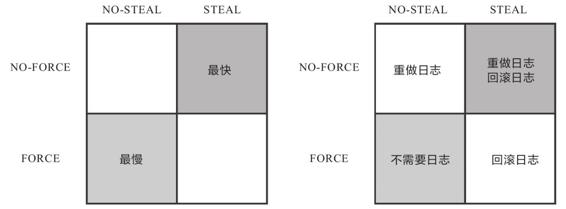
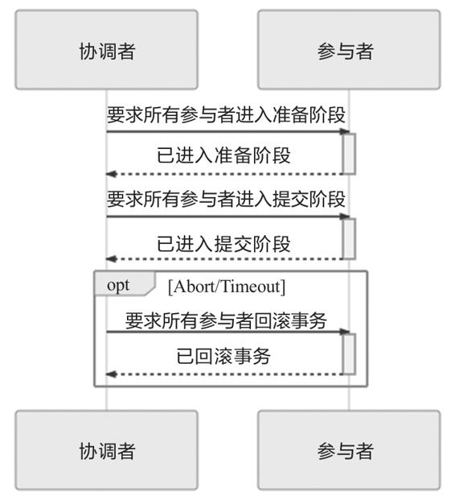
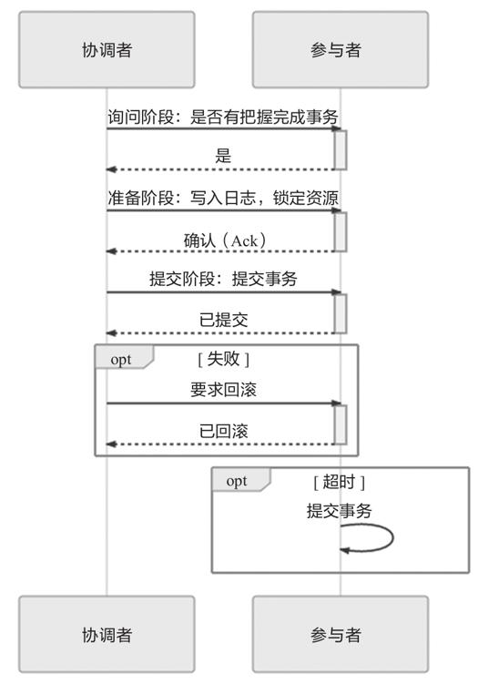
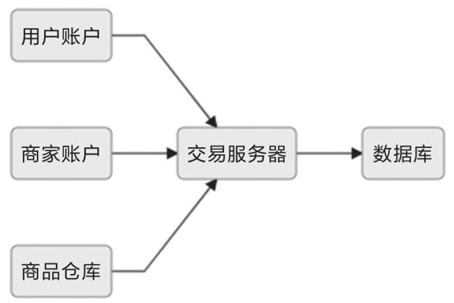
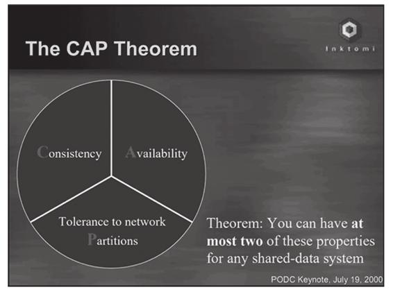
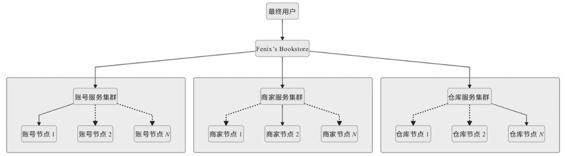
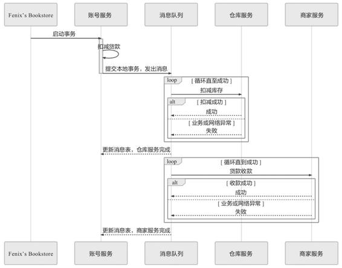
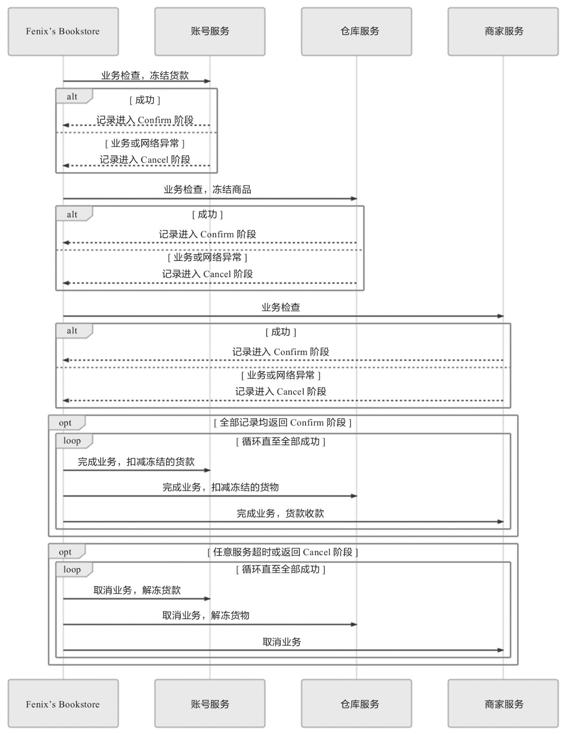

## 第3章 事务处理

事务处理几乎在每一个信息系统中都会涉及，它存在的意义是为了保证系统中所有的数据都是符合期望的，且相互关联的数据之间不会产生矛盾，即数据状态的一致性（Consistency）。按照数据库的经典理论，要达成这个目标，需要三方面共同努力来保障。

·原子性（Atomic）：在同一项业务处理过程中，事务保证了对多个数据的修改，要么同时成功，要么同时被撤销。

·隔离性（Isolation）：在不同的业务处理过程中，事务保证了各业务正在读、写的数据相互独立，不会彼此影响。

·持久性（Durability）：事务应当保证所有成功被提交的数据修改都能够正确地被持久化，不丢失数据。

以上四种属性即事务的“ACID”特性，但笔者对这种说法其实不太认同，因为这四种特性并不正交，A、I、D是手段，C是目的，前者是因，后者是果，弄到一块去完全是为了拼凑个单词缩写。

事务的概念虽然最初起源于数据库系统，但今天已经有所延伸，不再局限于数据库本身了。所有需要保证数据一致性的应用场景，包括但不限于数据库、事务内存、缓存、消息队列、分布式存储，等等，都有可能用到事务，后文里笔者会使用“数据源”来泛指所有这些场景中提供与存储数据的逻辑设备，但是上述场景所说的事务和一致性含义可能并不完全一致，说明如下。

·当一个服务只使用一个数据源时，通过A、I、D来获得一致性是最经典的做法，也是相对容易的。此时，多个并发事务所读写的数据能够被数据源感知是否存在冲突，并发事务的读写在时间线上的最终顺序是由数据源来确定的，这种事务间一致性被称为“内部一致性”。

·当一个服务使用到多个不同的数据源，甚至多个不同服务同时涉及多个不同的数据源时，问题就变得困难了许多。此时，并发执行甚至是先后执行的多个事务，在时间线上的顺序并不由任何一个数据源来决定，这种涉及多个数据源的事务间一致性被称为“外部一致性”[1]。

外部一致性问题通常很难使用A、I、D来解决，因为这样需要付出很大甚至不切实际的代价；但是外部一致性又是分布式系统中必然会遇到且必须要解决的问题，为此我们要转变观念，将一致性从“是或否”的二元属性转变为可以按不同强度分开讨论的多元属性，在确保代价可承受的前提下获得强度尽可能高的一致性保障，也正因如此，事务处理才从一个具体操作上的“编程问题”上升成一个需要全局权衡的“架构问题”。

人们在探索这些解决方案的过程中，产生了许多新的思路和概念，有一些概念看上去并不那么直观，在本章，笔者会通过同一个场景事例讲解如何在不同的事务方案中贯穿、理顺这些概念。

额外知识

场景事例

Fenix’s Bookstore是一个在线书店。当一本书被成功售出时，需要确保以下三件事情被正确地处理：

·用户的账号扣减相应的商品款项；

·商品仓库中扣减库存，将商品标识为待配送状态；

·商家的账号增加相应的商品款项。

接下来，笔者将逐一介绍在“单个服务使用单个数据源”“单个服务使用多个数据源”“多个服务使用单个数据源”以及“多个服务使用多个数据源”下，可以采用哪些手段来保证数据在以上场景中被正确地读写。

[1] 外部一致性的定义起源于Google的Spanner的论文，地址为https://cloud.google.com/spanner/docs/true-time-external-consistency。

### 3.1 本地事务

本地事务（Local Transaction）其实应该翻译成“局部事务”才好与稍后的“全局事务”相对应，不过现在“本地事务”的译法似乎已经成为主流，这里也就不去纠结名称了。本地事务是指仅操作单一事务资源的、不需要全局事务管理器进行协调的事务。在没有介绍什么是“全局事务管理器”前，很难从概念入手去讲解“本地事务”，所以这里先暂且将概念放下，等读完3.2节后再来对比理解。

本地事务是一种最基础的事务解决方案，只适用于单个服务使用单个数据源的场景。从应用角度看，它是直接依赖于数据源本身提供的事务能力来工作的，在程序代码层面，最多只能对事务接口做一层标准化的包装（如JDBC接口），并不能深入参与到事务的运作过程中，事务的开启、终止、提交、回滚、嵌套、设置隔离级别，乃至与应用代码贴近的事务传播方式，全部都要依赖底层数据源的支持才能工作，这一点与后续介绍的XA、TCC、SAGA等主要靠应用程序代码来实现的事务有着十分明显的区别。举个例子，假设你的代码调用了JDBC中的Transaction::rollback()方法，方法的成功执行也并不一定代表事务就已经被成功回滚，如果数据表采用的引擎是MyISAM，那rollback()方法便是一项没有意义的空操作。因此，我们要想深入讨论本地事务，便不得不越过应用代码的层次，去了解一些数据库本身的事务实现原理，弄明白传统数据库管理系统是如何通过ACID来实现事务的。

如今研究事务的实现原理，必定会追溯到ARIES理论[1]（Algorithms for Recovery and Isolation Exploiting Semantic，ARIES），直接翻译过来是“基于语义的恢复与隔离算法”。

ARIES是现代数据库的基础理论，就算不能称所有的数据库都实现了ARIES，至少可以称现代的主流关系型数据库（Oracle、MS SQLServer、MySQL/InnoDB、IBM DB2、PostgreSQL，等等）在事务实现上都深受该理论的影响。在20世纪90年代，IBM Almaden研究院总结了研发原型数据库系统“IBM System R”的经验，发表了ARIES理论中最主要的三篇论文[2]，其中“ARIES:A Transaction Recovery Method Supporting Fine-Granularity Locking and Partial Rollbacks Using Write-Ahead Logging”[3]着重解决了ACID的两个属性——原子性（A）和持久性（D）在算法层面上的实现问题。而另一篇“ARIES/KVL:A Key-Value Locking Method for Concurrency Control of Multiaction Transactions Operating on B-Tree Indexes”[4]则是现代数据库隔离性（I）奠基式的文章。下面，我们先从原子性和持久性说起。

[1] ARIES理论：https://en.wikipedia.org/wiki/Algorithms_for_Recovery_and_Isolation_Exploiting_Semantics。

[2] 这个系列的第三篇是“ARIES/lM:An Efficient and High Concurrency Index Management Method Using Write-Ahead Logging”，本文不会涉及。

[3] 下载地址：https://cs.stanford.edu/people/chrismre/cs345/rl/aries.pdf。

[4] 下载地址：http://vldb.org/conf/1990/P392.PDF。

#### 3.1.1 实现原子性和持久性

原子性和持久性在事务里是密切相关的两个属性：原子性保证了事务的多个操作要么都生效要么都不生效，不会存在中间状态；持久性保证了一旦事务生效，就不会再因为任何原因而导致其修改的内容被撤销或丢失。

众所周知，数据必须要成功写入磁盘、磁带等持久化存储器后才能拥有持久性，只存储在内存中的数据，一旦遇到应用程序忽然崩溃，或者数据库、操作系统一侧崩溃，甚至是机器突然断电宕机等情况就会丢失，后文我们将这些意外情况都统称为“崩溃”（Crash）。实现原子性和持久性的最大困难是“写入磁盘”这个操作并不是原子的，不仅有“写入”与“未写入”状态，还客观存在着“正在写”的中间状态。由于写入中间状态与崩溃都不可能消除，所以如果不做额外保障措施的话，将内存中的数据写入磁盘，并不能保证原子性与持久性。下面通过具体事例来说明。

按照前面预设的场景事例，从Fenix’s Bookstore购买一本书需要修改三个数据：在用户账户中减去货款、在商家账户中增加货款、在商品仓库中标记一本书为配送状态。由于写入存在中间状态，所以可能出现以下情形。

·未提交事务，写入后崩溃：程序还没修改完三个数据，但数据库已经将其中一个或两个数据的变动写入磁盘，若此时出现崩溃，一旦重启之后，数据库必须要有办法得知崩溃前发生过一次不完整的购物操作，将已经修改过的数据从磁盘中恢复成没有改过的样子，以保证原子性。

·已提交事务，写入前崩溃：程序已经修改完三个数据，但数据库还未将全部三个数据的变动都写入磁盘，若此时出现崩溃，一旦重启之后，数据库必须要有办法得知崩溃前发生过一次完整的购物操作，将还没来得及写入磁盘的那部分数据重新写入，以保证持久性。

由于写入中间状态与崩溃都是无法避免的，为了保证原子性和持久性，就只能在崩溃后采取恢复的补救措施，这种数据恢复操作被称为“崩溃恢复”（Crash Recovery，也有资料称作Failure Recovery或Transaction Recovery）。

为了能够顺利地完成崩溃恢复，在磁盘中写入数据就不能像程序修改内存中的变量值那样，直接改变某表某行某列的某个值，而是必须将修改数据这个操作所需的全部信息，包括修改什么数据、数据物理上位于哪个内存页和磁盘块中、从什么值改成什么值，等等，以日志的形式——即以仅进行顺序追加的文件写入的形式（这是最高效的写入方式）先记录到磁盘中。只有在日志记录全部安全落盘，数据库在日志中看到代表事务成功提交的“提交记录”（Commit Record）后，才会根据日志上的信息对真正的数据进行修改，修改完成后，再在日志中加入一条“结束记录”（End Record）表示事务已完成持久化，这种事务实现方法被称为“提交日志”（Commit Logging）。

额外知识

Shadow Paging

通过日志实现事务的原子性和持久性是当今的主流方案，但并不是唯一的选择。除日志外，还有另外一种称为“Shadow Paging”（有中文资料翻译为“影子分页”）的事务实现机制，常用的轻量级数据库SQLite Version 3采用的事务机制就是Shadow Paging。

Shadow Paging的大体思路是对数据的变动会写到硬盘的数据中，但不是直接就地修改原先的数据，而是先复制一份副本，保留原数据，修改副本数据。在事务处理过程中，被修改的数据会同时存在两份，一份是修改前的数据，一份是修改后的数据，这也是“影子”（Shadow）这个名字的由来。当事务成功提交，所有数据的修改都成功持久化之后，最后一步是修改数据的引用指针，将引用从原数据改为新复制并修改后的副本，最后的“修改指针”这个操作将被认为是原子操作，现代磁盘的写操作的作用可以认为是保证了在硬件上不会出现“改了半个值”的现象。所以Shadow Paging也可以保证原子性和持久性。Shadow Paging实现事务要比Commit Logging更加简单，但涉及隔离性与并发锁时，Shadow Paging实现的事务并发能力就相对有限，因此在高性能的数据库中应用不多。

Commit Logging保障数据持久性、原子性的原理并不难理解：首先，日志一旦成功写入Commit Record，那整个事务就是成功的，即使真正修改数据时崩溃了，重启后根据已经写入磁盘的日志信息恢复现场、继续修改数据即可，这保证了持久性；其次，如果日志没有成功写入Commit Record就发生崩溃，那整个事务就是失败的，系统重启后会看到一部分没有Commit Record的日志，将这部分日志标记为回滚状态即可，整个事务就像完全没有发生过一样，这保证了原子性。

Commit Logging的原理很清晰，也确实有一些数据库就是直接采用Commit Logging机制来实现事务的，譬如较具代表性的是阿里的OceanBase。但是，Commit Logging存在一个巨大的先天缺陷：所有对数据的真实修改都必须发生在事务提交以后，即日志写入了Commit Record之后。在此之前，即使磁盘I/O有足够空闲，即使某个事务修改的数据量非常庞大，占用了大量的内存缓冲区，无论何种理由，都决不允许在事务提交之前就修改磁盘上的数据，这一点是Commit Logging成立的前提，却对提升数据库的性能十分不利。为此，ARIES提出了“提前写入日志”（Write-Ahead Logging）的日志改进方案，所谓“提前写入”（Write-Ahead），就是允许在事务提交之前写入变动数据的意思。

Write-Ahead Logging按照事务提交时点，将何时写入变动数据划分为FORCE和STEAL两类情况。

·FORCE：当事务提交后，要求变动数据必须同时完成写入则称为FORCE，如果不强制变动数据必须同时完成写入则称为NO-FORCE。现实中绝大多数数据库采用的都是NO-FORCE策略，因为只要有了日志，变动数据随时可以持久化，从优化磁盘I/O性能考虑，没有必要强制数据写入时立即进行。

·STEAL：在事务提交前，允许变动数据提前写入则称为STEAL，不允许则称为NO-STEAL。从优化磁盘I/O性能考虑，允许数据提前写入，有利于利用空闲I/O资源，也有利于节省数据库缓存区的内存。

Commit Logging允许NO-FORCE，但不允许STEAL。因为假如事务提交前就有部分变动数据写入磁盘，那一旦事务要回滚，或者发生了崩溃，这些提前写入的变动数据就都成了错误。

Write-Ahead Logging允许NO-FORCE，也允许STEAL，它给出的解决办法是增加了另一种被称为Undo Log的日志类型，当变动数据写入磁盘前，必须先记录Undo Log，注明修改了哪个位置的数据、从什么值改成什么值等，以便在事务回滚或者崩溃恢复时根据Undo Log对提前写入的数据变动进行擦除。Undo Log现在一般被翻译为“回滚日志”，此前记录的用于崩溃恢复时重演数据变动的日志就相应被命名为Redo Log，一般翻译为“重做日志”。由于Undo Log的加入，Write-Ahead Logging在崩溃恢复时会经历以下三个阶段。

·分析阶段（Analysis）：该阶段从最后一次检查点（Checkpoint，可理解为在这个点之前所有应该持久化的变动都已安全落盘）开始扫描日志，找出所有没有End Record的事务，组成待恢复的事务集合，这个集合至少会包括事务表（Transaction Table）和脏页表（Dirty Page Table）两个组成部分。

·重做阶段（Redo）：该阶段依据分析阶段中产生的待恢复的事务集合来重演历史（Repeat History），具体操作是找出所有包含Commit Record的日志，将这些日志修改的数据写入磁盘，写入完成后在日志中增加一条End Record，然后移出待恢复事务集合。

·回滚阶段（Undo）：该阶段处理经过分析、重做阶段后剩余的恢复事务集合，此时剩下的都是需要回滚的事务，它们被称为Loser，根据Undo Log中的信息，将已经提前写入磁盘的信息重新改写回去，以达到回滚这些Loser事务的目的。

重做阶段和回滚阶段的操作都应该设计为幂等的。为了追求高I/O性能，以上三个阶段无可避免地会涉及非常烦琐的概念和细节（如Redo Log、Undo Log的具体数据结构等），囿于篇幅限制，笔者并不打算具体介绍这些内容，感兴趣的读者可以阅读本节开头引用的那两篇论文进行了解。Write-Ahead Logging是ARIES理论的一部分，整套ARIES拥有严谨、高性能等诸多优点，但这些也是以高度复杂为代价的。数据库按照是否允许FORCE和STEAL可以产生四种组合，从优化磁盘I/O的角度看，NO-FORCE加STEAL的组合的性能无疑是最高的；从算法实现与日志的角度看，NO-FORCE加STEAL的组合的复杂度无疑也是最高的。这四种组合与Undo Log、Redo Log之间的具体关系如图3-1所示。



图3-1　FORCE和STEAL的四种组合关系

#### 3.1.2 实现隔离性

本节我们来探讨数据库是如何实现隔离性的。隔离性保证了每个事务各自读、写的数据互相独立，不会彼此影响。只从定义上就能嗅出隔离性肯定与并发密切相关，因为如果没有并发，所有事务全都是串行的，那就不需要任何隔离，或者说这样的访问具备了天然的隔离性。但现实情况是不可能没有并发，那么，要如何在并发下实现串行的数据访问呢？几乎所有程序员都会回答：加锁同步呀！正确，现代数据库均提供了以下三种锁。

·写锁（Write Lock，也叫作排他锁，eXclusive Lock，简写为X-Lock）：如果数据有加写锁，就只有持有写锁的事务才能对数据进行写入操作，数据加持着写锁时，其他事务不能写入数据，也不能施加读锁。

·读锁（Read Lock，也叫作共享锁，Shared Lock，简写为S-Lock）：多个事务可以对同一个数据添加多个读锁，数据被加上读锁后就不能再被加上写锁，所以其他事务不能对该数据进行写入，但仍然可以读取。对于持有读锁的事务，如果该数据只有它自己一个事务加了读锁，则允许直接将其升级为写锁，然后写入数据。

·范围锁（Range Lock）：对于某个范围直接加排他锁，在这个范围内的数据不能被写入。如下语句是典型的加范围锁的例子：

```
SELECT * FROM books WHERE price < 100 FOR UPDATE;
```

请注意“范围不能被写入”与“一批数据不能被写入”的差别，即不要把范围锁理解成一组排他锁的集合。加了范围锁后，不仅不能修改该范围内已有的数据，也不能在该范围内新增或删除任何数据，后者是一组排他锁的集合无法做到的。

串行化访问提供了最高强度的隔离性，ANSI/ISO SQL-92[1]中定义的最高等级的隔离级别便是可串行化（Serializable）。可串行化完全符合普通程序员对数据竞争加锁的理解，如果不考虑性能优化的话，对事务所有读、写的数据全都加上读锁、写锁和范围锁即可做到可串行化，“即可”是简化理解，实际还是很复杂的，要分成加锁（Expanding）和解锁（Shrinking）两阶段去处理读锁、写锁与数据间的关系，称为两阶段锁（Two-Phase Lock，2PL）。但数据库不考虑性能肯定是不行的，并发控制（Concurrency Control）理论[2]决定了隔离程度与并发能力是相互抵触的，隔离程度越高，并发访问时的吞吐量就越低。现代数据库一定会提供除可串行化以外的其他隔离级别供用户使用，让用户自主调节隔离级别，根本目的是让用户可以调节数据库的加锁方式，取得隔离性与吞吐量之间的平衡。

可串行化的下一个隔离级别是可重复读（Repeatable Read），可重复读对事务所涉及的数据加读锁和写锁，且一直持有至事务结束，但不再加范围锁。可重复读比可串行化弱化的地方在于幻读问题（Phantom Read），它是指在事务执行过程中，两个完全相同的范围查询得到了不同的结果集。譬如现在要准备统计一下Fenix’s Bookstore中售价小于100元的书的本数，可以执行以下第一条SQL语句：

```
SELECT count(1) FROM books WHERE price < 100 /* 时间顺序：1，事务： T1 */
INSERT INTO books(name,price) VALUES ('深入理解Java虚拟机',90)/* 时间顺序：2，事务： T2 */
SELECT count(1) FROM books WHERE price < 100 /* 时间顺序：3，事务： T1 */
```

根据前面对范围锁、读锁和写锁的定义可知，假如这条SQL语句在同一个事务中重复执行了两次，且这两次执行之间恰好有另外一个事务在数据库插入了一本小于100元的书，这是会被允许的，那这两次相同的SQL查询就会得到不一样的结果，原因是可重复读没有范围锁来禁止在该范围内插入新的数据，这是一个事务受到其他事务影响，隔离性被破坏的表现。

注意，这里的介绍是以ARIES理论为讨论目标，具体的数据库并不一定要完全遵照理论去实现。一个例子是MySQL/InnoDB的默认隔离级别为可重复读，但它在只读事务中可以完全避免幻读问题，譬如上面例子中事务T1只有查询语句，是一个只读事务，所以上述问题在MySQL中并不会出现。但在读写事务中，MySQL仍然会出现幻读问题，譬如例子中事务T1如果在其他事务插入新书后，不是重新查询一次数量，而是将所有小于100元的书改名，那就依然会受到新插入书的影响。

可重复读的下一个隔离级别是读已提交（Read Committed），读已提交对事务涉及的数据加的写锁会一直持续到事务结束，但加的读锁在查询操作完成后会马上释放。读已提交比可重复读弱化的地方在于不可重复读问题（Non-Repeatable Read），它是指在事务执行过程中，对同一行数据的两次查询得到了不同的结果。譬如笔者要获取Fenix’s Bookstore中《深入理解Java虚拟机》这本书的售价，同样执行了两条SQL语句，在此两条语句执行之间，恰好有另外一个事务修改了这本书的价格，将书的价格从90元调整到了110元，如下SQL所示：

```
SELECT * FROM books WHERE id = 1; /* 时间顺序：1，事务： T1 */
UPDATE books SET price = 110 WHERE id = 1; COMMIT; /* 时间顺序：2，事务： T2 */
SELECT * FROM books WHERE id = 1; COMMIT; /* 时间顺序：3，事务： T1 */
```

如果隔离级别是读已提交，这两次重复执行的查询结果就会不一样，原因是读已提交的隔离级别缺乏贯穿整个事务周期的读锁，无法禁止读取过的数据发生变化，此时事务T2中的更新语句可以马上提交成功，这也是一个事务受到其他事务影响，隔离性被破坏的表现。假如隔离级别是可重复读，由于数据已被事务T1施加了读锁且读取后不会马上释放，所以事务T2无法获取到写锁，更新就会被阻塞，直至事务T1被提交或回滚后才能提交。

读已提交的下一个级别是读未提交（Read Uncommitted），它只会对事务涉及的数据加写锁，且一直持续到事务结束，但完全不加读锁。读未提交比读已提交弱化的地方在于脏读问题（Dirty Read），它是指在事务执行过程中，一个事务读取到了另一个事务未提交的数据。譬如笔者觉得《深入理解Java虚拟机》从90元涨价到110元是损害消费者利益的行为，又执行了一条更新语句把价格改回了90元，在提交事务之前，同事说这并不是随便涨价，而是印刷成本上升导致的，按90元卖要亏本，于是笔者随即回滚了事务，如下SQL所示：

```
SELECT * FROM books WHERE id = 1; /* 时间顺序：1，事务： T1 */
/* 注意没有COMMIT */
UPDATE books SET price = 90 WHERE id = 1; /* 时间顺序：2，事务： T2 */
/* 这条SELECT模拟购书的操作的逻辑 */
SELECT * FROM books WHERE id = 1; /* 时间顺序：3，事务： T1 */
ROLLBACK;/* 时间顺序：4，事务： T2 */
```

不过，在之前修改价格后，事务T1已经按90元的价格卖出了几本。原因是读未提交在数据上完全不加读锁，这反而令它能读到其他事务加了写锁的数据，即上述事务T1中两条查询语句得到的结果并不相同。如果你不能理解这句话中的“反而”二字，请再读一次写锁的定义：写锁禁止其他事务施加读锁，而不是禁止事务读取数据，如果事务T1读取数据前并不需要加读锁的话，就会导致事务T2未提交的数据也马上能被事务T1所读到。这同样是一个事务受到其他事务影响，隔离性被破坏的表现。假如隔离级别是读已提交的话，由于事务T2持有数据的写锁，所以事务T1的第二次查询就无法获得读锁，而读已提交级别是要求先加读锁后读数据的，因此T1中的查询就会被阻塞，直至事务T2被提交或者回滚后才能得到结果。

理论上还存在更低的隔离级别，就是“完全不隔离”，即读、写锁都不加。读未提交会有脏读问题，但不会有脏写问题（Dirty Write），即一个事务没提交之前的修改可以被另外一个事务的修改覆盖掉。脏写已经不单纯是隔离性上的问题了，它将导致事务的原子性都无法实现，所以一般谈论隔离级别时不会将完全不隔离纳入讨论范围内，而是将读未提交视为最低级的隔离级别。

以上四种隔离级别属于数据库理论的基础知识，多数大学的计算机课程应该都会讲到，可惜的是不少教材、资料将它们当作数据库的某种固有属性或设定来讲解，导致很多同学只能对这些现象死记硬背。其实不同隔离级别以及幻读、不可重复读、脏读等问题都只是表面现象，是各种锁在不同加锁时间上组合应用所产生的结果，以锁为手段来实现隔离性才是数据库表现出不同隔离级别的根本原因。

除了都以锁来实现外，以上四种隔离级别还有另外一个共同特点，就是幻读、不可重复读、脏读等问题都是由于一个事务在读数据的过程中，受另外一个写数据的事务影响而破坏了隔离性。针对这种“一个事务读+另一个事务写”的隔离问题，近年来有一种名为“多版本并发控制[3]”（Multi-Version Concurrency Control，MVCC）的无锁优化方案被主流的商业数据库广泛采用。MVCC是一种读取优化策略，它的“无锁”特指读取时不需要加锁。MVCC的基本思路是对数据库的任何修改都不会直接覆盖之前的数据，而是产生一个新版本与老版本共存，以此达到读取时可以完全不加锁的目的。在这句话中，“版本”是个关键词，你不妨将版本理解为数据库中每一行记录都存在两个看不见的字段：CREATE_VERSION和DELETE_VERSION，这两个字段记录的值都是事务ID，事务ID是一个全局严格递增的数值，然后根据以下规则写入数据。

·插入数据时：CREATE_VERSION记录插入数据的事务ID，DELETE_VERSION为空。

·删除数据时：DELETE_VERSION记录删除数据的事务ID，CREATE_VERSION为空。

·修改数据时：将修改数据视为“删除旧数据，插入新数据”的组合，即先将原有数据复制一份，原有数据的DELETE_VERSION记录修改数据的事务ID，CREATE_VERSION为空。复制后的新数据的CREATE_VERSION记录修改数据的事务ID，DELETE_VERSION为空。

此时，如有另外一个事务要读取这些发生了变化的数据，将根据隔离级别来决定到底应该读取哪个版本的数据。

·隔离级别是可重复读：总是读取CREATE_VERSION小于或等于当前事务ID的记录，在这个前提下，如果数据仍有多个版本，则取最新（事务ID最大）的。

·隔离级别是读已提交：总是取最新的版本即可，即最近被提交的那个版本的数据记录。

另外两个隔离级别都没有必要用到MVCC，因为读未提交直接修改原始数据即可，其他事务查看数据的时候立刻可以看到，根本无须版本字段。可串行化本来的语义就是要阻塞其他事务的读取操作，而MVCC是做读取时的无锁优化的，自然不会放到一起用。

MVCC是只针对“读+写”场景的优化，如果是两个事务同时修改数据，即“写+写”的情况，那就没有多少优化的空间了，此时加锁几乎是唯一可行的解决方案，稍微有点讨论余地的是加锁策略是选“乐观加锁”（Optimistic Locking）还是选“悲观加锁”（Pessimistic Locking）。前面笔者介绍的加锁都属于悲观加锁策略，即认为如果不先加锁再访问数据，就肯定会出现问题。相对地，乐观加锁策略认为事务之间数据存在竞争是偶然情况，没有竞争才是普遍情况，这样就不应该在一开始就加锁，而是应当在出现竞争时再找补救措施。这种思路也被称为“乐观并发控制”（Optimistic Concurrency Control，OCC），囿于篇幅与主题，这里就不再展开了，不过笔者提醒一句，没有必要迷信什么乐观锁要比悲观锁更快的说法，这纯粹看竞争的激烈程度，如果竞争激烈的话，乐观锁反而更慢。

[1] SQL-92标准：https://en.wikipedia.org/wiki/SQL-92。

[2] 并发控制理论：https://en.wikipedia.org/wiki/Concurrency_control。

[3] MVCC：https://en.wikipedia.org/wiki/Multiversion_concurrency_control。

### 3.2 全局事务

与本地事务相对的是全局事务（Global Transaction），在一些资料中也将其称为外部事务（External Transaction），在本节里，全局事务被限定为一种适用于单个服务使用多个数据源场景的事务解决方案。请注意，理论上真正的全局事务并没有“单个服务”的约束，它本来就是DTP（Distributed Transaction Processing，分布式事务处理）模型[1]中的概念，但本节讨论的是一种在分布式环境中仍追求强一致性的事务处理方案，对于多节点而且互相调用彼此服务的场合（典型的就是现在的微服务系统）是极不合适的，当前它几乎只实际应用于单服务多数据源的场合中，为了避免与后续介绍的放弃了ACID的弱一致性事务处理方式混淆，所以这里的全局事务的范围有所缩减，后续涉及多服务多数据源的事务，笔者将称其为“分布式事务”。

1991年，为了解决分布式事务的一致性问题，X/Open组织（后来并入了The Open Group）提出了一套名为X/Open XA（XA是eXtended Architecture的缩写）的处理事务架构，其核心内容是定义了全局的事务管理器（Transaction Manager，用于协调全局事务）和局部的资源管理器（Resource Manager，用于驱动本地事务）之间的通信接口。XA接口是双向的，能在一个事务管理器和多个资源管理器（Resource Manager）之间形成通信桥梁，通过协调多个数据源的一致动作，实现全局事务的统一提交或者统一回滚，现在我们在Java代码中还偶尔能看见的XADataSource、XAResource都源于此。

不过，XA并不是Java的技术规范（XA提出那时还没有Java），而是一套语言无关的通用规范，所以Java中专门定义了JSR 907 Java Transaction API，基于XA模式在Java语言中实现了全局事务处理的标准，这也是我们现在所熟知的JTA。JTA最主要的两个接口如下。

·事务管理器的接口：javax.transaction.TransactionManager。这套接口用于为Java EE服务器提供容器事务（由容器自动负责事务管理）。JTA还提供了另外一套javax.transaction.UserTransaction接口，用于通过程序代码手动开启、提交和回滚事务。

·满足XA规范的资源定义接口：javax.transaction.xa.XAResource。任何资源（JDBC、JMS等）如果想要支持JTA，只要实现XAResource接口中的方法即可。

JTA原本是Java EE中的技术，一般情况下应该由JBoss、WebSphere、WebLogic这些Java EE容器来提供支持，但现在Bittronix、Atomikos和JBossTM（以前叫Arjuna）都以JAR包的形式实现了JTA的接口，称为JOTM（Java Open Transaction Manager，Java开源事务管理器），使得我们也能够在Tomcat、Jetty这样的Java SE环境下使用JTA。

现在，我们对本章的场景事例做另外一种假设：如果书店的用户、商家、仓库分别处于不同的数据库中，其他条件仍与之前相同，那情况会发生什么变化呢？假如你平时以声明式事务来编码，那它与本地事务看起来可能没什么区别，都是标一个@Transactional注解而已，但如果以编程式事务来实现的话，就能在写法上看出差异，伪代码如下所示：

```
public void buyBook(PaymentBill bill) {
    userTransaction.begin();
    warehouseTransaction.begin();
    businessTransaction.begin();
    try {
        userAccountService.pay(bill.getMoney());
        warehouseService.deliver(bill.getItems());
        businessAccountService.receipt(bill.getMoney());
        userTransaction.commit();
        warehouseTransaction.commit();
        businessTransaction.commit();
    } catch(Exception e) {
        userTransaction.rollback();
        warehouseTransaction.rollback();
        businessTransaction.rollback();
    }
}
```

从代码可以看出，程序的目的是做三次事务提交，但实际上代码并不能这样写，试想一下，如果在businessTransaction.commit()中出现错误，代码转到catch块中执行，此时userTransaction和warehouseTransaction已经完成提交，再去调用rollback()方法已经无济于事，这将导致一部分数据被提交，另一部分被回滚，整个事务的一致性也就无法保证了。为了解决这个问题，XA将事务提交拆分成两阶段。

·准备阶段：又叫作投票阶段，在这一阶段，协调者询问事务的所有参与者是否准备好提交，参与者如果已经准备好提交则回复Prepared，否则回复Non-Prepared。这里所说的准备操作跟人类语言中通常理解的准备不同，对于数据库来说，准备操作是在重做日志中记录全部事务提交操作所要做的内容，它与本地事务中真正提交的区别只是暂不写入最后一条Commit Record而已，这意味着在做完数据持久化后并不立即释放隔离性，即仍继续持有锁，维持数据对其他非事务内观察者的隔离状态。

·提交阶段：又叫作执行阶段，协调者如果在上一阶段收到所有事务参与者回复的Prepared消息，则先自己在本地持久化事务状态为Commit，然后向所有参与者发送Commit指令，让所有参与者立即执行提交操作；否则，任意一个参与者回复了Non-Prepared消息，或任意一个参与者超时未回复时，协调者将在自己完成事务状态为Abort持久化后，向所有参与者发送Abort指令，让参与者立即执行回滚操作。对于数据库来说，这个阶段的提交操作应是很轻量的，仅仅是持久化一条Commit Record而已，通常能够快速完成，只有收到Abort指令时，才需要根据回滚日志清理已提交的数据，这可能是相对重负载操作。

以上这两个过程被称为“两段式提交”（2 Phase Commit，2PC）协议，而它能够成功保证一致性还需要一些其他前提条件。

·必须假设网络在提交阶段的短时间内是可靠的，即提交阶段不会丢失消息。同时也假设网络通信在全过程都不会出现误差，即可以丢失消息，但不会传递错误的消息，XA的设计目标并不是解决诸如拜占庭将军一类的问题。在两段式提交中，投票阶段失败了可以补救（回滚），提交阶段失败了则无法补救（不再改变提交或回滚的结果，只能等崩溃的节点重新恢复），因而此阶段耗时应尽可能短，这也是为了尽量控制网络风险。

·必须假设因为网络分区、机器崩溃或者其他原因而导致失联的节点最终能够恢复，不会永久性地处于失联状态。由于在准备阶段已经写入了完整的重做日志，所以当失联机器一旦恢复，就能够从日志中找出已准备妥当但并未提交的事务数据，进而向协调者查询该事务的状态，确定下一步应该进行提交还是回滚操作。

请注意，上面所说的协调者、参与者通常都是由数据库自己来扮演的，不需要应用程序介入。协调者一般是在参与者之间选举产生，而应用程序对于数据库来说只扮演客户端的角色。两段式提交的交互时序示意图如图3-2所示。



图3-2　两段式提交的交互时序示意图

两段式提交原理简单，并不难实现，但有几个非常显著的缺点。

·单点问题：协调者在两段式提交中具有举足轻重的作用，协调者等待参与者回复时可以有超时机制，允许参与者宕机，但参与者等待协调者指令时无法做超时处理。一旦宕机的不是其中某个参与者，而是协调者的话，所有参与者都会受到影响。如果协调者一直没有恢复，没有正常发送Commit或者Rollback的指令，那所有参与者都必须一直等待。

·性能问题：在两段式提交过程中，所有参与者相当于被绑定为一个统一调度的整体，期间要经过两次远程服务调用，三次数据持久化（准备阶段写重做日志，协调者做状态持久化，提交阶段在日志写入提交记录），整个过程将持续到参与者集群中最慢的那一个处理操作结束为止，这决定了两段式提交的性能通常都较差。

·一致性风险：前面已经提到，两段式提交的成立是有前提条件的，当网络稳定性和宕机恢复能力的假设不成立时，仍可能出现一致性问题。宕机恢复能力这一点不必多谈，1985年Fischer、Lynch、Paterson提出了“FLP不可能原理”，证明了如果宕机最后不能恢复，那就不存在任何一种分布式协议可以正确地达成一致性结果。该原理在分布式中是与CAP不可兼得原理齐名的理论。而网络稳定性带来的一致性风险是指：尽管提交阶段时间很短，但这仍是一段明确存在的危险期，如果协调者在发出准备指令后，根据收到各个参与者发回的信息确定事务状态是可以提交的，协调者会先持久化事务状态，并提交自己的事务，如果这时候网络忽然断开，无法再通过网络向所有参与者发出Commit指令的话，就会导致部分数据（协调者的）已提交，但部分数据（参与者的）未提交，且没有办法回滚，产生数据不一致的问题。

为了缓解两段式提交协议的一部分缺陷，具体地说是协调者的单点问题和准备阶段的性能问题，后续又发展出了“三段式提交”（3 Phase Commit，3PC）协议。三段式提交把原本的两段式提交的准备阶段再细分为两个阶段，分别称为CanCommit、PreCommit，把提交阶段改称为DoCommit阶段。其中，新增的CanCommit是一个询问阶段，即协调者让每个参与的数据库根据自身状态，评估该事务是否有可能顺利完成。将准备阶段一分为二的理由是这个阶段是重负载的操作，一旦协调者发出开始准备的消息，每个参与者都将马上开始写重做日志，它们所涉及的数据资源即被锁住，如果此时某一个参与者宣告无法完成提交，相当于大家都做了一轮无用功。所以，增加一轮询问阶段，如果都得到了正面的响应，那事务能够成功提交的把握就比较大了，这也意味着因某个参与者提交时发生崩溃而导致大家全部回滚的风险相对变小。因此，在事务需要回滚的场景中，三段式提交的性能通常要比两段式提交好很多，但在事务能够正常提交的场景中，两者的性能都很差，甚至三段式因为多了一次询问，还要稍微更差一些。

同样也是由于事务失败回滚概率变小，在三段式提交中，如果在PreCommit阶段之后发生了协调者宕机，即参与者没有等到DoCommit的消息的话，默认的操作策略将是提交事务而不是回滚事务或者持续等待，这就相当于避免了协调者单点问题的风险。三段式提交的操作时序如图3-3所示。

从以上过程可以看出，三段式提交对单点问题和回滚时的性能问题有所改善，但是对一致性风险问题并未有任何改进，甚至是略有增加的。譬如，进入PreCommit阶段之后，协调者发出的指令不是Ack而是Abort，而此时因网络问题，有部分参与者直至超时都未能收到协调者的Abort指令的话，这些参与者将会错误地提交事务，这就产生了不同参与者之间数据不一致的问题。



图3-3　三段式提交的操作时序

[1] DTP模型：https://en.wikipedia.org/wiki/Distributed_transaction。

### 3.3 共享事务

与全局事务里讨论的单个服务使用多个数据源正好相反，共享事务（Share Transaction）是指多个服务共用同一个数据源。这里有必要再强调一次“数据源”与“数据库”的区别：数据源是指提供数据的逻辑设备，不必与物理设备一一对应。在部署应用集群时最常采用的模式是将同一套程序部署到多个中间件服务器上，构成多个副本实例来分担流量压力。它们虽然连接了同一个数据库，但每个节点配有自己的专属数据源，通常是中间件以JNDI的形式开放给程序代码使用。在这种情况下，所有副本实例的数据访问都是完全独立的，并没有任何交集，每个节点使用的仍是最简单的本地事务。而本节讨论的是多个服务之间会产生业务交集的场景，举个具体例子，在Fenix’s Bookstore的场景事例中，假设用户账户、商家账户和商品仓库都存储于同一个数据库之中，但用户、商家和仓库都部署了独立的微服务，此时一次购书的业务操作将贯穿三个微服务，且它们都要在数据库中修改数据。如果我们直接将不同数据源视为不同数据库，那上一节所讲的全局事务和下一节要讲的分布式事务都是可行的，不过，针对这种每个数据源连接的都是同一个物理数据库的特例，共享事务很有可能成为另一条提高性能、降低复杂度的途径，当然，也很有可能是一个伪需求。

一种理论可行的方案是直接让各个服务共享数据库连接，在同一个应用进程中的不同持久化工具（JDBC、ORM、JMS等）中共享数据库连接并不困难，某些中间件服务器，譬如WebSphere会内置“可共享连接”功能来专门给予这方面的支持。但这种共享的前提是数据源的使用者都在同一个进程内，由于数据库连接的基础是网络连接，它是与IP地址和端口号绑定的，字面意义上的“不同服务节点共享数据库连接”很难做到，所以为了实现共享事务，就必须新增一个“交易服务器”的中间角色，无论是用户服务、商家服务还是仓库服务，都通过同一台交易服务器来与数据库打交道。如果按照JDBC规范来实现交易服务器的对外接口的话，那它完全可以作为一个独立于各个服务的远程数据库连接池，或者直接作为数据库代理来看待。此时三个服务所发出的交易请求就有可能做到由交易服务器上的同一个数据库连接，通过本地事务的方式完成。譬如，交易服务器根据不同服务节点传来的同一个事务ID，使用同一个数据库连接来处理跨越多个服务的交易事务，如图3-4所示。



图3-4　使用同一个数据库处理多个交易服务

之所以强调理论可行，是因为该方案是与实际生产系统中的压力方向相悖的，一个服务集群里数据库才是压力最大而又最不容易伸缩拓展的“重灾区”，所以现实中只有类似ProxySQL、MaxScale这样用于对多个数据库实例做负载均衡的数据库代理（其实用ProxySQL代理单个数据库，再启用Connection Multiplexing，已经接近于前面所提及的交易服务器方案了），而几乎没有反过来代理一个数据库为多个应用提供事务协调的交易服务代理。这也是说它更有可能是个伪需求的原因，如果你有充足理由让多个微服务去共享数据库，就必须找到更加站得住脚的理由来向团队解释拆分微服务的目的是什么才行。

在日常开发中，上述方案还存在一类更为常见的变种形式：使用消息队列服务器来代替交易服务器，当用户、商家、仓库的服务操作业务时，通过消息将所有对数据库的改动传送到消息队列服务器，通过消息的消费者来统一完成由本地事务来保障的持久化操作。这被称作“单个数据库的消息驱动更新”（Message-Driven Update of a Single Database）。

“共享事务”的提法和这里所列的两种处理方式在实际应用中并不值得提倡，鲜有采用这种方式的成功案例，能够查询到的资料几乎都发源于十余年前Spring的核心开发者Dave Syer撰写的文章“Distributed Transactions in Spring,with and without XA”[1]。笔者把共享事务列为本章介绍的四种事务类型之一只是为了叙述逻辑的完备，尽管拆分微服务后仍然共享数据库的情况在现实中并不少见，但笔者个人不赞同将共享事务作为一种常规的解决方案来考量。

[1] 文章地址：https://www.javaworld.com/article/2077963/distributed-transactions-in-spring--with-and-without-xa.html。

### 3.4 分布式事务

本节所说的分布式事务（Distributed Transaction）特指多个服务同时访问多个数据源的事务处理机制，请注意它与DTP模型中“分布式事务”的差异。DTP模型中的“分布式”是相对于数据源而言的，并不涉及服务，这部分内容已经在3.2节里讨论过。本节所指的“分布式”是相对于服务而言的，如果严谨地说，它更应该被称为“在分布式服务环境下的事务处理机制”。

在2000年以前，人们曾经希望XA的事务机制在本节所说的分布式环境中也能良好应用，但这个美好的愿望今天已经被CAP理论彻底击碎了，接下来就先从CAP与ACID的矛盾说起。

#### 3.4.1 CAP与ACID

CAP定理（Consistency、Availability、Partition Tolerance Theorem），也称为Brewer定理，起源于2000年7月，是加州大学伯克利分校的Eric Brewer教授于“ACM分布式计算原理研讨会（PODC）”上提出的一个猜想，如图3-5所示。



图3-5　CAP理论原稿（那时候还只是猜想）[1]

两年后，麻省理工学院的Seth Gilbert和Nancy Lynch以严谨的数学推理证明了CAP猜想。自此，CAP正式从猜想变为分布式计算领域所公认的著名定理。这个定理描述了在一个分布式系统中，涉及共享数据问题时，以下三个特性最多只能同时满足其中两个。

·一致性（Consistency）：代表数据在任何时刻、任何分布式节点中所看到的都是符合预期的。一致性在分布式研究中是有严肃定义、有多种细分类型的概念，以后讨论分布式共识算法时，我们还会提到一致性，但那种面向副本复制的一致性与这里面向数据库状态的一致性从严格意义来说并不完全等同，具体差别我们将在第6章再作探讨。

·可用性（Availability）：代表系统不间断地提供服务的能力。理解可用性要先理解与其密切相关的两个指标：可靠性（Reliability）和可维护性（Serviceability）。可靠性使用平均无故障时间（Mean Time Between Failure，MTBF）来度量；可维护性使用平均可修复时间（Mean Time To Repair，MTTR）来度量。可用性衡量系统可以正常使用的时间与总时间之比，其表征为：A=MTBF/（MTBF+MTTR），即可用性是由可靠性和可维护性计算得出的比例值，譬如99.9999%可用，即代表平均年故障修复时间为32秒。

·分区容忍性（Partition Tolerance）：代表分布式环境中部分节点因网络原因而彼此失联后，即与其他节点形成“网络分区”时，系统仍能正确地提供服务的能力。

单纯只列概念，CAP是比较抽象的，笔者仍以本章开头所列的场景事例来说明这三种特性对分布式系统来说将意味着什么。假设Fenix’s Bookstore的服务拓扑如图3-6所示，一个来自最终用户的交易请求，将交由账号、商家和仓库服务集群中的某一个节点来完成响应。



图3-6　Fenix’s Bookstore的服务拓扑示意图

在这套系统中，每一个单独的服务节点都有自己的数据库[2]，假设某次交易请求分别由“账号节点1”“商家节点2”“仓库节点N”联合进行响应。当用户购买一件价值100元的商品后，账号节点1首先应给该用户账号扣减100元货款，它在自己数据库扣减100元很容易，但它还要把这次交易变动告知本集群的节点2到节点N，并要确保能正确变更商家和仓库集群其他账号节点中的关联数据，此时将可能面临以下情况。

·如果该变动信息没有及时同步给其他账号节点，将有可能导致用户购买另一商品时，被分配给另一个节点处理，由于看到账号上有不正确的余额而错误地发生了原本无法进行的交易，此为一致性问题。

·如果由于要把该变动信息同步给其他账号节点，必须暂时停止对该用户的交易服务，直至数据同步一致后再重新恢复，将可能导致用户在下一次购买商品时，因系统暂时无法提供服务而被拒绝交易，此为可用性问题。

·如果由于账号服务集群中某一部分节点因网络问题，无法正常与另一部分节点交换账号变动信息，此时服务集群中无论哪一部分节点对外提供的服务都可能是不正确的。整个集群不能承受由于部分节点之间的连接中断而不断继续正确地提供服务，此为分区容忍性问题。

以上仅仅分析了用户服务集群自身的CAP问题，对于整个Fenix’s Bookstore站点来说，它更是面临着来自于用户、商家和仓库服务集群带来的CAP问题。譬如，用户账号扣款后，由于未及时通知仓库服务中的全部节点，导致另一次交易中看到仓库里有不正确的库存数据而发生超售。又譬如因涉及仓库中某个商品的交易正在进行，为了同步用户、商家和仓库的交易变动，而暂时锁定该商品的交易服务，导致可用性问题，等等。

由于CAP定理已有严格的证明，本节不去探讨为何CAP不可兼得，而是直接分析舍弃C、A、P时所带来的不同影响。

·如果放弃分区容忍性（CA without P），意味着我们将假设节点之间的通信永远是可靠的。永远可靠的通信在分布式系统中必定是不成立的，这不是你想不想的问题，而是只要用到网络来共享数据，分区现象就始终存在。在现实中，最容易找到放弃分区容忍性的例子便是传统的关系数据库集群，这样的集群虽然依然采用由网络连接的多个节点来协同工作，但数据却不是通过网络来实现共享的。以Oracle的RAC集群为例，它的每一个节点均有自己独立的SGA、重做日志、回滚日志等部件，但各个节点是通过共享存储中的同一份数据文件和控制文件来获取数据，通过共享磁盘的方式来避免出现网络分区。因而Oracle RAC虽然也是由多个实例组成的数据库，但它并不能称作分布式数据库。

·如果放弃可用性（CP without A），意味着我们将假设一旦网络发生分区，节点之间的信息同步时间可以无限制地延长，此时，问题相当于退化到前面3.2节讨论的一个系统使用多个数据源的场景之中，我们可以通过2PC/3PC等手段，同时获得分区容忍性和一致性。在现实中，选择放弃可用性的情况一般出现在对数据质量要求很高的场合中，除了DTP模型的分布式数据库事务外，著名的HBase也属于CP系统。以HBase集群为例，假如某个RegionServer宕机了，这个RegionServer持有的所有键值范围都将离线，直到数据恢复过程完成为止，这个过程要消耗的时间是无法预先估计的。

·如果放弃一致性（AP without C），意味着我们将假设一旦发生分区，节点之间所提供的数据可能不一致。选择放弃一致性的AP系统是目前设计分布式系统的主流选择，因为P是分布式网络的天然属性，你再不想要也无法丢弃；而A通常是建设分布式的目的，如果可用性随着节点数量增加反而降低的话，很多分布式系统可能就失去了存在的价值，除非银行、证券这些涉及金钱交易的服务，宁可中断也不能出错，否则多数系统是不能容忍节点越多可用性反而越低的。目前大多数NoSQL库和支持分布式的缓存框架都是AP系统，以Redis集群为例，如果某个Redis节点出现网络分区，那仍不妨碍各个节点以自己本地存储的数据对外提供缓存服务，但这时有可能出现请求分配到不同节点时返回客户端的是不一致的数据的情况。

读到这里，不知道你是否对“选择放弃一致性的AP系统是目前设计分布式系统的主流选择”这个结论感到一丝无奈，本章讨论的话题“事务”原本的目的就是获得“一致性”，而在分布式环境中，“一致性”却不得不成为通常被牺牲、被放弃的那一项属性。但无论如何，我们建设信息系统，终究还是要确保操作结果至少在最终交付的时候是正确的，这句话的意思是允许数据在中间过程出错（不一致），但应该在输出时被修正过来。为此，人们又重新给一致性下了定义，将前面我们在CAP、ACID中讨论的一致性称为“强一致性”（Strong Consistency），有时也称为“线性一致性”（Linearizability，通常是在讨论共识算法的场景中），而把牺牲了C的AP系统又要尽可能获得正确结果的行为称为追求“弱一致性”。不过，如果单纯只说“弱一致性”那其实就是“不保证一致性”的意思。在弱一致性里，人们又总结出了一种稍微强一点的特例，被称为“最终一致性”（Eventual Consistency），它是指如果数据在一段时间之内没有被另外的操作更改，那它最终会达到与强一致性过程相同的结果，有时候面向最终一致性的算法也被称为“乐观复制算法”。

在本节讨论的主题“分布式事务”中，目标同样也不得不从之前三种事务模式追求的强一致性，降低为追求获得“最终一致性”。由于一致性的定义变动，“事务”一词的含义其实也同样被拓展了，人们把使用ACID的事务称为“刚性事务”，而把笔者下面将要介绍的几种分布式事务的常见做法统称为“柔性事务”。

[1] 图片来源：https://people.eecs.berkeley.edu/~brewer/cs262b-2004/PODC-keynote.pdf。

[2] 这里的假设是为了便于说明问题，在实际生产系统中，一般应避免将用户余额这样的数据存储在多个可写的数据库中。

#### 3.4.2 可靠事件队列

最终一致性的概念是由eBay的系统架构师Dan Pritchett在2008年在ACM发表的论文“Base:An Acid Alternative”[1]中提出的，该论文总结了一种独立于ACID获得的强一致性之外的、使用BASE来达成一致性目的的途径。BASE分别是基本可用性（Basically Available）、柔性事务（Soft State）和最终一致性（Eventually Consistent）的缩写。BASE这种提法简直是把数据库科学家酷爱凑缩写的恶趣味发挥到淋漓尽致，不过有ACID vs BASE（酸vs碱）这个朗朗上口的梗，该论文的影响力的确传播得足够快。在这里笔者就不多谈BASE中的概念问题了，虽然调侃它是恶趣味，但这篇论文本身作为最终一致性的概念起源，并系统性地总结了一种针对分布式事务的技术手段，是非常有价值的。

我们继续以本章的场景事例来解释Dan Pritchett提出的“可靠事件队列”的具体做法，目标仍然是交易过程中正确修改账号、仓库和商家服务中的数据，图3-7列出了修改过程的时序图。



图3-7　修改过程时序图

1）最终用户向Fenix’s Bookstore发送交易请求：购买一本价值100元的《深入理解Java虚拟机》。

2）Fenix’s Bookstore首先应对用户账号扣款、商家账号收款、库存商品出库这三个操作有一个出错概率的先验评估，根据出错概率的大小来安排它们的操作顺序，这种评估一般直接体现在程序代码中，一些大型系统也可能会实现动态排序。譬如，根据统计，最有可能出现的交易异常是用户购买了商品，但是不同意扣款，或者账号余额不足；其次是仓库发现商品库存不够，无法发货；风险最低的是收款，如果到了商家收款环节，一般就不会出什么意外了。那最容易出错的就应该最先进行，即：账号扣款→仓库出库→商家收款。

3）账号服务进行扣款业务，如扣款成功，则在自己的数据库建立一张消息表，里面存入一条消息：“事务ID：某UUID，扣款：100元（状态：已完成），仓库出库《深入理解Java虚拟机》：1本（状态：进行中），某商家收款：100元（状态：进行中）”。注意，这个步骤中“扣款业务”和“写入消息”是使用同一个本地事务写入账号服务自己的数据库的。

4）在系统中建立一个消息服务，定时轮询消息表，将状态是“进行中”的消息同时发送到库存和商家服务节点中去（也可以串行地发，即一个成功后再发送另一个，但在我们讨论的场景中没必要）。这时候可能产生以下几种情况。

·商家和仓库服务都成功完成了收款和出库工作，向用户账号服务器返回执行结果，用户账号服务把消息状态从“进行中”更新为“已完成”。整个事务顺利结束，达到最终一致性的状态。

·商家或仓库服务中至少有一个因网络原因，未能收到来自用户账号服务的消息。此时，由于用户账号服务器中存储的消息状态一直处于“进行中”，所以消息服务器将在每次轮询的时候持续地向未响应的服务重复发送消息。这个步骤的可重复性决定了所有被消息服务器发送的消息都必须具备幂等性，通常的设计是让消息带上一个唯一的事务ID，以保证一个事务中的出库、收款动作会且只会被处理一次。

·商家或仓库服务有某个或全部无法完成工作，譬如仓库发现《深入理解Java虚拟机》没有库存了，此时，仍然是持续自动重发消息，直至操作成功（譬如补充了新库存），或者被人工介入为止。由此可见，可靠事件队列只要第一步业务完成了，后续就没有失败回滚的概念，只许成功，不许失败。

·商家和仓库服务成功完成了收款和出库工作，但回复的应答消息因网络原因丢失，此时，用户账号服务仍会重新发出下一条消息，但因操作具备幂等性，所以不会导致重复出库和收款，只会导致商家、仓库服务器重新发送一条应答消息，此过程持续自动重复直至双方网络通信恢复正常。

·也有一些支持分布式事务的消息框架，如RocketMQ，原生就支持分布式事务操作，这时候上述第二、四种情况也可以交由消息框架来保障。

以上这种依靠持续重试来保证可靠性的解决方案谈不上是Dan Pritchett的首创或者独创，它在计算机的其他领域中已被频繁使用，也有了专门的名字——“最大努力交付”（Best-Effort Delivery），譬如TCP协议中未收到ACK应答自动重新发包的可靠性保障就属于最大努力交付。而可靠事件队列还有一种更普通的形式，被称为“最大努力一次提交”（Best-Effort 1PC），指的是将最有可能出错的业务以本地事务的方式完成后，采用不断重试的方式（不限于消息系统）来促使同一个分布式事务中的其他关联业务全部完成。

[1] 文章地址：https://queue.acm.org/detail.cfm?id=1394128。

#### 3.4.3 TCC事务

TCC是另一种常见的分布式事务机制，它是“Try-Confirm-Cancel”三个单词的缩写，是由数据库专家Pat Helland在2007年撰写的论文“Life beyond Distributed Transactions:An Apostate’s Opinion”[1]中提出。

前面介绍的可靠消息队列虽然能保证最终结果的相对可靠性，过程也足够简单（相对于TCC来说），但整个过程完全没有任何隔离性可言，虽然在一些业务中隔离性是无关紧要的，但在有些业务中缺乏隔离性就会带来许多麻烦。譬如在本章的场景事例中，缺乏隔离性会带来的一个明显问题便是“超售”：如两个客户在短时间内都成功购买了同一件商品，而且他们各自购买的数量都不超过目前的库存，但他们购买的数量之和却超过了库存。如果这件事情属于刚性事务，且隔离级别足够时是可以完全避免的，譬如，以上场景就需要“可重复读”（Repeatable Read）的隔离级别，以保证后面提交的事务会因为无法获得锁而导致失败，但用可靠消息队列就无法保证这一点，这部分属于数据库本地事务方面的知识，可以参考前面的讲解。如果业务需要隔离，那架构师通常就应该重点考虑TCC方案，该方案天生适用于需要强隔离性的分布式事务中。

在具体实现上，TCC较为烦琐，它是一种业务侵入式较强的事务方案，要求业务处理过程必须拆分为“预留业务资源”和“确认/释放消费资源”两个子过程。如同TCC的名字所示，它分为以下三个阶段。

·Try：尝试执行阶段，完成所有业务可执行性的检查（保障一致性），并且预留好全部需要用到的业务资源（保障隔离性）。

·Confirm：确认执行阶段，不进行任何业务检查，直接使用Try阶段准备的资源来完成业务处理。Confirm阶段可能会重复执行，因此本阶段执行的操作需要具备幂等性。

·Cancel：取消执行阶段，释放Try阶段预留的业务资源。Cancel阶段可能会重复执行，因此本阶段执行的操作也需要具备幂等性。

按照我们的场景事例，TCC的执行过程应该如图3-8所示。

1）最终用户向Fenix’s Bookstore发送交易请求：购买一本价值100元的《深入理解Java虚拟机》。

2）创建事务，生成事务ID，记录在活动日志中，进入Try阶段。

·用户服务：检查业务可行性，若可行，将该用户的100元设置为“冻结”状态，通知下一步进入Confirm阶段；若不可行，通知下一步进入Cancel阶段。

·仓库服务：检查业务可行性，若可行，将该仓库的1本《深入理解Java虚拟机》设置为“冻结”状态，通知下一步进入Confirm阶段；若不可行，通知下一步进入Cancel阶段。

·商家服务：检查业务可行性，不需要冻结资源。

3）如果第2步所有业务均反馈业务可行，将活动日志中的状态记录为Confirm，进入Confirm阶段。



图3-8　TCC的执行过程

·用户服务：完成业务操作（扣减那被冻结的100元）。

·仓库服务：完成业务操作（标记那1本冻结的书为出库状态，扣减相应库存）。

·商家服务：完成业务操作（收款100元）。

4）第3步如果全部完成，事务正常结束，如果第3步中任何一方出现异常，不论是业务异常还是网络异常，都将根据活动日志中的记录，重复执行该服务的Confirm操作，即进行最大努力交付。

5）如果第2步有任意一方反馈业务不可行，或任意一方超时，则将活动日志的状态记录为Cancel，进入Cancel阶段。

·用户服务：取消业务操作（释放被冻结的100元）。

·仓库服务：取消业务操作（释放被冻结的1本书）。

·商家服务：取消业务操作。

6）第5步如果全部完成，事务宣告以失败回滚结束，如果第5步中任何一方出现异常，不论是业务异常还是网络异常，都将根据活动日志中的记录，重复执行该服务的Cancel操作，即进行最大努力交付。

由上述操作过程可见，TCC其实有点类似2PC的准备阶段和提交阶段，但TCC是在用户代码层面，而不是在基础设施层面，这为它的实现带来了较高的灵活性，可以根据需要设计资源锁定的粒度。TCC在业务执行时只操作预留资源，几乎不会涉及锁和资源的争用，具有很高的性能潜力。但是TCC也带来了更高的开发成本和业务侵入性，即更高的开发成本和更换事务实现方案的替换成本，所以，通常我们并不会完全靠裸编码来实现TCC，而是基于某些分布式事务中间件（譬如阿里开源的Seata）去完成，尽量减轻一些编码工作量。

[1] 下载地址：https://www-db.cs.wisc.edu/cidr/cidr2007/papers/cidr07p15.pdf。

#### 3.4.4 SAGA事务

TCC事务具有较强的隔离性，避免了“超售”的问题，而且其性能一般来说是本篇提及的几种柔性事务模式中最高的，但它仍不能满足所有的场景。TCC的最主要限制是它的业务侵入性很强，这里并不是重复上一节提到的它需要开发编码配合所带来的工作量的限制，而是指它所要求的技术可控性上的约束。譬如，把我们的场景事例修改如下：由于中国网络支付日益盛行，现在用户和商家在书店系统中可以选择不再开设充值账号，至少不会强求一定要先从银行充值到系统中才能消费，允许直接在购物时通过U盾或扫码支付，在银行账号中划转货款。这个需求完全符合国内网络支付盛行的现状，却给系统的事务设计增加了额外的限制：如果用户、商家的账号余额由银行管理的话，其操作权限和数据结构就不可能再随心所欲地自行定义，通常也就无法完成冻结款项、解冻、扣减这样的操作，因为银行一般不会配合你的操作。所以TCC中的第一步Try阶段往往无法施行。我们只能考虑采用另外一种柔性事务方案：SAGA事务。SAGA在英文中是“长篇故事、长篇记叙、一长串事件”的意思。

SAGA事务模式的历史十分悠久，还早于分布式事务概念的提出。它源于1987年普林斯顿大学的Hector Garcia-Molina和Kenneth Salem在ACM发表的一篇论文“SAGAS”[1]。

文中提出了一种提升“长时间事务”（Long Lived Transaction）运作效率的方法，大致思路是把一个大事务分解为可以交错运行的一系列子事务集合。原本SAGA的目的是避免大事务长时间锁定数据库的资源，后来才发展成将一个分布式环境中的大事务分解为一系列本地事务的设计模式。SAGA由两部分操作组成。

·将大事务拆分成若干个小事务，将整个分布式事务T分解为n个子事务，命名为T1，T2，…，Ti，…，Tn。每个子事务都应该是或者能被视为原子行为。如果分布式事务能够正常提交，其对数据的影响（即最终一致性）应与连续按顺序成功提交Ti等价。

·为每一个子事务设计对应的补偿动作，命名为C1，C2，…，Ci，…，Cn。Ti与Ci必须满足以下条件。

·Ti与Ci都具备幂等性。

·Ti与Ci满足交换律（Commutative），即无论先执行Ti还是先执行Ci，其效果都是一样的。

·Ci必须能成功提交，即不考虑Ci本身提交失败被回滚的情形，如出现就必须持续重试直至成功，或者被人工介入为止。

如果T1到Tn均成功提交，那事务顺利完成，否则，要采取以下两种恢复策略之一。

·正向恢复（Forward Recovery）：如果Ti事务提交失败，则一直对Ti进行重试，直至成功为止（最大努力交付）。这种恢复方式不需要补偿，适用于事务最终都要成功的场景，譬如在别人的银行账号中扣了款，就一定要给别人发货。正向恢复的执行模式为：T1，T2，…，Ti（失败），Ti，（重试）…，Ti+1，…，Tn。

·反向恢复（Backward Recovery）：如果Ti事务提交失败，则一直执行Ci对Ti进行补偿，直至成功为止（最大努力交付）。这里要求Ci必须（在持续重试后）执行成功。反向恢复的执行模式为：T1，T2，…，Ti（失败），Ci（补偿），…，C2，C1。

与TCC相比，SAGA不需要为资源设计冻结状态和撤销冻结的操作，补偿操作往往要比冻结操作容易实现得多。譬如，前面提到的账号余额直接在银行维护的场景，从银行划转货款到Fenix’s Bookstore系统中，这步是经由用户支付操作（扫码或U盾）来促使银行提供服务；如果后续业务操作失败，尽管我们无法要求银行撤销之前的用户转账操作，但是由Fenix’s Bookstore系统将货款转回到用户账号上作为补偿措施却是完全可行的。

SAGA必须保证所有子事务都得以提交或者补偿，但SAGA系统本身也有可能会崩溃，所以它必须设计成与数据库类似的日志机制（被称为SAGA Log）以保证系统恢复后可以追踪到子事务的执行情况，譬如执行至哪一步或者补偿至哪一步了。另外，尽管补偿操作通常比冻结/撤销容易实现，但保证正向、反向恢复过程严谨地进行也需要花费不少工夫，譬如通过服务编排、可靠事件队列等方式完成，所以，SAGA事务通常也不会直接靠裸编码来实现，一般是在事务中间件的基础上完成，前面提到的Seata就同样支持SAGA事务模式。

基于数据补偿来代替回滚的思路，还可以应用在其他事务方案上，这些方案笔者就不再单独展开，放到这里一起来解释。举个具体例子，阿里的GTS（Global Transaction Service，Seata由GTS开源而来）所提出的“AT事务模式”就是这样的应用。

从整体上看，AT事务是参照了XA两段提交协议实现的，但对于XA 2PC的缺陷，即在准备阶段必须等待所有数据源都返回成功后，协调者才能统一发出Commit命令而导致的木桶效应（所有涉及的锁和资源都需要等待到最慢的事务完成后才能统一释放），AT事务设计了针对性的解决方案。大致的做法是在业务数据提交时自动拦截所有SQL，将SQL对数据修改前、修改后的结果分别保存快照，生成行锁，通过本地事务一起提交到操作的数据源中，相当于自动记录了重做和回滚日志。如果分布式事务成功提交，那后续清理每个数据源中对应的日志数据即可；如果分布式事务需要回滚，就根据日志数据自动产生用于补偿的“逆向SQL”。基于这种补偿方式，分布式事务中涉及的每一个数据源都可以单独提交，然后立刻释放锁和资源。这种异步提交的模式，相比2PC极大地提升了系统的吞吐量水平，而代价就是大幅度牺牲了隔离性，甚至直接影响到了原子性。因为在缺乏隔离性的前提下，以补偿代替回滚并不是总能成功的。譬如，在本地事务提交之后、分布式事务完成之前，该数据被补偿之前又被其他操作修改过，即出现了脏写（Dirty Wirte），这时候一旦分布式事务需要回滚，就不可能再通过自动的逆向SQL来实现补偿，只能由人工介入处理了。

通常来说，脏写是一定要避免的，所有传统关系数据库在最低的隔离级别上都仍然要加锁以避免脏写，因为脏写情况一旦发生，其实也很难通过人工进行有效处理。所以GTS增加了一个“全局锁”（Global Lock）的机制来实现写隔离，要求本地事务提交之前，一定要先拿到针对修改记录的全局锁后才允许提交，没有获得全局锁之前就必须一直等待。这种设计以牺牲一定性能为代价，避免了两个分布式事务中包含的本地事务修改同一个数据的情况，从而避免脏写。在读隔离方面，AT事务默认的隔离级别是读未提交（Read Uncommitted），这意味着可能产生脏读（Dirty Read）。也可以采用全局锁的方案解决读隔离问题，但直接阻塞读取的话，代价就非常大了，一般不会这样做。由此可见，分布式事务中没有一揽子包治百病的解决办法，因地制宜地选用合适的事务处理方案才是唯一有效的做法。

[1] 下载地址：https://www.cs.cornell.edu/andru/cs711/2002fa/reading/sagas.pdf。
