## 第4章 透明多级分流系统

现代的企业级或互联网系统，“分流”是必须要考虑的设计，分流所使用手段数量之多、涉及场景之广，可能连它的开发者都未必能全部意识到。这听起来似乎并不合理，但笔者认为这恰好是优秀架构设计的一种体现，“分布广阔”源于“多级”，“意识不到”谓之“透明”，也即本章我们要讨论的主题“透明多级分流系统[1]”（Transparent Multilevel Diversion System）的来由。

在用户使用信息系统的过程中，请求从浏览器出发，在域名服务器的指引下找到系统的入口，经过网关、负载均衡器、缓存、服务集群等一系列设施，最后触及末端存储于数据库服务器中的信息，然后逐级返回到用户的浏览器之中。这其中要经过很多技术部件。作为系统的设计者，我们应该意识到不同的设施、部件在系统中有各自不同的价值。

·有一些部件位于客户端或网络的边缘，能够迅速响应用户的请求，避免给后方的I/O与CPU带来压力，典型如本地缓存、内容分发网络、反向代理等。

·有一些部件的处理能力能够线性拓展，易于伸缩，可以使用较小的代价堆叠机器来获得与用户数量相匹配的并发性能，应尽量作为业务逻辑的主要载体，典型如集群中能够自动扩缩的服务节点。

·有一些部件稳定服务对系统运行有全局性的影响，要时刻保持容错备份，维护高可用性，典型如服务注册中心、配置中心。

·有一些设施是天生的单点部件，只能依靠升级机器本身的网络、存储和运算性能来提升处理能力，如位于系统入口的路由、网关或者负载均衡器（它们都可以做集群，但一次网络请求中无可避免至少有一个是单点的部件）、位于请求调用链末端的传统关系数据库等，都是典型的单点部件。

对系统进行流量规划时，我们应该充分理解这些部件的价值差异，有两条简单、普适的原则能指导我们进行设计。

·第一条原则是尽可能减少单点部件。如果某些单点是无可避免的，则应尽最大限度减少到达单点部件的流量。在系统中往往会有多个部件能够处理、响应用户请求，譬如要获取一张存储在数据库的用户头像图片，浏览器缓存、内容分发网络、反向代理、Web服务器、文件服务器、数据库都可能提供这张图片。恰如其分地引导请求分流至最合适的组件中，避免绝大多数流量汇集到单点部件（如数据库），同时依然能够或者在绝大多数时候保证处理结果的准确性，使单点系统在出现故障时自动而迅速地实施补救措施，这便是系统架构中多级分流的意义。

·另一条更关键的原则是奥卡姆剃刀原则。作为一名架构设计者，你应对多级分流的手段有全面的理解与充分的准备，同时清晰地意识到这些设施并不是越多越好。在实际构建系统时，你应当在有明确需求、真正必要的时候再去考虑部署它们。不是每一个系统都要追求高并发、高可用的，根据系统的用户量、峰值流量和团队本身的技术与运维能力来考虑如何部署这些设施才是合理的做法，在能满足需求的前提下，最简单的系统就是最好的系统。

本章，笔者将会根据流量从客户端发出到服务端处理这个过程中所流经的与功能无关的技术部件为线索，解析每个部件的透明工作原理与起到的分流作用。下面所讲述的客户端缓存、域名解析、传输链路、内容分发网络、负载均衡、服务端缓存，都是为了达成“透明分流”这个目标所采用的工具与手段，高可用架构、高并发则是通过“透明分流”所获得的价值。

[1] “透明多级分流系统”这个词是笔者自己创造的，业内通常只提“Transparent Multilevel Cache”，但我们这里谈的并不只是缓存。

### 4.1 客户端缓存

浏览器的缓存机制几乎是在万维网刚刚诞生时就已经存在，在HTTP协议设计之初，便确定了服务端与客户端之间“无状态”（Stateless）的交互原则，即要求每次请求是独立的，每次请求无法感知也不能依赖另一个请求的存在，这既简化了HTTP服务器的设计，也为其水平扩展能力留下了广袤的空间。但无状态并不只有好的一面，由于每次请求都是独立的，服务端不保存此前请求的状态和资源，所以也不可避免地导致其携带了重复的数据，导致网络性能降低。HTTP协议对此问题的解决方案便是客户端缓存，在HTTP从1.0到1.1，再到2.0版本的演进中，逐步形成了现在被称为“状态缓存”“强制缓存”（许多资料中简称为“强缓存”）和“协商缓存”的HTTP缓存机制。

状态缓存是指不经过服务器，客户端直接根据缓存信息对目标网站的状态判断，以前只有301/Moved Permanently（永久重定向）这一种；后来在RFC6797中增加了HSTS（HTTP Strict Transport Security）机制，用于避免依赖301/302跳转HTTPS时可能产生的降级中间人劫持（详见5.5节），这也属于另一种状态缓存。由于状态缓存所涉内容只有这么一点，后续我们就只聚焦讨论强制缓存与协商缓存两种机制。

无论是强制缓存还是协商缓存，原理都是在服务器对客户端请求的响应中附带一些条件，要求客户端在遇到相同的请求时，先判断一下条件是否满足，如果满足，就直接用上一次服务器给予的响应来代替，不必重新访问。这两种缓存机制的区别是它们采用了不同的判断条件来解决资源在客户端和服务器间的一致性问题。

#### 4.1.1 强制缓存

HTTP的强制缓存对一致性问题的处理策略就如它的名字一样，十分直接：假设在某个时点到来以前，譬如收到响应后的10分钟内，资源的内容和状态一定不会被改变，因此客户端可以无须经过任何请求，在该时点前一直持有和使用该资源的本地缓存副本。

根据约定，强制缓存在浏览器的地址输入、页面链接跳转、新开窗口、前进和后退中均可生效，但在用户主动刷新页面时应当自动失效。HTTP协议中设有以下两类Header实现强制缓存。

1.Expires

Expires是HTTP/1.0协议中开始提供的Header，后面跟随一个截止时间参数。当服务器返回某个资源时带有该Header，意味着服务器承诺资源在截止时间之前不会发生变动，浏览器可直接缓存该数据，不再重新发请求，示例：

```
HTTP/1.1 200 OK
Expires: Wed, 8 Apr 2020 07:28:00 GMT
```

Expires是HTTP协议最初版本中提供的缓存机制，设计非常直观易懂，但考虑得并不周全，它至少存在以下几个明显问题：

·受限于客户端的本地时间。譬如，在收到响应后，客户端修改了本地时间，将时间前后调整几分钟，就可能会造成缓存提前失效或超期持有。

·无法处理涉及用户身份的私有资源。譬如，某些资源被登录用户缓存在自己的浏览器上是合理的，但如果被代理服务器或者内容分发网络缓存起来，则可能被其他未认证的用户所获取。

·无法描述“不缓存”的语义。譬如，浏览器为了提高性能，往往会自动在当次会话中缓存某些MIME类型的资源，在HTTP/1.0的服务器中就缺乏强制手段不允许浏览器缓存某个资源。以前为了实现这类功能，通常不得不使用脚本，或者手工在资源后面增加时间戳（譬如“xx.js?t=1586359920”、“xx.jpg?t=1586359350”）来保证每次资源都会重新获取。

关于“不缓存”的语义，在HTTP/1.0中其实预留了“Pragma:no-cache”来表达，但Pragma参数在HTTP/1.0中并没有确切描述其具体行为，随后就被HTTP/1.1中出现过的Cache-Control所替代。现在，尽管主流浏览器通常都会支持Pragma，但行为仍然是不确定的，实际并没有什么使用价值。

2.Cache-Control

Cache-Control是HTTP/1.1协议中定义的强制缓存Header，它的语义比Expires丰富了很多，如果Cache-Control和Expires同时存在，并且语义存在冲突（譬如Expires与max-age/s-maxage冲突）的话，规定必须以Cache-Control为准。Cache-Control的使用示例如下：

```
HTTP/1.1 200 OK
Cache-Control: max-age=600
```

Cache-Control在客户端的请求Header或服务器的响应Header中都可以存在，它定义了一系列参数，且允许自行扩展（即不在标准RFC协议中，由浏览器自行支持的参数），其标准的参数主要有如下几个。

·max-age和s-maxage：max-age后面跟随一个以秒为单位的数字，表明相对于请求时间（在Date Header中会注明请求时间）多少秒以内缓存是有效的，即多少秒以内不需要重新从服务器中获取资源。相对时间避免了Expires中采用的绝对时间可能受客户端时钟影响的问题。s-maxage中的“s”是“share”的缩写，意味“共享缓存”的有效时间，即允许被CDN、代理等持有的缓存有效时间，用于提示CDN这类服务器应在何时让缓存失效。

·public和private：指明是否涉及用户身份的私有资源，如果是public，则可以被代理、CDN等缓存；如果是private，则只能由用户的客户端进行私有缓存。

·no-cache和no-store：no-cache指明该资源不应该被缓存，哪怕是同一个会话中对同一个URL地址的请求，也必须从服务端获取，令强制缓存完全失效，但此时下一节中的协商缓存机制依然是生效的；no-store不强制会话中相同URL资源的重复获取，但禁止浏览器、CDN等以任何形式保存该资源。

·no-transform：禁止以任何形式修改资源。譬如，某些CDN、透明代理支持自动GZip压缩图片或文本，以提升网络性能，而no-transform禁止了这样的行为，它不允许Content-Encoding、Content-Range、Content-Type进行任何形式的修改。

·min-fresh和only-if-cached：这两个参数是仅用于客户端的请求Header。min-fresh后面跟随一个以秒为单位的数字，用于建议服务器能返回一个不少于该时间的缓存资源（即包含max-age且不少于min-fresh的数字）。only-if-cached表示客户端要求不给它发送资源的具体内容，此时客户端仅能使用事先缓存的资源来进行响应，若缓存不能命中，就直接返回503/Service Unavailable错误。

·must-revalidate和proxy-revalidate：must-revalidate表示在资源过期后，一定要从服务器中进行获取，即超过了max-age的时间后，就等同于no-cache的行为，proxy-revalidate用于提示代理、CDN等设备资源过期后的缓存行为，除对象不同外，语义与must-revalidate完全一致。

#### 4.1.2 协商缓存

强制缓存是基于时效性的，但无论是人还是服务器，其实多数情况下并没有什么把握去承诺某项资源多久不会发生变化。另外一种基于变化检测的缓存机制，在一致性上会有比强制缓存更好的表现，但需要一次变化检测的交互开销，性能上就会略差一些，这种基于检测的缓存机制，通常被称为“协商缓存”。另外，应注意在HTTP中的协商缓存与强制缓存并没有互斥性，这两套机制是并行工作的。譬如，当强制缓存存在时，直接从强制缓存中返回资源，无须进行变动检查；而当强制缓存超过时效，或者被禁止（no-cache/must-revalidate）时，协商缓存仍可以正常工作。协商缓存有两种变动检查机制，分别是根据资源的修改时间进行检查，以及根据资源唯一标识是否发生变化进行检查，它们都是靠一组成对出现的请求、响应Header来实现的。

1.Last-Modified和If-Modified-Since

Last-Modified是服务端的响应Header，用于告诉客户端这个资源的最后修改时间。对于带有这个Header的资源，当客户端需要再次请求时，会通过If-Modified-Since把之前收到的资源最后修改时间发送回服务端。

如果此时服务端发现资源在该时间后没有被修改过，就返回一个304/Not Modified的响应，无须附带消息体，即可达到节省流量的目的，如下所示：

```
HTTP/1.1 304 Not Modified
Cache-Control: public, max-age=600
Last-Modified: Wed, 8 Apr 2020 15:31:30 GMT
```

如果此时服务端发现资源在该时间之后有变动，就会返回200/OK的完整响应，在消息体中包含最新的资源，如下所示：

```
HTTP/1.1 200 OK
Cache-Control: public, max-age=600
Last-Modified: Wed, 8 Apr 2020 15:31:30 GMT

Content
```

2.ETag和If-None-Match

ETag是服务端的响应Header，用于告诉客户端这个资源的唯一标识。HTTP服务端可以根据自己的意愿来选择如何生成这个标识，譬如Apache服务端的ETag值默认是对文件的索引节点（INode）、大小和最后修改时间进行哈希计算后得到的。对于带有这个Header的资源，当客户端需要再次请求时，会通过If-None-Match把之前收到的资源唯一标识发送回服务端。

如果此时服务端计算后发现资源的唯一标识与上传回来的标识一致，说明资源没有被修改过，就返回一个304/Not Modified的响应，无须附带消息体，即可达到节省流量的目的，如下所示：

```
HTTP/1.1 304 Not Modified
Cache-Control: public, max-age=600
ETag: "28c3f612-ceb0-4ddc-ae35-791ca840c5fa"
```

如果此时服务端发现资源的唯一标识有变动，就会返回200/OK的完整响应，在消息体中包含最新的资源，如下所示：

```
HTTP/1.1 200 OK
Cache-Control: public, max-age=600
ETag: "28c3f612-ceb0-4ddc-ae35-791ca840c5fa"

Content
```

ETag是HTTP中一致性最强的缓存机制，譬如，Last-Modified标注的最后修改只能精确到秒级，如果某些文件在1s以内被修改多次的话，它将不能准确标注文件的修改时间；又如果某些文件会被定期生成，可能内容并没有任何变化，但Last-Modified却改变了，导致文件无法有效使用缓存，这些情况Last-Modified都有可能产生资源一致性问题，只能使用ETag解决。

ETag也是HTTP中性能最差的缓存机制，在每次请求时，服务端都必须对资源进行哈希计算，相比简单获取一下修改时间，开销要大了很多。ETag和Last-Modified是允许一起使用的，服务端会优先验证ETag，在ETag一致的情况下，再去对比Last-Modified，这是为了防止有一些HTTP服务端未将文件修改日期纳入哈希范围内。

到这里为止，HTTP的协商缓存机制已经能很好地适用于通过URL获取单个资源的场景，为什么要强调“单个资源”呢？在HTTP协议的设计中，一个URL地址是有可能提供多份不同版本的资源的，譬如，一段文字的不同语言版本，一个文件的不同编码格式版本，一份数据的不同压缩方式版本，等等。因此针对请求的缓存机制，也必须能够提供对应的支持。为此，HTTP协议设计了以Accept*（Accept、Accept-Language、Accept-Charset、Accept-Encoding）开头的一套请求Header和对应的以Content-*（Content-Language、Content-Type、Content-Encoding）开头的响应Header，这些Header被称为HTTP的内容协商机制。与之对应的，对于一个URL能够获取多个资源的场景，缓存也同样需要有明确的标识来获知根据什么内容返回给用户正确的资源。此时就要用到Vary Header，Vary后面应该跟随一组其他Header的名字，譬如：

```
HTTP/1.1 200 OK
Vary: Accept, User-Agent
```

以上响应的含义是应该根据MIME类型和浏览器类型来缓存资源，获取资源时也需要根据请求Header中对应的字段来筛选出适合的资源版本。

根据约定，协商缓存不仅在浏览器的地址输入、页面链接跳转、新开窗口、前进、后退中生效，而且在用户主动刷新页面（F5）时同样是生效的，只有用户强制刷新（Ctrl+F5）或者明确禁用缓存（譬如在DevTools中设定）时才会失效，此时客户端向服务端发出的请求会自动带有“Cache-Control:no-cache”。

### 4.2 域名解析

大家都知道DNS的作用是将便于人类理解的域名地址转换为便于计算机处理的IP地址，也许你会觉得好笑：笔者在接触计算机网络的开头一段不短的时间里面，都把DNS想象成一个部署在全世界某个神秘机房中的大型电话本式的翻译服务。后来，当笔者第一次了解到DNS的工作原理，并得知世界根域名服务器的ZONE文件只有2MB大小，甚至可以打印出来物理备份的时候，对DNS系统的设计是非常惊叹的。

域名解析对于大多数信息系统，尤其是对于基于互联网的系统来说是必不可少的组件，却属于没有太高存在感，通常不会受重点关注的设施，不过DNS本身的工作过程，以及它对系统流量能够施加的影响，却还是有许多程序员不太了解；而且DNS本身就是示范性的透明多级分流系统，非常符合本章的主题，值得我们去借鉴。

无论是使用浏览器抑或是在程序代码中访问某个网址域名，譬如以www.icyfenix.com.cn为例，如果没有缓存的话，都会先经过DNS服务器的解析翻译，找到域名对应的IP地址才能开始通信，这项操作是操作系统自动完成的，一般不需要用户程序介入。不过，DNS服务器并不是一次性将“www.icyfenix.com.cn”直接解析成IP地址，需要经历一个递归的过程。首先DNS会将域名还原为“www.icyfenix.com.cn.”，注意最后多了一个点“.”，它是“.root”的含义。早期的域名必须带有这个点才能被DNS正确解析，如今几乎所有的操作系统、DNS服务器都可以自动补上结尾的点号，下面开始按如下步骤解析。

1）客户端先检查本地的DNS缓存，查看是否存在存活着的该域名的地址记录。DNS是以存活时间（Time to Live，TTL）来衡量缓存的有效情况的，所以，如果某个域名改变了IP地址，DNS服务器并没有任何机制去通知缓存了该地址的机器去更新或者失效掉缓存，只能依靠TTL超期后的重新获取来保证一致性。后续每一级DNS查询的过程都会有类似的缓存查询操作，届时将不再重复叙述。

2）客户端将地址发送给本机操作系统中配置的本地DNS（Local DNS），这个本地DNS服务器可以由用户手工设置，也可以在DHCP分配或者拨号时从PPP服务器中自动获取到。

3）本地DNS收到查询请求后，会按照“是否有www.icyfenix.com.cn的权威服务器”→“是否有icyfenix.com.cn的权威服务器”→“是否有com.cn的权威服务器”→“是否有cn的权威服务器”的顺序，依次查询自己的地址记录，如果都没有查询到，就会一直找到最后点号代表的根域名服务器为止。这个步骤里涉及两个重要名词。

·权威域名服务器（Authoritative DNS）：负责翻译特定域名的DNS服务器，“权威”意味着域名应该翻译出怎样的结果是由这个服务器决定的。DNS翻译域名时无须像查电话本一样刻板地一对一翻译，根据来访机器、网络链路、服务内容等各种信息，可以玩出很多花样。权威DNS的灵活应用，在后面的内容分发网络、服务发现等章节还会有所涉及。

·根域名服务器（Root DNS）：固定的、无须查询的顶级域名（Top-Level Domain）服务器，可以默认它们已内置在操作系统代码之中。全世界一共有13组根域名服务器（注意并不是13台），每一组根域名都通过任播[1]的方式建立了一大群镜像，根据维基百科的数据，迄今已经超过1000台根域名服务器的镜像了。选择13是由于DNS主要采用UDP传输协议（在需要稳定性保证的时候也可以采用TCP）来进行数据交换，未分片的UDP数据包在IPv4下的最大有效值为512字节，最多可以存放13组地址记录。

4）现在假设本地DNS是全新的，上面不存在任何域名的权威服务器记录，所以当DNS查询请求按步骤3的顺序一直查到根域名服务器之后，它将会得到“cn的权威服务器”的地址记录，然后通过“cn的权威服务器”，得到“com.cn的权威服务器”的地址记录，以此类推，最后找到能够解释“www.icyfenix.com.cn”的权威服务器地址。

5）通过“www.icyfenix.com.cn的权威服务器”，查询www.icyfenix.com.cn的地址记录。地址记录并不一定就是指IP地址，在RFC规范中有定义的地址记录类型已经多达数十种，譬如IPv4下的IP地址为A记录，IPv6下的AAAA记录、主机别名CNAME记录，等等。

前面提到过，每种记录类型中还可以包括多条记录，以一个域名下配置多条不同的A记录为例，此时权威服务器可以根据自己的策略来进行选择，典型的应用是智能线路：根据访问者所处的不同地区（譬如华北、华南、东北）、不同服务商（譬如电信、联通、移动）等因素来确定返回最合适的A记录，将访问者路由到最合适的数据中心，达到智能加速的目的。

DNS系统多级分流的设计使得DNS系统能够经受住全球网络流量不间断的冲击，但也并非全无缺点。典型的问题是响应速度，在极端情况下，即各级服务器均无缓存时，域名解析可能导致每个域名都必须递归多次才能查询到结果，明显影响传输的响应速度，譬如图4-1所示高达310ms的DNS查询。

有一种“DNS预取”（DNS Prefetching）的前端优化手段可用来避免这类问题：如果网站后续要使用来自其他域的资源，那就在网页加载时生成一个link请求，促使浏览器提前对该域名进行预解释，譬如下面代码所示：

```
<link rel="dns-prefetch" href="//domain.not-icyfenx.cn">
```

而另一种可能更严重的缺陷是DNS的分级查询意味着每一级都有可能受到中间人攻击的威胁，产生被劫持的风险。要攻陷位于递归链条顶层的服务器（譬如根域名服务器、cn权威服务器）和链路是非常困难的，它们都有很专业的安全防护措施。但很多位于递归链底层或者来自本地运营商的本地DNS服务器的安全防护则相对松懈，甚至不少地区的运营商自己就会主动劫持，专门返回一个错的IP，通过在这个IP上代理用户请求，给特定类型的资源（主要是HTML）注入广告，以此牟利。

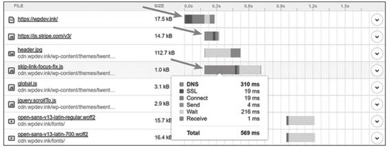

图4-1　首次DNS请求耗时

为此，最近几年出现了另一种新的DNS工作模式：HTTPDNS（也称为DNS over HTTPS，DoH）。它将原本的DNS解析服务开放为一个基于HTTPS协议的查询服务，替代基于UDP传输协议的DNS域名解析，通过程序代替操作系统直接从权威DNS或者可靠的本地DNS获取解析数据，从而绕过传统本地DNS。这样做的好处是完全免去了“中间商赚差价”的环节，不再惧怕底层的域名劫持，有效避免本地DNS不可靠导致的域名生效缓慢、来源IP不准确、产生的智能线路切换错误等问题。

[1] 任播（Anycast）是一种网络寻址和路由的策略。

### 4.3 传输链路

经过客户端缓存的节流、DNS服务的解析指引，程序发出的请求流量便正式离开客户端，踏上以服务器为目的地的旅途了，这个过程就是本节的主角：传输链路。

可能不少人的第一直觉会认为传输链路是开发者完全不可控的因素，网络路由跳点的数量、运营商铺设线路的质量决定了线路带宽的大小、速率的高低。然而事实并非如此，程序发出的请求能否与应用层、传输层协议提倡的方式相匹配，也会对传输的效率有极大影响。最容易体现这点的是那些前端网页的优化技巧，只要简单搜索一下，就能找到很多以优化链路传输为目的的前端设计原则，譬如经典的雅虎YSlow-23条规则[1]中与传输相关的内容如下。

1）减少请求数量（Minimize HTTP Requests）：请求每次都需要建立通信链路进行数据传输，这些开销很昂贵，减少请求的数量可有效提高访问性能，对于前端开发者，可用于减少请求数量的手段包括：

·雪碧图（CSS Sprite）

·CSS、JS文件合并/内联（Concatenation/Inline）

·分段文档（Multipart Document）

·媒体（图片、音频）内联（Data Base64 URI）

·合并Ajax请求（Batch Ajax Request）

2）扩大并发请求数（Split Components Across Domain）：对于每个域名，现代浏览器（Chrome、Firefox）一般支持6个（IE为8～13个）并发请求。如果希望更快地加载大量图片或其他资源，需要进行域名分片（Domain Sharding），将图片同步到不同主机或者同一个主机的不同域名上。

3）启用压缩传输（GZip Component）：启用压缩能够大幅度减少需要在网络上传输的内容的大小，节省网络流量。

4）避免页面重定向（Avoid Redirect）：当页面发生了重定向，就会造成整个文档的传输延迟。在HTML文档到达之前，页面中不会呈现任何东西，降低了用户体验。

5）按重要性调节资源优先级（Put Stylesheet at the Top，Put Script at the Bottom）：将重要的、马上就要使用的、对客户端展示影响大的资源，放在HTML的头部，以便优先下载。

……

这些原则在今天仍有一定价值，但若干年后再回头看它们，其中多数原则大概率会变成Tricks，甚至成了反模式。导致这种变化的原因是HTTP协议还在持续发展，从20世纪90年代的HTTP/1.0和HTTP/1.1，到2015年发布的HTTP/2，再到2019年的HTTP/3，HTTP协议本身的变化使得“适合HTTP传输的请求”的特征也在不断变化。

[1] YSlow-23（其实已经积累到35条了，但名字仍然叫YSlow-23）：https://developer.yahoo.com/performance/rules.html。

#### 4.3.1 连接数优化

我们知道HTTP（特指HTTP/3以前）是以TCP为传输层的应用层协议，但HTTP over TCP这种搭配只能说是TCP在当今网络中统治性地位所造就的结果，而不能说它们两者的配合就是合适的。回想一下你上网时平均在每个页面停留的时间，以及每个页面中包含的资源（HTML、JS、CSS、图片等）数量，可以总结出HTTP传输对象的主要特征是数量多、时间短、资源小、切换快。另一方面，TCP协议要求必须在三次握手完成之后才能开始数据传输，这是一个可能以高达“百毫秒”为计时尺度的事件；另外，TCP还有慢启动的特性，使得刚刚建立连接时的传输速度是最低的，后面再逐步加速直至稳定。由于TCP协议本身是面向长时间、大数据传输来设计的，在长时间尺度下，它建立连接的高昂成本才不至于成为瓶颈，它的稳定性和可靠性的优势才能展现出来。因此，可以说HTTP over TCP这种搭配在目标特征上确实是有矛盾的，以至于HTTP/1.x时代，大量短而小的TCP连接导致了网络性能的瓶颈。为了缓解HTTP与TCP之间的矛盾，聪明的程序员们一方面致力于减少发出的请求数量，另一方面也致力于增加客户端到服务端的连接数量，这就是上面Yslow规则中“Minimize HTTP Requests”与“Split Components Across Domains”两条优化措施的根本依据所在。

通过前端开发人员的各种Tricks，的确能减少消耗TCP连接数量，这是有数据统计作为支撑的。图4-2和图4-3展示了HTTP Archive对最近五年数百万个URL地址采样得出的结论：在页面平均请求没有改变的情况下（桌面端下降3.8%，移动端上升1.4%），TCP连接正在持续且幅度较大地下降（桌面端下降36.4%，移动端下降28.6%）。

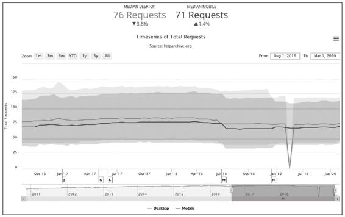

图4-2　HTTP平均请求数量，70余个，没有明显变化

但是开发人员节省TCP连接的优化措施并非只有好处，它们也带来了诸多不良的副作用。

·如果你用雪碧图将多张图片合并，意味着任何场景下哪怕只用到其中一张小图，也必须完整加载整张大图片；任何场景下哪怕对一张小图要进行修改，都会导致整个缓存失效，类似地，样式、脚本等其他文件的合并也会存在同样的问题。

·如果你使用了媒体内嵌，除了要承受Base64编码导致传输容量膨胀1/3的代价外（Base64以8位表示6位数据），也将无法有效利用缓存。

·如果你合并了异步请求，这就会导致所有请求的返回时间都受最慢的那个请求的拖累，导致整体响应速度下降。

·如果你把图片放到不同子域下面，将会导致更大的DNS解析负担，而且浏览器对两个不同子域下的同一图片必须持有两份缓存，也使得缓存效率下降。

由此可见，一旦在技术根基上出现问题，依赖使用者通过各种Tricks去解决，无论如何都难以摆脱“两害相权取其轻”的权衡困境，否则这就不是Tricks而是一种标准的设计模式了。

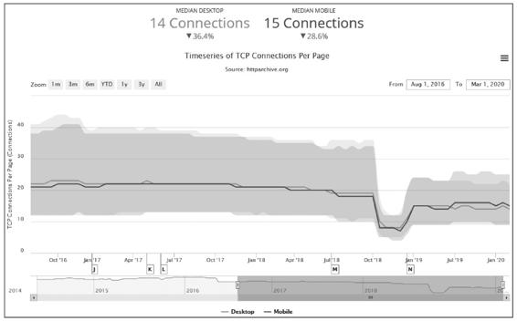

图4-3　TCP连接数量，约15个，有明显下降趋势

在另一方面，HTTP的设计者们并不是没有尝试过在协议层面去解决连接成本过高的问题，即使HTTP协议的最初版本（指HTTP/1.0，忽略非正式的HTTP/0.9版本）就已经支持了[1]连接复用技术，即今天大家所熟知的持久连接（Persistent Connection），也称为连接Keep-Alive机制。持久连接的原理是让客户端对同一个域名长期持有一个或多个不会用完即断的TCP连接。典型做法是在客户端维护一个FIFO队列，在每次取完数据[2]之后一段时间内先不自动断开连接，以便在获取下一个资源时直接复用，避免创建TCP连接的成本。

但是，连接复用技术依然是不完美的，最明显的副作用是“队首阻塞”（Head-of-Line Blocking）问题。请设想以下场景：浏览器有10个资源需要从服务器中获取，此时它将10个资源放入队列，入列顺序只能按照浏览器遇见这些资源的先后顺序来决定。但如果这10个资源中的第1个就让服务器陷入长时间运算状态会怎样呢？当它的请求被发送到服务端之后，服务端开始计算，而运算结果出来之前TCP连接中并没有任何数据返回，此时后面9个资源都必须阻塞等待。因为服务端虽然可以并行处理另外9个请求（譬如第1个是复杂运算请求，消耗CPU资源，第2个是数据库访问，消耗数据库资源，第3个是访问某张图片，消耗磁盘I/O资源，这就很适合并行），但问题是处理结果无法及时返回客户端，服务端不能因为哪个请求先完成就返回哪个，更不可能将所有要返回的资源混杂到一起交叉传输，原因是只使用一个TCP连接来传输多个资源的话，如果顺序乱了，客户端就很难区分哪个数据包归属哪个资源了。

2014年，IETF发布的RFC 7230中提出了名为“HTTP管道”（HTTP Pipelining）的复用技术，试图在HTTP服务器中也建立类似客户端的FIFO队列，让客户端一次将所有要请求的资源名单全部发给服务端，由服务端来安排返回顺序，管理传输队列。无论队列维护在服务端还是客户端，其实都无法完全避免队首阻塞的问题，但由于服务端能够较为准确地评估资源消耗情况，进而能够更紧凑地安排资源传输，保证队列中两项工作之间尽量减少空隙，甚至做到并行化传输，从而提升链路传输的效率。可是，由于HTTP管道需要多方共同支持，协调起来相当复杂，推广得并不算成功。

队首阻塞问题一直持续到第二代的HTTP协议，即HTTP/2发布后才算是被比较完美地解决。在HTTP/1.x中，HTTP请求就是传输过程中最小粒度的信息单位了，所以如果将多个请求切碎，再混杂在一块传输，客户端势必难以分辨、重组出有效信息。而在HTTP/2中，帧（Frame）才是最小粒度的信息单位，它可以用来描述各种数据，譬如请求的Headers、Body，或者用来做控制标识，譬如打开流、关闭流。这里说的流（Stream）是一个逻辑上的数据通道概念，每个帧都附带一个流ID以标识这个帧属于哪个流。这样，在同一个TCP连接中传输的多个数据帧就可以根据流ID轻易区分开来，在客户端毫不费力地将不同流中的数据重组出不同HTTP请求和响应报文来。这项设计是HTTP/2的最重要的技术特征一，被称为HTTP/2多路复用（HTTP/2 Multiplexing）技术，如图4-4所示。

有了多路复用的支持，HTTP/2就可以对每个域名只维持一个TCP连接（One Connection Per Origin）并以任意顺序传输任意数量的资源了，这样既减轻了服务器的连接压力，也不需要开发者去考虑域名分片这种事情来突破浏览器对每个域名最多6个的连接数限制。更重要的是，没有TCP连接数的压力，就无须刻意压缩HTTP请求，所有通过合并、内联文件（无论是图片、样式、脚本）以减少请求数的需求都不再成立，甚至会被当作徒增副作用的反模式。

说这是反模式，也许还有一些前端开发人员会不同意，认为HTTP请求少一些总是好的，减少请求数量，最起码也减少了传输中耗费的Header。这里必须先承认一个事实，在HTTP传输中的Header占传输成本的比重是相当大的，对于许多小资源，甚至可能出现Header的容量比Body还要大，以至于在HTTP/2中必须专门考虑如何进行Header压缩的问题。但是，以下几个因素决定了通过合并资源文件减少请求数，对节省Header成本并没有太大帮助。

·Header的传输成本在Ajax（尤其是只返回少量数据的请求）请求中是比重很大的开销，但在图片、样式、脚本这些静态资源的请求中，通常并不占主要地位。

·在HTTP/2中Header压缩的原理是基于字典编码的信息复用。简而言之，同一个连接上产生的请求和响应越多，动态字典积累得越全，头部压缩效果也就越好。所以HTTP/2是单域名单连接的机制，合并资源和域名分片反而不利于提升Header压缩效果。

·与HTTP/1.x相比，HTTP/2本身变得更适合传输小资源，譬如传输1000张10KB的小图，HTTP/2肯定要比HTTP/1.x快，但传输10张1000KB的大图，则大概率HTTP/1.x会更快些。这是TCP连接数量（相当于多点下载）的影响，但更多是由TCP协议可靠传输机制导致的，一个错误的TCP包会导致所有的流都必须等待这个包重传成功，这是HTTP/3要解决的问题。因此，把小文件合并成大文件，在HTTP/2下是毫无益处的。

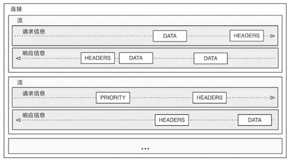

图4-4　HTTP/2的多路复用

[1] 连接复用技术在HTTP/1.0中并没有默认开启，是从HTTP/1.1开始变为默认开启的。

[2] 如何在不断开连接的情况下判断数据已取完将会放到稍后的4.3.2节去讨论。

#### 4.3.2 传输压缩

我们接下来讨论链路优化中缓存、连接之外的另一个主要话题：压缩。同时也是为了解决上一节遗留的问题：如何不以断开TCP连接为标志来判断资源已传输完毕。

HTTP很早就支持了GZip压缩，因为HTTP传输的内容主要是文本数据，譬如HTML、CSS、Script等，而对于文本数据启用压缩的收益是非常高的，传输数据量一般会降至原有的20%左右。对于那些不适合压缩的资源，Web服务器能根据MIME类型自动判断是否对响应进行压缩，这样，已经采用过压缩算法存储的资源，如JPEG、PNG图片，便不会被二次压缩，空耗性能。

不过，大概就没有多少人想过压缩与之前提到的用于节约TCP的持久连接机制是存在冲突的。在网络时代的早期，服务器处理能力还很薄弱，为了启用压缩，会把静态资源先预先压缩为.gz文件的形式存放起来，当客户端可以接收压缩版本的资源时（请求的Header中包含Accept-Encoding:gzip）就返回压缩后的版本（响应的Header中包含Content-Encoding:gzip），否则返回未压缩的原版，这种方式被称为“静态预压缩”（Static Precompression）。而现代的Web服务器处理能力有了大幅提升，已经没有人再采用麻烦的预压缩方式了，都是由服务器对符合条件的请求在输出时进行“即时压缩”（On-The-Fly Compression），整个压缩过程全部在内存的数据流中完成，不必等资源压缩完成再返回响应，这样可以显著提高“首字节时间”（Time To First Byte，TTFB），改善Web性能体验。而这个过程中唯一不好的地方就是服务器再也没有办法给出Content-Length这个响应Header了，因为输出Header时服务器还不知道压缩后资源的确切大小。

到这里，大家了解即时压缩与持久连接的冲突在哪了吗？持久连接机制不再依靠TCP连接是否关闭来判断资源请求是否结束，它会重用同一个连接以便向同一个域名请求多个资源，这样，客户端就必须要有除了关闭连接之外的其他机制来判断一个资源什么时候算传递完毕，这个机制最初（在HTTP/1.0时）就只有Content-Length，即依靠请求Header中明确给出资源的长度判断，传输到达该长度即宣告一个资源的传输已结束。由于启用即时压缩后就无法给出Content-Length了，如果是HTTP/1.0的话，持久连接和即时压缩只能二选一，事实上在HTTP/1.0中对两者都支持，却默认都是不启用的。依靠Content-Length来判断传输结束的缺陷，不仅仅在于即时压缩这一种场景，譬如对于动态内容（Ajax、PHP、JSP等输出），服务器也同样无法事先得知Content-Length。

HTTP/1.1版本中修复了这个缺陷，增加了另一种“分块传输编码”（Chunked Transfer Encoding）的资源结束判断机制，彻底解决了Content-Length与持久连接的冲突问题。分块编码的原理相当简单：在响应Header中加入“Transfer-Encoding:chunked”之后，就代表这个响应报文将采用分块编码。此时，报文中的Body需要改为用一系列“分块”来传输。每个分块包含十六进制的长度值和对应长度的数据内容，长度值独占一行，数据从下一行开始，最后以一个长度值为0的分块来表示资源结束。举个具体例子[1]：

```
HTTP/1.1 200 OK
Date: Sat, 11 Apr 2020 04:44:00 GMT
Transfer-Encoding: chunked
Connection: keep-alive

25
This is the data in the first chunk

1C
and this is the second one

3
con

8

sequence

0
```

根据分块长度可知，前两个分块包含显式的回车换行符（CRLF，即\r\n字符）。

```
"This is the data in the first chunk\r\n"      (37 字符 => 十六进制: 0x25)
"and this is the second one\r\n"               (28 字符 => 十六进制: 0x1C)
"con"                                          (3  字符 => 十六进制: 0x03)
"sequence"                                     (8  字符 => 十六进制: 0x08)
```

所以解码后的内容为：

```
This is the data in the first chunk
and this is the second one
consequence
```

一般来说，Web服务器给出的数据分块大小应该（但并不强制）是一致的，而不是如例子中那样随意。HTTP/1.1通过分块传输解决了即时压缩与持久连接并存的问题，到了HTTP/2，由于多路复用和单域名单连接的设计，已经无须再刻意去提持久连接机制了，但数据压缩仍然有节约传输带宽的重要价值。

[1] 例子来自于维基百科，为便于观察，只分块，未压缩。

#### 4.3.3 快速UDP网络连接

HTTP是应用层协议而不是传输层协议，它的设计原本不应该过多地考虑底层的传输细节，从职责上讲，持久连接、多路复用、分块编码这些能力，已经或多或少超过了应用层的范畴。要从根本上改进HTTP，必须直接替换掉HTTP over TCP的根基，即TCP传输协议，这便是最新一代HTTP/3协议的设计重点。

推动替换TCP协议的先驱者并不是IETF，而是Google公司。目前，世界上只有Google公司具有这样的能力，这并不是因为Google的技术实力雄厚，而是由于它同时持有占浏览器市场70%份额的Chrome浏览器与占移动领域半壁江山的Android操作系统。

2013年，Google在它的服务器（如Google.com、YouTube.com等）及Chrome浏览器上同时启用了名为“快速UDP网络连接”（Quick UDP Internet Connection，QUIC）的全新传输协议。在2015年，Google将QUIC提交给IETF，并在IETF的推动下对QUIC进行重新规范化（为以示区别，业界习惯将此前的版本称为gQUIC，将规范化后的版本称为iQUIC），使其不仅能满足HTTP传输协议，日后还能支持SMTP、DNS、SSH、Telnet、NTP等多种其他上层协议。2018年末，IETF正式批准了HTTP over QUIC使用HTTP/3的版本号，将其确立为最新一代的互联网标准。

从名字上就能看出QUIC会以UDP协议为基础，而UDP协议没有丢包自动重传的特性，因此QUIC的可靠传输能力并不是由底层协议提供，而是完全由自己实现。由QUIC自己实现的好处是能对每个流做单独的控制，如果在一个流中发生错误，协议栈仍然可以独立地继续为其他流提供服务。这对提高易出错链路的性能非常有用，因为在大多数情况下，TCP协议接到数据包丢失或损坏通知之前，可能已经收到了大量的正确数据，但是在纠正错误之前，其他的正常请求都会等待甚至被重发，这也是在4.3.1节中笔者提到HTTP/2未能解决传输大文件慢的根本原因。

QUIC的另一个设计目标是面向移动设备的专门支持，由于以前TCP、UDP传输协议在设计时根本不可能设想到今天移动设备盛行的场景，因此肯定不会有任何专门的支持。QUIC在移动设备上的优势体现在网络切换时的响应速度上，譬如当移动设备在不同Wi-Fi热点之间切换，或者从Wi-Fi切换到移动网络时，如果使用TCP协议，现存的所有连接都必定会超时、中断，然后根据需要重新创建。这个过程会带来很高的延迟，因为超时和重新握手都需要大量时间。为此，QUIC提出了连接标识符的概念，该标识符可以唯一地标识客户端与服务器之间的连接，而无须依靠IP地址。这样，切换网络后，只需向服务端发送一个包含此标识符的数据包即可重用既有的连接，因为即使用户的IP地址发生变化，原始连接的连接标识符依然是有效的。

无论是TCP协议还是HTTP协议，都已经存在了数十年。它们在积累了大量用户的同时，也承载了很重的技术惯性，要使HTTP从TCP迁移走，即使由Google和IETF来推动依然不是一件容易的事情。一个最显著的问题是互联网基础设施中的许多中间设备，都只面向TCP协议去建造，仅对UDP提供很基础的支持，有的甚至完全阻止UDP的流量。因此，Google在Chromium的网络协议栈中同时启用了QUIC和传统TCP连接，并在QUIC连接失败时以零延迟回退到TCP连接，尽可能让用户无感知地扩大QUIC的使用面。

根据W3Techs的数据[1]，截至2020年10月，全球已有48.9%的网站支持HTTP/2协议，按照维基百科中的记录，这个数字在2019年6月时还只是36.5%。对于HTTP/3，今天也已经得到了7.2%的网站的支持。可以肯定地说，目前网络链路传输领域正处于新旧交替的时代，许多既有设备、程序、知识都会在未来几年时间里出现重大更新。

[1] 数据来源：https://w3techs.com/technologies/overview/site_element。

### 4.4 内容分发网络

前面几节介绍了客户端缓存、域名解析、链路优化，这节我们来讨论它们的一个经典的综合运用案例：内容分发网络（Content Distribution Network，CDN，也有写作Content Delivery Network）。

内容分发网络是一种十分古老的应用，相信大部分读者都或多或少对其有一定了解，至少听过它的名字。如果把某个互联网系统比喻为一家企业，那内容分发网络就是它遍布世界各地的分支销售机构。假设现在有客户要买一块CPU，那么订机票飞到美国加州Intel总部肯定是不合适的，到本地电脑城找个装机铺才是通常的做法，在此场景中，内容分发网络就相当于电脑城里的本地经销商。

内容分发网络又是一种十分透明的应用，可能绝大多数读者对于它为互联网站点分流的工作原理并没有什么系统性的概念，至少没有自己亲自使用过。

如果抛却其他影响服务质量的因素，仅从网络传输的角度看，一个互联网系统的速度取决于以下四个因素。

·网站服务器接入网络运营商的链路所能提供的出口带宽。

·用户客户端接入网络运营商的链路所能提供的入口带宽。

·从网站到用户经过的不同运营商之间的互联节点的带宽，一般来说两个运营商之间只有固定的若干个点是互通的，所有跨运营商之间的交互都要经过这些点。

·从网站到用户的物理链路传输时延。爱打游戏的读者应该都清楚，延迟（Ping值）比带宽更重要。

以上四个因素，除了第二个只能通过换一个更好的宽带才能改善之外，其余三个都能通过内容分发网络来显著改善。一个运作良好的内容分发网络，能为互联网系统解决跨运营商、跨地域物理距离所导致的时延问题，能为网站流量带宽起到分流、减负的作用。举个例子，如果不是有遍布全国乃至全世界的阿里云CDN网络支持，哪怕把整个杭州所有市民上网的权力都剥夺了，把带宽全部让给淘宝的机房，恐怕也撑不住全国乃至全球用户在双十一期间的疯狂“围殴”。

内容分发网络的工作过程，主要涉及路由解析、内容分发、负载均衡和CDN应用四个方面，由于下一节会专门讨论负载均衡的内容，所以这部分在本节暂不涉及，下面我们来逐一了解其余三个方面。

#### 4.4.1 路由解析

在介绍DNS域名解析时，笔者曾提到翻译域名无须像查电话本一样刻板地一对一翻译，根据来访机器、网络链路、服务内容等各种信息，可以玩出很多“花样”，内容分发网络将用户请求路由到它的资源服务器上就是依靠DNS服务器来实现的。根据我们对DNS域名解析的了解，一次没有内容分发网络参与的用户访问，其解析过程如图4-5所示。

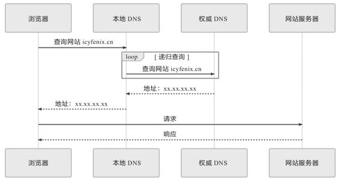

图4-5　没有内容分发网络参与的用户访问的解析过程

那么，有内容分发网络介入会发生什么变化呢？我们不妨先来看一段对网站“icyfenix.cn.”进行DNS查询的真实应答记录，这个网站就是通过国内的内容分发网络对位于GitHub Pages上的静态页面进行加速的。通过dig或者host命令，能够很方便地得到DNS服务器的返回结果（结果中头4个IP的城市地址是笔者手工加入的，后面的其他记录就不一个一个查了），如下所示：

```
$ dig icyfenix.cn

; <<>> DiG 9.11.3-1ubuntu1.8-Ubuntu <<>> icyfenix.cn
;; global options: +cmd
;; Got answer:
;; ->>HEADER<<- opcode: QUERY, status: NOERROR, id: 60630
;; flags: qr rd ra; QUERY: 1, ANSWER: 17, AUTHORITY: 0, ADDITIONAL: 1

;; OPT PSEUDOSECTION:
; EDNS: version: 0, flags:; udp: 65494
;; QUESTION SECTION:
;icyfenix.cn.                   IN      A

;; ANSWER SECTION:
icyfenix.cn.            600     IN      CNAME   icyfenix.cn.cdn.dnsv1.com.
icyfenix.cn.cdn.dnsv1.com. 599  IN      CNAME   4yi4q4z6.dispatch.spcdntip.com.
4yi4q4z6.dispatch.spcdntip.com.  60 IN  A  101.71.72.192  #浙江宁波市
4yi4q4z6.dispatch.spcdntip.com.  60 IN  A  113.200.16.234 #陕西省榆林市
4yi4q4z6.dispatch.spcdntip.com.  60 IN  A  116.95.25.196  #内蒙古自治区呼和浩特市
4yi4q4z6.dispatch.spcdntip.com.  60 IN  A  116.178.66.65  #新疆维吾尔自治区乌鲁木齐市
4yi4q4z6.dispatch.spcdntip.com.  60 IN  A  118.212.234.144
4yi4q4z6.dispatch.spcdntip.com.  60 IN  A  211.91.160.228
4yi4q4z6.dispatch.spcdntip.com.  60 IN  A  211.97.73.224
4yi4q4z6.dispatch.spcdntip.com.  60 IN  A  218.11.8.232
4yi4q4z6.dispatch.spcdntip.com.  60 IN  A  221.204.166.70
4yi4q4z6.dispatch.spcdntip.com.  60 IN  A  14.204.74.140
4yi4q4z6.dispatch.spcdntip.com.  60 IN  A  43.242.166.88
4yi4q4z6.dispatch.spcdntip.com.  60 IN  A  59.80.39.110
4yi4q4z6.dispatch.spcdntip.com.  60 IN  A  59.83.204.12
4yi4q4z6.dispatch.spcdntip.com.  60 IN  A  59.83.204.14
4yi4q4z6.dispatch.spcdntip.com.  60 IN  A  59.83.218.235

;; Query time: 74 msec
;; SERVER: 127.0.0.53#53(127.0.0.53)
;; WHEN: Sat Apr 11 22:33:56 CST 2020
;; MSG SIZE  rcvd: 152
```

根据以上解析信息，DNS服务为“icyfenix.cn.”的查询结果先返回了一个CNAME记录（icyfenix.cn.cdn.dnsv1.com.），递归查询该CNAME时，返回了另一个看起来更奇怪的CNAME（4yi4q4z6.dispatch.spcdntip.com.）。继续查询后，这个CNAME返回了十几个位于全国不同地区的A记录，很明显，这些A记录就是分布在全国各地、存有本站缓存的CDN节点。CDN路由解析的具体工作流程如下。

·架设好“icyfenix.cn.”的服务器后，在你的CDN服务商上将服务器的IP地址注册为“源站”，注册后你会得到一个CNAME，即本例中的“icyfenix.cn.cdn.dnsv1.com.”。

·在你购买域名的DNS服务商上将得到的CNAME注册为一条CNAME记录。

·当第一位用户来访时，将首先发生一次未命中缓存的DNS查询，域名服务商解析出CNAME后，返回给本地DNS，之后链路解析的主导权就开始由内容分发网络的调度服务接管了。

·本地DNS查询CNAME时，由于能解析该CNAME的权威服务器只有CDN服务商所架设的权威DNS，这个DNS服务将根据一定的均衡策略和参数，如拓扑结构、容量、时延等，在全国各地能提供服务的CDN缓存节点中挑选一个最适合的，并将它的IP代替源站的IP地址，返回给本地DNS。

·浏览器从本地DNS拿到IP地址后，将该IP当作源站服务器来进行访问，此时该IP的CDN节点上可能有，也可能没有缓存过源站的资源，这点将在稍后的4.4.2节讨论。

·经过内容分发后的CDN节点，就有能力代替源站向用户提供所请求的资源了。

以上步骤反映在时序图上，如图4-6所示，读者可自行与本节开头给出的没有内容分发网络参与的图4-5进行对比。

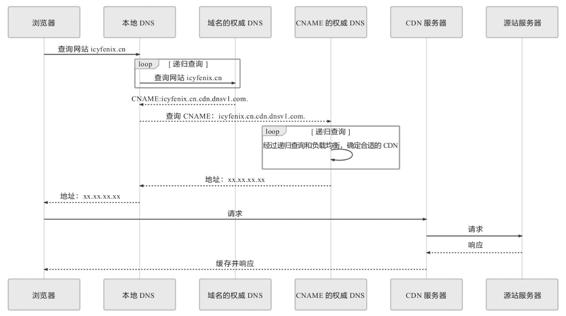

图4-6　有内容分发网络参与的路由解析过程

#### 4.4.2 内容分发

在DNS服务器的协助下，无论是对用户还是服务器，内容分发网络都可以是完全透明的，如在两者都不知情的情况下，由CDN的缓存节点接管了用户向服务器发出资源请求。后面随之而来的问题是缓存节点中必须有用户想要请求的资源副本，才可能代替源站来响应用户请求。这里面又包括两个子问题：“如何获取源站资源”和“如何管理（更新）资源”。CDN获取源站资源的过程被称为“内容分发”，“内容分发网络”的名字正是由此而来，这也是CDN的核心价值。目前主要有以下两种主流的内容分发方式。

·主动分发（Push）：分发由源站主动发起，将内容从源站或者其他资源库推送到用户边缘的各个CDN缓存节点上。这个推送的操作没有什么业界标准可循，可以选择任何传输方式（HTTP、FTP、P2P，等等）、任何推送策略（满足特定条件、定时、人工，等等）、任何推送时间，只要与后面说的更新策略相匹配即可。由于主动分发通常需要源站、CDN服务双方提供程序API接口层面的配合，所以它对源站并不是透明的，只对用户一侧单向透明。主动分发一般用于网站要预载大量资源的场景。譬如在双十一之前的一段时间内，淘宝、京东等各个网络商城会把未来活动中所要用到的资源推送到CDN缓存节点中，特别常用的资源甚至会直接缓存到你的手机App的存储空间或者浏览器的localStorage上。

·被动回源（Pull）：被动回源由用户访问所触发，是全自动、双向透明的资源缓存过程。当某个资源首次被用户请求的时候，若CDN缓存节点发现自己没有该资源，就会实时从源站中获取，这时资源的响应时间可粗略认为是资源从源站到CDN缓存节点的时间，加上资源从CDN发送到用户的时间之和。因此，被动回源的首次访问通常比较慢（但由于CDN的网络条件一般远高于普通用户，并不一定比用户直接访问源站更慢），不适合应用于数据量较大的资源。被动回源的优点是可以做到完全的双向透明，不需要源站在程序上做任何配合，使用起来非常方便。这种分发方式是小型站点使用CDN服务的主流选择，如果不是自建CDN，而是购买阿里云、腾讯云的CDN服务的站点，多数采用的就是这种方式。

对于“CDN如何管理（更新）资源”这个问题，同样没有统一的标准可言，尽管在HTTP协议中，关于缓存的Header定义中确实有对CDN这类共享缓存的一些指引性参数的定义，譬如Cache-Control的s-maxage，但是否要遵循，完全取决于CDN本身的实现策略。更令人感到无奈的是，由于大多数网站的开发和运维人员并不十分了解HTTP缓存机制，所以导致如果CDN完全照着HTTP Header来控制缓存失效和更新，效果反而会很差，还可能引发其他问题。因此，对CDN缓存的管理不存在通用的准则。

现在，最常见的做法是超时被动失效与手工主动失效相结合。超时被动失效是指给予缓存资源一定的生存期，超过了生存期就在下次请求时重新被动回源一次。而手工主动失效是指CDN服务商一般会提供处理失效缓存的接口，在网站更新时，由持续集成的流水线自动调用该接口来实现缓存更新，譬如“icyfenix.cn”就是依靠Travis-CI的持续集成服务来触发CDN失效和重新预热的。

#### 4.4.3 CDN应用

CDN最初是为了快速分发静态资源而设计的，但今天的CDN所能做的事情已经远远超越了最初的目标，限于这部分应用太多，无法展开逐一细说，笔者只能对现在CDN可以做的事情简要列举，以便读者有个总体认知。

·加速静态资源分发：这是CDN的本职工作。

·安全防御：CDN在广义上可以视作网站的堡垒机，源站只对CDN提供服务，由CDN来对外界其他用户提供服务，这样恶意攻击者就不容易直接威胁源站。CDN对某些攻击手段的防御，如对DDoS攻击的防御尤其有效。但需注意，将安全都寄托在CDN上本身是不安全的，一旦源站真实IP被泄漏，就会面临很高的风险。

·协议升级：不少CDN提供商都同时对接（代售CA的）SSL证书服务，可以实现源站是基于HTTP协议的，而对外开放的网站是基于HTTPS的。同理，可以实现源站到CDN是HTTP/1.x协议，CDN提供的外部服务是HTTP/2或HTTP/3协议；实现源站是基于IPv4网络的，CDN提供的外部服务支持IPv6网络，等等。

·状态缓存：4.1节介绍客户端缓存时简要提到了状态缓存，而CDN不仅可以缓存源站的资源，还可以缓存源站的状态，譬如可以通过CDN缓存源站的301/302状态让客户端直接跳转，也可以通过CDN开启HSTS、通过CDN进行OCSP装订加速SSL证书访问，等等。有一些情况下甚至可以配置CDN对任意状态码（譬如404）进行一定时间的缓存，以减轻源站压力，但这个操作应当慎重，且在网站状态发生改变时要及时刷新缓存。

·修改资源：CDN可以在返回资源给用户的时候修改资源的任何内容，以实现不同的目的。譬如，可以对源站未压缩的资源自动压缩并修改Content-Encoding，以节省用户的网络带宽消耗，可以对源站未启用客户端缓存的内容加上缓存Header，自动启用客户端缓存，可以修改CORS的相关Header，为源站不支持跨域的资源提供跨域能力，等等。

·访问控制：CDN可以实现IP黑/白名单功能，如根据不同的来访IP提供不同的响应结果，根据IP的访问流量来实现QoS控制，根据HTTP的Referer来实现防盗链，等等。

·注入功能：CDN可以在不修改源站代码的前提下，为源站注入各种功能。图4-7所示是国际CDN巨头CloudFlare提供的Google Analytics、PACE、Hardenize等第三方应用，这些原本需要在源站中注入代码的应用，在有CDN参与的情况下均能做到无须修改源站任何代码即可使用。


图4-7　CloudFlare[1]提供的第三方应用

[1] https://www.cloudflare.com/。

### 4.5 负载均衡

在互联网时代的早期，网站流量还相对较小，业务也相对简单，单台服务器便可满足访问需要，但时至今日，互联网应用也好，企业级应用也好，一般实际用于生产的系统，几乎都离不开集群部署。信息系统不论是单体架构多副本还是微服务架构，不论是为了实现高可用还是为了获得高性能，都需要利用多台机器来扩展服务能力，希望用户的请求不管连接到哪台机器上，都能得到相同的处理。另一方面，如何构建和调度服务集群这件事，又必须对用户保持足够的透明，即使请求背后是由一千台、一万台机器来共同响应的，也无须用户关心，他们只需要记住一个域名地址即可。调度后方的多台机器，以统一的接口对外提供服务，承担此职责的技术组件被称为“负载均衡”（Load Balancing）。

真正大型系统的负载均衡过程往往是多级的。譬如，在各地建有多个机房，或机房有不同网络链路入口的大型互联网站，会从DNS解析开始，通过“域名”→“CNAME”→“负载调度服务”→“就近的数据中心入口”的路径，先将来访地用户根据IP地址（或者其他条件）分配到一个合适的数据中心中，然后才到各式负载均衡。在DNS层面的负载均衡与前面介绍的DNS智能线路、内容分发网络等在工作原理上是类似的，差别只是数据中心能提供的不只是缓存，而是全方位的服务能力。由于这种方式此前已经详细讲解过，后续我们所讨论的“负载均衡”就只聚焦于网络请求进入数据中心入口之后的其他级次的负载均衡。

无论在网关内部建立了多少级的负载均衡，从形式上来说都可以分为两种：四层负载均衡和七层负载均衡。在详细介绍它们是什么以及如何工作之前，我们先来建立两个总体的、概念性的印象。

·四层负载均衡的优势是性能高，七层负载均衡的优势是功能强。

·做多级混合负载均衡，通常应是低层负载均衡在前，高层负载均衡在后。

我们所说的“四层”“七层”指的是经典的OSI七层模型中的第四层传输层和第七层应用层。表4-1是维基百科上对OSI七层模型的介绍（笔者做了简单的中文翻译），这部分属于网络基础知识，这里就不多解释了。后面我们会多次使用到这张表，如你对网络知识并不是特别了解，可自行查阅相关资料。

表4-1　OSI七层模型

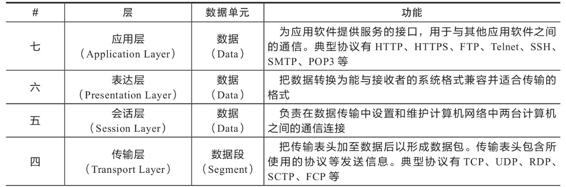

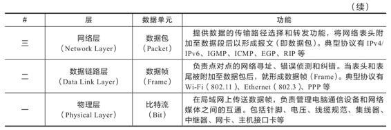

现在所说的“四层负载均衡”其实是多种均衡器工作模式的统称，“四层”是说这些工作模式的共同特点是维持同一个TCP连接，而不是说它只工作在第四层。事实上，这些模式主要都工作在第二层（数据链路层，改写MAC地址）和第三层（网络层，改写IP地址）上，单纯只处理第四层（传输层，可以改写TCP、UDP等协议的内容和端口）的数据无法做到负载均衡的转发，因为OSI的下三层是媒体层（Media Layer），上四层是主机层（Host Layer），既然流量都已经到达目标主机上了，也就谈不上什么流量转发，最多只能做代理。但出于习惯和方便，现在几乎所有的资料都把它们统称为四层负载均衡，笔者也同样称呼它为四层负载均衡，如果读者在某些资料上看见“二层负载均衡”“三层负载均衡”的表述，应该了解这是在描述它们工作的具体层次，与这里说的“四层负载均衡”并不是同一类意思。下面笔者将介绍几种常见的四层负载均衡的工作模式。

#### 4.5.1 数据链路层负载均衡

参考上面的表4-1可知，数据链路层传输的内容是数据帧（Frame），譬如常见的以太网帧、ADSL宽带的PPP帧等。我们讨论的具体上下文里，目标就是以太网帧。按照IEEE 802.3标准，最典型的1500字节MTU的以太网帧结构如表4-2所示。

表4-2　最典型的1500字节MTU的以太网帧结构说明

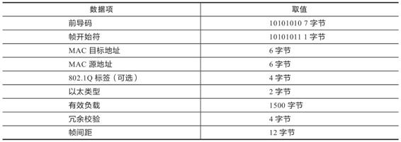

关于以太网帧结构中的各数据项的含义，本节中只需注意“MAC目标地址”和“MAC源地址”两项即可。我们知道每一块网卡都有独立的MAC地址，通过以太网帧上的这两个地址可以告诉交换机，此帧是从连接在交换机上的哪个端口的网卡发出，送至哪块网卡的。

数据链路层负载均衡所做的工作，是修改请求的数据帧中的MAC目标地址，让用户原本发送给负载均衡器的请求的数据帧，被二层交换机根据新的MAC目标地址转发到服务器集群中对应的服务器（后文称为“真实服务器”，Real Server）的网卡上，这样真实服务器就获得了一个原本目标并不是发送给它的数据帧。

由于二层负载均衡器在转发请求过程中只修改了帧的MAC目标地址，不涉及更上层协议（没有修改Payload的数据），所以在更上层（第三层）看来，所有数据都是未曾改变过的。由于第三层的数据包，即IP数据包中包含了源（客户端）和目标（均衡器）的IP地址，只有真实服务器保证自己的IP地址与数据包中的目标IP地址一致，这个数据包才能被正确处理。因此，使用这种负载均衡模式时，需要把真实物理服务器集群中所有机器的虚拟IP地址（Virtual IP Address，VIP）配置成与负载均衡器的虚拟IP一样，才能使经均衡器转发后的数据包在真实服务器中顺利地使用。也正是因为实际处理请求的真实物理服务器IP和数据请求中的目的IP是一致的，所以响应结果就不再需要通过负载均衡器进行地址交换，而是可将响应结果的数据包直接从真实服务器返回给用户的客户端，避免负载均衡器网卡带宽成为瓶颈，因此数据链路层负载均衡的效率是相当高的。此模式从请求到响应的过程如图4-8所示。

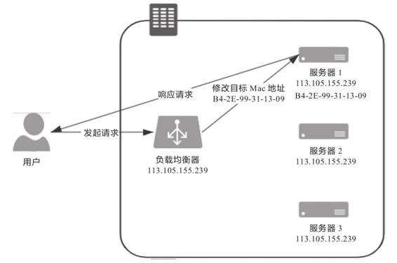

图4-8　数据链路层负载均衡

在上述只有请求经过负载均衡器，而服务的响应无须从负载均衡器原路返回的工作模式中，整个请求、转发、响应的链路形成了一个“三角关系”，所以这种负载均衡模式也常被形象地称为“三角传输模式”（Direct Server Return，DSR），也称为“单臂模式”（Single Legged Mode）或者“直接路由”（Direct Routing）。

虽然数据链路层负载均衡的效率很高，但它并不能适用于所有场合，除了无法适用于那些需要感知应用层协议信息的负载均衡场景外（所有的四层负载均衡器都无法适用，具体将在后续介绍七层负载均衡器时一并解释），它在网络侧受到的约束也很大。二层负载均衡器直接改写目标MAC地址的工作原理决定了它与真实服务器的通信必须是二层可达的，通俗地说就是必须位于同一个子网当中，无法跨VLAN。所以，优势（效率高）和劣势（不能跨子网）共同决定了数据链路层负载均衡最适合作为数据中心的第一级均衡设备，用来连接其他的下级负载均衡器。

#### 4.5.2 网络层负载均衡

根据OSI七层模型，在第三层网络层传输的单位是分组数据包（Packet），这是一种在分组交换网络（Packet Switching Network，PSN）中传输的结构化数据单位。以IP协议为例，一个IP数据包由头部（Header）和荷载（Payload）两部分组成，Header的长度最大为60字节，其中包括20字节的固定数据和最长不超过40字节的可选数据。按照IPv4标准，一个典型的分组数据包的Header部分具有如表4-3所示的结构。

表4-3　分组数据包的Header部分说明

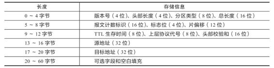

在本节，无须过多关注表格中的其他信息，只要知道在IP分组数据包的Header中带有源和目标的IP地址即可。源和目标IP地址说明了数据是从分组交换网络中哪台机器发送到哪台机器的，我们可以沿用与二层改写MAC地址相似的思路，通过改变这里面的IP地址来实现数据包的转发。具体有两种常见的修改方式。

第一种是保持原数据包不变，新创建一个数据包，把原数据包的Header和Payload整体作为新数据包的Payload，并在这个新数据包的Header中写入真实服务器的IP作为目标地址，然后把它发送出去。经过三层交换机的转发，真实服务器收到数据包后，必须在接收入口处设计一个针对性的拆包机制，把由负载均衡器自动添加的那层Header扔掉，还原出原数据包来进行使用。这样，真实服务器就同样拿到了一个原本不是发给它（目标IP不是它）的数据包，达到了流量转发的目的。当时还没有流行起“禁止套娃”的梗，所以设计者将这种“套娃式”的传输称为“IP隧道”（IP Tunnel）传输，也是相当的形象。

尽管因为要封装新的数据包，IP隧道转发模式的效率比直接路由模式的效率低，但由于并没有修改原数据包中的任何信息，所以IP隧道转发模式仍然具备三角传输的特性，即负载均衡器转发来的请求，可以由真实服务器去直接应答，无须经过负载均衡器原路返回。而且由于IP隧道工作在网络层，所以可以跨越VLAN，因此摆脱了直接路由模式中网络侧的约束。此模式从请求到响应的过程如图4-9所示。

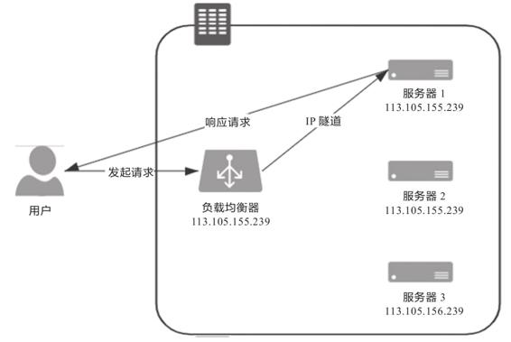

图4-9　IP隧道模式的负载均衡

当然，这种转发模式也有缺点。第一个缺点是它要求真实服务器必须支持“IP隧道协议”（IP Encapsulation），即它得学会自己拆包扔掉一层Header，这个其实并不是什么大问题，现在几乎所有的Linux系统都支持IP隧道协议。另外一个缺点是这种模式仍必须通过专门的配置，必须保证所有的真实服务器与负载均衡器有相同的虚拟IP地址，因为回复该数据包时，需要使用这个虚拟IP作为响应数据包的源地址，这样客户端收到这个数据包时才能正确解析。这个限制就相对麻烦一些，它与“透明”的原则冲突，需由系统管理员介入。

而且，对服务器进行虚拟IP的配置并不是在任何情况下都可行的，尤其是当几个服务共用一台物理服务器的时候，此时就必须考虑第二种修改方式——改变目标数据包：直接修改数据包Header中的目标地址，修改后原本由用户发给负载均衡器的数据包也会被三层交换机转发到真实服务器的网卡上，而且因为没有经过IP隧道的额外包装，也就无须再拆包了。但问题是这种模式是通过修改目标IP地址才到达真实服务器的，如果真实服务器直接将应答包返回客户端，即这个应答数据包的源IP是真实服务器的IP，也即均衡器修改以后的IP地址，则客户端不可能认识该IP，自然就无法正常处理这个应答了。因此，只有让应答流量继续回到负载均衡器，由负载均衡器把应答包的源IP改回自己的IP，再发给客户端，才能保证客户端与真实服务器之间的正常通信。如果你对网络知识有些了解的话，肯定会觉得这种处理似曾相识，这不就是在家里、公司、学校上网时，由一台路由器带着一群内网机器上网的“网络地址转换”（Network Address Translation，NAT）操作吗？这种负载均衡模式的确被称为NAT模式，此时，负载均衡器就相当于家里、公司、学校的上网路由器。对NAT模式的负载均衡器的运维十分简单，只要机器将自己的网关地址设置为均衡器地址，就无须再进行任何额外设置了。此模式从请求到响应的过程如图4-10所示。

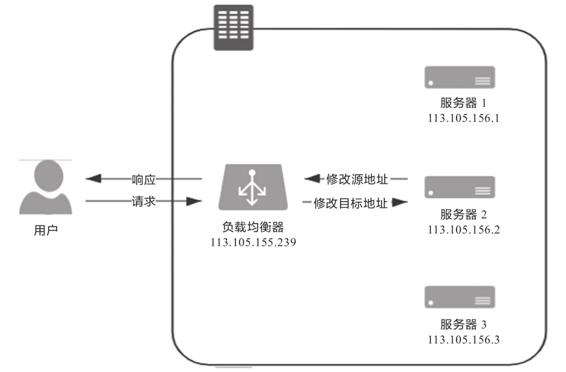

图4-10　NAT模式的负载均衡

在流量压力比较大的时候，NAT模式的负载均衡会带来较大的性能损失，比起直接路由和IP隧道模式，甚至会出现数量级上的下降。这点是显而易见的，由负载均衡器代表整个服务集群来进行应答，各个服务器的响应数据都会互相争抢均衡器的出口带宽，这就与在家里用NAT上网，若有人在下载，你打游戏可能会觉得卡顿是一个道理，此时整个系统的瓶颈很容易就出现在负载均衡器上。

还有一种更加彻底的NAT模式：即负载均衡器在转发时，不仅会修改目标IP地址，还会修改源IP地址，这样源地址就改成负载均衡器自己的IP，称作Source NAT（SNAT）。这样做的好处是真实服务器无须配置网关就能够让应答流量经过正常的三层路由回到负载均衡器上，做到彻底的透明。但是缺点是由于做了SNAT，真实服务器处理请求时就无法拿到客户端的IP地址，从真实服务器的视角来看，所有的流量都来自于负载均衡器，这样有一些需要根据目标IP进行控制的业务逻辑就无法进行了。

#### 4.5.3 应用层负载均衡

前面介绍的四层负载均衡工作模式都属于“转发”，即直接将承载着TCP报文的底层数据格式（IP数据包或以太网帧）转发到真实服务器上，此时客户端与响应请求的真实服务器维持着同一条TCP通道。但工作在四层之后的负载均衡模式就无法再转发了，只能代理，此时真实服务器、负载均衡器、客户端三者之间由两条独立的TCP通道来维持通信。转发与代理的区别如图4-11所示。

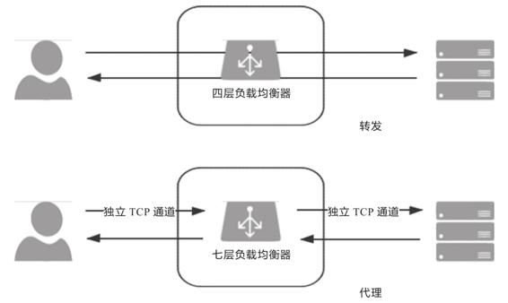

图4-11　转发与代理

“代理”这个词，根据“哪一方能感知到”的原则，可以分为“正向代理”“反向代理”和“透明代理”三类。正向代理就是我们通常简称的代理，指在客户端设置的，代表客户端与服务器通信的代理服务，它是客户端可知，而对服务器透明的。反向代理是指在服务器侧设置的，代表真实服务器与客户端通信的代理服务，此时它对客户端来说是透明的。至于透明代理是指对双方都透明的，配置在网络中间设备上的代理服务，譬如，架设在路由器上的透明翻墙代理。

根据以上定义，很显然，七层负载均衡器属于反向代理的一种。如果只论网络性能，七层负载均衡器肯定比不过四层负载均衡器，它比四层负载均衡器至少多一轮TCP握手，有着跟NAT转发模式一样的带宽问题，而且通常要耗费更多的CPU，因为可用的解析规则远比四层丰富。所以如果用七层负载均衡器去做下载站、视频站这种流量应用是不合适的，起码不能作为第一级均衡器。但是，如果网站的性能瓶颈不是网络性能，而是整个服务集群对外所体现出来的服务性能，那么七层负载均衡器就有它的用武之地了。因为七层负载均衡器工作在应用层，可以感知应用层通信的具体内容，往往能够做出更明智的决策，玩出更多的花样。

举个生活中的例子，四层负载均衡器就像银行的自助排号机，转发效率高且不知疲倦，每一个到达银行的客户根据排号机的顺序，选择对应的窗口接受服务；而七层负载均衡器就像银行大堂经理，他会先确认客户需要办理的业务，再安排排号。对于理财、存取款等业务，大堂经理会根据银行内部资源进行统一协调处理，以加快客户业务办理流程；而对于无须柜台办理的业务，大堂经理会直接自行处理。回到七层负载均衡器中，反向代理能够实现静态资源缓存，所以对于静态资源的请求，反向代理会直接返回，而无须转发到真实服务器。

代理的工作模式相信大家已经比较熟悉了，这里不再展开，只是简单列举一些七层代理可以实现的功能，以便读者对它的“功能强大”有个直观的感受。

·前面介绍CDN应用时，所有CDN可以做的缓存方面的工作（CDN根据物理位置就近返回这类优化链路的工作除外），七层负载均衡器全都可以实现，譬如静态资源缓存、协议升级、安全防护、访问控制，等等。

·七层负载均衡器可以实现更智能化的路由。譬如，根据Session路由，以实现亲和性的集群；根据URL路由，实现专职化服务（此时就相当于网关的职责）；甚至根据用户身份路由，实现对部分用户的特殊服务（如某些站点的贵宾服务器），等等。

·某些安全攻击可以由七层负载均衡器来抵御，譬如一种常见的DDoS手段是SYN Flood攻击，即攻击者控制众多客户端，使用虚假IP地址对同一目标大量发送SYN报文。从技术原理上看，由于四层负载均衡器无法感知上层协议的内容，这些SYN攻击都会被转发到后端的真实服务器上；而七层负载均衡器下这些SYN攻击会在负载均衡设备上被过滤掉，不会影响到后面服务器的正常运行。类似地，可以在七层负载均衡器上设定多种策略，譬如过滤特定报文，以防御如SQL注入等应用层面的特定攻击手段。

·在很多微服务架构的系统中，链路治理措施都需要在七层中进行，譬如服务降级、熔断、异常注入，等等。譬如，一台服务器只有出现物理层面或者系统层面的故障，导致无法应答TCP请求时才能被四层负载均衡器感知，进而被剔除出服务集群。如果一台服务器能够应答，只是一直在报500错，那四层负载均衡器对此是完全无能为力的，只能由七层负载均衡器来解决。

#### 4.5.4 均衡策略与实现

负载均衡的两大职责是“选择谁来处理用户请求”和“将用户请求转发过去”。前面我们仅介绍了后者，即请求的转发或代理过程。前者是指均衡器所采取的均衡策略，由于这一块涉及的均衡算法太多，笔者无法逐一展开，所以本节仅从功能和应用的角度去介绍一些常见的均衡策略。

·轮询均衡（Round Robin）：每一次来自网络的请求轮流分配给内部的服务器，从1至N然后重新开始。此种均衡算法适合于服务器集群中的所有服务器都有相同的软硬件配置并且平均服务请求相对均衡的情况。

·权重轮询均衡（Weighted Round Robin）：根据服务器的不同处理能力，给每个服务器分配不同的权值，使其能够接受相应权值数的服务请求。譬如：设置服务器A的权值为1，B的权值为3，C的权值为6，则服务器A、B、C将分别接收到10%、30%、60%的服务请求。此种均衡算法能确保高性能的服务器得到更多的使用率，避免低性能的服务器负载过重。

·随机均衡（Random）：把来自客户端的请求随机分配给内部的多个服务器，在数据量足够大的场景下能达到相对均衡的分布。

·权重随机均衡（Weighted Random）：此种均衡算法类似于权重轮询算法，不过在分配处理请求时是随机选择的过程。

·一致性哈希均衡（Consistency Hash）：将请求中的某些数据（可以是MAC、IP地址，也可以是更上层协议中的某些参数信息）作为特征值来计算需要落在的节点，算法一般会保证同一个特征值每次都一定落在相同的服务器上。这里的一致性是指保证当服务集群某个真实服务器出现故障时，只影响该服务器的哈希值，而不会导致整个服务器集群的哈希键值重新分布。

·响应速度均衡（Response Time）：负载均衡设备对内部各服务器发出一个探测请求（例如Ping），然后根据内部各服务器对探测请求的最快响应时间来决定哪一台服务器响应客户端的服务请求。此种均衡算法能较好地反映服务器的当前运行状态，但最快响应时间仅仅指的是负载均衡设备与服务器之间的最快响应时间，而不是客户端与服务器之间的最快响应时间。

·最少连接数均衡（Least Connection）：客户端的每一次请求服务在服务器停留的时间可能会有较大差异，随着工作时间增加，如果采用简单的轮询或随机均衡算法，每一台服务器上的连接进程可能会产生极大的不平衡，并不能达到真正的负载均衡。最少连接数均衡算法会对内部需负载的每一台服务器有一个数据记录，记录当前该服务器正在处理的连接数量，当有新的服务连接请求时，将把当前请求分配给连接数最少的服务器，使均衡更加符合实际情况，使负载更加均衡。此种均衡策略适合长时处理的请求服务，如FTP传输。

从实现角度来看，负载均衡器的实现分为“软件均衡器”和“硬件均衡器”两类。在软件均衡器方面，又分为直接建设在操作系统内核的均衡器和应用程序形式的均衡器两种。前者的代表是LVS（Linux Virtual Server），后者的代表有Nginx、HAProxy、KeepAlived等。前者性能会更好，因为无须在内核空间和应用空间中来回复制数据包；而后者的优势是选择广泛，使用方便，功能不受限于内核版本。

在硬件均衡器方面，往往会直接采用应用专用集成电路（Application Specific Integrated Circuit，ASIC）来实现，有专用处理芯片的支持，避免操作系统层面的损耗，以达到最高的性能。这类均衡器的代表就是著名的F5和A10公司的负载均衡产品。

### 4.6 服务端缓存

笔者介绍透明多级分流系统的逻辑思路是以流量从客户端中发出为起始，以流量到达服务器集群中真正处理业务的节点为终结，探索该过程中与业务无关的通用组件。事实上很难清楚界定服务端缓存到底算不算与业务逻辑无关，不过，既然本章以“客户端缓存”为开篇，那“服务端缓存”作为结束，倒是十分合适的。注意，在这一节里，笔者所说的“缓存”，均特指服务端缓存。

为系统引入缓存之前，第一件事情是确认系统是否真的需要缓存。很多人会有意无意地把硬件中常用于区分不同产品档次、“多多益善”的缓存（如CPU L1/2/3缓存、磁盘缓存，等等）代入软件开发中去，实际上这两者差别很大，在软件开发中引入缓存的负面作用要明显大于硬件缓存带来的负面作用：从开发角度来说，引入缓存会提高系统复杂度，因为你要考虑缓存的失效、更新、一致性等问题（硬件缓存也有这些问题，只是不需要由你去考虑，主流的ISA也都没有提供任何直接操作缓存的指令）；从运维角度来说，缓存会掩盖一些缺陷，让问题在更久的时间以后，出现在距离发生现场更远的位置上；从安全角度来说，缓存可能会泄漏某些保密数据，也是容易受到攻击的薄弱点。冒着上述种种风险，仍能说服你引入缓存的理由，总结起来无外乎以下两种。

·为缓解CPU压力而引入缓存：譬如把方法运行结果存储起来、把原本要实时计算的内容提前算好、对一些公用的数据进行复用，这可以节省CPU算力，顺带提升响应性能。

·为缓解I/O压力而引入缓存：譬如把原本对网络、磁盘等较慢介质的读写访问变为对内存等较快介质的访问，将原本对单点部件（如数据库）的读写访问变为对可扩缩部件（如缓存中间件）的访问，顺带提升响应性能。

请注意，缓存虽然是典型以空间换时间来提升性能的手段，但它的出发点是缓解CPU和I/O资源在峰值流量下的压力，“顺带”而非“专门”地提升响应性能。这里的言外之意是如果可以通过增强CPU、I/O本身的性能（譬如扩展服务器的数量）来满足需要的话，那升级硬件往往是更好的解决方案，即使需要一些额外的投入成本，也通常要优于引入缓存后可能带来的风险。

#### 4.6.1 缓存属性

有不少软件系统最初的缓存功能是以HashMap或者ConcurrentHashMap为起点演进的。当开发人员发现系统中某些资源的构建成本比较高，而这些资源又有被重复使用的可能时，会很自然地产生“循环再利用”的想法，将它们放到Map容器中，待下次需要时取出重用，避免重新构建，这种原始朴素的复用就是最基本的缓存。不过，一旦我们专门把“缓存”看作一项技术基础设施，一旦它有了通用、高效、可统计、可管理等方面的需求，其中要考虑的因素就变得复杂起来。通常，我们设计或者选择缓存至少会考虑以下四个维度的属性。

·吞吐量：缓存的吞吐量使用OPS值（每秒操作数，Operation per Second，ops/s）来衡量，反映了对缓存进行并发读、写操作的效率，即缓存本身的工作效率高低。

·命中率：缓存的命中率即成功从缓存中返回结果次数与总请求次数的比值，反映了引入缓存的价值高低，命中率越低，引入缓存的收益越小，价值越低。

·扩展功能：即缓存除了基本读写功能外，还提供哪些额外的管理功能，譬如最大容量、失效时间、失效事件、命中率统计，等等。

·分布式缓存：缓存可分为“进程内缓存”和“分布式缓存”两大类，前者只为节点本身提供服务，无网络访问操作，速度快但缓存的数据不能在各服务节点中共享，后者则相反。

1.吞吐量

缓存的吞吐量只在并发场景中才有统计的意义，因为若不考虑并发，即使是最原始的、以HashMap实现的缓存，访问效率也已经是常量时间复杂度（即O(1)），其中涉及碰撞、扩容等场景的处理属于数据结构基础，这里不再展开。但HashMap并不是线程安全的容器，如果要让它在多线程并发下正确地工作，就要用Collections.synchronizedMap进行包装，这相当于给Map接口的所有访问方法都自动加全局锁；或者改用ConcurrentHashMap来实现，这相当于给Map的访问分段加锁（从JDK 8起已取消分段加锁，改为CAS+Synchronized锁单个元素）。无论采用怎样的实现方法，这些线程安全措施都会带来一定的吞吐量损失。

进一步，如果只比较吞吐量，完全不去考虑命中率、淘汰策略、缓存统计、过期失效等功能如何实现，那JDK 8改进之后的ConcurrentHashMap基本上就是你能找到的吞吐量最高的缓存容器了。可是在很多场景里，以上提及的功能至少有一两项是必须的，不可能完全不考虑，这才涉及不同缓存方案的权衡问题。

根据Caffeine给出的一组目前业界主流进程内的缓存实现方案，包括Caffeine、ConcurrentLinkedHashMap、LinkedHashMap、Guava Cache、Ehcache和Infinispan Embedded，从Benchmarks中体现出的它们在8线程、75%读操作、25%写操作下的吞吐量来看，各缓存组件库的性能差异还是十分明显的，最高与最低足足相差了一个数量级，具体如图4-12所示。

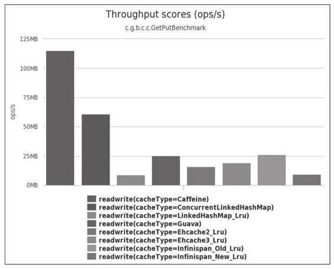

图4-12　8线程、75%读、25%写的吞吐量比较

在这种并发读写的场景中，吞吐量受多方面因素的共同影响，譬如，怎样设计数据结构以尽可能避免数据竞争，存在竞争风险时怎样处理同步（主要有使用锁实现的悲观同步和使用CAS实现的乐观同步）、如何避免伪共享现象（False Sharing，这也算是典型缓存提升开发复杂度的例子）发生，等等。其中尽可能避免竞争是最关键的，无论如何实现同步都不会比无须同步更快。下面以Caffeine为例，介绍一些如何避免竞争、提高吞吐量的缓存设计。

缓存中最主要的数据竞争源于读取数据，同时也会伴随着对数据状态的写入操作，而写入数据的同时，又会伴随着数据状态的读取操作。譬如，读取时要同时更新数据的最近访问时间和访问计数器的状态[1]，以实现缓存的淘汰策略；又或者读取时要同时判断数据的超期时间等信息，以实现失效重加载等其他扩展功能。对以上伴随读写操作而来的状态维护操作，有两种可选择的处理思路。一种是以Guava Cache为代表的同步处理机制，即在访问数据时一并完成缓存淘汰、统计、失效等状态变更操作，通过分段加锁等优化手段来尽量减少竞争。另一种是以Caffeine为代表的异步日志提交机制，这种机制参考了经典的数据库设计理论，将数据的读、写过程看作日志（即对数据的操作指令）的提交过程。尽管日志也涉及写入操作，有并发的数据变更就必然面临锁竞争，但异步提交的日志已经将原本在Map内的锁转移到日志的追加写操作上，日志里腾挪优化的余地就比在Map中要大得多。

在Caffeine的实现中，设有专门的环形缓存区（Ring Buffer，也常称作Circular Buffer）来记录由于数据读取而产生的状态变动日志。为进一步减少竞争，Caffeine给每条线程（对线程取哈希值，哈希值相同的使用同一个缓冲区）都设置了一个专用的环形缓冲。

额外知识

环形缓冲

所谓环形缓冲，并非Caffeine的专有概念，它是一种拥有读、写两个指针的数据复用结构，在计算机科学中有非常广泛的应用。举个具体例子，譬如一台计算机通过键盘输入，并通过CPU读取“HELLO WIKIPEDIA”这个长14字节的单词，通常需要一个至少14字节的缓冲区才行。但如果是环形缓冲结构，读取和写入就应当一起进行，在读取指针之前的位置均可以重复使用，理想情况下，只要读取指针不落后于写入指针一整圈，这个缓冲区就可以持续工作下去，能容纳无限多个新字符。否则，就必须阻塞写入操作去等待读取清空缓冲区。

从Caffeine读取数据时，数据本身会在其内部的ConcurrentHashMap中直接返回，而数据的状态信息变更就存入环形缓冲中，由后台线程异步处理。如果异步处理的速度跟不上状态变更的速度，导致缓冲区满了，那此后接收的状态的变更信息就会直接被丢弃，直至缓冲区重新空闲。通过环形缓冲和容忍有损失的状态变更，Caffeine大幅降低了由于数据读取而导致的垃圾收集和锁竞争，因此Caffeine的读取性能几乎能与ConcurrentHashMap的读取性能相同。

向Caffeine写入数据时，将使用传统的有界队列（ArrayQueue）来存放状态变更信息，写入带来的状态变更是无损的，不允许丢失任何状态，这是考虑到许多状态的默认值必须通过写入操作来完成初始化，因此写入会有一定的性能损失。根据Caffeine官方给出的数据，相比ConcurrentHashMap，Caffeine在写入时大约会慢10%左右。

2.命中率与淘汰策略

有限的物理存储决定了任何缓存的容量都不可能是无限的，所以缓存需要在消耗空间与节约时间之间取得平衡，这要求缓存必须能够自动或者人工淘汰掉缓存中的低价值数据。考虑到由人工管理的缓存淘汰主要取决于开发者如何编码，不能一概而论，这里只讨论由缓存自动进行淘汰的情况。笔者所说的“缓存如何自动地实现淘汰低价值目标”，现在被称为缓存的淘汰策略，也常称作替换策略或者清理策略。

在了解缓存如何实现自动淘汰低价值数据之前，首先要定义怎样的数据才算是“低价值”。由于缓存的通用性，这个问题的答案必须是与具体业务逻辑无关的，只能从缓存工作过程收集到的统计结果来确定数据是否有价值，通用的统计结果包括但不限于数据何时进入缓存、被使用过多少次、最近什么时候被使用，等等。一旦确定选择何种统计数据，就决定了如何通用地、自动地判定缓存中每个数据的价值高低，也相当于决定了缓存的淘汰策略是如何实现的。目前，最基础的淘汰策略实现方案有以下三种。

·FIFO（First In First Out）：优先淘汰最早进入被缓存的数据。FIFO的实现十分简单，但一般来说它并不是优秀的淘汰策略，越是频繁被用到的数据，往往会越早存入缓存之中。如果采用这种淘汰策略，很可能会大幅降低缓存的命中率。

·LRU（Least Recent Used）：优先淘汰最久未被访问过的数据。LRU通常会采用HashMap加LinkedList的双重结构（如LinkedHashMap）来实现，以HashMap来提供访问接口，保证常量时间复杂度的读取性能，以LinkedList的链表元素顺序来表示数据的时间顺序，每次缓存命中时把返回对象调整到LinkedList开头，每次缓存淘汰时从链表末端开始清理数据。对大多数的缓存场景来说，LRU明显要比FIFO策略合理，尤其适合用来处理短时间内频繁访问的热点对象。但是如果一些热点数据在系统中被频繁访问，只是最近一段时间因为某种原因未被访问过，那么这些热点数据此时就会有被LRU淘汰的风险，换句话说，LRU依然可能错误淘汰价值更高的数据。

·LFU（Least Frequently Used）：优先淘汰最不经常使用的数据。LFU会给每个数据添加一个访问计数器，每访问一次就加1，需要淘汰时就清理计数器数值最小的那批数据。LFU可以解决上面LRU中热点数据间隔一段时间不访问就被淘汰的问题，但同时它又引入了两个新的问题。第一个问题是需要对每个缓存的数据专门维护一个计数器，每次访问都要更新，但这样做会带来高昂的维护开销；另一个问题是不便于处理随时间变化的热度变化，譬如某个曾经频繁访问的数据现在不需要了，但很难自动将它清理出缓存。

缓存的淘汰策略直接影响缓存的命中率，没有一种策略是完美的、能够满足系统全部需求的。不过，随着淘汰算法的不断发展，近年来的确出现了许多相对性能更好、也更复杂的新算法。以LFU为例，针对它存在的两个问题，近年来提出的TinyLFU和W-TinyLFU算法就会有更好的效果。

·TinyLFU（Tiny Least Frequently Used）：TinyLFU是LFU的改进版本。为了缓解LFU每次访问都要修改计数器所带来的性能负担，TinyLFU会首先采用Sketch对访问数据进行分析。所谓Sketch是统计学上的概念，指用少量的样本数据来估计全体数据的特征，这种做法显然牺牲了一定程度的准确性，但是只要样本数据与全体数据具有相同的概率分布，Sketch得出的结论仍不失为一种高效与准确之间权衡的有效结论。借助Count-Min Sketch算法（可视为布隆过滤器[2]的一种等价变形结构），TinyLFU可以用相对小得多的记录频率和空间来近似地找出缓存中的低价值数据。为了解决LFU不便于处理随时间变化的热度变化问题，TinyLFU采用了基于“滑动时间窗”（在8.2节我们会更详细地分析这种算法）的热度衰减算法，简单理解就是每隔一段时间，便会把计数器的数值减半，以此解决“旧热点”数据难以清除的问题。

·W-TinyLFU（Windows-TinyLFU）：W-TinyLFU也是TinyLFU的改进版本。上面提到的TinyLFU在减少计数器维护频率的同时，也带来了无法很好地应对稀疏突发访问的问题。所谓稀疏突发访问是指有一些绝对频率较小，但突发访问频率很高的数据，譬如某些运维性质的任务，也许一天、一周只会在特定时间运行一次，其余时间都不会用到，此时TinyLFU就很难让这类元素通过Sketch的过滤，因为它们无法在运行期间积累到足够高的频率。鉴于应对短时间的突发访问是LRU的强项，W-TinyLFU结合了LRU和LFU的优点，从整体上看它是LFU策略，从局部实现上看它又是LRU策略。具体做法是将新记录暂时放入一个名为Window Cache的前端LRU缓存里面，让这些对象可以在Window Cache中累积热度，如果能通过TinyLFU的过滤器，再进入名为Main Cache的主缓存中存储，主缓存根据数据的访问频繁程度分为不同的段（LFU策略，实际上W-TinyLFU只分了两段），但单独从某一段来看又是基于LRU策略去实现的（称为Segmented LRU）。每当前一段缓存满了之后，会将低价值数据淘汰到后一段中去存储，直至最后一段也满了之后，该数据会被彻底清理出缓存。

仅靠以上简单的、有限的介绍，也许你并不能完全理解TinyLFU和W-TinyLFU的工作原理，但肯定能看出这些改进算法比基础版本的LFU复杂了很多。有时候为了取得理想的效果，采用较为复杂的淘汰策略是不得已的选择，Caffeine官方给出的W-TinyLFU以及另外两种高级淘汰策略ARC（Adaptive Replacement Cache）、LIRS（Low Inter-Reference Recency Set）与基础的LFU策略的对比如图4-13所示。

在搜索场景中，三种高级策略的命中率较为接近理想曲线（Optimal），而LRU则差距最远。在Caffeine官方给出的数据库、网站、分析类等应用场景中，这几种策略之间的绝对差距不尽相同，但相对排名基本上没有改变，最基础的淘汰策略的命中率是最低的。对其他缓存淘汰策略感兴趣的读者可以参考维基百科中对缓存淘汰策略[3]的介绍。

3.扩展功能

一般来说，一套标准的Map接口（或者来自JSR 107的javax.cache.Cache接口）就可以满足缓存访问的基本需要，不过在“访问”之外，专业的缓存往往还会提供很多额外的功能。笔者简要列举如下。

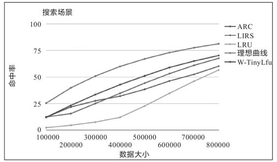

图4-13　几种淘汰算法在搜索场景下的命中率对比

·加载器：许多缓存都有“CacheLoader”之类的设计，加载器可以让缓存从只能被动存储外部放入的数据，变为能够主动通过加载器去加载指定Key值的数据，加载器也是实现自动刷新功能的基础前提。

·淘汰策略：有些缓存的淘汰策略是固定的，也有一些缓存能够支持用户自己根据需要选择不同的淘汰策略。

·失效策略：要求缓存的数据在一定时间后自动失效（移出缓存）或者自动刷新（使用加载器重新加载）。

·事件通知：缓存可能会提供一些事件监听器，让你在数据状态变动（如失效、刷新、移除）时进行一些额外操作。有的缓存还提供了对缓存数据本身的监视能力（Watch功能）。

·并发级别：对于通过分段加锁来实现的缓存（以Guava Cache为代表），往往会提供并发级别的设置，可以简单将其理解为缓存内部是使用多个Map来分段存储数据的，并发级别用于计算出使用Map的数量。如果将并发级别这个参数设置得过大，会引入更多的Map，需要额外维护这些Map而导致更大的时间和空间上的开销；如果设置得过小，又会导致在访问时产生线程阻塞，因为多个线程更新同一个ConcurrentMap的同一个值时会产生锁竞争。

·容量控制：缓存通常都支持指定初始容量和最大容量，初始容量的目的是减少扩容频率，这与Map接口本身的初始容量含义是一致的。最大容量类似于控制Java堆的-Xmx参数，当缓存接近最大容量时，会自动清理低价值的数据。

·引用方式：支持将数据设置为软引用或者弱引用，提供引用方式的设置是为了将缓存与Java虚拟机的垃圾收集机制联系起来。

·统计信息：提供诸如缓存命中率、平均加载时间、自动回收计数等统计信息。

·持久化：支持将缓存的内容存储到数据库或者磁盘中，进程内缓存提供持久化功能的作用不大，但分布式缓存大多都会考虑提供持久化功能。

至此，本节已简要介绍了缓存的三项属性：吞吐量、命中率和扩展功能，笔者将几款主流进程内的缓存方案整理成表4-4，供读者参考。

表4-4　几款主流进程内缓存方案对比

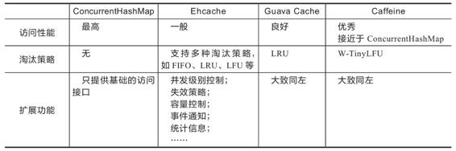

4.分布式缓存

相比缓存数据在进程内存中读写的速度，一旦涉及网络访问，由网络传输、数据复制、序列化和反序列化等操作所导致的延迟要比内存访问高得多，所以对分布式缓存来说，处理与网络相关的操作是对吞吐量影响更大的因素，往往也是比淘汰策略、扩展功能更重要的关注点，这也决定了尽管有Ehcache、Infinispan这类能同时支持分布式部署和进程内部署的缓存方案，但通常进程内缓存和分布式缓存选型时会有完全不同的候选对象及考察点。在我们决定使用哪种分布式缓存前，首先必须确定自己的需求是什么。

·从访问的角度来说，如果是频繁更新但甚少读取的数据，通常是不会有人把它拿去做缓存的，因为这样做没有收益。对于甚少更新但频繁读取的数据，理论上更适合做复制式缓存；对于更新和读取都较为频繁的数据，理论上更适合做集中式缓存。下面笔者简要介绍这两种分布式缓存形式的差别与代表性产品。

·复制式缓存：复制式缓存可以看作“能够支持分布式的进程内缓存”，它的工作原理与Session复制类似。缓存中所有数据在分布式集群的每个节点里面都有一份副本，读取数据时无须网络访问，直接从当前节点的进程内存中返回，理论上可以做到与进程内缓存一样高的读取性能；但当数据发生变化时，就必须遵循复制协议，将变更同步到集群的每个节点中，复制性能随着节点的增加呈现平方级下降，变更数据的代价十分高昂。

复制式缓存的代表是JBossCache，这是JBoss针对企业级集群设计的缓存方案，支持JTA事务，依靠JGroup进行集群节点间的数据同步。以JBossCache为代表的复制式缓存曾有一段短暂的兴盛期，但今天基本上已经很难再见到使用这种缓存形式的大型信息系统了。JBossCache被淘汰的主要原因是写入性能太差，它在小规模集群中同步数据尚算差强人意，但在大规模集群下，很容易因网络同步的速度跟不上写入速度，进而导致在内存中累计大量待重发对象，最终引发OutOfMemory崩溃。

为了缓解复制式同步的写入效率问题，JBossCache的继任者Infinispan提供了另一种分布式同步模式（这种同步模式的名字叫作“分布式”），允许用户配置数据需要复制的副本数量，譬如集群中有八个节点，可以要求每个数据只保存四份副本，此时，缓存的总容量相当于传统复制模式的一倍。如果要访问的数据在本地缓存中没有存储，Infinispan完全有能力感知网络的拓扑结构，知道应该到哪些节点中寻找数据。

·集中式缓存：集中式缓存是目前分布式缓存的主流形式，它的读、写都需要网络访问，好处是不会随着集群节点数量的增加而产生额外的负担，坏处是读、写都不再可能达到进程内缓存那样的高性能。

集中式缓存还有一个必须提到的关键特点，它与使用缓存的应用分处在独立的进程空间中。其好处是能够为异构语言提供服务，譬如用C语言编写的Memcached完全可以毫无障碍地为Java语言编写的应用提供缓存服务；但坏处是如果要缓存对象等复杂类型的话，基本上只能靠序列化来支撑具体语言的类型系统（支持Hash类型的缓存，可以部分模拟对象类型），不仅有序列化的成本，还很容易导致传输成本的显著增加。举个例子，假设某个有100个字段的大对象的其中1个字段的值发生变更，通常缓存不得不把整个对象所有内容重新序列化传输出去才能实现更新，因此，一般集中式缓存更提倡直接缓存原始数据类型而不是对象。相比之下，JBossCache通过它的字节码自审（Introspection）功能和树状存储结构（TreeCache），做到了自动跟踪、处理对象的部分变动，当用户修改了对象中某些字段的数据时，缓存只会同步对象中真正变更的那部分数据。

如今Redis广为流行，基本上已经打败了Memcached及其他集中式缓存框架，成为集中式缓存的首选，甚至可以说成为分布式缓存的实质上的首选，几乎到了不必管读取、写入哪种操作更频繁，都可以用Redis的程度。也因如此，之前说到哪些数据适合用复制式缓存、哪些数据适合用集中式缓存时，笔者都在开头加了个拗口的“理论上”。尽管Redis最初设计的本意是NoSQL数据库而不是专门用来做缓存的，可今天它确实已经成为许多分布式系统中不可或缺的基础设施，广泛用作缓存的实现方案。

·从数据一致性角度来说，缓存本身也有集群部署的需求，理论上你应该认真考虑一下是否能接受不同节点取到的缓存数据可能存在差异的情况。譬如刚刚放入缓存中的数据，另外一个节点马上访问却发现未能读到；刚刚更新缓存中的数据，另外一个节点在短时间内读取到的仍是旧的数据，等等。根据分布式缓存集群能否保证数据一致性，可以将它分为AP和CP两种类型（在前面3.4节中已介绍过CAP各自的含义，这里不再赘述）。此处又一次出现了“理论上”，是因为我们在实际开发中通常不会把追求强一致性的数据使用缓存来处理，可以这样做，但没必要（可类比MESI等缓存一致性协议）。譬如，Redis集群就是典型的AP式，有着高性能、高可用等特点，却并不保证强一致性。而对于能够保证强一致性的ZooKeeper、Doozerd、etcd等分布式协调框架，通常不会有人将它们当作“缓存框架”来使用，这些分布式协调框架的吞吐量相对Redis来说是非常有限的。不过ZooKeeper、Doozerd、etcd倒是常与Redis及其他分布式缓存搭配工作，用来实现通知、协调、队列、分布式锁等功能。

分布式缓存与进程内缓存各有所长，也各有局限，它们是互补而非互斥的关系，如有需要，完全可以将两者搭配使用，构成透明多级缓存（Transparent Multilevel Cache，TMC），如图4-14所示。先不考虑“透明”的话，多级缓存是很好理解的，使用进程内缓存做一级缓存，分布式缓存做二级缓存，如果能在一级缓存中查询到结果就直接返回，否则便到二级缓存中去查询，再将二级缓存中的结果回填到一级缓存，以后再访问该数据就没有网络请求了。如果二级缓存也查询不到，就发起对最终数据源的查询，将结果回填到一、二级缓存中去。

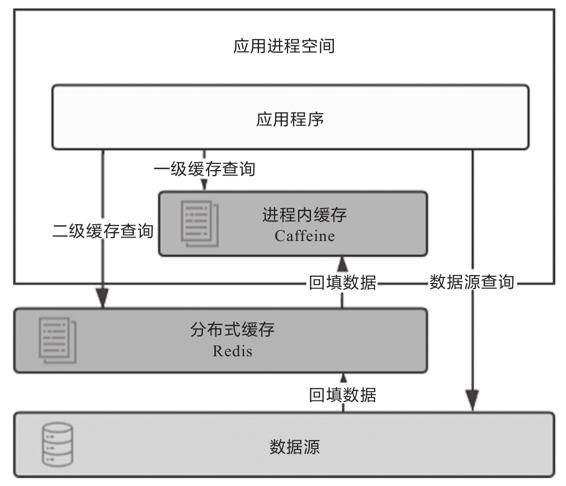

图4-14　多级缓存

尽管多级缓存结合了进程内缓存和分布式缓存的优点，但它的代码侵入性较大，需要由开发者承担多次查询、多次回填的工作，也不便于管理，如超时、刷新等策略都要设置多遍，数据更新更是麻烦，很容易出现各个节点的一级缓存以及二级缓存中数据不一致的问题。所以，必须“透明”地解决以上问题，才能使多级缓存具有实用的价值。一种常见的设计原则是变更以分布式缓存中的数据为准，访问以进程内缓存的数据优先。大致做法是当数据发生变动时，在集群内发送推送通知（简单点的话可采用Redis的PUB/SUB，求严谨的话可引入ZooKeeper或etcd来处理），让各个节点的一级缓存中的相应数据自动失效。当访问缓存时，提供统一封装好的一、二级缓存联合查询接口，接口外部是只查询一次，接口内部自动实现优先查询一级缓存，未获取到数据再自动查询二级缓存的逻辑。

[1] 后续会提到，为了追求性能高效，可能不会记录时间和次数，譬如通过调整链表顺序来表达时间先后、通过Sketch结构来表达热度高低。

[2] 布隆过滤器：https://en.wikipedia.org/wiki/Bloom_filter。

[3] Cache Replacement Policies：https://en.wikipedia.org/wiki/Cache_replacement_policies。

#### 4.6.2 缓存风险

本节开篇就提到，缓存不是多多益善，它有利有弊，是真正在必须使用时才考虑的解决方案。本节将介绍几种常见的缓存风险及其应对办法。

1.缓存穿透

缓存的目的是缓解CPU或者I/O的压力，譬如对数据库做缓存，大部分流量都从缓存中直接返回，只有缓存未能命中的数据请求才会流到数据库中，这样数据库压力自然就减小了。但是如果查询的数据在数据库中根本不存在，缓存里自然也不会有，这类请求的流量每次都不会命中，且每次都会触及末端的数据库，缓存就起不到缓解压力的作用了，这种查询不存在的数据的现象被称为缓存穿透。

缓存穿透有可能是业务逻辑本身就存在的固有问题，也有可能是恶意攻击所导致。为了解决缓存穿透问题，通常会采取下面两种办法。

·对于业务逻辑本身不能避免的缓存穿透，可以约定在一定时间内对返回为空的Key值进行缓存（注意是正常返回但是结果为空，不应把抛异常的也当作空值来缓存），使得在一段时间内缓存最多被穿透一次。如果后续业务在数据库中对该Key值插入了新记录，那应当在插入之后主动清理掉缓存的Key值。如果业务时效性允许的话，也可以对缓存设置一个较短的超时时间来自动处理。

·对于恶意攻击导致的缓存穿透，通常会在缓存之前设置一个布隆过滤器来解决。所谓恶意攻击是指请求者刻意构造数据库中肯定不存在的Key值，然后发送大量请求进行查询。布隆过滤器是用最小的代价来判断某个元素是否存在于某个集合的办法。如果布隆过滤器给出的判定结果是请求的数据不存在，直接返回即可，连缓存都不必去查。虽然维护布隆过滤器本身需要一定的成本，但比起攻击造成的资源损耗仍然是值得的。

2.缓存击穿

我们都知道缓存的基本工作原理是首次从真实数据源加载数据，完成加载后回填入缓存，以后其他相同的请求就从缓存中获取数据，以缓解数据源的压力。如果缓存中某些热点数据忽然因某种原因失效了，譬如由于超期而失效，此时又有多个针对该数据的请求同时发送过来，这些请求将全部未能命中缓存，到达真实数据源中，导致其压力剧增，这种现象被称为缓存击穿。要避免缓存击穿问题，通常会采取下面两种办法。

·加锁同步，以请求该数据的Key值为锁，使得只有第一个请求可以流入真实的数据源中，对其他线程则采取阻塞或重试策略。如果是进程内缓存出现问题，施加普通互斥锁即可，如果是分布式缓存中出现问题，就施加分布式锁，这样数据源就不会同时收到大量针对同一个数据的请求了。

·热点数据由代码来手动管理。缓存击穿是仅针对热点数据自动失效才引发的问题，对于这类数据，可以直接由开发者通过代码来有计划地完成更新、失效，避免由缓存的策略自动管理。

3.缓存雪崩

缓存击穿是针对单个热点数据失效，由大量请求击穿缓存而给真实数据源带来压力。还有一种可能更普遍的情况，即不是针对单个热点数据的大量请求，而是由于大批不同的数据在短时间内一起失效，导致这些数据的请求都击穿缓存到达数据源，同样令数据源在短时间内压力剧增。

出现这种情况，往往是因为系统有专门的缓存预热功能，或者大量公共数据是由某一次冷操作加载的，使得由此载入缓存的大批数据具有相同的过期时间，在同一时刻一起失效；也可能是因为缓存服务由于某些原因崩溃后重启，造成大量数据同时失效。这种现象被称为缓存雪崩。要避免缓存雪崩问题，通常会采取下面三种办法。

·提升缓存系统可用性，建设分布式缓存的集群。

·启用透明多级缓存，这样各个服务节点一级缓存中的数据通常会具有不一样的加载时间，也就分散了它们的过期时间。

·将缓存的生存期从固定时间改为一个时间段内的随机时间，譬如原本是1h过期，在缓存不同数据时，可以设置生存期为55min到65min之间的某个随机时间。

4.缓存污染

缓存污染是指缓存中的数据与真实数据源中的数据不一致的现象。尽管笔者在前面说过缓存通常不追求强一致性，但这显然不能等同于不要求缓存和数据源间的最终一致性。

缓存污染多数是由开发者更新缓存不规范造成的，譬如你从缓存中获得了某个对象，更新了对象的属性，但最后因为某些原因，譬如后续业务发生异常回滚了，最终没有成功写入数据库，导致缓存的数据是新的，数据库中的数据是旧的。为了尽可能地提高使用缓存时的一致性，目前已经有很多更新缓存时可以遵循的设计模式，譬如Cache Aside、Read/Write Through、Write Behind Caching等。其中最简单、成本最低的Cache Aside模式是指：

·读数据时，先读缓存，如果没有，再读数据源，然后将数据放入缓存，再响应请求；

·写数据时，先写数据源，然后失效（而不是更新）掉缓存。

读数据方面一般不会出错，但是写数据时，就有必要专门强调两点。一是先后顺序是先数据源后缓存。试想一下，如果采用先失效缓存后写数据源的顺序，那一定存在一段时间缓存已经删除完毕，但数据源还未修改完成的情况，此时新的查询请求到来，缓存未能命中，就会直接流到真实数据源中。这样请求读到的数据依然是旧数据，随后又重新回填到缓存中。当数据源的修改完成后，结果出现数据源中是新数据，而缓存中是旧数据的情况。另一点是应当失效缓存，而不是去尝试更新缓存。这很容易理解，如果去更新缓存，更新过程中数据源又被其他请求再次修改的话，缓存又要面临处理多次赋值的复杂时序问题。所以直接失效缓存，等下次用到该数据时自动回填，期间无论数据源中的值被改了多少次都不会造成任何影响。

Cache Aside模式依然不能保证在一致性上绝对不出问题，否则就无须设计出Paxos这样复杂的共识算法了。典型的出错场景是如果某个数据是从未被缓存过的，请求会直接流到真实数据源中，如果数据源中的写操作发生在查询请求之后，结果回填到缓存之前，也会出现缓存中回填的内容与数据库的实际数据不一致的情况。但这种情况发生的概率是很低的，Cache Aside模式仍然是以低成本更新缓存，并且获得相对可靠结果的解决方案。
