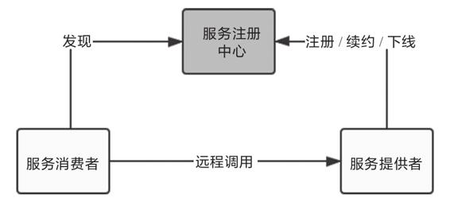
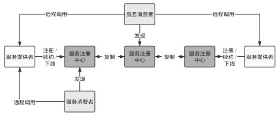
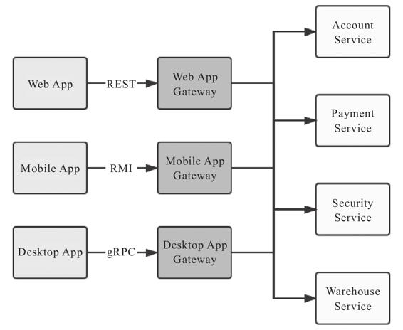
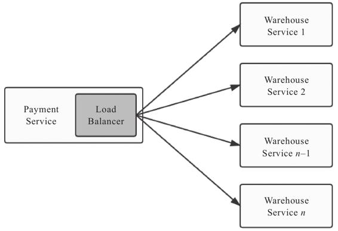
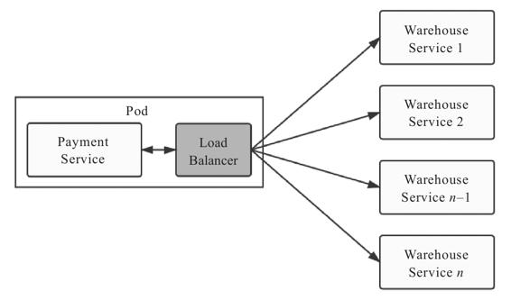

## 第7章 从类库到服务

微服务架构的一个重要设计原则是“通过服务来实现独立自治的组件”（Componentization via Service），强调应采用“服务”（Service）而不是“类库”（Library）来构建组件化的程序，这两者的差别在于类库是在编译期静态链接到程序中的，通过调用本地方法来使用其中的功能，而服务是进程外组件，通过调用远程方法来使用其中的功能。

采用服务来构建程序，获得的收益是软件系统“整体”与“部分”在物理层面的真正隔离，这对构筑可靠的大型软件系统来说无比珍贵，但另一面，其付出的代价也不容忽视，微服务架构在复杂性与执行性能方面做出了极大的让步。在一套由多个微服务相互调用才能正常运作的分布式系统中，每个节点都互相扮演着服务的生产者与消费者的多重角色，形成了一套复杂的网状调用关系，此时，至少有（但不限于）以下三个问题是必须考虑并得到妥善解决的。

·对消费者来说，外部的服务由谁提供？具体在什么网络位置？

·对生产者来说，内部哪些服务需要暴露？哪些应当隐藏？应当以何种形式暴露服务？以什么规则在集群中分配请求？

·对调用过程来说，如何保证每个远程服务都接收到相对平均的流量，获得尽可能高的服务质量与可靠性？

这三个问题的解决方案，在微服务架构中通常被称为“服务发现”“服务的网关路由”和“服务的负载均衡”。

### 7.1 服务发现

类库封装被大规模使用，令计算机可以通过位于不同模块的方法调用来组装复用指令序列，打开了软件达到更大规模的一扇大门。无论是编译期链接的C、C++语言，还是运行期链接的Java语言，都要通过链接器（Linker）将代码里的符号引用转换为模块入口或进程内存地址的直接引用。而服务化的普及，令软件系统得以通过分布于网络中不同机器的互相协作来复用功能，这是软件发展规模的第二次飞跃，此时，如何确定目标方法的确切位置，便是与编译链接有着等同意义的研究课题，解决该问题的过程被称作“服务发现”（Service Discovery）。

#### 7.1.1 服务发现的意义

所有的远程服务调用都是使用全限定名（Fully Qualified Domain Name，FQDN[1]）、端口号与服务标识所构成的三元组来确定一个远程服务的精确坐标的。全限定名代表了网络中某台主机的精确位置，端口号代表了主机上某一个提供了TCP/UDP网络服务的程序，服务标识则代表了该程序所提供的某个具体的方法入口。其中“全限定名、端口号”的含义对所有的远程服务来说都是一致的，而“服务标识”则与具体的应用层协议相关，不同协议具有不同形式的标识。譬如REST的远程服务，标识是URL地址；RMI的远程服务，标识是Stub类中的方法；SOAP的远程服务，标识是WSDL中定义方法，等等。远程服务标识的多样性，决定了“服务发现”也可以有两种不同的理解，一种是以UDDI为代表的“百科全书式”的服务发现，上至提供服务的企业信息（企业实体、联系地址、分类目录等），下至服务的程序接口细节（方法名称、参数、返回值、技术规范等）都在服务发现的管辖范围之内；另一种是类似于DNS这样“门牌号码式”的服务发现，只满足从某个代表服务提供者的全限定名到服务实际主机IP地址的翻译转换，并不关心服务具体是哪个厂家提供的，也不关心服务有几个方法，各自由什么参数构成，它默认这些细节信息是服务消费者本身已完全了解的，此时服务坐标就可以退化为更简单的“全限定名+端口号”。当今，后一种服务发现占主流地位，本文后续所说的服务发现，如无说明，均是特指后者。

原本服务发现只依赖DNS将一个全限定名翻译为一至多个IP地址或者SRV等其他类型的记录便可，位于DNS之后的负载均衡器也实质上承担了一部分服务发现的职责，完成了外部IP地址到各个服务内部实际IP的转换（这些内容笔者在第4章中曾经详细解析过）。这种做法在软件追求不间断长时间运行的时代是很合适的，但随着微服务的逐渐流行，服务的非正常宕机、重启和正常的上线、下线变得越发频繁，仅靠DNS服务器和负载均衡器等基础设施逐渐疲于应对，无法跟上服务变动的步伐了。人们最初是尝试使用ZooKeeper这样的分布式K/V框架，通过软件自身来完成服务注册与发现，ZooKeeper也的确曾短暂统治过远程服务发现，是微服务早期的主流选择，但ZooKeeper毕竟是很底层的分布式工具，还需要用户自己做相当多的工作才能满足服务发现的需求。到了2014年，在Netflix内部经受过长时间实际考验的、专门用于服务发现的Eureka宣布开源，并很快被纳入Spring Cloud，成为Spring默认的远程服务发现的解决方案，从此Java程序员无须再在服务注册这件事情上花费太多的力气。到2018年，Spring Cloud Eureka进入维护模式以后，HashiCorp的Consul和阿里巴巴的Nacos很快就从Eureka手上接过传承的衣钵。

到这个阶段，服务发现框架已经发展得相当成熟，考虑到了几乎方方面面的问题，不仅支持通过DNS或者HTTP请求进行符号与实际地址的转换，支持各种各样的服务健康检查方式，还支持集中配置、K/V存储、跨数据中心的数据交换等多种功能，可算是应用自身去解决服务发现的一个顶峰。如今，云原生时代来临，基础设施的灵活性得到大幅度增强，最初的使用基础设施来透明化地做服务发现的方式又重新被人们所重视，如何在基础设施和网络协议层面，对应用尽可能无感知、方便地实现服务发现是目前服务发现的一个主要发展方向。

[1] 请注意全限定名与IP地址的差别，由于IP的具体地址与数量均是动态的，描述一个服务应采用全限定名来表示。

#### 7.1.2 可用与可靠

本节笔者并不打算介绍具体某一种服务发现工具的具体功能与操作，而是会分析服务发现的通用的共性设计，探讨对比时下服务发现最常见的不同形式。这里要讨论的第一个问题是“服务发现”具体是指进行过什么操作？这其实包含三个必需的过程。

·服务的注册（Service Registration）：当服务启动的时候，它应该通过某些形式（如调用API、产生事件消息、在ZooKeeper/etcd的指定位置记录、存入数据库，等等）将自己的坐标信息通知到服务注册中心，这个过程可能由应用程序本身来完成，称为自注册模式，譬如Spring Cloud的@EnableEurekaClient注解；也可能由容器编排框架或第三方注册工具来完成，称为第三方注册模式，譬如Kubernetes和Registrator。

·服务的维护（Service Maintaining）：尽管服务发现框架通常都有提供下线机制，但并没有什么办法保证每次服务都能优雅地下线（Graceful Shutdown）而不是由于宕机、断网等原因突然失联。所以服务发现框架必须自己保证所维护的服务列表的正确性，以避免告知消费者服务的坐标后，得到的服务却不能使用的尴尬情况。现在的服务发现框架，往往都能支持多种协议（HTTP、TCP等）、多种方式（长连接、心跳、探针、进程状态等）去监控服务是否健康存活，将不健康的服务自动从服务注册表中剔除。

·服务的发现（Service Discovery）：这里的发现是特指狭义上消费者从服务发现框架中，把一个符号（譬如Eureka中的ServiceID、Nacos中的服务名，或者通用的FQDN）转换为服务实际坐标的过程，这个过程现在一般是通过HTTP API请求或者DNS Lookup操作来完成，也有一些相对少用的方式，譬如Kubernetes也支持注入环境变量来做服务发现。

以上三点只是列举了服务发现必须提供的功能，在此之余还会有一些可选的扩展功能，譬如在服务发现时进行的负载均衡、流量管控、键值存储、元数据管理、业务分组，等等，这部分会在后续章节专门介绍。这里，笔者想借服务发现为样本，展示分布式环境里可用性与一致性的矛盾。从CAP定理开始，到分布式共识算法，我们已在理论上探讨过多次在服务的可用性和数据的可靠性之间的取舍，但服务发现却面临着两者都难以舍弃的困境。

服务发现既要高可用，也要高可靠是由它在整个系统中所处的位置所决定的。在概念模型里，服务发现的位置如图7-1所示：服务提供者在服务注册中心中注册、续约和下线自己的真实坐标，服务消费者根据某种符号从服务注册中心获取到真实坐标，无论是服务注册中心、服务提供者还是服务消费者，它们都是系统服务中的一员，相互间的关系应是对等的。



图7-1　概念模型中的服务发现

但在真实的系统里，注册中心的地位是特殊的，不能完全视其为一个普通的服务。注册中心不依赖其他服务，但被所有其他服务共同依赖，是系统中最基础的服务（地位与配置中心类似，现在服务发现框架也开始同时提供配置中心的功能，以避免配置中心又去专门摆弄出一集群的节点来），几乎没有可能在业务层面进行容错。这意味着服务注册中心一旦崩溃，整个系统都不再可用，因此，必须尽最大努力保证服务发现的可用性。实际用于生产的分布式系统，服务注册中心都是以集群的方式进行部署的，通常使用三个或者五个节点（最多七个，一般也不会更多了，否则日志复制的开销太高）来保证高可用，如图7-2所示。



图7-2　真实系统中的服务发现

同时，也请注意到图7-2中各服务注册中心节点之间的复制（Replicate）字样，作为用户，我们当然期望在服务注册中心一直可用、永远健康的同时，也能够在访问每一个节点时取到可靠一致的数据，而不是从注册中心拿到的服务地址可能已经下线，但这两个需求就构成了CAP矛盾，不可能同时满足。以最有代表性的Netflix Eureka和Hashicorp Consul为例。

Eureka的选择是优先保证高可用性，相对牺牲系统中服务状态的一致性。Eureka的各个节点间采用异步复制来交换服务注册信息，当有新服务注册进来时，并不需要等待信息在其他节点复制完成，而是马上在该服务发现节点宣告服务可见，只是不保证在其他节点上多长时间后才会可见。同时，当有旧的服务发生变动，譬如下线或者断网，只会由超时机制来控制何时从哪一个服务注册表中移除，变动信息不会实时同步给所有服务端与客户端。这样的设计使得不论是Eureka的服务端还是客户端，都能够持有自己的服务注册表缓存，并以TTL（Time to Live）机制来进行更新，哪怕服务注册中心完全崩溃，客户端仍然可以维持最低限度的可用。Eureka的服务发现模型适合于节点关系相对固定、服务一般不会频繁上下线的系统，以较小的同步代价换取了最高的可用性；Eureka能够选择这种模型的底气在于万一客户端拿到了已经发生变动的错误地址，也能够通过Ribbon和Hystrix模块配合来兜底，实现故障转移（Failover）或者快速失败（Failfast）。

Consul的选择是优先保证高可靠性，相对牺牲系统服务发现的可用性。Consul采用Raft算法，要求多数节点写入成功后服务的注册或变动才算完成，严格地保证了在集群外部读取到的服务发现结果的一致性；同时采用Gossip协议，支持多数据中心之间更大规模的服务同步。Consul优先保证高可靠性在一定程度上是基于产品现实情况而做的技术决策，它不像Netflix OSS那样有着全家桶式的微服务组件，万一从服务发现中取到错误地址，就没有其他组件为它兜底了。Eureka与Consul的差异带来的影响主要不在于服务注册的快慢（当然，快慢确实是有差别），而在于你如何看待以下这件事情：

假设系统形成了A、B两个网络分区后，A区的服务只能从区域内的服务发现节点获取A区的服务坐标，B区的服务只能取到在B区的服务坐标，这对你的系统会有什么影响？

·如果这件事情对你并没有太大的影响，甚至有可能还是有益的，就应该倾向于选择AP式的服务发现。譬如假设A、B就是不同的机房，是机房间的网络交换机导致服务发现集群出现的分区问题，但每个分区中的服务仍然能独立提供完整且正确的服务能力，此时尽管不是有意为之，但网络分区在事实上避免了跨机房的服务请求，反而带来了服务调用链路优化的效果。

·如果这件事情对你影响非常大，甚至可能带来比整个系统宕机更坏的结果，就应该倾向于选择CP式的服务发现。譬如系统中大量依赖了集中式缓存、消息总线，或者其他有状态的服务，一旦这些服务全部或者部分被分隔到某一个分区中，会对整个系统的操作的正确性产生直接影响的话，与其最后弄出一堆数据错误，还不如直接停机。

#### 7.1.3 注册中心实现

可用性与一致性的矛盾，是分布式系统永恒的话题，在服务发现这个场景里，权衡的主要关注点是相对更能容忍服务列表不可用的后果，还是服务数据不准确的后果，其次才到性能高低，功能是否强大，使用是否方便等因素。有了选择权衡，很自然就引来了一个“务实”的话题，现在有那么多服务发现框架，哪一款最好？或者说应该如何挑选适合的服务发现框架？当下，直接以服务发现、服务注册中心为目标的组件库，或者间接用来实现这个目标的工具主要有以下三类。

·在分布式K/V存储框架上自己开发的服务发现，典型代表是ZooKeeper、Doozerd、etcd。这些K/V框架提供了分布式环境下读写操作的共识算法，etcd采用的是我们学习过的Raft算法，ZooKeeper采用的是ZAB算法，这也是一种Multi Paxos的派生算法，所以采用这种方案，就不必纠结CP还是AP的问题，它们都是CP的（也曾有公司采用Redis来做服务发现，这种自然是AP的）。这类框架的宣传语中往往会主动提及“高可用性”，潜台词是“在保证一致性和分区容忍性的前提下，尽最大努力实现最高的可用性”，譬如etcd的宣传语就是“高可用的集中配置和服务发现”（Highly-Available Key Value Store for Shared Configuration and Service Discovery）。这些K/V框架的一个共同特点是在整体较高复杂度的架构和算法的外部，维持着极为简单的应用接口，只有基本的CRUD和Watch等少量API，所以要在上面完成功能齐全的服务发现，很多基础的能力，譬如服务如何注册、如何做健康检查等都必须自己去实现，如今一般也只有“大厂”才会直接基于这些框架去做服务发现了。

·以基础设施（主要是指DNS服务器）来实现服务发现，典型代表是SkyDNS、CoreDNS。在Kubernetes 1.3之前的版本使用SkyDNS作为默认的DNS服务，其工作原理是从API Server中监听集群服务的变化，然后根据服务生成NS、SRV等DNS记录存放到etcd中，kubelet会设置每个Pod的DNS服务的地址为SkyDNS的地址，需要调用服务时，只需查询DNS把域名转换成IP列表便可实现分布式的服务发现。在Kubernetes 1.3之后，SkyDNS不再是默认的DNS服务器，而是由只将DNS记录存储在内存中的KubeDNS代替，到了1.11版，就更推荐采用扩展性很强的CoreDNS，此时可以通过各种插件来决定是否要采用etcd存储、重定向、定制DNS记录、记录日志，等等。

采用这种方案，是CP还是AP就取决于后端采用何种存储，如果是基于etcd实现，那自然是CP的，如果是基于内存异步复制的方案实现，那就是AP的（仅针对DNS服务器本身，不考虑本地DNS缓存的TTL刷新）。以基础设施来做服务发现，好处是对应用透明，任何语言、框架、工具都肯定支持HTTP、DNS，所以完全不受程序技术选型的约束，但坏处是透明的并不一定是简单的，你必须自己考虑如何去做客户端负载均衡、如何调用远程方法等这些问题，而且必须遵循或者说受限于这些基础设施本身所采用的实现机制，譬如服务健康检查里，服务的缓存期限就应该由TTL决定，这是DNS协议所规定的，如果想改用KeepAlive长连接来实时判断服务是否存活就相对麻烦。

·专门用于服务发现的框架和工具，典型代表是Eureka、Consul和Nacos。在这一类框架中，你可以自己决定是CP还是AP，譬如CP的Consul、AP的Eureka，还有同时支持CP和AP的Nacos（Nacos采用类Raft协议实现CP，采用自研的Distro协议实现AP，这里“同时”是“都支持”的意思，但必须二取其一，不是说CAP全能满足）。将它们划归一类是因为它们对应用并不是透明的，尽管Consul的主体逻辑是在服务进程之外，以边车的形式提供；尽管Consul、Nacos也支持基于DNS的服务发现；尽管这些框架都基本做到了以声明代替编码，譬如在Spring Cloud中只改动pom.xml、配置文件和注解即可实现，但它们依然是可以被应用程序感知的。所以或多或少还需要考虑程序语言、技术框架的集成问题。但这个特点其实并不全是坏处，譬如采用Eureka做服务注册，那在远程调用服务时就可以用OpenFeign做客户端，因为它们本身就已做好了集成，写个声明式接口就能运行；在做负载均衡时可以采用Ribbon做客户端，需要换均衡算法时改个配置就成。这些“不透明”实际上都为编码开发带来了一定便捷，但前提是你选用的语言和框架必须支持。

### 7.2 网关路由

网关（Gateway）这个词在计算机科学中，尤其是在计算机网络中很常见，用于表示位于内部区域边缘，与外界进行交互的某个物理或逻辑设备，譬如你家里的路由器就属于家庭内网与互联网之间的网关。

#### 7.2.1 网关的职责

在单体架构下，我们一般不太强调“网关”这个概念，为各个单体系统的副本分发流量的负载均衡器实质上扮演了内部服务与外部请求之间的网关角色。在微服务环境中，网关的存在感就极大地增强了，甚至成为微服务集群中必不可少的设施之一。其中原因并不难理解：微服务架构下，每个服务节点都可能由不同团队负责，都有着自己独立的、互不相同的接口，如果服务集群缺少一个统一对外交互的代理人角色，那外部的服务消费者就必须知道所有微服务节点在集群中的精确坐标（在7.1节中解释过“服务坐标”的概念），这样，消费者会受到服务集群的网络限制（不能确保集群中每个节点都有外网连接）、安全限制（不仅是服务节点的安全，外部自身也会受到如浏览器同源策略的约束）、依赖限制（服务坐标这类信息不属于对外接口承诺的内容，随时可能变动，不应该依赖它），就算是调用服务的程序员，也不会愿意记住每一个服务的坐标位置来编写代码。由此可见，微服务中网关的首要职责就是作为统一的出口对外提供服务，将外部访问网关地址的流量，根据适当的规则路由到内部集群中正确的服务节点之上，因此，微服务中的网关，也常被称为“服务网关”或者“API网关”，微服务中的网关首先应该是个路由器，在满足此前提的基础上，还可以根据需要作为流量过滤器来使用，以提供某些额外的可选职能，譬如安全、认证、授权、限流、监控、缓存，等等（这部分内容在后续章节中有专门讲解，这里不会涉及）。简言之：

网关=路由器（基础职能）+过滤器（可选职能）

针对“路由器”这个基础职能，服务网关主要考量的是能够支持路由的“网络协议层次”和“性能与可用性”这两方面的因素。网络协议层次是指负载均衡中介绍过的四层流量转发与七层流量代理。仅从技术实现角度来看，对于路由这项工作，负载均衡器与服务网关在实现上是没有什么差别的，很多服务网关本身就是基于老牌的负载均衡器来实现的，譬如基于Nginx、HAProxy开发的Ingress Controller，基于Netty开发的Zuul 2.0等；但从目的角度来看，负载均衡器与服务网关会有一些区别，具体在于前者是为了根据均衡算法对流量进行平均地路由，后者是为了根据流量中的某种特征进行正确地路由。网关必须能够识别流量中的特征，这意味着网关能够支持的网络通信协议的层次将会直接限制后端服务节点能够选择的服务通信方式。如果服务集群只提供像etcd这样直接基于TCP访问的服务，那只部署四层网关便可满足，网关以IP报文中源地址、目标地址为特征进行路由；如果服务集群要提供HTTP服务，那就必须部署一个七层网关，网关以HTTP报文中的URL、Header等信息为特征进行路由；如果服务集群还要提供更上层的WebSocket、SOAP等服务，那就必须要求网关同样能够支持这些上层协议，才能从中提取到特征。

举个例子，以下是一段基于SpringCloud实现的Fenix’s Bookstore实例中用到的Netflix Zuul网关的配置，Zuul是HTTP网关，/restful/accounts/**和/restful/pay/**是HTTP中的URL的特征，而配置中的serviceId就是路由的目标服务。

```
routes:
    account:
        path: /restful/accounts/**
        serviceId: account
        stripPrefix: false
        sensitiveHeaders: "*"

    payment:
        path: /restful/pay/**
        serviceId: payment
        stripPrefix: false
        sensitiveHeaders: "*"
```

今天围绕微服务的各种技术仍处于快速发展期，笔者不提倡针对每一种工具、框架本身去记忆配置细节，也就是说，无须纠结上面代码清单中配置的确切写法、每个指令的含义。如果你从根本上理解了网关的原理，参考一下技术手册，很容易就能够将上面的信息改写成Kubernetes Ingress Controller、Istio VirtualServer或者其他服务网关所需的配置形式。

网关的另一个主要关注点是它的性能与可用性。由于网关是所有服务对外的总出口，是流量必经之地，所以网关的路由性能将导致全局的、系统性的影响，如果经过网关路由会有1毫秒的性能损失，就意味着整个系统所有服务的响应延迟都会增加1毫秒。网关的性能与它的工作模式和自身实现算法都有关系，但毫无疑问工作模式是最关键的因素，如果能够采用DSR三角传输模式，在实现原理上就决定了性能一定会比代理模式来的强（DSR、IP Tunnel、NAT、代理等这些都是网络基础知识，笔者曾在4.5节详细讲解过）。不过，因为今天REST和JSON-RPC等基于HTTP协议的服务接口在对外部提供的服务中占绝对主流的地位，所以我们所讨论的服务网关默认都必须支持七层路由，通常默认无法直接进行流量转发，只能采用代理模式。在这个前提约束下，网关的性能主要取决于它们如何代理网络请求，也即它们的网络I/O模型，下面笔者正好借这个场景介绍一下网络I/O的基础知识。

#### 7.2.2 网络I/O模型

在套接字接口抽象下，网络I/O的出入口就是Socket的读和写，Socket在操作系统接口中被抽象为数据流，而网络I/O可以理解为对流的操作。每一次网络访问，从远程主机返回的数据会先存放到操作系统内核的缓冲区中，然后从内核的缓冲区复制到应用程序的地址空间，所以当发生一次网络请求时，将会按顺序经历“等待数据从远程主机到达缓冲区”和“将数据从缓冲区复制到应用程序地址空间”两个阶段，根据实现这两个阶段的不同方法，人们把网络I/O模型总结为两类、五种模型：两类是指同步I/O与异步I/O，五种是指在同步I/O中又划分出阻塞I/O、非阻塞I/O、多路复用I/O、信号驱动I/O四种细分模型以及异步I/O模型。这里笔者先解释一下同步和异步、阻塞和非阻塞的概念。同步是指调用端在发出请求之后，得到结果之前必须一直等待，与之相对的就是异步，发出调用请求之后将立即返回，不会马上得到处理结果，结果将通过状态变化和回调来通知调用者。阻塞和非阻塞是针对请求处理过程而言，指在收到调用请求之后，返回结果之前，当前处理线程是否会被挂起。这种概念上的叙述可能还是不太好理解，笔者以“你如何领到盒饭”为情景，将之类比解释如下。

·异步I/O（Asynchronous I/O）：比如你在美团外卖订了个盒饭，付款之后你自己该干嘛干嘛，饭送到时骑手自然会打电话通知你。异步I/O中数据到达缓冲区后，不需要由调用进程主动进行从缓冲区复制数据的操作，而是复制完成后由操作系统向线程发送信号，所以它一定是非阻塞的。

·同步I/O（Synchronous I/O）：比如你自己去饭堂打饭，这时可能有如下情形发生。

·阻塞I/O（Blocking I/O）：你去饭堂打饭，发现饭还没做好，只能等待（线程休眠），直到饭做好，这就是被阻塞了。阻塞I/O是最直观的I/O模型，逻辑清晰，也比较节省CPU资源，但缺点是线程休眠所带来的上下文切换，这是一种需要切换到内核态的重负载操作，不应当频繁进行。

·非阻塞I/O（Non-Blocking I/O）：你去饭堂，发现饭还没做好，你就回去了，然后每隔3分钟来一次饭堂看饭是否做好，一直重复，直到饭做好。非阻塞I/O能够避免线程休眠，对于一些很快就能返回结果的请求，非阻塞I/O可以节省切换上下文切换的消耗，但是对于较长时间才能返回的请求，非阻塞I/O反而白白浪费了CPU资源，所以目前并不太常用。

·多路复用I/O（Multiplexing I/O）：多路复用I/O本质上是阻塞I/O的一种，但是它的好处是可以在同一条阻塞线程上处理多个不同端口的监听。仍以去食堂打饭为例，比如你代表整个宿舍去饭堂打饭，去到饭堂，发现饭还没做好，还是继续等待，其中某个舍友的饭好了，你就马上把那份饭送回去，然后继续等待其他舍友的饭做好。多路复用I/O是目前高并发网络应用的主流，它还可以细分为select、epoll、kqueue等不同实现，这里就不再展开了。

·信号驱动I/O（Signal-Driven I/O）：你去到饭堂，发现饭还没做好，但你跟厨师很熟，跟他说饭做好了叫你，然后你就回去了，等收到厨师通知后，你再去饭堂把饭拿回宿舍。这里厨师的通知就是那个“信号”，信号驱动I/O与异步I/O的区别是“从缓冲区获取数据”这个步骤的处理，前者收到的通知是可以开始进行复制操作了，即要你自己从饭堂拿回宿舍，在复制完成之前线程处于阻塞状态，所以它仍属于同步I/O操作，而后者收到的通知是复制操作已经完成，即外卖小哥已经把饭送到了。

显然，异步I/O模型是最方便的，但前提是系统支持异步操作。异步I/O受限于操作系统，Windows NT内核早在3.5以后，就通过IOCP实现了真正的异步I/O模型。而Linux系统是在Linux Kernel 2.6才首次引入，目前还不算很完善，因此在Linux系统下实现高并发网络编程时仍以多路复用I/O模型模式为主。

回到服务网关的话题上，有了网络I/O模型的知识，我们就可以在理论上定性分析不同七层网关的性能差异了。七层服务网关处理一次请求代理时，包含两组网络操作，分别是作为服务端对外部请求的应答和作为客户端对内部服务的请求，理论上这两组网络操作可以采用不同的模型去完成，但一般没有必要这样做。

以Zuul网关为例，在Zuul 1.0时，它采用的是阻塞I/O模型来进行最经典的“一条线程对应一个连接”（Thread-per-Connection）的方式来代理流量。采用阻塞I/O模型意味着它会有线程休眠，就有上下文切换的成本，所以如果后端服务普遍属于计算密集型（CPU Bound，可以通俗理解为服务耗时比较长，主要消耗在CPU上）时，这种模型能够相对节省网关的CPU资源，但如果后端服务普遍都是I/O密集型（I/O Bound，可以理解为服务都很快返回，主要消耗在I/O上），它就会由于频繁的上下文切换而降低性能。Zuul 2.0版本最大的改进就是基于Netty Server实现了异步I/O模型来处理请求，大幅度减少了线程数，获得了更高的性能和更低的延迟。根据Netflix官方给出的数据，Zuul 2.0大约要比Zuul 1.0快上20%左右。还有一些网关甚至支持自行配置，或者根据环境选择不同的网络I/O模型，典型代表就是Nginx，它可以支持在配置文件中指定select、poll、epoll、kqueue等并发模型。

网关的性能高低一般只会定性分析，要定量地说哪一种网关性能最高、高多少是很困难的，就像我们都认可Chrome要比IE快，但脱离了具体场景，快多少就很难说的清楚。尽管笔者上面引用了Netflix官方对Zuul两个版本的量化对比，网络上也有不少关于各种网关的性能对比数据，但若脱离具体应用场景去定量地比较不同网关的性能差异还是难以令人信服，不同的测试环境和后端服务都会直接影响结果。

网关还有最后一点必须关注的是它的可用性问题。任何系统的网络调用过程中都至少会有一个单点存在，这是由用户只通过唯一的地址去访问系统所决定的。即使是淘宝、亚马逊这样全球多数据中心部署的大型系统也不例外。对于更普遍的小型系统（小型是相对淘宝这些而言）来说，作为后端对外服务代理人角色的网关经常被视为整个系统的入口，往往很容易成为网络访问中的单点，这时候它的可用性就尤为重要。由于网关的地址具有唯一性，所以不能像之前服务发现那些注册中心那样，用集群的方式解决问题。在网关的可用性方面，我们应该考虑到以下几点。

·网关应尽可能轻量，尽管网关作为服务集群统一的出入口，可以很方便地实现安全、认证、授权、限流、监控等功能，但给网关附加这些功能时还是要仔细权衡，取得功能性与可用性之间的平衡，过度增加网关的功能是危险的。

·网关选型时，应该尽可能选择较成熟的产品实现，譬如Nginx Ingress Controller、KONG、Zuul这些经过长期考验的产品，而不能一味只考虑性能选择最新的产品，性能与可用性之间的平衡也需要权衡。

·在需要高可用的生产环境中，应当考虑在网关之前部署负载均衡器或者等价路由器（ECMP），让那些更成熟健壮的设施（往往是硬件物理设备）去充当整个系统的入口地址，这样网关也可以进行扩展。

#### 7.2.3 BFF网关

提到网关的唯一性、高可用与扩展，笔者顺带说一下近年来随着微服务一起火起来的概念“BFF”（Backend for Frontend），如图7-3所示。这个概念目前还没有特别权威的中文翻译，在我们讨论的上下文里，它的意思是：网关不必为所有的前端提供无差别的服务，而是应该针对不同的前端，聚合不同的服务，提供不同的接口和网络访问协议支持。譬如，运行于浏览器的Web程序，由于浏览器一般只支持HTTP协议，服务网关就应提供REST等基于HTTP协议的服务，但同时我们也可以针对运行于桌面系统的程序部署另外一套网关，它能与Web网关有完全不同的技术选型，能提供基于更高性能协议（如gRPC）的接口以提供更好的体验。在网关这种边缘节点上，针对同样的后端集群，裁剪、适配、聚合出适应不一样的前端的服务，有助于后端的稳定，也有助于前端的赋能。



图7-3　BFF网关

### 7.3 客户端负载均衡

在正式开始讨论之前，我们先来弄清楚几个容易混淆的相似概念，分别是本章中频繁提到的服务发现、网关路由、负载均衡以及在第8章将会介绍的服务容错。这几个技术名词都带有“从服务集群中寻找到一个合适的服务来调用”的含义，笔者会通过以下具体场景来说明它们之间的差别。

额外知识

案例场景

假设你身处广东，要上Fenix’s Bookstore购买一本书，在程序业务逻辑里，购书的其中一个关键步骤是调用商品出库服务来完成货物准备，在代码中该服务的调用请求为：

```
PATCH https://warehouse:8080/restful/stockpile/3

{amount: -1}
```

又假设Fenix’s Bookstore是个大书店，在北京、武汉、广州均部署有服务集群机房，你的购物请求从浏览器发出后，服务端按顺序发生如下事件。

1）首先是将warehouse这个服务名称转换为恰当的服务地址，“恰当”是个宽泛的描述，一种典型的“恰当”便是因调用请求来自广东，优先分配给物理传输距离最短的广州机房来应答。其实按常理来说这次出库服务的调用应该是集群内的流量，而不是用户浏览器直接发出的请求，所以尽管结果没有不同，但更接近实际的情况是用户访问首页时已经被DNS服务器分配到了广州机房，请求出库服务时，应优先选择同机房的服务进行调用，此时请求变为：

```
PATCH https://guangzhou-ip-wan:8080/restful/stockpile/3
```

2）广州机房的服务网关将该请求与配置中的特征进行比对，由URL中的/restful/stockpile/**得知该请求访问的是商品出库服务，因此，将请求的IP地址转换为内网中warehouse服务集群的入口地址：

```
PATCH https://warehouse-gz-lan:8080/restful/stockpile/3
```

3）集群中部署了多个warehouse服务，收到调用请求后，负载均衡器要在多个服务中根据某个标准（均衡策略）——可能是随机挑选，也可能是按顺序轮询，还可能是选择此前调用次数最少的那个，等等，找出要响应本次调用请求的服务，称其为warehouse-gz-lan-node1。

```
PATCH https://warehouse-gz-lan-node1:8080/restful/stockpile/3
```

4）如果访问warehouse-gz-lan-node1服务，没有返回需要的结果，而是抛出500错。

```
HTTP/1.1 500 Internal Server Error
```

5）根据预置的故障转移策略，重新将调用分配给能够提供服务的其他节点，称其为warehouse-gz-lan-node2。

```
PATCH https://warehouse-gz-lan-node2:8080/restful/stockpile/3
```

6）warehouse-gz-lan-node2服务返回商品出库成功。

```
HTTP/1.1 200 OK
```

以上过程从整体上看，步骤1、2、3、5，分别对应了服务发现、网关路由、负载均衡和服务容错，从细节上看，其中部分职责又是有交叉的，并不是服务注册中心就只关心服务发现，网关只关心路由，负载均衡器只关心流量负载均衡。譬如，在步骤1的服务发现的过程中，“根据请求来源的物理位置来分配机房”的操作本质上是根据请求中的特征（地理位置）进行流量分发，这实际是一种路由行为。在实际系统中，DNS服务器（DNS智能线路）、服务注册中心（如Eureka等框架中的Region、Zone概念）或者负载均衡器（可用区负载均衡，如AWS的NLB，或Envoy的Region、Zone、Sub-zone）中都有可能实现这种路由行为。

此外，你是否感觉到以上网络调用过程似乎过于烦琐了，一个从广州机房内网发出的服务请求，绕到了网络边缘的网关、负载均衡器这些设施上，再被分配回内网中另外一个服务去响应，不仅消耗了带宽，降低了性能，也增加了链路上的风险和运维的复杂度。可是，如果流量不经过这些设施，它们相应的职责就无法发挥作用，譬如不经过负载均衡器的话，连请求应该具体交给哪一个服务去处理都无法确定，这有办法简化吗？

#### 7.3.1 客户端负载均衡器

对于任何一个大型系统，负载均衡器都是必不可少的设施。以前，负载均衡器大多只部署在整个服务集群的前端，负责将用户的请求分流到各个服务进行处理，这种经典的部署形式现在被称为集中式的负载均衡。随着微服务日渐流行，服务集群收到的请求来源不再局限于外部，而是越来越多的来源于集群内部的某个服务，并由集群内部的另一个服务进行响应，对于这类流量的负载均衡，既有的方案依然是可行的，但针对内部流量的特点，直接在服务集群内部消化掉，肯定是更合理且更受开发者青睐的办法。由此一种全新的、独立位于每个服务前端的、分散式的负载均衡方式逐渐流行起来，这就是本节我们要讨论的主角：客户端负载均衡器（Client-Side Load Balancer），如图7-4所示。



图7-4　客户端负载均衡器

客户端负载均衡器的理念提出以后，此前的集中式负载均衡器也有了一个方便与它对比的名字——“服务端负载均衡器”（Server-Side Load Balancer）。从图7-4中能够清晰地看到客户端负载均衡器的特点，也是它与服务端负载均衡器的关键差别所在：客户端均衡器是和服务实例一一对应的，而且与服务实例并存于同一个进程内。这个特点能为它带来很多好处。

·负载均衡器与服务之间的信息交换是进程内的方法调用，不存在任何额外的网络开销。

·不依赖集群边缘的设施，所有内部流量都仅在服务集群的内部循环，避免了前文那样，集群内部流量要“绕场一周”的尴尬局面。

·分散式的负载均衡器意味着天然避免了集中式的单点问题，它的带宽资源将不会像集中式负载均衡器那样敏感，这在以七层负载均衡器为主流、不能通过IP隧道和三角传输这样的方式节省带宽的微服务环境中显得更具优势。

·客户端负载均衡器更加灵活，能够针对每一个服务实例单独设置均衡策略等参数，例如访问哪个服务，是否需要具备亲和性，选择服务的策略是随机、轮询、加权还是最小连接，等等，都可以单独设置而不影响其他服务。

……

但是，客户端负载均衡器也不是“银弹”，它也存在不少缺点。

·它与服务运行于同一个进程内，意味着它的选型受到服务所使用的编程语言的限制，譬如用Go开发的微服务就不太可能搭配Spring Cloud的负载均衡器来使用，而为每种语言都实现对应的能够支持复杂网络情况的负载均衡器是非常难的。客户端负载均衡器的这个缺陷有违于微服务中技术异构不应受到限制的原则。

·从个体服务来看，由于是共用一个进程，负载均衡器的稳定性会直接影响整个服务进程的稳定性，消耗的CPU、内存等资源也同样影响到服务的可用资源。从集群整体来看，在服务数量达成千乃至上万规模时，客户端负载均衡器消耗的资源总量是相当多的。

·由于请求的来源可能是集群中任意一个服务节点，而不再是统一来自集中式负载均衡器，使得内部网络安全和信任关系变得复杂，当攻破任何一个服务时，更容易通过该服务突破集群中的其他部分。

·服务集群的拓扑关系是动态的，每一个客户端均衡器必须持续跟踪其他服务的健康状况，以实现上线新服务、下线旧服务、自动剔除失败服务、自动重连恢复服务等负载均衡器必须具备的功能。由于这些操作都需要通过访问服务注册中心来完成，数量庞大的客户端负载均衡器一直持续轮询服务注册中心，也会带来不小的负担。

……

#### 7.3.2 代理负载均衡器

在Java领域，客户端均衡器中最具代表性的产品是Netflix Ribbon和Spring Cloud LoadBalancer，随着微服务的流行，它们在Java微服务中已积聚了相当可观的使用者。直到最近两三年，服务网格（Service Mesh）开始逐渐盛行，另外一种被称为“代理客户端负载均衡器”（Proxy Client-Side Load Balancer，后文简称“代理均衡器”）的客户端负载均衡器变体形式开始引起不同编程语言的微服务开发者的共同关注，它弥补了此前客户端负载均衡器的大多数缺陷。代理均衡器对此前的客户端负载均衡器的改进是将原本嵌入在服务进程中的负载均衡器提取出来，作为一个进程之外，同一Pod之内[1]的特殊服务，放到边车代理中去实现，它的流量关系如图7-5所示。



图7-5　代理负载均衡器

虽然代理均衡器与服务实例不再是进程内通信，而是通过网络协议栈进行数据交换，数据要经过操作系统的协议栈，要进行打包拆包、计算校验和、维护序列号等网络数据的收发步骤，比之前的客户端均衡器确实多增加了一系列处理步骤。不过，Kubernetes严格保证了同一个Pod中的容器不会跨越不同的节点，这些容器共享同一个网络名称空间，因此代理均衡器与服务实例的交互，实质上是对本机回环设备的访问，仍然要比真正的网络交互高效且稳定得多。代理均衡器付出的代价较小，但从服务进程中分离出来所获得的收益却是非常显著的。

·代理均衡器不再受编程语言的限制。开发一个支持Java、Go、Python等所有微服务应用服务的通用的代理均衡器具有很高的性价比。集中不同编程语言的使用者的力量，更容易打造出能面对复杂网络情况的、高效健壮的负载均衡器。即使退一步说，独立于服务进程的均衡器也不会由于自身的稳定性影响到服务进程的稳定。

·在服务拓扑感知方面，代理均衡器也更有优势。由于边车代理接受控制平面的统一管理，当服务节点拓扑关系发生变化时，控制平面就会主动向边车代理发送更新服务清单的控制指令，这避免了此前客户端负载均衡器必须长期主动轮询服务注册中心所造成的浪费。

·在安全性、可观测性上，由于边车代理都是一致的实现，有利于在服务间建立双向mTLS通信，也有利于对整个调用链路给出更详细的统计信息。

总体而言，边车代理这种通过同一个Pod的独立容器实现的负载均衡器是目前处理微服务集群内部流量最理想的方式，只是服务网格本身仍是初生事物，还不够成熟，对操作系统、网络和运维方面的知识要求也较高，但有理由相信随着时间的推移，未来这将会是微服务的主流通信方式。

[1] 当涉及容器化相关内容时，只针对Kubernetes环境进行讲述，理论上边车代理并不是必须绑定于Kubernetes。

#### 7.3.3 地域与区域

最后，借助前文已经铺设好的上下文场景，笔者想再谈一个与负载均衡相关，但又不只应用于负载均衡的概念：地域与区域。你是否注意到在微服务相关的许多设施中，都带有Region、Zone参数，如前文中提到的服务注册中心Eureka的Region、Zone，边车代理Envoy中的Region、Zone、Sub-zone，如果你有云计算IaaS的使用经历，也会发现几乎所有云计算设备都有类似的概念。Region和Zone是公有云计算先驱亚马逊AWS提出的概念，它们的含义如下。

·Region是地域的意思，譬如华北、东北、华东、华南，这些都是地域范围。面向全球或全国的大型系统的服务集群往往会部署在多个不同地域，譬如本节开头列举的案例场景，大型系统就是通过不同地域的机房来缩短用户与服务器之间的物理距离，以提升响应速度，对于小型系统，地域一般就只在异地容灾时才会涉及。需要注意，不同地域之间是没有内网连接的，所有流量都只能通过公众互联网相连，如果微服务的流量跨越了地域，实际就跟调用外部服务商提供的互联网服务没有任何差别了。所以集群内部流量是不会跨地域的，服务发现、负载均衡器默认也是不会支持跨地域的服务发现和负载均衡的。

·Zone是区域的意思，它是可用区域（Availability Zone）的简称。区域指在地理上位于同一地域内，但电力和网络是互相独立的物理区域，譬如在华东的上海、杭州、苏州的不同机房就是同一个地域的几个可用区域。同一个地域的可用区域之间具有内网连接，流量不占用公网带宽，因此区域是微服务集群内流量能够触及的最大范围。但你的应用是只部署在同一区域内，还是部署到几个不同可用区域中，要取决于你是否有做异地双活的需求，以及对网络延时的容忍程度。

·如果你追求高可用，譬如希望系统在某个地区发生电力或者骨干网络中断时仍然可用，那可以考虑将系统部署在多个区域中。注意异地容灾和异地双活的差别：容灾是非实时的同步，而双活是实时或者准实时的，跨地域或者跨区域做容灾都可以，但一般只能跨区域做双活，当然，也可以将它们结合起来使用，即“两地三中心”模式。

·如果你追求低延迟，譬如对时间有高要求的SLA应用，或者网络游戏服务器等，那就应该考虑将系统的所有服务都部署在同一个区域中，因为尽管内网连接不受限于公网带宽，但毕竟机房之间的专线容量也是有限的，难以跟机房内部的交换机相比，延时也受物理距离、网络跳点数量等因素的影响。

·可用区域对应城市级别的区域的范围，但在一些场景中仍是过大了，即使是同一个区域中的机房，也可能存在具有差异的不同子网络，所以在部分微服务框架也提供了Group、Sub-zone等参数做进一步的细分控制，这些参数的意思通常是加权或优先访问同一个子区域的服务，但如果子区域中没有合适的，则仍然会访问到可用区域中的其他服务。

·地域和区域原本是云计算中的概念，对于一些中小型的微服务系统，尤其是非互联网的企业信息系统，很多仍然没有使用云计算设施，只部署在某个专有机房内部，只为特定人群提供服务，这就不需要涉及地理上地域、区域的概念了。此时完全可以自己灵活延拓Region、Zone参数的含义，达到优化虚拟化基础设施流量的目的。譬如，将服务发现的区域设置与Kubernetes的标签、选择器配合，实现内部服务请求其他服务时，优先使用同一个节点中提供的服务进行应答，以降低真实的网络消耗。
