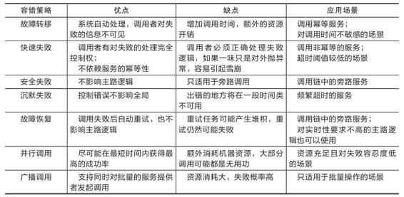
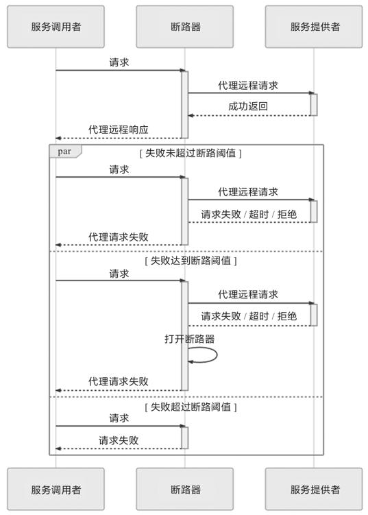
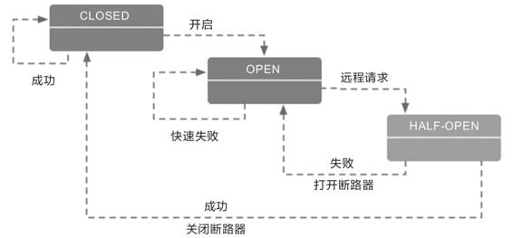
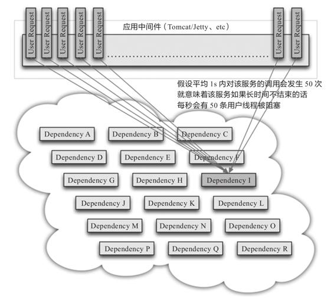
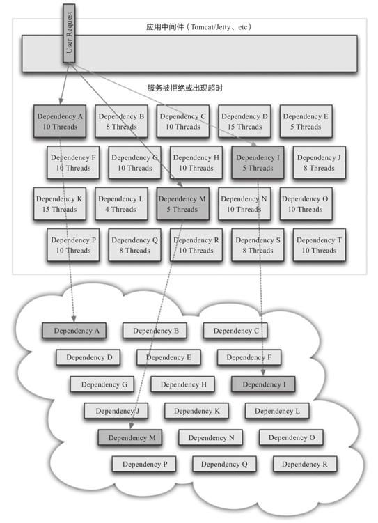
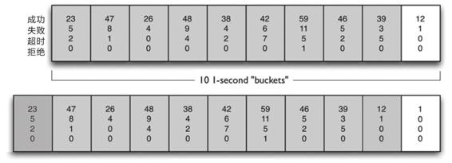

## 第8章 流量治理

容错性设计（Design for Failure）是微服务的另一个核心原则，也是笔者书中反复强调的开发观念转变。不过，即使已经有一定的心理准备，大多数首次将微服务架构引入实际生产系统的开发者，在服务发现、网关路由等支持下，踏出了服务化的第一步以后，很可能仍会经历一段阵痛期，随着拆分出的服务越来越多，随之而来会面临以下两个问题的困扰。

·由于某一个服务的崩溃，导致所有用到这个服务的其他服务都无法正常工作，一个点的错误经过层层传递，最终波及调用链上与此有关的所有服务，这便是雪崩效应。如何防止雪崩效应便是微服务架构容错性设计原则的具体实践，否则服务化程度越高，整个系统反而越不稳定。

·服务虽然没有崩溃，但由于处理能力有限，面临超过预期的突发请求时，大部分请求直至超时都无法完成处理。这种现象产生的后果与交通堵塞类似，如果一开始没有得到及时的治理，后面就需要很长时间才能使全部服务都恢复正常。

本章我们将围绕以上两个问题，提出服务容错、流量控制等一系列解决方案。这些措施并不是孤立的，它们相互之间存在很多联系，其中许多功能必须与此前介绍过的服务注册中心、服务网关、负载均衡器配合才能实现。理清楚这些技术措施背后的逻辑链条，是了解它们工作原理的捷径。

### 8.1 服务容错

Martin Fowler与James Lewis提出的“微服务的九个核心特征”是构建微服务系统的指导性原则，但不是技术规范，没有严格的约束力。在实际构建系统时，其中多数特征可能会有或多或少的妥协，譬如分散治理、数据去中心化、轻量级通信机制、演进式设计，等等。但也有一些特征是不能妥协的，其中的典型就是今天我们讨论的主题：容错性设计。

容错性设计不能妥协的原因是分布式系统的不可靠性。一个大的服务集群中，程序可能崩溃、节点可能宕机、网络可能中断，这些“意外情况”其实全部都在“意料之中”。原本信息系统设计成分布式架构的主要动力之一就是为了提升系统的可用性，最低限度也必须保证将原有系统重构为分布式架构之后，可用性不下降才行。如果服务集群中出现任何一点差错都能让系统面临“千里之堤溃于蚁穴”的风险，那分布式恐怕就没有机会成为一种可用的系统架构形式了。

#### 8.1.1 容错策略

要落实容错性设计这条原则，除了要从思想观念上转变过来，正视程序必然是会出错的，并对它进行有计划的防御之外，还必须了解一些常用的容错策略和容错设计模式，作为具体设计与编码实践的指导。这里的容错策略指的是“面对故障，我们该做些什么”，稍后将讲解的容错设计模式指的是“要实现某种容错策略，我们该如何去做”。常见的容错策略有以下几种。

·故障转移（Failover）：高可用的服务集群中，多数的服务——尤其是那些经常被其他服务所依赖的关键路径上的服务，均会部署多个副本。这些副本可能部署在不同的节点（避免节点宕机）、网络交换机（避免网络分区）甚至可用区（避免整个地区发生灾害或电力、骨干网故障）中。故障转移是指如果调用的服务器出现故障，系统不会立即向调用者返回失败结果，而是自动切换到其他服务副本，尝试通过其他副本返回成功调用的结果，从而保证整体的高可用性。

故障转移的容错策略应该有一定的调用次数限制，譬如允许最多重试三个服务，如果三个服务都发生报错，那还是会返回调用失败。原因不仅是因为重试是有执行成本的，更是因为过度的重试反而可能让系统处于更加不利的状况。譬如有以下调用链：

```
Service A → Service B → Service C
```

假设A的超时阈值为100ms，而B调用C花费60ms，如果不幸失败了，此时做故障转移其实已经没有太大意义了，因为即使下一次调用能够返回正确结果，也很可能同样需要耗费60ms时间，时间总和已经触及A服务的超时阈值，所以在这种情况下故障转移反而对系统是不利的。

·快速失败（Failfast）：还有另外一些业务场景是不允许做故障转移的，因为故障转移策略能够实施的前提是服务具备幂等性。对于非幂等的服务，重复调用就可能产生脏数据，而脏数据带来的麻烦远大于单纯的某次服务调用失败，此时就应该以快速失败作为首选的容错策略。譬如，在支付场景中，需要调用银行的扣款接口，如果该接口返回的结果是网络异常，程序很难判断到底是扣款指令发送给银行时出现的网络异常，还是银行扣款后返回结果给服务时出现的网络异常。为了避免重复扣款，此时最恰当可行的方案就是尽快让服务报错，坚决避免重试，尽快抛出异常，由调用者自行处理。

·安全失败（Failsafe）：在一个调用链路中的服务通常也有主路和旁路之分，换句话说，并不是每个服务都是不可或缺的，有部分服务失败了也不影响核心业务的正确性。譬如开发基于Spring管理的应用程序时，通过扩展点、事件或者AOP注入的逻辑往往就属于旁路逻辑，典型的有审计、日志、调试信息，等等。属于旁路逻辑的另一个显著特征是后续处理不会依赖其返回值，或者它的返回值是什么都不会影响后续处理的结果，譬如只是将返回值记录到数据库，而不使用它参与最终结果的运算。对这类逻辑，一种理想的容错策略是即使旁路逻辑实际调用失败了，也当作正确的来返回，如果需要返回值的话，系统就自动返回一个符合要求的数据类型的对应零值，然后自动记录一条服务调用出错的日志备查即可，这种策略被称为安全失败策略。

·沉默失败（Failsilent）：如果大量的请求需要等到超时或者长时间处理后才宣告失败，很容易由于某个远程服务的请求堆积而消耗大量的线程、内存、网络等资源，进而影响到整个系统的稳定。面对这种情况，一种合理的失败策略是当请求失败后，就默认服务提供者一定时间内无法再对外提供服务，不再向它分配请求流量，将错误隔离开来，避免对系统其他部分产生影响，此即为沉默失败策略。

·故障恢复（Failback）：故障恢复一般不单独存在，而是作为其他容错策略的补充措施。一般在微服务管理框架中，如果设置容错策略为故障恢复的话，通常默认会采用快速失败加上故障恢复的策略组合。故障恢复是指当服务调用出错之后，将该次调用失败的信息存入一个消息队列中，然后由系统自动开始异步重试调用。

故障恢复策略一方面可以尽力促使失败的调用最终能够被正常执行，另一方面也可以为服务注册中心和负载均衡器及时提供服务恢复的通知信息。故障恢复显然也是要求服务必须具备幂等性的，由于它的重试是在后台异步进行，即使最后调用成功了，原来的请求也早已响应完毕，所以故障恢复策略一般用于对实时性要求不高的主路逻辑，同时也适合处理那些不需要返回值的旁路逻辑。为了避免内存中异步调用任务堆积，故障恢复与故障转移一样，应该有最大重试次数的限制。

上面五种以“Fail”开头的策略是针对调用失败时如何进行弥补的，以下两种策略则是在调用之前就开始考虑如何获得最大的成功概率。

·并行调用（Forking）：并行调用策略很符合人们日常对一些重要环节进行的“双重保险”或者“多重保险”的处理思路，它是指一开始就同时向多个服务副本发起调用，只要有其中任何一个返回成功，那调用便宣告成功，这是一种在关键场景中使用更高的执行成本换取执行时间和成功概率的策略。

·广播调用（Broadcast）：广播调用与并行调用是相对应的，都是同时发起多个调用，但并行调用是任何一个调用结果返回成功便宣告成功，广播调用则要求所有的请求全部成功，这次调用才算成功，任何一个服务提供者出现异常都算调用失败。广播调用通常用于实现“刷新分布式缓存”这类的操作。

容错策略并非计算机科学独有的，在交通、能源、航天等很多领域都有容错性设计，也会使用到上面这些策略，并在自己的行业领域中进行解读与延伸。这里介绍的容错策略并非全部，只是最常见的几种，笔者将它们各自的优缺点、应用场景总结为表8-1，供大家使用时参考。

表8-1　常见容错策略优缺点及应用场景对比



#### 8.1.2 容错设计模式

为了实现各式各样的容错策略，开发人员总结出了一些被实践证明是有效的服务容错设计模式，譬如微服务中常见的断路器模式、舱壁隔离模式，重试模式，等等，以及将在下一节介绍的流量控制模式，如滑动时间窗模式、漏桶模式、令牌桶模式，等等。

1.断路器模式

断路器模式是微服务架构中最基础的容错设计模式，以Hystrix这种服务治理工具为例，人们往往忽略了它的服务隔离、请求合并、请求缓存等其他服务治理职能，直接将它称为微服务断路器或者熔断器。这个设计模式最早由技术作家Michael Nygard在Release It!一书中提出，后又因Martin Fowler的“Circuit Breaker”[1]一文而广为人知。

断路器的基本思路很简单，就是通过代理（断路器对象）来一对一（一个远程服务对应一个断路器对象）地接管服务调用者的远程请求。断路器会持续监控并统计服务返回的成功、失败、超时、拒绝等各种结果，当出现故障（失败、超时、拒绝）的次数达到断路器的阈值时，它的状态就自动变为“OPEN”，后续此断路器代理的远程访问都将直接返回调用失败，而不会发出真正的远程服务请求。通过断路器对远程服务的熔断，避免因持续的失败或拒绝而消耗资源，以及因持续的超时而堆积请求，最终达到避免雪崩效应的目的。由此可见，断路器本质是一种快速失败策略的实现方式，它的工作过程可以通过图8-1来表示。



图8-1　断路器工作过程时序图

从调用序列来看，断路器就是一种有限状态机。断路器模式就是根据自身状态变化自动调整代理请求策略的过程，一般要设置以下三种状态。

·CLOSED：表示断路器关闭，此时的远程请求会真正发送给服务提供者。断路器刚刚建立时默认处于这种状态，此后将持续监视远程请求的数量和执行结果，决定是否进入OPEN状态。

·OPEN：表示断路器开启，此时不会进行远程请求，直接向服务调用者返回调用失败的信息，以实现快速失败策略。

·HALF OPEN：这是一种中间状态。断路器必须带有自动的故障恢复能力，当进入OPEN状态一段时间以后，将“自动”（一般是由下一次请求而不是计时器触发的，所以这里的自动带引号）切换到HALF OPEN状态。在该状态下，断路器会放行一次远程调用，然后根据这次调用的结果，转换为CLOSED或者OPEN状态，以实现断路器的弹性恢复。

这些状态的转换逻辑与条件如图8-2所示。



图8-2　断路器的状态转换逻辑

OPEN和CLOSED状态的含义是十分清晰的，与我们日常生活中电路的断路器并没有什么差别，值得讨论的是这两者的转换条件是什么？最简单直接的方案是只要遇到一次调用失败，就默认以后所有的调用都会失败，即断路器直接进入OPEN状态，但这样做的效果很差，虽然避免了故障扩散和请求堆积，但系统稳定性很差。现实中，比较可行的办法是在同时满足以下两个条件时，将断路器状态转变为OPEN：

·一段时间（譬如10s以内）内请求数量达到一定阈值（譬如20个请求）。这个条件的意思是如果请求本身就很少，就用不着断路器介入；

·一段时间（譬如10s以内）内请求的故障率（发生失败、超时、拒绝的统计比例）到达一定阈值（譬如50%）。这个条件的意思是如果请求本身都能正确返回，也用不着断路器介入。

当同时满足以上两个条件时，断路器就会转变为OPEN状态。括号中举例的数值是Netflix Hystrix的默认值，其他服务治理的工具，譬如Resilience4j、Envoy等也同样会包含类似的设置。

借着断路器的上下文，笔者顺带讲一下服务治理中两个常见的易混淆概念：服务熔断和服务降级之间的联系与差别。断路器的作用是自动进行服务熔断，这是一种快速失败的容错策略的实现方法。在快速失败策略明确反馈了故障信息给上游服务以后，上游服务必须能够主动处理调用失败的后果，而不是坐视故障扩散。这里的“处理”指的是一种典型的服务降级逻辑，降级逻辑可以包括，但不应该仅限于把异常信息抛到用户界面，而应该尽力通过其他路径解决问题，譬如把原本要处理的业务记录下来，留待以后重新处理是最低限度的通用降级逻辑。举个例子：你女朋友有事想召唤你，打你手机没人接，响了几声气冲冲地挂断后（快速失败），又打了你另外三个不同朋友的手机号（故障转移），都还是没能找到你（重试超过阈值）。这时候她生气地在微信上给你留言“三分钟不回电话就分手”，以此来与你取得联系。在这个不太“吉利”的故事里，女朋友给你留言这个行为便是服务降级逻辑。

服务降级不一定是在出现错误后才被动执行的，在许多场景中，人们所谈论的降级更可能是指需要主动迫使服务进入降级逻辑的情况。譬如，出于应对可预见的峰值流量，或者系统检修等原因，要关闭系统部分功能或部分旁路服务，这时候就有可能主动迫使这些服务降级。当然，此时服务降级就不一定是出于服务容错的目的了，更可能属于下一节要讲的流量控制的范畴。

2.舱壁隔离模式

介绍了服务熔断和服务降级，我们再来看看另一个微服务治理中常见的概念：服务隔离。舱壁隔离模式是常用的实现服务隔离的设计模式。“舱壁”这个词来自造船业的舶来品，它原本的意思是设计舰船时，要在每个区域设计独立的水密舱室，一旦某个舱室进水，也只是影响这个舱室中的货物，而不至于让整艘舰船沉没。这种思想很符合容错策略中的失败静默策略。

前面在介绍断路器时已经多次提到，调用外部服务的故障大致可以分为“失败”（如400 Bad Request、500 Internal Server Error等错误）、“拒绝”（如401 Unauthorized、403 Forbidden等错误）以及“超时”（如408 Request Timeout、504 Gateway Timeout等错误）三大类，其中“超时”引起的故障更容易给调用者带来全局性的风险。这是由于目前主流的网络访问大多是基于TPR并发模型（Thread per Request）来实现的，只要请求一直不结束（无论是以成功结束还是以失败结束），就要一直占用着某个线程不能释放。而线程是典型的整个系统的全局性资源，尤其是在Java这类将线程映射为操作系统内核线程来实现的语言环境中，为了不让某一个远程服务的局部失败演变成全局失败，就必须设置某种止损方案，这便是服务隔离的意义。

我们来看一个更具体的场景，当分布式系统所依赖的某个服务，譬如图8-3中的“服务I”发生了超时，那在高流量的访问下——或者更具体点，假设平均1s内对该服务的调用会发生50次，这就意味着该服务如果长时间不结束的话，每秒会有50条用户线程被阻塞。如果这样的访问量一直持续，我们按Tomcat默认的HTTP超时时间（20s）来计算，20s内将会阻塞1000条用户线程，此后才陆续会有用户线程因超时被释放出来，回到Tomcat的全局线程池中。一般Java应用的线程池最大线程连接数会设置到200～400，这意味着此时系统在外部将表现为所有服务的全面瘫痪，而不是只有涉及“服务I”的功能不可用，因为Tomcat已经没有任何空余的线程来为其他请求提供服务了。



图8-3　由于某个外部服务导致的阻塞[2]

对于这类情况，一种可行的解决办法是为每个服务单独设立线程池，这些线程池默认不预置活动线程，只用来控制单个服务的最大连接数。譬如，对出问题的“服务I”设置了一个最大线程数为5的线程池，这时候它的超时故障最多只会阻塞5条用户线程，而不至于影响全局。此时，其他不依赖“服务I”的用户线程依然能够正常对外提供服务，如图8-4所示。



图8-4　通过线程池将阻塞限制在一定范围内

使用局部的线程池来控制服务的最大连接数有许多好处，当服务出问题时可以隔离影响，当服务恢复后可以通过清理局部线程池，瞬间恢复该服务的调用，而如果是Tomcat的全局线程池被占满，再恢复就会十分麻烦。但是，局部线程池有一个显著的弱点，它额外增加了CPU的开销，因为每个独立的线程池都要进行排队、调度和下文切换工作。根据Netflix官方给出的数据，一旦启用Hystrix线程池来进行服务隔离，大概会为每次服务调用增加约3～10ms的延时，如果调用链中有20次远程服务调用，那每次请求就要多付出60～200ms的代价来换取服务隔离的安全保障。

为应对这种情况，还有一种更轻量的控制服务最大连接数的办法：信号量机制（Semaphore）。如果不考虑清理线程池、客户端主动中断线程这些额外的功能，仅仅是为了控制一个服务并发调用的最大次数，可以只为每个远程服务维护一个线程安全的计数器，并不需要建立局部线程池。具体做法是当服务开始调用时计数器加1，服务返回结果后计数器减1，一旦计数器超过设置的阈值就立即开始限流，在回落到阈值范围之前都不再允许请求。由于不需要承担线程的排队、调度、切换工作，所以单纯维护一个作为计数器的信号量的性能损耗，相对于局部线程池来说几乎可以忽略不计。

以上介绍的是从微观、服务调用的角度应用舱壁隔离设计模式，舱壁隔离模式还可以在更高层、更宏观的场景中使用，不是按调用线程，而是按功能、按子系统、按用户类型等条件来隔离资源。譬如，根据用户等级、用户是否为VIP、用户来访的地域等各种因素，将请求分流到独立的服务实例去，这样即使某一个实例完全崩溃了，也只是影响到其中某一部分的用户，以尽可能控制波及范围。一般来说，我们会选择在服务调用端或者边车代理上实现服务层面的隔离，在DNS或者网关处实现系统层面的隔离。

3.重试模式

行文至此，笔者讲解了如何使用断路器模式实现快速失败策略，使用舱壁隔离模式实现沉默失败策略，在断路器中举例的主动对非关键的旁路服务进行降级，亦可算作是对安全失败策略的一种体现。接下来，笔者以重试模式来介绍故障转移和故障恢复这两种容错策略的主流实现方案。

故障转移和故障恢复策略都需要对服务进行重复调用，差别是这些重复调用可能是同步的，也可能是后台异步进行；可能会重复调用同一个服务，也可能会调用到服务的其他副本。无论具体是通过怎样的方式调用、调用的服务实例是否相同，都可以归结为重试设计模式的应用范畴。重试模式适合解决系统中的瞬时故障，简单地说就是有可能自己恢复（Resilient，称为自愈，也叫作回弹性）的临时性失灵，如网络抖动、服务的临时过载（典型的如返回了503 Bad Gateway错误）这些都属于瞬时故障。重试模式实现并不困难，即使完全不考虑框架的支持，靠程序员自己编写十几行代码也能够完成。在实践中，重试模式面临的风险反而大多来源于太过简单而导致的滥用。我们判断是否应该且是否能够对一个服务进行重试时，应同时满足以下几个前提条件。

·仅在主路逻辑的关键服务上进行同步的重试，而非关键的服务，一般不把重试作为首选容错方案，尤其不该进行同步的重试。

·仅对由瞬时故障导致的失败进行重试。尽管很难精确判定一个故障是否属于可自愈的瞬时故障，但从HTTP的状态码上至少可以获得一些初步的结论。譬如，当发出的请求收到了401 Unauthorized响应，说明服务本身是可用的，只是你没有权限调用，这时候再去重试就没有任何意义。功能完善的服务治理工具会提供具体的重试策略配置（如Envoy的Retry Policy），可以根据包括HTTP响应码在内的各种具体条件来设置不同的重试参数。

·仅对具备幂等性的服务进行重试。如果服务调用者和提供者不属于同一个团队，那服务是否幂等其实也是一个难以精确判断的问题，但仍可以找到一些总体上通用的原则。譬如，RESTful服务中的POST请求是非幂等的，而GET、HEAD、OPTIONS、TRACE由于不会改变资源状态，所以应该被设计成幂等的；PUT请求一般也是幂等的，因为n个PUT请求会覆盖相同的资源n–1次；DELETE也可看作是幂等的，同一个资源首次删除会得到200 OK响应，此后应该得到204 No Content响应。这些都是HTTP协议中定义的通用的指导原则，虽然对于具体服务如何实现并无强制约束力，但我们自己在建设系统时，遵循业界惯例本身就是一种良好的习惯。

·重试必须有明确的终止条件，常用的终止条件有两种。

·超时终止：并不限于重试，所有调用远程服务都应该有超时机制以避免无限期的等待。这里只是强调重试模式更加应该配合超时机制来使用，否则重试对系统很可能是有害的，笔者已经在前面介绍故障转移策略时举过具体的例子，这里就不重复了。

·次数终止：重试必须要有一定限度，不能无限制地做下去，通常最多只重试2～5次。重试不仅会给调用者带来负担，对于服务提供者也同样是负担，所以应避免将重试次数设得太大。此外，如果服务提供者返回的响应头中带有Retry-After，即使它没有强制约束力，我们也应该充分尊重服务端的要求，做个“有礼貌”的调用者。

由于重试模式可以在网络链路的多个环节中去实现，譬如客户端发起调用时自动重试、网关中自动重试、负载均衡器中自动重试，等等，而且现在的微服务框架都足够便捷，只许设置一两个开关参数就可以开启对某个服务甚至全部服务的重试机制。所以，对于没有太多经验的程序员，有可能根本意识不到其中会带来多大的负担。这里举个具体例子：一套基于Netflix OSS建设的微服务系统，如果同时在Zuul、Feign和Ribbon上都打开了重试功能，且不考虑重试被超时终止的话，那总重试次数就相当于它们的重试次数的乘积。假设它们都重试4次，且Ribbon可以转移4个服务副本来计算，理论上最多会产生高达4×4×4×4=256次调用请求。

熔断、隔离、重试、降级、超时等概念都是建立具有韧性的微服务系统所必需的保障措施。目前，这些措施的正确运作主要还是依靠开发人员对服务逻辑的了解，以及运维人员的经验去静态调整配置参数和阈值。但是面对能够自动扩缩（Auto Scale）的大型分布式系统，静态的配置越来越难以起到良好的效果，这就需要系统不仅要有能力自动根据服务负载来调整服务器的数量规模，还要有能力根据服务调用的统计结果，或者启发式搜索的结果来自动变更容错策略和参数。当然，这方面研究现在还处于各大厂商在内部分头摸索的初级阶段，是服务治理的未来重要发展方向之一。

本节介绍的容错策略和容错设计模式，最终目的均是为了避免服务集群中某个节点的故障导致整个系统发生雪崩效应，但仅仅做到容错，只让故障不扩散是远远不够的，我们还希望系统或者至少系统的核心功能能够表现出最佳的响应能力，不受或少受硬件资源、网络带宽和系统中一两个缓慢服务的拖累。下一节，我们将面向如何解决集群中的短板效应，去讨论服务质量、流量管控等话题。

[1] 文章地址：https://martinfowler.com/bliki/CircuitBreaker.html。

[2] 图片来源：https://github.com/Netflix/Hystrix/wiki。

### 8.2 流量控制

任何一个系统的运算、存储、网络资源都不是无限的，当系统资源不足以支撑外部超过预期的突发流量时，便应该有所取舍，建立面对超额流量自我保护的机制，这个机制就是微服务中常说的“限流”。在介绍限流的具体细节前，我们先一起来做一道小学三年级难度的四则运算场景应用题：

额外知识

场景应用题

已知条件：

1）系统中一个业务操作需要调用10个服务协作来完成；

2）该业务操作的总超时时间是10s；

3）每个服务的处理时间平均是0.5s；

4）集群中每个服务均部署了20个实例副本。

求解以下问题：

·单个用户访问，完成一次业务操作，需要耗费系统多少处理器时间？

答：0.5×10=5

·集群中每个服务每秒最大能处理多少个请求？

答：(1÷0.5)×20=40

·假设不考虑顺序且请求分发是均衡的，在保证不超时的前提下，整个集群能持续承受最多每秒多少笔业务操作？

答：40×10÷5=80

·如果集群在一段时间内持续收到100 TPS的业务请求，会出现什么情况？

答：这就超纲了小学水平，得看架构师的本事了。

对于最后这个问题，如果仍然按照小学生的解题思路，最大处理能力为80 TPS的系统遇到100 TPS的请求时，应该能完成其中的80 TPS，也即有20 TPS的请求失败或被拒绝才对，这是最理想的情况，也是我们追求的目标。但事实上，如果不做任何处理，更可能出现的结果是这100个请求中的每一个都开始了处理，只是大部分请求完成了其中10次服务调用中的8次或者9次，就会超时退出，导致多数服务调用被白白浪费掉，没有几个请求能够走完整个业务操作。譬如早期的12306系统就明显存在这样的问题，全国人民都上去抢票的结果是全国人民谁都买不上票。为了避免这种状况出现，一个健壮的系统需要做到恰当的流量控制，更具体地说，它需要妥善解决以下三个问题。

·依据什么限流：对于要不要控制流量，要控制哪些流量，控制力度有多大等操作，我们无法在系统设计阶段静态地给出确定的结论，必须根据系统此前一段时间的运行状况，甚至未来一段时间的预测情况来动态决定。

·具体如何限流：要解决系统具体是如何做到允许一部分请求通行，而另外一部分流量实行受控制的失败降级的问题，就必须了解并掌握常用的服务限流算法和设计模式。

·超额流量如何处理：对于超额流量可以有不同的处理策略，例如可以直接返回失败（如429 Too Many Requests），或者迫使它们进入降级逻辑，这种策略被称为否决式限流；也可以让请求排队等待，暂时阻塞一段时间后再继续处理，这种被称为阻塞式限流。

#### 8.2.1 流量统计指标

要做流量控制，首先要弄清楚到底哪些指标能反映系统的流量压力大小。相较而言，容错的统计指标是明确的，容错的触发条件基本上只取决于请求的故障率，发生失败、拒绝与超时都算作故障。但限流的统计指标就不那么明确了，那么限流中的“流”到底指什么呢？要解答这个问题，我们先来理清经常用于衡量服务流量压力，但又容易混淆的三个指标的定义。

·每秒事务数（Transaction per Second，TPS）：TPS是衡量信息系统吞吐量的最终标准。“事务”可以理解为一个逻辑上具备原子性的业务操作。譬如你在Fenix’s Bookstore买了一本书，将要进行支付，“支付”就是一笔业务操作，无论支付成功还是不成功，这个操作在逻辑上是原子的，即逻辑上不可能让你买本书时成功支付了前面200页，又失败了后面300页。

·每秒请求数（Hit per Second，HPS）：HPS是指每秒从客户端发向服务端的请求数（请将Hit理解为Request而不是Click，国内某些翻译把它理解为“每秒点击数”，多少有点望文生义的嫌疑）。如果只要一个请求就能完成一笔业务，那HPS与TPS是等价的，但在一些场景（尤其常见于网页中）里，一笔业务可能需要多次请求才能完成。譬如你在Fenix’s Bookstore买了一本书要进行支付，尽管逻辑上它是原子操作，但在技术实现上，除非你能在银行开的商城中购物并直接扣款，否则这个操作就很难在一次请求里完成，总要经过显示支付二维码、扫码付款、校验支付是否成功等过程，中间不可避免地会发生多次请求。

·每秒查询数（Query per Second，QPS）：QPS是指一台服务器能够响应的查询次数。如果只有一台服务器来应答请求，那QPS和HPS是等价的，但在分布式系统中，一个请求的响应往往要由后台多个服务节点共同协作来完成。譬如你在Fenix’s Bookstore买了一本书要进行支付，尽管扫描支付二维码时客户端只发送了一个请求，但这背后的服务端很可能需要向仓储服务发送请求以确认库存信息避免超卖、向支付服务发送指令划转货款请求、向用户服务发送修改用户的购物积分请求等，这里面每次内部访问都要消耗掉一次或多次查询数。

以上这三个指标都是基于调用计数的指标，在整体目标上我们当然最希望能够基于TPS来限流，因为信息系统最终是为人类用户来提供服务的，用户不关心业务到底是由多少个请求、多少个后台查询共同协作来实现。但是，系统的业务五花八门，不同的业务操作给系统带来的压力往往差异巨大，不具备可比性。更关键的是，流量控制是针对用户实际操作场景来限流的，这不同于压力测试场景中无间隙（最多有些集合点）的全自动化操作，真实业务操作的耗时无可避免地受限于用户交互带来的不确定性，譬如前面例子中“扫描支付二维码”这个步骤，如果用户掏出手机扫描二维码前先顺便回了两条短信息，那整个付款操作就要持续更长时间。此时，如果按照业务开始时计数器加1，业务结束时计数器减1，通过限制最大TPS来限流的话，就不能准确地反映出系统所承受的压力，所以直接针对TPS来限流实际上是很难操作的。

目前，主流系统大多倾向使用HPS作为首选的限流指标，它是相对容易观察统计的，而且能够在一定程度上反应系统当前以及接下来一段时间的压力。但限流指标并不存在任何必须遵循的权威法则，根据系统的实际需要，哪怕完全不选择基于调用计数的指标都是有可能的。譬如下载、视频、直播等I/O密集型系统，往往会把每次请求和响应报文的大小，而不是调用次数作为限流指标，譬如只允许单位时间通过100MB的流量。又譬如网络游戏等基于长连接的应用，可能会把登录用户数作为限流指标，当连接用户数超过一定阈值时就会让你在登录前排队等候。

#### 8.2.2 限流设计模式

与容错模式类似，对于具体如何限流，也有一些常用的设计模式可以参考使用，本节将介绍流量计数器、滑动时间窗、漏桶和令牌桶四种限流设计模式。

1.流量计数器模式

做限流最容易想到的一种方法就是设置一个计算器，根据当前时刻的流量计数结果是否超过阈值来决定是否限流。譬如在前面的场景应用题中，我们计算得出该系统能承受的最大持续流量是80 TPS，那就可以通过控制任何一秒内的业务请求次数来限流，超过80次就直接拒绝掉超额部分。这种做法很直观，也确实有些简单的限流是这样实现的，但它并不严谨，以下两个结论就可以证明这个观点。

1）即使每一秒的统计流量都没有超过80 TPS，也不能说明系统没有遇到过大于80 TPS的流量压力。

可以想象如下场景，如果系统连续两秒都收到60 TPS的访问请求，但这两个60 TPS请求分别是在前1秒里面的后0.5s，以及后1s中的前面0.5s所发生的。这样虽然每个周期的流量都不超过80 TPS请求的阈值，但是系统确实曾经在1s内发生了超过阈值的120 TPS请求。

2）即使连续若干秒的统计流量都超过了80 TPS，也不能说明流量压力就一定超过了系统的承受能力。

可以想象如下场景，如果在10s的时间片段中，前3s TPS平均值到了100，而后7s的平均值是30左右，此时系统是否能够处理完这些请求而不产生超时失败呢？答案是可以的，因为条件中给出的超时时间是10s，而最慢的请求也能在8s左右处理完毕。如果只基于固定时间周期来控制请求阈值为80 TPS，反而会误杀一部分请求，导致部分请求出现原本不必要的失败。

流量计数器的缺陷根源在于它只是针对时间点进行离散的统计，为了弥补该缺陷，一种名为“滑动时间窗”的限流模式被设计出来，它可以实现平滑的基于时间片段统计。

2.滑动时间窗模式

滑动窗口算法（Sliding Window Algorithm）在计算机科学的很多领域中都有成功的应用，譬如编译原理中的窥孔优化（Peephole Optimization）、TCP协议的阻塞控制（Congestion Control）等都使用到滑动窗口算法。对分布式系统来说，无论是服务容错中对服务响应结果的统计，还是流量控制中对服务请求数量的统计，都经常要用到滑动窗口算法。关于这个算法的运作过程，建议你发挥想象力，在脑海中构造如下场景：在不断向前流淌的时间轴上，漂浮着一个固定大小的窗口，窗口与时间一起平滑地向前滚动。任何时刻静态地通过窗口内观察到的信息，都等价于一段长度与窗口大小相等、动态流动中时间片段的信息。由于窗口观察的目标都是时间轴，所以它被形象地称为“滑动时间窗模式”。

举个更具体的例子，假如我们准备观察的时间片段为10s，并以1s为统计精度的话，那可以设定一个长度为10的数组（设计通常是以双头队列去实现，这里简化一下）和一个每秒触发1次的定时器。假如我们准备通过统计结果进行限流和容错，并定下限流阈值是最近10s内收到的外部请求不超过500个，服务熔断的阈值是最近10s内故障率不超过50%，那每个数组元素（图8-5中称为Buckets）中就应该存储请求的总数（实际是通过明细相加得到）及其中成功、失败、超时、拒绝的明细数，具体如图8-5所示。



图8-5　滑动窗口模式示意[1]

当频率固定每秒一次的定时器被唤醒时，它应该完成以下几项工作，这也是滑动时间窗的工作过程。

1）将数组最后一位的元素丢弃，并把所有元素都后移一位，然后在数组第一位插入一个新的空元素。这个步骤即为“滑动窗口”。

2）将计数器中所有统计信息写入第一位的空元素中。

3）对数组中所有元素进行统计，并复位清空计数器的数据以供下一个统计周期使用。

滑动时间窗口模式的限流完全弥补了流量计数器的缺陷，可以保证在任意时间片段内，只需经过简单的调用计数比较，就能控制请求次数一定不会超过限流的阈值，这在单机限流或者分布式服务单点网关中的限流中很常用。不过，这种限流模式也有缺点，它通常只适用于否决式限流，超过阈值的流量就必须强制失败或降级，很难进行阻塞等待处理，也就很难在细粒度上对流量曲线进行整形，起不到削峰填谷的作用。下面笔者继续介绍两种适用于阻塞式限流的限流模式。

3.漏桶模式

在计算机网络中，专门有一个术语——流量整形（Traffic Shaping）来描述如何限制网络设备的流量突变，使得网络报文以比较均匀的速度向外发送。流量整形通常都需要用到缓冲区来实现，当报文的发送速度过快时，首先在缓冲区中暂存，然后在控制算法的调节下均匀地发送这些被缓冲的报文。常用的控制算法有漏桶算法（Leaky Bucket Algorithm）和令牌桶算法（Token Bucket Algorithm）两种，这两种算法的思路截然相反，但达到的效果又是相似的。

所谓漏桶，就是大家小学做应用题时一定遇到的“一个水池，每秒以X升的速度注水，同时又以Y升的速度出水，问水池什么时候装满”问题中的奇怪水池。你把请求当作水，“水”来了都先放进池子里，水池同时又以额定的速度出“水”，让请求进入系统中。这样，如果一段时间内注水速度过快的话，水池还能充当缓冲区，让出水口的速度不至于过快。不过，由于请求总是有超时时间的，所以缓冲区大小也必须是有限度的，当注水速度持续超过出水速度一段时间以后，水池终究会被灌满，此时，从网络的流量整形的角度看体现为部分数据包被丢弃，而从信息系统的角度看则体现为有部分请求会遭遇失败和降级。

漏桶在代码实现上非常简单，它其实就是一个以请求对象作为元素的先入先出队列（FIFO Queue），队列长度就相当于漏桶的大小，当队列已满时便拒绝新的请求进入。漏桶实现起来很容易，难点在于如何确定漏桶的两个参数：桶的大小和水的流出速率。如果桶设置得太大，那服务依然可能遭遇流量过大的冲击，不能完全发挥限流的作用；如果设置得太小，那很可能误杀掉一部分正常的请求，这种情况与流量计数器模式中举过的例子是一样的。流出速率在漏桶算法中一般是个固定值，对类似本节开头场景应用题中那样固定拓扑结构的服务是很合适的，但同时你也应该明白那是经过最大限度简化的场景，现实中系统的处理速度往往受到其内部拓扑结构变化和动态伸缩的影响，所以能够支持变动请求处理速率的令牌桶算法可能会更受程序员的青睐。

4.令牌桶模式

如果说漏桶是小学应用题中的奇怪水池，那令牌桶就是你去银行办事时摆在门口的那台排队机。它与漏桶一样都是基于缓冲区的限流算法，只是方向刚好相反，漏桶是从水池里向系统发送请求，令牌桶则是系统往排队机中放入令牌。

假设我们要限制系统在X秒内最大请求次数不超过Y，那就每间隔X/Y时间往桶中放一个令牌，当有请求进来时，首先要从桶中取得一个准入的令牌，然后才能进入系统进行处理。任何时候，一旦请求进入桶中却发现没有令牌可取了，就应该马上宣告失败或进入服务降级逻辑。与漏桶类似，令牌桶同样有最大容量，这意味着当系统比较空闲时，桶中令牌累积到一定程度就不再无限增加，此时预存在桶中的令牌便是请求最大缓冲的余量。上面这段话，可以转化为以下步骤来指导程序编码。

1）让系统以一个由限流目标决定的速率向桶中注入令牌，譬如要控制系统的访问不超过100次，速率即设定为1/100=10(ms)。

2）桶中最多可以存放N个令牌，N的具体数量由超时时间和服务处理能力共同决定。如果桶已满，第N+1个进入的令牌会被丢弃掉。

3）请求到时先从桶中取走1个令牌，如果桶已空就进入降级逻辑。

令牌桶模式的实现看似比较复杂，每间隔固定时间就要放新的令牌到桶中，但其实并不需要真的用一个专用线程或者定时器来做这件事情，只要在令牌中增加一个时间戳记录，每次获取令牌前，比较一下时间戳与当前时间，就可以轻易计算出这段时间需要放多少令牌进去，然后一次放完全部令牌即可，所以真正编码并不会显得复杂。

[1] 图片来源为https://github.com/Netflix/Hystrix/wiki，虽然文中引用了Hystrix文档的图片，但Hystrix实际上是基于RxJava实现的，RxJava的响应式编程思路与下面描述差异颇大。笔者的本意并不是去讨论某一款流量治理工具的具体实现细节，以下描述的步骤作为原理来理解是合适的。

#### 8.2.3 分布式限流

这节我们再向实际的信息系统前进一步，讨论分布式系统中的限流问题。此前，我们讨论的限流算法和模式全部是针对整个系统的限流，总是有意无意地假设或默认系统只提供一种业务操作，或者所有业务操作的消耗都是等价的，并不涉及不同业务请求进入系统的服务集群后，分别会调用哪些服务、每个服务节点处理能力有何差别等问题。那些限流算法，直接使用在单体架构的集群上是完全可行的，但到了微服务架构下，它们就最多只能应用于集群最入口处的网关上，对整个服务集群进行流量控制，而无法细粒度地管理流量在内部微服务节点中的流转情况。所以，我们把前面介绍的限流模式都统称为单机限流，把能够精细控制分布式集群中每个服务消耗量的限流算法称为分布式限流。

这两种限流算法实现上的核心差别在于如何管理限流的统计指标，单机限流很好办，因为指标都存储在服务的内存中，而分布式限流的目的就是要让各个服务节点协同限流，无论是将限流功能封装为专门的远程服务，抑或是在系统采用的分布式框架中提供专门的限流支持，都需要将原本在每个服务节点自己内存中的统计数据开放出来，让全局的限流服务可以访问到才行。

一种常见的简单分布式限流方法是将所有服务的统计结果都存入集中式缓存（如Redis）中，以实现在集群内的共享，并通过分布式锁、信号量等机制，解决这些数据读写访问时并发控制的问题。在可以共享统计数据的前提下，原本用于单机的限流模式理论上也是可以应用于分布式环境中的，可是其代价也显而易见：每次服务调用都必须额外增加一次网络开销，所以这种方法的效率肯定是不高的，流量压力大时，限流本身还会显著降低系统的处理能力。

只要集中存储统计信息，就不可避免地会产生网络开销，所以，为了缓解这里产生的性能损耗，一种可以考虑的办法是在令牌桶限流模式基础上进行“货币化改造”，即不把令牌看作只有准入和不准入的“通行证”，而看作数值形式的“货币额度”。当请求进入集群时，首先在API网关处领取一定数额的“货币”，为了体现不同等级用户重要性的差别，他们的额度可以有所差异，譬如让VIP用户的额度更高甚至是无限的。我们将用户A的额度表示为QuanityA。由于任何一个服务在响应请求时都需要消耗集群一定量的处理资源，所以访问每个服务时都要求消耗一定量的“货币”，假设服务X要消耗的额度表示为CostX，那当用户A访问了N个服务以后，他剩余的额度LimitN表示为：


此时，我们可以把剩余额度LimitN作为内部限流的指标，规定在任何时候，一旦剩余额度LimitN小于或等于0，就不再允许访问其他服务了。此时必须先发生一次网络请求，重新向令牌桶申请一次额度，成功后才能继续访问，不成功则进入降级逻辑。除此之外的任何时刻，即LimitN不为零时，都无须额外的网络访问，因为计算LimitN是完全可以在本地完成的。

基于额度的限流方案对限流的精确度有一定的影响，可能存在业务操作已经进行了一部分服务调用，却无法从令牌桶中再获取到新额度，最终因“资金链断裂”而导致业务操作失败。这种失败的代价是比较高昂的，它白白浪费了部分已经完成了的服务资源，但总体来说，它仍是一种并发性能和限流效果上都相对折衷可行的分布式限流方案。上一节提到过，对于分布式系统来说，容错是必须要有、无法妥协的措施。但限流与容错不一样，做分布式限流从不追求“越彻底越好”，往往需要权衡方案付出的代价与得到的收益。
