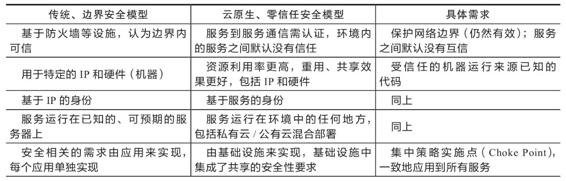
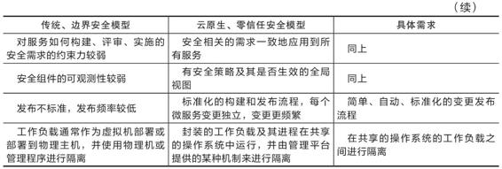

## 第9章 可靠通信

微服务提倡分散治理（Decentralized Governance），不追求统一的技术平台，提倡让团队有自由选择的权利，不受制于语言和技术框架。在开发阶段构建服务时，分散治理打破了由技术栈带来的约束，好处是不言自明的。但在运维阶段部署服务时，尤其是在考量安全问题时，由Java、Go、Python、Node.js等多种语言和框架共同组成的微服务系统，出现安全漏洞的概率肯定要比只采用其中某种语言、某种框架所构建的单体系统更高。为了避免由于单个服务节点出现漏洞被攻击者突破，进而导致整个系统和内网都遭到入侵，我们就必须打破一些传统的安全观念，以构筑更加可靠的服务间通信机制。

### 9.1 零信任网络

长期以来，主流的网络安全观念提倡根据某类与宿主机相关的特征，譬如机器所处的位置，机器的IP地址、子网等，把网络划分为不同的区域，不同的区域对应不同的风险级别和允许访问的网络资源权限，将安全防护措施集中部署在各个区域的边界之上，重点关注跨区域的网络流量。我们熟知的VPN、DMZ、防火墙、内网、外网等概念，都可以说是因此而生，这种安全模型今天被称为基于边界的安全模型（Perimeter-Based Security Model，后文简称“边界安全”）。

边界安全是完全合情合理的做法，在第5章笔者就强调过安全不可能是绝对的，我们必须在可用性和安全性之间权衡取舍，否则，一台关掉电源拔掉网线，完全不能对外提供服务的“服务器”无疑就是最为安全的。边界安全着重对经过网络区域边界的流量进行检查，对可信任区域（内网）内部机器之间的流量则给予直接信任或者较为宽松的处理策略，减小了安全设施对整个应用系统复杂度的影响以及网络传输性能的额外损耗，这当然是很合理的。不过，今天单纯的边界安全已不足以满足大规模微服务系统技术异构和节点膨胀的发展需要。边界安全的核心问题在于边界上的防御措施即使自身能做到永远滴水不漏、牢不可破，也很难保证内网中它所尽力保护的某一台服务器不会成为“猪队友”，一旦“可信的”网络区域中的某台服务器被攻陷，那边界安全措施就成了马其诺防线，攻击者很快就能以一台机器为跳板，侵入整个内网，这是边界安全基因决定的固有缺陷，从边界安全被提出的第一天起，这就是已经预料到的问题。微服务时代，我们已经转变了开发观念，承认服务总是会出错的，现在我们也必须转变安全观念，承认一定会有被攻陷的服务，为此，我们需要寻找到与之匹配的新的网络安全模型。

2010年，Forrester Research的首席分析师John Kindervag提出了零信任安全模型（Zero-Trust Security Model，后文简称“零信任安全”）的概念，最初提出时叫作“零信任架构”（Zero-Trust Architecture），这个概念当时并没有引发太大的关注，但随着微服务架构的日渐兴盛，越来越多的开发和运维人员注意到零信任安全模型与微服务所追求的安全目标是高度吻合的。

#### 9.1.1 零信任安全模型的特征

零信任安全的中心思想是不应当以某种固有特征来自动信任任何流量，除非明确得到了能代表请求来源（不一定是人，更可能是另一台服务器）的身份凭证，否则一律不会有默认的信任关系。在2019年，Google发表了一篇在安全与研发领域里都备受关注的论文“BeyondProd:A New Approach to Cloud-Native Security”[1]，此文详细列举了传统的基于边界的网络安全模型与云原生时代下基于零信任网络的安全模型之间的差异，并描述了要完成边界安全模型到零信任安全模型的迁移所要实现的具体需求点，笔者将其翻译转述为如表9-1所示内容。

表9-1　传统网络安全模型与云原生时代零信任安全模型对比





表9-1系统地阐述了零信任安全在微服务、云原生环境中的具体落地过程了，整篇论文（除了介绍Google自己的实现框架外）就是以此为主线来展开论述的，但由于表格过于简单，论文原文写的较为分散晦涩，笔者按照自己的理解将其中的主要观点转述如下。

·零信任网络不等同于放弃在边界上的保护设施：虽然防火墙等位于网络边界的设施是属于边界安全而不是零信任安全的概念，但它仍然是一种提升安全性的有效且必要的做法。在微服务集群的前端部署防火墙，把内部服务节点间的流量与来自互联网的流量隔离开来，这种做法无论何时都是值得提倡的，至少能够让内部服务避开来自互联网未经授权流量的饱和攻击，如最典型的DDoS（拒绝服务攻击）。

·身份只来源于服务：传统应用一般是部署在特定的服务器上，这些机器的IP、MAC地址很少会发生变化，此时系统的拓扑状态是相对静态的。基于这个前提，安全策略才会使用IP地址、主机名等作为身份标识符（Identifier），无条件信任具有特性身份表示的服务。在如今的微服务系统，尤其是在云原生环境中的微服务系统中，虚拟化基础设施已得到大范围应用，这使得服务所部署的IP地址、服务实例的数量随时都可能发生变化，因此，身份只能来源于服务本身所能够出示的身份凭证（通常是数字证书），而不再是服务所在的IP地址、主机名或者其他特征。

·服务之间没有固有的信任关系：这点决定了只有已知的、明确授权的调用者才能访问服务，阻止攻击者通过某个服务节点中的代码漏洞来越权调用其他服务。如果某个服务节点被成功入侵，这一原则可阻止攻击者扩大其入侵范围，与微服务设计模式中使用断路器、舱壁隔离实现容错来避免雪崩效应类似，在安全方面也应当采用这种“互不信任”的模式来减小入侵危害的影响范围。

·集中、共享的安全策略实施点：这点与微服务的“分散治理”刚好相反，微服务提倡每个服务自己独立地负责自身所有的功能性与非功能性需求。而Google这个观点相当于为分散治理原则做了一个补充——分散治理，但涉及安全的非功能性需求（如身份管理、安全传输层、数据安全层）最好除外。一方面，要写出高度安全的代码极为不易，为此付出的精力甚至可能远高于业务逻辑本身，如果你有兴趣阅读基于Spring Cloud的Fenix’s Bookstore的源码，会很容易发现在Security工程中的代码量是该项目所有微服务中最多的。另一方面，也是更重要的一个方面是，让服务各自处理安全问题很容易出现实现不一致或者出现漏洞时要反复修改多处地方的情况。还有一些安全问题如果不立足于全局是很难彻底解决的，具体将在9.2节详细讲述。因此Google明确提出应该有集中式的“安全策略实施点”（原文中称之为Choke Point），安全需求应该从微服务的应用代码下沉至云原生的基础设施里，这也契合其论文的标题“Cloud-Native Security”。

·受信的机器运行来源已知的代码：这点限制了服务只能使用认证过的代码和配置，并且只能运行在认证过的环境中。分布式软件系统除了促使软件架构发生重大变化之外，也使软件的发布流程发生较大的改变，使其严重依赖持续集成与持续部署（Continuous Integration/Continuous Delivery，CI/CD）。从开发人员编写代码，到自动化测试、自动集成，再到漏洞扫描，最后发布上线，这整套CI/CD流程被称作“软件供应链”（Software Supply Chain）。安全不仅仅局限于软件运行阶段，曾经有过XCodeGhost风波[2]这种针对软件供应链的有影响力的攻击事件，即在编译阶段将恶意代码嵌入软件当中，只要安装了此软件的用户就可能触发恶意代码。为此，零信任安全针对软件供应链的每一步都加入了安全控制策略。

·自动化、标准化的变更管理：这点也是为何提倡通过基础设施而不是应用代码去实现安全功能的另一个重要理由。如果将安全放在应用上，由于应用本身的分散治理，决定了安全也必然是难以统一和标准化的。做不到标准化就意味着做不到自动化，相反，一套独立于应用的安全基础设施，可以让运维人员轻松了解基础设施变更对安全性的影响，也可以在几乎不影响生产环境的情况下发布安全补丁程序。

·强隔离性的工作负载：“工作负载”的概念贯穿了Google内部的Borg系统与后来的Kubernetes系统，它是指在虚拟化技术支持下运行的一组能够协同提供服务的镜像。在本书第四部分介绍云原生基础设施时，笔者会详细介绍容器化，它仅仅是虚拟化的一个子集。与传统虚拟机相比，容器的隔离能力是有所降低的，这种设计对性能非常有利，却对安全相对不利，因此在强调安全性的应用里，会有专门关注强隔离性的容器运行工具出现。

[1] 论文地址为https://cloud.google.com/security/beyondprod。BeyondCorp和BeyondProd是谷歌最新一代安全框架的名字，从2014年起Google已连续发表了6篇关于BeyondCorp和BeyondProd的论文。

[2] XcodeGhost风波：https://en.wikipedia.org/wiki/XcodeGhost。

#### 9.1.2 Google的实践探索

Google认为零信任安全模型的最终目标是实现整个基础设施之上的自动化安全控制，服务所需的安全能力可以与服务自身一起，以相同方式自动进行伸缩扩展。对于程序来说，做到安全是日常，风险是例外（Secure by Default and Insecure by Exception）；对于人类来说，做到袖手旁观是日常，主动干预是例外（Human Actions Should Be by Exception,Not Routine），这的确是很美好的愿景，只是这种“喊口号”式的目标在软件发展史上曾提出过多次，却一直难以真正达成，其原因开篇就提过，安全不可能是绝对的，而是有成本的。很显然，零信任网络模型之所以在今天才被真正严肃地讨论，并不是因为它本身有多么巧妙、有什么此前没有想到的好办法，而是受制于前文提到的边界安全模型的“合理之处”，即“安全设施对整个应用系统复杂度的影响，以及网络传输性能的额外损耗”。

那零信任安全模型要实现这个目标要付出的代价是什么呢？笔者将按照Google论文所述来回答这个问题：为了保护服务集群内的代码与基础设施，Google设计了一系列内部工具，才最终得以实现前面所说的那些安全原则。

·为了在网络边界上保护内部服务免受DDoS攻击，设计了名为Google Front End（名字意为“最终用户访问请求的终点”）的边缘代理，负责保证此后所有流量都在TLS之上传输，并自动将流量路由到适合的可用区域之中。

·为了强制身份只来源于服务，设计了名为Application Layer Transport Security（应用层传输安全）的服务认证机制，这是一个用于双向认证和传输加密的系统，可以自动将服务与它的身份标识符绑定，使得所有服务间流量都不必再使用服务名称、主机IP来判断对方的身份。

·为了确保服务间不再有默认的信任关系，设计了Service Access Policy（服务访问策略）来管理一个服务向另一个服务发起请求时所需提供的认证、鉴权和审计策略，并支持全局视角的访问控制与分析，以满足“集中、共享的安全策略实施点”的原则。

·为了实现仅以受信的机器运行来源已知的代码，设计了名为Binary Authorization（二进制授权）的部署时检查机制，确保在软件供应链的每一个阶段，都符合内部安全检查策略，并对此进行授权与鉴权。同时设计了名为Host Integrity（宿主机完整性）的机器安全启动程序，在创建宿主机时自动验证包括BIOS、BMC、Bootloader和操作系统内核的数字签名。

·为了工作负载能够具有强隔离性，设计了名为gVisor的轻量级虚拟化方案，这个方案与此前由Intel发起的Kata Containers的思路异曲同工。目的都是弥补容器共享操作系统内核而导致隔离性不足的安全缺陷，做法都是为每个容器提供一个独立的虚拟Linux内核，譬如gVisor是用Go实现了一个名为Sentry的能够提供传统操作系统内核功能的进程。严格来说，无论是gVisor还是Kata Containers，尽管披着容器运行时的外衣，但本质上都是轻量级虚拟机。

作为一名普通的软件开发者，看完Google关于零信任安全的论文，或者听完笔者这些简要的转述，了解到即使Google也须花费如此庞大的精力才能做到零信任安全，最有可能的感受大概不是对零信任安全心生向往，而是准备对它挥手告别了。哪怕不需要开发、购买，免费将上面Google开发的安全组件赠送于你，大多数开发团队恐怕也没有足够的运维能力。

在微服务时代以前，传统的软件系统与研发模式的确很难承受零信任安全模型引发的代价，只有到了云原生时代，虚拟化的基础设施长足发展，能将复杂性隐藏于基础设施之内，开发者不需要为达成每一条安全原则而专门开发或引入可感知的安全设施；只有容器与虚拟化网络的性能足够高，可以弥补安全隔离与安全通信的额外损耗的前提下，零信任网络的安全模型才有生根发芽的土壤。

零信任安全模型在引入了比边界安全更细致、更复杂的安全措施的同时，也强调自动与透明的重要性，既要保证系统各个微服务之间能安全通信，也要保证不削弱微服务架构本身的设计原则，譬如集中式的安全并不抵触分散治理原则，安全机制并不影响服务的自动伸缩和有效的封装，等等。总而言之，只有零信任安全模型的成本在开发与运维上都是可接受的，它才不会变成仅仅具备理论可行性的“大饼”，不会给软件带来额外的负担。如何构建零信任网络安全模型是一个非常大而且比较前沿的话题，下一节，笔者将从实践角度出发，更具体、更量化地展示零信任安全模型的价值与权衡。

### 9.2 服务安全

在第5章，我们了解了那些跟具体架构形式无关的、业界主流的安全概念和技术标准（稍后就会频繁用到的TLS、JWT、OAuth 2等概念）；在9.1节，我们探讨了与微服务运作特点相适应的零信任安全模型。在本节，我们将从实践和编码的角度出发，介绍在微服务时代（以Spring Cloud为例）和云原生时代（以Istio over Kubernetes为例）分别是如何实现安全传输、认证和授权的，通过这两者的对比，探讨在微服务架构下如何将业界的安全技术标准引入并实际落地，实现零信任网络下安全的服务访问。

#### 9.2.1 建立信任

零信任网络里不存在默认的信任关系，一切服务调用、资源访问成功与否，均需以调用者与提供者间已建立的信任关系为前提。此前我们曾讨论过，真实世界里，能够达成信任的基本途径不外乎基于共同私密信息的信任和基于权威公证人的信任两种；网络世界里，因为客户端和服务端之间一般没有什么共同私密信息，所以真正能采用的就只能是基于权威公证人的信任，这种信任有个标准的名字：公开密钥基础设施（Public Key Infrastructure，PKI）。

PKI是构建传输安全层（Transport Layer Security，TLS）的必要基础。在任何网络设施都不可信任的假设前提下，无论是DNS服务器、代理服务器、负载均衡器还是路由器，传输路径上的每一个节点都有可能监听或者篡改通信双方传输的信息。要保证通信过程不受到中间人攻击的威胁，启用TLS对传输通道本身进行加密，让发送者发出的内容只有接受者可以解密是唯一具备可行性的方案。建立TLS传输，说起来似乎不复杂，只要在部署服务器时预置好CA根证书，以后用该CA为部署的服务签发TLS证书便是。但落到实际操作上，这事情就属于典型的“必须集中在基础设施中自动进行的安全策略实施点”，面对数量庞大且能够自动扩缩的服务节点，依赖运维人员手工去部署和轮换根证书必定是难以为继的。除了随服务节点动态扩缩而来的运维压力外，微服务中TLS认证的频次也显著高于传统的应用，比起公众互联网中主流单向的TLS认证，在零信任网络中，往往要启用双向TLS认证（Mutual TLS Authentication，常简写为mTLS），即不仅要确认服务端的身份，还要确认调用者的身份。

·单向TLS认证：只需要服务端提供证书，客户端通过服务端证书验证服务器的身份，但服务器并不验证客户端的身份。单向TLS用于公开的服务，即任何客户端都被允许连接到服务进行访问，它保护的重点是客户端免遭冒牌服务器的欺骗。

·双向TLS认证：客户端、服务端双方都要提供证书，双方各自通过对方提供的证书来验证对方的身份。双向TLS用于私密的服务，即服务只允许特定身份的客户端访问，它除了可以保护客户端不连接到冒牌服务器外，也可以保护服务端不遭到非法用户的越权访问。

对于以上提到的围绕TLS而展开的密钥生成、证书分发、签名请求（Certificate Signing Request，CSR）、更新轮换等操作起来非常烦琐的流程，稍有疏忽就会产生安全漏洞，所以尽管理论上可行，但实践中如果没有自动化的基础设施的支持，仅靠应用程序和运维人员的努力，是很难成功实施零信任安全模型的。下面我们结合Fenix’s Bookstore的代码，聚焦于“认证”和“授权”这两个最基本的安全需求，看它们在微服务架构下，有或者没有基础设施支持时，是如何实现的。

#### 9.2.2 认证

根据认证的目标对象可以把认证分为两种类型：一种是以机器作为认证对象，即访问服务的流量来源是另外一个服务，称为服务认证（Peer Authentication，直译过来是“节点认证”）；另一种是以人类作为认证对象，即访问服务的流量来自于最终用户，称为请求认证（Request Authentication）。无论哪一种认证，无论是否有基础设施的支持，均要有可行的方案来确定服务调用者的身份，建立起信任关系才能调用服务。

1.服务认证

Istio版本的Fenix’s Bookstore采用了双向TLS认证作为服务调用双方的身份认证手段。得益于Istio提供的基础设施的支持，我们不需要Google Front End、Application Layer Transport Security这些安全组件，也不需要部署PKI和CA，甚至无须改动任何代码就可以启用mTLS认证。不过，Istio毕竟是新生事物，在你准备在生产系统中启用mTLS之前，要先想一下是否整个服务集群全部节点都受Istio管理？如果每一个服务提供者、调用者均受Istio管理，那mTLS就是最理想的认证方案。你只需要参考以下简单的PeerAuthentication CRD配置，即可对某个Kubernetes名称空间范围内所有的流量均启用mTLS：

```
apiVersion: security.istio.io/v1beta1
kind: PeerAuthentication
metadata:
    name: authentication-mtls
    namespace: bookstore-servicemesh
spec:
    mtls:
        mode: STRICT
```

如果你的分布式系统还没有达到完全云原生的程度，其中仍存在部分不受Istio管理（即未注入边车）的服务端或者客户端（这是颇为常见的），你也可以将mTLS传输声明为“宽容模式”（Permissive Mode）。宽容模式的含义是受Istio管理的服务会允许同时接收纯文本和mTLS两种流量，纯文本流量仅用于与那些不受Istio管理的节点进行交互，你需要自行解决纯文本流量的认证问题；而对于服务网格内部的流量，就可以使用mTLS认证。宽容模式为普通微服务向服务网格迁移提供了良好的灵活性，让运维人员能够逐个服务进行mTLS升级，原本没有启用mTLS的服务在启用mTLS时甚至可以不中断现存已建立的纯文本传输连接，完全不会被最终用户感知到。一旦所有服务都完成迁移，便可将整个系统设置为严格TLS模式，即上面代码中的mode:STRICT。

在Spring Cloud版本的Fenix’s Bookstore里，因为没有基础设施的支持，一切认证工作就不得不在应用层面去实现。笔者选择的方案是借用OAuth 2协议的客户端模式来进行认证，其大体思路分为如下两步。

·每一个要调用服务的客户端都与认证服务器约定好一组只有自己知道的密钥（Client Secret），这个约定过程应该由运维人员在线下自行完成，通过参数传给服务，而不是由开发人员在源码或配置文件中直接设定。笔者在演示工程的代码注释中专门强调了这点，以免有读者被示例代码中包含密钥的做法所误导。密钥就是客户端的身份证明，客户端调用服务时，会先使用该密钥向认证服务器申请JWT令牌，然后通过令牌证明自己的身份，最后访问服务。如以下代码所示，它定义了五个客户端，其中后面四个是集群内部的微服务，均使用客户端模式，且注明了授权范围是“SERVICE”（授权范围在后面9.2.3节中会用到），第一个是前端代码的微服务，使用密码模式，授权范围是“BROWSER”。

```
/**
 * 客户端列表
 */
private static final List<Client> clients = Arrays.asList(
    new Client("bookstore_frontend", "bookstore_secret", new String[]{GrantType.PASSWORD, GrantType.REFRESH_TOKEN}, new String[]{Scope.BROWSER}),
    // 微服务一共有Security微服务、Account微服务、Warehouse微服务、Payment微服务四个客户端
    // 如果正式使用，这部分信息应该做成可以配置的，以便快速增加微服务的类型。clientSecret
    // 也不应该出现在源码中，应由外部配置传入
    new Client("account", "account_secret", new String[]{GrantType.CLIENT_
        CREDENTIALS}, new String[]{Scope.SERVICE}),
    new Client("warehouse", "warehouse_secret", new String[]{GrantType.CLIENT_
        CREDENTIALS}, new String[]{Scope.SERVICE}),
    new Client("payment", "payment_secret", new String[]{GrantType.CLIENT_
        CREDENTIALS}, new String[]{Scope.SERVICE}),
    new Client("security", "security_secret", new String[]{GrantType.CLIENT_
        CREDENTIALS}, new String[]{Scope.SERVICE})
);
```

·每一个对外提供服务的服务端，都扮演着OAuth 2中的资源服务器的角色，它们均声明为要求提供客户端模式的凭证，如以下代码所示。

```
public ClientCredentialsResourceDetails clientCredentialsResourceDetails() {
    return new ClientCredentialsResourceDetails();
}
```

客户端要调用受保护的服务，就必须先出示能证明调用者身份的JWT令牌，否则就会遭到拒绝，这个操作本质上是授权，但是在授权过程中已实现了服务的身份认证。

由于每一个微服务都同时具有服务端和客户端两种身份，既消费其他服务，也提供服务供别人消费，所以在每个微服务中都应包含（放在公共infrastructure工程里）这些代码。Spring Security提供的过滤器自动拦截请求、驱动认证及授权检查的执行、申请和验证JWT令牌等操作无论是开发期对程序员，还是运行期对用户都能做到相对透明。尽管如此，以上做法仍然是一种应用层面的、不加密传输的解决方案。前文提到在零信任网络中，面对可能的中间人攻击，TLS是唯一可行的办法，言下之意是即使应用层的认证能一定程度上保护服务不被身份不明的客户端越权调用，但对传输过程中内容被监听、篡改，以及被攻击者在传输途中拿到JWT令牌后去冒认调用者身份调用其他服务等却是无法防御的。简言之，这种方案不适用于零信任安全模型，只能在默认内网节点间具备信任关系的边界安全模型上良好工作。

2.用户认证

对于来自最终用户的请求认证，Istio版本的Fenix’s Bookstore仍然能做到单纯依靠基础设施解决问题，整个认证过程无须应用程序参与（生成JWT令牌还是在应用中生成的，因为Fenix’s Bookstore并没有使用独立的用户认证服务器，只有应用本身才拥有用户信息）。当来自最终用户的请求进入服务网格时，Istio会自动根据配置中的JWKS（JSON Web Key Set）验证令牌的合法性，如果令牌没有被篡改过且在有效期内，就信任负载中的用户身份，并从令牌的Iss字段中获得Principal。

关于Iss、Principal等概念，在第5章都介绍过，如果忘记了可以到前文复习一下。JWKS之前没有提到，它代表一个密钥仓库。我们知道在分布式系统中，JWT应采用非对称的签名算法（RSA SHA256、ECDSA SHA256等，默认的HMAC SHA256属于对称加密），由认证服务器使用私钥对负载进行签名，再由资源服务器使用公钥对签名进行验证。常与JWT配合使用的JWK（JSON Web Key）就是一种存储密钥的纯文本格式，本质上和JKS（Java Key Storage）、P12（Predecessor of PKCS#12）、PEM（Privacy Enhanced Mail）这些常见的密钥格式在功能上并没有什么差别。JKWS顾名思义就是一组JWK的集合，支持JKWS的系统，能通过JWT令牌Header中的KID（Key ID）来自动匹配出应该使用哪个JWK来验证签名。

以下是Istio版本的Fenix’s Bookstore中的用户认证配置，其中“jwks”字段配置的就是JWKS（实际生产中并不推荐这样做，应该使用jwksUri来配置一个JWKS地址，以方便密钥轮换），根据这里配置的密钥信息，Istio就能够验证请求中附带的JWT是否合法。

```
apiVersion: security.istio.io/v1beta1
kind: RequestAuthentication
metadata:
    name: authentication-jwt-token
    namespace: bookstore-servicemesh
spec:
    jwtRules:
        - issuer: "icyfenix@gmail.com"
            # Envoy默认只认“Bearer”作为JWT前缀，之前其他地方用的都是小写，这里专门兼容一下
        fromHeaders:
            - name: Authorization
            prefix: "bearer "
            # 在rsa-key目录下放了用来生成这个JWKS的证书，最初是用java keytool生成的jks
                格式，一般转jwks都是用pkcs12或者pem格式，为方便使用也一起附带了
        jwks: |
            {
                "keys": [
                    {
                        "e": "AQAB",
                        "kid": "bookstore-jwt-kid",
                        "kty": "RSA",
                        "n": "i-htQPOTvNMccJjOkCAzd3YlqBElURzkaeRLDoJYskyU59Jd
                        GO-p_q4JEH0DZOM2BbonGI4lIHFkiZLO4IBBZ5j2P7U6QYURt6-Ayj
                        S6RGw9v_wFdIRlyBI9D3EO7u8rCA4RktBLPavfEc5BwYX2Vb9wX6N63
                        tV48cP1CoGU0GtIq9HTqbEQs5KVmme5n4XOuzxQ6B2AGaPBJgdq_
                        K0ZWDkXiqPz6921X3oiNYPCQ22bvFxb4yFX8ZfbxeYc-1rN7PaUsK
                        009qOx-qRenHpWgPVfagMbNYkm0TOHNOWXqukxE-soCDI_Nc--
                        1khWCmQ9E2B82ap7IXsVBAnBIaV9WQ"
                  }
              ]
          }
      forwardOriginalToken: true
```

Spring Cloud版本的Fenix’s Bookstore就略微麻烦一些，它依然是采用JWT令牌作为用户身份凭证的载体，认证过程依然在Spring Security的过滤器里中自动完成，因讨论重点不在Spring Security的过滤器工作原理，所以详细过程就不展开了，主要路径是：过滤器→令牌服务→令牌实现。Spring Security已经做好了认证所需的绝大部分工作，真正要开发者去编写的代码是令牌的具体实现，即代码中名为RSA256PublicJWTAccessToken的实现类。它的作用是加载Resource目录下的公钥证书public.cert（注意，不要将密码、密钥、证书这类敏感信息打包到程序中，示例代码只是为了演示，实际生产应该由运维人员管理密钥），验证请求中的JWT令牌是否合法。

```
@Named
public class RSA256PublicJWTAccessToken extends JWTAccessToken {
    RSA256PublicJWTAccessToken(UserDetailsService userDetailsService) throws 
        IOException {
        super(userDetailsService);
        Resource resource = new ClassPathResource("public.cert");
        String publicKey = new String(FileCopyUtils.copyToByteArray(resource.
            getInputStream()));
        setVerifierKey(publicKey);
    }
}
```

如果JWT令牌合法，Spring Security的过滤器就会放行调用请求，并从令牌中提取出Principal，放到自己的安全上下文中（即SecurityContextHolder.getContext()）。开发实际项目时，你可以根据需要自行决定Principal的具体形式，既可以像Istio中那样直接从令牌中取出来，以字符串形式原样存放，节省一些数据库或者缓存的查询开销；也可以统一做些额外的转换处理，以方便后续业务使用，譬如将Principal自动转换为系统中的用户对象。Fenix’s Bookstore的转换操作是在JWT令牌的父类JWTAccessToken中完成的。可见尽管由应用自己来做请求验证会有一定的代码量和侵入性，但自由度确实会更高一些。

为方便不同版本实现之间的对比，在Istio版本中保留了Spring Security自动从令牌转换Principals为用户对象的逻辑，因此必须在YAML中包含forwardOriginalToken:true的配置，告诉Istio验证完JWT令牌后不要丢弃请求中的Authorization Header，原样转发给后面的服务处理。

#### 9.2.3 授权

经过认证之后，合法的调用者就有了可信任的身份，此时就已经不再需要区分调用者到底是机器（服务）还是人类（最终用户）了，只根据其身份角色来进行权限访问控制即可，即我们常说的RBAC。不过为了更便于理解，Fenix’s Bookstore提供的示例代码仍然沿用此前的思路，分别针对来自“服务”和“用户”的流量来控制权限和访问范围。

举个具体例子，如果我们准备把一部分微服务视为私有服务，限制它只接收来自集群内部其他服务的请求，把另外一部分微服务视为公共服务，允许它接收来自集群外部的最终用户发出的请求；又或者我们想要控制一部分服务只能由移动应用调用，另外一部分服务只能由浏览器调用。那一种可行的方案就是为不同的调用场景设立角色，进行授权控制（另一种常用的方案是做BFF网关）。

在Istio版本的Fenix’s Bookstore中，通过以下配置，限制了来自bookstore-servicemesh名称空间的内部流量只允许访问accounts、products、pay和settlements四个端点的GET、POST、PUT、PATCH方法，而对于来自istio-system名称空间（Istio Ingress Gateway所在的名称空间）的外部流量就不作限制，直接放行。

```
apiVersion: security.istio.io/v1beta1
kind: AuthorizationPolicy
metadata:
  name: authorization-peer
  namespace: bookstore-servicemesh
spec:
  action: ALLOW
  rules:
    - from:
        - source:
            namespaces: ["bookstore-servicemesh"]
      to:
        - operation:
            paths:
              - /restful/accounts/*
              - /restful/products*
              - /restful/pay/*
              - /restful/settlements*
            methods: ["GET","POST","PUT","PATCH"]
    - from:
        - source:
            namespaces: ["istio-system"]
```

但对外部的请求（不来自bookstore-servicemesh名称空间的流量），又进行了另外一层控制，如果请求中没有包含有效的登录信息，就限制不允许访问accounts、pay和settlements三个端点，如以下配置所示：

```
apiVersion: security.istio.io/v1beta1
kind: AuthorizationPolicy
metadata:
  name: authorization-request
  namespace: bookstore-servicemesh
spec:
  action: DENY
  rules:
    - from:
        - source:
            notRequestPrincipals: ["*"]
            notNamespaces: ["bookstore-servicemesh"]
      to:
        - operation:
            paths:
              - /restful/accounts/*
              - /restful/pay/*
              - /restful/settlements*
```

Istio已经提供了比较完善的目标匹配工具，如上面配置中用到的源from、目标to，还有未用到的条件匹配when，以及其他如通配符、IP、端口、名称空间、JWT字段等。要说灵活和功能强大，肯定还是不可能跟在应用中由代码实现的授权相媲美，但对绝大多数场景已经够用了。在便捷性、安全性、无侵入、统一管理等方面，Istio这种在基础设施上实现授权的方案显然要更具优势。

在Spring Cloud版本的Fenix’s Bookstore中，授权控制自然还是使用Spring Security，通过应用程序代码来实现的。常见的Spring Security授权方法有两种。一种是使用它的ExpressionUrlAuthorizationConfigurer，即类似如下编码所示的写法来进行集中配置，这与Istio的AuthorizationPolicy CRD中的写法在体验上是比较相似的，也是几乎所有Spring Security资料中都有介绍的最主流方式，适合对批量端点进行控制，不过在示例代码中并没有采用（没有什么特别理由，就是笔者的个人习惯而已）。

```
http.authorizeRequests()
    .antMatchers("/restful/accounts/**").hasScope(Scope.BROWSER)
    .antMatchers("/restful/pay/**").hasScope(Scope.SERVICE)
```

另一种写法，即示例代码中采用的方法，是通过Spring的全局方法级安全（Global Method Security）以及JSR 250的@RolesAllowed注解来做授权控制。这种写法对代码的侵入性更强，要以注解的形式分散写到每个服务甚至每个方法中，但好处是能以更方便的形式做出更加精细的控制效果。譬如要控制服务中某个方法只允许来自服务或者浏览器的调用，那直接在该方法上标注@PreAuthorize注解即可，还支持SpEL表达式来做条件。表达式中用到的SERVICE、BROWSER代表授权范围，是在声明客户端列表时传入的，具体可参见9.2.2节开头声明客户端列表的代码清单。

```
/**
 * 根据用户名称获取用户详情
 */
@GET
@Path("/{username}")
@Cacheable(key = "#username")
@PreAuthorize("#oauth2.hasAnyScope('SERVICE','BROWSER')")
public Account getUser(@PathParam("username") String username) {
    return service.findAccountByUsername(username);
}

/**
 * 创建新的用户
 */
@POST
@CacheEvict(key = "#user.username")
@PreAuthorize("#oauth2.hasAnyScope('BROWSER')")
public Response createUser(@Valid @UniqueAccount Account user) {
    return CommonResponse.op(() -> service.createAccount(user));
}
```
