## 第10章 可观测性

随着分布式架构渐成主流，可观测性（Observability）一词也日益频繁地被人提起。最初，它与可控制性（Controllability）一起，是由匈牙利数学家Rudolf E.Kálmán针对线性动态控制系统提出的一组对偶属性，原本的含义是“可以由其外部输出推断其内部状态的程度”。

在学术界，虽然“可观测性”这个名词是近几年才从控制理论中借用的舶来概念，但是其内容在计算机科学中实际已有多年的实践积累。学术界一般会将可观测性分解为三个更具体的方向进行研究，分别是事件日志、链路追踪和聚合度量，这三个方向各有侧重，又不完全独立，它们天然就有重合或者可以结合之处。2017年的分布式追踪峰会（2017 Distributed Tracing Summit）结束后，Peter Bourgon撰写的文章“Metrics,Tracing,and Logging”系统地阐述了这三者的定义、特征，以及它们之间的关系与差异，如图10-1所示，受到了业界的广泛认可。

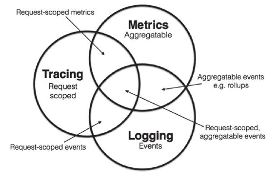

图10-1　日志、追踪、度量的关系[1]

假如你平时只开发单体系统，从未接触过分布式系统的观测工作，那看到日志、追踪和度量，很有可能会只对日志这一项感到熟悉，其他两项会相对陌生。然而从Peter Bourgon给出的定义来看，尽管分布式系统中追踪和度量的必要性和复杂程度确实比单体系统时要更高，但是在单体时代，你肯定也已经接触过以上全部三项的工作，只是并未意识到而已，笔者将它们的特征转述如下。

·日志（Logging）：日志的职责是记录离散事件，通过这些记录分析出程序的行为，譬如曾经调用过什么方法，曾经操作过哪些数据，等等。输出日志很容易，但收集和分析日志可能会很复杂，面对成千上万的集群节点，面对迅速滚动的事件信息，面对以TB计算的文本，传输与归集并不简单。对大多数程序员来说，分析日志也许就是最常遇见也最有实践可行性的“大数据系统”了。

·追踪（Tracing）：单体系统时代追踪的范畴基本只局限于栈追踪（Stack Tracing），例如调试程序时，在IDE打个断点，看到的调用栈视图上的内容便是追踪；编写代码时，处理异常调用了Exception::printStackTrace()方法，它输出的堆栈信息也是追踪。微服务时代，追踪就不只局限于调用栈了，一个外部请求需要内部若干服务的联动响应，这时候完整的调用轨迹将跨越多个服务，同时包括服务间的网络传输信息与各个服务内部的调用堆栈信息，因此，分布式系统中的追踪在国内常被称为“全链路追踪”（后文简称“链路追踪”），许多资料中也称它为“分布式追踪”（Distributed Tracing）。追踪的主要目的是排查故障，如分析调用链的哪一部分、哪个方法出现错误或阻塞，输入输出是否符合预期，等等。

·度量（Metrics）：度量是指对系统中某一类信息的统计聚合。譬如，证券市场的每一只股票都会定期公布财务报表，通过财报上的营收、净利、毛利、资产、负载等一系列数据来体现过去一个财务周期中公司的经营状况，这便是一种信息聚合。Java天生自带一种基本的度量，即由虚拟机直接提供的JMX（Java Management eXtensions）度量，诸如内存大小、各分代的用量、峰值的线程数、垃圾收集的吞吐量、频率等都可以从JMX中获得。度量的主要目的是监控（Monitoring）和预警（Alert），如在某些度量指标达到风险阈值时触发事件，以便自动处理或者提醒管理员介入。

在工业界，目前针对可观测性的产品已经是一片红海，经过多年角逐，日志、度量两个领域的胜利者算是基本尘埃落定。日志收集和分析大多被统一到Elastic Stack（ELK）技术栈上，如果说未来还能出现什么变化的话，也就是其中的Logstash有被Fluentd取代的趋势，让ELK变成EFK，但整套Elastic Stack技术栈的地位已是相当稳固。度量方面，跟随Kubernetes统一容器编排的步伐，Prometheus也击败了度量领域里以Zabbix为代表的众多前辈，即将成为云原生时代度量监控的事实标准，虽然从市场角度来说Prometheus还没有达到Kubernetes那种“拔剑四顾，举世无敌”的程度，但是从社区活跃度上看，Prometheus已占有绝对的优势，在Google和CNCF的推动下，未来可期。

额外知识

Kubernetes与Prometheus的关系

Kubernetes是CNCF第一个孵化成功的项目，Prometheus是CNCF第二个孵化成功的项目。

Kubernetes起源于Google的编排系统Borg，Prometheus起源于Google为Borg做的度量监控系统BorgMon。

追踪方面的情况与日志、度量有所不同，追踪是与具体网络协议、程序语言密切相关的。收集日志不必关心这段日志是由Java程序输出的还是由Golang程序输出的，对程序来说它们就只是一段非结构化文本而已，同理，度量对程序来说也只是一个个聚合的数据指标而已。但链路追踪不一样，各个服务之间是使用HTTP还是gRPC来进行通信会直接影响追踪的实现，各个服务是使用Java、Golang还是Node.js来编写，也会直接影响进程内调用栈的追踪方式。这种特性决定了追踪工具本身有较强的侵入性，通常是以插件式的探针来实现；也决定了追踪领域很难出现一家独大的情况，通常要有多种产品来针对不同的语言和网络进行追踪。近年来各种链路追踪产品层出不穷，市面上主流的工具既有像Datadog这样的一揽子商业方案，也有AWS X-Ray和Google Stackdriver Trace这样的云计算厂商产品，还有像SkyWalking、Zipkin、Jaeger这样来自开源社区的优秀产品。

图10-2是CNCF Interactive Landscape中列出的日志、追踪、度量领域的著名产品，其实这里很多不同领域的产品是跨界的，譬如ELK可以通过Metricbeat来实现度量的功能，Apache SkyWalking的探针同时支持度量和追踪两方面的数据来源，由OpenTracing进化而来OpenTelemetry更是融合了日志、追踪、度量三者所长，有望成为三者兼备的统一可观测性解决方案。本章后面的讲解，也会紧扣每个领域中最具有统治性的产品来进行介绍。

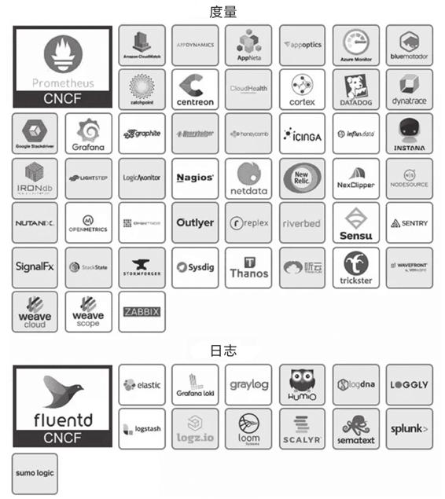

图10-2　日志、追踪、度量的相关产品

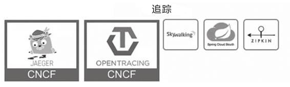

图10-2　（续）

[1] 图片来源：https://peter.bourgon.org/blog/2017/02/21/metrics-tracing-and-logging.html。

### 10.1 事件日志

日志用于记录系统运行期间发生过的离散事件。相信没有哪一个生产系统能够缺少日志功能，然而却常常被人忽略。日志就像阳光与空气，无可或缺却不太被重视。程序员们说日志简单，其实是在说“打印日志”这个操作简单，打印日志是为了日后从中得到有价值的信息，而今天只要稍微复杂点的系统，尤其是复杂的分布式系统，就很难只依靠tail、grep、awk来从日志中挖掘信息了，往往还要有专门的全局查询和可视化功能。此时，从打印日志到分析查询之间，还隔着收集、缓冲、聚合、加工、索引、存储等若干个步骤，如图10-3所示。

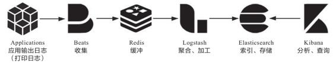

图10-3　日志处理过程

这一整个链条中涉及大量值得注意的细节，复杂性并不亚于任何一项技术或业务功能的实现。接下来将以此为线索，以最成熟的Elastic Stack技术栈为例，介绍该链条每个步骤的目的与方法。

#### 10.1.1 输出

要是说好的日志能像文章一样，让人读起来身心舒畅，这话肯定有夸大的成分，不过好的日志应该能做到像“流水账”一样，无有遗漏地记录信息，格式统一，内容恰当。其中“恰当”是一个难点，它要求日志不应该过多，也不应该过少。“多与少”一般不针对输出的日志行数，尽管笔者听过最夸张的系统是单节点INFO级别下每天的日志都能以TB计算（这是代码有问题的），给网络与磁盘I/O带来了不小压力，但笔者通常不以数量来衡量日志是否恰当，而是以内容来衡量。不该出现的内容不要有，该有的不要少。下面笔者先列出一些常见的“不应该有”的例子。

·避免打印敏感信息。不用专门提醒，任何程序员肯定都知道不该将密码、银行账号、身份证件这些敏感信息打到日志里，但笔者曾见过不止一个系统的日志中能直接找到这些信息。一旦这些敏感信息随日志流到了后续的索引、存储、归档等步骤中，清理起来将非常麻烦。不过，日志中应当包含必要的非敏感信息，譬如当前用户的ID（最好是内部ID，避免登录名或者用户名称），有些系统会直接用MDC（Mapped Diagnostic Context，映射诊断上下文）将用户ID自动打印在日志模板（Pattern Layout）上。

·避免引用慢操作。日志中打印的信息应该是在上下文中可以直接取到的，如果当前上下文中根本没有这项数据，需要专门调用远程服务或者从数据库获取，又或者需要通过大量计算才能取到的话，那应该先考虑把这项信息放到日志中是不是必要且恰当的。

·避免打印追踪诊断信息。日志中不要打印方法输入参数、输出结果、方法执行时长之类的调试信息。这个观点是反直觉的，不少公司甚至会将其作为最佳实践来提倡，但是笔者仍坚持将其归入反模式中。日志的职责是记录事件，追踪诊断应由追踪系统去处理，哪怕贵公司完全没有开发追踪诊断方面功能的打算，笔者也建议使用BTrace或者Arthas这类“On-The-Fly”的工具来解决。之所以将其归为反模式，是因为上面说的敏感信息、慢操作等的主要源头就是这些原本想用于调试的日志。譬如，当前方法入口参数有个User对象，如果要输出这个对象，常见做法是将它序列化成JSON字符串然后打到日志里，这时候User里面的Password字段、BankCard字段就很容易被暴露出来；再譬如，当前方法的返回值是个映射，开发期的调试数据只做了三五个实体，觉得遍历一下把具体内容打到日志里面没什么问题，但到了生产期，这个映射里面有可能存放了成千上万个实体，这时候打印日志就相当于引用慢操作。

·避免误导他人。日志中给日后调试除错的人挖坑是十分恶劣却又常见的行为。相信程序员并不是专门要去误导别人，只是很可能会无意识地这样做了。譬如明明已经在逻辑中妥善处理好了某个异常，却习惯性地调用printStackTrace()方法，把堆栈打到日志中，一旦这个方法附近出现问题，由其他人来除错的话，很容易会盯着这段堆栈去找线索而浪费大量时间。

另一方面，日志中不该缺少的内容也“不应该少”，以下是笔者建议应该输出到日志中的部分内容。

·处理请求时的TraceID。服务收到请求时，如果该请求没有附带TraceID，就应该自动生成唯一的TraceID来对请求进行标记，并使用MDC自动输出到日志。TraceID会贯穿整条调用链，目的是通过它把请求在分布式系统各个服务中的执行过程串联起来。TraceID通常也会随着请求的响应返回到客户端，如果响应内容出现了异常，用户便能通过此ID快速找到与问题相关的日志。TraceID是链路追踪里的概念，类似的还有用于标识进程内调用状况的SpanID，在Java程序中这些都可以用Spring Cloud Sleuth来自动生成。TraceID会在分布式跟踪中发挥最大的作用，在单体系统，将TraceID记录到日志并返回给最终用户，对快速定位错误也仍然十分有价值。

·系统运行过程中的关键事件。日志的职责就是记录事件，譬如进行了哪些操作、发生了与预期不符的情况、运行期间出现未能处理的异常或警告、定期自动执行的任务，等等，都应该在日志中完整地记录下来。原则上程序中发生的事件只要有价值就应该去记录，但应判断清楚事件的重要程度，选定相匹配的日志级别。至于如何快速处理大量日志，这是后面步骤要考虑的问题，如果输出日志实在太频繁以至于影响性能，应由运维人员去调整全局或单个类的日志级别来解决。

·启动时输出配置信息。与避免输出诊断信息不同，对于系统启动时或者检测到配置中心变化时更新的配置，应将非敏感的配置信息输出到日志中，譬如连接的数据库、临时目录的路径等，因为初始化配置的逻辑一般只会执行一次，不便于诊断时复现，所以应该输出到日志中。

#### 10.1.2 收集与缓冲

写日志是在服务节点中进行的，但我们不可能在每个节点都单独建设日志查询功能。这不是资源或工作量的问题，而是分布式系统处理一个请求要跨越多个服务节点，为了能看到跨节点的全部日志，就要有能覆盖整个链路的全局日志系统。这个需求决定了每个节点输出日志到文件后，必须将日志文件统一收集起来集中存储、索引，由此便催生了专门的日志收集器。

最初，ELK中的日志收集与下一节要讲的加工聚合的职责都是由Logstash来承担的，Logstash除了部署在各个节点中作为收集的客户端（Shipper）外，还同时设有独立部署的节点，扮演归集转换日志的服务端（Master）的角色。Logstash有良好的插件化设计，支持收集、转换、输出的插件化定制，应对多重角色本身并没有什么困难。但是Logstash与它的插件是基于JRuby编写的，要跑在单独的Java虚拟机进程上，而且Logstash默认的堆大小是1GB。对于归集部分（Master）这种消耗并不是什么问题，但作为每个节点都要部署的日志收集器就显得太过负重了。后来，Elastic.co公司将所有需要在服务节点中处理的工作整理成以Libbeat为核心的Beats框架，并使用Golang重写了一个功能较少，却更轻量高效的日志收集器，这就是今天流行的Filebeat。

现在的Beats已经是一个很大的家族了，除了Filebeat外，Elastic.co还提供了用于收集Linux审计数据的Auditbeat、用于无服务计算架构的Functionbeat、用于心跳检测的Heartbeat、用于聚合度量的Metricbeat、用于收集Linux Systemd Journald日志的Journalbeat、用于收集Windows事件日志的Winlogbeat，用于网络包嗅探的Packetbeat，等等，如果再加上大量由社区维护的Community Beats，几乎你能想到的数据都可以被收集到，以至于ELK也可以在一定程度上代替度量和追踪系统，实现它们的部分职能，这对于中小型分布式系统来说是便利的，但对于大型系统，笔者建议还是让专业的工具去做专业的事情。

日志收集器不仅要保证能覆盖全部数据来源，还要尽力保证日志数据的连续性，这其实并不容易做到。譬如淘宝这类大型的互联网系统，每天的日志量超过了10 000TB（10PB）量级，日志收集器的部署实例数能到达百万量级[1]，此时归集到系统中的日志要与实际产生的日志保持绝对的一致性是非常困难的，也不应该为此付出过高成本。换言之，日志不追求绝对的完整精确，只追求在代价可承受的范围内尽可能地保证较高的数据质量。一种最常用的缓解压力的做法是将日志接收者从Logstash和Elasticsearch转移至抗压能力更强的队列缓存，譬如在Logstash之前架设一个Kafka或者Redis作为缓冲层，面对突发流量，Logstash或Elasticsearch处理能力出现瓶颈时自动削峰填谷，甚至当它们短时间停顿时，也不会丢失日志数据。

[1] 数据来源：https://www.infoq.cn/article/lFABd9a1BFqSYo*m8vVb。

#### 10.1.3 加工与聚合

在将日志集中收集之后，存入Elasticsearch之前，一般还要对它们进行加工转换和聚合处理。这是因为日志是非结构化数据，一行日志中通常会包含多项信息，如果不做处理，那在Elasticsearch中就只能以全文检索的原始方式去使用日志，既不利于统计对比，也不利于条件过滤。举个具体例子，下面是一行Nginx服务器的Access日志，代表了一次页面访问操作：

```
14.123.255.234 - - [19/Feb/2020:00:12:11 +0800] "GET /index.html HTTP/1.1" 200 
    1314 "https://icyfenix.cn" "Mozilla/5.0 (Windows NT 10.0; WOW64) AppleWebKit/
    537.36 (KHTML, like Gecko) Chrome/80.0.3987.163 Safari/537.36"
```

在这一行日志里面，包含了表10-1所列的10项独立数据项。

表10-1　日志包含的10项独立数据项

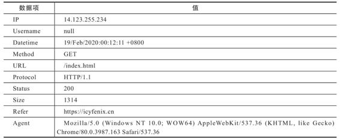

Logstash的基本职能是把日志行中的非结构化数据，通过Grok表达式语法转换为上面表格这样的结构化数据，进行结构化的同时，还可能会根据需要，调用其他插件来完成时间处理（统一时间格式）、类型转换（如字符串、数值的转换）、查询归类（譬如将IP地址根据地理信息库按省市归类）等额外处理工作，然后以JSON格式输出到Elasticsearch中（这是最普遍的输出形式，Logstash输出也有很多插件，可以具体定制不同的格式）。有了这些经过Logstash转换，已经结构化的日志，Elasticsearch便可针对不同的数据项来建立索引，进行条件查询、统计、聚合等操作了。

提到聚合，这也是Logstash的另一个常见职能。日志中存储的是离散事件，离散的意思是每个事件都是相互独立的，譬如有10个用户访问服务，他们的操作所产生的事件都会在日志中分别记录。如果想从离散的日志中获得统计信息，譬如想知道这些用户中正常返回（200 OK）的有多少、出现异常的（500 Internal Server Error）的有多少，再生成一个可视化统计图表，一种解决方案是通过Elasticsearch本身的处理能力做实时的聚合统计，这很便捷，不过要消耗Elasticsearch服务器的运算资源。另一种解决方案是在收集日志后自动生成某些常用的、固定的聚合指标，这种聚合就会在Logstash中通过聚合插件来完成。这两种聚合方式都有不少实际应用，前者一般用于即席查询，后者用于固定查询。

#### 10.1.4 存储与查询

经过收集、缓冲、聚合、加工的日志数据，终于可以放入Elasticsearch中索引存储了。Elasticsearch是整个Elastic Stack技术栈的核心，其他步骤的工具，如Filebeat、Logstash、Kibana都有替代品，有自由选择的余地，唯独Elasticsearch在日志分析这方面完全没有什么值得一提的竞争者，几乎就是解决此问题的唯一答案。这样的结果与Elasticsearch本身是一款优秀产品有关，然而更关键的是Elasticsearch的优势正好与日志分析的需求完美契合。

·从数据特征的角度看，日志是典型的基于时间的数据流，但它与其他时间数据流，譬如你的新浪微博、微信朋友圈这种社交网络数据又稍有区别：日志虽然增长速度很快，但已写入的数据几乎没有再发生变动的可能。日志的数据特征决定了所有用于日志分析的Elasticsearch都会使用时间范围作为索引，根据实际数据量的大小，范围可能是按月、按周或者按日、按时。以按日索引为例，由于你能准确地预知明天、后天的日期，因此全部索引都可以预先创建，这免去了动态创建的寻找节点、创建分片、在集群中广播变动信息等开销。又由于所有新的日志都是“今天”的日志，所以只要建立“logs_current”这样的索引别名来指向当前索引，就能避免代码因日期而变动。

·从数据价值的角度看，日志基本只会以最近的数据为检索目标，随着时间推移，早期的数据将逐渐失去价值。这点决定了可以很容易区分出冷数据和热数据，进而对不同数据采用不同的硬件策略。譬如为热数据配备SSD磁盘和更好的处理器，为冷数据配备HDD磁盘和较弱的处理器，甚至可以放到更为廉价的对象存储（如阿里云的OSS，腾讯云的COS，AWS的S3）中归档。

注意，本节的主题是日志在可观测性方面的作用，另外还有一些基于日志的其他类型应用，譬如从日志记录的事件中挖掘业务热点，分析用户习惯等，这属于真正的大数据挖掘的范畴，并不在我们讨论“价值”的范围之内，事实上它们更可能采用的技术栈是HBase与Spark的组合，而不是Elastic Stack。

·从数据使用的角度看，分析日志很依赖全文检索和即席查询，对实时性的要求是处于实时与离线两者之间的“近实时”，即不强求日志产生后立刻能查到，但不能接受日志产生之后按小时甚至按天的频率来更新，这些检索能力和近实时性，也正好都是Elasticsearch的强项。

Elasticsearch只提供了API层面的查询能力，通常与同样出自Elastic.co的Kibana一起搭配使用，可以将Kibana视为Elastic Stack的GUI部分。尽管Kibana只负责图形界面和展示，但它提供的能力远不止在界面上执行Elasticsearch的查询那么简单。Kibana宣传的核心能力是“探索数据并可视化”，即对存储在Elasticsearch中的数据进行检索、聚合、统计后，定制形成各种图形、表格、指标、统计，以此观察系统的运行状态，找出日志事件中潜藏的规律和隐患。按Kibana官方的宣传语来说就是“一张图片胜过千万行日志”，如图10-4所示。

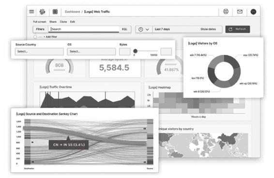

图10-4　Kibana可视化界面[1]

[1] 图片来自Kibana官网：https://www.elastic.co/cn/kibana。

### 10.2 链路追踪

虽然2010年之前就已经有了X-Trace、Magpie等跨服务的追踪系统了，但现代分布式链路追踪公认的起源是Google在2010年发表的论文“Dapper:a Large-Scale Distributed Systems Tracing Infrastructure”[1]。这篇论文介绍了Google从2004年开始使用的分布式追踪系统Dapper的实现原理。此后，业界所有有名的追踪系统，无论是国外Twitter的Zipkin、Naver的Pinpoint（Naver是Line的母公司，Pinpoint出现其实早于Dapper论文发表，在Dapper论文中还提到了Pinpoint），抑或是国内阿里的鹰眼、大众点评的CAT、个人开源的SkyWalking（后进入Apache基金会孵化毕业）都受到Dapper论文的直接影响。

从广义上讲，一个完整的分布式追踪系统应该由数据收集、数据存储和数据展示三个相对独立的子系统构成，而从狭义上讲，追踪则只是特指链路追踪数据的收集部分。譬如Spring Cloud Sleuth就属于狭义的追踪系统，通常会搭配Zipkin（用于数据展示）和Elasticsearch（用于数据存储）来组合使用，而上文提到的那些追踪系统大多都属于广义的追踪系统，也常被称为“APM系统”（Application Performance Management）。

[1] 下载地址：https://static.googleusercontent.com/media/research.google.com/zh-CN//archive/papers/dapper-2010-1.pdf。

#### 10.2.1 追踪与跨度

为了有效地进行分布式追踪，Dapper提出了“追踪”与“跨度”两个概念。从客户端发起请求抵达系统的边界开始，记录请求流经的每一个服务，直到向客户端返回响应为止，这整个过程就称为一次“追踪”（Trace，为了不产生混淆，后文就直接使用英文Trace来指代了）。由于每次Trace都可能会调用数量不定、坐标不定的多个服务，为了能够记录具体调用了哪些服务，以及调用顺序、开始时点、执行时长等信息，每次开始调用服务前都要先埋入一个调用记录，这个记录称为一个“跨度”（Span）。Span的数据结构应该足够简单，以便能放在日志或者网络协议的报文头里；也应该足够完备，起码应含有时间戳、起止时间、Trace的ID、当前Span的ID、父Span的ID等能够满足追踪需要的信息。每一次Trace实际上都是由若干个有顺序、有层级关系的Span所组成的一棵“追踪树”（Trace Tree），如图10-5所示。

从目标来看，链路追踪的目的是为排查故障和分析性能提供数据支持，若系统在对外提供服务的过程中，能持续地接收请求并处理响应，同时能持续地生成Trace，按次序整理好Trace中每一个Span所记录的调用关系，便能绘制出一幅系统的服务调用拓扑图。根据拓扑图中Span记录的时间信息和响应结果（正常或异常返回）就可以定位到缓慢或者出错的服务；将Trace与历史记录进行对比统计，就可以从系统整体层面分析服务性能，定位性能优化的目标。

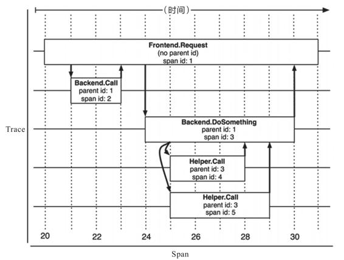

图10-5　Trace和Span[1]

从实现来看，为每次服务调用记录Trace和Span，并以此构成追踪树结构，听着好像没那么复杂，然而考虑到实际情况，追踪系统在功能性和非功能性上都面临不小的挑战。功能上的挑战来源于服务的异构性，各个服务可能采用不同的程序语言，服务间交互可能采用不同的网络协议，每兼容一种场景，都会增加功能实现方面的工作量。而非功能性的挑战则具体来源于以下这四个方面。

·低性能损耗：分布式追踪不能对服务本身产生明显的性能负担。追踪的主要目的之一就是寻找性能缺陷，越慢的服务越是需要追踪，所以工作场景都是性能敏感的地方。

·对应用透明：追踪系统通常是运维期才加入的系统，应该尽量以非侵入或者少侵入的方式来实现追踪，对开发人员做到透明化。

·随应用扩缩：现代的分布式服务集群都有根据流量压力自动扩缩的能力，这要求当业务系统扩缩时，追踪系统也能自动跟随，不需要运维人员人工参与。

·持续的监控：要求追踪系统必须能够7×24小时工作，否则就难以定位到系统偶尔抖动的行为。

[1] 图片来源于Dapper论文：https://static.googleusercontent.com/media/research.google.com/zh-CN//archive/papers/dapper-2010-1.pdf。

#### 10.2.2 数据收集

目前，追踪系统根据数据收集方式的差异，可分为三种主流的实现方式，分别是基于日志的追踪（Log-Based Tracing）、基于服务的追踪（Service-Based Tracing）和基于边车代理的追踪（Sidecar-Based Tracing），笔者分别介绍如下。

·基于日志的追踪的思路是将Trace、Span等信息直接输出到应用日志中，然后随着所有节点的日志归集过程汇聚到一起，再从全局日志信息中反推出完整的调用链拓扑关系。日志追踪对网络消息完全没有侵入性，对应用程序只有很少量的侵入性，对性能影响也非常低。但其缺点是直接依赖于日志归集过程，日志本身不追求绝对的连续与一致，这也使得基于日志的追踪往往不如其他两种追踪实现精准。另外，业务服务的调用与日志的归集并不是同时完成的，也通常不由同一个进程完成，有可能业务调用已经顺利结束了，但由于日志归集不及时或者精度丢失，导致日志出现延迟或缺失记录，进而产生追踪失真。这也是前面笔者介绍Elastic Stack时提到的观点，ELK在日志、追踪和度量方面都可以发挥作用，这对中小型应用确实有一定便利，但是大型系统最好还是选择由专业的工具做专业的事。日志追踪的代表产品是Spring Cloud Sleuth，下面是一段由Sleuth在调用时自动生成的日志记录，可以从中观察到TraceID、SpanID、父SpanID等追踪信息。

```
# 以下为调用端的日志输出：
Created new Feign span [Trace: cbe97e67ce162943, Span: bb1798f7a7c9c142,
    Parent: cbe97e67ce162943, exportable:false]
2019-06-30 09:43:24.022 [http-nio-9010-exec-8] DEBUG o.s.c.s.i.web.client.
    feign.TraceFeignClient - The modified request equals GET http://localhost:
    9001/product/findAll HTTP/1.1

X-B3-ParentSpanId: cbe97e67ce162943
X-B3-Sampled: 0
X-B3-TraceId: cbe97e67ce162943
X-Span-Name: http:/product/findAll
X-B3-SpanId: bb1798f7a7c9c142

# 以下为服务端的日志输出：
[findAll] to a span [Trace: cbe97e67ce162943, Span: bb1798f7a7c9c142, Parent: 
    cbe97e67ce162943, exportable:false]
Adding a class tag with value [ProductController] to a span [Trace: 
    cbe97e67ce162943, Span: bb1798f7a7c9c142, Parent: cbe97e67ce162943, 
    exportable:false]
```

·基于服务的追踪是目前最常见的追踪实现方式，被Zipkin、SkyWalking、Pinpoint等主流追踪系统广泛采用。服务追踪的实现思路是通过某些手段给目标应用注入追踪探针（Probe），针对Java应用一般是通过Java Agent注入。探针在结构上可视为一个寄生在目标服务身上的小型微服务系统，它一般会有自己专用的服务注册、心跳检测等功能，有专门的数据收集协议，把从目标系统中监控到的服务调用信息，通过另外一次独立的HTTP或者RPC请求发送给追踪系统。因此，基于服务的追踪会比基于日志的追踪消耗更多的资源，也有更强的侵入性，换来的收益是追踪的精确性与稳定性都有所保证，不必再依靠日志归集来传输追踪数据。

图10-6是一张Pinpoint的追踪效果截图，从图中可以看到参数、变量等相当详细的方法级调用信息。笔者在10.1.1节把“打印追踪诊断信息”列为反模式，如果需要诊断方法参数、返回值、上下文信息，或者方法调用耗时这类数据，通过追踪系统来实现是比通过日志系统实现更加恰当的解决方案。

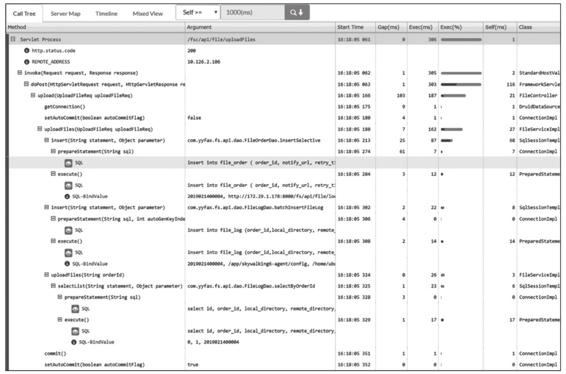

图10-6　Pinpoint的追踪截图

当然，这里也必须说明清楚，像图10-6中Pinpoint这种详细程度的追踪对应用系统的性能压力是相当大的，一般仅在除错时开启，而且Pinpoint本身就是比较重负载的系统（运行它必须先维护一套HBase），这严重制约了它的适用范围，目前服务追踪的其中一个发展趋势是轻量化，国产的SkyWalking正是这方面的佼佼者。

·基于边车代理的追踪是服务网格的专属方案，也是最理想的分布式追踪模型，它对应用完全透明，无论是日志还是服务本身都不会有任何变化；它与程序语言无关，无论应用采用什么编程语言实现，只要它还是通过网络（HTTP或者gRPC）来访问服务就可以被追踪到；它有自己独立的数据通道，追踪数据通过控制平面上报，避免了追踪对程序通信或者日志归集的依赖和干扰，保证了最佳的精确性。如果要说这种追踪实现方式的缺点，那就是服务网格现在还不够普及，但随着云原生的发展，相信它在未来会成为追踪系统的主流实现方式之一。此外，边车代理本身对应用透明的工作原理决定了它只能实现服务调用层面的追踪，不能做到像图10-6中Pinpoint那样本地方法调用级别的追踪诊断。

现在市场占有率最高的边车代理Envoy就提供了相对完善的追踪功能，但没有提供自己的界面端和存储端，所以Envoy和Sleuth一样都属于狭义的追踪系统，需要配合专门的UI与存储来使用，现在SkyWalking、Zipkin、Jaeger、LightStep Tracing等系统都可以接收来自Envoy的追踪数据，充当它的界面端。

#### 10.2.3 追踪规范化

比起日志与度量，追踪这个领域的产品竞争要相对激烈得多。一方面，目前还没有像日志、度量那样出现具有明显统治力的产品，仍处于群雄混战的状态。另一方面，几乎市面上所有的追踪系统都是以Dapper的论文为原型发展出来的，基本上都算是“同门师兄弟”，功能上并没有太本质的差距，却又受制于实现细节，彼此互斥，很难搭配工作。这种局面只能怪当初Google发表的Dapper只是论文而不是有约束力的规范标准，只提供了思路，并没有规定细节，譬如该怎样进行埋点、Span上下文具体该有什么数据结构，怎样设计追踪系统与探针或者界面端的API接口，等等，都没有权威的规定。

为了推进追踪领域的产品的标准化，2016年11月，CNCF技术委员会接受了OpenTracing作为基金会第三个项目。OpenTracing是一套与平台无关、与厂商无关、与语言无关的追踪协议规范，只要遵循OpenTracing规范，任何公司的追踪探针、存储、界面都可以随时切换，也可以相互搭配使用。

在操作层面，OpenTracing只是制定了一个很薄的标准化层，位于应用程序与追踪系统之间，使得即使探针与追踪系统不是同一个厂商的产品，只要它们都支持OpenTracing协议就可以互相通信。此外，OpenTracing还规定了微服务之间发生调用时，应该如何传递Span信息（OpenTracing Payload），以上这些都如图10-7右边竖排文字部分所示。

OpenTracing规范公布后，几乎所有业界有名的追踪系统，譬如Zipkin、Jaeger、SkyWalking等都很快宣布支持OpenTracing，但Google自己却在此时出来反对，并提出了与OpenTracing目标类似的OpenCensus规范，随后又得到了巨头Microsoft的支持和参与。OpenCensus不仅涉及追踪，还把指标度量纳入进来；内容上不仅涉及规范制定，还把数据采集的探针和收集器都一起以SDK（目前支持五种语言）的形式提供出来。

OpenTracing和OpenCensus迅速形成可观测性的两大阵营，一边是在这方面深耕多年的众多老牌APM系统厂商，另一边是分布式追踪概念的提出者Google以及与Google同样庞大的Microsoft。对追踪系统的规范化工作，并没有平息厂商竞争的混乱，反倒把水搅得更浑了。

2019年，OpenTracing和OpenCensus又忽然宣布握手言和，共同发布了可观测性的终极解决方案OpenTelemetry，并宣布会各自冻结OpenTracing和OpenCensus的发展。OpenTelemetry野心颇大，不仅包括追踪规范，还包括日志和度量方面的规范、各种语言的SDK，以及采集系统的参考实现，它距离一个完整的追踪与度量系统，仅仅是缺了界面端和指标预警这些会与用户直接接触的后端功能，将它们留给具体产品去实现，勉强算是OpenTelemetry没有对一众APM厂商赶尽杀绝，留了一条活路。

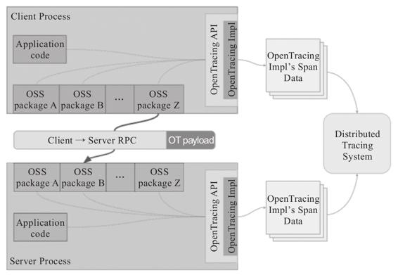

图10-7　符合OpenTracing的软件架构[1]

OpenTelemetry一诞生就带着无比炫目的光环，直接进入CNCF的孵化项目，它的目标是统一追踪、度量和日志三大领域（目前主要关注的是追踪和度量，日志方面，官方表示将放到下一阶段处理）。不过，OpenTelemetry毕竟是2019年才出现的新生事物，尽管背景深厚，前途光明，但未来究竟如何发展，能否打败现在已经有的众多成熟系统，目前仍然言之尚早。

[1] 图片来源：https://medium.com/opentracing/towards-turnkey-distributed-tracing-5f4297d1736。

### 10.3 聚合度量

度量的目的是揭示系统的总体运行状态。相信大家应该见过这样的场景：在舰船的驾驶舱或者卫星发射中心的控制室，在整个房间最显眼的位置，布满整面墙壁的巨型屏幕里显示着一个个指示器、仪表板与统计图表，沉稳端坐中央的指挥官看着屏幕上闪烁变化的指标，果断决策，下达命令……如果以上场景被改成指挥官双手在键盘上飞舞，双眼紧盯着日志或者追踪系统，试图判断出系统工作是否正常，只是想象一下，就能感觉到一股身份与行为不一致的违和气息。由此可见度量与日志、追踪的差别，度量是用经过聚合统计后的高维度信息，以最简单直观的形式来总结复杂的过程，为监控、预警提供决策支持。

如果你人生经历比较平淡，没有驾驶航母的经验，甚至连一颗卫星或者导弹都没有发射过，那就只好打开电脑，按CTRL+ALT+DEL呼出任务管理器，看看图10-8所示这个熟悉的界面，它也是一个非常具有代表性的度量系统。

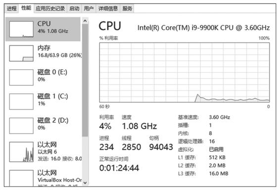

图10-8　Windows系统的任务管理器界面

度量总体上可分为客户端的指标收集、服务端的存储查询以及终端的监控预警三个相对独立的过程，每个过程在系统中一般也会设置对应的组件来实现，你不妨先翻到下面的图10-9，看一眼Prometheus组件流程图，图中在Prometheus Server左边的部分都属于客户端过程，右边的部分就属于终端过程。

Prometheus在度量领域的统治力虽然还暂时不如日志领域中Elastic Stack那么稳固，但在云原生时代，基本也已经能算是事实标准了，接下来，笔者将主要以Prometheus为例，介绍这三个过程的总体思路、大致内容与理论标准。

#### 10.3.1 指标收集

指标收集部分要解决两个问题：“如何定义指标”以及“如何将这些指标告诉服务端”。如何定义指标这个问题听起来应该是与目标系统密切相关的，必须根据实际情况才能讨论，但这并不是绝对的，无论目标是何种系统，都具备一些共性特征。确定目标系统前我们无法决定要收集什么指标，但指标的数据类型（Metric Type）是可数的，而所有通用的度量系统都是面向指标的数据类型来设计的。

·计数度量器（Counter）：这是最好理解也是最常用的指标形式。计数度量器就是对有相同量纲、可加减数值的合计量，譬如业务指标，销售额、货物库存量、职工人数等；技术指标，服务调用次数、网站访问人数等都属于计数器指标。

·瞬态度量器（Gauge）：瞬态度量器比计数器还简单，它表示某个指标在某个时点的数值，连加减统计都不需要。譬如当前Java虚拟机堆内存的使用量，这就是一个瞬态度量器；又譬如，网站访问人数是计数器指标，而网站在线人数则是瞬态度量指标。

·吞吐率度量器（Meter）：吞吐率度量器顾名思义是用于统计单位时间的吞吐量，即单位时间内某个事件的发生次数。譬如交易系统中常以TPS衡量事务吞吐率，即每秒发生了多少笔事务交易；又譬如港口的货运吞吐率常以“吨/每天”为单位计算，10万吨/天的港口通常要比1万吨/天的港口的货运规模大。

·直方图度量器（Histogram）：直方图是常见的二维统计图，它的两个坐标分别是统计样本和该样本对应的某个属性的度量，以长条图的形式表示具体数值。譬如经济报告中要衡量某个地区历年的GDP变化情况，常会以GDP为纵坐标，时间为横坐标构成直方图来呈现。

·采样点分位图度量器（Quantile Summary）：分位图是统计学中比较各分位数的分布情况的工具，用于验证实际值与理论值的差距，评估理论值与实际值之间的拟合度。譬如，我们说“高考成绩一般符合正态分布”，这句话的意思是：高考成绩获得高分和低分的人数都较少，获得中等成绩的较多，将人数按不同分数段统计，得出的统计结果一般能够与正态分布的曲线较好地拟合。

除了以上常见的度量器之外，还有Timer、Set、Fast Compass、Cluster Histogram等其他各种度量器，不同的度量系统，其支持度量器类型的范围肯定会有差别，譬如Prometheus支持上面提到的五种度量器中的Counter、Gauge、Histogram和Summary四种。

对于“如何将这些指标告诉服务端”这个问题，通常有两种解决方案：拉取式采集（Pull-Based Metrics Collection）和推送式采集（Push-Based Metrics Collection）。所谓拉取是指度量系统主动从目标系统中拉取指标，相对地，推送就是由目标系统主动向度量系统推送指标。这两种方式并没有绝对的好坏优劣，以前很多老牌的度量系统，如Ganglia、Graphite、StatsD等是基于推送式采集的，而以Prometheus、Datadog、Collectd为代表的另一派度量系统则青睐拉取式采集[1]。关于采集方式的权衡，不仅仅在度量中有，所有涉及客户端和服务端通信的场景，都会涉及该谁主动的问题，上一节讲的追踪系统也是如此。

一般来说，度量系统只会支持其中一种指标采集方式，因为度量系统的网络连接数量，以及对应的线程或者协程数可能非常庞大，如何采集指标将直接影响整个度量系统的架构设计。

Prometheus在基于拉取式采集架构的同时还能够有限度地兼容推送式采集，是因为它有Push Gateway。如图10-9所示，这是一个位于Prometheus Server外部的相对独立的中介模块，将外部推送来的指标放到Push Gateway中暂存，然后再等候Prometheus Server从Push Gateway中去拉取。Prometheus设计Push Gateway的本意是解决拉取式采集的一些固有缺陷，譬如目标系统位于内网，通过NAT访问外网，外网的Prometheus是无法主动连接目标系统的，这就只能由目标系统主动推送数据；又譬如某些小型短生命周期服务，可能还等不及Prometheus来拉取，服务就已经结束运行了，因此也只能由服务自己推送来保证度量的及时和准确。

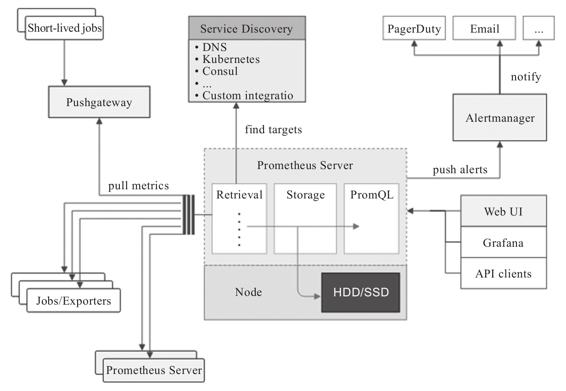

图10-9　Prometheus组件流程图[2]

在决定该谁主动以后，另一个问题是指标应该以怎样的网络访问协议、取数接口、数据结构来获取。与计算机科学中其他这类的问题类似，问题一贯的解决方向是“定义规范”，即由行业组织和主流厂商一起协商出专门用于度量的协议，让目标系统按照协议与度量系统交互。譬如，网络管理中的SNMP、Windows硬件的WMI，以及此前提到的Java的JMX都属于这种思路的产物。但是，定义标准这个办法在度量领域中不是那么有效，上述列举的度量协议只在特定的一块小块领域上流行过。原因一方面是业务系统要使用这些协议并不容易，你可以想象一下，让订单金额存到SNMP中，让基于Golang实现的系统把指标放到JMX Bean里，即便技术上可行，这也不像是正常程序员会干的事；另一方面，度量系统也不会甘心局限于某个领域，成为某项业务的附属品。度量面向的是广义上的信息系统，横跨存储（日志、文件、数据库）、通信（消息、网络）、中间件（HTTP服务、API服务），直到系统本身的业务指标，甚至还会包括度量系统本身（部署两个独立的Prometheus互相监控是很常见的）。所以，上面这些度量协议其实都没有成为最正确答案的希望。

鉴于没有了标准，有一些度量系统，譬如老牌的Zabbix就选择同时支持SNMP、JMX、IPMI等多种不同的度量协议，还有一些度量系统，以Prometheus为代表就相对强硬，选择不支持任何一种协议，只允许通过HTTP访问度量端点这一种访问方式。如果目标提供了HTTP的度量端点（如Kubernetes、etcd等本身就带有Prometheus的Client Library）就直接访问，否则就需要一个专门的Exporter来充当媒介。

Exporter是Prometheus提出的概念，它是目标应用的代表，既可以独立运行，也可以与应用运行在同一个进程中，只要集成Prometheus的Client Library便可。Exporter以HTTP协议[3]返回符合Prometheus格式要求的文本数据给Prometheus服务器。

得益于Prometheus的良好社区生态，现在已经有大量各种用途的Exporter，使得Prometheus的监控范围几乎能涵盖所有用户关心的目标，如表10-2所示。绝大多数用户都只需要针对自己系统业务方面的度量指标编写Exporter即可。

表10-2　常用Exporter

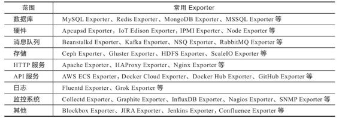

顺便提一下，虽然前文提到了一堆没有希望成为最终正确答案的协议，但是有一种名为OpenMetrics的度量规范正在从Prometheus的数据格式中逐渐分离出来，有望成为监控数据格式的国际标准，最终结果如何，要取决于Prometheus本身的发展情况，还有OpenTelemetry与OpenMetrics的关系如何协调。

[1] Prometheus官方解释选择Pull的原因：https://prometheus.io/docs/introduction/faq/#why-do-you-pull-rather-than-push?。

[2] 图片来自Prometheus官网：https://github.com/prometheus/prometheus。

[3] Prometheus在2.0版本之前支持过Protocol Buffer，目前已不再支持。

#### 10.3.2 存储查询

指标从目标系统采集过来之后，应存储在度量系统中，以便被后续的分析界面、监控预警所使用。存储数据对于计算机软件来说是司空见惯的操作，但如果用传统关系数据库的思路来解决度量系统的存储，效果可能不会太理想。举个例子，假设你建设一个中等规模的、有200个节点的微服务系统，每个节点要采集的存储、网络、中间件和业务等各种指标加一起，也按200个来计算，监控的频率如果按秒为单位的话，一天内就会产生超过34亿条记录：

200（节点）×200（指标）×86400（秒）=3 456 000 000（记录）

大多数这种200节点规模的系统，本身一天的业务发生数据都远到不了34亿条，如果要建设度量系统，肯定不能让度量成为业务系统的负担，可见，度量的存储是需要专门研究、解决的问题。至于如何解决，让我们先来观察一段Prometheus的真实度量数据，如下所示：

```
{
    // 时间戳
    "timestamp": 1599117392,
    // 指标名称
    "metric": "total_website_visitors",
    // 标签组
    "tags": {
        "host": "icyfenix.cn",
        "job": "prometheus"
    },
    // 指标值
    "value": 10086
}
```

观察这段度量数据的特征：每一个度量指标由时间戳、名称、值和一组标签构成，除了时间外，指标不与任何其他因素相关。指标的数据总量固然不小，但它没有嵌套、没有关联、没有主外键，不必关心范式和事务，这些都是可以针对性优化的地方。事实上，业界早已存在专门针对该类型数据的数据库了，即“时序数据库”（Time Series Database）。

额外知识

时序数据库

时序数据库用于存储跟随时间而变化的数据，并且以时间（时间点或者时间区间）来建立索引的数据库。

时序数据库最早是应用于工业（电力行业、化工行业）应用的各类型实时监测、检查与分析设备所采集、产生的数据，这些工业数据的典型特点是产生频率快（每一个监测点一秒钟内可产生多条数据）、严重依赖于采集时间（每一条数据均要求对应唯一的时间）、测点多信息量大（常规的实时监测系统均可达到成千上万的监测点，监测点每秒钟都在产生数据）。

时间序列数据是历史烙印，具有不变性、唯一性、有序性。时序数据库同时具有数据结构简单，数据量大的特点。

Facebook有研究表明85%的度量指标查询都与最近26个小时的数据写入有关，95%以上时序操作是写操作，时序数据通常只是追加，很少删改或者根本不允许删改。针对数据热点只集中在近期数据、多写少读、几乎不删改、数据只顺序追加这些特点，时序数据库被允许做出很激进的存储、访问和保留策略（Retention Policy）：

·以日志结构的合并树（Log Structured Merge Tree，LSM-Tree）代替传统关系型数据库中的B+树作为存储结构，LSM适合的应用场景就是写多读少，且几乎不删改的数据。

·设置激进的数据保留策略，譬如根据过期时间（TTL）自动删除相关数据以节省存储空间，同时提高查询性能。对于普通数据库来说，数据会存储一段时间后就被自动删除这种事情是不可想象的。

·对数据进行再采样（Resampling）以节省空间，譬如最近几天的数据可能需要精确到秒，而查询一个月前的数据时，只需要精确到天，查询一年前的数据时，只要精确到周就够了，这样将数据重新采样汇总就可以极大节省存储空间。

时序数据库中甚至还有一种不罕见却更加极端的形式，叫作轮替型数据库（Round Robin Database，RRD），以环形缓冲（在4.6节介绍过）的思路实现，只能存储固定数量的最新数据，超期或超过容量的数据就会被轮替覆盖，因此虽然它有固定的数据库容量，却能接收无限量的数据输入。

Prometheus服务端内置了一个强大的时序数据库实现，“强大”并非客气，近几年它在DB-Engines的排名中不断提升，目前已经跃居时序数据库排行榜的前三。该时序数据库提供了名为PromQL的数据查询语言，能对时序数据进行丰富的查询、聚合以及逻辑运算。某些时序库（如排名第一的InfluxDB）也会提供类SQL风格查询，但PromQL不是，它是一套完全由Prometheus自己定制的数据查询DSL，写起来风格有点像带运算与函数支持的CSS选择器。譬如要查找网站“icyfenix.cn”的访问人数，会是如下写法：

```
// 查询命令：
total_website_visitors{host="icyfenix.cn"}

// 返回结果：
total_website_visitors{host="icyfenix.cn",job="prometheus"}=(10086)
```

通过PromQL可以轻易实现指标之间的运算、聚合、统计等操作，在查询界面中往往需要通过PromQL计算多种指标的统计结果才能满足监控的需要，语法方面的细节笔者就不详细展开了，具体可以参考Prometheus的文档手册。

最后补充说明一下，时序数据库对度量系统来说是很合适的选择，但并不是说只有时序数据库才能解决度量指标的存储问题，Prometheus流行之前最老牌的度量系统Zabbix就是用传统关系数据库来存储指标。

#### 10.3.3 监控预警

指标度量是手段，最终目的是做分析和预警。界面分析和监控预警是与用户更加贴近的功能模块，但对度量系统本身而言，它们都属于相对外围的功能。与追踪系统的情况类似，广义上的度量系统由面向目标系统进行指标采集的客户端（Client，与目标系统进程在一起的Agent，或者代表目标系统的Exporter等都可归为客户端），负责调度、存储和提供查询能力的服务端（Server，Prometheus的服务端是有存储功能的，但也有很多度量服务端需要配合独立的存储来使用），以及面向最终用户的终端（Backend，UI界面、监控预警功能等都归为终端）组成。狭义的度量系统就只包括客户端和服务端，不包含终端。

按照定义，Prometheus应算是处于狭义和广义的度量系统之间，尽管它确实内置了一个界面解决方案“Console Template”，以模板和JavaScript接口的形式提供了一系列预设的组件（菜单、图表等），让用户编写一段简单的脚本就可以实现可用的监控功能。不过这种可用程度，往往不足以支撑正规的生产部署，只能说是为把度量功能嵌入系统的某个子系统提供了一定便利。在生产环境下，大多是Prometheus配合Grafana来进行展示的，这是Prometheus官方推荐的组合方案，但该组合也并非唯一选择，如果要搭配Kibana甚至SkyWalking（8.x版之后的SkyWalking支持从Prometheus获取度量数据）来使用也都是完全可行的。

良好的可视化能力对于提升度量系统的产品力十分重要，长期趋势分析（譬如根据对磁盘增长趋势的观察判断什么时候需要扩容）、对照分析（譬如版本升级后对比新旧版本的性能、资源消耗等方面的差异）、故障分析（不仅可以从日志、追踪指标自底向上分析故障，而且可以从高维度的度量指标自顶向下寻找问题的端倪）等分析工作，既需要度量指标的持续收集、统计，往往还需要对数据进行可视化，才能让人更容易地从数据中挖掘规律，毕竟数据最终还是要为人类服务的。

除了为分析、决策、故障定位等提供支持的用户界面外，度量信息的另外一种主要的消费途径是预警。譬如你希望当磁盘消耗超过90%时向你发送一封邮件或者一条微信消息，通知管理员过来处理，这就是一种预警。Prometheus提供了专门用于预警的Alert Manager，将Alert Manager与Prometheus关联后，可以设置某个指标在多长时间内达到何种条件就会触发预警状态，触发预警后，根据路由中配置的接收器，譬如邮件接收器、Slack接收器、微信接收器，或者更通用的WebHook接收器等来自动通知用户。
