## 第11章 虚拟化容器

容器是云计算、微服务等诸多软件行业核心技术的共同基石。容器的首要目标是让软件分发部署过程从传统的发布安装包、靠人工部署转变为直接发布已经部署好的、包含整套运行环境的虚拟化镜像。在容器技术成熟之前，主流的软件部署过程是由系统管理员编译或下载好二进制安装包，根据软件的部署说明文档准备好正确的操作系统、第三方库、配置文件、资源权限等各种前置依赖以后，才能将程序正确地运行起来。Chad Fowler在提出“不可变基础设施”这个概念的文章“Trash Your Servers and Burn Your Code”[1]的开篇就直接吐槽：要把一个不知道打过多少个升级补丁、不知道经历了多少任管理员的系统迁移到其他机器上，毫无疑问会是一场灾难。

让软件能够在任何环境、任何物理机器上达到“一次编译，到处运行”曾是Java早年的宣传口号，这并不是一个简单的目标，不设前提的“到处运行”，仅靠Java语言和Java虚拟机是不可能达成的，因为一个计算机软件要能够正确运行，需要有以下三方面的兼容性来共同保障（这里仅讨论软件兼容性，不涉及“如果没有摄像头就无法运行照相程序”这类问题）。

·ISA兼容：目标机器指令集的兼容性，譬如ARM架构的计算机无法直接运行面向x86架构编译的程序。

·ABI兼容：目标系统或者依赖库的二进制兼容性，譬如Windows系统环境中无法直接运行Linux的程序，又譬如DirectX 12的游戏无法运行在DirectX 9之上。

·环境兼容：目标环境的兼容性，譬如没有正确设置的配置文件、环境变量、注册中心、数据库地址、文件系统的权限等，任何一个环境因素出现错误，都会让你的程序无法正常运行。

额外知识

ISA与ABI

ISA（Instruction Set Architecture，指令集架构）是计算机体系结构中与程序设计相关的部分，包含基本数据类型、指令集、寄存器、寻址模式、存储体系、中断、异常处理以及外部I/O。指令集架构包含一系列操作码（即通常所说的机器语言）以及由特定处理器执行的基本命令。

ABI（Application Binary Interface，应用二进制接口）是应用程序与操作系统之间或其他依赖库之间的低级接口。ABI涵盖了各种底层细节，如数据类型的宽度大小、对象的布局、接口调用约定等。ABI不同于API，API定义的是源代码和库之间的接口，因此同样的代码可以在支持这个API的任何系统中编译，而ABI允许编译好的目标代码在使用兼容ABI的系统中直接运行，无须任何改动。

笔者把使用仿真（Emulation）以及虚拟化（Virtualization）技术来解决以上三项兼容性问题的方法都统称为虚拟化技术。根据抽象目标与兼容性高低的不同，虚拟化技术又分为下列五类。

·指令集虚拟化（ISA Level Virtualization）。通过软件来模拟不同ISA架构的处理器的工作过程，将虚拟机发出的指令转换为符合本机ISA的指令，典型代表为QEMU和Bochs。其实指令集虚拟化就是仿真，它能提供几乎完全不受局限的兼容性，甚至能做到直接在Web浏览器上运行完整操作系统这种令人惊讶的效果，但由于每条指令都要由软件来转换和模拟，所以也是性能损失最大的虚拟化技术。

·硬件抽象层虚拟化（Hardware Abstraction Level Virtualization）。以软件或者直接通过硬件来模拟处理器、芯片组、内存、磁盘控制器、显卡等设备的工作过程。既可以使用纯软件的二进制翻译来模拟虚拟设备，也可以由硬件的Intel VT-d、AMD-Vi这类虚拟化技术，将某个物理设备直通（Passthrough）到虚拟机中使用，典型代表为VMware ESXi和Hyper-V。如果没有预设语境，一般人们所说的“虚拟机”就是指这一类虚拟化技术。

·操作系统层虚拟化（OS Level Virtualization）。无论是指令集虚拟化还是硬件抽象层虚拟化，都会运行一套完全真实的操作系统来解决ABI兼容性和环境兼容性问题。虽然ISA兼容性是虚拟出来的，但ABI兼容性和环境兼容性却是真实存在的。操作系统层虚拟化不会提供真实的操作系统，而是采用隔离手段，使得不同进程拥有独立的系统资源和资源配额，看起来仿佛是独享了整个操作系统，但其实系统的内核仍然是被不同进程所共享的。

操作系统层虚拟化的另一个名字就是本章的主角“容器化”（Containerization），由此可见，容器化仅仅是虚拟化的一个子集，只能提供操作系统内核以上的部分ABI兼容性与完整的环境兼容性。这意味着如果没有其他虚拟化手段的辅助，在Windows系统上是不可能运行Linux的Docker镜像的（现在可以是因为有其他虚拟机或者WSL2的支持），反之亦然。同时也决定了如果Docker宿主机的内核版本是Linux Kernel 5.6，那无论上面运行的镜像是Ubuntu、RHEL、Fedora、Mint还是任何发行版的镜像，看到的内核一定都是相同的Linux Kernel 5.6。容器化牺牲了一定的隔离性与兼容性，换来的是比前两种虚拟化更高的启动速度、运行性能和更低的执行负担。

·运行库层虚拟化（Library Level Virtualization）。与操作系统层虚拟化采用隔离手段来模拟系统不同，运行库层虚拟化选择使用软件翻译的方法来模拟系统，它以一个独立进程来可代替操作系统内核，可提供目标软件运行所需的全部能力。这种虚拟化方法获得的ABI兼容性高低，取决于软件是否能够准确和全面地完成翻译工作，典型代表为WINE（Wine Is Not an Emulator的缩写，一款在Linux下运行Windows程序的软件）和WSL（特指Windows Subsystem for Linux Version 1）。

·语言层虚拟化（Programming Language Level Virtualization）。由虚拟机将高级语言生成的中间代码转换为目标机器可以直接执行的指令，典型代表为Java的JVM和.NET的CLR。虽然厂商肯定会提供在不同系统下都有相同接口的标准库，但本质上这种虚拟化并不直接解决任何ABI兼容性和环境兼容性问题。

[1] 文章地址：http://chadfowler.com/2013/06/23/immutable-deployments.html。

### 11.1 容器的崛起

设计容器的最初目的不是部署软件，而是隔离计算机中的各类资源，以便降低软件开发、测试阶段可能产生的误操作风险，或者专门充当蜜罐，吸引黑客的攻击，以便监视黑客的行为。下面，笔者将以容器发展历史为线索，介绍容器技术在不同历史阶段中的主要关注点。

#### 11.1.1 隔离文件：chroot

容器的起点可以追溯到1979年UNIX 7系统中提供的chroot命令，这个命令是英文单词“Change Root”的缩写，功能是当某个进程经过chroot操作之后，它的根目录就会被锁定在命令参数所指定的位置，以后它或者它的子进程将不能再访问和操作该目录之外的其他文件。

1991年，世界上第一个监控黑客行动的蜜罐程序就是使用chroot来实现的，命令参数指定的根目录当时被作者戏称为“Chroot监狱”（Chroot Jail），而黑客突破chroot限制的方法被称为“越狱”（Jailbreak）。后来，FreeBSD 4.0系统重新实现了chroot命令，用它作为系统中进程沙箱隔离的基础，并将其命名为FreeBSD Jail。再后来，苹果公司又以FreeBSD为基础研发出了举世闻名的iOS操作系统。此后，黑客们就将绕过iOS沙箱机制以root权限任意安装程序的方法称为“越狱”。当然，这些都是题外话了。

2000年，Linux Kernel 2.3.41引入了pivot_root技术来实现文件隔离，pivot_root直接切换了根文件系统（rootfs），有效地避免了chroot命令可能出现的安全性漏洞。本文后续提到的容器技术，如LXC、Docker等也都是优先使用pivot_root来实现根文件系统切换的。

时至今日，chroot命令依然活跃在UNIX系统及几乎所有主流的Linux发行版中，同时以命令行工具（chroot(8)）或者系统调用（chroot(2)）的形式存在，但无论是chroot命令还是pivot_root，都不能提供完美的隔离性。原本按照UNIX的设计哲学，一切资源都可以视为文件，一切处理都可以视为对文件的操作，理论上，只要隔离了文件系统，一切资源都应该被自动隔离才对。可是哲学归哲学，现实归现实，从硬件层面暴露的低层次资源，如磁盘、网络、内存、处理器，到经操作系统层面封装的高层次资源，如UNIX分时（UNIX Time-Sharing，UTS）、进程ID（Process ID，PID）、用户ID（User ID，UID）、进程间通信（Inter-Process Communication，IPC），都存在大量以非文件形式暴露的操作入口。因此，以chroot为代表的文件隔离，仅仅是容器崛起之路的起点而已。

#### 11.1.2 隔离访问：名称空间

2002年，Linux Kernel 2.4.19引入了一种全新的隔离机制：Linux名称空间（Linux Namespace）。名称空间的概念在很多现代的高级程序语言中都存在，用于避免不同开发者提供的API相互冲突，相信身为开发人员的你肯定不陌生。

Linux的名称空间是一种由内核直接提供的全局资源封装，是内核针对进程设计的访问隔离机制。进程在一个独立的Linux名称空间中朝系统看去，会觉得自己仿佛就是这方天地的主人，拥有这台Linux主机上的一切资源，不仅文件系统是独立的，还有着独立的PID编号（譬如拥有自己的0号进程，即系统初始化的进程）、UID/GID编号（譬如拥有自己独立的root用户）、网络（譬如完全独立的IP地址、网络栈、防火墙等设置），等等，此时进程的心情简直不能再好了。

Linux的名称空间是受“贝尔实验室九号项目”（一个分布式操作系统，“九号”项目并非代号，操作系统的名字就叫“Plan 9 from Bell Labs”，充满了赛博朋克风格）的启发而设计的，最初依然只是为了隔离文件系统，而非为了容器化的实现。这点从Linux在2002年发布时只提供了Mount名称空间，并且其构造参数为“CLONE_NEWNS”（即Clone New Namespace的缩写）而非“CLONE_NEWMOUNT”便能看出一些端倪。后来，要求系统隔离其他访问操作的呼声越来越高，从2006年起，Linux内核陆续添加了UTS、IPC等名称空间的隔离，直到目前最新版本的Linux Kernel 5.6为止，Linux名称空间支持以下八种资源的隔离（内核的官网kernel.org上仍然只列出了前六种，从Linux的man命令能查到全部八种），如表11-1所示。

如今，对文件、进程、用户、网络等各类信息的访问，都被囊括在Linux的名称空间中，即使一些今天仍没有被隔离的访问（譬如syslog就还没被隔离，容器内可以看到容器外其他进程产生的内核syslog），日后也可以随内核版本的更新纳入这套框架中。现在距离完美的隔离性就只差最后一步了：资源的隔离。

表11-1　Linux名称空间支持八种资源的隔离

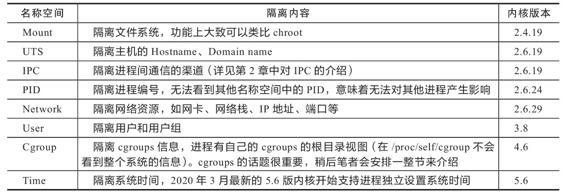

#### 11.1.3 隔离资源：cgroups

如果要让一台物理计算机中的各个进程看起来像独享整台虚拟计算机，不仅要隔离各自进程的访问操作，还必须能独立控制分配给各个进程的资源使用配额，不然，一个进程发生了内存溢出或者占满了处理器，其他进程就莫名其妙地被牵连挂起，这样肯定算不上完美的隔离。

Linux系统解决以上问题的方案是控制群组（Control Groups，目前常用的简写为cgroups）。它与名称空间一样都是直接由内核提供功能，用于隔离或者分配并限制某个进程组能够使用的资源配额，资源配额包括处理器时间、内存大小、磁盘I/O速度等，具体可以参见表11-2。

表11-2　Linux控制群组子系统的功能

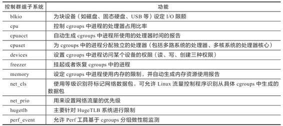

cgroups项目最早是由Google的工程师（主要是Paul Menage和Rohit Seth）在2006年发起的，当时取的名字就叫作“进程容器”（Process Container），不过“容器”这个名词的定义在那时候尚不如今天清晰，在不同场景中常有不同的含义，为避免混乱，2007年这个项目才被重命名为cgroups，并在2008年合并到2.6.24版内核后正式对外发布，这一阶段的cgroups被称为“第一代cgroups”。2016年3月发布的Linux Kernel 4.5版本中，搭载了由Facebook工程师（主要是Tejun Heo）重新编写的“第二代cgroups”，其关键改进是支持统一层级管理（Unified Hierarchy），使得管理员能更加清晰、精确地控制资源的层级关系。目前这两个版本的cgroups在Linux内核代码中是并存的，稍后介绍的Docker暂时仅支持第一代cgroups。

#### 11.1.4 封装系统：LXC

当文件系统、访问、资源都可以被隔离后，容器已经有了降生所需的全部前置条件，并且Linux的开发者们也已经明确地看到了这一点。为降低普通用户综合使用namespaces、cgroups这些低级特性的门槛，2008年Linux Kernel 2.6.24刚刚开始提供cgroups的同一时间，就又马上发布了名为Linux容器（LinuX Container，LXC）的系统级虚拟化功能。

此前，在Linux上并不是没有系统级虚拟化的解决方案，譬如传统的OpenVZ和Linux-VServer，它们都能够实现容器隔离，并且只会有很低的性能损失（按OpenVZ提供的数据，只会有1%～3%的损失），但都是非官方的技术，使用它们的最大阻碍是系统级虚拟化必须要有内核的支持，为此使用时就只能通过非官方内核补丁的方式修改标准内核，才能获得那些原本在内核中不存在的能力。

LXC带着令人瞩目的光环登场，它的出现促使“容器”从一个阳春白雪的只流传于开发人员口中的技术词汇，逐渐向整个软件业的公共概念、共同语言发展，就如同今天的“服务器”“客户端”和“互联网”一样。相信你现在肯定会好奇为什么现在一提到容器，大家首先联想到的是Docker而不是LXC？为什么去问10个开发人员，至少有9个听过Docker，但可能只有1个听说过LXC？

LXC的出现肯定受到了OpenVZ和Linux-VServer的启发，站在巨人的肩膀上过河并没有什么不对。可惜的是，LXC在设定自己的发展目标时，也被前辈们的影响所局限住了。LXC眼中的容器与OpenVZ和Linux-VServer定义的并无差别，是一种封装系统的轻量级虚拟机，而Docker眼中的容器则是一种封装应用的技术手段。这两种封装理念在技术层面并没有什么本质区别，但应用效果差异巨大。举个具体例子，如果你要建设一个LAMP（Linux、Apache、MySQL、PHP）应用，按照LXC的思路，你应该先编写或者寻找到LAMP的template（可以暂且不准确地类比为LXC版本的Dockerfile吧），以此构造出一个安装了LAMP的虚拟系统。如果从部署虚拟机的角度来看，这还挺方便的，作为那个时代（距今也就十年）的系统管理员，所有软件、补丁、配置都是自己搞定的，部署一台新虚拟机要花费一两天时间很正常，而有了LXC的template，一下子都可以装好。但是，作为一名现代的系统管理员，这里的问题就相当大了，如果我想把LAMP改为LNMP（Linux、Nginx、MySQL、PHP），该怎么办？如果我想把LAMP里的MySQL 5调整为MySQL 8，该怎么办？此时只能寻找或者自己编写新的template来解决。但是，这台虚拟机的软件、版本都配置对了，下一台要构建LYME或者MEAN，又该怎么办？以封装系统为出发点，仍是按照先装系统再装软件的思路，就永远无法在一两分钟甚至十几秒钟就构造出一个合乎要求的软件运行环境，也决定了LXC不可能形成今天的容器生态，所以，接下来舞台的聚光灯落到了Docker身上。

#### 11.1.5 封装应用：Docker

2013年宣布开源的Docker毫无疑问是容器发展历史上里程碑式的发明，然而Docker的成功似乎没有太多技术驱动的成分。至少对早期的Docker而言，确实没有什么能构成壁垒的技术，它的容器化能力直接来源于LXC，它的镜像分层组合的文件系统直接来源于AUFS。在Docker开源后不久，有人仅用一百多行Shell脚本便实现了Docker的核心功能（名为Bocker[1]，提供了docker build/pull/images/ps/run/exec/logs/commit/rm/rmi等功能）。

那为何历史选择了Docker，而不是LXC或者其他容器技术呢？对于这个问题，笔者将引用（转述非直译，有所精简）DotCloud公司（当年创造Docker的公司，已于2016年倒闭）创始人Solomon Hykes在Stackoverflow上的一段问答来回应。

额外知识

为什么要用Docker而不是LXC？

Docker除了包装来自Linux内核的特性之外，它的价值还体现在如下几点上。

·跨机器的绿色部署：Docker定义了一种将应用及其所有的环境依赖都打包到一起的格式，仿佛它原本就是绿色软件一样。而LXC并没有提供这样的能力，使用LXC部署的新机器的很多细节都需要人的介入，部署后虚拟机的环境几乎肯定会跟原本部署程序的机器有所差别。

·以应用为中心的封装：Docker封装应用而非封装机器的理念贯穿了它的设计、API、界面、文档等多个方面。相比之下，LXC将容器视为对系统的封装，这限制了容器的发展。

·自动构建：Docker提供了开发人员在容器中构建产品的全部支持，使得开发人员无须关注目标机器的具体配置即可使用任意的构建工具链在容器中自动构建出最终产品。

·多版本支持：Docker支持像Git一样管理容器的连续版本，进行检查版本间差异、提交或者回滚等操作。从历史记录中你可以看到该容器是如何一步一步构建成的，并且只增量上传或下载新版本中变更的部分。

·组件重用：Docker允许将任何现有容器作为基础镜像来使用，以此构建出更加专业的镜像。

·共享：Docker拥有公共的镜像仓库，成千上万的Docker用户可以在上面上传自己的镜像，同时也可以使用他人上传的镜像。

·工具生态：Docker开放了一套可自动化和自行扩展的接口，在此之上还有很多工具来扩展其功能，譬如容器编排、管理界面、持续集成等。

——Solomon Hykes，Stackoverflow，2013

以上这段回答也同时被收录到Docker官网的FAQ上[2]，从Docker开源至今从未改变。促使Docker一问世就惊艳世间的，不是什么黑科技式的秘密武器，而是其符合历史潮流的创意与设计理念，以及充分开放的生态运营。可见，在正确的时候，正确的人手上有一个优秀的点子，确实有机会引爆一个时代。图11-1是Docker开源后一年（截至2014年12月）获得的成绩。

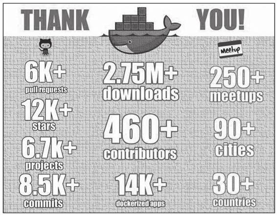

图11-1　受到广泛认可的Docker

从开源到现在也只过了短短数年时间，Docker已成为软件开发、测试、分发、部署等各个环节都难以或缺的基础支撑，自身的架构也发生了相当大的改变，被分解为由Docker Client、Docker Daemon、Docker Registry、Docker Container等子系统，以及Graph、Driver、libcontainer等各司其职的模块组成，此时再说一百多行脚本就能实现Docker核心功能，或者Docker没有太高的技术含量，就不再合适了。

2014年，Docker开源了自己用Go语言开发的libcontainer。这是一个越过LXC直接操作namespaces和cgroups的核心模块，它使得Docker能直接与系统内核打交道，而不必依赖LXC来提供容器化隔离能力。

2015年，在Docker的主导和倡议下，多家公司联合制定了“开放容器交互标准”（Open Container Initiative，OCI），这是一个关于容器格式和运行时的规范文件，其中包含运行时标准（runtime-spec）、容器镜像标准（image-spec）和镜像分发标准（distribution-spec，此标准还未正式发布）。运行时标准定义了应该如何运行一个容器、如何管理容器的状态和生命周期、如何使用操作系统的底层特性（namespaces、cgroups、pivot_root等）；容器镜像标准规定了容器镜像的格式、配置、元数据的格式，可以理解为对镜像的静态描述；镜像分发标准则规定了镜像推送和拉取的网络交互过程。

为了符合OCI标准，Docker推动自身的架构继续向前演进，首先将libcontainer独立出来，封装重构成runC项目，并捐献给Linux基金会管理。runC是OCI运行时的首个参考实现，提出了“让标准容器无所不在”的口号。为了能够兼容所有符合标准的OCI运行时实现，Docker进一步重构了Docker Daemon子系统，将其中与运行时交互的部分抽象为containerd项目，这是一个负责管理容器执行、分发、监控、网络、构建、日志等功能的核心模块，内部会为每个容器运行时创建一个containerd-shim适配进程，默认与runC搭配工作，但也可以切换到其他OCI运行时实现上（然而实际并没做到，最后containerd仍是紧密绑定于runC）。2016年，Docker把containerd项目捐献给CNCF管理。runC与containerd两个项目的捐赠托管，既是Docker对开源信念执着的追求，也是Docker在众多云计算大厂夹击下无奈的自救，这两个项目将成为未来Docker消亡和存续的伏笔。（看到本节末尾你就能理解这句矛盾的话了。）Docker、containerd和runC的交互关系如图11-2所示。

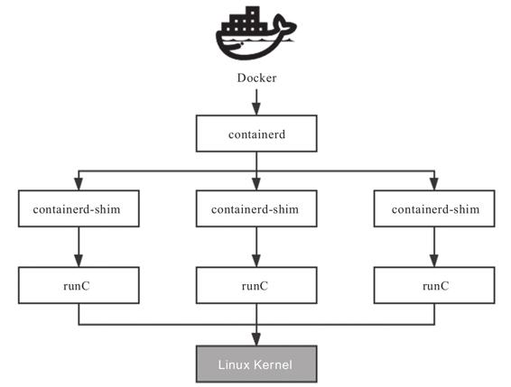

图11-2　Docker、containerd和runC的交互关系

以上笔者列举的这些Docker推动的开源与标准化工作，既是对Docker为开源乃至整个软件业做出贡献的赞赏，又是为后面介绍容器编排时讲述当前容器引擎的混乱关系做的铺垫。Docker目前无疑在容器领域具有统治地位，但统治的稳固程度不仅没到高枕无忧，说是危机四伏都不为过。目前已经有可见的、足以威胁Docker地位的潜在可能性正在酝酿，这是源于虽然Docker赢得了容器战争，但Docker Swarm却输掉了容器编排战争。从结果回望当初，Docker赢得容器战争有一些偶然，Docker Swarm输掉的容器编排战争却是必然的。

[1] 下载地址：https://github.com/p8952/bocker。

[2] 地址：https://docs.docker.com/engine/faq/。

#### 11.1.6 封装集群：Kubernetes

如果说以Docker为代表的容器引擎是将软件的发布流程从分发二进制安装包转变为直接分发虚拟化后的整个运行环境，令应用得以实现跨机器的绿色部署，那以Kubernetes为代表的容器编排框架就是把大型软件系统运行所依赖的集群环境也进行了虚拟化，令集群得以实现跨数据中心的绿色部署，并能够根据实际情况自动扩缩。

容器的崛起之路讲到Docker和Kubernetes这个阶段，已经不再是介绍历史了，从这里开始发生的变化都是近几年软件行业中的热点事件，也是本章要讨论的主要话题。现在笔者暂时不打算介绍Kubernetes的技术细节，而是将它们留到后面的文章中进行更详细的解析。本节我们首先从宏观层面去理解Kubernetes的诞生与演变的驱动力，这对正确理解未来云原生的发展方向至关重要。

Kubernetes可谓出身名门，前身是Google内部已运行多年的集群管理系统Borg，于2014年6月使用Go语言完全重写后开源。自Kubernetes诞生之日起，只要与云计算稍微扯上关系的业界巨头都对Kubernetes争相追捧，IBM、Red Hat、Microsoft、VMware和华为都是它最早期的代码贡献者。此时，云计算从实验室到工业化应用已经有十个年头，然而大量应用使用云计算的方式仍停滞在传统IDC（Internet Data Center，网络数据中心）时代，仅仅是用云端的虚拟机代替了传统的物理机。尽管早在2013年，Pivotal（持有Spring Framework和Cloud Foundry的公司）就提出了“云原生”的概念，但是要实现服务化、具备韧性（Resilience）、弹性（Elasticity）、可观测性（Observability）的软件系统十分困难，在当时基本只能依靠架构师和程序员高超的个人能力，云计算本身帮不上什么忙。在云的时代不能充分利用云的强大能力，这让云计算厂商无比遗憾，也无比焦虑。直到Kubernetes横空出世，大家才等到了破局的希望，认准了这就是云原生时代的操作系统，是让复杂软件在云计算下获得韧性、弹性、可观测性的最佳路径，也是让厂商们推动云计算时代加速到来的关键引擎之一。

2015年7月，Kubernetes发布了第一个正式版本1.0版，同时Google宣布与Linux基金会共同筹建云原生基金会（CNCF），并且将Kubernetes托管到CNCF，成为其第一个项目。随后，Kubernetes以摧枯拉朽之势打败了容器编排领域的其他竞争对手，哪怕Docker Swarm有着Docker在容器引擎方面的先天优势，甚至DotCloud后来将Swarm直接内置入Docker中，都未能稍稍阻挡Kubernetes前进的步伐。Kubernetes与容器引擎的调用关系如图11-3所示。

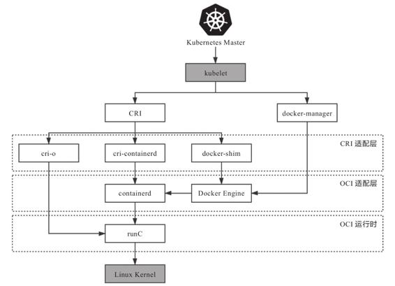

图11-3　Kubernetes与容器引擎的调用关系

Kubernetes的成功与Docker的成功并不相同。Docker靠的是优秀的理念，以一个“好点子”引爆了一个时代。笔者相信就算没有Docker也会有Cocker或者Eocker的出现，但由成立仅三年的DotCloud公司（三年后又倒闭）做成这样的产品确实有一定的偶然性。而Kubernetes的成功不仅有Google深厚的技术功底作为支撑，而且有领先时代的设计理念，更加关键的是Kubernetes的出现符合所有云计算大厂的切身利益，有着业界巨头不遗余力的广泛支持，所以它的成功是一种必然。

Kubernetes与Docker的关系十分微妙，把握住两者关系的变化过程，是理解Kubernetes架构演变与CRI、OCI规范的良好线索。在Kubernetes开源的早期，它是完全依赖且绑定于Docker的，并没有过多考虑日后有使用其他容器引擎的可能性。直至Kubernetes 1.5版本之前，Kubernetes管理容器的方式都是通过内部的DockerManager向Docker Engine以HTTP方式发送指令，通过Docker来完成镜像的增删改查操作，如图11-3最右边线路的箭头所示。（图中的kubelet是集群节点中的代理程序，负责与管理集群的Master通信，其他节点的含义将在后文介绍。）将这个阶段Kubernetes与容器引擎的调用关系捋直，并结合上一节提到的Docker捐献containerd与runC项目后重构的调用，完整的调用链如下所示：

Kubernetes Master→kubelet→DockerManager→Docker Engine→containerd→runC

2016年，Kubernetes 1.5版本开始引入容器运行时接口（Container Runtime Interface，CRI），这是一个定义容器运行时应该如何接入kubelet的规范标准，从此Kubernetes内部的DockerManager就被更为通用的KubeGenericRuntimeManager所替代（实际上在1.6.6版本之前都仍然可以看到DockerManager），kubelet与KubeGenericRuntimeManager之间通过gRPC协议通信。由于CRI是在Docker之后才发布的规范，Docker是肯定不支持CRI的，所以Kubernetes又提供了DockerShim服务作为Docker与CRI的适配层，由它与Docker Engine以HTTP形式通信，实现了原来DockerManager的全部功能。此时，Docker对Kubernetes来说只是一项默认依赖，而非之前的无可或缺了，它们的调用链为：

Kubernetes Master→kubelet→KubeGenericRuntimeManager→DockerShim→Docker Engine→containerd→runC

2017年，由Google、Red Hat、Intel、SUSE、IBM联合发起的CRI-O（Container Runtime Interface Orchestrator）项目发布了首个正式版本。从名字就可以看出，一方面，它肯定是完全遵循CRI规范实现的，另一方面，它可以支持所有符合OCI运行时标准的容器引擎，默认仍然是与runC搭配工作，若要换成Clear Containers、Kata Containers等其他OCI运行时引擎也完全没有问题。虽然开源版Kubernetes是使用CRI-O、cri-containerd抑或是DockerShim作为CRI实现，完全可以由用户自由选择（根据用户宿主机的环境选择），但在Red Hat自己扩展定制的Kubernetes企业版，即OpenShift 4中，调用链中已经没有了Docker Engine的身影：

Kubernetes Master→kubelet→KubeGenericRuntimeManager→CRI-O→runC

由于此时Docker在容器引擎中的市场份额仍然占有绝对优势，对于普通用户来说，如果没有明确的收益，就没有什么动力把Docker换成别的引擎，所以CRI-O即使摆出了直接挖掉Docker根基的凶悍姿势，也并没有给Docker带来太多即时可见的影响，不过能够想象此时Docker心中肯定充斥了难以言喻的危机感。

2018年，由Docker捐献给CNCF的containerd项目，在CNCF的精心孵化下发布了1.1版。1.1版与1.0版的最大区别是此时它完美地支持了CRI标准，这意味着原本用作CRI适配器的cri-containerd从此不再需要。此时，再观察Kubernetes到容器运行时的调用链，你会发现调用步骤会比通过DockerShim、Docker Engine与containerd交互的步骤减少两步，这又意味着用户只要愿意抛弃Docker，在容器编排上便可至少省略一次HTTP调用，获得性能上的收益，且根据Kubernetes官方给出的测试数据[1]，这些免费的收益还相当可观。Kubernetes从1.10版本宣布开始支持containerd 1.1，此时在调用链中已经能够完全抹去Docker Engine的存在：

Kubernetes Master→kubelet→KubeGenericRuntimeManager→containerd→runC

今天，要使用哪一种容器运行时取决于安装Kubernetes时宿主机上的容器运行时环境，但对于阿里云ACK、腾讯云TKE等直接提供Kubernetes容器环境的云计算厂商来说，采用的容器运行时普遍都已是containerd，毕竟运行性能对它们来说就是核心生产力和竞争力。

未来，随着Kubernetes持续发展壮大，Docker Engine经历从不可或缺、默认依赖、可选择、直到淘汰是大概率事件，这件事情表面上是Google、Red Hat等云计算大厂联手所为，但实际淘汰它的还是技术发展的潮流趋势，就如同Docker诞生时依赖LXC，到最后用libcontainer取代LXC一般。同时，我们也该看到事情的另一面，现在连LXC都还没有被淘汰，反倒发展出了更加专注于与OpenVZ等系统级虚拟化竞争的LXD，相信Docker本身也很难彻底消亡，如已经习惯使用的CLI界面，已经形成成熟生态的镜像仓库等都应该会长期存在，只是在容器编排领域，未来的Docker很可能只会以runC和containerd的形式存续下去，毕竟它们最初都源于Docker。

[1] 测试数据：https://kubernetes.io/blog/2018/05/24/kubernetes-containerd-integration-goes-ga/。

### 11.2 以容器构建系统

自从Docker提出的“以封装应用为中心”的容器发展理念成功取代LXC的“以封装系统为中心”的理念以后，一个容器封装一个单进程应用已经成为被广泛认可的最佳实践。然而单体时代过去之后，分布式系统里应用的概念已不再等同于进程，此时的应用需要多个进程共同协作，通过集群的形式对外提供服务，而以虚拟化方法实现这个目标的过程就被称为容器编排（Container Orchestration）。

容器之间顺畅地交互通信是协作的核心需求，但容器协作并不仅仅是将容器以高速网络互相连接而已。如何调度容器，如何分配资源，如何扩缩规模，如何最大限度地接管系统中的非功能特性，如何让业务系统尽可能免受分布式复杂性的困扰，都是容器编排框架必须考虑的问题。只有恰当解决了这一系列问题，云原生应用才有可能获得比传统应用更高的生产力。

#### 11.2.1 隔离与协作

笔者并不打算过多介绍Kubernetes具体有哪些功能，例如Kubernetes由Pod、Node、Deployment、ReplicaSet等各种类型的资源组成的服务、集群管理平面与节点之间如何工作、每种资源该如何配置使用等。如果你希望了解这方面信息，可以从Kubernetes官网的文档库或任何一本以Kubernetes为主题的使用手册中得到。

笔者真正希望说清楚的问题是“为什么Kubernetes会设计成现在这个样子”“为什么以容器构建系统应该这样做”，而寻找这些问题的答案最好是从它们的设计意图出发。为此，笔者虚构了一系列从简单到复杂的场景供你代入其中，理解并解决这些场景中的问题，并不要求你对Kubernetes有多深入的了解，但要求你至少使用过Kubernetes和Docker，基本了解它们的核心功能与命令；此外还会涉及一点儿Linux系统内核资源隔离的基础知识，别担心，只要你读懂了上一节，就已经完全够用了。

现在来设想一下，如果让你设计一套容器编排系统，协调各种容器共同完成一项工作，会遇到什么问题？你会如何着手解决？让我们从最简单的场景出发。

场景一：假设你现在有两个应用，一个是Nginx，另一个是为该Nginx收集日志的Filebeat，你希望将它们封装为容器镜像，以方便日后分发。

最直接的方案就是将Nginx和Filebeat直接编译成同一个容器镜像，这是可以做到的，而且并不复杂，然而这样做会埋下很大的隐患：它违背了Docker提倡的单个容器封装单进程应用的最佳实践。Docker设计的Dockerfile只允许有一个ENTRYPOINT，这并非无故添加的人为限制，而是因为Docker只能通过监视PID为1的进程（即由ENTRYPOINT启动的进程）的运行状态来判断容器的工作状态是否正常，然后根据状态决定是否执行清理自动重启等操作。设想一下，即使我们使用了supervisord之类的进程控制器来解决同时启动Nginx和Filebeat进程的问题，如果它们因某种原因不停发生崩溃、重启，那Docker也无法察觉到，它只能观察到supervisord的运行状态，因此，以上需求会理所当然地演化成场景二。

场景二：假设你现在有两个Docker镜像，其中一个封装了HTTP服务，为便于称呼，我们称它为Nginx容器，另一个封装了日志收集服务，我们称它为Filebeat容器。现在要求Filebeat容器能收集Nginx容器产生的日志信息。

场景二依然不难解决，只要在Nginx容器和Filebeat容器启动时，分别将它们的日志目录和收集目录挂载为宿主机同一个磁盘位置的Volume即可，这种操作在Docker中是十分常用的容器间的信息交换手段。不过，容器间信息交换的不仅仅是文件系统，假如此时我又引入了一个新的工具——confd（Linux下的一种配置管理工具，作用是根据配置中心（etcd、ZooKeeper、Consul）的变化自动更新Nginx的配置），这里便又会遇到新的问题。confd需要向Nginx发送HUP信号，以便通知Nginx配置已经发生了变更，而发送HUP信号自然要求confd与Nginx能够进行IPC通信才行。尽管共享IPC名称空间不如共享Volume常见，但Docker同样支持了该功能。docker run提供了--ipc参数，用于把多个容器挂载到同一个父容器的IPC名称空间之下，以实现容器间共享IPC名称空间的需求。类似地，如果要共享UTS名称空间，可以使用--uts参数；如果要共享网络名称空间，则可以使用--net参数。

以上便是Docker针对场景二这种不跨机器的多容器协作所给出的解决方案，自动地为多个容器设置好共享名称空间其实就是Docker Compose提供的核心能力。这种针对具体应用需求来共享名称空间的方案，确实可以工作，却并不够优雅，也谈不上有什么扩展性。容器的本质是对cgroups和namespaces所提供的隔离能力的一种封装，在Docker提倡的单进程封装的理念影响下，容器蕴含的隔离性多了仅针对单个进程的额外限制，而Linux的cgroups和namespaces原本都是针对进程组而非单个进程来设计的，同一个进程组中的多个进程天然就可以共享相同的访问权限与资源配额。如果现在我们把容器与进程在概念上对应起来，那容器编排的第一个扩展点，就是要找到容器领域中与“进程组”相对应的概念，这是实现容器从隔离到协作的第一步，在Kubernetes的设计里，这个对应物叫作Pod。

额外知识

Pod名字的由来与含义

Pod的概念在容器正式出现之前的Borg系统中就已经存在了。从Google发表的“Large-Scale Cluster Management at Google with Borg”[1]可以看出，Kubernetes时代的Pod整合了Borg时代的“Prod”（Production Task的缩写）与“Non-Prod”的职能。由于Pod一直没有权威的中文翻译，笔者在后续文章中会尽量用英文指代，偶尔需要中文的场合就使用Borg中Prod的译法（即“生产任务”）来指代。

有了“容器组”的概念，场景二的问题便只需要将多个容器放到同一个Pod中即可解决。扮演容器组的角色，满足容器共享名称空间的需求，是Pod的两大最基本职责之一，同处于一个Pod内的多个容器，相互之间以超亲密的方式协作。请注意，“超亲密”在这里并非某种带强烈感情色彩的形容词，而是一种有具体定义的协作程度。对于普通非亲密的容器，它们一般以网络交互方式（其他譬如共享分布式存储来交换信息也算跨网络）协作；对于亲密协作的容器，它们一般被调度到同一个集群节点上，可以通过共享本地磁盘等方式协作；而超亲密的协作是特指多个容器位于同一个Pod的特殊关系，它们将默认共享如下内容。

·UTS名称空间：所有容器都有相同的主机名和域名。

·网络名称空间：所有容器都共享一样的网卡、网络栈、IP地址等。因此，同一个Pod中不同容器占用的端口不能冲突。

·IPC名称空间：所有容器都可以通过信号量或者POSIX共享内存等方式通信。

·时间名称空间：所有容器都共享相同的系统时间。

同一个Pod的容器，只有PID名称空间和文件名称空间默认是隔离的。PID的隔离令每个容器都有独立的进程ID编号，它们封装的应用进程就是PID为1的进程，可以通过Pod元数据定义中的spec.shareProcessNamespace来改变这点。一旦要求共享PID名称空间，容器封装的应用进程就不再具有PID为1的特征了，这有可能导致部分依赖该特征的应用出现异常。在文件名称空间方面，容器要求文件名称空间的隔离是很理所当然的需求，因为容器需要相互独立的文件系统以避免冲突，但容器间可以共享存储卷，这是通过Kubernetes的Volume来实现的。

额外知识

Kubernetes中Pod名称空间共享的实现细节

Pod内部多个容器共享UTS、IPC、网络等名称空间是通过一个名为Infra Container的容器来实现的，这个容器是整个Pod中第一个启动的容器，只有几十万字节大小（代码只有很短的几十行[2]），Pod中的其他容器都会以Infra Container作为父容器，UTS、IPC、网络等名称空间实质上都来自Infra Container容器。

如果容器设置为共享PID名称空间，那么Infra Container中的进程将作为PID 1进程，而其他容器的进程将以它的子进程的方式存在，此时将由Infra Container来负责进程管理（譬如清理僵尸进程）、感知状态和传递状态。

由于Infra Container的代码除了注册SIGINT、SIGTERM、SIGCHLD等信号的处理器外，就只是一个以pause()方法为循环体的无限循环，永远处于Pause状态，所以也常被称为“Pause Container”。

Pod的另外一个基本职责是实现原子性调度，如果容器编排不跨越集群节点，是否具有原子性都无关紧要。但是在集群环境中，在容器可能跨机器调度时，这个特性就变得非常重要。如果以容器为单位来调度，不同的容器就有可能被分配到不同的机器上。两台机器之间本来就是物理隔离，依靠网络连接的，这时候谈什么名称空间共享、cgroups配额共享都将毫无意义，我们由此将场景二又演化成以下场景三。

场景三：假设你现在有Filebeat、Nginx两个Docker镜像，在一个具有多个节点的集群环境下，要求每次调度都必须让Filebeat和Nginx容器运行于同一个节点上。

两个关联的协作任务必须一起调度的需求在容器出现之前就存在已久，譬如在传统的多线程（或多进程）并发调度中，如果两个线程（或进程）的工作是强依赖的，单独给其中一个分配处理时间、而另一个被挂起会导致程序无法工作，如此就有了协同调度（Coscheduling）的概念，以保证一组紧密联系的任务能够被同时分配资源。如果我们在容器编排中仍然坚持将容器视为调度的最小粒度，那对容器运行所需资源的需求声明就只能设定在容器上，这样集群每个节点剩余资源越紧张，单个节点无法容纳全部协同容器的概率就越大，协同的容器被分配到不同节点的可能性就越高。

协同调度是十分麻烦的，实现起来要么很低效，譬如Apache Mesos的Resource Hoarding调度策略，就要等所有需要调度的任务都完备后才会开始分配资源；要么很复杂，譬如Google就曾针对Borg的下一代Omega系统发表过论文“Omega:Flexible,Scalable Schedulers for Large Compute Clusters”[3]，介绍Omega是如何通过乐观并发（Optimistic Concurrency）、冲突回滚的方式做到高效率且高复杂度的协同调度的。但是如果将运行资源的需求声明定义在Pod上，直接以Pod为最小的原子单位来实现调度，由于多个Pod之间必定不存在超亲密的协同关系，只会通过网络非亲密地协作，就没有协同的说法，自然也不需要考虑复杂的调度了。关于Kubernetes的具体调度实现，笔者会在第14章中展开讲解。

Pod是隔离与调度的基本单位，也是我们接触的第一种Kubernetes资源。Kubernetes将一切皆视为资源，不同资源之间依靠层级关系相互组合、协作的这个思想是贯穿Kubernetes整个系统的两大核心设计理念之一，不仅在容器、Pod、主机、集群等计算资源上是这样，如图11-4所示，在工作负载、持久存储、网络策略、身份权限等其他领域中也都有一致的体现。

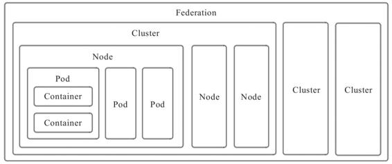

图11-4　Kubernetes的计算资源

由于Pod是Kubernetes中最重要的资源，又是资源模型中一种仅在逻辑上存在、没有物理对应的概念（因为对应的“进程组”也只是个逻辑概念），是其他编排系统没有的概念，所以笔者专门花费了一些篇幅去介绍它的设计意图，而不是像帮助手册那样直接给出它的作用和特性。对于Kubernetes中的其他计算资源，像Node、Cluster等都有切实的物理对应物，相信你很容易就能理解，所以笔者就不逐一介绍了，仅将它们的设计意图列举如下。

·容器（Container）：延续了自Docker以来一个容器封装一个应用进程的理念，是镜像管理的最小单位。

·生产任务（Pod）：补充了容器化后缺失的与进程组对应的“容器组”的概念，Pod中的容器共享UTS、IPC、网络等名称空间，是资源调度的最小单位。

·节点（Node）：对应于集群中的单台机器，这里的机器既可以是生产环境中的物理机，也可以是云计算环境中的虚拟节点，节点是处理器和内存等资源的资源池，是硬件单元的最小单位。

·集群（Cluster）：对应于整个集群，Kubernetes提倡面向集群来管理应用。当你要部署应用的时候，只需要通过声明式API将你的意图写成一份元数据（Manifest），将它提交给集群即可，而无须关心它具体分配到哪个节点（尽管通过标签选择器完全可以控制它分配到哪个节点，但一般不需要这样做）、如何实现Pod间通信、如何保证韧性与弹性，等等，所以集群是处理元数据的最小单位。

·集群联邦（Federation）：对应于多个集群，通过集群联邦可以统一管理多个Kubernetes集群，它的一种常见应用是能满足跨可用区域多活、跨地域容灾的需求。

[1] 下载地址：https://pdos.csail.mit.edu/6.824/papers/borg.pdf。

[2] 下载地址：https://github.com/kubernetes/kubernetes/tree/master/build/pause。

[3] 下载地址：https://static.googleusercontent.com/media/research.google.com/zh-CN//pubs/archive/41684.pdf。

#### 11.2.2 韧性与弹性

笔者曾看过一部叫作《泡泡男孩》的电影，讲述了一个体内没有任何免疫系统的小男孩，终日只能生活在无菌的圆形气球里，对常人来说不值一提的细菌，都能直接威胁到他的性命。小男孩尽管能够降生于世间，但并不能真正与世界交流，这种生命是极度脆弱的。

真实世界的软件系统与电影世界中的小男孩亦具有可比性。让容器得以相互连通、相互协作仅仅是以容器构建系统的第一步，我们不仅希望得到一个能够运行起来的系统，还希望得到一个能够健壮运行、能够抵御意外与风险的系统。在Kubernetes的支持下，你确实可以通过直接创建Pod将应用运行起来，但这样的应用就如同电影中只能存活在气球中的小男孩一般脆弱，无论是软件缺陷、意外操作或者硬件故障，都可能导致在复杂协作过程中的某个容器出现异常，进而出现系统性崩溃。为此，架构师专门设计了服务容错的策略和模式，Kubernetes作为云原生时代的基础设施，也尽力帮助程序员以最小的代价来实现容错，为系统健壮运行提供底层支持。

控制器模式是继资源模型之后，本节介绍的另一个Kubernetes核心设计理念，而如何实现具有韧性与弹性的系统是展示Kubernetes控制器设计模式的最好示例。下面，我们就从如何解决场景四的问题开始。

场景四：假设有一个由数十个Node、数百个Pod、近千个Container所组成的分布式系统，要避免系统因为外部流量压力、代码缺陷、软件更新、硬件升级、资源分配等原因而出现中断，作为管理员，你希望编排系统为你提供哪种支持？

作为用户，当然最希望容器编排系统能自动把所有意外因素都消灭掉，让任何一个服务都永远健康，永不出错。但永不出错的服务是不切实际的，所以只能退而求其次，让编排系统在这些服务出现问题或者运行状态不正确的时候，能自动调整成正确的状态。这种需求听起来也是贪心的，却已经具备足够的可行性，相应的解决办法在工业控制系统里已经有非常成熟的应用，叫作控制回路（Control Loop）。

Kubernetes官方文档是以房间中空调自动调节温度为例介绍了控制回路的一般工作过程：当你设置好了温度，就是告诉空调你对温度的“期望状态”（Desired State），而传感器测量出的房间的实际温度是“当前状态”（Current State）。根据当前状态与期望状态的差距，由控制器通过控制空调的制冷开关来调节温度，使当前状态逐渐接近期望状态，如图11-5所示。

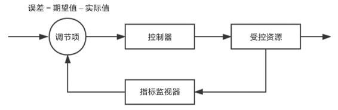

图11-5　控制回路

将这种控制回路的思想应用到容器编排上，自然会为Kubernetes中的资源附加上期望状态与实际状态两项属性。不论是已经出现在上节的资源模型中，用于抽象容器运行环境的计算资源，还是没有登场的另一部分对应于安全、服务、令牌、网络等功能的资源，用户要想使用这些资源来实现某种需求，就不提倡像平常编程那样去调用某个或某一组方法来达成目的，而是要通过描述清楚这些资源的期望状态，由Kubernetes中对应监视这些资源的控制器来驱动资源的实际状态逐渐向期望状态靠拢。这种交互风格被称为Kubernetes的声明式API，如果你已有实际操作Kubernetes的经验，那你日常在元数据文件中定义的spec字段所描述的便是资源的期望状态。

额外知识

Kubernetes的资源对象与控制器

目前，Kubernetes已支持相当多的资源对象，并且可以使用CRD（Custom Resource Definition，用户资源自定义）来自定义扩充，可以使用kubectl api-resources来查看它们。笔者根据用途对这些资源对象进行了分类。

·用于描述如何创建、销毁、更新、扩缩Pod，包括Autoscaling（HPA）、CronJob、DaemonSet、Deployment、Job、Pod、ReplicaSet、StatefulSet。

·用于配置信息的设置与更新，包括ConfigMap、Secret。

·用于持久性地存储文件或者Pod之间的文件共享，包括Volume、LocalVolume、PersistentVolume、PersistentVolumeClaim、StorageClass。

·用于维护网络通信和服务访问的安全，包括SecurityContext、ServiceAccount、Endpoint、NetworkPolicy。

·用于定义服务与访问，包括Ingress、Service、EndpointSlice。

·用于划分虚拟集群、节点和资源配额，包括Namespace、Node、ResourceQuota。

这些资源对象在控制器管理框架中一般都会有相应的控制器来管理，下面列举一些常见的控制器，并按照它们的启动情况分类如下。

·必须启用的控制器：EndpointController、ReplicationController、PodGCController、ResourceQuotaController、NamespaceController、ServiceAccountController、GarbageCollectorController、DaemonSetController、JobController、Deployment-Controller、ReplicaSetController、HPAController、DisruptionController、StatefulSetController、CronJobController、CSRSigningController、CSRApproving-Controller、TTLController。

·默认启用的可选控制器，可通过选项禁止：TokenController、Node-Controller、ServiceController、RouteController、PVBinderController、AttachDetachController。

·默认禁止的可选控制器，可通过选项启用：BootstrapSignerController、Token-CleanerController。

与资源相对应，只要是实际状态有可能发生变化的资源对象，通常都会由对应的控制器进行追踪，每个控制器至少会追踪一种类型的资源对象。为了管理众多资源控制器，Kubernetes设计了统一的控制器管理框架（kube-controller-manager）来维护这些控制器的正常运作，以及统一的指标监视器（kube-apiserver）来为控制器提供其工作时追踪资源的度量数据。

由于毕竟不是在写Kubernetes的操作手册，所以笔者只能以两三种资源和控制器为代表来举例说明，而无法将每个控制器都详细展开讲解。只要将场景四进一步具体化，转换成下面的场景五，便可以得到一个很好的例子，这里以部署控制器（Deployment Controller）、副本集控制器（ReplicaSet Controller）和自动扩缩控制器（HPA Controller）为例来介绍Kubernetes控制器模式的工作原理。

场景五：通过服务编排，对任何分布式系统自动实现以下三种通用的能力。

1）Pod出现故障时，能够自动恢复，不中断服务。

2）Pod更新程序时，能够滚动更新，不中断服务。

3）Pod遇到压力时，能够水平扩展，不中断服务。

前文曾提到虽然Pod本身也是资源，完全可以直接创建，但由Pod直接构成的系统是十分脆弱的，在实际生产中并不提倡。正确的做法是通过副本集（ReplicaSet）来创建Pod。ReplicaSet也是一种资源，属于工作负荷类，代表一个或多个Pod副本的集合。你可以在ReplicaSet资源的元数据中描述你期望的Pod副本的数量（即spec.replicas的值）。当ReplicaSet成功创建之后，副本集控制器就会持续跟踪该资源，如果一旦有Pod发生崩溃退出，或者状态异常（默认是靠进程返回值，你还可以在Pod中设置探针，以自定义的方式告诉Kubernetes出现何种情况时Pod才算状态异常），ReplicaSet都会自动创建新的Pod来替代异常的Pod；如果异常出现了额外数量的Pod，也会被ReplicaSet自动回收，总之就是确保在任何时候集群中的这个Pod副本的数量都向期望状态靠拢。

ReplicaSet本身就能满足场景五中的第一项能力，即可以保证Pod出现故障时自动恢复，但是在升级程序版本时，ReplicaSet不得不主动中断旧的Pod的运行，重新创建新的Pod，这会造成服务中断。对于那些不允许中断的业务，以前的Kubernetes曾经提供了kubectl rolling-update命令来辅助实现滚动更新。

所谓滚动更新（Rolling Update）是指先停止少量旧副本，维持大量旧副本继续提供服务，当停止的旧副本更新成功，新副本可以提供服务以后，再重复以上操作，直至所有的副本都更新成功。将这个过程放到ReplicaSet上，就是先创建新版本的ReplicaSet，然后一边让新的ReplicaSet逐步创建新版Pod的副本，一边让旧的ReplicaSet逐渐减少旧版Pod的副本。

之所以kubectl rolling-update命令会被淘汰，是因为这样的命令式交互完全不符合Kubernetes的设计理念（这是台面上的说法，笔者觉得淘汰的根本原因是它不好用），如果你希望改变某个资源的某种状态，应该将期望状态告诉Kubernetes，而不是去教Kubernetes具体该如何操作。因此，新的部署资源（Deployment）与部署控制器被设计出来，由Deployment来创建ReplicaSet，再由ReplicaSet来创建Pod，当你更新Deployment中的信息（譬如更新了镜像的版本）后，部署控制器就会跟踪到新的期望状态，自动创建新的ReplicaSet，并逐渐缩减旧的ReplicaSet的数量，直至升级完成后彻底删除掉旧的ReplicaSet，如图11-6所示。

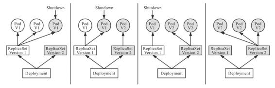

图11-6　Deployment滚动更新过程

对于场景五的最后一种能力，遇到流量压力时，管理员完全可以手动修改Deployment中的副本数量，或者通过kubectl scale命令指定副本数量，促使Kubernetes部署更多的Pod副本来应对压力。然而这种扩容方式需要人工参与，且只靠人类经验来判断需要扩容的副本数量，不容易做到精确与及时，为此Kubernetes又提供了Autoscaling资源和自动扩缩控制器，从而自动根据度量指标，如处理器、内存占用率、用户自定义的度量值等，来设置Deployment（或者ReplicaSet）的期望状态，实现当度量指标出现变化时，系统自动按照“Autoscaling→Deployment→ReplicaSet→Pod”这样的顺序层层变更，最终实现根据度量指标自动扩容/缩容。

故障恢复、滚动更新、自动扩缩这些特性，在云原生时代里常被概括成服务的韧性（Resilience）与弹性（Elasticity），ReplicaSet、Deployment、Autoscaling的用法，也属于所有Kubernetes教材资料都会讲到的“基础必修课”。如果你准备学习Kubernetes或者其他与云原生相关的技术，建议最好不要死记硬背地学习每个资源的元数据文件如何编写、有哪些指令、有哪些功能，而是站在解决问题的角度去理解为什么Kubernetes要设计这些资源和控制器，为什么这些资源和控制器会被设计成现在这种样子。

如果你觉得已经理解了前面的几种资源和控制器的例子，那不妨思考以下几个问题：假设我想限制某个Pod持有的最大存储卷数量，应该如何设计？假设集群中某个Node发生硬件故障，Kubernetes要让调度任务避开这个Node，应该如何设计？假设一旦这个Node重新恢复，Kubernetes要尽快利用上面的资源，又该如何设计？只要你真正接受了资源与控制器是贯穿整个Kubernetes的两大设计理念，即便不去查文档手册，也应该能想出个大概轮廓，以此为基础再去看手册或者源码时，想必就能够事半功倍。

### 11.3 以应用为中心的封装

看完容器技术的发展历程，不知你会不会有种“套娃式”的迷惑感？容器的崛起缘于chroot、namespaces、cgroups等内核提供的隔离能力，系统级虚拟化技术使得同一台机器上互不干扰地运行多个服务成为可能；为了降低用户使用内核隔离能力的门槛，随后出现了LXC，它是namespaces、cgroups特性的上层封装，使得“容器”一词真正走出实验室，走入工业界的实际应用中；为了实现跨机器的软件绿色部署，出现了Docker，它（最初）是LXC的上层封装，彻底改变了软件打包分发的方式，并迅速被大量企业广泛采用；为了满足大型系统对服务集群化的需要，出现了Kubernetes，它（最初）是Docker的上层封装，让以多个容器共同协作构建出的健壮的分布式系统，成为今天云原生时代的技术基础设施。

那Kubernetes会是容器化崛起之路的终点吗？它达到了人们对云原生时代技术基础设施的期望了吗？从能力角度讲，是可以这样说的，Kubernetes被誉为云原生时代的操作系统，自诞生之日起就因其出色的管理能力、扩展性与以声明代替命令的交互理念收获了无数喝彩声。但是，从易用角度讲，坦白说差距还非常大，云原生基础设施的其中一个重要目标是接管业务系统复杂的非功能特性，让业务研发与运维工作变得足够简单，不受分布式的牵绊，然而Kubernetes被诟病最多的就是复杂，自诞生之日起就以陡峭的学习曲线而闻名。

举个具体例子，用Kubernetes部署一套Spring Cloud版的Fenix’s Bookstore，你需要分别部署一个到多个配置中心、注册中心、服务网关、安全认证、用户服务、商品服务、交易服务，为每个微服务都配置好相应的Kubernetes工作负载与服务访问，为每一个微服务的Deployment、ConfigMap、StatefulSet、HPA、Service、ServiceAccount、Ingress等资源都编写好元数据配置。这个过程最难的地方不仅在于烦琐，还在于要写出合适的元数据描述文件，既需要懂开发（网关中服务调用关系、使用容器的镜像版本、运行依赖的环境变量这些参数等），又需要懂运维（要部署多少个服务，配置何种扩容缩容策略、数据库的密钥文件地址等），有时候还需要懂平台（需要什么样的调度策略，如何管理集群资源），一般企业根本找不到合适的角色来为它管理、部署和维护应用。

但以上复杂性不能说是Kubernetes带来的，而是分布式架构本身的特点导致。对于大规模的分布式集群，无论是最终用户部署应用，还是软件公司管理应用都存在诸多痛点。这些困难的实质源于Docker容器镜像封装了单个服务，Kubernetes通过资源封装了服务集群，却没有一个载体真正封装整个应用，将原本属于应用内部的技术细节圈禁起来，不暴露给最终用户、系统管理员和平台维护者，让使用者去埋单；应用难以管理的原因在于封装应用的方法没能将开发、运维、平台等各种角色的关注点恰当地分离。

既然微服务时代，应用的形式已经不再限于单个进程，那也该到了重新定义“以应用为中心的封装”这句话的时候了。至于具体怎样的封装才算正确，今天还未有特别权威结论，不过经过人们的不断探索，已经窥见未来容器应用的一些雏形，下面笔者将列出近几年来研究的几种主流思路供你参考。

#### 11.3.1 Kustomize

最初，由Kubernetes官方给出的“如何封装应用”的解决方案是“用配置文件来配置配置文件”，这不是绕口令，你可以理解为一种针对YAML的模板引擎的变体。Kubernetes官方认为应用就是一组具有相同目标的Kubernetes资源的集合，如果逐一管理、部署每项资源元数据过于烦琐的话，那就提供一种便捷的方式，把应用中不变的信息与易变的信息分离开以解决管理问题，把应用所有涉及的资源自动生成一个多合一（All-in-One）的整合包以解决部署问题。

完成这项工作的工具叫作Kustomize，它原本只是一个独立的小程序，从Kubernetes 1.14版本起，被纳入kubectl命令之中，成为Kubernetes提供的内置功能。Kustomize使用Kustomization文件来组织与应用相关的所有资源，Kustomization本身也是一个以YAML格式编写的配置文件，里面定义了构成应用的全部资源，以及资源中需根据情况被覆盖的变量值。

Kustomize的主要价值是根据环境来生成不同的部署配置。只要建立多个Kustomization文件，开发人员就能以基于基准进行派生（Base and Overlay）的方式，对不同的模式（譬如生产模式、调试模式）、不同的项目（同一个产品对不同客户的客制化）定制出不同的资源整合包。在配置文件里，无论是开发人员关心的信息，还是运维人员关心的信息，只要是在元数据中描述的内容，最初都是由开发人员来编写，然后在编译期间由负责CI/CD的产品人员针对项目进行定制，最后在部署期间由运维人员通过kubectl的补丁（Patch）机制更改其中需要运维人员关注的属性，譬如构造一个补丁来增加Deployment的副本个数，构造另外一个补丁来设置Pod的内存限制，等等。

```
k8s
 ├── base
 │     ├── deployment.yaml
 │     ├── kustomization.yaml
 │     └── service.yaml
 └── overlays
       └── prod
       │     ├── load-loadbalancer-service.yaml
       │     └── kustomization.yaml
       └── debug
             └── kustomization.yaml
```

Kustomize使用Base、Overlay和Patch生成最终配置文件的思路与Docker中分层镜像的思路有些相似，既规避了以“字符替换”对资源元数据文件的入侵，也不需要用户学习额外的DSL语法（譬如Lua）。从效果来看，使用由Kustomize编译生成的All-in-One整合包来部署应用是相当方便的，只要一行命令就能够把应用涉及的所有服务一次安装好，在本书附带的演示工程（附录A）中，Kubernetes版本和Istio版本的Fenix’s Booktstore都使用了这种方式来发布应用，你不妨实际体验一下。

但是Kustomize毕竟只是一个“小工具”性质的辅助功能，对于开发人员，Kustomize只能简化产品针对不同情况的重复配置，并没有真正解决应用管理复杂的问题，要做的事、要写的配置，最终都没有减少，只是不用反复去写罢了；对于运维人员，应用维护不只是安装部署，应用的整个生命周期，除了安装外还有更新、回滚、卸载、多版本、多实例、依赖项维护等诸多问题。这些问题需要更强大的管理工具去解决，譬如下一节的主角Helm。不过Kustomize能够以极小的成本，在一定程度上分离开发和运维工作，无须像Helm那样用一套独立的体系来管理应用，这种轻量便捷，本身也是一种可贵的价值。

#### 11.3.2 Helm与Chart

另一种更具系统性的管理和封装应用的解决方案参考了各大Linux发行版管理应用的思路，典型代表为Deis公司开发的Helm和它的应用格式Chart。Helm一开始的目标就很明确：如果说Kubernetes是云原生操作系统，那Helm就要成为这个操作系统上的应用商店与包管理工具。

对于Linux系统下的包管理工具和封装格式，如Debian系的apt-get命令与dpkg格式、RHEL系的yum命令与rpm格式，相信大家并不陌生。有了包管理工具，你只要知道应用的名称，就可以很方便地从应用仓库中下载、安装、升级、部署、卸载、回滚程序，而且包管理工具自己掌握着应用的依赖信息和版本变更情况，具备完整的自管理能力，对于每个应用需要依赖哪些前置的第三方库，在安装的时候都会一并处理好。

Helm模拟的就是上面这种做法，它提出了与Linux包管理直接对应的Chart格式和Repository应用仓库，针对Kubernetes特有的一个应用经常要部署多个版本的特点，提出了Release的专有概念。

Chart用于封装Kubernetes应用涉及的所有资源，通常以目录内的文件集合的形式存在。目录名称就是Chart的名称（没有版本信息），譬如官方仓库中WordPress Chart的目录结构是这样的：

```
WordPress
 ├── templates
 │     ├── NOTES.txt
 │     ├── deployment.yaml
 │     ├── externaldb-secrets.yaml
 │     └── 版面原因省略其他资源文件
 │     └── ingress.yaml
 └── Chart.yaml
 └── requirements.yaml
 └── values.yaml
```

其中有几个固定的配置文件：Chart.yaml给出了应用自身的详细信息（名称、版本、许可证、自述、说明、图标，等等），requirements.yaml给出了应用的依赖关系，依赖项指向的是另一个应用的坐标（名称、版本、Repository地址），values.yaml给出了所有可配置项目的预定义值。可配置项是指需要运维人员在部署期间调整的那些参数，存储在templates目录下的资源文件中。部署应用时，Helm会先将管理员设置的值覆盖到values.yaml的默认值上，然后以字符串替换的形式传递给templates目录的资源模板，最后生成要部署到Kubernetes的资源文件。由于Chart封装了足够丰富的信息，所以Helm除了支持命令行操作外，也能很容易地根据这些信息自动生成图形化的应用安装、参数设置界面。

Repository仓库用于实现Chart的搜索与下载服务，Helm社区维护了公开的Stable和Incubator的中央仓库（界面如图11-7所示），也支持其他人或组织搭建私有仓库和公共仓库，并能够通过Hub服务把不同个人或组织搭建的公共仓库聚合起来，形成更大型的分布式应用仓库，以便于Chart的查找与共享。

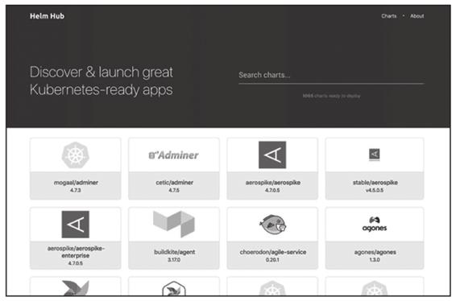

图11-7　Helm Hub商店

Helm提供了应用全生命周期、版本、依赖项的管理能力，还支持额外的扩展插件，能够加入CI/CD或者其他方面的辅助功能，使得它已经从单纯的工具升级到应用管理平台。强大的功能让Helm获得不少支持，很多应用主动入驻到其官方仓库中。从2018年起，Helm项目被托管到CNFC，成为其中的一个孵化项目。

Helm以模仿Linux包管理器的思路去管理Kubernetes应用，在一定程度上是可行的，不过，在Linux与Kubernetes中部署应用时还是存在一些差别，最重要的一点是在Linux中99%的应用都只会安装一份，而Kubernetes为了保证可用性，同一个应用部署多份副本才是常规操作。Helm为了支持对同一个Chart包进行多次部署，每次安装应用时都会产生一个版本（Release），相当于该Chart的安装实例。对于无状态的服务，Helm依靠不同的版本就已经足够支持多个服务并行工作，但对于有状态的服务来说，这些服务会与特定资源或者服务产生依赖关系，譬如要部署数据库，通常要依赖特定的存储来保存持久化数据，这样事情就变得复杂起来。Helm无法很好地管理这种有状态的依赖关系，所以这一类问题就成为Operator要解决的痛点。

#### 11.3.3 Operator与CRD

Operator不应被称作一种工具或者系统，它应该算是一种封装、部署和管理Kubernetes应用的方法，尤其是针对最复杂的有状态应用去封装运维能力的解决方案，最早由CoreOS公司（于2018年被Red Hat收购）的华人程序员邓洪超提出。

如果11.2节介绍Kubernetes资源与控制器模式时你没有开小差，那么Operator中最核心的理念你其实已经理解得差不多了。简单地说，Operator是通过Kubernetes 1.7版本开始支持的自定义资源（CRD，此前曾经以TPR，即Third Party Resource的形式提供过类似的能力），把应用封装为另一种更高层次的资源，再把Kubernetes的控制器模式从面向内置资源扩展到面向所有自定义资源，以此来完成对复杂应用的管理。下面引用了一段Red Hat官方对Operator设计理念的阐述[1]。

额外知识

Operator设计理念

Operator是使用自定义资源（CR，Custom Resource，是CRD的实例），管理应用及其组件的自定义Kubernetes控制器。高级配置和设置由用户在CR中提供。Kubernetes Operator基于嵌入在Operator逻辑中的最佳实践将高级指令转换为低级操作。Kubernetes Operator监视CR类型并采取特定于应用的操作，确保当前状态与该资源的理想状态相符。

——Red Hat

以上这段文字不是笔者转述，而是直接由Red Hat官方撰写和翻译成中文的，准确、严谨但比较拗口，但是什么叫作“高级指令”？什么叫作“低级操作”？两者之间具体如何转换？为了理解这些问题，我们需要先弄清楚有状态和无状态应用的含义及影响，再来理解Operator所做的工作。

有状态应用（Stateful Application）与无状态应用（Stateless Application）是指应用程序是否要自己持有运行所需的数据，如果程序每次运行都跟首次运行一样，不会依赖之前任何操作遗留下来的痕迹，那它就是无状态的；反之，如果程序推倒重来之后，用户能察觉到该应用已经发生变化，那它就是有状态的。无状态应用在分布式系统中具有非常大的价值，我们都知道分布式中的CAP不兼容原理，如果无状态，那就不必考虑状态一致性，没有了C，那A和P便可以兼得，换言之，只要资源足够，无状态应用天生就是高可用的。但不幸的是，现在的分布式系统中多数关键的基础服务都是有状态的，如缓存、数据库、对象存储、消息队列等，只有Web服务器这类服务属于无状态。

站在Kubernetes的角度看，是否有状态的本质差异在于有状态应用会直接依赖于某些外部资源，譬如Elasticsearch建立实例时必须依赖特定的存储位置，重启后仍然指向同一个数据文件的实例才能被认为是相同的实例。另外，有状态应用的多个应用实例之间往往有着特定的拓扑关系与顺序关系，譬如etcd的节点间的选主和投票，各节点都需要知道彼此的存在。为了管理好那些与应用实例密切相关的状态信息，Kubernetes从1.9版本开始正式发布了StatefulSet及对应的StatefulSetController。与普通ReplicaSet中的Pod相比，由StatefulSet管理的Pod具备以下几项额外特性。

·Pod会按顺序创建和销毁：StatefulSet中的各个Pod会按顺序地创建出来，创建后续的Pod前，必须要保证前面的Pod已经转入就绪状态。删除StatefulSet中的Pod时会按照与创建顺序的逆序来执行。

·Pod具有稳定的网络名称：Kubernetes中的Pod都具有唯一的名称，在普通的ReplicaSet中这是靠随机字符产生的，而在StatefulSet中管理的Pod，会以带有顺序的编号作为名称，且能够在重启后依然保持不变。

·Pod具有稳定的持久化存储：StatefulSet中的每个Pod都可以拥有自己独立的PersistentVolumeClaim资源。即使Pod被重新调度到其他节点上，它所拥有的持久化磁盘也依然会被挂载到该Pod，这点会在第13章中进一步介绍。

只是罗列出特性，应该很难快速理解StatefulSet的设计意图，笔者打个比方来帮助你理解：如果把ReplicaSet中的Pod比喻为养殖场中的“肉猪”，那StatefulSet就是被家庭当宠物圈养的“荷兰猪”，不同的肉猪在食用功能上并没有什么区别，但每只宠物猪都是独一无二的，有专属于自己的名字、习性与记忆。事实上，早期的StatefulSet就曾经有一段时间用过PetSet这个名字。

当StatefulSet出现以后，Kubernetes就能满足Pod重新创建后仍然保留上一次运行状态的需求，不过有状态应用的维护并不仅限于此，譬如对于一套Elasticsearch集群来说，通过StatefulSet最多只能做到创建集群、删除集群、扩容缩容等最基本的操作，其他的运维操作，譬如备份和恢复数据、创建和删除索引、调整平衡策略等也十分常用，但是StatefulSet并不能为此提供任何帮助。

笔者再举个实际例子来说明Operator是如何满足那些StatefulSet覆盖不到的有状态服务管理需求的：假设要部署一套Elasticsearch集群，通常要在StatefulSet中定义相当多的细节，譬如服务的端口、Elasticsearch的配置、更新策略、内存大小、虚拟机参数、环境变量、数据文件位置，等等，为了让你对已经反复提及的Kubernetes的复杂性有更加直观的体验，这里将贴出满足这个需求的YAML全文，如下所示。

```
apiVersion: v1
kind: Service
metadata:
  name: elasticsearch-cluster
spec:
  clusterIP: None
  selector:
    app: es-cluster
  ports:
  - name: transport
    port: 9300
---
apiVersion: v1
kind: Service
metadata:
  name: elasticsearch-loadbalancer
spec:
  selector:
    app: es-cluster
  ports:
  - name: http
    port: 80
    targetPort: 9200
  type: LoadBalancer
---
apiVersion: v1
kind: ConfigMap
metadata:
  name: es-config
data:
  elasticsearch.yml: |
    cluster.name: my-elastic-cluster
    network.host: "0.0.0.0"
    bootstrap.memory_lock: false
    discovery.zen.ping.unicast.hosts: elasticsearch-cluster
    discovery.zen.minimum_master_nodes: 1
    xpack.security.enabled: false
    xpack.monitoring.enabled: false
  ES_JAVA_OPTS: -Xms512m -Xmx512m
---
apiVersion: apps/v1beta1
kind: StatefulSet
metadata:
  name: esnode
spec:
  serviceName: elasticsearch
  replicas: 3
  updateStrategy:
    type: RollingUpdate
  template:
    metadata:
      labels:
        app: es-cluster
    spec:
      securityContext:
        fsGroup: 1000
      initContainers:
      - name: init-sysctl
        image: busybox
        imagePullPolicy: IfNotPresent
        securityContext:
          privileged: true
        command: ["sysctl", "-w", "vm.max_map_count=262144"]
      containers:
      - name: elasticsearch
        resources:
            requests:
                memory: 1Gi
        securityContext:
          privileged: true
          runAsUser: 1000
          capabilities:
            add:
            - IPC_LOCK
            - SYS_RESOURCE
        image: docker.elastic.co/elasticsearch/elasticsearch:7.9.1
        env:
        - name: ES_JAVA_OPTS
          valueFrom:
              configMapKeyRef:
                  name: es-config
                  key: ES_JAVA_OPTS
        readinessProbe:
          httpGet:
            scheme: HTTP
            path: /_cluster/health?local=true
            port: 9200
          initialDelaySeconds: 5
        ports:
        - containerPort: 9200
          name: es-http
        - containerPort: 9300
          name: es-transport
        volumeMounts:
        - name: es-data
          mountPath: /usr/share/elasticsearch/data
        - name: elasticsearch-config
          mountPath: /usr/share/elasticsearch/config/elasticsearch.yml
          subPath: elasticsearch.yml
      volumes:
        - name: elasticsearch-config
          configMap:
            name: es-config
            items:
              - key: elasticsearch.yml
                path: elasticsearch.yml
  volumeClaimTemplates:
  - metadata:
      name: es-data
    spec:
      accessModes: [ "ReadWriteOnce" ]
      resources:
        requests:
          storage: 5Gi
```

出现如此大量的细节配置，其根本原因在于Kubernetes完全不知道Elasticsearch是什么，所有Kubernetes不知道的信息、不能启发式推断出来的信息，都必须由用户在资源的元数据定义中明确列出，必须一步一步、手把手地“教会”Kubernetes如何部署Elasticsearch，这种形式就属于Red Hat在Operator设计理念介绍中所说的“低级操作”。

如果我们使用Elastic.co官方提供的Operator，那情况就会简单得多。Elasticsearch Operator提供了一种kind:Elasticsearch的自定义资源，在它的帮助下，仅需十行代码，将用户的意图是“部署三个版本为7.9.1的ES集群节点”说清楚，便能实现与前面StatefulSet那一大堆配置相同乃至更强大的效果，如下面代码所示。

```
apiVersion: elasticsearch.k8s.elastic.co/v1
kind: Elasticsearch
metadata:
  name: elasticsearch-cluster
spec:
  version: 7.9.1
  nodeSets:
  - name: default
    count: 3
    config:
      node.master: true
      node.data: true
      node.ingest: true
      node.store.allow_mmap: false
```

有了Elasticsearch Operator的自定义资源，相当于Kubernetes已经学会了怎样操作Elasticsearch，知道所有与它相关的参数含义与默认值，而无须用户再手把手地教了，这种就是所谓的“高级指令”。

Operator将简洁的高级指令转化为Kubernetes中具体操作的方法，与前面Helm或者Kustomize的方法并不相同。Helm和Kustomize最终仍然是依靠Kubernetes的内置资源来跟Kubernetes打交道的，Operator则要求开发者自己实现一个专门针对该自定义资源的控制器，在控制器中维护自定义资源的期望状态。通过程序编码来扩展Kubernetes，比只通过内置资源来扩展要灵活得多，譬如当需要更新集群中某个Pod对象的时候，由Operator的开发者自己编码实现的控制器完全可以在原地对Pod进行重启，而无须像Deployment那样必须先删除旧的Pod，再创建新的Pod。

使用CRD定义高层次资源、使用配套的控制器来维护期望状态，带来的好处不仅仅是操作更加便捷，而是在遵循Kubernetes一贯基于资源与控制器的设计原则的同时，又不必再受制于Kubernetes内置资源的表达能力。只要Operator的开发者愿意编写代码，前面曾经提到的那些StatefulSet不能支持的能力，如备份恢复数据、创建/删除索引、调整平衡策略等操作，都完全可以实现。

把运维的操作封装在程序代码中，表面看最大的受益者是运维人员，开发人员要为此付出更多劳动。然而Operator并没有受到开发人员的抵制，反而因代码相对于资源配置的表达能力的提升，以及开发与运维之间协作成本的降低而备受好评。Operator变成了近两、三年容器封装应用的一股新潮流，现在很多复杂的分布式系统都有了官方或者第三方提供的Operator[2]。Red Hat公司也持续在Operator上面大量投入，推出了简化开发人员编写Operator的Operator Framework/SDK[3]。

目前看来，Operator也许是应对有状态应用的封装运维的最有可行性的方案，但这依然不是一项轻松的工作。以etcd的Operator为例，etcd本身不算什么特别复杂的应用，Operator实现的功能看起来也相当基础，主要有创建集群、删除集群、扩容缩容、故障转移、滚动更新、备份恢复等功能，但代码已经超过一万行了。现在开发Operator的门槛的确相对较高，通常由专业的平台开发人员而非业务开发或者运维人员去完成，但是Operator符合技术潮流，顺应软件业界所提倡的DevOps一体化理念，待Operator的生态进一步成熟之后，开发和运维人员都将能从中受益，未来应该能成长为一种应用封装的主流形式。

[1] 原文地址：https://www.redhat.com/zh/topics/containers/what-is-a-kubernetes-operat。

[2] 这里收集了其中一部分：https://github.com/operator-framework/awesome-operators。

[3] 项目地址：https://github.com/operator-framework/operator-sdk。

#### 11.3.4 开放应用模型

本节介绍的最后一种应用封装的方案，是阿里云和微软公司在2019年10月上海QCon大会上联合发布的开放应用模型（Open Application Model，OAM），它不仅是中国云计算企业参与制定乃至主导发起的国际技术规范，也是业界首个云原生应用标准定义与架构模型。

开放应用模型思想的核心是如何分离开发人员、运维人员与平台人员的关注点，即开发人员关注业务逻辑的实现，运维人员关注程序平稳运行，平台人员关注基础设施的能力与稳定性，长期让几个角色关注同一个All-in-One资源文件，并不能擦出什么火花，反而会将配置工作弄得越来越复杂。

开放应用模型把云原生应用定义为“由一组相互关联但又离散独立的组件构成，这些组件实例化在合适的运行时上，由配置来控制行为并共同协作提供统一的功能”。为了便于跟稍后的概念对应，笔者首先把这句话拆解、翻译为另一种形式。

额外知识

OAM定义的应用

一个Application由一组Component构成，每个Component的运行状态由Workload描述，每个Component可以施加Trait来获取额外的运维能力，同时我们可以使用Application Scope将Components划分到一个或者多个应用边界中，便于统一配置、限制、管理。把Component、Trait和Scope组合在一起实例化部署，形成具体的Application Configuration，以实现应用的多实例部署与升级。

然后，笔者通过解析上述所列的核心概念来帮助你理解OAM对应用的定义。这句话里面每一个用英文标注出来的技术名词都是OAM在Kubernetes基础上扩展而来概念，每一个名词都有专门的自定义资源与之对应，换而言之，它们并非纯粹的抽象概念，而是可以被实际使用的自定义资源。这些概念的具体含义如下。

·Component（服务组件）：由Component构成应用的思想自SOA以来就屡见不鲜了，然而OAM的Component不仅仅特指构成应用“整体”的一个“部分”，它还有一个重要职责是抽象那些应该由开发人员关注的元素。譬如应用的名字、自述、容器镜像、运行所需的参数，等等。

·Workload（工作负荷）：Workload决定了应用的运行模式，每个Component都要设定自己的Workload类型，OAM按照“是否可访问、是否可复制、是否长期运行”预定义了六种Workload类型[1]，如表11-3所示。如有必要还可以通过CRD与Operator去扩展。

表11-3　OAM的六种工作负荷

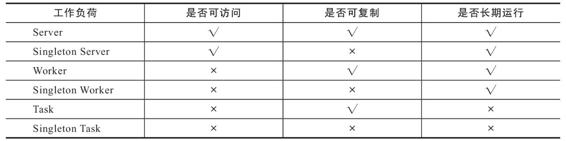

·Trait（运维特征）：开发活动有大量复用功能的技巧，但运维活动却很贫乏，平时能写个Shell脚本或者简单工具已经算是个高级的运维人员了。OAM的Trait就用于封装模块化后的运维能力，可以针对运维中的可重复操作预先设定好一些具体的Trait，譬如日志收集Trait、负载均衡Trait、水平扩缩容Trait等。这些预定义的Traits定义里，会注明它们可以作用于哪种类型的工作负荷、能填哪些参数、哪些必填项、参数的作用描述是什么，等等。

·Application Scope（应用边界）：多个Component共同组成一个Scope，你可以根据Component的特性或者作用域来划分Scope，譬如具有相同网络策略的Component放在同一个Scope中，具有相同健康度量策略的Component放到另一个Scope中。同时，一个Component也可能属于多个Scope，譬如一个Component完全可能既需要配置网络策略，也需要配置健康度量策略。

·Application Configuration（应用配置）：将Component（必需）、Trait（必需）、Scope（非必需）组合到一起进行实例化，就形成了一个完整的应用配置。

OAM使用上述介绍的这些自定义资源对原先All-in-One的复杂配置做了一定层次的解耦，开发人员负责管理Component；运维人员负责将Component组合并与Trait绑定变成Application Configuration；平台人员或基础设施提供方负责提供OAM的解释能力，将这些自定义资源映射到实际的基础设施中。不同角色分工协作，整体简化了单个角色关注的内容，使得不同角色可以更聚焦、更专业地做好本角色的工作，整个过程如图11-8所示。

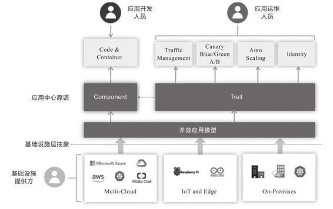

图11-8　OAM角色关系图[2]

OAM未来能否成功，很大程度上取决于云计算厂商的支持力度，因为OAM的自定义资源一般是由云计算基础设施负责解释和驱动的，譬如阿里云的EDAS就已内置了对OAM的支持。如果你希望能够应用于私有Kubernetes环境，目前OAM的主要参考实现是Rudr（已声明废弃）和Crossplane。Crossplane是一个仅发起一年多的CNCF沙箱项目，主要参与者包括阿里云、微软、Google、Red Hat等公司的工程师。Crossplane提供了OAM中全部的自定义资源以及控制器，安装后便可用OAM定义的资源来描述应用。

后记

今天容器圈的发展一日千里，各种新规范、新技术层出不穷，本节根据人气和代表性，列举了其中最出名的四种，其他未提到的应用封装技术还有CNAB、Armada、Pulumi等。这些封装技术的功能会有一定的重叠，但并非都是重复的轮子，实际应用时往往会联合其中多个工具一起使用。应该如何封装应用才是最佳的实践，目前尚且没有定论，但是以应用为中心的理念却已经成为明确的共识。

[1] 新版的OAM规范已经放弃了这六种预置工作负荷。

[2] 图片来源：https://github.com/oam-dev/spec/。
