## 第12章 容器间网络

本章我们将讨论虚拟化网络方面的话题，如果不加任何限定，“虚拟化网络”是一项内容十分丰富，研究历史十分悠久的计算机技术，是计算机科学中一门独立的分支，完全不依附于虚拟化容器而存在。网络运营商常提及的“网络功能虚拟化”（Network Function Virtualization，NFV），网络设备商和网络管理软件提供商常提及的“软件定义网络”（Software Defined Networking，SDN）等都属于虚拟化网络的范畴。对于普通的软件开发者而言，要完全理解和掌握虚拟化网络，需要储备大量开发中不常用到的专业知识，消耗大量的时间成本，一般并无必要。

本节我们讨论的虚拟化网络是狭义的，它特指“如何基于Linux系统的网络虚拟化技术来实现容器间网络通信”，更通俗一点，就是只关注那些为了使相互隔离的Linux网络名称空间可相互通信而设计出来的虚拟化网络设施，讨论这个问题所需的网络知识，基本还是在普通开发者应该具有的合理知识范畴之内。在这个语境中的“虚拟化网络”就是直接为容器服务的，说它是依附于容器而存在亦无不可，因此为避免混淆，笔者在后文中会尽量回避“虚拟化网络”这个范畴过大的概念，而是以“Linux网络虚拟化”和“容器网络与生态”为题来展开。

### 12.1 Linux网络虚拟化

在Linux目前提供的八种名称空间里，网络名称空间无疑是隔离内容最多的一种，它为名称空间内的所有进程提供了全套的网络设施，包括独立的设备界面、路由表、ARP表，IP地址表、iptables/ebtables规则、协议栈，等等。虚拟化容器是以Linux名称空间的隔离性为基础来实现的，所以解决隔离的容器之间、容器与宿主机之间，乃至跨物理网络的不同容器间通信问题的责任，很自然也落在了Linux网络虚拟化技术的肩上。本节中我们将暂时放下容器编排、云原生、微服务等这些上层概念，走入Linux网络的底层世界，去学习一些与设备、协议、通信相关的基础网络知识。

本节的阅读对象设定为以实现业务功能为主、平常并不直接接触网络设备的普通开发人员，对于平台基础设施的开发人员或者运维人员，本节可能会显得过于啰嗦或过于基础，如果你已经掌握了这些知识，完全可以快速阅读，或者直接跳过这部分内容。

#### 12.1.1 网络通信模型

如果抛开虚拟化，只谈网络的话，笔者认为首先应该了解的知识是Linux系统的网络通信模型，即信息是如何从程序中发出，通过网络传输，再被另一个程序接收到的。从整体上看，Linux系统的通信过程无论按理论上的OSI七层模型，还是以实际上的TCP/IP四层模型来解构，都明显呈现出“逐层调用，逐层封装”的特点，这种逐层处理的方式与栈结构，譬如程序执行时的方法栈很类似，因此它通常被称为“Linux网络协议栈”，简称“网络栈”，有时也称“协议栈”。图12-1体现了Linux网络通信过程与OSI或者TCP/IP模型的对应关系，也展示了网络栈中的数据流动的路径。

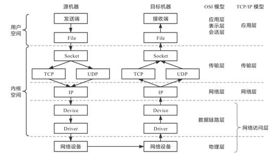

图12-1　Linux系统下的网络通信模型

在图12-1中传输模型的左侧，笔者特别标出了网络栈在用户空间与内核空间的部分，可见几乎整个网络栈（应用层以下）都位于系统内核空间之中。之所以采用这种设计，主要是从数据安全隔离的角度来考虑的。由内核去处理网络报文的收发，无疑会有更高的执行开销，譬如数据在内核态和用户态之间来回复制的额外成本，因此会损失一些性能，但是能够保证应用程序无法窃听或者伪造另一个应用程序的通信内容。针对特别关注收发性能的应用场景，也有直接在用户空间中实现全套协议栈的旁路方案，譬如开源的Netmap以及Intel的DPDK，都能做到零复制收发网络数据包。

图12-1中传输模型的箭头展示的是数据流动的方向，它体现了信息从程序中发出以后，到被另一个程序接收到之前，将经历如下几个阶段。

·Socket：应用层的程序是通过Socket编程接口与内核空间的网络协议栈通信的。Linux Socket是从BSD Socket发展而来的，现在Socket已经不局限于某个操作系统的专属功能，成为各大主流操作系统共同支持的通用网络编程接口，是网络应用程序实际的交互基础。应用程序通过读写收、发缓冲区（Receive/Send Buffer）来与Socket进行交互，在UNIX和Linux系统中，出于“一切皆是文件”的设计哲学，对Socket的操作被实现为对文件系统（socketfs）的读写访问操作，通过文件描述符（File Descriptor）来进行。

·TCP/UDP：传输层协议族里最重要的协议无疑是传输控制协议（Transmission Control Protocol，TCP）和用户数据报协议（User Datagram Protocol，UDP）两种，它们也是Linux内核中直接支持的协议。此外还有流控制传输协议（Stream Control Transmission Protocol，SCTP）、数据报拥塞控制协议（Datagram Congestion Control Protocol，DCCP）等。

不同协议的处理流程大致是一样的，只是封装的报文以及头、尾部信息会有所不同。这里以TCP协议为例，内核发现Socket的发送缓冲区中有新的数据被复制进来后，会把数据封装为TCP Segment报文，常见网络协议的报文基本上都是由报文头（Header）和报文体（Body，也叫Payload）两部分组成。系统内核将缓冲区中用户要发送出去的数据作为报文体，然后把传输层中的必要控制信息，譬如代表哪个程序发，由哪个程序收的源、目标端口号，用于保证可靠通信（重发与控制顺序）的序列号，用于校验信息是否在传输中出现损失的校验和（Check Sum）等信息封装入报文头中。

·IP：网络层协议最主要就是网际协议（Internet Protocol，IP），其他还有因特网组管理协议（Internet Group Management Protocol，IGMP）、大量的路由协议（EGP、NHRP、OSPF、IGRP）等。

以IP协议为例，它会将来自上一层（本例中的TCP报文）的数据包作为报文体，再次加入自己的报文头，譬如指明数据应该发到哪里的路由地址、数据包的长度、协议的版本号，等等，封装成IP数据包后再发往下一层。关于TCP和IP协议报文的内容，笔者曾在4.5节中详细讲解过，有需要的读者可以参考。

·Device：网络设备是网络访问层中面向系统一侧的接口，这里所说的设备与物理硬件设备并不是同一个概念，Device只是一种向操作系统端开放的接口，其背后既可能代表真实的物理硬件，也可能是某段具有特定功能的程序代码，譬如即使不存在物理网卡，也依然可以存在回环设备（Loopback Device）。许多网络抓包工具，如tcpdump、Wirshark便是在此处工作的，前面介绍微服务流量控制时曾提到的网络流量整形，通常也是在这里完成的。Device的主要作用是抽象出统一的界面，让程序代码去选择或影响收发包出入口，譬如决定数据应该从哪块网卡设备发送出去；准备好网卡驱动工作所需的数据，譬如来自上一层的IP数据包、下一跳（Next Hop）的MAC地址（这个地址是通过ARP Request得到的）等。

·Driver：网卡驱动程序是网络访问层中面向硬件一侧的接口，它会通过DMA将主存中待发送的数据包复制到驱动内部的缓冲区之中。数据被复制的同时，也会将上层提供的IP数据包、下一跳MAC地址这些信息，加上网卡的MAC地址、VLAN Tag等信息一并封装成以太帧（Ethernet Frame），并自动计算校验和。对于需要确认重发的信息，如果没有收到接收者的确认（ACK）响应，那重发的处理也是在这里自动完成的。

上面这些阶段是信息从程序中对外发出时经过协议栈的过程，接收过程则是从相反方向进行的逆操作。程序发送数据做的是层层封包，加入协议头，传给下一层；接收数据则是层层解包，提取协议体，传给上一层，你可以类比来理解数据包接收过程，这里就不再专门列举了。

#### 12.1.2 干预网络通信

网络协议栈的处理是一套相对固定和封闭的流程，整套处理过程中，除了在网络设备层能看到一点点程序以设备的形式介入处理的空间外，其他过程似乎就没有什么可供程序插手的空间了。然而事实并非如此，从Linux Kernel 2.4版本开始，内核开放了一套通用的、可供代码干预数据在协议栈中流转的过滤器框架。这套名为Netfilter的框架是Linux防火墙和网络的主要维护者Rusty Russell提出并主导设计的，它围绕网络层（IP协议）的周围，埋下了五个钩子（Hook），每当有数据包流到网络层，经过这些钩子时，就会自动触发由内核模块注册在这里的回调函数，这样程序代码就能够通过回调函数来干预Linux的网络通信，如图12-2所示。这五个钩子的名字与含义如下。

·PREROUTING：来自设备的数据包进入协议栈后立即触发此钩子。PREROUTING钩子在进入IP路由之前触发，这意味着只要接收到数据包，无论是否真的发往本机，都会触发此钩子。一般用于目标网络地址转换（Destination NAT，DNAT）。

·INPUT：报文经过IP路由后，如果确定是发往本机的，将会触发此钩子，一般用于加工发往本地进程的数据包。

·FORWARD：报文经过IP路由后，如果确定不是发往本机的，将会触发此钩子，一般用于处理转发到其他机器的数据包。

·OUTPUT：从本机程序发出的数据包，在经过IP路由前，将会触发此钩子，一般用于加工本地进程的输出数据包。

·POSTROUTING：从本机网卡发出的数据包，无论是本机的程序所发出的，还是由本机转发给其他机器的，都会触发此钩子，一般用于源网络地址转换（Source NAT，SNAT）。

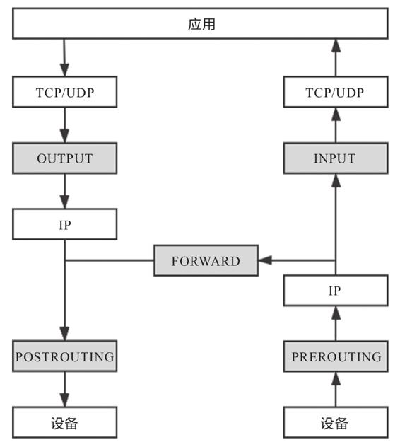

图12-2　应用收、发数据包所经过的Netfilter钩子

Netfilter允许在同一个钩子处注册多个回调函数，因此向钩子注册回调函数时必须提供明确的优先级，以便触发时能按照优先级从高到低进行激活。由于回调函数会存在多个，看起来就像挂在同一个钩子上的一串链条，因此钩子触发的回调函数集合被称为“回调链”（Chained Callback），这个名字也导致后续基于Netfilter设计的Xtables系工具，如稍后介绍的iptables均有使用到“链”（Chain）的概念。虽然现在看来Netfilter只是一些简单的事件回调机制，然而这样一套简单的设计，却成为整座Linux网络大厦的核心基石，Linux系统提供的许多网络能力，如数据包过滤、封包处理（设置标志位、修改TTL等）、地址伪装、网络地址转换、透明代理、访问控制、基于协议类型的连接跟踪、带宽限速，等等，都是在Netfilter基础之上实现的。

以Netfilter为基础的应用有很多，其中使用最广泛的无疑要数Xtables系列工具，譬如iptables、ebtables、arptables、ip6tables等。这里面至少iptables是用过Linux系统的开发人员都或多或少使用过的，它常被称为Linux系统“自带的防火墙”，然而iptables实际能做的事情已远远超出防火墙的范畴，严谨地讲，iptables比较贴切的定位应是能够代替Netfilter多数常规功能的IP包过滤工具。由于Netfilter的钩子回调虽然很强大，但仍要通过程序编码才能使用，并不适合系统管理员用来日常运维，而设计iptables的目的便是以配置去实现原本用Netfilter编码才能做到的事情。iptables先把用户常用的管理意图总结成具体的行为预先准备好，然后在满足条件时自动激活行为。以下列出了部分iptables预置的行为。

·DROP：直接将数据包丢弃。

·REJECT：向客户端返回Connection Refused或Destination Unreachable报文。

·QUEUE：将数据包放入用户空间的队列，供用户空间的程序处理。

·RETURN：跳出当前链，该链里后续的规则不再执行。

·ACCEPT：同意数据包通过，继续执行后续的规则。

·JUMP：跳转到其他用户自定义的链继续执行。

·REDIRECT：在本机做端口映射。

·MASQUERADE：地址伪装，自动用修改源或目标的IP地址来做网络地址转换。

·LOG：在/var/log/messages文件中记录日志信息。

这些行为本来能够被挂载到Netfilter钩子的回调链上，但iptables进行了一层额外抽象，不是把行为与链直接挂钩，而是根据这些底层操作的目的，先总结为更高层次的规则。举个例子，假设挂载规则的目的是实现网络地址转换，那就应该对符合某种特征的流量（譬如来源于某个网段、从某张网卡发送出去）、在某个钩子上（譬如通常在POSTROUTING做SNAT，通常在PREROUTING做DNAT）进行MASQUERADE行为，这样具有相同目的的规则，就应该放到一起才便于管理，由此便形成“规则表”的概念。iptables内置了五张不可扩展的规则表（其中security表并不常用，很多资料只计算了前四张表），如下所示。

1）raw表：用于去除数据包上的连接追踪机制（Connection Tracking）。

2）mangle表：用于修改数据包的报文头信息，如服务类型（Type of Service，ToS）、生存周期（Time to Live，TTL）以及为数据包设置Mark标记，典型的应用是链路的服务质量管理（Quality of Service，QoS）。

3）nat表：用于修改数据包的源或者目的地址等信息，典型的应用是网络地址转换。

4）filter表：用于对数据包进行过滤，控制到达某条链上的数据包是继续放行、直接丢弃或拒绝（ACCEPT、DROP、REJECT），典型的应用是防火墙。

5）security表：用于在数据包上应用SELinux，这张表并不常用。

以上五张规则表是具有优先级的：raw→mangle→nat→filter→security，也即上面列举它们的顺序。在iptables中新增规则时，需要按照规则的意图指定要存入哪张表中，如果没有指定，将默认存入filter表。此外，每张表能够使用到的链也有所不同，具体表与链的对应关系如表12-1所示。

表12-1　表与链的对应关系

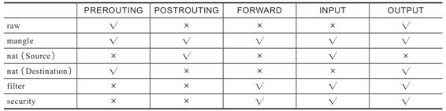

从名字上就能看出预置的五条链直接源自于Netfilter的钩子，它们与五张规则表的对应关系是固定的，用户不能增加自定义的表，或者修改已有表与链的关系，但可以增加自定义的链，新增的自定义链与Netfilter的钩子没有天然的对应关系，换言之就是不会被自动触发，只有显式使用JUMP行为，从默认的五条链中跳转过去才能被执行。

iptables不仅仅是Linux系统自带的一个网络工具，它在容器间通信中也扮演着相当重要的角色。譬如Kubernetes用来管理Service的Endpoints的核心组件kube-proxy，就依赖iptables来完成ClusterIP到Pod的通信（也可以采用IPVS，IPVS同样是基于Netfilter的），这种通信的本质就是一种NAT访问。对于Linux用户，以上都是相当基础的网络常识，但如果你平常较少在Linux系统下工作，就可能需要一些用iptables充当防火墙过滤数据、充当路由器转发数据、充当网关做NAT的实际例子来帮助理解，由于这些操作在网上很容易就能找到，笔者便不举例说明了。

行文至此，本章用了两个小节的篇幅去介绍Linux下网络通信的协议栈模型，以及程序如何干涉在协议栈中流动的信息，它们与虚拟化并没有什么直接关系，是整个Linux网络通信的必要基础。从下一节开始，我们就要开始专注与网络虚拟化密切相关的内容了。

#### 12.1.3 虚拟化网络设备

虚拟化网络并不需要完全遵照物理网络的样子来设计，不过，由于已有大量现成的代码原本就是面向物理存在的网络设备来编码实现，也出于方便理解和知识继承方面的考虑，虚拟化网络与物理网络中的设备还是有相当高的相似性的。所以，笔者准备从网络中那些与网卡、交换机、路由器等对应的虚拟设施，以及如何使用这些虚拟设施来组成网络入手，介绍容器间网络的通信基础设施。

1.网卡：tun/tap、veth

目前主流的虚拟网卡方案有tun/tap和veth两种，在时间上tun/tap出现得更早，它是一组通用的虚拟驱动程序包，里面包含两个设备，分别是用于网络数据包处理的虚拟网卡驱动，以及用于内核空间与用户空间交互的字符设备（Character Device，这里具体指/dev/net/tun）驱动。大概在2000年左右，Solaris系统为了实现隧道协议（Tunneling Protocol）开发了这套驱动，并从Linux Kernel 2.1版开始移植到Linux内核中，当时是源码中的可选模块，2.4版之后发布的内核都会默认编译tun/tap的驱动。

tun和tap是两个相对独立的虚拟网络设备，其中tap模拟了以太网设备，操作二层数据包（以太帧），tun则模拟了网络层设备，操作三层数据包（IP报文）。使用tun/tap设备的目的是实现把来自协议栈的数据包先交由某个打开了/dev/net/tun字符设备的用户进程处理后，再把数据包重新发回到链路中。你可以通俗地理解为它一端连接着网络协议栈，另一端连接着用户态程序，而普通的网卡驱动则是一端连接着网络协议栈，另一端连接着物理网卡。只要协议栈中的数据包能被用户态程序截获并加工处理，程序员就有足够的舞台空间去玩出各种花样，譬如数据压缩、流量加密、透明代理等功能都能够以此为基础来实现，以最典型的VPN应用程序为例，程序发送给tun设备的数据包，会经过如图12-3所示的顺序流进VPN程序。

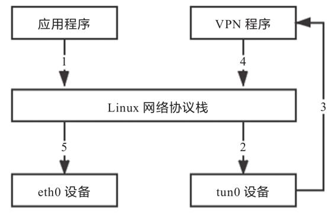

图12-3　VPN中数据流动示意图

应用程序通过tun0设备对外发送数据包后，tun0设备如果发现另一端的字符设备已被VPN程序打开（这就是一端连接着网络协议栈，另一端连接着用户态程序），便会把数据包通过字符设备发送给VPN程序，VPN收到数据包，会修改后再将其封装成新报文，譬如数据包原本是发送给A地址的，VPN把整个包进行加密，然后作为报文体，封装到另一个发送给B地址的新数据包当中。这种将一个数据包套进另一个数据包的处理方式被形象地形容为“隧道”（Tunneling），隧道技术是在物理网络中构筑逻辑网络的经典做法。而其中提到的加密，也有标准的协议可遵循，譬如IPSec协议。

使用tun/tap设备传输数据需要经过两次协议栈，不可避免地会有一定的性能损耗，如果条件允许，容器对容器的直接通信并不会把tun/tap作为首选方案，一般是基于稍后介绍的veth来实现的。但是tun/tap没有veth那样要求设备成对出现、数据要原样传输的限制，数据包到用户态程序后，程序员就有完全掌控的权力，要进行哪些修改，要发送到什么地方，都可以通过编写代码去实现，因此tun/tap方案比起veth方案有更广泛的适用范围。

veth是另外一种主流的虚拟网卡方案，在Linux Kernel 2.6版本，Linux在开始支持网络名称空间隔离的同时，也提供了专门的虚拟以太网（Virtual Ethernet，习惯简写做veth）让两个隔离的网络名称空间之间可以互相通信。直接把veth比喻成虚拟网卡其实并不准确，如果要和物理设备类比，它应该相当于由交叉网线连接的一对物理网卡。

额外知识

交叉线序、直连线序

交叉网线是指一头是T568A标准，另外一头是T568B标准的网线。直连网线则是指两头采用同一种标准的网线。

网卡对网卡这样的同类设备需要使用交叉线序的网线来连接，网卡到交换机、路由器就采用直连线序的网线，不过现在的网卡大多带有线序翻转功能，直连线也可以网卡对网卡地连通了。

veth实际上不是一个设备，而是一对设备，因而也常被称作veth pair。要使用veth，必须在两个独立的网络名称空间中进行才有意义，因为veth pair是一端连着协议栈，另一端彼此相连的，在veth设备的其中一端输入数据，这些数据就会从设备的另外一端原样不变地流出，它工作时的数据流动如图12-4所示。

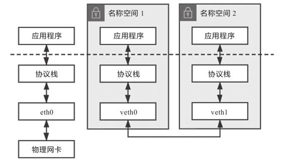

图12-4　veth pair工作示意图

由于两个容器之间采用veth通信不需要反复多次经过网络协议栈，这让veth有比tap/tun更好的性能，也让veth pair的实现变得十分简单，内核中只用几十行代码实现一个数据复制函数就完成了veth的主体功能。veth以模拟网卡直连的方式很好地解决了两个容器之间的通信问题，然而对多个容器间通信，如果仍然单纯只用veth pair的话，事情就会变得非常麻烦，让每个容器都为与它通信的其他容器建立一对专用的veth pair并不实际，这时就迫切需要一台虚拟化的交换机来解决多容器之间的通信问题了。

2.交换机：Linux Bridge

既然有了虚拟网卡，很自然就会联想到让网卡接入交换机，以实现多个容器间的相互连接。Linux Bridge便是Linux系统下的虚拟化交换机，虽然它以“网桥”（Bridge）而不是“交换机”（Switch）为名，但是在使用过程中，你会发现Linux Bridge的目的看起来像交换机，功能像交换机、程序实现也像交换机，实际就是一台虚拟交换机。

Linux Bridge是在Linux Kernel 2.2版本开始提供的二层转发工具，由brctl命令创建和管理。Linux Bridge创建以后，便能够接入任何位于二层的网络设备，无论是真实的物理设备（譬如eth0）抑或是虚拟设备（譬如veth或者tap）都能与Linux Bridge配合工作。当有二层数据包（以太帧）从网卡进入时Linux Bridge将根据数据包的类型和目标MAC地址，按如下规则转发处理。

·如果数据包是广播帧，转发给所有接入网桥的设备。

·如果数据包是单播帧：

·且MAC地址在地址转发表中不存在，则洪泛（Flooding）给所有接入网桥的设备，并将响应设备的接口与MAC地址学习（MAC Learning）到自己的MAC地址转发表中。

·且MAC地址在地址转发表中已存在，则直接转发到地址表中指定的设备。

·如果数据包是此前转发过的，又重新发回到此Bridge，说明冗余链路产生了环路。由于以太帧不像IP报文那样有生存周期来约束，因此一旦出现环路，如果没有额外措施来处理的话就会永不停歇地转发下去。对于这种数据包就需要交换机实现生成树协议（Spanning Tree Protocol，STP）来交换拓扑信息，生成唯一拓扑链路以切断环路。

上面提到的这些名词，譬如二层转发、泛洪、MAC学习、地址转发表、STP，等等，都是物理交换机中极为成熟的概念，它们在Linux Bridge中都有对应的实现，所以说Linux Bridge不仅用起来像交换机，实现起来也像交换机。不过，它与普通的物理交换机还是有一点差别，普通交换机只会单纯地做二层转发，Linux Bridge却还支持把发给它自身的数据包接入主机的三层协议栈中。

对于通过brctl命令显式接入网桥的设备，Linux Bridge与物理交换机的转发行为是完全一致的，都不允许给接入的设备设置IP地址，因为网桥是根据MAC地址做二层转发的，就算设置了三层的IP地址也毫无意义。然而Linux Bridge与普通交换机的区别是除了显式接入的设备外，它自己也无可分割地连接着一台有着完整网络协议栈的Linux主机，因为Linux Bridge本身肯定是在某台Linux主机上创建的，可以看作Linux Bridge有一个与自己名字相同的隐藏端口，隐式地连接了创建它的那台Linux主机。因此，Linux Bridge允许给自己设置IP地址，比普通交换机多出一种特殊的转发情况：如果数据包的目的MAC地址为网桥本身，并且网桥设置了IP地址的话，那该数据包即被认为是收到发往创建网桥那台主机的数据包，此数据包将不会转发到任何设备，而是直接交给上层（三层）协议栈去处理。

此时，网桥就取代了eth0设备来对接协议栈，进行三层协议的处理。设置这条特殊转发规则的好处是：只要通过简单的NAT转换，就可以实现一个最原始的单IP容器网络。这种组网是最基本的容器间通信形式，下面笔者举个具体例子来帮助你理解。假设现有如下设备，它们的连接情况如图12-5所示，具体配置如下。

·网桥br0：分配IP地址192.168.31.1。

·容器：三个网络名称空间（容器），分别编号为1、2、3，均使用veth pair接入网桥，且有如下配置。

·在容器一端的网卡名为veth0，在网桥一端的网卡名为veth1、veth2、veth3。

·为三个容器中的veth0网卡分配IP地址：192.168.1.10、192.168.1.11、192.168.1.12。

·三个容器中的veth0网卡设置网关为网桥，即192.168.31.1。

·网桥中的veth1、veth2、veth3无IP地址。

·物理网卡eth0：分配的IP地址为14.123.254.86。

·外部网络：外部网络中有一台服务器，地址为122.246.6.183。

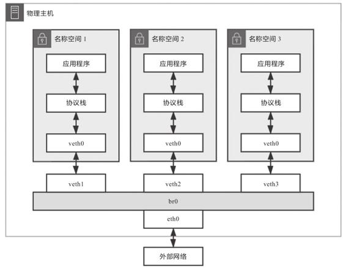

图12-5　Linux Bridge构建单IP容器网络

如果名称空间1中的应用程序想访问外网地址为122.246.6.183的服务器，由于容器没有自己的公网IP地址，程序发出的数据包必须经过如下步骤处理后，才能最终到达外网服务器。

1）应用程序调用Socket API发送数据，此时生成的原始数据包为：

```
○源MAC：veth0的MAC
○目标MAC：网关的MAC（即网桥的MAC）
○源IP：veth0的IP，即192.168.31.1
○目标IP：外网的IP，即122.246.6.183
```

2）从veth0发送的数据，会在veth1中原样发出，网桥将从veth1中接收到一个目标MAC为自己的数据包，并且网桥有配置IP地址，由此触发Linux Bridge的特殊转发规则。这样这个数据包便不会转发给任何设备，而是转交给主机的协议栈处理。

注意，从这步以后就是三层路由了，已不在网桥的工作范围之内，是由Linux主机依靠Netfilter进行IP转发（IP Forward）去实现的。

3）数据包经过主机协议栈，Netfilter的钩子被激活，预置好的iptables NAT规则会修改数据包的源IP地址，将其改为物理网卡eth0的IP地址，并在映射表中记录设备端口及两个IP地址之间的对应关系，经过SNAT之后的数据包，最终会从eth0出去，此时报文头中的地址为：

```
○源MAC：eth0的MAC
○目标MAC：下一跳（Hop）的MAC
○源IP：eth0的IP，即14.123.254.86
○目标IP：外网的IP，即122.246.6.183
```

4）可见，经过主机协议栈后，数据包的源和目标IP地址均为公网的IP，这个数据包在外部网络中可以根据IP正确路由到目标服务器中。当目标服务器处理完毕，对该请求发出响应后，返回数据包的目标地址也是公网IP。当返回的数据包经过链路所有跳点，由eth0达到网桥时，报文头中的地址为：

```
○源MAC：eth0的MAC
○目标MAC：网桥的MAC
○源IP：外网的IP，即122.246.6.183
○目标IP：eth0的IP，即14.123.254.86
```

5）这同样是一个以网桥MAC地址为目标的数据包，同样会触发特殊转发规则，交由协议栈处理。此时Linux将根据映射表中的转换关系做DNAT，把目标IP地址从eth0替换回veth0的IP，最终veth0收到的响应数据包为：

```
○源MAC：网桥的MAC
○目标MAC：veth0的MAC
○源IP：外网的IP，即122.246.6.183
○目标IP：veth0的IP，即192.168.31.1
```

在以上处理过程中，Linux主机独立承担了三层路由的职责，在一定程度上扮演了路由器的角色。由于有Netfilter的存在，对网络层的路由转发，就无须像Linux Bridge一样专门提供brctl这样的命令去创建一个虚拟设备，通过Netfilter可以很容易地在Linux内核完成根据IP地址进行路由的操作。你也可以这样理解：Linux Bridge是一个人工创建的虚拟交换机，而Linux内核则是一个天然的虚拟路由器。

限于篇幅，笔者这里仅举例介绍Linux Bridge这一种虚拟交换机的方案，其他如OVS（Open vSwitch）等同样常见，而且更强大、更复杂的方案就不再涉及了。

3.网络：VXLAN

有了虚拟化网络设备后，下一步就是要使用这些设备组成网络。容器分布在不同的物理主机上，每一台物理主机都有物理网络相互联通，然而这种网络的物理拓扑结构是相对固定的，很难跟上云原生时代分布式系统的逻辑拓扑结构的变动频率，譬如服务的扩缩、断路、限流，等等，都可能要求网络随之做出相应的变化。正因如此，软件定义网络（Software Defined Network，SDN）的需求在云计算和分布式时代变得前所未有地迫切。SDN的核心思路是在物理网络上再构造一层虚拟化的网络，将控制平面和数据平面分离开来，实现流量的灵活控制，为核心网络及应用的创新提供良好的平台。SDN里位于下层的物理网络被称为Underlay，它着重解决网络的连通性与可管理性，位于上层的逻辑网络被称为Overlay，它着重为应用提供与软件需求相符的传输服务和网络拓扑。

软件定义网络已经发展了十余年时间，远比云原生、微服务这些概念出现得早。网络设备商基于硬件设备开发出了EVI（Ethernet Virtualization Interconnect，以太网虚拟化互联）、TRILL（Transparent Interconnection of Lots of Link，多链接透明互联）、SPB（Shortest Path Bridging，最短路径桥接）等大二层网络技术；软件厂商也提出了VXLAN（Virtual eXtensible LAN，虚拟局域网扩展）、NVGRE（Network Virtualization Using Generic Routing Encapsulation，使用通用路由封装的网络虚拟化）、STT（A Stateless Transport Tunneling Protocol for Network Virtualization，无状态传输隧道协议网络虚拟化）等一系列基于虚拟交换机实现的Overlay网络。由于跨主机的容器间通信用的大多是Overlay网络，所以在本节笔者会以VXLAN为例去介绍Overlay网络的原理。

VXLAN你可能没听说过，但VLAN相信只要从事计算机专业的人都会有所了解。VLAN的全称是“虚拟局域网”（Virtual Local Area Network），从名称来看它也算是网络虚拟化技术的早期成果之一。由于二层网络本身的工作特性决定了它非常依赖于广播，无论是广播帧（如ARP请求、DHCP、RIP都会产生广播帧），还是泛洪路由，其执行成本都随着接入二层网络的设备数量的增长而等比例增加，当设备太多，广播又频繁的时候，很容易形成广播风暴（Broadcast Radiation）。因此，VLAN的首要职责就是划分广播域，将连接在同一个物理网络上的设备区分开来，划分的具体方法是在以太帧的报文头中加入VLAN Tag，让所有广播只针对具有相同VLAN Tag的设备生效。这样既缩小了广播域，也提高了安全性和可管理性，因为两个VLAN之间不能直接通信。如果确有通信的需要，就必须通过三层设备来进行，譬如单臂路由（Router on a Stick）或者三层交换机。

然而VLAN有两个明显的缺陷，第一个缺陷在于VLAN Tag的设计，定义VLAN的802.1Q规范是在1998年提出的，当时的网络工程师完全不可能预料到未来云计算会如此普及，因而只给VLAN Tag预留了32位的存储空间，其中还要分出16位存储标签协议识别符（Tag Protocol Identifier）、3位存储优先权代码点（Priority Code Point）、1位存储标准格式指示（Canonical Format Indicator），剩下的12位才会用来存储VLAN ID（Virtualization Network Identifier，VNI），换言之，VLAN ID最多只能有212（4096）种取值。在云计算数据中心出现后，即使不考虑虚拟化的需求，单是需要分配IP的物理设备都有可能数以万计甚至数以十万计，这样看来，4096个VLAN肯定是不够用的。后来IEEE的工程师们又提出802.1AQ规范来弥补这个缺陷，大致思路是给以太帧连续打上两个VLAN Tag，每个Tag里仍然只有12位的VLAN ID，但两个加起来就可以存储224（16 777 216）个不同的VLAN ID，由于两个VLAN Tag并排放在报文头上，802.1AQ规范还有了一个QinQ（802.1Q in 802.1Q）的昵称别名。

QinQ是2011年推出的规范，但是直到现在都没有特别普及，除了需要设备支持外，它还弥补不了VLAN的第二个缺陷：跨数据中心传递。VLAN本身是为二层网络所设计的，但是在两个独立数据中心之间，信息只能通过三层网络传递，由于云计算的发展普及，大型分布式系统已不局限于单个数据中心，完全有跨数据中心运作的可能性，此时如何让VLAN Tag在两个数据中心间传递又成为不得不考虑的麻烦事。

为了统一解决以上两个问题，IETF定义了VXLAN规范，这是三层虚拟化网络（Network Virtualization over Layer 3，NVO3）的标准技术规范之一，是一种典型的Overlay网络。VXLAN采用L2 over L4（MAC in UDP）的报文封装模式，把原本在二层传输的以太帧放到四层UDP协议的报文体内，同时加入了自己定义的VXLAN Header。VXLAN Header里直接就有24位的VLAN ID，同样可以存储1677万个不同的取值，使得二层网络可以在三层范围内进行扩展，不再受数据中心间传输的限制。VXLAN的整个报文结构如图12-6所示。

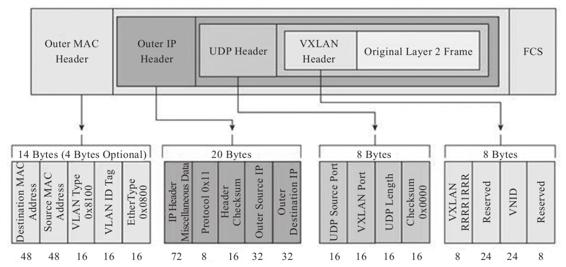

图12-6　VXLAN报文结构[1]

VXLAN对网络基础设施的要求很低，不需要专门的硬件提供的特别支持，只要三层可达的网络就能部署VXLAN。VXLAN的每个边缘入口上都布置了一个VTEP（VXLAN Tunnel Endpoint）设备，它既可以是物理设备，也可以是虚拟化设备，负责VXLAN协议报文的封包和解包。互联网号码分配局（Internet Assigned Numbers Authority，IANA）专门分配了4789作为VTEP设备的UDP端口（以前Linux VXLAN用的默认端口是8472，目前这两个端口在许多场景中仍有并存的情况）。

从Linux Kernel 3.7版本起，Linux系统就开始支持VXLAN。到了3.12版本，Linux对VXLAN的支持已达到完全完备的程度，能够处理单播和组播，能够运行于IPv4和IPv6之上，一台Linux主机经过简单配置之后，便可以把Linux Bridge作为VTEP设备使用。

VXLAN带来了很高的灵活性、扩展性和可管理性，同一套物理网络中可以任意创建多个VXLAN，每个VXLAN中接入的设备都仿佛是在一个完全独立的二层局域网中一样，不会受到外部广播的干扰，也很难遭受外部的攻击，这使得VXLAN能够良好地匹配分布式系统的弹性需求。不过，VXLAN也带来了额外的复杂度和性能开销，具体表现在如下两个方面。

·传输效率的下降。如果你仔细数过前面VXLAN报文结构中UDP、IP、以太帧报文头的字节数，会发现经过VXLAN封装后的报文，新增加的报文头部分就占了整整50字节（VXLAN报文头占8字节，UDP报文头占8字节，IP报文头占20字节，以太帧的MAC头占14字节），而原本需要的14字节，被封到了最里面的以太帧中。以太网的MTU默认是1500字节，如果是传输大量数据，额外损耗50字节并不算很高的成本，但如果传输的数据只有几个字节，那传输消耗在报文头上的成本就很高昂了。

·传输性能的下降。每个VXLAN报文的封包和解包操作都属于额外的处理过程，尤其是用软件来实现的VTEP，额外的运算资源消耗有时候会成为不可忽略的性能影响因素。

4.副本网卡：MACVLAN

理解了VLAN和VXLAN的原理后，我们就有足够的前置知识去了解MACVLAN这最后一种网络设备虚拟化的方式了。

前文提到，两个VLAN之间是完全二层隔离的，不存在重合的广播域，因此要通信就只能通过三层设备，而最简单的三层通信就是通过单臂路由实现。笔者以图12-7所示的网络拓扑结构来举个具体例子，介绍单臂路由是如何工作的。

假设位于VLAN-A中的主机A1希望将数据包发送给VLAN-B中的主机B2，由于A、B两个VLAN之间的二层链路不通，因此引入了单臂路由。单臂路由不属于任何VLAN，它与交换机之间的链路允许任何VLAN ID的数据包通过，而这个通信的接口也被称为TRUNK。这样，A1要和B2通信，就要将数据包先发送给路由（只需把路由设置为网关即可），然后路由会根据数据包上的IP地址得知B2的位置，去掉VLAN-A的VLAN Tag，改用VLAN-B的VLAN Tag重新封装数据包后再发回给交换机，交换机收到后就可以顺利转发给B2了。这个过程并不复杂，但你是否注意到一个问题，路由器应该设置怎样的IP地址呢？由于A1、B2各自处于独立的网段上，它们又各自要将同一个路由作为网关使用，这就要求路由器必须同时具备192.168.1.0/24和192.168.2.0/24的IP地址。如果真的只有VLAN-A、VLAN-B两个VLAN，那为路由器上的两个接口分别设置不同的IP地址，然后用两条网线分别连接到交换机上也勉强算是一个解决办法，但VLAN最多支持4096个VLAN，如果要接四千多条网线就太离谱了。为了解决这个问题，802.1Q规范中专门定义了子接口（Sub-Interface）的概念，其作用是允许在同一张物理网卡上，针对不同的VLAN绑定不同的IP地址。

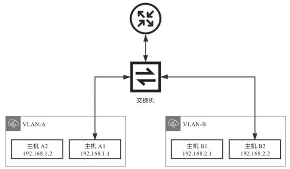

图12-7　VLAN单臂路由原理

MACVLAN借用了VLAN子接口的思路，并且在这个基础上进一步优化，不仅允许为同一个网卡设置多个IP地址，还允许在同一张网卡上设置多个MAC地址，这也是MACVLAN名字的由来。原本MAC地址是网卡接口的“身份证”，应该是严格的一对一关系，而MACVLAN打破了这层关系，方法是在物理设备之上、网络栈之下生成多个虚拟的设备，每个设备都有一个MAC地址，新增设备的操作本质上相当于在系统内核中注册一个收发特定数据包的回调函数，每个回调函数都能对一个MAC地址的数据包进行响应，当物理设备收到数据包时，会先根据MAC地址进行一次判断，确定交给哪个设备来处理，如图12-8所示。从交换机一侧的视角来看，这个端口后面仿佛是另一台已经连接了多个设备的交换机一样。

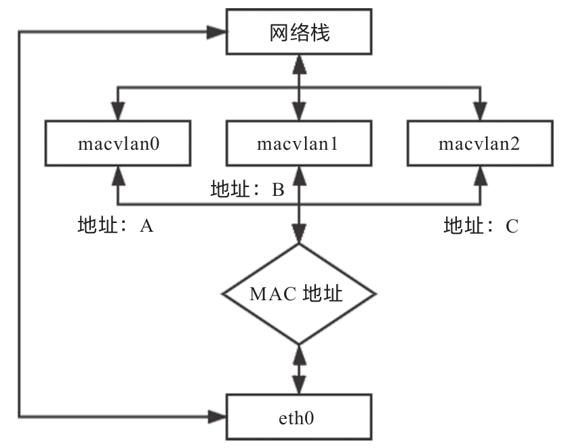

图12-8　MACVLAN原理

用MACVLAN技术虚拟出来的副本网卡，在功能上和真实的网卡是完全对等的，此时真正的物理网卡实际上承担着类似交换机的职责，它会在收到数据包后，根据目标MAC地址判断这个包应转发给哪块副本网卡处理。由同一块物理网卡虚拟出来的副本网卡，天然处于同一个VLAN之中，可以直接二层通信，不需要将流量转发到外部网络。

与Linux Bridge相比，这种以网卡模拟交换机的方法在目标上并没有本质的不同，但MACVLAN在内部实现上要比Linux Bridge轻量得多。从数据流来看，副本网卡的通信只比物理网卡多了一次判断而已，能获得很高的网络通信性能；从操作步骤来看，由于MAC地址是静态的，所以MACVLAN不需要像Linux Bridge那样考虑MAC地址学习、STP协议等复杂的算法，这也进一步突出了MACVLAN的性能优势。

除了模拟交换机的Bridge模式外，MACVLAN还支持虚拟以太网端口聚合（Virtual Ethernet Port Aggregator，VEPA）模式、Private模式、Passthru模式、Source模式等其他工作模式，有兴趣的读者可以参考相关资料，笔者就不逐一介绍了。

[1] 图片来源：https://www.ciscolive.com/c/dam/r/ciscolive/emea/docs/2019/pdf/DEVWKS-1445.pdf。

#### 12.1.4 容器间通信

经过对虚拟化网络基础知识的一番了解后，在最后这个小节，我们将尝试使用这些知识去解构容器间的通信原理，毕竟运用知识去解决问题才是笔者介绍网络虚拟化的根本目的。这节我们先以Docker为目标，谈一谈Docker所提供的容器通信方案。下一节将介绍CNI下的Kubernetes网络插件生态。也许你看完后会觉得Docker的网络通信相对简单，对于某些分布式系统的需求来说甚至过于简陋了，然而，虽然容器间的网络方案多种多样，但通信主体却是固定的，不外乎没有物理设备的虚拟主体（容器、Pod、Service、Endpoint等）、不需要跨网络的本地主机，以及通过网络连接的外部主机三种层次，所有的容器网络通信问题，都可以归结为本地主机内部的多个容器之间、本地主机与内部容器之间和跨越不同主机的多个容器之间的通信问题，其中的许多原理都是相通的，所以Docker网络的简单，在检验前面网络知识有没有理解到位时倒不失为一种优势。

Docker的网络方案在操作层面上是指能够直接通过docker run--network参数指定的网络，或者先通过docker network create命令创建后再被容器使用的网络。安装Docker过程中会自动在宿主机上创建一个名为docker0的网桥，以及三种不同的Docker网络，分别是bridge、host和none，你可以通过docker network ls命令查看这三种网络，具体如下所示：

```
$ docker network ls
NETWORK ID          NAME                              DRIVER              SCOPE
2a25170d4064        bridge                            bridge              local
a6867d58bd14        host                              host                local
aeb4f8df39b1        none                              null                local
```

这三种网络，对应Docker提供的三种开箱即用的网络方案，分别如下。

·桥接模式，使用--network=bridge指定，这也是未指定网络参数时的默认网络。桥接模式下，Docker会为新容器分配独立的网络名称空间，创建好veth pair，一端接入容器，另一端接入docker0网桥。Docker会为每个容器自动分配好IP地址，默认配置下地址范围是172.17.0.0/24，docker0的地址默认是172.17.0.1，并且设置所有容器的网关为docker0，这样所有接入同一个网桥内的容器可以直接依靠二层网络来通信，而在此范围之外的容器、主机就必须通过网关来访问，具体过程笔者在介绍Linux Bridge时已经详细讲解过，这里不再赘述。

·主机模式，使用--network=host指定。主机模式下，Docker不会为新容器创建独立的网络名称空间，这样容器一切的网络设施，如网卡、网络栈等都直接使用宿主机上的真实设施，容器也就不会拥有自己的独立的IP地址。主机模式下，Docker与外界通信时无须进行NAT转换，没有性能损耗，但缺点也十分明显，没有隔离就无法避免网络资源的冲突，譬如端口号就不允许重复。

·空置模式，使用--network=none指定。空置模式下，Docker会给新容器创建独立的网络名称空间，但是不会创建任何虚拟的网络设备，此时容器能看到的只有一个回环设备（Loopback Device）而已。提供这种方式是为了方便用户去做自定义的网络配置，如增加网络设备、管理IP地址，等等。

除了三种开箱即用的网络外，Docker还支持以下由用户自行创建的网络。

·容器模式，创建容器后使用--network=container:容器名称指定。容器模式下，新创建的容器将会加入指定的容器的网络名称空间，共享一切网络资源，但其他资源，如文件、PID等默认仍然是隔离的。两个容器间可以直接使用回环地址（localhost）通信，但端口号等网络资源不能有冲突。

·MACVLAN模式：使用docker network create-d macvlan创建。此网络允许为容器指定一个副本网卡，容器通过副本网卡的MAC地址来使用宿主机上的物理设备，在追求通信性能的场合，这种网络是最好的选择。Docker的MACVLAN只支持Bridge通信模式，因此在功能表现上与桥接模式类似。

·Overlay模式：使用docker network create-d overlay创建。Docker说的Overlay网络实际上就是特指VXLAN，这种网络模式主要用于Docker Swarm服务之间的通信。然而由于Docker Swarm败于Kubernetes，并未成为主流，所有这种网络模式实际很少使用。

### 12.2 容器网络与生态

容器网络的第一个业界标准源于Docker在2015年发布的libnetwork项目，如果你还记得11.1节中关于libcontainer的故事，那从名字上就可以很容易地推断出libnetwork项目的目的与意义所在。这是Docker用Go编写的、专门用来抽象容器间网络通信的一个独立模块，与libcontainer是作为OCI的标准实现而设计类似，libnetwork是作为Docker提出的CNM规范（Container Network Model，容器网络模型）的标准实现而设计的。不过，与libcontainer因孵化出runC项目，时至今日仍然广为人知的结局不同，libnetwork随着Docker Swarm的失败，已经基本失去了实用价值。

#### 12.2.1 CNM与CNI

如今CNM与容器网络的事实标准CNI（Container Networking Interface，容器网络接口）在目标上几乎是完全重叠的，由此决定了CNM与CNI之间只能是“你死我活”的竞争关系，这与容器运行时中提及的CRI和OCI的关系明显不同，CRI与OCI的目标并不一样，两者有足够的空间可以和平共处。

尽管CNM规范已是明日黄花，但它作为容器网络的先行者，对后续的容器网络标准制定有直接的指导意义。提出容器网络标准的目的就是把网络功能从容器运行时引擎或者容器编排系统中剥离出去。网络的专业性和针对性极强，如果不把它变成外部可扩展的功能，都由自己来做的话，不仅费时费力，还讨不到好。这个特点从图12-9所列的部分容器网络提供商中就可见一斑。

网络的专业性与针对性也决定了CNM和CNI均采用了插件式的设计，需要接入什么样的网络，就设计一个对应的网络插件即可。所谓插件，在形式上也就是一个可执行文件，再配上相应的Manifest描述。为了方便插件编写，CNM将协议栈、网络接口（对应于veth、tap/tun等）和网络（对应于Bridge、VXLAN、MACVLAN等）分别抽象为Sandbox、Endpoint和Network，并在接口的API中提供了这些抽象资源的读写操作。而CNI中尽管也有Sandbox、Network的概念，含义也与CNM大致相同，不过在Kubernetes资源模型的支持下，它无须刻意强调某一种网络资源应该如何描述、如何访问，因此结构上显得更加轻便。

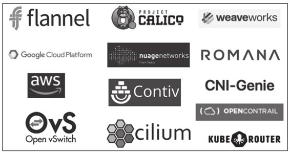

图12-9　部分容器网络提供商

从程序功能上看，CNM和CNI的网络插件提供的能力都能划分为网络的管理与IP地址的管理两类，插件可以选择只实现其中的某一功能，也可以全部实现。

·管理网络创建与删除。解决如何创建网络，如何将容器接入网络，以及如何退出和删除网络。这个过程实际上是对容器网络的生命周期管理，如果你更熟悉Docker命令，可以类比理解为docker network命令所做的事情。CNM规范中定义了创建网络、删除网络、容器接入网络、容器退出网络、查询网络信息、创建通信Endpoint、删除通信Endpoint等十个编程接口，而CNI中就更加简单了，只要实现对网络的增加与删除两项操作即可。你甚至不需要学过Go语言，只从名称上就能轻松看明白以下接口中每个方法的含义是什么。

```
type CNI interface {
    AddNetworkList (net *NetworkConfigList, rt *RuntimeConf) (types.Result, error)
    DelNetworkList (net *NetworkConfigList, rt *RuntimeConf) error
    AddNetwork (net *NetworkConfig, rt *RuntimeConf) (types.Result, error)
    DelNetwork (net *NetworkConfig, rt *RuntimeConf) error
}
```

·管理IP地址分配与回收。解决如何为三层网络分配唯一的IP地址的问题。二层网络的MAC地址天然具有唯一性，所以无须刻意地考虑如何分配的问题。但是三层网络的IP地址只有通过精心规划，才能保证在全局网络中都是唯一的，否则，如果两个容器之间存在相同地址，那它们最多只能做NAT，而不可能做到直接通信。

相比基于UUID或者数字序列实现的全局唯一ID产生器，IP地址的全局分配工作要更困难一些。首先是要符合IPv4的网段规则，且保证不重复，这在分布式环境里只能依赖etcd、ZooKeeper等协调工具来实现，Docker自己也提供了类似的libkv来完成这项工作。其次是必须考虑回收的问题，否则一旦Pod发生持续重启就有可能耗尽某个网段中的所有地址。最后是必须关注时效性，原本获取IP地址时采用标准的DHCP协议（Dynamic Host Configuration Protocol，动态主机配置协议）即可，但DHCP有可能产生长达数秒的延迟，对于某些生存周期很短的Pod，这已经超出了它的忍受限度，因此在容器网络中，往往Host-Local的IP分配方式会比DHCP更实用。

#### 12.2.2 CNM到CNI

容器网络标准能够提供一致的网络操作界面，无论什么网络插件都使用一致的API，提高了网络配置的自动化程度，提升了在不同网络间迁移的体验，对最终用户、容器提供商、网络提供商来说是三方共赢的事情。

CNM规范发布以后，借助Docker在容器领域的强大号召力，很快得到了网络提供商与开源组织的支持，不说专门为Docker设计针对容器互联的网络，最起码会让现有的网络方案兼容于CNM规范，以便能在容器圈中多分一杯羹，譬如Cisco的Contiv、OpenStack的Kuryr、Open vSwitch的OVN（Open Virtual Networking）以及来自开源项目的Calico和Weave等都是CNM阵营中的成员。唯一对CNM持不同意见的是那些和Docker存在直接竞争关系的产品，譬如Docker的最大竞争对手，来自CoreOS公司的RKT容器引擎。其实凭良心说，并不是其他容器引擎想刻意去抵制CNM，而是Docker制定CNM规范时完全是基于Docker本身来设计，并没有考虑CNM用于其他容器引擎的可能性。

为了平衡CNM规范的影响力，也为了在Docker的主导背景下寻找一条出路，RKT提出了与CNM目标类似的“RKT网络提案”（RKT Networking Proposal）。一个业界标准成功与否，很大程度上取决于它的支持者阵营的规模，对于容器网络这种插件式的规范更是如此。Docker力推的CNM毫无疑问是当时统一容器网络标准的最有力竞争者，如果没有外力的介入，有极大可能成为最后的胜利者。然而，影响容器网络发展的外力还是出现了，即使此前笔者没有提过CNI，你也应该很容易猜到，在容器圈里能够掀翻Docker的“外力”，唯有Kubernetes一家而已。

Kubernetes在开源的初期（Kubernetes 1.5提出CRI规范之前），在容器引擎上是选择彻底绑定于Docker的，但是，在容器网络的选择上，Kubernetes一直坚持独立于Docker自己来维护网络。在CNM和CNI提出之前，Kubernetes会使用Docker的空置网络模式（--network=none）来创建Pause容器，然后通过内部的kubenet来创建网络设施，再让Pod中的其他容器加入Pause容器的名称空间中以共享这些网络设施。

额外知识

kubenet

kubenet是kubelet内置的一个非常简单的网络，它采用网桥来实现Pod间通信。kubenet会自动创建一个名为cbr0的网桥，当有新的Pod启动时，会由kubenet自动将其接入cbr0网桥中，再将控制权交还给kubelet，完成后续的Pod创建流程。kubenet采用Host-Local的IP地址管理方式，具体来说是根据当前服务器对应的节点资源上的PodCIDR字段所设的网段来分配IP地址。当有新的Pod启动时，会由本地节点的IP段分配一个空闲的IP供Pod使用。

在CNM规范还未提出之前，Kubernetes自己来维护网络是必然的结果，因为Docker自带的网络基本上只聚焦于如何解决本地通信，完全无法满足Kubernetes跨集群节点的容器编排的需要。在CNM规范提出之后，原本Kubernetes应该是除Docker外最大的受益者才对，因为CNM的价值就是能很方便地引入其他网络插件来替代Docker自带的网络，但Kubernetes却对Docker的CNM规范表现得颇为犹豫，经过一番评估考量，Kubernetes最终决定转而支持当时极不成熟的RKT的网络提案，与CoreOS合作以RKT网络提案为基础发展出CNI规范。

Kubernetes Network SIG的负责人、Google的工程师Tim Hockin专门撰写过一篇文章——“Why Kubernetes doesn’t use libnetwork”来解释为何Kubernetes要拒绝CNM与libnetwork。当时“容器编排战争”还处于三国争霸（Kubernetes、Apache Mesos、Docker Swarm）的拉锯阶段，即使强势如Kubernetes，拒绝CNM其实也要冒不小的风险，付出颇大的代价，因为这个决定不可避免会引发一系列技术和非技术的问题，譬如网络提供商要为Kubernetes专门编写不同的网络插件、由docker run命令启动的独立容器将无法与Kubernetes启动的容器直接通信，等等。

促使Kubernetes拒绝CNM的理由也同样有来自于技术和非技术方面的。技术方面，Docker的网络模型做出了许多对Kubernetes无效的假设：Docker的网络有本地网络（不带任何跨节点协调能力，譬如Bridge模式就没有全局统一的IP分配）和全局网络（跨主机的容器通信，例如Overlay模式）的区别，本地网络对Kubernetes来说毫无意义，而全局网络又默认依赖libkv来实现全局IP地址管理等跨机器的协调工作。这里的libkv是Docker建立的lib*家族中的另一位成员，用来对标etcd、ZooKeeper等分布式K/V存储，这对于已经拥有了etcd的Kubernetes来说如同鸡肋。非技术方面，Kubernetes决定放弃CNM的原因很大程度上还是他们与Docker在发展理念上的冲突，Kubernetes当时已经开始推进Docker从必备依赖变为可选引擎的重构工作，而Docker则坚持CNM只能基于Docker来设计。Tim Hockin在文章中举了一个例子：CNM的网络驱动没有向外部暴露网络所连接容器的具体名称，只使用一个内部分配的ID来代替，这让外部（包括网络插件和容器编排系统）很难将网络连接的容器与自己管理的容器关联起来，当他们向Docker开发人员反馈这个问题时，被以“工作符合预期结果”（Working as Intended）为理由直接关闭掉。Tim Hockin还专门列出了这些问题的详细清单，如libnetwork#139、libnetwork#486、libnetwork#514、libnetwork#865、docker#18864，这些问题被Kubernetes认为是人为地使用CNM给非Docker的第三方容器引擎设置障碍。在整个沟通过程中，Docker表现得也极为强硬，明确表示他们对偏离当前路线或委托控制的想法都不太欢迎。上面这些“非技术”的问题，即使没有Docker的支持，Kubernetes自己也并非不能从“技术上”去解决，但Docker的理念令Kubernetes感到忧虑，因为Kubernetes在Docker之上扩展了很多功能，且不想将这些功能永远绑定在Docker之上。

CNM与libnetwork是在2015年5月1日发布，CNI则是在2015年7月发布，两者正式诞生只相差不到两个月时间，这显然是竞争的需要而非单纯的巧合。五年之后的今天，这场容器网络的话语权之争已经尘埃落定，CNI获得全面的胜利，除了Kubernetes和RKT外，Amazon ECS、RedHat OpenShift、Apache Mesos、Cloud Foundry等容器编排圈子中除了Docker之外的其他具有影响力的参与者都已宣布支持CNI规范，原本已经加入了CNM阵营的Contiv、Calico、Weave网络提供商也纷纷推出了自己的CNI插件。

#### 12.2.3 网络插件生态

时至今日，支持CNI的网络插件已多达数十种，笔者不太可能逐一细说，不过，跨主机通信的网络实现模式只有下面这三种，我们不妨以网络实现模式为主线，针对每种模式介绍一个具有代表性的插件，以达到对网络插件生态窥斑见豹的效果。

·Overlay模式：我们已经学习过Overlay网络，知道这是一种虚拟化的上层逻辑网络，好处在于它不受底层物理网络结构的约束，有更大的自由度，更好的易用性；坏处是由于额外的包头封装导致信息密度降低，额外的隧道封包、解包会导致传输性能下降。

在虚拟化环境（例如OpenStack）中的网络限制往往较多，譬如不允许机器之间直接进行二层通信，只能通过三层转发。在这类被限制网络的环境里，基本上只能选择Overlay网络插件，常见的Overlay网络插件有Flannel（VXLAN模式）、Calico（IPIP模式）、Weave等。

这里以Flannel-VXLAN为例，由CoreOS开发的Flannel可以说是最早的跨节点容器通信解决方案，很多其他网络插件的设计中都能找到Flannel的影子。早在2014年，VXLAN还没有进入Linux内核的时候，Flannel就已经开始流行，当时的Flannel只能采用自定义的UDP封包实现自己私有协议的Overlay网络，由于封包、解包的操作只能在用户态中进行，而数据包在内核态的协议栈中流转，导致数据要在用户态、内核态之间反复复制，性能堪忧。从此Flannel就给人留下了速度慢的坏印象。VXLAN进入Linux内核后，这种内核态、用户态的转换消耗完全消失，Flannel-VXLAN的效率比起Flannel-UDP有了很大提升，目前已经成为最常用的容器网络插件之一。

·路由模式：路由模式其实属于Underlay模式的一种特例，这里将它单独作为一种网络实现模式来介绍。相比Overlay网络，路由模式的主要区别在于它的跨主机通信是直接通过路由转发来实现的，因而无须在不同主机之间进行隧道封包。这种模式的好处是性能比Overlay网络有明显提升，坏处是路由转发要依赖底层网络环境的支持，并不是你想做就能做到的。路由网络要求要么所有主机都位于同一个子网之内，都是二层连通的，要么不同二层子网之间由支持边界网关协议（Border Gateway Protocol，BGP）的路由相连，并且网络插件也同样支持BGP协议去修改路由表。

上一节介绍Linux网络基础知识时，笔者提到在Linux系统中不需要专门的虚拟路由，因为Linux本身就具备路由的功能。路由模式就是依赖Linux内置在系统之中的路由协议，将路由表分发到子网的每一台物理主机的。这样，当跨主机访问容器时，Linux主机可以根据自己的路由表得知该容器具体位于哪台物理主机之中，从而直接将数据包转发过去，避免了VXLAN的封包、解包而导致的性能降低。常见的路由网络有Flannel（HostGateway模式）、Calico（BGP模式）等。

这里以Flannel-HostGateway为例，Flannel通过在各个节点上运行的Flannel Agent（Flanneld）将容器网络的路由信息设置到主机的路由表上，这样一来，所有的物理主机都将拥有整个容器网络的路由数据，且容器间的数据包可以被Linux主机直接转发，使得通信效率与裸机直连相差无几。不过，由于Flannel Agent只能修改运行主机上的路由表，一旦主机之间隔了其他路由设备，譬如路由器或者三层交换机，这个包就会在路由设备上被丢掉，要解决这种问题就必须依靠BGP路由和Calico-BGP这类支持标准BGP协议修改路由表的网络插件共同协作才行。

·Underlay模式：这里的Underlay模式特指让容器和宿主机处于同一网络，两者拥有相同地位的网络方案。Underlay网络要求容器的网络接口能够直接与底层网络进行通信，因此该模式是直接依赖于虚拟化设备与底层网络能力的。常见的Underlay网络插件有MACVLAN、SR-IOV（Single Root I/O Virtualization）等。

对于真正的大型数据中心、大型系统，Underlay模式才是最有发展潜力的网络实现模式。这种模式能够最大限度地利用硬件的能力，往往有着最优秀的性能表现。但也是由于它直接依赖于硬件与底层网络环境，必须根据软、硬件情况来进行部署，难以做到Overlay网络那样开箱即用的灵活性。

这里以SR-IOV为例，SR-IOV不是某种专门的网络名字，而是一种将PCIe设备共享给虚拟机使用的硬件虚拟化标准，目前多用于网络设备中，理论上也可以支持其他的PCIe硬件。通过SR-IOV能够让硬件在虚拟机上实现独立的内存地址、中断和DMA流，而无须虚拟机管理系统的介入。对于容器系统来说，SR-IOV的价值是可以直接在硬件层面虚拟多张网卡，并且以硬件直通（Passthrough）的形式交付给容器使用。但是SR-IOV直通部署起来通常比较烦琐，现在容器用的SR-IOV方案很多是使用MACVTAP来对SR-IOV网卡进行转接的，MACVTAP提升了SR-IOV的易用性，但是这种转接又会带来额外的性能损失，并不一定会比其他网络方案有更好的表现。

了解过CNI插件大致的实现原理与分类后，相信你的下一个问题就是哪种CNI网络最好？如何选择合适的CNI插件？选择CNI网络插件时主要有两方面的考量因素，首先必须是你的系统所处的环境是支持CNI插件的，这点在前面已经有针对性地介绍过。在环境可以支持的前提下，另外一个因素就是性能与功能方面是否合乎你的要求。

性能方面，笔者引用一组测试数据供你参考。这些数据来自于2020年8月刊登在IETF的论文“Considerations for Benchmarking Network Performance in Containerized Infrastructures”[1]，文中测试了不同CNI插件在裸金属服务器之间（BMP to BMP，Bare Metal Pod）、虚拟机之间（VMP to VMP，Virtual Machine Pod），以及裸金属服务器与虚拟机之间（BMP to VMP）的本地网络和跨主机网络的通信表现。囿于篇幅，这里只列出最具代表性的裸金属服务器之间的跨主机通信，其吞吐量和延迟时间的结果如图12-10与图12-11所示。

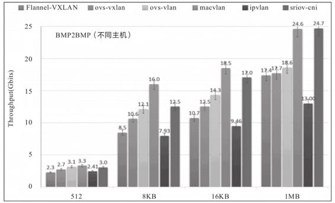

图12-10　512字节～1MB字节中TCP吞吐量（结果越高，性能越好）

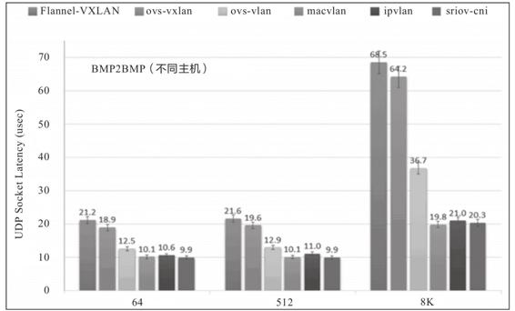

图12-11　64字节～8KB字节中UDP延迟时间（结果越低，性能越好）

由测试结果可见，MACVLAN和SR-IOV这样的Underlay网络插件的吞吐量最高、延迟最低，仅从网络性能上看它们肯定是最优秀的，而Flannel-VXLAN这样的Overlay网络插件，其吞吐量只有MACVLAN和SR-IOV的70%左右，延迟却高了两至三倍之多。可见Overlay为了易用性、灵活性所付出的代价还是不可忽视的，但是对于那些不以网络I/O为性能瓶颈的系统而言，这样的代价并非一定不可接受，就看你如何对通用性与性能进行权衡取舍。

功能方面的问题就比较简单了，完全取决于你的需求是否能够满足。对于容器编排系统来说，网络并非孤立的功能模块，只提供网络通信就可以。譬如Kubernetes的NetworkPolicy资源是用于描述“两个Pod之间是否可以访问”这类ACL策略，但它不属于CNI的范畴，因此不是每个CNI插件都会支持NetworkPolicy的声明，如果有这方面的需求，就应该放弃Flannel，去选择Calico、Weave等插件。类似的例子还有很多，笔者不再一一列举。

[1] 下载地址：https://tools.ietf.org/id/draft-dcn-bmwg-containerized-infra-01.html。
