## 第13章 持久化存储

容器是镜像的运行时实例，为了保证镜像能够重复地产出具备一致性的运行时实例，必须要求镜像本身是持久且稳定的，这决定了在容器中发生的一切数据变动操作都不能真正写入镜像当中，否则必然会破坏镜像稳定不变的性质。为此，容器中的数据修改操作大多是基于写入时复制（Copy-on-Write）策略来实现的，容器会利用叠加式文件系统（OverlayFS）的特性，在用户意图修改镜像时，自动将变更的内容写入独立区域，再与原有数据叠加到一起，使其从外观上看来像是“覆盖”了原有内容。这种改动通常都是临时的，一旦容器终止运行，这些存储于独立区域中的变动信息也将被一并移除，不复存在。由此可见，如果不进行额外的处理，容器默认是不具备持久化存储能力的。

而另一方面，容器作为信息系统的运行载体，必定会产出有价值的、应该被持久保存的信息，譬如扮演数据库角色的容器，大概没有什么系统能够接受数据库像缓存服务一样重启之后丢失全部数据；多个容器之间也经常需要通过共享存储来实现某些交互操作，譬如以前举过的例子，Nginx容器产生日志、Filebeat容器收集日志，两者需要共享同一块日志存储区域才能协同工作。正因为镜像的稳定性与生产数据的持久性存在矛盾，由此才产生了本章的主题：如何实现容器的持久化存储。

### 13.1 Kubernetes存储设计

Kubernetes在规划持久化存储能力的时候，依然遵循着它的一贯设计哲学，即用户负责以资源和声明式API来描述自己的意图，Kubernetes负责根据用户意图来完成具体的操作。不过，仅描述清楚用户的存储意图也并不是一件容易的事，相比Kubernetes提供的其他能力的资源，其内置的存储资源显得格外复杂，甚至可以说是有些烦琐的。如果你是Kubernetes的拥趸，无法认同笔者对Kubernetes的评价，那不妨来看一看下列围绕“Volume”所衍生出的概念，它们仅仅是与Kubernetes存储相关的概念的一个子集而已，请你思考一下这些概念是否全都是必需的，是否还有整合的空间，以及是否有化繁为简的可能性。

额外知识

概念：Volume、PersistentVolume、PersistentVolumeClaim、Provisioner、StorageClass、Volume Snapshot、Volume Snapshot Class、Ephemeral Volumes、FlexVolume Driver、Container Storage Interface、CSI Volume Cloning、Volume Limits、Volume Mode、Access Modes、Storage Capacity……

操作：Mount、Bind、Use、Provision、Claim、Reclaim、Reserve、Expand、Clone、Schedule、Reschedule……

诚然，Kubernetes提出了如此多关于存储的概念，最重要的原因是存储技术本来就门类众多，为了尽可能多地兼容各种存储技术，Kubernetes不得不预置了很多In-Tree（意思是在Kubernetes的代码树里）插件来对接，让用户根据自己的业务按需选择。同时，为了兼容那些不在预置范围内的需求场景，支持用户使用FlexVolume或者CSI来定制Out-of-Tree（意思是在Kubernetes的代码树之外）插件，实现更加丰富多样的存储能力。表13-1列出了Kubernetes目前提供的部分存储与扩展插件。

表13-1　Kubernetes目前提供的部分存储扩展插件

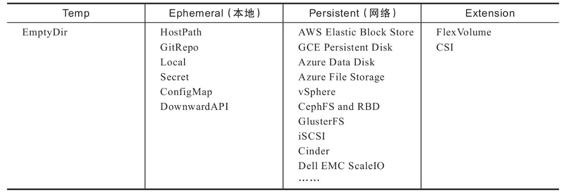

迫使Kubernetes的存储设计如此复杂的另外一个非技术层面的原因是：Kubernetes是一个工业级的、面向生产应用的容器编排系统，这意味着即使发现某些已存在的功能有更好的实现方式，直到旧版本被淘汰前，原本已支持的功能都不允许突然间被移除或者替换掉，否则，如果生产系统更新版本，已有的功能就出现异常，那么产品累积的良好信誉就会受损。

为了兼容而导致的烦琐，在一定程度上可以被谅解，但这样的设计的确令Kubernetes的学习曲线变得更加陡峭。Kubernets官方文档的主要作用是提供参考，它并不会告诉你Kubernetes中各种概念的演化历程、版本发布新功能的时间线、改动的缘由与背景等信息。Kubernetes的文档系统只会以“平坦”的方式来陈述所有目前可用的功能，这有利于熟练的管理员快速查询到关键信息，却不利于初学者去理解Kubernetes的设计思想。由于难以理解那些概念和操作的本意，初学者往往只能死记硬背，也很难分辨出它们应该如何被“更正确”的使用。所以，介绍Kubernetes设计理念的职责，只能由Kubernetes官方的Blog这类定位超越了参考手册的信息渠道或者其他非官方资料去完成。本节，笔者会以Volume概念从操作系统到Docker再到Kubernetes的演进历程为主线，梳理前面提及的那些概念与操作，以此帮助大家理解Kubernetes的存储设计。

#### 13.1.1 Mount和Volume

Mount和Volume都是源自操作系统的常用术语。Mount是动词，表示将某个外部存储挂载到系统中；Volume是名词，表示物理存储的逻辑抽象，目的是为物理存储提供有弹性的分割方式。容器源于对操作系统层的虚拟化，为了满足容器内生成数据的外部存储需求，很自然地会将Mount和Volume的概念延拓至容器中。我们要了解容器存储的发展，不妨就以Docker的Mount操作为起始点。

目前，Docker内置了三种挂载类型，分别是Bind（--mount type=bind）、Volume（--mount type=volume）和tmpfs（--mount type=tmpfs），如图13-1所示。其中tmpfs用于在内存中读写临时数据，不属于本节主要讨论的对象持久化存储范畴，所以后面我们只着重关注Bind和Volume两种挂载类型。

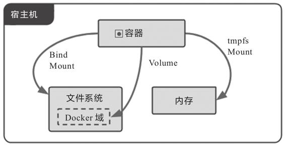

图13-1　Docker的三种挂载类型

Bind Mount是Docker最早提供的（发布时就支持）挂载类型，作用是把宿主机的某个目录（或文件）挂载到容器的指定目录（或文件）下，譬如以下命令中参数-v表达的意思就是将外部的HTML文档挂载到Nginx容器的默认网站根目录下：

```
docker run -v /icyfenix/html:/usr/share/nginx/html nginx:latest
```

请注意，虽然命令中的-v参数是--volume的缩写，但-v最初只是用来创建Bind Mount而不是创建Volume Mount的，这种迷惑的行为也并非Docker的本意，只是由于Docker刚发布时考虑得不够周全，随随便便就在参数中占用了Volume这个词，到后来真的需要扩展Volume的概念来支持Volume Mount时，前面的-v已经被用户广泛使用了，所以只得如此将就着继续用。从Docker 17.06版本开始，它在Docker Swarm中借用了--mount参数，该参数默认创建的是Volume Mount，可以通过明确的type子参数来指定另外两种挂载类型。上面的命令等价于如下形式：

```
docker run --mount type=bind,source=/icyfenix/html,destination=/usr/share/
    nginx/html nginx:latest
```

从Bind Mount到Volume Mount，实质是容器发展过程中对存储抽象能力提升的外在表现。从Bind这个名字以及Bind Mount的实际功能可以合理地推测出，Docker最初认为Volume就只是一种“外部宿主机的磁盘存储到内部容器的映射关系”，但后来发现事情并没有那么简单：存储的位置并不局限于外部宿主机，存储的介质并不局限于物理磁盘，存储的管理也并不局限于映射关系。

譬如，Bind Mount只允许容器与本地宿主机之间建立某个目录的映射，如果想要在不同宿主机上的容器共享同一份存储，就必须先把共享存储挂载到每一台宿主机操作系统的某个目录下，然后才能逐个挂载到容器内使用，这种跨宿主机共享存储的场景如图13-2所示。

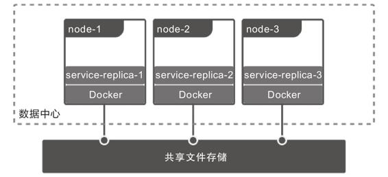

图13-2　跨主机的共享存储需求

这种存储范围超越了宿主机的共享存储，配置过程却要涉及大量与宿主机环境相关的操作，只能由管理员人工去完成，不仅烦琐，而且很难自动化（每台宿主机环境的差异所致）。

又譬如，即便只考虑单台宿主机的情况，基于可管理性的需求，Docker也完全有支持Volume Mount的必要。在Bind Mount的设计里，Docker只有容器的控制权，而存放容器生产数据的主机目录是完全独立的，与Docker没有任何关系，既不受Docker保护，也不受Docker管理。数据很容易被其他进程访问到，甚至被修改和删除。如果用户想对挂载的目录进行备份、迁移等管理运维操作，也只能在Docker之外靠管理员人工进行，增加了数据安全与操作意外的风险。因此，Docker希望能有一种抽象的资源来代表在宿主机或网络中存储的区域，以便让Docker能管理这些资源，由此就很自然地联想到了操作系统里Volume的概念。

提出Volume的最核心的目的是提升Docker对不同存储介质的支撑能力，这同时也可以减轻Docker本身的工作量。存储并不是仅有挂载在宿主机上的物理存储这一种介质，云计算时代，网络存储逐渐成为数据中心的主流选择，不同的网络存储有各自的协议和交互接口，而且并非所有存储系统都适合先挂载到操作系统，再挂载到容器上，如果Docker想要越过操作系统去支持挂载某种存储系统，首先必须要知道该如何访问它，然后才能将容器中的读写操作自动转移到该位置。Docker把解决如何访问存储系统的功能模块称为存储驱动（Storage Driver）。通过docker info命令，你能查看到当前Docker所支持的存储驱动。虽然Docker已经内置了市面上主流的OverlayFS驱动，譬如Overlay、Overlay2、AUFS、BTRFS、ZFS等，但面对云计算的快速迭代，仅靠Docker自己来支持全部云计算厂商的存储系统是完全不现实的，为此，Docker提出了与Storage Driver相对应的Volume Driver（卷驱动）的概念。用户可以通过docker plugin install命令安装外部的卷驱动，并在创建Volume时指定一个与其存储系统相匹配的卷驱动，譬如希望数据存储在AWS Elastic Block Store上，就找一个AWS EBS的驱动，如果想存储在Azure File Storage上，就找一个对应的Azure File Storage驱动。如果创建Volume时不指定卷驱动，将默认为local类型，在Volume中存放的数据会存储在宿主机的/var/lib/docker/volumes/目录中。

#### 13.1.2 静态存储分配

现在我们把讨论主角转回容器编排系统上。Kubernetes同样将操作系统和Docker的Volume概念延续了下来，并对其进行了细化。Kubernetes将Volume分为持久化的PersistentVolume和非持久化的普通Volume两类。为了不与前面定义的Volume概念混淆，后面特指Kubernetes中非持久化的Volume时，都会带着“普通”这个前缀。

普通Volume的设计目标不是为了持久地保存数据，而是为同一个Pod中多个容器提供可共享的存储资源，因此Volume具有十分明确的生命周期——与挂载它的Pod相同的生命周期，这意味着尽管普通Volume不具备持久化的存储能力，但至少比Pod中运行的任何容器的存活期都更长。Pod中不同的容器能共享相同的普通Volume，当容器重新启动时，普通Volume中的数据也能够保留。当然，一旦整个Pod被销毁，普通Volume也将不复存在，数据在逻辑上也会被销毁掉，至于实质上是否会真正删除数据，就取决于存储驱动具体是如何实现Unmount、Detach、Delete接口的，由于本节的主题为“持久化存储”，所以无持久化能力的普通Volume就不再展开介绍了。

从操作系统里传承下来的Volume概念，在Docker和Kubernetes中继续按照一致的逻辑延伸拓展，只不过Kubernetes为将其与普通Volume区别开来，专门取了PersistentVolume这个名字，你可以从图13-3中直观地看出普通Volume、PersistentVolume和Pod之间的关系差异。

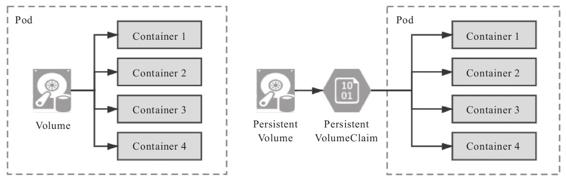

图13-3　普通Volume与PersistentVolume的差别

从Persistent这个单词就能看出，PersistentVolume是指能够持久化存储数据的一种资源对象，它可以独立于Pod存在，且生命周期与Pod无关，因此也决定了PersistentVolume不应该依附于任何一个宿主机节点，否则必然会对Pod调度产生干扰限制。前面表13-1中Persistent一列里都是网络存储便是很好的印证。

额外知识

Local PersistentVolume

对于部署在云端数据中心的系统，通过网络访问同一个可用区中的远程存储，速度是完全可以接受的。但对于私有部署的系统，基于性能考虑，使用本地存储往往更为常见。

考虑到这样的实际需求，从1.10版本起，Kubernetes开始支持Local Persistent-Volume，这是一种将一整块本地磁盘作为PersistentVolume供容器使用的专用方案。“专用方案”就是字面意思，即Local PersistentVolume并不适用于全部应用，只是针对以磁盘I/O为瓶颈的特定场景的解决方案，副作用十分明显：由于不能保证这种本地磁盘在每个节点中都一定存在，所以Kubernetes在调度时就必须考虑到PersistentVolume的分布情况，只能把使用了Local PersistentVolume的Pod调度到有这种PersistentVolume的节点上。调度器中专门有个Volume Binding模式来支持这项处理，但一旦使用了Local PersistentVolume，无疑会限制Pod的可调度范围。

将PersistentVolume与Pod分离后，便需要专门考虑PersistentVolume该如何被Pod引用的问题。原本在Pod中引用其他资源是常有的事，要么通过资源名称直接引用，要么通过标签选择器（Selector）间接引用。但是类似的方法在这里却都不太妥当，至于原因，请你想一下“Pod该使用何种存储”这件事情应该是由系统管理员（运维人员）说了算，还是由用户（开发人员）说了算。最合理的答案是他们一起说了才算，因为只有开发人员能准确评估Pod需要消耗多大的存储空间，只有运维人员清楚地知道当前系统可以使用的存储设备状况。为了让他们得以提供各自擅长的信息，Kubernetes又额外设计出了PersistentVolumeClaim资源。Kubernetes官方给出的概念定义也特别强调了PersistentVolume是由管理员（运维人员）负责维护，由用户（开发人员）通过PersistentVolumeClaim来匹配到合乎需求的PersistentVolume。

额外知识

PersistentVolume是由管理员负责提供的集群存储。

PersistentVolumeClaim是由用户负责提供的存储请求。

——Kubernetes Documentation/Reference，PersistentVolume

PersistentVolume是Volume这个抽象概念的具象化表现，通俗地说，它是已经被管理员分配好的具体的存储，这里的“具体”是指有明确的存储系统地址，有明确的容量、访问模式、存储位置等信息；而PersistentVolumeClaim则是Pod对其所需存储能力的声明，通俗地说就是满足这个Pod正常运行要满足怎样的条件，譬如要消耗多大的存储空间、要支持怎样的访问方式。因此两者并不是谁引用谁的固定关系，而是根据实际情况动态匹配的，两者配合的具体工作过程如下。

1）管理员准备好要使用的存储系统，它应是某种网络文件系统（NFS）或者云储存系统，一般来说应该具备跨主机共享的能力。

2）管理员根据存储系统的实际情况手工预先分配好若干个PersistentVolume，并定义好每个PersistentVolume可以提供的具体能力。譬如以下例子所示：

```
apiVersion: v1
kind: PersistentVolume
metadata:
  name: nginx-html
spec:
  capacity:
    storage: 5Gi                          # 最大容量为5GB
  accessModes:
    - ReadWriteOnce                       # 访问模式为RXO
  persistentVolumeReclaimPolicy: Retain   # 回收策略是Retain
  nfs:                                    # 存储驱动是NFS
    path: /html
    server: 172.17.0.2
```

以上YAML中定义的存储能力具体为：

·存储的最大容量是5GB。

·存储的访问模式是“只能被一个节点读写挂载”（ReadWriteOnce，RWO），另外两种可选的访问模式是“可以被多个节点以只读方式挂载”（ReadOnlyMany，ROX）和“可以被多个节点读写挂载”（ReadWriteMany，RWX）。

·存储的回收策略是Retain，即在Pod被销毁时并不会删除数据。另外两种可选的回收策略分别是Recycle和Delete。Recycle策略下在Pod被销毁时，由Kubernetes自动执行rm-rf/volume/*这样的命令来自动删除资料。Delete策略下，Kubernetes会自动调用AWS EBS、GCE PersistentDisk、OpenStack Cinder这些云存储的删除指令。

·存储驱动是NFS，其他常见的存储驱动还有AWS EBS、GCE PD、iSCSI、RBD（Ceph Block Device）、GlusterFS、HostPath等。

3）用户根据业务系统的实际情况创建PersistentVolumeClaim，声明Pod运行所需的存储能力。譬如以下例子所示：

```
kind: PersistentVolumeClaim
apiVersion: v1
metadata:
  name: nginx-html-claim
spec:
  accessModes:
    - ReadWriteOnce    # 支持RXO访问模式
  resources:
    requests:
      storage: 5Gi     # 最小容量5GB
```

以上YAML中声明了容量不得小于5GB，必须支持RWO的访问模式。

4）Kubernetes在创建Pod的过程中，会根据系统中PersistentVolume与Persistent-VolumeClaim的供需关系对两者进行撮合。如果系统中存在满足PersistentVolumeClaim声明中要求能力的PersistentVolume，则撮合成功，将它们绑定。如果撮合不成功，Pod就不会被继续创建，直至系统中出现新的或让出空闲的PersistentVolume资源。

5）以上几步都顺利完成的话，意味着Pod的存储需求得到了满足，可继续Pod的创建过程。整个过程如图13-4所示。

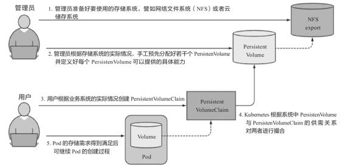

图13-4　PersistentVolumeClaim与PersistentVolume的工作过程[1]

Kubernetes对PersistentVolumeClaim与PersistentVolume的撮合结果是产生一对一的绑定关系，“一对一”的意思是PersistentVolume一旦绑定在某个PersistentVolumeClaim上，直到释放以前都会被这个PersistentVolumeClaim所独占，不能再与其他Persistent-VolumeClaim进行绑定。这意味着即使PersistentVolumeClaim申请的存储空间比Persistent-Volume能够提供的要少，依然要求整个存储空间都为该PersistentVolumeClaim所用，这有可能会造成资源的浪费。譬如，某个PersistentVolumeClaim要申请3GB的存储容量，而当前Kubernetes手上只剩下一个5 GB的PersistentVolume，此时Kubernetes只好将这个PersistentVolume与申请资源的PersistentVolumeClaim进行绑定，平白浪费了2 GB空间。假设后续有另外一个PersistentVolumeClaim申请2 GB的存储空间，那它也只能等待管理员分配新的PersistentVolume，或者有其他PersistentVolume被回收之后才能被成功分配。

[1] 图片来自《Kubernetes in Action》：https://www.manning.com/books/kubernetes-in-action。

#### 13.1.3 动态存储分配

对于中小规模的Kubernetes集群，PersistentVolume已经能够满足有状态应用的存储需求，它依靠人工介入来分配空间的设计，简单直观，却算不上先进，一旦应用规模增大，其很难被自动化的问题就会突显出来。这是由于在Pod创建过程中去挂载某个Volume时，要求该Volume必须是真实存在的，否则Pod启动可能依赖的数据（如一些配置、数据、外部资源等）都将无从读取。Kubernetes有能力随着流量压力和硬件资源状况，自动扩缩Pod的数量，但是当Kubernetes自动扩展出一个新的Pod时，并没有办法让Pod去自动挂载一个还未被分配资源的PersistentVolume。想解决这个问题，要么允许多个不同的Pod共用相同的PersistentVolumeClaim，这种方案确实只靠PersistentVolume就能解决，却损失了隔离性，难以通用；要么就要求每个Pod用到的PersistentVolume都是已经被预先建立并分配好的，这种方案靠管理员提前手工分配好是可以实现的，却损失了自动化能力。

无论哪种情况，都难以符合Kubernetes工业级编排系统的产品定位，对于大型集群，面对成百上千，甚至成千上万的Pod，靠管理员手工分配存储肯定是难以应付的。在2017年Kubernetes发布1.6版本后，终于提供了今天被称为动态存储分配（Dynamic Provisioning）的动态存储解决方案，让系统管理员摆脱了人工分配PersistentVolume的窘境，与之相对，人们把此前的分配方式称为静态存储分配（Static Provisioning）。

所谓动态存储分配方案，是指在用户声明存储能力的需求时，不是通过Kubernetes撮合来获得一个管理员人工预置的PersistentVolume，而是由特定的资源分配器（Provisioner）自动地在存储资源池或者云存储系统中分配符合用户存储需求的PersistentVolume，然后挂载到Pod中使用。完成这项工作的资源被命名为StorageClass，它的具体工作过程如下。

1）管理员根据存储系统的实际情况，先准备好对应的资源分配器。Kubernetes官方已经提供了一系列预置的In-Tree资源分配器，放置在kubernetes.io的API组之下。其中部分资源分配器已经有了官方的CSI驱动，譬如vSphere的Kubernetes自带驱动为kubernetes.io/vsphere-volume，VMware的官方驱动为csi.vsphere.vmware.com。

2）管理员不再手工分配PersistentVolume，而是根据存储配置StorageClass。Pod是可以动态扩缩的，而存储则是相对固定的，哪怕使用的是具有扩展能力的云存储，也会将它们视为存储容量、IOPS等参数可变的固定存储来看待。譬如你可以将来自不同云存储提供商、不同性能、支持不同访问模式的存储配置为各种类型的StorageClass，这也是它名字中“Class”（类型）的由来，如以下例子所示：

```
apiVersion: storage.k8s.io/v1
kind: StorageClass
metadata:
  name: standard
provisioner: kubernetes.io/aws-ebs  #AWS EBS的Provisioner
parameters:
  type: gp2
reclaimPolicy: Retain
```

3）用户依然通过PersistentVolumeClaim来声明所需的存储，但是应在声明中明确指出该由哪个StorageClass来代替Kubernetes处理该PersistentVolumeClaim的请求，譬如以下例子所示：

```
apiVersion: v1
kind: PersistentVolumeClaim
metadata:
  name: standard-claim
spec:
  accessModes:
  - ReadWriteOnce
  storageClassName: standard  #明确指出该由哪个StorageClass来处理该PersistentVolumeClaim的请求
  resource:
    requests:
      storage: 5Gi
```

4）如果PersistentVolumeClaim中要求的StorageClass及它用到的资源分配器均可用，那这个StorageClass就会接管原本由Kubernetes撮合PersistentVolume与PersistentVolumeClaim的操作，按照PersistentVolumeClaim中声明的存储需求，自动生成满足该需求的PersistentVolume描述信息，并发送给资源分配器处理。

5）资源分配器接收到StorageClass发来的创建PersistentVolume的请求后，会操作其背后的存储系统去分配空间，如果分配成功，就生成并返回符合要求的PersistentVolume供Pod使用。

6）以上几步都顺利完成的话，意味着Pod的存储需求得到了满足，可继续Pod的创建过程，整个过程如图13-5所示。

Dynamic Provisioning与Static Provisioning并不是各有用途的互补设计，而是对同一个问题先后出现的两种解决方案。你完全可以只用Dynamic Provisioning来满足所有Static Provisioning能够满足的存储需求，包括那些不需要动态分配的场景，甚至之前例子里使用HostPath在本地静态分配存储的操作，都可以指定no-provisioner作为资源分配器的StorageClass，以Local Persistent Volume来代替，譬如以下例子所示：

```
apiVersion: storage.k8s.io/v1
kind: StorageClass
metadata:
  name: local-storage
provisioner: kubernetes.io/no-provisioner
volumeBindingMode: WaitForFirstConsumer
```

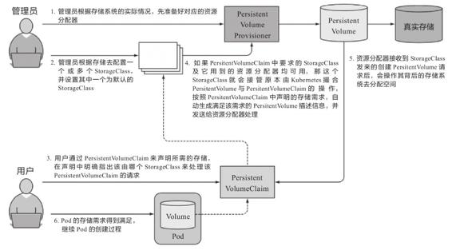

图13-5　StorageClass运作过程[1]

使用Dynamic Provisioning来分配存储无疑是更合理的设计，不仅省去了管理员的人工操作的中间层，而且不再需要将PersistentVolume这样的概念暴露给最终用户，因为Dynamic Provisioning里的PersistentVolume只是处理过程的中间产物，用户不需要接触和理解它，只需要知道由PersistentVolumeClaim去描述存储需求，由StorageClass去满足存储需求即可。只描述意图而不关心中间具体的处理过程是声明式编程的精髓，也是流程自动化的必要基础。

由Dynamic Provisioning来分配存储还能获得更高的可管理性，譬如前面提到的回收策略，当希望PersistentVolume跟随Pod一同被销毁时，以前经常会将回收策略配置为Recycle来回收空间，即让系统自动执行rm-rf/volume/*命令，这种方式往往过于粗暴，遇到更精细的管理需求，譬如“删除到回收站”或者“敏感信息粉碎式彻底删除”这样的功能时就很麻烦。而Dynamic Provisioning中由于有资源分配器的存在，其创建、回收都是由资源分配器的代码所管理，所以更灵活。现在Kubernetes官方已经明确建议废弃Recycle策略，如有这类需求，应由Dynamic Provisioning去实现。

Static Provisioning的主要使用场景已局限于管理员能够手工管理存储的小型集群，它符合很多小型系统尤其是私有化部署系统的现状，但并不符合当今运维自动化所提倡的思路。Static Provisioning的存在，在某种意义上也可以视为对历史的一种兼容，在可见的将来，Kubernetes肯定仍会把Static Provisioning作为用户分配存储的一种主要方案供用户选用。

[1] 图片来自《Kubernetes in Action》：https://www.manning.com/books/kubernetes-in-action。

### 13.2 容器存储与生态

容器存储具有很强的多样性，如何对接后端实际的存储系统并且完全发挥出它所有的功能，并不是Kubernetes团队所擅长的工作，这件事情只有存储提供商自己才能做到最好。由此可以理解容器编排系统为何会有很强烈的意愿把存储功能独立到外部去实现，在前面的讲解中，笔者已经反复提到In-Tree、Out-of-Tree插件，在这一节，我们会以存储插件的接口与实现为中心，去解析Kubernetes的容器存储生态。

#### 13.2.1 Kubernetes存储架构

正式开始讲解Kubernetes的In-Tree、Out-of-Tree存储插件前，我们有必要先了解一点Kubernetes存储架构的知识，大体上弄清楚一个真实的存储系统是如何接入新创建的Pod中，成为可以读写访问的Volume的，以及当Pod被销毁时，Volume如何被回收，回归到存储系统中的。Kubernetes参考了传统操作系统接入或移除新存储设备的做法，把接入或移除外部存储分解为以下三种操作。

·首先，决定应准备（Provision）哪种存储设备，Provision可类比为给操作系统扩容而购买了新的存储设备。这步确定了接入存储设备的来源、容量、性能以及其他技术参数，它的逆操作是移除（Delete）存储。

·然后，将准备好的存储设备附加（Attach）到系统中，Attach可类比为将存储设备接入操作系统，此时尽管设备还不能使用，但你已经可以用操作系统的fdisk-l命令看到设备。这步确定了存储的设备名称、驱动方式等面向系统侧的信息，它的逆操作是分离（Detach）存储设备。

·最后，将附加好的存储挂载（Mount）到系统中，Mount可类比为将设备挂载到系统的指定位置，也就是起到操作系统中mount命令的作用。这步确定了存储设备的访问目录、文件系统格式等面向应用侧的信息，它的逆操作是卸载（Unmount）存储设备。

以上提到的Provision、Delete、Attach、Detach、Mount、Unmount六种操作，并不是直接由Kubernetes来实现，而是在存储插件中完成的，它们会分别被Kubernetes通过两个控制器及一个管理器来调用，如图13-6所示，这些控制器、管理器的作用分别如下。

·PV控制器（PersistentVolume Controller）：在11.2节中介绍过，Kubernetes里所有的控制器都遵循相同的工作模式——让实际状态尽可能接近期望状态。PV控制器的期望状态有两个，分别是“所有未绑定的PersistentVolume都能处于可用状态”以及“所有处于等待状态的PersistentVolumeClaim都能匹配到与之绑定的PersistentVolume”。PV控制器内部也有两个相对独立的核心逻辑（ClaimWorker和VolumeWorker）来分别跟踪这两种期望状态，可以简单地理解为PV控制器实现了PersistentVolume和PersistentVolumeClaim的生命周期管理职能，在这个过程中，它会根据需要调用存储驱动插件的Provision/Delete操作。

·AD控制器（Attach/Detach Controller）：AD控制器的期望状态是“所有被调度到的准备创建新Pod的节点都附加了要使用的存储设备；当Pod被销毁后，原本运行Pod的节点都分离了不再使用的存储”，如果实际状态不符合该期望，会根据需要调用存储驱动插件的Attach/Detach操作。

·Volume管理器（Volume Manager）：Volume管理器实际上是kubelet的一部分，是kubelet的众多管理器之一，主要用来支持本节点中Volume执行Attach/Detach/Mount/Unmount操作。你可能注意到了，这里不仅有Mount/Unmount操作，也有Attach/Detach操作，这是历史原因导致的，由于最初版本的Kubernetes中并没有AD控制器，Attach/Detach操作也在kubelet中完成。现在kubelet默认情况下已经不再执行Attach/Detach操作了，但有少量旧程序已经依赖了由kubelet来执行Attach/Detach操作的内部逻辑，所以kubelet不得不设计一个--enable-controller-attach-detach参数，如果将其设置为false，就会重新回到旧的兼容模式上，由kubelet代替AD控制器来完成Attach/Detach操作。

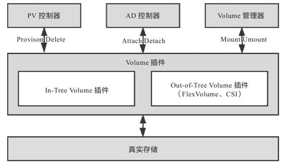

图13-6　Kubernetes存储架构

后端的真实存储依次经过Provision、Attach、Mount操作之后，就形成了可以在容器中挂载的Volume，当存储插件的生命周期完结，依次经过Unmount、Detach、Delete操作之后，Volume便能够被存储系统回收。对于某些存储插件来说，其中有一些操作可能是无效的，譬如NFS，实际使用中并不需要Attach，此时存储插件只需将Attach设置为空操作即可。

#### 13.2.2 FlexVolume与CSI

Kubernetes目前同时支持FlexVolume与CSI（Container Storage Interface，容器存储接口）两套独立的存储扩展机制。FlexVolume是Kubernetes很早期版本（1.2版本开始提供，1.8版本达到GA状态）就开始支持的扩展机制，它是只针对Kubernetes的私有的存储扩展，目前已经处于冻结状态，可以正常使用但不再发展新的功能。CSI则是从Kubernetes 1.9版本（1.13版本达到GA状态）开始加入的扩展机制，其组件架构如图13-7所示，与之前介绍过的CRI和CNI相同，CSI是公开的技术规范，任何容器运行时、容器编排引擎只要愿意支持，都可以使用CSI规范去扩展自己的存储能力，这是目前Kubernetes重点发展的扩展机制。

由于FlexVolume是为Kubernetes量身订做的，所以FlexVolume的实现逻辑与上一节介绍的Kubernetes的存储架构高度一致。FlexVolume驱动其实就是一个实现了Attach、Detach、Mount、Unmount操作的可执行文件（甚至可以仅仅是个Shell脚本）而已，该可执行文件应该存放在集群每个节点的/usr/libexec/kubernetes/kubelet-plugins/volume/exec目录里，其工作过程就是当AD控制器和Volume管理器需要进行Attach、Detach、Mount、Unmount操作时自动调用它的对应方法接口，如图13-7所示。

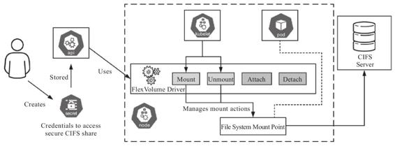

图13-7　FlexVolume Driver工作过程[1]

如果仅仅考虑支持最基本的Static Provisioning，那实现一个FlexVolume驱动确实是非常简单的。然而也是由于FlexVolume过于简单了，导致应用时会有诸多不便之处。

·FlexVolume并不是全功能的驱动：它不包含Provision和Delete操作，也就无法直接用于Dynamic Provisioning，除非你愿意再单独编写一个External Provisioner。

·FlexVolume的部署、维护都相对烦琐：它是独立于Kubernetes的可执行文件，当集群节点增加时，需要由管理员在新节点上部署FlexVolume驱动，有经验的系统管理员通常会专门编写一个DaemonSet来代替人工完成这项任务。

·FlexVolume实现复杂交互时也相对烦琐：FlexVolume的每一次操作，都是对插件可执行文件的一次独立调用，这种插件实现方式在各种操作需要相互通信时会很别扭。譬如你希望在执行Mount操作的时候生成一些额外的状态信息，供后面执行的Unmount操作使用，此时只能把信息记录在某个约定好的临时文件中，对于一个面向生产的容器编排系统，这样的做法实在是过于简陋了。

相比FlexVolume的种种不足，CSI可以说是一个十分完善的存储扩展规范，这里的“十分完善”并不是客套话，根据GitHub的自动代码行统计，FlexVolume的规范文档仅有155行，而CSI则长达2704行。总体上看，CSI规范可以分为需要容器系统去实现的组件以及需要存储提供商去实现的组件两大部分。前者包括存储整体架构、Volume的生命周期模型、驱动注册、Volume创建、挂载、扩容、快照、度量等内容，目前，通过Kubernetes提供的插件都已经完整地实现这些内容了，其中涉及的主要组件如下。

·Driver Register：负责注册第三方插件，CSI 0.3版本之后已经处于Deprecated状态，将会被Node Driver Register所取代。

·External Provisioner：调用第三方插件的接口来完成数据卷的创建与删除操作。

·External Attacher：调用第三方插件的接口来完成数据卷的挂载和操作。

·External Resizer：调用第三方插件的接口来完成数据卷的扩容操作。

·External Snapshotter：调用第三方插件的接口来完成快照的创建和删除操作。

·External Health Monitor：调用第三方插件的接口来提供度量监控数据功能。

需要存储提供商去实现的组件才是CSI的主体部分，即前文中多次提到的“第三方插件”。这部分着重定义了外部存储挂载到容器过程中所涉及操作的抽象接口和具体的通信方式，主要包括以下三个gRPC接口。

·CSI Identity接口：用于描述插件的基本信息，譬如插件版本号、插件所支持的CSI规范版本、插件是否支持存储卷创建及删除功能、是否支持存储卷挂载功能，等等。此外Identity接口还用于检查插件的健康状态，开发者可以通过实现Probe接口对外提供存储的健康度量信息。

·CSI Controller接口：用于从存储系统的角度对存储资源进行管理，譬如准备和移除存储（Provision、Delete操作）、附加与分离存储（Attach、Detach操作）、对存储进行快照，等等。存储插件并不一定要实现这个接口的所有方法，对于存储本身就不支持的功能，可以在CSI Identity接口中声明为不提供。

·CSI Node接口：用于从集群节点的角度对存储资源执行各种操作，譬如存储卷的分区和格式化、将存储卷挂载到指定目录上或者将存储卷从指定目录上卸载等。

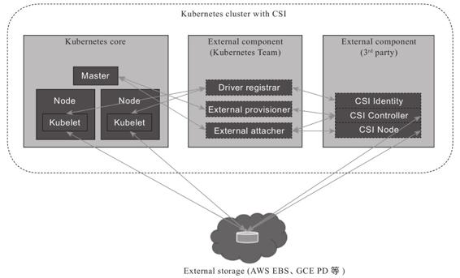

图13-8　CSI组件架构[2]

与FlexVolume以单独的可执行程序的存在形式不同，CSI插件本身便是由一组标准的Kubernetes资源所构成的，CSI Controller接口是一个以StatefulSet方式部署的gRPC服务，CSI Node接口则是基于DaemonSet方式部署的gRPC服务。这意味着虽然CSI实现起来要比FlexVolume复杂得多，但是却很容易安装——如同安装CNI插件及其他应用那样，直接载入Manifest文件即可，也不会遇到FlexVolume那样需要人工运维，或者自己编写DaemonSet来维护集群节点变更的问题。此外，通过gRPC协议传递参数比通过命令行参数传递参数更加严谨、灵活和可靠，最起码不会出现多个接口之间协作只能写临时文件这样的尴尬状况。

[1] 图片来源：https://laptrinhx.com/kubernetes-volume-plugins-evolution-from-flexvolume-to-csi-2724482856/。

[2] 图片来源：https://medium.com/google-cloud/understanding-the-container-storage-interface-csi-ddbeb966a3b。

#### 13.2.3 从In-Tree到Out-of-Tree

Kubernetes曾内置了相当多的In-Tree的存储驱动，甚至还早于Docker宣布支持卷驱动功能，这种策略使得Kubernetes能够在云存储提供商发布官方驱动之前就将其纳入支持范围中，同时减轻了管理员维护的工作量，并为它在诞生初期快速占领市场做出了一定的贡献。但是，这种策略也让Kubernetes丧失了随时添加或修改存储驱动的灵活性，只能在更新大版本时才能加入或者修改驱动，导致云存储提供商被迫与Kubernetes的发布节奏保持一致。此外，还涉及第三方存储代码混杂在Kubernetes二进制文件中可能引起的可靠性及安全性问题。因此，当Kubernetes成为市场主流以后——准确地说是从1.14版本开始，Kubernetes启动了In-Tree存储驱动的CSI外置迁移工作。按照计划，在1.21到1.22版本（大约在2021年中期）时，Kubernetes中主要的存储驱动，如AWS EBS、GCE PD、vSphere等都会迁移至符合CSI规范的Out-of-Tree实现，不再提供对In-Tree的支持。这种做法在设计上无疑是正确的，然而，这又带来了此前提过的该如何兼容旧功能的策略问题，譬如下面的YAML定义了一个Pod：

```
apiVersion: v1
kind: Pod
metadata:
  name: nginx-pod-example
spec:
  containers:
  - name: nginx
    image: nginx:latest
    volumeMounts:
    - name: html-pages-volume
      mountPath: /usr/share/nginx/html
    - name: config-volume
      mountPath: /etc/nginx
  volumes:
    - name: html-pages-volume
      hostPath:                 # 来自本地的存储
        path: /srv/nginx/html
        type: Directory
    - name: config-volume
      awsElasticBlockStore:     # 来自AWS ESB的存储
        volumeID: vol-0b39e0b08745caef4
        fsType: ext4
```

代码中用到了类型为hostPath的Volume，这相当于Docker中驱动类型为local的Volume，不需要专门的驱动；而类型为awsElasticBlockStore的Volume，从名字上就能看出是指存储驱动为AWS EBS的Volume，当CSI迁移完成，awsElasticBlockStore从In-Tree卷驱动中移除之后，它就应该按照CSI的写法改写成如下形式：

```
- name: config-volume
      csi:
        driver: ebs.csi.aws.com
        volumeAttributes: 
          - volumeID: vol-0b39e0b08745caef4
          - fsType: ext4
```

这样的要求有悖于升级版本不应影响还在大范围使用的已有功能的原则，所以Kubernetes 1.17版本中又提出了称为CSIMigration的解决方案，让Out-of-Tree的驱动能够自动伪装成In-Tree的接口来提供服务。

笔者专门花这两段来介绍Volume的CSI迁移，倒不是由于它有多么重要的特性，而是这种兼容性设计本身就是Kubernetes设计理念的一个缩影，在Kubernetes的代码与功能中随处可见。好的设计需要权衡多个方面的利益，很多时候都得顾及现实的影响，要求设计向现实妥协，而不能仅仅考虑理论最优的方案。

#### 13.2.4 容器插件生态

现在几乎所有云计算厂商都支持自家的容器通过CSI规范去接入外部存储，能够应用于CSI与FlexVolume的存储插件更是多达上百款，其中部分容器存储提供商如图13-9所示，已经算是形成了初步的生态环境。限于篇幅，笔者不打算去谈论各种CSI存储插件的细节，而是采取与CNI网络插件类似的讲述方式，以不同的存储类型为线索，介绍其中有代表性的实现。

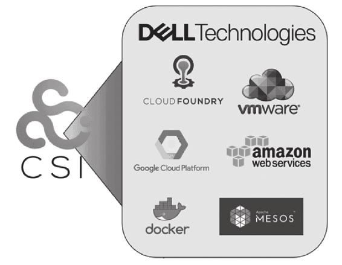

图13-9　部分容器存储提供商

目前出现过的存储系统和设备均可以划分到块存储、文件存储和对象存储这三种存储类型之中，划分的根本依据其实并非各种存储系统或设备如何存储数据——那完全是存储系统的事情，更合理的划分依据应该是各种存储系统或设备提供何种形式的接口供外部访问数据，不同的外部访问接口将反过来影响存储的内部结构、性能与功能表现。虽然块存储、文件存储和对象存储可以彼此协同工作，但它们各自都有明确的擅长领域与优缺点，理解它们的工作原理，因地制宜地选择最适合的存储类型，才能让系统达到最佳的工作状态。下面按照它们出现的时间顺序分别介绍。

·块存储：块存储是数据存储的最古老形式，数据都存储在固定长度的一个或多个块（Block）中，想要读写访问数据，就必须使用与存储类型相匹配的协议（SCSI、SATA、SAS、FCP、FCoE、iSCSI等）来进行。建议读者参考上一章网络通信中网络栈的数据流动过程，把存储设备中由块构成的信息流与网络设备中由数据包构成的信息流进行对比，事实上，像iSCSI这种协议确实是建设在TCP/IP网络之上的，上层以SCSI作为应用层协议对外提供服务。

我们熟悉的硬盘就是最经典的块存储设备，以机械硬盘为例，一个块就是一个扇区，大小通常在512字节至4096字节。老式机械硬盘用柱面、磁头、扇区号（Cylinder-Head-Sector，CHS）组成的编号进行寻址，现代机械硬盘只用一个逻辑块编号（Logical Block Addressing，LBA）进行寻址。为了便于管理，硬盘通常会以多个块（这些块甚至可以来自不同的物理设备，譬如磁盘阵列的情况）来组成一个逻辑分区（Partition），将分区进行高级格式化之后就形成了卷（Volume），这便与13.1节中提到的“Volume是源于操作系统的概念”衔接了起来。

块存储由于贴近底层硬件，没有文件、目录、访问权限等的牵绊，所以性能通常都是最优秀的，吞吐量高，延迟低。尽管人类作为信息系统的最终用户，并不会直接面对块来操作数据，多数应用程序也是基于文件而不是块来读写数据，但是操作系统内核中的许多地方都直接通过块设备（Block Device）接口来访问硬盘，一些追求I/O性能的软件，譬如高性能的数据库，也会支持直接读写块设备以提升磁盘I/O。块存储的特点是具有排他性，一旦块设备被某个客户端挂载，其他客户端就无法再访问上面的数据了，因此，Kubernetes中挂载的块存储的访问模式大都要求必须是RWO（ReadWriteOnce）的。

·文件存储：文件存储是最贴近人类用户的数据存储形式，数据存储在长度不固定的文件之中，用户可以针对文件进行新增、写入、追加、移动、复制、删除、重命名等各种操作，通常文件存储还会提供文件查找、目录管理、权限控制等额外的高级功能。文件存储的访问不像块存储那样有五花八门的协议，POSIX接口已经成为事实标准，被各种商用的存储系统和操作系统共同支持。关于POSIX的文件操作接口笔者就不去举例了，你不妨参考Linux下的各种文件管理命令来自行想象一下。

绝大多数传统的文件存储都是基于块存储来实现的，“文件”这个概念的出现是因为“块”对人类用户来说实在是太难以使用、难以管理了。可以近似地认为文件是由块所组成的更高级存储单位。对于固定不会发生变动的文件，直接让每个文件连续占用若干个块，在文件头尾加入标志区分即可，磁带、CD-ROM、DVD-ROM就采用了由连续块来构成文件的存储方案；但对于可能发生变动的场景，就必须考虑如何跨多个不连续的块来构成文件。这种需求从数据结构角度看只需在每个块中记录好下一个块的地址，形成链表结构即可满足。但是链表的缺点是只能依次顺序访问，这样访问文件中任何内容都要从头读取多个块，显然过于低效了。真正被广泛运用的解决方案是把形成链表的指针整合起来统一存放，这便形成了文件分配表（File Allocation Table，FAT）。既然已经有了专门组织块结构来构成文件的分配表，那在表中再加入其他控制信息，就能很方便地扩展出更多的高级功能，譬如除了文件占用的块地址信息外，加上文件的逻辑位置就形成了目录，加上文件的访问标志就形成了权限，还可以加上文件的名称、创建时间、所有者、修改者等一系列元数据信息来构成其他应用形式。人们把定义文件分配表应该如何实现、存储哪些信息、提供什么功能的标准称为文件系统（File System），FAT32、NTFS、exFAT、ext2/3/4、XFS、BTRFS等都是很常用的文件系统。而前面介绍存储插件接口时提到的对分区进行的高级格式化操作，实际上就是在初始化一套空白的文件系统，供后续用户与应用程序访问。

文件存储相对于块存储来说是更高层次的存储类型，加入目录、权限等元素后形成的树状结构以及路径访问方式方便了人类理解、记忆和访问；文件系统能够提供哪个进程打开或正在读写某个文件的信息，这也有利于文件的共享处理。但在另一方面，计算机需要对路径进行分解，然后逐级向下查找，最后才能查到需要的文件。要从文件分配表中确定具体数据存储的位置，要判断文件的访问权限，要记录每次修改文件的用户与时间，这些额外操作对于性能产生负面影响也是无可避免的，因此，如果一个系统选择不采用文件存储，那磁盘I/O性能一般就是最主要的决定因素。

·对象存储：对象存储是相对较新的数据存储形式，是一种随着云数据中心的兴起而发展起来的存储，是以非结构化数据为目标的存储方案。这里的“对象”可以理解为一个元数据及与其配对的一个逻辑数据块的组合，元数据提供了对象所包含的上下文信息，譬如数据的类型、大小、权限、创建人、创建时间等，数据块则存储了对象的具体内容。你也可以简单地理解为数据和元数据这两样东西共同构成了一个对象。每个对象都有属于自己的全局唯一标识，这个标识会直接开放给最终用户使用，作为访问该对象的主要凭据，通常会是UUID的形式。对象存储的访问接口就是根据该唯一标识，对逻辑数据块进行读/写/删除操作，通常接口都十分简单，甚至连修改操作都不会提供。

对象存储基本上只会在分布式存储系统之上去实现，由于对象存储天生就有明确的“元数据”概念，不必依靠文件系统来提供数据的描述信息，因此，完全可以将一大批对象的元数据集中存放在某一台（组）服务器上，再辅以多台OSD（Object Storage Device）服务器来存储对象的数据块部分。当外部要访问对象时，多台OSD能够同时对外发送数据，因此对象存储不仅易于共享、容量庞大，还能提供非常高的吞吐量。不过，由于需要先经过元数据查询确定OSD存放对象的确切位置，该过程可能涉及多次网络传输，延迟方面就会表现得相对较差。

由于对象的元数据仅描述对象本身的信息，与其他对象都没有关联，换言之每个对象都是相互独立的，自然也就不存在目录的概念，所以对象存储天然就是扁平化的，与软件系统中很常见的K/V访问类似，不过许多对象存储会提供Bucket的概念，用户可以在逻辑上把它当作“单层的目录”来使用。由于对象存储天生的分布式特性，以及极其低廉的扩展成本，很适合CDN一类的应用，用于存放图片和音视频等媒体内容以及网页和脚本等静态资源。

理解了三种存储类型的基本原理后，接下来又到了治疗选择困难症的环节。主流的云计算厂商，譬如国内的阿里云、腾讯云、华为云都有自己专门的块存储、文件存储和对象存储服务。关于选择服务提供商的问题，这里不作建议，你可以根据价格、合作关系、技术和品牌知名度等因素自行处理。关于应该选择哪种存储类型的问题，这里以世界云计算市场占有率第一的亚马逊为例，简要对比介绍它选用的不同存储类型产品的差异。

·亚马逊的块存储服务是Amazon Elastic Block Store（AWS EBS），你购买EBS之后，在EC2（亚马逊的云计算主机）里看见的是一块原始的、未格式化的块设备。这点就决定了EBS并不能作为一个独立存储而存在，它总是和EC2同时被创建，EC2的操作系统也只能安装在EBS之上。EBS的大小理论上取决于建立的分区方案，即块大小乘以块数量。MBR分区的块数量是232，块大小通常是512B，总容量为2 TB；GPT分区的块数量是264，块大小通常是4096B，总容量64 ZB。当然这是理论值，64 ZB已经超过了世界上所有信息的总和，不会有操作系统支持这么离谱的容量，AWS也设置了上限是16 TB，在此范围内的实际值就只取决于你的预算额度；EBS的性能取决于你选择的存储介质类型（SSD、HDD）和优化类型（通用性、预置型、吞吐量优化、冷存储优化等），这也将直接影响存储的费用成本。

EBS适合作为系统引导卷，适合追求磁盘I/O的大型工作负载以及追求低时延的应用，譬如Oracle等可以直接访问块设备的大型数据库更为合适。但EBS只允许被单个节点挂载，难以共享，这点在单机时代是天经地义的，但在云计算和分布式时代就成为很要命的缺陷。除了少数特殊的工作负载外（如前面说的Oracle数据库），笔者并不建议将它作为容器编排系统的主要外置存储来使用。

·亚马逊的文件存储服务是Amazon Elastic File System（AWS EFS），你购买EFS之后，只要在EFS控制台上创建好文件系统，并且管理好网络信息（如IP地址、子网）就可以直接使用，无须依附于任何EC2云主机。EFS本质是完全托管在云端的网络文件系统（Network File System，NFS），可以在任何兼容POSIX的操作系统中直接挂载它，而不会在/dev中看到新设备存在。按照本节开头Kubernetes存储架构中的操作来说就，是你只需要考虑Mount，而无须考虑Attach。

得益于NFS的天然特性，EFS的扩缩可以是完全自动、实时的，创建新文件时无须预置存储，删除已有文件时也不必手动缩容以节省费用。在高性能网络的支持下，EFS的性能已经能够达到相当高的水平，尽管由于网络访问的限制，性能最高的EFS依然比不过最高水平的EBS，但仍然能充分满足绝大多数应用运行的需要。还有最重要的一点优势是由于脱离了块设备的束缚，EFS能够轻易地被成百上千个EC2实例共享，考虑到EFS的性能、动态弹性、可共享等因素，笔者给出的明确建议是它可以作为大部分容器工作负载的首选存储。

·亚马逊的对象存储服务是Amazon Simple Storage Service（AWS S3），S3通常是以REST Endpoint的形式对外部提供文件访问服务的，在这种方式下你应该直接使用程序代码来访问S3，而不是靠操作系统或者容器编排系统去挂载它。如果你真的希望这样做，也可以通过存储网关（如AWS Storage Gateway）将S3的存储能力转换为NFS、SMB、iSCSI等访问协议，经过转换后，操作系统或者容器就能将其作为Volume来挂载了。

S3也许是AWS最出名、使用面最广的存储服务，这个结果不是由于它的性能优异，事实上S3的性能比起EBS和EFS来说是相对最差的，但它的优势在于它名字中“Simple”所标榜的简单，我们挂载外部存储的目的十有八九是为了给程序提供存储服务，使用S3不必写一行代码就能够直接通过HTTP Endpoint进行读写访问，且完全不需要考虑容量、维护和数据丢失的风险，这就是简单的价值。S3的另一大优势就是它的价格相对于EBS和EFS来说往往要低一至两个数量级，因此程序的备份还原、数据归档、灾难恢复、静态页面的托管、多媒体分发等功能就非常适合使用S3来完成。

图13-10是对AWS的三种存储的对比，从目前的存储技术发展来看，不会有哪一种存储方案能够包打天下。不同业务系统的场景需求不同，对存储的诉求就不同，选择自然也不同。

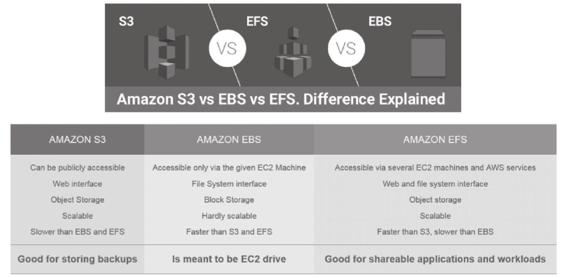

图13-10　AWS S3、EFS、EBS的对比[1]

[1] 图片来源：https://blog.dellemc.com/en-us/kubernetes-data-protection-hits-mainstream-with-container-storage-interface-csi-117/。
