## 第15章 服务网格

容器编排系统管理的最细粒度只能到达容器层次，在此粒度之下的技术细节，仍然只能依赖程序员自己来管理，编排系统很难提供有效的支持。2016年，原Twitter基础设施工程师William Morgan和Oliver Gould在GitHub上发布了第一代服务网格产品Linkerd，并在很短的时间内围绕Linkered组建了Buoyant公司。随后，在担任CEO的William Morgan发表的文章“What’s A Service Mesh?And Why Do I Need One?”中首次正式地定义了“服务网格”（Service Mesh）一词，自此，服务网格作为一种新兴通信理念开始迅速传播，越来越频繁地出现在各个公司以及技术社区的视野中。服务网格之所以能够获得企业与社区的重视，是因为它很好地弥补了容器编排系统对分布式应用细粒度管控能力不足的缺憾。

额外知识

服务网格是一种用于管控服务间通信的基础设施，职责是支持现代云原生应用网络请求在复杂拓扑环境中的可靠传递。在实践中，服务网格通常会以轻量化网络代理的形式来体现，这些代理与应用程序代码会部署在一起，对应用程序来说，它完全不会感知到代理的存在。

——What’s A Service Mesh?And Why Do I Need One?，William Morgan，Buoyant CEO，2017

服务网格并不是什么神秘、难以理解的黑科技，它只是一种处理程序间通信的基础设施，典型的存在形式是部署在应用旁边，一对一为应用提供服务的边车代理以及管理这些边车代理的控制程序。“边车”本来就是一种常见的容器设计模式，用来形容外挂在容器上的辅助程序。早在容器盛行以前，边车代理就已有了成功的应用案例，譬如2014年开始的Netflix Prana项目，由于Netfilix OSS套件是用Java语言开发的，为了让非JVM语言的微服务，譬如以Python、Node.js编写的程序同样能接入Netfilix OSS生态，享受到Eureka、Ribbon、Hystrix等框架的支持，Netflix建立了Prana项目，它的作用是为每个服务提供一个专门的HTTP Endpoint，使得非JVM语言的程序能通过访问该Endpoint来获取系统中所有服务的实例、相关路由节点、系统配置参数等在Netfilix组件中管理的信息。

Netflix Prana的代理需要由应用程序主动去访问才能发挥作用，但在容器的刻意支持下，服务网格无须应用程序的任何配合，就能强制性地对应用通信进行管理。它使用了类似网络攻击里中间人流量劫持的手段，完全透明（既无须程序主动访问，也不会被程序感知到）地接管容器与外界的通信，将管理的粒度从容器级别细化到每个单独的远程服务级别，使得基础设施干涉应用程序、介入程序行为的能力大为增强。如此一来，云原生希望用基础设施接管应用程序非功能性需求的目标就能更进一步，从容器粒度延伸到远程访问，分布式系统继容器和容器编排之后，又发掘到另一块更广袤的舞台空间。

### 15.1 透明通信的涅槃

Kubernetes为它管理的工作负载提供了工业级的韧性与弹性，也为每个处于运行状态的Pod维护了相互连通的虚拟化网络。不过，程序之间的通信不同于简单地在网络上拷贝数据，具备可连通的网络环境仅仅是程序间能够可靠通信的必要但非充分的条件，作为一名经历过SOA、微服务、云原生洗礼的分布式程序员，你必定已深谙路由、容错、限流、加密、认证、授权、跟踪、度量等问题在分布式系统中都是无可回避的。

在2.1.2节，笔者曾讲述了三十多年间计算机科学家们对于“远程服务调用能否实现为透明通信”的一场声势浩大的争论。今天，服务网格的诞生在某种意义上可以说是当年透明通信的重生，服务网格试图以容器、虚拟化网络、边车代理等技术所构筑的新一代通信基础设施为武器，重新对已盖棺定论三十多年的程序间远程通信不是透明的原则发起冲击。今天，这场关于通信的变革仍然在酝酿发展当中，最后到底会是成功的逆袭，抑或是另一场失败，笔者不敢妄言定论，但是作为程序通信发展历史的一名见证者，笔者丝毫不吝对服务网格投去最高的期许与最深的祝愿。

#### 15.1.1 通信成本

程序间通信作为分布式架构的核心内容，在第1章就已从宏观角度讲述过它的演进过程。在本节，我们会从更微观、更聚焦的角度，分析不同时期应用程序是如何看待与实现通信方面的非功能性需求，以及如何做到可靠通信的。下面我们通过以下五个阶段的变化，理解分布式服务的通信是如何逐步演化成服务网格的。

·第一阶段：将通信的非功能性需求视作业务需求的一部分，通信的可靠性由开发人员来保障。

本阶段是软件企业刚刚开始尝试分布式时选择的早期技术策略。这类系统原本所具有的通信能力一般并不是作为系统功能的一部分被设计出来，而是遇到问题后修补累积所形成的。开始时，系统往往只具备最基本的网络API，譬如集成了OKHTTP、gRPC这样的库来访问远程服务，如果远程访问接收到异常，就编写对应的重试或降级逻辑去处理。在系统进入生产环境以后，遇到并解决的一个个通信问题，逐渐在业务系统中留下了越来越多关于通信的代码逻辑。这些通信的逻辑由业务系统的开发人员直接编写，与业务逻辑直接共处在一个进程空间之中，如图15-1所示[1]。

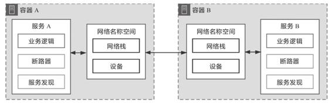

图15-1　控制逻辑和业务逻辑耦合

这一阶段的主要矛盾是绝大多数擅长业务逻辑的开发人员并不擅长处理的通信方面的问题，要写出正确、高效、健壮的分布式通信代码，是一项专业性极强的工作。由此决定了大多数普通软件企业都很难在这个阶段支撑起一个靠谱的分布式系统来。另一方面，把专业的通信功能强加于普通开发人员，无疑为他们带来了更多工作量，尤其是这些“额外的工作”与原有的业务逻辑耦合在一起，让系统越来越复杂，也越来越容易出错。

·第二阶段：将代码中的通信功能抽离重构成公共组件库，通信的可靠性由专业的平台开发人员来保障。

开发人员解耦依赖的一贯有效办法是抽取分离代码与封装重构组件。微服务的普及离不开一系列封装了分布式通信能力的公共组件库，代表产品有Twitter的Finagle、Spring Cloud中的许多组件等。这些公共的通信组件由熟悉分布式的专业的平台开发人员编写和维护，不仅效率更高、质量更好，一般还都提供了经过良好设计的API接口，让业务代码既可以使用它们的能力，又无须把处理通信的逻辑散布于业务代码当中，如图15-2所示。

分布式通信组件让普通开发人员开发出靠谱的微服务系统成为可能，这是无可抹杀的成绩，但普通开发人员使用它们的成本依然很高，不仅要学习分布式的知识，还要学习这些公共组件的使用方法。最麻烦的是，对于同一种问题往往需要用到多种不同的组件才能解决。这是因为通信组件首先是一段特定编程语言开发出来的程序，是与语言绑定的，一个由Python编写的组件再优秀，对Java系统来说也没有太多的实用价值。目前，基于公共组件库开发微服务仍然是应用最为广泛的解决方案，却不是一种完美的解决方案，这是微服务基础设施完全成熟之前必然会出现的应用形态，同时也一定是微服务进化过程中必然会被替代的过渡形态。

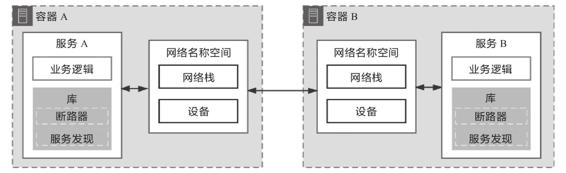

图15-2　抽取公共的分布式通信组件

·第三阶段：将负责通信的公共组件库分离到进程之外，程序间通过网络代理来交互，通信的可靠性由专门的网络代理提供商来保障。

为了能够把分布式通信组件与具体的编程语言脱钩，也为了避免开发人员还要专门学习这些组件的编程模型与API接口，这一阶段进化出了能专门负责可靠通信的网络代理。这些网络代理不再与业务逻辑部署于同一个进程空间，但仍然与业务系统处于同一个容器或者虚拟机中，可以通过回环设备甚至UDS（UNIX Domain Socket）进行交互，具备相当高的网络性能。只要让网络代理接管程序七层或四层流量，就能够在代理上完成断路、容错等几乎所有的分布式通信功能，前面提到过的Netflix Prana就属于这类产品的典型代表，如图15-3所示。

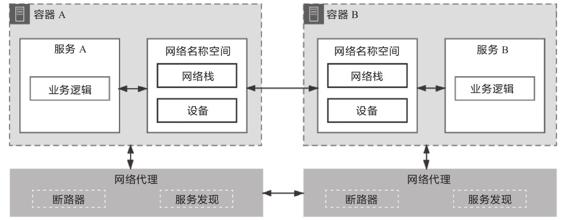

图15-3　通过网络代理获得可靠的通信能力

通过网络代理来提升通信质量的思路提出以后，它本身的使用范围其实并不算特别广泛，但它的方向是正确的。这种思路后来演化出了两种改进形态。一方面，如果将网络代理从进程身边拉远，让它与进程分别处于不同的机器上，这样就可以同时给多个进程提供可靠通信的代理服务，这条路线逐渐演变成了今天常见的微服务网关，在网关上同样可以实现流控、容错等功能。另一方面，如果将网络代理往进程方向靠近，不仅让它与进程处于一个共享了网络名称空间的容器组之中，还要让它透明并强制地接管通信，这便演变成了下一阶段所说的边车代理。

·第四阶段：将网络代理以边车的形式注入应用容器，自动劫持应用的网络流量，通信的可靠性由专门的通信基础设施来保障。

与前一阶段的独立代理相比，如图15-4所示，以边车模式运作的网络代理拥有两个无可比拟的优势。第一个优势是它对流量的劫持是强制性的，通常是靠直接写容器的iptables转发表来实现。此前，独立的网络代理只有当程序首先去访问它时，它才能被动地为程序提供可靠通信服务，只要程序有选择不访问它的可能性，代理就永远只能充当服务者而不能成为管理者，上阶段的图15-3中保留了两个容器网络设备直接连接的箭头就代表这种可能性，而这一阶段的图15-4中，服务与网络名称空间的虚线箭头代表被劫持后应用程序以为存在，但实际并不存在的流量。

第二个优势是边车代理对应用是透明的，无须对已部署的应用程序代码进行任何改动，不需要引入任何的库（这点并不是绝对的，有部分边车代理也会要求有轻量级的SDK），也不需要程序专门去访问某个特定的网络位置。这意味着它对所有现存程序都具备开箱即用的适应性，无须修改旧程序就能直接享受到边车代理的服务，这样它的适用范围就变得十分广泛。目前边车代理的代表产品有Linkerd、Envoy、MOSN等。

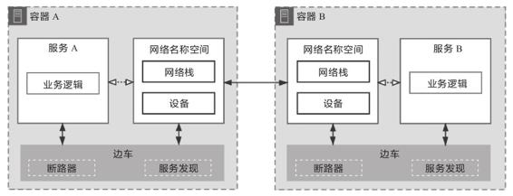

图15-4　边车代理模式

如果说边车代理还有什么不足之处的话，那大概就是来自于运维人员的不满了。边车代理能够透明且具有强制力地解决可靠通信的问题，但它本身也需要有足够的信息才能完成这项工作，譬如获取可用服务的列表，譬如得到每个服务名称对应的IP地址，等等。这些信息不会自动到边车里去，需要由管理员主动去告知代理，或者代理主动从约定的好的位置获取。可见，管理代理本身也会产生额外的通信需求。如果没有额外的支持，这些管理方面的通信都得由运维人员去埋单，由此而生的不满便可以理解。为了管理与协调边车代理，程序间通信进化到了最后一个阶段：服务网格。

·第五阶段：将边车代理统一管控起来实现安全、可控、可观测的通信，将数据平面与控制平面分离开来，实现通用、透明的通信，这项工作由专门的服务网格框架来保障。

从总体架构看，服务网格包括两大块内容，分别是由一系列与微服务共同部署的边车代理，以及用于控制这些代理的管理器所构成。代理与代理之间需要通信，用以转发程序间通信的数据包；代理与管理器之间也需要通信，用以传递路由管理、服务发现、数据遥测等控制信息。服务网格使用数据平面（Data Plane）通信和控制平面（Control Plane）通信来形容这两类流量，图15-5中实线就表示数据平面通信，虚线表示控制平面通信。

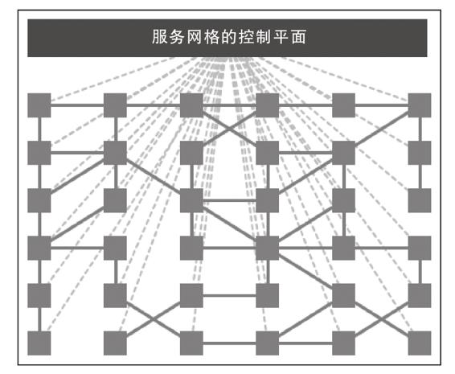

图15-5　服务网格的控制平面通信与数据平面通信

数据平面与控制平面并不是什么新鲜概念，它们最初就是用在计算机网络中的术语，通常是指网络层次的划分，软件定义网络中将解耦数据平面与控制平面作为其最主要特征之一。服务网格把计算机网络的经典概念引入程序通信之中，既可以说是对程序通信的一种变革创新，也可以说是对网络通信的一种发展传承。

分离数据平面与控制平面的实质是将“程序”与“网络”进行解耦，将网络可能出现的问题（譬如中断后重试、降级），与可能需要的功能（譬如实现追踪度量）的处理过程从程序中拿出，放到由控制平面指导的数据平面通信中去处理，制造出一种“这些问题在程序间通信中根本不存在”的假象，仿佛网络和远程服务都是完美可靠的。这种完美的假象，让应用之间可以非常简单地交互而不必考虑过多异常情况，也能够在不同的程序框架、不同的云服务提供商环境之间平稳地迁移；同时，还能让管理者不依赖程序支持就得到遥测所需的全部信息，根据角色、权限进行统一的访问控制。

[1] 在本图与后面一系列图片中，笔者均以“断路器”和“服务发现”这两个常见的功能来泛指所有分布式通信所需的能力，实际上并不局限于这两个功能。

#### 15.1.2 数据平面

在接下来的两个小节里，笔者会延续服务网格将“程序”与“网络”解耦的思路，介绍数据平面通信与控制平面通信中的几个核心问题的解决方案。在工业界，数据平面已有Linkerd、Nginx、Envoy等产品，控制平面也有Istio、Open Service Mesh、Consul等产品，后文笔者主要是以目前市场占有率最高的Istio与Envoy为例进行讲述，但讲述的目的是介绍两种平面通信的技术原理，而不是介绍Istio和Envoy的功能与用法，这里涉及的原理在各种服务网格产品中一般都是通用的，并不局限于某一种具体实现。

数据平面由一系列边车代理构成，核心职责是转发应用的入站（Inbound）和出站（Outbound）数据包，因此数据平面也被称为转发平面（Forwarding Plane）。同时，为了在不可靠的物理网络中保证程序间通信最大的可靠性，数据平面必须根据控制平面下发策略的指导，在应用无感知的情况下自动完成服务路由、健康检查、负载均衡、认证鉴权、产生监控数据等一系列工作。为了达成上述工作目标，至少需要妥善解决以下三个关键问题。

·代理注入：边车代理是如何注入应用程序中的？

·流量劫持：边车代理是如何劫持应用程序的通信流量的？

·可靠通信：边车代理是如何保证应用程序的通信可靠性的？

1.代理注入

从职责上说，注入边车代理是控制平面的工作，但从本章的叙述逻辑上看，将其放在数据平面中介绍更合适。把边车代理注入应用的过程并不一定全都是透明的，现在的服务网格产品使用以下三种方式将边车代理接入应用程序中。

·基座模式（Chassis）：这种方式接入的边车代理对程序就是不透明的，它至少会包括一个轻量级的SDK，通信由SDK中的接口去处理。基座模式的好处是在程序代码的帮助下，有可能达到更好的性能，功能也相对更容易实现，但坏处是对代码有侵入性，对编程语言有依赖性。这种模式的典型产品是由华为开源后捐献给Apache基金会的ServiceComb Mesher。基座模式目前并不属于主流方式，所以笔者就不展开介绍了。

·注入模式（Injector）：根据注入方式不同，又可以分为以下两种。

·手动注入模式：这种注入方式对使用者来说不透明，但对程序来说是透明的。由于边车代理的定义就是一个与应用共享网络名称空间的辅助容器，这天然就契合了Pod的设定，因此在Kubernetes中要进行手动注入是十分简单的——只是为Pod增加一个额外容器而已，即使没有工具帮助，自己修改Pod的Manifest也能轻易办到。如果你以前未曾尝试过，不妨找一个Pod的配置文件，用istioctl kube-inject-f YOUR_POD.YAML命令来查看一下手动注入会对原有的Pod产生什么变化。

·自动注入模式：这种注入方式对使用者和程序都是透明的，也是Istio推荐的代理注入方式。在Kubernetes中，服务网格一般是依靠“动态准入控制”（Dynamic Admission Control）中的Mutating Webhook控制器来实现自动注入的。

额外知识

istio-proxy是Istio对Envoy代理的包装容器，其中包含用Golang编写的pilot-agent和用C++编写的envoy两个进程。pilot-agent进程负责Envoy的生命周期管理，譬如启动、重启、优雅退出等，并维护Envoy所需的配置信息，譬如初始化配置，随时根据控制平面的指令热更新Envoy的配置等。

笔者以Istio自动注入边车代理（istio-proxy容器）的过程为例，介绍一下自动注入的具体流程。只要对Istio有基本了解的同学都知道，对任何设置了istio-injection=enabled标签的名称空间，Istio都会自动为其新创建的Pod注入一个名为istio-proxy的容器。之所以能做到自动这一点，是因为Istio预先在Kubernetes中注册了一个类型为MutatingWebhookConfiguration的资源，它的主要内容如下所示：

```
apiVersion: admissionregistration.k8s.io/v1beta1
kind: MutatingWebhookConfiguration
metadata:
  name: istio-sidecar-injector
  .....
webhooks:
- clientConfig:
    service:
      name: istio-sidecar-injector
      namespace: istio-system
      path: /inject
  name: sidecar-injector.istio.io
  namespaceSelector:
    matchLabels:
      istio-injection: enabled
  rules:
  - apiGroups:
    - ""
    apiVersions:
    - v1
    operations:
    - CREATE
    resources:
    - pods
```

以上配置会告诉Kubernetes，对于符合标签istio-injection:enabled的名称空间，在Pod资源进行CREATE操作时，应该先自动触发一次Webhook调用，调用的位置是istio-system名称空间中的服务istio-sidecar-injector，调用的URL路径是/inject。在这次调用中，Kubernetes会把新建的Pod的元数据定义作为参数发送给HTTP Endpoint，然后从服务返回结果中得到注入边车代理的新Pod定义，以此自动完成注入。

2.流量劫持

边车代理做流量劫持最典型的方式是基于iptables进行的数据转发，笔者曾在12.1节中介绍过Netfilter与iptables的工作原理。这里仍然以Istio为例，它在注入边车代理后，除了生成封装Envoy的istio-proxy容器外，还会生成一个initContainer，作用是自动修改容器的iptables，具体内容如下所示：

```
initContainers:
  image: docker.io/istio/proxyv2:1.5.1
  name: istio-init
- command:
  - istio-iptables -p "15001" -z "15006"-u "1337" -m REDIRECT -i '*' -x "" 
    -b '*' -d 15090,15020
```

以上命令行中的istio-iptables是Istio提供的用于配置iptables的Shell脚本，这行命令的意思是让边车代理拦截所有进出Pod的流量，包括的动作为拦截除15090、15020端口（这两个分别是Mixer和Ingress Gateway的端口，关于Istio占用的固定端口可参考官方文档所列）外的所有入站流量，全部转发至15006端口（Envoy入站端口），经Envoy处理后，再从15001端口（Envoy出站端口）发送出去。该命令会在iptables中的PREROUTING和OUTPUT链中挂载相应的转发规则，使用iptables-t nat-L-v命令可以看到如下所示配置信息：

```
Chain PREROUTING
 pkts bytes target         prot opt in      out        source     destination
 2701  162K ISTIO_INBOUND  tcp  --  any     any        anywhere   anywhere

Chain OUTPUT
 pkts bytes target         prot opt in      out        source     destination
   15   900 ISTIO_OUTPUT   tcp  --  any     any        anywhere   anywhere

Chain ISTIO_INBOUND (1 references)
 pkts bytes target         prot opt in      out        source     destination
    0     0 RETURN      tcp  --  any  any   anywhere   anywhere   tcp dpt:ssh
    2   120 RETURN      tcp  --  any  any   anywhere   anywhere   tcp dpt:15090
 2699  162K RETURN      tcp  --  any  any   anywhere   anywhere   tcp dpt:15020
    0     0 ISTIO_IN_REDIRECT  tcp  --  any any        anywhere   anywhere

Chain ISTIO_IN_REDIRECT (3 references)
 pkts bytes target      prot opt in     out  source    destination
    0     0 REDIRECT   tcp  --  any   any  anywhere  anywhere redir ports 15006

Chain ISTIO_OUTPUT (1 references)
 pkts bytes target  prot opt in     out     source               destination
    0     0 RETURN  all  --  any    lo      127.0.0.6            anywhere
    0     0 ISTIO_IN_REDIRECT all  --  any  lo  anywhere   
        !localhost  owner UID match 1337
    0     0 RETURN  all  --  any  lo  anywhere  anywhere  
        ! owner UID match 1337
   15   900 RETURN  all  --  any  any  anywhere anywhere owner UID match 1337
    0     0 ISTIO_IN_REDIRECT  all  --  any  lo anywhere   
        !localhost   owner GID match 1337
    0     0 RETURN  all  --  any  lo  anywhere  anywhere ! owner GID match 1337
    0     0 RETURN  all  --  any  any anywhere  anywhere owner GID match 1337
    0     0 RETURN  all  --  any  any anywhere  localhost
    0     0 ISTIO_REDIRECT  all  --  any  any   anywhere     anywhere

Chain ISTIO_REDIRECT (1 references)
 pkts bytes target     prot opt in   out  source              destination
    0     0 REDIRECT   tcp  --  any  any  anywhere  anywhere  redir ports 15001
```

用iptables进行流量劫持是最经典、最通用的手段，不过，iptables重定向流量必须通过回环设备交换数据，即流量不得不多穿越一次协议栈，如图15-6所示。

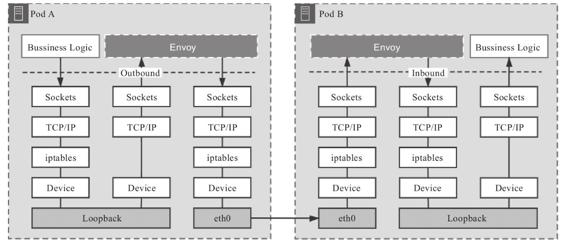

图15-6　经过iptables转发的通信

这种方案在网络I/O不构成主要瓶颈的系统中并没有什么不妥，但在网络敏感的大并发场景下会损失一定的性能。目前，如何实现更优化的数据平面流量劫持，是服务网格发展的前沿研究课题之一。其中一种可行的优化方案是使用eBPF（Extended Berkeley Packet Filter）技术，在Socket层面直接完成数据转发，而不需要再往下经过更底层的TCP/IP协议栈的处理，从而减少数据在通信链路的路径长度，如图15-7所示。

另一种可以考虑的方案是让服务网格与CNI插件配合来实现流量劫持，譬如Istio就有提供自己实现的CNI插件。只要安装了这个CNI插件，整个虚拟化网络都由Istio自己来控制，那自然就无须依赖iptables，也不必存在initContainers配置和istio-init容器了。这种方案有很高的上限与自由度，不过，要实现一个功能全面、管理灵活、性能优秀、表现稳定的CNI网络插件绝非易事，连Kubernetes自己都迫不及待想从网络插件中脱坑，其麻烦程度可见一斑，因此目前这种方案使用得也并不广泛。

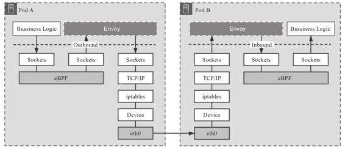

图15-7　经过eBPF直接转发的通信

流量劫持技术的发展与服务网格的落地效果密切相关，有一些服务网格通过基座模式中的SDK也能达到很好的转发性能，但考虑到应用程序通用性和环境迁移等问题，无侵入式的低时延、低管理成本的流量劫持方案仍然是研究的主流方向。

3.可靠通信

注入边车代理，劫持应用流量，最终的目的都是代理能够接管应用程序的通信，然而，代理接管了应用的通信之后，它会做什么呢？这个问题的答案是：不确定。代理的行为需要根据控制平面提供的策略来决定，传统的代理程序，譬如HAProxy、Nginx是使用静态配置文件来描述转发策略的，这种静态配置很难跟得上应用需求的变化与服务扩缩时网络拓扑结构的变动。Envoy在这方面进行了创新，它将代理转发的行为规则抽象成Listener、Router、Cluster三种资源，以此为基础，又定义了应该如何发现和访问这些资源的一系列API，现在这些资源和API被统称为“xDS协议族”，如图15-8所示。自此以后，数据平面就有了如何描述各种配置和策略的事实标准，控制平面也有了与控制平面交互的标准接口。目前xDS v3.0协议族已经包含如表15-1所示的具体协议。

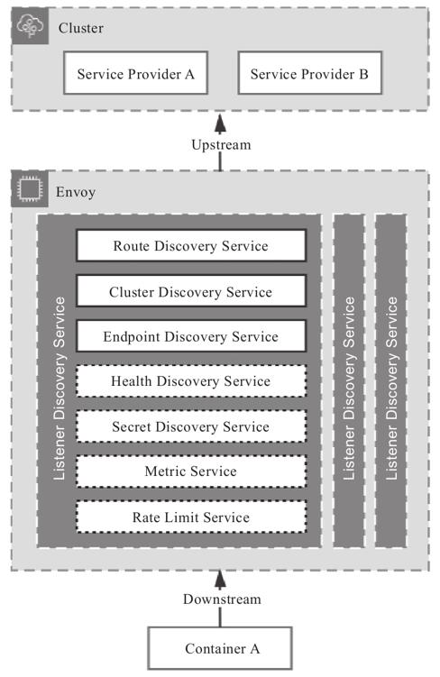

图15-8　xDS协议运作模型

表15-1　xDS v3.0协议族

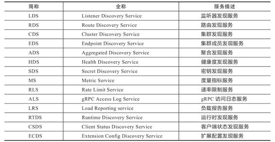

这里不会逐一介绍这些协议，但可以说清楚它们一致的运作原理，其中的关键是解释清楚这些协议的共同基础，即Listener、Cluster、Router三种资源的具体含义。

·Listener：Listener可以简单理解为Envoy的一个监听端口，用于接收来自下游应用程序（Downstream）的数据。Envoy能够同时支持多个Listener，不同的Listener之间的策略配置是相互隔离的。

自动发现Listener的服务被称为LDS（Listener Discovery Service，监听器发现服务），它是所有其他xDS协议的基础，如果没有LDS（也没有在Envoy启动时静态配置Listener的话），其他所有xDS服务也就失去了意义，因为没有监听端口的Envoy不能为任何应用提供服务。

·Cluster：Cluster是Envoy能够连接到的一组逻辑上提供相同服务的上游（Upstream）主机。Cluster包含该服务的连接池、超时时间、Endpoint地址、端口、类型等信息。具体到Kubernetes环境，可以认为Cluster与Service是对等的概念，Cluster实际上承担了服务发现的职责。

自动发现Cluster的服务被称为CDS（Cluster Discovery Service，集群发现服务），通常情况下，控制平面会将它从外部环境中获取的所有可访问服务全量推送给Envoy。与CDS紧密相关的另一种服务是EDS（Endpoint Discovery Service，集合成员发现服务）。当Cluster被标识为需要EDS时，则说明该Cluster的所有Endpoint的地址应该由xDS服务下发，而不是依靠DNS服务去解析。

·Router：Listener负责接收来自下游的数据，Cluster负责将数据转发送给上游的服务，而Router则决定Listener在接收到下游的数据之后，具体应该将数据交给哪一个Cluster处理，由此定义可知，Router实际上是承担了服务网关的职责。

自动发现Router的服务被称为RDS（Router Discovery Service，路由发现服务），Router中最核心的信息是目标Cluster及其匹配规则，即实现网关的路由职能。此外，视Envoy中的插件配置情况，也可能包含重试、分流、限流等动作，实现网关的过滤器职能。

Envoy的另外一个设计重点是Filter机制。Filter通俗地讲就是Envoy的插件，通过Filter机制，Envoy提供了强大的可扩展能力，插件不是无关重要的外围功能，很多Envoy的核心功能都使用Filter来实现的。譬如对HTTP流量的治理、Tracing机制、多协议支持，等等。利用Filter机制，Envoy理论上可以实现任意协议的支持以及协议之间的转换，可以对请求流量进行全方位的修改和定制，还可以保持较高的可维护性。

#### 15.1.3 控制平面

如果说数据平面是行驶中的车辆，那控制平面就是车辆上的导航系统；如果说数据平面是城市的交通道路，那控制平面就是路口的指示牌与交通信号灯。控制平面的特点是不直接参与程序间通信，只会与数据平面中的代理通信，在程序不可见的背后，默默地完成下发配置和策略，指导数据平面工作。由于服务网格（暂时）没有大规模引入计算机网络中管理平面（Management Plane）等其他概念，所以控制平面通常也会附带地实现诸如网络行为的可视化、配置传输等一系列管理职能（其实还是有专门的管理平面的工具的，譬如Meshery、ServiceMeshHub）。笔者仍然以Istio为例介绍控制平面的主要功能。

Istio在1.5版本之前，也是采用微服务架构开发的。它将控制平面的职责分解为Mixer、Pilot、Galley、Citadel四个模块去实现，其中Mixer负责鉴权策略与遥测；Pilot负责对接Envoy的数据平面，遵循xDS协议进行策略分发；Galley负责配置管理，为服务网格提供外部配置感知能力；Citadel负责安全加密，提供服务和用户层面的认证和鉴权、管理凭据和RBAC等安全相关能力。不过，经过两、三年的实践应用，很多用户都反馈Istio的微服务架构有过度设计的嫌疑。lstio在定义项目目标时，曾非常理想化地提出控制平面的各个组件都应能独立部署，然而在实际应用场景里却并非如此，独立的组件反而带来了部署复杂、职责划分不清晰等问题。

从1.5版本起，Istio重新回归单体架构，将Pilot、Galley、Citadel的功能全部集成到新的istiod之中，如图15-9所示。当然，这也并不是说完全推翻之前的设计，只是将原有的多进程形态优化成单进程的形态，之前各个独立组件变成了istiod的内部逻辑上的子模块而已。单体化之后出现的新进程istiod就承担了所有的控制平面职责，具体包括如下内容。

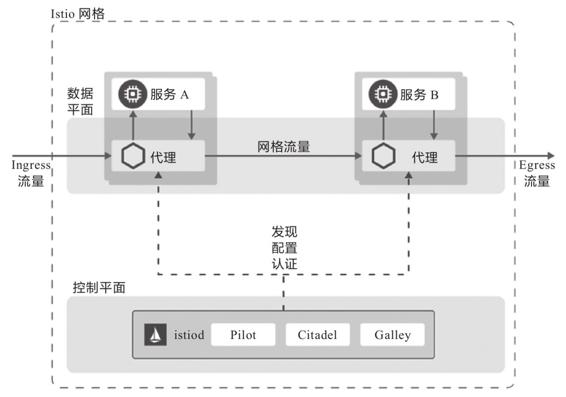

图15-9　Istio 1.5版本之后的架构[1]

·数据平面交互：这是满足服务网格正常工作所需的必要工作，具体包括以下几个方面。

·边车注入：在Kubernetes中注册Mutating Webhook控制器，实现代理容器的自动注入，并生成Envoy的启动配置信息。

·策略分发：接手了原来Pilot的核心工作，为所有的Envoy代理提供符合xDS协议的策略分发的服务。

·配置分发：接手了原来Galley的核心工作，负责监听来自多种支持配置源的数据，譬如kube-apiserver，本地配置文件，或者定义为网格配置协议（Mesh Configuration Protocol，MCP）的配置信息。原来Galley需要处理的API校验和配置转发功能也包含在内。

·流量控制：这通常是用户使用服务网格的最主要目的，具体包括以下几个方面。

·请求路由：通过VirtualService、DestinationRule等Kubernetes自定义资源实现了灵活的服务版本切分与规则路由。譬如以服务的迭代版本号（如v1.0版、v2.0版）、部署环境（如Development版、Production版）作为路由规则来控制流量，实现诸如金丝雀发布这类应用需求。

·流量治理：包括熔断、超时、重试等功能，譬如通过修改Envoy的最大连接数，实现对请求的流量控制；通过修改负载均衡策略，在轮询、随机、最少访问等方式间进行切换；通过设置异常探测策略，将满足异常条件的实例从负载均衡池中摘除，以保证服务的稳定性，等等。

·调试能力：包括故障注入和流量镜像等功能，譬如在系统中人为设置一些故障，来测试系统的容错稳定性和系统恢复的能力。又譬如通过复制一份请求流量，把它发送到镜像服务，从而满足A/B验证的需要。

·通信安全：包括通信中的加密、凭证、认证、授权等功能，具体包括以下几个方面。

·生成CA证书：接手了原来Galley的核心工作，负责生成通信加密所需私钥和CA证书。

·SDS服务代理：最初Istio是通过Kubernetes的Secret卷的方式将证书分发到Pod中的，从Istio 1.1版本之后改为通过SDS服务代理来解决，这种方式保证了私钥证书不会在网络中传输，仅存在于SDS代理和Envoy的内存中，证书刷新轮换也不需要重启Envoy。

·认证：提供基于节点的服务认证和基于请求的用户认证，这项功能曾在9.2.2节中详细介绍过。

·授权：提供不同级别的访问控制，这项功能也曾在9.2.3节中详细介绍过。

·可观测性：包括日志、追踪、度量三大能力，具体包括以下几个方面。

·日志收集：程序日志的收集并不属于服务网格的处理范畴，通常会使用ELK Stack去完成，这里是指远程服务的访问日志的收集，对等的类比目标应该是以前Nginx、Tomcat的访问日志。

·链路追踪：为请求途经的所有服务生成分布式追踪数据并自动上报，运维人员可以通过Zipkin等追踪系统从数据中重建服务调用链，开发人员可以借此了解网格内服务的依赖和调用流程。

·指标度量：基于四类不同的监控标识（响应延迟、流量大小、错误数量、饱和度）生成一系列观测不同服务的监控指标，用于记录和展示网格中的服务状态。

[1] 图片来自Istio官方文档：https://istio.io/latest/docs/ops/deployment/architecture/。

### 15.2 服务网格与生态

服务网格目前仍然处于技术浪潮的早期，但其价值已被业界所普遍认可，几乎所有希望能够影响云原生发展方向的企业都已参与进来。从最早2016年的Linkerd和Envoy，到2017年Google、IBM和Lyft共同发布的Istio，再到后来CNCF将Buoyant的Conduit改名为Linkerd2再度参与Istio竞争。2018年后，服务网格的话语权争夺战已全面升级至由云计算巨头直接主导。Google将Istio搬上Google Cloud Platform，推出了Istio的公有云托管版本Google Cloud Service Mesh；亚马逊推出了用于AWS的App Mesh；微软推出了Azure完全托管版本的Service Fabric Mesh，发布了自家的控制平面Open Service Mesh；阿里巴巴也推出了基于Istio的修改版SOFAMesh，并开源了自己研发的MOSN代理。可以说，云计算的所有“玩家”都正在布局服务网格生态。

市场繁荣的同时也带来了碎片化的问题，一个技术领域能够形成被业界普遍承认的规范标准，是这个领域从分头研究、各自开拓的萌芽状态，走向工业化生产应用的成熟状态的重要标志。标准的诞生可以说是每一项技术普及之路中都必须经历的“成人礼”。前面我们曾接触过容器运行时领域的CRI规范、容器网络领域的CNI规范、容器存储领域的CSI规范，尽管服务网格诞生至今仅有数年时间，但作为微服务、云原生的前沿热点，它也正在酝酿自己的标准规范，即本节的主角：服务网格接口（Service Mesh Interface，SMI）与通用数据平面API（Universal Data Plane API，UDPA），它们的关系如图15-10所示。

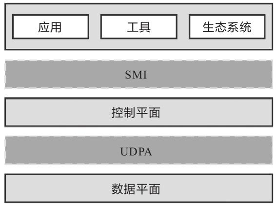

图15-10　SMI规范与UDPA规范

服务网格的实质是数据平面产品与控制平面产品的集合，所以在规范制订方面，很自然地分成了两类。SMI规范提供了外部环境（实际上就是Kubernetes）与控制平面交互的标准，使得Kubernetes及在其之上的应用能够无缝切换各种服务网格产品。UDPA规范则提供了控制平面与数据平面交互的标准，使得服务网格产品能够灵活搭配不同的边车代理，针对不同场景的需求，发挥各类边车代理的功能或者性能优势。这两个规范并没有重叠，它们的关系与在容器运行时中介绍的CRI和OCI规范的关系颇有些相似。

#### 15.2.1 服务网格接口

在2019年5月的KubeCon大会上，微软联合Linkerd、HashiCorp、Solo、Kinvolk和Weaveworks等一批云原生服务商共同宣布了Service Mesh Interface规范，希望能在各家的服务网格产品之上建立一个抽象的API层，然后通过这个抽象层来解耦和屏蔽底层服务网格实现，让上层的应用、工具、生态系统可以建立在同一个业界标准之上，从而实现应用程序在不同服务网格产品之间的无缝移植与互通。

如果你更熟悉Istio的话，不妨把SMI的作用理解为提供一套与Istio中VirtualService、DestinationRule、Gateway等私有概念对等的行业标准版本，只要使用SMI中定义的标准资源，应用程序就可以在不同的控制平面上灵活迁移，唯一的要求是这些控制平面都支持了SMI规范。

SMI与Kubernetes是彻底绑定的，规范的落地执行完全依靠在Kubernetes中部署SMI定义的CRD来实现，这一点在SMI的目标中被形容为“Kubernetes Native”，说明微软等云服务厂商已经认定容器编排领域不会有Kubernetes之外的候选项，这也是微软选择在KubeCon大会上公布SMI规范的原因。但是在另外一端，SMI并不与包括行业第一的Istio或者微软自家Open Service Mesh在内的任何控制平面所绑定，这点在SMI的目标中被形容为“Provider Agnostic”，说明微软看到了服务网格领域处于群雄混战的现状。Provider Agnostic对消费者有利，但对目前处于行业领先地位的Istio肯定是不利的，所以SMI为何没有得到Istio及其背后的Google、IBM与Lyft的支持也就完全可以理解了。

在过去的两年里，Istio无论是在发展策略还是在设计上（过度设计）的风评并不算好，业界一直在期待Google和Istio能做出改进，在持续两年的失望之后，已经有很多用户在考虑Istio以外的选择了。SMI一发布就吸引了除Istio之外几乎所有的服务网格玩家参与进来，如图15-11所示。这恐怕并不仅仅是因为微软号召力大的缘故。为了对抗Istio的抵制，SMI还提供了一个Istio的适配器，以便使用Istio的程序能平滑地迁移的SMI上，所以遗留代码并不能为Istio构建出特别坚固的壁垒。

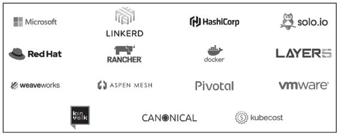

图15-11　SMI规范的参与者

2020年4月，SMI被托管到CNCF，成为其中的一个Sandbox项目（Sandbox是最低级别的项目，CNCF只提供有限度的背书），如果能够经过孵化、毕业阶段的话，SMI将有望成为公认的行业标准，这也是开源技术社区里民主管理的一点好处。

讲述了SMI的背景与价值，笔者再简要介绍一下SMI的主要内容。目前（v0.5版本）的SMI规范包括四方面的API构成，分别如下。

·流量规范（Traffic Specs）：目标是定义流量的表示方式，譬如TCP流量、HTTP/1流量、HTTP/2流量、gRPC流量、WebSocket流量等该如何在配置中抽象及使用。目前SMI只提供了TCP和HTTP流量的直接支持，而且都比较简陋，譬如HTTP流量的路由中甚至不支持以Header作为判断条件。这暂时只能自我安慰地解释为SMI在流量协议的扩展方面是完全开放的，没有功能也能自己扩充，哪怕不支持或私有协议的流量也有可能使用SMI来管理。流量表示是路由和访问控制的必要基础，因为必须要以流量中的特征为条件才能进行转发和控制，流量规范中已经自带了路由能力，访问控制则被放到独立的规范中去实现。

·流量拆分（Traffic Split）：目标是定义不同版本服务之间的流量比例，提供流量治理的能力，譬如限流、降级、容错等，以满足灰度发布、A/B测试等场景。SMI的流量拆分是直接基于Kubernetes的Service资源来设置的，这样做的好处是使用者不需要学习理解新的概念，坏处是要拆分流量就必须定义出具有层次结构的Service，即Service后面不是Pod，而是其他Service。而Istio中则是设计了VirtualService这样的新概念来解决相同的问题，通过Subset来拆分流量。至于两者孰优孰劣，这就见仁见智了。

·流量度量（Traffic Metric）：目标是为资源提供通用集成点，度量工具可以通过访问这些集成点来抓取指标。这部分完全遵循了Kubernetes的Metrics API进行扩充。

·流量访问控制（Traffic Access Control）：目标是根据客户端的身份配置，对特定的流量访问特定的服务提供简单的访问控制。SMI绑定了Kubernetes的ServiceAccount来做服务身份访问控制，这里说的“简单”不是指它的使用简单，而是说它只支持ServiceAccount一种身份机制，在正式使用中这恐怕是不足以应付所有场景的，日后应该还需要继续扩充。

这四种API目前暂时均是Alpha版本，意味着它们还未成熟，随时可能发生变动。从目前版本来看，至少与Istio的私有API相比，SMI没有明显优势，不过考虑SMI还处于项目早期阶段，不够强大也情有可原，希望未来SMI可以成长为一个足够坚实可用的技术规范，这有助于避免数据平面出现一家独大的情况，有利于竞争与发展。

#### 15.2.2 通用数据平面API

同样是2019年5月，CNCF创立了一个名为“通用数据平面API工作组”（Universal Data Plane API Working Group，UDPA-WG）的组织，目标是制定类似于软件定义网络中OpenFlow协议的数据平面交互标准。工作组的名字被敲定的那一刻，就已经决定了所产出的标准名字必定叫“通用数据平面API”（Universal Data Plane API，UDPA）。

如果不纠结于是否足够标准、是否由足够权威组织来制定的话，15.1节介绍数据平面时提到的Envoy xDS协议族其实就已经完全满足了控制平面与数据平面交互的需要。事实上，Envoy正是UDPA-WG工作组的主要成员，在2019年11月的EnvoyCon大会上，Envoy的核心开发者、UDPA的负责人之一，来自Google公司的Harvey Tuch做了一场以“The Universal Dataplane API：Envoy’s Next Generation APIs”为题的演讲，详细而清晰地说明了xDS与UDAP之间的关系：UDAP的研发就是基于xDS的经验，在未来xDS将逐渐向UDPA靠拢，最终将基于UDPA来实现。

图15-12是笔者在Harvey Tuch演讲PPT中截取的UDPA与xDS的融合时间表，在演讲中Harvey Tuch还提到了xDS协议的演进节奏会定为每年推出一个大版本，每个版本从发布到淘汰要经历Alpha、Stable、Deprecated、Removed四个阶段，每个阶段持续一年时间，简单地说就是每个大版本xDS在被淘汰前会有三年的固定生命周期。基于UDPA的xDS v4 API原本计划会在2020年发布，进入Alpha阶段，不过，截至2020年10月中旬，已经可以肯定地说上面所列的计划必然破产，因为从目前公开的资料来看，UDPA仍然处于早期设计阶段，距离完备都尚有一段很长的路程，所以基于UDPA的xDS v4在2020年是铁定出不来了。

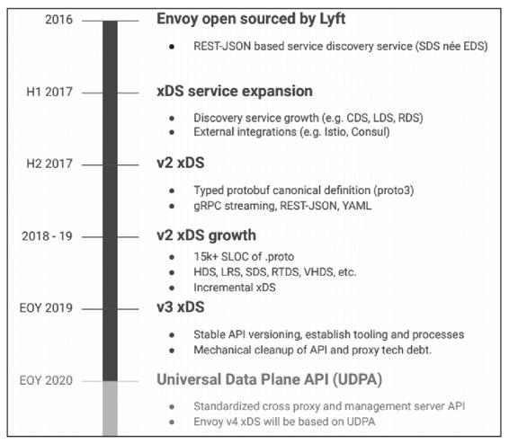

图15-12　UDPA规范与xDS协议融合时间表[1]

在规范内容方面，由于UDPA连Alpha状态都未能达到，目前公开的资料还很少。从GitHub和Google文档上能找到的部分设计原型文件来看，UDAP的主要内容会分为传输协议（UDPA-TP，TransPort）和数据模型（UDPA-DM，Data Model）两部分，且这两部分是独立设计的，以后完全有出现不同的数据模型共用同一套传输协议的可能。

[1] 图片来源：https://envoycon2019.sched.com/event/UxwL/the-universal-dataplane-api-udpa-envoys-next-generation-apis-harvey-tuch-google。

#### 15.2.3 服务网格生态

2016年“Service Mesh”一词诞生至今不过短短四年时间，服务网格已经从研究理论变成在工业界中广泛采用的技术，用户的态度也从观望走向落地生产。目前，服务网格市场已形成初步的生态格局，尽管还没有决出最终的胜利者，但已经能基本看清这个领域里几个有望染指圣杯的玩家。下面，笔者按数据平面和控制平面，分别介绍一下目前服务网格产品的主要竞争者。在数据平面的产品主要有以下几个。

·Linkerd：2016年1月发布的Linkerd是服务网格的鼻祖，使用Scala语言开发的Linkerd-proxy也就成为业界第一款正式的边车代理。一年后的2017年1月，Linkerd成功进入CNCF，成为云原生基金会的孵化项目，但此时的Linkerd其实已经显露出了明显的颓势：由于Linkerd-proxy运行需要Java虚拟机的支持，在启动时间、预热、内存消耗等方面相比晚它半年发布的挑战者Envoy均处于全面劣势，因而Linkerd很快就被Istio与Envoy的组合所击败，结束了它短暂的统治期。

·Envoy：2016年9月开源的Envoy是目前边车代理产品中市场占有率最高的一款产品，已经在很多个企业的生产环境里经受过大量检验。Envoy最初由Lyft公司开发，后来由于Lyft与Google、IBM达成合作协议，所以Envoy就成了Istio的默认数据平面。Envoy使用C++语言实现，比起Linkerd在资源消耗方面有了明显的改善。此外，由于采用了公开的xDS协议进行控制，Envoy并不只为Istio所私有，这个特性让Envoy被很多其他的管理平面选用，为它夺得市场占有率桂冠做出了重要贡献。2017年9月，Envoy加入CNCF，成为CNCF继Linkerd之后的第二个数据平面项目。

·nginMesh：2017年9月，在NGINX Conf 2017大会上，Nginx官方公布了基于著名服务器产品Nginx实现的边车代理nginMesh。nginMesh使用C语言开发（有部分模块用了Golang和Rust），是Nginx从网络通信踏入程序通信的一次重要尝试。Nginx在网络通信和流量转发方面拥有其他厂商难以匹敌的成熟经验，本该成为数据平面的有力竞争者才对，然而结果却是Nginx在这方面的投入资源有限，方向摇摆，让nginMesh的发展一直都不温不火，最后在2020年宣告失败，项目转入“非活跃”（No Longer Under Active）状态。

·Conduit/Linkerd 2：2017年12月，在KubeCon大会上，Buoyant公司发布了Conduit的0.1版本。这是Linkerd-proxy被Envoy击败后，Buoyant公司使用Rust语言重新开发的第二代的服务网格产品，最初是以Conduit命名，在Conduit加入CNCF后不久，与原有的Linkerd项目合并，被重新命名为Linkerd 2（这样就只算一个项目了）。使用Rust重写后，Linkerd2-proxy的性能与资源消耗方面都已不输Envoy，但它的定位通常是作为Linkerd 2的专有数据平面，成功与否很大程度上取决于Linkerd 2的发展。

·MOSN：2018年6月，来自蚂蚁金服的MOSN宣布开源，MOSN是SOFAStack中的一部分，使用Golang语言实现，在阿里巴巴及蚂蚁金服中经受住了大规模的应用考验。由于MOSN是阿里技术生态的一部分，对于使用了Dubbo框架，或者SOFABolt这样的RPC协议的微服务应用，MOSN往往能够提供额外的便捷性。2019年12月，MOSN也加入了CNCF。

以上介绍的是知名度和使用率最高的一部分数据平面，笔者在选择时也考虑了不同程序语言实现的代表性，其他未提及的数据平面还有HAProxy Connect、Traefik、ServiceComb Mesher等，这里不再逐一介绍。除了数据平面，服务网格中另外一条争夺激烈的战线是控制平面产品，主要包括以下产品。

·Linkerd 2：Buoyant公司的服务网格产品，无论是数据平面抑或是控制平面均使用了“Linkerd”和“Linkerd 2”的名字。现在Linkerd 2的身份已经从领跑者变成了Istio的挑战者，虽然代理的性能已赶上了Envoy，但功能上Linkerd 2仍不足以与Istio媲美，在mTLS、多集群支持、支持流量拆分条件的丰富程度等方面Istio都比Linkerd 2更有优势，毕竟两者背后的研发资源并不对等，一方是创业公司Buoyant，另一方是Google、IBM等巨头。然而，相比Linkerd 2，Istio的缺点很大程度上也是由其功能丰富带来的，每个用户真的都需要支持非Kubernetes环境、多集群单控制平面、切换不同的数据平面等这类特性吗？在满足需要的前提下，更小的功能集合往往意味着更高的性能与易用性。

·Istio：Google、IBM和Lyft公司联手打造的产品，以自己的Envoy为默认数据平面。Istio是目前功能最强大的服务网格，如果你苦恼于这方面产品的选型，直接挑选Istio不一定是最合适的，但起码能保证这是不会有明显缺陷的选择；同时Istio也是市场占有率第一的控制平面，不少公司发布的服务网格产品都是在它的基础上派生增强而来，譬如蚂蚁金服的SOFAMesh、Google Cloud Service Mesh等。不过，服务网格毕竟比容器运行时、容器编排要年轻，Istio在服务网格领域尽管占有不小的优势，但统治力还远远不能与容器运行时领域的Docker和容器编排领域的Kubernetes相媲美。

·Consul Connect：Consul Connect是来自HashiCorp公司的服务网格，目标是将现有由Consul管理的集群平滑升级为服务网格的解决方案。如同Connect这个名字所预示的“连接”含义，Consul Connect十分强调其整合集成的角色定位，不与具体的网络和运行平台绑定，可以切换多种数据平面（默认为Envoy），支持多种运行平台，譬如Kubernetest、Nomad或者标准的虚拟机环境。

·OSM：OSM（Open Service Mesh）是微软公司在2020年8月开源的服务网格，同样以Envoy为数据平面。OSM项目的其中一个主要目标是作为SMI规范的参考实现。同时，为了与强大却复杂的Istio进行差异化竞争，OSM明确以“轻量简单”为卖点，通过减少边缘功能和对外暴露的API数量，降低服务网格的学习、使用成本。现在服务网格正处于群雄争霸的时期，在世界三大云计算厂商中，亚马逊的AWS App Mesh走的是专有闭源的发展路线，剩下就只有微软与Google具有相似体量，能够对等地竞争。但它们又选择了截然不同的竞争策略：OSM开源后，微软马上将其捐献给CNCF，成为开源社区的一部分；与此相对，尽管CNCF与Istio都有着Google的背景关系，但Google却不惜违反与IBM、Lyft之间的协议，拒绝将Istio托管至CNCF，而是自建新组织转移了Istio的商标所有权。这种做法不出意外地遭到开源界的抗议，让观众产生了一种微软与Google身份错位的感觉。在云计算的激烈竞争中，似乎已经再也分不清楚谁是恶龙，谁是屠龙少年了。

上面未提到的控制平面还有许多，譬如Traefik Mesh、Kuma等，这里不再展开介绍。服务网格也许是未来的发展方向，但想要真正发展成熟并大规模落地还有很长的一段路要走。一方面，相当多的程序员已经习惯了通过代码与组件库去进行微服务治理，并且已经积累了很多的经验，能把产品做得足够成熟稳定，因此对服务网格的需求并不迫切；另一方面，目前服务网格产品的成熟度还有待提高，冒险迁移过于激进，也容易面临兼容性的问题。也许服务网格开始远离市场宣传的喧嚣后，才会真正落地。
