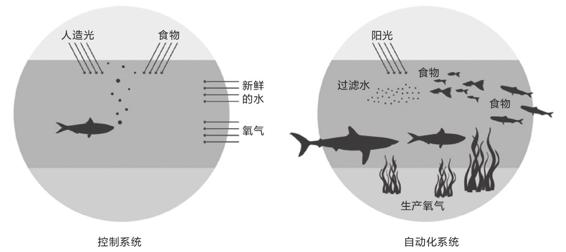
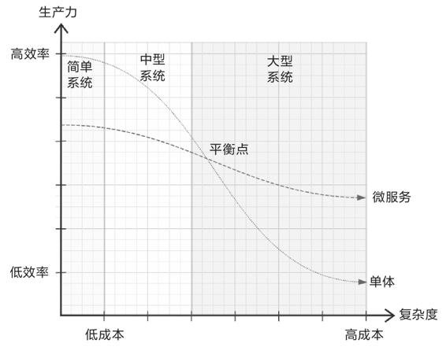
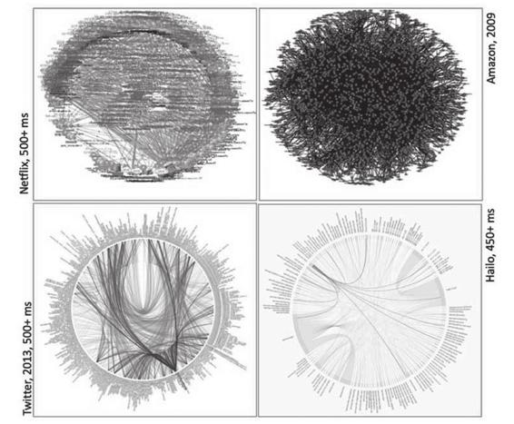
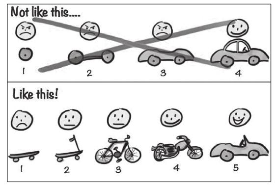

## 第16章 向微服务迈进

额外知识

没有银弹

传说，能从普通人忽然变身的狼人是梦魇中最为可怖的怪物，人们一直尝试寻找能对狼人一枪毙命的银弹。

软件亦有着狼人的特性，平常看似人畜无害的技术研发工作，转眼间就能变成一只工期延误、预算超支、产品满身瑕疵的怪兽。我听到了管理者、程序员与用户都在绝望地呼唤，大家都渴望能找到某种可以有效降低软件开发成本的银弹，让软件开发成本也能如同电脑硬件的成本那样，稳定且快速地下降。

——Fred Brooks，No Silver Bullet：Essence and Accidents of Software Engineering,1987

本书的主体内容是务实的，多谈具体技术，少谈方向理论，只在本章集中讨论几点与分布式、微服务、架构等相关的相对务虚的话题。

IBM大型机之父Fred Brooks在他的两本著作《没有银弹：软件工程的本质性与附属性工作》和《人月神话：软件项目管理之道》里都反复强调一个观点：“软件研发中任何一项技术、方法、架构都不可能是银弹。”这个结论已经被软件工程里无数事实所验证，现在对于微服务也依然成立。本节，笔者将会谈到哪些场景适合使用微服务，以及一些已经被验证过、被总结为经验的最佳的实践方式；而更主要的是想讨论哪些场景不适合微服务，微服务存在哪些理解误区、应用前提，等等。

作为一本技术书的作者，如果有同学是因为看了此书，然后被带进微服务的“坑”里，那笔者只强调一句“微服务不是银弹”也难以免责，所以，在你准备发起实际行动向微服务迈进前，希望你能阅读一遍本章——向微服务迈进的“避坑”指南。

### 16.1 目的：微服务的驱动力

在讨论什么时候开始以及如何向微服务迁移之前，我们先来理清为什么需要微服务。凡事总该先有目的，有预期收益再谈行动才显得合理。有人会说迈向微服务的目的是追求更先进的架构形式。这话对，但没有什么信息量可言，任何一次架构演进的目的都是为了更加先进，应该没谁是为“追求落后”而重构系统的。有人会说微服务是信息系统发展的必然阶段，为了应对日益庞大的压力，获得更好的性能，自然会演进至能够扩缩自如的微服务架构。这个观点看似合理、具体、正确，实则争议颇大。笔者个人的态度是旗帜鲜明地反对以“获得更好的性能”为主要目的，将系统重构为微服务架构，性能有可能会作为辅助性的理由，但仅仅为了性能而选择分布式的话，那应该是40年前“原始分布式时代”所追求的目标。现代的单体系统同样会采用可扩缩的设计，同样能够集群部署，更重要的是云计算数据中心的处理能力几乎可以认为是无限的，那能够通过扩展硬件的手段解决问题就尽量别使用复杂的软件方法，其中原因在前面引用“银弹”时已经解释过：硬件的成本能够持续稳定地下降，而软件开发的成本则不可能。而且，性能也不会因为采用了微服务架构而凭空产生。把系统拆成多个微服务，一旦在某个关键地方依然卡住了业务流程，其整体的结果往往还不如单体，没有清晰的职责划分，导致扩展性失效，多加机器往往还不如单机。将前面这句话开头的性能替换为代码质量、生产力等词语往往也同样适用，具体不再赘述。

软件系统选择微服务架构，通常比较常见的、合理的驱动力来自组织外部、内部两方面，笔者先列举一些外部因素。

·当意识到没有什么技术能够包打天下。

举个具体例子，某个系统选用了处于Tiobe排行榜榜首多年的Java语言来开发，也会遇到很多想做但Java却不擅长的事情。譬如想做人工智能，进行深度学习训练，发现大量的库和开源代码都离不开Python；想要引入分布式协调工具时，发现近几年ZooKeeper已经有被后起之秀Go的etcd蚕食替代的趋势；想做集中式缓存，发现无可争议的首选是ANSI C编写的Redis，等等。很多时候为异构能力进行的分布式部署，并不是你想或者不想的问题，而是没有选择、不可避免的。

·当个人能力因素成为系统发展的明显制约。

对于北上广深的信息技术企业来说这个问题可能不会成为主要矛盾，在其他地区，不少软件公司即使有钱也很难招到大量靠谱的高端开发者。此时，无论是引入外包团队，抑或是让少量技术专家带领大量普通开发人员去共同完成一个大型系统，微服务都是一个更有潜力的选择。在单体架构下，没有什么有效阻断错误传播的手段，系统中“整体”与“部分”的关系没有物理的划分，系统质量只能靠研发与项目管理措施来尽可能地保障，少量的技术专家很难阻止大量螺丝钉式的程序员或者不熟悉原有技术架构的外包人员在某个不起眼的地方犯错并产生全局性的影响，不容易做出整体可靠的大型系统。这时微服务可以作为专家掌控架构约束力的技术手段，由高水平的开发、运维人员去保证关键的技术和业务服务质量，其他大量外围的功能即使不靠谱，甚至默认它们必定不靠谱，也能保证系统整体的稳定和局部的容错、自愈与快速迭代。

·当遇到来自外部商业层面对内部技术层面提出的要求。

对于那些以“自产自销”为主的互联网公司来说这一点体验不明显，但对于很多为企业提供信息服务的软件公司来说，甲方的要求往往才是具决定性的推动力。技术、需求上的困难也许能变通克服，但当微服务架构变成大型系统先进性的背书时，甲方的招投标文件技术规范明文要求系统必须支持微服务架构、分布式部署，那就没有多少讨价还价的余地了。

在系统和研发团队内部，也会有一些因素促使其向微服务靠拢。

·变化发展特别快的创新业务系统往往会自主地向微服务架构靠近。

需求人员喊着“要试错！要创新！要拥抱变化！”，开发人员喊着“资源永远不够！活干不完！”，运维人员喊着“你见过凌晨四点的洛杉矶吗！”，对于那种“一个功能上线平均活不过三天”的系统，如果团队本身能力能够支撑在合理的代价下让功能有快速迭代的可能，让代码能避免在类库层面的直接依赖而导致纠缠不清，让系统有更好的可观测性和回弹性（自愈能力），需求、开发、运维人员肯定都是很乐意接受微服务的，毕竟此时大家的利益一致，微服务的实施也会水到渠成。

·大规模的、业务复杂的、历史包袱沉重的系统也可能主动向微服务架构靠近。

这类系统最后的结局不外乎三种。

第一种是日渐臃肿，客户忍了，系统持续维持着，直到谁也替代不了却又谁也维护不了。笔者曾听说过国外有公司招聘60、70岁的爷爷辈程序员去维护20世纪由COBOL编写的系统，当然，笔者没有求证过这到底是网络段子还是确有其事。

第二种是日渐臃肿，客户忍不了了，痛下决心，宁愿付出一段时间内业务双轨运行，忍受在新、旧系统上重复操作，期间业务发生震荡甚至短暂停顿的代价，也要彻底淘汰整套旧系统，第二种情况笔者亲眼看见过不少。

第三种是日渐臃肿，客户忍不了，系统也很难淘汰。此时迫于外部压力，微服务会作为一种能够将系统部分拆除、修改、更新、替换的技术方案被严肃地论证，若在重构阶段有足够靠谱的技术人员参与，该大型系统的应用代码和数据库都逐渐分离独立，直至孵化出一个个可替换、可重生的微服务。微服务的先驱Netflix曾在多次演讲中说自己公司属于这一种的成功案例。

以上列举的这些内外部原因只是举例，肯定不是全部，促使你最终选择微服务的具体理由可能多种多样，相信你做出向微服务迈进的决策时，一定经过恰当的权衡，认为收益大于成本。微服务最主要的目的是对系统进行有效拆分，实现物理层面的隔离，微服务的核心价值就是拆分之后的系统能够让局部的单个服务有可能实现敏捷地卸载、部署、开发、升级，而局部的持续更迭，是系统整体具备Phoenix特性的必要条件。

### 16.2 前提：微服务需要的条件

现在笔者假设你所在的组织已经做出了要选择分布式微服务架构的决定。那下一件你要弄明白的事情就是，什么情况下可以开始微服务化，或者说，开始微服务时需要哪些前提条件？对于此问题，Martin Fowler曾在文章Microservice Prerequisites中从技术角度专门讨论过，不过，笔者认为微服务的前提条件首要还是解决非技术方面的问题，准确地说是人的问题。分布式不是一项纯粹的技术性工作，如果不能满足以下条件，就应该尽量避免采用微服务。

额外知识

系统的架构趋同于系统设计团队的沟通结构。

——Melvin Conway，康威定律，1968年

微服务化的第一个前提条件是决策者与执行者都能意识到康威定律在软件设计中的关键作用。

康威定律尝试使用社会学的方法去解释软件研发中的问题，其核心观点是“沟通决定设计”（Communication Dictate Design），如果技术层面紧密联系在一起的特性，在组织层面上强行分离开来，那结果会是沟通成本的上升，因为会产生大量跨组织的沟通；如果技术层面本身没什么联系的特性，在组织层面上强行安放在一块，那结果会是管理成本的上升，因为成员越多越不利于一致决策的形成。这些社会学、管理学的规律决定了假如产品和组织能够经受住市场竞争，长期发展的话，最终都会自发地调整成组织与产品互相匹配的状态。哪些特性在团队内部沟通，哪些特性需要跨团队的协作，将最终都会在产品中分别映射成与组织结构一致的应用内、外部的调用与依赖关系。

尽管稍微有些工作经验的员工和管理者思考一下都能理解康威定律所描述的现象，但是为了推进软件架构的微服务化而配合调整组织架构，通常不是一件容易的事情。西方有一句谚语叫作“所有技术上的决策实际都是政治上的决策”（All Technical Decisions Are Political Decisions），这里的“政治”是泛指如何与其他人协作将事情搞定，“技术”也是泛指所有战术层面行为，并不局限于信息技术。架构不仅仅是个技术问题，更是一种社交活动，甚至还可能会涉及利益的重新分配。譬如，产品在技术上的拆装重构相对容易，但为了做到组织与产品对齐，将某个组织的一部分权利、职能和人员拆分出来，该组织的领导是否愿意；将两个团队合并成一个新的团队，原有的团队负责人要如何安置等。这些问题不仅需要执行者有良好的社交能力，还需要更上层的决策者充分理解架构演变同步调整组织结构的必要性，为微服务化打破局部的利益藩篱。

微服务化的第二个前提条件是组织中具备一些对微服务有充分理解、有一定实践经验的技术专家。

笔者在1.4节中曾写到“作为一个普通的服务开发人员，作为一个螺丝钉式的程序员，微服务架构是友善的。可是，微服务对架构者是满满的恶意，对架构能力要求已提升到史无前例的程度”。即使对微服务最乐观的支持者也无法否认它在架构方面带来了额外的复杂性。对于开发业务逻辑的普通程序员来说，即使代码出现缺陷也可以被快速修复升级，甚至有可能在Kubernetes的帮助下自动回弹，哪怕不能自愈，最起码错误也会被系统自动隔离，而不至于影响全局，弄崩整个系统。开发业务的普通程序员可以不去深究跟踪治理、负载均衡、故障隔离、认证授权、伸缩扩展这些系统性的问题，它们被隐藏于软件架构的最底层，被掩埋在基础设施之下。与此相对的另外一面，靠谱的软件架构应该要由深刻理解微服务的技术专家来设计建造，健壮的基础设施也离不开有经验的运维专家的持续运维，Kubernetes、Istio、Spring Cloud、Dubbo等现成的开源工具能在此过程发挥很大的作用，但它们本身也有一定的复杂性。如果整个团队中缺乏能够在微服务架构中撑起系统主干的技术和运维专家，强行进行微服务化并不会有任何好处，至少收益不足以抵消复杂性增加而导致的成本。这些技术专家不需要很多（能多当然更好），但是必须有。如今在软件职场中阿里、腾讯等大厂出来的程序员受到追捧，除了企业带来的光环外，有大型系统浸染的经验，更有可能是技术专家也是主要原因之一。

微服务对普通程序员友善的背后，预示着未来的信息技术行业很可能也会出现“阶级分层”的现象，由于更先进的软件架构已经允许更平庸的开发者也同样能写出可运行、可用于生产的软件产品，同时又对精英开发者提出更多、更复杂的技术要求，长此以往，在开发者群体中会出现比现在还要明显的马太效应。如果把整个软件业界看作一个巨大的组织，它也应符合康威定律，软件架构的趋势将导致开发者的分层，从如今所有开发者都普遍被认为是“高智商人群”的状态，转变为大部分工业化软件生产工人加上小部分软件设计专家的金字塔结构。

微服务化的第三个前提条件是系统应具有以自治为目标的自动化与监控度量能力。

微服务是由大量松耦合服务互相协作构成的系统，将自动化与监控度量作为它的建设前提是顺理成章的。Martin Fowler在“Microservice Prerequisites”[1]中提出了微服务系统的三个技术前提都跟自动化与监控度量有关，具体如下所示。

·环境预置（Rapid Provisioning）：即使不依赖云计算数据中心的支持，也有能力在短时间（原文是几个小时，如今Kubernetes重启一个Pod只需要数秒到数十秒）内迅速启动一台新的服务器。

·基础监控（Basic Monitoring）：监控体系有能力迅速捕捉到系统中出现的技术问题（如异常、服务可用性变化）和业务问题（如订单交易量下降）。

·快速部署（Rapid Deployment）：有能力通过全自动化的部署管道，将服务的变更迅速部署到测试或生产环境中。

请注意Martin Fowler撰写这篇文章的时间是2014年，当时Kubernetes都还没有从闭源的Borg中诞生，虚拟化、自动化技术还是比较初级的水平。近年来，许多公司都构建起了DevOps文化，虚拟化与开发运维自动化有了长足发展，2014年要专门强调的“前提条件”对今天的系统来说算不上什么困难。在这里笔者更希望强调的重点是“以自治为目标”，因为如果不是朝这个方向去努力的话，自动化最终会导向一个套娃式的悖论：即使所有运维都实现了自动化，同时有一个监控系统来随时恢复出现故障的服务，但是这个监控系统本身也需要被监控。如果启用另一个监控系统，同样这个监控系统也需要被监控。最终，不论自动化实现了多少层，顶层仍然必须是人，只有人能确保整体运维的连续性，所以永远也无法达到完全的自动化。而且，这些自动化与监控措施本身也会消耗资源，也会带来更高的复杂性。

微服务自动化的最终目的是构筑可持续的生态系统。这句话听起来很抽象，有点像主席台上领导的演讲词。笔者用一个具体的场景加以说明：如果将微服务比作水族馆里养的鱼，为了维持鱼的生存，管理员需要不断向水族馆内添加各种自动化设施，如人工照明、氧化剂、水过滤器、加热器等。这些设施最终仍然需要人花费精力去维护，本身就耗费了大量成本。如果我们换一种思路，通过种植海洋植物提供氧气、通过藻类过滤水质、通过放养螺类清理鱼缸等，这样的水族馆就不再是依靠人工维护才能存在的水族馆了，它变成了一个小型的湖泊或海洋，理想状态下，这里的鱼类可以不需要人的干预就能长期存活。如图16-1所示。

图16-1　从人工控制系统到自动化生态系统

以生态自治为目标的自动化，并不是指要达到如此高的自动化程度之后才能开始微服务，只要满足与系统规模及目标相匹配的自动化能力，建设微服务的不同时期，由不同程度的人力去参与运维完全是合情合理的。退一步说，即使在信息化水平最高的大型互联网企业中，完全的生态自治在当前技术水平下仍然是一个过于理想化、难以全面落地的目标，不过，只有朝着这个目标去发展自动化与监控度量，才能避免“屠龙少年”最终变成“恶龙”，避免自动化与度量监控反过来成为人与系统的负担。

微服务化的第四个前提条件是复杂性已经成为制约生产力的主要矛盾。

在1.2节的开篇笔者就阐述了一个观点：“对于小型系统，单体架构就是最好的架构”。系统进行任何改造的根本动力都是“这样做收益大于成本”。一般情况下，引入新技术在解决问题之前就带来复杂度的提升，反而会导致生产力下降。只有在业务已经发展到一定程度，单体架构与微服务架构的生产力曲线已经到达交叉点，此时开始进行微服务化才是有收益的，如图16-2所示。关于复杂度的问题，我们将在16.4节中更具体地探讨。

图16-2　微服务与单体的生产力随复杂度变化的曲线

复杂性、生产力的性价比问题并不难理解，然而现实中很多架构师却不得不在这上面主动犯错。在新项目立项之初，往往都会定下令人心动的目标愿景，远景规划在战略上是有益的，可是多数技术决策都属于战术范畴，应该依据现实情况而不是远景规划去做决定。遗憾的是很多管理者，乃至技术架构师都不能真正接受演进式设计（Evolutionary Design），尤其不能接受一个具有良好设计的系统应该是能够被报废的观点，潜意识中总会希望系统建设能够一步到位，至少是“少走几步能到位”。

额外知识

长期来看，多数服务的结局都是报废而非演进。

——Microservices，Martin Fowler

如果你不理解“主动犯错”，笔者可以举个具体例子，试想你就是一名架构师，项目立项中坚持要选择单体架构，此时你就要考虑到日后评审时，别的团队说他的产品采用了微服务架构，架构上比你的先进；考虑到招聘人员时，程序员听见你这里连微服务都没用，觉得制约了自己的发展前景；考虑到项目成功火爆了，几个月后你再提出进行微服务化，老板听了心里觉得你水平的确不行，之前采用单体是错误决定，导致现在要返工……

以上，便是笔者总结的开始微服务化的四个前提条件，如果你做技术决策时，能仅以技术上的收益为度量标准，根据这些前提就能判断应不应该采用微服务，那你工作的氛围是比较开明的；如果你做技术决策要考虑的收益不仅限于技术范畴之内，我也完全能够理解，毕竟，所有技术上的决策实际都是政治上的决策。

[1] 文章地址：https://martinfowler.com/bliki/MicroservicePrerequisites.html。

### 16.3 边界：微服务的粒度

当今软件业界，对本节的话题“识别微服务的边界”其实已取得了较为一致的观点，也找到了指导具体实践的方法论，即领域驱动设计（Domain-Driven Design，DDD）。囿于主题，在本书中甚少涉及该如何抽象业务、分析流程、识别边界、建立模型、映射到服务和代码等偏重理论的务虚话题，即使在这一章中，笔者也尽量规避了DDD中需要专门学习才能理解的概念，如界限上下文（Bounded Context）、语境映射（Context Map）、通用语言（Ubiquitous Language）、领域和子域（Domain、Sub Domain）、聚合（Aggregate）、领域事件（Domain Event）等。并非笔者认为业务流程与设计方法论不重要，而是如果要严谨、深刻地讨论这些话题，其篇幅足以独立地写出一本书。事实上，市场上已经有不少这样的书了，DDD的发明人Eric Evans撰写的同名图书——《领域驱动设计：软件核心复杂性应对之道》便是其中翘楚。笔者个人是更推荐Chris Richardson撰写的颇具口碑的入门书——《微服务架构设计模式》，其叙述的主线就是在DDD指导下，如何将一个单体服务逐步拆分为微服务结构，如果你对这方面感兴趣，不妨一读。在本节，笔者会从业务之外的其他角度，从非功能性、研发效率等方面来探讨微服务的粒度与拆分。

系统设计是一种创作，而不是应试，不可能每一位架构师设计的服务粒度全都相同，微服务的大小、边界不应该只有唯一正确的答案或绝对的标准，但是应该有个合理的范围，笔者称其为微服务粒度的上下界。我们可以通过分析如果微服务的粒度太小或者太大会出现哪些问题，从而得出服务上下界应该定在哪里。

可能是受微服务名字中“微”的“蛊惑”，笔者听过不少人提倡微服务越小越好，最好做到一个REST Endpoint对应一个微服务，这种极端的理解肯定是错误的，如果将微服务粒度设计得过细，会受到以下几个方面的反噬。

·从性能角度看，一次进程内的方法调用（仅计算调用，与方法具体内容无关），耗时在零（按方法完全内联的场景来计算）到数百个时钟周期（按最慢的虚方法调用无内联缓存要查虚表的场景来计算）之间；一次跨服务的方法调用里，网络传输、参数序列化和结果反序列化都是不可避免的，耗时要达到毫秒级别，你可以算一下这两者有多少个数量级的差距。远程服务调用里已经解释了“透明的分布式通信”是不存在的，因此，服务粒度大小必须考虑到消耗在网络上的时间与方法本身执行时间的比例，避免设计得过于琐碎，客户端不得不多次调用服务才能完成一项业务操作，譬如，将字符串处理这样的功能设计为一个微服务便是不合适的。这点要求从功能设计上看微服务应该是完备的。

·从数据一致性角度看，每个微服务都有自己独立的数据源，如果多个微服务要协同工作，我们可以采用很多办法来保证它们处理数据的最终一致性，但如果某些数据必须要求保证强一致性的话，那它们本身就应当聚合在同一个微服务中，而不是强行启用XA事务来实现，因为参与协作的微服务越多，XA事务的可用性就越差。这点要求从数据一致性上看微服务应该是内聚（Cohesion）的。

·从服务可用性角度看，服务之间是松散耦合的依赖关系，微服务架构中无法也不应该假设被调用的服务具有绝对的可用性，服务可能因为网络分区、软件重启升级、硬件故障等任何原因发生中断。如果两个微服务都必须依赖对方可用才能正常工作，那就应当将其合并到同一个微服务中（注意这里说的是“彼此依赖对方才能工作”，单向的依赖是必定存在的）。这点要求从依赖关系上看微服务应该是独立的。

综合以上，我们可以得出第一个结论：微服务粒度的下界是它至少应满足独立——能够独立发布、独立部署、独立运行与独立测试，内聚——强相关的功能与数据在同一个服务中处理，完备——一个服务包含至少一项业务实体与对应的完整操作。

我们再来想想，如果微服务的粒度太大，会出现什么问题？从技术角度讲，并不会有什么问题，每个能正常工作的单体系统都能满足独立、内聚、完备的要求。微服务的上界并非受限于技术，而是受限于人，更准确地说，受限于人与人之间的社交协作。《人月神话》中最反直觉的一个结论是：“为进度给项目增加人力，如同用水去为油锅灭火”（Adding Manpower to A Late Software Project Makes It Later）。为什么？Fred Brooks给出了简洁而有力的答案：

软件项目中的沟通成本=n×(n–1)/2，n为参与项目的人数

为了能让你更直观地理解这个答案，笔者已经算好了一组数字：15人参与的项目，沟通成本大约是5人项目的十倍，150人参与的项目，沟通成本大约是5人项目的一千倍。你不妨回想一下自己在公司的工作体验，不可能有150人的团队而不划分出独立小组来管理的，除非这些人都从事流水线式的工作，协作时完全不需要沟通。此外，你也不妨回想一下自己的生活体验，我敢断言你的社交上界是不超过5个知己好友，15个可信任的伙伴，35个普通朋友，150个说得上话的人。这句话的信心底气源于此观点是人类学家Robin Dunbar在1992年给出的科学结论，今天已被普遍认可，被称为“邓巴数”（Dunbar’s Number），据说是人脑的新皮质大小限制了人能承受的社交数量，决定了邓巴数这个社交的上界。

有了以上铺垫，你应该更能理解前面许多文章中笔者为何采用“2 Pizza Team”作为微服务团队规模的“量词”了，并不是因为制造这个梗的人是Jeff Bezos，是亚马逊CEO、世界首富，而是因为两个Pizza能喂饱的人数大概就是6～12人，符合软件开发中团队管理的理想规模。

康威定律约束了软件的架构与组织的架构要保持一致，所以微服务的上界应该与2 Pizza Team能够开发的最大程序规模保持一致。那么，2 Pizza Team能开发多大规模的程序呢？在人员数量固定的前提下，这个答案不仅与开发者的能力水平相关，更是与研发模式和周期相关。如果你的软件产品采用瀑布开发模式，可能需要一个月、两个月迭代一次；如果采用Scrum模式，可能会一周、两周完成一次冲刺；如果追求日构建、精益，甚至可能一天、两天就会集成构建出一个小版本，以上不同的研发方法，都会产生相应规模的上界。

综合以上，我们得出了第二个结论：微服务粒度的上界是一个2 Pizza Team能够在一个研发周期内完成的全部需求范围。

在上下界范围内，架构师会根据业务和团队的实际情况来灵活划定微服务的具体粒度。譬如下界的完备性要求微服务至少包含一项完整的业务，在不超过上界的前提下，要判断这个微服务包含两项、三项业务操作是否合理，需要根据这些操作本身是否有合理的逻辑关系来具体讨论。又譬如上界要求单个研发周期内处理掉一个微服务的全部需求，在不超过下界的前提下，一个周期就能完成属于两个、三个微服务的全部需求时，是缩短研发周期更合理，还是允许这个周期内同时开发几个微服务更合理，也可以根据实际情况具体讨论。

### 16.4 治理：理解系统复杂性

行文至此，本章的字里行间都有意无意地流露出微服务架构是复杂的，反复提醒读者三思而后行、慎重决策，却还没有解释复杂性具体是指什么、微服务到底有多么复杂、能不能量化、有没有解决的办法。对于最后这个问题，笔者其实并不能给出具体的解决复杂性的方法，在软件研发中估计永远无法找到。这节里，笔者将重点分析前三个问题，正确理解软件的复杂性，日后实际解决问题时方能有的放矢。

额外知识

治理就是让产品能够符合预期地稳定运行，并能够持续保持在一定的质量水平上。

——Magic Quadrant for SOA Governance，Gartner，2007年

软件业的确经常会使用到“治理”这个词，听着高级，用着也贴切，譬如系统治理、业务治理、流程治理、服务治理，等等。这个词的确切含义是让产品（系统、业务、流程、服务）能够符合预期地稳定运行，并能够持续保持在一定的质量水平上。该定义把治理具体分解为“正确执行”（让软件符合预期地运行）和“持续保持”（让软件持续保持一定质量水平地运行）两个层次的要求，笔者也会分别从静态与发展两种角度解释治理与复杂性的关系。

#### 16.4.1 静态的治理

要求一个信息系统能够符合预期地运行，这听起来无论如何不算什么“高标准”。不过，当复杂性高到一定程度的时候，能达到正常运行确实就已经离不开治理了。笔者举例说明一下：一只存活的蜂王或者蚁后就能够满足一个昆虫族群稳定运行的需要，一位厨艺精湛的饭店老板也能够满足一家小饭馆稳定运行的需要，一个君圣臣贤的统治集团才能满足一个庞大帝国稳定运行的需求。治理好蜂群只要求蜂王活着即可，治理好饭馆要依赖老板个人的高明厨技，到了治理国家社稷就要求皇帝圣明大臣贤良才行，可见族群运作的复杂度就越高，治理难度也越高。如果你还是没能将族群与个体的关系跟系统与服务的关系联系起来，那再看看图16-3，仅凭直观感觉也能体会到，这些著名企业里由成百上千微服务互相调用依赖所构成的系统，能够正常运行并不简单。

图16-3　服务间交互关系[1]

说服你认可治理国家比治理一群蚂蚁要更复杂应该不难，但是说服两个软件系统各自的拥护者，分辨出哪一个系统更复杂却并不容易。决定复杂度高低的是微服务的个数吗？是类或文件的个数吗？是代码行数吗？是团队人员规模吗？答案很模糊，复杂是相对于人而言的，是一个主观标准，每个人都可以有不同的裁量。基于大型软件都是由开发人员互相协作完成的这个基本出发点，笔者用以下两个心理学概念来解释复杂性的来源。

·复杂性来自认知负荷（Cognitive Load）：在软件研发中表现为人接受业务、概念、模型、设计、接口、代码等信息所带来的负担大小。系统中个体的认知负担越大，系统就越复杂，这点解释了为什么蚂蚁族群和国家的人口可能一样多，但治理国家比治理一群蚂蚁要更复杂。

·复杂性来自协作成本（Collaboration Cost）：在软件研发中表现为团队共同研发时付出的沟通、管理成本。系统个体间协作的成本越高，系统就越复杂，这点解释了为什么小饭馆和国家的构成个体都同样是人类，但治理国家比治理一家饭馆要更复杂。

根据这两个概念，我们可以进一步量化地推导出前文已经使用过的一个结论：软件规模小时微服务的复杂度高于单体系统，规模大时则相反。这里的原因就是微服务的认知负荷较高，但是协作成本较低。

软件研发的协作成本，本质上来自协作的沟通复杂度。前一节讨论微服务粒度时已经使用过Fred Brooks的沟通成本的公式，沟通成本=n×(n–1)/2，可见随着规模增长，沟通复杂度呈平方级增长，借用算法复杂度的表示方法那就是O(N2)。在微服务架构下，组织的拆分与产品的拆分对齐（康威定律），微服务系统的交互分为服务内部的进程内调用和服务之间的网络调用，组织的沟通也被拆分为团队内部的沟通与团队之间的协作，这种分治措施有利于控制沟通成本的增长速度，此时沟通成本的复杂度，就能缩减至经典分治算法的时间复杂度，即O(NlogN)。

软件研发的认知负荷，本质上来自技术的认知复杂度。每次技术进步都伴随着新知识、新概念的诞生，说技术进步会伴随复杂度升级也无不可。只是微服务或者分布式系统所提倡的许多理念，都选择偏向于机器而不是人，有意无意地加剧了该现象。举个具体例子，心理学研究告诉我们，与现实世界不符合的模型会带来更高的认知负荷，因此面向对象编程（OOP）这种以人类观察世界的视角去抽象系统的设计方式是利于降低认知负荷的，但分布式系统提倡面向资源编程（服务间交互是REST，服务内部并不反对使用OOP），服务之间的交互绝不提倡面向对象来进行。Martin Fowler曾经在“Microservices and the First Law of Distributed Objects”[2]中强调分布式的第一原则就是不要分发对象（Don’t Distribute Your Object）。微服务加剧认知负荷还体现在很多其他方面，如异步通信（异步比同步更难理解）、粗粒度服务接口（粗粒度API比细粒度API更难使用，关于这点在Martin Fowler的原文中也有详细的解释）、容错处理（服务容错比异常更为复杂）、去中心化（尽管中心化设计会降低可用性，但确实比非中心化有更高的可管理性）等。该结果并不让人感到意外，在1.1节中笔者就提到过，分布式系统早已放弃了UNIX所追求的“简单性是系统第一属性”的设计哲学。

由于认知负荷是与概念、模型、业务、代码的规模呈正比关系，这些工作都是由人来做的，最终都能被某种比例系数放大之后反映到人员规模上，可以认为认知负荷的复杂度是O(k×N)（为便于讲解，这里将复杂度刻意写成未除消系数的形式），单体与微服务的差别是复杂度比例系数k的大小差别，微服务架构的k要比单体架构的k更大。软件研发的整体复杂度是认知负荷与协作成本两者之和，对于单体架构是O(k×N)+O(N2)，对于微服务架构，整体复杂度就是O(k×N)+O(NlogN)，由于高次项的差异，N的规模增加时单体架构的复杂度增长更快，这就定量地论证了“规模小时微服务的复杂度高于单体系统，规模大时则相反”的观点。

笔者用了千余字的篇幅，目的不是证明这个观点的正确，很多架构师仅凭经验也能直观感受出它是正确的。笔者的目的是想解释清楚软件研发的复杂性的来源与差距程度，并说明微服务中分治思想对控制软件研发复杂性的价值。假如只能用一个词来形容微服务解决问题的核心思想，笔者给的答案就是“分治”，这既是微服务的基本特征，也是微服务应对复杂性的手段。

[1] 图片来源：https://cloud-google-drive.blogspot.com/2019/11/adoption-of-cloud-native-architecture.html。

[2] 文章地址：https://martinfowler.com/articles/distributed-objects-microservices.html。

#### 16.4.2 发展的治理

我们再来看治理对动态发展方面的要求，“持续保持”是指采取某些措施，让软件系统能够持续保持一定的质量。“持续保持”听起来只是守成，应该至少不比建设困难。可是一个令人感到意外的结论是此目标其实不可能实现，如果软件系统长期接受新的需求输入，它的质量必然无法长期保持。软件研发中有一个概念“架构腐化”（Architectural Decay）专门形容此现象：架构腐化只能延缓，无法避免。

架构腐化与生物的衰老过程很像，原因都来自于随时间发生的微妙变化，如果你曾经参与过多个项目或产品的研发，应该能对以下场景有所共鸣：在项目开始的时候，团队会花很多时间去决策该选择什么技术体系、哪种架构、怎样的平台框架，甚至具体到开发、测试和持续集成工具。此时就像小孩子在选择自己钟爱的玩具，笔者相信无论决策的结果如何，团队都会欣然选择他们所想选择的，并且坚信他们的选择是正确的。事实也确实如此，团队选择的解决方案通常能够解决技术选型时就能预料到的那部分困难。但真正困难的地方在于，随着时间的流逝，团队对该项目质量的持续保持能力会逐渐下降，一方面是高级技术专家不可能持续参与软件稳定之后的迭代过程，反过来，如果持续绑定在同一个达到稳定之后的项目上，也很难培养出技术专家。老人的退出、新人的加入使得团队总是需要理解旧代码同时完成新功能的成员，技术专家偶尔来评审一下或救一救火，充其量只能算临时抱佛脚；另一方面是代码会逐渐失控，时间长了一定会有某些并不适合放进最初设计中的需求出现，工期紧、任务重、业务复杂、代码不熟悉等都会成为欠下一笔技术债的妥协理由，原则底线每一次被细微地突破，都可能被破窗效应撕裂放大成触目惊心的血痕，最终累积到每个新人到来就马上能嗅出老朽腐臭味道的程度。

架构腐化是软件动态发展中出现的问题，任何静态的治理方案都只能延缓，不能根治，必须在发展中才能找到彻底解决的办法。治理架构腐化唯一有效的办法是演进式的设计，这点与生物族群的延续也很像，流水不腐，户枢不蠹。

演进式设计在之前已经提到过多次，它是微服务中提倡的主要特征之一，也是作为技术决策者的架构师应该具备的发展式思维。架构师（Architect）一词是软件行业从建筑行业引进的舶来词，Arch本身就是拱形建筑的含义。有很多资料都把软件架构师解释为给建筑设计骨架、绘制图纸的建筑架构师，这其实潜藏着极大的误导。一个复杂的软件与一栋复杂的建筑看似有可比性，两者的演进过程却截然不同。万丈高楼也是根据预先设计好的完整详尽的图纸准确施工而建成的，但是任何一个大型的软件系统都绝不可能这样建造出来。演进式设计与建筑设计的关键区别是，它不像是“造房子”，更像是“换房子”。举个具体的例子你就能明白：

·在校求学的你住着六人间宿舍；

·初入职场的你搬进了单间出租屋；

·新婚燕尔的你买下属于自己的两室一厅；

·孩子上学时，你换上了大户型的学区房；

·孩子离家读书时，你也终于走上人生巅峰，换了一套梦想中的大别墅。

对于你住进大别墅的这个过程，后一套房子并不是前一套房子的“升级版本”，两套房子之间只有逻辑意义上的继承关系，没有实质血源上的继承关系，你最后的大别墅绝对不是在最初的六人间宿舍基础上添砖加瓦扩建而来的。同理，大型软件的建设是一个不断推倒重来的演进过程，前一个版本对后一个版本的价值在于它满足了这个阶段用户的需要，让团队成功适应了这个阶段的复杂度，可以向下一个台阶迈进。对于最终用户来说，一个能在演进过程中逐步为用户提供价值的系统，体验也要远好于一个“憋大招”的系统——哪怕这大招最终能成功憋出来。这个道理就如图16-4这幅关于理想交通工具的漫画所示。

图16-4　理想交通工具

图片来源：https://m.dotdev.co/the-agile-bicycle-829a83b18e7。

额外知识

演进式设计

演进式设计是ThoughtWorks提出的架构方法，无论是代际的演进还是渐进的演进，都带有不少争议，它不仅是建造的学问，也是破坏的学问。Neal Ford在Building Evolutionary Architectures:Support Constant Change一书中比较详细地阐述了演进式架构的思想，获得不少关注，却不见得其中所有观点都能得到广泛认可。如果你是管理者，大概很难接受正是那些正常工作的系统带来了研发效率的下降的观点；如果你是程序员，估计不一定能接受代码复用性越高、可用性越低这样与之前认知相悖的结论。

笔者强调的演进式设计，不应被过度解读成系统最终都是会腐化，项目最终被推倒重建，针对特定阶段的努力就没有什么作用。静态的治理措施当然有它的价值，我们无法避免架构腐化，却完全有必要依靠良好的设计和治理，为项目的质量维持一段合理的“保质期”，让它在合理的生命周期中发挥价值。

复杂性本身不是洪水猛兽，无法处理的复杂性才是。刀耕火种的封建时代无法想象机器大生产中的复杂协作，蒸汽革命时代同样难以想象数字化社会中信息的复杂流动。先进的生产力都伴随着更高的复杂性，需要有与生产力符合的生产关系来匹配，敏锐地捕捉到生产力的变化，随时调整生产关系，这才是架构师治理复杂性的终极方法。
