## 第1章 追根问底微服务

自5年前第1版出版以来，微服务的架构设计方式越来越流行。我并非想说微服务后来受到这么大的欢迎都是我的功劳，而是想表达微服务的快速普及意味着我以往“捕捉”到的相关想法得到了广泛尝试与验证。与此同时，新理念不断涌现，之前的一些实践方法逐渐过时。所以，是时候再次提炼微服务架构的精髓并重点梳理一下微服务高效运作所依托的核心概念了。

本书旨在概述微服务对软件交付各个方面的广泛影响。本章将首先介绍微服务背后的核心思想，以及支撑我们走到现在的早期实践，并探讨微服务架构广泛应用的原因。

### 1.1 微服务概述

**微****服****务**（microservice）是基于业务领域建模的、可独立发布的服务。它会把业务内聚的功能封装起来，并通过网络供其他服务访问。将这样的服务进行组合就可以构建出更复杂的系统。例如，3个不同的微服务分别负责库存、订单管理、物流，这三者组合便能构成一个完整的电子商务系统。微服务致力于解决架构中可能遇到的各种问题，是可供选择的架构设计方式之一。

微服务是一种面向服务的架构，尤其看重如何划分服务边界，且强调独立部署。此外，微服务与特定技术（如开发语言、开发框架）无关，这也是它的优势之一。

从外部看，单个微服务被看作一个黑盒。它通过适配协议在一个或多个网络端点（例如，消息队列或REST接口，如图1-1所示）提供业务功能。无论是其他微服务还是其他类型服务的消费者，都可以通过这些网络端点访问相关业务功能，而需要隐藏的内部实现细节（例如，服务所使用的技术或数据存储方式）可以对外界完全不可见。因为微服务架构在大多数情况下避免采用共享数据库，而是尽可能封装自己的数据库。

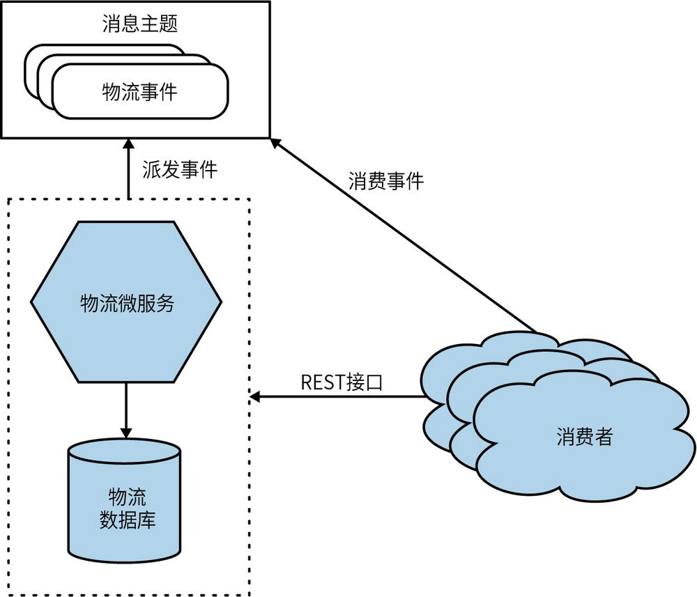

图1-1：微服务通过REST接口和消息主题开放其功能

微服务提倡**信****息****隐****藏**
 。信息隐藏是指最大程度地隐藏组件内的信息，对外部的接口尽可能减少信息的暴露。这样可以清楚地将容易变更的（内部实现）部分和较难变更的（外部集成）部分分离开。只要对外暴露的接口保持向后兼容，对外部隐藏的内部实现就可以自由变更。微服务能够独立演进和按需发布的关键在于，微服务边界内（图1-1）的变更不应该影响上游消费者，能够确保功能可独立发布。拥有清晰和稳定的服务边界，不随内部实现的变更而变更的服务边界能够实现系统的高内聚低耦合。

论及隐藏内部的实现细节，就不得不提到**六****边****形****架****构****理****论**（由Alistair Cockburn首次提出）
	 。六边形架构理论描述了保持内部实现和外部接口分离的重要性，其理念是考虑到不同的外部系统可以通过不同类型的接口与同一功能进行交互，将外部（如第三方服务、数据库、外部应用等）的不可控变化隔离开。本书将微服务绘制成六边形，一方面可以将它们与“普通”服务区分开，另一方面也是向六边形架构理论致敬。

**S****O****A****和****微****服****务****是****不****同****的****东****西****吗****？**

**S****O****A**（service-oriented architecture，面向服务的架构）是一种设计方法，该方法通过多个服务的协作提供一系列特定的功能。（这里的服务通常部署在完全独立的进程中。）这些服务之间的通信是通过网络调用而不是进程边界内的方法调用进行的。

SOA为了应对大型单体应用系统的挑战而出现。这种方法旨在提高软件的可复用性，例如，两个甚至更多的终端用户应用程序可使用同一个后端服务。SOA致力于使软件的维护和重写变得更容易，因为理论上，只要服务对外暴露接口的语义变化不大，我们就可以在用户觉察不到的情况下将服务进行更新或者替换。

SOA的核心理念非常好。问题是尽管实践诸多，但在如何高效实施SOA上大家存在分歧。在我看来，业内大部分人未能从整体上充分思考这个问题，也没有为该领域的不同供应商的现有方案提供令人信服的替代方案。

实际上，SOA的许多问题与通信协议（如SOAP）、供应商中间件、缺乏服务颗粒度的指导，或在做系统边界划分时接受了错误指导相关。有些人可能会说，是供应商参与（有时是推动）了SOA运动，并将其作为销售更多产品的方式，而这些雷同的产品最终破坏了SOA的目标。

我见过很多SOA的例子，这些团队努力尝试将服务变得更小，但他们还是将一切耦合在了数据库中，随之而来的就是只能将所有服务部署在一起。是的，这确实是面向服务，但不是微服务。

微服务脱胎于实际应用，它是基于我们对系统和架构更好的理解以更好地实现SOA。就像认为XP（extreme programming，极限编程）或Scrum是敏捷开发的一种特定方法一样，你也可以将微服务作为实现SOA的一种特定方法。

### 1.2 微服务的关键概念

探索微服务的使用时，必须理解一些核心概念。考虑到有些方面经常被忽视，深入探讨这些概念对于确保你理解微服务的工作原理尤为重要。

#### 1.2.1 可独立部署

**可****独****立****部****署**是指我们可以变更和部署某个微服务，并向用户发布这些变更，而无须同时部署其他微服务。更重要的是，这不仅是可行的，而且应该成为你所管理系统的标准部署方式。这个概念看似简单但在执行过程非常复杂。

如果你从本书和微服务的整体概念中只学一件事，那就是确保你真正接纳了独立部署微服务的概念。要养成将单个微服务的更改部署和发布到生产环境（期间不牵涉其他任何微服务）的习惯。做到这一点，你将受益良多。

为了保持可独立部署，需要确保我们的微服务是**低****耦****合**的：允许在不影响其他任何功能运作的情况下变更某个服务。这意味着我们需要显式、完善和稳定的服务间契约。但是需要注意，某些技术实现方式会使这一点变得困难——共享数据库便是其中一个突出问题。

可独立部署本身就非常有价值，但是要想实现独立部署，你还需要正确处理很多其他方面的工作，这些工作本身也很有价值。因此，你可以将可独立部署视为强制机制——通过将其作为目标进行持续关注，从而实现增益。

我们期望拥有稳定接口的松耦合服务，这个诉求促使我们首先需要思考如何规划微服务的边界。

#### 1.2.2 围绕业务领域建模

领域驱动设计之类的技术可以让你设计的代码更好地表达软件运行的实际业务领域。
	 在微服务架构中我们使用相同的思想来定义服务边界。通过围绕业务领域规划微服务，我们可以更轻松地推出新特性，或以不同的方式重组微服务，从而为我们的用户提供新功能。

推出一个需要通过改变多个微服务才能实现的功能成本巨大。你需要协调每个微服务之间（可能还要跨越多个团队）的工作，并谨慎管理这些微服务新版本的部署顺序。这比在一个服务内（或在一个单体架构内）实现相同的变更要更加费力。因此，我们需要找到尽可能减少跨服务变更的办法。

我经常看到分层架构，如图1-2所示的三层架构。图中的每一层代表了架构中的不同服务边界，每个服务边界的划分都基于不同的技术功能诉求。在这个例子中，如果我们只需要改变表示层，那将是相当高效的。但是经验表明，在这类架构中，功能变化通常会跨越多层——需要对表示层、应用层和数据层都做出变更。如果相比图1-2，架构分了更多的层，那么这个问题会更加严重；通常每一层会被分割成更多的层。

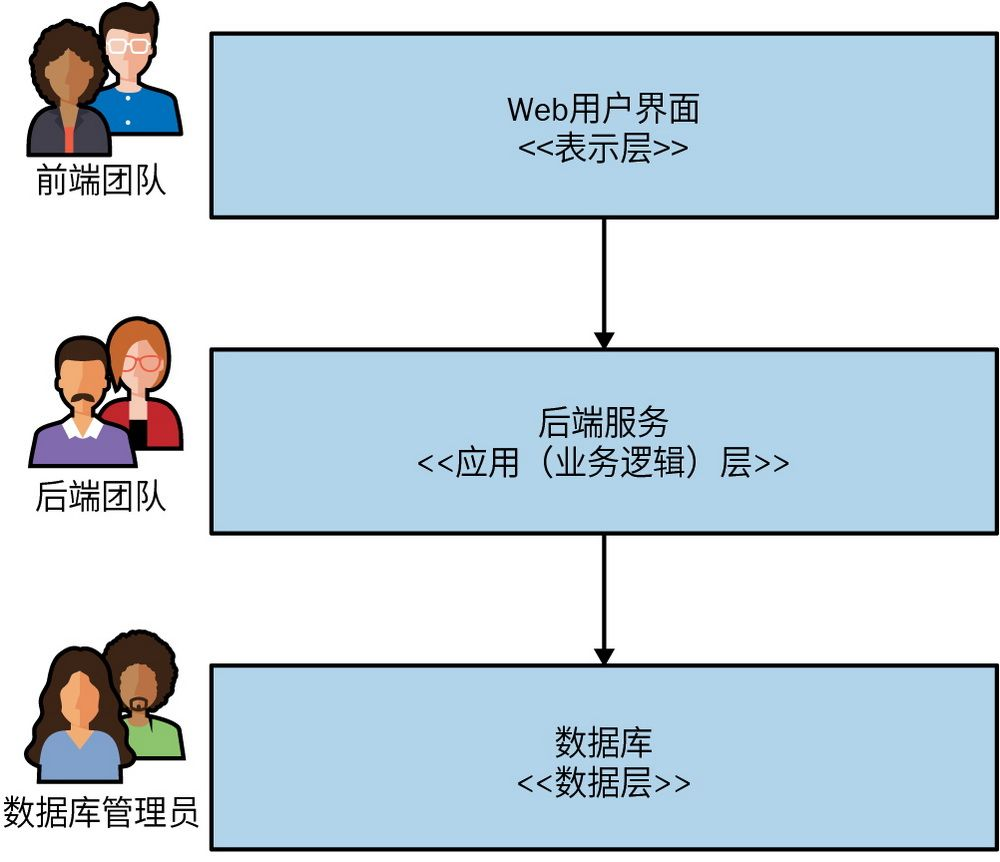

图1-2：传统的三层架构

将微服务按照业务端到端的方式切片，可以确保我们的架构尽可能高效地响应业务的变化。可以说，采用微服务的设计理念意味着我们决定优先考虑业务功能的高内聚性，而非技术功能的高内聚性。

本章后面将论及领域驱动设计的相互作用，以及它是如何与组织架构设计互相影响的。

#### 1.2.3 状态自主

我观察到，很多人最难以接受的概念是微服务应该避免使用共享数据库。如果微服务A想要访问微服务B的数据，微服务A需要向微服务B请求获取数据。这样做使得微服务有能力决定什么可以被共享，什么应该被隐藏，从而让我们可以清晰地将想自由变更的功能（内部实现）和不希望经常变更的功能（消费者使用的外部契约）分隔开来。

要想实现独立部署，我们需要尽力避免向后不兼容的变更。如果破坏了与上游消费者的兼容性，就会迫使它们也要跟着改变。在微服务中，明确界定内部实现和外部契约可以帮助减少向后不兼容的变更。

在微服务中，隐藏内部状态类似于面向对象编程中的封装做法。例如，面向对象系统中封装数据就是信息隐藏的一个例子。
	

除非你真的需要，否则不要共享数据库。即便需要，还是应该尽一切可能避免共享。在我看来，只要你想实现独立部署，那么共享数据库就是最糟糕的事情。

我们在前面讨论过，要将微服务看作端到端的业务功能的切片，要在适当的地方封装用户界面（UI）、业务逻辑和数据。这是因为我们想减少业务功能变更所需的工作量。以这种方式对数据和行为的封装可以带来业务功能的高内聚性。通过将数据库隐藏在服务后面，还可以确保减少耦合。第2章将继续讨论耦合和内聚性。

#### 1.2.4 服务大小

“一个微服务应该有多大？”这是我最常被问到的问题。考虑到“微服务”这个名字中的“微”字，人们会问这样的问题也就不奇怪了。然而，当你明白了是什么让微服务这种架构类型发挥作用时，大小的概念便毫无意义。

你是如何来衡量大小的？是通过代码行数吗？这对我来说没有多大意义。实现同样的功能，使用Java语言编写代码可能需要25行，但Clojure语言可能仅需要10行。这并不是说Clojure比Java更好，而是两者在语言表现力上有所差别。

Thoughtworks技术总监James Lewis曾说过一句微服务领域广为人知的话：“一个微服务最好和我的头一样大。”乍一看，这似乎没有给出答案。毕竟，我们不清楚James的头到底有多大。这句话的深意是：一个微服务应该保持在易于理解的大小，其挑战在于人的理解能力是不同的，你需要自行决定适合自己的大小。一个有经验的团队也许比其他团队能够更好地管理更大的代码库。如此说来，也许将James的话解读成“一个微服务最好和你的头一样大”会更好。

就微服务“大小”而言，个人认为最有意义的解释来自作者Chris Richardson的《微服务架构设计模式》。据其阐述，微服务架构的目标是“接口越小越好”。这与信息隐藏的概念不谋而合，它代表了一种尝试，试图在原本并不存在的“微服务”一词中找到意义。但当这个词第一次被用来定义这类架构时——至少是在最初——重点并没有放在接口的大小上。

归根结底，大小的概念是和上下文高度相关的。对于同一个由10万行代码组成的系统，为其工作了15年的人自然比新人对此系统的理解更为深刻。同样，一家刚刚开始向微服务转型、仅有不到10个微服务的公司和一家多年来一直遵循微服务标准且有数百个微服务的公司相比，即便两家公司规模相当，其对微服务“大小”的解读也会不一样。

我劝告人们不要担心大小。起步阶段，应专注如下两个关键问题：第一，你能处理多少个微服务？你提供的服务越多，系统的复杂度也就越高，且你可能需要学习新技能（或采用新技术）来应对这种情况。向微服务架构转型会引入新的复杂度来源，并带来新的挑战。这也是为什么我强烈主张要以增量方式向微服务架构迁移。第二，如何定义微服务边界来最大化架构的优势而不会让一切变成耦合混乱？在你的架构旅程刚刚开始时，这些问题其实更为重要。

#### 1.2.5 灵活性

James Lewis还曾说：“微服务带给你更多的选择。”
	 此表述非常精准——微服务确实可以带给你更多的选择。但这是有成本的，你必须自己决定这个成本是否值得。但是，微服务在组织、技术、规模、健壮性等多个维度上所带来的灵活性确实极具吸引力。

没有人可以预判未来，所以我们需要一个在理论上可以帮助我们解决未来可能面临的任何问题的架构。在留有选择余地和承担由此带来的成本之间找到平衡是一门真正的艺术。

与其说采用微服务像是在拨动开关，不如说它更像是转动旋钮。当你将旋钮向上转动时，你就有了更多的微服务，增强了灵活性，但这也可能会带来更多痛点。这是我强烈主张以增量方式采用微服务的另一个原因。在一点一点向上转动旋钮的过程中，你可以更好地评估采用过程中所受到的影响，并在必要时停止转动。

#### 1.2.6 架构和组织的一致性

MusicCorp是一家在线销售CD的电子商务公司，它使用如图1-2所示的简单三层架构。我们决定推动MusicCorp的架构变革以使它适应21世纪的变化。作为这个计划的一部分，我们正在评估现有的系统架构。我们有一个基于网页的用户界面层、一个以后端单体服务形式实现的业务逻辑层，以及一个使用传统数据库的数据层。和常见的情形一样，这些层由不同的团队负责。我们将在整本书中不时提到这家公司所经历的考验。

我们想实现一个简单的功能变更：我们希望客户能够指定他们喜欢的音乐流派。这个变更需要我们改变用户界面以显示选择流派的控件，后端服务需要实现将流派显示到用户界面中并支持流派的更改。最后，数据库需要能保存这个更改。每个团队都需要参与这一变更，并按正确的顺序完成部署，如图1-3所示。

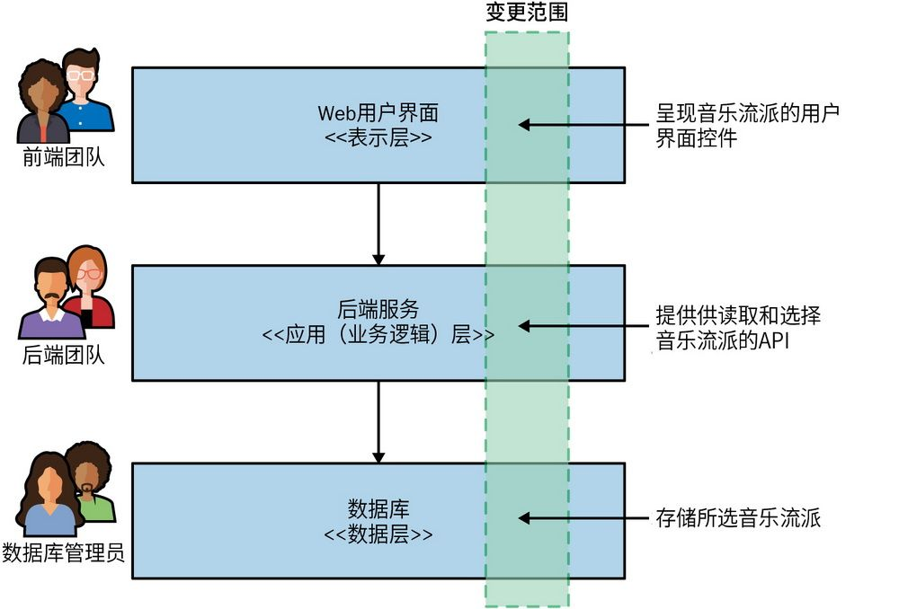

图1-3：涉及三层的一个功能变更

现在这个架构还不错。整体架构都是围绕一组设定的目标完成优化的。三层架构之所以如此常见，部分原因是它的通用性——每个人都听说过它。倾向于选择你见过的通用架构通常是我们总能看到它的一个原因。但是，我认为我们反复见到这种架构的最大原因是，它符合我们组织团队的方式。

如今耳熟能详的康威定律指出：

设计系统的架构受制于产生这些设计的组织的沟通结构。

——Melvin Conway，“How Do Committees Invent?”

三层架构是这一定律在实践中的一个很好的例子。过去，IT组织主要是根据成员的核心能力进行分组的：数据库管理员与其他数据库管理员组成一个团队；Java开发人员与其他Java开发人员组成一个团队；而前端开发人员（如今，这些人可能掌握了一些奇特技能，比如懂得JavaScript编程语言、会开发原生移动应用等）则组成另外一个团队。这种分组方式创建了与这些团队相对应的IT资产。

这解释了为什么这种架构如此普遍。这种做法还不错，它是只围绕一类能力进行优化，以基于人员对技能的熟悉程度的传统方式对成员进行分组。但我们对软件的期望已经发生改变，这种方式也需要随之变化。现在，我们将人员分配到多技能团队中，以减少工作交接和信息孤岛。我们希望比以往更快地交付软件，这促使我们根据系统划分来组织团队，这代替了传统的团队组织方式。

我们所做的大多数系统变更都与业务功能的变更有关。但在图1-3中，业务功能实际上分布在三层中的每一层，这大大增加了产生跨层变更的可能性。这是一种技术内聚性高但业务内聚性低的架构。如果想让变更更容易实现，我们就需要改变代码的组织方式，应按业务内聚性而不是技术内聚性组织代码。每个服务最后并非一定包含这三层混合的功能，这是关乎该服务内部实现的问题。

我们将其与另一种可能的替代架构进行比较，如图1-4所示。不对组织和架构做横向的分层，而是按照垂直业务线划分，此处设有一个专门的团队来负责完善与客户信息相关的各种功能，这确保了本示例中的变更仅由一个团队来完成。

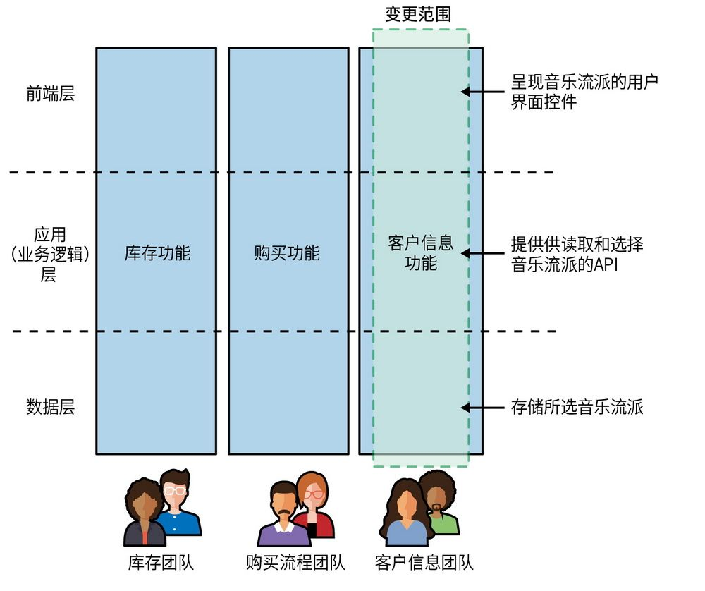

图1-4：不同团队同时负责分割后的用户界面以及相关的服务端功能

在这种架构设计里，这一变更可以通过让客户信息团队负责单个微服务来实现。该微服务提供一个用户界面，允许客户更新信息，并将客户状态存储在该微服务中。客户喜欢的音乐流派的选择记录与客户相关联，因此这种变更可以在内部完成。在图1-5中，我们展示了从专辑目录微服务中获取的可用音乐流派列表，这种功能可能已经存在。我们还看到一个新的推荐微服务读取了客户喜欢的音乐流派信息，这在后续版本中很容易实现。

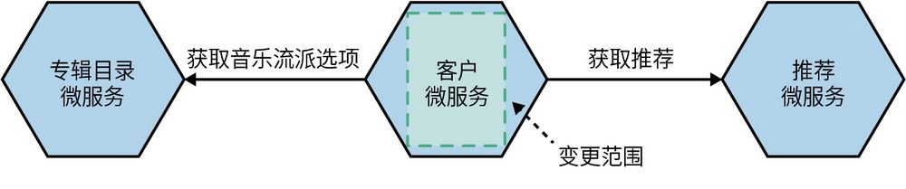

图1-5：一个专门的客户微服务可以让客户轻松地记录喜欢的音乐流派

在这种情况下，客户微服务封装了三层架构中每一层的部分功能——一部分用户界面、一部分业务逻辑以及一部分数据存储。我们的业务领域变成了驱动系统架构的主要力量，希望这种做法能让我们更改起来更轻松，也能让团队和组织内的业务线保持一致。

通常来说，微服务不直接提供用户界面，但我们仍然希望由客户信息团队来负责与该功能相关的用户界面，如图1-4所示。由团队负责面向用户的端到端功能的理念越来越受到人们的认可。《高效能团队模式》
	 一书介绍的业务流团队的概念，在这里也得到了体现。

业务流团队对应一条单一、有价值的工作流……团队有能力做到快速、安全和独立地构建并交付用户价值，而不需要移交给其他团队来完成部分工作。

图1-4中展示的团队就是业务流团队，我们将在第14章和15章进一步探讨这个概念，包括现实中这种类型的组织结构是如何工作的，以及它是如何与微服务保持一致的。

**关****于****虚****构****的****公****司**

在本书的不同地方，我们会遇到好几家公司，包括MusicCorp、FinanceCo、FoodCo、AdvertCo以及PaymentCo。

FoodCo、AdvertCo以及PaymentCo都是真实存在的公司，只是出于保密，我更改了它们的名字。另外，在分享这些公司的信息时，我会省略一些无关的细节，以便提供更清晰的信息。现实世界往往是复杂的，不过我一直努力只删除那些没有帮助的细节，确保呈现出必要的现实情况。

此外，MusicCorp是一家虚构的公司，它综合了我合作过的许多公司的特点。通过MusicCorp所分享的故事将反映我所看到的现实情况，但它们并不一定都发生在同一家公司。

### 1.3

### 单体

微服务最常被看作是一种架构方法，一种单体架构的替代方案。为了更清楚地区分微服务架构，并帮助你更好地理解微服务是否值得考虑，我们需要讨论一下**单****体**（monolith）到底是指什么。

本书中提到的单体，主要是指部署单元。当系统中的所有功能必须一起部署时，我们可以视它为一个单体。符合这个定义的架构有很多种，但是本书仅讨论常见单体，比如单进程单体、模块化单体和分布式单体。

#### 1.3.1 单进程单体

论及单体，最常见的一个例子是，一个系统中的所有代码都部署在**单****一****进****程**中，如图1-6所示。出于健壮性或可扩展性的考虑，该进程可能有多个实例存在，但从根本上来说，一个进程包含了整个应用程序。实际上，这类单进程系统本身可以是简单的分布式系统，因为通常它们要么在数据库中存取数据，要么向网页端或移动端提供信息。

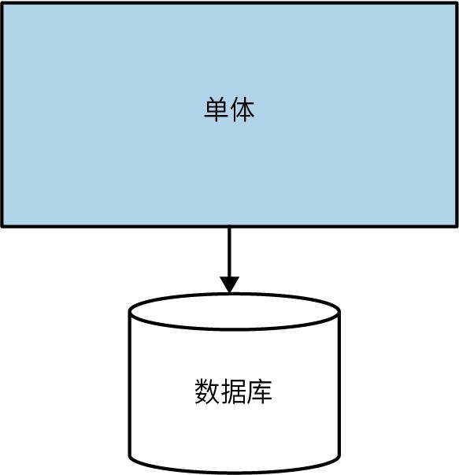

图1-6：在单进程单体内，所有代码被打包到一个进程中

虽然这符合大多数人对典型单体的理解，但我遇到的大多数系统都比这种单体复杂。比如两个或多个彼此紧密的耦合单体，其中还可能包含供应商提供的软件。

对于许多组织来说，典型的单进程单体部署是明智的选择。Ruby on Rails的发明者David Heinemeier Hansson证明了这种架构对于小型组织的意义。
	 然而，随着组织的不断发展，单体也在随之发展，从而逐步演变为模块化单体。

#### 1.3.2 模块化单体

作为单进程单体的一类，**模****块****化****单****体**（modular monolith）是一种变体，其中单个进程由一个或多个单独模块组成。每个模块都可以独立工作，但仍然需要将所有模块组合起来一起部署，如图1-7所示。将软件分解成模块的方法并不是一个新鲜事物。模块化软件是结构化程序设计的制品，起源于20世纪70年代，甚至更早。尽管如此，在我看来这种方法还没有被广泛和正确地运用。

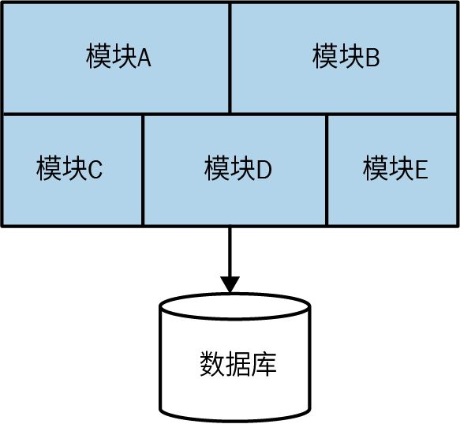

图1-7：在模块化单体内，进程内的代码被分割成多个模块

对于许多组织来说，模块化单体架构是一个很好的选择。明确模块边界可以让工作高度并行，同时通过简单的部署拓扑结构可以避免分布式微服务架构所带来的挑战。Shopify便是一个非常成功的案例，它运用这样的方式来替代微服务的解耦。
	 

采用模块化单体架构的挑战之一是，数据库往往缺乏在代码层面的解耦；如果你想将来拆分单体架构，则会面临更大的挑战。我曾看到一些团队在进一步推动模块化单体架构时，尝试按拆分模块的方式拆分数据库，如图1-8所示。

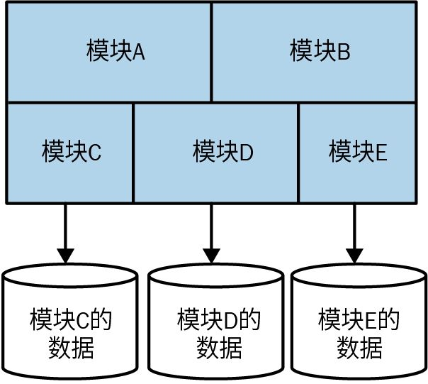

图1-8：拆分了数据库的模块化单体

#### 1.3.3 分布式单体

在分布式系统中，你甚至不知道哪一台计算机的故障会导致计算机失效。

——Leslie Lamport

**分****布****式****单****体**（distributed monolith）是一个由多个服务组成的系统，无论出于何种原因，整个系统都必须部署在一起。分布式单体架构很可能非常符合SOA的定义，但它往往无法兑现SOA的承诺。根据我的经验，分布式单体兼具分布式系统和单进程单体的短处，且没有足够的优势。我在工作中遇到了许多分布式单体，这在很大程度上影响了我对微服务架构的兴趣。

分布式单体所处的环境往往缺乏对信息隐藏和业务功能内聚性等概念的关注。相反，高度耦合的架构会导致更改需跨越服务边界，而那些在服务内部看似无害的更改会破坏系统的其他部分。

#### 1.3.4 单体和交付争用

当越来越多的人在同一个地方工作，他们会越来越互相妨碍。比如，不同的开发人员想要更改同一段代码，不同的团队想要在不同的时间推出功能（或推迟功能的部署），或者团队成员对谁来负责某项工作或由谁做出决定而感到困惑。大量研究表明所有权混淆会带来挑战。
	 我将此类问题称为**交****付****争****用**（delivery contention）。

拥有单体并不意味着一定会面临交付争用的挑战，就像采用微服务架构并不意味着永远不会遇到问题一样。但是，微服务架构确实可以提供更契合实际的边界，你可以沿着这些边界在系统中划定所有权边界，从而减少交付争用问题，获得更大的灵活性。

#### 1.3.5 单体的优势

有一些单体，例如单进程单体或模块化单体，也有很多优点。它们采用更简单的部署拓扑，以此避免与分布式系统相关的许多麻烦。这可以使开发人员的工作流程更加简单，系统监控、故障排除和端到端测试等工作也可以大大简化。

单体还可以简化内部的代码复用。如果我们想在分布式系统中复用代码，我们需要决定是复制代码、拆分成库还是将共享功能移到某个服务中，而有了单体，我们的选择要简单得多。很多人喜欢这种简单性——所有的代码都在那里，直接使用即可！

遗憾的是，人们开始觉得需要避免采用单体架构——认为它本质上是有问题的。我遇到过很多人，他们认为单体就是“过时”的代名词，而这才是有问题的。单体架构仍然是一种选择，而且是一种有效的选择。摊开说，在我看来，如果你正在选择架构风格，首选单体架构合情合理。同理，具体到微服务，我们要找的也是使用的理由，而不是不用的借口。

如果我们认为系统性地减少单体的使用应该作为交付软件的可行措施，那么我们可能会陷入陷阱，让自己或用户处于无法正确工作的风险中。

### 1.4 技术能力

正如我之前所提到的，使用微服务架构的初期，不需要采用很多新技术。事实上，采用新技术可能会适得其反。随着微服务架构的逐步推进，我们应该不断地寻找和关注由系统分布程度不断提升所带来的问题，并根据具体问题寻找应对的技术。

技术确实对微服务这一概念的推广发挥了很大的作用。了解那些可以帮助你充分利用这种架构的工具将是成功的关键。实际上，采用微服务要求你对相关的技术有非常深入的理解，因为你以往对逻辑架构和物理架构区别的理解可能并不到位。如果你参与设计微服务架构，那么你需要对两大架构进行广泛的了解。

在后续章节中，我们将详细探讨这些技术。在此之前，本章会简要介绍其中的一些技术。如果你决定使用微服务，它们可能会对你有所帮助。

#### 1.4.1 日志聚合和分布式追踪

随着你管理的进程数量的不断增加，了解系统在生产环境中的运行状态将变得越发困难。这也会导致故障排除变得更难。我们将在第10章更深入地探讨这些问题，但至少，我强烈建议在采用微服务架构之前，将实现日志聚合作为先决条件。
	

虽然我说过在使用微服务的初期，要谨慎引入过多的新技术，但是日志聚合工具至关重要，你应该将其视为采用微服务的先决条件。

日志聚合系统可以收集和汇总所有服务的日志，并提供一个日志分析中心，甚至将其作为主动警报机制的一部分。在这一领域有很多选择，可以满足各种情况下的要求。出于不少原因，我很喜欢使用Humio，不过主流公有云供应商所提供的简单的日志服务已经足够帮助你起步了。

你可以通过实现关联ID（correlation IDs）让这些日志聚合工具更加有用，其中每单个ID用于标记一组相关服务的调用。例如，由某个用户交互而触发的调用链。通过将此ID记录在每条日志中，要过滤出指定调用链相关的日志就变得非常容易，这也让故障排除变得更加容易。

随着系统的复杂性不断增加，考虑采用一些工具变得必不可少，这些工具能够帮助更好地探索系统，跨多个服务进行追踪分析、检测瓶颈，并提出你之前没有考虑到的问题。一些开源工具就可以提供这些功能。例如Jaeger，它专注于分布式追踪。

而Lightstep和Honeycomb这类产品（图1-9）进一步实现了这些想法。它们代表了超越传统监控方法的新一代工具，使探索运行系统的状态变得更加容易。即便你使用过很多传统工具，但仍然有必要了解此类工具提供的功能。它们是从头开始构建的，目的在于解决微服务架构的运维人员必然会遇到和处理的各种问题。

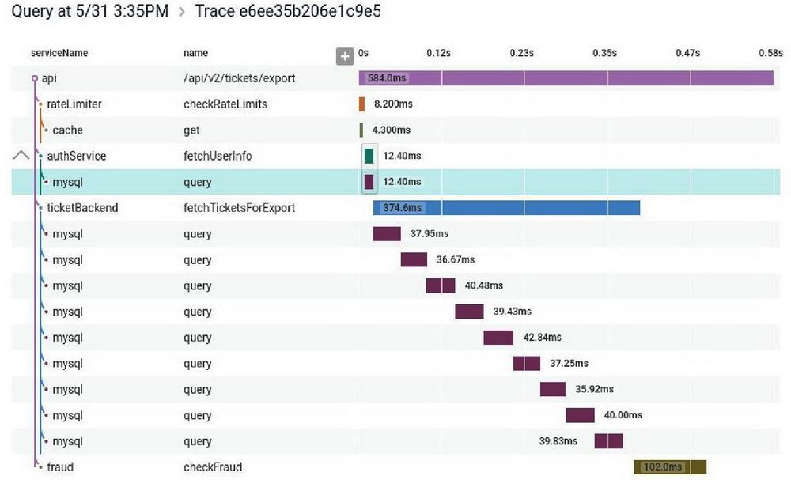

图1-9：Honeycomb提供的分布式追踪功能可以让你确定跨多个微服务的操作所花费的时间

#### 1.4.2 容器和Kubernetes

理想情况下，你会希望隔离运行每个微服务实例，这可以确保一个微服务的问题不会影响到另一个。例如，CPU占用率过高会影响其他微服务。虚拟化技术是在现有硬件之上构建独立执行环境的一种方法，但是当考虑微服务的大小时，普通的虚拟化技术可能会非常“重”，而容器则提供了一种更轻量的方法来为服务实例提供可以隔离执行的环境，从而缩短新容器实例的启动时间，这对许多架构来说也更具成本效益。

在开始使用容器后，你会意识到还需要一些东西来帮助你在众多底层设备上管理这些容器。像Kubernetes这样的容器编排平台正是做这种工作的，它可以按照服务需要的方式分发容器实例，比如，按照服务所需的健壮性和吞吐量来分发。同时，它也让你能够更加有效地利用底层设备。在第8章中，我们将继续探讨运行时隔离、容器和Kubernetes等内容。

不过，不要急于采用Kubernetes，即便是容器也别着急采用。与传统的部署技术相比，它们绝对具有显著的优势，但如果只有几个微服务，则很难证明采用它们是有必要的。在管理部署的开销开始变成令人头疼的问题后，再开始考虑服务的容器化和使用Kubernetes比较合适。但是，如果你已经开始使用它们，尽量让其他人为你维护Kubernetes集群，比如使用公有云供应商的托管服务。自己运维Kubernetes集群可是个大工程！

#### 1.4.3 流技术

尽管使用微服务让我们远离了单体架构下的共享数据库，但我们仍需要找到在微服务之间共享数据的方法，特别是当组织想从批量报告转向实时反馈时，因为这样做可以让组织更快地做出反应。因此，那些让流数据的传输和处理（通常是在具有大量数据的场景中）变得简单的产品在采用微服务架构的团队中备受欢迎。

对许多人来说，选择Apache Kafka作为微服务环境中流数据传输的工具是有充分理由的，其消息的持久性和压缩，以及处理大量消息的扩展能力等都非常有用。并且Kafka已开始以KSQLDB的形式实现流数据的处理。当然，你也可以将其与Apache Flink等其他专门的流数据处理解决方案一起使用。Debezium是一个开源工具，旨在帮助通过Kafka从现有数据源按流数据方式传输数据，确保传统数据源可以成为基于流技术架构中的一部分。在第4章中，我们将了解流技术如何在微服务的集成中发挥作用。

#### 1.4.4 公有云和无服务器技术

公有云供应商，或者具体地说，三大公有云供应商——Google Cloud、微软Azure和AWS——提供了大量的托管服务和部署选项来管理应用。随着微服务架构规模的不断扩大，越来越多的工作将会进入运维范畴。公有云供应商提供大量托管服务，包括托管数据库实例或Kubernetes集群，或消息代理、分布式文件系统等。通过使用这些托管服务，你可以将大量工作分配给能够更好地处理这些任务的第三方。

公有云产品中特别令人感兴趣的是与**无****服****务****器**（serverless）相关的产品。这些产品隐藏了底层服务器，允许你在更高的抽象级别上工作。无服务器技术包括消息代理、存储解决方案和数据库。云函数平台备受关注，因为它围绕代码部署提供了很好的抽象。你不必担心需要多少台服务器来运行服务，只需部署代码并让底层平台按需处理对应的实例即可。我们将在第8章更详细地介绍无服务器技术。

### 1.5 微服务的优势

微服务的优势不胜枚举。其他形式的分布式系统也具备部分相同的优势。然而，微服务往往在更大程度上实现了这些优势，主要是因为它在定义服务边界的方式上持有更加鲜明的立场。通过将信息隐藏和领域驱动设计的概念与分布式系统的强大功能相结合，微服务有助于获得比其他形式的分布式架构更显著的收益。

#### 1.5.1 技术的异构性

对于由多个互相协作的微服务组成的系统，我们可以在每个微服务内部使用不同的技术。这使得我们能够为不同类型的业务场景选择更合适的工具而不必遵循标准化、一刀切的方法，因为这种方法通常只能满足基础诉求。

如果系统中的某个部分需要较高性能，我们可以使用不同的技术栈以更好地达到所需的性能水平。我们还可以用不同的数据存储方式，对系统的不同部分进行增强。例如，在社交网络的业务场景下，可以将用户的交互存储在图数据库中，以图的方式反映社交的高度互联性质，但用户发布的帖子可以存储在文档数据库中，从而产生如图1-10所示的异构架构。

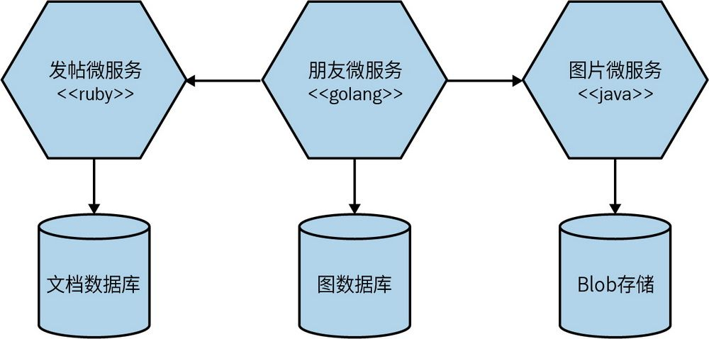

图1-10：微服务可以让你轻松使用不同的技术栈

通过使用微服务，我们还能够更快地尝试新技术，并了解技术的进步是否对系统有所帮助。尝试和采用新技术的最大障碍就是与之相关的风险。对于单体服务，如果想尝试一种新的编程语言、数据库或框架，任何变更都会影响大部分系统。有了一个由多个微服务组成的系统，就有了多个新地方来尝试这项新技术。我们可以选择风险可能最低的微服务并在其中使用新技术，因为我们可以控制潜在的负面影响。许多组织认为，这种更快地尝试和采用新技术的能力是一种真正的优势。

当然，多技术栈还是有成本的。一些组织选择对编程语言施加一些限制。例如，奈飞和Twitter主要使用Java虚拟机（Java Virtual Machine，JVM）作为运行时平台，因为这些公司非常了解该平台的性能和可靠性。他们还开发了适用于JVM的库和工具，使大规模运维变得更加容易，但是对JVM特定库的依赖使得引入非Java的服务或客户端就变得非常困难。但无论是Twitter还是奈飞，都并非只使用一种技术栈。

对消费者隐藏服务内部的技术实现可以让技术升级更加容易。例如，你的整个微服务架构可能基于Spring Boot，但可以仅更改一个微服务的JVM版本或框架版本，从而更容易控制升级带来的风险。

#### 1.5.2 健壮性

提高应用系统健壮性的一个关键概念是舱壁（bulkhead）。系统的某个组件可能会发生故障，但只要该故障没有扩散，你就实现了故障隔离，且系统的其余部分还可以继续工作。在这里，服务边界成为显著的舱壁。而在单体系统中，如果发生故障，则一切都会停止工作。虽然在单体系统中，可以通过在多台机器上运行多个实例的方式来降低完全失败的可能性，但是采用微服务，我们就能够处理其中完全失败的服务，或相应地将服务降级，从而维护系统的可用性。

然而，我们仍需谨慎。为了确保微服务系统能够充分实现这种健壮性，我们需要处理这种由分布式技术所引入的新的故障源。网络会出现故障，机器也可能会。我们需要知道如何处理此类故障，以及这些故障将对软件的最终用户产生什么影响（如果有的话）。我曾与一些团队合作，发现他们由于没有足够重视这些问题，在将系统迁移到微服务架构后，系统的健壮性降低了。

#### 1.5.3 扩展性

对于一个大型的单体系统，在实施扩展时，需要对所有组件进行扩展。因为即便只是整个系统的一小部分在性能上受到了限制，但如果这部分功能被固化在一个庞大的单体系统里，我们仍然需要将所有组件作为一个整体来处理。然而，如果采用多个较小的服务，我们就可以只扩展那些需要扩展的服务，并可以在不那么强大的硬件上运行系统的其他部分，如图1-11所示。

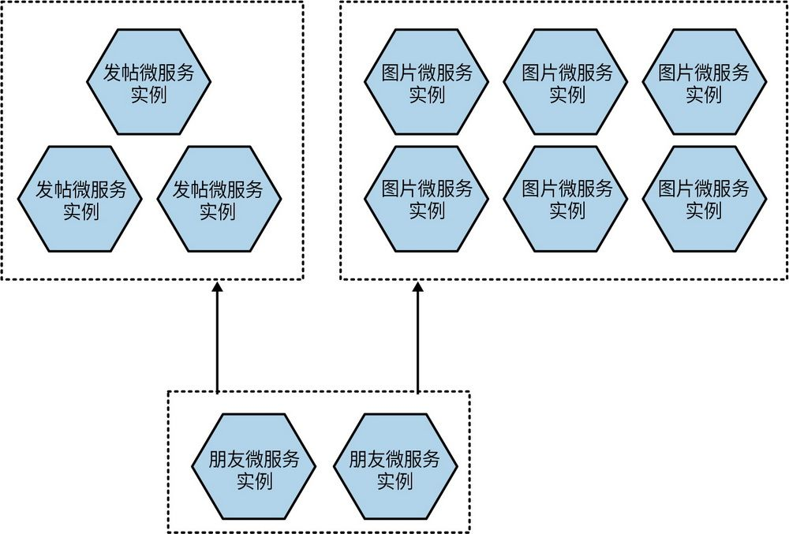

图1-11：可以按需扩展微服务

在线时尚零售商Gilt正是出于这个原因采用了微服务。Gilt从2007年开始使用单体Rails应用系统。到了2009年，它的系统已经无法应对被施加的负载。通过拆分系统的核心部分，Gilt能够更好地应对流量高峰，如今它已拥有450多个微服务，每个微服务都在多台独立的机器上运行。

AWS等公有云供应商提供了按需扩展系统资源的能力，我们甚至可以基于系统实际运行需要，应用这种按需扩展功能，这使我们能够更有效地控制成本。像这种几乎可以直接实现成本节约的架构方法并不常见。

最终，我们可以通过多种方式扩展应用系统，而微服务可以有效地支持这种扩展。我们将在第13章中更详细地探讨微服务的扩展性。

#### 1.5.4 部署的便捷性

在有着百万代码行体量的单体系统中，即便是单行代码导致的变更，也必须通过重新部署整个系统才能发布。这种部署往往影响大、风险高。在实际操作中，出于担忧，我们会尽可能地回避少量变更导致的部署，从而降低发布变更的频率。但是，这意味着所做的更改会在多个不同版本上持续累积，直到最终进入生产环境，而这个新版本中包含着累积下来的大量变更。版本之间的差异越大，我们出错的风险就会越高。

如果使用微服务，我们就可以对单个服务进行更改，然后以独立于系统其余部分的方式进行部署。这让我们能够更快地部署代码。如果确实出现了问题，可以快速隔离这一单个服务，并轻松实现快速回滚。这也意味着可以更快地向客户推出我们的新功能。这是亚马逊和奈飞等组织使用这种架构的主要原因之一，即尽可能地消除妨碍软件快速发布的障碍。

#### 1.5.5 组织协调

我们中的许多人都经历过大型团队和大型代码库带来的问题，而如果团队还分布在不同地方，那么这些问题可能会更加严重。我们清楚，处理小规模代码库的小团队往往更有效率。

微服务可以让我们更好地保持架构和组织的一致性，最大限度地减少每个代码库上工作的人数，从而达到团队规模和生产力的最佳平衡点。我们还可以随着组织的变化来改变服务的所有权，使我们在未来也能够持续保持架构和组织的一致性。

#### 1.5.6 可组合性

分布式系统架构和面向服务架构的关键优势之一是，有机会复用已有的功能，而使用微服务可以让功能以不同的方式为不同的目的服务。当你在考虑消费者将如何使用所开发的软件时，这一点尤为重要。

狭隘点儿说，仅考虑桌面网站或移动应用的时代已经一去不复返了。现在，我们需要考虑的是，如何用五花八门的技术将能力组合起来，以支持桌面网站、原生移动应用、移动端页面、平板电脑应用或可穿戴设备。随着越来越多的组织从狭隘的渠道思维转向更全面的客户融合（customer engagement）概念，我们需要能够跟得上这种转变。

我们可以将采用微服务看作把系统中服务间的接缝主动开放给外部。随着环境的变化，可以使用不同的方式来构建应用。但是对于单体系统，通常只有一个可以从外部使用的粗粒度接缝。如果想拆分它以获得更有用的东西，大概率就需要一把锤子了。

### 1.6 微服务的痛点

我们已经看到微服务架构可以带来许多好处，但它们也带来了许多复杂性。如果你正在考虑采用微服务架构，那么有能力去衡量其带来的优点和缺点至关重要。实际上，大多数微服务的问题都可以归结于分布式系统，它们在分布式单体应用中和在微服务架构中一样明显。

我们会在本书的其余部分继续深入讨论微服务的痛点。其实，本书大部分内容都是关于如何应对这些痛点所带来的痛苦、煎熬和恐惧的。

#### 1.6.1 开发者体验

随着拥有越来越多的服务，开发者体验可能会开始受到影响。像JVM这样的资源密集型运行时会限制在单个开发机器上运行的微服务的数量。我可以在笔记本电脑上运行4个或5个基于JVM的独立进程微服务，但我能运行10个或20个吗？可能比较难。即便运行时负担少，你可以在本地运行的服务的数量也还是有限的。如果你无法在一台机器上运行整个系统，就无法继续进行开发工作；而如果你使用了本地无法运行的云服务，那问题将变得更加复杂。

极端的解决方案可能包括引入“云上开发”，即开发人员不在本地开发。我并不喜欢这种方式，因为反馈周期可能会受到很大的影响。相反，我认为限制开发人员必须处理的系统范围可能是一种更直接的方法。但是，如果你想采用更偏向“集体所有权”的模式，虽然任何开发人员都可以在系统的任何部分上工作，但这可能会引发问题。

#### 1.6.2 技术过载

微服务架构的广泛采用催生了大量新技术，这些技术层出不穷，可能让人感到压力巨大；老实说，其中很多只是近来才被重新包装成“微服务友好型”，它们在处理这类架构的复杂性方面确实能提供合适的帮助。但是，也会有走向另一种危险的可能性——这些新技术可能会导致某种形式的技术崇拜。我见过很多采用微服务架构的公司，它们都认为现在是引入大量新技术（通常是外来技术）的最佳时机。

微服务可以让你选择使用不同的编程语言来编写每个微服务、在不同的运行时上运行或者使用不同的数据库，但这些只是可选项，而不是必选项。你必须仔细权衡所采用的技术广度和复杂度，以及它们可能带来的成本。

在开始采用微服务时，你必然会面对一些基本的挑战：需要花费大量时间来理解有关数据一致性、延迟、服务建模等方面的问题。如果在试图搞清楚这些问题会对目前的开发过程有何影响的同时，还要运用大量新技术，那么这会让工作难上加难。同样值得指出的是，学习新技术将会占用原本可以用来向用户交付功能的时间。

随着架构的复杂性逐渐增加，你会根据需要引入新技术。当你拥有3个服务时，你并不需要Kubernetes集群。除了确保你不会因这些新工具的复杂性而不堪重负，这种按需增加的好处还在于，你能够获得新的、更好的做事方式，这些方式会随着时间的推移而逐渐成形。

#### 1.6.3 成本

至少在短期内，你很有可能会看到多种因素导致的成本增加。首先，你可能需要运行更多额外的东西——更多的进程、计算机、网络、存储空间以及更多的支持软件（这将产生额外的许可费用）。

其次，向团队或组织引入的任何新的变化都会在短期内减慢交付速度。学习新想法并搞清楚如何有效地利用它们是需要时间的。同时，其他活动也将受到影响。这将直接导致新功能的交付放缓，或者需要增加更多的人手来抵消这种代价。

根据我的经验，对于一个重点关注降低成本的组织来说，微服务并不是一个好选择，因为这类组织将IT视为成本中心而不是利润中心的成本控制思路会让你无法充分利用这种架构并从中受益。但从另一个角度来看，如果你可以使用这些架构来触达更多客户或能够并行开发更多功能，那么微服务将有助于赚更多的钱。所以，微服务是一种增加利润的方式吗？有可能。微服务是一种降低成本的方法吗？不一定。

#### 1.6.4 生成报表

单体系统通常有一个单体数据库。这意味着想要一起分析所有数据（通常涉及跨表的大型连接操作）的有关各方有一个现成的结构（schema
	 ）来生成他们的报表。报表可以直接在单体数据库上生成，或者可以采用只读副本，如图1-12所示。

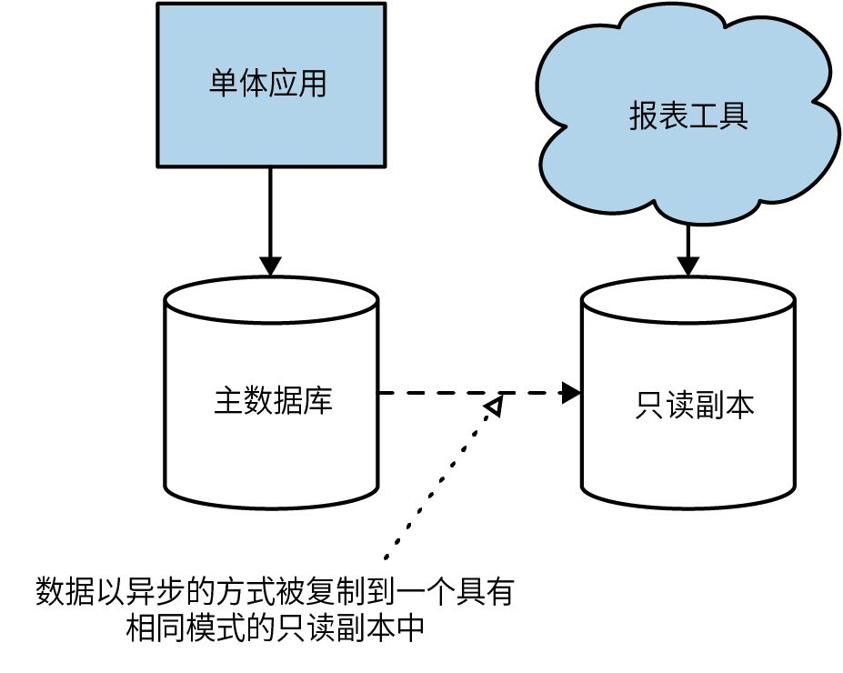

图1-12：直接在单体数据库上生成报表

采用微服务架构意味着我们打破了这种单体系统模式。这并不是说我们不再需要跨模块一起分析所有数据，而是工作变难了，因为我们的数据现在分散在多个逻辑隔离的结构中。

更现代的生成报表的方法，例如用流式传输来为大量数据生成实时报表可以很好地与微服务架构配合使用，但通常这需要采用新思路、使用新技术。或者，你只需将微服务中的数据发布到中心数据库（或结构化较低的数据湖），以满足生成报表的使用场景。

#### 1.6.5 监控和故障排除

在标准的单体应用中，我们可以用比较简单的方法实现监控。涉及的机器数量一般不多，服务的故障模式无非有两种——要么服务全部正常运行，要么服务全部无法运行。在微服务架构中，如果有一个服务实例出现故障，我们是否了解这个故障会产生的影响？

对于单体系统，如果CPU占用率长时间卡在100%，这会是一个大问题，而在有数十或数百个进程的微服务架构中，这是一个大问题吗？在微服务架构中，当只有一个进程的CPU占用率达到100%时，我们还需要在凌晨3点叫醒某人尽快处理吗？

幸运的是，现在这一领域有很多有帮助的观点。如果你想进一步探索这个领域，我推荐阅读Cindy Sridharan所著的*D**i**s**t**r**i**b**u**t**e**d**S**y**s**t**e**m**s**O**b**s**e**r**v**a**b**i**l**i**t**y*（《分布式系统的可观测性》），这是一个不错的起点，尽管本书第10章也会对监控和可观测性进行探讨。

#### 1.6.6 安全

在单进程单体系统中，大部分信息仅在该进程中传输。现在，更多信息是通过服务之间的网络而传输的。这会使传输过程中的数据更容易地被观察到，也更容易遭到中间人攻击而被篡改。这意味着你需要更加注意保护传输中的数据，并确保微服务的接入端点受到保护——只有被授权方才能使用它们。第11章将专门探究这一领域中的挑战。

#### 1.6.7 测试

对于任何类型的自动化功能测试，都需要寻找一个微妙的平衡点。测试所涉及的功能越多（测试范围越广），你对应用的信心就越大。此外，测试的范围越广，就越难设置测试数据和测试基线，且测试的运行时间就会越长；当测试失败时也就越难弄清哪里出了问题。第9章将分享一些在这种更具挑战性的环境中进行测试的技术。

在涵盖的功能方面，端到端测试对于任何类型系统来说，其测试规模都是最大的，且在编写和维护方面要比小范围的单元测试更容易出问题——我们可能已经习惯了这一点。不过，这通常是值得的，因为我们希望通过端到端测试来模拟用户的使用方式以验证系统，从而获得信心。

但是，在微服务架构中，端到端测试的范围变得非常大。现在，我们需要跨多个进程运行测试，且所有这些进程都需要针对测试场景进行部署和配置。我们还需要处理误报，因为环境问题（例如服务实例关闭或部署失败导致的网络超时）也会导致测试失败。

以上因素意味着，随着你的微服务架构的发展，在端到端测试方面，你将获得递减的投资回报。测试成本越来越高，却无法带给你一如既往的信心。这将迫使你采用新的测试形式，比如契约测试或生产环境测试，或者探索渐进式交付技术，比如采用并行运行或金丝雀发布。第8章将会进行探讨。

#### 1.6.8 延迟

使用微服务架构时，以前在本地一个处理器上可以完成的处理任务现在被拆分为多个单独的微服务；以前只在单个进程中传输的信息现在需要通过网络进行序列化、传输和反序列化，你可能需要比以往任何时候都更频繁地使用网络。而所有这些都可能导致系统延迟问题愈加严重。

尽管在设计或编码阶段很难准确衡量变更对延迟的影响，但这也是以增量方式进行微服务迁移的重要原因。先做一个小的变更，然后马上衡量其影响——这需要你有某种方法可以测量操作的端到端延迟。像Jaeger这样的分布式追踪工具可以在这方面派上用场。但是，你还需要明确这些操作在延迟方面的要求。有时即使操作变慢，只要它仍然足够快，也是完全可以接受的。

#### 1.6.9 数据一致性

从在单个数据库中存储和管理数据的单体系统转变为分布式系统（其中多个进程在不同的数据库中管理状态）会对数据的一致性带来潜在挑战。过去，你可以依赖数据库事务来管理状态变更，但分布式系统很难提供类似的一致性保障。在大多数情况下，在协调状态变更方面，使用分布式事务已被证明问题会很多。

相反，你可能需要开始使用像Saga（第6章将做详细介绍）和最终一致性等概念来管理和推理系统中的状态。这些理念可能会从根本上改变你对系统数据的思考方式，这在迁移现有系统时可能会让人望而生畏。同样，这也是在拆解应用系统时需要谨慎小心的另一个理由。采用增量方式进行拆分可以让你及时评估架构变更在生产环境中产生的影响，这一点非常重要。

### 1.7 我应该采用微服务吗

尽管某些方面的优势推动着微服务架构成为软件的默认架构方法，但我觉得考虑到已经讲过的许多挑战，在采用微服务之前我们仍然需要仔细斟酌。在确定微服务是否适合之前，需要评估自己的问题空间、技能和技术环境，并明确想要实现的目标。微服务只是架构方法之一，而**不****是****唯****一**。你所处的背景环境应该在决定是否走这条路时发挥重要作用。

下面，我会描述一些通常会让我远离微服务或倾向于选择微服务的情况。

#### 1.7.1 不适用情况

考虑到定义稳定的服务边界的重要性，我觉得微服务架构对于全新的产品或初创公司来说往往是一个糟糕的选择。在任何一种情况下，当你迭代试图构建的基础功能时，所处的领域通常正在经历重大变化。领域模型的转变反过来会导致服务边界的更多变更，而跨服务边界的变更协调是一项成本很高的工作。一般来说，我觉得等到足够多的领域模型稳定下来之后再明确定义服务边界更加合适。

我确实看到了直接采用微服务对初创公司的诱惑，原因是：“如果我们真的成功了，我们肯定需要扩张！”可问题在于，你不能确定是否一定会有人想使用你的新产品。即使你确实成功到需要一个高度可扩展的架构，可那时你最终交付给用户的东西可能与你最初构建的东西大不相同。比如优步最初专注于豪华轿车；Flickr最初试图创建一款多人在线游戏，但后来两者的产品都发生了变化。寻找产品和市场是否契合的过程意味着你最终可能会得到一种与初始构想截然不同的产品。

初创公司通常也没有太多人手来构建系统，这给采用微服务带来了更多挑战。微服务带来了大量的新工作和复杂性，这可能会占用宝贵的资源。团队规模越小，这种成本的影响就越明显。出于这个原因，当与只有少量开发人员的小型团队合作时，我不建议使用微服务。

对于初创公司而言，微服务的挑战还在于，最大的限制因素往往是人。对于一个小团队来说，微服务架构可能很难被证明其必要性，因为对微服务本身的部署和管理是要消耗工作量的。有人将其描述为“微服务税”。当这种投入让很多人受益时，就更容易证明其必要性。但是，如果你的5人团队中有一个人将所有时间花在这些问题上，那么就意味着很多宝贵的时间没有被用在构建产品上。在你了解什么是架构中的制约因素和痛点之后，再迁移到微服务会容易得多；你可以集中精力，只在最合理的地方使用微服务。

最后，如果你提供的软件是需要客户自己部署和管理的，那么在采用微服务时或许会遇到一些困难。正如我们讨论过的，微服务架构可能会将大量复杂性推向部署和运维领域。如果你自己运行软件，你可以通过采用新技术、开发新技能和改变工作实践来“抵消”这种新的复杂性。但是，你无法指望你的客户也能这样做。如果客户习惯了通过Windows安装程序来安装软件，那么当你发布新版本并对客户说“只需要将这20个pod放在你的Kubernetes集群上”时，他们可能会很吃惊，因为他们可能对pod、Kubernetes或集群一无所知。

#### 1.7.2 适用情况

根据我的经验，组织采用微服务的最大原因可能是允许更多的开发人员在同一个系统上工作但不会互相妨碍。通过正确设置架构和组织边界，你可以让更多人彼此独立工作，从而减少交付争用。一家5人规模的初创公司可能会觉得微服务架构是一种拖累，而一家快速增长的100人规模的企业可能会发现，与其产品开发协调一致的微服务架构更适应它的增长。

**软****件****即****服****务**（software as a service，SaaS）类型的应用系统通常也非常适合微服务架构。这类系统通常需要全天候运行，这意味着在系统做出变更时会面临挑战。微服务架构的可独立发布性是解决这一困境的一大福音。此外，微服务可以根据需要扩容或缩容。这意味着，当设立了满足系统负载特性的合理基线后，你就可以更加灵活地控制资源容量，以确保能以最具成本效益的方式伸缩系统。

微服务的技术无关性可以让你充分利用云平台。公有云供应商可以为代码提供各种服务和部署机制。你可以更加轻松地将特定服务的要求与最能帮助你实现它们的云服务相匹配。例如，你可能决定将一个服务以一组函数的方式部署，将另一个服务以托管虚拟机的方式部署，然后将另一个服务直接部署在托管的**平****台****即****服****务**（platform as a service，PaaS）平台上。

值得注意的是，广泛采用多种技术往往会带来问题，但能够轻松尝试新技术是快速找到有利于增效的好办法。**函****数****即****服****务**（function as a service，FaaS）平台的日益普及就是一个例子。对于合适的工作负载，FaaS平台可以大幅减少运维开销，但目前这种部署机制并不适用于所有情况。

如果你的组织希望通过各种新渠道为客户提供服务，那么微服务能够为此带来显著的益处。许多数字化转型工作似乎都涉及解锁隐藏在现有系统中的功能，其目的是创造新的客户体验，通过最合理的交互机制来满足用户的需求。

总之，微服务架构可以为系统的持续发展提供很大的灵活性。当然，这种灵活性是有代价的。不过，如果想在未来做出改变时保留选择余地，这是值得付出的代价。

### 1.8 小结

微服务架构可以在选择技术、处理健壮性和扩展性、组织团队等方面为你提供极大的灵活性。这种灵活性是许多人采用微服务架构的部分原因。但是微服务也带来了很大程度的复杂性，你需要确保这种复杂性是可掌控的。对于许多人来说，微服务已成为默认的架构方法，几乎可以在所有情况下使用。但是，我仍然认为它只是一种架构选择，你必须根据要解决的问题来确认其必要性；通常，更简单的方法有助于更容易地完成交付工作。

尽管如此，在许多组织，尤其是大型组织中，微服务已经大有作为。当微服务的核心概念得到正确理解和实施时，它们可以帮助创建自治且高效的架构，从而使系统成为超越各个部分之和的整体。

我希望本章已对以上主题做出了较好的介绍。接下来，我们将探究如何定义微服务边界，并探讨与结构化编程和领域驱动设计相关的主题。
