## 第2章 微服务建模

对手的推理让我想起一位异教徒，当被问及世界由何物支撑时，他回答：“世界立足于乌龟背上。”“那乌龟又由何物支撑呢？”“立足于另一只乌龟背上。”

——Joseph Frederick Berg牧师（1854）

你已经知道什么是微服务，也了解了其主要功用。接下来你可能迫不及待想要开始实践了。但是从哪里开始呢？在本章中，我们将继续探讨一些基本概念，例如信息隐藏、耦合和内聚，并了解它们将如何影响微服务边界的划分。我们还将研究不同的划分方式，并深入学习领域驱动设计——微服务领域内极为重要的一项技术。

我们将探讨如何划分微服务边界，才能最大限度地利用微服务架构的优势，并尽量避免因架构复杂性增加而带来的问题。但开始之前，我们先来了解一下贯穿本书的一个应用。

### 2.1 MusicCorp简介

理念类图书辅以示例更易于读者理解，因此，条件允许的话，我会分享一些真实世界的案例；不过，虚构场景对于我们理解相关理念也非常有帮助。MusicCorp就是贯穿全书的虚构场景，我们将反复回到这个场景，观察微服务是如何在其中运作的。

接下来，让我们将注意力转向业内领先的在线零售商MusicCorp。MusicCorp不久前还只是一家实体零售商，在黑胶唱片业务陷入低谷后，公司将越来越多的精力投入到了在线业务上。虽然已经有了一个网站，但公司认为这还远远不够。毕竟，那些专门播放音乐的智能手机也只是昙花一现（Zune
	 显然要好得多），乐迷们还是更乐意等待网购的CD送货上门，在大家心里，质量胜过便利。虽然MusicCorp可能刚搞明白Spotify是一种数字音乐服务，而不是针对青少年皮肤问题的某种护理服务
	 ，但它仍然对自己押注的网购业务非常满意，并确信那些流媒体业务也一样撑不了多久。

尽管有点落后，但MusicCorp有着宏伟的抱负。幸运的是，它明白了成功的最佳策略是确保能够尽可能灵活应变——而这正是微服务的“主场”！

### 2.2 合理划分微服务边界

在MusicCorp团队全力以赴、开发一个又一个在线服务，并试图向所有人售卖八轨磁带之前，让我们暂停一下，谈谈需要时刻谨记的最重要的基本理念。我们希望微服务能够独立更改和独立部署，并将功能发布给用户。能够独立更改一个微服务而不影响其他微服务的能力至关重要。那么在划定微服务边界时，我们需要考虑哪些因素呢？

从本质上说，微服务只是模块化拆分的另一种方式，尽管它在模块之间具有基于网络的交互问题，以及由此带来的相关挑战。这仍然意味着可以依靠模块化软件和结构化编程领域的大量现有技术，来帮助和指导我们去定义模块间的边界。考虑到这一点，我们需要更深入地探究第1章简要介绍过的3个关键概念——**信****息****隐****藏**、**内****聚**和**耦****合**，这些概念对于确定良好的微服务边界至关重要。

#### 2.2.1 信息隐藏

信息隐藏是David Parnas提出的一个概念，旨在研究定义模块边界最有效的方法。
	 信息隐藏描述了一种期望，即将尽可能多的实现细节隐藏在模块（微服务）边界内。Parnas研究了这种模块划分理论上带来的好处。

**提****升****开****发****效****率**

允许模块独立开发，我们可以并行完成更多的工作，并减少添加项目人员带来的影响。

**可****理****解****性**

每个模块都可以被独立地看待和理解，这使整个系统的功能更易于理解。

**灵****活****性**

每个模块可以被独立地更改，即在无须更改其他模块的情况下，我们仍然可以对系统的功能进行更改。此外，模块还可以按不同的方式组合以提供新功能。

以上特征很好地补充了我们试图通过微服务架构实现的目标——事实上，我现在的确将微服务视为模块化架构的另一种方式。Adrian Colyer回顾了David Parnas在这一时期发表的一些论文，并从微服务的角度对它们进行了研读，强烈推荐你学习他的总结。
	 

正如Parnas在他的大部分工作中所探究的，仅仅划分模块并不会直接获得收益，获取收益很大程度上取决于模块边界是如何划分的。根据他的研究，信息隐藏这种关键技术有助于充分利用模块化架构，而现在看来，同样适用于微服务。

在Parnas的另一篇论文
	 中，我们还认识到下面这句至关重要的话：

模块之间的连接是模块相互之间做出的假设。

通过减少一个模块（或微服务）对另一个模块的假设数量，可以直接影响它们之间的连接。限制假设的数量更能够确保在更改一个模块时不会影响其他模块。如果更改模块的开发人员清楚地了解其他人如何使用该模块，那么开发人员将更容易且安全地完成更改，从而使得上游调用方也不必更改。

这同样适用于微服务，唯一的区别是我们可以只部署已修改的微服务，而无须部署其他。可以说，微服务架构放大了Parnas所描述的3个理想特征，即提升开发效率、可理解性和灵活性。

信息隐藏的影响体现在很多方面，我将在整本书中探讨这个主题。

#### 2.2.2 内聚

关于内聚，我听过的最简明的定义是：“一起变化的代码应该组织在一起。”
	 就我们的目标而言，这是一个相当合适的定义。之前我们讨论过，优化架构就是为了更容易地进行业务变更，因此我们希望以这种方式对功能进行分组，从而将变更限制在尽可能小的范围内。

为了在行为发生改变时，能够在同一地方进行更改并尽快发布，我们希望将相关行为放在一起，无关行为放在别处。如果必须在很多不同的地方实施改造，就必须发布很多不同的服务（也许需要同时发布）来实现这个变更。在许多不同的地方进行改造会更慢，而一次部署许多服务是有风险的，因此我们需要避免出现这两种情况。

所以，我们希望在问题域中找到边界，确保相关行为放在了一起，并尽可能松散地与其他边界通信。如果相关功能分散在整个系统中，这被称为“低内聚”，而对于微服务架构，我们的目标是要实现高内聚。

#### 2.2.3 耦合

当服务之间耦合度较低时，对一个服务的更改不应依赖于对另一个服务的更改。微服务的全部意义在于能够对服务进行独立更改和部署，而无须更改任何其他部分。这相当重要。

什么样的因素会导致高耦合呢？一种典型的错误是，选择一种将各种服务紧密绑定的集成方式，从而导致服务内部的更改也需要对消费者进行更改。

在构建低耦合系统时，相互协作的服务之间应该只了解最少必要信息，这也意味着需要限制服务间不同类型调用的数量，因为除了潜在的性能问题，过于频繁的通信会导致紧密耦合。

耦合有多种形式，我看到过不少关于耦合的误解是涉及服务架构的，所以我认为很有必要对这个话题进行更详细地探讨。下面将深入探究这一话题。

#### 2.2.4 内聚和耦合的相互作用

正如之前提到的，耦合和内聚的概念显然是一脉相承的。从逻辑上讲，如果某个功能分散在系统中，对该功能的变更就会跨越这些边界，这意味着更高的耦合性。以结构化设计先驱Larry Constantine命名的康斯坦丁定律巧妙地总结了这一点：

高内聚低耦合的结构是稳定的。
	 

这句话里所说的“稳定”的概念很重要。为了让微服务边界的划分可以支持独立部署、实现并行开发以及团队之间更少的协调工作，边界本身就需要具有一定程度的稳定性。如果微服务暴露的契约以向后不兼容的方式不断变化，那么上游消费者也会因此而被迫不断变化。

耦合和内聚密切相关，甚至在某种程度上可以说是相同的，因为这两个概念都描述了事物之间的关系。内聚用于描述**边****界****内**事物之间的关系（这里是指微服务），而耦合则用于描述**跨****边****界**事物之间的关系。没有绝对**最****佳**的方式来组织代码；对代码分组的方式和原因需要我们进行各种权衡，而内聚和耦合只是用来阐明权衡结果的一种方式。我们能做的就是在这两种想法之间找到平衡，找到一种最适用于当前场景以及问题的做法。

要记住的是，世界瞬息万变。随着需求的变化，你可能需要重新审视曾经做出的决策。有时，系统的某些部分可能正在经历非常大的变化，以至于无法保持稳定。在第3章中分享Snap CI的开发团队的经验时，我将举一个例子。

### 2.3 耦合的类型

从前面的讲述中，你可能会得出所有的耦合都不好的结论。但严格来说，这并不完全正确。因为在系统中一定程度的耦合是不可避免的，我们要做的是尽可能减少这些耦合。

业内已经有大量的工作研究了结构化编程背景下的不同形式的耦合，这些工作主要考虑的是模块化（非分布式、单体式）软件。有许多模型用于评估耦合，其中一些可能会有重叠或冲突，但它们只关注了代码级别的情况，而没有考虑基于服务的交互。由于微服务是一种模块化架构（尽管引入了分布式系统的复杂性），因此我们可以借鉴这些原始概念并将其应用到基于微服务的系统中。

**结****构****化****编****程****的****现****有****技****术**

我们在计算机领域的许多工作都是在前人的工作基础上进行的。有时可能无法完全理解之前的工作，但在第2版中，我尽力突出了所能找到的前人的工作成果——一方面，这是他们应该得到的赞誉；另一方面，也是为了给那些希望更详尽地探究某些主题的读者提供一些线索。同时，我也想表明其中的许多想法是经过验证的。在谈到在现有技术基础之上进行构建时，本书中有几个主题领域与结构化编程一样拥有丰富的现成技术。我提到过Larry Constantine，他与Edward Yourdon合著的*S**t**r**u**c**t**u**r**e**d**D**e**s**i**g**n* 
	 被认为是这一领域重要的文献之一。Meilir Page-Jones的*T**h**e**P**r**a**c**t**i**c**a**l**G**u**i**d**e**t**o**S**t**r**u**c**t**u**r**e**d**S**y**s**t**e**m**s**D**e**s**i**g**n* 
	 也很有用。可惜的是，这些书籍有一个共同点，那就是它们都难以获取，因为这些书已经绝版，没有电子版。这是支持本地图书馆的又一个理由。

并不是所有的想法都能清晰地用定义表达出来，所以我将竭尽全力地综合考虑微服务场景中不同类型的耦合，以形成一个有效的模型。如果这些想法准确地映射到已有定义，我会沿用。在其他情况下，我得创造新术语或融入从别处吸纳的观点。因此，后续内容是基于这个领域的许多现有技术的；我尝试在微服务的背景下赋予其更多意义。

图2-1简单展示了几种类型的耦合，它们是按照从低（理想）到高（不理想）的顺序排列的。

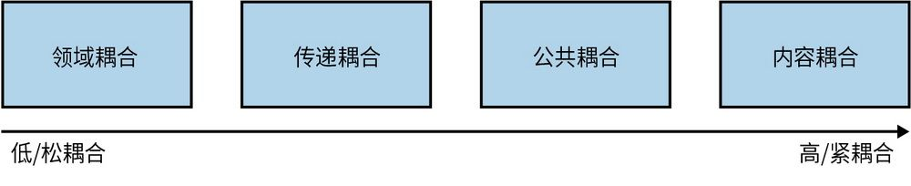

图2-1：按照从松（低）到紧（高）排序的不同类型的耦合
	 

接下来，我们将依次探讨每种耦合，并通过一些示例来展示不同的耦合是如何在微服务架构中表现的。

#### 2.3.1 领域耦合

领域耦合描述了一个微服务需要与另一个微服务进行交互的情况，因为前者需要使用后者提供的功能。
	 

在图2-2中，我们可以看到在MusicCorp内部管理CD订单的部分内容。在这个示例中，订单处理器微服务调用仓库微服务来预留库存，并调用支付微服务来收款。因此，订单处理器微服务依赖于仓库微服务和支付微服务并与二者耦合，以实现这一操作。但是，仓库微服务和支付微服务之间没有这种耦合，因为它们没有交互。

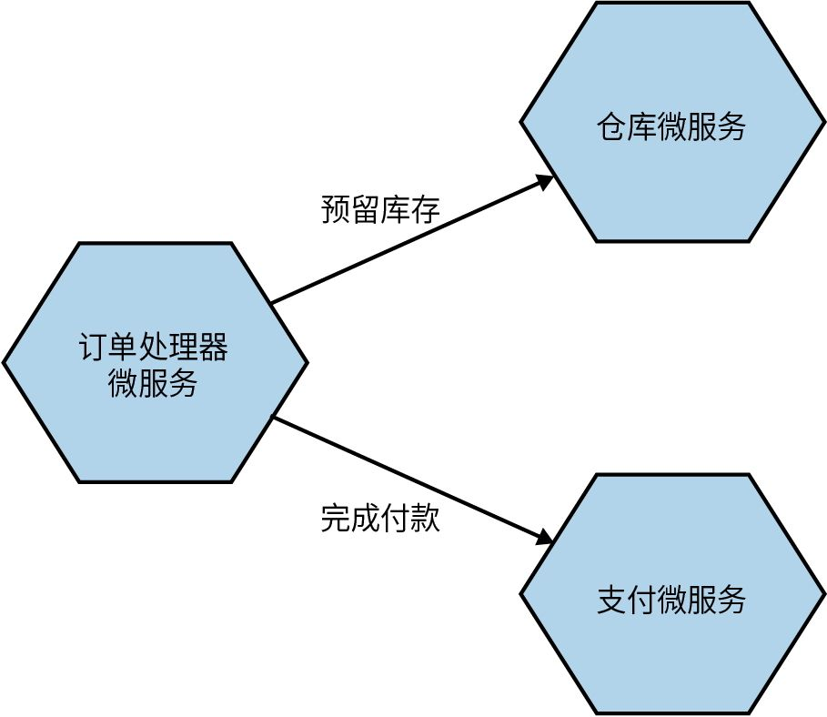

图2-2：领域耦合的示例：订单处理器微服务需要使用其他微服务提供的功能

在微服务架构中，这种类型的交互在很大程度上是不可避免的。基于微服务的系统依赖于多个微服务的协作才能完成工作。不过，我们仍然希望将这种依赖保持在最低限度；每当看到这样的单个微服务依赖于多个下游微服务时，我们需要给予特别的关注，因为这可能意味着微服务做得太多了。

通常，领域耦合被认为是一种松散形式的耦合，即便如此也可能会遇到问题。存在需要与大量下游服务通信的微服务，可能意味着逻辑过于集中。当微服务之间发送更复杂的数据集时，领域耦合也可能出现问题，这通常指向我们将很快探讨的更为棘手的耦合形式。

信息隐藏至关重要。仅共享绝对必要的内容，且仅发送所需的最小量数据。

**关****于****时****间****耦****合****的****简****要****说****明**

你可能听说过被称为“时间耦合”的另一种耦合形式。从以代码为中心的耦合角度来看，时间耦合是指纯粹是因为发生在同一时间，一些概念被捆绑在了一起。但在分布式系统的上下文中，时间耦合是指一个微服务需要另一个微服务同时做某事才能完成操作的情况。

两个微服务需要同时启动并且可以相互通信，以完成操作。所以在图2-3中，MusicCorp的订单处理器微服务正在对仓库微服务进行同步HTTP调用，仓库微服务需要在调用的同时保持可用。

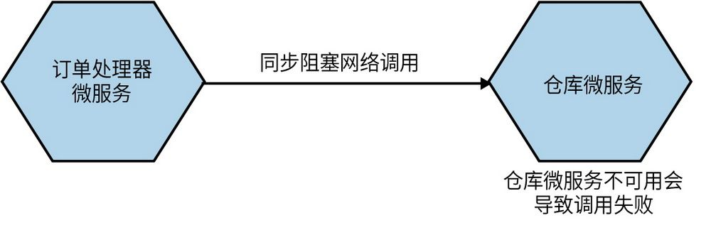

图2-3：时间耦合的示例：订单处理器微服务对仓库微服务进行同步HTTP调用

如果某种原因导致了订单处理器微服务无法访问仓库微服务，那么我们就无法预留订单中要发送的CD库存，那么操作将会失败。订单处理器微服务还必须阻塞并等待仓库微服务的响应，这也可能会导致资源争用的问题。

时间耦合并不总是坏事，只是需要我们给予关注。随着拥有更多的微服务，它们之间的交互会更加复杂，时间耦合带来的挑战可能会更大，这使得扩展系统和保持系统正常工作变得更加困难。避免时间耦合的一种方式是使用某种形式的异步通信，比如消息代理。

#### 2.3.2 传递耦合

传递耦合
	 描述的情况是，一个微服务将数据传递给另一个微服务，仅因为下游的其他微服务需要这些数据。从许多方面来看，这是实现耦合中最棘手的一种形式，因为这意味着调用者不仅需要知道它正在调用的微服务调用了另一个微服务，而且还需要知道这个间接调用的微服务是如何工作的。

我们来看一个传递耦合的示例，看看MusicCorp是如何处理订单的。图2-4中的订单处理器微服务在向仓库微服务发送一个请求来创建发货单。这个请求里包含一个运输清单。该运输清单不仅有客户的地址，还包含运输类型。仓库微服务只是将此清单传递给下游的物流微服务。

传递耦合的主要问题是，对下游服务所需数据的更改可能会导致更重大的上游服务的更改。在这个示例中，如果物流微服务现在需要更改数据的格式或内容，那么仓库微服务和订单处理器微服务都可能需要更改。

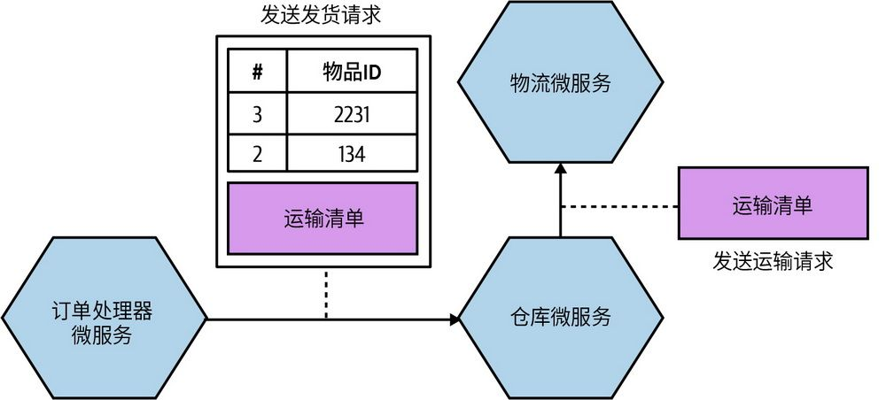

图2-4：传递耦合的示例：数据被传递给微服务仅是因为另一个下游服务需要它

有几种方法可以解决这个问题。首先是考虑调用方微服务是否可以直接绕过中介。在这个示例中，这意味着订单处理器微服务直接调用物流微服务，如图2-5所示。但是，这会引起其他麻烦。订单处理器微服务正在增加领域耦合，因为物流微服务是它需要了解的另一个微服务——如果这是唯一的问题可能还好，因为领域耦合是一种更松散的耦合形式。但是，解决方案在这里变得更加复杂，因为在使用物流微服务发送包裹之前，必须在仓库微服务保留库存，并且在完成运输之后，我们需要相应地更新库存。这将许多以前隐藏在仓库微服务中的复杂性和业务逻辑推移到了订单处理器微服务中。

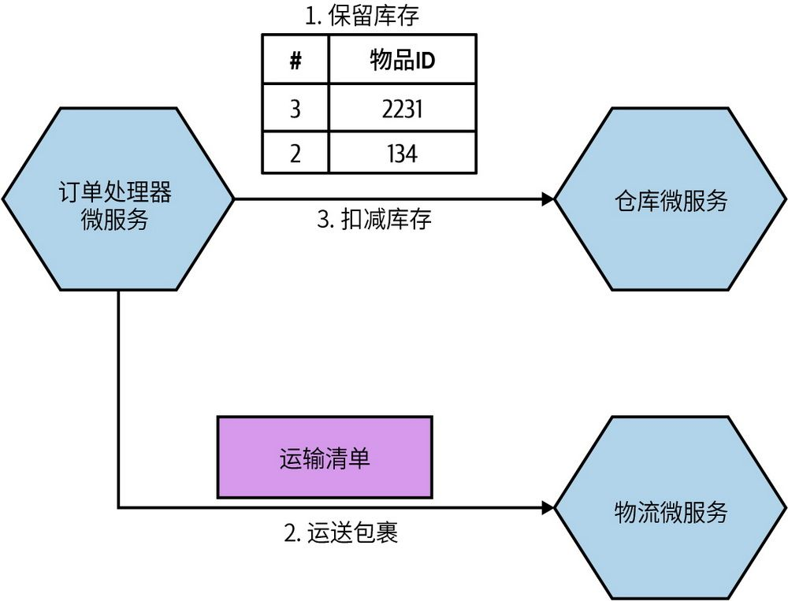

图2-5：解决传递耦合的一种方法是直接与下游服务通信

对于这个特定示例，我可能会考虑一种更简单（尽管更细微）的更改——向订单处理器微服务完全隐藏对运输清单的要求。将库存管理和配送调度的工作委托给仓库微服务的想法是合理的，但我们不满意的是我们泄露了一些低级的实现细节，即下游的物流微服务需要一份运输清单。隐藏这个细节的一种方法是，让仓库微服务将清单所需信息作为其服务契约的一部分，然后由它在本地创建运输清单，如图2-6所示。这意味着如果物流微服务更改其服务契约，只要是由仓库微服务负责收集物流微服务所需的数据，那么这个变更从订单处理器微服务的角度来看将是不可见的。

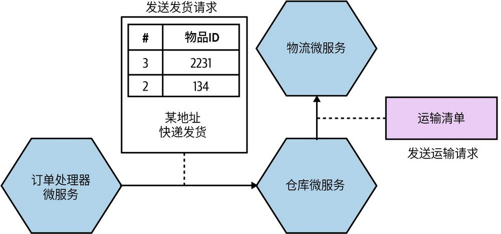

图2-6：向订单处理器微服务隐藏对运输清单的需求

虽然这有助于保护订单处理器微服务免受物流微服务的更改的影响，但仍有一些情况需要各方进行更改。如果考虑增加对国际运输的支持，作为该变更的一部分，物流微服务需要将海关申报单包含在运输清单中。如果这是一个可选参数，那么我们可以毫无顾忌地部署新版本的物流微服务。但是，如果这是一个必选参数，那么仓库微服务将必须创建一个海关申报单。它可以使用现有信息来创建，或者可能需要订单处理器微服务向它提供更多的信息。

尽管在这种情况下，我们并没有避免对所有3个微服务进行变更，但是我们可以更灵活地决定何时以及如何实现这些变更。如果在之前示例中的紧耦合（传递耦合）情况下，添加海关申报单可能需要同步发布所有3个微服务。通过隐藏这个细节，我们至少可以更容易地进行分阶段部署。

减少传递耦合的最后一种方法是，订单处理器微服务仍然通过仓库微服务将运输清单发送到物流微服务，但让仓库微服务完全不知道运输清单本身的结构。订单处理器微服务将运输清单作为订单请求的一部分发送，但仓库微服务不会尝试查看或处理该字段，它只是将其视为一个数据块，将其传递出去，而不关心内容。对运输清单格式的更改仍然需要变更订单处理器微服务和物流微服务，但由于仓库微服务不关心清单中的实际内容，因此不需要变更。

#### 2.3.3 公共耦合

当两个或多个微服务使用同一组公共数据时，就会发生公共耦合。这种耦合形式的一个简单且常见的例子是多个微服务使用同一个共享数据库；当然，它也可以表现为使用共享内存或共享文件系统。

公共耦合的主要问题是数据结构的更改会同时影响多个微服务，比如下图2-7中MusicCorp的服务示例。前面讲过MusicCorp在世界各地开展业务，因此它需要有关业务所在国家的各种信息。在这里，多个服务都是从共享数据库中读取静态参考数据的。如果此数据库的结构以向后不兼容的方式更改，那么该数据库的每个使用者都需要随之更改。实际上这样的共享数据往往很难进行更改。

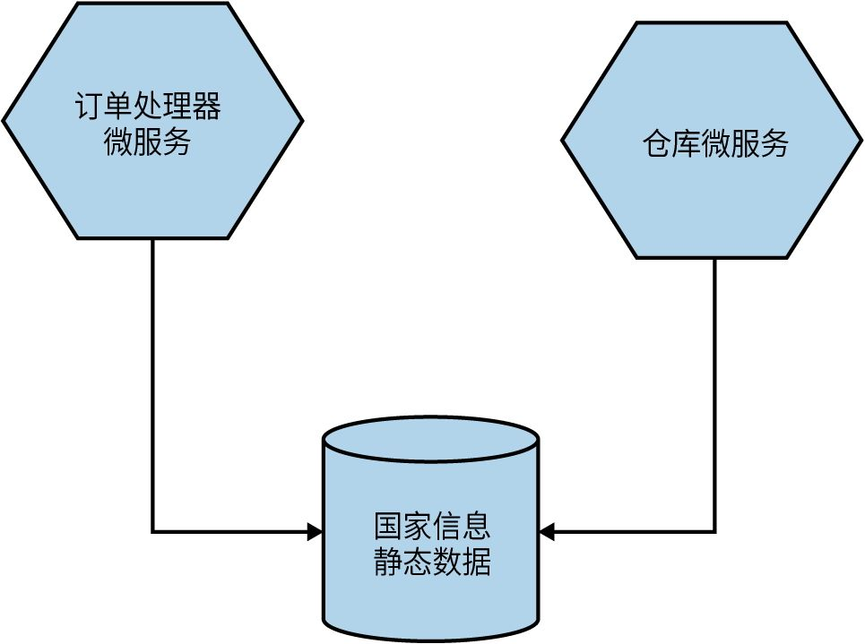

图2-7：多个服务访问同一数据库中与国家相关的共享静态数据

相对而言，图2-7中的示例是比较温和的。这是因为静态数据本质上不会经常更改，而且由于这些数据是只读的，因此我倾向于以这种方式共享这类数据。但是，如果公共数据的结构会被频繁地更改，或者多个微服务正在读取和写入相同的数据，那么公共耦合就会更成问题。

图2-8展示了订单处理器微服务和仓库微服务同时读取和写入共享订单微服务表，以帮助管理向MusicCorp的客户发送CD的过程。两个微服务都会更新“Status”（状态）列。订单处理器微服务可设置PLACED（已下单）、PAID（已付款）和COMPLETED（已完成）状态，仓库微服务可设置PICKING（拣货中）或SHIPPED（已发货）状态。

尽管你可能认为图2-8有点儿牵强，但这个公共耦合的简单示例有助于说明一个核心问题。它从概念上说明了订单处理器微服务和仓库微服务可以同时管理订单生命周期的不同阶段。在更改订单处理器微服务时，我们能够确定这个更改不会破坏仓库微服务对订单数据的要求吗？反过来呢？

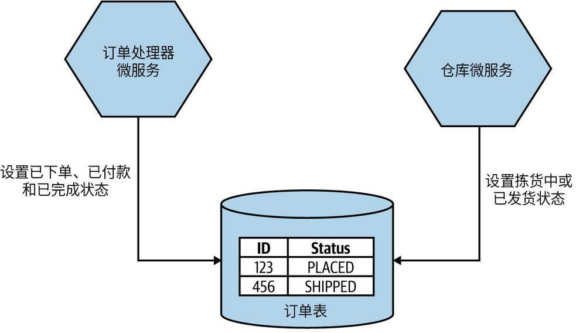

图2-8：公共耦合的示例：订单处理器微服务和仓库微服务都在更新同一订单表

使用有限状态机是确保正确更改某一事物状态的一种方法。它可用于管理某个实体从一种状态到另一种状态的转换，并确保不发生无效的状态转换。在图2-9中可以看到MusicCorp中订单允许的状态转换。订单可以直接从“已下单”到“已付款”，但不能直接从“已下单”到“拣货中”（这个状态机可能不足以完成从下单到发货所涉及的实际业务流程，这里仅举个简单的例子作为说明）。

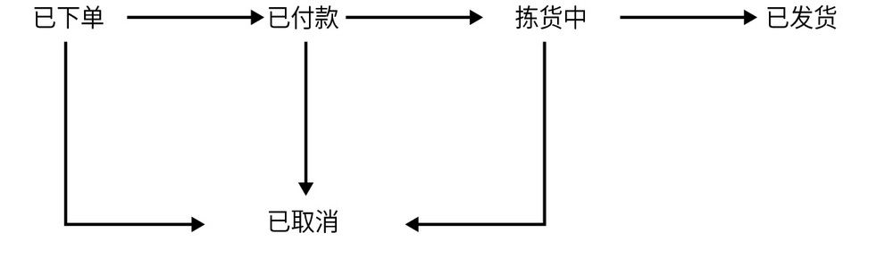

图2-9：MusicCorp中订单允许的状态转换

这个示例中，仓库微服务和订单处理器微服务共同管理此状态机。如何确保它们对允许的状态转换达成一致就是下一个问题了。有多种方法可以跨微服务边界管理此类流程。在第6章中讨论Saga时，我们将回到这个话题。

一个潜在的解决方案是由单个微服务管理订单状态。在图2-10中，仓库微服务或订单处理器微服务都可以向订单微服务发送状态更新请求。在这里，订单微服务是所有订单的准确保证。在这种情况下，将来自仓库微服务和订单处理器微服务的请求，仅仅视为请求是非常重要的。订单微服务的工作是集中管理与订单相关的可接受的状态转换。因此，如果订单微服务收到来自订单处理器微服务的“将状态从‘已下单'切换到‘已发货'”的请求，它可以拒绝该请求，因为这是无效的状态转换。

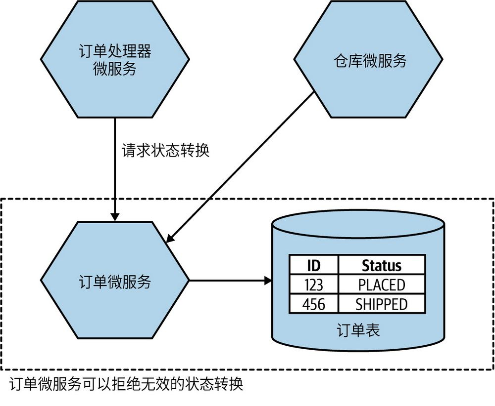

图2-10：订单处理器微服务和仓库微服务都可以请求对订单进行更改，但订单微服务决定哪些请求是可接受的
	

对于发送给下游微服务的请求，如果请求是无效的，请确保下游微服务可以拒绝。

在这种情况下，还有一种方法是将订单微服务实现为仅是数据库CRUD操作的包装器，对这个服务的请求会直接映射到数据库更新。这类似于一个对象具有私有字段但具有公共的getter和setter的情况——行为已经从微服务暴露给上游消费者（内聚性降低），我们又回到了管理跨多个不同服务的可接受状态转换的情况。
	

如果一个微服务看起来是一个对数据库CRUD操作的简单包装器，那就表明可能存在低内聚和高耦合，因为本应该在该服务中管理数据的逻辑被分散到了系统的其他地方。

公共耦合的源头也是资源争用的潜在来源。使用相同文件系统或数据库的多个微服务可能会使共享资源过载，如果共享资源变慢甚至完全不可用，可能会导致严重问题。共享数据库特别容易出现这个问题，因为多个消费者可以直接对数据库执行任意查询，而这些查询又可能具有完全不同的性能表现。我见过不止一个数据库因一个SQL的慢查询而陷入崩溃——我曾经就导致了一两次崩溃。
	 

所以，除了某些特殊场景，公共耦合在通常情况下是不可接受的。即便它是良性的，我们对共享数据可以进行的更改也是有限的，它通常反映了代码缺乏内聚性。这还可能带来操作争用方面的问题。正是由于这些原因，公共耦合是不理想的耦合形式之一——它甚至会让情况更加糟糕。

#### 2.3.4 内容耦合

内容耦合讲的是上游服务进入下游服务内部，并改变其内部状态的情况。最常见的是外部服务访问一个微服务的数据库并直接做出更改。内容耦合和公共耦合之间的区别是微妙的。在这两种情况下，两个或多个微服务都在读取和写入同一组数据。在公共耦合的情况下，你知道正在使用共享的外部依赖项，也知道它不在你的控制之下；而在内容耦合的情况下，所有权界限变得不那么清晰，开发人员更改系统变得更加困难。

我们回顾一下之前的MusicCorp的例子。在图2-11中，有一个订单微服务，它应该按照系统允许的订单状态来管理订单的更改。订单处理器微服务向订单微服务发送请求，订单微服务不仅负责执行具体的状态变更操作，还负责决定何时执行状态转换。另外，仓库微服务直接更新保存订单数据的表，绕过订单微服务中的校验功能。我们只能指望仓库微服务有一套和订单微服务一致的校验逻辑，以确保只发生有效的更改。最好的情况下，这代表着仅是逻辑的重复，而在最坏的情况下，仓库微服务中对状态更改的校验逻辑与订单微服务中的校验逻辑不同，因此我们可能会面对一些状态反常又令人困惑的订单。

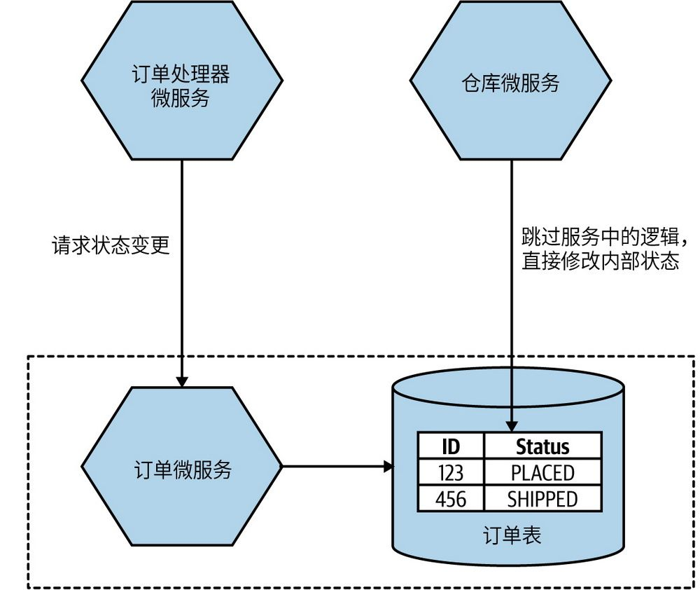

图2-11：内容耦合的示例：仓库微服务直接访问订单微服务的内部数据

在这种情况下，还存在订单表的内部数据结构暴露给外部的问题。在更改订单微服务时，我们必须非常小心地更改这张表——甚至需要假设我们明确知道该表正在被外部直接访问。简单的解决方法是让仓库微服务向订单微服务发送请求，然后对请求进行校验，同时也隐藏内部细节，从而使订单微服务的后续更改更加容易。

如果你正在开发一个微服务，那么必须明确地区分可以自由更改的内容和不能自由更改的内容。确切地说，作为开发人员，你需要知道何时可以更改这个服务向外部公开的契约，还需要确保在进行更改时不会破坏上游消费者的使用。而对于其他不影响公开契约的部分，你可以不受拘束地进行更改。

当然，在公共耦合中出现的问题也会在内容耦合中出现，但内容耦合还会带来一些额外的更令人头疼的问题，以至于有些人称其为“病态耦合”。

当允许外部直接访问数据库时，该数据库实际上成了外部契约的一部分，这会导致你无法轻易推断出哪些内容可以更改，哪些内容不能更改。你失去了定义什么可以共享（如果共享就无法轻易更改）和什么需要隐藏的能力。信息隐藏已经无从谈起。

总之，我们应该避免内容耦合。

### 2.4 恰到好处的领域驱动设计

在第1章中，我们介绍过用于确定微服务边界的主要机制是围绕领域本身，利用领域驱动设计（domain-driven design，DDD）来帮助创建领域模型。接下来，让我们看下DDD在微服务的环境中是如何工作的。

长久以来，我们总是希望程序可以更好地反映它们将要运行其中的现实世界。像Simula这样的面向对象的编程语言就是为了让我们能够对真实的领域进行建模而开发的。但要使这个想法真正实现，需要的不仅仅是编程语言的能力。

Eric Evans所著的《领域驱动设计：软件核心复杂性应对之道》提出了一系列的重要理念，可以更好地表示程序中的问题域。全面探讨这些理念超出了本书的范畴，但有必要在这里强调DDD的几个核心概念。

**通****用****语****言**

定义并采用一种通用语言，用于代码实现和描述领域，以促进沟通。

**聚****合**

作为单个实体进行管理的对象集合，通常指向的是现实世界中的概念。

**限****界****上****下****文**

业务领域内的明确边界，为系统的其他部分提供业务功能，同时也隐藏了内部的复杂性。

#### 2.4.1 通用语言

通用语言是指，我们应该努力在代码中使用用户使用的术语。在交付团队和实际用户之间使用通用语言，将更容易对现实世界的领域进行建模，并且能够促进沟通。

这里举一个反例，我回忆起在一家大型跨国银行工作时的情况。我们当时在企业流动性领域工作，这是一个花哨的术语，其实就是指在同一公司实体持有的不同账户之间转移现金的业务。产品负责人非常出色，她对想要推向市场的各种产品有着非常深刻的理解。与她一起工作时，我们会讨论诸如资产折价和日终清算之类的问题，这些对于她和她的客户都很有意义。

但是，代码中没有这些语言。在之前的某个时间点，我们已决定在数据库里使用标准数据模型。它被广泛称为“IBM银行模型”，但我对这是一个标准的IBM产品还是仅仅是由IBM顾问创建的产生了疑问。该模型定义了一个宽泛的“Arrangement”（安排）的概念，认为任何银行业务都可以通过它来建模。贷款？这是一个安排。买股票？这也是一个安排。申请信用卡？你猜怎么着，这还是一个安排。

数据模型影响到了代码，以至于代码库无法真正理解我们要构建的系统。我们并不是在构建一个通用的银行应用系统，而是要构建一个专门用于管理企业流动性的系统。问题在于，我们必须将产品所有者丰富的领域语言映射到通用的代码概念中——这意味着在解释和翻译方面需要做很多工作。结果，我们的业务分析师把时间大都花在一遍又一遍地解释相同的概念上了。

通过将真实世界的语言融入代码中，事情就会变得容易得多。当开发人员直接使用产品所有者给出的术语来编写故事时，他们更容易理解其含义并弄清楚需要做什么工作。

#### 2.4.2 聚合

在DDD中，聚合是一个容易让人困惑的概念，它有许多不同的定义。它只是由对象随意组成的集合吗？是应该从数据库中取出的最小单位吗？对我而言，一个行之有效的模型是先将聚合视为真实领域概念的一种表示，例如订单、发票、库存商品等。聚合通常有自己的生命周期，因此可以作为状态机来实现。

举一个MusicCorp的例子，订单聚合可能包含多个订单行。这些订单行只有作为整个订单聚合的一部分才有意义。

我们希望将聚合视为独立的单元，且确保处理聚合状态转换的代码与状态本身组合在一起。因此，尽管单个微服务可以管理多个聚合，但一个聚合应该只由一个微服务管理。

然而一般来说，我们应该将聚合视为具有状态、唯一身份和生命周期的事物，并将其作为系统的一部分进行管理。聚合通常涉及真实世界中的概念。

单个微服务将处理一种或多种不同类型聚合的生命周期和数据存储。如果另一个服务中的功能想要更改其中一个聚合，它需要直接请求更改该聚合，或者可以让聚合本身对系统中的其他事件做出反应以触发自己的状态转换，比如通过订阅其他微服务发布的事件。

这里要理解的关键是，当外部请求聚合进行状态转换时，聚合是有权拒绝的。在理想情况下，你肯定希望实现的聚合中不会有非法的状态转换发生。

聚合可以与其他聚合建立关系。图2-12中有与零个或多个订单和零个或多个愿望清单相关联的客户聚合。这些聚合可以由同一个微服务或不同的微服务管理。

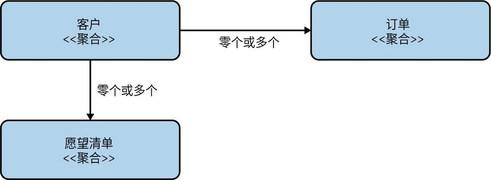

图2-12：一个客户聚合与零个或多个订单或愿望清单聚合相关联

如果这些聚合之间的关系存在于单个微服务的范围内，那么在使用关系数据库时，则可以轻松地使用诸如外键关系的方式存储这些关系。但是，如果这些聚合之间的关系跨越了微服务边界，我们就需要一些方法来对这些关系建模。

现在，我们可以简单地将聚合的ID直接存储在本地数据库中。例如，考虑一个管理账本的财务微服务，该账本保存了与客户之间的交易。在该微服务的数据库中，可以有一个包含该客户ID的CustID字段。如果想获得该客户的更多信息，我们必须使用该ID在客户微服务中进行查找。

这个概念的问题在于，它不是显式的——事实上，CustID字段和远程客户之间的关系是完全隐式的。要了解该ID的使用方式，我们必须查看财务微服务本身的代码。如果我们能以一种更显式的方式存储对外部聚合的引用，那就更好了。

在图2-13中，我们做了些更改，使得关系更加明确。这里存储的不是用于引用客户的普通ID，而是一个URI。如果构建基于REST的系统，我们可能会使用这个URI
	 。

这种方法具有双重好处。关系的性质是明确的。在REST系统中，我们可以直接使用此URI来查找关联的资源。但是，如果你不是在构建REST系统呢？Phil Calçado在SoundCloud中使用了这种方法的一种变体。
	 在这种方法中，他开发了一种用于跨服务引用的伪URI方案。例如，soundcloud:tracks:123是对ID为123的曲目的引用。这对于查看此标识符的人来说更加明确，但同时它也是一个足够有效的方案。如果需要，可以很轻松地创建出能够简化跨微服务聚合查找的代码。

有很多方法可以将系统分解为聚合，其中一些选择是高度主观的。出于性能原因或为了便于实现，你可能会决定随着时间的推移重塑聚合。然而，我认为实现方面的问题是次要的；在最初的设计中，我会首先以系统用户的认知模型作为指导，直到其他因素开始发挥作用。

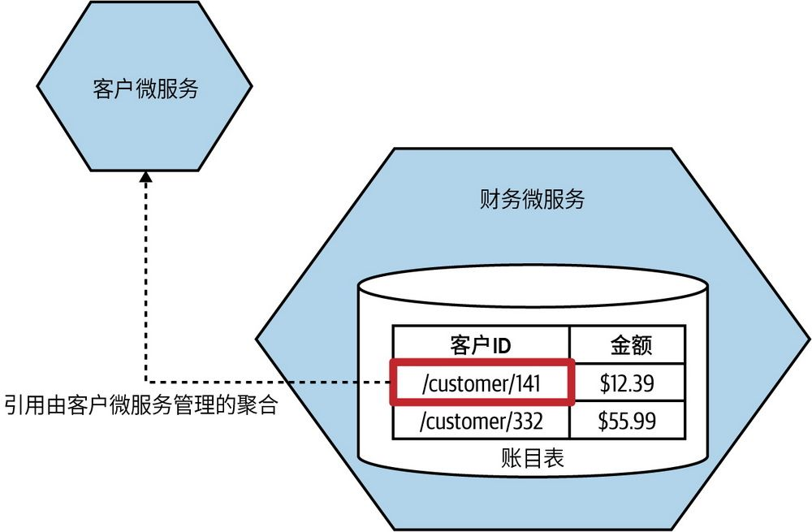

图2-13：如何实现不同微服务中两个聚合之间的关系的示例

#### 2.4.3 限界上下文

限界上下文通常表示更大的组织边界。在该边界范围内，需要履行明确的职责。这有点儿抽象，我们来看一个具体的例子。

在MusicCorp，仓库非常忙碌——管理发货订单（和零星的退货）、接收新库存、进行叉车比赛，等等。而在其他地方，比如财务部门可能就不那么活跃，但它在组织中还是发挥着重要作用，比如负责支付工资、支付运费等。

限界上下文隐藏了实现细节。仓库内部的关注点，比如所使用的叉车类型，只有仓库工作人员才会关心，别人对此不会有太大兴趣。这些内部关注点应该对外界隐藏起来，外界不需要知道，也不会关心。

从实现的角度来看，限界上下文包含一个或多个聚合。一些聚合可以暴露在限界上下文之外，而其他聚合可能会在内部隐藏。与聚合一样，限界上下文可能与其他限界上下文有关系——当映射到服务时，这些依赖关系成了服务间的依赖关系。

让我们回到MusicCorp的业务上来，我们的领域是公司经营的全部业务。它涵盖了从仓库到前台，从财务到订购的所有内容。我们可能会在软件中对所有内容进行建模，也可能不会，但无论如何，这些都是正在经营的领域。下面来分析一下那些看起来像Eric Evans所指的限界上下文的部分。

**0****1****.****隐****藏****模****型**

对于MusicCorp，我们可以将财务部和仓库视为两个独立的限界上下文。它们都与外部有明确的接口（如库存报告、工资单等），同时还有一些细节是只有它们自己需要知道的（如叉车、计算器等）。

财务部不需要了解仓库内部运作的细节。但是，它确实需要知道一些其他事情，比如它需要了解库存状况以便更新账目。图2-14显示了一个上下文的示例。我们可以看到仓库内部的运作，比如拣货员（为订单拣货的人）、代表库存位置的货架等。同样，总账中的条目对财务而言是重要信息，但此处无须与外部共享。

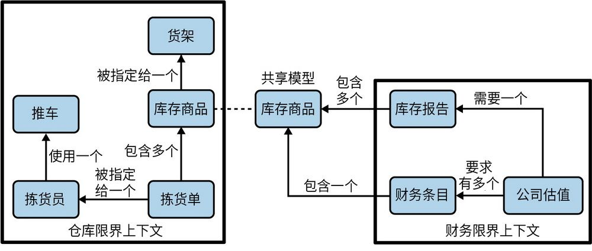

图2-14：财务部与仓库共享模式

然而，为了能够计算出公司的估值，财务部需要现有的库存信息。所以库存商品成为两个上下文之间的共享模型。值得注意的是，并不需要盲目地公开仓库上下文中库存商品的所有内容。在图2-15中，仓库限界上下文中的库存商品包含了对货架位置的引用，但共享的表达中仅包含一个数量。因此，存在仅内部可见的表达和可以暴露给外部的公开表达。通常，当存在不同的内部表达和外部表达时，为了避免混淆，以不同的方式命名是有好处的——在这种情况下，一种可能的方法是将“共享的库存商品”称为“库存数量”。

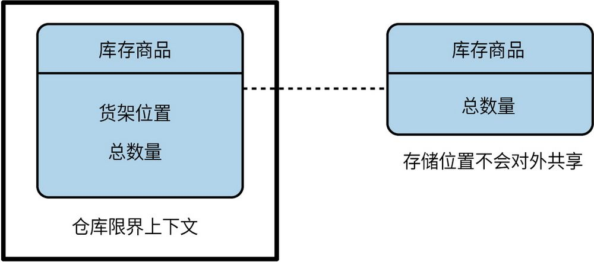

图2-15：共享模型可以决定隐藏不应与外部共享的信息

**0****2****.****共****享****模****型**

在不同限界上下文中可以出现相同的概念。在图2-14中，我们看到库存商品出现在两个位置。这意味着什么？库存商品被复制了吗？对此的理解方式是，从理论上讲，财务部和仓库都需要了解库存商品的某些信息。财务部需要知道库存的价值，以便确定公司的估值，而仓库需要知道库存商品的信息，以便熟悉物品的摆放位置。

当遇到这种情况时，像库存商品这样的共享模型在不同的限界上下文中可能具有不同的含义，因此“它”可能被称为不同的名称。我们倾向于在仓库中保留“库存商品”这个名称；但在财务部，我们可能更泛泛地将其称为“资产”，因为这是它们在那个场景中扮演的角色。我们会在这两个位置存储有关库存商品的信息，但信息内容是不同的。财务部中存储有关库存商品价值的信息，仓库中存储物品摆放位置的信息。但我们仍然需要将两个本地概念与全局的库存商品概念关联起来，并希望能够通过这种关联来查找库存商品的共享信息，例如其名称或者供应商——我们可以使用图2-13所示的技术来实现这一点。

#### 2.4.4 将聚合及限界上下文映射到微服务

聚合和限界上下文都为我们提供了具有明确定义接口的内聚单元，这些接口与外部系统相互作用。聚合是一个独立的状态机，它专注于系统中的单个域概念，而限界上下文则代表了一组相关的聚合，同样具有与外部连接的显式的接口。

因此，两者都可以很好地用作服务边界。正如我已经讲过的，初期，最好减少服务的数量。因此，你应该以包含整个限界上下文的服务为目标。当你逐渐熟悉并决定将这些服务拆分为更小的服务时，你需要注意不要把聚合拆开——一个微服务可以管理一个或多个聚合，但尽量不要让多个微服务管理一个聚合。

**由****粗****到****细****慢****慢****来**

一开始，你可能会识别出一些粗粒度的限界上下文。但是这些限界上下文又可以包含更多的限界上下文。例如，你可以将仓库分解为与订单履约、库存管理或收货相关的功能。在考虑微服务的边界时，应该首先选择更大、更粗粒度的上下文入手，然后等到需要寻求继续拆分带来的好处时，再对那些内嵌的上下文进行细分。

这里的一个技巧是，即便决定稍后会将按完整的限界上下文建模的服务拆分为更小的服务，你仍然可以通过向消费者提供粗粒度的API来向外部隐藏这个决定。将服务拆分为更小部分的决定可以说是一个内部实现决策，因此如果可能的话，我们倒不妨将其隐藏起来。在图2-16中，仓库被拆分为库存和物流两个部分。从外部看，仍然只有仓库微服务。不过，在内部我们做出了进一步的拆分，使库存微服务来管理库存商品，并让物流微服务来管理发货。请记住，我们要将单个聚合的所有权保留在单个微服务中。

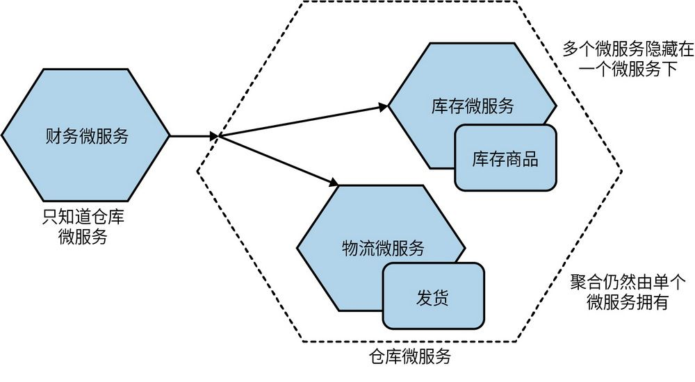

图2-16：仓库微服务内部已被拆分为库存微服务和物流微服务

这是信息隐藏的另一种形式——隐藏关于内部实现的细节，这样做，即便这个实现细节未来再次发生变化，消费者也不会有任何觉察。

倾向这种嵌套方法的另一个原因是，这可以将架构分块以简化测试。比如在测试消费仓库微服务的服务时，不必模拟在仓库上下文中的每个服务——只需模拟更粗粒度的API。在考虑更大范围的测试时，这也可以提供可供隔离的单元。比如当决定进行端到端测试时，在测试中启动仓库上下文中的所有服务，但对于其他协作方，我们可以将它们排除在外。第9章将探讨更多关于测试和隔离的内容。

#### 2.4.5 事件风暴

**事****件****风****暴**（event storming）是由Alberto Brandolini开发的一种技术，它是一种协作性的头脑风暴实践，目的在于帮助我们通过协作来共创领域模型。事件风暴不是让架构师坐在角落里提出自己的领域模型
	 ，而是将技术和非技术的干系人聚集在一起进行的一种共同活动。其理念在于，将领域模型的开发变成一种联合实践，从而最终获得一个共享的、更完整的全局视图。

值得一提的是，通过事件风暴定义的领域模型可以用来实现事件驱动的系统——而且，这种映射非常直接——你同样可以使用这样的领域模型来构建更偏向请求-响应式的系统。

**0****1****.****后****勤****准****备**

Alberto对于应该如何运行事件风暴有一些非常具体的观点，我非常赞同其中的一些观点。首先，让每个人都集中在一个房间里。这通常是最困难的一步——让人们的日程安排保持一致可能是一个问题，找一个足够大的房间可能也是一个问题。关键在于，要确保所有的干系人同时出席。你会希望参与建模的所有方面的代表——用户、领域专家、产品所有者——都到场，而且出席者必须是最能够代表该方面的人。

一旦所有人都在一个房间里，Alberto建议拿走所有椅子，以确保每个人都站起来并参与其中。作为一个有腰背问题的人，我虽然理解这种策略，但我认识到它可能并不适合所有人。我认同Alberto的另一个观点是，他认为需要有一个可以进行建模的大空间。一个常见的解决方案是将大卷褐色纸钉在房间的墙壁上，以便可以使用所有的墙面来捕捉信息。

主要的建模工具是用于捕捉各种概念的便签，不同颜色的便签纸代表不同的概念。

**0****2****.****练****习****过****程**

练习从参与者识别**领****域****事****件**（domain event）开始。这些领域事件代表系统中发生的事情，即你所关心的事件。在MusicCorp的示例中，“订单已创建”和“订单已付款”都是我们关心的事件。这些事件被记录在橙色便签上。在这一点上，我对Alberto的设计产生了新的怀疑，因为事件是要捕捉到的数量最多的事物，而此处却很难找到橙色便签。
	 

接下来，参与者将确定导致这些事件发生的命令。命令是由人类（软件的用户）做出的决策，用于执行某项操作。在这里，你试图了解系统的边界，并确定系统中的关键人员的角色。命令用蓝色便笺记录下来。

事件风暴会议上的技术人员，应该倾听非技术同事在此时提出的建议。这个练习的一个关键部分是，不要让任何当前的实现影响对领域是什么的感知（这种感知将在后面出现）。在这个阶段你想要创造这样一个空间，在这个空间里可以从关键干系人的分享中获得概念并将之公开。

在捕捉了事件和命令之后，接下来是聚合。在这个阶段所拥有的事件不仅有助于呈现系统中发生的事情，而且还开始重点强调潜在的聚合可能是什么。想想前面提到的领域事件“订单已创建”，此处的名词“订单”很可能是一个潜在的聚合。而“已创建”描述了一个针对订单可能发生的事情，因此这很可能是这个聚合生命周期的一部分。聚合由黄色便笺表示，与该聚合相关的命令和事件将被移动并在聚合周围聚集。这也有助于你了解聚合是如何相互关联的——来自一个聚合的事件可能会触发另一个聚合中的行为。

聚合被确定之后，它们被分组到限界上下文中。限界上下文通常遵循公司的组织结构，而练习的参与者能够很好地理解组织的哪些部分使用了聚合、它们使用了什么样的聚合。

事件风暴比我刚刚描述的复杂——这只是一个简要的概述。如果你想更详细地了解事件风暴，我建议你阅读Alberto Brandolini所著的*E**v**e**n**t**S**t**o**r**m**i**n**g*（该书目前仍在创作中）。
	 

### 2.5 DDD在微服务环境中的应用案例

我们已经探索了DDD如何在微服务的上下文中发挥作用，现在总结一下这种方法对我们有何用处。

首先，使DDD如此强大的一个重要原因在于，限界上下文明确地隐藏了信息——让系统呈现清晰边界的同时隐藏了内部复杂性，即能够在不影响其他部分的情况下进行变更。这意味着当采用DDD时，无论我们是否意识到，我们都在实践信息隐藏——这对帮助找到稳定的微服务边界至关重要。

其次，在定义微服务接入端点时，注重定义一种通用且统一的语言非常有帮助。当讨论API设计、事件格式等问题时，DDD为我们提供了一个共享的词汇表。它还有助于明确API对外部消费者的标准化形式，让限界上下文内的语言变更不至于影响到边界本身。

我们对系统实施的变更通常与业务部门希望对系统行为进行的变更有关。或者说，我们正在改变面向客户的功能。如果系统是沿着基于领域的限界上下文划分的，那么想要进行的任何变更都更有可能被隔离到单个微服务边界内。这不仅减少了需要进行变更的地方，也允许我们可以快速部署变更。

从本质上说，DDD将业务领域置于软件开发的核心地位。它鼓励将业务语言融入代码和服务设计中，这有助于丰富软件开发人员的领域专业知识。反过来，这又有助于我们加深对软件用户的理解、产生同理心，并在技术交付、产品开发和最终用户之间建立更好的沟通。如果你有兴趣转向业务流的团队，那么DDD非常适合被用作一种有助于让技术架构与组织架构保持一致的机制，它也有利于消除IT与业务之间的壁垒。

### 2.6 领域边界的替代方法

正如以上所述，DDD在构建微服务架构时非常有用，但如果认为这是在寻找微服务边界时应该考虑的唯一技术，那就错了。事实上，我经常将多种方法与DDD结合使用，以帮助确定应该如何拆分系统（或者是否拆分系统）。接下来，我们看看在寻找边界时还可能会考虑的其他因素。

#### 2.6.1 易变性

我听到越来越多的反对面向领域划分的声音，这通常是因为反对者认为易变性应该作为划分的主要驱动因素。基于易变性的划分方法可以让你识别出系统中更改更频繁的部分，然后将那些功能提取到它们自己的服务中，以便更有效地进行管理。从原理上讲，我同意这种看法，但并不认同将其宣传为唯一的方式，尤其是在考虑那些可能推动我们转向微服务架构的多种驱动因素时。比如，如果面临的最大问题与应用的扩展有关，那么基于易变性的划分就不太可能帮上忙。

基于易变性划分背后的思维方式在双模IT等方法中也很明显。双模IT是Gartner提出的一个概念，双模IT根据不同系统变化的快慢程度，巧妙地将各种系统分为了“模式1”（又名“记录系统”）和“模式2”（又名“创新系统”）。这个概念指出，模式1类型的系统不会发生太大变化，也不需要业务部门的参与。模式2类型的系统则是变化所在，需要快速改变并需要业务部门的参与。暂且抛开这种分类方法所固有的过度简化不谈，它暗示着一种非常固定的世界观，并掩盖了公司在寻求数字化时所经历的各种行业变革。比如，为了获得新的市场机会，以从未想过的方式为客户提供服务，可能会使得以往不需要太多改变的系统的某些部分突然改变。

让我们回到MusicCorp，它最早对数字化的尝试仅是建立一个网页。在20世纪90年代中期，它所提供的只是一份待售商品清单，用户必须打电话给MusicCorp才能下单。商品清单不过是作为广告登载到报纸上而已。后来有了在线订购，那时还只用纸质单据的仓库不得不进行了数字化改造。没人能预料到这种形势。这样下去，说不定未来MusicCorp还得考虑提供数字音乐。尽管你可能认为MusicCorp已经落后于时代，但你仍然可以感受到公司所经历的巨大变革，因为它明白不断变化的技术和客户行为会迫使它对业务中的某些部分进行难以预见的重大改变。

我不喜欢双模IT这个概念，因为它会给人们一个理由，将很少改变的东西放到漂亮整洁的盒子里，并说“我们不需要处理这里的问题——这是模式1”。这只是公司可以采用的一种方式，以确保没有任何东西需要改变。它还回避了这样一个事实，即更改“创新系统”（模式2）的功能经常依赖于“记录系统”（模式1）的改变。根据我的经验，采用双模IT的组织最终只有两种速度——慢和更慢。

公平地说，对于基于易变性划分的支持者来说，他们中的许多人并不一定推荐像双模IT这样的简单模型。事实上，如果主要驱动因素是期望尽快发布的话，我发现这种技术在帮助确定合适的边界方面非常有用——在这种情况下，提取正在变化或经常变化的功能是完全合理的。由此可见，目标决定了什么是最合适的机制。

#### 2.6.2 数据

你拥有和管理的数据性质也可以让你采用不同的形式来划分服务。例如，你可能希望明确规定哪些服务能够处理个人身份信息（personally identifiable information，PII），这既是为了降低数据泄露风险，也是为了简化对《通用数据保护条例》（General Data Protection Regulation，GDPR）等法规的监督和实施工作。

一起来看看我最近的一个客户——一家被称为“PaymentCo”的支付公司，它所处理的某些类型数据直接影响了有关系统划分的决策。PaymentCo处理信用卡数据，其系统需要符合支付卡行业（payment card industry，PCI）标准为管理这些数据而制定的各种要求。作为合规性的一部分，需要对公司的系统和流程进行审计。PaymentCo需要处理完整的信用卡数据，且数量很大，使其系统必须符合PCI的一级要求。这是最严格的级别，需要每季度对数据管理的相关系统和实践进行外部评估。

PCI的许多要求都是常识性的，但确保整个系统符合这些要求是一项相当繁重的工作，尤其是当需要接受外部审计时。因此，该公司希望将系统中处理完整信用卡数据的部分拆分出来，这意味着只有系统的一个子集需要这种级别的额外监督。图2-17展示了我们提出的设计方案的简化版。在浅色区域（由浅色虚线包围）中运行的服务永远不会看到任何信用卡信息——这些数据仅限于深色区域（由深色虚线包围）中的进程（和网络）。网关需要将请求分配到所需的服务（以及区域）中，当信用卡信息通过此网关时，它也是位于深色区域之中。

由于信用卡信息永远不会流入浅色区域，因此该区域的所有服务都可以免于接受完整的PCI审计。深色区域的服务属于此类监督的范围。在设计过程中，我们尽可能限制必须位于这个深色区域中的内容。最关键的是，我们必须确保信用卡信息永远不会流向浅色区域——如果浅色区域中的微服务可以请求这些信息，或者深色区域中的微服务可以将这些信息返回给浅色区域，那么原本清晰的分割线就会被打破。

数据隔离通常是由各种隐私和安全问题驱动的，第11章将再次讨论这个话题。

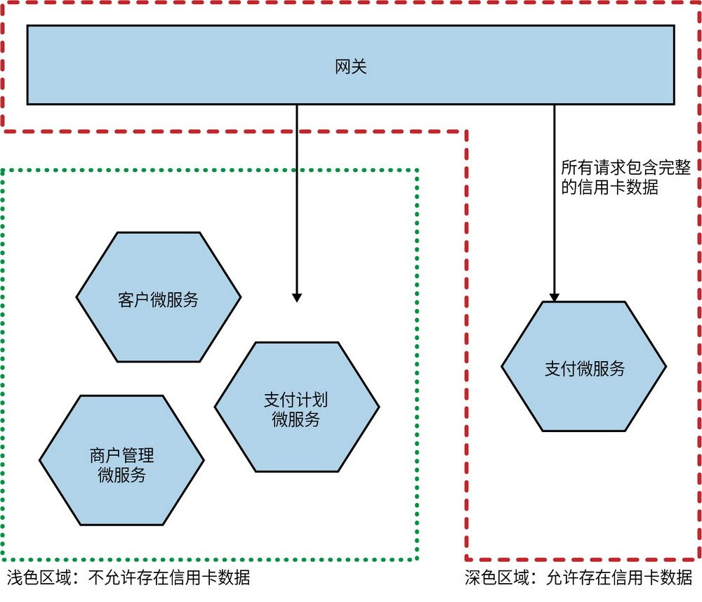

图2-17：PaymentCo根据对信用卡信息的使用来隔离流程，以限制PCI所要求的范围

#### 2.6.3 技术

采用不同技术的需求也可能是寻找边界的一个因素。你可以在单个微服务中采用不同的数据库，但如果想混合采用不同的运行时模型，你可能会面临挑战。如果你确定部分功能需要在像Rust这样的语言中实现，且可以让你获得额外的性能改进，那么这就会成为一个强制因素。

当然，我们必须清楚，如果将技术作为一种通用的划分手段，这可能会推动我们走向何方。图2-18再次展示了在第1章中讨论过的经典三层架构，这是按相关技术组合在一起的一个例子。正如已经提到的那样，这通常不是一个理想的架构。

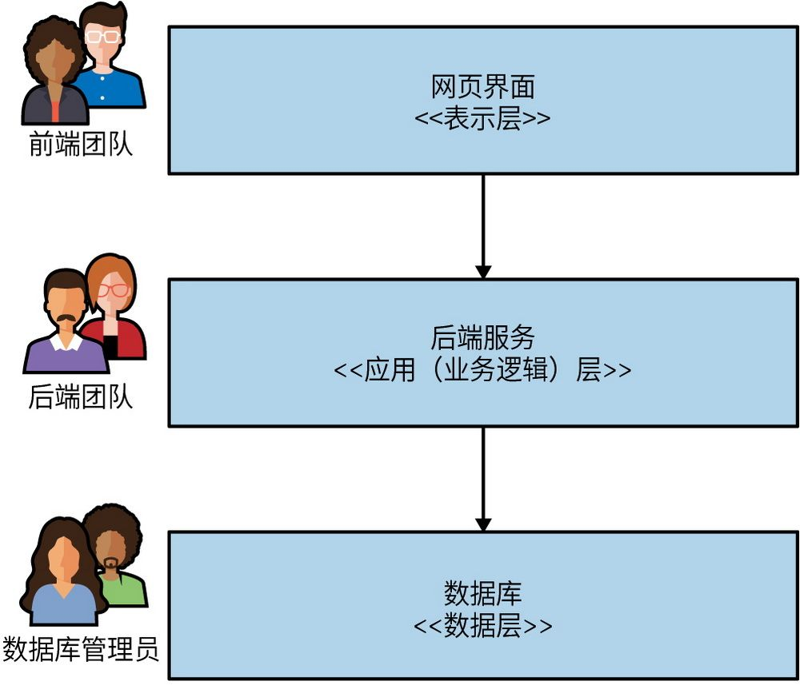

图2-18：传统的三层架构通常由技术边界驱动

#### 2.6.4 组织

正如第1章介绍的康威定律所阐述的，组织结构和最终形成的系统架构之间存在着内在的相互作用。这一思想不仅来自对这种联系的研究，还体现了我的个人经历，因为我也一次又一次地看到了这种情况的发生。无论影响是好是坏，组织结构都始终影响着系统架构。在定义服务边界时，我们必须将其视为决策的关键因素。

定义所有权横跨多个团队的服务边界不太可能达到我们想要的结果——正如第15章将进一步探讨的那样，共享微服务的所有权是一件让人担忧的事情。因此，在考虑何时何地定义服务边界时，我们必须考虑现有的组织结构；在某些情况下，甚至应该考虑通过改变组织结构来支撑想要的架构。

当然，我们还必须考虑如果组织结构发生改变，会引起什么样的变化。这意味着我们需要考虑当下是否必须重新设计软件。其实，在最糟糕的情况下，这可能会导致我们不得不审视现有的微服务并找出需要拆分的部分，因为它包含的功能现在可能会由两个团队负责，而之前只有一个团队统一负责。此外，组织变更通常只需要变更现有微服务的所有者。假设负责仓储运营的团队还负责计算供应商订购商品数量的功能，而我们现在决定将此职责移交给一个专门的预测团队；该团队希望从当前的销售情况和促销计划中获取信息，以确定需要订购的商品数量。如果仓储团队已经创建了一个专门的供应商订购微服务，则可以直接将其移交给新团队；而如果该功能存在于一个更大的系统中，则可能需要将它拆分出来。

即使在现有的组织结构中工作，我们也面临系统边界无法被正确划分的风险。许多年前，我和几位同事与加利福尼亚州的一家公司合作，帮助该公司采用一些更简洁的代码实践，并尽可能多地采用自动化测试。我们最初从一些容易着手的部分开始，诸如服务的拆分工作，但随后我们发现了一些更令人担忧的问题。我无法详细说明该应用的具体情况，但它是一个面向公众的应用，拥有庞大的全球客户群体。

团队和系统都在不断成长。原本只是一个简单应用，但随着发展，它逐渐承载了越来越多的功能和用户。最终，该组织决定在巴西成立新的开发小组来分担部分工作，以提高团队能力。系统被拆分，应用的前半部分基本上是无状态的，实现了面向公众的网站，如图2-19所示。应用的后半部分只封装了数据存储的远程过程调用（remote procedure call，RPC）接口。从本质上说，这就像在代码中采用了存储层，并将其提取出来作为单独的服务。

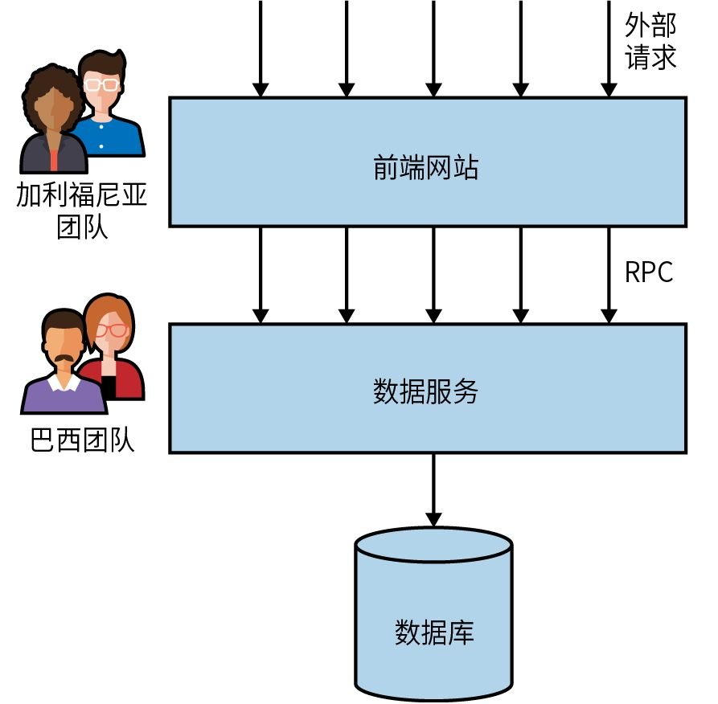

图2-19：跨技术栈的服务边界

必须同时更改这两种服务的情况经常发生。这两种服务都使用底层的RPC调用，这种方法调用过于脆弱（将在第4章进一步讨论）。服务接口设计也很烦琐，还会引起性能问题。这也导致不得不依赖复杂的RPC批处理机制。我将其称之为“洋葱架构”，因为它有很多层；当我们不得不处理它时，它确实会让我流泪（有些崩溃）。

如今，从表象来看，基于地理/组织拆分以前的系统是合理的，正如第15章将详细阐述的那样。但是，这里的问题是，团队没有采用垂直的、以业务为中心的切分方法，而是采用了进程内API调用的方式，并选择了水平切分。更好的模型应该是，位于加利福尼亚的团队负责一个端到端的垂直切片，其包括前端的相关部分和数据访问功能，而位于巴西的团队则负责另一个切片。

**内****部****分****层****与****外****部****分****层**

你现在可以看出来，我并不喜欢水平分层架构。不过，水平分层仍然有它的用处。在微服务边界内，划分不同层以使代码更易于管理是完全合理的。但是，将这种分层当成划分微服务和所有权边界的机制时，就会出现问题。

### 2.7 混合模型和例外

到目前为止，希望我的表述是清楚的。对于如何找到边界，切记不要教条。如果你遵循信息隐藏的原则并理解耦合和内聚的相互作用，那么无论你选择什么机制，你大概率能够避免一些糟糕的情况。顺便提一下，我恰恰觉得通过持续践行这些想法，你更有可能最终获得面向领域的架构。但实际上，即使决定选择面向领域作为定义微服务边界的主要机制，选择混合模型也是有理由的。到目前为止，我们提到的不同机制之间也有很多潜在的相互作用。如果选择过于狭隘的方式会导致教条主义，而不是在做正确的事情。如果你的工作重点是提高交付速度，则基于易变性的拆分可能更有意义，但如果这么做导致你划分出跨组织边界的服务，那么能够预见的是，变更速度会因交付过程中的竞争而受到影响。

根据我对业务领域的理解，我可能会定义出一个合理的仓库微服务，但如果该系统的某一部分需要用C++实现，而另一部分需要用Kotlin实现，那么你将不得不沿着这些技术路线进一步分解。

我的默认方法是将定义组织和领域驱动的服务边界作为开发工作的起点。通常情况下，我在前面概述的许多因素都会发挥作用，而哪些因素会影响决策取决于试图解决的问题。你需要首先考虑自己的具体情况，以确定哪种方法对你最有效，而我希望已经为你提供了一些不同的选择。请记住，如果有人说“X就是唯一的方法”时，他们很可能只是在向你兜售他们的“教条”而已，而你可以做得更好。

说了这么多，让我们在后面继续去探讨领域建模的主题，更详细地了解领域驱动设计吧。

### 2.8 小结

在本章中，你了解了什么是好的微服务边界以及如何在问题域中找到边界，从而同时兼得低耦合和高内聚的双重好处。深入了解所处的领域有助于找到这些边界。通过将微服务与这些边界对齐，可以确保依此构建的系统能够持续享有这些好处。本章还呈现了如何进一步拆分微服务的相关内容。

Eric Evans在《领域驱动设计：软件核心复杂性应对之道》一书中提出的思想对寻找合理的微服务边界非常有用，我在本章中只是提及了表面内容，该书所讲的内容更为翔实。如果你想深入学习，我还推荐你阅读Vaughn Vernon所著的《实现领域驱动设计》
	 ，它可以帮助你了解这种方法的实用性。如果你想让学习的内容更加精炼，Vernon的另一本书——《领域驱动设计精粹》——可以给出清晰的概述。

本章的大部分内容都在描述如何找到微服务的边界。但是，如果你已经拥有一个单体应用并希望迁移到微服务架构，又应该如何应对呢？我们将在第3章详细探讨。
