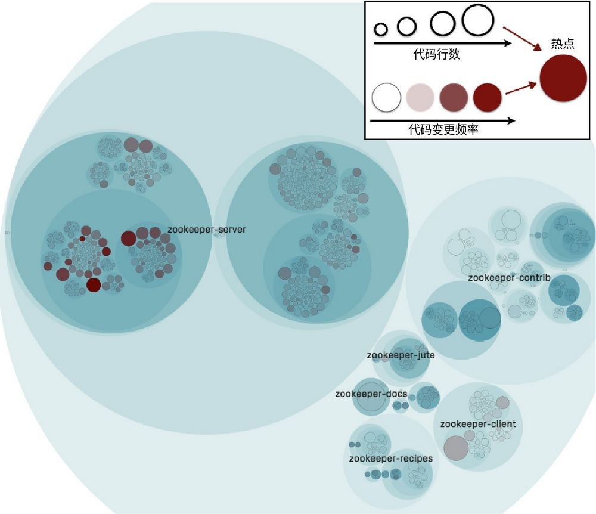
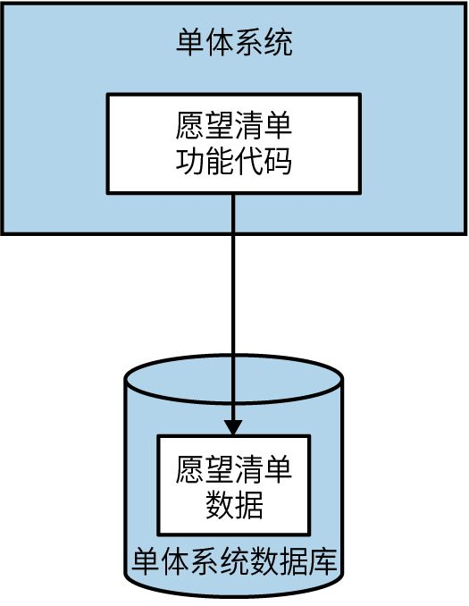
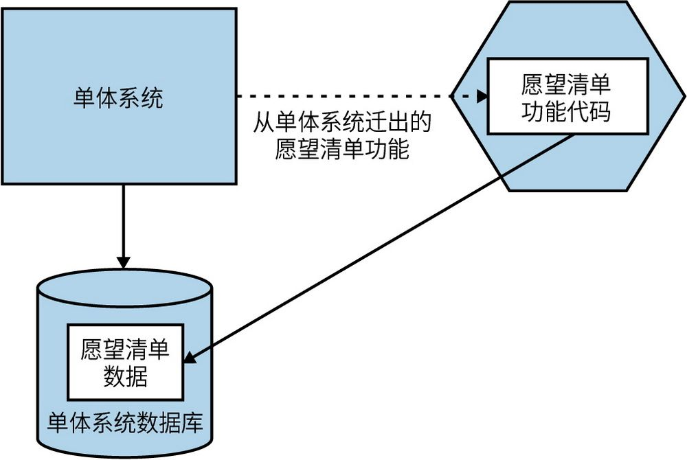
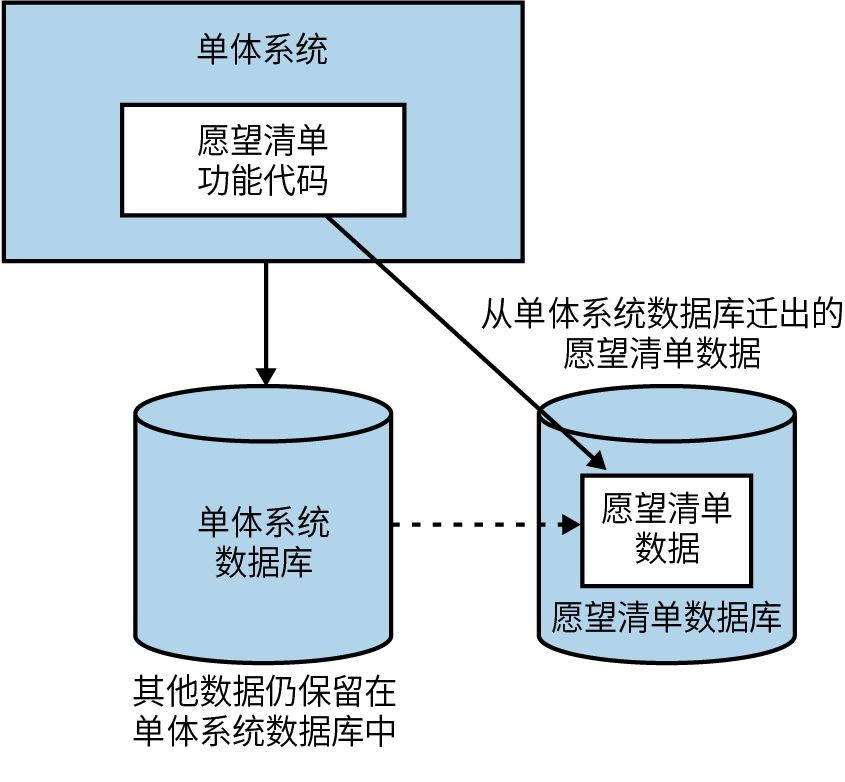
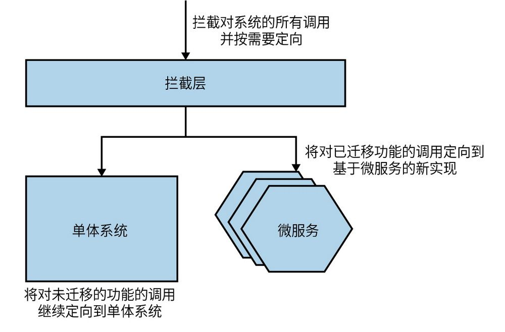
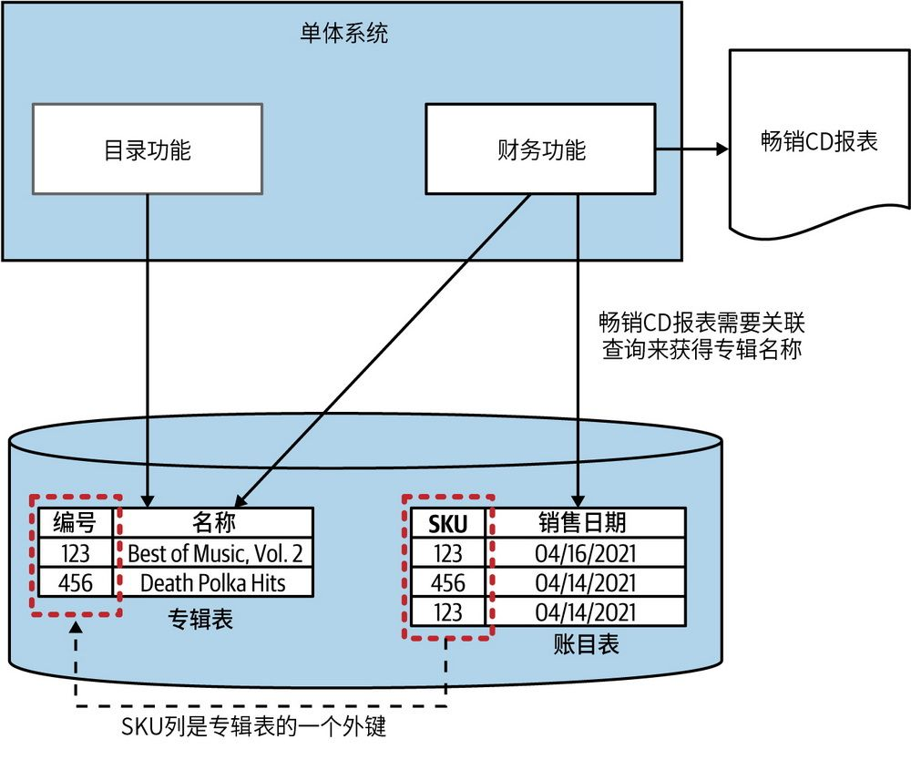
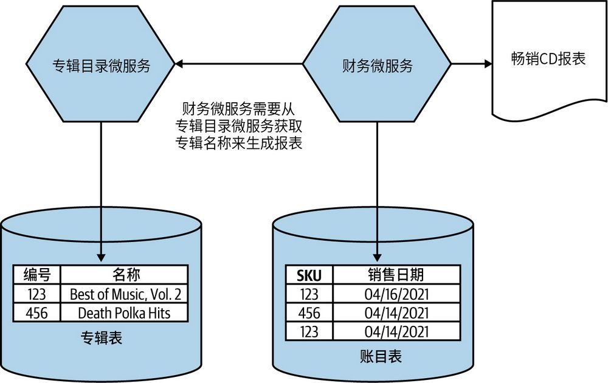
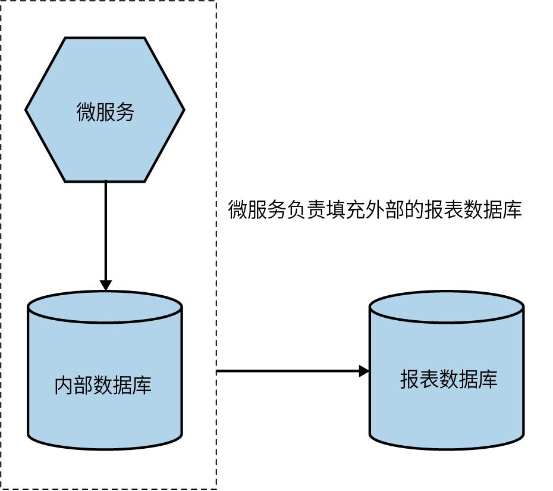

## 第3章 拆分大单体

本书的大多数读者通常不会从头开始设计一个系统。即便真的是从头开始，我也不推荐从微服务入手。第1章探讨过其中的原因。更常见的情况是，系统是现成的，可能是某种形式的单体架构，而你希望将其改造为微服务架构。

本章将阐述拆分大单体的重点步骤、拆分模式，并提一些建议，帮助你逐步过渡到微服务架构。

### 3.1 明确目标

微服务不是目标。拥有微服务并不意味着你“赢了”。采用微服务架构应当是基于理性判断且经过深思熟虑的结果。只有在当前架构下无法找到更容易的方法来实现最终目标时，才应该考虑迁移到微服务架构。

无法找到更容易的方法来实现目标时，如果对最终要达成的目标没有清晰的理解，就容易陷入把手段与目的混为一谈的误区。我见过一些团队痴迷于创建微服务，却从不问为什么。微服务会引入新的问题，增加系统的复杂性，在某些情况下，出现的问题会非常棘手。

过分关注微服务本身而不是最终目标，还意味着你很可能会停止思考其他方式来实现你所寻求的改变。例如，微服务能帮助我们扩展系统，但我们通常应该先考虑其他扩展技术。在负载均衡器后面增加几个现有单体系统的副本，可能会更快速、更有效地实现扩展。相比之下，微服务改造的过程则是复杂而漫长的。
	

微服务并不容易，所以应先尝试简单的方法。

最后，如果没有明确的目标，就很难知道从哪里开始。你应该先创建哪个微服务？如果对目标没有全面的了解，就会盲目行事。

因此，在考虑微服务前，要明确想要实现什么样的改变，以及有没有更简单的方法来实现最终目标。如果微服务确实是最佳的解决方案，那么你应该以最终目标为基准来追踪进度，并在过程中根据实际情况调整改造路线。

### 3.2 增量迁移

如果你进行一次大爆炸式的重写，你唯一能得到的，只有一次大爆炸。

——Martin Fowler

如果你确信拆分现有的单体系统是正确的做法，我强烈建议你逐步切割这一单体系统，一次只切一点儿。这种增量方式不仅有助于边拆分边学习微服务，而且还可以在问题发生时将风险最小化（出现问题是在所难免的）。如果把单体系统想象成一块大理石，我们可以一下子把它炸开，但这会把事情搞砸。相比之下，分步切割虽然耗时，却能确保每一步更加精准和可控。

将大工程分成许多小步骤，每一个步骤都可以执行和复盘。如果发现方向不对，那也只是一小步而已。这一步无论对错，你都可以从中学到知识或吸取教训，并据此调整和优化后续的步骤。

将事情分解成更小的部分还可以尽早识别成功的做法并从中学习，这有助于让接下来的工作更加轻松，并逐步走向成功。一次拆分一个微服务可以增量地体现微服务的价值，而不必等到最后的大爆炸式部署。

综上所述，我对那些关注微服务的人提出以下建议：如果你认为微服务是个好主意，那就先从小处着手。选择一两个业务领域，将它们实现为微服务，并部署到生产环境中，然后，回顾并评估这些新建的微服务是否真的帮助你更接近既定的目标。

只有在生产环境中运行，你才能真正体会到伴随微服务架构而来的恐惧、痛苦和折磨。

### 3.3 单体并不是威胁

虽然本书的开头已经指出，某种形式的单体架构可以是一个完全有效的选择，但还是有必要重申，单体架构本身并没有问题，不应该被视为一种威胁。你的重心不应该放在摆脱单体架构上，相反，应该更多地关注你期望通过架构转型获得哪些好处。

通常情况下，在转向微服务之后，现有的单体系统会保留下来，只是容量通常会减小。例如，为了提高应用程序处理负载的能力，可以迁移目前存在瓶颈的10%的功能，剩余90%的功能仍留在单体系统中。

许多人觉得，单体和微服务共存是“混乱”的，但现实世界中运行的系统架构往往是杂乱无章的，不可能永远保持整洁或处于刚刚完工的状态。如果追求完全“整洁”的架构，则需要具备极其深远的前瞻性和几乎无限的资源，那样才能把理想的系统架构复刻出来。但是真正的系统架构是不断发展的，必须适应需求和知识的变化。关键在于要习惯这种思维方式，我将在第16章中继续探讨这一点。

通过增量方式迁移微服务，可以逐步拆解现有的单体系统，并在这个过程中实现有价值的改进。同时，重要的是，你知道何时应该停下来。

只有在非常罕见的情况下，完全放弃使用单体系统是一个硬性要求。根据我的经验，这通常仅限于以下情形：现有的单体架构是基于“已死”或“将死”的技术，或者与即将“退役”的基础设施绑定，或者试图放弃昂贵的第三方系统。即使在这些情况下，由于前面提到的原因，你仍然需要采用增量迁移的方式。

**过****早****拆****分****的****风****险**

在对业务领域的理解还不充分的情况下就创建微服务是有风险的。我以前在Thoughtworks时就遇到过这样的问题。它有一个产品是Snap CI，一个托管的持续集成和持续交付的工具（第7章将讨论相关概念）。该团队之前曾开发过类似的工具GoCD，一款开源的持续交付工具，用户可以在本地部署，不需要托管在云上。

尽管Snap CI和GoCD在早期存在一些代码复用，但最终Snap CI采用了一个全新的代码库。尽管如此，团队基于之前在CD工具领域的经验，很快地确定服务边界，并将这个系统构建为一组微服务。

然而，几个月后，团队觉察到Snap CI的用例有些许不同，最初对服务边界的理解并不准确。这导致大量的跨服务变更，以及随之而来的高昂的变更成本。最终，团队将服务合并回一个单体系统，让团队成员有时间更好地理解边界到底应该在哪里。一年后，该团队将单体系统重新拆分为微服务，事实证明这时的边界比之前稳定多了。我见过的案例远不止这一个。过早地将系统分解为微服务可能会带来高昂的代价，特别是当你还是该领域的新手时。正因如此，在大多数时候，对一个已有的代码库进行微服务改造，比从一开始就尝试构建微服务要容易得多。

### 3.4 先拆分什么

只要你真正理解了选择微服务的理由，就能据此来决定微服务改造的优先次序。如果想要扩容应用程序，那么应当优先选择限制当前系统处理能力的功能。如果想缩短交付时间，就去找出那些变化最频繁的功能，看看它们是否可以改为微服务。你还可以使用CodeScene等静态分析工具来快速查找代码库中易变的部分。图3-1中呈现了CodeScene的一个示例，它展示了开源项目Apache Zookeeper中的热点分布。

但你还是必须考虑哪些拆分是可行的。有些功能可能已经深深地融入现有的单体系统中，以至于无法分解。或者，所涉及的功能可能对应用系统非常重要，以至于任何更改都是高风险的。又或者，要迁移的功能本身就是独立的，那么拆分就会非常简单。

图3-1：CodeScene中的热力视图有助于识别代码库中更改频繁的部分

从根本上说，将哪些功能拆分为微服务，最终取决于两种考量之间的权衡——实现拆分的难易程度和优先拆分的好处。

我建议，在多个可优先拆分的微服务中，选择相对容易实现的功能——这个微服务应该对实现端到端的目标有一定的积极作用，且易于实现。在这样的过渡中，尤其是在需要花费数月或数年的迁移过程中，尽早获得正向激励是很重要的。你需要积累一些速赢的经验。

此外，如果在尝试拆分本以为最简单的微服务时，无法让它发挥作用，那么可能需要重新考虑微服务架构是否真的适合你和你的组织。

积累一些成功的经验和失败的教训后，你将可以更好地处理更复杂的迁移工作，并且这些迁移也更可能在核心业务领域获得成功。

### 3.5 按层拆分

至此你已经确定了要拆分出的第一个微服务。接下来该怎么做？我们可以将这种拆分进一步分解成更小的步骤。

如果是基于Web服务的传统三层架构，那么我们可以从UI、后端应用服务和数据存储这3个方面来寻找想要拆分的功能。

从微服务到UI的映射通常不是一一对应的（这是第14章将深入探讨的话题）。因此，拆分与微服务相关的UI可以看作一个单独的步骤。在这里，我要提醒大家不要忽视UI部分。我见过太多的组织只关注拆分后端服务的好处，而这通常会导致架构重组的方法过于孤立。有时候最大的好处可能来自对UI的拆分，因此忽略这一点会带来危险。通常，UI的拆分往往滞后于后端应用服务的拆分，因为在微服务可用之前，很难看到UI拆分的可能性，但要确保拆分UI不会滞后太久。

再看看后端服务和相关的数据存储，我们在拆分微服务时，保证两者都在拆分范围内是至关重要的。从图3-2中可以看到，我们期望拆分出与客户愿望清单相关的功能。应用的功能代码存在于单体系统中，而相关的数据则存储在数据库中。那么应该先拆分哪一个呢？

图3-2：现有单体系统中愿望清单功能代码和数据

#### 3.5.1 代码优先

在图3-3中，我们将与愿望清单功能相关的代码拆分到新的微服务中。这个时候，愿望清单的数据仍保留在单体系统的数据库中，只有把愿望清单微服务相关的数据移出来后，分解工作才算完成。

根据我的经验，这往往是最常见的第一步，主要是因为它通常会带来更多的短期好处。如果将数据一直留在单体系统的数据库中，会为将来带来很多麻烦，因此这个问题也需要解决，不过至少从新的微服务中已经可以获得不少益处。

图3-3：先将愿望清单的代码迁移到新的微服务中，数据仍留在单体系统的数据库中

拆分应用服务的代码往往比拆分数据库容易。当发现无法整洁地拆分应用服务代码时，我们可以随时停下来，从而避免对数据库的拆分。但如果代码被整洁地拆分出后，你发现无法拆分数据库，那就麻烦了。因此，即便决定在拆分数据库之前先拆分代码，你也需要先理解相关的数据存储情况，并想清楚数据库拆分是否可行以及如何实现。因此，在实际动手前要想出拆分应用服务代码和数据的办法。

#### 3.5.2 数据优先

在图3-4中，我们首先拆分数据库，然后才是应用服务代码。这种方法比较少见，但它在不确定数据是否可以被整洁地拆分出来的情况下，还是很有用的。在进行相对更容易的代码迁移工作之前，这样做可以证明这种拆分方案是否可行。

图3-4：先拆分与愿望清单功能相关的数据表

采用这种方法在短期内的主要好处是降低了全面拆分微服务的风险。它迫使你提前处理一些问题，比如数据库中的数据失去完整性约束或无法跨数据库使用事务等。本章稍后将简要介绍这两个问题。

### 3.6 有用的拆分模式

拆分现有系统有许多模式可以使用。我在《重构到微服务》一书中对它们进行了详细的探讨。这里，我只分享其中的一些概述，让你了解有什么样的可能选项。

#### 3.6.1 绞杀者模式

在系统重构期间经常用到的一种技术是**绞****杀****者****模****式**（strangler fig pattern
	 ），这是Martin Fowler创造的一个术语。受一种植物的启发，该模式描述了随时间的推移用新系统“包裹”旧系统进而逐步接管旧系统功能的过程。

图3-5所示的方法很简单：拦截对现有系统的调用（在本书中是指现有的单体系统）。如果在新的微服务架构中实现了要调用的功能，那么它将被重定向到微服务。如果功能仍然由单体系统提供，则让调用定向到单体系统本身。

图3-5：绞杀者模式示意图

这种模式的妙处在于，它通常可以在不对底层单体系统进行任何改变的情况下完成。单体系统甚至不知道它已经被新的系统“包裹”住了。

#### 3.6.2 并行运行模式

从久经考验的现有应用架构所提供的功能切换到基于微服务的新功能，可能会让人有些紧张，特别是当被迁移的功能对你的组织至关重要的时候。

确保新功能运行良好而又不影响现有系统行为的一种方法是，采用并行运行模式（parallel run pattern）：同时运行该功能的原有实现和新的微服务实现来支持相同的请求，并比较结果。8.6.5节会更详细地探讨这种模式。

#### 3.6.3 功能开关模式

功能开关（feature toggle）是一种允许关闭或打开某项功能，或在某些功能的两种不同实现之间切换的机制。功能开关模式具有良好的通用性，且对微服务的迁移特别有用。

正如在绞杀者模式中描述的那样，在过渡过程中，我们通常会在单体系统中保留现有功能，并希望可以在不同的功能版本之间进行切换，即单体系统中的功能和新的微服务中的功能。例如，通过采用HTTP代理的绞杀者模式，我们可以在代理层实现功能开关，从而轻松地控制在不同实现之间的切换。

有关功能开关模式的详细介绍，我推荐阅读Pete Hodgson的文章“Feature Toggles（aka Feature Flags）”。
	 

### 3.7 拆分数据库的注意事项

拆分数据库可能会遇到许多问题，以下是你可能会遇到的一些挑战以及一些可能有帮助的提示。

#### 3.7.1 性能

数据库，尤其是关系数据库，擅长实现跨不同表的数据关联。这非常有用，而且事实上，这会被认为是理所当然的。但是按微服务的要求拆分数据库时，我们通常不得不将数据关联操作从数据存储层移动到微服务内部。无论采用什么方法，操作速度都不如在数据库中那么快。

图3-6描述了在MusicCorp遇到的情况。我们选择拆分目录功能，这个功能主要用来管理和发布有关艺术家、曲目和专辑的信息。目前，在单体系统中与目录功能相关的代码使用专辑表来存储供出售的CD专辑信息。这些专辑表最终会被追踪所有销售情况的账目表引用。账目表中的行记录了某件商品的销售日期，以及一个表示售出商品的标识。示例中的标识被称为库存单位（stock keeping unit，SKU），这是零售系统中的常见做法。
	 

每个月月底需要生成一份报表，统计最畅销的CD。账目表可以告诉我们哪个SKU销量最大，但是该SKU的具体信息存储在专辑表中。为了使报表美观易读，我们不想仅仅报告“我们售出了400份SKU456，赚了1596美元”，而是希望添加有关所售商品的信息，使报告能够表述为“我们售出了400份《死亡波尔卡》，赚了1596美元”。要做到这一点，相关的财务功能代码在执行数据库查询时，需要将账目表中的信息关联到专辑表，如图3-6所示。

图3-6：单体系统中数据库的关联操作

在基于微服务的新架构中，新的财务微服务负责生成畅销报表，但其在本地并没有专辑的信息，所以它需要从新的专辑目录微服务中获取这些数据，如图3-7所示。生成报表时，财务微服务首先查询账目表，提取上个月最畅销的SKU列表。此时，本地拥有的唯一信息是SKU和每个SKU的销售数量。

图3-7：用服务调用代替数据库关联操作

接下来，我们需要调用专辑目录微服务，请求每个SKU的信息。这个请求会导致专辑目录微服务在自己的数据库上进行SELECT操作。

从逻辑上讲，关联操作仍然存在，但它现在发生在财务微服务的内部，而不是在数据库中。关联已从数据层转移到应用服务层。可惜这个操作不会像数据库中实现的关联那样高效。我们已经从一个只有一条SELECT语句的世界进入了一个新世界，在这个新世界中，我们先对账目表进行SELECT查询，然后调用专辑目录微服务，这才能又触发一个SELECT查询来获取专辑表中的信息，如图3-7所示。

在这种情况下，如果这个操作的整体延迟没有增加，我会感到非常惊讶。在生成报表的特定情况下，这可能不是一个重大问题，因为这个报表只需要按月生成，因此可以采用积极的缓存策略（13.4节中将更详细地探讨这个主题）。但如果这是一个频繁的操作，就会成为问题。不过，我们也可以通过在专辑目录微服务中实现批量查找SKU，或在本地缓存所需的专辑信息，来减轻延迟增加可能带来的影响。

#### 3.7.2 数据完整性

数据库可用于确保数据的完整性。回到图3-6，由于专辑表和账目表都在同一个数据库，我们就可以（且很可能会）在账目表和专辑表中的行之间定义外键约束。这将确保我们始终能够从账目表中的记录关联到相关专辑的信息，因为只要账目表引用了它们，就无法从专辑表中删除这些被引用的记录。

由于这些表现在存在于不同的数据库中，因此无法强制实现数据的完整性约束。没有什么可以制止删除专辑表中行的行为，所以当试图准确计算售出商品时，就会引发问题。

在某种程度上，我们只需要“习惯”这个事实，即不能再依赖数据库来强制实现数据实体间关系的完整性。显然，对于仍然保留在单个数据库中的数据来说，这不是问题。

我们有一些变通的方法，而“应对模式”这一术语可能更适合描述这个问题的处理方法。我们可以在专辑表中使用软删除，这样做，记录实际上并没有被删除，而只是被标记为已删除。另一种方式是，在发生销售时将专辑名称复制到账目表中，但我们必须考虑如何同步专辑名称的变更。

#### 3.7.3 事务

我们许多人已经依赖于在数据库事务中管理数据所获得的保障。基于这种确定性，我们构建了应用程序，知道可以依靠数据库处理许多事情。但是，一旦开始将数据拆分到多个数据库，我们就会失去业已习惯的ACID事务所提供的一致性保障。（我将在第6章解释ACID并深入探讨ACID事务。）

对于在单个事务边界中就能管理系统所有状态变更的人来说，转向分布式系统可能会带来冲击，且人们通常的反应是寻求实现分布式事务，以重新获得在简单架构下ACID事务所带来的保障。可惜的是，正如6.1节所介绍的那样，分布式事务不仅实现起来很复杂，而且即便做得再好，它实际上还是无法提供在更小范围的数据库事务中所期望的那种保障。

正如6.4节所探讨的那样，分布式事务有替代机制（也是更可取的机制）来管理跨多个微服务的状态更改，但这会带来新的复杂性。与数据完整性一样，我们必须接受这样的事实：即便基于合理的理由对数据库进行拆分，也仍会面临一系列新问题。

#### 3.7.4 工具

变更数据库很困难，原因有很多，其中之一是没有太多可选的工具能让我们轻松地实现变更。对于代码来说，IDE中内置了重构工具，且还有一个额外的优势，即要变更的部分基本上是无状态的。而对于数据库来说，要变更的东西是有状态的，而且还缺乏良好的重构工具。

有许多工具有助于管理关系数据库结构变更的过程，但大多数遵循相同的模式。每个结构变更都是在版本控制下的增量脚本中定义的。然后这些脚本以幂等方式严格按顺序运行。Rails的迁移机制就是以这种方式工作的，多年前我帮助实现的工具DBDeploy也遵循了这一模式。

对于目前还未接触过此类工具的人，我推荐使用Flyway或Liquibase来实现同样的效果。

#### 3.7.5 报表数据库

微服务从单体应用拆出后，为隐藏对其内部数据的直接访问，也会进行数据库拆分。这有助于构建稳定的接口，进而使独立部署成为可能。但遗憾的是，当我们确实有从多个微服务访问数据的合法用例，或当这些数据最好通过数据库而不是类似REST API的方式提供时，数据库拆分会带来一些问题。

我们可以为外部访问创建一个专用的报表数据库，并由微服务负责将其内部数据推送到报表数据库，如图3-8所示。

图3-8：报表数据库模式

报表数据库可以在隐藏内部状态管理的同时，从数据库中提供数据——这是非常有用的。例如，你可能想支持即时SQL查询、大规模关联查询或使用访问SQL端点的工具链，那报表数据库就是一个很好的解决方案。

这里有两个关键点需要强调。首先，我们还是要遵循信息隐藏原则。因此，我们应该只向报表数据库推送最少量的数据。这意味着报表数据库中的内容可能只是微服务存储数据的一个子集。然而，由于这里不需要直接映射，我们就有机会根据消费者的需求专门为报表数据库设计一个表结构，这可能是完全不同的表结构，甚至可能是完全不同类型的数据库技术。

其次，报表数据库应该像其他微服务一样，其维护人员的工作是确保即使微服务更改了内部实现细节，也能保持该端点的兼容性。从内部状态到报表数据库的映射是微服务开发者的责任。

### 3.8 小结

所以，总的来说，在着手将功能从单体架构迁移到微服务架构时，你必须清楚地理解期望实现的目标。这个目标将指导迁移工作，并帮助你确认是否正在朝着正确的方向前进。

迁移应该是增量实现的。做出变更、部署变更、评估变更，如此往复。即使是拆分单个微服务的行为本身也可以分解为一系列的小步骤。

如果你想进一步学习本章中的任何概念，我写的《重构到微服务》一书有对这个主题的深入探讨。

本章大部分的内容是偏宏观层面的概述。在第4章阐述微服务间如何相互通信时，我们将讨论更多的技术细节。
