## 第4章 微服务间通信模式

对许多人来说，正确地实现微服务间通信并不容易，这往往是因为在选择技术时，他们没有仔细斟酌各种可能的通信模式，而是直接选择了某种技术。因此，在本章中，我将梳理不同的通信模式，展示每种模式的优缺点，并帮助你选择最合适的通信模式。

本章将介绍同步阻塞和异步非阻塞通信机制，并对比请求-响应模式和事件驱动模式这两种不同的协作形式。

读完本章后，你应该可以更好地理解这些不同的通信模式，并掌握相关基础知识。这对于我们在后面的章节中探究实现细节非常有用。

### 4.1 从进程内到进程间

让我们从简单的开始——至少我希望是简单的。顾名思义，不同进程间通过网络调用（进程间调用）和单个进程内的调用（进程内调用）是非常不同的，尽管这种不同在某些方面可以被忽略。举个简单的例子，可以将两个对象之间通过方法调用的交互，映射到两个微服务之间通过网络通信的交互上。但是，如果忽略微服务和对象之间的差异，则会带来很多麻烦。

下面，我们来看看进程内调用和进程间调用的不同之处，以及它们对于我们理解微服务间交互的影响。

#### 4.1.1 性能

从根本上讲，进程内的调用性能与进程间的调用性能是不同的。当执行进程内调用时，底层的编译器和运行时可以使用各种优化技巧来降低调用的开销，例如在编译阶段使用内联（inline）技术，从而避免在运行时产生真正的调用。但是进程间通信没有这样的优化方式，通信数据包必须被发送。相比于进程内调用的开销，进程间调用的开销大得多。通信数据包在数据中心内部的来回传输往往就需要耗费几毫秒的时间，但进程内方法调用的开销可以忽略不计。

这种差异通常会让你重新考虑API的设计。一个在进程内合理的API调用不一定在进程间仍然合理。在进程内，我可以跨API边界
	 执行1000次调用而不必担心性能问题。但是，我会在两个微服务之间执行1000次网络调用吗？答案可能是否定的。

给方法传递参数时，数据不会移动，就如同传递了指向内存地址的指针。将一个对象或数据传递给另一个方法不需要分配新的内存来复制数据。

但是，当通过网络进行微服务间调用时，数据实际上被序列化为某种可以在网络上传输的格式，然后再发送到另一端时进行反序列化。因此，我们需要更加关注进程间发送的负载大小。那么上次你在进程内考虑数据的大小是什么时候呢？实际上，你可能原本没必要知道数据的大小，但现在必须加以考虑。你自然会尝试减少发送和接收的数据的大小（这对信息隐藏来说可能不是坏事），选择更高效的序列化机制，甚至会考虑将数据转存到文件系统中，并通过传递文件位置来代替直接传递数据。

这些不同的操作并不会直接产生问题，但必须谨慎对待。我曾看到很多设计，尝试对开发人员隐藏网络调用的存在。他们期望通过创建抽象来隐藏细节，从而能够更有效地做更多的事情，但是有时候，抽象也隐藏了本不应该隐藏的内容。开发人员需要知道某个操作是否会触发网络调用，否则，在遇到性能瓶颈问题时，你可能会意外地发现某一处的代码引入了意想不到的跨服务调用。

#### 4.1.2 接口变更

当进程内接口发生变更时，我们可以轻松列出所有需要进行的更改，因为实现接口的代码和调用接口的代码都打包在同一进程中。实际上，如果在支持代码重构的IDE中更改了方法签名，IDE通常会连带对该方法的调用自动重构。这种变更可以以原子方式实现，因为接口的两个端点打包在同一进程中。

然而，在微服务间的通信中，提供接口的微服务和使用该接口的消费者微服务是分开部署的。当微服务接口进行向后不兼容的变更时，我们要么需要与消费者进行同步部署，以确保将变更更新到使用新接口的版本，要么找到某种方法分阶段推出新的契约。我们将在本章的后面继续探讨有关这个概念的更多细节。

#### 4.1.3 错误处理

在进程内调用方法时，错误的性质往往非常直观。简单来说，这些错误会通过调用栈向上传递，它们要么是可预期且可处理的，要么是不可处理的严重错误。总的来说，错误是可确定的。

而在分布式系统中，错误的性质可能是不同的。你会面临许多超出控制范围的错误。例如，网络超时、下游微服务临时失效、网络断开、容器因内存消耗过大而被强制终止，甚至在极端情况下，数据中心可能发生了局部火灾
	 。

在*D**i**s**t**r**i**b**u**t**e**d**S**y**s**t**e**m**s**:**P**r**i**n**c**i**p**l**e**s**a**n**d**P**a**r**a**d**i**g**m**s**,**3**r**d**E**d**i**t**i**o**n*
 这本书中，其作者Andrew Tanenbaum和Maarten Steen列举了进程间通信中可能遇到的5种故障。以下是这5种故障的简述。

**崩****溃****故****障**

一切运行正常，直到服务器崩溃。只能重启服务器。

**遗****漏****故****障**

你发出了一些请求，但没有得到响应。或者，你预期下游微服务发出消息（包含你关注的事件），但没有收到。

**时****效****故****障**

有些事情发生得太晚（没有及时实现），或者发生得太早。

**响****应****故****障**

收到了一个响应，但它似乎是错误的。例如，你请求获取订单摘要，但响应中缺少所需的信息。

**恶****性****故****障**

也称为“拜占庭故障”（Byzantine failure），是指出现了故障，但参与者无法就故障是否发生（或为什么发生）达成一致。正如它的名字，看起来就很棘手。

这些错误中有不少是暂时性的，可能会随着时间流逝而消失。考虑这样一个场景：你向一个微服务发送请求，但没有收到响应（类似于遗漏故障）。这可能意味着下游微服务从一开始就没有收到请求，因此我们需要重新发送请求。其他问题就没这么容易处理了，还可能需要运维人员的介入。因此，为错误返回更清晰、更详细的语义描述非常重要，这样客户端才可以采取更适合的应对措施。

HTTP协议是一个能帮助你理解其重要性的例子。每一个HTTP响应都包含一个代码，其中400和500系列代码是为错误预留的。400系列响应代码表示请求错误，其本质上是指下游服务告诉客户端原始请求是有问题的，所以，应该停止尝试。例如，对响应代码404 Not Found的请求进行重试是无意义的。500系列响应代码与下游问题有关，其中一部分代码表示问题是暂时的。例如，503 Service Unavailable表示下游服务器无法处理该请求，但这可能只是临时的，此时上游客户端也许会决定重试请求。但还有一种情况，如果客户端收到501 Not Implemented，则重试毫无意义。

无论是否基于HTTP的协议进行微服务间的通信，如果有一组能够在语义上明确表达错误性质的错误消息，将有助于客户端更容易地执行补偿性操作，从而有助于你构建更健壮的系统。

### 4.2 进程内的通信技术：选择众多

在选择太多而时间受限的情况下，最简单的做法就是忽略那些不重要的事情。

——Seth Godin

可用于进程间通信的技术非常多，因此，我们经常会因为选择过多而不堪重负。我常常发现人们偏向于熟悉的技术，或者被业界大会上最新的热门技术所吸引。这样做的问题在于，一旦你选择了特定的技术，通常也就选择了一系列随之而来的特定思维方式和相应的约束。这些约束可能并不适合你的实际情况，而这个技术背后的思维方式实际上可能与你试图解决的问题并不匹配。

如果你正在尝试构建一个网站，那么像Angular或React这样的单页应用技术就不适合。同样，尝试将Kafka用于请求-响应的交互场景也不是一个好主意，因为它是为事件交互而生的（稍后将讨论这些主题）。然而，我一次又一次地看到技术被用在了错误的地方。人们选择“时髦”的新技术（比如微服务），而没有考虑他们所面临的问题是否与之匹配。

因此，在谈论可用于微服务间通信的各种技术之前，我认为重要的是先要讨论实际需要的通信模式，然后再寻找合适的技术来实现它。因此，我将首先介绍多年来一直在使用的模型，它有助于区分微服务间通信的不同方法，从而帮助你筛选出所需的技术。

### 4.3 微服务间的通信模式

图4-1展示了我用来思考不同通信模式的模型概貌。虽然这个模型并不完全和详尽（我并不想在这里提出一个关于进程间通信的大一统理论），但它为微服务架构广泛使用的不同通信方式提供了一个高阶概述。

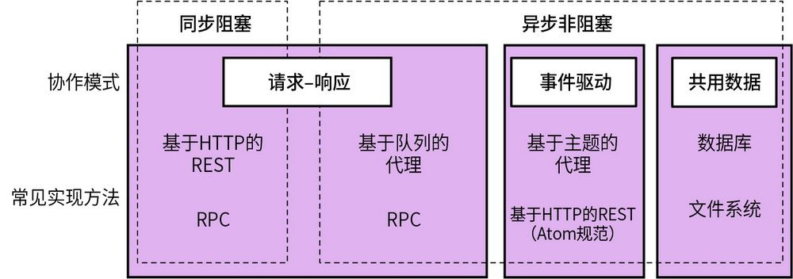

图4-1：微服务间不同的通信模式及实现技术

在更加详细地探讨该模型中的不同元素前，我想先简要描述下这些元素。

**同****步****阻****塞**

当微服务调用另一个微服务时，在等待响应期间暂停其他操作。

**异****步****非****阻****塞**

无论是否收到响应，发出请求的微服务会继续进行其他操作。

**请****求****-****响****应**

微服务向另一个微服务发送请求，要求完成某事，并期望收到告知该请求结果的响应。

**事****件****驱****动**

微服务发出事件，其他微服务消费这些事件并做出相应的反应。发出事件的微服务对其消费者（如果有的话）的使用无感知。

**共****用****数****据**

虽然不常被看作是一种通信方式，但是微服务可以基于一些可共同使用的数据源完成协作。

当使用这个模型来帮助团队找到正确的方法时，我花了很多时间了解团队的运行环境。团队在可靠通信、可接受的延迟和通信量方面的需求都会影响技术选型。但总的来说，我倾向于在给定情况下，首先确定是选择请求-响应的协作方式还是事件驱动的协作方式。如果考虑请求-响应的协作方式，那么使用同步实现还是异步实现，可以在下一步再去选择。但是，如果选择事件驱动的协作方式，我的实现选择将仅限于异步非阻塞。

在选择合适的技术时，我们还需要考虑许多其他因素，这些因素超出了通信模式的范围，例如，对低延迟通信的需求、与安全相关的要求或扩展能力。如果我们不考虑特定问题空间的需求（和约束），就很难做出合理的技术选择。在第5章中，我们将梳理并讨论各种技术选项以及相关问题。

**混****合****和****适****用**

值得注意的是，微服务架构中可以存在多种协作方式，这也是常态。一些交互场景使用请求-响应模式才有意义，而另一些交互场景使用事件驱动模式更加合理。事实上，单个微服务实现多种协作方式的情况非常常见。比如一个订单微服务，它公开了一个请求-响应的API，允许创建订单或更改订单，并在订单变更时触发事件。

现在，让我们深入地了解一下不同模式的通信方式。

### 4.4 同步阻塞模式

通过同步阻塞调用，微服务向下游进程（可能是另一个微服务）发起某个调用，并等待该调用完成，此时也意味着收到了响应。在图4-2中，订单处理器微服务向积分微服务发起了调用，通知其将一些积分添加到客户的账户中。

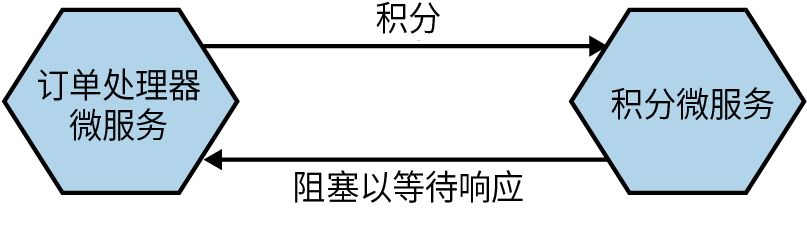

图4-2：订单处理器微服务向积分微服务发起同步调用、阻塞运行并等待响应

通常，同步阻塞调用会等待下游进程的响应，这可能是因为下一步的操作需要用到其结果，或者只是因为它要确保调用有效；如果没有成功，则会进行重试。因此，几乎每个同步阻塞调用都会形成一个请求-响应的配对。我们稍后会对此进行介绍。

#### 4.4.1 优点

对我们来说，同步阻塞调用简单，我们也很熟悉。我们中的许多人在学习编程时基本上采用的是同步编程方式——像阅读脚本一样阅读一段代码，每行代码依次执行，下一行代码等到轮到它时才会执行。在大多数情况下，进程间调用可能是以同步阻塞的方式完成的，例如，在数据库上运行SQL查询，或者向下游API发出HTTP请求。

当从“不那么”分布式的架构（例如单进程单体架构）向分布式架构改造时，坚持那些熟悉的理念是有道理的，特别是新环境中可能还有很多全新事物需要处理。

#### 4.4.2 缺点

同步调用的主要挑战是内在的时间耦合，我们在第2章中简要探讨过这个主题。在前面的示例中，当订单处理器微服务在调用积分微服务时，积分微服务需要可被访问才能使这个调用成功。如果积分微服务不可用，则调用将失败，且订单处理器微服务需要确定要执行什么样的补偿性操作——可能是立即重试、稍后重试或者完全放弃。

这种耦合是双向的。在这种集成方式下，响应通常使用相同的入站网络连接发送给上游微服务。因此，如果积分微服务想要将响应发回订单处理器微服务，但上游实例又宕机了，则响应会丢失。这里的时间耦合不仅仅存在于两个微服务之间，它还存在于这些微服务的两个特定实例之间。

由于调用的发起方被阻塞并等待下游微服务的响应，因此如果下游微服务响应速度缓慢，或者有网络延迟问题，那么调用的发起方将被阻塞，并长时间等待回复。如果积分微服务负载很大且对请求的响应速度很慢，这将会导致订单处理器微服务的响应也变慢。

因此，与使用异步调用相比，使用同步调用会使系统更容易受到下游故障引发的连锁问题所带来的影响。

#### 4.4.3 适用情况

就简单的微服务架构来说，使用同步阻塞调用是没问题的。而且对于许多人来讲，熟悉同步阻塞调用也是掌握分布式系统的加分项。

在我看来，当调用链变得过长时，此类调用就会出现问题。例如，图4-3给出了一个来自MusicCorp的流程示例，该流程用于检查付款是否存在潜在的欺诈问题。订单处理器微服务调用支付微服务来付款。支付微服务会调用防欺诈微服务来检查是否应该继续付款。而防欺诈微服务还需要从客户微服务获取信息。

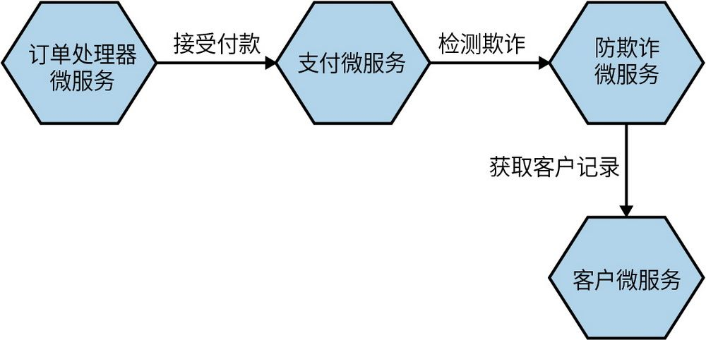

图4-3：在订单处理流程中检查是否存在潜在的欺诈行为

如果所有这些调用都是同步且阻塞的，那么可能会带来许多问题。涉及的4个微服务中的任何一个出现问题，或者它们之间的网络调用出现任何问题，都可能导致整个操作失败。此外，长调用链会占用大量计算资源。在其背后，订单处理器微服务可能打开了一个网络连接，等待支付微服务的回复。而支付微服务也会打开一个网络连接，等待防欺诈微服务的响应，以此类推。保持大量打开的网络连接可能会对正在运行的系统产生影响，比如可用连接不足或因此导致的网络拥塞加剧等问题。

为了改善这种情况，我们可以先重新检查微服务之间的交互方式。例如，我们将防欺诈微服务从主要的购买流程中移除，让它在后台运行，如图4-4所示。如果发现特定客户存在问题，它会更新相应的记录，在支付过程的前半段完成检查。实际上，这意味着需要执行一部分并行工作。通过缩短调用链的长度，我们可以改善操作的整体延迟，并且将某个微服务（防欺诈微服务）从购买流程的关键路径中移除，以减少关键操作的依赖。

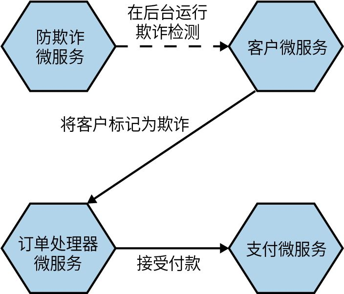

图4-4：将防欺诈微服务改为在后台运行可以减少对调用链过长的担忧

当然，我们也可以在不改变工作流程的情况下，用某种形式的非阻塞交互来替代阻塞调用，这是我们接下来要探索的方法。

### 4.5 异步非阻塞模式

在异步通信模式下，通过网络发送调用的行为不会阻塞微服务的运行，微服务能够继续进行其他工作而无须等待响应。异步非阻塞通信有多种形式，但这里将详细地探究微服务架构中最常见的3种。

**共****用****数****据****通****信**

上游微服务更改一些共用数据，这些数据随后被其他微服务使用。

**请****求****-****响****应**

一个微服务向另一个微服务发送一个请求，要求其完成某项任务。当操作完成时，无论成功与否，上游微服务都会收到响应。具体来说，上游微服务的任何实例都应该能够处理响应。

**事****件****驱****动****的****交****互**

微服务广播一个事件，可以将其视为对已发生事件的事实陈述。其他微服务可以监听感兴趣的事件并做出相应的处理。

#### 4.5.1 优点

采用异步非阻塞通信后，发起调用的微服务和被调用的微服务（可以是多个微服务）可以在时间上是解耦的。被调用的微服务不需要在此时立刻接收调用。这意味着我们避免了在第2章中讨论过的时间耦合问题（见第2章中的“关于时间耦合的简要说明”）。

当所调用的功能处理时间较长时，这种通信方式也很有用。让我们回到MusicCorp示例中的发货流程。在图4-5中，订单处理器微服务已经接受付款并准备发货，因此它向仓库微服务发送了一个调用。查找CD、从货架上取下、打包并邮寄的过程可能需要几个小时，甚至数天，所需时间取决于实际发货工作的流程。因此，订单处理器微服务向仓库微服务发起一次异步非阻塞调用是合理的。这样，仓库微服务可以稍后通过回调来通知订单处理器微服务订单处理的进度。这是一种异步请求-响应通信的形式。

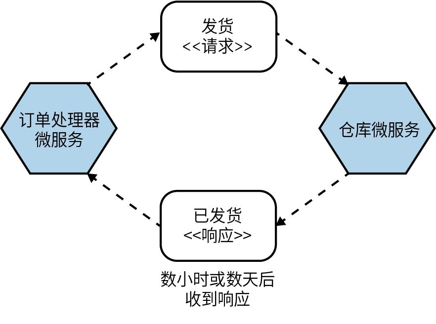

图4-5：订单处理器微服务发起打包和发货的流程，该流程以异步方式完成

如果我们使用同步阻塞调用来做类似的事情，就需要重新实现订单处理器微服务和仓库微服务之间的交互方式。这需要订单处理器微服务打开连接、发送请求，阻塞发起调用的线程中的其他操作，然后等待数小时或数天后的响应。显然，这种方式是不可行的。

#### 4.5.2 缺点

相对于同步阻塞通信，异步非阻塞通信的主要缺点是其复杂度和选择范围问题。正如概述所提到的，有不同的异步通信方式可以选择，但哪种方式适合你呢？一旦你准备深入研究不同通信方式是如何实现的，你首先要面对的就是一系列令人眼花缭乱的技术。

如果你无法真正理解异步通信的底层机制，那么采用之初就是一项挑战。我们接下来会详细探讨多种异步通信方式，你马上就会意识到，虽然它们各有吸引你的地方，但也会带来不少麻烦。

**a****s****y****n****c****/****a****w****a****i****t****和****异****步****仍****阻****塞**

与计算的许多其他领域一样，我们可以在不同的上下文中使用相同的术语来表达非常不同的含义。一种似乎特别流行的编程风格是，使用如async/await之类的结构来处理潜在的异步数据源，这实际采用的仍然是同步阻塞模式。

示例4-1是一个非常简单的JavaScript示例。货币汇率在一天中频繁波动，我们通过消息代理接收这些信息。由此我们定义了一个Promise。Promise一般是指在未来某个时间点可以解析为某个状态的东西。在这个示例中，eurToGbp最终将被解析为欧元兑英镑的汇率。

**示****例****4****-****1** 以同步阻塞方式处理潜在异步调用的示例

async function f() {

let eurToGbp = new Promise((resolve, reject) => {

// 获取欧元兑英镑最新汇率的代码

...

});

var latestRate = await eurToGbp; ➊

process(latestRate); ➋

}

❶等待直到获得最新的欧元兑英镑汇率。

❷ Promise被满足后才会执行。

当用await引用eurToGbp时会阻塞，直到获取到latestRate的状态；在获取到的eurToGbp的状态被解析之前，process函数是不会运行的。
	 

尽管汇率是以异步方式获取的，但在这种情况下使用await意味着会一直阻塞，直到获取到latestRate的状态。因此，即使用来获取汇率的底层技术在本质上可以被认为是异步的（例如，等待返回汇率）。但从代码层面来看，这本质上还是一种同步阻塞的交互。

#### 4.5.3 适用情况

在考虑异步通信是否适合时，需要同时考虑拟选异步通信的类型和其优缺点。在特定场景下，我通常会选择某种特定形式的异步通信，比如图4-5所探讨的长时间运行的进程。此外，如果调用链较长且无法轻易重组，异步通信可能是一个不错的选择。接下来，我们将更深入地探讨3种常见的异步通信形式——共用数据模式、请求-响应模式和事件驱动模式。

### 4.6 共用数据模式

共用数据模式是一种跨技术实现的通信方式。该模式的核心是，在一个微服务中将数据放置在约定好的位置，然后另一个（或多个）微服务会去使用这些数据。这种方式可能很简单，例如一个微服务只需将文件放在某个位置，另一个微服务稍后会获取该文件并对其进行处理。这种集成方式本质上是异步的。

图4-6是这种模式的一个例子，其中产品导入微服务创建了一个文件，然后下游的库存微服务和专辑目录微服务将读取该文件。

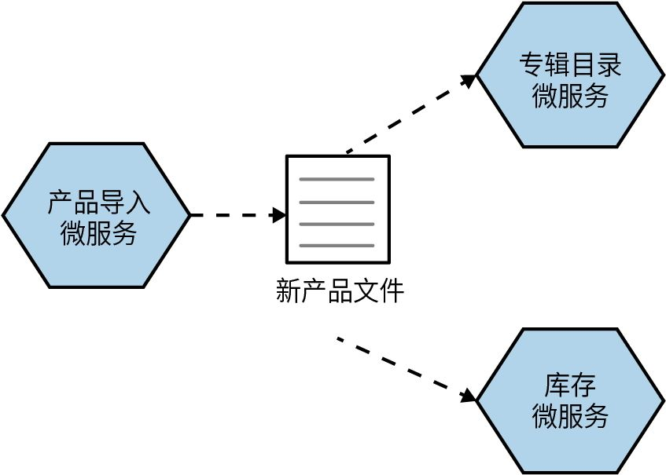

图4-6：一个微服务输出一个其他微服务会使用的文件

这种模式是你会遇见的最常见的通用进程间通信模式，但有时你可能根本没有意识到它是一种通信模式。我认为这主要是因为进程之间的通信往往是间接的，很难被注意到。

#### 4.6.1 实现

实现这种模式需要某种数据的持久化存储机制。在大多数情况下，一个文件系统可能就已经足够了。我曾经构建过很多系统，它们只需要定期扫描文件系统，观察新文件并对其进行处理。当然，你也可以使用某种强大的分布式内存存储机制。但需要注意的是，任何需要处理这些数据的下游微服务都需要自己的机制来检测新数据的可用性——轮询是解决这个问题的常见方案。

这种模式的两个常见例子是数据湖和数据仓库。这两种场景的解决方案通常是为了处理大量数据而设计的，但可以说，两者的耦合程度处在耦合度光谱的两端（数据湖为松耦合，数据仓库为紧耦合）。使用数据湖方案时，数据源可以以它们认为合适的任何格式上传原始数据，而下游消费者需要知道如何处理这些原始数据。对于数据仓库，它本身就是一个结构化的数据存储。将数据推送到数据仓库的微服务需要知道数据仓库的数据结构——如果这种结构以向后不兼容的方式发生了变化，那么数据生产者也需要进行更新。

在采用数据仓库和数据湖的情况下，可以假设信息流是单向的。一个微服务将数据发布到共用数据存储中，下游消费者读取该数据并执行相关操作。这种单向流动可以更容易地推导信息流，但是一个有问题的实现方法是使用共享数据库——在该数据库中，多个微服务读取和写入同一个数据存储。我们在第2章探讨公共耦合时讨论了这个例子。图4-7展示了订单处理器微服务和仓库微服务更新同一数据库记录的情况。

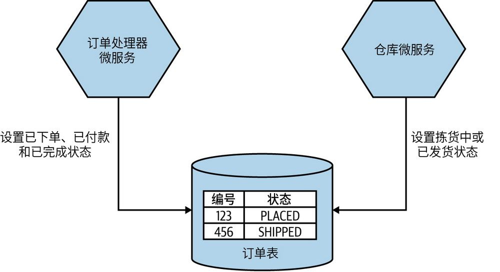

图4-7：公共耦合的示例：订单处理器微服务和仓库微服务都在更新同一订单记录

#### 4.6.2 优点

只需要使用常用技术，这种模式可以很容易实现。只要能够读取或写入文件或数据库，就可以采用这种模式。如果使用流行且广为人知的技术，还可以实现不同类型系统间的互操作，包括旧的大型机应用程序或可定制商用软件（customizable off the shelf software，COTS）。在这种情况下，数据量也不成问题；如果需要一次性发送大量数据，这种模式也可以很好地工作。

#### 4.6.3 缺点

下游的消费者微服务通常会通过某种轮询或周期性触发的定时作业来检测新数据并进行处理。这意味着在低延迟要求的场景下，这种机制的可用性较低。当然，这种模式也可以与其他类型的调用结合使用，通知下游微服务有新数据可用。例如，你可以将文件写入共享文件系统，然后向感兴趣的微服务发起一个调用，通知它可能需要处理新数据。这可以缩短数据发布和数据处理之间的时间间隔。不过，如果将这种模式用于有大量数据的场景中，那么低延迟要求的优先级一般不会很高。但是，如果你确实需要发送大量数据并希望进行“实时”处理，那么使用像Kafka这样的流技术会更合适。

如果你还记得在图4-7中对公共耦合的讨论，那么另一个缺点就会相当明显，即共用数据存储会成为潜在的耦合因素。如果该数据存储以某种方式改变了结构，它可能会破坏微服务之间的通信。

通信的可靠性也取决于底层数据存储的可靠性。严格来说，这不是一个缺点，但需要关注。例如，在文件系统上删除文件时，你可能需要确保文件系统本身不会以奇怪的方式出现故障。

#### 4.6.4 适用情况

这种模式的强大之处在于，即使可能受到技术限制，它依旧能够实现进程之间的互操作性。从微服务的角度来看，让现有系统与微服务的GRPC接口交互或订阅其Kafka主题可能更方便，但从消费者的角度来看并非如此。旧的系统可能存在技术限制和更改成本高昂的问题。此外，即使是旧的大型机系统也应该可以从文件中读取数据。当然，这完全取决于采用的数据存储技术是否被广泛支持。虽然可以使用Redis缓存等方式实现这种模式，但是你的旧的大型机系统能否与Redis通信呢？

这种模式的另一个主要优势是能够共享大量数据。如果你需要将数千兆字节的文件发送到文件系统，或将数百万行记录加载到数据库中，那么这种模式就是一个不错的选择。

### 4.7 请求-响应模式

通过请求-响应模式，微服务会向下游服务发送请求，要求其执行某些操作，并给予带有请求结果的响应。这种交互可以通过同步阻塞调用来进行，也可以采用异步非阻塞方式来实现。图4-8展示了这种交互的一个简单示例。在此示例中，排行榜微服务会汇总不同流派的畅销CD，并向库存微服务发送请求，以查询CD当前的库存情况。

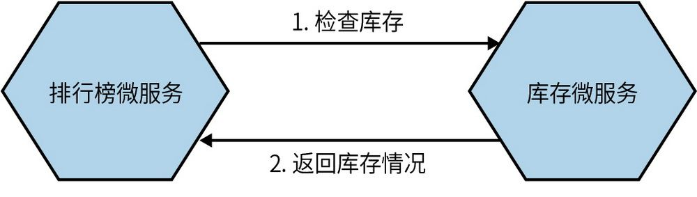

图4-8：排行榜微服务向库存微服务发送请求，查询库存情况

像这样从其他微服务中检索数据是请求-响应模式的常见用例。但有时，你只需要确保任务完成。在图4-9中，仓库微服务收到了来自订单处理器微服务的请求，要求保留库存。

订单处理器微服务只需要知道库存已成功预留，就可以接受付款。如果无法预留库存（比如商品暂停销售），则取消付款。类似这种需要按照特定顺序完成调用的情况，时常会采用请求-响应模式。

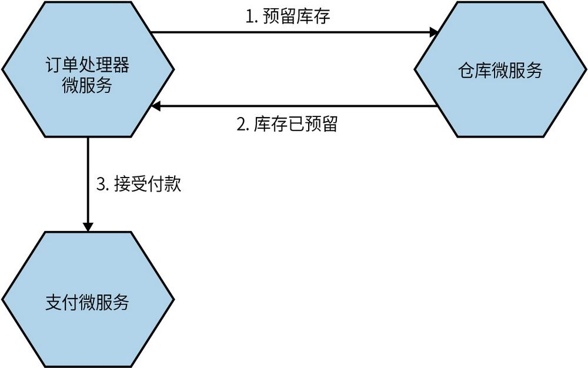

图4-9：订单处理器微服务需要确保在付款前预留了库存

**命****令****与****请****求**

在异步请求-响应通信的上下文中，我听到有些人将“发送请求”称为“发送命令”。“命令”与“请求”的意图可以说是相同的——即上游微服务要求下游微服务执行某项任务。

然而，就个人而言，我倾向使用“请求”一词。命令意味着必须遵守，有强制执行的意思，而请求是可以被拒绝的。微服务有权根据其内部逻辑审查每个请求的价值，并决定是否响应该请求。如果请求违反了内部逻辑，则可以拒绝它。尽管这只是一个细微的区别，但个人觉得“命令”一词无法传达相同的含义。

我会坚持使用“请求”而不是“命令”，但无论使用哪个术语，你只需记住微服务可以在适当的时候拒绝请求或命令。

#### 4.7.1 实现：同步与异步

请求-响应模式可以通过同步阻塞或异步非阻塞的方式实现。同步调用通常会打开网络连接与下游微服务通信，并通过该网络连接发送请求。当上游微服务等待下游微服务响应时，该网络连接保持开启状态。在这种情况下，发送响应的微服务并不需要了解发送请求的微服务，它只需要通过入站网络连接发送响应信息。如果上游或下游微服务实例中止导致连接中断，我们可能会遇到麻烦。

而使用异步方式实现请求-响应模式，情况会比较复杂。让我们重新看一下和预留库存有关的具体流程。在图4-10中，预留库存的请求作为消息通过某种消息代理发送（本章稍后会探讨消息代理）。这条消息不会从订单处理器微服务直接发送到库存微服务，而是会被存放在队列中。当可用时，库存微服务会获取此队列中的消息。它读取请求，执行与预留库存相关的工作，然后将响应发送回订单处理器微服务正在读取的队列。库存微服务需要知道将响应路由到何处。在这个示例中，它通过另一个队列将此响应发回，而该队列会被订单处理器微服务读取。

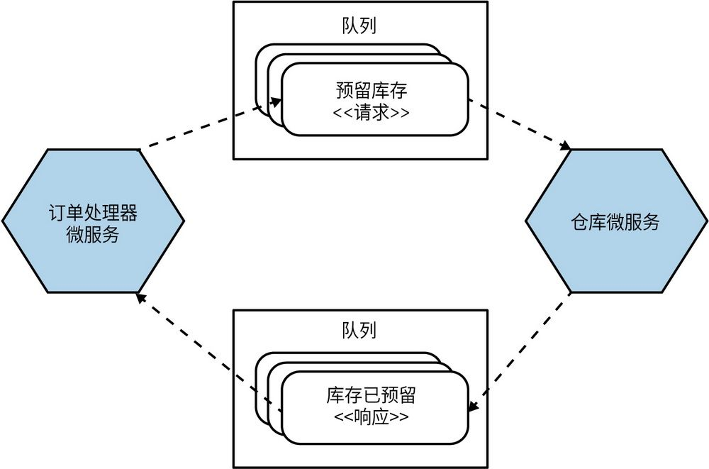

图4-10：使用队列发送预留库存的请求

因此，在异步非阻塞实现方式中，接收请求的微服务需要知道如何路由响应，或者被告知响应应该发回到哪里。使用队列还会带来一个额外的好处，即多个请求可以在队列中缓冲等待处理。这在请求无法被迅速处理的时候会很有帮助。微服务可以在准备好后接收下一个请求，而不会被过多的调用淹没。当然，这在很大程度上需要依赖于接收请求的队列中间件。

当微服务以这种方式获取响应时，需要将响应与请求关联起来。这通常具有一定的挑战性。一方面时间可能比较久了，另一方面根据所使用的协议的性质，响应不一定会返回给发送请求的同一微服务实例。在下单的同时强制预留库存的示例中，我们需要知道如何将预留库存的响应与原订单关联起来，这样才能继续处理该订单。处理这个问题的一种简单方法是，将与原始请求相关联的任何状态都存储到数据库中，这样当响应到达时，接收响应的微服务实例可以重新加载任何相关状态并做出相应的操作。

最后需要注意的一点是，所有形式的请求-响应交互都可能需要某种形式的超时处理，以避免系统因等待可能永远不会发生的事情而被阻塞。超时处理的实现方式可能因具体实现技术而异，但一定要实现。第12章将更详细地讨论超时处理。

**并****行****调****用****和****顺****序****调****用**

在处理请求-响应交互时，我们经常需要进行多次调用才能继续执行某些任务。

例如，MusicCorp需要通过发出API调用来从3个不同供应商那里查询同一商品的价格。我们希望在获得3个供应商的价格后再决定从哪个供应商订购新库存。我们可以按顺序完成3个调用，等待每个调用完成后再进行下一个。在这种情况下，等待时间为每个调用的总耗时。如果对每个供应商的API调用需要一秒钟，那么总共需要等待3秒钟，我们才能决定应该向谁订购。

一个更好的方式是并行运行这3个请求。这样操作的整体耗时将取决于最慢的那个API调用，而不是每个API调用的总耗时。

Reactive扩展和async/await等机制在并行调用方面非常有用，可以显著降低某些操作的耗时。

#### 4.7.2 适用情况

请求-响应模式非常适合两种情况：一种是后续工作依赖于当前的请求结果；另一种是微服务想知道调用是否成功的情况（如果调用失败可以执行某种补偿操作，比如重试）。如果符合以上任何一种情况，那么请求-响应模式是个好办法。剩下的唯一问题就是确定使用同步方式还是异步方式实现，这需要进行权衡。我们曾在前面的内容中讨论过。

### 4.8 事件驱动模式

与请求-响应模式相比，事件驱动模式看起来很奇特。与要求其他微服务执行某项任务不同，微服务是要发出事件，这些事件可能会也可能不会被其他微服务接收到。实际上，事件本质上是一种异步交互，因为事件监听器将在其自己的线程上运行。

事件是关于已发生事件的描述，主要是指发出事件的微服务所发生的事情。发出事件的微服务并不知道其他微服务使用该事件的意图，实际上它甚至可能不知道其他微服务的存在。它在需要时发出事件，这就是它的全部职责。

在图4-11中，仓库微服务发送出与订单打包过程相关的事件。这些事件会由通知微服务和库存微服务接收，它们会分别做出相应的处理。通知微服务会发送一封电子邮件，为客户更新订单状态，而库存微服务可以在商品放入客户订单中时更新库存情况。

仓库微服务只是广播事件，并假定感兴趣的相关方会自行做出相应的处理。它不知道事件的接收者是谁，这使得事件驱动的交互通常更加松散。和请求-响应模式相比，我们需要多花一些时间才能理解职责的倒置。在请求-响应模式中，我们希望仓库微服务告知通知微服务在适当的时间发送电子邮件。在这种模式中，仓库微服务有责任知道哪些事件需要通知哪些客户。而在事件驱动的交互方式中，这一责任被推给了通知微服务。

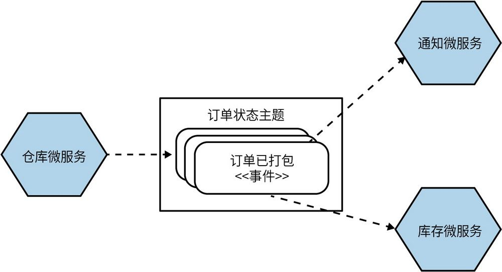

图4-11：仓库微服务发出下游微服务订阅的事件

采用事件可以被视为采用请求的反面。事件发布方将“要做什么”交给接收方来决定。通过请求-响应模式，发送请求的微服务知道应该做什么，并告诉其他微服务它认为下一步应该做什么。这说明在请求-响应模式中，请求者必须知道下游接收者的能力，这就意味着更大程度的耦合。而在事件驱动的协作中，事件发布方不需要知道下游微服务的能力，实际上甚至可能都不知道它们的存在，因此耦合度大大降低。

在事件驱动的交互中所看到的职责分配方式可以反映出组织在试图构建更多的自治团队。我们不想把所有的职责都集中在一起，而是希望将职责分配给团队本身，让团队以更自主的方式运作。第15章将再次讨论这一概念。在这个例子中，我们将职责从仓库微服务转移给了通知微服务和库存微服务，这有助于降低仓库微服务等微服务的复杂性，实现更均匀分布的“智能化”系统。我们在第6章中比较协同和编排时，将更详细地探讨这一想法。

**事****件****和****消****息**

有时，“消息”和“事件”这两个术语会让人混淆。一个事件是一个事实，一个关于已经发生事情的陈述，以及一些相关的信息。而消息一般是通过异步通信机制（比如消息代理）发送的东西。

在事件驱动的协作中，如果需要广播事件，实现这一广播机制的典型方法是将事件放入消息中。消息是媒介，事件是有效负载。

同样，我们也可能需要将请求作为消息的有效负载发送，在这种情况下，我们要实现的是一种异步形式的请求-响应交互。

#### 4.8.1 实现

在实现事件驱动模式时，我们需要考虑两个主要问题：微服务发出事件的方式和消费者发现事件的方式。

传统上，类似RabbitMQ这样的消息代理可以解决这两个问题。生产者可以使用API将事件发布到代理中，代理会处理订阅，使得消费者可以在事件到达时获得通知。这些代理甚至可以处理消费者的状态，例如帮助消费者追踪之前看过的消息。这些系统通常可伸缩并具备弹性，但这并非没有代价。它可能会增加开发过程的复杂度，因为它是开发和测试微服务时额外需要运行的系统。此外，还可能需要额外的服务器和专业知识来维护这一基础设施的正常运行。但是，一旦实现，它将是一种非常有效的实现松耦合、事件驱动架构的方法。总的来说，我赞成使用这种方法。

不过，请注意，在中间件的世界里，消息代理只是其中的一个组成部分。队列本身就是非常合理且有用的。但是，供应商往往希望将大量的软件和它绑定在一起，这可能会导致中间件包含了越来越多的“智能”，例如企业服务总线等系统。你要明白的是，要让中间件保持简洁，而让微服务保持“智能”。

另一种方式是使用HTTP作为传播事件的方式。Atom是一个符合REST定义的规范，它定义了发布资源摘要的语义规范（以及其他规范）。有许多客户端库可用于创建和使用这些摘要。因此，当客户微服务发生变化时，可以将事件发布到此类摘要服务中。消费者只需轮询摘要、查询变化。如果复用现有的Atom规范和任一相关的库会很有用，还可以利用HTTP所具有的良好的可伸缩性。不过，这种使用HTTP的方式并不适用于低延迟的场景（有些消息代理更胜任），而且我们仍然要面对这样一个事实——消费者需要追踪他们看到过的消息并管理自己的轮询计划。

我看到有人花了很多时间为Atom实现更多的功能，以使它应用于更多的场景，但许多这类功能在某些消息代理中是可以开箱即用的。例如，**竞****争****消****费****者****模****式**（competing consumer pattern）描述了一种方法——可以让多个服务实例来竞争获取消息的方法，这非常适用于需要通过增加服务实例数量来处理独立作业列表的情形（第5章会详细讨论）。但是，需要避免两个及以上服务实例收到相同的消息，因为这很可能会导致重复执行相同的任务。使用消息代理时，标准队列就可以解决这个问题。如果仅使用Atom，就需要管理所有服务实例之间的共享状态以避免重复执行。

如果你已经有一个良好且具有弹性的消息代理，可以考虑用它来处理事件的发布和订阅。如果你还没有，可以考虑Atom，但要注意沉没成本谬误。如果你发现自己越来越需要消息代理来提供支持，那么在某个时刻，你就需要改变方法了。

就通过异步协议发送的内容而言，需要我们考虑的因素与同步通信方式一样。如果你目前使用JSON对请求和响应进行编码并对此感到满意的话，那就继续使用。

#### 4.8.2 事件

在图4-12中，客户微服务正在广播一个事件，通知相关方有新客户在系统中注册成功。两个下游微服务——积分微服务和通知微服务——都关注了这个事件。积分微服务为新客户开设了一个账户来作为该事件的响应，这样客户就可以开始赚取积分，而通知微服务则向新客户发送了一封电子邮件，欢迎他们开始享受MusicCorp提供的奇妙乐趣。

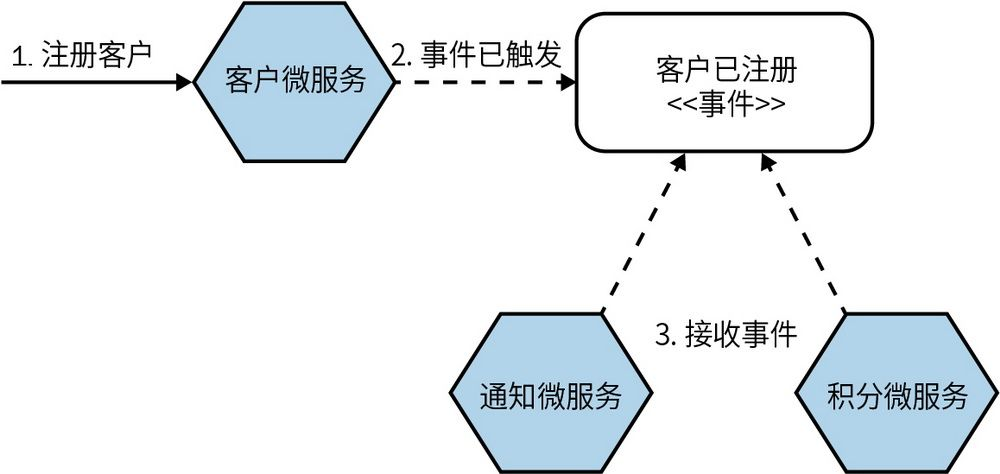

图4-12：在新客户注册时，通知微服务和积分微服务会收到一个事件

通过请求，我们可以要求微服务执行某些操作，并同时提供执行请求的操作所需的信息。而事件则被用来广播一个其他方可能感兴趣的事实，但由于发出事件的微服务不能且不应该知道谁会接收该事件，我们如何才能知道其他方可能需要从该事件中获得什么样的信息呢？事件究竟应该包含什么呢？

**0****1****.****只****有****I****D**

一种方法是让事件只包含新注册客户的标识符，如图4-13所示。积分微服务只需要这个标识符来创建对应的会员账户，所以它获得了所需的全部信息。尽管通知微服务知道收到此类事件时要发送一封欢迎电子邮件，但它还需要额外的信息来完成这个工作，例如客户的姓名和至少一个电子邮件地址，以便生成更加个性化的电子邮件。由于通知微服务无法从接收到的事件中获取这些信息，因此它只能从客户微服务中获取这些信息，如图4-13所示。

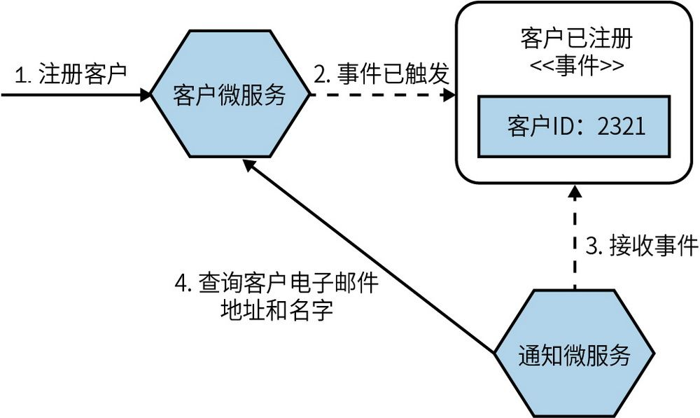

图4-13：通知微服务需要向客户微服务请求没有包含在事件中的详细信息

这种方法存在一些缺点。首先，通知微服务现在必须知道客户微服务，这增加了额外的领域耦合。正如第2章所讨论的，虽然领域耦合在耦合光谱图中处于较松散的一端，但仍需要尽可能避免。如果接收到的事件中包含通知微服务所需的所有信息，则无须再次调用查询。由接收微服务发出回调也可能暴露另一个主要缺点，即在有大量接收微服务的情况下，发出事件的微服务可能会收到一连串的请求。想象一下，如果有5个不同的微服务都接收到了相同的创建客户的事件，并且都需要请求额外的信息，它们就都会立即向客户微服务发送请求以获取所需的信息。随着对特定事件感兴趣的微服务数量的增加，这些调用的影响可能会越来越大。

**0****2****.****完****整****的****事****件**

我更喜欢的另一种方法是，将所有通过API共享的内容放入一个事件中。如果通知微服务需要客户的电子邮件地址和姓名，为什么不将这些信息直接放在事件中呢？在图4-14中，我们可以看到这种方法，通知微服务现在更加自主，无须与客户微服务通信即可完成其工作。事实上，它可能永远不需要知道客户微服务的存在。

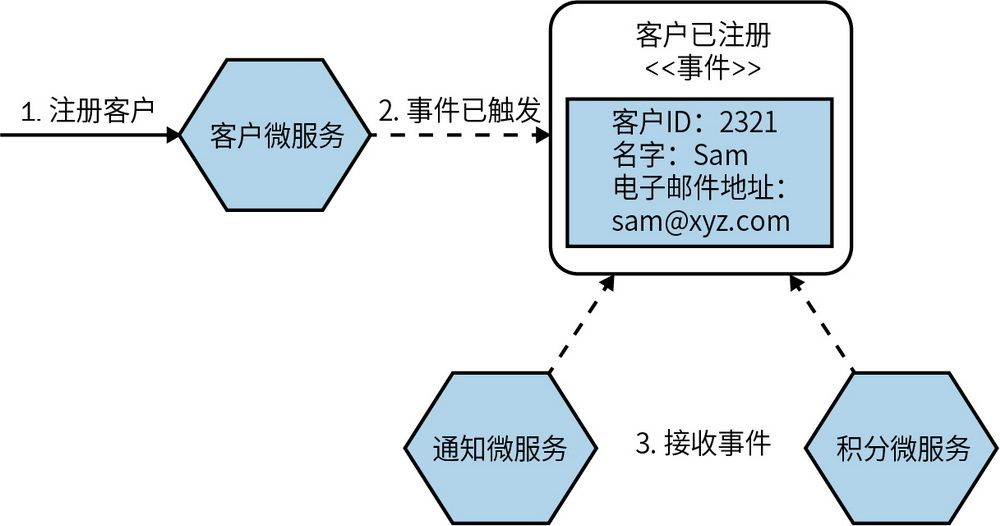

图4-14：包含更多信息的事件可以让接收方直接执行任务，而无须再次调用事件源

具有更多信息的事件除了可以实现更松散的耦合，还可以兼作特定实体状态变化事件的历史记录。这有助于实现审计系统，或者，甚至提供在特定时间点重建实体的能力。这意味着这些事件可以作为事件溯源（我们稍后将会探讨这一概念）的一部分。

虽然我更喜欢这种方法，但它也有缺点。首先，如果与事件关联的数据量很大，我们可能会担心事件的大小。现代的消息代理（假设使用它来实现事件广播机制）对消息大小有相当大的限制。Kafka中消息大小的默认上限为1 MB，而最新版本的RabbitMQ对单个消息的理论上限为512 MB（低于之前的2 GB）。尽管可以想象到，像这样的大消息会导致一些性能问题，但即使Kafka中消息大小的上限是1 MB，也提供了相当多可发送数据的空间。最终，如果你开始担心事件规模过大，那么我建议考虑混用，将其中一些信息放在事件里，但其他（较大的）数据可以在需要时再去查找。

在图4-14中，积分微服务不需要知道客户的电子邮件地址或姓名，但它仍然可以通过事件获取到这些数据。限制微服务可以查看的数据类型可能会引发担忧，例如我们可能想限制一些微服务看到个人身份信息（或PII）、支付卡详细信息或类似的敏感信息。解决这个问题的一种方法是发送两种不同类型的事件：一种包含PII且仅可以被某些微服务看到，另一种不包含PII且可以被广泛地广播。这在“管理不同事件的可见性和确保两个事件都被实际触发”两个方面都增加了复杂性。如果微服务发送了第一种类型的事件，但在发送第二种类型的事件前崩溃的话，会发生什么呢？

另一个需要考虑的因素是，一旦将数据放入事件中，它就会成为与外部签订的契约的一部分。我们必须意识到，如果在事件中删除某个字段，就可能会影响外部各方的使用。信息隐藏仍然是事件驱动协作中的一个重要概念——放到事件中的数据越多，外部各方对该事件的假设就越多。我采用的一般准则是，如果我愿意通过请求-响应API共享相同的数据，那么就可以将这些信息放入事件中。

#### 4.8.3 适用情况

事件驱动的协作方式在需要广播信息的情况下非常有用；另外，如果你愿意不走寻常路，也不妨一试。不要告诉下游微服务该做什么，而让它们自行决定，这种方式具有很大的吸引力。

显而易见，在更注重松散耦合（而非其他因素）的情况下，我们更倾向于选择事件驱动的协作。

但需要注意的是，这种方式通常会引入新的复杂性因素，尤其是在你接触它的机会不多、经验有限的情况下。如果你不确定这种通信模式是否适用，别忘了微服务架构可以（而且很可能会）包含不同模式的交互方式。你不必一心想着采用事件驱动的协作，也许可以先从一个事件开始，然后逐步深入。

就个人而言，我倾向于将事件驱动的协作当作一种默认的选择。我的大脑似乎已经以某种方式进行了重构——采用这种通信方式对我来说显得理所当然。对你来说，这可能帮不上什么忙，因为很难解释其中的原因，只能说感觉上是对的。但这只是我自己的固有见解——我自然而然地会倾向于我所知道的，并基于自己的经验进行选择。这种交互形式对我的吸引力，几乎完全来自之前在过度耦合系统中的糟糕经验。我可能只是一个将军，一次又一次地打着最后一场战斗，而从没有考虑过这一次也许真的和以往不同了。

我想说的是，抛开个人偏好，确实有越来越多的团队正在使用事件驱动的交互方式来取代请求-响应的交互方式。

### 4.9 谨慎行事

异步编程看起来很有趣，对吗？事件驱动的架构似乎对实现更为松散、可扩展的系统意义非凡。它们的确能够发挥这些优点，但是这些通信模式也会增加复杂性。复杂性不光源于管理发布和订阅消息，还包括其他可能面临的问题。例如，在处理长时间运行的异步请求-响应时，我们必须考虑响应返回时的处理方式。它是否需要返回到发起请求的节点？如果是，那么要是该节点关闭会发生什么？如果不是，是否需要在某处存储信息以便后续做出相应的反应？如果已经具备良好的API，处理短时间的异步操作可能更加容易，但即便如此，对于习惯于进程内同步调用的程序员来说，依然需要一种不同的思维方式。

现在是时候说一个让人引以为戒的故事了。早在2006年，我正在为一家银行构建一个定价系统。我们会查询市场事件并确定投资组合中的哪些项目需要重新定价。一旦确定了要处理的事项清单，我们就会把它们放入一个消息队列中。我们使用网格计算创建了定价服务实例池，从而可以按需扩大和缩小定价服务的实例数量。这些实例使用竞争消费者模式，每个实例都尽可能快地获取消息，直到没有待处理的消息为止。

系统开始启动并运行了，我们感到相当得意。然而有一天，就在推出一个新版本之后，我们遇到了一个严重问题：服务实例接连不断地崩溃。

最终，我们找到了问题所在——代码中存在一个隐藏的bug，即某种类型的定价请求会让服务实例崩溃。当时我们使用了事务处理队列来处理请求：当服务实例崩溃时，它对请求的锁定会超时，这个定价请求会被放回队列中；这样的设计导致另一个服务实例会接着处理它，然后接着崩溃。这就是Martin Fowler所称的“灾难性故障转移”的典型示例。

除了代码中的bug，还有一个问题就是我们没有为队列中的作业设置最大重试次数。所以我们在修复这个bug的同时也设置了最大重试次数。同时我们也意识到，需要一种方法来查看甚至重发这些有问题的消息。最终，我们不得不实现了一个消息诊所（或称“死信队列”）；如果消息失败，消息就会被发送到这里。我们还创建了一个UI，用于显示这些消息，并在需要时触发一个重试。如果你只熟悉点到点的同步通信，就会难以快速发现这类问题。

与事件驱动架构和异步编程相关的复杂性时刻提醒我，一旦准备采用这些方法就应该更加谨慎。你要确保有良好的监控机制，并考虑使用关联ID。它可以帮助你对跨进程边界的请求进行追踪，第10章会做出详细介绍。

我还强烈推荐你阅读Gregor Hohpe和Bobby Woolf所著的《企业集成模式：设计、构建及部署消息传递解决方案》
	 ，因为它包含了更多可能需要考虑的有关不同消息传递模式的详细信息。

然而，我们也必须坦诚地对待那些可能被认为是“更简单”的集成模式——与确认调用是否成功有关的问题不仅局限于异步形式的通信。同步阻塞调用也会有相似的问题，例如调用超时是因为请求丢失导致了下游方没有收到，还是请求成功传递但响应丢失了？在这种情况下该怎么做？如果重试，但原始请求已经成功传递，那又该怎么办呢？（是的，这就是幂等的用武之地，第12章将会讨论这个主题。）

可以说，在故障处理方面，同步阻塞调用在判断事情是否发生时同样会带来让人头疼的问题，只是我们可能对这些问题更加熟悉而已！

### 4.10 小结

本章分析了一些主要的微服务通信模式，并对各种利弊权衡做了讨论。这意味着正确的选择并非唯一的，但我希望本章中有关同步调用和异步调用、事件驱动、请求-响应通信模式的信息已足够详尽，能够帮助你在给定的上下文中做出正确的决策。我个人偏向于异步、事件驱动的协作，这不仅仅与个人经验有关，也与我对耦合的厌恶有关。但这种通信模式也有不可忽视的复杂性，且每个人面对的情况独一无二。

本章简要提到了一些可用于实现这些交互模式的具体技术。接下来，我们将进入本书的第二部分——实现。在第5章中，我们将深入地探讨如何实现微服务通信。
