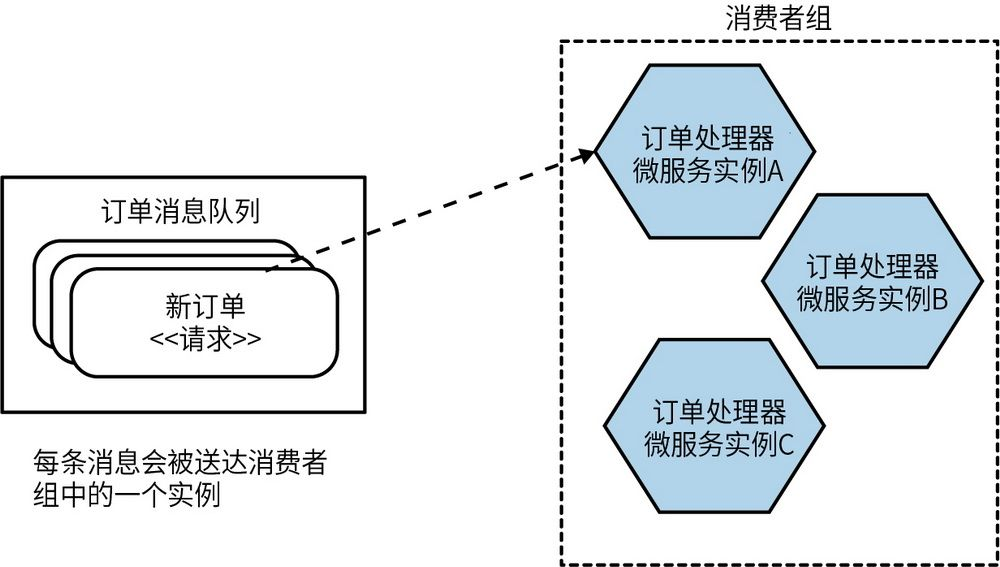
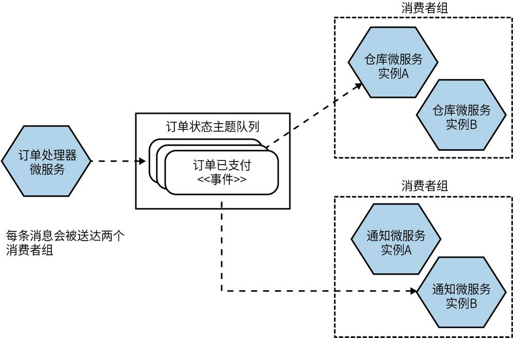
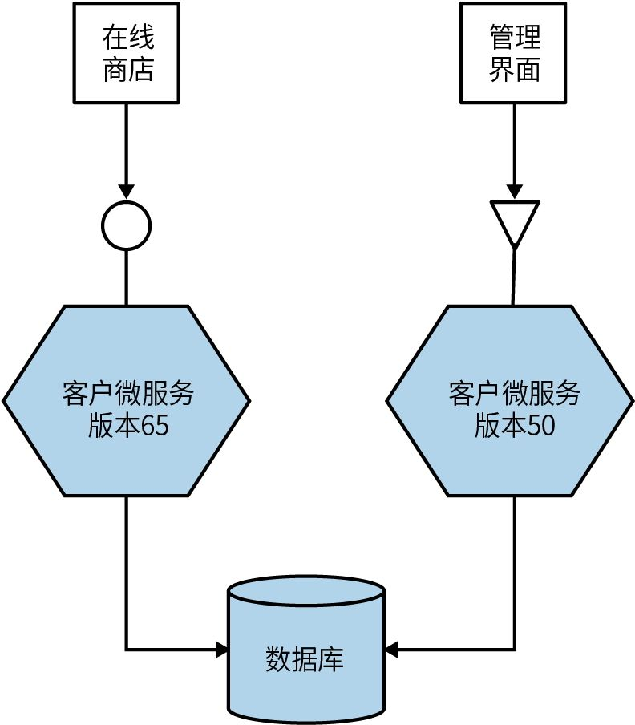
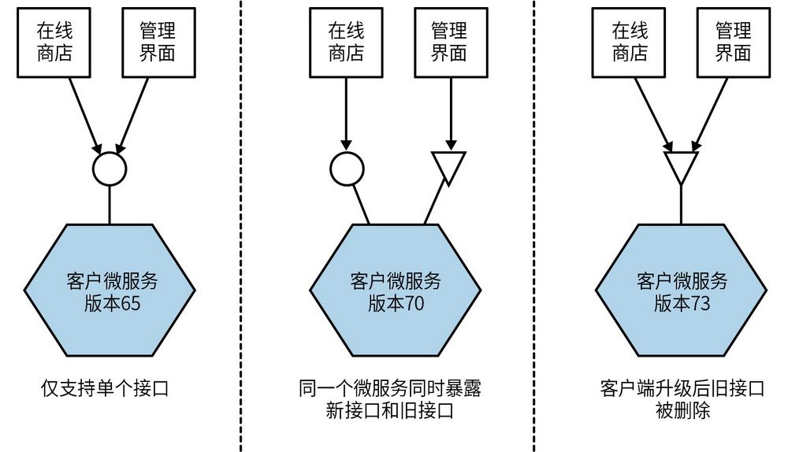
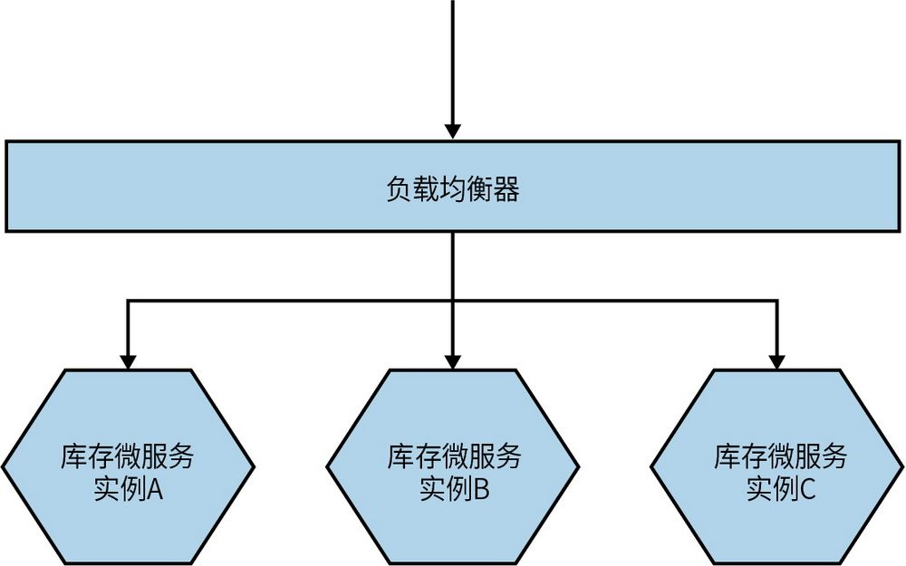
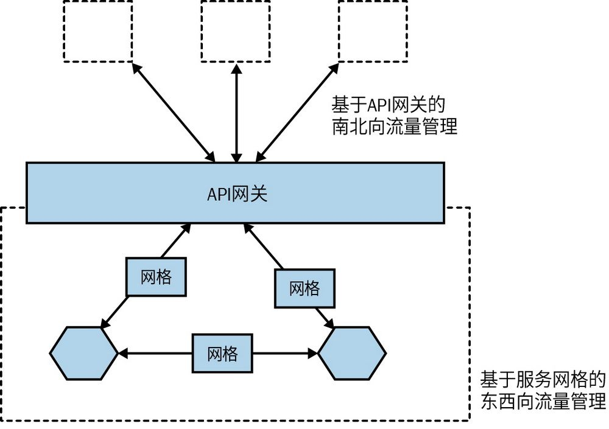
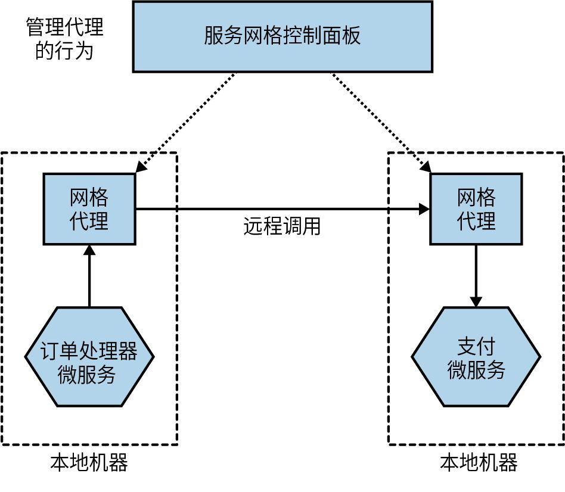
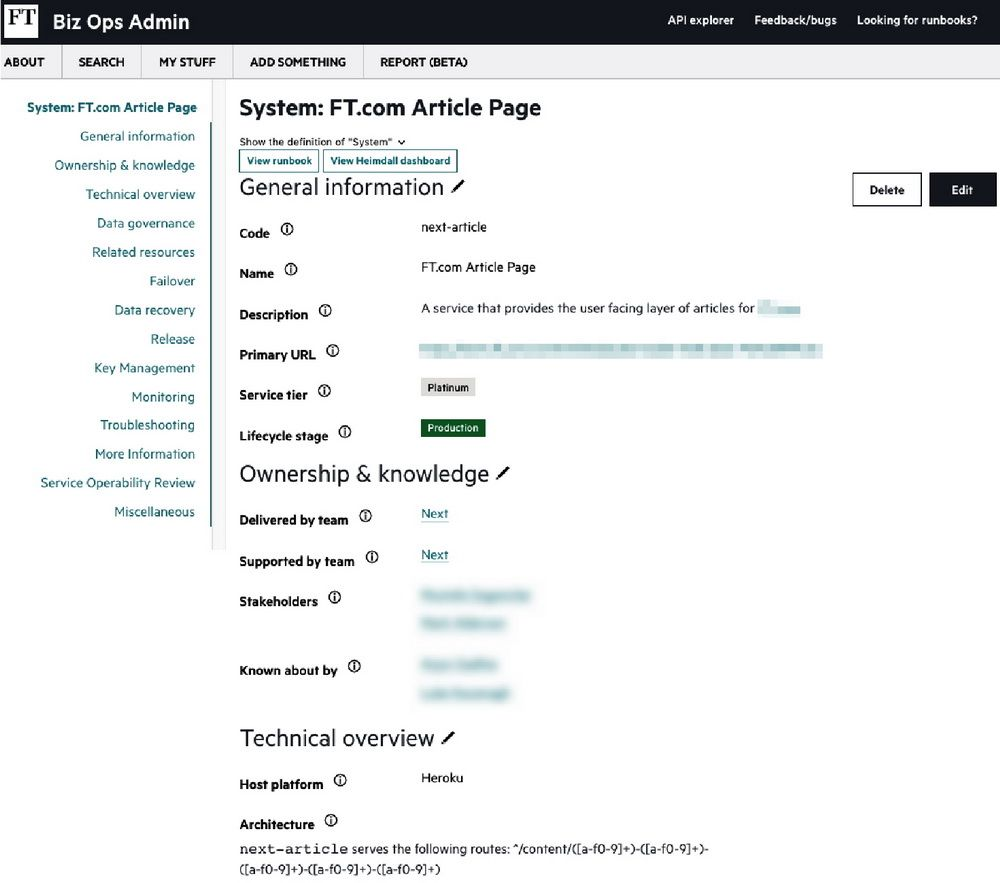
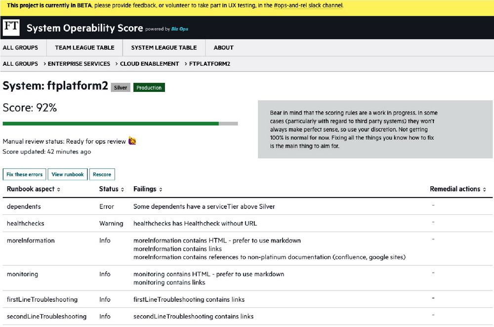
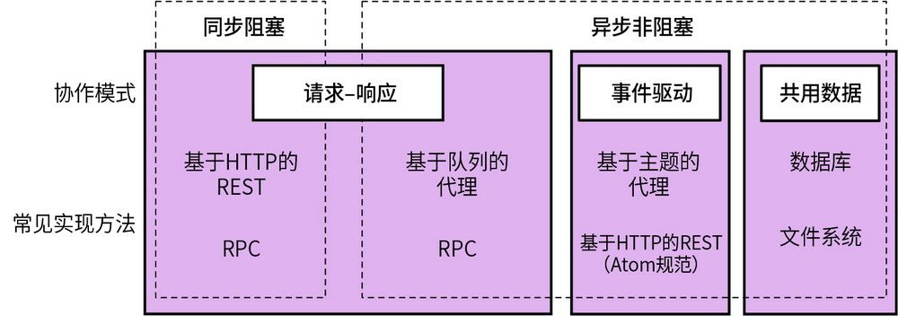

## 第5章 实现微服务间通信

如前所述，技术选型很大程度上取决于你想要采用什么样的通信方式。到底选用同步阻塞调用还是异步非阻塞调用、选用请求-响应模式还是事件驱动模式？一旦做好这类技术决策，你在后续的技术选择上将少走很多弯路。本章将介绍一些常用的微服务间通信技术。

### 5.1 寻找理想的技术

在微服务之间通信方式的选择上可谓五花八门。SOAP、XML-RPC、REST、gRPC，究竟哪一个才是更恰当的选择？与此同时，新的技术层出不穷。因此在讨论具体技术之前，我们先来思考一下选择某种技术时我们希望达成什么目标。

#### 5.1.1 轻松实现向后兼容

在对微服务进行更改时，我们需要确保所做的更改不会破坏微服务自身的向后兼容性。因此不论选择什么样的技术，我们都希望它可以方便我们实现向后兼容，比如添加新字段等简单的操作不应该对客户端造成影响。在理想情况下，我们希望有一种机制能够验证我们所做的更改的向后兼容性，并在将更改部署到生产环境之前，可以提供相应的反馈。

#### 5.1.2 明确你的接口

微服务对外提供的接口必须明确。微服务提供的功能对消费者必须清晰可见。微服务开发人员必须清楚，哪些功能是需要对外保持不变的，因为我们希望尽量避免因微服务的更改而导致其兼容性被破坏。

提供显式模式的接口定义可以在很大程度上确保微服务提供的接口是明确的。有的技术工具要求提供模式定义；而有的技术工具对模式的定义是可选的。但无论采用何种技术，我强烈建议使用显式的接口定义，并附带足够的文档，确保消费者能够清晰地了解微服务对外提供的功能。

#### 5.1.3 保持API的技术中立

只要你曾在IT行业里工作过，就会明白我们所处的工作环境变化得有多快。唯一确定不变的就是变化。新的工具、框架、语言层出不穷，帮助我们更快、更高效地实现新的目标。现在，你可能还在使用.Net，但是1年以后呢？5年以后呢？又或者你想尝试新技术栈来提升工作效率，要怎么办呢？

我喜欢微服务是因为它能给我们更多选择的余地。因此，我认为在微服务间通信上选择中立的API技术是非常重要的。这意味着要尽量避免使用在实现上规定特定技术栈的集成方式。

#### 5.1.4 简化提供给消费者的服务

我们希望消费者能够轻松地使用我们的微服务。如果消费者使用的成本过高，那么微服务的设计即使再精巧也没有意义。所以，我们需要考虑如何让消费者能够更容易地使用我们的微服务。理想情况下，可以为消费者在技术选择方面提供较高的自由度；也可以通过提供客户端库来简化对微服务的调用。但是，提供的这些库通常与我们希望实现的其他目标不兼容。例如，通过提供客户端库简化了微服务的使用，但也会加剧耦合。

#### 5.1.5 隐藏内部实现细节

我们不希望消费者在使用微服务时与微服务的内部实现绑定在一起，因为这会加剧服务提供方和消费者之间的耦合；这也意味着，如果我们想改变微服务的内部逻辑，那么消费者也需要跟着进行相应的更改，从而导致成本的增加，而这正是我们想要避免的。这还意味着，因为担心必须升级消费者，我们就不太愿意对服务做更改，这会导致服务内部技术债的增加。因此，应当尽量避免选择会暴露微服务内部实现细节的技术。

### 5.2 技术选型

有很多技术可供选择，但在这里我们先重点介绍一些最受欢迎、最有趣的选择。以下是一些可以关注的选项。

**远****程****过****程****调****用**

一种允许像调用本地方法一样完成远程程序调用的框架，常见的框架包括SOAP和gRPC。

REST

一种API架构风格，使用这种技术可以对对外暴露的资源（客户、订单等）进行一系列常规操作（Get、Post）。REST远不止这么简单，我们稍后会继续讨论。

GraphQL

一种相对较新的协议。使用该协议，消费者可以自定义查询，从多个下游微服务获取信息；该协议支持对查询结果进行过滤，并只返回所需要的内容。

**消****息****代****理**

通过队列或主题来支持异步通信的中间件。

#### 5.2.1 远程过程调用

**远****程****过****程****调****用**（RPC）是一种可以在本地进行调用，但在远程服务上执行的技术。在使用过程中，RPC有很多不同的实现。这个领域中的大多数技术通常要求使用显式模式，例如SOAP或gRPC。在RPC的上下文中，模式是使用“接口定义语言”（interface definition language，IDL）定义的，SOAP的模式格式则为“Web服务描述语言”（Web service definition language，WSDL）。采用独立的模式定义可以更容易为不同的技术栈生成对应的客户端和服务端代码，例如我们可以用Java实现一个SOAP接口的服务端，并使用相同的WSDL模式生成一个.Net客户端。其他技术，比如Java RMI，会让服务端和客户端之间的耦合更加紧密，它要求服务端和客户端使用相同的底层技术实现，但不需要单独定义服务接口，因为Java的类型定义已经隐式提供了相应的功能。然而，所有这些技术都有一个共同的特点：让远程调用看起来就像本地调用一样。

通常情况下，使用RPC技术意味着需要选择一种序列化协议。RPC框架定义了数据序列化和反序列化的方式。例如，gRPC使用协议缓冲区（protocol buffer）格式进行序列化。一些RPC技术的实现会绑定到特定的网络协议上（比如SOAP，虽然它名义上是使用HTTP作为传输协议，但其本身是一种独立协议），而另一些RPC技术的实现则可以使用不同类型的网络协议，并且提供更多的附加功能。例如，TCP可以保证传输的可靠性，而UDP虽然无法保证可靠性，但开销更低。这使得我们可以根据不同的使用场景选择不同的网络技术。

RPC框架中因为有明确的模式定义，所以能够轻松生成客户端代码。这可以避免对客户端库的依赖，因为任何客户端都可以基于模式生成自己的代码。但是，为了让客户端的代码生成可以正常工作，客户端需要以某种方式获取模式。换句话说，消费者需要在实际调用之前就可以获取模式。Avro RPC是一个有趣的例外，它可以在请求消息体中发送完整的契约，从而允许客户端可以对模式进行动态的解析。

生成客户端代码的便利程度通常是RPC技术的一个主要卖点。事实上，只需要进行一个简单的方法调用，而无须关心其他内容，这才是它的一个巨大优势。

**0****1****.****挑****战**

正如我们所看到的，RPC具有很多优势，但同时也有一些缺点。相比其他实现，一些RPC的实现可能会存在更多的问题。虽然其中的许多问题是可以解决的，但仍然值得进一步探讨。

**0****2****.****技****术****耦****合**

一些RPC机制，比如Java RMI，与特定平台紧密绑定，这可能会限制客户端和服务端的技术选型。Thrift和gRPC在支持多种语言方面表现出色，可以在一定程度上解决这个问题，但要注意的是，RPC技术有时会限制互操作性。

从某种程度上说，这种技术耦合可以被视为是暴露内部技术实现细节的一种形式。例如，使用RMI不仅需要客户端基于JVM开发，同时服务端也需要基于JVM开发。

不过，确实也有许多RPC的实现不会受到这种限制——gRPC、SOAP、Thrift都支持不同技术栈之间的互操作性。

**0****3****.****本****地****调****用****和****远****程****调****用****是****不****一****样****的**

RPC的核心思想是隐藏远程调用的复杂性。但现实中，往往会出现过度隐藏。某些形式的RPC试图让远程方法调用看起来像本地方法调用，而实际上，远程调用与本地调用本质上就是两种非常不同的调用方式。在同一进程中，我们可以进行大量的本地调用而不必过于担心性能问题。然而，对于RPC而言，序列化和反序列化消息体的成本可能相当高，更不用说网络传输所需的时间了。因此，在远程接口和本地接口的API设计上需要有所不同。直接把本地API变成服务交互接口会带来问题。在最糟糕的情况下，由于抽象层级过多，开发人员甚至可能不知道自己在使用远程调用。

你需要考虑网络的本质。众所周知，分布式计算的一个错误假设是“网络是可靠的”。而实际上，网络并不可靠，即使客户端和所连接的服务端都正常运行，网络仍然会出现问题。网络可能会很快出现异常，也可能会缓慢呈现故障，甚至可能损坏传输的数据包。你应当警惕，网络中可能存在恶意方，他们可能会出于任何小小的动机对系统发起攻击。因此，你会面临一些从未在单体应用中处理过的故障。它们可能是由远程服务器返回错误引起的，也可能是由错误的调用引起的。你能分辨出其中的不同吗？如果能，你要采取什么措施呢？如果远程服务器的响应开始变慢，你又该怎么做呢？我们将在第12章中探讨弹性的时候介绍相关的内容。

**0****4****.****脆****弱****性**

一些受欢迎的RPC实现可能会导致让人恼火的脆弱性问题，Java RMI就是一个很好的例子。比如，我们有一个非常简单的Java接口，我们决定用这个接口作为客户服务的远程调用API。示例5-1声明了我们想要暴露的远程调用接口。Java RMI会为这个接口生成客户端和服务端的桩代码。

**示****例****5****-****1** 使用Java RMI定义服务端接口

import java.rmi.Remote;

import java.rmi.RemoteException;

public interface CustomerRemote extends Remote {

public Customer findCustomer (String id) throws RemoteException;

public Customer createCustomer(

String firstname, String surname, String emailAddress)

throws RemoteException;

}

在这个接口中，createCustomer需要提供firstname、surname和emailAddress这3个参数。如果后来我们决定只用String emailAddress来创建customer对象，会发生什么呢？我们可以很容易地添加一个新方法，如下所示。

...

public Customer createCustomer（String emailAddress）throws RemoteException;

...

这样修改带来的问题是，需要重新生成客户端的桩代码。客户端如果想要调用这个新方法，就需要更新它的桩代码。根据不同契约的定义，一些不需要这个新方法的客户端也可能需要升级它们的桩代码。当然，在某种程度上，这个过程是可以被管理的。现实情况是，这样的变更非常普遍。RPC的接口往往会包含大量方法，用于以不同方式来创建对象或与对象交互。这在一定程度上是因为我们仍然把这些远程调用当作本地调用来考虑。

不过，RPC还有另外一种脆弱性。让我们再来看看我们的Customer对象：

public class Customer implements Serializable {

private String firstName;

private String surname;

private String emailAddress;

private String age;

}

我们在Customer对象中暴露了age属性，但如果消费者不再需要这个属性该怎么做呢？我们可以移除这个属性。如果服务端从其类型定义中移除了age属性，而客户端没有做出同样的变更，那么即使这个属性没有被任何消费者使用，消费者的反序列化Customer对象的代码也会出现问题。为了发布这个变更，我们需要修改客户端代码以支持新的定义，并在部署服务端变更的同时部署这些更新后的客户端。这是任何使用二进制桩代码生成的RPC机制所面临的一个主要挑战，即客户端和服务端的部署无法分开。如果你使用这种技术，未来可能不得不采用同步发布。

当我们想要重构Customer对象时，即使没有删除任何属性，类似的问题也会发生。举例来说，我们想把firstName和surname封装到一个新的naming类型里以方便管理。当然，可以用字典类型作为调用参数来规避这个问题，但同时也失去了生成的桩代码带来的好处，因为我们仍然需要手动匹配和提取所需字段。

在实际应用中，被用于网络传输的二进制序列化对象可以被看作是“仅扩展”的类型。这种脆弱性导致这些类型在传输过程中暴露了一堆属性，其中一些已经不再使用，但是又不能被安全地移除。

**0****5****.****适****用****情****况**

尽管存在缺点，但实际上我还是很喜欢RPC的，其中一些更为现代化的实现，比如gRPC是非常出色的。不过，也有一些实现存在很多问题，这会让我对它们敬而远之。例如，Java RMI在脆弱性和技术选型的限制方面存在许多问题。而SOAP从开发视角来看则是一种比较重的实现，特别是在和更为现代化的实现相比时。

如果你想使用RPC，一定要注意与它相关的一些陷阱。不要过分抽象远程调用，以至于网络调用全部被隐藏起来；同时，要确保服务端代码的更新与客户端代码的更新是松耦合的。为客户端的调用代码找到合适的平衡是很重要的，例如，确保客户端对即将进行的网络调用有所认知，而不是完全无视这一事实。在RPC的上下文中，通常需要用到客户端库，不正确的库结构会引发问题。我们稍后将会展开讨论。

如果让我在这个领域里选择的话，gRPC一定是我的首选。它利用了HTTP/2的优势，在性能方面有显著的提升，且具有良好的易用性。gRPC的周边生态也十分友好，包括像Protolock这样的工具，我们将在本章后面谈及模式的时候会讨论这个工具。

gRPC非常适合同步的请求-响应模式，但它也仍然可以与响应式架构结合使用。当我对服务端和客户端都有一定控制权的时候，我会选择这项技术。如果需要支撑各种各样的其他应用来调用你的微服务，那么基于服务端的模式来编译客户端代码可能会成为问题。在这种情况下，基于HTTP API的REST可能更加合适。

#### 5.2.2 REST

表示层状态转换（representational state transfer，REST）是一种受Web启发的架构风格。REST风格背后有许多原则和约束，但我们将重点关注那些在应对微服务集成挑战以及替换服务接口的RPC方案上真正能帮助我们的原则和约束。

谈及REST时，最重要的概念是资源。资源可以被视为服务自身所知道的内容，比如Customer。服务端会根据请求提供Customer的不同的表现形式。资源的外部表现形式与其在内部存储的方式是完全解耦的。例如，客户端可能会请求一个以JSON形式展示的Customer资源，即使该资源是以一种完全不同的形式存储的。一旦客户端通过这些表现形式知道了某Customer的一些信息，它就可以发送更改的请求，而服务端可以接受也可以拒绝这些请求。

REST风格有很多不同的种类，我在这里只做简要介绍。我强烈建议你阅读Richardson的成熟度模型，这个模型对不同种类的REST风格进行了比较。

REST自身并不受限于底层协议，不过在大多数情况下它是基于HTTP的。我之前见过并不基于HTTP的REST实现，那样需要做大量的工作。HTTP的某些特性，例如动词，使得基于HTTP来实现REST更为容易，而在其他协议中，你需要自己实现这些功能。

**0****1****.****R****E****S****T****和****H****T****T****P**

HTTP定义了许多与REST风格非常契合的功能。例如，HTTP动词（比如GET、POST和PUT）在其规范中已经有了清晰的定义，说明了它们会如何操作资源。REST架构风格告诉我们，这些动词应该对所有资源保持相同的行为方式，而HTTP规范恰好定义了一些可以直接使用的动词。例如，GET以幂等的方式获取一个资源，而POST则会创建一个新的资源。这就可以避免设计一堆createCustomer或者editCustomer方法。相比之下，我们可以向服务端发送一个POST请求来创建一个新的Customer资源，然后发起一个GET请求以某种表现形式来获取这个资源。从概念上来说，在前面这些情况下，Customer资源呈现为一个端点（endpoint），我们对这个端点执行的操作都被定义在了HTTP协议中。

HTTP还有着相关工具和技术的庞大的生态体系。我们可以使用像Varnish这样的HTTP缓存代理，或者像mod_proxy这样的负载均衡模块，以及许多开箱即用的HTTP监控工具。我们可以以透明的方式使用这些组件来处理和路由大规模的HTTP请求。我们也可以基于HTTP提供的安全控制方式实现安全通信。从基础认证到客户端证书，HTTP生态为我们提供了很多工具，可以用更便捷的方式来支持通信安全，第11章将围绕这个主题做出进一步的探讨。也就是说，为了获得这些便利，你需要很好地使用HTTP。如果使用不当，它就会像其他技术一样，带来安全风险或者导致难以扩展。如果正确使用它，就会事半功倍。

要知道HTTP也可以用于实现RPC。举例来说，SOAP通过HTTP进行路由，但可惜的是，它很少利用HTTP规范。动词会被忽略，HTTP错误码等简单的东西也会被忽略。而gRPC的实现则更多利用了HTTP/2的优势，例如它具有通过单个连接发送多个请求-响应流的能力。不过当然，使用HTTP的gRPC并不意味着实现了REST。

**0****2****.****超****媒****体****即****应****用****状****态****引****擎**

REST引入的另一个可以避免客户端和服务端之间耦合的概念是“超媒体即应用状态引擎”（通常缩写为“HATEOAS”，不过，这个缩写实在是没什么必要）。这是一个措辞相当复杂且颇有趣的概念，让我们稍微拆解一下。

被称为超媒体的内容可以包含各种各样指向其他形式（例如文本、图像、声音）内容的链接。这对你来说应该非常熟悉，大部分网页都是这样的：通过单击链接——一种超媒体控制——来查看对应内容。HATEOAS背后的想法是，让客户端通过这些指向其他资源的链接与服务端产生交互（一般情况下，互动会产生应用状态变化）。客户端调用URI的时候并不需要知道Customer到底存储在服务端的什么地方；相反，只需要跟随链接去获取它想知道的信息。

这个概念有些不容易理解，所以让我们先来回顾一下人们是如何与网页交互的。要知道我们建立起来的网页充满了各种超媒体控制。

让我们设想一个购物网站的情形。随着时间的推移，购物车位置发生了变化，图片也在变化，链接也在变化。但是作为人类，我们足够聪明，仍然在看到购物车时，知道它是什么，并与之交互。即使购物车的表现形式和交互方式发生变化，我们仍然知道它就是购物车。这就是网站随着时间变化而变化所发生的情况。只要网站与顾客之间的隐式契约不发生变化，对网站的更改就不需要是破坏性的。

通过超媒体控制，我们可以尝试为“非人类”的服务消费者实现与人类同等水平的“智能”。让我们来看看MusicCorp的超媒体控制。在示例5-2中，我们访问了一个给定专辑的目录条目资源。除了有关专辑的信息外，我们还看到了一些超媒体控制。

**示****例****5****-****2** 专辑列表中使用的超媒体控制

<album>

<name>Give Blood</name>

<link rel="/artist" href="/artist/theBrakes" /> ➊

<description>

Awesome, short, brutish, funny and loud. Must buy!

</description>

<link rel="/instantpurchase" href="/instantPurchase/1234" /> ➋

</album>

❶超媒体控制表示获取艺术家信息的方式。

❷如果想要购买这张专辑，可以知道去哪里购买。

这个消息体中有两个超媒体控制。阅读这个消息体的客户端会明白，和artist有关的链接可以获取更多艺术家信息，而和instantpurchase有关的链接可以用来购买专辑。客户端在理解API的语义时，就像我们明白购物网站上的购物车是用来放要购买的物品一样。

作为一个客户，我不需要知道到底要访问哪个链接才可以购买专辑。我只需要访问那个资源，找到购买按钮，然后单击即可。购买按钮可以出现在网页的不同位置，链接也可以发生变化，甚至网站有可能把我引向另一个服务，但并没有影响客户完成购买。这种方式实现了客户端和服务端之间的松耦合。

这里对底层的细节进行了极大的抽象。只要客户端仍然可以找到符合其对协议理解的控件，我们就可以放心改变控件的呈现方式，就像购物车控件可能从一个简单的链接变成一个更复杂的JavaScript控件一样。我们也可以自由地在文档中添加新的控件，这些控件可能代表了可以在相关资源上执行的新的状态转换。只有当我们从根本上改变其中一个控件的语义，使其行为发生很大变化，或者完全删除一个控件时，才会破坏客户端的功能。

理论上，用控件来解耦客户端和服务端的实现可以带来长期好处，这些好处足以抵消采纳这种协议所需的成本。遗憾的是，虽然这些理论看起来合理，但实际上很少有人这样设计REST。我还不清楚其中的原因。这使得将HATEOAS推广给那些已经采用REST的人变得更加困难。从根本上说，REST中的许多理念都是为了构建分布式超媒体系统，而这并不是大多数人真正想要构建的系统。

**0****3****.****挑****战**

从过去的经验来看，在易用性上，你不能像使用RPC那样为基于HTTP的REST应用自动生成客户端代码。因此，提供REST API的服务方，通常会为其消费者提供客户端库，帮助他们更简便地调用API。这些客户端库为你实现了对API的调用，简化了客户端的集成工作。但这也同时增加了客户端和服务端之间的耦合，我们将在5.8节中讨论这些问题。

近年来，这个问题得到了一定的改善。从Swagger项目发展而来的OpenAPI规范可以用来提供REST接口的信息，使你能更方便地使用不同语言生成相应的客户端代码。但据我所知，即使很多团队已经在用Swagger编写文档，真正利用这一功能的团队并不多。我猜测可能是因为将其应用于现存的API上有一定的困难。我也担心以前仅用于文档的规范现在被用来定义更严谨的契约会带来更多问题，例如这可能会导致规范的复杂性，例如，将OpenAPI模式与Protobuf模式进行比较，两者之间有鲜明的对比。尽管我持保留态度，但现在有了这个选项是件好事。

性能也可能是一个问题。基于HTTP的REST的消息体实际上可以比SOAP更紧凑，因为REST支持JSON甚至二进制等替代格式，但它仍然远不如Thrift那样精简的二进制协议。每个请求的HTTP开销也会对低延迟带来一定的挑战。当前使用的所有主流HTTP协议都需要在底层使用传输控制协议（transmission control protocol，TCP），它与其他网络协议相比效率较低，而一些RPC实现支持其他网络协议替代TCP，比如用户数据报协议（user datagram protocol，UDP）。

由于基于TCP而导致的一些HTTP的限制正在被逐渐解决。HTTP/3目前正在紧锣密鼓地制定，它计划采用更新的QUIC协议。QUIC在提供类似于TCP能力（比如基于UDP的可靠性传输）的基础上，还提供了一些更强大的能力，比如对延迟的改善和对带宽的优化。HTTP/3在公共互联网产生广泛的影响可能还需要几年的时间，但我有理由相信不同的组织都会从这个协议中受益，特别是在内部网络环境中。

采纳HATEOAS时，你可能会遇到其他性能问题。由于客户端需要跟随多个控件以找到给定操作的正确端点，因此这可能会导致协议变得非常烦琐——可能每个操作都需要多次往返通信。无论如何，这应该是一个权衡后的结果。如果你决定采用HATEOAS风格的REST，我建议你首先让客户端按自己的方式来获取信息，然后在必要时再进行优化。正如我们之前所说，HTTP已经提供了大量开箱即用的功能。有关过早优化的弊端之前也做了很多探讨，这里不再赘述。还要注意的是，这些方法中有很多是为了创建分布式超文本系统而开发的，并非所有方法都适合你的情况。有时你可能只需要一个传统的RPC。

尽管存在这些缺点，基于HTTP的REST仍然是服务间通信的默认选择。如果你想了解更多信息，我推荐Jim Webber、Savas Parastatidis和Ian Robinson所著的*R**E**S**T**i**n**P**r**a**c**t**i**c**e**:**H**y**p**e**r**m**e**d**i**a**a**n**d**S**y**s**t**e**m**s**A**r**c**h**i**t**e**c**t**u**r**e*，该书深入探讨了该主题。

**0****4****.****适****用****情****况**

考虑到基于HTTP的REST风格API在行业中已被广泛使用，如果希望支持尽可能多的客户端的访问，那么它仍然是同步请求-响应接口的理想选择。但认为REST API“在大多数情况下都足够好用”是片面的，虽然这种说法有一定道理。这是一种广为人知的接口风格，大多数人都熟悉，这也在一定程度上保证了与各种其他技术的互操作性。

基于REST的API在需要对请求实现广泛且高效的缓存的场景中表现突出，这在很大程度上要归功于HTTP的强大能力，以及REST在此基础上进行的拓展（而不是将其忽略）。这也是为何它是向外部或客户端公开API的首选。但是，与其他更高效的通信协议相比，它又有一些局限性。虽然可以在基于REST的API之上构建异步交互，但与其它微服务间通信的解决方案相比，它并不是最佳选择。

尽管我很欣赏HATEOAS的目标，但确实还没有看到太多证据表明，投入额外的努力来实现这种REST风格会带来长远的回报。我也不记得在过去几年中，与使用微服务架构的团队交流过关于HATEOAS的价值。我的个人经验显然也只是一组数据；我毫不怀疑，对某些团队来说HATEOAS会非常适用。但整体来看，它似乎不像我预期的那样普及，这可能是因为HATEOAS的概念对我们来说太过陌生，难以理解；也可能是因为这个领域缺乏工具或标准，或者这个模型不适用于我们最终想要构建的系统。当然，也有可能是由于HATEOAS背后的理念与我们构建微服务的方式不太契合。

在服务边界使用REST风格的API时，它的效果会很好。对于微服务间基于同步请求-响应的通信，REST风格的API也同样非常适用。

#### 5.2.3 GraphQL

近年来，GraphQL因其在特定领域的出色表现而越来越流行。也就是说，它支持客户端定义查询，从而避免发送多个请求来获取相同信息的问题。这也会很大程度上改善客户端的性能，并且避免服务端需要专门实现这类聚合功能。

以一个简单的场景为例：设想移动设备上的一个页面需要展示客户最新的订单概览。这个页面需要显示部分客户的信息及其最近的5个订单的信息，只需列出订单的日期、金额和发货状态。虽然移动设备可以分别调用两个微服务来获取这些信息，但这样会导致多次通信，并可能拉取一些实际上并不需要的数据。对于移动设备来说，这是一种资源的浪费——它会浪费更多的网络流量，也会增加页面的加载时间。

而采用GraphQL，移动设备可以通过一次查询来获取所需的信息。要实现这一点，一个微服务需要向客户端设备暴露一个GraphQL端点。这个GraphQL端点是所有客户端请求查询的入口，它还提供了一个直观的图形化查询工具，帮助简化查询的构建。通过减少客户端的调用次数和返回的数据量，你可以更有效地应对在微服务架构下构建用户界面时出现的一些挑战。

**0****1****.****挑****战**

在GraphQL发展的早期，一个限制是语言支持的不足，那时只有JavaScript可选。现在，情况已经有了很大的改进，所有主流技术都支持该规范。事实上，GraphQL在很多方面都进行了显著的改进，比几年前更加可靠。不过，你还是需要了解与GraphQL相关的一些挑战。

第一个问题是，由于GraphQL支持客户端动态构建查询，有些团队因此遇到了服务端负载过重的问题。这和我们在使用SQL时可能遇到的问题是一样的。一条昂贵的SQL语句可能会导致数据库出现严重问题，从而影响整个系统的性能。GraphQL也存在同样的问题。不同的是，对于SQL，我们至少有数据库查询规划器之类的工具可以帮助我们诊断有问题的查询，而在GraphQL上，定位类似问题可能更具挑战。一种可能的解决策略是在服务端限制请求，但由于请求的响应可能分布在多个微服务中，实施这种策略并不容易。

相较于常规的基于REST的HTTP API，GraphQL的缓存机制要复杂得多。使用基于REST的API，我可以设置许多响应头来帮助客户端设备或内容分发网络（CDN）来缓存响应，从而避免重复请求。但在GraphQL中，这种方式不再可行。目前我看到的建议是为每个返回的资源关联一个ID（请注意，一个GraphQL查询可能包含多个资源），然后让客户端设备根据这个ID缓存请求。据我所知，如果没有额外的改造措施，这种做法会让CDN或者缓存反向代理很难用。

尽管我已经看到了一些针对这个问题的特定实现（例如在JavaScript Apollo实现中的解决方案），但仍然感觉在GraphQL的开发初期，缓存被有意或无意地忽视了。如果你发出的查询本质上是针对特定用户的，那么没有请求级别的缓存可能对业务影响不大，因为你的缓存命中率可能本就不高。不过，我确实在思考，这是否意味着客户端设备最终需要采用混合解决方案，其中一些（更通用的）请求会通过普通的基于REST的HTTP API进行，而其他请求则通过GraphQL进行。

另一个问题是，虽然理论上GraphQL可以用于写入操作，但它似乎更适合读取操作。因此，很多团队都会使用GraphQL进行读取而使用REST进行写入。

最后一个问题可能有些主观，但我认为仍然值得一提。GraphQL可能会给人一种错觉，让人觉得只是在处理数据，从而导致人们可能会错误地认为与其交互的微服务仅仅是数据库的一个访问层。事实上，我见过很多人将GraphQL和OData相提并论，后者是一种旨在作为通用API访问数据库的技术。正如我们之前深入讨论的，将微服务简单地视为对数据库的封装会带来很大问题。微服务通过网络接口公开功能，其中一些功能可能需要公开数据或导致数据公开，但它们仍然应该具有自己的内部逻辑和行为。所以，当使用GraphQL时，不要误以为你的微服务只是一个数据库上的接口——你的GraphQL API一定不要与微服务的底层数据存储耦合在一起。

**0****2****.****适****用****情****况**

GraphQL非常适合在系统的外部使用，为外部客户端提供服务。这些客户端大多是图形界面（GUI），考虑到移动设备给终端用户提供数据的能力有限以及移动网络的特性，它显然非常适合移动设备。但是GraphQL也被用于外部API，GitHub是GraphQL的早期采用者。如果你有一个外部API，外部客户端经常需要进行多次调用以获取所需要的信息，那么GraphQL可以提供更为高效、便捷的API使用体验。

本质上，GraphQL是一种聚合与过滤机制，因此在微服务架构中，它被用于聚合多个下游微服务的调用。所以，它并不仅仅是取代微服务之间的常规通信方式。

另一种应用GraphQL的方法是采用BFF（backend for frontend，服务于前端的后端）模式。我们将在第14章中进行探讨，并将其与GraphQL和其他聚合技术进行比较。

#### 5.2.4 消息代理

消息代理通常被称为“中间件”，它们位于进程之间，用于管理进程间的通信。消息代理常被用在微服务间的异步通信中，因为它们提供了许多强大的功能。

正如我们前面讨论过的，消息是一个通用概念，它定义了消息代理要传输的内容。消息可以包含请求、响应或事件。与微服务间的直接通信不同，微服务会将消息传递给消息代理，并在消息中指明发送的方式和目标。

**0****1****.****主****题****和****队****列**

代理通常提供队列或主题，或者两者兼有。队列通常是点对点的。发送方将消息放入队列，消费者从该队列中读取。在使用基于主题的系统中，多个消费者可以订阅一个主题，每个订阅的消费者都会收到该消息的一个副本。

一个消费者可以代表一个或多个微服务，它通常被建模为一个消费者组。当你有多个微服务实例并希望每一个服务都能够接收消息时，这将非常有用。在图5-1中，我们看到了一个示例，其中订单处理器微服务部署了3个实例，它们都属于同一个消费者组。当一条消息被放入队列时，只有一个组成员会收到该消息；这意味着队列提供了负载均衡的机制。这是我们在第4章中简要介绍的竞争消费者模式的一个示例。

图5-1：一个队列支持一个消费者组

使用主题时，你可以设置多个消费者组。在图5-2中，表示正在付款的订单事件被放入订单状态主题中。仓库微服务和通知微服务在不同的消费者组中，它们都会收到该事件的副本。每个消费者组中只有一个实例会看到该事件。

图5-2：主题允许多个订阅者接收相同的消息，这对于事件广播非常有用

乍一看，队列只是一个具有单个消费者组的主题。这两者之间的主要区别在于，当通过队列发送消息时，我们知道消息被发送到什么地方；而对于主题，这些信息对于消息的发送方是隐藏的——发送方不知道谁（如果有的话）会最终收到消息。

主题非常适合基于事件的协作，而队列更适合请求-响应通信。不过，这只是一个一般性指导而不是严格的规则。

**0****2****.****消****息****确****认****机****制**

那么，为什么要采用代理方式呢？核心原因是，代理提供了许多对异步通信非常有用的功能。尽管它们所提供的功能有所不同，但其中最为关键的是消息确认机制，几乎所有被广泛使用的代理都以某种方式支持这一点。有了这个机制，代理可以确保信息一定会被送达。

从发送消息的微服务的角度来看，这种功能非常有价值。即使目标服务暂时不可达，也不会产生什么问题——代理将保留消息，直到消息可以被传递。这可以减少上游微服务的负担。相较于同步直接调用（比如HTTP请求），如果下游微服务不可达，上游微服务会面临如何处理该请求的问题：是选择重试还是放弃？

为了保证信息的成功传递，代理需要有能力将尚未传递的消息持久化，直到它们被成功传递。为了实现这个目标，代理通常会运行在基于集群的系统之上，以确保单台机器出现的故障不会导致消息的丢失。由于管理集群软件存在很多挑战，保持代理正常运行通常涉及很多工作。如果代理设置不正确，信息确认的保障机制可能就会受到影响。以RabbitMQ为例，它要求集群中的实例通过低延迟的网络进行通信；否则这些实例在处理消息的状态时可能会出现混淆，导致数据丢失。提及这个特定的限制并不是为了贬低RabbitMQ——所有代理在实现消息确认时都会有自己的约束和挑战。如果你计划自行部署和使用消息代理，请确保仔细阅读相关的文档。

值得注意的是，不同代理对消息确认机制的支持可能是不同的。同样，阅读文档是一个很好的开始。

**0****3****.****信****任**

消息代理最大的吸引力是消息确认机制。但是为了让其发挥作用，你不仅需要信任那些消息代理的开发者，还需要信任消息代理的运作方式。如果你构建的系统基于消息一定会送达的假设，但底层消息代理不具备这个能力，那就会导致严重问题。当然，我希望你把这项工作托付给比你做得更好的人。归根结底，你需要决定自己愿意在多大程度上信任所使用的代理。

**0****4****.****其****他****特****性**

除了信息确认机制外，代理还可以提供其他有用的特性。

大多数代理都可以保证消息传递的顺序，但并不是所有代理都可以做到；而那些有此功能的代理，其顺序保证也可能存在一定的局限性。例如Kafka，它只能保证单个分区内的消息顺序。如果不能确保消息会按顺序接收，那么消费者可能需要采取一些补偿措施，比如推迟处理乱序接收到的消息，直到收到所有先前遗漏的消息为止。

有一些消息代理具备写入事务的能力，例如，Kafka可以在单个事务中向多个主题写入消息。一些消息代理还具备读取事务的能力，在通过Java消息服务（Java Message Service，JMS）API与多个消息代理交互时，我也使用了事务这个特性。如果你想确保消费者在处理完消息后，再从代理中删除该消息，事务能力会非常有用。

另一个颇受争议的特性是一些消息代理宣称的“仅发送一次”。提供确认机制的一种更简单的方法是允许重新发送消息。这可能导致消费者多次接收到相同的消息（即使这种情况很少见）。尽管消息代理努力减少这种重复的现象，或是向消费者隐瞒这一情况，但有一些消息代理会更进一步，提供“仅发送一次”的支持。我曾与一些领域专家讨论过，他们中的一些人认为在所有情况下都保证“仅发送一次”是不可能的；而另一些人则认为，可以通过一些简单的变通方法来做到这一点。无论是哪种方式，如果你选择的消息代理支持这一点，请特别注意其实现的方式。更好的做法是，在消费者中进行处理，使其能够处理多次接收到相同信息的情况。一个非常简单的例子是，每条消息都有一个ID，消费者在每次收到消息时检查该ID。如果已经处理了具有该ID的消息，则可以忽略该消息。

**0****5****.****选****型**

消息代理的种类很多，其中比较有名的包括RabbitMQ、ActiveMQ和Kafka（稍后会进一步探讨）。主要的公有云供应商也提供了这方面的各种产品：既有那些可以在自有基础架构上部署的托管版本，也有特定于给定平台的定制实现。例如，AWS拥有简单队列服务（SQS）、简单通知服务（SNS）和Kinesis；以上这些都提供了不同风格的完全托管的消息代理。值得一提的是，SQS是AWS早在2006年推出的第二款产品。

**0****6****.****K****a****f****k****a**

作为消息代理，Kafka值得专门讲讲——这很大程度上是因为它实在太流行了。Kafka流行的原因之一是它在流处理中的出色表现，能够高效地传输大量数据。这促成了从批处理向实时处理的转变。

Kafka具有几个显著的特性。首先，它是为超大规模设计的——它由LinkedIn团队设计，目的是用一个单一平台替换多个已存在的消息集群。Kafka可以处理众多的消费者和生产者。我曾与一家大型科技公司的专家交流，他提到他的公司在同一个集群上有5万多个生产者和消费者。公平地说，很少有组织会有这种规模的需求，但对于那些需要的组织来说，（相对而言）Kafka的扩展性是一个巨大的优势。

Kafka另一个相当独特的特性是消息持久性。在传统的消息代理中，一旦所有消费者都收到了消息，消息代理就不再需要保留该消息。使用Kafka，消息可以存储一段可自定义的时间，甚至可以永久存储。这为消费者重新提取他们已经处理过的消息，或使新上线的消费者处理之前发送的消息成为可能。

最后一点是，Kafka已经推出了针对流处理的内置支持。与将消息从Kafka发送到专用的流处理工具（比如Apache Flink）不同，Kafka可以内部处理某些任务。使用KSQL，你可以用类似SQL一样的语法动态处理一个或多个主题的数据。这类似于为你提供了一个可以动态更新的数据库视图，数据源是Kafka主题而不是数据库。这些功能为在分布式系统中管理数据创造了一些非常有趣的可能性。如果你想进一步探索这些想法，我推荐Ben Stopford所著的*D**e**s**i**g**n**i**n**g**E**v**e**n**t**-**D**r**i**v**e**n**S**y**s**t**e**m**s*：*C**o**n**c**e**p**t**s**a**n**d**P**a**t**t**e**r**n**s**f**o**r**S**t**r**e**a**m**i**n**g**S**e**r**v**i**c**e**s**w**i**t**h**A**p**a**c**h**e**K**a**f**k**a*
 一书。（我必须推荐Ben的书，因为我写了这本书的前言。）如果你想更加深入地了解Kafka，我建议你阅读Neha Narkhede、Gwen Shapira和Todd Palino所著的《Kafka权威指南》
	 。

### 5.3 序列化格式

我们所讨论的一些技术选型，特别是一些RPC实现，会替你选择数据序列化和反序列化方案。例如，使用gRPC时，任何发送的数据都会被转换为协议缓冲区格式。然而，许多技术方案在网络数据转换方面提供了很大的自由度。选择Kafka作为消息代理时，你有多种消息格式可以选择。面对这些选择，哪个最适合你呢？

#### 5.3.1 文本格式

采用标准文本格式使客户端在资源使用方面更具灵活性。REST API通常在请求和响应主体中使用文本格式，当然理论上你也可以通过HTTP发送二进制数据。事实上，gRPC就是这样——它使用HTTP，但传输的是二进制的协议缓冲区格式。

JSON已经取代XML成为文本序列化格式的首选。这其中有很多原因，但最核心的还是API的主要消费者通常是浏览器，而浏览器对JSON的支持非常好。JSON之所以普及，部分原因是人们对XML的反感。支持者认为，与XML相比，JSON相对紧凑和简单。但实际上，经过压缩后的JSON和XML消息体在大小上差异并不明显。值得指出的是，JSON的简单是有代价的——在采用这个更简单的协议时，我们在模式方面做了妥协（稍后会详细介绍）。

Avro是一种有趣的序列化格式，其基础结构采用JSON，并利用JSON来定义基于模式的序列化格式。由于Avro能够将模式定义作为有效数据的一部分一起传输，从而可以更加方便地支撑多种不同的消息格式，因此它作为消息负载的序列化格式备受青睐。

不过，就我个人而言，我仍然偏好XML，主要因为它有更优质的工具链支持。例如，如果我想提取消息体中的特定部分（5.5节将详细讨论这种技术），我可以使用XPATH，这是一个被广泛认可并有很多工具支持的标准，我甚至还可以使用CSS选择器，后者对许多人而言更为直观。而在JSON中，我可以使用JSONPath，但它并没有得到广泛的支持。令我奇怪的是，人们之所以选择JSON可能是因为它简单且轻量，但又试图将一些在XML中存在的概念引入其中，例如超媒体控制。不过，我不得不承认我的观点可能并不是主流观点，很多人确实更青睐JSON。

#### 5.3.2 二进制格式

虽然文本格式易于阅读并能与不同工具和技术保持互操作性，但如果你开始担心消息的有效负载大小，或写入和读取有效负载的效率，那么你应该考虑二进制序列化协议。协议缓冲区已经存在了一段时间，且并不仅限于gRPC场景下的使用，它或许是微服务间通信中最受欢迎的二进制序列化协议。

然而，可供选择的格式还有很多，人们已经开发出了诸多格式以满足各种需求，比如简单的二进制编码、Cap'n Proto和FlatBuffers等。尽管许多格式都有其评测报告，强调了它们相对于协议缓冲区、JSON或其他格式的优势，但评测报告的问题在于，它们不一定能真实反映你的实际使用情况。如果你的目标是进一步压缩序列化格式的大小或者节省几微秒的读写时间，我强烈建议你亲自比对这些格式。根据我的经验，绝大多数系统很少需要考虑这类优化问题，因为通常可以通过发送更少的数据或根本不进行调用，来实现所需的改进。但是，如果目标是构建一个超低延迟的分布式系统，那么你应该深入探索二进制序列化格式。

### 5.4

### 模式

有一个反复出现的讨论是，我们是否应该使用模式（schema）来定义我们的接口暴露什么和接受什么。模式可以有许多不同的类型，通常，选择的序列化格式决定了你可以使用哪种技术。如果你使用原始XML，你将使用XSD（XML Schema Definition）；如果使用原始的JSON，你需要使用JSON Schema。我们已经提到的一些技术选项（特别是一些RPC技术的子集）都需要使用显式的模式，所以如果你选择了这些技术，你就必须使用模式。SOAP通过使用WSDL来工作，而gRPC需要使用协议缓冲区规范。我们探讨过的其他技术中，模式是可选项，这是让事情变得有趣的地方。

正如已经讨论过的，我支持为微服务端点提供显式模式，原因有两个。首先，它可以明确地表示微服务端点暴露的内容和可接受的内容。这不仅有助于开发人员更容易地开发微服务，还可以让消费者使用起来更加方便。模式可能无法取代对良好文档的需求，但它们肯定可以减少所需文档的数量。

然而，我喜欢显式模式的另一个原因是，它有助于发现微服务端点意外出现的破坏。稍后我们将探讨如何处理微服务之间的变更，但首先值得探讨的是不同类型的破坏以及模式在其中发挥的作用。

#### 5.4.1 结构性破坏和语义性破坏

从广义上讲，我们可以将契约破坏分为两类——**结****构****性****破****坏**（structural breakage）和**语****义****性****破****坏**（semantic breakage）。结构性破坏是指接口的结构发生变化，导致消费者不再兼容。这可能表现为字段或方法被删除，或者添加了新的必要字段。语义性破坏是指微服务端点的结构没有改变，但端点的行为发生了变化，从而违背了消费者的预期。

让我们举一个简单的例子。你有一个高度复杂的计算微服务，它通过接口暴露了一个Calculate方法。该Calculate方法需要两个整数，且这两个整数是必填字段。如果你更改了计算微服务，让Calculate方法现在只需要一个整数，那么消费者的功能就会被破坏——它们仍将发送带有两个整数的请求，而计算微服务会拒绝这些请求。这是结构变化的一个例子，通常这种变化更容易被发现。

语义变化更为棘手。在这种情况下，接口的结构没有发生改变，但接口的行为发生了变化。回到Calculate方法，想象一下，在当前版本中，我们将提供的两个整数相加并返回结果。到目前为止，一切顺利。现在，我们更改计算微服务，让两个整数相乘并返回结果。Calculate方法的语义发生了改变，这并不符合消费者的原有预期。

#### 5.4.2 是否应该使用模式

通过使用模式并比较不同版本的模式，我们可以捕捉到结构性破坏；而捕捉语义性破坏则需要通过测试来发现。如果你没有定义模式，或者虽然定义了模式但在开发过程中为了兼容性不去比较模式的变更，那么在代码部署到生产环境之前，发现和修复可能的结构性破坏的责任就会落在测试上。可以说，这种情况有点儿类似于编程语言中的静态类型与动态类型。对于静态类型语言，类型在编译时是固定的——如果代码对一个类型实例执行了某些非法操作（比如调用了一个不存在的方法），编译器是可以捕捉到这个错误的。这就可以让测试工作集中在其他类型的问题上。但是，对于动态类型语言，测试仍然需要负责捕捉编译器在静态类型语言中发现的错误。

现在，我在使用静态类型语言和动态类型语言时都很轻松，而且我发现自己在使用这两种语言时（相对而言）也非常高效。当然，动态类型语言为许多人带来了一些显著的好处，对许多人来说，为了这些好处放弃编译时安全性是合理的。不过，就个人而言，如果我们将讨论带回到微服务间通信上，我还没有发现在“有模式”与“无模式”通信方面存在类似的权衡。简而言之，我认为拥有一个明确的模式的好处远远超过了无模式通信的好处。

实际上，问题不在于你是否有模式，而是该模式是不是显式的。如果你正在使用无模式API中的数据，你还是会对其中应该包含哪些数据以及应该如何构建这些数据有期望。编写处理数据的代码时，你仍然会考虑有关数据结构的假设。在这种情况下，我认为仍然存在模式，但它是完全隐含的而不是显式的
	 。我对显式模式非常关切是因为我认为尽可能地明确微服务可以暴露什么（或不暴露什么）内容是非常重要的。

支撑无模式接口的主要论点似乎是模式带来更多工作却没有提供足够价值。在我看来，一部分原因是想象力的匮乏，另一部分原因是缺乏好的工具，且工具无法及时捕获结构性破坏从而导致模式化的接口无法更好地发挥优势。

最终，模式提供的许多内容是客户端和服务端之间部分结构契约的显式表示。它们有助于使事情更加明确，可以极大地促进团队之间的沟通并起到安全网的作用。但在更改成本降低的情况下——例如，当客户端和服务端都属于同一个团队时——我更倾向于无模式。

### 5.5 处理微服务间的变更

关于微服务我经常被问到的问题之一是：“它应该有多大？”然后就是：“你如何处理版本控制？”当有人提出这些问题时，他不是在问你应该使用哪种版本编号方案，而是在问你如何处理微服务之间的契约变更。

如何处理变更可以分为两个主题。稍后，我们将看看在需要做出破坏性变更时会发生什么。但在此之前，让我们看看如何避免一开始就做出破坏性变更。

### 5.6 避免破坏性变更

如果你想避免做出破坏性变更，有一些关键的想法值得探索，其中一些我们已经在本章的开始部分提到了。如果可以将这些想法付诸实践，你会发现让微服务可以独立变更会容易很多。

**扩****展****式****更****改**

为微服务接口添加新东西，而不删除旧东西。

**兼****容****的****消****费****者**

在使用微服务接口时，灵活调整你的期望。

**正****确****的****技****术**

选择可以更容易地对接口进行向后兼容更改的技术。

**显****式****接****口**

明确说明微服务可以暴露的内容。这使得客户端和微服务的维护人员更容易理解哪些内容可以自由更改。

**尽****早****发****现****破****坏****性****变****更**

在部署这些变更之前，要有适当的机制来发现会破坏生产中消费者使用的接口变更。

这些想法确实相得益彰，而且许多想法都基于我们经常讨论的信息隐藏这一关键概念。现在，让我们依次看看每个想法。

#### 5.6.1 扩展式更改

最容易开始的地方可能是仅向微服务契约添加新内容，而不删除任何其他内容。试想这样一个场景，向消息体添加新字段——假设客户端以某种方式兼容这一更改，那么这一更改就不应该对其产生实质性影响。例如，向客户记录添加新的dateOfBirth（出生日期）字段应该不会产生问题。

#### 5.6.2 兼容的消费者

微服务消费者的实现方式对简化向后兼容的更改有很大影响。具体来说，我们希望避免客户端代码过于紧密地绑定到微服务的接口。我们以一个电子邮件微服务为例，它的任务是向客户发送电子邮件。当它被要求向ID为1234的客户发送“订单已发货”的电子邮件时，它将检索具有该ID的客户，并获得类似示例5-3中所示的响应。

**示****例****5****-****3** 客户微服务的响应

<customer>

<firstname>Sam</firstname>

<lastname>Newman</lastname>

<email>sam@magpiebrain.com</email>

<telephoneNumber>555-1234-5678</telephoneNumber>

</customer>

现在，要发送电子邮件，电子邮件微服务只需要名字、姓氏和电子邮件字段。我们不需要知道电话号码，只想简单地提取我们关心的那些字段，而忽略其余字段。无论消费者是否需要，一些绑定工具，尤其是强类型语言使用的绑定工具可以尝试绑定所有字段。如果现在没有人使用电话号码了并决定删除这个字段会发生什么呢？这可能会导致消费者功能被破坏。

同样，如果我们想重构Customer对象以支持更多细节，可能会添加一些结构，如示例5-4所示，我们的电子邮件微服务所需的数据仍然存在，且名称相同，但是如果代码对firstname和lastname的存储位置做出了非常明确的假设，那么即使电子邮件微服务所需的数据保持不变且名称相同，它仍然可能会中断。在这种情况下，可以改为使用XPath来提取我们关心的字段，只要能找到它们，就不必关心字段的位置。这种模式——消费者可以忽略他们不关心的接口变更——就是Martin Fowler所说的兼容的消费者。

**示****例****5****-****4** 重组后的Customer资源：数据仍然在，但我们的消费者能找到吗

<customer>

<naming>

<firstname>Sam</firstname>

<lastname>Newman</lastname>

<nickname>Magpiebrain</nickname>

<fullname>Sam "Magpiebrain" Newman</fullname>

</naming>

<email>sam@magpiebrain.com</email>

</customer>

客户试图尽可能灵活地使用服务的示例展示了波斯特尔定律（Postel's Law，也被称为“健壮性原则”）。该定律指出：“输出保守、输入多元（严输出、宽输入）。”这条智慧原则最初是针对设备在网络上的交互提出的，在这种情况下，你应该能预料到会发生各种奇怪的事情。在基于微服务间通信的上下文中，它引导我们构建可以兼容消息体更改的客户端代码。

#### 5.6.3 合适的技术

正如我们探讨过的，当涉及对接口更改的支持时，有些技术可能会更加脆弱——我强调过我个人不喜欢Java RMI。一些集成实现会尽可能地简化更改而不会破坏客户端功能。协议缓冲区作为gRPC使用的序列化格式，具有字段编号的概念。协议缓冲区中的每个条目都必须定义一个字段编号，客户端代码会期望找到和使用该字段编号。如果添加了新字段，客户端不会受到影响。Avro允许将模式与消息体一起发送，从而允许客户端像动态类型一样可以潜在地解释消息体。

还有更极端的技术，即基于HATEOAS的REST，主要是为了通过上面讨论的超媒体链接，让客户端在REST端点变动时也能继续使用这些新端点。显然，前提是你必须彻底接受HATEOAS的整体理念。

#### 5.6.4 显式接口

微服务提供了一个明确的模式来清晰地表明其接口的作用，我很喜欢这一点。拥有一个明确的模式可以让消费者清楚地了解他们可以期待什么，同时也让微服务的开发人员更清楚地知道哪些地方应该保持不变，以确保消费者的功能不被破坏。换句话说，显式模式在很大程度上有助于使信息隐藏的边界更加明确——模式中公开的内容根据定义是不隐藏的。

RPC的显式模式是长期存在的，实际上它是许多RPC实现的要求。REST通常将模式视为可选的，而我发现REST端点的显式模式非常罕见。但这种情况正在发生变化，前面提到的OpenAPI规范越来越受到欢迎，而JSON Schema规范也越来越成熟。

异步消息传递协议在这个领域遇到了更大的困难。你可以很容易地为消息体创建一个模式，实际上这是Avro经常使用的方式。然而，下一步是需要拥有一个显式接口。比如，如果考虑一个触发事件的微服务，它暴露了哪些事件？现在有一些为基于事件的接口创建显式模式的尝试。一种是AsyncAPI，它吸引了许多知名用户，但最受欢迎的似乎是CloudEvents——一种由云原生计算基金会（Cloud Native Computing Foundation，CNCF）提供的规范。Azure的事件网格（event grid）产品支持CloudEvents格式，这表明不同的供应商在支持这种格式，这应该有助于实现互操作性。这仍然是一个相当新的领域，所以看看未来几年事情会如何变化是一件有趣的事情。

**语****义****版****本****控****制**

作为客户端，如果只看到服务的版本号就可以知道是否可以与之集成，不是一件很好的事情吗？语义版本控制就是这样一个规范。在语义版本控制中，每个版本号的格式为MAJOR.MINOR.PATCH。当MAJOR数字增加时，意味着服务进行了向后不兼容的更改。当MINOR数字增加时，表示添加了向后兼容的新功能。对PATCH的更改表明对现有功能问题做出了修复。

让我们看一个简单的应用场景来了解语义版本控制是多么有用。我们的帮助台应用是针对客户微服务的1.2.0版本构建的。如果添加了一项新功能，导致客户微服务更改为1.3.0，则帮助台应用的行为应该不会发生任何更改，也不应做出任何更改。但是，不能保证可以针对客户微服务的1.1.0版本工作，因为我们可能依赖于1.2.0版本中添加的功能。如果新的客户微服务2.0.0版本发布，就可能需要对我们的应用进行更改。

你可能决定为服务甚至为服务上的某个接口提供语义版本，或者两者都提供，5.6.5节将对此做出讲解。

这种版本控制方案可以将大量信息和期望打包到3个字段中。完整的规范用非常简单的术语概述了客户对这些数字更改的期望，它可以简化关于更改是否会影响消费者的沟通过程。可惜的是，我还没有看到这种方法在分布式系统中得到足够的应用，无法理解它在这种情况下的有效性——自第1版出版以来，这一点还是没有真正改变。

#### 5.6.5 尽早发现破坏性变更

尽快发现会破坏消费者的变更是至关重要的，因为即使选择了最好的技术，对微服务的任意更改也可能导致消费者的功能崩溃。正如前面提到的，使用某种工具来比较模式版本可以帮助我们检测结构性变更。有许多不同类型的工具可以针对此类模式进行比较。对于协议缓冲区，可以用Protolock；对于JSON Schema，可以用json-schema-diff-validator；对于OpenAPI规范，可以用openapi-diff 
	 。这个领域似乎不断涌现出更多的工具。但是，你要寻找的不只是报告两个模式之间的差异，而是在发现不兼容的模式之后，能够判定CI构建是否应该成功。这样就可以在发现不兼容的模式时让CI构建失败，确保这个微服务不会被部署。

开源的Confluent Schema Registry支持JSON Schema、Avro和协议缓冲区，并且能够比较新上传的版本以实现向后兼容性。虽然它是为了协助Kafka生态系统而建立的，并且需要Kafka来运行，但也可以将其用于存储和验证其他通信的模式。

模式比较工具可以帮助我们发现结构性破坏，但是可以发现语义性破坏吗？如果一开始没有使用模式怎么办？我们将在9.5.1节中详细地探讨此主题，但这里我想强调消费者驱动的契约测试在这方面的显著帮助。Pact是一个专门针对此问题的优秀工具。请记住，如果没有使用模式，那么你的测试必须做出更多的工作才能捕捉到重大变化。

如果需要支持多个不同的客户端库，那么为每个客户端库针对最新版本的服务都运行相应测试是另一种可以提供有效帮助的方法。一旦意识到消费者功能将受到破坏，你可以选择要么完全避免破坏，要么接受它并开始与负责消费者服务开发的人进行及时的沟通。

### 5.7 管理破坏性变更

当你已尽了最大努力来确保对微服务接口所做的更改是向后兼容的，但仍然不得不做出破坏性变更的时候，你应该如何做呢？这里有3个主要选择。

**同****步****部****署**

要求暴露接口的微服务和具有该接口的消费者同时发生变化。

**共****存****不****兼****容****的****微****服****务****版****本**

同时运行微服务的新版本和旧版本。

**模****拟****旧****接****口**

让你的微服务公开新接口并模拟旧接口。

#### 5.7.1 同步部署

当然，同步部署是与可独立部署是背道而驰的。如果我们希望能够部署一个微服务的新版本来对其接口进行重大更改，并且通过独立部署的方式来执行此操作，那么这仍然需要给予消费者足够的时间来升级到新接口。这就引出了下面需要考虑的两个选项。

#### 5.7.2 共存不兼容的微服务版本

另一个经常被提到的版本控制解决方案是同时运行不同版本的服务，让老用户将他们的流量路由到旧版本，让新用户看到新版本，如图5-3所示。当更换老用户的成本太高时，Netflix会使用这种方法，尤其是在遗留设备仍与旧版本的API绑定的情况下。我个人不太喜欢这个想法，也理解为什么Netflix很少使用这种方法。首先，如果需要修复服务中的内部错误，那么现在必须修复和部署两组不同的服务。这可能意味着必须创建分支代码库，而这样做总会产生问题。其次，这意味着需要智能路由来将消费者引导到正确的微服务。这种行为不可避免地会出现在某个中间件或一堆nginx脚本中，这使得推理系统行为变得更加困难。最后，考虑到服务可能管理的任何持久状态。无论最初使用哪个版本创建数据，都需要存储由任一版本的服务创建的客户，并使其对所有服务可见。这是复杂性的另一个来源。

图5-3：运行同一服务的多个版本以支持旧端点

有时在短时间内并存不同版本的服务是合理的，尤其是在进行金丝雀发布（8.6.4节将详细地讨论这一技术）时。在这种情况下，可能只需让不同版本的服务共存几分钟或几小时，并且通常只会同时存在两个不同版本的服务。让消费者升级到新版本并发布所需的时间越长，就越应该在同一微服务中共存不同的端点，而不是共存不同的服务版本。不过，我认为这项工作对于一般项目来说并不值得做。

#### 5.7.3 模拟旧接口

如果我们已经尽可能避免引入破坏性的接口更改，那么下一项工作就是尽可能减少破坏性变更对消费者造成影响。尽量避免迫使消费者进行同步升级，因为我们总是希望保持彼此独立发布微服务的能力。我成功地使用了一种方法来处理这个问题，即在同一个正在运行的服务中同时共存新旧接口。因此，如果想要发布重大更改，我们将部署一个新版本的服务，这个服务同时支持旧版本和新版本的接口。

这使我们能够尽快推出新的微服务和新的接口，同时让消费者有时间转移。一旦所有消费者不再使用旧接口，你就可以将这个接口连同其他相关代码一起删除，如图5-4所示。

在上次使用这种方法的时候，我们的团队进入了一个窘境——我们面临着大量的消费者以及大量的破坏性变更。在这种情况下，实际存在了3个不同版本的接口。这不是我推荐的做法。保留所有代码和确保它们都能正常工作所需的相关测试绝对是一个额外的负担。为了更易于管理，我们在内部将所有对V1接口的请求转换为V2请求，然后将V2请求转换为V3接口。这样，当旧接口被淘汰时，我们可以清楚地知道哪些代码需要淘汰。

图5-4：一个模拟旧接口并暴露新的向后不兼容接口的微服务

这实际上是扩展和收缩模式（expand and contract pattern）的一个示例。基于这种模式，我们可以逐步进行破坏性修改。我们扩展了提供的功能，同时支持新旧两种接口的处理。一旦旧的消费者使用新的接口，我们就会收缩API并删除旧的功能。

如果要共存接口，则需要一种方法让调用者相应地路由其请求。对于使用HTTP的系统，我看到是在请求标头和URI本身中使用版本号来实现的，例如/v1/customer/或/v2/customer/。我不确定哪种方法最为合理。一方面，我喜欢不透明的URI以阻止客户端对URI模板进行硬编码；但另一方面，这种方法确实使事情变得非常明显，并且可以简化请求路由。

对于RPC来说，事情可能有点棘手。我已经通过将方法放在不同的命名空间中以使用协议缓冲区处理这个问题（例如v1.createCustomer和v2.createCustomer），但是当尝试支持通过网络发送相同类型的不同版本时，这种方法会让人非常难受。

#### 5.7.4 推荐的方法

对于一个团队同时管理微服务和所有消费者的特定情况，我认为同步发布其实是可行的。假设这确实是一次性的情况，那么当影响仅限于单个团队时这样做是合理的。不过，我对此非常谨慎，因为一次性活动可能会变成习惯，并且存在确实需要独立部署的风险。如果过于频繁地使用同步部署，那么你很快就会发现，尽管你的应用是分布式的，但是你在按单体的方式进行管理。

正如前面所指出的，同一微服务的不同版本共存可能会产生问题。我只会在需要短时间内同时运行微服务版本的情况下考虑这样做。现实情况是，可能需要数周或更长时间留给消费者进行升级。在其他需要微服务版本共存的情况下，在实现蓝绿部署或金丝雀发布时，升级所需的持续时间要短得多，可以抵消这种方法的缺点。

我的一般偏好是尽可能使用旧接口的模拟。在我看来，实现模拟的挑战比共存的微服务版本更容易应对。

#### 5.7.5 社会契约

你选择哪种方法在很大程度上取决于消费者对变更的期望。保留旧接口会产生成本，理想情况下，你会希望尽快将其关闭，并移除相关代码和基础设施。但同时，你也希望给消费者尽可能多的时间来适应变更。请记住，在许多情况下，你正在进行的向后不兼容的更改通常是消费者要求的，且实际上也最终会使他们受益。当然，在微服务维护者的需求和消费者的需求之间如何进行平衡，是值得探讨的话题。

我发现在很多情况下，如何处理这些变更还没有探讨过，这就导致了各种各样的挑战。与模式一样，在如何进行向后不兼容的更改方面如果具备一定的明确性，可以大大地简化很多事。

你不一定需要大量的文件和大型会议来就如何处理更改达成一致。但假设你没有走同步发布的路线，我建议微服务的所有者和消费者都需要明确以下几点。

·如何提出需要更改接口的提议？

·消费者和微服务团队应该如何协作，就更改的内容达成一致？

·谁来负责消费者的更新工作？

·就更改达成一致后，消费者需要多长时间才能切换到新接口，然后将旧接口移除？

请记住，有效的微服务架构的秘诀之一是采用消费者至上的方法。你的微服务是为了供其他消费者调用而存在的。消费者的需求是最重要的，如果对微服务进行更改会给上游消费者带来问题，你需要考虑到这一点。

当然，在某些情况下，可能无法更改消费者。我听说Netflix在使用旧版Netflix API的旧机顶盒方面（至少在历史上）遇到了问题。这些机顶盒不太容易升级，因此旧接口必须保持可用，除非旧机顶盒的数量下降到可以停用旧接口的水平。有时决定停止旧消费者访问你的接口最终会涉及财务问题——支持旧接口的成本和你从消费者那里赚到的钱需要相平衡。

#### 5.7.6 追踪使用情况

即使你已经同意消费者停止使用旧接口的时间点，但能够确定他们真的停止使用了吗？确保你为微服务暴露的每个接口都设置了日志记录会有所帮助，同时还要确保你拥有某种客户端标识符，以便你与相关团队进行沟通，在需要时让他们迁移到新接口。这可以像要求消费者在发出HTTP请求时将其标识符放在用户代理标头中一样简单，或者你可以要求所有调用都通过某种API网关进行，客户端需要使用密钥来标识自己。

#### 5.7.7 极端措施

假设你知道消费者仍在使用你想要删除的旧接口，并且他们不太愿意升级到新版本，你该怎么办呢？首先要做的事情就是与他们沟通。也许你可以帮助他们做出改变。如果所有方法都试过，他们还是不愿意升级，或者他们口头同意升级，但最后仍然没有升级，我们也有一些极端技术可以使用。

在一家大型科技公司，我们讨论了它是如何处理这个问题的。在内部，该公司设定了一个宽松的期限，即在旧接口弃用之前留给消费者一年的时间。我问该公司负责人如何知道消费者是否仍在使用旧接口，该公司回答说它并没有那么麻烦地去追踪这些信息；一年后，它只是关闭了旧接口。公司内部认为，如果这导致消费者出现故障，那么这就是是消费微服务团队的问题——他们本有一年的时间来做出变更，他们却没有这样做。当然，这种方法并不适用许多情况（我说过这太极端了）。这也导致了很大程度的效率低下。因为不清楚旧接口是否在被使用，所以该公司错过了在一年的时间里移除它的机会。就我个人而言，即使我建议可以在一段时间后关闭接口，但仍然希望通过追踪来了解谁会受到影响。

我看到的另一个极端措施实际上是关于弃用库的，但它在理论上也可以用于微服务接口。这里举一个旧工具库的例子。人们试图在组织内部弃用这个工具库，转而使用更新、更好的工具库。尽管投入了大量工作将代码迁移到新的库上，但一些团队仍然行动迟缓。解决方案是在旧库中插入睡眠代码，以使它对调用的响应缓慢（可以通过日志记录显示正在发生什么）。随着时间的推移，推动弃用的团队不断增加延迟的持续时间，直到其他团队受到无法忽视的显著影响。显然，在考虑这样的措施之前，你必须非常确定已经用尽了其他合理的方法来促使消费者升级。

### 5.8 DRY和微服务架构中的代码复用风险

作为开发人员，我们经常听到的一个缩略词是“DRY”（don't repeat yourself）——不要重复自己。虽然DRY的定义有时被简化为试图避免重复代码，但更准确地说，DRY意味着要避免重复实现系统功能和处理相同信息。在一般情况下，这是非常明智的建议。用很多行代码做同样的事情会使代码库比实际需要的大，也更难被人理解。当你想要更改行为而该行为在系统的许多部分重复时，你很容易忘记需要进行更改的所有地方，这可能会导致错误。因此一般来说，把DRY当作口头禅是有道理的。

DRY是指导创建可复用代码的原则。我们将重复的代码提取到抽象中，然后可以从多个地方调用这些抽象。甚至可以考虑创建一个可以在任何地方使用的共享库！然而，事实证明，在微服务环境中共享代码比这更复杂。与往常一样，我们有多个选项要考虑。

**通****过****库****共****享****代****码**

我们不惜一切代价避免微服务和消费者的过度耦合，以防止任何对微服务本身的微小改动会对消费者造成不必要的更改。然而，有时共享代码的使用恰恰会导致这种耦合。例如，在某个消费者，我们有一个通用域对象库，代表系统中使用的核心实体。我们拥有的所有服务都使用了这个库。但是，当其中一个发生更改时，所有服务都必须做出更新。我们的系统通过消息队列进行通信，这些消息队列也必须清除它们现在已收到的但已失效的内容，如果你忘记了，就会有麻烦了。

如果你对共享代码的使用泄露到了服务边界之外，那么你就引入了一种潜在的耦合。使用像日志库这样的通用代码很好，因为它们是外部不可见的内部概念。澳大利亚房地产公司REA（后简称“REA”）的官网使用了定制的服务模板来帮助引导新服务的创建。该公司没有共享此代码，而是为每个新服务复制一份，以确保耦合不会泄露。

关于库共享代码很重要的一点是，你不能一次性更新库的所有使用场景。尽管多个微服务可能都使用同一个库，但它们通常是通过将该库打包到微服务部署中来实现的。要升级正在使用的库的版本，你需要重新部署微服务。如果你想同时在所有地方更新同一个库，那么这可能会导致同时部署多个不同的微服务，而这会带来麻烦。

因此，如果你使用库来跨微服务边界复用代码，你必须接受同一库的多个不同版本可能同时存在。随着时间的推移，你当然可以考虑将所有服务使用的库更新到最新版本，只要你能接受这个成本，你当然可以通过库复用代码。如果你确实需要同时为所有用户更新该代码，那么你最好通过专用的微服务来实现代码复用。

不过，有一个特定的使用库复用代码的场景值得进一步探索。

**客****户****端****库**

我与不止一个团队交谈过，他们坚持认为微服务创建客户端库是实现服务的重要部分。他们的论点是，这样可以容易地使用服务，并避免重复编写消费服务所需的代码。

然而，问题在于，如果同一个人同时创建服务端API和客户端API，那么确实存在将服务端的逻辑泄露到客户端的风险。我自己也犯过这种错误。进入客户端库的逻辑越多，服务的内聚度就会越来越低，你可能发现自己必须更改多个客户端才能修复服务端问题。另外，你还限制了技术选择，特别是如果你强制要求必须使用客户端库的话。

我喜欢的客户端库模型是AWS模型。确实可以通过SOAP或REST Web进行服务调用，但大多数人最终都使用AWS提供的各种现有的软件开发工具包（software development kits，SDK），这些SDK提供了对底层API的抽象。然而，这些SDK是由更广泛的社区编写的，或是由AWS内部的人编写的，而不是那些API服务开发者。这样的分离似乎很有效，避免了客户端库的一些缺陷。之所以如此有效，部分原因是客户端可以决定何时升级版本。如果你决定使用客户端库的方法，请确保做到这一点。

Netflix特别强调客户端库，但我担心人们会纯粹从避免代码重复的角度来看待这一点。事实上，Netflix使用的客户端库与确保其系统的可靠性和可扩展性同样重要。Netflix客户端库处理服务发现、故障模式、日志记录和其他与服务本身性质无关的方面。如果没有这些共享的客户端库，在Netflix运行的大规模环境下很难确保每个客户端/服务端通信均能良好运行。它们在Netflix的使用无疑使服务易于启动和运行，提高了工作效率，同时还确保了系统的良好运行。然而，也有一些Netflix的员工认为，随着时间的推移，这导致了客户端和服务端之间一定程度上的耦合。

如果你正在考虑使用客户端库的方法，那么将处理底层传输协议的客户端代码从与目标服务本身相关的事情中分离出来可能很重要；底层传输协议可以处理服务发现和故障之类的问题。你需要决定是否坚持使用客户端库，或者是否允许使用不同技术栈的人调用底层API。最后，应确保客户端可以控制何时升级他们的客户端库。总之，我们需要确保微服务具有独立发布的能力。

### 5.9 服务发现

一旦你拥有多个微服务，你的注意力不可避免地会关注它们的部署位置。也许你想知道某个环境中运行着什么，以便知道应该监控什么。也许就像你知道账户微服务在哪里一样，客户端也可以很容易地知道在哪里找到它。或者，你只是想让组织中的开发人员知道有哪些API可用，这样他们就不必重复发明轮子。从广义上讲，所有这些使用场景都属于**服****务****发****现**（service discovery）的范畴。与微服务一样，我们有很多不同的选择来处理它。

所有的解决方案可分为两个部分。首先，它们提供了一种机制，让实例注册自己并说：“我在这里！”其次，它们提供了一种在注册后查找服务的方法。但是，当我们考虑一个不断销毁旧服务实例和部署新服务实例的环境时，服务发现会变得更加复杂。理想情况下，我们希望无论我们选择哪种方案，这个问题都可以得到解决。

让我们一起看看常见的解决方案并做出合适的选择。

#### 5.9.1 域名系统

从简单方案做起总是不错的开始。**域****名****系****统**（DNS）可以将名称与一台或多台机器的IP地址相关联。例如，我们可以决定用accounts.musiccorp.net来访问账户微服务。然后，我们将该入口点指向运行该微服务的主机的IP地址，或者将其解析为在多个实例之间分配负载的负载均衡器。这意味着我们必须将更新这些记录作为部署服务的一部分。

在处理不同环境中的服务实例时，我发现基于约定的域名模板会很有用。例如，可以将模板定义为<服务名称 >-<环境 >.musiccorp.net，这样我们可以得到诸如accounts-uat.musiccorp.net或accounts-dev.musiccorp.net之类的记录。

另一个更高级的方法是让不同的环境使用不同的域名服务器。所以我可以假设accounts. musiccorp.net是我查找账户微服务的地址，但它可以解析到不同的主机，解析到的主机取决于在哪个环境进行查找。如果你能够自如地手动管理DNS服务器和记录，且不同环境已经位于不同的网段中，那么这会是一个非常好的解决方案；但是如果没有从这种部署方式中获得其他好处，那么这意味着要多做很多工作。

DNS有许多优点，其中主要的一个优点是，它是一个易于理解和广泛使用的标准，几乎所有技术栈都会支持它。不过，尽管存在许多用于管理组织内部DNS的服务，但很少有为临时主机的环境而设计的服务，临时主机的存在使得DNS需要频繁地更新，而这会带来不少手动更新的工作量。亚马逊的Route 53服务在这方面做得不错，目前我还未看到一个自托管的服务可以与之媲美，尽管（我们稍后会讨论）一些专用的服务发现工具（比如Consul）可能也会在这方面有所帮助。除了更新DNS记录的问题外，DNS规范本身也会给我们带来一些问题。

域名的DNS记录具有存活时间（time to live，TTL）。这是客户端认为记录有效的时间。想要更改域名所指的主机时，我们会更新该记录，但必须假设客户端仍会在TTL内保留旧IP。DNS记录还可能会缓存在多个位置（即使JVM也会缓存DNS记录，除非你告诉它不要这样做），且记录缓存的位置越多，旧记录存在的时间就会越久。

解决此问题的一种方法是让服务的域名记录指向负载均衡器，而负载均衡器又指向服务实例，如图5-5所示。当部署新实例时，你可以从负载均衡器记录中移除旧实例并添加新实例。有些人使用DNS轮询的方式解决这个问题，其中每个DNS记录都指向多台机器。这种技术是有问题的，因为客户端对底层主机是隐藏的，因此当主机出现问题时，就无法轻易停止将流量路由到这台主机上。

图5-5：使用DNS解析到负载均衡器以避免过时的DNS记录

如前所述，DNS众所周知且受到广泛支持，但它确实有上述的一两个缺点。我建议你在选择更复杂的东西之前先调查一下DNS是否适合你。对于只有单个节点的情况，让DNS直接引用主机应该没有问题。但是对于需要多个主机实例的情况，需将DNS记录解析为负载均衡器，它可以根据需要将某个主机放入服务或移出服务。

#### 5.9.2 动态服务注册

在高度动态的环境中，基于DNS查找节点的方式存在一些缺点，因此出现了许多替代系统，其中大多数涉及将服务注册到某个注册中心，并通过注册中心来提供服务查找功能。通常，这些系统不仅仅提供服务注册和服务发现，还提供其他功能，这可能是好事，也可能不是。这是一个竞争激烈的领域，所以这里只提供几个选项，让你有个大致了解。

**0****1****.****Z****o****o****K****e****e****p****e****r**

ZooKeeper最初是作为Hadoop项目的一部分开发的。它有一系列令人眼花缭乱的使用场景，包括配置管理、服务间的数据同步、领导者选举、消息队列以及（对我们有用的）命名服务。

与许多类似的系统一样，ZooKeeper依赖于在集群中运行多个节点来提供各种保证。这意味着你应该至少配置3个Zookeeper节点。ZooKeeper中的大部分关键功能主要用于确保数据在节点间安全复制，并在节点发生故障时保持一致性。

ZooKeeper的核心是提供了一个用于存储信息的分层命名空间。客户端可以在层次结构中插入新节点、更改或查询新节点。此外，它们可以向节点添加监视器，支持在节点更改时得到通知。这意味着可以在此结构中存储有关服务位置的信息，并在它们发生更改时告知客户端。ZooKeeper通常用于配置管理，因此你还可以在其中存储服务的配置信息，从而可以执行动态更改日志级别或关闭正在运行的系统功能等任务。

事实上，对于动态服务注册来说，存在更好的解决方案，因此我现在会主动避免使用ZooKeeper。

**0****2****.****C****o****n****s****u****l**

与ZooKeeper一样，Consul支持配置管理和服务发现。但在为关键特性提供支持方面，它比ZooKeeper做得更好。例如，它公开了一个用于服务发现的HTTP接口，而Consul的卓越功能之一是，它实际上提供了一个开箱即用的DNS服务器；具体来说，它可以提供SRV记录，为你提供给定名称的IP和端口。这意味着如果你的系统的一部分已经使用DNS并且可以支持SRV记录，你可以直接登录Consul并开始使用它，而无须对现有系统进行任何更改。

Consul还具备其他你会觉得有用的功能，例如在节点上执行健康检查的能力。因此，Consul提供的功能可能会与其他专用监控工具提供的功能有所重叠，尽管你更有可能使用Consul作为相应信息的来源，然后将其纳入更全面的监控设置中。

从注册服务到查询键-值存储或插入健康检查，Consul使用RESTful HTTP接口来执行所有的操作。这使得与不同技术栈的集成变得非常简单。Consul还有一套与之配合良好的工具，进一步提高了它的实用性。consul-template就是一个例子，它提供了一种根据Consul中的条目更新文本文件的方法。乍一看，这似乎没有那么有趣，但是考虑到使用consul-template，你现在就可以更改Consul中的值（例如微服务的位置或配置值），并让系统中所有的配置文件都能动态更新时，你就会明白它的用处了。突然之间，任何从文本文件中读取配置的程序都可以动态更新，而无须了解Consul本身的任何信息。这在动态添加或删除节点以构建负载均衡池的情况下非常有用，你可以使用软件负载均衡器如HAProxy来实现。另一个与Consul集成良好的工具是Vault，这是一个密钥管理工具，我们将在第11章中重新讨论。密钥管理可能没那么容易，但Consul和Vault的组合绝对可以让你的工作更轻松。

**0****3****.****e****t****c****d****和****K****u****b****e****r****n****e****t****e****s**

如果你正在运行一个管理容器工作负载的平台，那么你可能已经有了一个服务发现机制。Kubernetes也不例外，它的服务发现机制部分来自etcd——一个与Kubernetes捆绑的配置管理库。etcd具有类似Consul的功能。Kubernetes使用它来管理各种配置信息。

我们将在8.5节中更详细地探讨Kubernetes。但简而言之，服务发现在Kubernetes上的工作方式是，你将容器部署在一个pod中，然后服务会通过与pod相关的元数据的模式匹配来动态地识别哪些pod应该是服务的一部分。这是一个相当优雅的机制，可以非常强大。然后，对一个服务的请求会被路由到组成该服务的一个pod。

Kubernetes提供的开箱即用的功能很可能导致你只想使用核心平台自带的东西，而放弃使用像Consul这样的专用工具；这对许多人来说很有意义，特别是如果你对Consul周边更广泛的工具生态系统不感兴趣的话。然而，如果你在一个混合环境中运行，工作负载在Kubernetes和其他平台上运行，那么有一个专门的服务发现工具可以在两个平台上使用也是一种选择。

**0****4****.****使****用****自****己****的****系****统**

我自己用过且在其他地方也看到过的一种方法是使用自己的系统。在一个项目中，我们大量使用了AWS，它提供了向实例添加标记的方式。在启动服务实例时，我会用标记来帮助定义实例是什么以及它有什么用途。这些标记允许将一些丰富的元数据与特定的主机相关联，例如：

·service = accounts；

·environment = production；

·version = 154。

然后，我使用AWS API查询与给定AWS账户关联的所有实例，以便找到我关心的机器。在这里，AWS自己处理与每个实例相关联的元数据的存储，并提供查询它的能力。然后，我构建了用于与这些实例交互的命令行工具，并提供了图形界面，以便一目了然地查看实例状态。如果你可以以编程方式收集有关服务接口的信息，那么所有这些都将变得非常简单。

过去我们并没有使用AWS API来查找服务依赖项，但没有理由不这样做。显然，如果你希望在下游服务的部署发生变化时向上游服务发出警报，那么你就只能靠自己了。

现在，这绝不会是我选择的方式。这个领域的工具已经足够成熟，这种方式不仅仅是在重复发明轮子，而是重新创造一个更糟糕的轮子。

#### 5.9.3 不要忘记人类

到目前为止，我们所研究的系统都可以支持服务实例轻松地自行注册并查找需要与之通信的其他服务。但作为人类，我们有时也想获取这些信息。以便于人类使用的方式提供信息是至关重要的，比如使用API将这些细节提取到人性化注册表中（我们将稍后讨论这个主题）。

### 5.10 服务网格和API网关

与微服务相关的技术中，很少有像服务网格和API网关这样引起如此多的关注、炒作和困惑的领域。它们都有各自的位置和作用，但令人困惑的是，它们在职责上也有重叠，尤其是API网关容易被误用（或者被推销），因此对于我们来说，理解这些技术类型如何适配我们的微服务架构十分重要。我不会提供一个详尽的产品列表告诉你你可以做什么，而是会提供一个概览来介绍它们可以如何适配到你的架构里以解决问题，以及如何避免它们可能产生的问题。

在传统的数据中心语境中，我们谈及的“东西向流量”指的是在数据中心内部的流量，而“南北向流量”则与进出数据中心的外部世界的交互有关。从网络的角度来看，数据中心是一个有点儿模糊的概念，因此，出于表述的目的，我们将讨论更广泛的网络边界。这可能与整个数据中心有关，也可能仅涉及Kubernetes集群，甚至可能只是一个虚拟的网络概念，比如在同一虚拟局域网中运行的一组机器。

一般来说，API网关位于系统的边界，处理南北向流量。它的主要关注点是管理外部世界对内部微服务的访问。此外，服务网格更加关注内部微服务间通信，即东西向流量，如图5-6所示。

图5-6：API网关和服务网格的使用概览图

服务网格和API网关可能需要微服务间共享代码，但无须创建新的客户端库或新的微服务。简单来讲，服务网格和API网关可以当作微服务之间的代理。这意味着它们可以用来实现一些与具体微服务无关的通用功能，否则这些功能可能需要在代码中实现，例如服务发现或记录日志。

如果你正在使用API网关或服务网格来实现微服务的共享功能，那么这些功能必须是完全通用的；换句话说，代理提供的功能与单个微服务的任何特定行为无关。

现在，需要解释一下，世界并不总是如此清晰明了。一些API网关也在尝试解决东西向流量的问题，但这是我们稍后讨论的内容。先来看看API网关以及它能提供的功能。

#### 5.10.1 API网关

由于更关注南北向流量，API网关在微服务环境中的主要任务是将外部各方的请求映射到内部微服务上。这种责任类似于使用简单的HTTP代理可以实现的任务。实际上API网关通常在现有的HTTP代理产品的基础之上构建出了更多的功能，它们在很大程度上起到反向代理的作用。此外，API网关可用于实现外部各方的API密钥、日志记录、速率限制等机制。一些API网关产品还将提供针对外部消费者的开发人员门户。

关于API网关的一些容易混淆的概念与历史有关。不久前，人们对所谓的“API经济”产生了浓厚的兴趣。从像Salesforce这样的SaaS产品到像AWS这样的平台，业界的企业开始了解到采用托管解决方案的方式管理API的好处，因为很明显，API为客户在如何使用其软件方面提供了更大的灵活性。这让很多人开始审视他们已经拥有的软件，并考虑不仅通过GUI将功能暴露给客户，还要通过API为客户提供服务。他们希望这可以开辟更大的市场；当然，也希望赚更多的钱。在这波由利益推动的浪潮中，涌现了一系列API网关产品，帮助人们实现这些目标。这些产品的功能主要集中在第三方系统的API密钥管理、强制实施速率限制以及追踪收费使用情况等目的上。现实情况是，虽然API已经被证明是向一些客户提供服务的绝佳方式，但是API经济的规模并没有像一些人希望的那么大，很多公司发现它们所购买的API网关产品附带了许多它们实际上用不到的功能。

很多时候，API网关实际上只是用来管理GUI客户端（网页、原生移动应用）对其微服务的公网访问的。这里没有涉及“第三方”。对于Kubernetes来说，某种形式的API网关是必不可少的，因为Kubernetes只处理集群内部的网络，不处理与集群本身的通信。但在这种情况下，专为管理外部第三方访问而设计的API网关是大材小用了。

因此，如果你需要一个API网关，请确保你清楚希望达到什么目的。事实上，更进一步地说，你应该避免使用功能过于复杂的API网关。我们接下来会详细讨论这一点。

**0****1****.****适****用****情****况**

一旦想清楚使用场景，就很容易弄清需要什么样的网关了。如果只是暴露在Kubernetes集群里运行的微服务，你可以运行自己的反向代理。当然，使用专注于这种场景的产品是更好的选择，比如Ambassador就是针对这种情况构建的。如果你确实需要管理调用API的大量第三方用户，那么还有其他产品可以考虑。实际上，为了更好地处理关注点分离，你可能会在混合环境中使用多个网关。我认为在许多情况下这是明智的选择，尽管通常会带来一些问题，比如增加整个系统的复杂性和增加网络跳数。

我有时会直接与供应商打交道，帮助客户选择工具。可以毫不犹豫地说，在API网关领域，我遇到的销售误导、不良行为或残酷竞争比其他任何领域都多，因此你在本章中找不到任何对供应商产品的介绍。这主要是因为获得风险投资支持的公司在API经济的繁荣时期构建了不少产品，但最终发现市场并不存在。他们不得不同时应对两个战线上的挑战——一方面争夺需要复杂网关功能的少数用户，另一方面与专注于满足绝大多数简单需求的API网关产品相比，又落于下风。

**0****2****.****需****要****避****免****的****事****情**

由于一些API网关供应商急功近利，他们为这些产品能够实现的功能做出了让人眼花缭乱的说明。这导致了对这些产品的滥用，进而让人们不再信任本质上非常简单的概念。我见过的滥用API网关的两个典型例子是调用聚合和协议重写，但我也看到了广泛的推动势头，即将API网关用于系统内（东西向）调用。

在本章中，我们简要讨论了GraphQL这类协议的作用，它在进行大量调用后，汇总和过滤结果的情况下很有用。但人们也想在API网关层解决此问题。一开始的想法很简单：将几个调用组合在一起并返回一个单一的消息体。然后作为同一聚合流的一部分，你开始进行另一个下游调用。接着，你想要添加条件逻辑，但不久你就意识到，你已经将核心业务流程嵌入一个不适合执行这项任务的第三方工具中。

如果你发现需要调用聚合和过滤，那么请考虑使用GraphQL或BFF模式，我们将在第14章中介绍。如果你正在执行的调用聚合本质上是一个业务流程，那么最好通过一个Saga模式来完成，我们将在第6章中介绍。

除了聚合方面，协议重写通常也被推广为API网关应该使用的功能之一。我记得一家不知名的供应商非常积极地宣传其产品可以“将任何SOAP API更改为REST API”。首先，REST是一个完整的架构思维，不能简单地在代理层中实现。其次，协议重写应该是服务本身要做的事情，不应该在中间层完成，这样做会把太多的行为推到错误的地方。

协议重写能力和API网关内部实现调用聚合的主要问题是，我们违反了让管道保持简单，而让终端保持智能的规则。我们系统中的“智能”应该存在于我们的代码中，这样我们才可以完全控制它。本例中的API网关是一个管道，我们希望它尽可能简单。通过微服务，我们正在推动一种模式，在这种模式下，可以通过独立部署进行更改并更容易地发布。在微服务中保持智能有助于实现这一目标。如果现在还必须在中间层进行更改，情况会变得更加麻烦。鉴于API网关的关键性，对它们的更改通常受到严格控制。单个团队似乎不太可能被允许自由更改这些通常是被集中管理的服务。这意味着什么呢？工单。为了让你的更改生效，你最终需要API网关团队为你做出更改。你向API网关（或企业服务总线）暴露的行为越多，你就越有可能面临交接、协调增多和交付速度放缓的风险。

最后一个问题是将API网关作为所有微服务间调用的中介。这可能会带来很大的问题。如果我们在两个微服务之间插入一个API网关或一个普通的网络代理，那么我们通常至少在调用链路上增加了一跳。从微服务A到微服务B的调用首先从A到API网关，然后再从API网关到B。我们必须考虑额外的网络调用所带来的延迟影响以及代理所引入的开销。接下来要探讨的服务网格更适合解决这个问题。

#### 5.10.2 服务网格

在使用服务网格的架构中，与微服务之间通信相关的常见功能被放到网格中实现，这减少了每个微服务内部需要实现的功能，同时也提供了一致的功能实现方式。

服务网格提供的常见功能包括双向TLS（mTLS）、关联ID、服务发现和负载均衡，等等。通常情况下，这类功能在不同服务之间是具有通用性的，所以我们通常会通过共享库来处理它。但与此同时你也需要处理不同服务运行不同版本的库的问题，或者如果微服务是由不同的技术栈编写的，你就需要针对相应的技术栈提供相应的实现。

过去，Netflix要求所有非本地网络通信必须在JVM到JVM之间进行。这是为了确保可以复用经过验证的共享库，这些库是管理微服务之间有效通信的重要组成部分。但是，有了服务网格，即使是基于不同语言实现的微服务也可以复用常见的微服务间功能。服务网格在不同团队创建的微服务之间实现统一标准方面也非常有用，尤其是在Kubernetes上使用服务网格已日益成为一种用于微服务的自助部署和管理的默认设定。

有了服务网格，实现跨微服务的通用功能变得更加容易。如果这些通用功能都是通过共享库来实现的，那么更新这些功能就需要拉取新版本的库并在更改生效之前重新部署每一个微服务。有了服务网格将拥有了更多的灵活性，在更改微服务内部的通信时我们不再需要重新构建和重新部署。

**0****1****.****工****作****方****式**

通常来讲，在微服务架构中我们希望南北向流量少于东西向流量。举例来说，一个简单的南北向的调用——下订单——可能会导致多次东西向的调用。这意味着，在考虑任何类型的外围调用代理时，我们必须意识到这些额外调用可能会引起的开销，这是如何构建服务网格的核心考虑因素之一。

服务网格有不同的形式和规模，但它们的共同之处是，它们都尝试限制代理之间调用所造成的影响。这主要通过将代理进程分布在与微服务实例相同的物理机器上来实现，以确保远程网络调用的数量受到限制。图5-7展示了一个实例——订单处理器微服务向支付微服务发送请求。这个调用首先被路由到与订单处理器微服务运行在同一台机器上的代理实例上，然后通过其本地代理实例继续向支付微服务发送请求。订单处理器认为自己正在进行一个普通的网络调用，却不知道这个调用被路由到了本地的一台机器上；这会显著提升速度，也不容易出现网络分区带来的问题。

图5-7：部署服务网格以处理所有直接的微服务间通信

控制面板会位于本地服务网格代理的上层，既可以用来更改这些代理的行为，也可以用来收集有关代理正在执行的操作信息。

在Kubernetes上部署时，你会将每个微服务实例部署在一个具有本地代理的单个pod中。pod始终部署为独立单元，因此你总是知道你有一个可用的代理。此外，单一代理如果出了问题只会影响相应的pod。这种设置方式支持我们针对不同的目的配置每个代理。在8.5节中，我们将详细地讨论这些内容。

许多服务网格的实现都使用Envoy作为本地运行进程的基础。Envoy是一款轻量级C++代理，常常用于构建服务网格和其他类型的基于代理的软件的基础模块，例如，它是Istio和Ambassador的重要组件。

这些代理又由控制面板统一管理。控制面板由一些软件组成，帮助你了解当前集群的情况并控制正在执行的操作。例如，当使用服务网格来实现双向TLS时，控制面板用于分发客户端和服务端证书。

**0****2****.****服****务****网****格****不****就****是****智****能****管****道****吗**

所以，这种把通用功能纳入服务网格的讨论，可能会让一些人产生警惕。这难道不会像企业服务总线或者臃肿的API网关一样带来相同类型的问题吗？我们把过多的“智能”推给服务网格不会有风险吗？

在这里需要记住的关键点是，我们放入服务网格中的通用行为并不针对任何一个微服务，也不会有业务功能泄露到外部。我们只是配置了一些通用的功能，比如如何处理请求超时。对于需要基于每个微服务进行微调的通用行为，服务网格通常能够很好地满足需求，而无须在中心化平台上完成工作。例如，使用Istio，我可以通过更改服务定义来自主配置特定的超时需求。

**0****3****.****你****是****否****需****要****服****务****网****格**

服务网格刚开始流行起来时，正值第1版出版之后。我认为这个想法有很多优点，但是也看到了这个领域的很多变化。业界提出并实现了不同的部署模型，然后又放弃，在这个领域提供解决方案的公司数量也大幅增加；但即使对于那些已经存在很长时间的工具，似乎也缺乏稳定性。Linkerd可以说是该领域的开创者之一。在第1版到第2版的转换中，它完全从头开始重建了产品。Istio作为谷歌指定的服务网格，花费了多年时间才推出首个1.0版本，甚至在后续的架构上仍然有重大调整（其控制平面的部署模型更趋向于单体化，这在某种程度上有些讽刺意味，但也是合理的）。

过去的5年中，当我被问及“我们是否应该使用服务网格”时，我的建议总是“如果你能够等待6个月再做决定，那么请在6个月之后再决定”。我对服务网格的想法很感兴趣，但是确实担心它的稳定性。像服务网格这样的技术不是我愿意冒很大风险的领域，因为它对整个系统的正常运行非常关键。就像选择消息代理或云供应商一样，我会非常认真地对待这个问题。

时至今日，我很高兴地看到，这个领域已经比较成熟了。在某种程度上，因为失望而离开的客户已经减少，但仍然有众多供应商可以选择（这是健康的竞争）。尽管如此，服务网格并不适合所有人。首先，如果你没有使用Kubernetes，那么你的选择是很有限的。其次，这确实会增加复杂性。如果你只有5个微服务，我认为服务网格并不适合你（当然了，如果只有5个微服务，你是否需要使用Kubernetes也是值得商议的事情）。对于拥有更多微服务的组织而言，特别是当他们希望这些微服务可以用不同的编程语言实现的时候，服务网格是一个值得一试的选项。当然，你需要提前做好调研，因为在服务网格之间切换是一件令人痛苦的事情。

Monzo是一家公开谈论过如何使用服务网格的组织，它表示服务网格对于支撑其以现有规模运行起到了至关重要的作用。它使用Linkerd第1版来管理微服务间的RPC调用，这是极其有益的。有趣的是，当Linkerd第1版的旧架构不再满足其需求时，Monzo不得不经历服务网格迁移的痛苦以支持所需的规模。最终，它还是成功地转向了基于Envoy的内部服务网格。

#### 5.10.3 其他协议

API网关和服务网格主要用于处理与HTTP相关的调用。因此，REST、SOAP、gRPC等可以通过这些产品进行管理。但是，当你开始使用其他协议进行通信时，例如使用Kafka等消息代理时，情况就变得有些复杂了。通常的做法是，绕过服务网格，直接与代理进行通信。这意味着你不能假设你的服务网格能够作为所有微服务之间调用的中介。

### 5.11 文档服务

通过将系统分解为更细粒度的微服务，我们希望能够暴露许多API接口供人们使用，以便他们可以执行更多令人期待的功能。如果你已经实现了服务发现，你就已经知道了服务部署在哪里。但是我们如何才能知道它们在做什么以及如何使用它们呢？很明显，文档是一个办法。当然，文档总会过时。理想情况下，我们应该尽可能保证文档始终与微服务提供的API保持同步，并提供便捷的访问方式，使我们在访问接口时可以轻松地查看这些文档。

#### 5.11.1 显式模式

从长远来讲，拥有显式模式确实有助于理解服务所暴露的接口信息，但仅靠它们通常是不够的。正如我们讨论过的，模式有助于展示结构，但是在帮助消费者理解如何使用接口方面，它的帮助并不大。当然，如果你已经决定不使用显式模式，那就无所谓了，因为你会用文档来解决这类问题。你需要解释接口做的事情、记录相应的结构以及接口的实现细节。此外，如果没有显式模式，检测文档信息是否与接口的真实信息保持同步会非常困难。过时的文档是一个持续存在的问题，但至少有了显式模式可以让你有更多机会使文档保持最新状态。

我介绍过OpenAPI这种模式格式，它在提供文档方面也非常有效。现在存在许多开源工具和商业工具，可以支持使用OpenAPI描述符来创建有用的门户，为开发人员提供可读文档。值得注意的是，现有的OpenAPI开源门户似乎只能提供基本功能，例如，我曾尝试寻找一个可以支持搜索功能的门户，但是没有找到。对于使用Kubernetes的人来说，Ambassador的开发者门户非常值得关注。Ambassador已经成为Kubernetes API网关的热门选项，它的开发者门户可以自动发现可用的OpenAPI接口。部署新的微服务时可以自动提供相应文档的想法非常吸引我。

过去，我们缺乏针对基于事件的接口的文档支持。现在至少我们有了选择。AsyncAPI格式最初是对OpenAPI的一种改编，我们现在还有CNCF的CloudEvents。我没有在实际环境中使用过它们，但我更倾向CloudEvents，纯粹是因为它似乎具有丰富的集成和支持，这在很大程度上是由于它与CNCF的关联。从历史上看，与AsyncAPI相比，CloudEvents在事件格式方面似乎更加受限，在协议缓冲区模式被重新引入（之前曾被移除）前，它只支持JSON格式；因此，这可能是你在做出选择时需要考虑的因素。

#### 5.11.2 自描述系统

在SOA的早期演进中，出现了统一描述、发现和集成（Universal Description，Discovery and Integration，UDDI）标准，帮助我们了解正在运行的服务。这些方法相当重量级，因此产生了一些替代技术。Martin Fowler提出了“人性化注册表”（可读性高的注册表）的概念，这是一种相对来说更加轻量级的实现。使用这种方法，人们可以将组织里关于服务的信息记录在一个类似于维基百科的地方。

深入了解系统及其运行方式十分重要，特别是在处理大规模系统时。我们已经介绍了多种技术，它们可以帮助我们直接分析和理解系统。通过追踪下游服务的健康状态和使用关联ID，我们可以识别调用链，得到关于服务是如何交互的真实数据。使用诸如Consul这样的服务发现系统，我们可以了解我们的微服务是在哪里运行的。像OpenAPI和CloudEvents这样的机制可以帮助我们了解部署在任意接口上的能力，而健康监测页面和监控系统可以帮助我们了解整个系统和各个服务的健康状况。

所有这些信息都可以通过编程方式获得。所有这些数据可以实现比简单的维基百科页面还要强大的人性化注册表，而维基百科无疑会过时。我们应该用它来收集和显示系统发出的所有信息。通过创建自定义控制面板，可以汇总所有可用的信息，以帮助我们理解整个生态系统。

无论如何，我们都可以从一个简单的静态页面或一个维基百科页面开始，展示从系统中抓取的一些数据。随着时间的推移，再逐渐加入更多数据。实时反馈的数据是处理大规模系统所带来的复杂性的关键工具。

我和许多面临此类问题的公司交流过，它们中的大多数最终采用了内部注册表来收集有关服务的元数据，其中一些注册表只是简单地爬取代码库、查找代码库的元数据文件并列出相关的服务。这些信息可以和服务发现系统，比如Consul或etcd展示的实时数据合并，以提供关于什么服务正在运行、谁可以提供这一服务的丰富信息。

《金融时报》提供了Biz Ops来解决这个问题。这家公司拥有数百种微服务，这些微服务由分布在世界各地的研发团队开发。Biz Ops工具为《金融时报》提供了一个统一的位置，在这里你可以找到大量的关于微服务的有用信息，以及有关IT基础设施服务的信息，比如有关网络、文件服务器等信息，如图5-8所示。Biz Ops工具基于图数据库开发，可以非常灵活地汇总数据并对这些数据建模。

图5-8：《金融时报》的Biz Ops工具，用于收集其微服务的信息

相比于同类型工具，Biz Ops是我看到的做得较好的工具。这一工具还计算了系统可运维性分数，如图5-9所示。这一分数反映的核心思想是，为了让服务更加容易运维，服务及其团队应该采取一些措施。这包括确保团队在注册表中提供了正确的信息，以及确保服务具有正确的运行状况检查。系统可运维性分数一经计算，团队就可以一目了然地看到是否有需要修复的问题。

这个领域还在不断发展。在开源领域中，Spotify的Backstage工具提供了一种机制，用于构建像Biz Ops这样的服务目录。它还提供了插件模型来支持更复杂的操作，例如触发新微服务的创建，或从Kubernetes集群中获取实时信息等。Ambassador自己的服务目录则更专注于Kubernetes中服务的可见性，这意味着它可能不像《金融时报》的Biz Ops那样具有普遍的吸引力，但是看到这个领域出现了一些更通用的新想法是件好事。

图5-9：《金融时报》的一个微服务的系统可运维性分数示例

### 5.12 小结

本章涵盖了很多内容，现在我们来回顾一下。

首先，我们要用试图解决的问题来驱动技术选型。你要基于上下文以及倾向的通信模式选择最适合的通信技术——切忌掉入为了使用技术而使用技术的陷阱。图5-10再次呈现了第4章介绍的微服务间不同的通信模式，希望它能够帮助你进行技术决策。不过，仅仅遵循这个模式并不能解决所有问题，你需要坐下来，仔细思考当前的情况。

图5-10：微服务间不同的通信模式及实现技术

无论你做出什么样的选择，都要考虑使用模式（schema），这在一定程度上有助于使契约变得更加明确，同时也有助于尽早发现意外的破坏性变更。

·在可能的情况下，尽可能做向后兼容的变更，以确保独立部署的可能性。

·如果确实必须进行无法向后兼容的变更，确保找到一种方法为消费者预留时间进行升级，以避免同步部署。

·尽可能地提供具备可读性的接口信息来帮助提升接口的使用体验——可以考虑使用人性化注册表或类似概念以避免信息混乱。

我们还探讨了如何在两个微服务之间实现调用，但是当需要协调多个微服务间的操作时该如何做呢？第6章将对此做出重点介绍。
