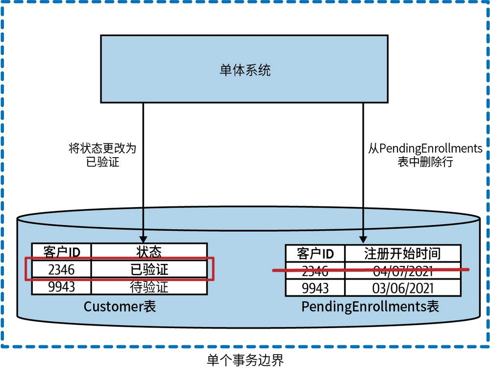
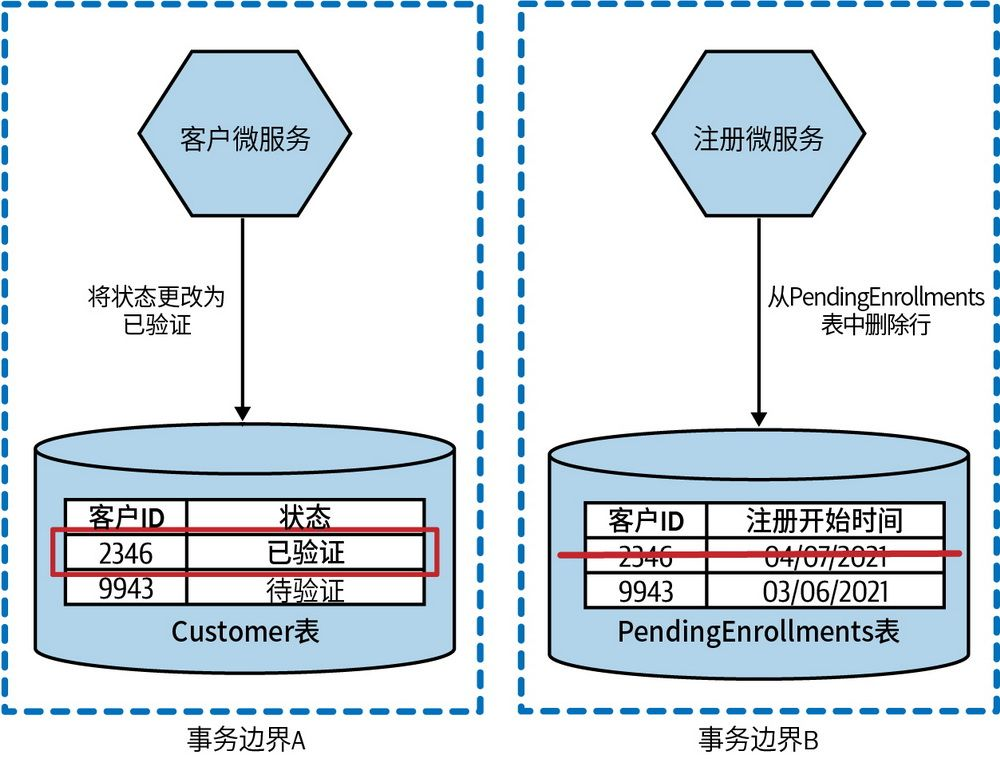
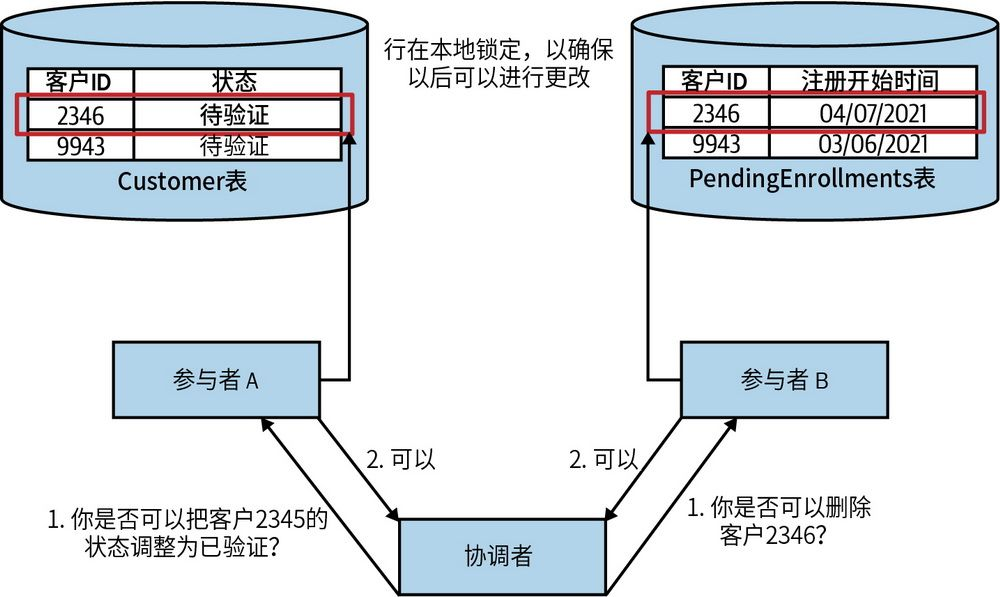
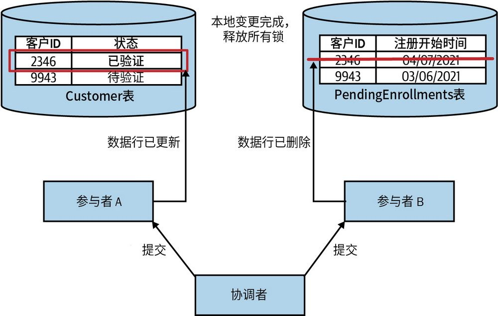
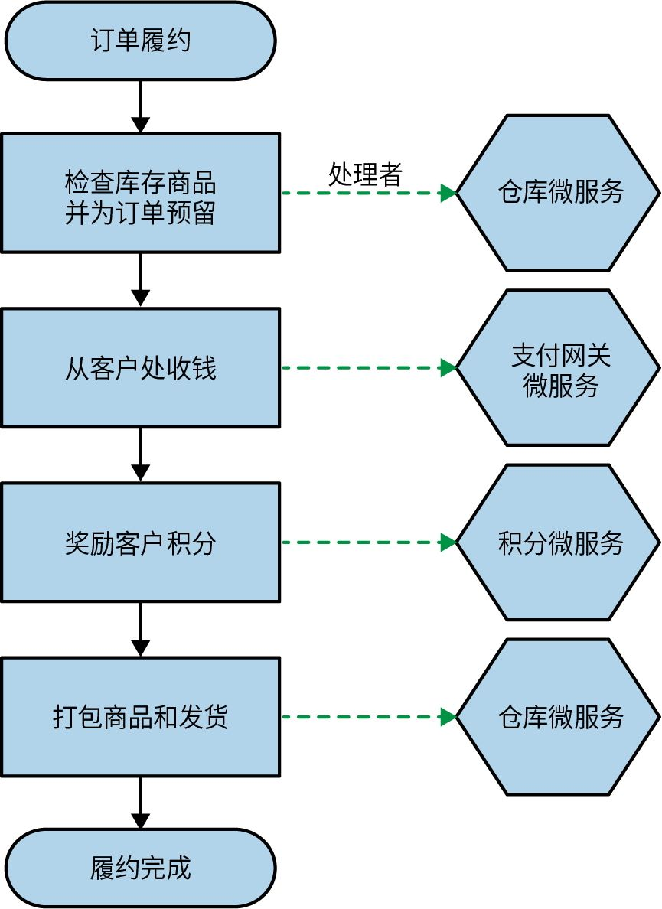
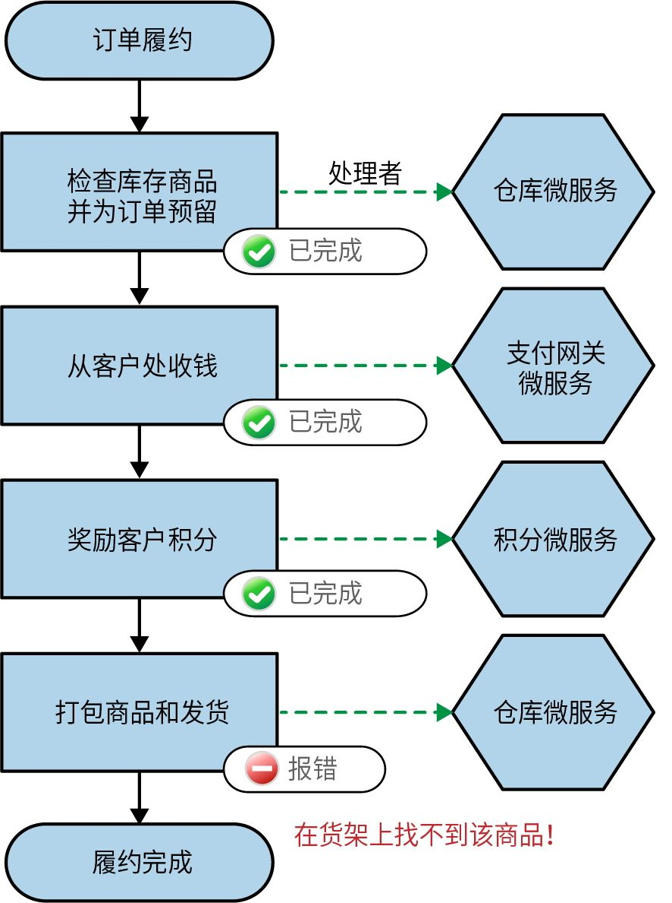
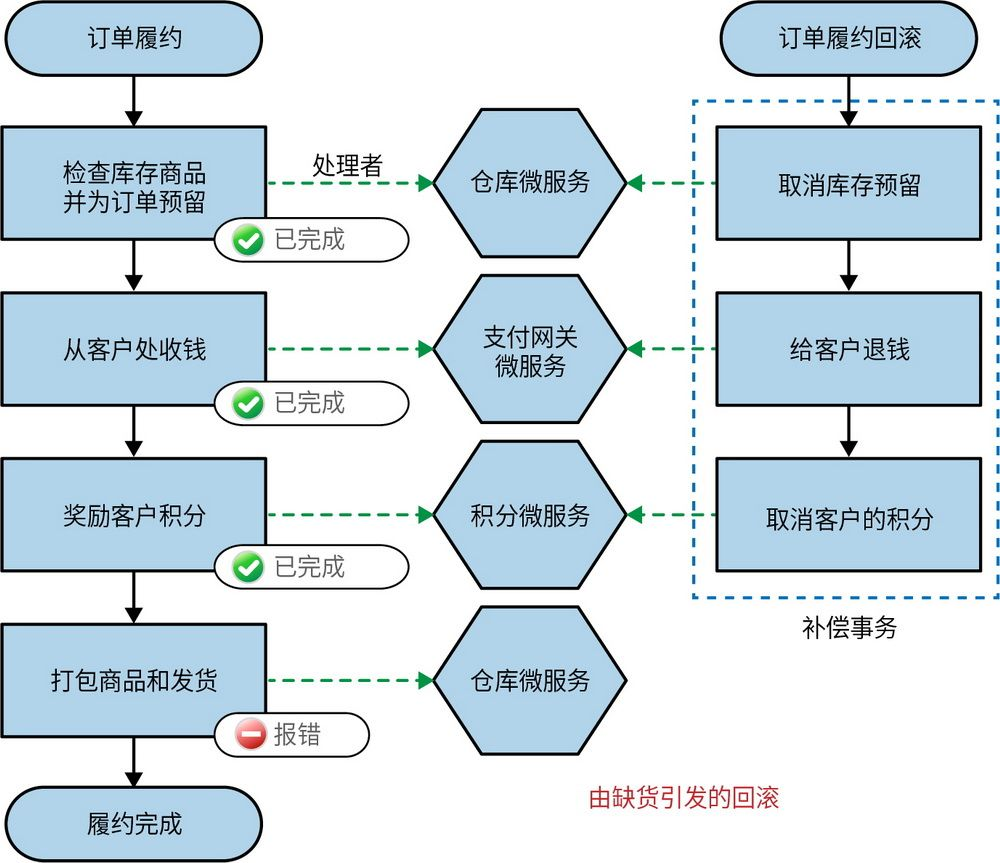
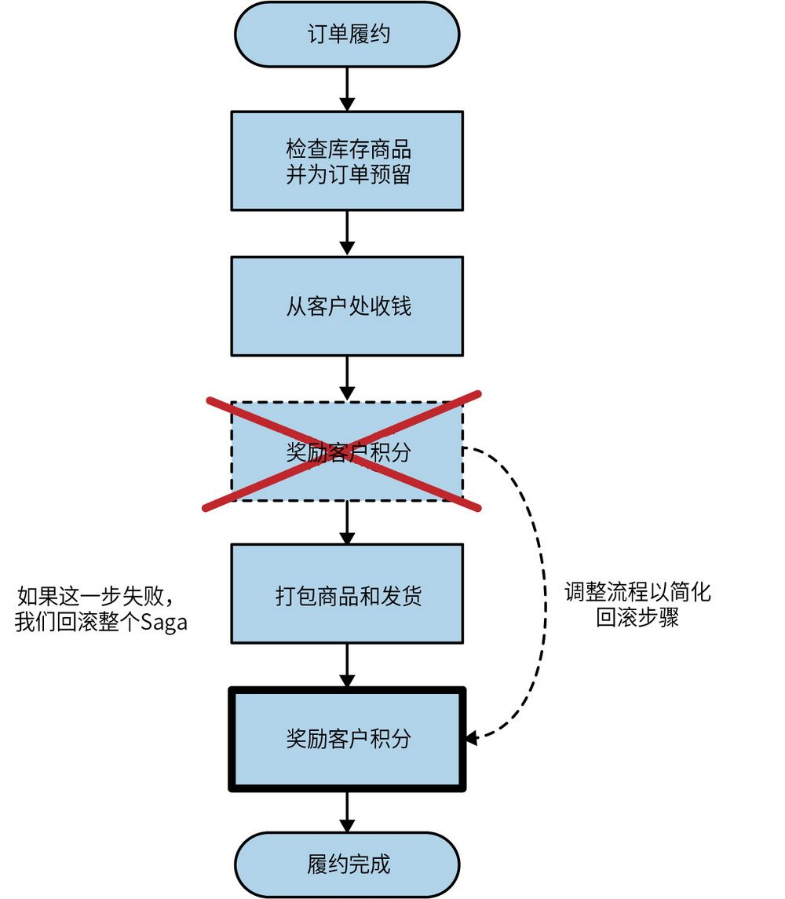
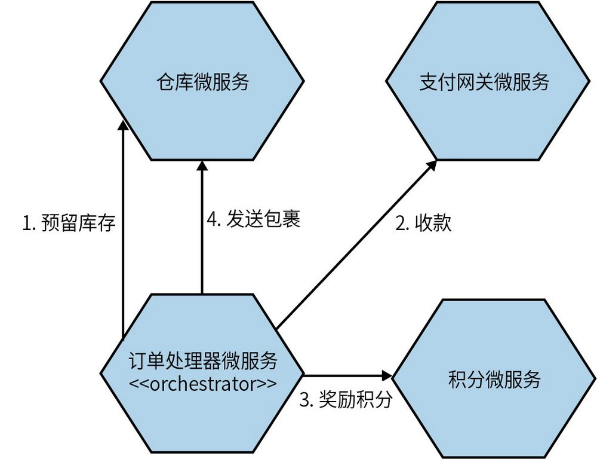
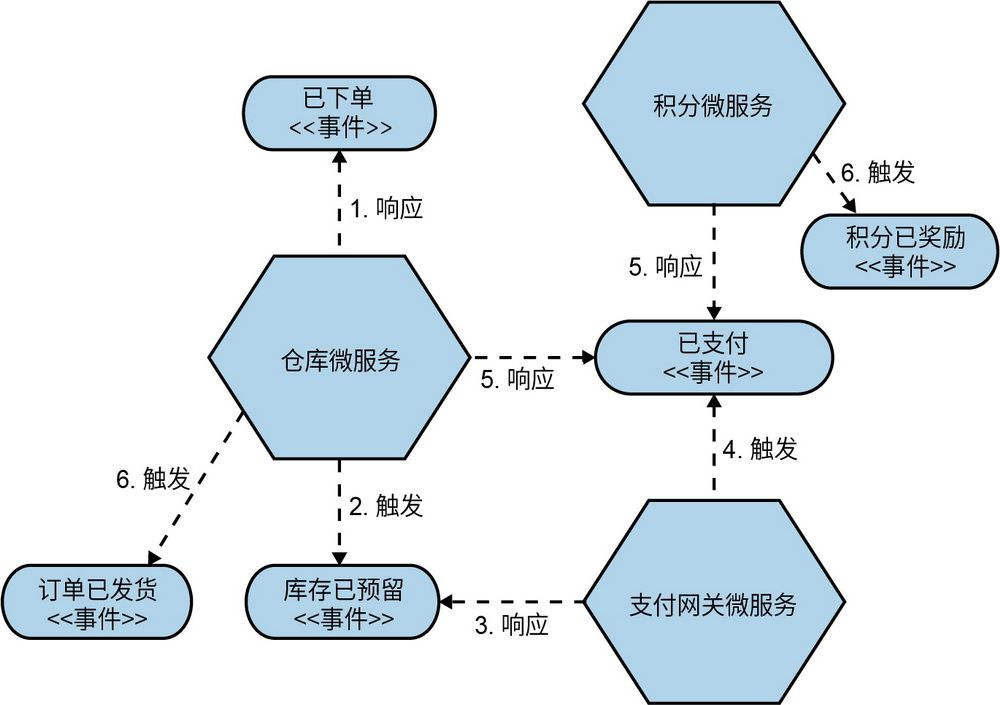

## 第6章 工作流

在第4章和第5章中，我们已经了解了有关微服务如何相互通信的各个方面。但是，当我们希望多个微服务进行协作（也许是为了实现某个业务流程）时，该如何做呢？在分布式系统中建模和实现这类工作流是一项棘手的工作。在本章中，我们将探讨如何使用分布式事务应对这一挑战，同时我们还将了解一种名为Saga的设计模式，它可以帮助我们更好地对微服务工作流进行建模。

### 6.1 数据库事务

通常来讲，在计算领域，事务是指一个或多个必须一起进行的操作。当在同一整体操作中进行多项更改时，我们希望确保所有更改都能成功完成。如果在进行这些更改时发生错误，我们希望有一种方法可以自动清理已经进行的更改。一般情况下，我们使用像数据库事务这样的工具来解决这类问题。

在数据库中，事务用来确保一个或多个状态更改的成功完成，包括数据的删除、插入或更改。对于关系数据库，这可能意味着在单个事务中更新多个表。

#### 6.1.1 ACID事务

通常，当谈论数据库事务时，我们指的是ACID事务。ACID是一个缩略词，概述了数据库事务的关键属性，我们可以借助具备这些属性的系统来确保数据存储的持久性和一致性。ACID代表**原****子****性**（atomicity）、**一****致****性**（consistency）、**隔****离****性**（isolation）和**持****久****性**（durability），以下是这些属性的含义。

**原****子****性**

确保在事务中尝试的操作要么全部完成，要么全部失败。如果执行中的任何更改由于某种原因失败，则整个操作会被中止，就好像从未进行过任何更改一样。

**一****致****性**

当对数据库进行更改时，确保其保持有效、一致的状态。

**隔****离****性**

允许多个事务同时运行且不会相互干扰。这是通过确保在一个事务期间所做的任何临时状态更改对其他事务不可见来实现的。

**持****久****性**

在事务完成后，确保在发生某些系统故障时数据不会丢失。

值得注意的是，并非所有数据库都提供ACID事务。我所使用过的所有关系数据库系统都提供了ACID事务，许多较新的NoSQL数据库（如Neo4j）也支持ACID事务。多年来，MongoDB仅在更改单个文档时支持ACID事务，如果你想对多个文档进行原子更新，这可能会出现问题。
	 

本书并不会对这些概念做深入探讨。简洁起见，我简化了其中的一些描述。对于那些想要进一步学习这些概念的人，我推荐阅读《数据密集型应用系统设计》
	 这本书。接下来，我们将主要关注原子性，这并不是说其他属性不重要，只是当我们开始将功能分解为微服务时，如何处理数据库操作的原子性往往是我们遇到的首要问题。

#### 6.1.2 还是ACID事务，但缺乏原子性支持吗

我想明确一点，在使用微服务时，我们仍然可以使用ACID式的事务。例如，微服务可以自由使用ACID事务对其数据库进行操作。只是这些事务的范围缩小到了单个微服务在本地发生的状态更改。图6-1显示了我们正在追踪将新客户引入MusicCorp所涉及的流程。我们已完成该过程，其中包括将客户2346的状态从“待验证”更改为“已验证”。既然注册已经完成，我们还希望从PendingEnrollments表中删除匹配的行。在单一数据库的情况下，这些修改和删除操作都在单个ACID数据库事务的控制范围内完成，两种状态变更要么同时成功，要么同时失败。

将图6-1与图6-2进行比较，在图6-2中，我们进行了完全相同的更改，但每个更改是在不同的数据库中进行的。这意味着需要考虑两个事务，每个事务的工作状态（正常或失败）都独立于另一个事务。

▲图6-1：更新单个ACID事务范围内的两个表

图6-2：由客户微服务和注册微服务所做的更改现在在两个不同的事务范围内完成

当然，我们可以按顺序执行这两个事务——只有在我们可以更改Customer表中的行时才从PendingEnrollments表中删除一行。但是，如果从PendingEnrollments表中删除行的操作失败，我们仍然需要考虑如何处理，这需要我们自己实现相应的逻辑。但是，一个更好的想法是通过重新排序这些步骤使其更好地处理数据一致性的问题（当我们探究Saga时，会讲到这一点）。但从根本上讲，我们必须接受这样一个事实：通过将这个操作分解成两个单独的数据库事务，我们已经失去了整个操作的原子性保障。

缺乏原子性可能会导致严重的问题，特别是当我们迁移曾依赖此属性构建的系统时。通常，人们考虑的第一个选项仍然是使用单个跨多个进程的事务，即分布式事务。但可惜的是，正如我们将要看到的，分布式事务可能不是正确的前进方向。让我们看看实现分布式事务的常见算法之一——两阶段提交，探索一下与整个分布式事务相关的一些挑战。

### 6.2 分布式事务：两阶段提交

**两****阶****段****提****交****算****法**（two-phase commit algorithm，通常简称为2PC）用于在分布式系统中进行分布式事务的管理。在分布式系统中，如果需要更新多个独立的进程，刚开始实施微服务架构的团队往往会考虑通过分布式事务（特别是两阶段提交的方式）来解决多进程更新的问题。但正如我们将要看到的，两阶段提交可能无法解决这样的问题，甚至会给系统带来混乱。

2PC分为两个阶段（因此得名“两阶段提交”）：投票阶段和提交阶段。在投票阶段，中央协调者（coordinator）联系所有参与者（worker），并询问它们是否可以进行某项状态变更。在图6-3中，我们看到两个请求：一个将客户状态更改为已验证，另一个从PendingEnrollments表中删除一行。如果所有参与者都同意可以执行被要求的状态变更，算法就会进入下一个阶段。如果任何一个参与者表示无法进行更改（可能因为所请求的状态变更违反了某些本地条件），整个操作就会中止。

图6-3：在两阶段提交的第一阶段，参与者投票决定是否可以执行相应的本地变更

需要重点关注的是，参与者在指示可以进行更改后，更改不会立即生效。相反，参与者会保证将来的某个时候能够进行该更改。参与者如何能够提供这样的保证呢？例如，在图6-3中，参与者A表示它能够更改Customer表中行的状态，以将特定客户的状态更新为“已验证”。如果稍后某个时间点的其他操作删除了该行，或者进行了其他较小的更改，导致参与者已验证的操作失效，那该怎么办呢？为了保证以后可以对“已验证”的记录进行更改，参与者A必须锁定该记录，以确保它不被其他操作更改。

如果任意一个参与者没有赞成提交，则需要向其他参与者发送回滚消息，以确保它们可以在本地进行清理，从而让参与者释放相应的锁。如果所有参与者都同意进行更改，我们将进入**提****交****阶****段**，如图6-4所示。在这里进行了实际的更改，并释放了关联的锁。

图6-4：在两阶段提交的提交阶段更改生效了

需要注意的是，在这样的系统中，我们无法以任何方式保证这些提交在同一时间发生。协调者需要向所有参与者发送提交请求，而该消息可能会在不同的时间到达并被处理。这意味着，如果我们能够直接观察任何一个参与者的状态，那么就有可能看到对参与者A所做的更改，但还看不到对参与者B所做的更改。协调者和两阶段提交的参与者之间存在的延迟越长，工作进程处理响应的速度就越慢，所带来的不一致性问题可能就越严重。回顾我们对ACID的定义，隔离性确保我们在事务期间不会看到中间状态。但是，在两阶段提交中，我们失去了这种保证。

当两阶段提交工作时，其核心通常只是协调分布式锁。工作进程需要锁定本地资源，以确保可以在第二阶段进行提交。在单进程系统中管理锁并避免死锁并不容易。试想一下在多个参与者之间协调锁的挑战，这可一点儿也不优雅。

与两阶段提交相关的失败模式太多了，我们没有足够多的时间去探究。考虑这样一个问题：参与者投票决定继续进行事务，但在被要求提交时没有响应。我们该如何做呢？其中一些故障模式可以自动处理，但有些故障模式可能会使系统处于需要操作员手动修复的状态。

参与者越多，系统中的延迟就越多，两阶段提交的问题也就越多。两阶段提交可能会将大量延迟注入系统，尤其是在锁定范围很大或事务持续时间较长的情况下。正是出于这个原因，两阶段提交通常仅用于非常短暂的操作。操作花费的时间越长，锁定资源的时间就越长。

### 6.3 分布式事务：只需说“不”

鉴于目前所提到的所有原因，我强烈建议你避免使用分布式事务（如两阶段提交）来协调跨微服务的状态更改。那么，你还能做些什么呢？

第一种选择是在一开始就不拆分数据。如果你有一些数据的状态需要管理，而这些状态的变更需要保证绝对的一致性和原子性，但在没有传统ACID事务支持的情况下难以实现，那么最好的做法是将这些状态数据保留在一个统一的数据库内，并确保相关的管理功能集中在一个服务中（或者维持在原有的单体应用中）。当你正在思考如何将单体应用拆分成微服务时，你会评估不同部分的拆分难易程度。对于那些在现有事务管理下紧密耦合的数据，你可能会发现立即进行拆分过于复杂。在这种情况下，你可以选择优先处理系统的其他部分，待时机成熟时再回过头来考虑是否拆分。

但是，如果你确实需要将这些数据分开，但又不希望承受管理分布式事务所带来的“痛苦”，那该怎么做呢？如何在多个服务中执行操作又同时避免锁定？如果一个操作需要花费几分钟、几天甚至几个月，该怎么办？在这种情况下，你可以考虑另一种方法：Saga。

**数****据****库****分****布****式****事****务**

我反对使用分布式事务来协调跨微服务的状态更改。在这种情况下，每个微服务都在管理自己的本地持久状态（例如，在其数据库中）。分布式事务算法已经成功地应用于一些大型数据库，谷歌的Spanner就是其中之一。在这种应用场景下，应用程序无须直接介入，底层数据库会自动且透明地处理分布式事务。这些事务的主要作用是在单个逻辑数据库范围内同步状态的变更——即便这个逻辑数据库在物理上可能分布在多台计算机上，甚至跨多个数据中心。

谷歌通过Spanner取得的成就令人印象深刻，但值得注意的是，为取得成效团队付出了很大的代价，克服了许多困难。挑战不光涉及非常昂贵的数据中心，还涉及基于卫星的原子钟（这是真的）。为了更好地理解Spanner是如何做到这一点的，可参阅演示文稿“Google Cloud Spanner: Global Consistency at Scale”
	 。

### 6.4 Saga

与两阶段提交不同，Saga是一种经过设计的算法，可以协调状态中的多个更改，同时避免长时间资源锁定。Saga通过将所涉及的步骤建模为可独立执行的离散活动来实现这一点。此外，使用Saga强制我们对业务流程进行建模，由此带来的额外好处显而易见。

该算法的核心思想由Hector Garcia-Molina和Kenneth Salem在题为“SAGAS”的论文
	 中首次提出，其中重点探讨了如何更好地处理被称为**长****生****命****周****期****事****务**（long-lived transaction，LLT）的操作问题。这些事务可能需要很长时间（几分钟、几小时甚至几天），并且在执行过程中需要对数据库进行更改。

如果将LLT直接映射到普通的数据库事务，那么LLT的整个生命周期内都需要保持数据库事务是开启状态。这可能会导致在LLT发生时，多行甚至整个表被长时间锁定，如果其他进程尝试读取或修改这些锁定的资源，就会导致更大的问题。

相反，论文“SAGAS”的作者建议将这些LLT分解为一系列可以独立处理的事务，其想法是，每个子事务的持续时间都会更短，并且只会修改受整个LLT影响的部分数据。因此，由于锁的范围和持续时间大大缩小或减少，对底层数据库的争用也将大大减少。

虽然Saga最初被设想为一种机制，以帮助处理针对单个数据库的LLT，但该模型在协调跨多个服务的更改时同样有效。我们可以将一个单一的业务流程分解为一组对协作服务的调用——这就构成了Saga。

在进一步讨论之前，你需要了解，Saga不会像普通数据库事务那样提供原子性。当我们将LLT分解为单独的事务时，我们无法确保Saga在整体层面上具备原子性。但Saga中每个单独的事务都具备原子性，因为必要情况下每个事务都可以与ACID的事务更改相关联。Saga为我们提供了足够的信息来判断当前的执行状态，我们可据此决定做何处理。

让我们看看MusicCorp的一个简单的订单履约流程，如图6-5所示。我们可以使用它来进一步探讨在微服务架构中的Saga。

在这里，订单履约过程被表示为一个Saga，此流程中的每个步骤都表示可由不同服务执行的操作。在每个服务内部，任何状态更改都可以在本地的ACID事务中处理。例如，当我们使用仓库微服务进行库存检查和预留时，仓库微服务可能会在其本地的Reservation表中添加一行来记录预留。这一修改会在正常的数据库事务中处理。

图6-5：订单履约流程示例以及负责执行操作的一些服务

#### 6.4.1 Saga故障模式

随着Saga被分解为单独的事务，我们需要考虑如何处理故障，更确切地说，如何在发生故障时进行恢复。最初的有关Saga的论文描述了两种类型的恢复：**向****后****恢****复**（backward recovery）和**向****前****恢****复**（forward recovery）。

向后恢复涉及还原故障并在之后进行清理，即回滚。为此，我们需要定义补偿操作，允许我们撤销先前提交的事务。向前恢复支持从故障发生的点开始继续处理。为此，我们需要能够重试事务，这反过来意味着系统需要保存足够的信息来支持重试。

根据要建模的业务流程的性质，你可能期望任何故障模式都会触发向后恢复、向前恢复，或者两者均有。

但需要注意的是，采用Saga之后，我们能够从业务故障中恢复，但无法从技术故障中恢复。例如，假设我们试图从客户那里收取费用，但客户资金不足，那么这属于业务故障，理论上Saga可以处理。假设支付网关超时或抛出500内部服务错误，这属于技术故障，我们需要单独处理。Saga是在底层组件工作正常的基础上发挥作用的，即底层系统是可靠的，在其上我们使用Saga对这些可靠的组件进行编排。我们将在第12章中探讨如何确保技术组件更加可靠。想要了解更多有关Saga的限制，我推荐阅读Uwe Friedrichsen撰写的“The Limits of the Saga Pattern”一文。

**0****1****.****S****a****g****a****回****滚**

对于ACID事务，如果出现问题，我们会在提交发生之前触发回滚。回滚之后，就像什么都没发生过一样——我们试图做出的更改没有发生。但是，在Saga中，涉及多个事务，其中一些事务可能在我们决定回滚整个操作之前已经提交。那么，在事务已经提交后，我们如何回滚它呢？

让我们回到处理订单的示例（图6-5），假想一个潜在的故障模式。我们在尝试打包商品时，发现在仓库中找不到该商品，如图6-6所示。系统认为该商品存在，但它只是不在货架上。

图6-6：我们尝试打包商品，但在仓库中找不到该商品

现在，假设我们决定回滚整个订单，而不是让客户选择将商品放入备货订单中。但问题是，我们已经收到了付款并奖励了积分。

如果这些步骤是在单个数据库事务中完成的，那么一个简单的回滚就可以清除所有步骤。但是，订单履约过程中的每个步骤都由不同的服务处理，每个服务调用在不同的事务范围内运行。整个操作没有简单的“回滚”。

因此，如果你想实现回滚，则需要实现补偿事务。补偿事务是一个操作，用于撤销先前提交的事务。为了回滚订单履约流程，我们将为Saga中已提交的每个步骤触发补偿事务，如图6-7所示。

图6-7：触发整个Saga的回滚

值得注意的是，这些补偿事务的行为可能与正常的数据库回滚行为不完全一样。数据库回滚发生在提交之前，在回滚之后，就像事务从未发生过一样。当然，在这种情况下，这些事务确实发生了。在Saga中我们会创建一个新事务，用于撤销原始事务所做的更改，但我们无法让时间回滚，使原始事务好像从未发生一样。

因为不能总是干净利落地还原事务，所以说这些补偿事务是**语****义****回****滚**（semantic rollback）。我们不可能清理一切，但在Saga中我们已经做了足够的工作。例如，其中一个步骤可能涉及向客户发送电子邮件，告知客户他们购买的商品已经发货。如果决定回滚，我们无法撤销已发送的电子邮件。
	 但补偿事务可能会向客户发送第二封电子邮件，通知他们订单出现问题并已取消。

与回滚相关的信息保留在系统中是完全必要的。事实上，这些信息可能是非常重要的信息。出于多种原因，你可能希望在订单服务中保留中止订单的记录以及相关信息。

**0****2****.****重****新****编****排****工****作****流****步****骤****以****减****少****回****滚**

在图6-7中，我们可以通过对原始工作流中的步骤重新排序，使可能的回滚方案更加简单。一个简单的更改是仅在实际发货时才奖励积分，如图6-8所示。

图6-8：在Saga中修改步骤可以减少在发生故障时需要回滚的操作

通过这种方式，如果在打包商品和发货时出现问题，我们就不用担心该阶段被回滚。有时，只需调整工作流的执行方式，即可简化回滚操作。通过将最有可能失败的步骤提前，并尽早终止流程，可以避免触发后续的补偿事务，因为这些步骤甚至还没来得及被触发。

如果这些步骤的执行顺序可以调整，那么你的工作会变得更轻松，甚至不需要为某些步骤创建补偿事务。当很难实现补偿事务时，这一点可能显得特别重要。你可以将流程中的某个步骤移到一个永远不需要回滚的阶段。

**0****3****.****混****合****故****障****恢****复****模****式****场****景**

混合使用故障恢复模式是极有可能的。某些故障可能需要回滚；其他情况可能需要重试。例如，对于订单处理，一旦我们从客户那里收到了钱且商品已经打包，剩下的唯一步骤就是发货。如果由于某种原因无法发货（也许是因为使用的送货公司今天没有空余的货车接受订单），那么将整个订单回滚似乎非常奇怪。相反，我们只需要重试调度（可能安排在第二天发货），如果仍然失败，再引入人工干预来处理这种情况。

#### 6.4.2 实现Saga

到目前为止，我们已经了解了Saga工作的逻辑模型，但仍然需要更深入地研究实现Saga本身的方法。我们可以看看两种类型的Saga实现。**编****排****式**（orchestrated）Saga更加贴近原始解决方案，主要依赖于集中的协调和追踪。**协****同****式**（choreographed）Saga避免了集中协调，支持更松散耦合的模型，但可能会使追踪Saga的进度变得更加复杂。

**0****1****.****编****排****式****S****a****g****a**

编排式Saga使用中央协调者（下文将其称为“编排器”）来定义执行顺序并触发任何所需的补偿操作。你可以将编排式Saga视为一种命令和控制方法：编排器控制发生什么以及何时发生，同时对于任何特定的Saga，这种方式提供了相当高的可见性，使你了解每个Saga的操作和状态。

以图6-5中的订单履约流程为例，让我们看看这个中央协调过程中的一组协作服务是如何工作的，如图6-9所示。

图6-9：使用编排式Saga实现订单履约流程的示例

在这里，订单处理器微服务扮演编排器的角色来协调履约过程。它知道执行操作需要哪些服务，并决定何时调用这些服务。如果调用失败，它可以决定最终要执行的操作。通常，编排式Saga倾向于大量使用服务之间的请求-响应交互：订单处理器微服务向其他服务（如支付网关微服务）发送请求，并期望收到响应，以确认请求是否成功并提供请求的结果。

在订单处理器微服务内部对我们的业务流程进行显式的建模是非常有益的。它使我们只通过查看系统中的一个地方，就可以了解整体流程是如何工作的。这让入职培训更加容易，有助于新员工更好地了解系统的核心部分。

不过，还有一些缺点需要考虑。首先，从本质上来说，这依然是一种耦合的实现方式。订单处理器微服务需要了解所有相关的服务，从而导致了更高程度的领域耦合。虽然领域耦合本身并不是坏事，但如果可能的话，我们仍然希望将其保持在最低程度。在这里，订单处理器微服务需要了解和控制很多事情，因此耦合是难以避免的。

另一个更微妙的问题是，原本应该被推送到服务中的逻辑可能会开始被吸收到编排器中。如果开始发生这种情况，你可能会发现你的服务变得“贫血”，几乎没有自己的行为，只是从编排器如订单处理器微服务中接收命令。重要的是，你应该仍然将组成这些编排流程的服务视为具有自己本地状态和行为的实体。它们需要负责自己的本地状态机。

只要逻辑有一个可以集中的地方，它就会逐渐集中在那里！

一个避免业务流程过度集中化的方法是确保在不同的流程中有不同的服务扮演编排器的角色。你可能有一个处理下订单的订单处理器微服务，一个处理退货和退款流程的退货微服务，以及一个处理新库存到货和上架的收货微服务，等等。这样，像仓库微服务这样的服务可以被所有这些编排器使用；这种模型使你更容易地将功能保留在仓库微服务本身中，允许你在所有这些流程中重复使用功能。

**B****P****M****工****具**

业务流程建模（business process modeling，BPM）工具已经存在多年。总的来说，它们旨在允许非开发人员定义业务流程，且通常提供可视化拖放工具。BPM工具的核心思想是，开发人员创建这些流程的组件，而非开发人员将这些组件连接到更大的流程中。使用这些工具似乎非常适合实现编排式Saga，事实上，流程编排几乎是BPM工具的主要用例（或者反过来说，使用BPM工具导致你必须采用编排式Saga）。

就我的经验而言，我非常不喜欢BPM工具。主要原因是，非开发人员定义业务流程这一核心思想在我的经历中几乎从未实现过。为非开发人员开发的工具最终会被开发人员使用，但可惜的是，这些工具的工作方式通常与开发人员的工作方式格格不入：它们通常需要使用GUI来更改流；它们创建的流可能难以（或不可能）进行版本控制；流本身在设计时可能没有考虑到测试……

如果你的开发人员要实现你的业务流程，请让他们使用他们了解并适合他们工作流程的工具。一般来说，这意味着让他们使用代码来实现这些内容。如果你需要了解业务流程的实现方式或运行方式，那么从代码中投射出工作流的可视化表示要容易得多，而使用工作流的可视化表示形式来描述代码如何工作要难得多。

目前有一些对开发人员更友好的、符合他们需求的BPM工具。开发人员对这些工具的反馈似乎好坏参半。对一些人来说，这些工具效果很好。看到人们试图改进这些框架是件好事。如果你觉得有必要进一步探索这些工具，可以了解Camunda和Zeebe，它们都是面向微服务开发人员的开源编排框架，如果我想要使用BPM工具，它们会是我的首选。

**0****2****.****协****同****式****S****a****g****a**

协同式Saga旨在将操作Saga的责任分配给多个协作服务。如果编排是一种命令和控制方法，则协同式Saga就是“信任但要验证”（trust-but-verify architecture）的架构。如图6-10所示，协同式Saga通常会大量使用事件来进行服务之间的协作。

图6-10：使用协同式Saga实现订单履约流程的示例

这里有很多事情要做，值得更详细地探讨。首先，这些微服务会对接收到的事件做出响应。从概念上讲，事件在系统中广播，感兴趣的各方都能够接收它们。记住，我们在第4章中讨论过，你不会将事件发送到微服务，你只是将它们广播出去，对这些事件感兴趣的微服务可以接收并采取相应的行动。在我们的示例中，当仓库微服务收到第一个“已下单”事件时，它知道自己的任务是预留适当的库存，并在完成后触发一个事件。如果无法收到库存，仓库微服务需要触发对应的事件（比如“库存不足”事件），这可能会导致订单中止。

在这个示例中，我们还看到了如何并行处理事件。当支付网关微服务触发“已支付”事件时，它会引发积分微服务和仓库微服务做出响应。仓库微服务通过发货来做出响应，而积分微服务通过奖励积分来做出响应。

通常，你会使用某种消息代理来管理事件的可靠广播和传递。多个微服务可能会对同一事件做出反应，我们可以通过主题来实现。对某种类型的事件感兴趣的各方将订阅特定的主题，而不必担心这些事件的来源，消息代理可以确保该主题的持久性，并将相应的事件成功交付给订阅者。例如，我们可能有一个推荐微服务，该服务也会监听“已下单”事件，并使用它来构建你可能喜欢的音乐数据库。

在前面的架构中，没有一个服务知道其他微服务的存在。它们只需要知道在接收到某个事件时该做什么——我们已经大大减少了领域耦合的数量。本质上这使得架构中的耦合减少了。由于流程的实现被分解并分布在这里的3个微服务中，我们也避免了对逻辑集中化的担忧。（如果没有一个地方可以集中逻辑，那么逻辑就不会集中！）

但是，弄清楚系统到底发生了什么变得更加困难。在编排式Saga下，我们的流程在编排器中被显式建模。现在，使用了协同式Saga后，你将建立一个什么样的心智模型来说明整体业务流程呢？你必须独立地查看每个服务的行为，并在自己的脑海中重建这幅图景——即便构建本书中这样一个简单的业务流程，也远非易事。

缺乏业务流程的显式表示已经够糟糕的了，但更糟糕的是，我们还缺乏一种了解Saga处于何种状态的方法，这可能会使我们错失在需要时采取补偿操作的机会。我们可以将一些责任推给各个服务来执行补偿操作，但从根本上说，我们需要一种了解Saga状态的方法，以便进行某些类型的恢复。缺少一个中央位置来查询Saga的状态是一个大问题。我们在编排中实现了这一点，那么在这里我们如何解决这一问题呢？

解决这个问题的简单方法之一是基于事件的消费情况来投射出有关Saga状态的视图。如果我们为Saga生成一个唯一的关联ID（也称“相关性ID”），我们可以将其放在所有和Saga相关的被发布的事件中。当我们的某个服务对事件做出反应时，关联ID将被提取出来并用于任何本地日志的记录；它还会随调用或事件一起向下游传递。然后，我们可以有一个专门的服务，其工作就是监听所有这些事件，并呈现每个订单的状态视图。如果有的服务无法自行执行操作，我们可以通过编程的方式执行补偿操作。我认为某种形式的关联ID对于像这样的协同式Saga至关重要，不过关联ID在更普遍的情况下也有很大的价值，我们会在第10章中进行更深入的探讨。

**0****3****.****混****合****风****格**

编排式Saga和协同式Saga看起来似乎是两种截然相反的实现方式，但实际应用时可以混合使用两种模式。你的系统中可能有一些业务流程更适合编排式Saga，另一些业务流程更适合协同式Saga，甚至在同一个Saga中可以混合使用这两种风格。以订单履约流程为例，在仓库微服务的边界内，在管理订单的商品打包和发货时，我们可以使用编排式Saga，即使原始请求是作为一个更大的协同式Saga的一部分给出的。
	 

如果你决定使用混合风格，那么具有一种清晰的方式来了解Saga处于何种状态，以及Saga内部的一部分已经发生了哪些活动，将非常重要。否则，定位故障产生的原因将会变得复杂，且很难从故障中恢复。

**追****踪****调****用****链****路**

无论选择编排式Saga还是协同式Saga，在使用多个微服务实现业务流程时，我们通常希望能够追踪与该流程相关的所有调用。有时这不仅是为了帮助我们了解业务流程是否正常工作，也是为了帮助我们诊断问题。

在第10章中，你将了解关联ID和日志聚合等概念，以及它们是如何在这些方面提供帮助的。

**0****4****.****应****该****使****用****编****排****式****还****是****协****同****式****（****或****混****合****式****）**

实现编排式Saga可能会引入一些你和你的团队不太熟悉的概念。它通常需要大量使用事件驱动的协作，而事件驱动的协作是一种还未被广泛理解的概念。另外，根据我的经验，追踪Saga进度所带来的复杂度几乎总是可以通过拥有更松散耦合的架构所带来的好处来弥补。
	 

然而，撇开我个人的偏好不谈，我的建议是，当一个团队负责实现整个Saga时，最好使用编排式Saga。在这种情况下，固有耦合的体系结构在团队边界内更容易管理。如果涉及多个团队，我更倾向于使用协作式Saga，因为它更容易将实现Saga的责任分配给团队，而更松散耦合的架构允许这些团队更独立地工作。

值得注意的是，作为一般性指导原则，你在编排式Saga中更有可能使用请求-响应模式的调用，而在协作式Saga中更可能更多地使用事件。这不是一个硬性规定，只是一个一般性观察。我个人更倾向于使用协作式Saga，可能是因为我更倾向于事件驱动的交互模型。如果你发现很难理解事件驱动的协作，那么协作式Saga可能不适合你。

#### 6.4.3 Saga与分布式事务

我希望我已经把问题分析得比较清楚了，分布式事务带来了一些重大挑战，除非是特别情况，我倾向于避免使用它们。Pat Helland是分布式系统的先驱，他提炼了我们在今天构建的各种应用中实现分布式事务所面临的基本挑战。
	 

在大多数分布式事务系统中，单个节点的故障会导致事务提交停止。这反过来会导致应用程序被卡住。在这样的系统中，系统规模越大，就越可能发生故障。这就像驾驶需要所有发动机正常运转的飞机，增加发动机会降低飞机的可用性。

根据我的经验，将业务流程显式建模为Saga可以避免分布式事务的许多挑战，同时还具有额外的好处，那就是使本来可能是隐式建模的流程对开发人员来说更加明确和明显。将系统的核心业务流程视为优先概念来对待将带来很多优势。

### 6.5 小结

正如我们所看到的，在微服务架构中实现工作流的路径，可以归结为对业务流程进行显式建模的过程。这让我们回到了微服务架构中对业务领域建模的概念，如果我们的微服务边界是根据业务领域来定义的，那么对业务流程进行显式建模就是有意义的。

无论你决定使用编排式Saga还是协作式Saga，希望你都能清楚哪种模式更适合解决你的问题。

本书虽然没有明确涵盖Saga的内容，但是如果你想深入探索这个领域，我推荐你阅读Gregor Hohpe和Bobby Woolf所著的《企业集成模式：设计、构建及部署消息传递解决方案》。这本书中提供了许多非常有用的模式，可用于实现不同类型的工作流。我也强烈推荐Bernd Ruecker所著的《流程自动化实战：系统架构和软件开发视角》
	 。这本书更侧重于Saga的编排方面，它围绕这一主题提供了很多有用的信息。

现在，我们了解了微服务如何相互通信和协调，但是它们是如何被构建的呢？第7章将介绍如何在微服务架构的上下文中应用源代码管理、如何持续集成和持续交付。
