## 第7章 构建

前面已经花了不少篇幅介绍微服务的设计，接下来我们开始更深入地了解要适应这种新的架构风格，开发过程可能需要哪些改变。接下来的章节中，我们将介绍如何部署和测试微服务，在此之前，让我们先聚焦一件事——在开发人员准备好签入代码更改时会发生什么。

让我们的探索之旅从回顾一些基本概念开始：持续集成和持续交付。无论你使用哪种系统架构，这些都是重要的概念，但微服务会带来一系列独特的问题。接下来，我们将介绍流水线以及管理微服务源代码的不同方法。

### 7.1 持续集成简介

**持****续****集****成**（continuous integration，CI）已经存在多年了，不过，花一点儿时间让我们来回顾一下基础知识是很有必要的，因为有一些不同的选项需要考量，特别是在考虑微服务、构建和版本控制库之间的映射时。

持续集成的核心目标是确保所有人保持同步，实现这一点就要确保新签入的代码与现有代码高频地正确集成。为了做到这一点，CI服务器会检测到代码已提交，将其签出，并执行一些验证，例如确保代码已编译且测试通过。我们期望每天至少进行一次这样的集成，但根据以往的经验，我之前所在的多个团队，因为代码变更频繁，开发人员每天会进行多次集成。

在这个过程中，我们经常会创建用于进一步验证的制品（artifact），例如部署一个正在运行的服务来对其进行测试（我们将在第9章中深入探讨测试这个主题）。理想情况下，我们会希望这些制品只构建一次，并将其用于该版本代码的所有部署。这样可以避免反复进行相同的操作，并确保部署的制品就是测试的制品。为了使这些制品可以被重复使用，我们将它们放置在某个类型的存储库中，它可以是由CI工具本身提供的存储库，也可以是一个独立系统的存储库。

我们将很快了解制品在整个过程中的作用，并在第9章深入探究测试这个主题。

持续集成有许多好处。使用静态分析和测试可以帮助我们快速获得有关代码质量的反馈。持续集成还允许自动创建二进制制品。构建制品所需的所有代码本身都是受版本控制的，因此可以根据需要重新创建制品。使用持续集成可以从已部署的制品追溯到代码，并根据CI工具本身的功能，还可以看到对代码和制品运行了哪些测试。如果使用基础设施即代码的实践，还可以对配置微服务的基础设施所需的所有代码以及微服务本身的代码进行版本控制，从而提高更改的透明度，并使重现构建变得更加容易。正是由于这些原因，持续集成才如此受欢迎。

#### 7.1.1 你真的在实践持续集成吗

持续集成是一种关键实践，它使我们能够快速、轻松地进行更改；如果没有它，进入微服务的旅程将是痛苦的。你可能正在自己的组织中使用CI工具，但这可能和真正意义上的持续集成不是一回事儿。我见过很多人把使用CI工具当作实践持续集成。使用良好的CI工具将帮助你实践持续集成。但是Jenkins、CircleCI、Travis这类工具并不能保证你真正正确地实践持续集成。

那么你如何知道自己是否真的在实践持续集成呢？我很喜欢Jez Humble提出的3个问题，可用来测试人们是否真正理解了持续集成的核心概念。你也可以问问自己这3个问题，看看自己会如何回答。

你每天都向主干分支提交代码吗？

你需要确保自己的代码能够进行集成。如果不经常同步代码和其他人的更改，以后的代码集成只会更加困难。即使使用短期分支来管理更改，也要尽可能频繁地将代码集成到单一的主干分支中——至少每天一次。

你是否有一套测试来验证你的更改？

如果没有测试，那么我们只知道集成在语法上是有效的，但不知道是否破坏了系统的行为。如果没有验证代码行为是否符合预期的测试，那就不是真正的持续集成。

当构建被破坏时，修复它是团队的首要任务吗？

一个通过的绿色构建意味着我们的更改已经安全地集成。一个红色构建表示最近的更改可能没有成功集成。构建再次通过之前，禁止提交任何不参与修复构建的代码。不断堆积更改只会大大增加修复构建所需的时间。我曾与构建被破坏数天的团队合作，最终付出了巨大努力才使构建再度通过。

#### 7.1.2 分支模型

在构建和部署方面，很少有话题像使用代码分支进行功能开发这样引起如此多的争议。代码分支允许在不中断其他人工作的情况下独立进行开发。从表面上看，为正在处理的每个功能创建一个代码分支（也称为“功能分支”）的想法似乎不错。

问题在于，当处理功能分支时，你没有定期将自己的更改与其他人的更改集成。从根本上说，这是在延迟集成。当你最终决定将更改与其他所有人的更改集成时，你会发现合并变得非常困难。

另一种替代方法是让每个人都在同一个源代码的“主干”上提交代码。为了防止更改影响其他人，功能开关等技术被用于“隐藏”未完成的工作。这种每个人都在同一个主干上工作的技术被称为“**基****于****主****干****的****开****发**”（trunk-based development）。

围绕这个话题的讨论非常复杂，但我自己的看法是，高频集成以及验证集成非常重要，我会将基于主干的开发作为首选开发风格。此外，功能开关的实现在渐进式交付方面非常有用，我们将在第8章探讨与渐进式交付相关的内容。
	

**小****心****分****支**

尽早集成并经常集成。避免使用长生命周期的分支进行功能开发，考虑使用基于主干的开发。如果你确实必须使用分支，那么尽量让分支的生命周期足够短。

除了我自己的个人经验之外，越来越多的研究表明减少分支数量和采用基于主干的开发效果显著。DORA和Puppet发布的《DevOps现状报告（2016年）》
	 对世界各地组织的交付实践进行了研究，总结了高绩效团队常用的做法。

我们发现，在合并到主干之前，分支或分叉（fork）的生命周期非常短（不到一天），而且总共活跃的分支少于3个，这些都是持续交付的重要方面，并对提高团队效能有所帮助。每天将代码合并到trunk（svn的主干分支）或master（git的主干分支）也是如此。

在随后的几年，《DevOps现状报告》继续深入探讨这一主题，并不断发现能够证明这种方法有效性的证据。

在开源开发中，仍然普遍使用大量分支，并采用GitFlow开发模型来对分支进行管理。值得注意的是，开源开发与日常开发并不相同。开源开发的特点是来自“不可信”提交者的大量临时贡献，其更改需要由少数“可信”贡献者进行审查。典型的日常闭源开发通常由一个紧密合作的团队完成，即使团队成员决定采用某种形式的代码审查过程，团队中的每个人仍然拥有代码提交权限。因此，适用于开源开发的方法可能不适用于你的日常工作。即便如此，《DevOps现状报告（2019年）》
	 进一步探讨了这一主题，发现了一些有关开源开发和“长生命周期”分支的影响的有趣见解。

我们的研究结果扩展到了某些领域的开源开发。

·越早提交代码越好：在开源项目中，许多人观察到，更快地合并补丁以防止变基（rebase），有助于开发人员更快地推进工作。

·采用小批量变更工作更好：相较于大型的批量补丁，较小且更易读的补丁集更容易被合并到项目中，因为维护者审查这些变更所需的时间更少。

无论你是在闭源代码库还是在开源项目中工作，短期分支、小且可读的补丁以及对变更进行自动测试都可以提高工作效率。

### 7.2 构建流水线和持续交付

在持续集成实践的早期，我和当时在Thoughtworks的同事都意识到，有时在构建过程中设置多个阶段是有价值的。测试是一个非常常见的可以设置多个阶段流水线的例子。我们可能有很多快速的小范围测试，以及少量较慢的大范围测试。如果我们将所有测试一起运行，并等待较慢的大范围测试完成，那么当其中的快速测试失败时，我们可能无法快速获得反馈。而且，如果快速测试失败，那么慢速测试可能就没有多大意义了。此问题的解决方案是在流水线构建中创建不同的阶段，创建所谓的“**构****建****流****水****线**”（build pipeline）。因此，我们可以为所有快速测试设置一个专用阶段，并提前运行；如果全部通过，则继续运行一个独立的阶段来执行慢速测试。

这种构建流水线的概念为我们提供了一种很好的方式来追踪软件在每个阶段的进度，帮助我们了解软件的质量。我们创建了一个可部署的制品，最终将该制品部署到生产环境中，并在整个流水线中使用该制品。在上下文中，这个制品与要部署的微服务相关。在图7-1中，我们可以看到这一过程——在流水线的每个阶段都使用相同的制品，这让我们越来越有信心——经过流水线检查的软件可以在生产环境中正常运行。

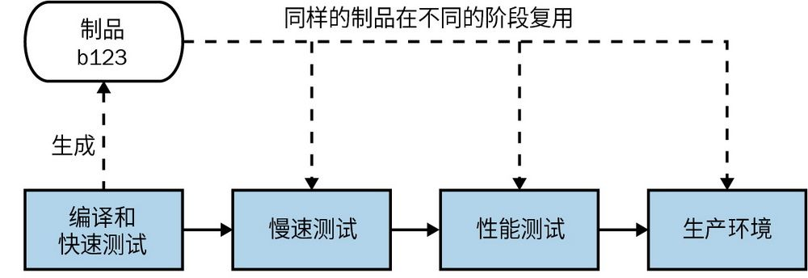

图7-1：基于构建流水线的专辑目录微服务的简单发布过程

**持****续****交****付**（continuous delivery，CD）也是基于构建流水线这一概念的，并进一步扩展了其范畴。正如Jez Humble和Dave Farley的著作《持续交付：发布可靠软件的系统方法》
	 中所述，持续交付是一种方法，通过该方法我们可以持续获得关于每次提交在生产环境中就绪状态的反馈，并将每次提交都视为一个发布候选版本。

要真正理解并实现这个概念，我们需要对软件从签入到生产环境所涉及的所有流程进行建模，并需要知道软件的任何给定版本在发布准备方面的状态。在持续交付中，我们通过对软件必须经历的每个阶段（包括手动阶段和自动阶段）进行建模来实现此目的。例如，图7-1展示了专辑目录微服务的一个示例。现今的大多数CI工具都提供了一些支持，用于定义和可视化构建流水线的状态，如图一样。

如果新的专辑目录微服务通过了流水线中某个阶段的所有检查，那么它就可以继续执行下一步。如果它没有通过某个阶段，CI工具可以告知我们制品已通过哪些阶段，并允许我们查看哪些阶段失败了。如果需要采取措施修复，我们会进行代码更改并签入，确保新版本的微服务通过所有阶段后再进行部署。图7-2展示了一个示例：build-120在快速测试阶段失败，build-121在性能测试中失败，但build-122成功运行到了生产环境。

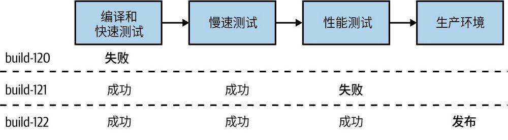

图7-2：专辑目录微服务只有在通过流水线中的所有阶段后才能成功部署到生产环境

**持****续****交****付****与****持****续****部****署**

有时我会看到有些人混淆了持续交付和持续部署这两个术语。正如之前讨论过的，持续交付是一种概念：每次代码提交都被视为一个发布候选版本，且我们可以评估每个发布候选版本的质量，以确定它是否准备好进行部署。而持续部署是一种不同的方法，它要求所有的代码提交必须通过自动化机制（例如测试）的验证，任何通过这些验证检查的软件都会自动部署，无须人工干预。因此，可以将持续部署视为持续交付的延伸。没有持续交付，就无法实现持续部署。但是，**可****以****在****不****进****行**持续部署的情况下进行持续交付。

持续部署并非适合所有情况——许多人希望进行一些人工干预来决定是否应该部署软件，这与持续交付没有任何冲突。不过，采用持续交付确实意味着持续关注如何优化部署路径，由此增加的可见性让我们更容易看到应该在何处进行优化。通常，代码提交后的人工参与，是需要破除的流程瓶颈，例如，从手动回归测试转向自动化功能测试。因此，随着越来越多的构建自动化、部署自动化和发布过程自动化，你可能会发现自己越来越接近持续部署的目标。

#### 7.2.1 工具

理想情况下，你希望有一个工具能将持续交付作为一等公民来对待。我曾看到许多人试图修改和扩展CI工具来实现持续交付，这通常导致工具变得越来越复杂，修改后的工具远不如一开始就内置了持续交付功能的工具易于使用。支持CD比较好的工具允许我们定义和可视化流水线，并为软件的部署过程建模。当代码的某个版本在流水线中运行时，如果它通过了其中一个自动化验证阶段，就会自行进入下一阶段。

某些阶段可能是手动的。例如，如果有一个手动用户验收测试（user acceptance testing，UAT）流程，我们的CD工具也应当能够提供支持。通过流水线，我们可以看到有一个新的可用版本的制品已经准备好，并通过CD工具将其部署到UAT环境中；如果它通过了手动检查，则该阶段被标记为“成功”，以便它进入下一阶段。如果后续阶段是自动化的，那么也会被自动触发。

#### 7.2.2 权衡与环境

当微服务制品在流水线上移动时，它会被部署到不同的环境中。不同的环境服务于不同的目的，它们可能具有不同的特征。

构建流水线并搭建出你需要的环境，这本身就是一个权衡利弊的过程。在流水线的早期阶段，我们希望获得有关软件的生产准备状态的快速反馈。如果有问题，我们希望尽快告知开发人员——他们越早获得有关问题的反馈，就能越快地解决问题。随着软件越来越接近生产环境，我们希望对软件能够正常运行有更高的确定性，因此会将软件部署到越来越接近生产环境的环境中——你可以在图7-3中看到这样的权衡。

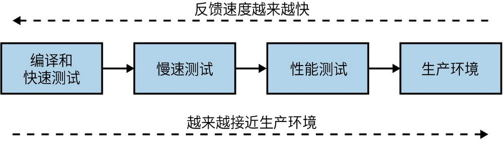

图7-3：平衡构建流水线以实现快速反馈和类生产环境的部署

在本地计算机上，你可以获得最快的反馈，但本地环境远不同于生产环境。你可以将每次提交的代码都部署到与实际的生产环境完全相同的环境中，但这可能需要更长的时间和更高的成本。因此，找到平衡至关重要，这就要求我们在快速反馈和类生产环境的构建之间不断权衡。

创建类生产环境的挑战也是越来越多的人在生产环境中进行各种测试的原因之一，其中包括冒烟测试和并行运行等技术。我们将在第8章中再次讨论这个话题。

#### 7.2.3 构建制品

当我们将微服务部署到不同的环境中时，实际上我们是在针对一些产出物进行操作。事实上，你可以选择多种不同类型的部署制品。一般来说，你构建的部署制品在很大程度上取决于你所选择的部署技术。我们将在第8章深入探讨这一点，但我想给你一些重要提示，告知你如何将制品构建与你的CI/CD构建过程相结合。

简单起见，我们将跳过要创建的制品类型的具体细节——暂时将其视为一个可部署的二进制大对象。现在，我们需要考虑两个重要规则。首先，正如我之前提到的，我们应该只构建一次制品。反复构建同样的东西既浪费时间，又不环保。如果每次构建的配置都不完全相同，理论上可能会带来问题。在某些编程语言中，不同的构建配置可能会使软件的行为完全不同。其次，你所验证的制品应该是你要部署的制品。如果你构建了一个微服务，对其进行测试，然后说“是的，它可以运行”，之后再次构建它以部署到生产环境中，你又怎么确保经过验证的软件与你所部署的软件是相同的呢？

考虑到这两点，我们就有了一个非常简单的方法，即构建可部署的制品时只需构建一次，理想情况下，最好在流水线的早期阶段就做这件事。我通常会在编译代码（如果需要）并运行快速测试后执行此操作。创建后，相应的制品会存储在一个适当的存储库中——可能是Artifactory或Nexus之类的存储库，或者是容器仓库（container registry）。用于部署的制品的形式通常决定了其制品的存储库。之后，同样的制品会用于流水线后续的所有阶段，包括部署到生产环境这一阶段。因此，回到我们早期所说的流水线，我们可以在图7-4中看到，在流水线的第一个阶段为专辑目录微服务创建了一个制品，然后在慢速测试、性能测试和生产环境部署了相同的制品build-123。

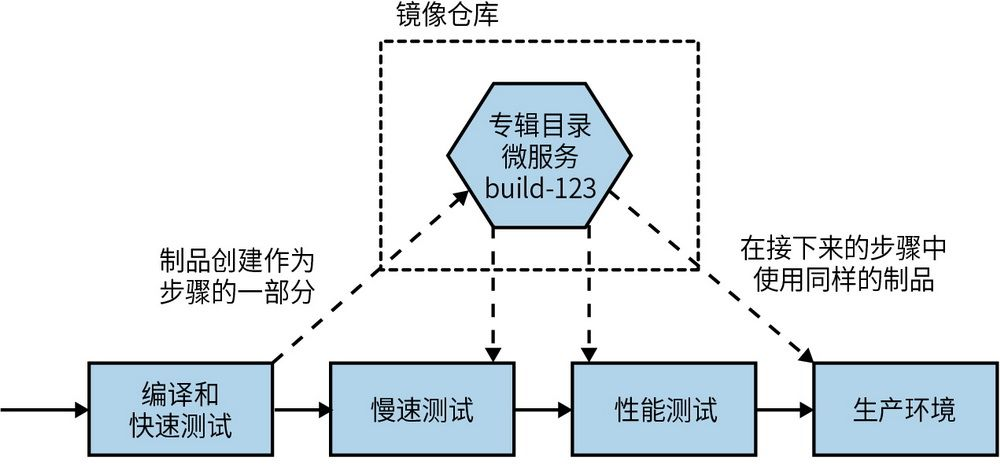

图7-4：同样的制品部署到了每一个环境中

如果相同的制品要在多个环境中使用，那么我们需要将因环境而异的所有配置保留在制品之外。举个简单的例子，我可能想要配置应用程序日志，以便在运行“慢速测试”阶段时记录DEBUG级别及以上的所有内容，从而为诊断测试失败的原因提供更多的信息。但之后，我可能会将其更改为INFO，以减少性能测试和生产部署阶段所产生的日志量。
	

**制****品****构****建****提****示**

只为微服务构建一个用于部署的制品。在要部署该版本的微服务的任何地方重复使用这一制品。保持制品部署与环境无关，将与环境相关的特定配置信息存储在其他地方。

### 7.3 将源代码和构建映射到微服务

我们已经讨论了一个可能引发争议的话题——功能分支开发与基于主干的开发，但事实证明，这一争议在本章中还没有结束。另一个可能引发不同意见的话题是如何组织微服务的代码。我有自己的偏好，但在讨论我的偏好之前，让我们先来探讨微服务组织代码的几个方式。

#### 7.3.1 一个巨大的代码库，一次巨大的构建

如果从最简单的选项开始，我们可以将所有内容放在一起。我们有一个存储所有代码的巨型存储库，且有一个与之对应的构建，如图7-5所示。向此源代码存储库提交的任何代码都将触发构建，在构建中会运行所有与微服务关联的验证步骤，并生成多个制品，且所有这些制品都绑定到同一个构建中。

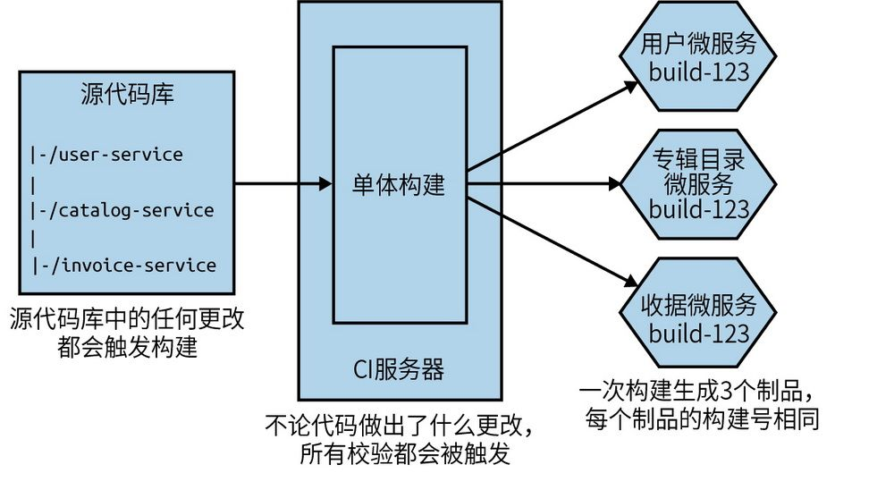

图7-5：使用同一个源代码库和CI构建来管理所有微服务

与其他方法相比，从表面上看，这一方法似乎要简单得多：需要关注的代码库更少，从概念上讲构建也更简单。从开发人员的角度来看，工作也相对简单——我只需提交代码；如果必须同时处理多个服务，我只需关注一个提交。

如果你接受同步发布的想法，不在意一次性部署多个服务，那么这个模型对你来说可以正常运行。通常，这是一种需要避免的模式，但是在项目的早期阶段，特别是如果只有一个团队在处理所有事情，这种模型在短时间内是有意义的。

现在，让我解释一下这种方法的明显缺点。如果我对单个服务进行单行代码更改（例如，更改图7-5中用户微服务的行为），那么所有其他服务都会进行验证和构建。这可能会花费更长的时间——我在等待那些可能不需要测试的服务。这将影响产品交付周期，即减缓了将单个变更从开发环境部署到生产环境的速度。然而，更令人不安的是，使用这种方式时，我们不知道哪些制品应该被部署。我是否需要部署所有服务才能将微小的更改推送到生产环境之中呢？这很难确定，因为仅仅通过阅读提交消息来猜测哪些服务**真****正**发生了变化是很困难的。使用这种方式的组织通常会退回到将所有内容一起部署的状态中，而这正是我们想要避免的。

此外，如果我对用户微服务的单行代码更改的构建失败了，那么在解决中断问题之前都无法对其他服务进行任何更改。想象这样一个场景：如果有多个团队都在共享这个庞大的构建流程，那么谁来负责（解决中断问题）呢？

可以说，这种方法是一种单一代码库（monorepo）的形式。然而，在实践中，我见过的大多数单一代码库的实现是将多个构建过程映射到代码库的不同部分，我们稍后将对此进行更深入的探讨。对于那些希望构建多个可独立部署的微服务的人来说，这种多个微服务一个代码库，并将代码库的更改与唯一的流水线构建映射在一起的方式是最糟糕的形式。

在实践中，除了在项目的最初阶段，我几乎从未见过有人使用这种方法。说实话，下面的两种方法可能更加可取，所以我们应该重点关注这些方法。

#### 7.3.2 多代码库

在一个微服务一个代码库的模式（与单一代码库模式相对应，此模式通常被称为“多代码库”）中，每个微服务的代码都存储在它们自己的源代码库中，如图7-6所示。使用此方法可在源代码更改和持续集成构建之间形成一对一的直接映射。

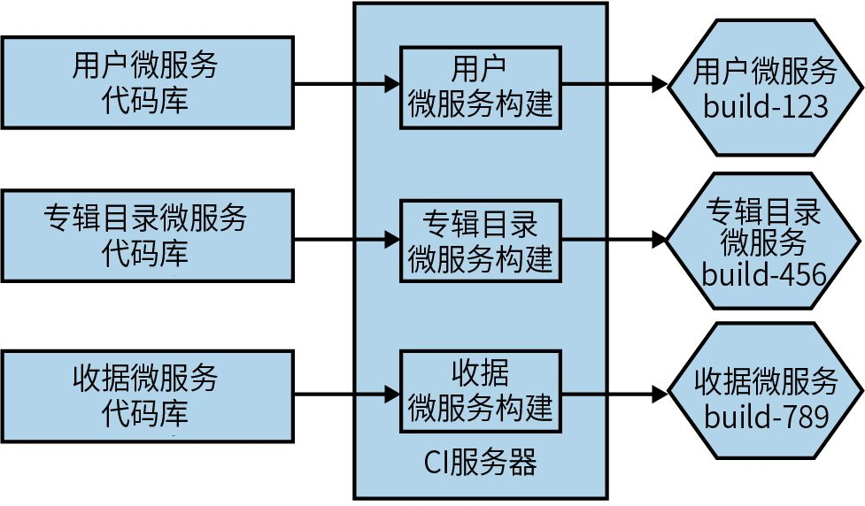

图7-6：每个微服务的源代码存储在单独的源代码库中

对用户源代码库的任何更改都会触发相应的构建，如果通过了构建，将有一个新版本的用户微服务可供部署。为每个微服务提供单独的存储库还支持你为单个代码库更改其所有权，而为微服务提供一个健全的所有权模型是十分必要的（稍后将详细介绍）。

不过，这种简单直接的方式也带来了一些挑战。具体来说，开发人员可能会发现自己需要同时使用多个代码库，尤其是当他们试图跨多个微服务进行更改时，这会特别烦琐。此外，我们不能以原子方式跨多个代码库进行更改，至少使用Git时不能这样做。

**0****1****.****跨****代****码****库****复****用****代****码**

使用这种模式时，没有什么方式可以阻止微服务依赖于在不同代码库中管理的其他代码。

执行此操作的一种简单机制是，将要复用的代码打包到库中，然后将该库作为下游微服务的显式依赖项。我们可以在图7-7中看到这样一个示例，其中收据微服务和工资单微服务都使用了Connection库。

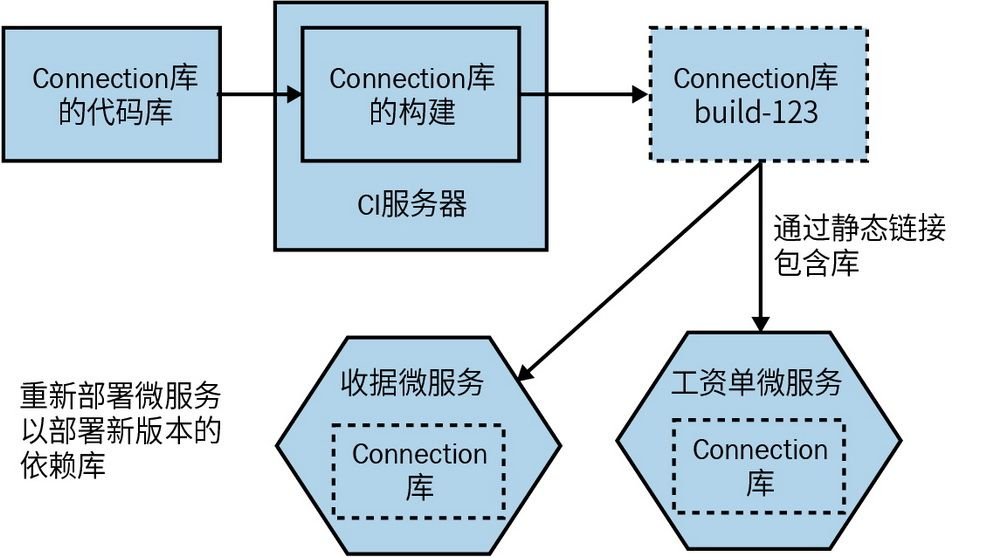

图7-7：跨不同代码库复用代码

如果你想对Connection库进行更改，则必须在相应的源代码库中进行更改，并等待其构建完成，以获得新版本的制品。如果你想部署引用了新版本Connection库的收据微服务或工资单微服务，你需要显式地更改这两个服务使用的Connection库的版本。这可能需要手动更改（如果你依赖于特定版本），或者根据所使用的CI工具的性质将其配置为动态生效。这背后的概念在Jez Humble和Dave Farley所著的《持续交付：发布可靠软件的系统方法》一书中有更详细的介绍。
	 

当然，重要的是，如果要推出新版本的Connection库，还需要部署新构建的收据微服务和工资单微服务。请记住，我们在5.7节中探讨的有关代码复用和微服务的所有警示仍然适用——如果你选择通过库来复用代码，那么就必须接受这样一个事实，即这些更改无法以原子方式部署，否则我们将破坏微服务的独立可部署性。此外，你还必须意识到，想知道某些微服务是否使用了特定版本的库可能更具挑战性，特别是当你试图弃用旧版本的库时，因为这可能会带来一些问题。

**0****2****.****跨****多****个****代****码****库****工****作**

那么，除了通过库复用代码之外，我们还有什么方式可以对存在于多个代码库中的代码进行修改呢？让我们转到另一个示例。在图7-8中，我想更改库存微服务暴露的API，并且还需要更新物流微服务，以便它可以使用新的更改。如果库存微服务和物流微服务的代码位于同一个代码库中，我可以只提交一次代码（就能实现更改）。但是现在，我必须将更改分为两个提交——一个用于库存微服务，另一个用于物流微服务。

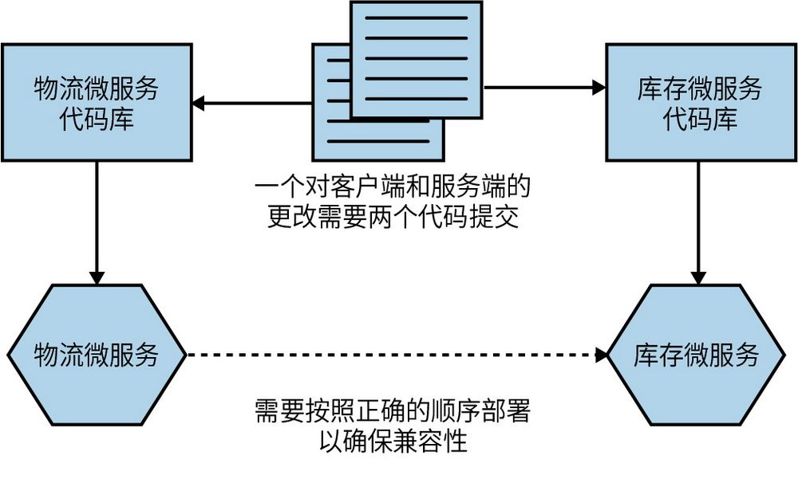

图7-8：跨代码库边界的更改需要多次提交代码

拆分这些更改可能会导致问题，例如一个提交失败但另一个提交成功。比如，我可能需要进行两次更改以回滚；如果其他人在此期间进行了提交，那么就会出现问题。实际上，在这种特定情况下，我可能希望在一定程度上分批提交代码，即在确保更改库存微服务的提交成功后，再更改物流微服务中的客户端代码——如果API中没有新功能，那么让客户端代码使用它是没有意义的。

我曾与多位人士交流过，他们认为在这种情况下无法进行原子部署是一个重大问题。我当然理解这带来的复杂性，但我认为在大多数情况下，这指向了一个更大的潜在问题。如果你不断地在多个微服务之间进行代码更改，那么你的服务边界可能没有被恰当地划分，并且这可能意味着服务之间存在的耦合过多。正如已经讨论过的，我们应当优化我们的架构和微服务边界，以便代码更改更有可能集中在微服务边界内。跨边界（多微服务）的更改应该是例外，而不是常态。

事实上，我认为跨多个代码库工作所带来的麻烦有助于划分微服务边界，因为它迫使你仔细思考这些边界的位置以及它们之间的交互本质。
	

如果你不断地跨多个微服务进行更改，那么很有可能是因为错误地划分了微服务边界。如果发现这种情况发生，可以考虑将微服务重新合并在一起。

此外，作为正常工作流程的一部分，不得不从多个代码库中拉取代码并推送到多个代码库确实非常烦琐。根据我的经验，使用支持多个仓库的IDE可以简化工作（这是我在过去5年中使用的所有IDE都可以处理的工作），也可以通过编写简单的包装器脚本来简化在命令行上的工作。

**0****3****.****适****用****情****况**

无论是对于小型团队还是大型团队，一个微服务一个代码库的模式同样有效；但是如果你发现需要跨微服务边界进行大量更改，那么这种模式可能就不适合你。我们接下来讨论的单一代码库模式可能更加适用，尽管正如我们之前讨论的那样，跨服务边界进行大量的更改可能是一个风险。使用这种模式还可能使代码复用比使用单一代码库模式更加复杂，因为你需要依赖于将复用的代码打包到版本化的制品中以实现代码的复用。

#### 7.3.3 单一代码库

单一代码库是指，将多个微服务（或其他类型的项目）的代码存储在同一个源代码库中。我见过一些这样的例子，仅由一个团队使用单一代码库来管理其所有服务的源代码。这个概念已被一些大型科技公司所推广，这些公司拥有多个团队和数百甚至上千名开发人员，他们在同一个源代码库上共同工作。

通过将所有源代码存储在同一个仓库中，你可以以原子方式跨多个项目进行源代码更改，并实现在不同项目中更细粒度的代码复用。谷歌可能是使用单一代码库模式的公司中最有名的一个，但绝不是唯一一个。虽然这种方法还有其他一些优点，例如提高了代码的可见性，但是能够轻松地复用代码并进行更改，从而在多个项目中生效，通常是采用此模式的主要原因。

我们以刚才讨论的例子为例，我们希望对库存微服务进行更改，让它支持一些新功能，并更新物流微服务以使用我们提供的这一新功能。这些更改可以在单一提交中完成，如图7-9所示。

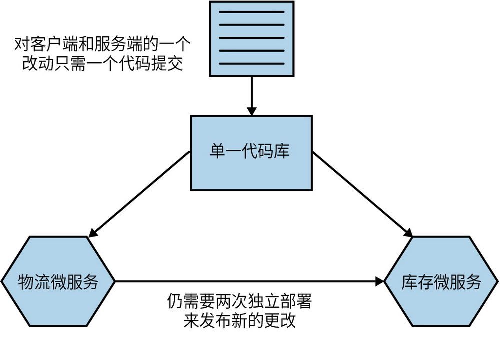

图7-9：在单一代码库中，通过单一提交跨两个微服务进行更改

当然，与前面讨论的多代码库模式一样，我们仍然需要考虑部署方面的问题。如果想避免同步部署，我们需要仔细考虑部署顺序。

**原****子****提****交****与****原****子****部****署**

能够跨多个服务进行原子提交并不能为你提供原子部署。如果你发现自己想要一次性跨多个服务更改代码，并将其同时部署到生产环境，这会违反微服务可独立部署的核心原则。有关此内容的更多信息，请参阅5.8节。

**0****1****.****映****射****到****构****建**

对于每一个微服务使用一个源代码库，从源代码到构建过程的映射非常简单直接。源代码库中任何代码更改都可能触发相应的持续集成构建。但在单一代码库模式中，情况会变得更加复杂。

一个简单的起点是按单一代码库模式中的文件夹进行映射，如图7-10所示。例如，对用户微服务文件夹所做的更改将触发用户微服务的构建。如果提交的代码更改了用户微服务文件夹和专辑目录微服务文件夹中的文件，那么将同时触发用户微服务和专辑目录微服务的构建。

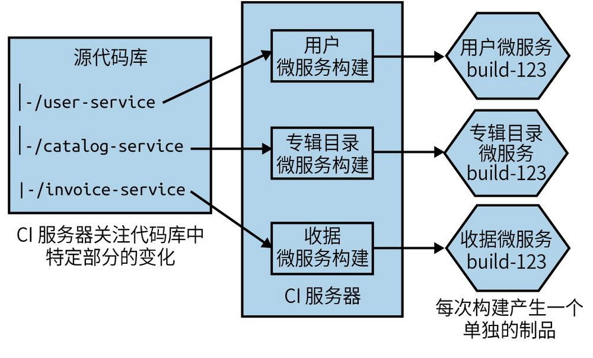

图7-10：单一代码库的子目录映射到独立的构建

随着文件夹结构变得更加复杂，这种映射也会变得更加复杂。在较大的项目中，可能会出现多个文件夹想要触发相同的构建，或某些文件夹触发多个构建的情况。在简单的情况下，你可能有一个被所有微服务使用的common文件夹，对该文件夹的更改会导致所有微服务重新构建。在复杂的情况下，团队可能需要采用基于图形的构建工具，如开源工具Bazel（Bazel是谷歌内部构建工具的开源版本），以更有效地管理这些依赖关系。实现一个新的构建系统可能是一项艰巨的任务，所以这不是一件可以轻易完成的事情；但是如果没有这样的工具，谷歌的单一代码库模式是不可能存在的。

单一代码库方法的好处之一是，我们可以跨项目实现更细粒度的代码复用。对于多代码库模型，如果我想复用他人的代码，则可能必须将其打包为版本化的制品，然后将其作为构建的一部分（例如Nuget包、JAR文件或NPM）。由于我们的复用单元是一个库，我们可能会引入不必要的代码。从理论上讲，在使用单一代码库模式的情况下，我可以只依赖于另一个项目中的单个源文件，尽管这会导致构建映射变得更加复杂。

**0****2****.****定****义****所****有****权**

在团队规模和代码库规模都较小的情况下，单一代码库模式很可能可以很好地与你习惯使用的传统构建和源代码管理工具配合使用。但是，随着你的代码库越来越大，你可能需要开始考虑不同类型的工具。我们将在第15章更详细地探讨所有权模型，但同时，在我们考虑源代码管理时，值得在此简要探讨一下所有权模型是如何发挥作用的。

Martin Fowler撰文讨论过不同的所有权模型，概述了从强所有权到弱所有权再到集体所有权的各个模型。自从Martin提出了这些术语以来，开发实践已经发生了变化，因此也许值得我们重新审视并重新定义这些术语。

在强所有权模型中，一些代码由特定团队的人员拥有。如果该团队以外的人想要进行更改，他们必须要求所有者帮助他们进行更改。在弱所有权模型中，仍然具有明确定义的所有者的概念，但它允许所有权组之外的人员进行更改，尽管这些更改中的任何一项必须由所有权组中的某人审核和接受。这可能涵盖在合并拉取请求之前要将拉取请求发送给核心所有权团队进行审核。在集体所有权模型中，任何开发人员都可以更改任何代码段。

在开发人员数量较少的情况下（一般为20人或更少），你可以实行集体所有权的方式，即任何开发人员都可以更改任何微服务。但是，随着开发人员数量的增多，你更有可能希望转向强所有权或弱所有权模式，以创建更明确定义的责任范围。如果源代码管理工具不支持更细粒度的所有权控制，这可能会给使用单一代码库的团队带来挑战。

某些源代码工具允许你在单一代码库中指定特定目录甚至特定文件路径的所有权。在开发自己的源代码控制系统之前，谷歌最初基于Perforce为自己的单一代码库实现了这个系统，这也是GitHub自2016年以来一直支持的功能。在GitHub中，你可以创建一个CODEOWNERS文件，该文件允许你将所有者映射到目录或文件路径。示例7-1展示了一些示例，这些示例来自GitHub自己的文档，展示了这些系统可以带来的灵活性。

**示****例****7****-****1** 如何在GitHub的CODEOWNERS文件中指定特定目录的所有权

#在本例中，@doctocat拥有代码库根目录下build/logs目录下及其子目录下的

# 任何文件的所有权

/build/logs/ @doctocat

#在本例中，@doctocat拥有apps下所有文件的所有权

apps/@doctocat

#在本例中，@doctocat拥有代码库根目录下`/docs`目录下所有文件的所有权

/docs/ @doctocat

GitHub自己的代码所有权概念可确保每当对相关文件提出拉取请求时，都会请求源文件的代码所有者进行审查。对于较大的拉取请求，这可能是一个问题，因为你可能需要多个审查者的批准，但无论如何，对于较小的拉取请求来说，这仍然是一个不错的机制。

**0****3****.****工****具**

谷歌自己的单一代码库规模庞大，需要大量的工程资源才能使其在大规模应用中正常运行。这涉及了一些工程技术，比如经过多次迭代的基于图形的构建系统、为了加快构建时间的分布式对象链接器，以及能够动态保持依赖文件一致性的IDE和文本编辑器插件，等等。这是一项需要巨大工作量的工程。随着谷歌的发展，Perforce的使用带来越来越多的限制，谷歌最终不得不创建专有的源代码控制工具Piper。2007~2008年，当我在谷歌的这一领域工作时，有100多人在维护各种开发者工具，其中很大一部分工作都是在处理单一代码库模式的影响。当然，如果你有成千上万名工程师，你确实有理由这样尝试。

如果你想更深入地了解谷歌使用单一代码库背后的基本原理，我推荐你阅读Rachel Potvin和Josh Levenberg的文章“Why Google Stores Billions of Lines of Code in a Single Repository”
	 。事实上，我建议任何认为“我们应该使用单一代码库，因为谷歌这样做了”的人阅读这篇文章。你的组织不概率不是谷歌，也不太可能有类似于谷歌的问题、限制或资源。换句话说，无论你最终得到的是什么样的单一代码库，都不可能与谷歌的一样。

微软在规模方面也遇到了类似的问题。它采用Git来管理Windows的主源代码库。该代码库的完整工作目录是一个大小约为270 GB的源文件。
	 下载所有这些文件会花费很长时间，而且也没有必要，因为开发人员最终只处理整个系统的一小部分。因此，微软不得不创建了一个专用的虚拟文件系统——VFS for Git（以前被称为GVFS）——以确保只下载开发人员所需要的源文件。

VFS for Git是一项令人印象深刻的成就，谷歌自己的工具链也是如此，尽管对这样的公司来说，为这种技术进行投资要容易得多。同样值得指出的是，虽然VFS for Git是开源的，但我还没有见过微软以外的团队在使用它，而且谷歌使用的支持其单一代码库的绝大多数工具链都是闭源的（Bazel是一个值得注意的例外，但目前还不清楚开源的Bazel在多大程度上反映了谷歌内部使用的内容）。

Markus Oberlehner的文章“Monorepos in the Wild”向我介绍了Lerna——一个由Babel JavaScript编译器团队创建的工具。Lerna旨在让从同一源代码库生成多个版本的制品变得更加容易。我无法直接评论Lerna在这项任务上的有效性（除了一些明显不足之外，因为我并不是一个经验丰富的JavaScript开发人员），但从表面上看，它似乎在某种程度上简化了这种方法。

**0****4****.****单****一****代****码****库****到****底****有****多****单****一**

谷歌并没有将其所有代码存储在这个单一的代码库中。有一些项目，特别是那些正在开发的公开项目，通常会存储在其他地方。尽管如此，至少根据前面提到的文章“Why Google Stores Billions of Lines of Code in a Single Repository”，截至2016年，谷歌95%的代码都存储在同一代码库中。在其他组织中，一个单一代码库的范围可能仅限于一个系统或少数几个系统。这意味着一家公司可以为组织的不同部分提供少数几个单一代码库。

我曾与实行“一个团队一个代码库”的团队交流过。虽然从技术上讲，这可能不符合此模式的原始定义（原始定义通常是指多个团队共享同一代码库），但我仍然认为它更接近单一代码库模式。在这种情况下，每个团队都有自己可以完全控制的单一代码库。该团队拥有的所有微服务的代码都存储在该团队的单一代码库中，如图7-11所示。

对于实行集体所有权的团队来说，这种模式有很多优点，可以提供单一代码库方法的大部分优势，同时避开了一些在更大规模下出现的挑战。就在现有组织所有权边界内工作而言，这种折中方式非常合理，它可以在一定程度上减轻对在更大规模下使用这种模式的担忧。

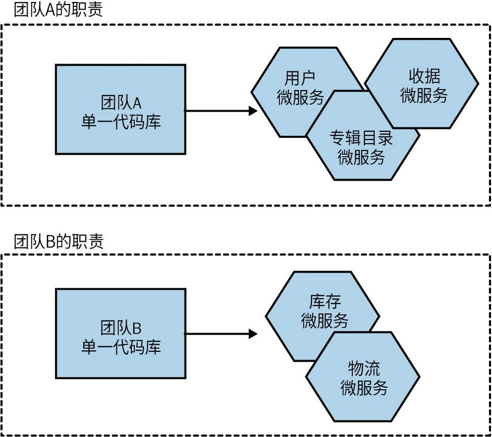

图7-11：一种模式变体，其中每个团队都有自己的单一代码库

**0****5****.****适****用****情****况**

一些大规模的组织发现单一代码库模式非常适用。前面提到了谷歌和微软在使用单一代码库，我们还可以将Facebook、Twitter和优步添加到这一名单中。这些组织都有一个共同点：它们都是以技术为中心的大型公司，能够投入大量资源来充分发挥这种模式的优势。我还发现单一代码库模式效果良好的情况存在于另一种极端场景，在这种场景下开发人员和团队的数量较少。在只有10~20名开发人员的情况下，使用单一代码库模式可以更轻松地管理所有权边界并保持构建过程的简单化。但是，对于中等规模的组织来说，似乎出现了痛点——他们开始遇到需要新工具或新的工作方式才能解决的问题，但他们没有多余的资源来投资以解决这些问题。

#### 7.3.4 我会使用哪种方式

根据我的经验，单一代码库方法的主要优势——更细粒度的代码复用和原子提交——似乎很难应对大规模情况下出现的挑战。对于较小的团队，这两种方法都很好，但是随着规模的扩大，我认为一个微服务一个代码库（多代码库）的方法更直接。从根本上说，我担心的是跨服务更改变得更加频繁、代码库的所有权更加混乱，以及单一代码库可能会带来对新研发工具的需求。

我反复看到的一个问题是，一些最初规模较小的组织，一开始采用集体所有权（使用单一代码库）的方式时，运作良好，但后来很难转向不同的模式，因为单一代码库的概念是如此根深蒂固。随着交付组织的发展，单一代码库的问题也在变得严重，但迁移到替代方法的成本也在随之增加。对于快速增长的组织来说，这更具挑战性，因为通常只有在快速增长之后，问题才会显现出来，此时迁移到多代码库模式的成本看起来过高。这可能会导致沉没成本谬误：你为了让单一代码库运行良好已经投入了很多，只要再多一点投资就会使它像以前一样运行良好，对吧？但也许不是这样——你要有勇气承认自己正在浪费资金，并决定做出相应的改变。

对所有权和单一代码库的担忧可以通过使用细粒度的所有权控制来缓解，但这往往需要配合专门的工具或以更细心、更尽职的工作方式来实现。关于这一点，我的看法可能会随着单一代码库的周边工具的不断成熟而改变，但是尽管在基于图形的构建工具的开源开发方面做了大量工作，我仍然发现这些工具链的采用率非常低。因此对我来说，我更倾向使用多代码库。

### 7.4 小结

本章介绍了一些重要思想，无论你最终是否使用微服务，这些思想都会对你有所帮助。从持续交付到基于主干的开发，从单一代码库到多代码库，围绕这些内容还有更多方面需要探讨。我已提供了很多资源以及供你进一步阅读的材料，现在是时候让我们转向另一个需要深入探讨的主题了——部署。
