## 第8章 部署

因其依赖关系的复杂性和技术选择的丰富性，微服务的部署过程与单进程单体应用的简单部署流程不可同日而语。我写第1版时，本章已经提供了很多可供选择的部署方式。从那时起，Kubernetes就已经脱颖而出，而FaaS（函数即服务）平台则为我们提供了更多的软件交付方式。

尽管在过去的10年中，技术已经发生了翻天覆地的变化，但我认为许多与构建软件相关的核心原则并没有改变。事实上，我认为更重要的是，我们要彻底理解这些基本思想，因为它们可以帮助我们应对新技术的混乱局面。考虑到这一点，本章将重点介绍一些与部署相关的核心原则，这些原则对于我们理解部署很重要。同时，我们还将探讨各种可用工具是如何促进或妨碍这些原则在实践中的应用的。

接下来，让我们先探究一下，从系统架构的逻辑视图转向物理部署拓扑时会发生什么。

### 8.1 从逻辑到物理

到目前为止，我们讨论微服务时，通常是基于逻辑意义（而不是物理意义）的。在这种视角下，我们可以讨论收据微服务如何与订单微服务进行通信（如图8-1所示），而无须实际思考这些服务的物理部署拓扑结构——因为架构的逻辑视图通常会抽象掉底层的物理部署所关注的问题。然而在本章讨论的内容里，我们需要改变一下想法了。

图8-1：两个微服务的简单逻辑视图

在真实的基础设施上实际运行微服务时，这种逻辑视图可能会隐藏许多复杂性。让我们看看这种图表可能会隐藏哪些细节。

#### 8.1.1 多实例

当我们考虑两个微服务的部署拓扑（图8-2）时，它并不像一个微服务与另一个微服务彼此通信那么简单。首先，每个微服务可能有多个实例。拥有多个服务实例可以处理更多的负载，还可以提高系统的健壮性，因为这样部署对单个实例故障的容错度更高了。因此，可能会有一个或多个收据微服务实例与一个或多个订单微服务实例通信。这些实例之间通信将取决于通信机制的性质。但假设我们使用某种基于HTTP的API，那么一个负载均衡器就足以将请求分流到不同的实例，如图8-2所示。

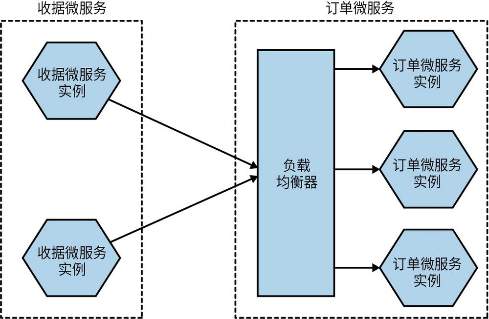

图8-2：使用负载均衡器将请求映射到订单微服务的特定实例

所需的实例数量将取决于服务的性质——你需要评估所需的冗余、预期的负载级别等，以得出一个可行的数值。你可能还需要考虑这些实例的运行位置。出于服务健壮性的考虑，你希望服务可以有多个实例并且这些实例都运行在不同的基础设施上。更进一步，这可能要求你不仅将不同的实例分布在多台计算机上，还要将其分布在不同的数据中心中，以预防整个数据中心不可用的问题。这可能会产生如图8-3所示的部署拓扑结构图。

这看起来似乎过于谨慎——整个数据中心都不可用的可能性有多大？好吧，我回答这个问题时不可能照顾到每一种情况，但与主要云供应商打交道时，这绝对是你必须考虑的事情。当涉及托管虚拟机之类的服务时，亚马逊AWS、微软Azure和谷歌都不会为你提供单个机器的SLA（服务等级协议），也不会为单个可用区（对这些供应商来说，这是与数据中心最相近的服务）提供SLA。这意味着你部署的任何解决方案都应当分布在多个可用区中。

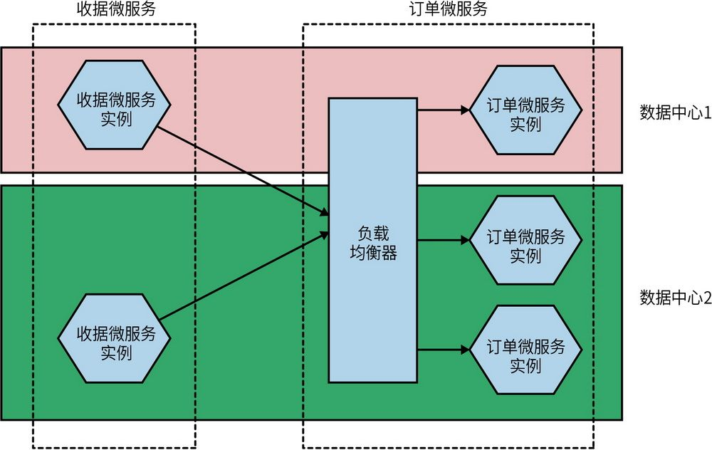

图8-3：将实例分布在多个不同的数据中心

#### 8.1.2 数据库

更进一步地说，到目前为止，我们忽略了另一个主要组件——数据库。正如之前讨论过的，我们希望微服务隐藏其内部状态管理机制，因此被微服务用于管理其状态的数据库都被视为隐藏在微服务中。因此行业内有句俗话叫“不要共享数据库”，我想我在之前的例子里已经解释得足够多了。

但是，当考虑到多个微服务实例的场景时，又该怎么办呢？每个微服务**实****例**都应该有自己的数据库吗？简而言之，不用。在大多数情况下，如果我访问订单微服务的任意一个实例，我希望能够获取同一订单的有关信息。这就需要在同一逻辑服务的不同实例之间实现一定程度的状态共享，如图8-4所示。

但这是否违反了“不要共享数据库”的原则？并没有。我们关注的主要问题之一是，在多个不同的微服务之间共享数据库时，与访问和操作该状态相关的逻辑会分散在不同的微服务中。但在这里，数据是由同一微服务的不同实例共享的。用于访问和操作状态的逻辑仍保存在单个逻辑微服务中。

**数****据****库****部****署****和****扩****展**

与微服务一样，到目前为止，我们主要讨论的是逻辑意义上的数据库。在图8-3中，我们忽略了对基础数据库的冗余或扩展需求的考虑。

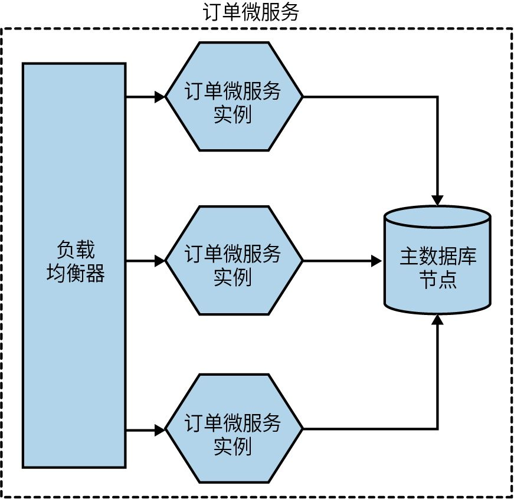

图8-4：同一微服务的多个实例可以共享同一个数据库

广义上讲，由于多种原因，物理数据库部署可能托管在多台计算机上。一种常见的做法是使用主节点处理写入，配置一个以上的只读节点（通常被称为“只读副本”）来分担读取负载。如果在我们的订单微服务里实现这个想法，可能会出现如图8-5所示的情况。

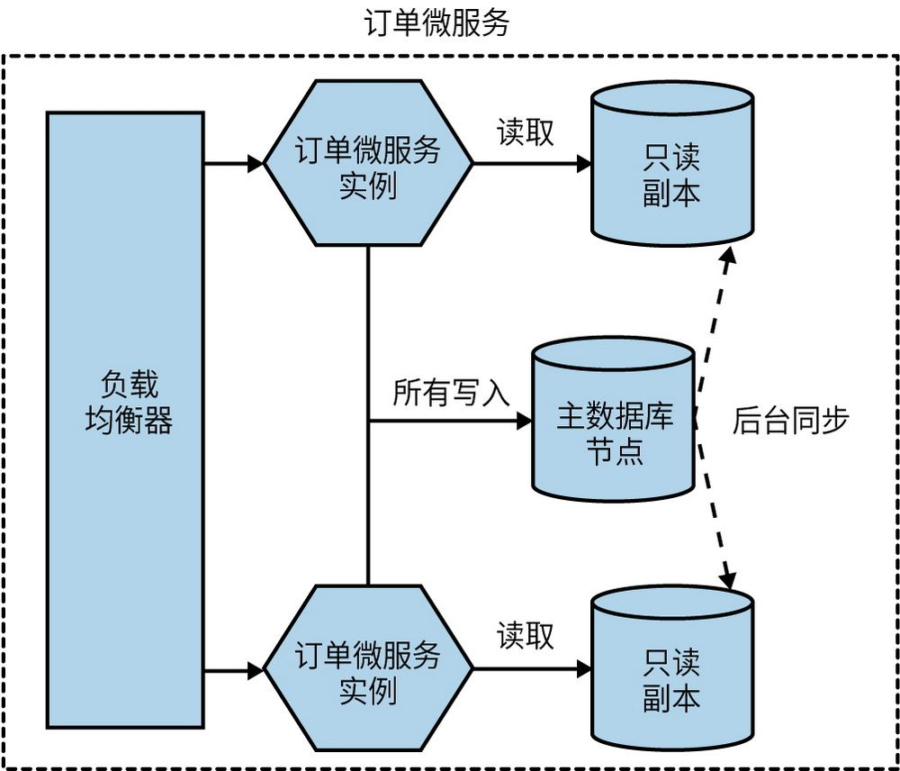

图8-5：使用只读副本分配负载

如图，所有只读流量都将流向其中某个读节点，你可以通过添加其他读节点来进一步扩展读流量。这还有个好处——关系数据库因工作方式的限制，更难对写流量扩容（通常需要分片模型，这增加了额外的复杂性），因此转移读流量到只读副本，通常可以进一步释放写入节点的压力以实现数据库的扩容。

除了上述复杂的情况之外，同一数据库基础设施还可以支持多个从逻辑上隔离的数据库。比如，收据微服务和订单微服务的数据库可能都由相同的数据库基础设施提供服务，如图8-6所示。这样做的好处很明显——它允许你以资源池的方式来管理硬件基础设施以实现对多个微服务的支撑，同时降低许可证成本，减少数据库本身的管理工作。

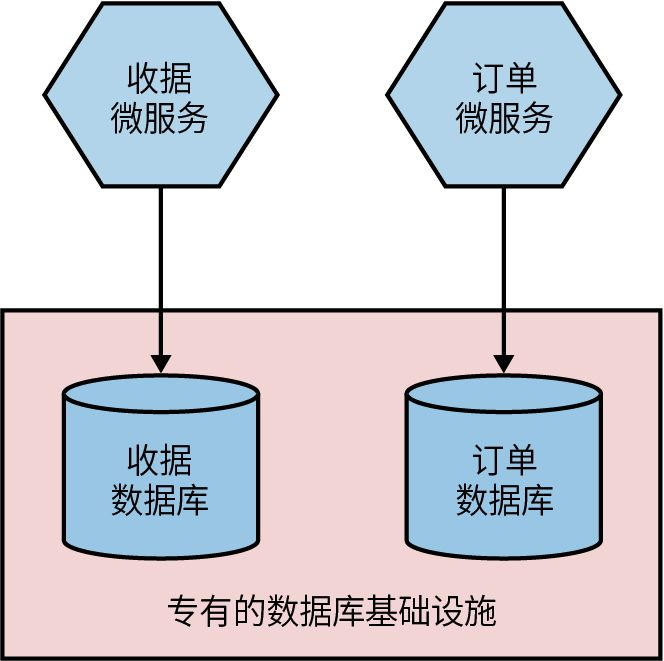

图8-6：同一物理数据库基础设施托管两个逻辑上隔离的数据库

需要注意的是，尽管这两个数据库可能在相同的硬件和数据库引擎中运行，但它们仍然是逻辑上彼此隔离的数据库。它们不能相互干扰（除非你允许）。需要注意的是，如果该共享数据库基础设施出现故障，那么多个微服务可能同时被影响，进而产生灾难性的后果。

根据我的经验，由于我之前概述的成本原因，那些自建基础设施的组织，往往更有可能使用这种方式来管理数据库（一个硬件数据库基础设施支持多个逻辑上隔离的数据库的方式）。配置和管理硬件是令人烦恼的（至少在历史上，数据库不太可能在虚拟化基础设施上运行），因此你希望用尽可能少的成本和精力来维护和管理这些硬件。

此外，在公有云上运行的团队更有可能为每个微服务配置专有数据库基础设施，如图8-7所示。配置和管理云端数据库基础设施的成本要低得多。例如，AWS的关系数据库服务（RDS）可以自动处理备份、升级和多可用区故障转移等问题，其他公有云供应商也提供类似的产品。这使得为微服务提供更多独立的基础设施更具成本效益，从而为每个微服务所有者提供更多的控制权，而不必依赖共享服务。

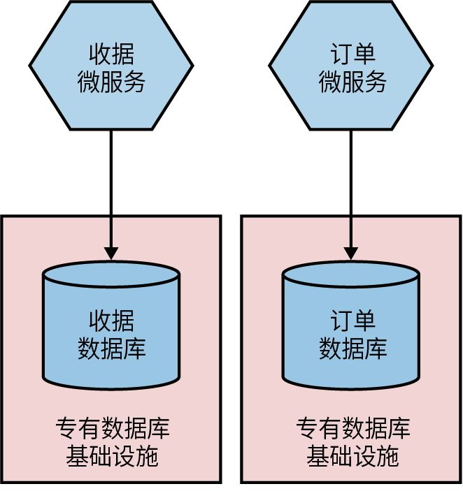

图8-7：每个微服务都使用自己的专有数据库基础设施

#### 8.1.3 环境

部署软件时，软件将在环境中运行。每个环境通常具有不同的用途，而环境的数量取决于开发软件的方式以及将软件部署到最终用户的方式。一些环境可能有生产数据，而另一些则没有。有些环境可能包含所有服务，而其他环境可能只有少量的服务；为了测试，尚不存在的服务还会被模拟（fake）服务取代。

通常，软件在不同的预发布环境中部署是为了不同的目的，有些是为了支撑软件开发，有些则是为了测试生产准备情况等。7.2.2节已经探讨了这一点。从开发人员的笔记本电脑到CI服务器、集成测试环境等，环境的确切性质和数量将由许多因素决定，但其中最主要的因素是软件的开发方式。在图8-8中，我们看到了MusicCorp的专辑目录微服务的流水线。微服务在最终进入生产环境（用户获取新软件）之前会经过不同的环境。

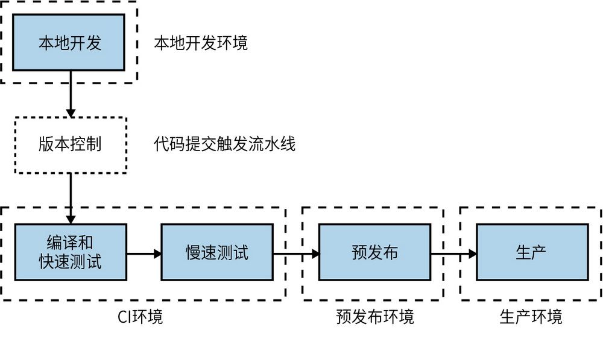

图8-8：流水线上的不同部分使用不同环境

微服务所运行的第一个环境是开发人员提交代码之前的地方，通常是他们的本地环境。提交代码后，持续集成过程（CI）将从快速测试开始。快速测试阶段和慢速测试阶段都会在我们的CI环境中部署代码。如果慢速测试通过，微服务将部署到预发布环境中，以允许手动验证（这完全是可选的，但对许多人来说仍然很重要）。如果手动验证通过，微服务将部署到生产环境中。

理想情况下，此过程中的每个环境都是生产环境的副本（类生产环境）。这会为我们带来极大的信心——相信软件会在生产环境正常工作。但是，实际上，由于成本高昂，我们通常无法运行多个类生产环境。

我们还希望在构建过程中能够尽早获得反馈。尽早知道开发的软件是否有效，及时修复出现的问题是至关重要的。我们越早了解软件的问题，修复它的速度就越快，漏洞的影响也就越小。在本地环境中发现问题比在预发布环境中发现问题要好得多，同样，在类生产环境中发现问题可能比在生产环境中发现问题要好得多（我们将在第9章探讨一些重要的权衡问题）。

这意味着更靠近开发人员的环境将被调整来快速获取反馈，这可能会影响它们的“类生产”程度。但是，随着所需环境越来越靠近生产环境（部署环境），我们希望它越来越像最终的生产环境，以确保我们能发现问题。

作为这方面的一个简单实例，让我们重新看下前面的专辑目录服务的例子，并了解不同的环境。在图8-9中，我们在本地环境部署了服务的一个实例，服务的构建速度很快，但本地环境与生产环境所需的基础设施完全不同。在CI环境中，我们部署了服务的两个副本来支撑测试，以确保负载均衡逻辑能正常工作。我们将两个实例部署到同一台计算机上，这可以降低成本并快速完成部署，同时在此流程阶段我们仍然可以获得足够的反馈。

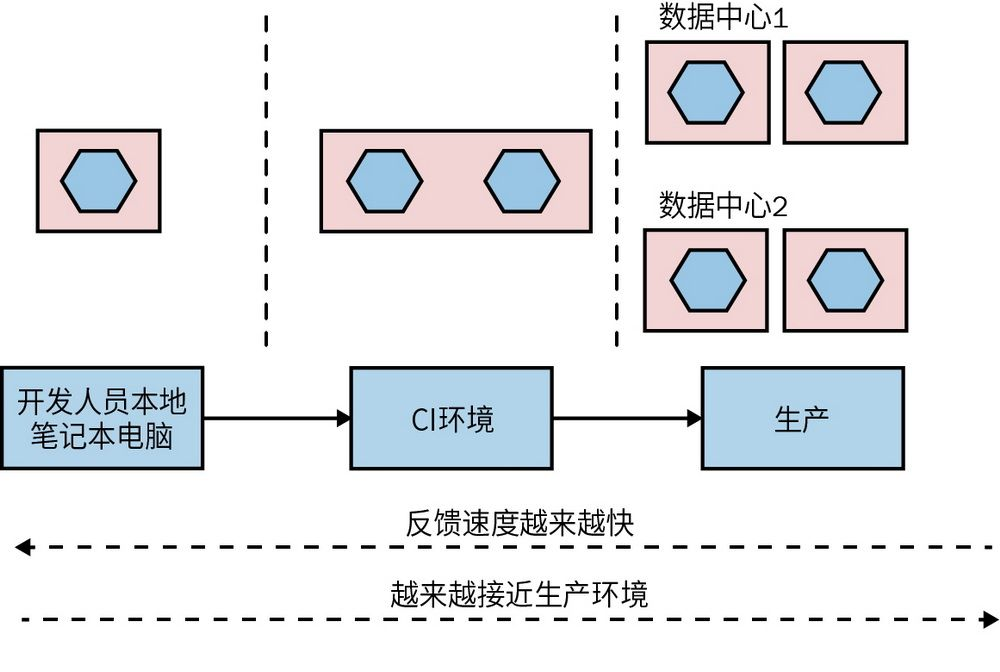

图8-9：微服务的部署方式可能因环境而异

最后，在生产环境中，我们部署了这个微服务的4个实例，分布在4台计算机上，而这4台计算机又分布在2个不同的数据中心。

这只是如何使用环境的一个例子。具体设置会因构建内容和部署方式的不同有很大差异。例如，如果需要为每个客户部署一个软件副本，就需要多个生产环境。

但是，关键的是，微服务的最终部署架构将因环境不同而产生差异。因此，你需要找到根据环境来配置服务实例数量、决定实例配置，以及仅一次构建服务实例的方法。所以，任何特定于环境的信息都需要与部署的服务制品分开。

部署架构在不同环境之间的迁移除了取决于部署的机制，还取决于部署架构本身的差异程度。如果微服务实例的数量是唯一的变化，那么这可能很简单，只需参数化此值，就可以将数量作为部署活动的一部分传递过来。

总之，单个逻辑微服务可以部署到多个环境中。从一个环境到另一个环境，每个微服务的实例数量可以根据每个环境的要求而变化。

### 8.2 微服务部署原则

对于如何部署微服务，你有很多选择，我认为在这个领域确立一些核心原则非常重要。无论你最终做出什么样的选择，对这些原则的深刻理解都会对你有所裨益。在详细介绍每一项原则之前，先简要说明一下将要涵盖的部署原则。

**隔****离****执****行**

以隔离的方式运行微服务实例，每个微服务实例拥有自己的计算资源，并且它们的运行不会影响在同一个基础设施上运行的其他微服务实例。

**专****注****自****动****化**

随着微服务数量的增加，自动化变得越来越重要。专注选择能够实现高度自动化的技术，并将自动化作为工程实践中的核心部分。

**基****础****设****施****即****代****码**

用代码管理基础设施的配置，以简化自动化并促进信息共享。将此类代码存储在源代码库中，以支持环境重建。

**零****停****机****部****署**

进一步提高独立部署能力，并确保可以在不需要任何停机时间的情况下为服务的用户（无论是人类还是其他微服务）部署新版本的微服务。

**期****望****状****态****管****理**

借助平台将微服务的期望状态保存起来，在发生中断或流量增加时根据需要启动新实例。

#### 8.2.1 隔离执行

你可能会很想将所有微服务实例放在一台计算机（单个物理计算机或单个虚拟机）上（尤其是在微服务之旅的早期阶段），如图8-10所示。纯粹从主机管理的角度来看，这种方式确实简单。在由专门团队管理基础设施的研发模式中，基础设施团队的工作负载通常与它所管理的主机数量正相关。如果将更多的服务打包到相同的主机上，技术设施团队的工作负载（主机管理）不会随着服务数量的增加而增加。

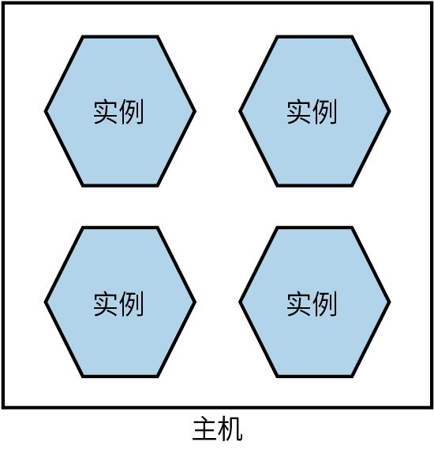

图8-10：每个主机多个微服务

不过，这种模式也存在一些挑战。首先，它可能会使监控更加困难。例如，在对服务所使用的CPU资源进行分析时，我是否需要对每个服务所使用的CPU情况进行分析？还是只对整个主机的CPU资源使用情况进行分析？这种模式的副作用也很明显。如果一个服务负载过重，它最终可能会减少系统其他部分的可用资源。在线时尚零售商Gilt曾经遇到过这样的问题。从Ruby on Rails的单体应用开始，Gilt决定转向微服务架构以使系统更容易扩展，并更好地适应越来越多的开发团队。最初，Gilt在单个服务器上共存了许多微服务，其中任意一个微服务的负载不均衡都会对该主机上运行的其他所有服务产生影响。这也使得对主机故障影响的分析变得更加复杂——让单个主机停止运行可能会产生巨大的连锁反应。

服务的部署也可能更加复杂，因为需要确保单一服务的部署不影响其他服务。例如，如果每个微服务都有不同的（且可能相互矛盾的）依赖项，又都需要安装在共享主机上，那应该如何解决这个问题呢？

这种模式也会抑制团队的自主权。如果不同团队的服务安装在同一台主机上，那么该由哪个团队来负责主机的配置呢？很可能最终会由一个集中的团队来处理，而这将导致需要更多的协调工作才能部署服务。

从根本上说，在同一台（虚拟或物理）机器上运行大量微服务实例最终会严重破坏微服务的关键原则之一——可独立部署。因此，我们希望能够独立地运行每个微服务实例，如图8-11所示。

图8-11：一个主机一个微服务

在这个示例里，每个微服务实例都有独立的运行环境。它可以安装自己的依赖项，并拥有自己所需的一组资源。

正如我的老同事Neal Ford所说，我们围绕部署和主机管理的许多工作实践都是针对资源稀缺进行优化的尝试。过去，如果我们想实现机器的隔离，唯一的选择就是购买或租用另一台物理机器。这往往需要很长的准备时间和很多的财务投入。根据我的经验，客户每隔两到三年才采购新服务器的情况并不少见，尝试在计划之外获得更多的计算机资源是很困难的。但是，按需计算平台大大降低了计算资源的成本，而虚拟化技术的改进意味着即使是内部托管的基础设施也可以拥有很大的灵活性。

容器化让我们可以更容易地实现每个微服务实例的独立运行环境的配置。如图8-12所示，从广义上讲，有两种极端。一种是为每个微服务实例创建独享的物理机。如果使用这种方式，环境的隔离最完整，但成本也最高；另一种是为每个微服务实例使用容器，这种方式提供了较弱的环境隔离，但也更具成本效益，且部署速度更快。在本章的后面部分，我们将讨论容器化等相关技术细节。

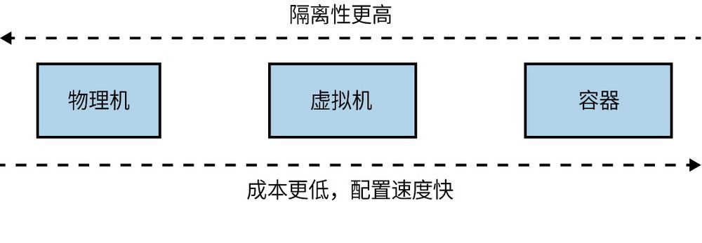

图8-12：围绕隔离模型的不同权衡

如果你要将微服务部署到更抽象的平台上，比如AWS Lambda或Heroku，则平台会为你提供隔离机制。根据平台本身的性质，你的微服务实例最终可能在容器或后台专用虚拟机中运行。

总体来说，容器技术的隔离性已经有了很大的改进，大部分微服务架构都倾向于使用容器的方式进行部署。对于绝大多数工作负载而言，容器已经“足够好”，它和虚拟机在隔离技术上的差异已经可以忽略不计。这是它如此受欢迎的原因，也是我在大多数情况下默认选择的原因。

#### 8.2.2 专注于自动化

随着微服务数量的增多，架构本身的复杂性也会越来越高，待处理的架构组件也会越来越多——更多的进程、更多需要配置的内容、更多需要监控的实例。迁移到微服务会给运维工作带来很高的复杂度。如果你靠手动方式来管理运维流程，那么越多的服务就意味着需要越多的人来维护。

因此，你需要更加关注自动化，选择能够实现基础设施自动化的工具和技术，尤其是基础设施即代码的方式（我们将稍后介绍）。

随着微服务数量的增加，自动化变得越来越重要。我们需要认真考虑允许高度自动化的技术，并将自动化作为开发文化的核心部分。

自动化也是确保开发人员保持高效的方式。向开发人员提供自服务的能力、支持他们自主创建单个服务或服务组，会让他们的工作更轻松。

选择能够实现自动化的技术，始于用于管理主机的工具。是否可以编写一行代码来启动虚拟机或关闭虚拟机？是否可以自动部署已编写的软件？是否可以在没有手动干预的情况下部署数据库变更？如果你想要控制微服务架构的复杂性，拥抱自动化文化是关键。

**两****个****关****于****自****动****化****优****势****的****案****例****研****究**

为了让你更好地理解自动化的好处，这里举一些具体的例子。澳大利亚房地产公司REA为澳大利亚和亚太地区等地的零售公司和商业客户提供房地产信息服务。多年来，该公司一直在将其平台转为微服务架构。在它开始平台迁移前，花费了大量的时间来调研用于支持微服务开发的工具，日后这些工具使得开发人员能够更轻松地配置环境、部署代码并监控服务。

在这项工作的前3个月中，REA只能将两个新的微服务迁移到生产环境中，并由开发团队全权负责微服务的构建、部署和支持。在接下来的3个月里，有10到15个微服务以类似的方式上线。到第18个月结束时，REA已经有70多个微服务。

这种模式也被我们之前提到的Gilt的经历所证实。同样，自动化（特别是帮助开发人员的工具）推动了微服务在Gilt内部的采用。在迁移到微服务一年后，Gilt有大约10个微服务在运行。到2012年，这个数字超过100；而到了2014年，有超过450个微服务上线——Gilt的每个开发人员大约负责3个微服务。这种微服务与开发人员的比例在使用微服务的成熟组织中并不少见，《金融时报》就是一家具有类似比例的公司。

#### 8.2.3 基础设施即代码

让我们进一步理解自动化的概念。基础设施即代码（infrastructure as code，IAC）是指使用机器可读的代码来配置、管理基础设施。你可以在chef或puppet文件中定义服务配置，或者编写一些bash脚本来进行设置，但无论使用哪种工具，都可以基于这份源代码将系统配置为某个已知状态。按理说，基础设施即代码的概念可以被认为是实现自动化的一种方式。不过，我认为值得将其单独列出，因为它说明了自动化应该如何实现。基础设施即代码将软件开发的概念带入运维领域。通过代码定义我们的基础设施，从而实现对基础设施的版本控制、测试以及复用。如果你想了解更多，请参考Kief Morris所著的*I**n**f**r**a**s**t**r**u**c**t**u**r**e**-**a**s**-**C**o**d**e**:**M**a**n**a**g**i**n**g**S**e**r**v**e**r**s**i**n**t**h**e**C**l**o**u**d**,**2**n**d**e**d**i**t**i**o**n*。
	 

理论上，你可以使用任何编程语言来实现基础设施即代码，但是该领域有专有工具，例如Puppet、Chef、Ansible等，这些工具都受到了早期CFEngine的启发。这些工具是声明式的，它们允许你以文本形式定义计算机（或其他资源集合）的状态，并且在应用这些脚本时，基础设施会进入该状态。目前的工具已经超越了仅仅配置单个机器的范畴，而是转向了如何配置整个云资源集。Terraform在这个领域非常成功；我也很高兴看到Pulumi的潜力，它的目标是做类似的事情，只不过它允许人们使用通用的编程语言，而不是这些工具经常使用的特定领域的语言。AWS CloudFormation和AWS云开发工具包（Cloud Development Kit，CDK）是平台特定的工具，仅支持AWS，但值得注意的是，即使我只使用AWS，我也更喜欢像Terraform这样的跨平台工具，因为它更灵活。

对基础设施代码的版本控制可以让你清楚地了解是谁做出了更改，这是审计员所喜欢的。它还使重现给定时间点的环境变得更加容易，这在尝试追踪缺陷时尤其有用。在一个让人印象深刻的法庭案件中，我的一个客户，不得不重新创建在几年前的特定时间点运行的整个系统，甚至需要重现操作系统的补丁级别和消息代理的内容。如果环境配置存储在版本控制中，他们的工作会容易得多——事实是，他们花费了3个多月的时间，费力地通过浏览电子邮件和发布说明来重建与早期生产环境完全相同的复制品，以试图找出谁做了什么。当我结束与客户的合作时，这个工作已经持续了很长一段时间，但问题仍未得到解决。

#### 8.2.4 零停机部署

你可能已经厌倦了我的说法，但是独立部署的能力真的很重要。然而，它的特质也不是单一、纯粹的。究竟微服务的部署需要多独立呢？在本章之前，我们主要从避免实现层面的耦合的角度来探究可独立部署。在本章内容的前面部分，我们讨论了为微服务实例提供独立运行环境的重要性，这样可以确保它在物理部署级别上具有一定程度的独立性。但我们还可以更进一步。

实现零停机部署功能可以在很大程度上促进微服务的开发和部署。如果没有零停机部署，在发布软件时，我可能不得不与上游消费者协调，提醒他们可能会出现的中断。

英国《金融时报》的Sarah Wells表示，具备实施零停机部署的能力是他们提高交付速度的最大优势。由于发布不会干扰用户，《金融时报》得以大幅提高发布频率。此外，零停机发布在工作时间内即可轻松地完成。这样做不仅提高了参与发布的人员的生活质量（不用晚上工作和周末工作），降低了团队的出错率（休息良好的团队在白天更少出错），也让发布团队在面临问题时得到更多的支持和帮助。

零停机部署的目标是，微服务在版本发布时，其上游消费者完全不会被影响。能否实现此目标在很大程度上取决于微服务的通信方式。如果你已经在微服务和消费者之间使用了基于中间件的异步通信方式，那么实现起来可能很简单——发送给你的消息将在你的微服务恢复服务时再次传递。但是，如果你使用的是同步通信方式，那么实现起来可能会更复杂。

此外，滚动升级这样的方式可能会更常见，Kubernetes这样的平台可以很容易实现这样的部署方式。通过滚动升级，在部署新版本之前，微服务不会完全关闭；相反，随着运行新版本软件的新实例逐渐增加，旧版本的微服务实例会逐渐减少。不过，值得注意的是，如果你需要的只是实现零停机部署，那么使用Kubernetes可能就大材小用了。简单的蓝绿部署（将在8.6.1节中进一步探讨）也可以同样有效。

在处理长连接等问题方面，零停机部署可能存在其他挑战。当然，如果你在构建微服务时考虑到了零停机部署，那比之后再尝试添加这一能力要容易得多。不管最初你是否考虑实现零停机部署，如果你能够到达这个阶段并做到这一点，你肯定会欣赏这样做所增加的独立性。

#### 8.2.5 期望状态管理

**期****望****状****态****管****理**（desired state management）是一种能力，它可以指定应用所需的基础设施要求，且使其要求的状态能在无须手动干预的情况下保持。如果正在运行的系统发生更改，导致不再满足你所需的期望状态，那么底层平台将采取必要的步骤将系统恢复到期望状态。

期望状态管理的一个简单示例是，你可以指定微服务所需的实例数量，还可以指定这些实例需要多少内存和CPU。某些底层平台采用这种配置，使系统进入期望状态。除其他事项外，平台还需要确定哪些计算机具有可分配的备用资源来运行所请求数量的实例。如图8-13所示，如果其中一个实例宕机，平台会识别出当前状态与所需状态不匹配，并通过启动替换实例来妥善应对。

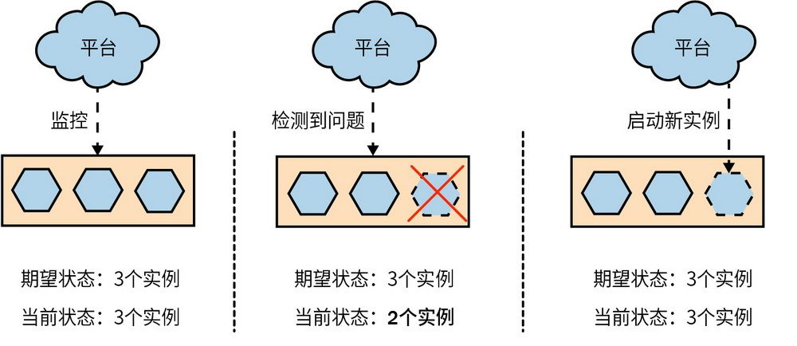

图8-13：提供所需状态管理的平台，在一个实例宕机时启动一个新实例

期望状态管理的美妙之处在于，平台本身管理着如何保持期望状态。它使开发人员和操作人员都不必担心事情是如何完成的——他们只需要专注于正确地定义所需的状态。这也意味着，如果发生问题，例如实例宕机、底层硬件故障或数据中心关闭，平台可以为你处理问题，而无须手动干预。

虽然可以构建自己的工具链来实现期望状态管理，但市面上有很多既有平台，不必重复造轮子。Kubernetes就是这样一种工具，你还可以使用其他工具来实现类似的功能，例如在Azure或AWS等公有云供应商提供的自动缩放组。另一个可以提供此功能的平台是Nomad。与专注于部署和管理基于容器的工作负载的Kubernetes不同，Nomad在运行其他类型的应用程序的工作负载方面也有一个非常灵活的模型，例如Java应用程序、VM、Hadoop作业等。如果你想搭建一个用于管理混合工作负载的平台，并支持期望状态管理，Nomad值得一试。

这些平台可以感知底层资源的可用性，并将期望状态的请求与可用资源相匹配（或者告知你不可能实现）。作为操作人员，你不需要关心底层实现——你可以简单地说，“我想要4个实例分布在2个数据中心”，并依赖于平台来确保它们被正确配置。不同的平台提供不同级别的控制——如果需要，你还可以定义更复杂的期望状态。

如果你忘记了正在使用期望状态管理，它有时可能会给你带来问题。我记得有一次，我在回家之前关闭了AWS上的一个开发集群。我关闭了托管虚拟机实例（由AWS的EC2产品提供）以节省资金——它们不会在夜间使用。但是，我发现当我关掉了其中一个实例，另一个实例就会弹出来。我花了一段时间才意识到我配置了一个自动缩放组，以确保计算机数量保持在一定数量。AWS看到一个实例宕机并启动了一个替代实例。我花了15分钟，才意识到是这个问题。不过，我们是按小时付EC2费用的。即使一个实例只运行了一分钟，我们也会被收取整整一个小时的费用。那天结束时，这个问题最终造成了高昂的费用。从某种意义上说，这是一个“成功”的标志（至少我是这么告诉自己的）——我们前段时间创建了自动缩放组，它一直正常工作以至于我们忘记了它的存在。我们只需要编写一个脚本——在集群关闭的时候禁用自动缩放组——即可修复这个问题。

**0****1****.****前****提****条****件**

若要利用期望状态管理，平台需要某种方法来自动启动微服务实例。因此，实现微服务实例的完全自动化部署是期望状态管理的前提条件。你可能还需要仔细考虑启动实例需要多长时间。如果你使用期望状态管理来确保有足够的计算资源来处理用户负载，那么如果实例宕机，你需要尽快更换一个实例来填补缺口。如果预置新实例需要很长时间，则可能需要设置多余的容量来处理实例宕机时的负载，以便为自己留出足够的时间来启动新副本。

虽然你可以自己制定一个期望状态管理解决方案，但我认为从所需的时间上来讲这并不值得。如果你想尝试这个概念，我认为你最好选择一个以这个概念为核心的平台。由于这意味着要接受一种新工具、新思想，因此你可能希望推迟采用期望状态管理，直到你已经启动并运行了一些微服务。这将使你在新技术过载之前熟悉微服务的基础知识。在你有很多工作负载需要管理时，像Kubernetes这样的平台确实很有帮助——如果你目前只有少量进程，你可以等到系统规模更大后再采用相关工具。

**0****2****.****G****i****t****O****p****s**

GitOps是由Weaveworks提出的一个较新的概念，它将期望状态管理和基础设施即代码的概念结合在一起。GitOps最初是针对Kubernetes工作的，相关的工具和流程也主要用于Kubernetes。

使用GitOps，基础设施的期望状态在代码中定义并存储在源代码管理中。当这些期望状态发生变化时，某些工具会自动将更新后的期望状态应用于正在运行的系统中。这样可以为开发人员提供一个简化的工作流。

如果你使用过Chef或Puppet等基础设施配置工具，那你应该很熟悉它的工作方式。当使用Chef Server或Puppet Master时，你有一个集中的系统，能够在变更发生时将改动应用到基础设施上。不同的是，GitOps工具使用Kubernetes内部的功能来帮助管理应用程序，而不仅仅是基础设施。

像Flux这样的工具正在帮助人们更容易地接受这些想法。当然，值得注意的是，虽然工具可以让你更容易地改变你的工作方式，但它们不能强迫你采用新的工作方法。换句话说，仅仅因为你有Flux（或其他GitOps工具），并不意味着你已经接受了期望状态管理或基础设施即代码的概念。

置身Kubernetes之中，采用Flux这样的工具，以及这类工具所推广的工作方式会加深你对期望状态管理和基础设施即代码等概念的理解。只要真正理解了背后的概念和想要达成的目标，你就不会被这个领域层出不穷的新技术所蒙蔽。

### 8.3 部署选项

当谈到可以用于微服务工作负载的方法和工具时，我们有很多选择。但我们应该基于刚才概述的原则来进行选择。我们希望微服务以隔离的方式运行，并且在理想情况下可以以零停机的方式进行部署。我们希望选择的工具能够让我们接受自动化文化、在代码中定义我们的基础设施和应用配置，并尽可能为我们管理所需的状态。

在关注各种选项是否能达成我们的期望之前，让我们简要总结一下各种部署选项。

**物****理****机**

将微服务实例直接部署到物理机上，无须虚拟化。

**虚****拟****机**

将微服务实例部署到虚拟机上。

**容****器**

微服务实例在虚拟机或物理机上作为单独的容器运行。该容器运行时可以由容器编排工具（如Kubernetes）来管理。

**应****用****容****器**

微服务实例在应用容器内运行，而这个应用容器同时也管理其他的微服务实例。这些实例都是在同一种运行时环境上执行的。
	 

平台即服务（PaaS）

更高度抽象的平台，用于部署微服务实例，通常抽象出用于运行微服务的基础服务的所有概念。平台包括Heroku、Google App Engine和AWS Beanstalk，等等。

函数即服务（FaaS）

微服务实例被部署为一个或多个函数，这些函数由AWS Lambda或Azure Functions等底层平台运行和管理。可以说，FaaS是PaaS的一种特定类型，但鉴于这一思想近来受欢迎的程度，以及它引发的关于如何从微服务映射到部署制品的问题，它本身就值得探索。

#### 8.3.1 物理机

将微服务直接部署到物理机上的做法越来越罕见。我所说的“直接”是指，在微服务和底层硬件之间没有虚拟化或容器化层。由于不同的原因，这种情况变得越来越少见。首先，直接部署到物理机上可能会导致整个资产的利用率降低。如果我在物理机上运行微服务的单个实例，但我只使用了硬件提供的一半的CPU、内存或I/O，那么剩余的资源就被浪费了。正是基于此考虑，大部分计算基础设施都开始支持虚拟化，通过虚拟化在同一台物理机上共存多个虚拟机。它为我们提供了更高的基础设施利用率，大幅节省了基础设施的成本。

其次，如果你只能直接访问物理硬件而无法进行虚拟化，你可能会在同一台计算机上打包多个微服务，这就违反了我们之前讨论的为微服务提供隔离的运行环境的原则。你可以使用Puppet或Chef等工具来配置机器，从而帮助实现基础设施即代码的概念。问题是，如果你只在单个物理机的级别上工作，那么实现期望状态管理、零停机部署等概念就需要在更高的抽象级别上工作，并在顶部使用某种管理层来完成，而这些类型的系统更常与虚拟机结合使用。我们稍后将进一步探讨这一问题。

一般来说，我现在很少见到将微服务直接部署到物理机上的情况，除非你有一些特定的要求或约束，使得这种方法优于虚拟化或容器化为你提供的灵活性。

#### 8.3.2 虚拟机

虚拟化将现有的物理机划分为更小的虚拟机，从而改变了数据中心。传统的虚拟化（如VMware）或主流云供应商提供的托管虚拟机服务（如AWS的EC2），极大地提高了基础设施的利用率，同时降低了主机管理的开销。

从根本上说，虚拟化允许你将底层机器划分为多个较小的“虚拟”机器，这些虚拟机对于运行在虚拟机内部的软件来说，就像真实的服务器一样。你可以将底层CPU、内存、I/O和存储能力的一部分分配给每个虚拟机。在本章的语境中，这意味着可以在单个物理机中塞入更多独立的微服务实例运行环境。

每个虚拟机都包含一个完整的操作系统和一组资源，可供在虚拟机内部运行的软件使用。这确保了在每个实例部署到单独的虚拟机上时，实例之间具有很好的隔离度。每个微服务实例都可以根据自己的本地需求对虚拟机中的操作系统进行全面的配置。但仍然存在一个问题，即如果运行这些虚拟机的物理硬件出现故障，我们会丢失多个微服务实例。有一些方法可以帮助解决这一特定问题，比如之前讨论过的期望状态管理等方式。

**0****1****.****虚****拟****化****的****开****销**

将越来越多的虚拟机打包到相同的物理硬件上时，你会发现单一虚拟机本身可用的计算资源在逐渐减少。这是为什么呢？

可以把我们的物理机想象成一个袜子抽屉。如果我们把很多隔板放进抽屉里，我们能放更多的袜子还是更少的袜子？答案是更少的，因为隔板本身也占用空间。有了隔板以后，我们的抽屉更容易整理，也许可以决定把T恤放在其中一个空间里，而不仅仅是袜子，但更多的隔板也意味着整体空间更少。

在虚拟化的领域里，我们的开销与袜子抽屉的隔板类似。为了了解这种开销的来源，让我们看一下大多数虚拟化是如何实现的。图8-14展示了两种类型的虚拟化的比较。在左侧，我们能看到“类型2虚拟化”中涉及的各个层；在右侧，我们看到的是基于容器的虚拟化。我们稍后将对此进行更多的探讨。

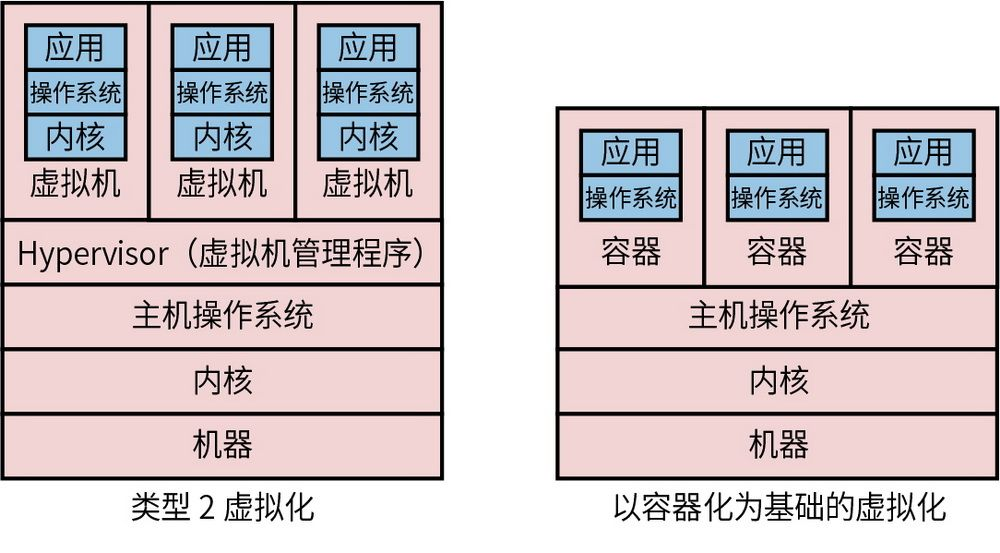

图8-14：标准类型2虚拟化与轻量级容器的比较

类型2虚拟化是由AWS、VMware、vSphere、Xen和KVM实现的。（类型1虚拟化是指虚拟机直接在硬件上运行的技术，而不是在其他操作系统上运行的技术。）在我们的物理基础设施上，有一个主机操作系统。在这个操作系统上，我们运行一个名为“hypervisor”的程序，它有两个关键作业。首先，它将CPU和内存等资源从虚拟主机映射到物理主机。其次，它充当了控制层，允许我们操作虚拟机本身。

在虚拟机内部，我们使用的主机看起来完全不同。它们可以使用自己的内核运行自己的操作系统。它们可以被视为几乎是密封的计算机，通过虚拟机管理程序与底层物理主机和其他虚拟机隔离。

类型2虚拟化的问题在于，这里的虚拟机管理程序需要留出资源来完成其工作。这会占用CPU、I/O和可在其他地方使用的内存。虚拟机管理程序管理的主机越多，所需要的资源就越多。在某一阶段，这种开销会成为进一步分割物理基础设施的限制因素。在实践中，这意味着在将物理盒子分割成越来越小的部分时，会出现回报递减的情况，因为越来越多的资源按比例地被虚拟机管理程序使用。

**0****2****.****是****否****适****合****微****服****务**

回到我们的原则上，虚拟机在隔离方面做得很好，但这是有代价的。它们的自动化程度可能因所使用的特定技术而异。例如，Google Cloud，Azure或AWS上的托管虚拟机都可以通过定义良好的API和基于这些API构建的工具生态系统轻松实现自动化。此外，这些平台还提供自动缩放组等概念，帮助实现所需的期望状态管理。实现零停机部署将需要更多的工作，但是如果你使用的虚拟机平台为你提供了良好的API，那么准备工作就已经完成了（你可以基于这些API开展零停机部署的工作）。问题在于，许多人正在使用传统虚拟化平台（如VMware提供的虚拟化平台）提供的托管虚拟机。虽然从理论上讲它们可以允许自动化，但通常不会用于这种场景。相反，这些平台往往由专门的运维团队集中控制，因此直接针对它们进行自动化的能力也会受到限制。

尽管容器在微服务工作负载中通常更受欢迎，但许多组织已经将大规模的微服务系统运行在了虚拟机上，且效果很好。Netflix是微服务的典型代表之一，它通过EC2在AWS的托管虚拟机之上构建了大部分微服务。如果需要更严格的隔离级别，或者无法将应用容器化，那么虚拟机可能是一个不错的选择。

#### 8.3.3 容器

自第1版出版以来，容器已成为服务端软件部署的主导概念，并且对于许多人来说，容器是封装和运行微服务架构事实上的标准选择。容器概念由Docker广泛推广，在与Kubernetes等支持容器编排的平台结合后，它已成为许多人大规模运行微服务架构的首选。

在讨论为什么会发生这种情况以及容器、Kubernetes和Docker之间的关系之前，我们首先要了解容器到底是什么，并具体了解它与虚拟机的区别。

**0****1****.****独****立****且****不****同**

容器最初出现在UNIX风格的操作系统上，并且多年来只可以用在这种类型操作系统上，例如Linux。尽管Windows容器也非常重要，但迄今为止，容器对Linux操作系统的影响最大。

在Linux上，进程由给定用户以给定权限的方式运行。进程可以创建其他进程。例如，如果我在终端中启动一个进程，该进程通常被认为是终端进程的子进程。Linux内核的工作是维护这个进程树，确保只有被允许的用户才能访问这些进程。此外，Linux内核能够为这些不同的进程分配资源——这是构建可行的多用户操作系统的重要组成部分。在这个系统中，你不希望一个用户的活动导致整个系统崩溃。

在同一台机器上运行的容器使用相同的底层内核（尽管我们稍后将探讨此规则的例外情况）。与直接管理进程不同，你可以将容器视为对整个系统进程树的子树的抽象，由内核负责完成所有困难的工作。这些容器可以分配到一些物理资源，这是内核为我们处理的。类似的方法有多种形式，例如Solaris Zones和OpenVZ，但正是LXC的出现，这种想法才成为Linux操作系统的主流。当Docker提供了相对于LXC更高级别的抽象时，LXC的概念得到了进一步的发展——最初在底层使用LXC，然后完全替换了它。

如果我们查看图8-14中运行容器的主机的堆栈图，并将其与类型2虚拟化进行比较，我们会发现一些差异。首先，我们不需要hypervisor。其次，容器似乎没有内核——那是因为它使用了底层机器的内核。在图8-15中，我们可以更清楚地看到这一点。一个容器可以运行自己的操作系统，但该操作系统使用了共享内核的一部分——每个容器的进程树都存在于这个内核中。这意味着我们的主机操作系统可以运行Ubuntu，容器可以运行CentOS，只要它们都能作为同一共享内核的一部分运行。

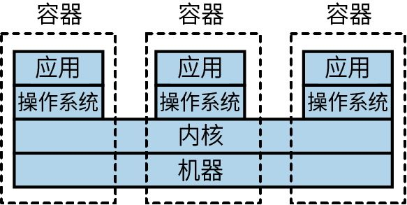

图8-15：通常同一台机器上的容器共享同一个内核

使用容器后，我们不仅因不需要虚拟化管理程序而节省了资源，而且还可以更快地获得反馈。与完整的虚拟机相比，Linux容器的部署速度更快。虚拟机可能需要几分钟才能启动，而使用Linux容器，启动可能只需几秒钟。此外，我们还可以更细粒度地控制为容器分配的资源，更轻松地调整设置以充分利用底层硬件。

由于容器的轻量化特性，我们可以在同一台硬件上运行比虚拟机数量更多的容器。如图8-16所示，通过为每个容器部署一个服务，我们可以在一定程度上与其他容器隔离（尽管这并不完美），并且可以以更具成本效益的方式运行。回到之前的袜子抽屉的类比，对于容器，袜子抽屉的隔板比虚拟机薄得多，这意味着我们可以更高效地使用袜子抽屉的空间。

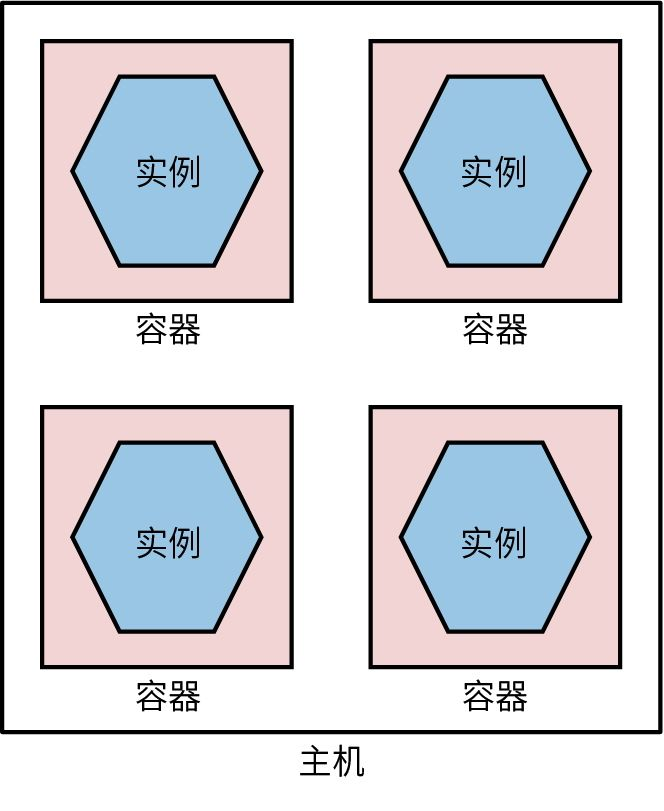

图8-16：在单独的容器中运行服务

容器也可以很好地与全功能虚拟化一起使用；实际上这也很常见。我不止一次见到项目预置了一个大型AWS EC2实例，并在其上运行多个容器，以实现两全其美的效果：获得一个EC2形式的按需临时计算平台，以及依附在之上运行的高度灵活和快速的容器。

**0****2****.****并****不****完****美**

然而，Linux容器并非没有问题。想象一下，在主机上我有很多微服务在它们自己的容器中运行。外界是如何看待它们的？你需要某种方式将外部世界路由到底层容器，这是许多虚拟机管理程序通过普通虚拟化来解决的问题。在早期的技术中，比如LXC，这是你必须自己处理的问题——Docker容器化正是对这一点大有帮助。

还要记住的一点是，从资源的角度来看，容器可以被视为是相对隔离的——我可以为每个容器分配一定的CPU、内存等资源，但这和从虚拟机或单独的物理机层面获得的隔离程度还是不同的。早期，有许多案例表明一个容器中的进程有可能突破容器的隔离并与其他容器或底层主机交互。

有很多研究尝试解决这些问题，容器编排系统和底层容器运行时在改进容器工作负载以优化隔离方面做得很好，但你需要考虑清楚你想要运行的工作负载。我自己遵循的原则是，一般来说，你应该将容器视为隔离受信任软件执行的绝佳方式。如果你正在运行其他人编写的代码，并担心有恶意方试图绕过容器级别的隔离，那么你就需要深入了解当前可以处理此类情况的最新方法——我们稍后会讨论其中的一些例子。

**0****3****.****W****i****n****d****o****w****s****容****器**

历史上，Windows用户常常羡慕使用Linux的同行，因为Windows操作系统不支持容器。然而，在过去的几年里，情况发生了变化，容器已成为在Windows上得到充分支持的概念。这样的延迟实际上取决于底层的Windows操作系统和内核是否提供同类功能，是否支持与Linux容器类似的机制。随着Windows Server 2016的发布，很多方面发生了变化，从那以后，Windows容器一直在不断发展。

在采用Windows容器的初期阶段，最初的障碍之一是Windows操作系统本身的大小。要知道，你需要在每个容器内运行操作系统，因此当下载容器镜像时，实际上也在下载操作系统。不过，Windows太大了，以至于容器不仅有很大的镜像尺寸，而且运行时消耗的资源也很多。

为解决这个问题，微软创建了名为“Windows Nano Server”的精简版操作系统。这个想法是Nano Server应该是一个占用空间小的操作系统，并能够运行微服务实例。除此之外，微软还支持更大的Windows Server Core，支持将旧版Windows应用程序作为容器运行。问题是，与Linux同类产品相比，这些操作系统仍然很大——与仅占几兆字节空间的Alpine等小型Linux操作系统相比，Nano Server的早期版本仍然超过1 GB。

尽管微软一直在尝试缩小Nano Server的大小，但差距仍然存在。在实践中，由于可以缓存容器镜像之间的公共层，这可能不是一个大问题。

在Windows容器的领域中，人们特别感兴趣的是它们支持不同级别的隔离。一个标准的Windows容器使用进程隔离，类似Linux容器。通过进程隔离，每个容器都在同一底层内核的一部分中运行，该内核管理容器之间的隔离。使用Windows容器，你还可以选择通过在容器自己的Hyper-V虚拟机中运行容器来提供更多的隔离。这使你更接近完全虚拟化的隔离级别，而好处是，在启动容器时你可以在Hyper-V或进程隔离之间进行选择，无须更改镜像。

在不同类型的隔离中灵活地运行镜像可以带来好处。在某些情况下，你的威胁模型可能要求你在运行进程时实现比简单的进程隔离更强的隔离。例如，你可能在自己的进程中运行“不受信任”的第三方代码。在这种情况下，能够将这些容器工作负载作为Hyper-V容器运行非常有用。当然，请注意，Hyper-V隔离可能会对启动时间和运行时成本产生影响，在运行时成本方面更接近正常虚拟化。

**模****糊****的****界****限**

人们越来越倾向于寻找既能够提供虚拟机所提供的更强大的隔离能力又具有容器的轻量级特性的解决方案。例如微软的Hyper-V容器，它允许使用单独的内核，以及Firecracker。Firecracker被称为“基于内核的虚拟机”，这个名字令人困惑。事实证明，Firecracker作为AWS Lambda等产品的关键实现已经被广泛使用，它将来自不同客户的工作负载完全隔离，在提供隔离性的同时仍会试图缩短启动时间并减少工作负载的操作足迹。

**0****4****.****D****o****c****k****e****r**

在Docker出现之前，容器的使用一直十分有限，Docker得到推广后容器才被带入了主流。Docker工具链处理了很多与容器相关的工作。Docker管理容器配置，为你处理一些网络问题，甚至提供自己的注册表概念，允许你存储Docker应用程序。在Docker之前，我们没有容器的“镜像”概念。在这一方面，Docker提供了一组更好的容器处理工具，帮助容器变得更易于使用。

Docker镜像的抽象对我们来说很有用，通过它我们可以隐藏微服务实现的技术细节。我们让微服务的构建创建一个Docker镜像作为构建制品，并将该镜像存储在Docker镜像仓库中，然后就可以启动了。当你启动Docker镜像的实例时，无论使用何种底层技术，都可以使用一组通用工具来管理该实例。不管用Go、Python、NodeJS还是其他语言编写的微服务都可以进行相同的处理。

Docker还可以减轻本地运行大量服务以进行开发和测试所带来的一些负面影响。以前，我可能会使用像Vagrant这样的工具，它允许我在开发计算机上托管多个独立的虚拟机。这可以让我在本地运行类似于生产环境的虚拟机来运行我的服务实例。不过，这是一种相当笨重的方法，且我可以运行的虚拟机数量有限。借助Docker，我可以通过Docker Desktop轻松地在我的机器上运行Docker。现在，我只需要为我的微服务实例构建一个Docker镜像，或者下载一个预构建的镜像，并在本地运行它。这些Docker镜像可以（也应该）与我最终在生产环境中运行的容器镜像相同。

当Docker首次出现时，它的范围仅限于在一台机器上管理容器。它的用途十分有限——如果你想要跨多台计算机管理容器该怎么办？如果你想保持系统的健康状态，或者如果你的一台机器出现故障，又或者如果你只想运行足够数量的容器来处理系统负载，跨多台计算机管理容器是非常重要的。Docker推出了两种完全不同的产品来解决这个问题，这两种产品的名字容易让人混淆——它们被分别称为“Docker Swarm”和“Docker Swarm Mode”。谁说命名东西是个很难的事儿？但是，当涉及跨多台计算机管理大量容器时，Kubernetes是无可争议的首选，即便你可以使用Docker工具链来构建和管理单个容器。

**0****5****.****微****服****务****的****适****应****度**

对于微服务而言，容器这个概念非常适用，而Docker使容器这一概念变得更加可行。我们以可控的成本获得了资源的隔离。我们还隐藏了底层技术，允许我们混合使用不同的技术栈。但是，当涉及实现诸如期望状态管理之类的概念时，我们需要Kubernetes这样的工具来处理。

Kubernetes非常重要，值得更详细的讨论，因此我们将在本章的后面部分继续探讨。但就目前而言，只需要将其视为跨多台机器管理容器的一种方式就足够了。

#### 8.3.4 应用容器

如果你熟悉将.NET应用程序部署到IIS，或将Java应用程序部署到Weblogic或Tomcat等中间件中，那么你会非常熟悉这样一种模型，即多个不同服务或应用程序位于单个应用容器中，如图8-17所示。这个想法是，应用容器可以提供更好的可管理性，例如支持将多个实例分组在一起的集群功能、监控工具等。

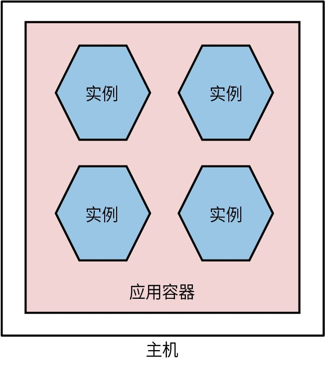

图8-17：多个微服务共享一个应用容器

此设置还带来了另外一个好处——减少语言运行时的开销。考虑这样一个场景，在单个Java Servlet容器中运行5个Java服务，只需要一个JVM的开销，而和使用容器时在同一主机上运行5个独立的JVM相比，开销确实更小了。尽管如此，我仍然觉得这些应用容器存在缺点。你应该挑战自己，看看它们是否真的是必需的。

首先，它们的缺点之一是，它们不可避免地限制了技术选择。你必须深度使用某种技术栈。这不仅会限制服务本身的实现技术选择，还会限制你在系统自动化和系统管理方面的选择。正如我们稍后将要讨论的那样，解决管理多个主机的开销的方法之一是实现自动化，因此限制我们解决问题的选择（由于技术栈的绑定导致可用于自动化的选项也少了很多）很可能会产生双重损害。

其次，我也会质疑这些应用容器提供的一些功能的价值，其中部分吹嘘的功能是管理集群以支持共享内存会话状态，而这正是我们无论如何都希望避免的，因为它会给服务扩展带来挑战。我们将在第10章中看到，考虑到要在微服务领域进行各种联合监控，它们提供的监控能力是不够的，其中许多启动得还相当慢，影响了开发人员的反馈周期。

此外，还存在其他问题。尝试在JVM等平台上对应用程序进行适当的生命周期管理可能会遇到问题，而且比简单地重新启动JVM更复杂。分析资源使用情况和线程也要复杂得多，因为有多个应用程序共享同一个进程。请记住，即使你确实从基于特定技术的容器中获得了价值，它们也不是免费的。除了许多容器是商业性的（由此增加了成本），它们本身也会增加资源开销。

最终，这种方式是优化资源稀缺的一种尝试，但已经不再适用。无论你是否决定将每个主机有多个服务作为部署模型，我强烈建议你将自包含的可部署微服务视为交付物，每个微服务实例都作为其自己的独立进程运行。

从根本上说，缺乏适当的隔离性是采用微服务架构的人越来越少使用这种模型的主要原因之一。

#### 8.3.5 平台即服务（PaaS）

平台即服务（PaaS）是一种比单个主机抽象层次更高的工作方式，其中一些平台依赖于特定技术的制品，比如Java WAR或者Ruby gem，并自动为用户配置和部署。有一些平台在不需要特别干预的情况下自动处理系统的升级和降级；还有一些平台允许用户自主控制服务运行的节点数，但其余部分由它们来处理。

就像我写第1版时的情况一样，大多数最好、最成熟的PaaS解决方案都是托管的。Heroku为提供开发人员友好界面设定了基准；尽管过去几年其功能集的增长有限，但是它仍然是PaaS的黄金标准。像Heroku这样的平台不只是运行你的应用程序实例，它们还提供诸如为你运行数据库实例之类的功能，而这些工作如果让你自己做，则会非常困难。

当PaaS解决方案运行良好时，它们的表现非常出色。但是，当它们出现问题时，你通常无法控制底层逻辑来解决问题。这是你必须要做的权衡。我想说的是，根据我的经验，PaaS解决方案越智能，出错的可能性就越大。我使用过很多种基于应用使用情况而自动扩容的PaaS平台，但效果很糟糕。从设计角度看，这些PaaS平台趋向于为标准化的应用服务，而非为你的应用量身定制的。换言之，应用定制化程度越高，就越有可能无法很好地与PaaS配合使用。

良好的PaaS解决方案确实可以帮助我们解决很多问题。我们的应用包含越来越多的组成模块，在这样的情况下，PaaS确实是我们解决开销问题的绝佳方式。尽管如此，我仍然不确定我们是否已经在这个领域找到了所有场景，而有限的自托管意味着这种方法可能不再适用于你的场景。当我写第1版时，我希望能在这个领域看到更多的增长，但事实并非如我所愿。相反，我认为主要由公有云供应商提供的无服务器产品的增长已经开始满足这一需求。它们没有为托管应用程序提供黑盒平台，而是提供了即插即用的托管解决方案，用于消息代理、数据库、存储等，使我们能够混合和匹配我们需要的部分来构建我们所需的东西。正是在这种背景下，FaaS——一种特定类型的无服务器产品——获得了很大的关注。

评估PaaS产品对微服务的适用性是件困难的事情，因为它们有多种形式和大小。例如，Heroku看起来与Netlify完全不同，但根据应用程序的性质，两者都可以作为微服务的部署平台。

#### 8.3.6 函数即服务（FaaS）

在过去的几年里，唯一在声望方面接近Kubernetes的技术（至少在微服务的环境中）是无服务器技术。无服务器技术实际上是许多不同技术的总称。从使用这些技术的人的角度来看，底层计算机并不重要。管理和配置计算机的细节被抽象化了。用Ken Fromm（据我所知，他创造了“无服务器”一词）的话来说：

短语“无服务器”并不意味着不再涉及服务器。这只是意味着开发人员不再需要考虑太多。计算资源可用作服务，而无须管理物理容量或限制。服务供应商越来越多地承担管理服务器、数据存储和其他基础设施资源的责任。开发人员可以建立自己的开源解决方案，但这意味着他们必须管理服务器、队列和负载。

——Ken Fromm，“Why the Future of Software and Apps Is Serverless”

FaaS已成为无服务器计算的重要组成部分，以至于对于许多人来说，这两个术语是可以互换的。但这不太正确，因为它忽略了其他无服务器产品（如数据库、队列、存储解决方案等）的重要性。尽管如此，它表明了FaaS让人如此兴奋的原因，以及FaaS在无服务器计算领域的主导作用。

AWS于2014年推出了Lambda产品，这引发了有关FaaS的热潮。在某种程度上，这个概念非常简单。部署一些代码（“函数”），该代码处于休眠状态，直到发生某些事件来触发该代码。你来决定该触发事件可能是什么——它可能是到达特定位置的文件、出现在消息队列中的项目、通过HTTP传入的调用或其他事件。

当函数触发时，它会运行；当它完成时，它会关闭。底层平台可按需启动或关闭这些函数，并处理函数的并发执行，以便在适当的情况下同时运行多个副本。

这里的好处很多。未运行的代码不会产生费用，你只需要为使用的内容付费。这使得FaaS在负载较低或不可预测的情况下成为一个绝佳选择。底层平台为你处理函数运行所需的一切，为你提供一定程度的隐式高可用性和健壮性，而你无须进行任何工作。从根本上讲，与许多其他无服务器产品一样，使用FaaS平台可以大幅减少你所担心的运营开销。

**0****1****.****局****限****性**

在幕后，据我所知，所有的FaaS实现都使用了某种容器技术。这对你来说是隐藏的，你不必担心如何构建将要运行的容器，只需要提供一些打包形式的代码。不过，这也意味着你对运行的内容缺乏一定程度的控制；因此，你需要FaaS供应商来支持你选择的语言。就主要的云供应商而言，Azure Functions在这方面做得最好，支持各种不同的运行时环境，而Google Cloud自己的Cloud Functions产品仅支持很少的语言（截至撰写本文时，谷歌仅支持Go，某些版本的Node和Python
	 ）。值得注意的是，AWS现在确实允许你为函数定义自己的运行时环境，理论上能够实现对非开箱即用语言的支持，尽管这会成为你必须维护的另一项运营开销。

这种对基础运行时环境缺乏控制的情况也延伸到对每个函数调用分配的资源缺乏控制。在Google Cloud、Azure和AWS中，你只能控制分配给每个函数的内存。这反过来似乎意味着为函数运行时提供了一定数量的CPU和I/O，但你无法直接控制这些资源。这可能表明，即使函数不需要，你也必须为函数分配更多的内存，以获得函数所需的CPU。如果你觉得你需要对函数的可用资源进行大量的微调，那么我认为，至少在现阶段，FaaS可能不是一个很好的选择。

还要注意的一个限制是，函数调用可以在运行时间方面设定限制。例如，Google Cloud函数目前的执行时间上限为9分钟，而AWS Lambda函数最多可以运行15分钟。如果需要，Azure函数可以永久运行（取决于你所使用的计划类型）。就我个人而言，我认为如果函数需要长时间运行，这可能表明函数并不适合解决你当前的问题。

最后想说的是，大多数函数调用被认为是无状态的。从概念上讲，这意味着函数无法访问前一个函数调用留下的状态，除非该状态存储在其他位置（例如，数据库中）。这使得多个函数的连接变得很困难，比如一个函数编排对其他下游函数进行一系列调用。不过，Azure Durable Functions是一个值得注意的例外，它以一种非常有趣的方式解决了这个问题。Durable Functions支持挂起给定函数的状态，并允许从调用停止的地方重新启动函数——这一切都是通过使用反应式扩展进行透明地处理的。我认为相比于AWS自己的Step Functions，这一解决方案对开发人员更加友好；Step Functions使用基于JSON的配置将多个函数连接在一起。

**W****e****b****A****s****s****e****m****b****l****y****（****W****A****S****M****）**

WASM是一个官方标准，最初定义为一种在客户端浏览器上运行用多种编程语言编写的沙盒程序的方法。它定义了打包格式和运行时环境，其目标是允许任意代码在客户端设备上以安全有效的方式运行。在使用普通的Web浏览器时，这允许创建更复杂的客户端应用程序。举个具体的例子，eBay使用WASM向网络提供条形码扫描仪软件，其核心是用C++编写的，以前仅适用于本机Android或iOS应用程序。
	  WASI（WebAssembly System Interface，WASM系统接口）定义了一种规范，让WASM的使用超越了浏览器，扩展到任何兼容WASI规范的场景中。这方面的例子有在Fastly或Cloudflare等内容交付网络上运行WASM。

由于其轻量级的特性和内置的强大沙盒概念，WASM有可能挑战使用容器作为服务端应用程序的首选部署格式。在短期内，阻碍它的可能是用于运行WASM的服务端平台。虽然理论上你可以在Kubernetes上运行WASM，但你最终会将WASM嵌入到容器中，这可以说是毫无意义的，因为你在一个（相对）更重量级的容器中运行了一个更轻量级的部署。

要充分发挥WASM的潜力，可能需要一个对WASI提供本机支持的服务端部署平台。至少从理论上讲，像Nomad这样的调度程序更适合支持WASM，因为它支持可插拔的驱动程序模型。时间会证明一切！

**0****2****.****挑****战**

除了我们刚刚看到的限制之外，在使用FaaS时你可能还会遇到一些其他挑战。

首先，需要解决一个经常在FaaS中提出的问题，即启动时间的问题。从概念上讲，除非需要函数，否则根本不运行函数。这意味着必须启动它们才能为传入的请求提供服务。对于某些运行时，启动新版本需要很长时间，通常称为“冷启动”时间。JVM和.NET运行时受此影响很大，因此使用这些运行时的函数的冷启动时间通常会很长。

但在现实中，这些运行时很少会冷启动。至少在AWS上，运行时会保持“热”状态，以便传入的请求由已启动和正在运行的实例提供服务。这种情况发生得如此频繁，以至于现在很难衡量“冷启动”的影响，因为FaaS供应商在幕后进行了优化。尽管如此，如果这是一个问题，那么坚持使用运行时具有快速启动时间的语言（例如Go、Python、Node和Ruby）可以有效地避开这个问题。

最后，函数的动态扩容特性也存在一些问题。函数在被触发后就会启动。我使用过的所有平台都对并发函数调用的最大数量有硬性限制，你可能需要特别注意这一点。我已经与不止一个团队交流过，他们曾经遇到函数扩容给基础设施的其他部分带来压力的问题（后者不具有相同的扩容能力）。来自Bustle的Steve Faulkner分享了这样一个例子：函数扩容使Bustle的Redis基础设施过载，导致生产问题。如果系统的一部分可以动态扩容，但系统的其他部分不能，那么这种不匹配将会导致严重的问题。

**0****3****.****映****射****到****微****服****务**

在我们讨论各种部署选项时，将微服务实例映射到部署机制比较简单。单个微服务实例可以部署到虚拟机上，打包为单个容器，甚至可以放在Tomcat或IIS这样的应用容器中。但是，如果使用FaaS，事情会变得更加混乱。

**一****个****微****服****务****一****个****函****数**。显然，一个微服务实例可以作为一个函数进行部署，如图8-18所示。这可能是一个合理的起点。这保持了微服务实例作为部署单元的概念，这也是我们迄今为止探讨最多的模型。

调用时，FaaS平台将在已部署的函数中触发单个入口点。这意味着，如果要为整个服务部署一个单个函数，则需要通过某种方式从该入口点分发请求到微服务的不同功能模块。如果将费用微服务实现为基于REST的微服务，则可能会暴露各种资源，例如/receipts、/claims或/reports。使用此模型，对这些资源中的任何一个请求都将通过同一入口点传入，因此你需要根据入站请求路径将入站调用定向到相应的功能模块。

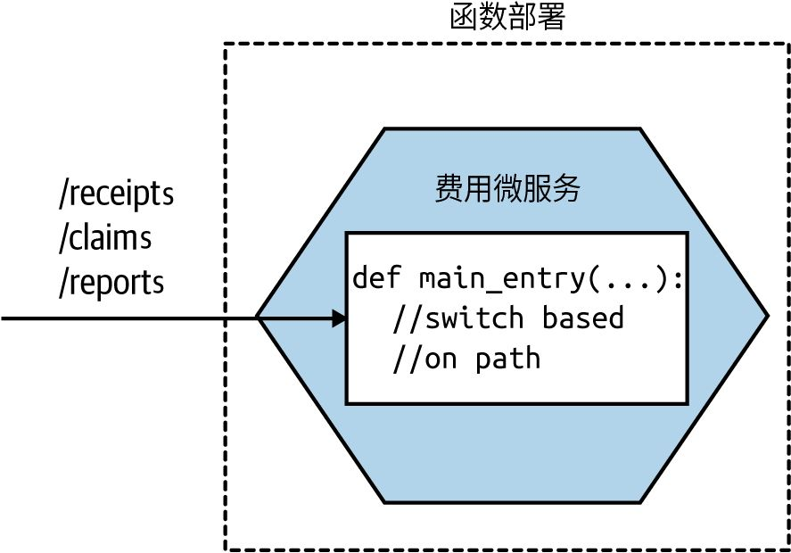

图8-18：费用微服务是作为单一函数实现的

**一****个****聚****合****一****个****函****数**。那么，我们如何将微服务实例分解为更小的函数呢？如果你使用领域驱动设计对架构进行设计，则你应该已经对聚合（作为单个实体管理的对象集合，通常指物理世界中的概念）进行了显式建模。如果你的微服务实例拥有多个聚合，那么对我来说有意义的模型是，为每个聚合建一个函数，如图8-19所示。这可确保单个聚合的所有逻辑在函数中都是自包含的，从而更容易确保聚合内对象生命周期的一致性。

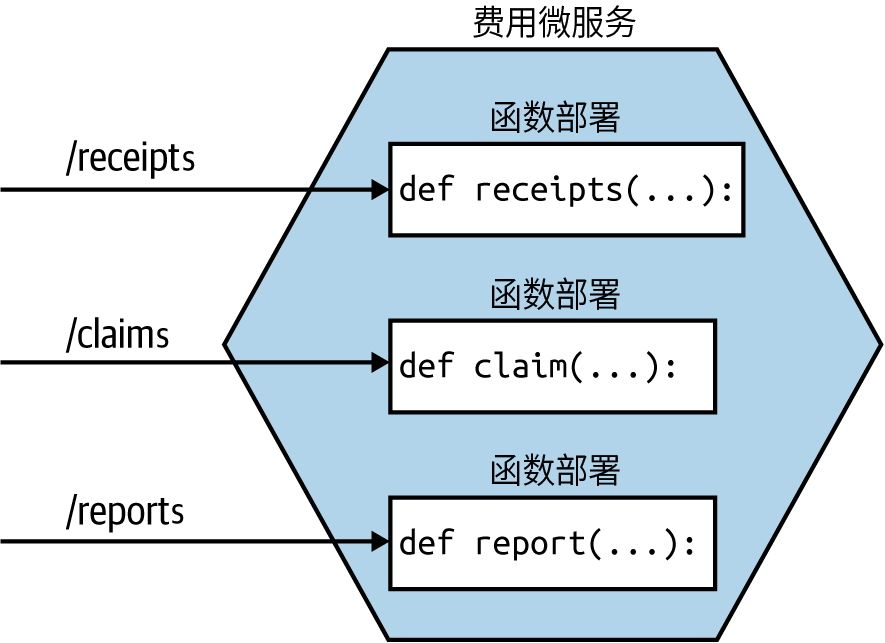

图8-19：费用微服务被部署为多个函数，每个函数处理不同的聚合

使用此模型后，我们的微服务实例不再映射到单个部署单元。相反，我们的微服务现在更像是一个逻辑概念，由多个不同的函数组成。理论上这些函数可以相互独立地部署。

这里需要注意几个问题。首先，我强烈建议你维护一个粗粒度的外部接口。对于上游消费者，他们仍在与费用微服务通信。他们不需要了解请求已被映射到较小范围的聚合。这确保了如果你改变主意，想要重新组合或者重构聚合模型，也不会对上游消费者造成影响。

第二个问题涉及数据。这些聚合是否应继续使用共享数据库？在这个问题上，我并不担心。假设同一个团队管理所有这些函数，并且从概念上讲它仍然是单个“服务”，那么我可以让它们仍然使用相同的数据库，如图8-20所示。

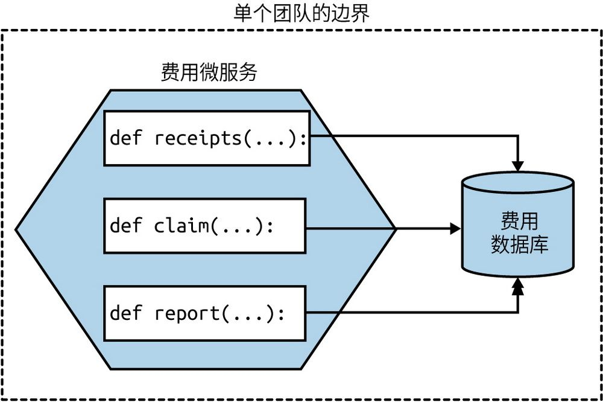

图8-20：使用同一数据库的不同函数，因为它们在逻辑上都是同一微服务的一部分，并由同一团队管理

但是，随着时间的推移，如果每个聚合函数的需求发生分歧，当数据层的耦合影响到你轻松进行更改的能力时，我倾向于分离出它们的数据使用情况，如图8-21所示。此时，你可以认为这些函数现在本身就是独立的微服务，尽管正如我刚刚解释的那样，仍将它们表示为单个微服务，对于上游消费者可能有一定的价值。

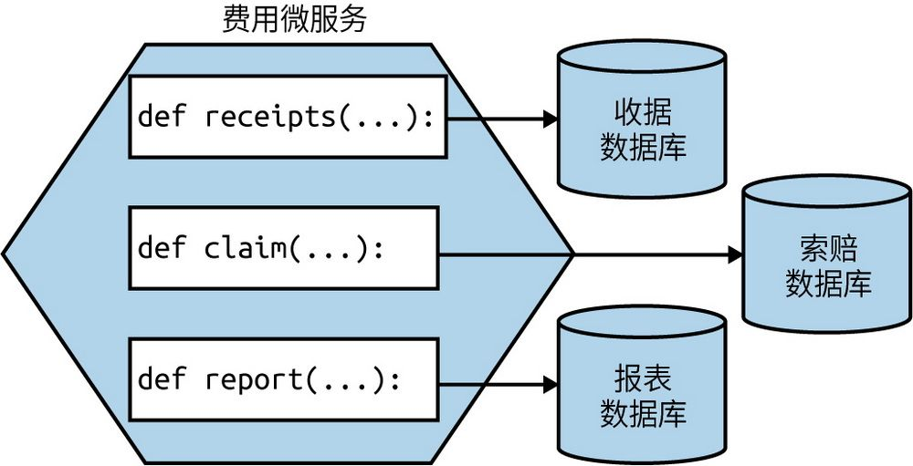

图8-21：每个函数都使用自己的数据库

这种将单个微服务映射到多个更精细的可部署单元的方式，对我们之前对于微服务的定义造成了一些影响。我们通常将微服务视为可独立部署的最小单元，但现在一个微服务由多个不同的可独立部署单元组成。从概念上讲，在此示例中，微服务更像是一个逻辑概念，而不是一个物理概念。

**获****得****更****细****粒****度**。如果你想进一步细化，那么很容易想把每个聚合的函数分解成更小的部分。而我在这方面会非常谨慎。除了可能产生大量函数的问题之外，这还违反了聚合的核心原则之一，即我们希望将其视为单一单元，以确保我们能够更好地管理聚合本身的完整性。

我以前考虑过将聚合的每个状态转换拆分成自己的函数，但由于最终一致性方面会带来问题，我后来放弃了这个想法。当你有不同的可独立部署的内容时，每个内容都管理着整体状态转换的不同部分，确保正确完成所有内容变得非常困难。我们需要Saga，这在第6章中讨论过。在实施复杂的业务流程时，像Saga这样的概念很重要，而且付出的成本是值得的。但是，我很难看到在管理单个聚合的级别上增加这种复杂性的价值，因为单个聚合可以很容易地由单个函数处理。

**0****4****.****未****来**

我仍然相信，对于大多数开发人员来说，未来的发展方向是使用一个将许多底层细节隐藏起来的平台。多年来，Heroku是我能指出的最接近找到正确平衡的平台，但现在我们有了FaaS和更广泛的无服务器技术产品生态，它们开辟了一条不同的道路。

FaaS仍有一些问题需要解决，但我认为，尽管当前的产品仍然需要改进以解决这些问题，但这仍是大多数开发人员最终会使用的平台。考虑到这些限制，并非所有应用程序都能完美地适应FaaS生态系统，但对于那些这样做的应用程序，人们已经看到了显著的好处。随着越来越多的工作投入基于Kubernetes的FaaS解决方案中，那些无法直接使用主要云供应商提供的FaaS解决方案的人将越来越多地利用这种新的工作方式。

因此，虽然FaaS可能并非适用于所有情况，但我强烈建议人们继续探索。对于正在考虑转向基于云的Kubernetes解决方案的客户，我一直敦促他们中的许多人首先探索FaaS，因为它可能会为他们提供所需的一切，同时会隐藏显著的复杂性并极大程度地减轻他们的工作量。

我看到越来越多的组织将FaaS用作更广泛解决方案的一部分，它们为适合的特定用例选择FaaS。一个很好的例子是英国广播公司，它将Lambda函数作为其新闻网站的核心技术栈的一部分。整个系统混合使用Lambda函数和EC2实例，EC2实例通常在Lambda函数调用成本过高的情况下使用。
	 

### 8.4 哪种部署方式适合你

我们确实有很多选择，对吧？我分享了每种方法的利弊，但可能帮助并不太大。如果你已经走到这一步，你可能会对自己应该做什么感到有点困惑。
	

在我继续之前，我想强调的是，如果你目前的做法适合你，那就继续做吧！不要让潮流左右你的技术决策。

如果你认为你确实需要改变微服务的部署方式，那么让我尝试提炼出我们已经讨论过的大部分内容，并给出一些有用的指导。

当重新审视微服务部署原则时，我们关注的最重要的一个方面是确保微服务的隔离。但是，仅将其作为指导原则可能会引导我们使用独享的物理机器来部署每个微服务实例。当然，这可能非常昂贵。正如我们讨论过的，如果选择这条路线，我们就无法使用一些非常强大的工具。

这里存在很多权衡和取舍。在成本与易用性、隔离性、熟悉度之间取得平衡……有太多需要考虑的内容，让人不知所措。因此，让我们回顾一组规则——我喜欢称之为“Sam的基本经验”，用于确定应用的部署方式。

01.没坏就别修。
	 

02.放弃尽可能多的控制权，然后再多放弃一点。如果你能把所有的工作都转移到像Heroku（或FaaS平台）这样优秀的PaaS上，那就去做吧，你会感到满意。你真的需要调整每一个设置吗？

03.将微服务容器化并非没有痛苦，但在隔离成本方面，它是一个非常好的折中方案，对本地开发有好处。同时，它仍然让你可以在一定程度上控制发生的事情。预计Kubernetes会在你的未来工作中扮演重要角色。

许多人宣称：“要么使用Kubernetes，要么一无所有”（Kubernetes or bust）。但我认为这种说法并不有益。如果你使用的是公有云，且你的问题适合使用FaaS作为部署模型，那么就选择FaaS，不使用Kubernetes。这样做，你的开发人员可能会更加高效。正如第16章将要讨论的那样，不要因为担心技术锁定而让自己陷入自己制造的困境中。

你找到像Heroku或Zeit这样出色的PaaS，并拥有符合平台约束的应用程序了吗？如果情况是这样的，那么你可以将所有工作推送到平台上，并花更多的时间开发你的产品。从开发人员的角度来看，Heroku和Zeit都是相当优秀的平台，具有出色的易用性。难道你的开发人员不应该感到快乐吗？

对于其他人来说，容器化可能是要走的唯一道路，这意味着我们下面要一起看看Kubernetes。

**P****u****p****p****e****t****、****C****h****e****f****以****及****其****他****工****具****的****角****色**

自第1版出版以来，本章内容发生了重大变化。在一定程度上，是因为整个行业的不断发展，但同时也因为新技术变得越来越实用。其他技术发挥的作用在逐渐变小，我们看到Puppet、Chef、Ansible和Salt等工具在部署微服务架构中所起的作用比2014年时要小得多。

从根本上说，造成这种情况的主要原因是容器的兴起。Puppet和Chef等工具的强大之处在于，它们为你提供了一种将机器置于所需状态的方法，并以某种代码形式定义所需状态。你可以定义所需的运行时间、配置文件需要的位置等，其方式可以在同一台计算机上多次地稳定运行，从而确保它始终可以进入相同的状态。

大多数人构建容器的方式是通过定义Dockerfile。它允许你规定系统的要求——与Puppet或Chef相同的要求，但存在一些差异。容器在重新部署时会被重建，因此每个容器的创建都是从头开始的（我在这里简化了一些内容）。这意味着不需要处理Puppet和Chef中固有的许多复杂性——在同一台机器上反复运行。

随着容器技术的发展，Puppet、Chef和类似的工具仍然非常有用，但它们的作用正转向更底层的基础设施的管理上。人们使用此类工具来管理传统应用程序和基础设施，或用于构建容器类工作负载运行所需的集群。但是开发人员与这些工具接触的机会比以前要少。

基础设施即代码的概念仍然至关重要。只是开发人员使用的工具类型发生了变化。例如，对于那些使用云的人来说，像Terraform这样的工具对于配置云基础架构非常有用。最近，我成了Pulumi的忠实粉丝，它不使用特定领域语言（domain-specific language，DSL），而是使用常用的编程语言来帮助开发人员管理其云基础设施。随着交付团队越来越多地承担起DevOps的责任，我认为Pulumi的前景会越来越广阔。我怀疑Puppet、Chef等工具虽然将继续在运维中发挥作用，但会越来越远离日常开发活动。

### 8.5 Kubernetes与容器编排

随着容器越来越受欢迎，许多人开始寻找如何跨多台机器管理容器的解决方案。Docker在这方面有过两次尝试（分别是Docker Swarm和Docker Swarm Mode）；Rancher和CoreOS这样的公司也提出了自己的观点；Mesos等更通用的平台被用来运行容器和其他类型的工作负载。但是，尽管这些产品付出了很多努力，在过去几年中还是Kubernetes占据了这一领域的主导地位。

在探讨Kubernetes本身之前，首先来了解一下为什么需要这样的工具。

#### 8.5.1 容器编排案例

从广义上讲，Kubernetes可以被描述为一个容器编排平台，或者用一个已经“失宠”的术语来叫它——容器调度器。那么这个平台是什么，我们为什么要用它？

容器是通过隔离底层基础设施上的一组资源来创建的。像Docker这样的工具允许我们定义容器的外观，并在机器上创建该容器的实例。但大多数解决方案要求在多台机器上定义我们的软件，也许是为了处理足够的负载，或者确保系统具有适当的冗余，以容忍单个节点的故障。容器编排平台管理容器工作负载的运行方式和位置。在这种情况下，“调度”一词开始变得更有意义。操作员说：“我希望这个东西运行起来”，协调人编排程序决定如何安排该工作——查找可用资源、在必要时重新分配资源，并为操作员处理相关细节。

各种容器编排平台还帮助我们实现期望状态管理，确保一组容器（在本例中指的是微服务实例）的期望状态得到维护。它们还允许我们指定如何分配这些工作负载，从而使我们能够对资源利用率、进程之间的延迟或健壮性进行优化。

如果没有这样的工具，你将不得不管理容器的分发。我可以用亲身经历告诉你，这个工作很快会让人厌倦。编写脚本来管理容器实例的启动和互联并不有趣。

从广义上讲，包括Kubernetes在内的所有容器编排平台都以某种方式来提供这些功能。如果你查看Mesos或Nomad这样的通用调度器，以及AWS的ECS、Docker Swarm Mode等托管解决方案，你会看到类似的功能集。但出于我们稍后将要谈到的原因，Kubernetes赢得了优势。它还有一两个有趣的概念值得简要探讨。

#### 8.5.2 Kubernetes概念的简化视图

Kubernetes中还有许多其他概念，所以请原谅我没有深入探讨所有概念（用整整一本书来讨论相关概念也不为过）。我在这里要做的是，概述你第一次使用该工具时需要了解的关键概念。首先，让我们看一下集群的概念，如图8-22所示。

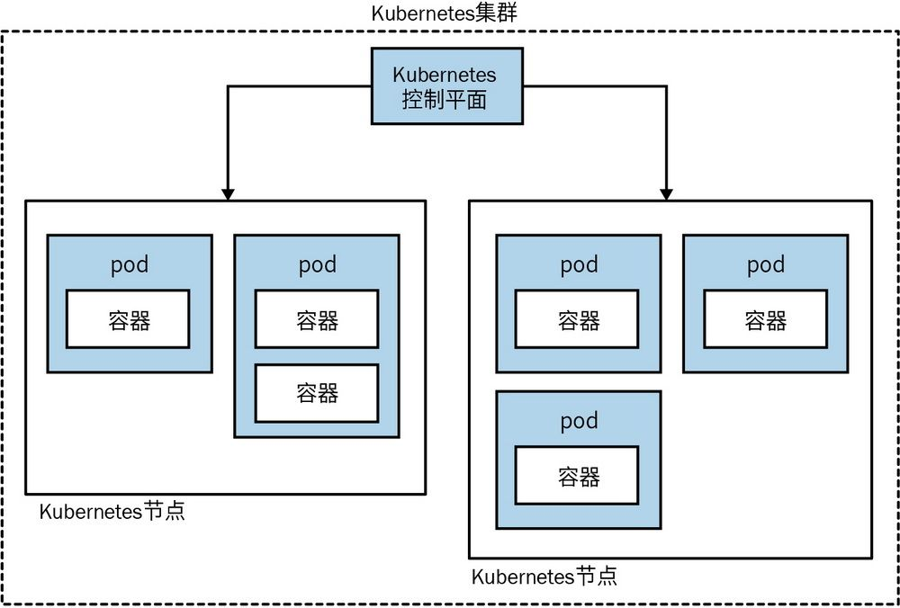

图8-22：Kubernetes的拓扑概览

从根本上说，Kubernetes集群由两部分组成。首先，工作负载将会运行在一组称为“节点”的计算机上。其次，有一组控制软件来管理这些节点，称为“控制平面”。这些节点可以在后台运行物理机或虚拟机。Kubernetes没有调度容器，而是调度它称之为“pod”的东西。pod由一个或多个将一起部署的容器组成。

通常，一个pod中只有一个容器，例如一个微服务实例。在某些情况下（根据我的经验，这很少见）将多个容器部署在一起是有意义的。一个很好的例子是使用Envoy这样的sidecar代理，它通常作为服务网格的一部分——我们在5.10节中讨论过这个主题。

下一个有用的概念是“服务”。在Kubernetes的上下文中，你可以将服务视为一个稳定的路由终点——基本上，这是一种从运行的pod映射到集群中可用的稳定网络接口的方法。Kubernetes处理集群内的路由，如图8-23所示。

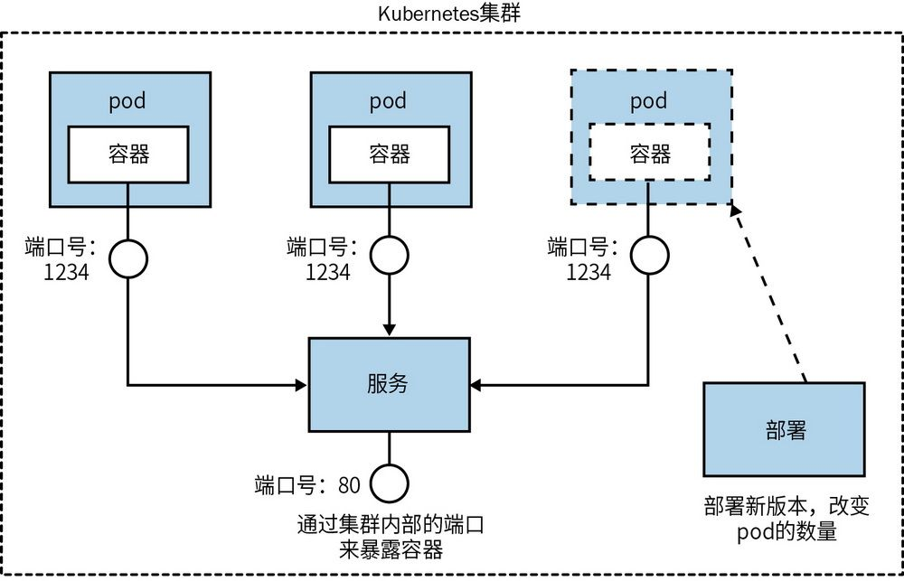

图8-23：pod、服务和部署如何协同工作

这个概念是，一个给定的pod可以被看作是短暂的，它可能因各种原因而关闭，而一个服务作为一个整体存在。服务的存在是为了将请求路由到pod，并且可以处理pod关闭或新pod启动的情况。纯粹从术语的角度来看，这可能会令人困惑。通常我们笼统地谈论部署服务，但是在Kubernetes中，你不是部署服务，而是部署可以映射到服务的pod。这可能需要一段时间才能理解这一点。

接下来，我们介绍**副****本****集**（replica set）这个概念。使用副本集，你可以定义一组pod的期望状态。也就是说，你可以告诉Kubernetes“我需要4个这样的pod”，然后Kubernetes会负责处理剩下的事情。实际上，你不再需要直接操作副本集，而是通过一个被称为“**部****署**”（Deployment）的组件来控制，这就是我们将要探讨的最后一个概念。部署是指如何将更改应用于pod和副本集。通过部署，你可以执行诸如滚动升级（你可以逐步用新版本替换pod以避免停机）、回滚、扩展节点数等操作。

因此，要部署微服务，你需要定义一个**p****o****d**，其中将包含微服务实例；定义一个**服****务**，它会让Kubernetes知道如何访问你的微服务；然后使用**部****署**对正在运行的pod进行升级。当我这么说时，这似乎很容易，但实际上，简洁起见，我在这里省略了很多东西。

#### 8.5.3 多租户和联邦

从效率的角度来看，你希望将所有可用的计算资源集中在一个Kubernetes集群中，并让所有工作负载都运行在那里。这可能会提高基础资源的利用率，因为未使用的资源可以自由地重新分配给需要它们的人。这反过来又会相应地降低成本。

而挑战在于，虽然Kubernetes能够很好地管理用于不同目的的微服务，但它在平台的“多租户”方面存在局限性。组织中的不同部门可能希望对各种资源进行不同程度的控制。这些类型的控制没有内置到Kubernetes中，控制Kubernetes的操作范围似乎是明智之举。为了解决这个问题，不同的组织似乎探索了几种不同的路径。

第一种路径是采用基于Kubernetes构建的平台来提供这些功能，例如，Red Hat的OpenShift具有丰富的访问控制组件和其他功能，这些功能是为大型组织构建的，可以使实现多租户变得更容易。除了使用这些平台所带来的财务影响之外，为了让它们发挥作用，你有时必须使用你选择的供应商为你提供的抽象层——这意味着你的开发人员不仅需要知道如何使用Kubernetes，还需要知道如何使用特定供应商的平台。

另一种方法是考虑一个联邦模型，如图8-24所示。使用联邦时，你有多个独立的集群，顶部有一些软件层，允许你根据需要跨所有集群进行更改。在许多情况下，人们会直接针对一个集群工作，这给了他们非常熟悉的Kubernetes体验，但在某些情况下，你可能希望跨多个集群分发应用程序，因为这些集群可能位于不同的地理位置，你希望通过将应用程序部署在多个集群来防止集群丢失对用户造成的影响。

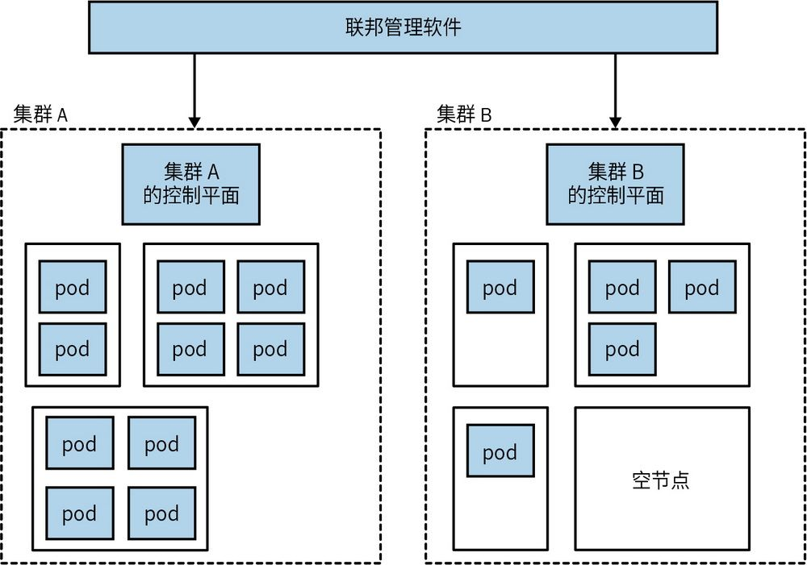

图8-24：Kubernetes中的联邦示例

联邦的本质使得资源池面临更多挑战。如图8-24所示，集群A已被充分利用，而集群B具有大量未使用的容量。如果我们想在集群A上运行更多的工作负载，除非我们可以为其提供更多资源，比如将集群B上的空节点移动到集群A，否则将无法做到。将节点从一个集群移动到另一个集群的难易程度取决于所使用的联邦软件的性质，但我完全可以想象这是一个复杂的迁移。请记住，单个节点可以是一个集群或另一个集群的一部分，但不能同时为集群A和集群B运行pod。

值得注意的是，当我们考虑升级集群本身的挑战时，拥有多个集群在这方面可以很有用。将微服务移动到新升级的集群可能比就地升级原集群更容易、更安全。

从根本上说，这些都是规模上的挑战。对于某些组织，你永远不会遇到这些问题，因为你很乐意共享单个集群。对于其他希望在更大规模上提高效率的组织来说，这无疑是你想要更详细探索的领域。需要指出的是，对于Kubernetes联邦应该是什么样子，存在许多不同的愿景，也有许多不同的工具链用于管理它们。

**K****u****b****e****r****n****e****t****e****s****背****后****的****背****景**

Kubernetes最初是谷歌的一个开源项目，其灵感来自早期的容器管理系统Omega和Borg。尽管目标略有不同，Kubernetes中的许多核心概念都基于谷歌内部容器工作负载管理的概念。Borg在全球范围内大规模地支撑系统运行，处理全球数据中心数以万计甚至数十万个容器。如果你想更详细地了解这3个谷歌平台背后的不同思维方式，尽管文章是从谷歌视角出发的，我推荐你阅读Brendan Burns等人的文章“Borg，Omega and Kubernetes”，它提供了一个很好的概述。

虽然Kubernetes与Borg和Omega有一些共同的基因，但大规模工作并不是该项目背后的主要驱动力。Nomad和Mesos（两者都受到了Borg的启发）在需要数千台机器集群的情况下找到了自己的一席之地，苹果公司在Siri中使用Mesos 
	 或Roblox使用Nomad就是明证。

Kubernetes希望从谷歌那里汲取灵感，提供比Borg或Omega更友好的开发者体验。谷歌投入了大量工程资源创建了一个开源工具，我们可以将其视为一种纯粹的利他主义行为，虽然我相信这是某些人有意为之。但现实情况是，这与谷歌在公有云领域面临的竞争风险有关，特别是亚马逊的AWS。

在公有云市场中，Google Cloud取得了一些进展，但仍远远落后于Azure和AWS（它们处于领先地位）。某些分析认为，它在云计算领域被阿里云挤到了第4位。尽管市场份额有所提高，但仍然远未达到谷歌的期望水平。

一个主要的担忧似乎是，市场领导者AWS最终可能会在云计算领域拥有近乎垄断的地位。此外，对从一个供应商到另一个供应商的迁移成本的担忧意味着这种市场支配地位将难以改变。然后Kubernetes出现了，它承诺能够提供一个标准平台使得应用可以在多个供应商的平台上运行。借此方式，可以降低从一个供应商迁移到另一个供应商的成本，进而避免AWS对未来市场的垄断。

因此，你可以将Kubernetes视为谷歌对更广泛的IT行业的慷慨贡献，或者谷歌试图在快速发展的公有云领域保持一席之地的一种尝试。我认为这两种考虑都很正确。

#### 8.5.4 云原生计算基金会

云原生计算基金会（Cloud Native Computing Foundation，CNCF）是非营利性Linux基金会的一个分支。CNCF专注于管理项目生态系统，以促进云原生发展，这意味着支持Kubernetes以及与Kubernetes合作或用其构建的项目。这些项目本身不是由CNCF创建或直接开发的；相反，你可以将CNCF视为一个容纳之所，在这里，这些原本可以单独开发的项目可以托管在一起，并且可以开发通用标准，提升互操作性。

通过这种方式，CNCF让我想起了Apache软件基金会的作用——与CNCF一样，作为Apache软件基金会一部分的项目通常意味着一定程度的质量保障和更广泛的社区支持。CNCF托管的所有项目都是开源的，尽管这些项目的开发可能是由商业实体推动的。

除了帮助指导这些相关项目的开发之外，CNCF还举办活动，提供文档和培训材料，并定义围绕Kubernetes的各种认证计划。该组织拥有来自各行各业的成员，虽然较小的团体或独立人士很难在组织内发挥大作用，但其跨行业支持的程度（包括许多相互竞争的公司）令人印象深刻。

作为一个局外人，CNCF似乎在传播其策划项目的实用性方面取得了巨大成功。它也是一个可以公开讨论重大项目演变的平台，确保了大量广泛的参与。CNCF在Kubernetes的成功中发挥了巨大作用——很容易想象，如果没有CNCF，这个领域仍然会是一个支离破碎的局面。

#### 8.5.5 平台和可移植性

你经常会听到Kubernetes被描述为一个“平台”。不过，从开发人员理解的角度来看，它并不是一个真正的平台。它开箱即用，能够真正为你提供的是运行容器工作负载的能力。大多数使用Kubernetes的人最终通过安装服务网格、消息代理、日志聚合工具等支持软件来组装自己的平台。在较大的组织中，这成为平台工程团队的责任，他们会组建和管理这个平台，并帮助开发人员有效地使用平台。

这种选取和混搭的方式有利有弊。相对兼容的工具生态系统（在很大程度上得益于CNCF的工作）使得我们可以根据需要为特定任务选择自己喜欢的工具。但是，这也可能导致选择困难症——我们很容易被众多选项淹没而不知所措。像Red Hat的OpenShift这样的产品在一定程度上减轻了我们的选择负担，因为它们提供了一个现成的平台，并已做好了一些决策。

这意味着，尽管在基础级别上，Kubernetes为容器执行提供了一个可移植的抽象层，但实际上它并不意味着在一个集群上运行的应用可以简单直接地在其他地方也正常工作。你的应用、操作和开发人员工作流可能完全依赖于你的自定义平台。从一个Kubernetes集群迁移到另一个Kubernetes集群可能还需要根据新目标重建该平台。我与许多采用Kubernetes的组织交流过，他们采用Kubernetes主要是因为担心被锁定在某个供应商上，但这些组织并没有理解这种微妙之处——基于Kubernetes构建的应用在理论上可以在Kubernetes集群之间实现可移植性，但在实践中并非总是如此。

#### 8.5.6 Helm、Operator与CRD

在Kubernetes领域，一个持续存在困惑的问题是如何管理第三方应用程序和子系统的部署和生命周期。考虑一下在Kubernetes集群上运行Kafka的必要性。你可以创建自己的Pod、服务和部署规范，并自行运行它们。但是，如何管理Kafka设置的升级呢？或者你想进行其他常见的维护任务呢？比如升级正在运行的有状态软件。目前已经出现了许多工具，旨在使你能够在更合理的抽象级别管理这些类型的应用程序。其想法是有人创建一个类似于Kafka的包，然后你以“更黑盒”的方式在Kubernetes集群上运行它。在这一领域中，两个最有名的解决方案是Operator和Helm。Helm自称是Kubernetes的“缺失的包管理器”；虽然Operator可以管理初始安装，但它似乎更专注应用程序的持续管理。令人困惑的是，虽然你可以将Operator和Helm视为彼此的替代方案，但在某些情况下你也可以同时使用它们（Helm用于初始安装，Operator用于生命周期操作）。

这一领域最近的趋势是自定义资源定义（custom resource definition，CRD）。借助CRD，你可以扩展核心Kubernetes API，向集群添加新行为。CRD的好处在于，它们可以相对无缝地集成到现有的命令行界面、访问控制等中，因此你的自定义扩展不会让人感觉像是外来操作。它们基本上允许你实现自己的Kubernetes抽象。想想我们之前讨论的pod、副本集、服务和部署抽象——使用CRD，你可以将自己的抽象添加到组合中。

CRD的应用范围可以涵盖各种用途，包括管理小的配置信息、控制像Istio这样的服务网格或像Kafka这样的基于集群的软件。由于这一强大且灵活的概念，我发现很难定义出它最好的应用场景，而且在我和我交流过的专家之间，也没有达成普遍共识。整个领域似乎仍然没有像我希望的那样迅速稳定下来，也没有像我所希望的那样达成共识——这是Kubernetes生态系统中的一个趋势。

#### 8.5.7 Knative

Knative是一个开源项目，旨在为开发人员提供基于Kubernetes的FaaS风格的工作流。从根本上说，Kubernetes对开发人员并不是非常友好，特别是与Heroku或类似平台的易用性相比。Knative的目标是将FaaS的开发体验带到Kubernetes中，并向开发人员隐藏Kubernetes的复杂性。反过来，这意味着开发团队能够更轻松地管理其软件的整个生命周期。

我们在第5章讨论过服务网格，并特别提到了Istio。服务网格对于Knative的运行至关重要。虽然Knative理论上允许你插入不同的服务网格，但目前只有Istio被认为是稳定的（对Ambassador和Gloo等其他网格的支持仍处于alpha阶段）。实际上，这意味着如果你想采用Knative，你也必须已经接受了Istio。就Kubernetes和Istio这两个主要由谷歌推动的项目而言，它们花了很长时间才达到可以被认为是稳定的阶段。Kubernetes在1.0发布后仍有重大变化，而直到最近，支持Knative的Istio才被完全重构。这种交付稳定、可生产的项目的记录让我认为Knative可能需要更长的时间才能准备好供大多数人使用。虽然一些组织正在使用它，你可能也可以使用它，但经验表明，不久之后可能会发生一些重大变化，需要进行痛苦的迁移。正因为如此，我建议那些正在考虑为Kubernetes集群提供类似FaaS的产品的保守组织寻找其他选项——像Open-FaaS这样的项目已经被世界各地的组织用于生产，且不需要底层服务网格。但是，如果你现在选择使用Knative，那么未来出现偏离轨道的情况时，你也不要感到惊讶。

另外需要注意的是，谷歌决定不将Knative纳入CNCF的一部分，这实在是令人遗憾——我们只能猜测这是因为谷歌希望自己主导这一工具的发展方向。当Kubernetes在首次推出时，对许多人来说，它的前景令人困惑，部分原因是它反映了谷歌对容器应该如何管理的思维方式。Kubernetes从更广泛的行业参与中受益匪浅，但遗憾的是，现在谷歌不希望Knative也得到同样的行业参与度。

#### 8.5.8 未来

展望未来，我没有看到任何迹象表明Kubernetes的强大势头会很快停止。我希望看到更多的组织为私有云实现自己的Kubernetes集群，或在公有云环境中使用托管集群。然而，我认为我们现在看到的——开发人员必须学习如何直接使用Kubernetes——将是一个相对短暂的现象。Kubernetes非常擅长管理容器工作负载，并为构建其他内容提供平台。但是，从对开发人员的友好性角度来看，这并不是一个理想的体验。谷歌通过推动Knative已经向我们展示了这一点，我认为我们将继续看到Kubernetes隐藏在更高级别的抽象层下。所以在未来，我预计Kubernetes将无处不在，只是开发人员察觉不到。

这并不是说开发人员可以忘记他们正在构建一个分布式系统。他们仍然需要了解这种类型的架构所带来的众多挑战。只是他们不必过于担心他们的软件如何映射到底层计算资源的细节。

#### 8.5.9 你应该使用它吗

所以，对于那些还没有完全投身Kubernetes阵营的人来说，是否应该加入呢？好吧，让我分享一些准则。首先，实施和管理自己的Kubernetes集群并不是一项简单的任务——这是一项艰巨的任务。你的开发人员使用Kubernetes时所获得的体验很大程度上取决于集群运维团队的效率。出于这个原因，我曾经交流过的一些选择本地部署Kubernetes的大型组织已经将这项工作外包给了专业公司。

更好的选择是，使用完全托管的集群。如果你可以使用公有云，那么可以使用由谷歌、Azure和AWS等提供的完全托管解决方案。不过，我想说的是，如果你可以使用公有云，那么考虑一下Kubernetes是否真的适合你。如果你需要一个对开发人员友好的平台来处理微服务的部署和生命周期，那么我们探讨过的FaaS平台可能非常适合。你还可以考虑其他类似PaaS的产品，例如Azure Web Apps、Google App Engine或一些较小的供应商，如Zeit、Heroku等。

在你决定开始使用Kubernetes之前，先让一些平台管理人员和开发人员开始使用它。开发人员可以从在本地运行轻量级的东西开始，例如minikube或MicroK8s；即便是在笔记本电脑上，他们也可以获得接近完整的Kubernetes体验。对于平台管理人员则可能需要更深入地了解Kubernetes。Katacoda有一些在线教程，用于掌握核心概念；CNCF也在这个领域提供了很多培训材料。在你下定决心之前，要确保实际使用这些东西的人有机会亲自尝试。

不要陷入“因为其他人都在这样做，我就必须拥有Kubernetes”的思维陷阱。选择Kubernetes和选择微服务一样，有这种想法是非常危险的。尽管Kubernetes很强大，但它并不适合所有情况，所以你需要根据自己的具体情况进行评估。但坦率地说，如果你只有少数几名开发人员和少量的微服务，那么即使使用完全托管的Kubernetes平台，也可能显得过于复杂。

### 8.6 渐进式交付

在过去10年左右的时间中，为终端用户部署软件这方面变得更加灵活。新技术的出现是由许多不同的应用场景驱动的，且来自IT行业的许多不同部分，但它们主要集中在降低推出新软件的风险上。如果发布软件的风险降低，我们就可以更频繁地发布软件。

在将软件上线之前，我们会完成许多活动，这些活动可以帮助我们在问题影响到真实用户之前发现它们。预发布环境测试是其中一个重要部分，但它不能解决所有问题。我们将在第9章中讨论。

Nicole Forsgren、Jez Humble和Gene Kim在他们的著作《加速：企业数字化转型的24项核心能力》
	 中，展示了从广泛研究中得出的明确证据，即高绩效公司比低绩效同行会更频繁地部署，同时具有更低的变更失败率。

“快速前进，不惧失败”的想法似乎并不适用于发布软件——频繁发布和降低失败率是相辅相成的，而意识到这一点的组织已经改变了他们对发布软件的看法。

这些组织使用的功能开关、金丝雀发布、并行运行等技术，我们将在本节中详细介绍。这种在发布功能方面的思想转变就是“渐进式交付”。功能以受控的方式发布给用户；与大规模部署不同，我们可以更精确地控制哪些功能对哪些用户可见，例如，将软件的新版本逐步向部分用户推出。

从根本上说，所有这些技术的核心是对交付软件的方式进行了简单的转变，就是将部署与发布分开。

#### 8.6.1 分离部署与发布

《持续交付：发布可靠软件的系统方法》的合著者Jez Humble提出了将这两个概念分开的理由，并将此作为低风险软件发布的核心原则之一：

部署是指将某个版本的软件安装到特定环境（通常隐含着生产环境）时发生的事情；发布是指系统或系统的某些部分（例如某个功能）提供给用户使用。

Jez认为，通过将这两个概念分开，我们可以确保软件在其生产环境中运行，而不会被用户看到。蓝绿部署是这一概念在实践中的简单示例之一——你有新版本的软件（蓝色），然后你在生产环境中同时部署新版本和旧版本（绿色）。检查新版本是否按预期工作；如果是，重定向客户以升级到软件的新版本。如果在切换之前发现问题，则不会影响任何客户。

虽然蓝绿部署是这一原则简单的示例之一，但在应用这一概念时，我们还可以使用更多更复杂的技术。

#### 8.6.2 渐进式交付

面向开发人员的行业分析公司RedMonk的联合创始人James Governor首次创造了“渐进式交付”一词，用于涵盖这一领域使用的多种不同技术。他进一步将渐进式交付描述为“对受影响范围进行细粒度控制的持续交付”，因此这是持续交付的延伸，也是一种使我们能够控制新发布软件的潜在影响的技术。

在这个主题上，LaunchDarkly的Adam Zimman描述了渐进式交付是如何影响“业务”的。从这个角度来看，我们需要转变思维，思考新功能如何交付给我们的客户。它不再是一次性发布所有功能，而是一个可以分阶段进行的工作。重要的是，正如Adam所说，渐进式交付可以通过“将功能的控制权委托给对结果最负责任的所有者”来赋予产品所有者更多的权力。然而，要想实现这一点，涉及的产品负责人需要了解所使用的渐进式交付技术的机制，这意味着产品负责人在技术上要有一定的了解，或者需要得到相应的技术团队的支持。

我们已经提到了作为一种渐进式交付技术的蓝绿部署。现在，让我们简单地看一下其他渐进式交付技术。

#### 8.6.3 功能开关

使用功能开关（也被称为“功能标志”），我们可以将已部署的功能隐藏在一个开关后面，该开关可用于关闭或打开功能。这种技术最常用于基于主干的开发，在基于主干的开发中，尚未完成的功能可以提交代码并部署，但仍对最终用户隐藏。但除此之外，它还有很多应用。比如，功能开关对于在指定时间打开功能或关闭导致问题的功能方面也非常有用。

你还可以以更细粒度的方式使用功能开关，比如根据发出请求的用户的性质允许开关具有不同的状态。例如，你可以让一组客户看到已打开的某个功能（可能是beta测试组），而大多数人认为该功能已关闭。这可以帮助你实现金丝雀部署，这是我们接下来要讨论的内容。有一些托管服务用于提供完整的功能开关管理，比如LaunchDarkly和Split。尽管这些功能开关管理平台十分优秀，但你仍然可以从更简单的东西开始——配置文件并在你尝试推广功能开关发布技术之前，思考哪种技术工具更适合你。

为了更深入地了解功能开关的世界，我衷心推荐Pete Hodgson的文章“Feature Toggles（aka Feature Flags）”，它详细介绍了如何实现功能开关以及使用它们的多种不同方式。

#### 8.6.4 金丝雀发布

人非圣贤，孰能无过？但要真正把事情搞砸，你需要一台计算机。
	 

我们都会犯错，而计算机可以让我们比以往更快、更大规模地犯错。鉴于错误是不可避免的（相信我，它们真的是不可避免的），那么采取一些能够限制这些错误的影响的措施是有意义的。金丝雀发布就是这样一种技术。

金丝雀发布以为矿工报警的金丝雀的名字命名；金丝雀可以用于预警矿厂危险气体的存在，是矿工工作早期的预警器。金丝雀发布的概念是让客户中的一小部分人先看到新功能。如果发布过程中出现问题，那么只有这部分客户会受到影响。如果该功能适用于金丝雀组的客户，那么可以逐步将其推广给更多的客户，直到每个人都看到新版本。

对于微服务架构，可以在单个微服务级别配置切换，打开（或关闭）来自外部世界或其他微服务的功能请求。另一种技术是让两个不同版本的微服务并行运行，并使用切换来路由到旧版本或新版本。在这种情况下，金丝雀实现必须位于路由/网络路径中，而不是位于一个微服务中。

当我第一次使用金丝雀发布时，我们手动控制了发布过程。我们可以配置看到新功能的流量百分比，然后在一周的时间里，我们逐渐增加这个百分比，直到每个人都看到新功能。在一周内，我们需要密切关注错误率、错误报告等。如今，以自动化方式处理这一过程的情况越来越普遍。Spinnaker等工具能够根据指标自动增加调用次数，例如，如果错误率处于可接受的水平，则可以增加对新微服务版本的调用百分比。

#### 8.6.5 并行运行

在金丝雀发布中，对某项功能的请求将由旧版本或新版本提供服务。这意味着我们无法比较两个版本的功能在处理相同请求时的表现，如果你需要确保新功能与旧功能在处理相同请求时的行为完全一致，这一点可能很重要。

在并行运行中，你可以做到的是，并行运行相同功能的两个不同实现，并同时向两个实现都发送对该功能的请求。在微服务架构中，最明显的方法可能是将服务调用分派给同一服务的两个不同版本，并比较结果。另一种方法是将功能的两种实现共存于同一服务中，这通常可以使比较结果更加容易。

在执行这两种实现时，重要的是要意识到你其实只需要其中一个调用的结果。其中一个实现被认定是准确的——这是你当前信任的实现，通常就是现有的实现。根据你正在使用并行运行进行比较的功能的性质，你可能需要仔细考虑这个差别——你不会想向客户发送两个相同的订单更新，或者开出两次发票。

我在《重构到微服务》一书的第3章中详细地探讨了并行运行模式。在那里，我探讨了它在将功能从单体系统迁移到微服务架构中的用途。在这种架构中，我们希望确保我们的新微服务的行为方式与等效的单体功能相同。在另一种情况下，GitHub在修改其代码库的核心部分时使用了这种模式，并发布了一个开源工具Scientist来帮助完成这一过程。在这里，并行运行是在单个进程中完成的，Scientist用于比较调用。
	

通过蓝绿部署、功能开关、金丝雀发布和并行运行，我们只了解了渐进式交付的表面。这些想法可以很好地协同工作（例如，我们讨论过如何使用功能开关来实现金丝雀部署），但你不必操之过急。开始时，只需记住将部署和发布这两个概念区分开。接下来，开始寻找可以帮助你安全且更频繁地部署软件的方法。与你的产品负责人或其他业务干系人合作，了解这些技术如何帮助你加快速度，同时减少失败。

### 8.7 小结

我们在本章中涵盖了很多内容。在继续之前，让我们简要回顾一下。我们先回顾一下之前提出的部署原则。

**隔****离****执****行**

以隔离的方式运行微服务实例，每个微服务实例拥有自己的计算资源，并且它们的运行不会影响在同一个基础设施上运行的其他微服务实例。

**专****注****自****动****化**

随着微服务数量的增加，自动化变得越来越重要。专注选择能够实现高度自动化的技术，并将自动化作为工程实践中的核心部分。

**基****础****设****施****即****代****码**

用代码管理基础设施的配置，以简化自动化并促进信息共享。将此类代码存储在源代码库中，以支持环境重建。

**零****停****机****部****署**

进一步提高独立部署能力，并确保可以在不需要任何停机时间的情况下为服务的用户（无论是人类还是其他微服务）部署新版本的微服务。

**期****望****状****态****管****理**

借助平台将微服务的期望状态保存起来，在发生中断或流量增加时根据需要启动新实例。

此外，我还分享了如何选择正确的部署平台的个人准则。

01.没坏就别修。

02.放弃尽可能多的控制权，然后再多放弃一点。如果你能把所有的工作都转移到像Heroku（或FaaS平台）这样优秀的PaaS上，那就去做吧，你会感到满意。你真的需要调整每一个设置吗？

03.将微服务容器化并非没有痛苦，但在隔离成本方面，它是一个非常好的折中方案，对本地开发有好处。同时，它仍然让你可以在一定程度上控制发生的事情。预计Kubernetes会在你的未来工作中扮演重要角色。

了解自己的需求也很重要。Kubernetes可能非常适合你，但也许简单点儿的解决方案也可以一样有效。不要因为选择更简单的解决方案而感到不好意思，也不要担心将工作转交给他人所带来的问题——如果我可以将工作推到公有云上，那我就会这样做，因为这可以让我更加专注自己的工作。

最重要的是，这个领域正在经历许多重大的变化。我希望我已经为你提供了有关该领域关键技术的一些见解，同时也分享了一些可能比当前热门技术更长久的原则。无论接下来会发生什么，希望你都能更从容地应对。

第9章将深入探讨本章提到的另一个主题：测试微服务以确保它们可以正确工作。
