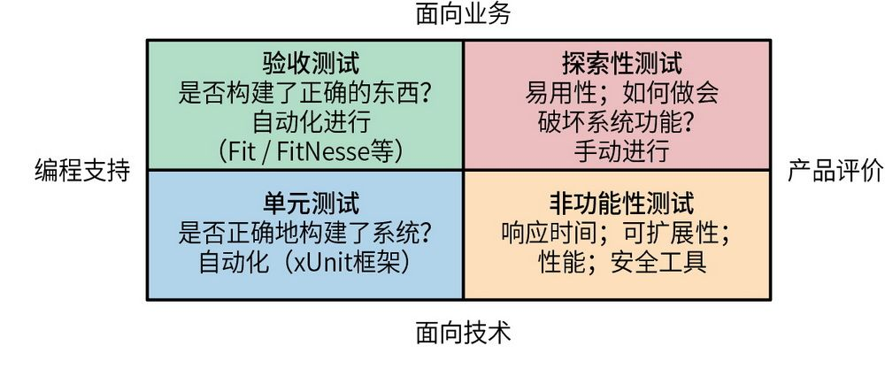
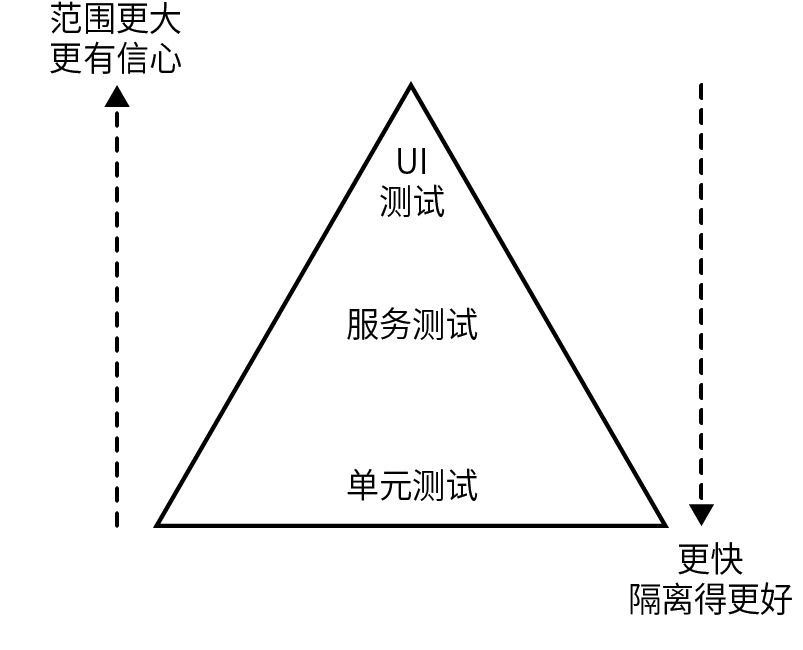
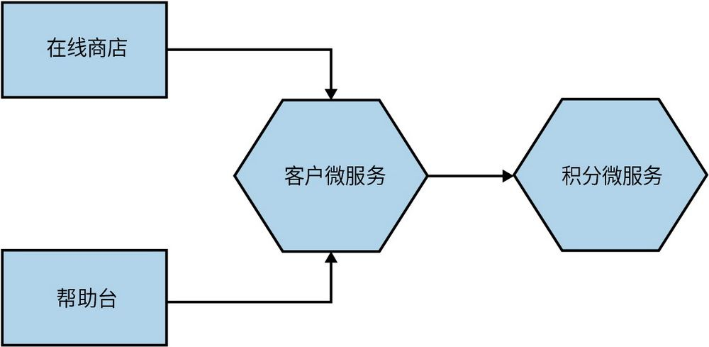
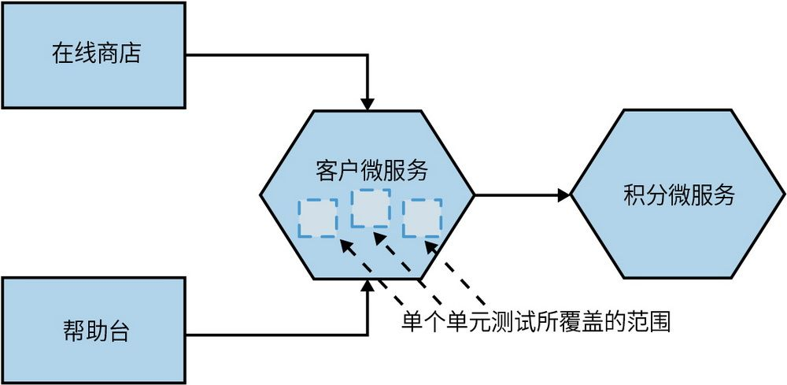
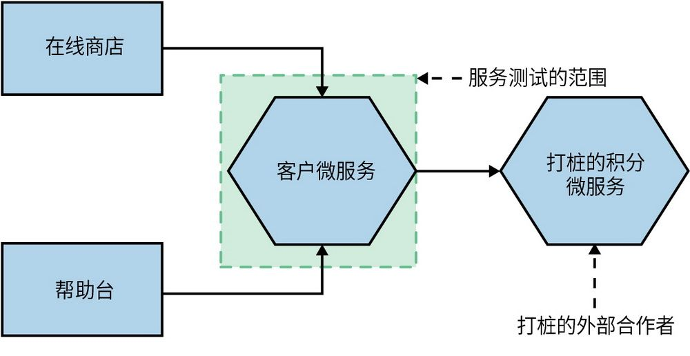
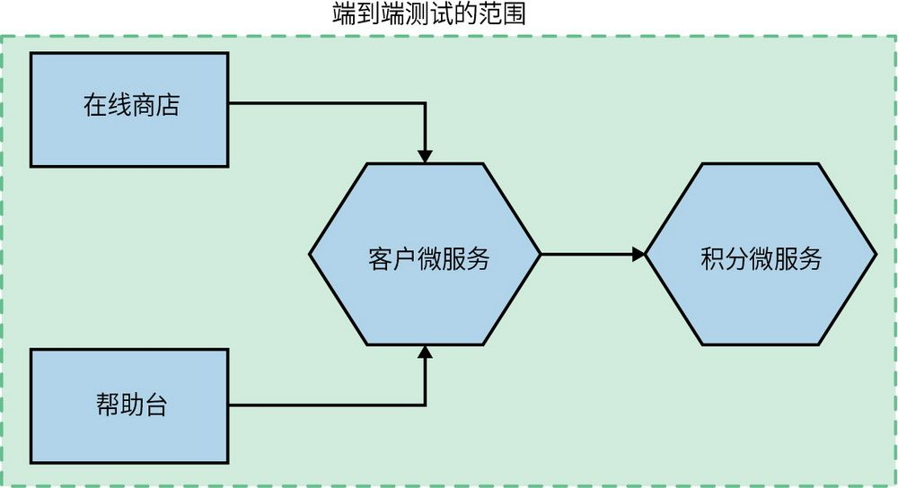
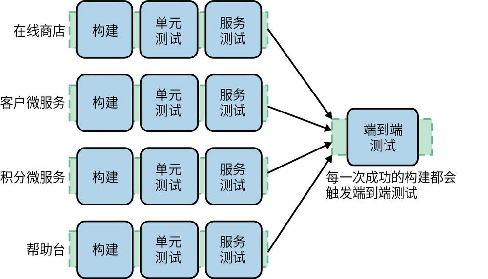
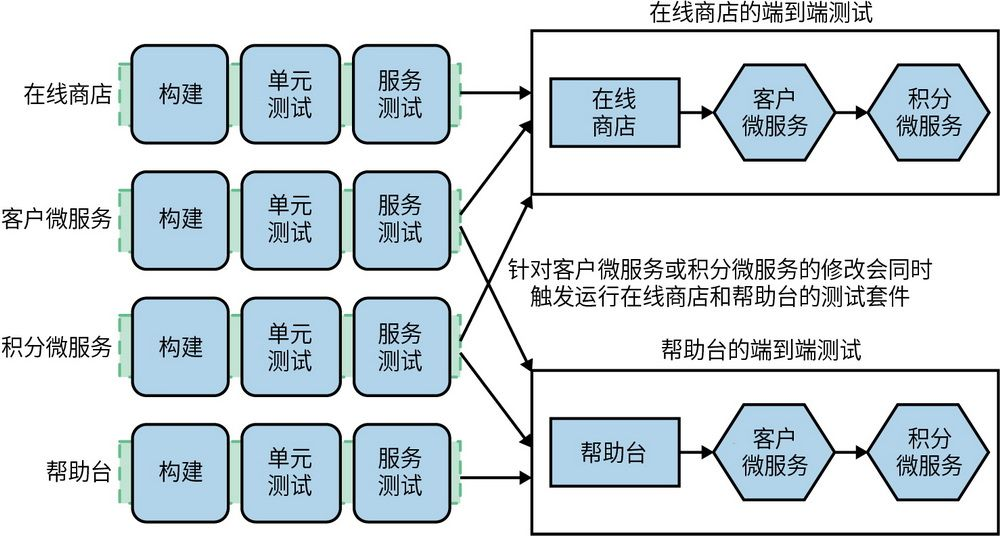
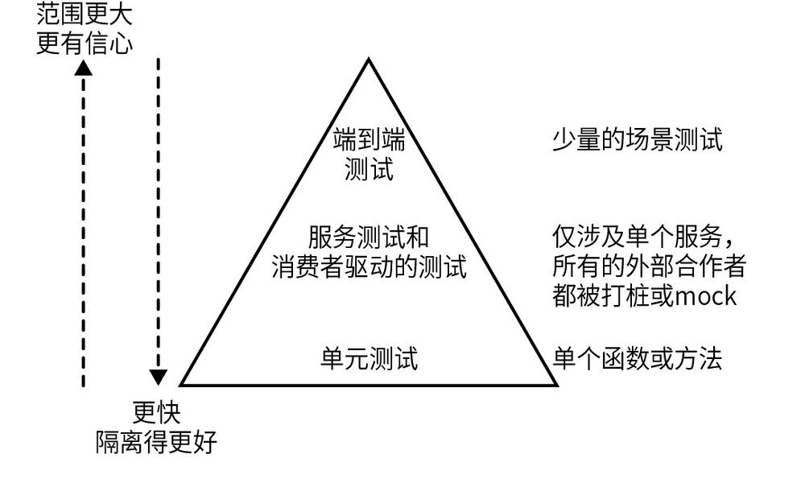

## 第9章 测试

从我开始接触编程以来，自动化测试领域取得了显著进展，新的工具和技术层出不穷，这一领域也因此愈加完善。然而，高效地测试分布式系统的功能仍然具有挑战性。本章将深入分析测试细粒度系统所面临的问题和挑战，并提供一些解决方案，来帮助你更自信地发布新功能。

测试涵盖方方面面。即使只谈论自动化测试，也有很多需要考量的因素。使用微服务架构使复杂性又提升了一个级别。了解测试有哪些不同的类型可以帮助我们平衡某些会产生冲突的因素，比如，一方面需要尽早交付软件，另一方面也要确保软件的质量。鉴于测试范围涵盖太广，本章主要关注微服务架构的测试与单进程单体应用等集中式系统的测试之间的不同之处。

自第1版问世以来，测试的时机也发生了变化。以前，测试主要是在软件投入生产之前进行的。然而现在，我们越来越多地关注应用在进入生产环境后的测试。这就进一步模糊了开发与生产之间的边界。我们将在本章探讨这一点。之后，第10章将更全面地探讨生产环境中的测试。

### 9.1 测试类型

像许多咨询顾问一样，我有时也会使用象限来对世界进行分类。起初，我担心本书不会有这样的象限。幸运的是，Brian Marick为测试提出了一个出色的分类方式。图9-1展示了Lisa Crispin和Janet Gregory所著的《敏捷软件测试：测试人员与敏捷团队的实践指南》
	 一书中Marick提出的测试象限的演化版本，它有助于对不同类型的测试进行分类。

图9-1：Brian Marick提出的测试象限

象限底部展示的是面向技术的测试，即在早期帮助开发人员创建系统的测试。性能测试和小范围的单元测试等属于此类别；这些测试通常是自动化的。处于象限上半部分的测试包括帮助非技术背景的相关人士了解系统是如何工作的测试，我们称之为“面向业务的测试”。这种测试包括验收测试（如象限左上角所示），比如大范围的端到端测试；也包括探索性测试（如象限右上角所示），比如模拟真实用户使用应用的方式进行手动测试。

值得一提的是，这些测试中的绝大多数关注的是**预****发****布****验****证**（preproduction validation）。具体来说，我们使用这些测试是来确保软件在部署到生产环境之前具有良好的质量。通常，这些测试是否通过（或失败）将是决定软件能否部署到生产环境的前提。

与此同时，我们逐渐认识到进入生产环境后测试软件的重要性。本章后面将详细讨论这两个想法之间的平衡，但现在想要强调的是，Marick象限在这方面存在局限性。

这个象限中的每种测试类型都有其适用场景。你应该根据系统的特点来确定各种测试的配比。但关键是，你要了解有多种测试系统的方式可供选择。近年来业界的趋势是，尽可能多地使用自动化测试，远离任何大规模手动测试，我对此深表赞同。如果你目前正在进行大量的手动测试，建议在继续使用微服务之前解决这个问题，因为如果无法快速有效地验证软件，你将很难获得微服务所带来的诸多好处。

**手****动****的****探****索****性****测****试**

通常，从单体架构到微服务架构的转变对探索性测试的影响很小，除非发生更广泛的组织变革。正如将在14.3节中所探讨的，我们希望应用的用户界面也会按团队进行细分。在这种情况下，手动测试的所有权很可能会发生变化。

在过去，像验证系统外观这样的任务的自动化只能够通过手动的探索性测试来完成。随着视觉检测工具的不断成熟，我们已经能够将以前手动完成的任务自动化了。但是，这不意味着不需要手动测试；相反，你应该将自动测试视为节省测试人员时间的方法，可以让他们专注于较少重复的探索性测试。

如果做得好，手动的探索性测试会在很大程度上发现更多的问题。留出时间以最终用户的身份探索应用可以发现原本不会发现的问题。由于编写测试用例的成本问题，在无法实现自动化测试的情况下，手动测试也会发挥重要作用。自动化的目的是消除重复任务，减轻开发人员的负担，让开发人员可以从事更具创造性、主动性的工作。因此，自动化是让我们腾出精力去做我们更擅长的事情的一种方式。

鉴于本章的目的，手动的探索性测试在本章中会较少提及。这并不是说这种类型的测试不重要，而是本章内容主要是探讨微服务测试与典型的单体应用测试的不同之处。当谈及自动化测试时，如何决定每种类型的测试的分配比例呢？有一个模型可以帮助我们回答这个问题，并了解其中需要权衡的因素。

### 9.2 测试范围

Mike Cohn在他的《Scrum敏捷软件开发》一书中提出了一个名为“自动化测试金字塔”（简称测试金字塔或金字塔）的模型，以解释需要哪些类型的自动化测试。金字塔不仅帮助我们思考测试范围，还帮助我们思考不同类型测试的比例。Cohn的原始模型将自动测试拆分为单元测试、服务测试和UI测试，如图9-2所示。

图9-2：Mike Cohn提出的自动化测试金字塔
	 

在理解自动化测试金字塔时，需要注意的关键点是，一方面，沿着金字塔向上走时，测试范围会增加，我们对被测试的功能也更有信心。另一方面，测试反馈时间也会随着测试运行时间的延长而变长；当测试失败时，定位哪些功能出现问题也会变得更加困难。当沿着金字塔向下走时，一般来说，测试会运行得更快，因此反馈周期也会随之缩短。我们可以更快地发现功能故障，持续集成和构建也会更快；在发现功能故障之前，也不太可能继续执行新任务。当这些范围较小的测试失败时，我们往往知道出了什么问题，且问题通常可以追溯到具体的代码行——每个测试所覆盖的功能都会更单一，让我们更容易理解和修复故障。不过，如果只是从代码行的角度进行测试，我们对整体系统是否能正常运行就不会抱有很大的信心。

这个模型的问题在于，所有这些术语在不同的人眼中有不同的含义。服务一词的含义尤其多样化。同样，在不同的场景下单元测试也有不同的定义。如果我只测试一行代码，这个测试是单元测试吗？我会说“是的”。如果我测试多个函数或类，那它还是单元测试吗？我会说“不是”，但很多人会不同意。尽管这些术语存在歧义，我还是倾向使用“单元测试”和“服务测试”这两个名称，且更喜欢将UI测试称为“端到端测试”。从现在开始我将使用这些术语。

实际上，对于Cohn在自动化测试金字塔中提到的测试，我工作过的团队在测试名称上都使用过不同的表达。无论怎样称呼它们，重要的是，你需要根据不同的目的，针对不同范围的功能进行自动化测试。

为了避免混淆概念，我们先来看看不同概念的含义。

先让我们看一个示例。图9-3中包含帮助台应用和在线商店网站（主网站），两者都与客户微服务进行交互，以检索、查看和编辑客户的详细信息。当客户购买某歌手的CD时，客户微服务会与积分微服务通信，积分微服务来为客户累积积分。这显然只是整个MusicCorp系统的一小部分，但它足以作为让我们深入探讨对不同的场景要如何进行测试的案例。

图9-3：测试中的MusicCorp系统的一部分功能

#### 9.2.1 单元测试

单元测试通常只测试单个函数或方法的调用。通过**测****试****驱****动****设****计**（test-driven design，TDD）编写的测试和测试技术生成的测试都属于这一类。在单元测试中，我们不会启动微服务，且对外部文件和网络连接的使用也很有限。通常，你希望有大量的单元测试。如果做得正确，它们运行起来会非常快，可能用不了一分钟就能在现代硬件上运行成千上万个这样的测试。我知道很多人在本地更改文件时会自动运行这些测试，尤其是使用解释型语言时，这样可以得到更短的反馈周期。

单元测试是来帮助开发人员的，因此用Marick的话来说，它属于面向技术而非面向业务的测试。我们希望通过单元测试来捕获大部分的错误。因此，如图9-4所示，在这个示例中，当从客户微服务的角度考虑时，单元测试是彼此独立的，分别覆盖小范围的代码。

图9-4：示例中的单元测试范围

这些测试的主要目标是，针对功能是否正常给出快速反馈。单元测试对于代码重构也很重要，它让我们可以安全地重组代码，因为我们知道，小范围的单元测试可以帮助我们及时发现错误并做出修复。

#### 9.2.2 服务测试

服务测试旨在绕过用户界面直接测试我们的微服务。在单体应用中，我们可能只测试一些为用户界面提供服务的类。对于包含多个微服务的系统，一个服务测试则只测试一个微服务的功能。

只测试单个微服务可以帮助我们确定该服务是否将按预期运行，但我们仍需要保持测试的隔离性。如果测试失败，应仅限于被测的微服务。如图9-5所示，为了实现这种隔离性，我们需要对所有外部合作者打桩（stub），以便只有微服务本身是在测试范围内。

图9-5：示例中的服务测试范围

其中一些服务测试可能会像小范围的单元测试一样快，但如果你决定使用真实的数据库进行测试，或通过网络与打桩的下游合作者进行通信，那么测试时间可能会增加。这些测试覆盖的范围比简单的单元测试更广泛，因此当测试运行失败时，也比单元测试更难定位问题。不过，相比大范围测试，它们覆盖的组件要少得多，因此也会更加稳定。

#### 9.2.3 端到端测试

端到端测试是一种针对整个系统运行的测试方法。通常情况下，这类测试需要通过浏览器来操作图形用户界面，并模仿类似上传文件这样的用户交互行为。

如图9-6所示，这种测试会覆盖大范围的代码。因此，当测试通过时，你会对应用也能够在生产环境中正常运行更有信心。但是，随着测试覆盖范围的扩大，不利的一面也随之凸显，就像我们很快会看到的，在微服务场景下要想做好端到端测试极为困难。

图9-6：示例中的端到端测试范围

**关****于****集****成****测****试**

你可能注意到，我并没有明确描述集成测试，这是有意为之的。我发现这个术语经常被不同的人用来描述不同类型的测试。对于一些人来说，集成测试可能只关注两个服务之间的交互，或者关注代码与数据库之间的绑定；但对于其他人来说，集成测试就是完整的端到端测试。在本章中，我尽量使用更明确的术语，希望可以将你所认为的“集成测试”与本书使用的术语对应起来。

#### 9.2.4 权衡

在金字塔所覆盖的不同测试类型中，我们追求的是一种合理的平衡。我们希望得到快速反馈，同时也希望获得系统能够正常运行的信心。

单元测试的范围很小，因此当测试失败时，我们可以快速定位问题。它们很容易编写，运行速度也很快。随着测试范围越来越大，我们对系统的信心也随之增加，但随着测试运行时间变长，反馈时间会受到影响。此外，测试的编写和维护的成本也会更高。

在寻找最佳平衡点时，你经常需要权衡每种测试类型的数量。当发现测试套件运行时间过长时怎么办？当类似服务测试或端到端测试这样范围较广的测试失败时，编写一个范围较小的单元测试可以更早地发现问题。尽量用更快、范围更小的单元测试替换一些范围较大且速度较慢的测试。此外，如果生产环境中发生了错误，这可能表明你忽略了某个测试。

那么假如这些测试都需要权衡，每种测试类型需要多少个呢？一个好的经验法则是，当你沿着金字塔上行时，下面一层的测试数量应比上面一层多一个数量级。重要的是要明白，如果权衡确实带来了一些问题，你可以尝试调整不同类型的自动化测试的比例来尝试解决问题。

例如，我开发过一个单体系统，系统有4000个单元测试、1000个服务测试和60个端到端测试。我们认为，从反馈周期的角度来看，有太多的服务测试和端到端测试（后者对反馈周期的影响最大）了，因此我们努力提升范围较小的测试的比例。

一种常见的测试反模式通常被称为“测试甜筒”或“倒金字塔”。在这种模式里，几乎没有小范围测试，只有大范围测试。这些项目的测试运行起来通常十分缓慢且反馈周期长。如果把这些缓慢的测试作为持续集成的一部分运行，那么很难实现多次构建；而且由于构建周期长，一旦发生错误，需要很长一段时间才能发现相关问题。

### 9.3 实现服务测试

总体来讲，实现单元测试是一件相对简单的事情，并且有很多文档解释了如何完成单元测试。服务测试和端到端测试则更有趣，尤其是在微服务中，这就是我们接下来要关注的内容。

服务测试希望在整个微服务中测试一部分功能且仅测试该微服务本身。因此，如果想为图9-3中的客户微服务编写服务测试，我们需要部署客户微服务的实例——如前所述，我们要对积分微服务打桩，以更好地确保测试中断时，问题可以映射到客户微服务本身。

正如在第7章中所探讨的，一旦提交了代码，自动化构建要做的第一件事就是为微服务创建一个二进制制品，例如，为该软件的版本创建一个容器镜像。所以，部署服务非常明确。但是，我们如何为下游合作者打桩呢？

对于每一位下游合作者，我们都需要一个打桩服务，然后在运行服务测试时启动它们。还需要配置被测服务，在测试过程中连接这些打桩服务。接着，为了模拟真实的服务，我们需要配置打桩服务来为被测服务的请求发回响应。例如，我们可以配置积分微服务来为不同的客户返回不同的预设积分。

#### 9.3.1 mock还是打桩

打桩是指为被测服务的请求创建一些有着预设响应的桩服务。例如，我可能会设置积分微服务，当有请求询问客户123的余额时，它应该返回15000。这时，测试不关心打桩服务是被调用了0次、1次还是100次。替换打桩服务的另一种方式是mock。

与打桩相比，mock还会进一步验证请求本身是否被正确调用。如果未按预期调用，测试将会失败。实施这种方法需要我们更智能地模拟合作者，但过度使用mock可能会让测试变得脆弱。相比之下，前面提到的打桩服务并不在乎它是被调用了0次、1次还是多次。

然而，在某些情况下，mock可能非常有用，它可以验证预期的副作用是否发生。例如，我可以验证在创建客户时是否为客户设置了积分余额。打桩和mock的权衡很微妙，在服务测试中和在单元测试中一样充满挑战。不过，总的来说，我在服务测试中使用打桩的情况远远多于mock。有关这种权衡的深入讨论，请参阅Steve Freeman和Nat Pryce的《测试驱动的面向对象软件开发》。
	 

一般来说，我很少使用mock进行此类测试。但有一个既能实现mock又能实现打桩的工具还是很有用的。虽然我认为打桩和mock之间的区别很明显，但据我所知，它们还是会让一些人感到困惑，尤其是又有fake、spy、dummy等术语引入。Gerard Meszaros将包括打桩和mock在内的所有术语统称为“测试替身”（test double）。

#### 9.3.2 更智能的打桩服务

以前我都是自己创建打桩服务。为了启动测试所需的打桩服务，我使用过Apache、Nginx和内嵌的Jetty容器，甚至还使用过命令行启动的Python Web服务器。这种创建打桩服务的工作，我重复做了很多次。我在Thoughtworks的同事Brandon Byars创建了一个叫作“mountebank”的打桩/mock服务器，这让我们避免了大量的重复性工作。

你可以将mountebank看作一个可通过HTTP编程的小型应用软件。它是用NodeJS编写的，但对于任何调用它的服务来说，这些服务可以完全不受NodeJS的约束。当mountebank启动后，你可以发送命令告诉它需要打桩什么端口、使用哪种协议（目前支持TCP、HTTP、HTTPS和SMTP），以及当收到请求时该响应什么内容。如果你想将其当作mock来使用，它还支持对预期行为的设置。由于单个mountebank实例可以支持创建多个打桩接口，因此你可以使用它来打桩多个下游微服务。

除了自动化功能测试，mountebank还有其他用途。例如，Capital One公司曾利用mountebank来替换现有的mock基础设施以进行大规模的性能测试。
	 

mountebank的一个局限性是，它不支持消息协议的打桩。例如，如果想确保通过代理正确发送（并且可能收到）了事件，你需要寻找其他的解决方案。Pact可能能够提供帮助——这是我们稍后将探讨的内容。因此，如果只想对客户微服务运行进行服务测试，我可以在同一台计算机上启动客户微服务和充当积分微服务的mountebank实例。如果这些测试通过，我就可以立即部署客户微服务。等等，我真的可以部署了吗？那些调用客户微服务的服务（比如帮助台和在线商店）该怎么办？我所做的更新是否会影响它们？是的，我们差点忘记了，测试金字塔的顶部还有一个非常重要的测试：端到端测试。

### 9.4 微妙的端到端测试

在微服务系统中，用户界面展示的功能是由许多微服务提供的。正如Mike Cohn的测试金字塔所述，端到端测试的目的是通过这些用户界面驱动功能，使其与底层的内容相匹配，从而帮助我们了解整个系统的质量。

因此，要实现端到端测试，我们需要将多个微服务一起部署。显然，这种测试可以覆盖更大的范围，可以让我们对被测系统是否正常工作有更多的信心。不过，这些测试可能会更加耗时，也更难定位故障。为了更深入地理解这些优缺点，我们将使用前面的示例来阐释上述内容。

假设我们要发布新版本的客户微服务。我们想尽快将变更部署到生产环境中，但又担心引入的变更可能会破坏帮助台或在线商店的功能。让我们一起部署所有的服务，并对帮助台和在线商店运行一些测试，看看是否引入了错误。现在，一种不成熟的方案是，直接在客户微服务流水线的最后增加这些测试，如图9-7所示。

图9-7：将端到端测试加在客户微服务流水线的最后：这种方式正确吗

到目前为止，进展顺利。但是我们首先要问自己的一个问题是，对于其他的微服务，应该使用哪个版本呢？是否应该使用与生产环境相同的帮助台和在线商店的版本？这是一个合理的想法，但如果帮助台或在线商店有新的版本准备上线，那该怎么办呢？

还有另一个问题：如果客户微服务的测试需要部署多个微服务，并运行端到端测试来覆盖，那么其他微服务运行的端到端测试该怎么办呢？如果它们测试的是同样的功能，我们可能会发现这些测试覆盖了很多相同的领域，而且需要在测试前重复部署所有这些服务。

解决这些问题的一种优雅的方法是，将多个流水线扇入（fan in）到独立的端到端测试阶段中。在这里，任何一个服务的构建都可能会触发一次端到端测试。例如，在图9-8中，任意一个服务的构建最终都会触发共享的端到端测试。一些更好的支持构建流水线的CI工具可以实现这样的扇入模型。

所以，每当其中一个服务发生更改时，我们都会在本地针对该服务运行测试。如果测试通过，就会触发集成测试。这听起来很棒，是吧？但是，端到端测试也有它的不足。

图9-8：覆盖多个服务的端到端测试的一种标准方法

#### 9.4.1 脆弱的测试

随着测试范围的扩大，纳入测试的服务数量也会增加。这些服务可能会引入测试失败，但不会表现为所测功能的故障，而会表现为其他问题。举例来说，有一个测试要验证订购CD的功能，这个功能涉及4到5个微服务。如果其中任何一个服务停止运行都会导致失败，但这种失败与被测功能无关。同样，临时的网络故障也可能导致测试失败，但这不意味着是被测试功能的问题。

包含在测试中的服务数量越多，测试可能就会越脆弱，不确定性也就越大。如果测试失败，我们只是重新运行一遍测试，希望稍后能够通过，那么这种测试就是脆弱的。不仅覆盖多个服务的测试会很脆弱，涉及多线程功能的测试也经常存在问题；测试失败的原因可能是资源争用、超时等，有时又可能是功能真的被破坏了。脆弱的测试是我们的敌人，因为测试失败时，它不会告诉我们有用的信息。如果我们都重新构建CI，希望刚刚失败的测试会通过，那么最终结果只能是看到堆积的代码提交，然后会突然发现已经有一堆功能被破坏了。

当发现脆弱的测试时，我们应该尽最大努力去解决这个问题，否则，我们会开始对测试套件失去信心，因为总是出现莫名的失败。一个包含脆弱测试的测试套件可能会成为Diane Vaughan所说的“偏差正常化”（normalization of deviance）的受害者，即随着时间的推移，我们会对错误的事物习以为常，以至于开始将它们视为正常的。
	 因为人类有这种倾向，所以我们需要尽快找到并消除这些脆弱的测试，避免团队认为失败的测试没什么问题。

在“Eradicating Non-Determinism in Tests”一文
	 中，Martin Fowler建议的方法是，如果发现脆弱的测试，应该立刻记录下来；如果不能立即修复，就把它们从测试套件中移除，然后在不受打扰的环境中修复它们。修复时，首先看看是否可以通过重写来避免被测代码在多个线程上运行；然后再看看能否让运行的基础环境更加稳定。更好的方法是，考虑能否可以用不易出现问题的小范围测试来取代脆弱的端到端测试。在某些情况下，更改被测软件本身以使其更容易测试也是一个正确的方法。

#### 9.4.2 谁来写测试

既然测试是微服务流水线的一部分，一个比较合理的想法是，由负责该服务的团队来写这些测试（第15章将进一步探讨服务所有权的话题）。但是，我们需要考虑的是，当一个服务涉及多个团队，而端到端测试也被多个团队共享时，谁负责实现和维护这些测试呢？

我看到过一些由此引发的问题。测试对所有人开放，所有的团队都被授权添加测试，却无须了解整个测试套件的状况。这通常会导致测试用例数量激增，有时甚至导致我们之前提到的测试倒金字塔的出现。我还见过这样的情况：因为测试没有明确的负责人，所以测试结果被忽视了。当测试失败时，每个人都认为是别人的问题，所以大家根本不会在乎测试通过与否。

我曾看到的一种解决方案是，指定某些端到端测试由某个专门的团队负责，即使这些测试可能会跨越多个由不同团队开发的微服务。我是从Emily Bache那里第一次了解到这种方法的。
	 她的想法是，即使在流水线中有扇入阶段，他们也会将端到端测试套件拆分为由不同团队负责的功能组，如图9-9所示。

图9-9：跨服务处理端到端测试的标准方法

在此示例中，对在线商店的更改将触发关联的端到端测试，该测试套件由负责在线商店的同一团队负责。同样，对帮助台的任何更改只会触发相关的端到端测试。但是，对客户微服务或积分微服务的更改会触发这两组测试。这可能会导致这样一种情况：对积分微服务所做的更改可能会破坏这两组端到端测试，这可能需要负责这两个测试套件的团队向负责积分微服务的团队追究责任，要求其修复。尽管这种模式在Emily Bache那里有所帮助，但正如我们看到的，它仍然带来了挑战。从根本上说，让一个团队单独负责测试是有问题的，因为来自不同团队的人可能会导致这些测试失败。

有时，有些组织会成立专门的团队来写这些测试，而这可能会带来灾难性的后果。开发软件的人会渐渐远离测试代码，且反馈周期会变长，因为服务的负责人要想实现功能，就不得不等待测试团队为其刚刚开发的功能编写端到端测试。由于这些测试是由别的团队编写的，因此实现服务的团队很少参与测试的运行和修复，因此不太可能知道如何运行和修复这些测试。遗憾的是，这仍然是一种常见的组织模式，只要团队没有在第一时间测试自己所写的代码，就会出现很大的问题。

在这方面，要做到正确的确很困难。我们既不想重复工作，也不想过度集权，让构建服务的团队远离测试。如果你能找到一种合理的方法来将端到端测试让某个专门团队负责，那就去实施。但如果不能，且无法找到一种方法来删除端到端测试并将其替换成其他测试，那么你可能需要共享端到端测试套件的代码权，让相关团队对测试套件联合负责。团队可以自由地向测试套件提交代码，但实现服务的团队需要负责维护测试套件的运行状况。如果你想在多个团队中广泛使用端到端测试，我认为这种方法是必要的，但我很少看到团队这样去做，而且这样做产生的问题也不少。所以，随着组织规模的扩大，你应当尽量避免跨团队的端到端测试。

#### 9.4.3 测试应该运行的时间

运行这些端到端测试可能需要很长时间。我见过需要运行整整一天甚至更长时间的测试。在我参与的一个项目中，一个完整的回归测试花了整整6周的时间。实际上，我很少看到团队能够精细地管理端到端测试套件、减少重复覆盖的测试，或花足够的时间让测试运行得更快。

运行缓慢和这些测试的脆弱性会带来很大的问题。一个测试套件如果需要一整天的时间运行，且经常出现与功能无关的测试失败，那将是一场灾难。即使功能出现故障，也可能需要花费很多时间才能定位问题。而此时你可能已经在做其他的工作了，切换大脑的思路来修复问题确实让人感到痛苦。

通过并行运行测试我们可以得到些许改善，例如，使用Selenium Grid等工具。不过，这种方法不能替代去真正了解什么内容需要测试，以及可以删除哪些不必要的测试。

删除测试有时令人担忧，我怀疑那些尝试这样做的人与想要取消某些机场安全措施的人很相像。无论安全措施多么无效，当你想要废除安全措施时，人们都会下意识地反对，因为他们认为这是无视民众安全，或想让坏人得手的不负责任的行为。人们很难在增加的价值和需要承担的责任之间寻求平衡，也很难在风险与回报之间做出权衡。如果删除了测试，会有人感谢你吗？或许。但是，如果你删除的测试导致一个错误被疏忽，你肯定会受到责备。然而，当涉及覆盖范围广的测试套件时，删除测试确实是我们需要做的。如果相同的功能被20个不同的测试覆盖，而运行这20个测试需要10分钟，那么我们也许可以删除其中一半的测试。我们需要深入地理解这样做的风险，而这正是人类不太擅长的事情。所以，我很少看到有人能够对范围大、负担重的测试进行精细地策划和管理。总之，希望人们能够行动起来，有效地策划和管控这些测试，而不只是增加新的测试用例。

#### 9.4.4 大量的堆积

端到端测试的反馈周期长不仅会影响开发人员的生产力，而且对于较长的测试套件来说修复失败测试的周期也很长，这不可避免地增加了端到端测试可以通过的时间。如果只有在所有测试通过的前提下才能部署软件（这是理所当然的），那么这意味着服务被部署到生产环境中的次数就会减少。

这会导致堵塞。在修复端到端问题的同时，上游团队可能一直在提交更改。结果是，除了对修复的构建更加困难，要部署的变更范围也增加了。处理这种情况的理想方式是，如果端到端测试失败，则禁止提交代码。但鉴于测试套件的运行时间较长，恐怕这个要求不切实际。试想以下场景：“你们这30位开发者，在我们修复这个耗时7小时的构建问题之前，不允许提交代码！”然而，继续提交代码确实不合适。一旦开了这个口子，构建可能会长时间处于失败状态，“快速反馈代码质量”也无从谈起。正确的做法应该是提高测试套件的执行速度。

部署规模越大，发布的风险越高，我们就越有可能破坏一些功能。因此，我们应该尽可能地频繁发布经过充分测试的小更改。当端到端测试影响我们发布小更改的能力时，它最终可能弊大于利。

#### 9.4.5 元版本

在端到端测试阶段，人们很容易这样想：我知道服务在这些版本下可以一起工作，那么为什么不将它们一起部署呢？这种想法很快就会演化成：为什么不给整个系统使用统一的版本号呢？用Brandon Byars的话来说：“现在2.1.0版本出问题了。”

将多个服务的变更绑定在同一版本下，会让我们默认这样的想法：同时变更和部署多个服务是可以接受的。这么做成了常态和正常的情况。但是，这样做让我们放弃了微服务架构的主要优势之一：能够独立部署单个服务而不依赖其他服务。

很多时候，将多个服务绑定在同一版本下进行部署往往会导致服务之间的耦合。不用很长时间，本来隔离得很好的服务就会与其他服务耦合得越来越紧密，而你从未注意到这种耦合，因为你从未尝试独立部署它们。最终，系统会混乱无序，你必须同时部署多个服务。正如我们之前讨论的那样，这种耦合会使我们处于比使用单体架构还要糟糕的境地。

这确实非常糟糕。

#### 9.4.6 缺乏独立可测试性

我们反复强调可独立部署，这一重要特性有助于团队以更自主的方式工作，从而更高效地交付软件。如果你的团队可以独立工作，那么他们就应当能够独立进行测试。正如我们所说，端到端测试会降低团队的自主性，并需要更高水平的协调能力，而这会带来相应的挑战。

追求独立可测试性还体现在与测试相关的基础设施的使用上。我看到团队成员往往不得不使用共享的测试环境，来执行来自多个团队的测试。这样的环境通常受到严格的限制，任何问题都可能导致重大问题。理想情况下，如果你希望团队能够独立开发、独立测试，他们也应该有自己的测试环境。

《加速：企业数字化转型的24项核心能力》一书中的一项研究发现，高绩效团队更有可能按需执行大部分测试，而无须集成测试环境。

### 9.5 应该放弃端到端测试吗

尽管存在前面所说的缺点，对于许多用户来说，当端到端测试覆盖少量的微服务时还是可以管理的，且仍然具有测试的有效性。不过，如果覆盖3个、4个、10个或20个服务时，这些测试套件很快就会变得非常臃肿，在最糟糕的情况下，它们可能会导致测试场景出现笛卡尔积式的爆炸现象。

实际上，即使微服务数量很少，当多个团队共享端到端测试时，测试也会变得棘手。使用共享的端到端测试套件会破坏独立部署的目标。原来可能只需一个团队测试并部署一个微服务，但现在需要多个团队共享的测试套件通过才能顺利部署。

在使用前述的端到端测试时，我们试图解决的一个关键问题就是努力确保将新服务部署到生产环境后，发生的变更不会影响消费者的使用。正如在5.4.1节中所介绍的，为微服务接口提供明确的定义有助于发现结构性破坏，这可以减少对更复杂的端到端测试的需求。

但是，单靠模式定义无法识别接口中的语义中断，即由于向后不兼容而导致的服务中断。端到端测试可以帮助捕获这些语义错误，但这样做的代价很高。理想情况下，我们希望有某种类型的测试用来发现语义上的破坏性更改并可以在较小的范围内运行，从而提高测试的隔离程度（提高反馈速度）。这就需要契约测试和消费者驱动的测试发挥作用了。

#### 9.5.1 契约测试和消费者驱动的契约

使用外部服务的团队可以编写**契****约****测****试**（contract test）的测试用例，用来描述所期望的外部服务的行为方式。这不是在测试自己的微服务，而是在定义对外部依赖服务所期望的行为方式。契约测试之所以有用的主要原因是，它们可以通过打桩服务或mock服务来在测试中“扮演”所依赖的外部服务——在自行运行打桩服务时，契约测试理应可以通过，就像在使用真正的外部服务时也应该通过一样。

契约测试在作为**消****费****者****驱****动****的****契****约**（consumer-driven contract，CDC）的一部分时，会更加有用。契约测试实际上是消费者（上游）微服务对生产者（下游）微服务所期望的行为做出的明确、程序化的表达。使用CDC时，消费者团队需要与生产者团队共享这些契约测试，生产者团队则需要确保其微服务符合这些期望。通常，这是通过让下游生产者团队在每次构建时运行每个消费者微服务的契约来完成的。重要的是，从测试反馈周期的角度来说，这些测试只需要生产者各自独立运行，因此会比原本的端到端测试更快速、更可靠。

这里再看一下之前的例子。客户微服务有两个独立的消费者：帮助台和在线商店。这两个消费者都对客户微服务的行为方式有一些期望。在这个示例中，我们将创建2组测试来分别体现帮助台和在线商店对客户微服务的使用方式。

因为这些CDC是对客户微服务应该如何工作的期望，所以我们只需要运行客户微服务本身，这意味着它们具有与服务测试相同的有效测试范围。它们具有相似的性能特征，且仅需要运行客户微服务本身，也消除了任何外部依赖性。

一个好的做法是让生产者团队和消费者团队共同创建测试，因此在线商店团队和帮助台团队可以与客户微服务团队协作，共同编写测试用例。也就是说，消费者驱动的契约同样有助于微服务和使用它们的团队之间进行清晰的沟通和协作。事实上，实施CDC只是使团队之间已有的沟通更加明确。在跨团队协作中，CDC突出显示了康威定律的有效性。

尽管侧重点非常不同，CDC与测试金字塔中的服务测试处于同一级别，如图9-10所示。这些测试侧重于消费者将如何使用该服务，且与服务测试相比，测试失败时的应对方式有很大不同。如果在构建客户微服务期间一个CDC出现故障，那么很明显消费者将会受到影响。此时，你可以在团队内自行解决问题，或者正如5.6节中所提到的，启动有关破坏性变更的讨论。

图9-10：将消费者驱动的测试集成到测试金字塔中

因此，通过使用CDC，我们可以在软件投入生产环境之前识别破坏性变更，而无须使用花费时间可能更长的端到端测试。

**0****1****.****P****a****c****t**

Pact是一种消费者驱动的契约测试工具，最初是在开发Real Estate网站的过程中创建的，但现在已经开源。Pact最初只使用Ruby语言，且只支持HTTP协议，但现在支持多种语言和平台，例如JVM、JavaScript、Python和.NET，且还可以用于消息交互。

使用Pact，首先需要用它所支持的DSL中的一种来定义对生产者的期望。然后启动本地的Pact服务器并对其运行此期望来创建Pact规范文件。Pact规范文件只是一个标准的JSON结构说明，这意味着也可以通过手动编码的方式编写它，但使用特定语言的SDK会容易得多。

该模型有一个非常好的特性——用于生成Pact文件的本地运行的mock服务也可以用作下游微服务的本地打桩服务。定义期望也就定义了打桩服务应该如何响应。这可以取代对诸如mountebank（或自建的打桩服务或mock服务解决方案）之类工具的需求。

在生产者端，基于JSON Pact规范来实际对微服务进行调用后验证其响应结果，以测试消费者定义的规范是否被满足。为此，生产者需要访问Pact文件。正如7.3节中所讨论的那样，我们希望消费者和生产者能够保持独立。这意味着需要一些方法让生产者可以使用这个由消费者构建生成的JSON文件。

你可以将Pact文件存储在CI/CD工具的制品仓库中，或者使用Pact Broker，它可以存储多个版本的Pact规范。这就可以面向多个不同版本的消费者运行消费者驱动的契约测试，比如可以针对生产环境中的消费者版本和最近构建的消费者版本进行测试比对。

实际上，Pact Broker有许多有用的功能。除了可以存储契约，还可以获取这些契约的验证时间。此外，由于Pact Broker知道消费者和生产者之间的关系，它还能够显示出微服务之间的依赖关系。

**0****2****.****其****他****选****项**

Pact并不是唯一可选的消费者驱动的契约测试工具。Spring Cloud Contract也是一个测试工具。但是，值得注意的是，与从设计之初就支持不同技术栈的Pact不同，Spring Cloud Contract仅适用于纯JVM生态系统。

**0****3****.****关****于****A****P****I****的****对****话**

在敏捷开发中，用户故事通常被看作是一种促进沟通的方式。CDC也起到类似的作用。它们可以推动关于如何编写一组服务的API的讨论。当契约被打破时，CDC可以触发关于API应该如何演进的讨论。

重要的是，CDC需要消费者和生产者之间具有良好的沟通和信任。如果双方都在同一个团队中（或者就是同一个人），那么这应该不难。但是，如果正在使用第三方提供的服务，那么CDC可能无法发挥作用，因为可能没有足够的沟通或信任。在这种情况下，可能需要对不受信任的组件进行有限的更大范围的端到端测试。或者，如果正在为数以千计的潜在消费者创建API，例如公开可用的Web服务的API，你可能不得不自己扮演消费者（或一部分消费者）的角色来定义这些测试。破坏大量外部消费者的使用是非常糟糕的情况，在这种情况下，CDC显得尤为重要。

#### 9.5.2 一点补充

如前所述，端到端测试有很多缺点，随着测试所覆盖的服务数量的增加，这些缺点会更加突出。通过与已经大规模实施微服务的人的持续交流，我意识到随着时间的推移，他们中的大多数人并不需要端到端测试，而是更倾向采用其他机制来验证软件的质量，例如，使用显式模式和CDC、在生产环境中测试，或者采用我们讨论过的一些渐进式交付技术，如金丝雀发布技术。

你可以将端到端测试看成是把服务部署到生产环境之前的辅助工具。当了解了CDC的工作原理并改进了生产环境的监控和部署技术后，这些端到端测试就会形成一个有用的安全网，你可以在发布周期和发布风险之间做出权衡。但是随着其他测试技术的改进和端到端测试相对成本的增加，你可以逐渐减少对端到端测试的依赖，直至不再需要它们。在没有充分了解会失去什么的情况下放弃端到端测试可能不是一个好主意。

当然，你比我更了解自己所在组织面临的风险，但我建议你认真思考一下，到底有多少端到端测试是你真正需要的。

### 9.6 开发者体验

随着开发人员需要处理越来越多的微服务，可能会出现一个重要挑战，即开发者体验会受到影响。原因很简单——开发人员需要在本地运行越来越多的微服务。挑战通常出现在开发人员需要运行一个涉及多个非打桩微服务的大范围测试的情况下。

这个问题的形成取决于多种因素。比如，开发人员需要在本地运行多少微服务，这些微服务基于哪些技术栈，本地计算机的性能如何，等等。一些技术栈在启动时更加耗费资源，比如基于JVM的微服务，而某些技术栈可以产生更快、资源占用更轻量级的微服务，这意味着你可以在本地运行更多的微服务。

应对这一挑战的一种方法是，让开发人员在云环境中进行开发和测试工作，其原因是可以拥有更多的可用资源来运行所需的微服务。除了这种方式要求始终与云资源保持连接，另一个主要问题是反馈周期可能会受到影响。如果需要在本地更改代码并将新版本的代码（或本地构建的制品）上传到云端，这可能会导致开发和测试周期显著延迟，尤其是在互联网连接受限的情况下。

完全的云端开发是解决反馈周期问题的一种可能性，基于云的集成开发环境，比如目前AWS上的Cloud9，已经证明这是可行的。然而，虽然这可能是未来的方向，但对绝大多数人来说目前还不太现实。

从根本上说，我认为使用云环境来让开发人员在开发和测试周期中运行更多的微服务并没有抓住问题的关键，这只会增加成本，还会导致不必要的复杂性。理想情况下，你希望的是开发人员只运行实际工作所需的微服务。如果开发人员是负责5个微服务的团队中的一员，那么他应该可以尽可能有效地运行这些微服务，且可以尽可能快速地获得反馈，所以我始终倾向于在本地运行这些微服务。

但是，如果团队负责的5个微服务想要调用其他团队运行的其他系统或微服务该怎么办呢？如果无法调用，本地开发和测试环境也将无法正常运行。此时，打桩再次派上用场。你应该能够运行支持mock的本地打桩服务，模拟那些超出团队负责范围的微服务，并应该只在本地运行真正需要处理的微服务。如果在一个组织中，需要处理数百个不同的微服务，那么你将面临更大的问题——这是15.7节要深入探讨的主题。

### 9.7 从预发布环境测试到生产环境测试

从历史上看，大部分测试会在系统部署到生产环境之前进行。在进行软件测试的过程中，我们实际上是在定义一系列模型，并希望通过这些模型来证明系统在功能需求和非功能需求方面都符合预期。但如果这些模型并不完美，就会在系统使用过程中出现问题。错误会进入生产环境，新的故障类型会出现，用户也会以我们意想不到的方式来使用系统。

我们的一种常见反应是，定义更多的测试来改进这些模型，以便尽早地发现更多的问题，从而减少发生在生产环境中的错误数量。但是我们必须承认，这种方法所带来的收益会逐渐递减。仅仅依靠部署之前进行测试，无法将出现错误或故障的可能性降至零。

由于分布式系统的复杂性，在将软件部署到生产环境之前，我们几乎不可能捕获所有的潜在问题。

一般来说，测试的目的是提供反馈，以评估软件的质量是否符合要求。在理想情况下，我们希望尽快获得反馈，以便在最终用户遇到问题之前发现问题。这也是在发布软件之前进行大量测试的原因。

然而，仅仅在预发布环境中进行测试，无法让我们全面评估软件的质量。这减少了发现问题的机会，也很难在最重要的地方（将要使用它的地方）测试软件质量。

我们可以也应该考虑在生产环境中进行测试。相比在预发布环境的测试，以安全的方式实现这种测试可以提供更高质量的反馈。正如我所看到的，无论你是否意识到了，这可能已经是你正在做的事情。

#### 9.7.1 生产环境测试的类型

从简单到复杂，我们可以在生产环境中执行各种不同类型的测试。首先，可以考虑像ping这样的简单检查，以确保微服务正常运行。仅检查微服务实例是否正在运行就是一种测试类型——尽管我们通常没有将其视为测试，因为它一般是由运维人员处理的工作。但从根本上说，像确定微服务是否正常运行这样简单的测试也是一种测试——我们经常在系统上执行这种测试。

冒烟测试是另一种生产环境测试。通常作为部署活动的一部分，冒烟测试可以确保部署的软件正常运行。冒烟测试一般会在实际运行的软件上进行，然后再发布给用户（稍后将详细介绍）。

在第8章中，我们介绍过金丝雀发布，它也是一种测试机制。我们将软件的新版本仅向一小部分用户发布，以“测试”它是否正常工作。如果没有问题，再将软件推广给更多的用户，这一过程可以用完全自动化的方式来完成。

另一种生产环境测试是将虚拟用户行为注入系统中，以确保系统按预期工作，例如，为虚拟客户下订单，或在真实的生产系统中注册新（虚拟）用户。这种类型的测试有时可能会受阻，因为人们担心它可能对生产系统产生影响——实施这样的测试需要确保以安全的方式进行。

#### 9.7.2 确保生产环境测试的安全性

如果决定在生产环境中进行测试（应该这样做），那么需要重视的是，测试不会引发任何生产问题，比如让系统变得不稳定，或生产数据被污染。对微服务实例执行ping操作以确保服务正常运行通常是安全的——如果这种操作会导致系统不稳定，那么你可能遇到了非常严重的问题，除非是你无意中将健康检查系统设置为对内进行拒绝服务攻击（DDOS）。

冒烟测试通常是安全的，因为它们执行的操作通常是在软件发布之前完成的。正如在8.6.1节中所探讨的那样，将部署与发布分离非常有用。在进行生产环境测试时，应在软件部署到生产环境之后但尚未发布之前进行测试，这样做应该是安全的。

人们往往对将虚拟用户行为注入系统的安全性最为担忧。实际上，我们并不想真的发货或付款。这种测试需要我们给予重视、更加谨慎，尽管存在挑战，但这种测试会非常有益。在10.6.6节中，我们将再次讨论这一点。

#### 9.7.3 平均故障间隔时间和平均修复时间的权衡

通过研究蓝绿部署或金丝雀发布等技术，我们可以找到一种方法更接近（甚至就是）生产环境中进行的测试，我们还可以构建管理故障的工具，来帮助我们在发生故障时进行修复。采用这些方法相当于默认了我们无法在实际发布软件之前发现和捕获所有问题。

有时，在问题出现时花费精力修复故障，可能比增加更多的自动化功能测试更有益。在网络运营领域，这通常被看作是在“平均故障间隔时间”（mean time between failures，MTBF）和“平均修复时间”（mean time to repair，MTTR）之间进行权衡。

减少修复时间的方式可以很简单，比如非常快速的回滚，再加上良好的监控（第10章将对监控进行探讨）等。如果能及早发现生产中的问题并尽早回滚，就可以减少对客户的影响。

在不同的组织中，对MTBF和MTTR的权衡会有所不同，这在很大程度上取决于如何理解在生产环境中故障的真正影响。然而，我看到大多数组织在创建功能测试套件上花费了大量时间，但在更好地监控或从故障中恢复方面几乎没有做出任何努力。因此，虽然这种做法可能会减少发生在早期的错误或故障数量，但无法消除所有故障，且在生产环境出现问题时，会出现毫无准备、难以应对的情况。

除了MTBF和MTTR之间的权衡，还存在其他因素的权衡。例如，如果只是想确认是否有用户会真正使用你的软件，那么在构建健壮的软件之前，发布一些内容以验证想法或业务模型更有意义。在这种情况下，测试可能是多余的，因为不知道想法是否可行的影响远远大于在生产环境中出现问题的影响。在这种情况下，略过在发布到生产环境之前的测试是可以接受的。

### 9.8 跨功能测试

本章的大部分内容都集中在测试特定的功能，以及测试基于微服务的系统时测试工作有何不同。但还有一类测试很重要，值得探讨。非功能需求是一个通用术语，用于描述系统所展现出的那些不能像普通功能那样可以简单地实现的特征。非功能需求包括可接受的网页延迟、系统应支持的用户数量、用户界面对残障人士的可访问性，或客户数据的安全性，等等。

我总是觉得**非****功****能**（nonfunctional）这个词不够准确。这个术语涵盖的一些事物从本质上看似乎是功能性的。我以前的同事Sarah Taraporewalla创造了**跨****功****能****需****求**（cross-functional requirement，CFR）这个词语，我非常喜欢这个表达。它更多地说明了这些系统行为实际上是大量交叉工作的结果。

许多（如果不是大多数的话）CFR实际上只能在生产环境中满足。也就是说，至少可以定义测试策略，来帮助我们了解是否在朝着实现这些目标的方向迈进。这类测试属于质量属性测试象限，其中一个很好的例子是性能测试，我们稍后将深入讨论。

你可能关注单个微服务中的某些CFR。例如，对支付服务的易用性要求显然会更高，而对于音乐推荐服务，如果等待时间很长，你也不会苛求，因为你知道即使过了10分钟也没能推荐出与Metallica相似的艺术家，核心业务仍然可以正常运行。这些权衡将对系统设计和演进产生了巨大影响，而微服务系统的细粒度特性会再次为你提供更多的机会来做出权衡。微服务或其团队需要负责的CFR通常作为团队服务等级目标（service-level objective，SLO）的一部分被提出，我们将在10.6.4节中进一步探讨这一主题。

围绕CFR的测试也应该遵循测试金字塔。有些测试必须是端到端的，例如负载测试，但其他测试就不需要。例如，一旦在端到端负载测试中发现了性能瓶颈，就可以编写一个范围较小的测试来帮助你在将来发现问题。其他CFR很容易适应更快的测试。记得在一个项目中，我们坚持启用HTML标记的辅助功能特性来帮助残障人士使用我们的网站。而我们只需要检查生成的HTML标记，就可以确保控件满足要求；这一测试可以非常快速地完成，无需任何网络请求。

通常，当我们想到CFR时都为时已晚。我强烈建议尽早验证CFR并定期进行检查。

#### 9.8.1 性能测试

性能测试是一种验证某些CFR是否被满足的测试方式。将系统分解为更小的微服务会增加跨网络边界的调用次数。以前，一项操作可能只涉及一次数据库调用，而现在可能需要对其他服务进行3到4次跨网络边界的调用，同时，也可能需要进行相同数量的数据库调用。所有这些都会降低系统的运行速度。追踪延迟的源头尤为重要。当有一个调用链是由多个同步调用组成时，如果调用链中的任一部分的响应开始变慢，其他部分都会受到影响，并可能导致重大问题。相比单体系统，对使用微服务架构的应用进行性能测试更为重要。通常，性能测试会被推迟，其原因一般是起初没有足够数量的服务需要测试。我理解这个情况，但这常常导致性能测试被不断地拖延；即便是做了，性能测试通常也只在首次上线之前进行一次。不要落入这个陷阱。

与功能测试一样，性能测试也可以混合多种方式。你可以独立测试单个服务的性能，但首先应该对核心的用户旅程进行测试。你也可以针对用户旅程进行端到端的测试，只需简单地以大量并发的方式运行这些测试即可。

为了得到有价值的测试结果，通常需要在特定场景下进行测试，并模拟用户数量逐渐增加的情况。这可以让你看到调用延迟是如何随着负载的增加而变化的。这意味着性能测试需要运行一段时间才能看到结果。此外，我们还希望测试运行环境尽可能接近生产环境，以确保得出的结果可以反映在生产环境中的预期性能。这也意味着需要获取更接近生产环境的数据量，并可能需要更多的机器来达到相应的基础设施要求——这些任务都是具有挑战性的工作。即使很难让性能测试环境真正像生产环境一样，但性能测试仍然有助于查找系统中的瓶颈。但是，请注意，测试结果有可能是虚假的负面结果，也有可能是虚假的乐观结果，后者更糟。

由于运行性能测试需要时间，因此不一定每次提交代码后都能运行性能测试。通常的做法是，每天运行一个测试套件子集，每周运行一个更大的测试套件。无论选择哪种方法，都要尽可能确保定期运行测试。运行性能测试的间隔时间越长，就越难找到“罪魁祸首”。性能问题特别难以解决，因此如果可以减少为找到新问题而需要检查的代码提交数量，你的工作会轻松许多。

此外，还要确保你确实查看了测试结果。很多团队投入了大量的工作来实施并运行性能测试，但从未真正检视过测试结果，这类团队多到让人吃惊。这通常是因为他们可能不知道“好”结果是什么样的。确实，你需要明确设定目标。当你交付系统中的一个微服务时，通常会有相应的期望和要求——就像我之前提到的SLO。如果该服务承诺提供某一水平的性能，那么任何自动化测试都应该提供是否达到（最好超过）该要求的反馈信息。

在没有具体的性能目标的情况下，自动化性能测试仍然非常有用，它可以在变更发生时帮助你了解微服务的性能所发生的具体变化。性能测试可以成为一个安全网，帮助你了解变更是否会导致性能急剧下降。因此，除了对具体性能指标进行测试，可以根据构建前后的性能差异来判断测试结果。如果差异较大，则认为测试失败，表明性能不稳定或性能下降。

测试性能需要与了解实际系统的性能同步进行（第10章将进一步讨论）。理想情况下，最好在性能测试环境中使用与生产环境相同的工具来可视化系统行为，这样可以更容易地进行比较。

#### 9.8.2 健壮性测试

微服务架构是否可靠通常取决于架构中最薄弱的环节，因此微服务通常会内建相应的机制以提高其健壮性，从而提高整体系统的可靠性。在12.5节中，我们将进一步探讨这个主题，比如当有多个微服务实例部署在系统中时，由负载均衡器将请求分发给这些实例；这样，当某个微服务实例发生故障时，负载均衡器可以自动将流量路由到其他正常运行的实例上。或者，使用熔断机制来处理无法连接下游微服务的情况。

在这类情况下，进行能够重现某些故障的测试非常有用，它可以确保微服务在整体上保持稳定运行。从其性质上讲，这种测试实现起来可能会有些复杂，比如在被测微服务和外部打桩服务之间，手动实现网络超时以模拟网络故障。虽然会面临一些挑战，但这样做是值得的，尤其是要在多个微服务之间实现共享功能时。比如，可以使用默认的服务网格来实现熔断机制。

### 9.9 小结

综上所述，本章阐述的是一种整体的测试方法，希望它能为你的系统测试提供一些指导。这里，重申一些基本原则。

·提高反馈速度，并隔离不同类型的测试。

·避免跨多个团队的端到端测试——可考虑使用消费者驱动的契约测试。

·使用消费者驱动的契约来促进团队之间进行沟通和协作。

·了解如何在投入更多精力进行测试和在生产环境中更快地检测出问题之间进行权衡（也就是在优化MTBF和优化MTTR之间进行权衡）。

·尝试在生产环境中进行测试。

如果想了解更多有关测试的内容，推荐你阅读Lisa Crispin和Janet Gregory所著的《敏捷软件测试：测试人员与敏捷团队的实践指南》，该书详细地介绍了测试象限的使用。如果你想深入地研究测试金字塔，以及一些代码示例和更多的工具，阅读Ham Vocke的文章“The Practical Test Pyramid”
	 会很有帮助。

本章主要关注代码在进入生产环境之前的测试，但也探讨了在应用进入生产环境后如何进行测试，后者需要我们进一步探讨。事实表明，想了解在微服务架构下，软件在生产环境中的表现如何，我们将会遇到许多挑战。在第10章，我们将更深入地探讨这一主题。
