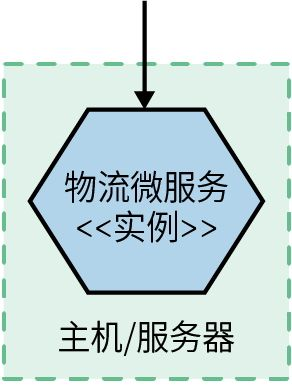
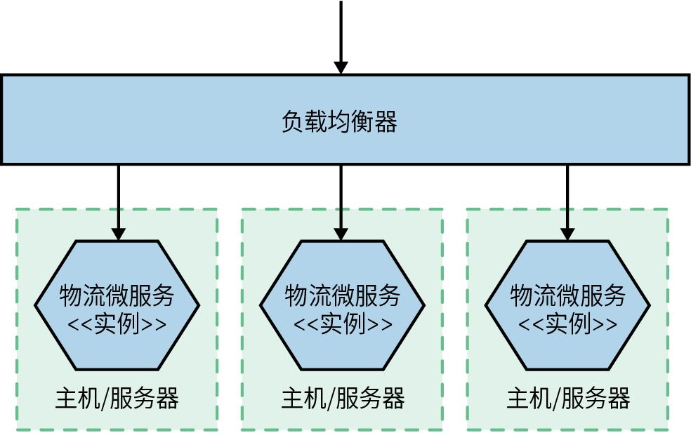
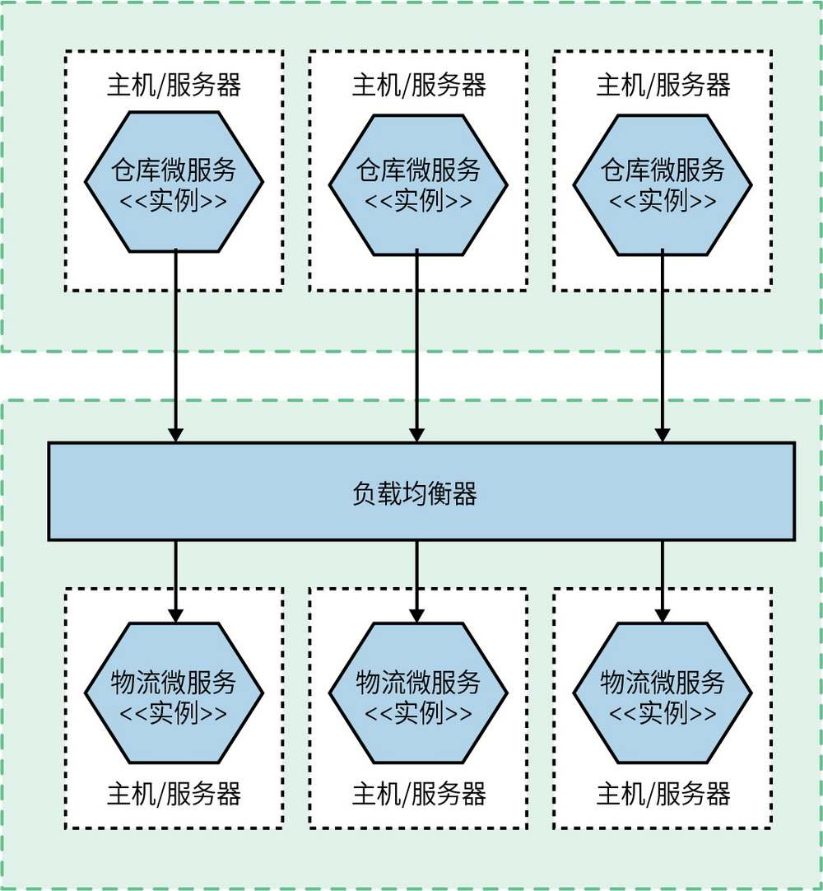
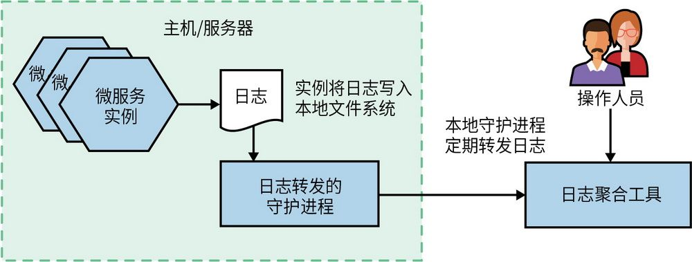
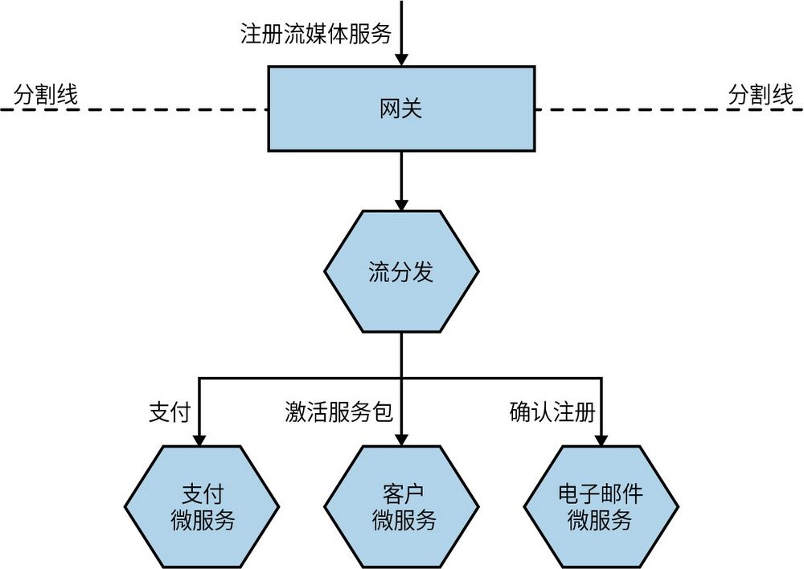
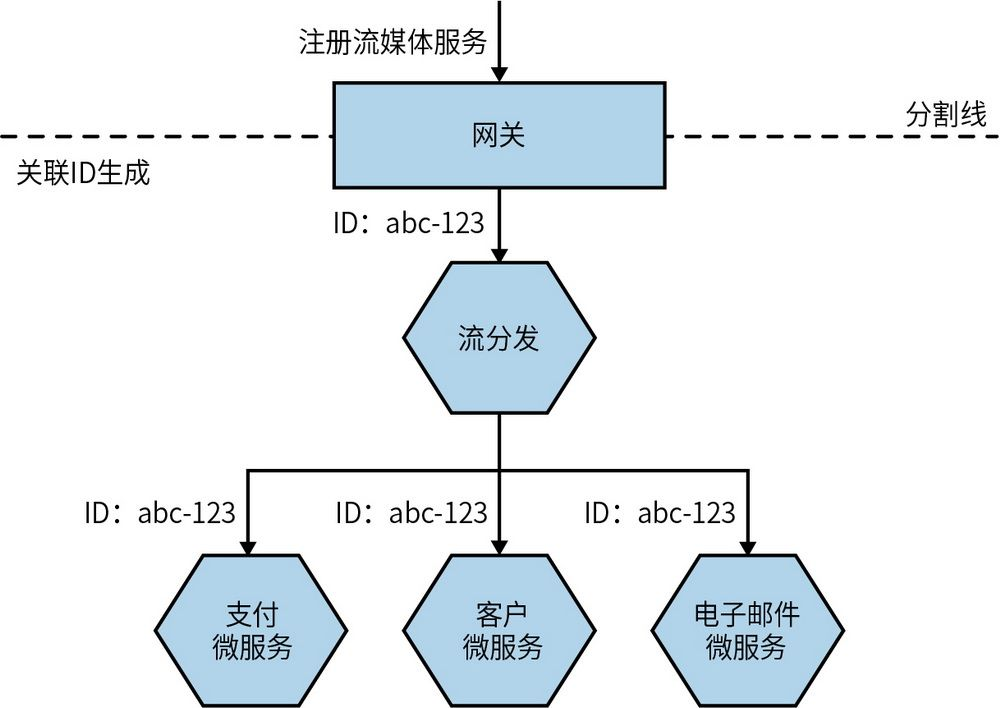
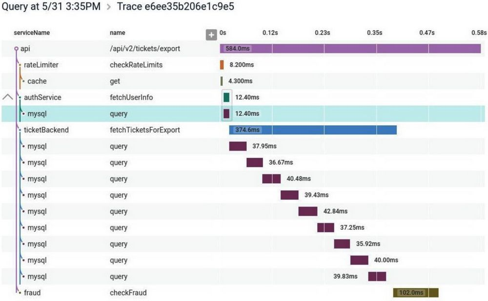

## 第10章 从监控到可观测性

如前所述，将系统分解为更小、更细粒度的微服务可以带来众多好处。然而，微服务同时也引入了许多新的复杂性。这种复杂性在生产环境中尤为突出。很快，我们会意识到，那些适合简单单体应用的工具和技术可能并不适用于微服务架构。

在本章中，我们将探讨在监控微服务时所遇到的挑战。尽管新工具可以提供帮助，但要真正理解生产环境中发生的事情，你可能需要转变自己的思维模式。此外，我们还将探讨日益受到关注的“可观测性”这一概念，了解如何让系统能够自我检测问题，并帮助我们定位问题。

**生****产****环****境****的****困****扰**

在微服务架构投入生产并服务于真实流量之前，你是不会真正体会到它所带来的潜在痛苦、折磨和苦恼的。

### 10.1 混乱、恐慌和困惑

想象一下下面的场景：周五下午办公室静悄悄的，团队成员都期待着提前结束工作，前往酒吧，享受无打扰的周末。突然，大家收到了一封电子邮件：网站表现异常！Twitter上都是关于公司网站的投诉，老板大发雷霆，原本期待的周末计划顿时化为乌有。

下面的说辞用来总结故障原因，并不罕见：

我们用微服务架构替换了单体架构，每次故障都更像犯罪悬案。
	 

确定故障发生的情况及其原因是我们的首要任务。但是，当存在一系列的可疑因素时，这项任务会变得格外困难。

在单进程单体应用中，我们至少有一个清晰的起点来开始排查问题。网站变慢了？是单体应用的问题。网站显示异常错误？还是单体应用的问题。CPU使用率飙升至100%了？仍然是单体应用的问题。你是不是闻到一股烧焦的味道？
	 嗯，你懂的，同样是单体应用造成的——单点故障使故障排查工作变得简单。

现在让我们考虑基于微服务的系统。我们为用户提供的功能由多个微服务支持，其中一些微服务需要与更多的微服务通信才能完成任务。采用这种方式有很多优点（否则写本书就是在浪费时间），但在监控领域，我们面临着更复杂的问题。

如今，我们需要监控的服务器数量增多，需要排查的日志文件变多，由于网络延迟而导致问题的地方也变多了。故障面积也随之增加，需要排查的问题也越来越多。那么我们该如何应对呢？我们需要梳理这种错综复杂、令人困扰的局面——这绝不是我们任何人想在周五下午（或者任何时候）处理的事情。

首先，我们需要对细节进行监控，并将其汇总，以提供更全面的视角。然后，需要确保有合适的工具来切分并分析这些数据，这是我们进行排查的关键部分。最后，我们需要保持敏锐的思考，考虑如何通过生产环境测试等方式来确保系统的健康运行。本章将详细介绍这些关键步骤。

### 10.2 单个微服务，单个服务器

图10-1展示了一个非常简单的设置：一个主机运行一个微服务实例。现在，为了及时发现并解决问题，我们需要对这个微服务进行监控。那么，我们应该关注哪些维度呢？

图10-1：一个单一主机上的微服务实例

首先，我们需要从主机本身收集一些关键信息。CPU、内存等都可能为我们提供有价值的线索。接下来，我们要能够查看微服务实例的日志。当用户报告问题时，我们应该能够在日志中找到相关的错误记录，这将有助于准确定位问题。对于单一主机，我们可能只需直接登录主机，并使用命令行工具查看日志。

最后，我们可能希望从外部监视应用程序本身。至少，监控微服务的响应时间绝对是一个明智之举。如果微服务实例前面有一个Web服务器，你或许只需要查看Web服务器的日志。或者，你可以更进一步，利用健康检查接口等方法来验证微服务是否已经启动并且正常运行（本章的后面将对此进行更详细的探讨）。

时间流逝，负载增加，现在，我们可能发现系统需要进一步扩容……

### 10.3 单个微服务，多个服务器

现在，我们在多个主机上运行该服务的多个副本，如图10-2所示。通过负载均衡器，请求被分发到不同的实例上。现在，事情开始变得有点复杂了。我们仍然希望可以监控到所有信息，但现在我们需要在隔离问题的前提下做到这一点。当CPU占用率很高时，这种情况是否发生在所有的主机上？如果是，这是否说明微服务本身有问题？或者，这个问题只限于单个主机？如果是，这说明主机本身存在问题，还是说只是出现了一个异常的操作系统进程？

图10-2：跨多个主机分布的单个服务

在这个阶段，我们仍然希望追踪服务器层面的指标，并希望当它们超过某种阈值时能够发出警报。但是现在，我们想要查看这些指标在所有主机上的表现，且要像在单个主机上那样详细。换句话说，我们既要总览整体状态，又要对各个细节进行深入分析。因此，我们需要一些工具或方法，帮助我们从所有主机中收集这些指标，并对它们进行切分和分析。

接下来，我们要处理的是日志问题。考虑服务是在多台服务器上运行的，登录每一台服务器查看日志显然是低效的。不过，如果只有几台主机，我们可以使用SSH多路复用器之类的工具，它允许我们在多个主机上运行相同的命令。借助大型显示器，我们可以在微服务日志中运行grep "Error"命令，找到问题的根本原因。当然，这种方法远非最优，但作为一种权宜之计，暂时是可行的。不过，随着系统的扩展，这个办法很快就会显得不太适用。

在追踪响应时间等指标时，我们可以在负载均衡器上监控到对下游微服务的调用响应时间。但是，我们还必须考虑负载均衡器本身可能成为系统的瓶颈。在这种情况下，我们不仅需要记录负载均衡器的响应时间，还要记录微服务本身的响应时间。此时，定义“何为正常运行”也变得尤为重要，因为我们会配置负载均衡器，使其自动剔除运行不正常的节点。因此，在进行这些操作时，我们希望已经对什么是正常的运行状态有了明确的认识。

### 10.4 多个微服务，多个服务器

在图10-3中，情况变得更加有趣。多个微服务相互协作，为用户提供功能；且这些服务会运行在多台主机上，这些主机可能是物理主机，也可能是虚拟主机。如何在多个主机上的数千行日志中排查出错误？如何确定服务器是否运行异常，或者是否存在系统性问题？如何在多个主机之间的调用链中追溯错误并找出导致错误的原因呢？

图10-3：分布在多个主机上的多个微服务

对于故障排查，指标和日志的集中聚合至关重要。然而，这并不是我们唯一需要考虑的因素。我们需要弄清楚如何在大量数据中进行筛选，并尽力厘清数据背后的意义。最重要的是，这需要我们转变思维方式——从一个较为固定的面向监控的视角，转为面向可观测性和生产环境测试的更为动态的视角。

### 10.5 可观测性与监控

在进一步探索如何解决前述问题之前，我们有必要探讨一个自第1版出版以来备受瞩目的概念——可观测性。

尽管可观测性这一概念已经存在了几十年，但它直到最近才在软件开发领域得到广泛的关注和应用。系统的可观测性是指，通过系统的外部输出来理解其内部状态的能力。这通常要求我们对软件有更加全面地了解——将软件视为一个完整的系统，而不仅仅是一组孤立的实体。

在实践中，一个系统的可观测性越强，我们就越容易定位问题所在。对外部输出的认知可以帮助我们更迅速地找出隐患。但难点是，我们通常需要产生这些外部输出，并借助不同的工具来理解这些输出。

此外，监控是我们必须做的事情。但我们不仅仅要监控系统，更要深入理解监控的目的。如果只是盲目地监控系统活动，而不明确监控的真正目标，系统很可能会出现问题。

传统的监控方法要求我们提前预见可能的问题并设定警报机制，以便在问题发生时及时通知相关人。但是，随着系统的分布性越来越强，你可能会遇到以前从未遇到过的问题。具有高度可观测性的系统会提供支持多种查询方法的外部输出——这种可观测性系统使你能够探索以前未曾考虑过的问题。

因此，我们可以将监控视为一项任务，是我们应该执行的工作，而可观测性则是系统的一种特性。

**它****们****是****可****观****测****性****的****“****支****柱****”****？****不****要****急****于****下****结****论**

有些人试图将“可观测性”的概念提炼为几个核心概念。其中，很多人主要聚焦于可观测性的三大“支柱”：指标、日志和分布式追踪。New Relic甚至创造了“MELT”（metric、event、log、trace，指标、事件、日志和追踪）一词，尽管这个术语尚未被广泛接受，但New Relic正在努力推广它。虽然这个简单的模型最初很吸引我（我是一个喜欢用首字母缩略词的人），但随着时间的推移，我开始远离这种过于简化的思维，因为它可能会让人忽略问题的核心。

首先，在我看来，将系统属性过于简化为具体的实施细节似乎是反其道而行之。可观测性是一种属性，而实现这一属性可以有多种方法。过分关注实现细节会让人过于关注手段，而忽略了目标。这类似于当前的IT世界：成百上千的组织热衷于构建基于微服务的系统，但实际上他们并没有真正了解他们想要实现的目标。

其次，这些概念之间真的有清晰的界限呢？我认为其中的许多概念是重叠的。如果需要，我完全可以将指标放在日志文件中。同样，我也可以通过分析连续的日志条目来构建分布式追踪，这实际上也是常见的做法。

可观测性是指，你可以根据外部输出来了解系统正在做什么的程度。指标、事件和日志确实可以增强系统的可观测性，但我们必须确保将重点放在使系统更易于理解上，而不是盲目地引入大量工具。

我认为这种简化的描述是为了推销工具。你需要一个用于指标的工具，一个用于日志的工具，还有一个用于追踪的工具。而且你需要以不同的方式发送所有这些信息。在市场推广产品时，勾选功能列表往往比深入探讨这些功能所能带来的真正价值更为简单。正如我所说，我通常不推崇这种过于简化的思维方式，但现在是2021年，我觉得我应该更加积极地思考。
	 

可以说，这3~4个概念实际上只是更宏大概念下的具体实例。从根本上说，我们可以把从系统中获取的任何信息，无论是这些外部输出中的哪一种，都视为一个事件。某个特定的事件可能包含大量或少量的信息。它可以包含CPU使用率、有关付款失败的细节、客户是否登录等任何信息。基于这些事件流，我们可以得到追踪轨迹（假定我们可以将各个事件联系起来）、一个可搜索的索引或一组数字聚合。尽管目前我们选择以不同的方式、使用不同的工具和协议收集这些信息，但现有的工具链不应限制我们思考如何更好地从系统中获取所需的信息。

为了更有效地监控系统，你应该考虑系统的各种输出，包括可以收集和查询的事件。你或许需要使用不同的工具来处理各种类型的事件，但未来可能会有统一的方法来处理所有这些事件。

### 10.6 构建可观测性的组件

那么，我们的期望是什么呢？我们希望知道用户对软件是否感到满意。如果出现了问题，我们希望在用户发现问题之前就首先得知。当问题确实发生时，我们需要弄清楚可以采取什么措施能让系统再次启动并运行，而一旦问题得到解决后，我们希望手头有足够的信息，来搞明白到底出了什么问题，以及可以采取什么办法来避免问题再次出现。

在本章的其余部分，我们将探讨如何实现这一切。我们将介绍一些有助于增强系统架构可观测性的关键组件。

**日****志****聚****合**

跨多个微服务收集信息，这是任何监控方案或可观测性解决方案的重要组件。

**指****标****聚****合**

从我们的微服务和基础架构中捕获原始数据，以帮助检测问题、推动容量规划，甚至对应用程序进行扩容。

**分****布****式****追****踪**

追踪跨多个微服务边界的调用流，以找出问题所在并获取准确的延迟信息。

**检****测****是****否****工****作****正****常**

通过研究错误预算、服务等级协议、服务等级目标等，探讨如何利用它们确保微服务满足消费者的需求。

**警****报**

什么情况下应该发出警报？好的警报应该是什么样的？

**语****义****监****控**

以不同的方式思考系统的健康状况；思考在凌晨3点叫醒我们的应该是什么故障。

**生****产****环****境****测****试**

在生产环境中进行测试的一些技术。

让我们从最容易上手的内容开始：日志聚合。

#### 10.6.1 日志聚合

即使在小规模的微服务架构中，也有许多服务器和微服务实例，因此仅通过登录计算机或SSH多路复用器来检索日志并不能真正解决问题。更好的方法是使用专门的子系统来收集我们的日志，并使其集中可用。

日志很快将成为帮助你了解生产系统中所发生事情的关键手段之一。在部署简单的架构时，日志文件、记录的内容以及我们如何处理日志通常是在部署后才会考虑的事情。随着系统越来越分散，日志将成为一种重要的工具，不仅可以帮助你在出现问题时诊断问题，而且还会告知你应该事先注意什么，以避免问题的发生。

正如我们将即将探讨的，日志领域有各种各样的工具，但它们大多都以相似的原理工作，如图10-4所示。进程（比如微服务实例）将日志写入到本地文件系统。随后，本地守护进程定期收集日志并将其转发到一个可以被操作人员查询的存储系统中。这些系统的一个好处是，它们的工作原理大致相同，因此在微服务架构中你可能无须特别关注它们。你无须更改代码或使用某个特定的API；只需要正常地写入本地文件系统即可。但是，如果你关心日志可能会丢失的问题，那么就需要了解此日志在传输过程中可能会遇到的各种故障模式。

图10-4：如何在日志聚合过程中收集日志的概览图

至此，希望你已经明白，我总是尽量避免持有教条式的观点。我也不再强调你必须这样做或那样做，而是试图为你提供背景知识和建议，并解释不同决策背后的细微差别。换句话说，我尝试为你提供一些工具，以帮助你根据实际情况做出正确的选择。但是在日志聚合方面，我想尽量给出一个适用于所有情况的建议：在实施微服务架构时，你应该将实现一个日志聚合工具作为一个基本的前提条件。

我提出这种观点的理由有两个。首先，日志聚合非常有用。对于那些将日志文件视为错误信息的“垃圾倾倒场”的人来说，这种看法可能令他们感到意外。但相信我，如果操作得当，日志聚合会非常有价值，尤其是当它与我们稍后将介绍的另一个概念——关联ID——一起使用的时候。

其次，与微服务架构可能带来的其他困惑和困扰相比，实现日志聚合并没有那么困难。如果你的团队无法成功实现基本的日志聚合解决方案，那么他们在微服务架构的其他更复杂的领域可能也会遇到困难。因此，你完全可以把实施日志聚合方案作为一个测试，看看你的团队是否已经为未来更复杂的挑战做好了准备。
	

**在****做****其****他****工****作****之****前**

在构建微服务架构之前，首先获取一个日志聚合工具并启动运行起来。你可以将其视为构建微服务架构的先决条件。相信你未来会感激我。

当然，日志聚合也有其局限性。随着时间的推移，你可能希望使用更高级的工具来增强或者替代日志聚合所提供的功能。尽管如此，日志聚合仍然是一个很好的起点。

**0****1****.****通****用****格****式**

如果要聚合日志，你需要能够查询这些日志以提取有用的信息。为此，选择一个合适的标准日志格式是很关键的，否则查询语句可能会很难甚至无法编写。你肯定希望在每条日志中，日期、时间、微服务名称、日志级别等信息的位置都是一致的。

有些日志转发代理可以在将日志转发到中央日志存储之前对其进行重新格式化。就个人而言，我会尽量避免这种做法，因为对日志进行重新格式化可能会占用大量的计算资源，我曾经见过因为执行格式化导致CPU被大量占用，从而引发生产环境的问题。更好的做法是，在微服务编写日志时就规定好日志格式。我建议一般情况下不要使用日志转发代理对日志重新格式化，除非真的无法修改源日志格式，比如在处理遗留系统或使用第三方软件的时候。

我本以为自第1版出版之后，行业内会出现一个日志记录的通用标准，但这似乎并没有发生，因为仍然存在不同的日志格式。这些格式都是基于标准的Web服务器访问日志格式（例如Apache和Nginx支持的格式）进行扩展的，通过添加更多的数据列来记录额外的信息。不过无论选择哪种日志格式，关键是要在你的微服务架构中，确立一个内部标准，确保在整个系统内部使用一致的日志格式。

如果你使用的是相对简单的日志格式，那么日志主要就是由文本行组成的，其中某些具体的信息会出现在日志行的特定位置。示例10-1展示了这样的一个日志格式。

**示****例****1****0****-****1** 一些日志示例

15-02-2020 16:00:58 Order INFO [abc-123] Customer 2112 has placed order 988827

15-02-2020 16:01:01 Payment INFO [abc-123] Payment $20.99 for 988827 by cust 2112

日志聚合工具需要知道如何解析这个字符串，以提取我们可能想要查询的信息，例如时间戳、微服务名称或日志级别。在示例10-1中，这是可以做到的，因为这些数据片段出现在日志中的固定位置——日期是第1列，时间是第2列，依次类推。但是，如果我们想查找与特定客户相关的日志行，情况就稍微复杂了，因为客户ID虽然出现在两个日志行中，但其位置各不相同。所以，我们可能会编写更结构化的日志行，比如使用JSON格式，以便确保客户ID或订单ID等信息始终出现在固定位置。同样，日志聚合工具需要进行配置，以解析和提取所需的日志信息。另一件需要注意的事情是，如果记录是JSON格式的日志，那么可能需要额外的工具来解析所需的值，否则可能会难以理解，且仅仅通过纯文本查看器查看日志可能不会特别有用。

**0****2****.****关****联****日****志****行**

当有大量的服务相互协作以向终端用户提供某种功能时，一个单一的调用可能会触发多个下游服务的调用。以MusicCorp为例（图10-5）。一位用户正在注册新的流媒体服务。用户选择他们喜欢的流媒体套餐并单击提交按钮。在后台，当用户在UI中单击按钮时，客户的请求会首先到达服务之前的网关。然后，网关会将此调用传递给流媒体微服务。该微服务与支付微服务通信以完成首次付款，而客户微服务会做出变更，标记该用户已激活流媒体服务，电子邮件微服务则会向客户发送一封确认邮件，通知他们已成功订阅新的流媒体服务。

图10-5：与客户注册相关的多个微服务调用

如果对支付微服务的调用出现了异常的错误，我们应该如何应对呢？我们将在第12章详细讨论如何处理故障，但你也要考虑一下定位问题和诊断问题所面临的挑战。

关键在于，当某个微服务（比如支付微服务）出现错误时，通常只有该微服务会记录错误信息。如果幸运的话，或许能够确定是哪个请求导致了这个问题，甚至可以查看到此次调用的参数。但是，我们无法在更宏观的上下文中看到这个错误是如何发生的。在这个特定示例中，即使假设每个交互只生成1行日志，我们也会有5行包含相关调用流信息的日志。能够将这些行的日志组合在一起查看会对诊断问题非常有用。

在这里可以使用的一种方式是使用关联ID——这在第6章讨论Saga的时候提及过。在进行第一次调用时，会生成一个唯一的ID，该ID将用于关联与请求相关的所有的后续调用。在图10-6中，我们在网关中生成此ID，然后将其作为参数传递给所有的后续调用。

图10-6：为一组调用生成关联ID

由于该调用引起的所有微服务活动都会使用相同的关联ID进行记录，我们可以将该关联ID放置在每个日志行中的一个固定位置，如示例10-2所示。这样，以后就可以轻松地提取与给定关联ID相关的所有日志。

**示****例****1****0****-****2** 在日志行的固定位置使用关联ID

15-02-2020 16:01:01 Gateway INFO [abc-123] Signup for streaming

15-02-2020 16:01:02 Streaming INFO [abc-123] Cust 773 signs up …

15-02-2020 16:01:03 Customer INFO [abc-123] Streaming package added …

15-02-2020 16:01:03 Email INFO [abc-123] Send streaming welcome …

15-02-2020 16:01:03 Payment ERROR [abc-123] ValidatePayment …

当然，你需要确保每个服务都知道如何传递关联ID。这是你需要在整个系统中建立和执行标准的关键环节。一旦达到这个标准，实际上可以开发工具来追踪微服务之间的各种交互。由于可以追溯整个服务调用链，这种工具在追踪事件风暴、异常情况或者识别成本较高的事务时非常有用。

虽然起初在日志中的关联ID似乎不是特别重要，但随着时间的推移，它们会变得越来越有价值。可惜的是，将它们添加到系统中可能会带来一定的困扰。因此，我强烈建议你尽早在日志记录中实现关联ID。当然，日志记录为你提供的帮助有限，有些问题更适合使用分布式追踪工具来解决，我们稍后会探讨这类工具。但是，最初在日志文件中添加一个简单的关联ID是非常有意义的，因为当系统变得更加复杂时，你可以考虑使用更专业的追踪工具。

一旦实现了日志聚合，应尽早引入关联ID。在项目初期实施它相对简单，但在后期加入可能会变得十分棘手。关联ID会显著增强日志的实用性。

**0****3****.****时****间****问****题**

当我们查看日志行时，可能会自然地认为这些日志是按时间顺序排列的，因为按时间顺序排列的日志有助于我们明确事件的发生情况和顺序。毕竟，每条日志中都包含日期和时间，但这并不意味着我们可以完全依赖它们来判定事件的真实发生顺序。在示例10-2中，我们首先看到一条来自网关的日志，然后是来自流媒体微服务、客户微服务、电子邮件微服务的日志行，最后是支付微服务。我们可能认为这就是实际发生的调用顺序。但可惜，并不是这样的。这些日志行是在运行这些微服务实例的主机上生成的。在本地记录后被转发。这意味着日志行中的日期戳是在运行微服务的计算机上生成的。但可惜的是，我们无法保证这些计算机上的时间是同步的。比如运行电子邮件微服务的计算机上的时间可能比运行支付微服务的计算机上的时间早几秒钟——这可能会导致在电子邮件微服务中的某个事件比在支付微服务中发生得更早，但这可能是时钟偏差导致的。

时钟偏差在分布式系统中是一个普遍存在的问题。虽然有一些协议如网络时间协议（Network Time Protocol，NTP）致力于减少这种偏差，并且它是被使用最为广泛的协议之一。但是，NTP并不能始终达到预期的效果，它可能只能减小时钟的偏差而非完全消除。当两个调用的时间非常接近时，哪怕在不同的计算机之间只有1秒的时钟偏差，都可能影响我们对调用顺序的判断。

从根本上说，这意味着日志中的时间戳存在两方面的局限性。我们既无法获取整个调用链上完全准确的时间信息，也不能完全搞清事件之间的因果关系。

为了解决这个问题，并真实地了解事件的发生顺序，Leslie Lamport提出了逻辑时钟系统，它利用计数器来追踪事件的调用顺序。
	 当然，你也可以部署这样的系统，并且该方案还有许多变体。不过，就个人而言，如果想要得到更准确的事件发生顺序以及更准确的时间信息，我更倾向于使用分布式追踪工具，因为它可以同时解决这两个问题。我们稍后会更深入地探讨分布式追踪。

**0****4****.****实****现**

在我们的行业中，很少有像日志聚合这样竞争激烈的领域，这个领域存在着各种各样的解决方案。

流行的日志聚合开源工具链之一是利用Fluentd这样的日志转发代理，将日志发送到Elasticsearch，并使用Kibana对生成的日志流进行切片和分析。这个技术栈的最大挑战通常是管理Elasticsearch本身的开销，但是，如果你已经为其他目的部署了Elasticsearch，或者选择使用托管的服务，那么这可能不是一个问题。关于使用这个开源工具链，有两点需要注意。第一点是，尽管官方在大量市场推广活动中将Elasticsearch定位为数据库，但我个人对此持保留意见。将原本设计为搜索引擎和索引工具的Elasticsearch打上数据库的标签可能会引发很多问题。数据库通常被视为存储关键数据的真实来源，但搜索索引并不是真实来源，它只是源数据的一个投影，用于支持检索。Elasticsearch过去曾遇到一些问题，让我对其作为数据库来使用产生了疑虑。
	 虽然我相信其中许多问题已经得到解决，但基于对这些问题的了解，我还是对在某些情况下将Elasticsearch视为数据库持谨慎态度。如果你不能容忍日志信息的丢失，我建议在出现问题时，确保自己有能力重建原始日志，以应对丢失关键日志的风险。

第二点与Elasticsearch和Kibana的技术细节关联不大，更多是在于这些项目背后的公司Elastic。最近，Elastic决定将核心Elasticsearch数据库和Kibana的源代码许可证从广泛使用和公认的开源许可证（Apache 2.0）更改为非开源的服务端公共许可证（SSPL）。
	 变更许可证的动机似乎是Elastic对AWS这样的组织已经基于这项技术构建了成功的商业产品感到不满。这两个技术产品削弱了Elastic自己的商业产品。除了担心SSPL在本质上可能具有“传染性”（类似于GNU的通用公共许可证）之外，这一举动还激起了很多人的愤怒。考虑到超过一千名开发者在Apache 2.0的许可证下为Elasticsearch做出了贡献，这种情绪是可以理解的。而讽刺之处在于，Elasticsearch本身以及整个Elastic公司的大部分技术都是基于开源项目Lucene构建的。在撰写本书时，AWS承诺基于之前的Apache 2.0开源许可证，来创建并维护Elasticsearch和Kibana的开源分支。

在许多方面，Kibana是一个不错的尝试，它创建了一个开源替代品以代替Splunk这样成本较高的商业产品。尽管Splunk似乎非常出色，但我交流过的每一位Splunk客户都告诉我，无论是许可费还是硬件成本，它都非常昂贵。不过，许多客户确实认为它很有用。这说明，除了开源产品，还有很多的商业产品可供选择。我个人非常喜欢Humio，而很多人则更偏爱使用Datadog来进行日志聚合，此外，许多公有云供应商也提供了开箱即用的解决方案，比如AWS的CloudWatch或Azure的Application Insights。

确实，无论你选择开源产品还是商业产品、选择自托管还是云托管，这个领域都为你提供了丰富的选项。如果要构建微服务架构，选择适合自己需求的日志聚合工具并不是一件困难的事情。

**0****5****.****不****足****之****处**

的确，日志是从正在运行的系统中迅速获取信息的绝佳且简单的途径。我也坚信，对于早期的微服务架构，加大对日志记录功能的投入往往能为应用在生产环境下的可见性和问题排查带来最大的收益。日志是关键的信息收集和问题诊断的工具。不过，你还是需要了解一些可能存在的关键挑战。

正如已经提到的，由于时钟偏差的存在，我们不能总是依靠日志来了解事件发生的顺序。计算机之间的时钟偏差也意味着，我们无法准确地确定一系列调用的时间顺序，这可能会对使用日志来诊断延迟或其他性能问题带来挑战。

确实，随着微服务的数量和调用次数的增加，系统将产生海量的数据。这可能会导致更高的成本，比如需要配置更多的硬件，也可能会增加你向服务供应商支付的费用（一些供应商是按使用量收费的）。此外，根据日志聚合工具链的构建方式，处理如此庞大的日志还可能带来扩展性方面的挑战。一些日志聚合解决方案在接收日志数据时为其创建索引，以加快查询速度。但问题是，维护索引是需要大量的计算资源的，随着接收的日志量增加，索引的规模和维护成本也会相应增长。为了避免这种情况，你可能需要更加精细地记录日志，这反过来又增加了开发和维护的复杂性，并且可能没有记录某些有价值的信息。我曾与一个管理SaaS开发者工具的团队交谈，他们告诉我，尽管他们管理的Elasticsearch集群很大，但只能容纳一个产品的6周日志数据，这使得团队不得不不断地移动和整理数据以维持其正常运转。我喜欢Humio的部分原因是，它是为开发人员专门构建的解决方案；Humio的开发人员专注于高效且可伸缩的数据接收，并提供了一系列创新的解决方案，以缩短查询时间。

即使你有一个能够存储所需日志量的解决方案，这些日志仍然可能包含大量有价值和敏感的信息。这意味着你可能需要限制对日志的访问，这可能会使在生产环境中对微服务的共同所有权的管理变得复杂，而且日志可能会受到恶意攻击。因此，你可能需要考虑不记录某些类型的信息（正如11.5.2节中“适度收集”这一部分所述，如果不存储数据，就不会有数据被盗的风险），以确保日志不会被未经授权的人访问。

#### 10.6.2 指标聚合

面对查看不同主机的日志所带来的挑战，我们需要一种更高效的方法来对系统数据进行收集和可视化。在对复杂系统的指标进行检查时，很难知道“好”是什么样子。我们的网站每秒钟看到近50个4XX HTTP错误代码。这是个问题吗？自从服务启动后，目录服务的CPU负载增加了20%，这是什么原因导致的？知道何时紧张何时放松的秘诀是收集关于系统行为的指标，以便能在足够长的时间内看到清晰的模式。

在更复杂的环境中，会经常配置微服务的新实例，因此我们希望所选择的系统能够非常容易地从新主机中收集指标数据。我们希望能够查看和分析整个系统的指标（例如CPU的平均负载），包括也能看到指定服务的所有实例，或者某个单实例。这意味着我们需要能够将元数据与指标关联起来，以便了解系统的行为和性能。

了解趋势变化的另一个重要好处在于容量规划。我们是否到达了极限？什么时间需要增加主机数量？过去，我们购买物理主机通常是一年一次。在由IaaS（基础设施即服务）供应商提供的按需计算的新时代，我们可以在几分钟甚至几秒钟内完成规模缩放。这意味着，如果了解使用的模式，我们可以确保拥有足够的基础设施来满足需求。我们追踪和处理趋势的方式越智能，系统的成本效益和响应变化的能力就越好。

鉴于这种数据的性质，我们可能希望以不同的频率存储和报告这些指标。例如，我可能希望对服务器进行每10秒一次的CPU数据采样，持续记录过去30分钟的情况，以更好地应对当前正在发生的情况。此外，服务器上的CPU样本可能仅仅被用于总体趋势的分析，因此每小时计算一次CPU样本的平均值就能满足这个要求。标准指标平台通常采用这种方式，以降低查询时间并减少数据的存储。对于像CPU使用率这样简单的指标来说，这种做法可能是可以接受的，但是对旧数据进行聚合的过程可能会导致信息丢失。对于这些需要对数据进行聚合的情况，关键在于，你通常需要事先决定要聚合哪些数据，提前猜测哪些信息可能会丢失。

标准的指标工具对于了解趋势或简单的故障模式是非常有效的。实际上，它们可能是至关重要的。但是，因为它们限制了我们想要提出的问题类型，所以通常不能让系统更具可观测性。当我们从响应时间、CPU或磁盘空间使用等简单信息转向更广泛地思考想要捕捉的信息类型时，事情就开始变得有趣起来了。

**0****1****.****低****基****数****与****高****基****数**

许多工具，尤其是较新的工具，已经被用于构建存储和检索高基数数据。基数有多种描述方法，但你可以将其视为在给定数据点中可以轻松查询的字段数。我们可能希望查询数据中的更多字段，而这需要更多的基数支持。从根本上讲，对时间序列数据库而言更容易出现问题，我在此不会展开讲述，但这与许多这类系统的构建方式相关。

例如，我可能想要捕获并查询微服务的名称、客户ID、请求ID、软件构建编号和产品ID等所有时间内的信息，而且要追踪这些信息的变化趋势。然后，我决定在该阶段捕获有关计算机的信息，包括操作系统、系统架构、云供应商等。我可能需要为收集的每个数据点捕获所有这些信息。随着想要查询的信息越来越多，基数也会增加，而那些没有考虑这种用例的系统将会面临更多的问题。正如Honeycomb创始人Charity Majors
	 所解释的那样：

归结起来，本质就是指标。指标是数据点，是一个具有名称和一些标识标签的单个数字。你可以通过这些标签获得所有的上下文信息。但由于指标在磁盘上的存储方式，写入所有这些标签的爆炸性增长会增加存储开销。存储一个指标非常廉价，但存储一个标签开销很大；并且给每个指标都存储大量标签会迅速导致存储引擎崩溃。

实际上，如果将高基数数据放入为低基数设计的系统中，那么这些系统会遇到大麻烦。例如，Prometheus这样的系统旨在存储相对简单的信息，比如给定计算机的CPU速率。在许多方面，我们可以将Prometheus和类似工具视为传统指标存储和查询的优秀工具。但是，这些系统缺乏支持高基数数据的能力，这可能会成为一个限制因素。Prometheus的开发人员对这一点非常坦诚：

请注意，每个键-值标签对的唯一组合代表一个新的时间序列，这会大幅增加存储的数据量。不要使用标签来存储具有高基数（许多不同的标签值）的维度，例如用户ID、电子邮件地址或其他不受限制的值集。

能够处理高基数数据的系统可以让你向系统提出各种问题——通常是你之前不知道应该提出的问题。现在，这可能是一个难以理解的概念，特别是如果你一直在使用相对“传统”的工具来管理单进程的单体系统。即使是那些拥有大型系统的人，通常也会因为别无选择而被迫使用低基数的监控系统。但随着系统复杂性不断增加，你需要改进系统提供的输出质量，以提高可观测性。这就意味着需要收集更多的信息，并拥有能够对数据进行切片和分析的相应工具。

**0****2****.****实****现****方****式**

自第1版问世以来，Prometheus已成为一款流行的开源工具，用于收集和聚合指标数据。相比以前我推荐使用的Graphite，Prometheus可能是一个较好的替代选择。商业领域在这一方面也有了很大的发展，新供应商和老供应商都在构建或改进现有的解决方案，以满足微服务用户的需求。

不过，需要注意的是，我对低基数数据与高基数数据的担忧仍然存在。构建用于处理低基数数据的系统将很难被改进以支持高基数数据的存储和处理。如果你正在寻找能够存储和管理高基数数据的系统，以实现对系统行为进行更详细的观察和分析，我强烈建议查看Honeycomb或Lightstep。尽管这些工具通常被视为分布式追踪的解决方案（稍后将深入探讨），但它们在存储、过滤和查询高基数数据方面都具有很强的能力。

**监****控****系****统****和****可****观****测****性****系****统****也****是****生****产****系****统**

随着越来越多的工具被用来帮助管理微服务架构，我们必须清楚这些工具本身也是生产系统。日志聚合平台、分布式追踪工具、警报系统等，都是承担着关键任务的应用，它们与我们的软件同样重要，甚至更重要。同编写和维护软件一样，在维护生产监控工具方面，我们必须付出同样的努力。

我们还应该认识到，这些工具可能会成为潜在的攻击向量
	 。在撰写本书时，世界各地的组织正在处理SolarWinds网络管理软件的漏洞问题。虽然漏洞的确切性质仍在调查中，但据说这是一种供应链攻击。一旦安装在客户站点上，该软件允许恶意方从外部访问客户网络。

#### 10.6.3 分布式追踪

到目前为止，探讨的内容主要是独立收集信息的情况。确实，我们正在聚合这些信息，但了解收集这些信息的背景也很关键。从根本上讲，微服务架构是一组协同工作的进程，用于执行某种任务。在第6章中，我们探讨了协调这些活动的不同方式。因此，当想要了解系统在生产环境中的实际行为时，搞清楚微服务之间的关系是很有必要的。这可以帮助我们更好地了解系统行为、评估问题的影响，或者更好地弄清楚到底有哪些方面没有按照我们的期望运行。

随着系统变得更加复杂，有必要找到一种查看系统追踪的方法。我们需要能够收集这些不同来源的数据，以获取一组关联调用的整体视图。前面提到过，简单地将关联ID放入日志文件中是一个不错的开始，但这是一个不够成熟的解决方案，特别是我们最终不得不创建自定义工具来帮助可视化、切分和分析这些数据。而这正是分布式追踪工具的作用所在。

**0****1****.****工****作****原****理**

尽管具体的实现方式有所不同，但分布式追踪工具的工作方式大体相似。线程内的本地活动被捕获到一个span（追踪单元）中。这些单独的span使用某个唯一标识符进行关联。然后，这些span被发送到一个中央收集器，该收集器能够将这些相关的span构建成一个单独的trace（追踪）。在图10-7中，我们可以看到Honeycomb的示例图，展示了微服务架构的分布式追踪。

图10-7：Honeycomb显示的分布式追踪，帮助确定在跨多个微服务的操作中，时间都花费在哪些地方

这些span允许你收集大量信息。收集的具体数据将取决于使用的协议，但在OpenTracing API的规范下，每个span包含开始时间和结束时间、与span相关联的一组日志，以及一组任意的键-值对，以帮助后续查询（这些键-值对可用于发送诸如客户ID、订单ID、主机名、构建编号等信息）。

在系统中追踪调用需要收集足够的信息，这可能会对系统本身产生直接影响。因此通常需要通过抽样的方式来减少追踪数据的数量，即明确某些信息被排除在追踪范围之外，以确保系统仍然能够正常运行。挑战在于即使舍弃的是正确的信息，我们仍然要能够收集足够的样本，以便正确地推断观察结果。

抽样策略可以是非常基础的抽样办法。谷歌的Dapper系统启发了许多随后出现的分布式追踪工具，采用了激进的随机抽样方法。一定百分比的调用会被随机采样。例如，Jaeger的默认设置仅对1000个调用中的一个调用进行追踪。这里的想法是，捕获足够的信息来了解系统的运行情况，但不要捕获过多的信息以致系统无法应对。与这种基于随机抽样的简单方法不同，像Honeycomb和Lightstep这样的工具可以提供更细化、更动态的抽样。动态抽样的一个情况是，如果想要更多的某种类型事件的样本，则可以进行抽样——例如，如果所有的成功操作都非常相似，那么你可能只想对每100个成功操作进行一次抽样，但对于生成错误的操作，你希望它们都成为样本。

**0****2****.****实****现****分****布****式****追****踪**

要在系统中实现分布式追踪需要一些准备工作。首先，需要在微服务内捕获span信息。如果使用像OpenTracing或新版OpenTelemetry API这样的标准API，你可能会发现一些第三方库和框架已经内置了对这些API的支持，并且已发送有用的信息（例如，自动捕获有关HTTP调用的信息）。但即使它们支持标准API，你可能还是需要根据自己的需求编写代码实现相关功能，以确保能够在任何时间点都能获取有关微服务正在执行什么操作的有用信息。

接下来，需要一种方法将这些span信息发送到收集器。一种方式是从微服务实例将数据直接发送到中央收集器，但更常见的方法是使用本地转发代理。因此，与日志聚合一样，代理在微服务实例的本地运行，它将定期将span信息发送到中央收集器。使用本地代理还可以实现一些高级功能，例如更改数据的抽样率或为数据添加额外标签，还可以更有效地缓冲将要发送的信息。

最后，你需要一个能够接收此信息并理解其全部含义的收集器。

在开源领域，Jaeger已成为分布式追踪的热门选项。对于商业工具，我建议首先查看前面提到的Lightstep和Honeycomb。不过，我建议你选择一些支持OpenTelemetry API的工具。OpenTelemetry是一个开放的API规范，它可以让数据库驱动程序或Web框架等代码更容易为追踪提供支持，并且支持了跨不同供应商的数据收集和分析。这一规范基于早期的OpenTracing和OpenConsensus API的工作，它现在得到了广泛的行业支持。

#### 10.6.4 我们做得如何

我们已经讨论了作为系统运维人员可能需要采取的措施、思维方式以及可能需要收集的信息。但是，如何知道你做得是否恰当？如何知道自己是否做得足够好，或者系统是否运行得足够好？

随着系统变得越来越复杂，以“上线”（up）或“下线”（down）来表示系统的状态已经越来越没有现实意义，因为它越来越无法准确描述系统的状态。在单一进程的单体系统中，更容易将系统运行状况视为非此即彼的状态。但是在分布式系统呢？如果一个微服务实例无法访问，这算是个问题吗？如果一个微服务是可访问的，它就是“健康”的吗？如果我们的退货微服务可用，但它提供的一半功能需要使用当前出现问题的下游库存微服务，那么退货微服务是“健康”的还是“不健康”的呢？

随着事情变得越来越复杂，从不同的角度思考问题就变得越来越重要。想象一下蜂巢。你看到一只蜜蜂，认为它不开心，也许因为它失去了一只翅膀，无法飞行。这对这只蜜蜂来说肯定是个问题，但你能从中推断整个蜂巢的健康状况吗？不能，因为你需要更全面地观察蜂巢的健康状况。一只蜜蜂生病并不意味着整巢蜜蜂生病了。

我们可以通过确定什么是良好的CPU水平或什么是可接受的响应时间来确定一个服务是否“健康”。如果监控系统检测到实际值超出了定义的安全水平，警报就会被触发。不过，在许多情况下，这些指标与我们实际想要追踪的——系统是否正常运行——相去甚远。服务之间的交互越复杂，我们就越难通过单个指标来判断系统是否健康。

因此，我们可以收集大量信息，但仅凭这些信息并不能帮助我们回答系统是否正常运行的问题。为此，我们还需要更多地考虑如何定义可接受的行为。在**网****站****可****靠****性****工****程**（site reliability engineering，SRE）领域已经开展了大量工作，其重点是如何确保系统在允许变化的同时仍然可以可靠地运行。在这一领域，有一些有用的概念需要探讨。

下面，我们即将进入缩略词的世界。

**0****1****.****S****L****A**

SLA（service-level agreement，服务等级协议）是由建立系统的人和使用系统的人达成的一项协议。它不仅描述了用户可能期望的内容，还描述了如果系统无法达到可接受的行为水平时会发生什么情况。SLA通常处于“最低标准”的层面，如果系统仅仅刚好达到目标，最终用户仍然会不满意。例如，AWS对其计算服务制定了SLA。它明确表示对于单个EC2实例（托管虚拟机
	 ），不保证有效的正常运行时间。AWS表示会尽最大努力确保每个实例的正常运行时间达到90%，但如果没有达到，在实例不可用的那个小时，它就不会收取费用。现在，如果EC2实例在某个小时内持续无法达到90%的可用性，而导致系统不稳定，你可能就不用付费，但你还是不会感到满意。根据个人经验，AWS在实践中的表现远远超出了SLA所述的内容，这在许多SLA中是普遍存在的现象。

**0****2****.****S****L****O**

将SLA映射到团队层面是有问题的，特别是在SLA涉及面太广且跨部门的时候。在团队层面，我们更多地应该考虑SLO（service-level objective，服务等级目标）。SLO定义了团队承诺提供的内容。如果组织中每个团队达到SLO，那么组织也将实现（并可能大大超过）SLA中的目标。SLO可以包括给定操作的预期正常运行时间或可接受的响应时间等。

将SLO视为团队需要为组织实现其SLA而执行的任务就过于简单了。确实，如果整个组织实现了所有的SLO，我们会认为所有的SLA也已实现，但是SLO可以包括SLA中未列出的其他目标，那些可能是理想化目标，可能是面向内部的目标（试图进行某些内部变更）。SLO通常可以反映团队本身想要实现的某些目标，而这些目标与SLA无关。

**0****3****.****S****L****I**

要想确定是否达到了SLO，我们需要收集真实数据。这就是SLI（service-level indicator，服务等级指标）的作用。SLI是软件执行某项操作时的指标。例如，它可以是来自进程的响应时间、一个客户注册、将错误呈现给客户，或下订单，等等。我们需要收集并呈现这些SLI，以确保系统符合制定的SLO。

**0****4****.****错****误****预****算**

当尝试新事物时，我们可能会为系统引入更多的潜在不稳定性。因此，如果只是出于维护（或提高）系统的稳定性，我们可能会不鼓励变更。**错****误****预****算**（error budget）试图通过明确系统可接受的错误程度来避免这个风险。

如果你已经确定了SLO，那么计算错误预算应该非常明确。例如，你的SLO是，微服务需要全天24小时、每个季度内99.9%的时间内可用，这就意味着每个季度系统允许的不可用时间大约为2小时11分。就SLO而言，这就是你的错误预算。

错误预算有助于你清楚地了解是否实现了SLO，让你能够更好地决定可以承担哪些风险。如果季度内的错误预算还有较大空间，那么你可能可以放心地推出使用新编程语言编写的微服务。如果错误预算已经消耗完了，你可能需要推迟推出该服务，并将团队的时间用于提高系统的可靠性上。

错误预算和其他任何事情一样，都是为了给团队尝试新事物的空间。

#### 10.6.5 警报

偶尔（希望很少，但很可能比我们想象的要多），我们的系统中会发生一些问题，需要通知运维人员采取行动。比如，一个微服务可能因意外变得不可用，我们可能看到的错误数量比预期的多，或者整个系统对用户不可用。在这些情况下，我们需要知道正在发生什么，以便尝试解决问题。

问题在于，在微服务架构中，由于调用数量更多、进程数量更多以及更复杂的底层基础设施，出现问题或错误是常态。在微服务环境中，我们面临的挑战是，确定什么类型的问题应该通知相关人员，以及该如何通知到位。

**0****1****.****有****些****问****题****比****其****他****问****题****更****严****重**

当出现问题时，我们希望尽快得知。但是，所有问题都一样吗？随着问题的来源增多，重要的是能够对这些问题进行优先级排序，以决定是否以及如何进行人工干预。关于警报，我经常问自己的一个最重要的问题是：“这个问题是否重要到应该在凌晨3点唤醒某个人来解决？”

许多年前，我在谷歌待了一段时间，我看到与这种思维有关的一个例子。在谷歌山景城某栋建筑的接待区有一个放着旧服务器的架子，有点像陈列展品一样。我注意到了几件事情。首先，这些服务器没有放在服务器机箱内；它们只是插在架子上的裸露主板。但是，最引人注目的是，硬盘是用尼龙搭扣固定在机箱上的。我问其中一个谷歌员工为什么这样做。他说：“哦，硬盘经常出问题，我们不想用螺丝钉固定它们。我们只是把它们拆下来，扔进垃圾桶，然后用搭扣再固定一个新的硬盘。”

谷歌构建的系统假定硬盘会出现故障。谷歌优化了这些服务器的设计，以确保更换硬盘尽可能容易。谷歌系统被构建为可以容忍硬盘故障，尽管更换硬盘很重要，但单个硬盘故障可能不会引起用户能够察觉的重大问题。在谷歌数据中心有数千台服务器，每天有人会沿着机器架走，更换硬盘。当然，硬盘故障是个问题，但可以用常规方式处理。处理硬盘故障被看作是例行工作，不值得在正常工作时间之外叫醒某人，只需在正常工作时间内通知他们即可。

随着潜在问题的来源增多，你需要更好地确定哪些事情会引起哪些类型的警报。否则，你可能会发现自己难以将琐事与紧急事项区分开来。

**0****2****.****警****报****疲****劳**

通常来讲，过多的警报可能会引发重大问题。1979年，美国三哩岛核电站的反应堆发生部分熔毁事故。对事故的调查强调了设施的操作人员因看到过多的警报而无法确定应采取什么措施。虽然有一个警报指出了需要解决的根本问题，但对操作人员来说，这并不明显，因为同时有太多的其他警报响起。在事故的公开听证会上，其中一名操作人员Craig Faust回忆说：“我当时应该把报警面板扔到一边。它没有给我们任何有用的信息。”事故调查报告最后得出结论，称控制室“在事故的应对上严重失职”。
	 

最近，在涉及737 Max飞机的一系列事故中，我们看到了警报过多的问题，其中包括两起空难，共造成346人死亡。美国国家运输安全委员会对事故的最初报告
	 让人们关注到在真实条件下触发的令人困惑的警报，这些警报被认为是导致事故的因素之一。报告中的摘录如下。

人因研究认定，在非正常条件下（例如涉及多个警报的系统故障），鉴于可能需要机组人员多次行动的情况，向飞行员提供必须优先考虑哪些行动的信息是至关重要的。这在功能是由多个飞机系统实现的情况下尤为重要，因为高度集成的系统架构中的一个系统故障可能会向飞行机组呈现多个警报和指示，而每个接口系统都会记录故障……因此，将系统交互和驾驶舱面板设计得有助于引导飞行员采取最高优先级的行动非常重要。

因此，我们需要为操作人员提供警报优先级，以帮助他们在重要性上进行排序。过多的警报可能会对操作人员产生压力，导致实际问题的发生。

目前为止，我们讨论了操作核反应堆和驾驶飞机。我猜许多人正在思考这与你们正在构建的系统有什么关系。现在，你们可能（甚至很可能）并不是在构建这样的安全关键性系统，但我们可以从这些案例中学到很多东西。两个案例都涉及高度复杂、相互关联的系统，其中一个领域的问题可能会导致另一个领域的问题。当有过多的警报产生时，或不告知操作人员应该优先处理哪些警报时，灾难就会随之而来。过多的警报会使操作人员陷入困境，引发真正的问题。这里再次引用报告的内容。

此外，关于飞行员对多个或同时发生的异常情况的响应研究以及事故数据表明，多个相互竞争的警报可能超出了心智资源的处理能力范围，缩小了注意力焦点，从而导致反应延迟或优先级不足的响应。

因此，请三思，不要简单地向操作人员提供过多的警报，那样做可能得不到想要的效果。

**报****警****和****警****报**

在更广泛地探讨警报主题时，我发现了许多来自不同背景、非常有用的研究和实践，其中许多并不仅仅涉及IT系统的警报。在工程学和其他领域研究警报主题时，常常会遇到术语“报警”（alarm），而我们在IT领域中更常用的术语是“警报”（alert）。我和一些人交流过，他们认为这两个术语之间有所区别，但奇怪的是，人们对这两个术语之间的区别的看法似乎并不一致。考虑到大多数人似乎将“警报”和“报警”视为几乎相同的术语，且在有区别的情况下，用法上也不一致，因此我决定在本书中使用“警报”一词。

**0****3****.****更****好****的****警****报**

因此，我们希望避免过多的警报和那些没有用处的警报。那么，有哪些准则可以帮助我们做出合理的警报呢？

Steven Shorrock在他的文章“Alarm Design: From Nuclear Power to WebOps”
	 中对此进行了探讨。这是一篇很棒的文章，也是深入了解这一领域的一个不错的起点。文中有这样一段话。

警报的目的是将用户的注意力引导到需要及时关注的操作或设备的重要方面。

借鉴软件开发之外的工作，我们从工程设备和材料用户协会（Engineering Equipment and Materials Users Association，EEMUA）那里得到了一套有用的规则；该协会很好地描述了什么是好警报——这是我见过的最好的描述。

**相****关****性**

确保警报有价值。

**唯****一****性**

确保警报不重复。

**及****时****性**

需要尽快被通知到以便能及时采取行动。

**优****先****级**

提供足够的信息，以使操作人员决定应按什么顺序处理警报。

**易****懂****性**

警报中的信息需要清晰易读。

**诊****断****性**

需要清楚表明问题出在哪里。

**建****议****性**

帮助操作人员理解需要采取哪些行动。

**聚****焦****性**

引起对最重要问题的关注。

回想起我在生产支持领域工作的职业生涯，令人沮丧的是，我处理的警报很少遵循这些规则。

情况往往是，向警报系统提供信息的人和实际接收警报的人是不同的人。这里再次引用Shorrock的话。

了解处理警报的性质和相关设计问题，可以帮助你成为一个工作中的专家，而实现一个最佳的警报系统需要你也是一个知情的用户。

要减少争夺注意力的警报数量，需要思考哪些问题，是操作人员应该首先注意的。下面我们将继续探讨这一主题。

#### 10.6.6 语义监控

有了语义监控，我们就可以为可接受的系统语义定义一个模型。系统必须具备哪些特性，我们才可以确信它正在以可接受的方式运行？在很大程度上，语义监控需要改变我们的行为方式。我们不需要寻找错误的存在，而是要持续地问一个问题：系统的行为是否符合预期？如果系统行为是正确的，那么就可以帮助我们确定处理所看到的错误的优先级。

接下来要解决的问题是如何确定一个行为正确的系统模型。你可以采用非常正式的方法来确定（一些组织确实采用了正式的方法），但是先做出一些简单的价值陈述更能让你实现好的结果。比如在MusicCorp的案例中，必须满足什么条件我们才能确信系统运行正常？也许答案是这样的：

·新客户可以注册；

·在高峰时段，每小时至少销售价值2万美元的产品；

·可以按正常的速度配送订单。

如果这3个说法都能被证明是正确的，那么从广义上讲，我们可以认为这个系统运行得很好。回到之前关于SLA和SLO的讨论，这个语义模型的正确性估计会大大超出在SLA中定义的义务，而且最好还有具体的SLO让我们能够追踪这个模型。换句话说，关于期望软件如何运行的陈述将对确定SLO大有帮助。

其中一个重大挑战在于是否能够就此模型达成一致。正如前面所说，我们不是在讨论“磁盘使用率不应超过95%”之类的低级别指标，而是在对系统做出更高级别的声明。作为系统运维人员，或者编写和测试微服务的人，你可能无权决定这些价值描述应该是什么。在以产品交付为驱动的组织中，这是产品负责人应该决定的事情。但也可能是你作为运维人员要推动的事情，面对面地与产品负责人沟通并确定这些内容。

一旦决定了模型是什么，接下来就要确定当前的系统行为是否符合该模型。从总体上讲，有两种重要的方法可以实现这一点——真实用户监控和模拟业务。但也可能是你作为运维人员要推动的事情，面对面地与产品负责人沟通并确定这些内容。

**真****实****用****户****监****控**

通过真实用户监控，我们可以查看生产环境中实际发生的情况，并将其与语义模型进行比较。在MusicCorp的案例中，我们会关注客户注册的数量、订单数量等等。

真实用户监控的挑战在于，我们通常无法及时获得所需的信息。想想MusicCorp每小时应至少销售2万美元产品的预期，如果这一信息被锁在某个数据库中，我们可能就无法获取相关信息并采取相应的行动。这就是为什么需要更好地开放对信息的访问权限，这些信息在开放之前可能被视为“业务”指标。如果你可以向度量软件发送CPU利用率，并且该度量软件可以依据此指标发出警报，那么销售量和销售额也可以被记录到同一软件中。真实用户监控的主要缺点之一是，它的信噪比通常较低。你会获得大量的信息——筛选这些信息以找出是否存在问题可能很困难。同样值得注意的是，真实用户监控只能告诉你已经发生的事，因此你可能直到问题发生后才能发现它。如果某个客户无法注册成功，那就说明已经产生了一个不满意的客户。通过模拟业务——稍后将要看到的另一种生产环境测试——我们不仅有机会减少噪声，还可以在用户察觉问题之前发现它。

#### 10.6.7 生产环境测试

脱离生产环境的测试就像脱离交响乐团的排练一样——你躲在家里表演的独奏听起来还不赖。
	 

——Charity Majors

正如我们在整本书中多次提到的那样，从8.6.4节所讨论的金丝雀部署到对预发布环境测试和生产环境测试的平衡问题，我们了解到，执行某种形式的生产环境测试可能是非常有用且安全的。本书已经介绍了各种类型的生产环境测试，以及其他类型的测试，因此有必要总结一下已讨论的生产环境测试类型和相关示例。有意思的是，有不少人对生产环境测试的概念感到担忧，但事实上他们在不自知的情况下正在进行这种测试。

生产环境中所有形式的测试都可以说是一种“监控”活动。我们进行这些生产环境中的测试是为了确保生产系统按预期的方式运行，且许多生产环境测试甚至在用户察觉到问题之前就可以非常有效地发现问题。

**0****1****.****模****拟****业****务**

通过模拟业务，我们将虚拟的用户行为注入生产系统中。这些虚拟的用户行为具有已知的输入和预期的输出。例如，在MusicCorp的案例中，我们可以人为地创建一个新客户，然后检查该客户是否创建成功。定期触发这些模拟业务会让我们有机会尽早发现问题。

我第一次这样做是在2005年。当时，我是Thoughtworks团队的一员，该团队正在为一家投资银行构建系统。在交易日内，市场的变化会触发许多事件。我们的工作是对这些变化做出反应，并观察其对银行投资组合的影响。开发时间相当紧迫，我们设定了一个具体目标，即在事件到达后的10秒内完成所有的计算。该系统本身包括大约5个独立的服务，其中至少一个在计算网格上运行，该计算网格除了其他功能，还在银行灾备中心的大约250台台式机上回收未使用的CPU周期。

系统中有大量的动态组件，意味着所收集的许多低级别指标会产生大量噪声。由于我们没有分阶段扩展系统，或让系统运行几个月以了解低级指标（比如CPU利用率或响应时间）的基线表现，因此我们难以简单地通过这些指标确定什么情况可视为表现良好。我们的方法是，生成不会影响下游系统的模拟事件。大约每隔一分钟，我们会使用一个名为“Nagios”的工具来运行一个命令行作业，将一个模拟事件插入到一个队列中。像处理其他事件一样，系统会捕捉这个事件并运行所有的计算，唯一不同的是，定价结果会出现在“垃圾”账簿中，该账簿仅用于测试。如果在给定时间内没有看到重新定价，Nagios会上报这个问题。

在实践中，我发现使用模拟业务来执行这样的语义监控，比根据低级别指标上发出的警报更能指出系统中的问题。不过，它们并不能取代对低级别指标的需求——当需要找出模拟业务失败的原因时，仍然需要参考低级别指标的信息。

**实****现****模****拟****业****务**。过去，实现模拟业务是一项相当艰巨的任务。但是世界在不断发展，实现它们的方法近在咫尺。你正在测试系统，对吗？如果没有，请阅读第9章，然后回来继续阅读。已经读完了？那就太好了。

我们实现的端到端测试已经用在测试单个服务或整个系统的完整性上，这些测试提供了实现语义监控所需的东西，比如启动测试和检查结果的接口。那么为什么不利用这些已有的测试，定期运行它们的子集，作为监控系统性能的一种方式呢？

当然，还有一些事情需要做。首先，需要注意测试的数据要求。如果数据随时间的推移会发生变化，我们需要找到一种方法，让测试可以使用不同的实时数据，或者设置不同的数据源。比如，在生产环境中为虚拟用户准备专门的数据。

同样，我们还必须确保不会意外触发意想不到的副作用。我听说有一家电子商务公司不小心在其生产环境的订单系统中执行了测试。直到大批洗衣机运抵总部，公司才意识到这个错误。

**0****2****.****A****/****B****测****试**

通过A/B测试，可以部署同一功能的两个不同版本，用户可以看到不同的版本。然后，你可以了解到哪个版本的功能表现更好。这通常用于在两种不同方法之间做出决策，比如可以尝试两种不同的用户注册表单，看看哪一种在促成用户注册方面更有效。

**0****3****.****金****丝****雀****发****布**

你只让少数用户看到新功能。如果新功能运行良好，你可以逐渐增加能够看到新功能的用户比例，直到新版本的功能被所有用户使用。此外，即便新功能没有按预期运行，也只会有一小部分用户受到影响，你可以选择回退或尝试解决所发现的问题。

**0****4****.****并****行****运****行**

在并行运行中，你可以同时执行两种不同但等价的功能。用户的请求会被路由到这两个版本，产生的结果可以进行比较。所以，与金丝雀发布中将用户引导到旧版本或新版本不同，我们同时执行两个版本，但用户只能看到其中一个。这让我们可以对两个不同版本进行全面比较，有助于深入了解新的技术实现在某些关键功能的负载特性等方面的表现。

**0****5****.****冒****烟****测****试**

冒烟测试是在软件部署到生产环境之后，但在正式发布之前进行的测试，旨在确保软件正常工作。这些测试通常是完全自动化的，范围从非常简单的活动（比如确保某微服务已启动并正在运行）到执行完整的模拟业务。

**0****6****.****混****沌****工****程**

第12章将详细讨论混沌工程这个主题。混沌工程是指，在生产系统中注入故障，以确保系统能够处理这些预期中问题。采用这种技术的最著名的例子可能是Netflix的“混沌猴”，它能够关闭生产环境中的虚拟机，以确认这类关停不会影响最终用户的使用，从而验证系统的稳健性。

### 10.7 标准化

如前所述，你需要持续权衡，以确定在哪些情况下可以为单个微服务做出差异化的决定，而在哪些情况下需要在整个系统中进行标准化。在我看来，在监控和可观测性方面，标准化会发挥极其重要的作用。由于微服务可以按多种不同的方式协同工作，以向用户提供多种功能接口，因此需要以一种更全面的方式来看待这个系统。

你应该尽量以标准格式记录日志，还会希望将所有的指标集中在一个地方，并为这些指标制定一组标准名称。如果一个服务有一个名为“ResponseTime”的指标，而另一个服务有一个名为“RspTimeSecs”的指标，但它们其实指的是同一事物，这会让人很恼火。

对于标准化，工具通常可以提供帮助。正如我之前所说，重要的是让正确的事情变得容易做，因此拥有一个包含许多基本组件的平台，比如日志聚合，是非常有意义的。越来越多的工作落在了平台团队的肩上，第15章将全面地探讨他们的角色。

### 10.8 选择工具

之前已经提过，为了提高系统的可观测性，你可能需要使用许多不同的工具。但这是一个快速发展的领域，将来使用的工具很可能与现在使用的大不相同。随着像Honeycomb和Lightstep这样的平台在微服务可观测性工具方面引领潮流，而同时市场上的其他厂商也在迎头赶上，预计未来这个领域将出现很多变化。

因此，如果你刚刚开始采用微服务架构，很可能需要使用不同的工具；随着未来该领域的解决方案不断改进，你也可能需要使用新的不同的工具。考虑到这一点，我想分享一些关于标准的想法，我认为这些标准对于该领域的任何工具都很重要。

#### 10.8.1 大众化

如果你选择的工具很难使用，只有经验丰富的运维人员才能使用的话，那么这将限制能够参与生产活动的人数。同样，如果你选择的工具价格过高，只能在关键的生产环境中使用，那么开发人员不到最后时刻将无法使用这些工具。

选择工具时，你要考虑希望使用它们的所有人的需求。如果你真的希望过渡到软件的集体所有权模式，那么这些工具应该能够被团队中的每个人使用。确保选择的任何工具都能够同时应用于开发环境和测试环境，这将对实现这一目标大有帮助。

#### 10.8.2 易于集成

从应用架构和运行的系统中获取正确的信息至关重要，正如前面讨论的，你可能需要提取以不同格式存储的多种信息，从而满足监控和可观测性的需求。而让这个提取过程尽可能简单是非常重要的。像OpenTracing这样的规范标准，提供了客户端库和平台可以支持的标准API，从而使不同工具链的集成更加容易，可移植性也更强。特别值得关注的是，新的OpenTelemetry标准协议得到了众多利益相关方的支持。

选择支持这些开放标准的工具将简化集成工作，也有助于后期更换供应商。

#### 10.8.3 提供上下文

在浏览一条信息时，我会让工具提供尽可能多的上下文，来帮助我判断接下来需要做什么。我非常喜欢Lightstep上的一篇文章
	 中所描述的不同类型上下文的分类方法。

**时****效****性****背****景**

与一分钟、一小时、一天或一个月前相比，情况有何变化？

**相****关****上****下****文**

这个变化是否与系统中的其他事物有关系？

**关****系****上****下****文**

是否有其他事物依赖于这个信息？这个信息是否依赖于其他事物？

**程****度****上****下****文**

这个情况有多糟糕？它的范围是大还是小？谁会受到影响？

#### 10.8.4 实时性

对于你想要的信息，你会想尽快或马上就得到，而不愿等上一段时间。当然，对“现在”的定义可能会有所不同，但在系统环境中，如果你能足够快地获取信息，或许就能在用户发现问题之前发现问题；或者至少在用户投诉时手头有相关信息。在实践中，实时信息意味着“秒级”的响应时间，而不是分钟或小时。

#### 10.8.5 恰如其分

分布式系统可观测性领域的许多工作受到了大规模分布式系统的启发。不过，可惜的是，如果不了解其中的权衡和取舍，直接将这些大规模系统的解决方案套用到规模较小的系统中可能会产生问题。

大规模系统通常需要做出特定的权衡，如减少某些功能点，以便在相应的规模下能有效应对。例如，Dapper必须使用激进的随机数据抽样策略（有效地“丢弃”了大量信息）才能适应谷歌这种庞大的规模。就如Lightstep的创始人和Dapper的创建者Ben Sigelman曾说过的下面一段话。
	 

谷歌的微服务每秒产生大约50亿次RPC调用，为此构建可扩展到支持每秒50亿次RPC的可观测性工具时，因为规模巨大，实际上可以实现的功能非常有限。如果你的组织每秒大约执行500万次RPC，这样的规模也很大，但没有必要使用谷歌所使用的工具：规模上小1000倍，你有机会实现更强大的观测功能。

更理想的情况是，你可以找到一个能随规模扩展的工具。这里再次涉及对成本效益的考虑。即使所选工具在技术上可以扩展以支持系统的预期增长，但对此付出相关的成本是否值得？

### 10.9 机器专家

我在本章中提及了很多关于工具的内容，这些内容比其他章节都多。写这部分的原因是，我们经历了从纯粹的监控视角考量到思考如何让系统更具可观测性的转变。这种根本性转变带来的行为上的变化需要工具的支持。然而，正如我已经解释清楚的那样，认为这种转变仅仅是引入新工具的想法是错误的。由于众多不同的供应商都在竞相争取我们的注意力，我们更须保持谨慎。

十多年来，我看到多家供应商声称，他们的系统具有一定的智能功能，可以神奇地自动检测问题并提供确切的解决方案。这类宣传似乎是一波又一波，但随着机器学习和人工智能的兴起，最近关于自动检测异常的提法越来越多。我对这种完全自动化解决问题的方式能够多么有效表示怀疑，无论采用何种全自动的方式，都可能会遇到无法完全自动化的专业知识。

人工智能一直以来的主要驱动力之一是试图将专业知识编码到自动化系统中。通过自动化来取代专业知识的想法会对某些人很有吸引力，但至少在当前的理解水平下，这也是一个潜在的危险想法。为什么要自动化专业知识呢？这样做，是不是就不用雇用专业的运维人员来管理系统呢？我在这里并不是要提出技术进步会引发劳动力变革的观点，而是因为人们现在正在推广这一想法，且公司正在认可这种想法，希望这些问题是完全可以解决（并自动化）的。但现实情况是，它们并不能被完全解决。

最近，我为欧洲的一家专注于数据科学的初创公司工作。这家初创公司正在与一家提供床位监控硬件的公司合作，该硬件可以收集有关患者的各种数据。数据科学家能够观察和分析数据中的模式，综合考虑各个方面的关联数据来确定疑似患者群。数据科学家可以确定某些患者似乎是相关的，但他们并不知道这种“相关”的含义是什么。这需要临床医生来解释——比如，其中一些患者群体，总体上说，比其他患者病得更重。识别这些群体需要专业的知识，而理解这些群体划分结果的含义，并将知识付诸实践则又需要不同的专业知识。回到监控工具和可观测性工具，我看到这样的工具可以报警，通知相关人某些情况看起来很可疑，但要知道如何应对这些异常问题仍然需要一定的专业知识。

虽然相信诸如“自动检测异常”之类的功能很可能会不断改进，但我们必须认识到，眼下和在未来一段时间内，系统中的专家仍然是人类。我们可以创建工具，来更好地告知运维人员需要执行的任务，还可以提供自动化手段来帮助他们以更有效的方式执行决策。但是，由于分布式系统的多样性和复杂性，我们仍然需要既具备专业技能又能获得充分支持的运维团队。我们希望专家能够利用他们的专业知识来提出正确的问题，并做出最佳的决策。我们不应该要求他们利用其专业知识来解决劣质工具的不足，也不应陷入一种偷懒的想法，即认为一些花哨的新工具将解决我们的所有问题。

### 10.10 起点

正如已经提到过的，这里有很多问题需要考量。但我想为微服务架构提供一个基本的起点，即应该捕获什么信息以及如何捕获它们。

首先，你应该能够捕获有关运行微服务的主机的基本信息——CPU速率、I/O，等等，并确保可以将微服务实例与其运行的主机相匹配。对于每个微服务实例，你应该捕获其服务接口的响应时间并将所有的下游调用记录在日志中。应该一开始就将关联ID放入日志中，并记录业务流程中的主要步骤。这将要求你至少拥有一个基本的指标和日志聚合工具链。

其次，我不太敢说你一定要一开始就采用专门的分布式追踪工具。如果你必须自行运行可托管的工具，这会显著增加复杂性。但如果可以使用完全托管的服务产品，那么从一开始为微服务配备这些工具会很有意义。

第三，对于关键业务，要重点考虑采用模拟业务的方法，以更好地了解系统的核心部分是否能够正常工作。构建系统时，要考虑支持这一能力。

以上这些都只是收集了基本信息。更重要的是，你要能够通过筛选这些信息来提出问题。你是否可以自信地说系统能够正常地为用户服务？随着时间的推移，你需要收集更多的信息并改进你的工具（以及使用方式），从而更好地提高平台的可观测性。

### 10.11 小结

分布式系统理解起来可能会很复杂，其分布性越强，在生产环境中排除故障的任务就越困难。当压力骤增、警报响起、客户尖叫不止时，对你来说重要的是，要有可用的正确信息来弄清楚到底发生了什么，以及需要采取什么措施来解决问题。

随着微服务架构变得越来越复杂，预知可能发生的问题变得越来越难。相应的，你会为反复遇到不同类型的问题而吃惊。因此，从被动的监控活动为主转向主动地让系统具备可观测性变得至关重要。这不仅需要替换工具，还要求你从依赖静态的监控仪表盘转变为采用更动态的数据切分和分析方法。

在简单的系统中，一些基本措施会为你提供很多帮助。你应该在初始阶段就进行日志聚合，并能在日志行中获取关联ID。可以稍后添加分布式追踪，但要注意将其部署到位的时机。

不要将系统或微服务的健康状况理解成是一种二元状态，即要么令人“快乐”（一切正常），要么令人“悲伤”（出现了问题）；而应认识到系统或微服务的运行状态实际上更加复杂，存在各种细微差异。不应让每一个小问题都触发警报，而应更全面地思考系统中什么问题是可以接受的。强烈建议采用SLO，并根据这些准则来设置警报，以降低警报的数量，减轻“警报疲劳”，从而集中注意力关注真正需要关注的事情。

总之，你要明白在软件部署到生产环境之前，并非所有的事情都能事先预测或了解。你要学会应对未知情况。

我们已经介绍了很多内容，但这里还有更多的内容可以深入学习。如果你想进一步探讨可观测性的概念，我推荐你阅读Charity Majors、Liz Fong-Jones和George Miranda所著的《可观测性工程》。
	 我还推荐*S**i**t**e**R**e**l**i**a**b**i**l**i**t**y**E**n**g**i**n**e**e**r**i**n**g**:**H**o**w**G**o**o**g**l**e**R**u**n**s**P**r**o**d**u**c**t**i**o**n**S**y**s**t**e**m**s* 
	 和*T**h**e**S**i**t**e**R**e**l**i**a**b**i**l**i**t**y**W**o**r**k**b**o**o**k**:**P**r**a**c**t**i**c**a**l**W**a**y**s**t**o**I**m**p**l**e**m**e**n**t**S**R**E* 
	 这两本书，它们都是对SLO、SLI等主题进行深入研究的起点。值得注意的是，这两本书主要是根据谷歌的做法编写的，这意味着这些概念并不总是直接适用于其他情境。因为你可能不是谷歌的员工，也不大可能有谷歌那样规模的问题。即便如此，书中还是有很多值得学习的地方。

第11章将以一种不同的但仍然是整体的视角来审视我们的系统，并探讨细粒度架构在安全领域可以提供的一些独特优势，以及可能会出现的新挑战。
