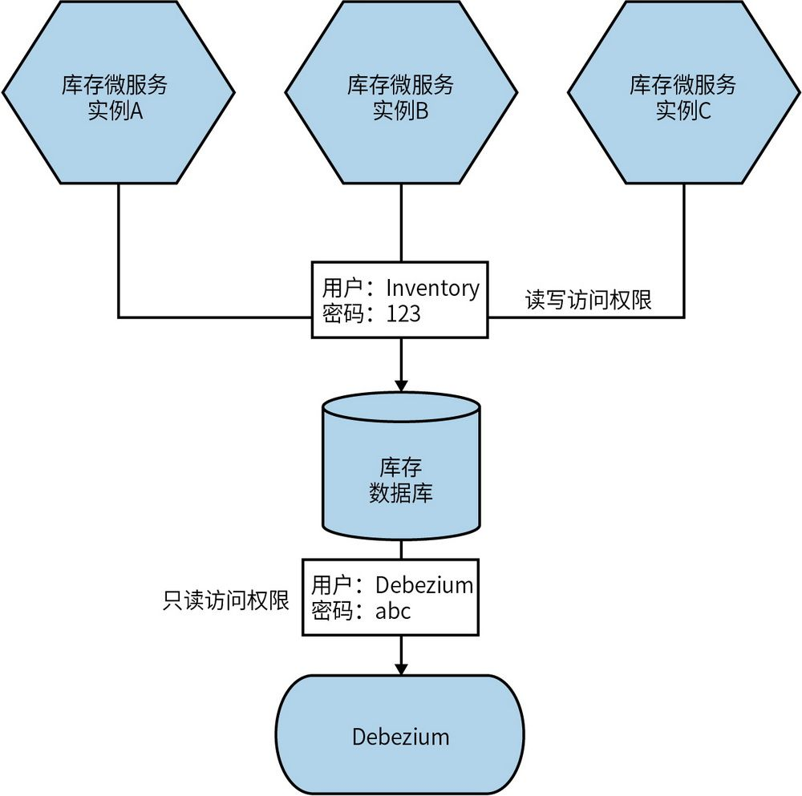
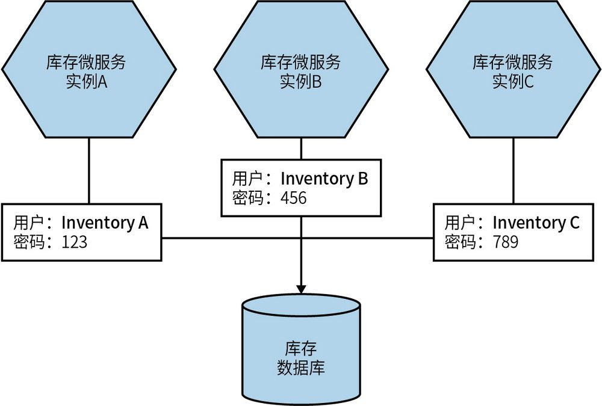
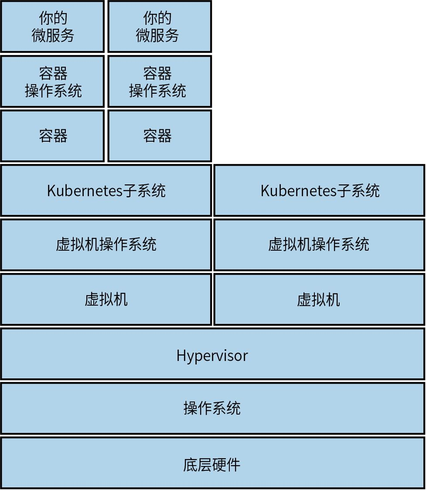
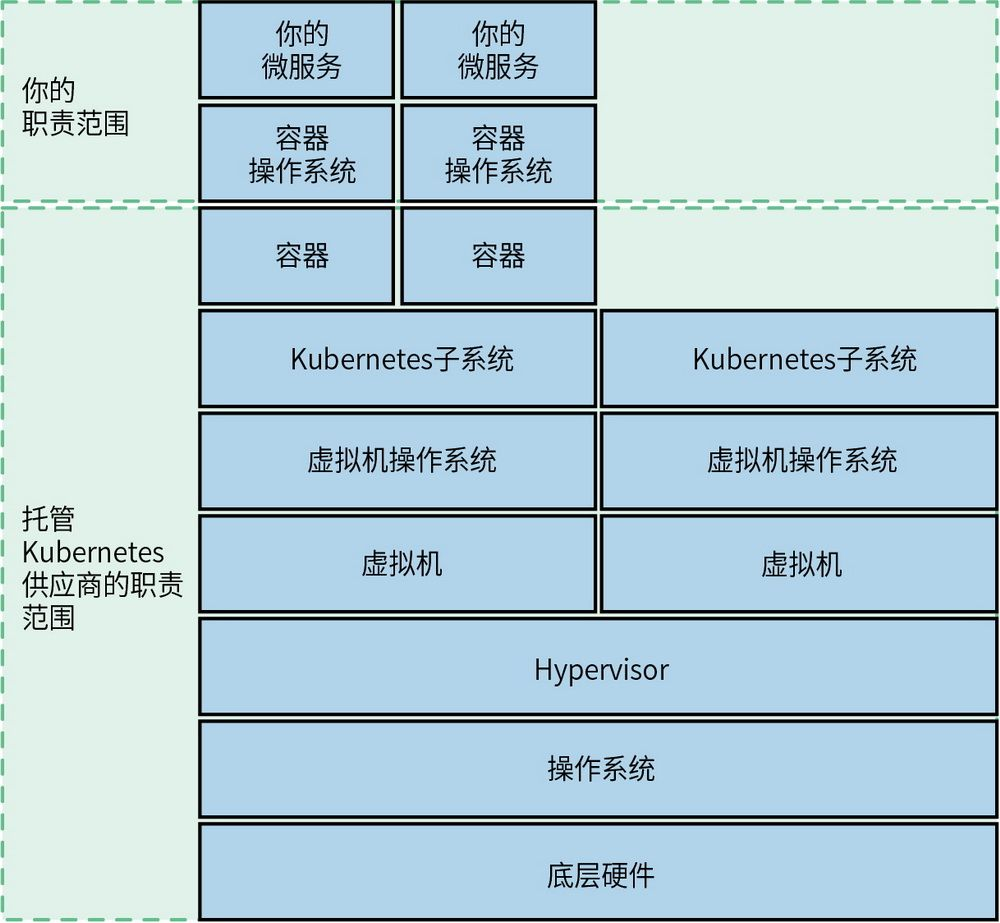
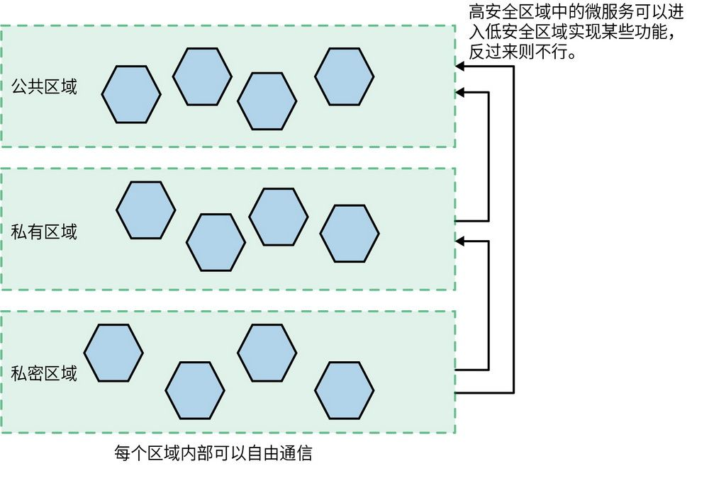
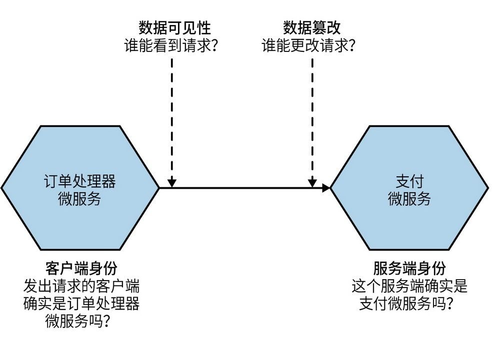
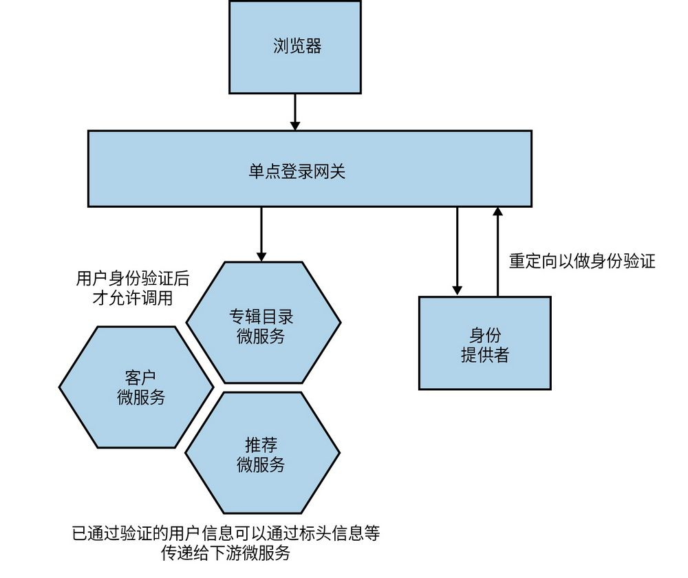
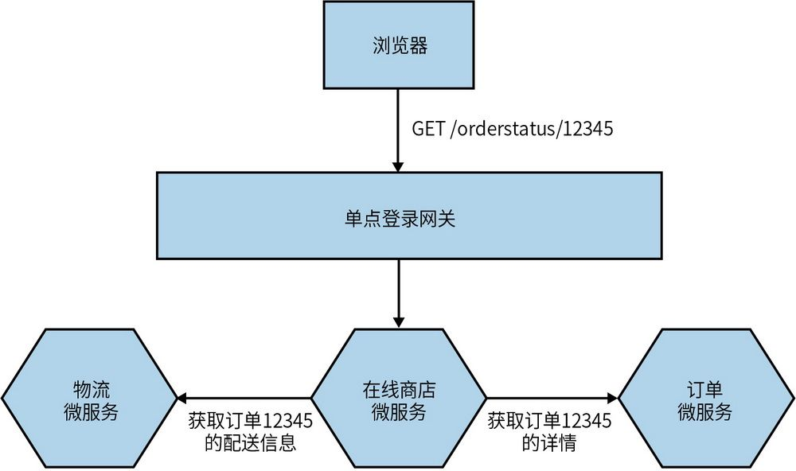
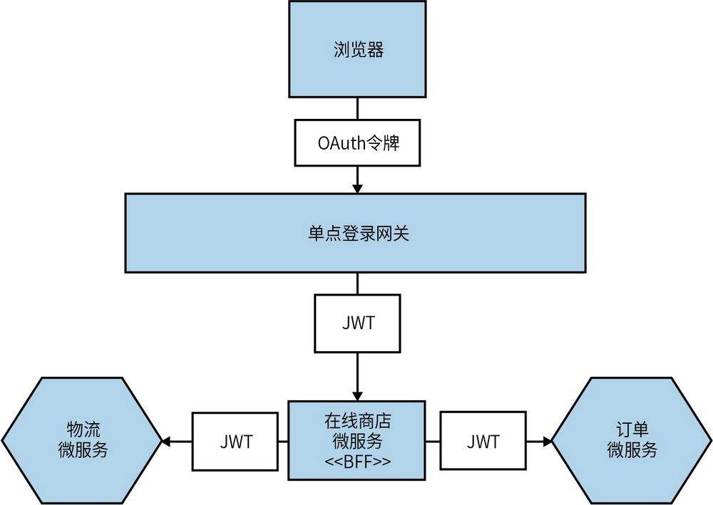

## 第11章 安全

在本章的开头，我想强调一下，我不认为自己是应用安全领域的专家。我希望自己即便是非专业人士，也能具有安全意识。换句话说，我希望学习目前尚不了解的事物，并认识到了自己的局限所在。尽管在不断学习这一领域的知识，但我仍然发现还有很多未知之处。当然，这并不意味着自学就毫无意义——在过去的10年中，我所学到的有关这一领域的东西让我成了一个更为高效的开发人员和架构师。

本章将重点介绍对于在微服务架构领域的开发人员、架构师或运维工程师来说最有价值的安全知识。在应用安全领域，即使身边有专家提供支持，对这些主题的了解仍然非常重要。就像开发人员需要了解更多关于测试或数据管理的知识一样，对安全问题有一个普遍认识至关重要，因为这有助于在构建软件之初就将安全性构建其中。

在将微服务与非分布式架构进行比较时，我们发现了一对有趣的矛盾。一方面，现在有更多的数据在网络上传输，而以前这些数据只会保留在一台机器上。而且由于架构运行在更加复杂的基础设施上，因此系统面临的攻击面要大得多。但另一方面，微服务架构也提供了更多机会来进行深度防御和访问控制，潜在地增加了系统的弹性并降低了攻击发生时的影响。这个明显的悖论——微服务既可以使系统更不安全，又可以使其更加安全——实际上只是一种微妙的权衡。我希望在阅读完本章后，你会站在这种权衡的正确一侧。

为了帮助你在微服务架构的安全性方面找到适当的平衡，本章将涵盖以下主题。

**核****心****原****则**

有助于构建更安全的软件的基本概念。

**五****大****网****络****安****全****功****能**

身份识别、保护、检测、响应和恢复——应用安全的五大关键功能概述。

**应****用****安****全****的****基****础**

应用安全的一些具体的基本概念，以及它们在微服务中的应用，包括凭证和密钥、补丁、备份和重建。

**隐****式****信****任****与****零****信****任**

构建可信微服务运行环境的不同方法，以及它们对安全相关活动的影响。

**数****据****保****护**

如何保护通过网络传输的数据和存储在磁盘上的数据。

**身****份****验****证****和****鉴****权**

单点登录（SSO）在微服务架构中的工作原理、中心化与去中心化鉴权模型以及JWT在其中的作用。

### 11.1 核心原则

通常在讨论微服务安全性的时候，人们就开始谈论复杂的技术问题，比如JWT的使用或双向TLS的使用（本章将在后面探讨这些主题）。但是，安全性问题在于，安全与否取决于系统中最不安全的方面。打个比方，你为了保障家里的安全，把所有的注意力都放在了给前门装防撬锁，并配上灯光和摄像头防止恶意入侵，但是你没考虑敞开的后门，这显然是错误的。

因此，我们更需要关注应用安全的基本方面，哪怕了解得不那么深入，也需要先找到那些需要注意的众多安全问题。后文将探讨这些核心问题是如何在微服务环境中变得更复杂（或更简单）的，但它们也应该普遍适用整体的软件开发。对于那些想要直接阅读“有用”的东西的人来说，请确保不要过于关注如何保护前门而忽略了后门。

#### 11.1.1 最小权限原则

在向个人、外部或内部系统，甚至自己的微服务授予访问权限时，我们应特别注意授予何种访问权限。最小权限原则旨在授予执行功能所需的最低的访问权限，并仅在需要时授予该权限。这种方法的主要优点在于，如果攻击者截获了凭证，那么它可以确保这些凭证只为其提供尽可能有限的访问权限。

例如，如果微服务只能以只读方式访问数据库，则获得该数据库访问权限的攻击者也只能获得只读访问权限，且只能访问该数据库。如果数据库凭证在被截获之前过期，则凭证无效。这一概念也可应用于限制特定方与哪些微服务进行通信。

正如本章后面所述，最小权限原则还可以扩展到控制访问的时间范围，从而进一步减少在发生安全威胁时可能发生的不良后果。

#### 11.1.2 深度防御

我所居住的英国到处都是城堡。这些城堡从侧面展现了英国的历史。它们让我们回想起人们努力保护自己的财产免受敌人侵害的历史。有时，城堡要针对不同的敌人而特别设计——像我所在的肯特郡附近的许多城堡，是为了防御法国的沿海入侵设计的。
	 无论出于何种原因，城堡都可以成为深度防御原则的一个很好的例子。

如果攻击者找到了破坏保护机制的方法，或者这些机制只能防御特定的攻击类型，那么单一的保护机制会变得毫无效果。比如，可以想象一座海边的防御堡垒，它只有一堵墙面向大海，而对来自陆地的攻击毫无防御能力。相比之下，附近的多佛城堡设计了多重保护措施，首先，城堡建在山丘上，从陆路入侵十分困难。同时，城堡也不止一道墙，而是两道。即便攻破第一道墙，攻击者仍须面对第二道墙的挑战。此外，城堡还有一座庞大壮观的要塞塔，它又是另一道防线。

在构建应用的安全保护时，我们也必须遵循类似的原则。为了抵御攻击者，必须构建多种不同的保护措施。使用微服务架构可以在更多的地方保护我们的系统。将所构建应用的功能拆分为不同的微服务并限制它们的功能范围，就是在应用深度防御原则。我们还可以在不同的网段上运行微服务，实现基于网络的保护措施，并采用多种技术构建和运行这些微服务，从而防止零日漏洞影响整个系统。

与单进程单体应用相比，微服务提供了更多的深度防御能力，因此它们可以帮助组织构建更安全的系统。

**安****全****控****制****措****施****的****类****型**

在考虑可以采用哪些安全控制措施以保护系统时，我们可以将安全控制措施分为以下几种。
	 

**预****防****式****控****制**

阻止攻击事件的发生，这包括安全存储机密信息、加密静态数据和传输中的数据，以及实施适当的身份验证和鉴权机制。

**检****测****式****控****制**

提供攻击正在发生或已经发生的警报。防火墙和入侵检测服务就是很好的例子。

**响****应****式****控****制**

在攻击发生期间或攻击发生之后做出响应，这包括用于自动重建系统的机制、用于恢复数据的有效备份，以及在攻击发生后制定适当的沟通计划。

要正确保护系统安全，通常需要综合使用这3种类型的措施，且每种类型可能需要采用多种方式来实现。回到城堡的例子，我们可能有多道城墙，代表了多种预防类措施。我们可能会设置瞭望塔和信标系统，以便及时发现攻击。我们还可以让一些木匠和石匠待命，以便攻击发生后加固大门或城墙。当然，你不太可能以建造城堡为生，所以本章的后面将会给出如何采取这几类措施来保护微服务架构的实例。

#### 11.1.3 自动化

本书多次涉及自动化这一主题。由于微服务架构有较多的架构组件，因此自动化是应对日益复杂的系统的关键。同时，为了提升交付速度，自动化也是必不可少的。计算机在执行重复性任务方面，比人类表现更出色——它们速度更快、效率更高（且更稳定）。此外，计算机还可以减少人为错误，更容易实施最小权限原则——例如，我们可以为特定脚本分配特定的权限。

正如本章将要阐述的，自动化有助于在故障发生后让系统快速恢复正常。我们可以利用它来撤销和轮换安全密钥，还可以利用工具更轻松地检测潜在的安全问题。与微服务架构的其他方面一样，自动化将在安全方面提供极大的帮助。

#### 11.1.4 在交付过程中构建安全性

与软件交付的很多方面一样，安全性往往在事后才被重视。至少从历史上看，提升系统安全性通常是在编写代码之后才被考虑的事情，但这样做可能会导致大量的返工情况。安全性也经常被视为影响软件交付的障碍。

在过去的20年中，我们在测试、易用性和可运维性方面也遇到了相似的问题。这些方面的交付通常是独立进行的，通常发生在大量的代码编写完成之后。我的一位老同事Jonny Schneider曾将实现软件的易用性比作“你要不要来点儿薯条？”的心态。换句话说，易用性是事后思考的东西，就像在“主菜”上面随意撒的东西。
	 

但现实是，不具备易用性、安全性，无法正常运行或存在错误的软件无论如何也不能被称为真正的“主菜”——充其量它只是一个有缺陷的产品。我们已经在将测试引入交付流程中取得了进步。正如在运维方面（DevOps）和易用性方面所努力的那样，安全性在这方面也不应该被排除在外。我们需要确保开发人员具有广泛的安全意识，让专业人员在必要时融入交付团队，并不断改进工具以便将安全性思考纳入软件中。

在拥有更多自主权的业务流团队中，这可能会带来一些挑战。在这样的组织中，安全专家的作用是什么？15.8节将介绍安全专家应该如何支持业务流团队，帮助微服务所有者更好地将安全性纳入软件的构建过程中，并确保在需要时能够获得正确的专业知识。

一些自动化工具可以检测系统是否存在漏洞，例如查找跨站点脚本攻击。Zed Attack Proxy（也被称为“ZAP”）就是一个很好的例子。得益于OWASP的工作启发，ZAP可以在网站上重建恶意攻击。还有一些工具可以使用静态分析来查找可能导致安全漏洞的常见编码错误，例如用于Ruby的Brakeman；还有像Snyk这样的工具，它可以检测应用所依赖的第三方库是否存在已知的漏洞。这些工具可以轻松地集成到正常的CI构建中，将它们集成到标准的代码提交流程中是一个很好的起点。当然，值得注意的是，此类工具只能帮助了解和解决局部的安全问题，例如，特定代码段中的漏洞。它们不能满足从系统整体层面上了解系统安全性的需要。

### 11.2 五大网络安全功能

基于这些核心原则，我们先来了解需要广泛实践的与安全相关的活动。随后，我们再来看看这些活动在微服务架构中是如何不同的。我比较喜欢美国国家标准与技术研究院（NIST）针对应用安全领域提供的一个五步模型，用于描述网络安全所涉及的各种活动。

·确定潜在攻击者是谁、他们试图达到什么目的，以及最容易受到攻击的位置。

·保护关键资产免受潜在黑客的攻击。

·即便做了最好的防范措施，也要持续做好检测，以便确认攻击是否真正发生。

·在发现不良事件时及时做出响应。

·在事件发生后尽快恢复。

我发现这个模型特别有用，因为它具有全面性。我们很容易将所有精力盲目地投入到保护应用中去，而忽略了先理解潜在威胁的重要性，更不用说要想出，在一个厉害的攻击者成功绕过防御措施时，你该如何应对了。

现在，让我们深入探讨这些功能，并看看与传统的单体架构相比，微服务架构是如何影响你对这些问题的处理方式的。

#### 11.2.1 身份识别

在弄清应该保护哪些方面之前，我们需要明确谁是潜在的攻击者，以及他们可能对什么感兴趣。这样站在攻击者的视角思考是很困难的，但也正是我们必须做的，只有这样才能确保我们能够将精力集中在正确的地方。威胁建模正是在考虑应用安全时首要考虑的内容。

作为人类，我们不太擅长理解风险，往往会将注意力集中在不重要的事物上，而忽略了潜在的深层次问题。在安全领域也同样如此。我们对所面临的安全风险的理解，往往受限于对系统的理解、我们的技能和经验。

在我与开发人员讨论微服务架构中的安全风险时，他们往往会谈论JWT和双向TLS等技术解决方案。他们往往寻求技术方案来解决他们熟悉的技术问题。我并不是要指责开发人员，毕竟我们所有人看待世界的方式都具有局限性。回到之前提到的类比，这就像我们在前门设置了非常安全的防护措施，而后门却开着。

在我工作过的一家公司，曾多次讨论是否需要在公司世界各地的办公室接待区安装闭路电视摄像头。事情的起因是，有未经授权的人员进入了前台办公区域，然后进入了公司网络。许多人认为，安装闭路电视摄像头不仅可以防止其他人再次入侵，而且有助于事后识别涉案人员。

这场讨论在公司内引发了员工的担忧。如果你支持安装摄像头，那你就是赞同监视员工；如果你反对，那你就是乐于见到入侵者侵入。其中一名员工，抛开了这种两极分化式的讨论方式，
	 他胆怯地说，这样的讨论也许有点误导，因为我们忽略了更大的问题——总部的前门有一个锁坏了，多年来大家在早上上班时时常发现门没有被锁住。

这则极端但真实的故事反映了我们在努力保护系统时常常面临的问题。如果我们不投入足够的时间去全面思考，就很可能忽略那些真正应该关注的最大风险点。威胁建模的目标是，了解攻击者可能想在系统中达到什么目的。他们会寻求什么呢？不同类型的恶意攻击者是想要访问不同的资产吗？想要威胁建模做得好，就要将自己置身于攻击者的视角中，从外向内思考。这种外部视角非常重要，这也是让外部参与威胁建模特别有价值的原因之一。

在考虑微服务架构时，除了被分析的架构可能更加复杂，威胁建模的核心思想并没有太大变化。发生变化的是如何将威胁建模的结果付诸实践。威胁建模实践的产出之一是安全控制措施建议清单——这些措施可能包括流程变更、技术调整或系统架构修改等内容，其中一些变更可能是跨领域的，通常会影响多个团队及其相关的微服务。有些变更可能更具针对性。但是，从根本上说，在进行威胁建模时，确实需要进行全面考虑和分析——过于局限于系统的某一小部分，比如一个或两个微服务，可能会导致错误的安全感。这最终会导致将时间集中在构建非常安全的前门上，但忽略了后门或开着的窗户。

如果你希望深入研究这个主题，我推荐Adam Shostack的著作《威胁建模：设计和交付更安全的软件》。
	 

#### 11.2.2 保护

一旦确定了最有价值和最容易受攻击的资产，我们就需要确保它们得到妥善的保护。正如我所指出的，微服务架构提供了更广泛的攻击面，因此可能需要保护的对象更多，但微服务架构也提供了更多的深度防御选项。本章的大部分内容将关注保护的各个方面，因为这是微服务架构所带来的挑战最多的领域。

#### 11.2.3 检测

在微服务架构中，检测事件会变得更加复杂。我们需要监控更多的网络并关注更多的计算机，信息来源也大大增加，进而会使检测问题变得更加困难。在第10章中，我们探讨了许多技术，比如日志聚合，它可以帮助收集信息并检测可能发生的不良事件。此外，还有一些特殊工具，比如入侵检测系统，可以用来发现不良行为。为了应对日益复杂的系统所带来的挑战，软件正在不断改进，特别是在容器领域使用的诸如Aqua等工具。

#### 11.2.4 响应

一旦发生最糟糕的情况，应该采取什么措施？制定有效的事件响应方案对于限制数据泄露所造成的损害至关重要。通常，这始于了解数据泄露的范围以及哪些数据已经暴露。如果暴露的数据包含个人身份信息，那么需要遵循安全和隐私事件响应和通知流程进行处理。这通常涉及与组织的不同部门进行沟通，在某些情况下，你可能有法律义务在发生某些特定类型的数据泄露时通知指定的数据保护官员。

许多组织由于没有妥善处理事件后果，进一步加剧了事件的影响。错误的处理方式除了对其品牌和客户关系造成损害，还经常导致经济处罚。因此，我们不仅应该了解出于法律或合规原因必须采取的措施，还应该了解在保护软件用户方面应该采取什么行动。例如，欧洲联盟发布的《通用数据保护条例》规定，必须在72小时内向相关当局报告个人数据泄露事件——这样的时间要求看起来并不苛刻。此外，一旦发生数据泄露，应该尽早告知用户。

除了和外部沟通，内部的处理方式也很关键。倡导责备文化的组织可能在重大事故发生后表现不佳，不会从中吸取教训，问题的成因也不会公开。反之，注重开放和安全的组织将更容易吸取教训，类似事件发生的可能性更小。我们在12.9节中还会讨论这一问题。

#### 11.2.5 恢复

恢复是指，在遭受攻击后让系统重新启动和运行的能力，包括采取必要的加固措施以防止问题再次发生的能力。微服务架构运行组件多，如果问题影响广泛，恢复起来会更加复杂。因此，在本章的后面，我们将探讨如何借助自动化和备份等简单的措施，帮助你按需重建微服务系统，使之尽快恢复正常运行。

### 11.3 应用安全的基础

目前，你已经了解了核心原则并对安全活动所涵盖的领域也有了一定认识。接下来，让我们探讨微服务架构中一些基础的安全主题——凭证、补丁、备份和重建。

#### 11.3.1 凭证

从广义上讲，凭证是用来授予个人（或计算机）访问某种受限资源的工具。这些资源可以包括数据库、计算机、用户账户或其他类型的资源。与等效的单体应用架构相比，微服务架构也可以由同样数量的人员来构建和维护，但会面临更多更复杂的凭证管理工作，涉及不同的微服务、（虚拟）机器、数据库，等等。这可能会导致在限制（或授权）访问权限方面出现一定程度的混乱。在许多情况下，这往往会导致一种“惰性”策略，即使用少量具有较大权限的凭证来简化管理工作。一旦这些凭证泄露，就会引发更严重的问题。

凭证问题可以分为两个关键领域。首先是系统用户（和操作员）的凭证。这些凭证通常是系统最薄弱的点，容易被恶意方当作攻击媒介，稍后我们将进一步讨论这一点。其次是机密信息——这些信息对于微服务的运行至关重要。对于这两类凭证，必须考虑轮换、撤销和限制范围等问题。

**0****1****.****用****户****凭****证**

用户凭证，例如电子邮件和密码的组合，在使用软件的过程中仍然至关重要，但是当系统遭到恶意访问时，它们也可能成为一个潜在的弱点。根据Verizon的2020年《数据泄露调查报告》（Data Breach Investigations Report），80%的黑客攻击事件使用了某种形式的凭证盗窃手段，其中包括通过网络钓鱼攻击等机制窃取凭证，或密码被强制破解等情况。

有一些关于如何正确处理密码等凭证的好建议——尽管这些建议足够简单明了，但仍然没有被广泛采纳。Troy Hunt详细描述了美国国家标准与技术研究院（NIST）和英国国家网络安全中心给出的最新建议。
	 这些建议包括使用密码管理器和长密码、避免使用复杂的密码规则，以及避免强制定期更改密码（这条有点令人惊讶）。Troy的帖子值得仔细阅读。

在当前这个API驱动系统的时代，凭证还延伸到管理第三方系统的API密钥，例如公有云服务供应商的账户。例如，如果恶意攻击者获得了对根AWS账户的访问权限，他们可能会销毁该账户中运行的所有内容。在一个极端的例子中，这样的攻击导致一家名为Code Spaces的公司倒闭，因为他们的所有资源都运行和备份在一个账户中
	 。Code Spaces声称提供“坚如磐石、安全且经济实惠的SVN托管、Git托管和项目管理服务”，这种具有讽刺意味的先例不容忽视。

一旦攻击者获得了公有云服务供应商的API密钥，即便不是销毁所有内容，他们也可能启动一些昂贵的虚拟机“挖矿”，这类操作通常不易察觉。我的一位客户曾遇到这种情况，他发现在账户被关闭之前有人偷偷支出了超过1万美元的费用。而且，事实证明，这些攻击者也知道如何实现自动化，因为有些机器人会扫描凭证并使用它们来启动被盗用的虚拟机。

**0****2****.****机****密****信****息**

从广义上讲，机密信息是微服务运行所需的关键信息，这些信息也足够敏感，需要保护以免受恶意方的入侵。微服务可能需要的机密信息包括以下内容。

·TLS证书

·SSH密钥

·公共/私有API密钥对

·用于访问数据库的凭证

考虑机密信息的生命周期，我们可以梳理出有不同安全需求的机密信息管理的几个方面。

**创****建**

一开始如何创建机密信息？

**分****发**

创建机密信息后，如何确保它们被用在正确的位置（且只用在正确的位置）？

**存****储**

如何存储机密信息以确保只有授权方可以访问？

### 监控

如何知道机密信息是如何被使用的？

**轮****换**

是否可以更改机密信息而不会引发问题？

如果我们有大量的微服务，每个微服务可能需要不同级别的保护。我们需要使用工具来管理这些机密信息。

Kubernetes提供了一个内置的机密信息解决方案。虽然其功能有限，但作为Kubernetes基础安装的一部分，它可能对许多用例来说已经足够了。
	 

如果你需要更复杂的解决方案，Hashicorp的Vault值得考虑。它是一款开源工具，也提供商用方案。这是一款非常全面的机密信息管理工具。从基本的机密信息分发到生成针对数据库和云平台的限时凭证，它都可以处理。此外，Vault还支持consul-template工具以动态更新普通配置文件中的机密信息。这意味着，系统无须做出更改就可以从本地文件系统中读取机密信息，同时也能充分利用Vault进行机密信息的管理。当Vault中的密钥更新时，consul-template可以更新配置文件中的这一条目，从而允许微服务动态更改正在使用的密钥。这对于大规模凭证管理非常有用。

一些公有云服务供应商也提供该领域的解决方案，例如AWS的Secrets Manager和Azure的Key Vault。但是，一些人不喜欢在公有云服务中存储关键机密信息。再次说明，这取决于你的威胁模型。如果你认为可能出现严重问题，完全可以在所选的公有云上运行Vault，并自行维护该系统。即使公有云上存储的数据是静态的，通过适当的存储后端，仍然可以确保数据以一种加密的方式存储。这样即使外部获得了数据，也无法对其进行任何操作。

**0****3****.****轮****换**

理想情况下，凭证应该经常轮换，这样可以限制攻击者在获得凭证后造成的损害。如果攻击者获得了对AWS API公钥/私钥对的访问权限，但该凭证每周更改一次，他们最多就只有一周的时间可以使用这些凭证。当然，他们仍可以在一周内造成很大的破坏，但你应该明白这样做的意义。某些类型的攻击者喜欢长时间潜伏在系统内，收集更多有价值的数据，并找到进入系统其他部分的办法。如果他们使用被盗的凭证访问系统，而这些凭证在被大规模使用之前就过期了，你至少还有机会阻止他们的活动。

一个操作员轮换凭证的绝佳例子是生成用于AWS的有时限API密钥。许多组织现在为员工动态生成API密钥，其中公钥和私钥对只在短时间内有效——通常不超过一个小时，这让生成的可以执行系统操作的API密钥，即便随后被攻击者截获，也无法再被利用。如果你不小心将该密钥对签入公共GitHub中，它过期后也毫无用处。

限时凭证的使用对系统也非常有用。Hashicorp的Vault可以为数据库生成限时凭证。与微服务实例从配置库或文本文件中读取数据库连接的静态的信息不同，它可以为微服务的特定实例动态生成用于连接数据库的凭证。

频繁轮换凭证（如密钥）也会带来麻烦。我曾与经历过因密钥轮换而导致系统停止工作的公司交流过。这通常是因为不清楚哪些部分在使用特定凭证。如果凭证的使用范围有限，轮换的潜在影响就会显著降低。但是，如果凭证的使用范围广泛，则可能很难分析出更改所导致的影响。这并不是要阻止你采用凭证轮换，而是提示其中潜在的风险。我仍然相信凭证轮换是正确的做法。最明智的解决方式可能是采用自动化工具来简化凭证轮换的过程，并限制和明确每组凭证的使用范围。

**0****4****.****撤****销**

制定政策以确保定期轮换关键凭证是减少凭证泄露影响的好方法。但如果凭证已经被坏人窃取怎么办？是否必须等到计划的下一次凭证轮换生效，才让被窃取的凭证无效？这不切实际，也不明智。理想情况下，你会希望一旦出现这种情况，我们能够自动撤销凭证并重新生成新凭证。

使用集中管理机密信息的工具可以在这方面提供帮助，但这可能需要微服务能够重新读取新生成的值。如果微服务直接从类似Kubernetes secrets存储或Vault这样的存储中读取机密信息，它可以在这些值发生更改时收到通知，从而使微服务能够使用已更改的值。或者，如果微服务只在启动时读取这些机密信息，那么就需要对系统进行滚动重启以重新加载这些凭证。所以，要想实现凭证的定期轮换，就必须首先解决微服务能够重新读取这些信息的问题。如果凭证的定期轮换执行得不错，那你已经为凭证的紧急撤销做好了准备。

**扫****描****密****钥**

不小心将私钥签入源代码库是凭证泄露给未经授权方的常见方式，这种情况发生得相当频繁，令人吃惊。GitHub会自动扫描存储库以查找某些类型的机密信息，但你也可以运行自己的扫描工具。如果你能在提交之前截获机密信息是最好的，而git-secrets工具有助于实现这一点。它可以扫描现有的提交以查找潜在的机密信息，甚至可以通过将其设置为提交钩子阻止提交。还有类似的工具gitleaks，除了支持预提交钩子和对提交进行扫描，还有一些其他功能，使其成为更有用的扫描本地文件、检查敏感信息的通用工具。

**0****5****.****限****制****范****围**

限制凭证的可用范围是实现最小权限原则的核心。这可以适用于所有形式的凭证，但限制给定一组凭证访问的范围可能非常有用。例如，在图11-1中，每个库存微服务实例都使用相同的用户名和密码来访问数据库。同时，我们还为Debezium进程提供了只读访问权限，该进程将用于读取数据，再由Kafaka发送出去，是现有ETL过程的一部分。如果微服务的用户名和密码被泄露，理论上外部可以获得对数据库的读写访问权限。但是，如果他们获得了Debezium使用的凭证，只能获得只读访问权限。

限制范围既适用于一组凭证可以访问的内容，也适用于有权访问这组凭证的人。在图11-2中，我们进行了更改，将每个库存微服务实例设置为分别获得一组不同的凭证。这意味着我们可以独立轮换每个凭证，或者在其中一个实例受到攻击时只撤销该凭证。有了具体的凭证，也可以更容易地找出凭证被截获的位置和方式。另外，为微服务实例设置唯一可识别的用户名还有其他好处，例如，更容易追踪是哪个实例导致了昂贵的查询。

▲图11-1：限制凭证的可用范围以限制滥用的影响

图11-2：库存微服务的每个实例都有自己的数据库访问凭证，这进一步限制了访问权限

正如之前所介绍的，大规模、细粒度的凭证管理会非常复杂。如果你确实想采用这种方法，某种形式的自动化是必不可少的——像Vault这样的机密信息管理工具可以成为实现这些方法的理想方式。

#### 11.3.2 打补丁

2017年发生的Equifax数据泄露事件说明了及时打补丁的重要性。黑客利用了Apache Struts中的一个已知漏洞，成功地未经授权访问了Equifax所持有的数据。由于Equifax是一家征信机构，所以这些信息尤其敏感。最终，有超过1.4亿人的数据在此次事件中被泄露。Equifax最终不得不支付大约7亿美元的和解金。

在数据泄露的几个月前，Apache Struts中的漏洞已经被识别，维护者发布了修复此问题的新版本。但是不幸的是，即使在攻击发生前几个月就有新版本可用，Equifax还是没有及时升级到该软件的新版本。如果Equifax及时升级了软件，攻击几乎不可能成功。

随着我们部署的系统越来越复杂，及时进行补丁更新的问题也变得更加复杂。我们需要变得足够成熟，以更好地处理这个基础问题。

图11-3显示了典型的Kubernetes集群下的基础设施和软件层。如果是自行运行所有这些基础设施，那么你就需要自己负责管理和更新所有这些层。你对当前的补丁更新工作有多大的信心？如果你将其中的一些工作外包给公有云服务商，你至少可以减轻一些负担。

图11-3：现代基础设施中的不同层需要维护和打补丁

例如，如果使用一个主流公有云服务供应商提供的托管的Kubernetes集群，会大大减少自己承担的责任范围，如图11-4所示。

图11-4：将这个堆栈的一些层外包可以降低复杂性

在这里，容器给我们带来一个有趣的问题。我们一般认为给定的容器实例是不可改变的。但容器不仅包含了我们的软件，还包含操作系统。你是否知道容器是如何创建的？容器是基于镜像的，而这个基础镜像可以扩展其他镜像。你能确定使用的基础镜像没有已知漏洞吗？如果容器实例有6个月没有做过更新，那么其操作系统可能6个月都没有打安全补丁。这同样会导致一系列的安全问题。这也是为什么像Aqua这样的公司提供工具来帮助你分析正在运行的生产容器，以便了解需要解决的安全问题。

当然，这一结构的最顶层是应用程序代码。它们是不是最新的？这不仅仅指我们自己编写的代码，还包括第三方代码。第三方库中的一个漏洞会使应用容易受到攻击。在Equifax数据泄露的案例中，未修补的漏洞实际上是在Struts（一个Java Web框架）中。

全面确定哪些微服务和存在已知漏洞的库有关可能非常困难。在这方面，我强烈建议使用Snyk或GitHub代码扫描等工具，它们可以自动扫描第三方依赖项，并在发现微服务链接到具有已知漏洞的库时发出告警。如果发现漏洞，它可以发出拉取请求以更新到最新的补丁版本。你甚至可以将其集成到CI流程中，如果微服务链接到有问题的库，微服务构建就会失败。

#### 11.3.3 备份

有时候我觉得备份就像使用牙线，很多人都说他们在用，但实际上并没有。我觉得没有必要详细解释为什么要备份，简单来说就是：你应该备份，因为数据有价值，你不想丢失数据。

数据比以往任何时候都更有价值，但有时我会思考技术的进步是否导致备份的优先级降低了。磁盘比以前更可靠。数据库可能已具有内置的复制功能以避免数据丢失。有了这样的系统，我们可以说服自己不需要备份。但是，如果发生灾难性故障，整个Cassandra集群丢失了，怎么办？或者如果一个编码错误导致应用删除了有价值的数据怎么办？备份仍然像以往一样重要。所以，请备份你的关键数据。

随着微服务部署的自动化，我们不需要进行完整的服务器备份，因为我们可以从源代码重建基础架构。所以，备份不需要复制整个机器的状态，而是将重点放在备份最有价值的业务状态数据上。这意味着备份重点仅限于数据库中的数据或应用程序的日志。使用适当的文件系统技术，可以在不引起明显服务中断的情况下对数据库数据进行近乎即时的块级克隆。
	

**避****免****“****薛****定****谔****的****备****份****”**

在创建备份时，需要避免我所说的“薛定谔的备份”
	 。这种备份可能是真实可用的备份，但也可能是虚假备份。除非真正尝试恢复数据，否则你无法知道它是否真的是有效备份
	 ，还是只是写入磁盘的一堆二进制数据。避免此问题的最佳方法是通过实际恢复来验证备份的可用性。在软件开发过程中可以定期还原备份，例如，使用生产备份来构建性能测试数据。

关于备份的“传统”指导意见是将备份保存在异地，其思路是如果它们被保存在其他地方，那么办公室或数据中心发生的事故不会影响这些备份。但是，如果应用部署在公有云中，那么“异地”是什么意思呢？重要的是，备份的存储方式应尽可能与核心系统隔离开，以确保核心系统的问题不会影响备份。我们之前提到的Code Spaces公司有备份，但这些备份存储在AWS的同一账户中，而该账户受到了攻击。如果应用运行在AWS上，仍然可以在云中存储备份，但应该将其存储在单独的账户和云资源中。你甚至可以考虑将备份存储在不同的云区域，以降低区域范围问题的风险，或者可以将备份存储在其他供应商那里。因此，请确保备份关键数据，将这些备份存储在与主要生产环境分开的系统中，并通过定期恢复备份来确保备份的有效性。

#### 11.3.4 重建

我们可以尽最大努力确保恶意攻击者不会进入我们的系统，但如果他们真的得逞了怎么办？通常，事故发生后第一时间要做的最重要的事是，让系统重新启动并运行起来，但要先确保删除了未经授权的访问权限。但是，这并不总是容易做到。我记得多年前，我们的一台机器被rootkit攻击了。rootkit是一组旨在隐藏未授权方活动的软件，这是攻击者经常使用的方式，他们希望隐藏踪迹，以便有时间探索系统。在这个案例中，我们发现rootkit更改了核心系统命令，如ls（列出文件）或ps（显示进程列表）以隐藏外部攻击者的踪迹。我们将机器上运行的程序的哈希值与官方软件包进行对比时才发现这一点。最后，我们不得不从零开始，重新安装整个服务器。

简单地清空现存服务器，然后进行完全重建，不仅在已知攻击之后有效，而且在降低持续性攻击的影响方面也非常有效。你可能没有意识到系统中是否存在恶意攻击者，但如果你定期重建服务器并轮换凭证，可能会在你未必察觉到的情况下，极大地限制了他们的潜在影响。

是否能够重建已有微服务，甚至整个系统，取决于自动化和备份的质量。如果你能根据存储在源代码管理中的信息，从零开始部署和配置每个微服务，那么你已经有了一个很好的基础。当然，你需要将这一点与坚实的数据备份和恢复过程相结合。与备份一样，确保微服务自动部署和配置正常工作的最佳方法就是反复实践，而最简单的方法就是使用与每次部署相同的流程来重建微服务。这当然是大多数基于容器的部署过程的工作原理。你部署一组新容器，其中运行着新版本的微服务，然后关闭旧容器。这一操作过程的常规化会让重建成为小事一桩。

需要特别注意的是，在Kubernetes这样的容器平台上进行部署时，你可能经常会移除并重新部署容器实例，但底层的容器平台呢？你是否有能力从头开始重建？如果使用的是完全托管的Kubernetes供应商，那么启动一个新集群可能不会太困难，但如果是你自己安装和维护集群，那么这可能是一项相当费力的工作。
	

能够以自动化方式重建微服务并恢复其数据，不仅有助于在遭受攻击后恢复系统，而且还有助于使你的部署工作更加顺畅，对开发、测试和生产运维产生积极的影响。

### 11.4 隐式信任与零信任

微服务架构涉及各种组件之间的大量通信。人类用户通过用户界面与系统进行交互。这些用户界面又会调用微服务，微服务最终会调用更多的微服务。在应用安全方面，我们需要考虑所有这些接触点之间的信任问题：我们如何建立可接受的信任水平呢？我们将稍后探讨这个话题，这涉及人类用户和微服务的身份验证和鉴权。但在此之前，我们应该先考虑一些关于信任的基本模型。

我们是否应该信任网络中运行的一切吗？还是应该对一切持怀疑态度？我们先来看看两种不同的思维方式——隐式信任和零信任。

#### 11.4.1 隐式信任

我们的第一个选择可能是假设从边界内部发起的对服务的任何调用都是隐式信任的。

根据数据的敏感性，这可能没问题。一些组织试图确保其网络边界的安全，因此他们认为当两个服务进行通信时不需要采取其他措施。但是，如果攻击者侵入网络，情况可能会非常糟糕。比如攻击者决定拦截和读取正在发送的数据，或更改数据，而你并未察觉；甚至攻击者假装成正在通信的对象，而你对此一无所知。

这是迄今为止我在组织中看到的最常见的内部信任形式。我并不是说这是好事。对于大多数采用这种模型的组织来说，我担心隐式信任模型不是他们有意识的决定；相反，人们可能根本没有意识到风险。

#### 11.4.2 零信任

吉尔，我们查到电话了——是从屋子里面打来的！

——电影《惊呼狂叫》

在零信任环境中运行时，你必须假设环境已经遭到侵害——正在通信的计算机可能已经被破坏、入站连接可能来自恶意攻击者、正在编写的数据和文本可能已被读取。是不是觉得有些偏执？是的！欢迎来到零信任世界。

从根本上说，零信任是一种心态。它不是单靠产品或工具就可以奇迹般实现的东西；它是一种理念，这个理念就是，如果你正在一个可能已经存在恶意攻击者的环境中进行操作，那么你必须采取措施以确保仍然可以安全地完成操作。实际上，“边界”的概念对于零信任毫无意义，因此，零信任常常也被称为“无边界计算”。

由于假设系统已被入侵，所以必须正确评估来自其他微服务的所有入站请求。这些来自其他微服务的请求，真的可以信任吗？同样，所有数据都应当安全存储，所有加密密钥都应当安全保存，由于我们必须假设有人在监听，因此系统传输的所有敏感数据都需要加密。

有趣的是，如果正确地树立了零信任心态，你就可以开始做一些看起来很奇怪的事情。

在“零信任”下，你可以做出某些违反直觉的访问行为，例如允许从互联网访问内部服务，因为你将内部网络置于与互联网同等的信任程度（也就是说，根本不值得信任）。
	 

——Jan Schaumann

Jan在这里的观点是，如果你认为网络上没有什么是值得信任的，信任必须被重新审视，那就不会再受到传统信任模式的限制，反而可以更自由地构建和管理微服务——因为你认为系统中的任何部分都有可能受到攻击。但请记住，零信任不是通过打开开关就可以启动的东西，它是决定做事方式的基本原则。零信任应该影响你在构建和发展系统时的决策，这也意味着你需要不断投资时间、资源和努力以保证系统安全。

#### 11.4.3 这是个范围

我并不是暗示我们需要在隐式信任和零信任之间做出一个艰难的选择。系统中对其他方信任（或不信任）的程度可以根据所访问信息的敏感性而变化。例如，你可能决定在处理包含个人身份信息（PII）的微服务时采用零信任原则，但在其他领域可能宽松一些。同样，在实施任何安全控制措施并考虑其成本时，都应该根据威胁模型来确定（和驱动）。你对威胁及其影响的理解会影响你决定是否采用零信任的决策。

举个例子，我曾经合作过的MedicalCo公司是一家管理个人敏感医疗保健数据的公司。该公司根据一个相当明智且简单的方法，对所持有的所有数据信息进行了分类。

**公****开****数****据**

可以与任何外部方自由共享的数据。这些信息实际上属于公共区域。

**私****有****数****据**

只有已登录用户才能访问的信息。由于授权限制，对这些信息的访问可能会受到进一步限制，比如客户购买的医疗保险计划等信息。

**私****密****数****据**

有关个人的极其敏感的信息，只有在极其特殊的情况下才能被相关个人以外的其他人访问。这包括个人的健康数据等信息。

微服务可以根据其涉及的最敏感的数据进行分类，且必须在与数据匹配的环境（区域）中运行，如图11-5所示。微服务的运行区域受限于它所使用的敏感度最高的数据。例如，运行在公共区域的微服务只能使用公开数据；使用公开数据和私有数据的微服务必须在私有区域运行，而访问私密数据的微服务必须始终在私密区域运行。

图11-5：根据微服务处理的数据的敏感性，将微服务部署到不同的区域

每个区域内的微服务可以相互通信，但无法直接访问安全性更高的区域中的数据或功能。

不过，安全性更高的区域中的微服务可以访问在安全性较低的区域中运行的功能。

在这里，MedicalCo公司提供了灵活性，使每个区域可以实现其不同安全要求的访问方式。安全性较低的公共区域可以在更接近隐式信任的环境中运行，而秘密区域则假定为零信任。可以说，如果MedicalCo公司要在整个系统中采用零信任原则，就不需要将微服务部署到不同的区域，因为所有微服务间的调用都需要额外的身份验证和鉴权。但从深度防御的角度来说，考虑到数据的敏感性，我仍会考虑这种分区方法。

### 11.5 数据保护

当将整个软件拆分为微服务时，数据在系统中的流动性将比以前更强。它不仅在网络上传输还被存储在磁盘上。如果我们不小心，让更多有价值的数据分布在更多的地方可能会成为保护应用安全的噩梦。接下来，我们将详细地探讨如何保护传输中的数据和静态存储的数据。

#### 11.5.1 传输中的数据

保护措施的性质在很大程度上取决于所选通信协议的性质。例如，如果使用的是HTTP，那么很自然地会考虑将HTTP与传输层安全协议（TLS）结合使用，本节后面将详细讨论这个主题；但如果使用其他协议，例如通过消息代理进行通信，那么可能需要考虑该特定技术对保护数据传输的支持。我认为，与其查看该领域中大量技术的细节，不如从更通用的角度考虑保护传输中数据的4个主要领域，并研究这些问题如何在HTTP的示例中解决。将这些理念映射到所选的任何通信协议应该不会太困难。

图11-6显示了数据在传输中的4个主要领域。

图11-6：数据传输中的4个主要领域

让我们详细地看看每一个领域。

**0****1****.****服****务****端****身****份****问****题**

要检查的最简单的事情是，确保与目标服务端通信的身份与其声称的身份一致。这一点尤其重要，因为理论上恶意攻击者可以冒充网络终端，并截取你发送的任何有用数据。长期以来，在公共互联网上验证服务端身份一直是一个问题，这导致人们更广泛地使用HTTPS。在某种程度上，我们受益于对公共互联网的保护工作，因为这些工作也可以用来保护内部网络的HTTP终端。

一般而言，当人们谈到HTTPS时，通常是指使用带有TLS的HTTP 
	 。大多数通信都是通过公共互联网进行的，而公共互联网上存在着各种潜在的攻击途径（如未加密的WiFi、DNS污染等），因此确保我们所访问的网站的真实性是非常重要的。通过使用HTTPS，浏览器可以查看相应网站的证书，确保其是有效的。这是一种明智的安全机制——“无处不在的HTTPS”已经成为公共互联网的口号，这是有充分理由的。

值得注意的是，即使底层使用HTTP协议的通信协议，也可以受益于HTTPS。因此，通过HTTPS运行SOAP或gRPC等通信协议是轻而易举的，且仍然可以保证其安全性。除了确认是在与期望的网络终端通信之外，HTTPS还提供了额外的保护措施。我们将对这些保护措施进行探讨。

**0****2****.****客****户****端****身****份**

在这种背景下，当提到客户端身份时，我们指的是发起调用的微服务。因此，我们需要确认和验证上游微服务的身份。稍后我们将看看如何验证人类用户的身份。

我们可以通过多种方式来验证客户端身份，其中一种方式是要求客户端在请求中发送一些信息，告知其身份，例如使用某种共享密钥或客户端证书来签署请求。当服务端必须验证客户端身份时，我们自然希望这个过程尽可能高效——我见过一些解决方案（包括API网关供应商提供的解决方案）在涉及服务端时，必须调用中央服务来检查客户端身份。考虑到延时所带来的影响，这种做法是相当荒谬的。

我很难想象在不验证服务端身份的情况下去验证客户端身份。因为通常情况下，两者身份需要同时验证，且最终会实现某种形式的双向认证。通过双向认证，双方完成对彼此身份的验证。因此，在图11-6中，订单处理器微服务对支付微服务进行了身份验证，而支付微服务对订单处理器微服务也进行了身份验证。

我们可以通过使用双向TLS来实现这一点，在这种情况下，客户端和服务端都使用证书。在公共互联网上，验证客户端设备的身份通常不如验证使用该设备的人的身份重要。因此，在这种情况下，很少使用双向TLS。但是，在微服务架构中，尤其是可能在零信任环境中运行时，使用双向TLS的情况更为常见。

一直以来，实现诸如双向TLS之类的方案所面临的挑战，主要在于工具。如今，这已经不再是一个问题。像Vault这样的工具可以使分发证书更加容易。为了简化双向TLS的使用，人们开始使用服务网格。这也是实现服务网格的主要原因之一。5.10节对此进行了探讨。

**0****3****.****数****据****可****见****性**

当数据从一个微服务发送到另一个微服务时，是否有人可以查看这些数据？对于一些信息，例如Peter Andre专辑的价格，我们可能不太关心，因为这些数据已经在公开领域中。但对于包含PII的数据，我们需要确保其受到保护。

使用传统的HTTPS或双向TLS时，数据对于中间人不可见，因为TLS对传输的数据进行了加密。但如果在特定场景下，你希望数据可以开放出来，这样加密的传输就会遇到问题——例如，像Squid或Varnish这样的反向代理只能够缓存HTTP响应，无法缓存HTTPS响应。

**0****4****.****数****据****篡****改**

可以想象，在很多情况下，篡改正在传输的数据会带来严重后果，例如，更改发送的金额。以图11-6为例，我们必须确保潜在的攻击者无法更改从订单处理器微服务发送到支付微服务的请求。

通常，让数据不可见的保护方式也同时可以确保数据不会被篡改（例如，HTTPS就是这样做的）。但是，对于必须以明文方式传输的数据，我们同样希望确保数据不会被篡改。对于HTTP，使用基于哈希的消息验证代码（hash-based message authentication code，HMAC）是其中一种方法，它可以对传输的数据进行签名。使用HMAC，会生成哈希值并与数据一起发送，接收方可以根据数据检查哈希值以确认数据未被修改。

#### 11.5.2 静态数据

保护静态数据的安全是一项责任，尤其是当这些数据是敏感数据时。我们希望采取一切可能的措施来确保攻击者无法破坏网络，也无法通过攻击应用或操作系统来访问底层数据。但是，我们必须做好准备，以防万一，这就是深度防御的重要性所在。

我们听说过的许多知名的安全漏洞事件，都涉及攻击者获取静态数据后还可以读取这些数据。这要么是因为数据以未加密的形式存储，要么是因为用于保护数据的机制存在根本性缺陷。

保护静态数据的机制多种多样，但有一些通用原则必须牢记。

**0****1****.****不****另****辟****蹊****径**

在某些情况下，你可以将加密数据的工作外包给现有的软件，例如利用数据库内置的加密支持。但是，如果需要在系统中进行数据加密和解密，请确保使用的是众所周知且经过验证的实现。编写自己的加密算法或尝试实现他人的加密算法通常是破坏数据加密的最简单的办法。在各种编程语言中，都有受欢迎的加密算法的实现受到审查并接受定期的修补。请直接使用这些实现，并订阅所选技术的电子邮件列表和建议清单，以确保及时了解最新的漏洞修复和软件更新的信息。

为了保护密码，你绝对应该使用被称为“加盐哈希法”的技术。这将确保密码永远不会以纯文本形式存储。即使攻击者能够暴力破解哈希值，他们也无法自动读取其他密码。
	 

不当的加密实现可能比不加密还糟糕，因为虚假的安全感会使人们在重要的地方放松警惕。

**0****2****.****选****择****目****标**

简单假设所有内容都需要加密，这可以在一定程度上简化安全工作，因为不需要考虑哪些数据应该受到保护，哪些不需要。但即便如此，你仍然需要考虑能放入开发日志的数据有哪些。此外，全面加密会大幅度增加计算开销，需要更强大的硬件支持。特别是在进行数据库迁移以重构架构时，情况会更具挑战性。根据正在进行的变更，数据可能需要解密、迁移和重新加密。

通过将系统细分为更小粒度的服务，你会发现某些数据存储可以完全加密，但这种情况不太常见。将加密的范围限制在已知的一组数据表上是更明智的方法。

**0****3****.****适****度****收****集**

随着磁盘空间变得更加便宜、数据库功能不断增强，我们可以更轻松地捕获和存储大量信息。这些数据非常有价值，不仅对将数据视为重要资产的企业有价值，而且对重视自身隐私的用户也同样有价值。与个人身份有关的数据，或可用于推断个人信息的数据，我们处理起来必须慎之又慎。

但是，要想让我们的生活更轻松一点呢？为什么不尽早清除尽可能多的可用于识别个人身份的信息呢？例如，在记录用户请求时，是否需要永久存储完整的IP地址，或者是否可以用“x”替换最后几位数字？是否需要存储个人的姓名、年龄、性别和出生日期以向他们提供产品优惠，还是存储他们的年龄范围和邮政编码就足够了？

适度收集数据有很多好处。首先，如果不存储数据，就没有人能够窃取它。其次，如果不存储数据，也没有人（比如政府机构）会要求你提供它。

德语“Datensparsamkeit”代表了这一概念。它源于德国的隐私法，概括了仅存储满足业务运营或遵守当地法律所必需的最少信息这个概念。这显然与存储越来越多信息的趋势相反，但认识到应该适度收集数据已经是一个良好的开端了。

**0****4****.****一****切****关****乎****密****钥**

大多数加密形式涉及结合使用一些密钥和适当的算法，以创建加密数据。要想解密数据以读取其内容，授权方需要访问密钥。这些密钥可以是相同的，（在使用公共密钥加密的情况下）也可以是不同的。那么，这些密钥应该存储在何处？如果之所以加密数据是因为担心有人窃取整个数据库，但将用于加密的密钥存储在同一数据库中，那么这等于徒劳无功。因此，我们需要将密钥存储在其他地方。那应该存储在哪里呢？

一种解决方案是使用单独的安全设备，它可以负责加密数据和解密数据。另一种解决方案是，使用独立的密钥保管库，服务在需要密钥时可以访问该库。密钥管理的生命周期（以及访问权限的更改）是至关重要的操作，专门的系统可以帮助你管理。这就是HashiCorp的Vault可以派上用场的地方。

一些数据库甚至包含内置的加密支持，例如SQL Server的透明数据加密，它可以以透明的方式处理数据加密。即使所选的数据库包含此类功能，你也要深入研究如何管理密钥，并了解你正在防范的威胁是否真的因此得到了有效缓解。

想再次强调，这是一个复杂的问题。你要避免自己实现加密，而是要进行更深入的研究。

在首次接触到数据时就对其进行加密，而只在需要时才按需解密；同时确保数据不会被存储在任何其他地方。

**0****5****.****加****密****备****份**

备份是必要的，我们需要备份重要的数据。这似乎是一个显而易见的道理，但如果数据足够敏感，在生产环境中需要对其加密，那么对于包含相同数据的备份也需要进行加密。

### 11.6 身份验证和鉴权

在涉及与系统交互的人和事物时，身份验证和鉴权是核心概念。从安全角度讲，身份验证是确认一方是否确实是他们声称的身份的过程。通常，我们会通过要求人类用户输入用户名和密码来进行身份验证。我们假设只有用户本人知晓这些信息，因此输入这些信息的人必定是本人。当然，也存在其他更复杂的系统。现在，手机可以通过指纹或面部识别来确认用户身份。通常，当抽象地讨论被验证的是谁或什么时，我们将其称为“委托人”（principal）。

鉴权是将委托人映射到允许他们执行的操作的机制。通常，当委托人通过身份验证后，我们将获得有关他们的信息，这将用来确定委托人可以做什么。例如，我们可能会获知委托人所在的部门或办公室，系统可以使用这条信息来决定委托人可以做什么和不能做什么。

易用性非常重要——我们希望用户可以轻松地访问系统。但也不希望用户必须单独登录才能访问不同的微服务，比如访问每个微服务都需要使用不同的用户名和密码。因此，我们还需要了解如何在微服务环境中实现单点登录（single sign-on，SSO）。

#### 11.6.1 服务间验证

之前我们提到了双向TLS。除了保护传输中的数据外，双向TLS还可以实现一种形式的身份认证。当客户端使用双向TLS与服务端通信时，服务端能够验证客户端的身份，而客户端也能够验证服务端的身份——这是一种服务间的身份验证形式。除了双向TLS之外，还可以使用其他身份认证方案。一个常见的例子是使用API密钥，其中客户端需要使用密钥对请求进行哈希计算，以便服务端能够验证客户端使用的是有效的密钥。

#### 11.6.2 用户的身份验证

我们通常让用户使用熟悉的用户名和密码来验证他们的身份。但是，现在越来越多的身份认证方法采用了多种因素来进行验证，用户可以有不止一种方法来验证自己的身份。这种验证方法被称为“多因素身份验证”（multifactor authentication，MFA）
	 ，它需要用户提供一个以上的验证因素。除了提供一个以上的附加验证因素外，MFA通常还需要用户名和密码的配合。

近年来，各种类型的身份验证因素不断增加——从通过短信发送的验证码、通过电子邮件发送的验证链接，到一些专用的移动应用（例如Authy）和USB、NFC等硬件设备（如YubiKey），都是身份验证的手段。现在，生物特征识别也很常见，因为很多用户都在使用支持指纹识别或面部识别功能的硬件设备。虽然MFA已被证明是一种更加安全且得到广泛支持的身份验证方法，但它尚未成为大众市场的认证方案，我预计这种情况未来会发生改变。对于关键服务的身份验证管理或者访问特别敏感信息（例如源代码访问）来说，我认为使用MFA是必不可少的。

#### 11.6.3 常见的单点登录实现

一种常见的身份验证方法是，使用单点登录解决方案，以确保在每个会话中只需要对用户进行一次身份验证，即使在会话期间需要与多个下游服务或应用进行交互。例如，使用谷歌账户登录后，你可以同时在Google Calendar、Gmail和Google Docs中登录，尽管这些是独立的系统。

当用户尝试（例如基于Web界面）访问资源时，他们将被引导到身份提供者进行身份验证。身份提供者会要求用户提供用户名和密码，或要求使用更高级别的身份验证措施，例如MFA。一旦身份提供者确信用户通过了身份验证，身份提供者会向服务提供者提供相关信息，由服务提供者决定是否授予用户访问资源的权限。

身份提供者可以是外部托管系统，也可以是组织内部的系统。例如，谷歌提供了一个OpenID Connect身份提供者。但对于企业来说，拥有自己的身份提供者是很常见的，它们可能会链接到公司的目录服务，这些目录服务可以是轻量级目录访问协议（lightweight directory access protocol，LDAP）或Active Directory。这些系统可以存储有关用户的信息，例如用户在组织中承担的角色。通常情况下，目录服务和身份提供者是同一系统；有时它们是分开的但相互关联。例如，Okta是一个托管的SAML身份提供者，可以处理双因素身份验证等任务，同时可以链接到你的公司的目录服务作为真实信息的来源。因此，身份提供者向系统提供有关用户的信息，而系统决定该用户的行为。

SAML是一种基于SOAP的标准，虽然有一些库和工具可供支持，但它相对复杂而并不受欢迎。自第1版出版以来，由于OpenID Connect的兴起，SAML快速失宠。
	  OpenID Connect是基于谷歌和其他公司处理SSO的方式，作为OAuth 2.0的特定实现而出现的一种标准。它使用更简单的REST调用，并且由于其相对简单、受到广泛的支持，因此成为终端用户SSO的主要机制，并在企业中得到了广泛应用。

#### 11.6.4 单点登录网关

在微服务架构中，每个服务可以决定是否重定向到身份提供者，并与其进行握手，以便正确处理来自外部的任何未经身份验证的请求。显然，这意味着大量的重复工作。使用共享库可以有所帮助，但需要小心共享代码可能带来的耦合问题（有关更多信息，可参阅5.8节）。如果存在由不同技术栈实现的微服务，那么共享库也无法发挥作用。更常见的方法是，使用位于服务和外部世界之间的网关（图11-7）充当代理，而不是让每个服务管理与身份提供者握手。这个想法是，集中重定向用户行为，并且仅在一个地方执行所需的握手。

图11-7：使用网关实现单点登录

但是，我们仍需要解决下游服务如何获取委托人信息的问题，比如用户名或角色。如果使用HTTP，可以配置网关以将这些信息填充到标头。使用Shibboleth这样的工具可以实现这一点。我见过有人将它与Apache Web服务器一起使用，这种方式可以很好地处理与基于SAML的身份提供者的集成。

另一种方法是，创建一个包含有关委托人的所有信息的JWT（后面将做详细介绍）。这样做有许多好处，包括更容易在微服务之间传递。

采用单点登录网关的另一个考虑因素是，如果我们将身份验证的责任放在网关上，那么验证单个微服务在登录过程中的表现就会变得很难。还记得第9章探讨过的模拟生产环境的一些挑战吗？如果决定使用网关路由，请确保开发人员无须进行太多的工作就可以在网关后面启动他们的服务。

这种方法的最后一个问题是，它会给人一种虚假的安全感。再次强调深度防御的理念——从网络边界到子网、防火墙、计算机、操作系统和底层硬件，在上述所有方面都要实施安全措施。我见过有些人把所有的鸡蛋放在一个篮子里，过度依赖网关来处理每一步的安全措施。但我们都知道当遇到单点故障时会发生什么……

显然，这个网关可以用来处理其他事情。例如，你还可以决定在某一级别终止HTTPS、运行入侵检测，等等。但一定要小心，网关层承担越来越多的功能后，最终本身可能会成为一个庞大的耦合点，且功能越多，受攻击面就越大。

#### 11.6.5 细粒度鉴权

网关能够提供相当有效的粗粒度身份验证。例如，它可以阻止任何未登录的用户访问帮助台系统。如果网关在身份验证完成时可以提取委托人的属性，则可以据此做出更细致的决定。例如，我们通常可以将人们分组或给他们分配某些角色，通过使用这些信息可以了解他们有哪些操作权限。因此，对于帮助台系统，我们可能只允许具有特定角色（例如STAFF）的用户访问。但是，除了允许（或禁止）用户访问特定资源或终端之外，其余部分仍需要留给微服务本身来处理，它将对允许执行哪些操作做出进一步的判断。

回到帮助台系统，我们是否会允许任何员工查看任何信息和所有细节吗？更有可能的是，员工在工作中会有不同的角色。例如，CALL_CENTER组中的负责人可以查看除付款详情外所有客户的信息。该委托人还可以发起退款，但退款金额可能会受到限制。然而，具有CALL_CENTER_TEAM_LEADER角色的人可以发起更大额度的退款。

我们应该在微服务内部做出决策。我见过一些人以非常糟糕的方式使用身份提供者提供属性功能，比如设定CALL_CENTER_50_DOLLAR_REFUND这样的细粒度角色，将属于系统行为的某个特定部分的信息存储到目录服务中。这对系统维护来说是一场噩梦，且很难让服务拥有独立的生命周期，因为关于服务行为的一部分信息突然间被存储到其他地方，甚至有可能被存储到由组织中的不同部分管理的系统中。

为了满足更细粒度的授权请求，确保微服务可以获得评估这些鉴权请求的所需信息非常值得进一步讨论——稍后在讲到JWT时会重新讨论这一点。

相反，我们应该支持围绕组织运作方式建模的粗粒度角色。前面的内容提到过，要记住正在构建的软件应该与组织的运作方式相匹配。因此，我们也应该在定义用户角色时遵循这种方式。

#### 11.6.6 混淆代理人问题

使用类似SSO网关之类的方式对用户进行身份验证是相对简单的，这足以控制对特定微服务的访问。但是，如果该微服务需要额外的调用才能完成，会发生什么情况？这会出现被称为“混淆代理人问题”的漏洞。当上游方欺骗中间层执行它不应执行的操作时，就会发生这种问题。图11-8呈现了一个具体示例，它展示了MusicCorp的在线购物网站。网站基于浏览器的JavaScript用户界面，它与服务端的在线商店微服务进行通信，这是一种面向前端的后端模式。14.10节将深入地探讨这一点，但目前可以将其视为一个服务端组件，它为特定的外部接口（在此示例中，是基于浏览器的JavaScript用户界面）执行调用聚合和过滤。这里还使用了OpenID Connect对浏览器和在线商店微服务之间的调用进行了身份验证。到目前为止，一切还好。

图11-8：混淆代理人问题的一个示例

当用户登录后，他们可以单击链接查看订单详情。为了显示订单信息，我们需要从订单微服务中拉取原始订单，并获取订单的物流信息。因此，当已登录的客户单击/orderStatus/12345的链接时，该请求将被路由到在线商店微服务，然后，在线商店微服务需要调用下游的订单微服务和物流微服务来查询订单12345的详情。

但这些下游服务是否应该接受在线商店微服务的调用呢？我们可以采取隐式信任的方式：因为调用来自边界内部，所以是安全的。我们甚至可以使用证书或API密钥来确认在线商店微服务确实在请求这些信息。但这些措施足够吗？例如，已登录在线购物系统的客户可以查看自己的个人账户详情。但如果客户使用登录后的凭证，欺骗在线商店的用户界面去请求其他人的详情，该怎么办呢？

在这一示例中，如何防止客户请求不属于他们的订单呢？一旦登录，客户可以发送请求，以获取不属于他们的其他订单请求。他们可以尝试猜测订单ID，看看是否可以提取其他人的信息。从根本上说，虽然已经对相关用户进行了身份验证，但并没有进行充足的鉴权。我们希望系统的某些部分能够判断，只有当用户A要求查看自己的详细信息时，才能授予此请求权限。但是，这种逻辑应该存放在哪里呢？

#### 11.6.7 中心化上游鉴权

避免混淆代理人问题的一种方式是，在系统收到请求后立即执行所有必需的鉴权操作。在图11-8中，这意味着我们的目标是在SSO网关本身或在线商店微服务中对请求进行鉴权。这个想法是，假设被发送到订单微服务或物流微服务的请求都是被允许的。

这种上游鉴权的形式表明，系统接受了某种形式的隐式信任（而不是零信任）——物流微服务和订单微服务必须假设它们只接收被许可的请求。另一个问题是，上游实体，例如网关或类似的东西，需要了解下游微服务提供的功能，且需要知道如何限制对该功能的访问。

在理想情况下，我们希望微服务尽可能独立，以方便进行更改和推出新功能。同时，我们希望实现简单的发布，即希望实现独立部署。如果部署行为在需要部署新的微服务时，需要将某些与鉴权相关的配置应用于上游网关，那似乎就不太“独立”了。

因此，我们仍然希望将是否应授权的决策在实现请求功能的同一微服务的内部进行。这使得微服务更加独立，并且如果需要，我们仍可以选择实施零信任策略。

#### 11.6.8 去中心化鉴权

在微服务环境中，中心化的鉴权会带来一些挑战。因此，我们希望将这种逻辑放置在下游微服务中。订单微服务可以实现访问订单详情的功能，因此由该服务决定调用是否有效是合乎逻辑的。但在这种情况下，订单微服务需要获取请求方的信息。那么，我们如何将这些信息提供给订单微服务呢？

在最简单的层面上，只需将发出请求的人的标识符传递给订单微服务即可。例如，如果使用HTTP，我们可以将用户名放在标头中。但在这种情况下，如何防止恶意攻击者在请求中插入任意名称以获取所需的信息呢？理想情况下，我们需要一种方法来确保请求确实是代表经过身份验证的用户发出的，且能够传递有关该用户的其他信息，例如该用户可能隶属的用户组。

历史上有许多不同的方法来处理这个问题，包括一些让人头疼的技术，如嵌套SAML断言。不过，目前最常用的解决方案是使用JSON Web Token。

#### 11.6.9 JWT

JWT（JSON Web Token）可以将有关个体的多个声明存储到一个可传递的字符串中。这个令牌可以被签名，以确保令牌的结构未被篡改。我们还可以将其加密，以提供有关谁可以读取数据的加密保证。尽管JWT可用于通用信息交换，确保数据不被篡改，但它最常用于解决鉴权问题时的信息传输。

一旦生成签名，JWT可以轻松地通过各种协议传递。我们还可以将JWT配置为在特定时间段后过期。这种方法已经得到了广泛使用，现在有许多支持生成JWT的身份供应商，以及大量可用的JWT库。

**0****1****.****格****式**

JWT的主要负载是一个JSON结构。从广义上讲，它可以包含任何想要的内容。在示例11-1中，我们可以看到一个JWT示例。JWT标准描述了一些具有特定命名的字段（被称为“公共声明”），如果这些字段对你适用，你应该使用这些字段。例如，exp定义了令牌的过期日期。如果正确地使用这些公共声明字段，那么你使用的库才会合理地利用它们，比如在exp声明令牌已经过期时，库将拒绝这一令牌。
	 即使你不会使用所有这些公共声明，但了解它们都是什么也是有益的。你要确保这些字段不会用于自己的应用程序中，因为这可能会导致冲突，让所使用的库出现一些奇怪的行为。

**示****例****1****1****-****1** JWT的JSON负载示例

{

"sub": "123",

"name": "Sam Newman",

"exp": 1606741736,

"groups": "admin, beta"

}

在示例11-2中，示例11-1中的令牌已被编码。这个令牌实际上只是一个字符串，但它被分成3个部分，用“.”隔开——标头、有效负载和签名。

**示****例****1****1****-****2** 对JWT负载进行编码的结果

eyJhbGciOiJIUzI1NiIsInR5cCI6IkpXVCJ9. ➊

eyJzdWIiOiIxMjMiLCJuYW1lIjoiU2FtIE5ld21hbiIsImV4cCI6MTYwNjc0MTczNiwiZ3J... . ➋

Z9HMH0DGs60I0P5bVVSFixeDxJjGovQEtlNUi__iE_0 ➌

❶标头；

❷负载（截取）；

❸签名。

为更好地说明问题，示例11-2中的每个部分被拆分成行，但实际上这是一个没有换行的字符串。标头包含有关所使用的签名算法的信息，这有助于解码令牌的程序支持不同的签名方案。负载存储有关令牌声明的信息，这是在示例11-1中对JSON结构进行编码的结果。签名用于确保有效负载没有被篡改，并可用于验证令牌是由被认可的系统生成的（假设令牌是用私钥签名的）。

作为一个简单的字符串，JWT可以通过不同的通信协议轻松传输——例如，作为HTTP标头中的一部分（通常在Authorization标头中），或作为消息中的一段元数据。当然，这个编码字符串可以在加密的传输协议下发送——例如，通过HTTP的TLS，此时令牌对于尝试观测通信的人来说是不可见的。

**0****2****.****使****用****令****牌**

让我们看看在微服务架构中使用JWT的常见方式。在图11-9中，客户像往常一样正常登录，一旦通过身份验证，就会生成某种令牌来表示他们的登录会话（假设是OAuth令牌），该令牌存储在客户端设备上。来自该客户端设备的后续请求会到达网关，网关会生成一个JWT，该令牌将在该请求期间有效。然后将此JWT传递给下游微服务。它们可以验证令牌并提取有效负载中的声明以确定适当的授权方式。

图11-9：为特定请求生成JWT并将其传递给下游微服务

这种方法的一种变体是，当用户最初通过系统进行身份验证时生成JWT，然后将该JWT存储在客户端设备上。但是，需要注意的是，这样的令牌必须在登录会话期间有效，正如前面讨论过的，我们希望限制系统生成凭证的有效期，以降低它们被滥用的可能性，并在需要更改用于编码的密钥时减少对令牌的影响。因此，根据请求生成JWT似乎是解决这一问题最常见的方法，如图11-9所示。在网关中执行某种令牌交换还可以使采用JWT变得更加容易，而无须更改涉及与客户端设备通信的身份验证流程的任何部分。如果你已经采用了一个有效的单点登录解决方案，那么保持对客户端隐藏用户身份验证流程中使用的JWT技术，可以降低鉴权机制在后续变更时可能导致的破坏性。

通过合适的方式生成JWT，下游微服务能够获得它们所需的所有信息，以确认发出请求的用户的身份以及其他信息，例如用户所在的用户组或角色等。微服务还可以通过检查JWT的签名来简单地验证令牌。与该领域之前的解决方案（比如嵌套SAML断言）相比，JWT使微服务架构中的去中心化鉴权过程变得更加简单。

**0****3****.****挑****战**

使用JWT存在一些值得考虑的问题。首先是密钥问题。对于签名的JWT来说，为了验证签名，JWT的接收者需要一些基于额外通信获得的信息——通常是公钥。密钥管理的所有问题都适用于这种情况。微服务如何获取公钥呢？或者在公钥需要更改会发生什么？Vault是微服务可以使用的工具，它可以用来检索公钥（和处理公钥轮换），已被设计为适用于在高度分布式的环境中工作。当然，你也可以将公钥硬编码在微服务的配置文件中，但你还是会遇到需要处理公钥更改的问题。

其次，对于一些需要长时间处理的操作，设定令牌的有效期可能比较麻烦。比如一个客户下了一份订单，这个订单启动了一系列异步处理流程，这些流程可能需要数小时甚至数天才能完成，而在此期间客户无须参与（比如，付款、发送通知电子邮件、包装和发货等）。因此，我们是否必须为令牌设定相匹配的有效期？问题是，令牌的有效期多长才合适？我曾与几个处理过这种问题的团队交流过。有些团队生成了一种有效期较长的特殊令牌，该令牌的作用仅限于特定的上下文，而在其他情况中，可能需要在处理流程的某个特定点停止使用令牌。我还没有研究足够多的案例来确定哪种解决方案更为合适，但这是一个需要注意的问题。

最后，在某些情况下，可能会需要在JWT中提供大量信息，以至于令牌的大小本身可能会成为一个问题。虽然这种情况很少见，但确实会发生。几年前，我曾与一个团队讨论在其音乐版权管理系统中使用令牌进行授权管理的问题。这个系统的逻辑非常复杂——根据我的客户的估算，对于任何给定的曲目，令牌可能需要包含多达1万个条目来处理不同的场景。不过，我们意识到，至少在这个领域，只有一个特定用例需要如此大量的信息，而系统的大部分可以用一个字段更少的简单令牌来解决。在这种情况下，以不同的方式处理复杂的权限管理和授权过程是有道理的——基本上使用JWT进行初始的“简单”授权，然后在需要时，查询存储的数据以获取其他字段。这样就意味着系统中的大部分都可以使用令牌。

### 11.7 小结

正如我在本章中所阐述的，构建一个安全系统不是仅仅做一件事。它需要你对系统进行全面的考量，使用某种威胁建模的方法来明确需要采取什么类型的安全控制措施。

在考虑这些安全控制措施时，混合使用多种措施对于构建安全系统至关重要。深度防御不仅仅意味着需要多重保护措施，也意味着可以采用多方面的方法来构建更安全的系统。

我们再次回到本书的核心主题——将系统拆分为更细粒度的服务使我们有了更多解决问题的选项。微服务架构不仅可以降低任何安全漏洞所造成的影响，而且允许我们在不同情况下权衡复杂性和安全性。在数据敏感性较高的环境中，我们可以采用更复杂但确保安全的措施，而在风险较低时采用更轻量级的方法来确保安全性。为了更广泛地了解应用安全性，我推荐Laura Bell等人所著的《敏捷应用程序安全》
	 一书。

接下来，我们将转向弹性主题，探讨如何让系统更加可靠。
