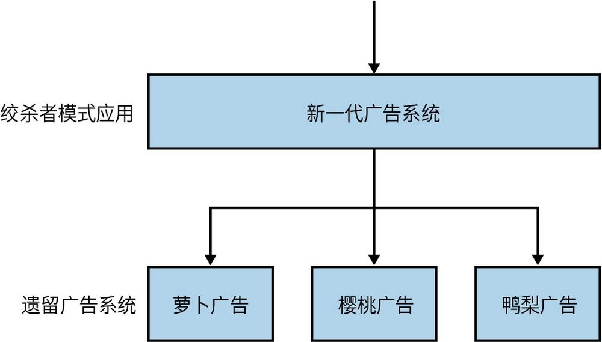
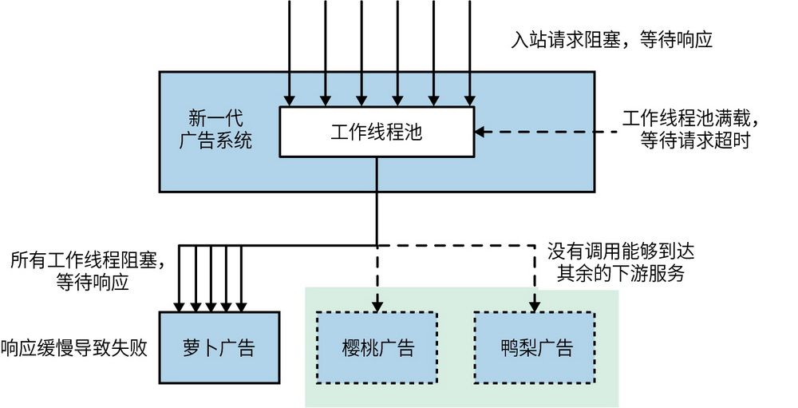
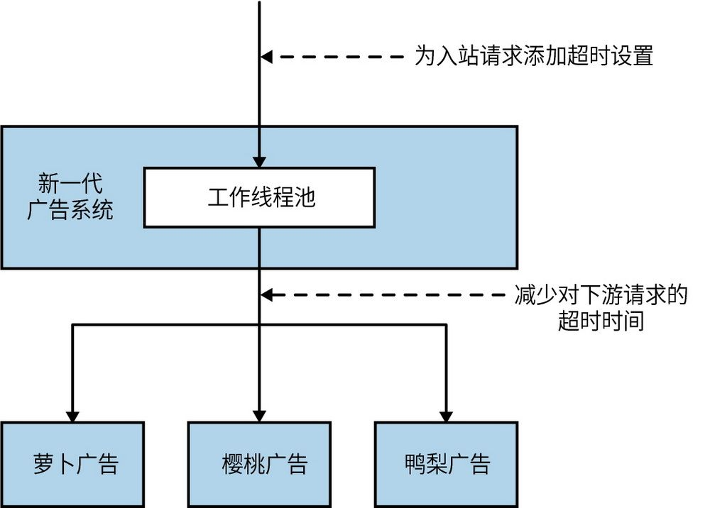
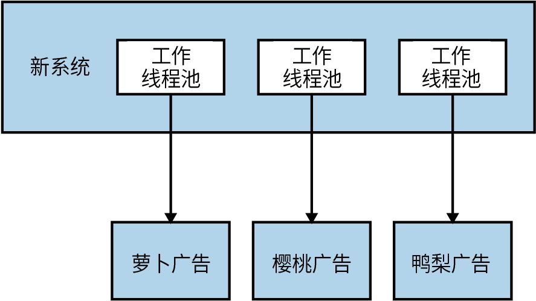
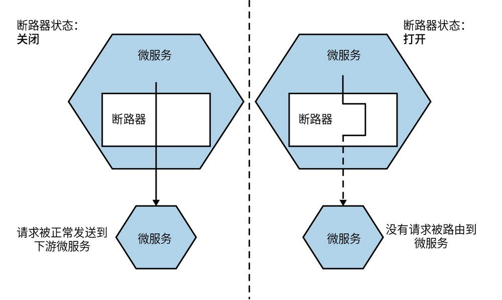
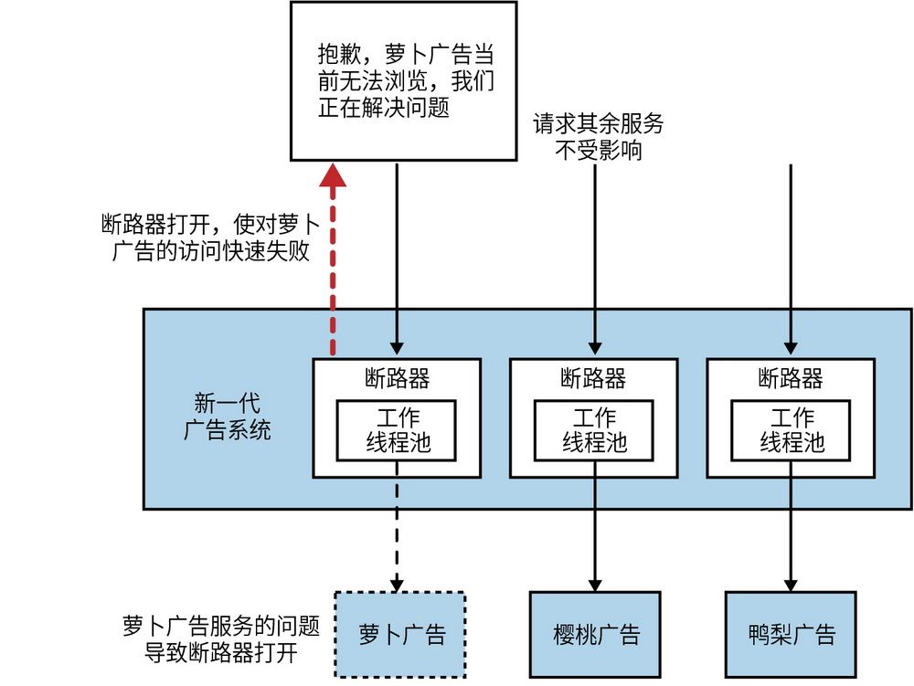
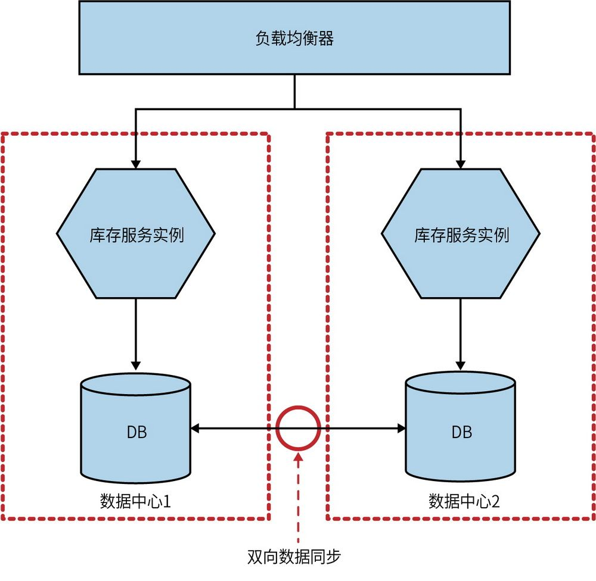

## 第12章 弹性

随着用户对软件的需求与日俱增，软件的服务质量也需要与时俱进。一旦软件出现故障，就会打乱人们的正常生活，即使这款软件还没达到飞机控制系统那类安全优先系统级别。如今，在线购物等服务已经从一种便利变成了一种生活必需品。

在这种背景下，开发人员需要创建可靠性更高的软件。用户对软件功能和可用性的期望今非昔比。仅在工作时间提供技术支持已经不能满足用户的需求，并且用户对停机维护时间的容忍度也越来越低。

正如我们在本书开头所介绍的那样，世界各地的组织选择微服务架构的原因多种多样，但对许多人来说，提升服务的弹性是其中一个主要原因。

在深入探讨微服务架构如何增强弹性前，我们先思考一下什么是弹性。实际上，在增强软件的弹性方面，采用微服务架构只是实现预期的一部分。

### 12.1 弹性介绍

**弹****性**（resiliency）这一术语出现在许多不同的上下文中，其用法也千差万别。这很可能导致我们对它的含义产生困惑，或者在理解上过于狭隘。在IT领域之外，还有一个更广泛的弹性工程领域，该领域研究的弹性概念适用于很多系统：从消防到空中交通管制，从生物系统到手术室，等等。David Woods借鉴了弹性工程领域的做法，尝试从不同方面对弹性进行分类，以帮助我们全面地思考其实际含义。
	 他提出的4个概念列举如下。

**健****壮****性**

应对预期干扰的能力。

**可****恢****复****性**

从破坏性事件中恢复的能力。

**优****雅****的****可****扩****展****性**

处理突发状况的能力。

**持****续****适****应****性**

持续适应不断变化的环境、干系人和需求的能力。

让我们依次看看这些概念，并探讨这些想法如何能（或不能）转化到我们所构建的微服务架构中。

#### 12.1.1 健壮性

健壮性是指在软件和流程中建立一系列机制，以应对预期的问题。我们对可能面临的各种干扰有深入的了解，并能够采取相应的措施；当这些问题出现时，我们构建的系统能够处理它们。在微服务架构中，我们可能会遇到各种意料之中的干扰：主机可能会出现故障、网络连接可能会超时、某个微服务可能无法使用，等等。我们可以通过多种方式增强架构的健壮性，以应对这些干扰，比如自动启动一个替代主机、执行重试，或以优雅的方式处理某个微服务的故障。

不过，健壮性并不局限于软件，它也适用于人。如果你的软件只有一个人维护，那么当这个人一旦生病或者出现事故无法联系上时，该如何应对呢？这似乎是个不难解决的问题——配备一个后备维护人员。

从定义上来看，健壮性要求我们事先了解可能发生的情况，并制定措施来处理已知的不稳定因素。这种知识具有预见性：我们可以基于对系统的理解、它所依赖的服务以及团队，来判断可能会出现的差错。此外，健壮性还可以通过亡羊补牢的方式来提升，一些意外发生后，我们不仅会处理当下的问题，还会借此机会改进系统，从而提升系统的健壮性。比如，我们可能从来没有想过全球文件系统会突然不可用，或者低估了客户服务代表在工作时间之外无法联系所带来的影响。

提高系统健壮性的挑战在于，增强应用的健壮性往往会给系统带来更多复杂性，这本身可能会成为新问题的根源。比如，你将微服务架构迁移到Kubernetes，目的是希望Kubernetes能负责管理微服务工作负载的期望状态。如此一来，虽然这可能会改善应用的健壮性，但也引入了新的潜在问题。因此，任何提高应用健壮性的尝试都必须经过深入思考，不仅要做简单的成本和效益分析，还要考虑是否能够接受因此带来的系统复杂性的增加。

健壮性是微服务提供的多种选择之一。本章将主要聚焦提高系统健壮性的各种措施。但请记住，这只是从弹性的视角做出的部分考虑，还有许多与软件不直接相关的健壮性问题也同样需要考虑。

#### 12.1.2 可恢复性

系统如何从故障中恢复？可恢复性是建立一个可靠系统的关键。我经常看到人们把时间和精力花在试图消除故障的可能性上，但一旦故障真的发生，他们却毫无准备。应该通过各种手段，尽最大努力防范可能发生的不良事件，以提高系统的健壮性。但同时我们也要知道，随着系统规模的增大和复杂性的增加，完全消除潜在问题是不切实际的。

我们可以通过提前采取措施来提高从安全事故中恢复的能力。例如，提前备份数据，就可以在数据丢失后更好地恢复系统（当然，前提是备份经过了测试）。要提高系统恢复能力，也可以准备一本防范系统故障的应急操作手册。当系统发生故障时，每个人需要明确自己的职责，确定负责应对此类情况的关键人员，了解向用户通报情况的速度和方式。由于故障本身所带来的压力和混乱，在故障发生时我们很难做到清晰思考、正确应对。预料到这种问题可能发生并提前制订达成共识的行动计划，有助于更好地恢复系统。

#### 12.1.3 优雅的可扩展性

就可恢复性和健壮性而言，我们主要是处理预期范围内的问题。通过建立机制来应对可以预见的问题。但是，当事情出乎意料时该怎么办？如果我们没有针对意外情况的应对方案，或者我们因为当时的有限认知做出了错误的预期，那么系统就会变得脆弱。当系统面临超出其设计极限的挑战时，它会出现各种问题——性能下降、无法正常运行。

在扁平化的组织中，责任被分配到了组织的各个部分中，而不是集中在一起，这往往能更好地应对意外。当意外情况发生时，如果人们束缚于必须要做的事情，且需要恪守一套规则，那么他们应对意外情况的能力也将受到严重限制。

通常，在优化系统的过程中，一个副作用会增加系统的脆弱性。以自动化为例。自动化可以让现有人员完成更多的工作，同时也可能导致员工数量的减少，而人员的减少可能会引起一些担忧。自动化无法处理突发事件，而我们之所以有能力优雅地扩展系统、处理突发情况，是因为我们有具备所需技能和经验并能承担相关责任的人员来应对这些情况。

#### 12.1.4 持续适应性

持续适应性要求我们时刻保持警觉。正如David Woods所说：“无论我们之前的表现有多么优秀，也无论我们以前有多成功，未来是未知的，我们可能仍然无法很好地适应。面对新的未来，我们仍可能会身处风险之中。”
	 没有遭受过灾难性的故障，并不意味着它不会发生。我们需要挑战自己，确保组织能不断调整自己来适应未来的变化。如果正确应用，混沌工程（chaos engineering）这样的概念可以成为建立持续适应性的有效工具，这一点我们将在本章后面进行探讨。

要实现持续适应性，往往需要从更加全面的视角来看待系统。矛盾的是，如果倾向于组建更小、更自治的团队，赋予其更本地化、更聚焦的职责，可能会导致我们失去大局观。正如将在第15章中探讨的那样，当涉及组织激励机制时，在全局优化和局部优化之间存在着一种平衡，而这种平衡并不是静止的。第15章将探讨职责聚焦的业务流团队的作用。

这些团队负责提供面向用户功能所需的微服务，并承担更多的责任来实现这一目标。我们还将研究赋能团队如何支撑业务流团队的工作，以及如何帮助组织实现持续适应性。

创建一个人们能够自由分享信息且无惧他人报复的工作文化，对于事故发生后增强学习至关重要。具有足够的资源认真研究这类意外事故并汲取教训，意味着需要投入大量的时间、精力和人力资源。这些资源本可以用于短期内交付新功能，因此，在实施持续适应性策略时，我们需要在短期交付目标和长期适应性之间做出权衡和决策。

努力实现持续适应性意味着需要不断探索和学习未知领域。这需要持续的投资，而不是一锤子的买卖。在这一过程中，“持续”一词很重要。它强调了长期性，并将适应性作为组织战略和组织文化的核心部分。

#### 12.1.5 代入微服务架构

正如之前所讨论的，微服务架构有助于实现健壮性，但如果你想要弹性，它是不够的。

从更广泛的视角来看，软件本身并不具备提供弹性的能力，这种能力是构建和运行系统的人所具备的。鉴于本书的内容重点，本章后面的内容将主要关注微服务架构在弹性方面的作用——微服务架构对于提升应用健壮性起到的作用。

### 12.2 故障无处不在

我们明白，任何事情都可能出错。硬盘可能出现故障，软件可能会崩溃。而且，正如读过分布式计算谬误的人可能会告诉你的那样，网络是不可靠的。我们可以尽最大努力减少导致故障的因素，但是到了一定规模，故障会变得不可避免。例如，硬盘比以往任何时候都更可靠，但它们最终还是会损坏。你拥有的硬盘越多，每天发生单个单元故障的可能性就越大。如果规模足够大，那么在统计学上出现故障就是必然的。

即使不考虑极端规模的情况，如果我们能够接受故障的可能性，也会受益。例如，如果我们能够优雅地处理微服务的故障，那么就可以对服务进行就地升级，因为计划内停机要比计划外停机更容易处理。

我们还可以少花一些时间去尝试阻止不可避免的事情发生，而多花一些时间来研究如何从容地应对它。令我感到惊讶的是，有不少组织会落实各种流程和控制措施来阻止故障的发生，但几乎没有考虑如何更容易地从故障中恢复。了解可能导致故障的因素对于提高系统的健壮性至关重要。

一切都可能出故障的假设会迫使你以不同的方式思考如何解决问题。还记得我们在第10章讨论的谷歌服务器的故事吗？谷歌系统的构建方式是，一台服务器出现故障不会导致服务中断，从而提高了整个系统的健壮性。谷歌还采取其他方式来提高服务器的健壮性，比如让每台服务器都包含自己的本地电源供应，以确保在数据中心发生故障时仍然继续运行。
	 第10章还提到，这些服务器中的硬盘是用尼龙搭扣而不是螺丝固定的，以便在出现硬盘故障时更换硬盘，从而有助于谷歌迅速重启机器，帮助系统的这一部分更有效地恢复。

因此，我想重申一遍：在规模很大的情况下，即使你购买了最好的套件、最昂贵的硬件，也无法避免可能会发生故障的事实。因此，如果将这种假设纳入所做的一切工作中，并为失败做好计划，那么你就可以做出明智的权衡。如果你知道你的系统可以应对单个服务器出现故障的情况，那么你就不会执着于在单个机器上花更多的钱，因为这样做的回报只会递减。相反，拥有更多便宜的机器（也许可以像谷歌那样使用更便宜的组件和尼龙搭扣）可能更合理。

### 12.3 多少才算多

我们在第9章提及了跨功能需求的话题。理解跨功能需求涉及数据的持久性、服务的可用性、吞吐量和可接受的操作延迟等方面。本章涵盖的许多技术都谈到了实现这些需求的方法，但只有你才知道自己的确切需求。所以，在阅读的过程中，请记住你自己的需求。

拥有一个能够应对负载增加或单个节点故障的自动伸缩系统可能会很棒，但对于一个每月只需要运行两次的报告系统来说，这可能过于复杂了，因为对于系统而言，停机一两天并不是什么大问题。同样，弄清楚如何进行不停机部署以避免服务中断，可能对在线电子商务系统更有意义，但对于企业内网的知识库来说，这可能太过复杂了。

你能容忍多少故障或系统需要多快的速度，是由系统用户决定的。这些信息反过来可以帮助你了解哪些技术对你来说最有意义。尽管如此，用户并不总能明确地表达他们的确切需求。因此，你需要提出问题以获得确切的信息，并帮助他们了解提供不同服务级别的相对成本。

正如我之前所说，这些跨功能需求可能因具体服务而异，但我建议先定义一些常见的跨功能需求，然后针对特定用例进行调整或修改。当考虑是否以及如何扩展系统才能更好地处理负载增加或故障时，首先要尝试了解以下需求。

**响****应****时****间****/****延****时**

我们应该如何界定各种操作所需的时间长度？可以通过监测不同数量用户对系统的影响来测量，以了解负载增加将如何影响响应时间。考虑到网络的性质，我们总会遇到异常情况，因此可以设定特定的响应时间目标，该目标基于响应时间的百分位数值。响应时间目标还应包括期望软件能够处理的并发连接/并发用户的数量。因此你的目标可能是：“希望网站在每秒处理200个并发连接时，有90%的响应时间为2秒。”

**可****用****性**

你是否允许某个服务发生停机情况？它是否需要24小时不间断运行？有些人在衡量可用性时喜欢考虑可接受的停机时间，但对于使用你的服务的人来说，这有多大用呢？要么用户能够依赖服务并获得响应，要么不能。实际上，从历史报告的角度来测量停机时长才更有意义。

**数****据****的****持****久****性**

你认为丢失多少数据是可以接受的？数据应该被保存多长时间？这很可能会因情况而异。例如，你可能会选择将用户会话日志保存一年或更短的时间以节省空间，但财务交易记录可能需要保存多年。

将这些想法明确地表述为服务等级目标是一种好办法，它可以将相关需求纳入软件交付流程的核心部分。

### 12.4 功能降级

安全地进行功能降级的能力是构建可靠系统的一个重要部分，尤其是当功能分布在许多不同的微服务上，且这些微服务都有发生故障的风险时。想象一下电子商务网站上的一个标准网页。为了将该网站的各个部分结合起来，可能需要几个微服务来发挥作用。一个微服务提供待售物品的详细信息，另一个微服务提供价格和库存情况。要显示购物车的内容，又需要另一个微服务。如果其中一个服务发生故障并导致整个网页不可用，那么我们可以认为这个系统的弹性不足，其整体可用性受限于单一服务的可用性。

我们需要做的是，了解每次故障的影响，并找出进行功能降级的适当做法。从商业的角度来看，我们希望订单处理流程尽可能健全，而愿意接受其他一些功能的降级，以确保订单功能的有效性。如果库存服务不可用，我们可能会决定继续销售，稍后再解决库存相关的问题。如果购物车服务不可用，可能会比较麻烦，但仍然可以展示商品页面，隐藏购物车功能，或者用一个“马上回来”的图标代替它。

对于一个单进程的单体应用，我们没有太多的决策要做。在这种情况下，系统的健康状况在某种程度上是二元的——进程要么运行，要么停止。但是在微服务架构中，我们需要考虑更加复杂的情况。在任何情况下，首先应该做的往往不是技术决策。我们知道当购物车出现故障时应该采取什么技术措施，但是除非了解业务背景，否则我们无法知道应该采取什么措施。例如，也许我们需要关闭整个网站，但仍然允许用户浏览商品目录，或者将用户界面中包含购物车控件的部分替换成一个用于下单的电话号码。但是，对于每一个由多个微服务支撑的用户界面，或依赖多个下游服务的微服务，你都需要问自己：“如果这个服务停机会发生什么”，并知道该如何应对。

通过从跨功能需求的角度考虑各种功能的重要性，我们将更好地明确可以采取的措施。接下来，我们将从技术角度考虑——当故障发生时，我们如何优雅地处理它。

### 12.5 稳定性模式

有一些模式是用来确保出现的问题不会引起不良的连锁反应的。你很有必要了解相关想法，并着重考虑在系统中应用它们，以避免一个问题会导致整个系统崩溃。稍后，我将介绍几项关键的安全措施，但在这之前，我想分享一个简短的故事，概述一些可能会出错的情况。

许多年前，我是AdvertCorp公司的一个项目的技术负责人。AdvertCorp（为了保护隐私，已更改公司名称和细节）通过一个非常受欢迎的网站提供在线分类广告服务。该网站本身处理了相当大的流量，为企业带来了巨大的收入。我所参与的项目的任务是合并一些为各类广告提供相似功能的服务。各类广告的现有功能正在逐步迁移到我们正在构建的新系统中，但其中一些广告仍然由旧的服务提供。为了使这一过渡不影响终端客户，我们在新系统中拦截了所有对各类广告的调用请求，在需要时将它们重定向到旧系统，如图12-1所示。这实际上是绞杀者模式的一个例子，我们在3.6节中简单讨论过。

图12-1：使用绞杀者模式来进行对遗留系统的调用

我们刚刚将流量最大、最赚钱的产品迁移到新系统中，但其余大部分广告仍然由旧系统提供。虽然这些旧系统获得的流量和产生的收入比较少，但是它们存在长尾效应。新系统已经运行了一段时间，其表现非常出色，可以处理大量的负载。在高峰期，大约每秒处理6000~7000个请求，其中大部分是由位于应用服务器前面的反向代理缓存提供的，但产品搜索（网站最重要的功能）大部分是未缓存的，需要服务器全程处理。

然而，一天早上，在达到每日午餐时间的峰值之前，系统开始变得缓慢，然后出现了故障。我们对新的核心应用进行了一定程度的监控，它告诉我们，每个应用节点都达到了100%的CPU峰值，这远远超过了高峰期的正常水平。很快，网站完全瘫痪了。

我们设法找到了问题的根源并修复了网站。问题出在某个下游的广告系统上。因为这是一个匿名案例，所以我们姑且称其为“萝卜广告服务”。这个萝卜广告服务是存在时间最久、最少维护的服务，它的响应变得非常缓慢，从而导致了系统故障的发生。响应缓慢是最糟糕的故障，因为当系统停止响应时，你会很快发现问题。但是，如果系统只是变得缓慢，你往往希望耐心等待一段时间，让系统恢复正常，但这个等待过程会导致系统整体变慢，引发资源争用。就像这个案例一样，等待过程导致了级联故障。但无论故障的原因是什么，这都说明我们构建的系统很容易受到下游问题的影响，从而引发整个系统崩溃。一个难以控制的下游服务足以使整个系统瘫痪。

当一个小组在研究萝卜广告系统的问题时，其他人开始查找应用程序出现了什么问题。我们发现了图12-2所示的问题。我们使用了HTTP连接池来处理下游连接。连接池中的线程都有超时配置，用于控制等待时间，以便在进行下游HTTP调用时更好地处理它们。但问题是，由于下游服务速度缓慢，工作线程需要更长的时间来等待超时。在等待过程中，有更多的请求进入连接池，请求它们的工作线程。由于没有可用的工作线程，这些请求无法执行，它们被挂起了。原来，我们使用的连接池库有一个等待工作线程的超时功能，但默认情况下，该功能是被禁用的，而这就导致了大量的线程被阻塞。我们的应用通常每次有40个并发连接。在短短5分钟内，这种情况使得连接数达到了峰值，大约有800个并发连接，这最终导致系统崩溃。

图12-2：引起系统崩溃的原因示意图

更糟糕的是，下游服务所提供的功能只有不到5%的客户在使用，产生的收入甚至更少。在深入了解后，我们最终发现，变慢的系统比那些迅速出现故障的系统更难处理。在一个分布式系统中，延迟是一个致命问题。

即使我们正确设置了连接池的等待超时时间，所有的出站请求依然在共享唯一的HTTP连接池。这也意味即使系统的其他方面运行正常，一个缓慢的下游服务也可能会耗尽所有可用的工作线程。最后一点，从频繁的超时和错误中，我们可以看出，下游服务的健康状况不佳，但它还在接收流量。这种情况意味着我们让一个本来就糟糕的情况变得更糟糕，因为下游服务没有机会自行恢复。最终，我们采取了3项修复措施来避免这种情况再次发生：正确设置超时；设置舱壁来隔离不同的连接池；应用断路器以防止将调用发送到不健康的系统。

#### 12.5.1 超时

超时问题很容易被忽视，但在分布式系统中，正确处理超时问题是至关重要的。那么在调用下游服务时，应该等待多久才放弃？如果等待时间过长才确定调用失败，可能会导致整个系统变慢。如果超时时间设置得太短，你可能会将本来可以成功的调用视为失败。如果根本没有超时设置，那么下游服务的故障可能会使整个系统瘫痪。

在AdvertCorp公司的案例中，我们遇到了两个与超时有关的问题。首先，HTTP请求池上缺少了一个超时设置，这意味着请求线程会一直阻塞，直到有可用的工作线程为止。其次，当最终有一个HTTP工作线程可以向下游广告系统发出请求时，我们又在放弃调用之前等待了太长的时间。因此，如图12-3所示，我们需要添加一个新的超时设置，并更改现有的超时设置。

图12-3：更改AdvertCorp公司系统中的超时设置

下游HTTP请求的超时时间被设置为30秒，也就是说系统会等待30秒以获取萝卜广告系统的响应，直到超时。但是，在这种情况下，等待这么长时间是不合理的。萝卜广告是由用户在浏览网站时发送的请求生成的。在这种情况下，没有人会等待30秒去加载网页。想象一下，如果网页需要5秒、10秒甚至15秒才能加载完成，你会怎么做？你会刷新页面。因此，在等待萝卜广告系统的响应时，原始请求已经失效，因为用户刷新了页面，导致了另一个入站请求。这又会引发更多的请求进入广告系统，从而导致无限循环。

在查看萝卜广告系统的正常表现时，我们发现通常情况下我们期望在不到1秒的时间内获得响应。因此，等待30秒显然是不必要的。此外，我们的目标是在4~6秒内向用户呈现页面。基于此，我们采取了更为激进的办法，即将超时时间设置为1秒。同时，我们还将等待HTTP工作线程可用的时间设置为1秒。这意味着，在最糟糕的情况下，我们预计等待大约2秒就能获得萝卜广告系统的响应。
	

超时设置是非常重要的。对于所有外部进程的调用，都应该设置超时，并为所有操作选择一个默认的超时时间。当发生超时事件时，记录发生时的相关情况，以便后续分析并做出相应的调整。观察下游服务的“正常”响应时间，可以帮助你设置适当的超时阈值。

仅为单个服务调用设置超时时间可能不够。下游HTTP请求的超时时间被设置为30秒——这意味着我们会在放弃前等待30秒以获得来自萝卜系统的响应。以AdvertCorp公司为例，如果用户已经放弃了查询，那么等待获取最新的萝卜广告价格就没有意义。在这种情况下，一种合理的做法是为整个操作设置一个超时时间，并在超时之前终止操作。要实现这一点，需要将当前操作的剩余时间传递给下游服务。例如，如果渲染整个页面的操作必须在1000毫秒内完成，而在调用下游萝卜广告服务时已经过去了300毫秒，那么我们需要确保等待其余调用的时间不超过700毫秒，以便完成所有操作。

不要只考虑单个服务调用的超时设置，还要考虑整个操作的超时限制。如果整个操作的时间预算超过了设定的限制，操作就应该被中止。

#### 12.5.2 重试

与下游调用相关的一些问题是暂时性的。数据包可能会丢失，或者网关可能出现奇怪的负荷峰值，从而导致超时。通常情况下，重试请求会有很大帮助。回到我们刚才提到的问题，你有多少次刷新了一个无法加载的网页，却发现在第二次尝试时网页可以正常运行？这就是重试的作用。

考虑清楚哪些失败的下游调用值得重试，对我们是很有用的。例如，如果使用类似HTTP的协议，你会在响应代码中得到一些有用的信息，它们可以帮助你确定是否有必要重试。如果你收到的是404 Not Found（没有找到），很显然重试不会起作用。如果收到的是503 Service Unavailable（服务不可用）或504 Gateway Time-out（网关超时），那这些可能是临时问题，就可以通过重试来解决。

通常情况下，在进行重试之前，你可能需要等待一段时间。如果最初的超时或错误是由于下游微服务的负载过大造成的，那么立刻发起更多的请求可能不是个好做法。

如果要进行重试，你需要在设置超时阈值时考虑这一点。如果下游调用的超时阈值被设置为500毫秒，但只允许最多3次重试，每次重试之间间隔1秒，那么在中止操作之前你可能需要等待3.5秒。如前所述，为一个操作设定最长时间预算是个有用的做法——如果已经超过了总体时间预算，就不用进行第3次（甚至第2次）重试。如果这是一个非用户操作，那么为了完成任务等待更长的时间是完全可以接受的。

#### 12.5.3 舱壁

在《发布！设计与部署稳定的分布式系统（第2版）》
	 一书中，Michael Nygard提出“舱壁”的概念，作为隔离故障的方法。在造船业中，舱壁是船舶的一部分，可以密封起来以保护船舶的其他部分。因此，如果船舶漏水，舱壁会将水限制在完全隔离的隔间内。你会失去船舶的一部分，但其余部分仍然完好无损。

在软件架构方面，我们可以考虑多种不同的隔离方法。回到我在AdvertCorp公司的经历，我们错过了在下游调用方实现隔离的机会。我们本应为每个下游连接使用不同的连接池，这样，如果一个连接池被耗尽，其他连接就不会受到影响，如图12-4所示。

图12-4：每个下游服务都使用一个连接池以实现舱壁隔离

关注点分离也是实现舱壁的一种方式。通过将功能拆分成独立的微服务，可以降低一个领域的故障影响其他领域的概率。

你应该审视系统中可能出现问题的所有方面，包括微服务内部和微服务之间。你是否采用了舱壁策略？我建议至少为每个下游连接都建立独立的连接池。不过，你可能想更进一步，考虑使用断路器，我们稍后会讨论到。

在许多方面，舱壁模式是我们目前为止探讨过的模式中最重要的一个。超时和断路器有助于在资源受限时释放资源，但是舱壁模式可以在一开始就确保资源不会受限。它们还可以实现在某些情况下拒绝请求，以确保资源不会超负荷或过度消耗——这被称为“减载”。有时，拒绝请求是防止重要系统过载的最好方法，以避免其成为多个上游服务的瓶颈。

#### 12.5.4 断路器

在家中，断路器是为了保护电器免受电力波动的影响。如果电力发生波动，断路器会自动断开，以保护贵重的家用电器。此外，你还可以手动关闭断路器，切断部分房屋的电源，以使电力系统安全运行。在《发布！设计与部署稳定的分布式系统（第2版）》中，Nygard提出了另一个模式——断路器。断路器模式可以作为对软件的保护机制，其效果也很显著。

我们可以将断路器视为一种自动隔板机制，它不仅可以保护消费者免受下游问题的影响，还可以避免进一步调用对下游服务产生负面影响。考虑到级联故障的风险，我建议在所同步的下游调用中强制使用断路器。你不必自己编写代码，因为自第1版出版后，断路器模式已经得到了广泛应用。

回到AdvertCorp公司的例子，我们遇到的问题是，萝卜广告系统在最终返回错误之前，响应非常缓慢。即使设置了适当的超时时间，系统还是需要等待很长时间才能得到错误信息。然后，当下一个请求进来时，我们会再次尝试，接着等待。下游服务的故障已经够糟糕了，它还拖慢了整个系统。

使用断路器可以解决这个问题。当（由于错误或超时）对下游资源的请求失败次数到达一定数量时，断路器就会跳闸。如图12-5所示，在断路器处于打开状态时，所有通过该断路器的进一步请求都会快速失败。
	 过了一段时间，客户端会发送一些请求，看看下游服务是否已经恢复正常。如果下游服务得到足够多的健康响应，它就会重置断路器。

图12-5：断路器概览

实现断路器的方式取决于如何定义“失败”请求，但在为HTTP连接实现断路器时，失败通常是指超时，或一部分5XX HTTP返回代码。当下游资源出现超时或返回错误时，在达到一定阈值后，我们会自动停止发送流量并使其快速失败。在恢复正常后，会自动重新开始发送请求。

要正确设置断路器的参数，需要小心谨慎。你不希望断路器过于容易跳闸，也不希望它过于迟钝，需要太长时间才能跳闸。同时，在断路器闭合之前，你需要确保下游服务已经恢复正常，以避免发送流量时再次遇到问题。与超时一样，我会选择一些合理的默认值，并在整个系统中保持一致，然后根据具体情况进行调整。

我们来看看断路器跳闸时的一些选择。一种选择是，将请求排队，稍后重试。对于某些场景，这可能是适合的，特别是在处理一些属于异步工作的任务时。但是，如果这个调用是同步调用链的一部分，最好的选择是快速失败。否则，错误会在调用链上传播，或者会导致不易察觉的功能降级。

在AdvertCorp公司的案例中，我们为遗留系统的下游调用添加了断路器，如图12-6所示。当这些断路器跳闸时，我们通过编程方式更新网站，告知用户网站目前无法显示广告，比如萝卜广告。我们确保网站的其他部分正常运行，并通过自动化方式明确地告知客户，出现的问题仅仅影响产品的一部分。

图12-6：为AdvertCorp公司系统添加断路器

在确定断路器的范围时，我们可以为每个下游遗留系统配置一个断路器，这与为每个下游服务配置不同的请求工作线程池相似。

我们还可以手动设置这种机制（就像家中的电路断路器一样），以使工作更加安全。例如，如果出于日常维护，需要关闭一个微服务，我们可以手动打开上游消费者的所有断路器，这样当微服务离线时，它们可以快速失败。一旦微服务恢复正常，我们就可以关闭断路器，一切都会恢复正常。将手动打开和关闭断路器的过程编写成脚本，将其作为自动化部署流程的一部分可能是一个明智的做法。

断路器可以让应用快速失败，快速失败总比缓慢失败要好。断路器可以让我们在浪费宝贵的时间（和资源）等待不健康的下游微服务的响应之前快速失败。与其等到尝试使用下游微服务时才发生故障，不如提前检查断路器的状态。如果某个操作所依赖的微服务目前不可用，我们就终止对其的操作。

#### 12.5.5 隔离

一个微服务对另一个微服务的依赖程度越高，它的健康状况就越会影响另一个微服务的处理能力。如果能够使用某种技术允许下游服务器离线，例如通过使用中间件或其他类型的支持缓存的调用系统，那么上游微服务受到下游微服务计划内或计划外的中断的影响就会减少。

提高服务之间的隔离性还有一个好处，即当服务相互隔离时，服务所有者之间需要协调的工作会更少。团队间需要的协调越少，团队的自主权就越大，因为它们能够更自由地运营和持续发展其负责的服务。

隔离同样适用于将逻辑上的服务隔离到物理层面上。想象两个似乎完全隔离的微服务，它们没有任何形式的通信，其中一个出现问题不会影响到另一个。但是，如果这两个微服务都在同一台主机上运行，其中一个开始占用所有的CPU，就会导致主机出现问题。

再考虑一个例子：两个微服务分别有自己的逻辑上隔离的数据库，但这两个数据库都部署在同一个数据库基础设施上，如果该数据库基础设施发生故障，故障就会同时影响这两个微服务。

在考虑如何部署微服务时，还要确保一定程度的故障隔离，以避免出现类似的问题。例如，确保微服务在独立的主机上运行，使用自己的隔离操作系统和计算资源是一个明智的做法——这也是在虚拟机或容器中运行微服务实例时能够实现的。但是，这种隔离会带来更高的成本。

将微服务运行在不同的机器上，可以更有效地将它们相互隔离。不过，这也意味着需要更多的基础设施和工具来管理它们。这将直接增加成本，并使系统变得更加复杂，同时，也会暴露潜在的故障点。每个微服务可以有专用的数据库基础设施，但这会增加待管理的基础设施的数量。虽然我们可以使用中间件临时地解耦两个微服务，但引入中间件也需要额外的管理和维护。

与许多其他技术一样，隔离可以帮助提高应用的健壮性，但这很少是免费的。在隔离、成本和增加的复杂性之间做出合适的权衡至关重要。

#### 12.5.6 冗余

拥有更多的资源是提高组件健壮性的一种好方法。例如，让不止一个人了解生产数据库的工作原理似乎是明智的，以防有人离职或休假时没人能应对故障情况。同样，创建多个微服务实例也是有道理的，因为即使一个实例失败，仍然有其他实例可以提供所需的功能。

确定所需的冗余和它们的部署位置取决于你对每个组件潜在故障模式的了解程度，以及该组件不可用所带来的影响和增加冗余的成本。

例如，在AWS上，无法保证单个EC2（虚拟机）实例的正常运行时间，所以你必须假定它可能会发生故障或关闭。因此，拥有多个实例是有意义的。但是，进一步来说，EC2实例被部署在可用区（虚拟数据中心）中，也不能保证单个可用区的可用性，这就意味需要将第2个实例部署在不同的可用区，以分散风险。

在实现冗余时，拥有更多的副本有助于提高系统的健壮性，还有助于应对系统负载的增加。在第13章中，我们将探讨系统扩展的示例，了解为实现冗余进行系统扩展和为处理负载进行系统扩展的不同之处。

#### 12.5.7 中间件

在5.2.4节中，我们探讨了中间件作为消息代理的作用，它帮助实现请求-响应和事件驱动的交互。大多数消息代理的一个重要特性是，它们能够提供可靠的消息传递。当把消息发送到下游时，消息代理会保证将其传递，但也有一些我们之前提到的需要注意的地方。

为了提供这种保证，消息代理软件需要实现诸如重试和超时等功能。通常，这些功能是由你自己执行的，但是通过使用专业人员编写的软件来实现这些功能也是一个不错的选择。

在AdvertCorp公司的例子中，如果我们使用中间件来管理与下游的萝卜广告系统的请求-响应通信，实际上可能并没有太大帮助，因为仍然无法获得要为客户提供的响应。虽然中间件可能会缓解系统的资源争用，但是会导致越来越多的未决请求在中间件中等待。更糟糕的是，许多最新的请求可能会与已过期的请求混淆在一起，仍然无法提供有效的响应。

另一种方法是改变交互方式，使用中间件让萝卜广告系统广播最新的信息，然后我们消费这些信息。但如果下游的萝卜广告系统出现问题，我们仍然无法为寻找最优萝卜价格的客户提供响应。

因此，使用消息代理等中间件来帮助解决一些健壮性问题可能会有帮助，但并不适用于所有情况。

#### 12.5.8 幂等

在幂等操作中，即使随后多次执行该操作，结果也不会发生变化。如果操作是幂等的，我们可以多次重复调用而不必担心会产生不利影响。当我们不确定操作是否被执行，想要重新处理消息，从而从错误中恢复时，幂等会非常有用。

让我们考虑一个简单的示例：当客户下单后，他们会获得一些积分。我们将使用示例12-1中请求的有效负载来发起这个调用。

**示****例****1****2****-****1** 将积分计入账户

<credit>

<amount>100</amount>

<forAccount>1234</account>

</credit>

如果多次收到此调用，将多次增加100分。因此，就目前的情况而言，这个调用不是幂等的。不过，当有了更多的信息后，我们就可以让积分账户将这个调用变成幂等操作，如示例12-2所示。

**示****例****1****2****-****2** 添加更多的信息使这个调用变成幂等操作

<credit>

<amount>100</amount>

<forAccount>1234</account>

<reason>

<forPurchase>4567</forPurchase>

</reason>

</credit>

我们知道这些积分与特定订单4567相关联。假设一个订单只能获得一次积分，那么在不增加总积分的情况下，可以再次应用这个积分。

这种机制同样适用于基于事件的协作。当有多个相同类型的服务实例订阅同一个事件时，这种机制会特别有用。即使存储了已处理的事件，对于某些形式的异步消息传递，仍可能会出现两个工作进程同时看到相同消息的情况。通过以幂等方式处理事件，我们可以确保这不会带来任何问题。

有些人可能误解了这个概念，认为使用相同参数进行多次后续调用不会产生任何影响，这会让我们陷入一个有趣的困境。例如，我们仍然希望在日志中记录调用的发生、调用的响应时间，以收集这些数据进行监控。关键是，我们在意的是基础业务操作是幂等的，而不是整个系统的状态。

有一些HTTP动词，如GET和PUT，在HTTP规范中被定义为幂等的，但要做到这一点，你的服务在处理这些调用时必须使用幂等方式。如果使用这些动词，但操作不是幂等的，而调用者认为可以安全地重复执行这些动词，那就可能会陷入混乱。记住，仅仅使用HTTP作为底层协议，并不意味着可以免费得到它提供的一切好处。

### 12.6 分散风险

实现弹性扩展的一种方式是，不要把所有的鸡蛋放在同一个篮子里。例如，不要把多个服务放到同一台主机上，因为一旦主机发生故障，多个服务都将受到影响。但是，在当前大多数情况下，“主机”实际上是一个虚拟概念。即使将所有服务放在不同的主机上，这些主机实际上都是运行在同一台物理服务器上的虚拟主机。如果该物理服务器宕机，同样会导致多个服务失效。一些虚拟化平台能够将主机分布在多个不同的物理服务器上，以降低发生这种情况的可能性。

对于内部虚拟化平台，通常的做法是，将虚拟机的根分区映射到单个存储区域网络（storage area network，SAN）。如果SAN发生故障，它会影响所有连接的虚拟机。SAN是庞大且非常昂贵的，被设计得不容易出现故障。不过，在过去的10年中，我至少遇到过两次大型、昂贵的SAN故障，且每次的后果都相当严重。

另一种减少故障的常见方法是，避免所有的服务都在同一个数据中心的同一个机架上运行，让服务分布在多个数据中心。如果使用的是基础服务供应商，了解是否提供SLA并具备相应的规划是非常重要的。如果服务在每季度宕机时间不超过4小时，但托管供应商只能保证每季度不超过8小时的宕机时间，那么你必须改变SLA，或者选择一个替代解决方案。

以AWS为例，它被分成多个区域，你可以把它们看作不同的云。每个区域又被分成两个或更多的可用区（availability zone）。这些可用区相当于AWS的数据中心。让服务分布在多个可用区是非常必要的，因为AWS不提供单个节点甚至单个可用区的可用性的保障。对于其计算服务，它在整个区域的特定月份只有99.95%的正常运行时间，因此你需要把工作负载分布在一个区域内的多个可用区。对于一些人来说，这还不够，他们需要跨多个区域运行其服务。

当然，应该注意的是，因为供应商向你提供SLA“保证”，他们会倾向于减轻其责任。如果他们未能履行承诺，导致你失去客户和大量资金，即使翻遍整个合同，你也很难找到从他们那里获得任何赔偿的条款。因此，我强烈建议你了解供应商未能履行其义务的影响，并确定是否需要在手边准备一个备选B方案（或C方案）。例如，我的很多客户将灾难恢复托管平台托管给不同的供应商，以确保他们不会脆弱得因为一家公司出错而受到严重影响。

### 12.7 CAP定理

我们希望拥有一切，但可惜的是，我们知道不太可能。在使用微服务架构构建分布式系统时，有一个数学定理证明了这一点，这就是CAP定理。你可能听说过这个定理，特别是在讨论不同类型的数据存储的优点时，我们会经常听到。该定理的核心思想是，在分布式系统中，我们只能在3个要素——一致性（consistency）、可用性（availability）和分区容错性（partition tolerance）中取舍。具体来说，CAP定理告诉我们，在故障模式下，我们只能同时实现两个特性。

一致性是指，当访问多个节点时将得到相同的答案。可用性是指，每个请求都能得到响应。分区容错性是指，当集群中的某些节点无法通信时，系统整体还能继续服务的能力。

自从Eric Brewer提出这个猜想以来，这个想法得到了数学上的证明。我不打算深入探讨证明本身的数学内容，因为本书不是这类数学书，而且我也不能保证自己的理解没有问题。相反，我可以通过一些示例来帮助你理解，CAP定理背后实际上是一套严密的逻辑推理。

例如，假设库存微服务部署在两个独立的数据中心，如图12-7所示。每个数据中心都有一个支持服务实例的数据库，这两个数据库相互通信，尝试彼此之间同步数据。读写操作通过本地数据库节点完成，并使用副本在节点之间同步数据。

图12-7：使用多主复制共享两个数据库节点的数据

现在我们想一想，当出现故障时会发生什么。假设两个数据中心之间的网络连接中断，这时同步会失败。对数据中心1中的主数据库的写入将不会传送到数据中心2，反之亦然。大多数数据库支持一些设置和某种队列技术，以确保能在事后恢复，但在此期间会发生什么呢？

#### 12.7.1 牺牲一致性

假设我们没有完全关闭库存微服务，现在对数据中心1的数据做更改，而数据中心2的数据库不知道。这意味着任何对数据中心2的库存节点的请求，用户看到的可能都是已经失效的旧数据。换句话说，我们的系统仍然可用，两个节点在系统分区后仍能为请求提供服务，但是我们失去了一致性，即我们无法同时保留3个特征。这通常被称为AP系统，因为它具有可用性和分区容错性。

在这种分区中，如果继续接受写入操作，那么必须接受这个事实：在未来的某个时间点，它们必须重新同步。分区持续的时间越长，这种重新同步就会越困难。

实际上，即使我们的数据库节点之间没有网络故障，数据的复制也不是即时的。对比前面所述，那些愿意放弃一致性以保持分区容错性和可用性的系统被称为最终一致性系统。换句话说，我们期望在未来的某个时刻，所有节点都能看到更新后的数据，但这不会立即发生，所以我们必须接受用户可能看到旧数据的可能性。

#### 12.7.2 牺牲可用性

如果我们需要保持一致性但愿意牺牲其他方面，会发生什么呢？为了保证一致性，每个数据库节点需要知道，它所拥有的数据副本与其他数据节点中的数据完全相同。但在分区情况下，如果数据库节点不能相互通信，它们就无法协调以保证一致性。由于无法保证一致性，所以我们唯一的选择就是拒绝响应请求。换句话说，我们牺牲了可用性。在这种情况下，系统是一致的和分区容错的，即CP模式。在这种模式下，我们的服务需要考虑功能降级，直到分区恢复、数据库节点之间可以重新同步。

实现跨多个节点的一致性确实很难，在分布式系统中几乎没有比这更困难的事情了。想象一下，我想从本地数据库节点读取一条记录。那么，我如何知道它是不是最新的呢？我必须去询问另一个节点。但是我还需要确保该数据库节点在读取完成之前不会有更新，也就是说，我需要再启动一个事务，跨多个数据库节点读取以保证一致性。但读取时一般不会使用事务，因为事务性读取很慢，它们需要锁定，一个读取可以阻塞整个系统。

我们之前讨论过，分布式系统必须考虑到可能的故障。假设我们在一组保持一致性的节点上执行事务性读取操作。我要求启动读取时，远程节点锁定给定的记录。完成读取后，我请求远程节点释放该锁，但此时我无法与该节点通信。这会导致什么结果呢？即使在单进程系统中，处理锁也很容易出错，更不用说在分布式系统中了。

还记得我们在第6章中讨论过的分布式事务吗？它们之所以具有挑战性，是因为需要确保多个节点之间的一致性问题。

让多节点实现正确的一致性非常困难，因此我强烈建议，如果你需要实现这一点，不要试图自己发明实现的方式。相反，选择一个能提供这些特性的数据存储或锁服务。例如，在5.9.2节中讨论的Consul就实现了一个强一致性的键-值存储，旨在让多个节点之间共享配置。就像“不要让好朋友实现自己的加密算法”一样，“不要让好朋友为自己实现分布式一致性数据存储”。如果你确实认为需要编写属于自己的CP数据存储，请先阅读所有关于这个主题的论文，获得博士学位，然后花上几年的时间去试错。与此同时，我会使用一些现成的成熟工具，或者努力尝试构建一个遵循最终一致性的AP系统。

#### 12.7.3 牺牲分区容错性

我们不得不从CAP中选择两个特性，我们有最终一致的AP系统，也有一致但很难构建和扩展的CP系统。为什么没有CA系统呢？为什么不能牺牲分区容错性呢？如果我们的系统没有分区容错性，它就不能在网络上运行。换句话说，它需要在本地以单一进程的形式运行，而无法在分布式环境中运行。所以，在分布式系统中，CA系统是不存在的。

#### 12.7.4 AP还是CP

哪个是正确的，AP还是CP？其实这取决于具体情况。在构建系统的过程中，我们需要权衡。我们知道AP系统更容易扩展，构建起来也更简单，而CP系统需要做更多的工作，因为支持分布式一致性会带来更多的挑战。但我们可能不了解这种权衡对业务的影响。对于库存系统来说，一条记录过时5分钟可以接受吗？如果答案是肯定的，那么解决方案可以是AP系统。但对于银行客户的余额来说呢？能使用过时的数据吗？如果不了解操作所处的上下文，我们就无法知道正确的做法。了解CAP定理有助于你理解这种权衡，以及要问什么问题。

#### 12.7.5 全部和全不并不是二选一

我们的系统不需要在AP或CP中二选一。例如，我们为MusicCorp提供的商品目录服务可以是AP的，因为我们不太介意过时的记录。但是库存服务需要是CP的，因为我们不想卖给客户一些我们没有的商品，然后不得不事后道歉。

此外，某些服务甚至不必是CP或AP的。

让我们回到积分余额微服务，这里存储了客户已经积累的积分记录。对于该服务，我们不太关心显示给客户的余额是否过时，但当涉及余额更新时，我们必须保证它是一致的，以确保客户不会使用到超出可用积分的余额。这个微服务是CP还是AP的？还是二者兼具？实际上，我们是将CAP定理的权衡下放到单个微服务的每个功能上了。

另一种复杂性在于，无论是一致性还是可用性都不是二选一的简单问题。许多系统允许我们进行更细粒度的权衡。例如，在Cassandra中，可以对单次调用做出不同的权衡。因此，如果需要的是严格的一致性，可以执行一个读取操作直到所有的副本都响应、不断确认值是否一致，或者直到特定数量的副本做出响应，即使只等待单一节点的响应。很明显，如果我选择等待所有副本的响应，而其中一个副本不可用，那么就会陷入长时间的阻塞状态。此外，如果我希望读取操作能够尽快地响应，我可以只等待单一节点的响应，但在这种情况下，可能会存在数据不一致的风险。这意味着，在某些情况下，我可能会获得一个不完全一致的数据视图。

你会经常看到有关人们打破CAP定理的文章，但事实并非如此。他们所做的其实是创建一个系统，其中有些功能是CP的，有些是AP的。CAP定理背后的数学证明依然成立。

#### 12.7.6 现实世界

我们所谈论的大多数内容都涉及电子世界——存储在内存中的比特和字节。我们以近乎孩子般的方式谈论一致性，想象在所创建的系统范围内，可以使世界停止运转，让一切变得合理。但是，我们所构建的许多东西只是现实世界的映射，而我们不能完全控制它，不是吗？

让我们重新审视一下库存系统，它会映射现实世界中的实体商品。在系统中，我们记录MusicCorp仓库中有多少张CD专辑。在一天开始时，有100张The Brakes乐队的*G**i**v**e**B**l**o**o**d*专辑。很快就卖出了一张，只剩99张了。这很简单，对吗？但是，如果在发货时，有人不小心把专辑掉到了地上并踩坏了，会发生什么？我们的系统会显示货架上有99张，但实际上只有98张。

如果我们把库存系统设计为AP系统，然后告诉一个客户他已购买的专辑实际上是缺货状态，这种用户体验会好吗？这会不会是世界上最糟糕的事情？但与此同时，构建和缩放AP系统会容易得多，同时可以确保正确性。

我们必须认识到，无论我们的系统本身多么一致，它们都无法了解所有可能发生的事情，特别是当我们记录现实世界中的数据时。这就是在许多情况下，AP系统成为正确选择的主要原因之一。除了构建CP系统会带来复杂性之外，CP系统也无法解决我们面临的所有问题。

**反****脆****弱**

在第1版中，我提到了Nassim Taleb提出的“反脆弱”的概念。该概念描述了系统是如何从失败和混乱中受益的，并强调了其为Netflix在混沌工程等方面的运作方式提供了灵感。不过，当我们更广泛地审视弹性概念时，我们意识到反脆弱只是弹性概念的一个子集。当我们考虑到之前介绍的优雅的可扩展性和持续适应性概念时，这一点变得很清楚。

我认为，“反脆弱”成为IT界的一个短暂的热门概念，但它是在我们狭隘地思考“弹性”的背景下出现的。那时，我们通常只考虑了健壮性和可恢复性，但忽略了其他方面。随着弹性工程领域受到越来越多的认可和关注，我们似乎应该超越“反脆弱”这个术语，同时仍然保留其中的一些思想，因为这些思想是弹性概念的一部分。

### 12.8 混沌工程

自本书第1版出版以来，另一种引起关注的技术是混沌工程。该术语源自Netflix的实践，它是一种改进系统可靠性的有效方法。它要么是确保你的系统与你认为的一样健壮，要么作为实现系统持续适应性的一种手段。

最初，“混沌工程”一词是受Netflix内部工作启发而来的，但这一术语在某种程度上因其含义不清晰而令人有些困惑。对许多人来说，它意味着“在软件上运行一个工具，看看它会产生什么结果”。这种理解可能对澄清概念没有帮助，特别是许多混沌工程支持者本身就是在销售，他们售卖用于运行在软件之上的实施混沌工程的工具。

对于混沌工程的从业者来说，要想明确定义混沌工程的含义是很困难的。我认为（至少在我看来）迄今为止最好的定义是这样的。

混沌工程是一门通过对系统进行实验来增强系统在生产环境中经受动荡条件的能力的学科。

——混沌工程原理网站

现在来看，这里的“系统”一词起到了很大的作用。有些人将其狭义地视为软件和硬件。但在弹性工程的背景下，重要的是将系统视为创建产品的人、流程、文化，以及所涉及的软件和基础设施的全部。这也意味着我们应该更广泛地看待混沌工程，而不仅仅是“让我们关闭一些机器，看看会发生什么”。

#### 12.8.1 演练日

在混沌工程被命名之前，人们通常会进行演练来测试人们为应对某些事件而做的准备工作。这种演练是提前计划好的，但最好是在参与者的意料之外进行，从而更好地测试员工和工作流程的应急响应能力。我在谷歌工作期间，这种演练对于各种系统是相当常见的。我认为许多组织都可以从这种定期演练中受益。谷歌不仅仅是简单地测试服务器故障，作为其灾难恢复测试（disaster recovery test，DiRT）演练的一部分，它还模拟了诸如地震之类的大规模灾难。
	 

演练日可以用于检测系统中潜在的弱点。Russ Miles在他的《混沌工程实战》
	 一书中分享了他主持的一个演练活动，其目的之一是检查对一个名叫Bob的员工是否过度依赖。在演练日中，Bob被关在一个房间里，在模拟的系统故障期间无法为团队提供帮助。不过，Bob在此期间一直在观察团队的行为，当团队试图修复“虚假”的系统问题时，他们错误地登录了生产系统，并在此过程中破坏了生产数据。最终，Bob不得不介入以解决问题。可以想象，在这次演练后，团队汲取了很多宝贵的经验教训。

#### 12.8.2 生产实验

Netflix的运营规模众所周知，而它完全基于AWS基础设施也是众所周知的事实。这两个因素意味着，它必须善于应对故障。Netflix意识到，计划故障和实际了解软件在故障发生时会如何处理故障是两回事儿。为此，Netflix会真实地触发故障，并通过在系统上运行工具以确保其能够容忍故障。

这些工具中最著名的是“混沌猴子”（Chaos Monkey），它在一天中的某个时间段内会随机关闭生产环境中的计算机。知道这可能会在生产中发生意味着创建系统的开发人员必须为此做好准备。“混沌猴子”只是Netflix的“猿猴军团”（Simian Army）中的一部分。“混沌大猩猩”（Chaos Gorilla）被用来关闭整个可用区（相当于AWS的数据中心），而“延迟猴子”（Latency Monkey）则被用来模拟机器之间的网络连接变慢。对许多人来说，对系统健壮性的终极测试是在生产基础设施上释放你自己的“猿猴军团”。

#### 12.8.3 超越健壮性

从最狭义的应用范围来看，混沌工程对于提高应用的健壮性是有效的。请记住，在弹性工程的背景下，健壮性意味着系统能够处理预期问题的程度。Netflix知道它不能依赖于其生产环境中任何虚拟机的可用性，所以它构建了“混沌猴子”，以确保其系统能够应对预期的问题。

但是，如果利用混沌工程工具作为不断质疑系统弹性的一种方法，它可以具有更广泛的适用性。使用这个领域的工具来帮助回答“如果……会怎么样？”的问题，不断地质疑你的理解，可以产生更大的影响。混沌工具包（Chaos Toolkit）是一个已经被广泛接受的开源项目，可以帮助你在系统上运行实验。由混沌工具包的创始人创建的公司Reliably提供了更多的混沌工程工具，但在这一领域最著名的供应商可能是Gremlin。

请记住，运行混沌工程工具并不会使你的系统弹性更好。它可以帮助测试系统的健壮性，但不会改变系统的弹性。

### 12.9 问责

当事情出错时，可以有很多方法进行处理。显然，在紧急情况下，我们的重点是恢复正常运行，这才是明智的。但事后，往往出现问责的情况。人们往往习惯于找到某个事物或某人来追究责任。“根因分析”的概念意味着存在一个根本原因。但令人惊讶的是，我们经常希望根本原因是某个人。

几年前，我还在澳大利亚工作时，澳大利亚最大的电信公司Telstra发生了一次重大故障，影响了语音服务和电话服务。鉴于其故障的范围和持续的时间，这一事件尤为严重。澳大利亚有许多非常偏远的农村社区，这类故障往往会对他们造成严重影响。在故障发生后不久，Telstra的首席运营官发表了一份声明，明确表示他们知道问题的根本原因是什么。
	 

“我们关闭了故障节点，不幸的是，负责处理该问题的员工未按正确的程序操作，他将客户重新连接到发生故障的节点上，而不是转移到其他9个冗余节点——这本是他应该采取的措施。”McKenzie女士周二下午对记者说。“我们向所有客户道歉，这是一个尴尬的人为错误。”

首先要注意的是，这份声明是在故障发生后数小时内发表的。然而，Telstra已经剖析了非常复杂的系统，并明确指出了谁应该受到责备——一名员工。现在，如果一个人的错误真的能让整个电信公司陷入困境，那么这应该更多地反映了电信公司本身有问题，而不是个人。此外，Telstra当时还明确向其员工发出了责备的信号。
	 

在此类事故发生后去责备员工，这种做法的问题在于，起初可能只是短期的推卸责任，但最终会形成一种恐惧文化——当事情出错时，人们将不愿站出来告诉你出了问题。结果，你将失去从失败中学习的机会，为再次发生同样的问题埋下伏笔。在组织中创造一种让人们有勇气承认错误的环境对于塑造学习型文化至关重要。除了可以创造一个愉快的工作氛围，这样做还有助于创建一个能构建更强大软件的组织。

回到Telstra的例子，针对全国范围内的中断事故进行了深入调查，明确了责任人，我们显然不希望后续还发生中断事故，对吗？可惜的是，Telstra后来还遭受了一系列的中断事故。这是更多的人为错误造成的吗？也许Telstra是这么想的——在这一系列事故发生后，首席运营官辞职了。

如果你想深入了解如何创建一个可以从错误中获益的组织并为员工创造更好的工作环境，我推荐你阅读John Allspaw的文章“Blameless Post-Mortems and a Just Culture”，这是一个很好的起点。
	 

归根结底，正如我在本章中多次强调的，弹性需要一种质疑的心态——不断地检查系统弱点的驱动力。这需要一种学习型文化，而最好的学习往往是在事故发生后进行的。因此，当发生最糟糕的情况时，你要确保尽最大努力创造一种环境，使你能在事后最大程度地收集信息，以减少它再次发生的可能。

### 12.10 小结

随着软件对用户的生活越来越重要，我们也越来越需要确保所创建的软件能够持续健壮地运行。但是，正如本文所讲到的，我们不能仅仅通过思考软件和基础设施来实现弹性，我们还必须考虑我们的人员、流程和组织。在本章中，我们探讨了David Woods所描述的弹性的4个核心概念。

**健****壮****性**

应对预期干扰的能力。

**可****恢****复****性**

从破坏性事件中恢复的能力。

**优****雅****的****可****扩****展****性**

处理突发状况的能力。

**持****续****适****应****性**

持续适应不断变化的环境、干系人和需求的能力。

在微服务领域，健壮性为我们提供了多种提升系统弹性的方法。但是，这种提升并不是免费的——你仍然需要决定采取哪些措施。重要的稳定性模式，如超时、断路器、隔离、冗余、幂等，都是可用的工具，但必须由你决定何时何地使用它们。除了这些具体的概念，我们还需要持续关注我们尚未知晓的领域。

你必须明确所期望的弹性水平，这很大程度上是由系统用户和产品所有者定义的。作为技术人员，你的任务是确保任务的完成，但想了解所期望的弹性水平，就需要与用户和产品所有者进行良好且密切的沟通。

我们再来看看David Woods的名言，我们在讨论持续适应性时呈现了这句话。他说：“无论我们之前的表现有多么优秀，也无论我们以前有多成功，未来是未知的，我们可能仍然无法很好地适应。面对新的未来，我们仍可能会身处风险之中。”

反复问同样的问题并不能帮助你了解是否为不确定的未来做好了准备。你不知道自己不知道什么——采用一种不断学习、不断质疑的方法是提升弹性的关键。

本章介绍了冗余这种非常有效的稳定性模式。这个想法与第13章的主题非常契合，我们将探讨扩展微服务的不同方式，这些方式不仅有助于处理更多的负载，还可以成为实现系统冗余、提高系统健壮性的有效方法。
