## 第13章 扩展性

你需要一艘更大的船。

——Chief Brody，电影《大白鲨》

当我们需要对系统进行扩展时，通常有以下两个原因：要么期望提高系统的性能，比如提高处理负载的能力或改善延迟；要么期望通过扩展系统来提高其健壮性。本章将通过探索一个模型来描述不同类型的扩展，并会详细探究如何使用微服务架构实现每种类型的扩展。学完本章，你应该能够掌握一系列技术来处理可能出现的扩展问题。

现在，让我们来看一下你可能会用到的几类扩展。

### 13.1 扩展性的4个维度

很难找到一种所谓正确的方法来扩展系统，因为你所使用的技术将取决于你可能面临的约束类型。实际上，有助于提高性能、健壮性，或者两者兼而有之的扩展类型很多，我经常使用的模型是《架构即未来：现代企业可扩展的Web架构、流程和组织（原书第2版）》
	 中的扩展立方，它将计算机系统上下文中的扩展归纳为3个类别，涵盖了功能拆分、横向复制和数据分区。这个模型的价值在于，它能帮助你根据自己的需求，沿着一个、两个或全部3个维度来扩展系统。然而，在虚拟化基础设施的世界中，我总觉得这个模型缺少第四个维度：纵向扩容，虽然这意味着它将不再是一个完美的立方体，会让人有些遗憾。尽管如此，我认为这是一套有用的机制，可以帮助我们确定如何最好地扩展微服务架构。在详细了解这些扩展类型以及相关的利弊之前，我们先来做一个简短的总结。

**纵****向****扩****容**

简而言之，这意味着需要一台更大的机器。

**横****向****复****制**

有多个能够并行处理相同工作的副本。

**数****据****分****区**

将工作按照数据的某些属性（如客户群体）进行划分。

**功****能****拆****分**

将工作按照类型进行划分，比如按微服务进行拆分。

如何组合这些扩展技术最合适？归根结底还要取决于你所面临的扩展问题的本质。为了更深入地探讨这个话题，我们会以MusicCorp为例，看看这些概念如何应用，同时，我们还会在现实世界的公司FoodCo
	 中验证它们的适用性。FoodCo是一家为全世界多个国家/地区的客户提供食品配送服务的公司。

#### 13.1.1 纵向扩容

有些操作仅仅需要更强大的处理能力。通过购买更大的、CPU更快且I/O性能更好的计算机，通常可以改善延迟和吞吐量，从而可以在更短的时间内处理更多的工作。因此，如果应用运行速度不够快，或者无法处理足够多的请求，那么为什么不使用更大的机器呢？

以FoodCo为例，它面临的挑战之一是主数据库上日益增加的写竞争。通常，纵向扩容是在关系数据库上快速扩展写操作的首选方案，实际上FoodCo已经多次升级了数据库基础设施。问题是FoodCo真的已经把这种做法做到了极致。多年来纵向扩容虽然非常奏效，但考虑到该公司对增长的预期，即使FoodCo可以采购更大的机器，也不太可能解决更长期的问题。

从历史上看，当需要购买硬件来纵向扩容时，这种技术会变得更加棘手。购买硬件的前置时间长，意味着这不是一件容易决策的事情，何况如果最后拥有更大的机器并不能解决问题，你可能还会花一大笔冤枉钱。此外，由于获得采购预算、等待机器到达等方面的麻烦事，人们往往会超额配置所需机器规格与数量，导致数据中心出现大量未使用的容量。

不过，转向虚拟化和公有云极大地帮助了这种形式的扩展。

**0****1****.****实****现****方****式**

你的实现方式取决于是在什么样的基础设施上运行。如果是在虚拟化基础设施上运行，那么可以通过调整虚拟机大小来使用更多的底层硬件，这是一种快速且相对无风险的实现方式。如果虚拟机与底层硬件所能处理的大小一样大，那么这个选项就不再可行，除非购买更多的硬件。如果是在裸金属服务器（bare metal server，BMS）上运行，并且没有更强大的备用服务器，那么你将不得不购买更多的机器。

一般来说，如果达到必须购买新的基础设施进行纵向扩容的地步，鉴于成本和时间增加带来的影响，我们可能会暂时跳过这种形式的扩展而去考虑横向复制（后面会详细讨论）。

然而，公有云的出现让我们能够轻松地在公有云供应商那里按小时（在某些情况下甚至可以按更短的租赁期限）租用全托管的机器。此外，主要的云供应商针对不同类型的使用场景提供了更多种类的机器。你的工作负载是不是内存密集型工作？不妨尝试AWS的u-24tb1.metal实例，它提供了24 TB的内存（是的，你没看错）。目前，实际需要如此多内存的场景似乎非常少，但你确实可以选择它。你还可以选择为高I/O、CPU或GPU场景定制的专用机器。如果你现有的解决方案已经部署在公有云上，那么扩展起来会很简单，这是一种毫不费力就可以快速奏效的办法。

**0****2****.****关****键****收****益**

在基于虚拟化的基础设施，特别是公有云上，实现纵向扩容将会非常迅速。我们可以将一系列关于应用扩展的想法快速实现，并度量其影响。这些既快速又低风险的试验总是值得在早期进行，而纵向扩容正是符合这一要求的方法。

另外，值得注意的是，纵向扩容还可以为其他类型的扩展提供便利。例如，将数据库基础设施迁移到更大的机器上，可以让它为新创建的微服务托管其独立的数据库，而这也是实现功能拆分的一部分。

在操作系统和芯片类型保持不变的情况下，你的代码或数据库可能不需要任何修改就可以利用更强大的底层基础设施。即使需要修改，也可能通过修改runtime资源限制的配置来达成，比如增加其可用内存量。

**0****3****.****限****制**

在提升所用机器的规格时，CPU通常不会变得更快，我们仅仅是拥有了更多的CPU核心。这是过去5~10年的一个转变。以前，每一代新硬件在CPU主频上都会有很大的改进，这意味着在性能上有很大的飞跃。不过，CPU主频提高空间已经大幅下降，相反，我们可以使用越来越多的CPU核心。但问题是，通常情况下，软件并不支持硬件的多核能力。这也就意味着，即使现有系统受CPU限制，将应用从4核扩展到8核所带来的改进可能也微乎其微，甚至可能没有改进。更改代码以利用多核硬件可能是一项重大工程，甚至会完全改变编程习惯。

使用更大的机器也可能对提高健壮性没有什么帮助。更大、更新的服务器可能会提高可靠性，但最终如果该机器停机，那么整个服务也会停机。与我们将要介绍的其他扩展形式不同，纵向扩容很难对提高系统的健壮性产生太大影响。

最终，随着机器变得越来越大，其价格也变得越来越贵，但这个过程并未一直与其带来的可用资源相匹配。有时，这意味着使用大量的小型机器比拥有少量的大型机器更具成本效益。

#### 13.1.2 横向复制

使用横向复制，可以通过复制系统的一部分，来应对更多的工作负载。具体的机制各不相同（后续将简要介绍其实现），但从根本上说，横向复制要求通过一种方式把工作分发到这些副本实例上。

与纵向扩容一样，这种类型的扩展属于相对容易的一种，往往是我早期会尝试的方法之一。如果一个单体系统无法处理负载，则可以快速启动多个副本，看看是否有帮助。

**0****1****.****实****现****方****式**

对于横向复制形式，可能你最先想到的是利用负载均衡器在具有相同功能的多个副本之间分发请求，图13-1展示了在多个MusicCorp的专辑目录微服务实例之间进行负载均衡。负载均衡器的功能各不相同，但它们都能分配负载给不同节点，并且能在检测到节点不可用时，将其从负载均衡器池中移除。从服务消费者的角度来看，负载均衡器是完全透明的实现，它可以被视为微服务逻辑边界的一部分。从历史上看，负载均衡器主要被认为是专用硬件，但这早已不是常态。相反，更多的负载均衡是在软件中完成的，而且通常运行在客户端。

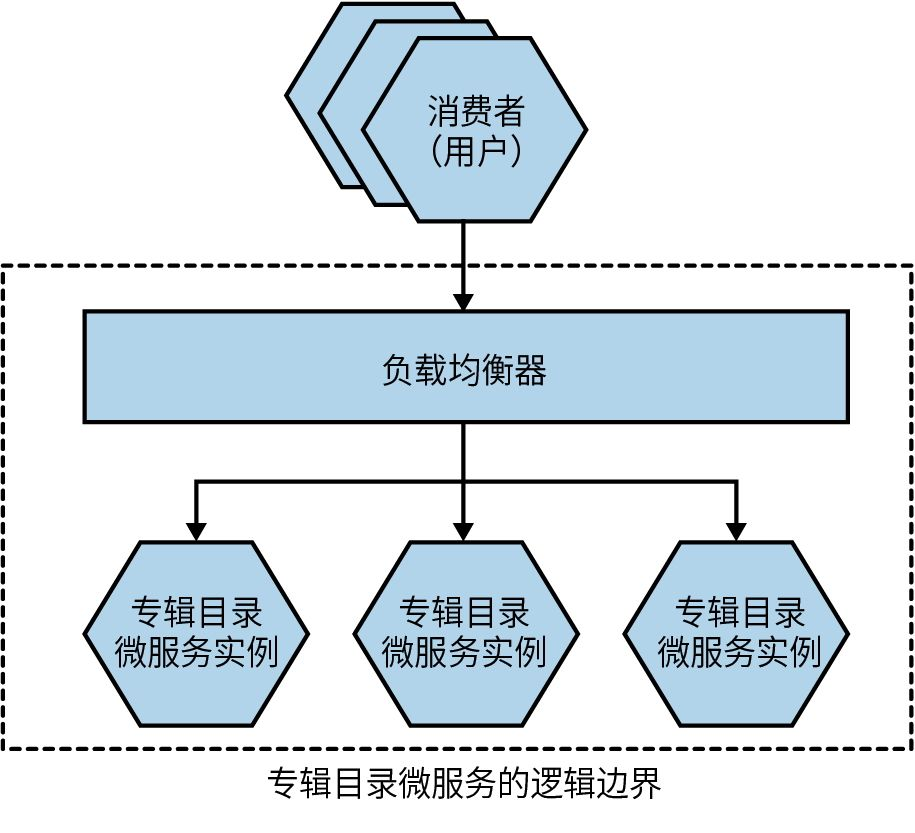

图13-1：使用负载均衡器分发请求，将专辑目录微服务部署为多个实例

横向复制的另一个例子是竞争消费者模式，详见《企业集成模式：设计、构建及部署消息传递解决方案》。在图13-2中，新歌被上传到了MusicCorp中。这些新歌需要被转换成不同的文件，以作为MusicCorp新流媒体服务的一部分。我们有一个存放这些任务的公共队列，一组歌曲转码服务的实例都在消费这个队列，也就是说，不同的实例在竞争这些任务。通过增加歌曲转码器实例的数量可以增加系统的吞吐量。

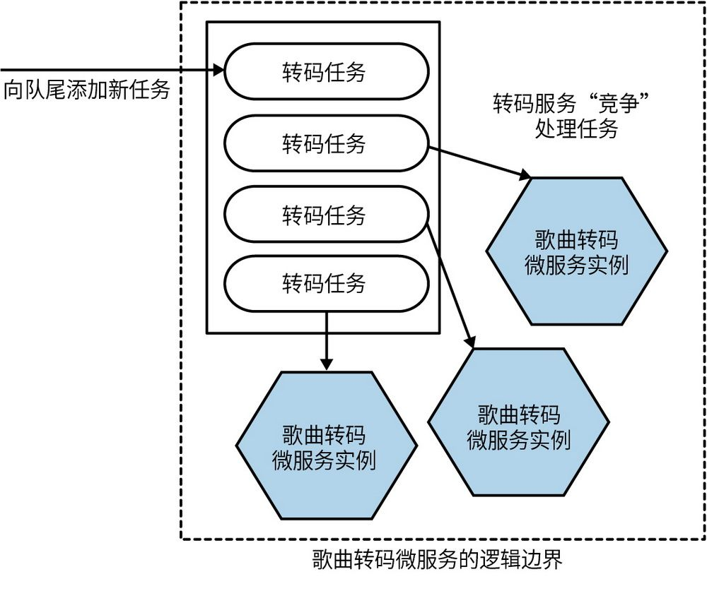

图13-2：通过竞争消费者模式扩展流编码转码

如图13-3所示，在FoodCo的例子中，我们使用了一种横向复制的形式，通过使用读副本来减少主数据库上的读负载。该操作减少了主数据库节点上的读负载，释放出了资源来处理写操作，这使得运行更加高效，因为服务上的许多负载是以读为主的。而将这些读操作重定向到读副本也很容易，通常做法就是在多个读副本上使用负载均衡器。

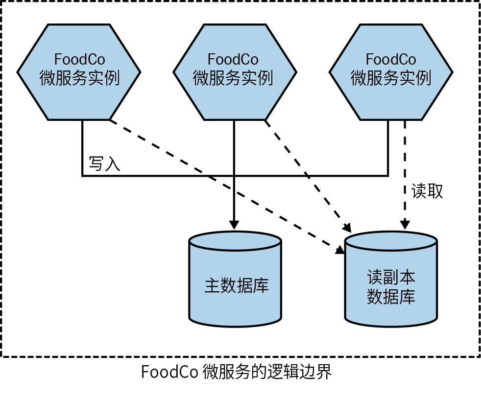

图13-3：FoodCo使用读副本来扩展读流量

微服务内部会处理到主数据库或读副本数据库的路由。对这个微服务的消费者来说，他们发送的请求最终是到达主数据库还是读副本数据库非常清晰。

**0****2****.****关****键****收****益**

横向复制相对简单，一般不需要修改应用，因为分配负载的工作通常可以在其他地方完成，比如通过消息代理上运行的队列或负载均衡器来完成。如果不能实现纵向扩容，那么下一步我就会考虑这种形式的扩展。

如果工作可以简单地分配到多个副本中，那么这会是一种分散负载和减少原始计算资源争用的优雅方法。

**0****3****.****限****制**

几乎与所有我们将要讨论的扩展选项一样，横向复制需要更多的基础设施，这必然会耗费更多的资金。此外，它可能还会有点儿“粗糙”：即便某单体应用中只有部分功能真正遇到了扩展问题，也要将其直接扩展为多个完整的副本。

这里的主要工作是实现负载的分配机制，范围从简单（如HTTP负载均衡）到复杂（如使用消息代理或配置数据库读副本）。你会依赖于这个负载分配机制来完成工作，因此掌握它的工作原理以及所选方案的限制至关重要。

有些系统可能会对负载分配机制提出额外的要求，例如，它们会要求将与同一用户会话相关的所有请求都定向到同一个副本。该问题可以通过使用支持黏性会话（sticky session）的负载均衡器来解决，但这反过来可能会限制可用的负载分配机制。需要引起重视的是，对这种黏性负载均衡有诉求的系统很容易出现其他问题。因此，通常来讲，我会避免所构建的系统出现这种要求。

#### 13.1.3 数据分区

介绍完比较简单的扩展形式，接下来让我们进入稍微难一些的部分——数据分区。数据分区需要我们基于数据的某些特点（如客户）来分配负载。

**0****1****.****实****现****方****式**

数据分区的工作方式是，找到与工作负载相关的键-值，并使用一个函数对其进行计算，从而得出该工作会被分配到的**分****区**（有时也称为“分片”）。图13-4展示了两个分区，这里有一个非常简单的函数。如果客户的姓氏以A~M开头，那么就会将请求发送到其中一个数据库；如果客户的姓氏以N~Z开头，则会将请求发送到另外一个数据库。对分区算法来说，这实际上是一个糟糕的示例（你马上就会知道原因），但希望该示例能简单明了地说明分区算法的思路。

本例是在对数据库层进行分区（简称“分库”）。客户微服务的请求可以命中其中任何一个实例。但是，当执行数据库相关的操作（读或写）时，该请求将根据客户的姓名被定向到适当的数据库节点。在关系数据库中，虽然两个数据库节点的结构是相同的，但是每个节点只包含客户数据的一个子集。

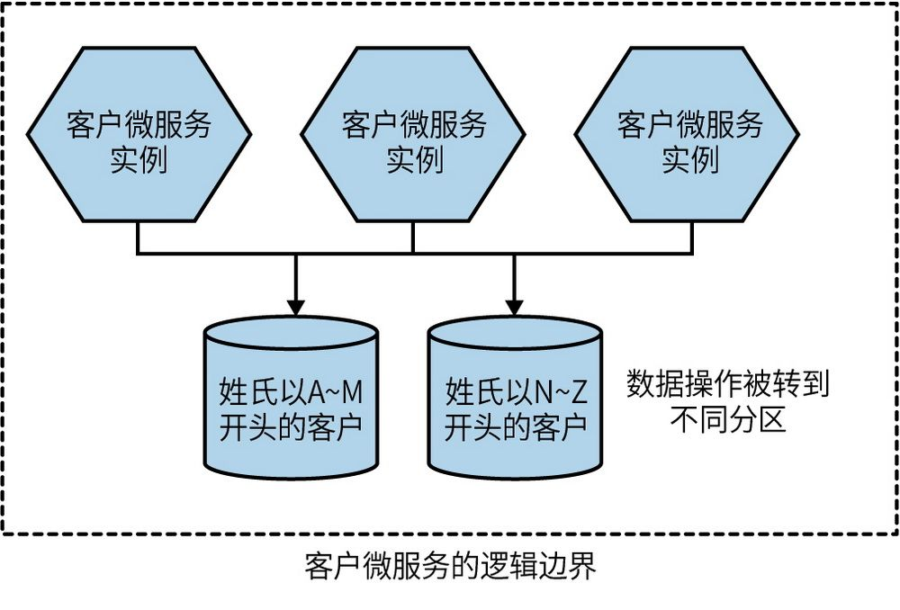

图13-4：客户微服务的数据被划分到两个不同的数据库

如果你使用的数据库技术支持这个概念，那么大多数情况下在数据库级别进行分区是很合适的，因为可以将这个问题抛给现成的实现。但是，如图13-5所示，我们还可以对微服务实例进行分区。在这种情况下，我们需要基于入站请求确定其应该映射到哪个分区，这在我们的示例中是借助某种形式的代理来完成。在基于客户的分区模型中，只要客户的姓名在请求头中就可以了。如果你希望为分区使用专用的微服务实例，这种方法非常有用，尤其是在你正使用内存作为缓存的情况下。这也意味着你可以同时在数据库级别和微服务实例级别扩展每个分区。

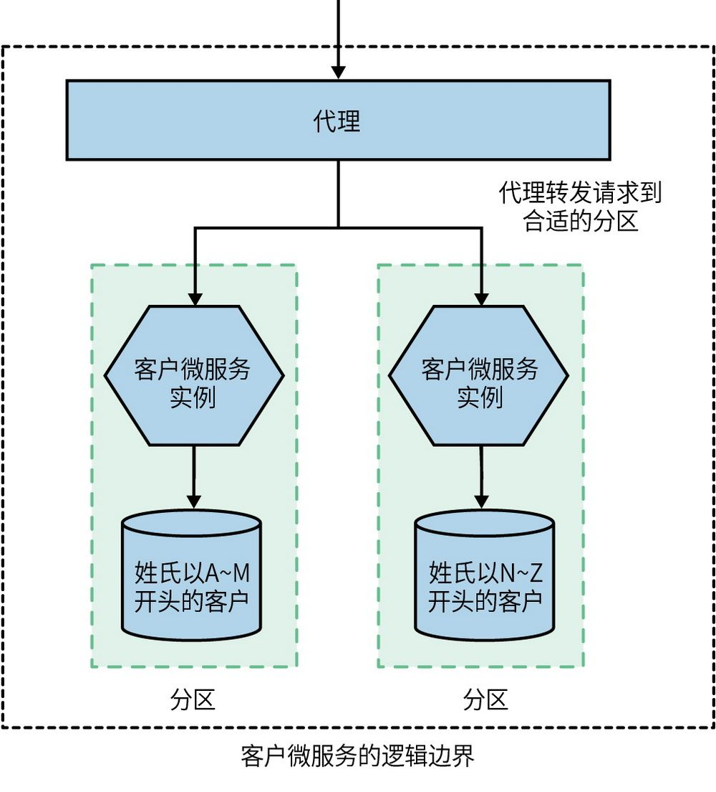

图13-5：代理将请求分发到合适的微服务实例

与读副本的例子类似，我们希望这种扩展以微服务消费者不知情的方式实现。当消费者向图13-5中的客户微服务发出请求时，我们希望将这些请求动态地路由到正确的分区。事实上，那些已经实现的数据分区应该被看作微服务的内部实现细节，这样我们才能自由地更改分区方案，或者完全替换分区。

另一个常见的数据分区示例是基于地理位置划分，比如每个国家有一个分区，或者每个地区有一个分区。

对FoodCo来说，处理在数据库上的资源争用的可选方法之一是在主数据库上基于国家/地区对数据进行分区，这样加纳的客户可以访问一个数据库，泽西岛（Jersey）的客户则可以访问另一个数据库。受多种因素影响，这种模式对FoodCo来说毫无意义。主要问题在于，FoodCo计划继续在地理上进行扩张，并希望通过同一个系统服务于多个地理位置的方式来提高效率。如果需要不断地为每个国家/地区设置新的分区，那么就会大大增加进入新国家/地区的成本。

通常情况下，分区会由其所依赖的中间件来完成，例如，Cassandra使用分区器来分发读写“环”中的节点，Kafka则支持跨分区主题（partitioned topic）的消息分发。

**0****2****.****关****键****收****益**

对于事务性负载，数据分区可以非常好地实现扩展。如果你的系统对“写”做了限制，那么数据分区可以对此做出巨大的改进。

创建多个分区还可以缩小运维工作涉及的范围，并降低负面影响。滚动更新可以按分区逐步展开。因为每次更新只涉及单个分区，所以这样做可以减少停机运维所带来的影响。如果按地理区域进行分区，那么就可以在一天中影响最小的时间（比如凌晨）完成需服务中断的运维操作。如果需要确保数据不能离开某些司法管辖区（比如确保与欧盟公民相关的数据仍然存储在欧盟内部），那么按地理分区也非常有用。

数据分区也可以很好地与横向复制相结合，让每个分区由多个能够处理该工作的节点组成。

**0****3****.****限****制**

需要注意的是，数据分区在提高系统健壮性方面效果有限。如果一个分区失效，那么你的部分请求也会随之失效。在将负载平均分布在4个分区上时，如果一个分区失效，那么你的25%的请求也将随之失效。虽然还没有糟糕到彻底失效的程度，但结果仍然不容乐观。如前所述，这就是为什么通常会将数据分区与横向复制等技术结合起来，以提高给定分区的健壮性。

确定合适的分区键可能会很困难。在图13-4中，我们使用了一种相当简单的分区方案，即根据客户的姓氏对工作负载进行分区，姓氏以A~M开头的客户会进入一个分区，姓氏以N~Z开头的客户会进入另一个分区。正如我在分享那个示例时指出的，这不是一个好的分区策略，因为在使用数据分区时，负载的分布应该足够均匀，而我介绍的方案无法做到这一点。不过，这只是一个示范扩展方案的例子，其本身不能给出均匀的负载分布，而且在不同国家/地区和文化中可能会得到截然不同的结果。

更好的替代方案可能是基于每个客户注册时给予的唯一ID进行分区，因为这样做更有可能得到均衡的负载分布，也可以应对用户更改名字的情况。

向现有方案添加新分区通常不会遇到太多麻烦。例如，向Cassandra的“环”中添加一个新节点不需要手动重新分布数据，因为Cassandra内置支持跨节点动态分布数据。另外，Kafka也可以很容易地添加新分区，虽然已经在分区中的消息不会被迁移，但是生产者和消费者可以动态地得到通知。

当你意识到分区方案不合适时，事情往往会变得非常棘手，就像前面基于姓氏的方案一样。在这种情况下，继续往前推进会很痛苦。我还记得多年前与一位客户的聊天，为了更改其主数据库的分区方案，他最终不得不将主要生产系统离线3天。

我们可能还会遇到查询的问题。查找单个记录很容易，只需应用哈希函数来查找数据应该在哪个实例上，然后在正确的分片中进行检索即可。但是跨越多个节点的数据查询（比如查找所有超过18岁的客户）怎么办呢？如果要查询所有的分片，那么就需要查询每个分片并在内存中合并查询结果，或者查询一个包含所有数据集的可读的替代存储。跨分片的查询通常由异步机制处理，并会尝试使用缓存的结果，比如Mongo会使用map/reduce作业来执行这些查询。

可能你已经从上面的描述中看出来了，给写操作扩展数据库是一件非常麻烦的事情，并且各种数据库的功能在这里有较大差异。我经常看到因为写操作的容量受到限制而改变数据库技术。如果遇到这种情况，那么购买一个更大的数据库通常是解决问题的最快方法，但同时你可能希望了解更多其他类型的数据库，看看它们能不能更好地满足你的需求。在众多不同类型的数据库中选择新的数据库技术是一项艰巨的任务，如果你想对此进行深入了解，我非常推荐阅读《NoSQL精粹》
	 ，该书简洁明了，对不同类型的NoSQL数据库进行了概述，包括高度关联存储（如图数据库）、文档存储、列存储和键-值存储。

从根本上说，对数据进行分区需要更多的工作，特别是因为它可能会对现有系统的数据进行大量更改。不过，应用程序代码可能只会受到较小的影响。

#### 13.1.4 功能拆分

通过功能拆分可以提取出能够独立扩展的功能。从现有系统中提取功能并创建新的微服务就是功能拆分的一种典型做法。图13-6展示了来自MusicCorp的一个例子，这里从主系统中提取了订单功能，从而让我们可以对其进行独立的扩展。

对FoodCo来说，这就是它的演进方向。它已经把纵向扩容用到头了，正在尽可能地实现横向复制。在不考虑数据分区的情况下，它开始将重心转向功能拆分。为了实现这个转变，关键数据和工作负载正在从核心系统和核心数据库中移除。我们识别出了一些速赢方案，包括将配送和菜单相关的数据从主数据库迁移到对应的微服务中。这还带来了一个额外的好处，即为FoodCo正在壮大的配送团队创造了机会，使其可以基于新微服务的所有权来调整自己的组织。

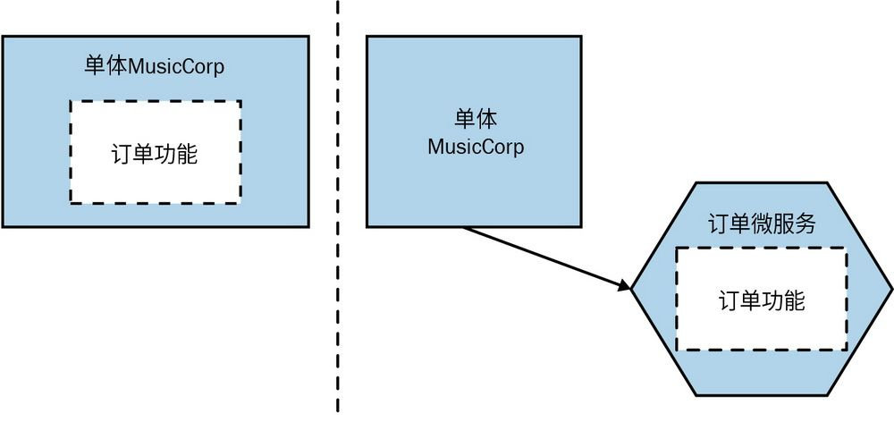

图13-6：订单微服务是从现有的MusicCorp系统中提取来的

**0****1****.****实****现****方****式**

这里就不过多地讨论这种扩展机制了，因为本书已经详细地介绍了微服务的基础知识。关于如何做出这种改变的详细讨论，请参见第3章。

**0****2****.****关****键****收****益**

事实上，我们已经划分出了不同类型的工作负载，这意味着现在可以按需调整系统所需的底层基础设施的配置。偶尔使用的功能可以在不需要时关闭。只有少量存在负载需求的功能会被部署到小型机器上。另外，对于有扩展需求的功能，可以考虑增加更多的硬件资源，也许可以将功能拆分与横向复制结合起来，比如运行微服务的多个副本。

这种能够按需调整基础设施来应对工作负载的能力，使我们能够更灵活地优化运行系统所需基础设施的成本。这也是大型SaaS供应商大量使用微服务的关键原因，因为找到基础设施成本的最佳平衡有助于提高其盈利能力。

就其本身而言，功能拆分不会使系统更加健壮，但它至少为我们构建能够容忍部分功能故障的系统提供了机会，第12章已对此做过详细探讨。

假设你已经采用了微服务来进行功能拆分，那么就会有更多的机会使用不同的技术来扩展拆分出来的微服务。例如，你既可以将功能迁移到对当前工作类型更有效的编程语言和运行时中，也可以将数据迁移到支持更合适的读写操作的数据库中。

本章主要关注的是软件系统上下文中的扩展，其实功能拆分也可以使组织层面的扩展变得更容易，第15章会对此进行深入讨论。

**0****3****.****限****制**

第3章曾详细探讨过，功能拆分是一项复杂的活动，不太可能在短期内带来好处。在我们接触过的所有扩展形式中，无论是前端的还是后端的，功能拆分可能是对应用程序代码影响最大的一种。如果要转向微服务，那么可能还需要在数据层进行大量的工作。

你最终运行的微服务的数量会增加，而这将增加系统的整体复杂度——可能会带来更多需要维护、保持健壮以及支持扩展的东西。一般来讲，当涉及系统扩展时，在考虑功能拆分之前，应尽可能尝试其他可能性。如果转向微服务可以带给组织正在追求的许多其他优势，那么我的观点才可能改变。以FoodCo为例，扩展开发团队以支持更多国家/地区并提供更多功能是关键动力。因此，对公司来说，向微服务的迁移不仅为其提供了解决系统扩展问题的机会，还提供了解决组织扩展问题的机会。

### 13.2 组合模型

提出扩展立方背后的主要动因之一是，防止我们狭隘地仅考虑一种扩展类型，帮助我们认识到有必要根据需要沿着多个维度考虑应用的扩展。在图13-6所示的例子中，我们已经提取了订单功能，因此它现在可以在自己的基础设施上运行。下一步，我们可以通过将订单微服务复制出多个副本来对它进行独立扩展，如图13-7所示。

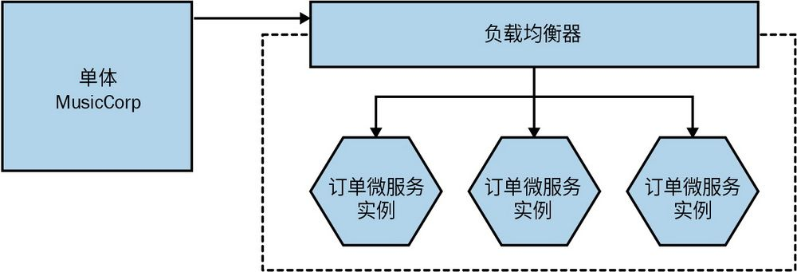

图13-7：提取出的订单微服务通过提高副本数来扩展

如图13-8所示，接下来就可以为不同的地理位置运行订单微服务的不同分片了。横向复制在各个地理边界内仍然适用。

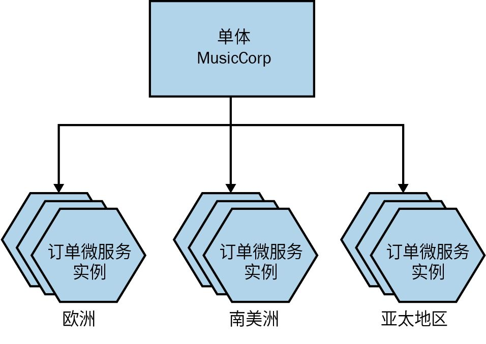

图13-8：MusicCorp的订单微服务已经跨地理分区，并且每组中都有可扩展的实例

值得注意的是，沿着一个维度的扩展可以让其他维度的扩展更容易实现。例如，订单的功能拆分使我们可以启动多个订单微服务的副本，继而实现对订单处理负载的分片。如果没有最初的功能拆分，那么这些技术就会受单体形式所限，无法得到应用。

扩展的目标不一定是实现所有维度的扩展，但我们应该意识到可以使用不同的机制。有了这些选项，重点就变成了理解每种机制的优点和缺点，并找出最合理的机制。

### 13.3 从小处着手

在《计算机程序设计艺术》一书中，高德纳说过一句名言：

真正的问题是，程序员花了太多时间在错误的地方和错误的时间担心效率问题，过早优化是编程中所有（至少是大部分）错误的根源。

优化我们的系统来解决还不存在的问题纯属浪费时间，这些时间本可以更好地用于其他事情，同时还能确保系统不会变得过于复杂。任何形式的优化都应该由实际需求驱动。正如12.1.1节中所讨论的，为系统增加新的复杂性也会引入新的脆弱性。通过扩展应用的某一部分，我们可能给其他地方带来了弱点。订单微服务现在能在自己的基础设施上运行，以更好地处理系统的负载。但是，要想让系统正常运行，还需要对另一个微服务的可用性进行保障，同时还不得不管理更多的基础设施并保持它们是健壮的。

即使你认为已经找到了瓶颈，也应该测试一下，这样才能确保你是正确的，后续工作也是合理的。令我惊讶的是，许多乐于自称为计算机科学家的人似乎对科学方法都没有基本的了解。
	 如果已经确定了问题，就试着明确少量可以做的工作，以确认所提出的解决方案是否有效。例如，在通过扩展系统来处理负载的场景中，拥有一套自动化负载测试会非常有用。运行测试获得基线后，再复现你遇到的瓶颈、进行调整并观察差异。这不是多么艰深的科学，但即使在很小的方面，我们也要尽量做到足够科学。

**C****Q****R****S****和****事****件****溯****源**

命令查询责任分离（CQRS）模式是一个可用于存储和查询信息的可选模型。与通常情况下用单一的模型去操作数据和检索数据不同，CQRS是将读取和写入的职责交由不同的模型去处理。由代码实现的读写分离的模型可以作为独立的单元进行部署，这样就可以独立地对读操作和写操作进行扩展了。CQRS通常（但并非总是）与**事****件****溯****源**一起使用，它不会将实体的当前状态存储为单个记录，而是通过查看与该实体相关的历史事件来推断实体的状态。

可以这样说，尽管CQRS存在大量不同的实现方式，但简单来看，大部分CQRS在应用层所做的事情与读副本在数据层所做的事情非常相似。

就我个人而言，尽管看到了CQRS模式在某些情况下的价值，但它确实是一个很难运行得好的复杂模式。我曾与那些在尝试让CQRS正常工作的人（他们都是非常聪明的人）交谈过，但还是遇到了一些严重的问题。因此，如果你正在考虑将CQRS作为一种用于扩展应用的方法，那么请把它视为实现难度较高的那类扩展形式。也许你可以先尝试一些较简单的方法。如果仅是读取受到限制，那么从读取副本着手可能是一种风险较低、实现起来较快的方法。这也让我对事件溯源的实现复杂性感到了担忧，它确实很适合某些情况，但随之而来的是一系列需要调整的让人头痛的问题。这两种模式都要求开发人员在思维上有相当大的转变，这总是带来更大的挑战。如果你决定使用这两种模式中的任何一种，就要确保开发人员因此增加的认知负荷是值得的。

关于CQRS和事件溯源的最后一个注意事项是，从微服务架构的角度来看，是否使用这些技术是微服务的内部实现细节。如果你决定通过在不同的进程和模型之间划分读写职责来实现微服务，那么对微服务的消费者来说，这些细节是不可见的。如果入站请求需要根据正在执行的请求重定向到适配的模型，那么就要让实现CQRS的微服务来负责。对消费者隐藏这些实现细节，可以让你在以后改变想法或改变应用这些模式的方式时拥有很大的灵活性。

### 13.4 缓存

缓存是一种常用的性能优化方式，通过缓存，我们可以存储某个先前操作的结果，这样后续请求就可以使用该存储值，无须花费时间和资源重新计算。

举个例子，考虑一个推荐商品的推荐微服务，它在推荐之前需要检查库存水平，因为推荐没有库存的物品是没有意义的。但我们决定在推荐微服务中保留库存水平的本地副本（一种客户端缓存形式），以提高操作的延迟，避免在推荐时出现需要实时检查库存水平的情况。库存水平的真实来源是库存微服务，它是推荐微服务中客户端缓存的**信****息****源**。当推荐微服务需要查找库存信息时，可以先在本地缓存中查找。如果找到了它需要的条目，就会被认为是一次**缓****存****命****中**（cache hit）。如果没有找到数据，则发生了**缓****存****缺****失**（cache miss），这时候需要找下游库存微服务查询库存信息。由于信息源中的数据会发生变化，因此我们需要一种机制来使推荐服务的缓存中的条目**失****效**，这样就能够判断本地缓存数据何时过期，而不再被使用了。

缓存可以存储简单查询的结果（如本例所示），但实际上它们可以存储任何数据，比如复杂计算的结果。我们可以通过缓存来提高系统的性能。作为减少延迟、扩展应用的一种手段，在某些情况下缓存甚至可以提高系统的健壮性。由于可以使用的失效机制有很多，而且还可以在多个位置实现缓存，因此在探讨微服务架构中的缓存时有很多方面需要讨论。接下来我们将从缓存有助于解决哪些问题开始讨论。

#### 13.4.1 用于提高性能

我们常会担心微服务架构下网络延迟带来的负面影响，以及需要与多个微服务交互以获取一些数据的成本。对于这些问题，从缓存中获取数据会很有帮助，因为这样既能避免网络调用，也能降低对下游微服务的负载压力。除了可以避免网络调用，它还减少了为每个请求创建数据的需要。考虑这样一种情况，我们需要按类型列出最受欢迎的条目。这可能涉及数据库级别的关联查询（join query），成本非常昂贵。如果我们缓存这个查询的结果，则仅需要在缓存的数据失效时再重新生成结果。

#### 13.4.2 用于提高扩展性

从缓存中读取数据可以避免一部分系统争用，以使系统扩展更容易实现。本章介绍过一个使用数据库读副本的例子。使用读副本处理读操作不仅可以减少主数据库节点的负载，也可以让读操作有效地扩展。但对读副本的读操作有可能会获得过期数据。数据库技术可以自动处理这种缓存失效，读副本的数据会在主节点数据和副本节点数据的同步过程中得到更新。

广义地讲，在数据源存在资源抢占的情况下，使用缓存都有助于扩展。在客户端和数据源之间设置缓存可以减少数据源的负载，使其具备更好的扩展性。

#### 13.4.3 用于提高健壮性

只要本地缓存中有可以使用的完整数据，即便数据源不可用，仍然可以继续操作，这样有助于提高系统健壮性。在使用缓存提高系统健壮性时，有一些注意事项。最主要的一点是缓存失效机制的配置。你不应该自动清除过期数据，而应该将其保留到需要更新为止。否则，当数据失效并被移除时，如果数据源不可用，我们就会遇到缓存缺失的同时还无法获取新数据的问题。这意味着在数据源不可用时，我们读取到的缓存数据可能已经过期很久了。虽然在某些情况下这样做是可以的，但在其他情况下会带来严重问题。

本质上讲，在数据源不可用时，使用本地缓存来提供健壮性意味着你更看重可用性而不是一致性。

我曾在《卫报》以及其他地方看到过一种技术，它会定期抓取现有的“活跃”网站生成一个静态的网站，以便在停机时继续提供服务。尽管抓取的版本不如实时系统提供的缓存内容新，但在紧急情况下，它可以确保站点至少有一个版本可用。

#### 13.4.4 将缓存设置在哪里

正如前面多次提到的，微服务可以提供多种技术选项。缓存也不例外，我们可以在很多位置设置缓存。本节会概述在不同位置设置缓存所需做的权衡，你所做的优化类型，很可能可以指导你选出对你最有意义的缓存位置。

下面我们继续探索缓存技术的几种选项。先回顾一下3.7节中提到的情况，在该节中，我们讨论了如何获取MusicCorp的销售数据。在图13-9中，销售微服务维护了已售商品的记录，它只追踪所售商品的ID和售出的时间戳。我们偶尔还需要销售微服务提供最近7天排名前10的畅销专辑列表。

这里的问题是，销售微服务只知道ID，而不知道专辑名称。我们只知道“本周最畅销专辑的ID是366548，其售出了35345套”。显然，我们还需要知道ID为366548的专辑名称是什么。专辑目录微服务存储了这些信息。也就是说，在图13-9中，当回复排名前10的畅销专辑列表的请求时，销售微服务需要取得这些专辑的名称。接下来让我们看看缓存如何在这里提供帮助，以及可以使用什么类型的缓存。

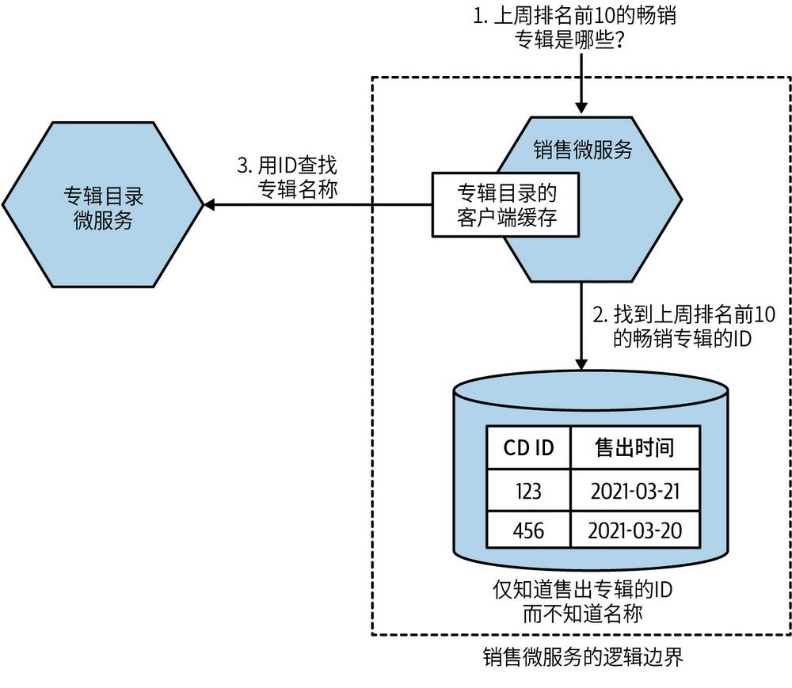

图13-9：MusicCorp获得畅销专辑列表的过程

**0****1****.****客****户****端**

在使用客户端缓存时，数据会被缓存到数据源之外的地方。在本例中，我们可以直接在销售微服务进程的内存中保存一个包含专辑ID和名称之间映射的哈希表，如图13-10所示。这意味着如果每次查找都命中缓存，那么生成畅销专辑列表的过程中将不需要和专辑目录微服务有任何交互。需要注意的是，客户端缓存可以只缓存获得信息的一部分。例如，在请求一张专辑的信息时，我们可以获得很多关于它的信息，但如果你只关心专辑名称，那么只需在本地缓存中存储专辑名称即可。

一般来说，采用客户端缓存往往会取得不错的效果，因为它可以避免对下游微服务的网络调用。这类缓存不仅适用于改善延迟，也适用于提高健壮性。

不过，客户端缓存也有一些缺点。首先，对可选择的失效机制往往会有更多限制，稍后我们会进一步探讨这一点。其次，当大量使用客户端缓存时，客户端缓存之间会存在一定程度的不一致。考虑这样一种情况：销售微服务、推荐微服务和促销微服务都有专辑目录微服务的数据的客户端缓存。当专辑目录微服务中的数据发生变化时，任何失效机制都无法保证这3个客户端中的数据能同时被更新。这意味着同一时刻下，我们在每个客户端中看到的缓存数据各不相同。拥有的客户端越多，问题就越严重。诸如基于通知的缓存失效（稍后会介绍）之类的技术有助于缓解但不能彻底消除这类问题。

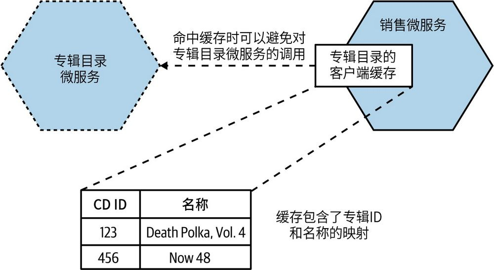

图13-10：销售微服务在本地存储专辑目录微服务数据的副本

如图13-11所示，另一种缓解方法是使用基于专用缓存工具（如Redis或memcached）来共享客户端缓存。这样可以避免不同客户端之间的数据不一致问题。这样一来，资源的利用率也更高了，因为减少了需要管理的数据副本的数量（缓存通常会位于内存中，而内存往往是基础设施中限制最大的资源之一）。但这也意味着客户端现在需要在共享缓存之间来回传输数据。

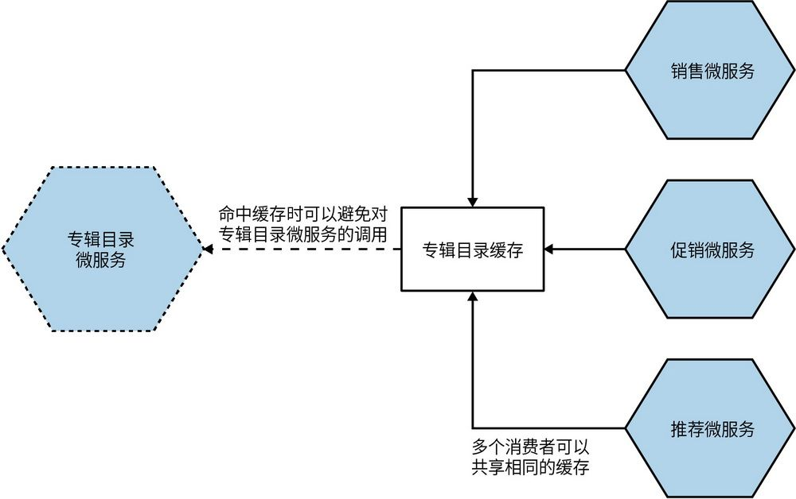

图13-11：专辑目录微服务的多个消费者使用同一个共享缓存

这里需要注意的是，谁应该负责维护这个共享缓存呢？根据谁拥有它以及它是如何实现的，这样的共享缓存会让客户端缓存和服务端缓存之间的界限非常模糊，接下来我们将继续对此进行探讨。

**0****2****.****服****务****端**

从图13-12中可以看到，前10名畅销专辑来自服务端缓存。在这里，专辑目录微服务代其消费者维护这个缓存。当销售微服务请求专辑名称时，该信息由缓存提供。

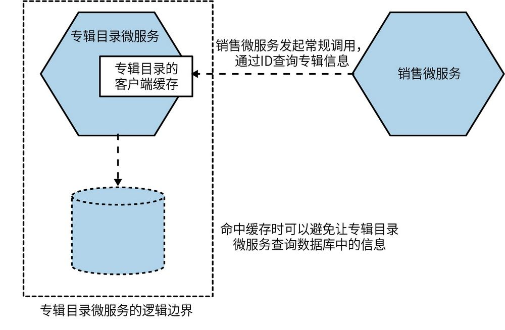

图13-12：专辑目录微服务在内部实现对消费者不可见的缓存

在这里，专辑目录微服务全权负责维护缓存。基于这些缓存的典型实现方式（比如内存中的数据结构或本地专用的缓存节点），可以实现更复杂的缓存失效机制。例如，在这种情况下实现透写模式的缓存（后面很快就会看到）会简单很多。使用服务端缓存还可以很容易地避免不同的消费者看到不一致的缓存数据的问题，而这种问题往往会发生在客户端缓存中。

值得注意的是，尽管从消费者的角度来看这种缓存是不可见的（这是一个内部实现），但这并不意味着我们必须在微服务实例中通过代码来实现缓存。例如，我们可以在微服务的逻辑边界内维护一个反向代理，使用隐藏的Redis节点或者转发查询请求来读取数据库的副本。

这种缓存的主要问题是它限制了对延迟的可优化范围，因为消费者仍需要与微服务进行交互。虽然将缓存置于微服务边缘或附近可以避免执行更昂贵的操作（如数据库查询），但仍需进行网络调用。这也降低了这种缓存方式在提高系统健壮性方面的效果。

这可能会使这种缓存看起来不那么有用，但通过内部实现缓存，对提高所有消费者微服务的性能来说是无感知的，这本身就具有巨大的价值。通过实现某种形式的内部缓存，组织内部广泛使用的微服务可以获得非常大的好处，这可以改善许多消费者的响应时间，同时也能使微服务的扩展更加高效。

在畅销专辑排名的场景中，需要考虑服务端缓存是否真的有帮助。这里的决策取决于所关注的重点。如果关注操作的端到端延迟，那么服务端缓存可能节省不了太多时间。相反，客户端缓存对此具有更好的性能优势。

**0****3****.****请****求****缓****存**

请求缓存是指为原始请求缓存对应的响应。例如，在图13-13中，销售微服务缓存了畅销专辑排名的结果，后续对畅销专辑排名的请求将直接返回缓存中的数据。既不需要查询销售微服务数据，也不需要和专辑目录微服务通信，就性能优化而言，这无疑是最有效的缓存方式。

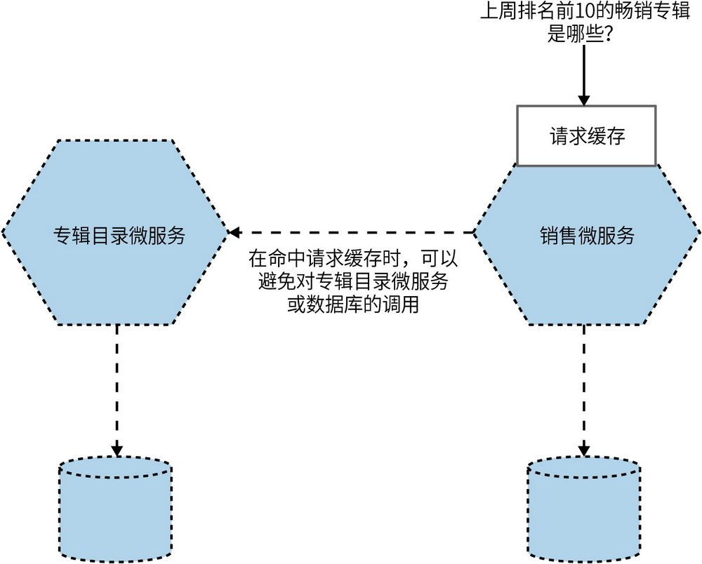

图13-13：缓存前10个请求的结果

这样做的好处显而易见——非常高效。但是，我们需要认识到，这种缓存形式有其高度特定性。我们仅缓存了该特定请求的结果。这意味着访问销售微服务或专辑目录微服务的其他操作将无法命中缓存，因此也就无法从这种优化方式中获益。

#### 13.4.5 让缓存失效

计算机科学只有两件难事：缓存失效和命名。

——Phil Karlton

让缓存失效是指从缓存中删除缓存数据的过程。这个想法在概念上很简单，但实践起来非常复杂。不说别的，仅实现方式上面就有大量的选项，而且在缓存数据可能过期的问题上有很多需要权衡的地方。从根本上讲，让缓存失效的难点在于，需要合理决策在何种情况下应当清除缓存数据。有时候是因为我们知道有新版本而删除了缓存数据，有时候则是因为我们假设缓存中的数据副本是过期的，需要从数据源获取最新副本。

关于缓存失效有多种技术，下面是我认为在微服务架构下比较合适的几个选项。但是请注意，这并不是对所有失效方式的详尽总结。

**0****1****.****存****活****时****间**

存活时间（TTL）是用于缓存失效的最简单的机制之一。假定缓存中的每个条目只在一定的时间内有效，在这段时间过后，数据自动失效，然后需要获取新的副本。我们可以使用简单的TTL指定缓存有效的持续时间。如果将TTL设置为5分钟，那么就意味着缓存将提供在最多5分钟内有效的缓存数据，在此之后，缓存数据将被视为无效，届时将需要新的数据的缓存副本。这种方式的变体是使用到期时间戳，有时候这样做可能会更有效，特别是在读取多级缓存的情况下。

HTTP既支持通过Cache-Control报头设置TTL，也支持通过响应的Expires报头设置到期时间戳，两种方式组合起来会非常有用。这意味着数据源本身就能告诉下游客户端，他们应该假设数据在多长时间内有效。回到库存微服务，我们可以想象这样一种情况：库存微服务对热门商品或即将售完的商品的库存水平设置了更短的TTL。对于销售较慢的商品，可以设置更长的TTL。这其实是HTTP缓存控制的一种高级用法，而对每个响应分别进行缓存控制是我在对缓存有效性进行优化时才会做的事情。对任何特定资源类型，一开始只设置统一的TTL是比较合理的。

即使不使用HTTP，从数据源来提示客户端如何（以及是否）缓存数据也是非常有用的技术。这样，客户端无须猜测，而可以根据提示明确地处理数据。

HTTP确实具有比这里更高级的缓存功能，稍后我们将会看到一个例子：带条件的GET请求。

基于TTL失效的挑战之一是，尽管实现起来很简单，但它是一种生搬硬套。如果我们请求一个具有5分钟TTL的数据的新副本，但1秒后数据源上的数据发生了变化，那么缓存会在剩余的4分59秒内操作过期的数据。因此，实现的简单性需要与使用过期数据的容忍度进行平衡。

**0****2****.****带****条****件****的****G****E****T****请****求**

值得一提的是，基于HTTP发送带条件的GET请求的能力被忽视了。正如我们刚刚提到的，HTTP提供了在Response上指定Cache-Control报头和Expires报头的能力，以支持更智能的客户端缓存。但是如果直接使用HTTP，那在我们的HTTP库中还有另一种选择：ETags或ETag。ETag用于确定资源的值是否已更改。如果我更新了一条客户记录，尽管请求资源的URI是相同的，但是值不同，这时我会期望ETag会改变。当我们使用带条件的GET时，这会变得非常强大。在发出GET请求时，我们可以指定额外的报头，告诉服务只有在满足某些条件时才发送资源。

假设我们获取了一条客户记录，它的ETag返回为o5t6fkd2sa。稍后，可能因为Cache-Control指令告诉我们资源应该被视为是陈旧的，所以我们希望确保获得最新版本。当发出后续的GET请求时，我们可以传入一个If-None-Match: o5t6fkd2sa。这会告诉服务器，除非已经匹配了这个ETag值，否则它需要获取URI指向的资源。如果当前已经是最新版本，那么服务会发送一个304 Not Modified响应，告知我们有最新版本。如果有一个更新的版本可用，那么我们将得到一个200 OK响应，其中包含已更改的资源和该资源的新ETag。

当然，使用带条件的GET，我们仍然是从客户端向服务端发出请求。如果正在构建缓存以减少网络交互，那么这可能对你没有太大帮助。它的有用之处在于可以避免不必要的资源再生成本。使用基于TTL的失效，客户端会请求资源的新副本，即使资源并没有改变。接收此请求的微服务必须重新生成该资源，即使该资源与客户端已经拥有的资源完全相同。如果响应创建的成本很高，可能需要一系列昂贵的数据库查询，那么带条件的GET请求可能是一种有效的机制。

**0****3****.****基****于****通****知****的****缓****存****失****效**

基于通知的缓存失效是指使用事件来帮助订阅者了解本地缓存条目的失效情况。在我看来，基于通知的失效是最优雅的失效机制，尽管与基于TTL的失效相比，我们需要权衡它实现的复杂度。

在图13-14中，推荐微服务正在维护一个客户端缓存。当库存微服务触发库存变更事件时，缓存中的条目将失效，目的是让推荐微服务（或此事件的任何其他订阅者）知道给定商品的库存水平的增减情况。

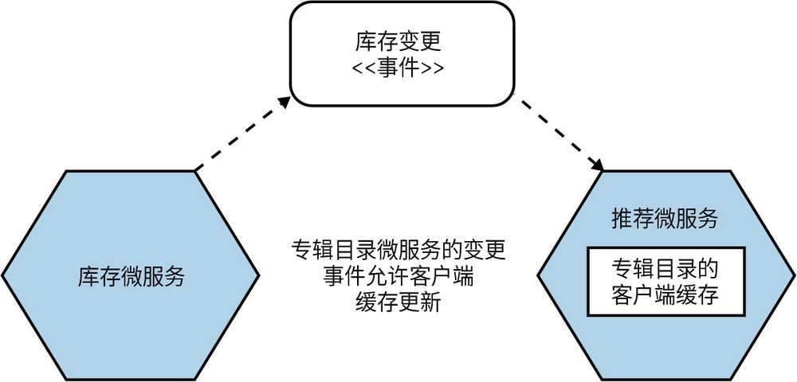

图13-14：库存微服务触发库存变更事件，推荐微服务可以使用该事件更新其本地缓存

这种机制的主要好处是减少了缓存服务提供过期数据的时长。现在，缓存提供过期数据的时长仅限于发送通知和处理通知所花费的时间。根据发送通知的机制，这个过程应该会非常快。

而这种机制的缺点是实现的复杂性。我们既希望数据源能够发出通知，也希望相关方能够响应这些通知。在这种情况下，使用消息代理之类的东西是很自然的，因为这个模型非常适合许多消息代理能提供的典型交互方式：发布/订阅式。消息代理能够为我们提供的附加保障可能也是有帮助的。然而，正如5.2.4节中已经讨论过的那样，管理消息传递“中间件”是有开销的，如果仅将其用于此目的，则可能会是过度使用。如果你已经在使用消息代理进行其他形式的微服务间通信，那么尽可能利用已有技术才是上策。

在使用基于通知的缓存失效时需要注意一个问题，那就是如何确认通知机制是否正常工作。假设我们在一段时间内没有接收到任何库存更改事件，那么有可能是因为库存没有变化，也有可能是因为通知机制已关闭而无法接收到更新。如果这是一个需要关注的问题，那么我们可以通过相同的通知机制发送一个心跳事件，让订阅者知道通知仍在发送，但实际上什么都没有改变。如果消费者没有接收到心跳事件，则客户端可以假设问题出现了，并可以采取适当的措施——也许通知用户他们看到的是过时的数据，也许简单地关闭某些功能。

同时，你需要考虑通知中包含什么内容。如果通知只是说“这个东西已经改变了”，而没有说明改变的是什么，那么消费者在接收到通知后就需要去获取新数据。但如果通知包含数据的当前状态，则消费者可以将其直接加载到本地缓存中。然而，包含更多数据的通知可能会因为尺寸过大而导致问题，也可能会过于广泛而暴露敏感数据。在4.8.2节中，我们已经深入探讨过其中的平衡。

**0****4****.****透****写**

透写（write-through）是指缓存与数据源中的状态是同时更新的。当然，“同时”也是透写缓存变得麻烦的地方。在服务端缓存上实现透写机制比较简单，因为你可以在同一个事务中更新数据库和内存缓存，这并不困难。如果缓存在其他地方，那么就更新这些条目而言，很难推断出“同时”将意味着什么。

鉴于上述原因，我们通常会在服务端的微服务架构中看到透写缓存。这样做的好处非常明显，即实际情况中可以消除客户看到的过时数据的可能性。这与服务端缓存通常不太有用这一点相权衡，因其限制了透写缓存在微服务中的有效作用范围。

**0****5****.****回****写**

在使用回写（write-behind）时，首先会更新缓存本身，然后再更新数据源。从概念上来说，可以把缓存看作缓冲区。相比更新数据源，写入缓存更快，因此我们可以将结果写入缓存，以便后续读取可以更快地进行，并且我们相信数据源会在后续进行更新。

然而，回写缓存的主要潜在问题是会造成数据丢失。如果缓存本身不是持久的，那么在写入数据源之前，数据可能会丢失。此外，在这种上下文中，“数据源”是什么呢？我们期望数据源是数据来源的微服务，但是如果先更新缓存，那么它不就成为数据源了吗？我们需要明确可信的数据源是什么。在使用缓存时，重要的是要区分哪些数据是缓存的（可能会过期），哪些数据可以被认为是事实上最新的。在微服务上下文中，回写缓存会使这一点变得不那么明显。

虽然我们经常在单个进程内部使用回写缓存来进行优化，但是在微服务架构中很少使用，部分原因是其他更直接的缓存形式已经足够好了，但主要原因是处理未写入的缓存数据的丢失非常复杂。

#### 13.4.6 缓存的黄金法则

注意不要过度缓存！缓存越多，数据就会越陈旧，进而客户端看到的数据的新旧程度就会越难确定。此外，过度缓存还可能造成更难判断哪些地方需要处理失效数据。权衡缓存的新鲜度与系统加载或延迟的优化是一个微妙的问题，如果无法轻易推断数据的新鲜程度，那么一切都会变得非常困难。

考虑这样一种情形：库存微服务缓存了库存水平，并从服务端缓存中响应请求，从而加快了响应速度。现在假设我们将该内部缓存的TTL设置为1分钟，这就意味着服务端缓存可能比实际库存水平晚1分钟。同时，我们在推荐微服务客户端也进行了缓存，使用了1分钟的TTL。当客户端缓存中的一个条目过期时，我们会从推荐微服务向库存微服务发送请求以获得最新的库存水平，但我们并不知道我们的请求已经到达了服务端缓存，此时服务端缓存也可能是1分钟前的。因此，最终我们可能会在客户端缓存中添加一条记录，而该记录是1分钟前的。这也就意味着推荐微服务使用的库存水平可能会有2分钟的过时，尽管从推荐微服务的角度来看，我们认为它们可能只过时了1分钟。

有很多方法可以避免类似的问题。与TTL相比，一种更好的方法是使用基于时间戳的过期的机制，但这也是缓存有嵌套时会发生的一种情况。如果你缓存了一个操作的结果，而该操作又是基于缓存的输入，那么该如何清楚地了解最终结果呢？

回到高德纳的名言：“过早优化是编程中所有（或至少大部分）错误的根源。”缓存增加了复杂性，而我们希望增加的复杂性越少越好。因此，理想的缓存位置数应该是0，任何超出这个数量的缓存都应当是经过深思熟虑的优化，但你要意识到它可能带来的复杂性。
	

应该将缓存主要视作一种性能优化手段。在尽可能少的地方缓存，以便更容易推断数据的新鲜度。

#### 13.4.7 新鲜度与优化程度

回到基于TTL的失效示例。前面已经解释过，如果我们请求的数据副本具有5分钟的TTL，并且在第1秒之后数据源的数据发生了变化，那么我们的缓存将在接下来的4分59秒内操作过期数据。如果这样的情况不可接受，那么有一种解决方案是减少TTL，从而减少我们可以操作陈旧数据的持续时间。因此，我们可以将TTL减少到1分钟。这也就意味着我们的过期窗口将会减少到原来的1/5，但是对数据源的调用次数将增加5倍，因此我们必须考虑相关延迟和负载的影响。

权衡这些驱动因素需要理解终端用户和更大系统的需求。显然，用户总是希望操作最新的数据，但如果这样做会导致系统在负载下崩溃，则毫无必要。同样，有时最安全的做法是在缓存失败时关闭相应的特性，以避免数据源上的过载导致更严重的问题。当涉及微调缓存的内容、位置和方式时，你经常会发现自己必须在多个方面进行权衡。这也是尽可能减少缓存的另一个原因，因为缓存越少，就越容易推断系统的行为。

#### 13.4.8 缓存中毒：一个需要警惕的故事

对于缓存，我们通常会认为，如果做错了，那么最糟糕的事情无非就是提供了一些陈旧的数据。但是，如果你始终提供过时的数据，那么会发生什么呢？回到第12章，在那里我介绍了AdvertCorp，然后利用绞杀者模式将一些现有的遗留应用迁移到了新的平台上。这涉及对调用多个遗留应用的拦截，以及将这些应用转移到新平台上。新应用作为代理运行得很顺利。那些还没有迁移的遗留应用流量通过新应用路由到了下游遗留应用中。对遗留应用的调用，我们做了一些简单的适配处理，例如，确保来自遗留应用的结果应用了正确的HTTP缓存头。

有一天，在一次正常的例行发布后不久，发生了一些奇怪的事情。我们引入了一个bug，其中一小部分页面由于缓存头插入代码的逻辑条件导致请求头没有更改而失败。不幸的是，这个下游应用在之前的某个时候也被改为了包含Expires: Never的HTTP报头。在此之前没有产生任何影响，因为这个头文件会被重写。现在却没有了。

应用大量使用了Squid来缓存HTTP流量，我们很快就注意到了这个问题，因为我们看到越来越多的请求绕过Squid本身来访问应用服务器。于是，我们修复了缓存头代码并发布了一个版本，还手动清除了Squid缓存的相关区域。然而，只做这些还不够。

正如我们刚刚讨论的，你可以在多个位置进行缓存，但有时拥有大量缓存会使工作更加困难，而不是更容易。当涉及为面向公众的Web应用用户提供内容时，你和客户之间可能存在多个缓存。这是因为不仅你的网站上可能会有类似CDN的东西，而且一些ISP也会使用缓存。你能控制这些缓存吗？即使可以，也有一个缓存是你几乎无法控制的：用户浏览器中的缓存。

那些包含Expires: Never的页面会被困在许多用户的缓存中，在缓存变满或用户手动清理之前都不会失效。显然，我们无法触发这两种情况，因此唯一的选择是更改这些页面的URL，以便重新获取。

缓存确实可以非常强大，但你需要了解从数据源到目的地之间被缓存数据的完整路径，只有这样才能真正理解其复杂性以及可能出现的问题。

### 13.5 自动扩展

如果你足够幸运，拥有完全自动化的虚拟主机供应，并且可以实现微服务实例的完全自动化部署，那么也就拥有了自动扩展微服务的“积木”。

例如，你可以利用已知的趋势来触发扩展。你可能知道系统在上午9点到下午5点的峰值负载，因此会在上午8:45启动额外的实例，并在下午5:15将其关闭。如果你正在使用像AWS（对内置的自动扩展提供了很好的支持）这样的服务，那么关闭不再需要的实例将有助于节省成本。你需要通过数据来了解负载是如何随着时间的推移，每天、每周而发生变化的。有些行业也有明显的季节周期，因此你可能需要回溯相当长时间的数据来做出适当的判断。

另外，你的服务可能是“响应式”的，在看到负载增加或实例故障时会启用额外的实例，在不再需要时会将其删除。关键是要清楚，一旦发现上升趋势，你可以以多快的速度进行扩展。如果你知道只会在几分钟内收到负载增加的通知，但扩展将需要至少10分钟，那么就需要保持额外的容量来弥补这一差距。因此，拥有一套好的负载测试在这里几乎是必不可少的。你可以使用它们来测试自动扩展规则。如果没有能够重现不同负载触发扩展的测试，那么你就只能在生产环境中发现规则是否有误。失败的后果并不严重！

新闻网站就是一个很好的例子，在这种类型的业务中，你可能需要混合预测式扩展和响应式扩展。在我之前工作的那家新闻网站上，我们看到了非常清晰的每日趋势，从早上到午餐时间，浏览量不断攀升，然后开始下降。这种模式日复一日地重复，周末的流量普遍较低。这为我们提供了一个相当明确的趋势，可以推动资源的主动扩展，无论是向上还是向下。另外，重大新闻会导致意外的峰值，通常在短时间内需要更多的容量。

实际上，我看到自动扩展更多时候是被用在了处理实例的失败而非响应负载的条件上。AWS允许你指定诸如“该组中至少应该有5个实例”这样的规则，这样如果一个实例停机，则新实例会自动启动。不过，当有人忘记关闭规则，然后试图删除实例进行维护时，这种方法就会导致一种有趣的结果：就像打地鼠游戏一样，它们一直在转圈。我曾经见过这种情况。

响应式扩展和预测式扩展都非常有用，如果你使用的平台允许仅为所使用的计算资源付费，则它们可以帮助你提高成本效益。但响应式扩展和预测式扩展也要求你仔细观察现有的数据。我建议在收集数据时先对故障情况应用自动扩展。一旦你想开始为负载应用自动扩展，就要非常谨慎，不要过快地缩减。大多数情况下，手头拥有超过所需的计算能力比没有足够的计算能力要好得多。

### 13.6 重新出发

当系统需要处理不同负载时，原有架构可能无法满足工作要求。诸如纵向扩容、横向复制之类的扩展形式对系统架构影响有限。因此，在某些情况下，我们需要采取激进的措施改变系统架构以应对下一个级别的增长。

前面在Gilt的故事中，我们提到过“隔离式执行”。一个简单的单体Rails应用在Gilt上运行了两年。随着该公司业务越来越成功，客户越来越多，但负载也越来越大。在某个临界点上，该公司不得不重新设计应用以处理所面对的负载。

重新设计时可以采取拆分现有单体的方式，就像Gilt所做的那样。或者，可以采用能够更好地处理负载的新数据存储。还可以采用新技术，比如从同步请求-响应转向基于事件的系统、采用新的部署平台、改变整个技术栈，或者其他任何方法。

但重新设计存在危险，即达到某种扩展阈值时，人们会认为需要重新架构，并将其作为在起步时进行大规模构建的理由。这可能是灾难性的。在新项目开始时，我们通常不知道想要构建什么，也不知道是否会成功。我们需要快速试验并知道需要建立什么能力。如果尝试预先进行大规模构建，那么最终我们就会预先进行大量工作来准备可能永远不会出现的负载，而这会分散我们进行其他更重要的活动（比如了解是否有人真的想要使用我们的产品）的精力。Eric Ries讲述了他花费6个月的时间来开发一个产品，但根本没人下载的故事。他想，这跟在网页上放一个链接，当人们单击它查看是否有需求时会出现404有什么区别？将这6个月的时间用于度假岂不是更好？

改变我们的系统以应对扩展并不是失败的象征，而是成功的象征。

### 13.7 小结

正如你所看到的，无论你在寻找什么类型的扩展，微服务在如何处理问题方面都会给出不同的选择。

在你考虑有哪些类型的扩展可供使用时，扩展立方是一个不错的模型。

**纵****向****扩****容**

简而言之，这意味着需要一台更大的机器。

**横****向****复****制**

有多个能够并行处理相同工作的副本。

**数****据****分****区**

将工作按照数据的某些属性（如客户群体）进行划分。

**功****能****拆****分**

将工作按照类型进行划分，比如按微服务进行拆分。

知道自己想要什么是解决许多问题的关键——在提高延迟方面有效的技术可能在扩展容量方面并不起作用。

然而，需要注意的是，之前讨论的许多扩展形式都会增加系统的复杂性。因此，在有针对性地改变系统方面，避免因过早优化带来的危险至关重要。

接下来，我们将把注意力从幕后的技术转移到系统中最为显著的部分——用户界面上来。
