## 第14章 用户界面

目前为止，本书还没有涉及用户界面相关的内容。虽然有些人可能仅为他们的客户提供缺乏用户体验、设计简陋的界面，但我相信大多数人其实更渴望创造出漂亮、实用且令客户满意的用户界面。毕竟，用户界面是我们将所有后端微服务组合到一起，为客户产生价值的地方。

当我刚开始接触计算机时，我们主要关注的是运行在桌面计算机上臃肿的客户端。为了让软件尽量好用，当时我花了很多时间在Motif和Swing上。我的这些系统通常只是用于创建和操作本地文件，但它们中的大多数包含运行在服务端的组件。我在Thoughtworks的第一份工作就是开发一个基于Swing的POS系统，它只是众多系统组件之一，其他大部分组件运行在服务端。

后来Web技术出现了。一开始，我们认为用户界面应该是“很薄”的一层，更多的业务逻辑是在服务端。起初，服务端程序渲染了整个页面，并将其发送到客户端浏览器，而浏览器只做很少的事情。任何互动都是通过将用户单击链接或填写表单时所触发的GET请求和POST请求发送到服务端，由服务端处理的。随着时间的推移，JavaScript成为一种更流行的选择，它可以为浏览器的用户界面添加动态行为，但这也导致一些应用变得像过去的桌面客户端一样臃肿。随着移动应用的兴起，如今我们有了更多可选择的平台和技术来为用户提供图形用户界面。这一系列的技术提供了丰富的选择，让我们能够基于微服务构建更加高效的用户界面。本章将探讨上述所有内容，并深入探究相关技术。

### 14.1 迈向数字化

在过去的几年里，企业已经不再认为Web应用或移动应用应该被区别对待，在考虑数字化时，二者应作为整体进行考虑。让客户使用我们提供的服务的最佳方式是什么？这又会对系统架构产生什么样的影响？由于无法准确预测产品将怎样被客户使用，这就促使API的粒度被设计得更细，比如基于微服务来提供API。通过将微服务进行组合，我们能够提供各种可组合的业务能力，从而为客户在不同接入方式下创造差异化的体验，比如桌面应用、移动设备、可穿戴设备，甚至是实体店中的各种物理设备。

因此，我们可以把用户界面看作一个组合各种能力并最终向用户提供服务的平台。那么该如何把这些能力组合到一起呢？接下来让我们从以下两方面来看一下：人和方法。人的角度其实就是组织层面上谁应对用户界面的交付负责。方法的角度则是关于如何利用一系列模式去实现各种用户界面。

### 14.2 集中所有权模型

正如第1章中所讨论的那样，传统的分层结构可能会严重影响软件交付的效率。图14-1展示了一个典型的例子，其中用户界面层由一个前端团队负责，而后端服务的工作由另一个团队完成。在这个例子中，添加一个简单的控件需要由3个不同的团队共同完成。这样的分层组织结构会大大影响交付速度，因为我们需要不断地协调变化，并在团队之间频繁地交接工作。

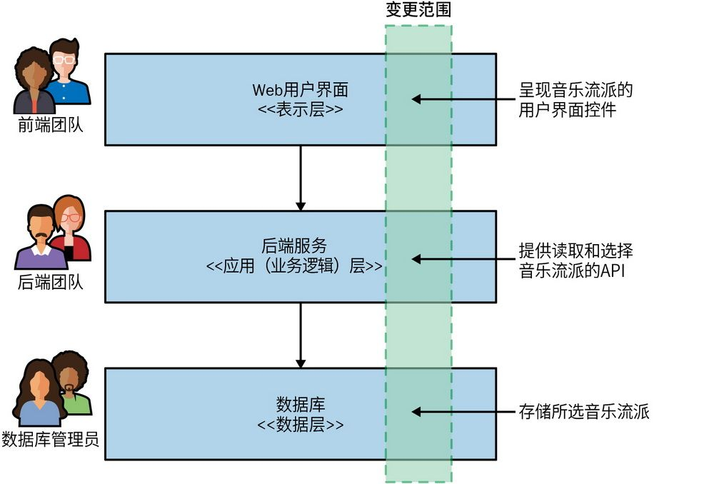

图14-1：跨三层进行变更比较麻烦

如图14-2所示，我更提倡的模式是，将用户界面分解后，分别交由不同的后端团队来管理，以便做到独立部署，同时，这些团队也会管理服务端的组件。在这种情况下，一个团队最终会负责某个需求的所有变更，比如交付对客户直接产生价值的业务组件。

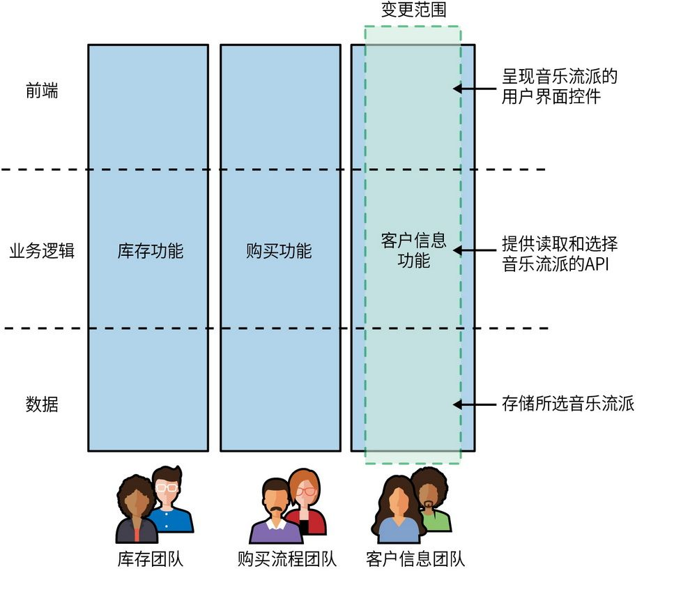

图14-2：用户界面被分解成多个部分，每个部分由一个团队负责，该团队还负责支撑用户界面工作的服务端能力

对端到端功能具有自主掌控权的团队能够更快地响应需求变更。这种端到端的所有权，极大地鼓励了各个团队直接与软件的最终用户建立连接。但对纯后端团队来说，其实很容易对用户真实的需求产生认知偏差。

尽管存在这些弊端，我仍然不幸地看到在很多采用微服务的组织中，还在大量利用这种统一前端团队的模式，安排唯一的前端团队与多个后端团队协作。这是为什么呢？

**成****立****独****立****前****端****团****队****的****关****键****因****素**

组织之所以需要设置独立的前端团队，是因为考虑了以下3个关键因素：专家资源稀缺、确保一致性，以及复杂技术的挑战。

首先是专家资源稀缺。交付用户界面需要一定深度的专业技能，这包括交互设计和图形设计方面的技能，以及构建高质量Web或本地应用体验所需的技能。具备这些技能的专家非常稀缺，正所谓“物以稀为贵”，所以你总想把他们都集中在一起，这样就可以确保这些专家专注于自己擅长的领域了。

其次是确保一致性。如果仅有一个团队负责向客户交付用户界面，那么就可以确保用户界面有一致的外观和体验。使用一组相似的控件来解决类似的问题，可以使整个界面更加一致和协调，从而让客户感觉这是一个连贯且完整的整体。

最后是复杂技术的挑战。一些用户界面技术在非单体方式下使用时可能具有挑战性。我最先想到的是单页应用（SPA）技术，至少在过去，它很难被拆分开。更传统的方式是Web用户界面由多个Web页面组成，页面之间能相互导航跳转（通过HTTP请求）。而在SPA中，整个应用都是在单一网页中运行的。理论上，像Angular、React和Vue这样的框架，都可以用来创建比“传统”网站更复杂的用户界面。然而，有哪些不同的模式可用来拆分用户界面呢？在支持采用SPA框架的同时，微前端又是如何尽量避免使用单体用户界面的呢？本章稍后会给出一组模式，这些模式对上述问题做出了很好的解释。

### 14.3 业务流团队

在我看来，一个独立的前端团队往往无法达成提升交付吞吐量的目标。这样的设置使得组织中多了一个瓶颈，会导致整体进度的滞缓。理想的情况是，让团队围绕着端到端的功能切片进行对齐，使得每个团队都能向其客户直接交付功能，同时还能减少所需的协调工作。我推荐的模式是，由一个团队负责某领域内特定部分的端到端功能交付。这与Matthew Skelton和Manuel Pais在《高效能团队模式》一书中所描述的**业****务****流****团****队**概念不谋而合。

业务流团队与其所工作的业务知识范围应该具备较高的匹配度……它被授权尽可能快速、安全且独立地构建并交付客户（或用户）价值，并且在此过程中不需要将工作分配给其他团队。

你可能也发现了，我们说的正是**全****栈****团****队**（而不是全栈开发人员）。
	 一个具备端到端功能交付能力的团队会与最终用户建立更加明确和紧密的连接。有一种屡见不鲜的情况，“后端”团队对软件功能或用户需求没有准确的理解，在实施新功能时产生了误判。相比之下，端到端团队则更容易与软件的用户建立直接联系，因此他们可以更加专注地向用户提供其真正需要的服务。

这里有一个非常形象的例子。我有段时间与FinanceCo进行了合作，这是一家位于欧洲的业绩非常不错的成长型金融科技公司。在FinanceCo，几乎所有的团队都在开发直接影响客户体验的软件，并且其关键绩效指标（KPI）是以客户为导向制定的——某一个团队的成功并不取决于它交付了多少功能，而取决于帮助改善了多少用户的使用体验。由此，可以清楚地总结出什么样的变更会对客户产生影响。这也促使大多数团队明确了在交付软件时对客户的职责。如果不深入理解客户的需求，就很难知道付出是否有成效，最终会导致你的目标与客户的核心需求相去甚远。

让我们重新审视独立的前端团队存在的关键因素——专家资源稀缺、确保一致性，以及复杂技术的挑战。下面来看看如何解决这些问题。

#### 14.3.1 共享专家

好程序员本就不可多得，具备某项专长的好程序员更是凤毛麟角。例如，在前端领域，如果要同时交付原生移动端和Web端的界面，那么你可能需要的是对iOS、安卓以及现代Web开发都有经验的人。除此之外，你可能还需要专门的交互设计师、图形设计师、无障碍专家等。在这些相对“狭窄”的领域中还拥有一定技术深度的人在市场上是比较稀缺的，导致他们往往面对超额的工作量，分身乏术。

如上所述，传统的组织结构安排是将具有相同技能的人员聚集在同一团队中，以便严格控制他们的工作范围和内容。但这种做法往往导致了部门间的信息孤岛现象。

把拥有专业技能的人放在各自独立的团队中剥夺了其他开发者学习这些必要技能的机会。例如，并不是每一个开发人员都需要成为iOS开发专家，但学习一些该领域的技能能够让他们更为轻松地应对和处理工作，这也让专家们能把更多精力放在处理更加困难的任务上。另外，建立实践社区（CoP）也可以促进技能共享——你可以考虑建立一个跨团队的用户界面社区，以便同行间分享想法和挑战。

过去，所有的数据库变更都必须由数据库管理员（DBA）来完成，这导致开发人员对数据库的工作原理知之甚少，经常开发出一些对数据库使用不当的软件。而有经验的DBA又被要求去做一些琐碎而重复的变更。随着更多的数据库操作被分配到交付团队，开发人员对数据库有了更好的理解，可以更加正确的处理自己的日常工作，从而也就把DBA的价值解放了出来，使其能够专注于更复杂的数据库问题，这就充分利用了他们的技能和经验。类似的转变也发生在运维和测试领域，更多这类工作被划分到了业务交付团队中。

预想中，将专家从专门的团队中移出来会限制他们的工作能力。而实际上，这反而大概率增加了他们的“带宽”，使其能够专注于更加需要关注的难题。

这里的诀窍是找到一种更有效的方式来部署专家。理想情况下，他们应该被嵌入到团队中。但有时候，可能没有足够的工作量来支撑他们全职待在一个特定团队，这种情况下他们很可能需要把时间分配到多个团队中。另一种模式是，创建一个具有这些技能的独立团队，其工作目标是**赋****能**其他团队。在《高效能团队模式》一书中，Skelton和Pais将这些团队定义为**赋****能****团****队**。他们的任务是帮助其他专注于交付业务功能的团队完成工作。你可以把这些团队想象成内部顾问——他们可以深入团队内部，有针对性地分配时间来与业务流团队合作，帮助他们在某个特定领域自给自足，或者帮助他们搞定某个特别棘手的工作。

因此，无论组织中的专家是全职嵌入一个特定的团队，还是辅助其他团队完成相同的工作，都可以消除组织的孤岛，同时也能帮助其他同事提高技能。

#### 14.3.2 确保一致性

还有一个经常用来解释需要独立前端团队的理由是一致性问题。由同一个团队负责用户界面，可以确保一致的外观和体验。这意味着要使用一致的设计和交互语言来帮助用户与系统交互——可以从使用同一种颜色和字体等简单事项延伸到以统一的方案解决同一类界面问题。这种一致性不仅有助于更精确地传达产品的细节，而且在新功能交付时，还能够确保用户更容易发现和使用它。

有一些方法可以帮助确保各团队之间一定程度的一致性。例如，使用赋能团队模式，让专家们与多个团队合作，就可以帮助确保每个团队的工作成果是一致的。同时，创建实时更新的CSS样式指南或共享的用户界面组件等共享资源，也会有所帮助。

这里有一个使用赋能团队来帮助实现一致性的具体例子。《金融时报》的Origami团队与设计团队通过合作建立Web组件库的方式封装了品牌标识，从而确保了整个业务流团队交付的内容从外观到体验的一致性。这种类型的赋能团队提供了两种形式的帮助：首先，它分享了使用预制组件进行交付的专业技术；其次，它帮助确保了各团队提供一致用户体验的用户界面。

然而，值得注意的是，追求一致性并不是一种普遍正确的做法。有些组织似乎是在有意识地不强调用户界面的一致性，因为他们觉得让团队拥有更多的自主权反而更好。以亚马逊公司为例，它的主购物网站的早期版本就有很大程度的不一致，其不同小部件使用的控件风格迥异。

这一点在AWS的Web控制面板上表现得更加明显。AWS的不同产品有大量不同的交互模式，使得用户界面相当令人困惑。然而，这似乎是亚马逊期望减少团队间协作所导致的结果。

AWS产品团队的自主性增强除了表现在时常脱节的用户体验方面，还表现在其他方面。通常有多种方式可以实现同一任务（比如运行容器就有多种方式），AWS内部不同的产品团队经常存在类似但不兼容的重复的解决方案。你可能会批评这样做的结果，但事实表明，通过这些高度自主的产品导向团队，AWS显然已经成为一家具备市场领先优势的公司。至少在AWS看来，交付的速度胜过用户体验的一致性。

#### 14.3.3 持续应对技术的挑战

随着用户界面的发展，我们经历了一系列有趣的演变——从基于绿屏终端的文本用户界面，到丰富的桌面应用、Web应用，以及现在的原生移动体验。我们已经完整地经历了这些发展阶段。如今的一些客户端应用被构造得非常复杂和精细，其复杂程度绝对可以与曾经的富桌面应用相媲美，而那些富桌面应用在21世纪的第一个10年里一直是用户界面开发的主流。

从某种程度上来说，变化的地方虽多，保留不变的地方也很多。我们仍在经常使用那些与20年前相同的用户界面控件，比如按钮、复选框、表单、组合框等。尽管我们在这些控件里面增加了一些组件，但增加的数量远比你想象得要少。发生变化的是用来创建这些图形用户界面背后的技术。

这个领域的一些新技术，特别是单页应用，在拆分用户界面时会带来一些问题。此外，我们希望在更多的设备上提供相同的用户界面，而这又带来了新的问题和挑战。

从根本上说，用户希望以尽可能无缝的方式与我们的软件互动。无论是通过桌面浏览器或桌面应用，还是通过Web应用或原生移动应用，用户体验都是一样的，即用户会通过一个单一的窗口与我们的软件互动。用户并不关心用户界面究竟是以模块化还是单体的方式构建。因此，我们必须找到将用户界面功能拆分，然后再重新组合起来的办法，同时还要应对单页应用、移动设备等带来的挑战。接下来，本章将逐一论及这些问题。

### 14.4 单体前端模式

**单****体****前****端**是一种架构模式，其特点是所有的用户界面状态和行为都被定义在用户界面本身中，通过直接调用相应的微服务来获得所需的数据或执行所需的操作。如图14-3所示，因为我们想要在用户界面上显示一张专辑和它的曲目列表信息，所以用户界面发出了从专辑微服务中获取这些数据的请求，同时，我们还通过向促销微服务发送请求，将最近的特价信息显示了出来。在这个例子中，我们的微服务会返回JSON格式的数据，用户界面会使用这些数据来更新显示的信息。

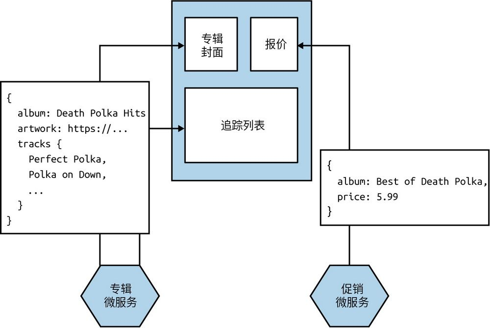

图14-3：专辑详情页从下游的微服务中获取信息以呈现到用户界面上

这种模式是最常见的，适用于那些构建整体式单页应用的人，通常会有一个专门的前端团队。我们对微服务的要求非常直接，它们只需返回能够被用户界面轻松解析的信息即可。在基于Web用户界面的情况下，我们的微服务可能需要以文本格式提供数据，常见的选择是JSON格式。然后，用户界面需要创建构成界面的各种组件，并处理与后端的状态同步等。在基于网页的客户端中使用二进制协议进行服务间通信可能会更困难。但对本地移动设备或臃肿的桌面应用来说应该是不错的方式。

**应****用****时****机**

这种模式存在一些弊端。首先，由于其单体的本质，它可能是建立专门的前端团队的原因（或由此造成）。因为存在多个需求变更的来源，所以让多个团队共同负责这个单体前端可能是一个巨大的挑战。其次，我们几乎没有能力同时为不同种类的设备定制统一的响应机制。如果仅使用Web技术，那么我们可以改变屏幕的布局，以适应不同设备的限制，但这并不包括对微服务调用差异的适配。例如，我的移动客户端只能显示一个订单的10个字段，但如果微服务返回的是订单的所有100个字段，则会导致检索不必要的数据。对此，一种解决方案是，用户界面在提出请求时指定要获取的字段，但前提是，每个提供支撑的微服务都有这种形式的交互。在14.11节中，我们会讨论在这种情况下，如何使用BFF的模式和GraphQL来帮助解决问题。

实际上，当你**希****望**用户界面的所有实现和行为都在一个可部署单元中时，这种模式效果最好。对一个独立团队来说，如果前端服务和所有支撑的微服务都由其负责开发，那么这样是比较好的。在我看来，如果组织中有不止一个团队在开发软件，则应该避免这种模式，因为它可能会导致组织转向分层架构，并因此而形成组织孤岛。可惜的是，在无法避免分层架构和与之匹配的组织结构时，这可能就是你最终要使用的模式。

### 14.5 微前端模式

**微****前****端**其实是一种组织模式，这种模式让前端的不同部分可以独立运作和部署。关于这个话题，我强烈推荐阅读Cam Jackson的文章“Micro Frontends”，该文对**微****前****端**的定义如下：微前端是一种架构风格，通过组合能独立交付的前端应用来构成一个更大的整体。

对那些希望同时负责后端微服务和对应的用户界面的业务流团队来说，微前端是一种非常必要的模式。如此一来，微服务让后端功能可以独立部署，微前端也让前端具备了独立部署的能力。

由于单体式、重型JavaScript Web用户界面（如典型的单页应用）所带来的挑战，微前端的概念越来越受欢迎。有了微前端，不同的团队可以同时工作在前端的不同部分，并各自进行变更。回到图14-2，库存团队、购买流程团队和客户信息团队都能独立于其他团队来交付与他们业务流相关的前端功能。

#### 14.5.1 实施视角

对基于Web的前端，有两种关键的分解技术可以帮助实现微前端模式：一种是基于部件的分解，涉及将前端的不同部分拼接成一个单一的屏幕；另一种是基于页面的分解，意味着会将前端分割成独立的Web页面。这两种技术都值得进一步探讨，稍后我们就会提到。

#### 14.5.2 应用时机

如果你想利用端到端交付的业务流团队来尝试摆脱分层架构，微前端模式便是必不可少的。再想象另外一种情况：你想保持分层的架构模式，但是现在的前端功能非常庞杂，需要多个独立的前端团队来负责。

这种方法有一个关键问题，我不确定能否解决。在某些情况下，一个微服务所提供的能力并不是恰好能满足一个部件或页面的需求。当然，如果在网站的一个页面布局块中展现推荐信息，这是没问题的，但如果想在其他地方嵌入动态推荐呢？例如，当我搜索时，我希望当前的输入能自动触发显示新的推荐信息。因此，交互形式越是横向分拆，这种模式就越不适合，我们也就越有可能退回到前端界面仅是调用外部API的情况。

**自****包****含****系****统**

**自****包****含****系****统**（self-contained system，SCS）是一种架构风格，可以说它是在微服务的早期阶段，由于开发者缺乏对用户界面的关注而产生的。一个SCS可以由多个移动部件（可能是微服务）组成，这些移动部件组合起来会形成完整的SCS。

根据定义，SCS必须符合一些特定的标准，可以看到，这些标准与我们试图通过微服务实现的一些类似的功能存在重叠。你可以在SCS网站上找到更多关于SCS的非常明确的信息，下面是我列出的几条重点信息。

·每个SCS是一个自主的Web应用，没有共享的用户界面。

·每个SCS由一个团队负责。

·应尽可能使用异步通信。

·SCS之间不能共享业务代码。

SCS方法不是一个常见的概念，它还没有像微服务那样流行起来，但我依然很赞同它所概述的许多原则。特别要强调的是，SCS应该由一个团队负责。我比较好奇的是，之所以SCS方法未能广为人知，是不是因为这种方法的某些方面看起来过于狭隘和绝对？例如，强制要求每个SCS都是一个“自主的Web应用”，这意味着很多种用户界面不能被视为SCS。这是否也意味着，我构建的基于gRPC的原生iOS应用可以成为SCS的一部分？

那么，SCS方法与微服务有冲突吗？其实并没有。我曾做过许多微服务相关的系统，如果就定义和标准而言，单独来看这些微服务，它们本身就符合SCS的定义。我认可SCS方法中提到的一些有趣想法，其中很多想法本书中已经介绍过了。但是我觉得这种方法过于严格，以至于对它感兴趣的人会发现采用这种方法存在难以置信的挑战，因为它可能需要对其软件交付的许多方面进行全面的改变。

我确实也担心类似SCS这样的宣言会引导大家过多地关注具体的做法，而不是关注原则和结果。我们可以遵循SCS的每一个特点，但仍有可能错过重点。反复思考后，我觉得SCS方法是一种以技术为导向的方法，旨在推广一种组织理念。因此，我宁愿把重点放在减少业务流团队的协作成本上，让技术和架构去支撑他们。

### 14.6 基于页面的拆分模式

如果使用基于页面的拆分模式，则用户界面会被分解成多个Web页面。不同的页面集合可以由不同的微服务支撑。图14-4展示了一个例子，其中MusicCorp网站采用了这种模式。/albums/中页面的请求被直接路由到了负责提供这些页面的专辑微服务，我们对/artists/也采用了同样的做法——有一个公共导航用于帮助拼装这些页面。不一样的是，这些微服务可以获取对应页面所需的信息，例如，从库存微服务中获取库存状态，以便在用户界面上显示那些物品的库存。

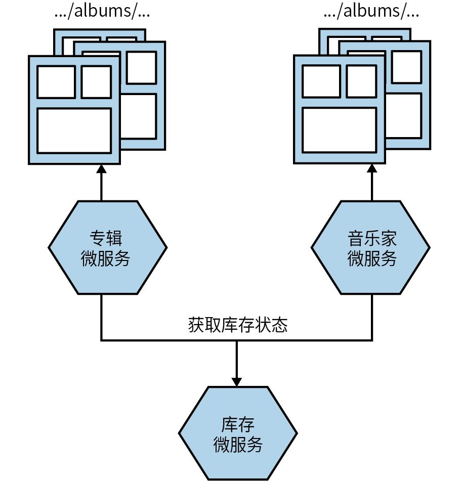

图14-4：用户界面由多个页面组成，不同的页面组由不同的微服务支撑

有了这个模型，负责专辑微服务的团队将能够端到端地呈现一个完整的用户界面，从而使该团队更容易理解其模型的变化是如何对用户产生影响的。

**W****e****b**

Web早在单页应用出现之前就已经出现了。操作Web应用的方式是通过访问URL和单击链接，使得新页面被加载到浏览器中。浏览器在这些页面上起到了导航的作用，其中书签用于标记我们感兴趣的页面，前进和后退的控件用于重新访问我们以前访问过的页面。你可能对我讲的这些不屑一顾，心想“我当然知道Web应用是如何工作的”。然而，这种用户界面的风格现在似乎已经被淘汰了。看到目前基于Web用户界面的实现时，我开始怀念它的简单性——现在下意识地假定基于Web的用户界面就是单页应用，让我们错过了太多。

在处理多种类型的客户端方面，根据请求页面的设备来自适应页面所显示的内容已经不是什么难事儿，因为渐进式增强（或优雅降级）的概念现在已经很好理解了。

从技术实现的角度来看，基于页面的拆分模式的简单性非常有吸引力。你既不需要在浏览器中运行任何花哨的JavaScript，也不需要使用有问题的iFrames，因为用户单击一个链接就会请求一个新的页面，直接明了。

**应****用****时****机**

如果我的用户界面是一个网站，那么通过基于页面的拆分模式拆分用户界面就是我的默认选择，因为它既适用于单页前端，也适用于微前端。Web用户界面作为分解的单位是整个Web设计的核心概念，因此它成了一项用来分解Web用户界面的简单易行的技术。

我认为问题是，在目前这种急于整体使用单页应用的情况下，这种用户界面变得越来越少，以至于在我看来更适合Web实现的用户体验最终被硬塞进了单页应用中。当然，你可以将基于页面的拆分模式与其他相关模式结合起来，例如，你可以设计一些包含部件的页面，接下来我们一起来看看。

### 14.7 基于部件的拆分模式

通过基于部件的拆分模式，图形界面中包含的所有部件都能独立地被修改。图14-5展示了一个MusicCorp前端的例子，用户界面的功能仅由两个部件提供，分别是购物车和推荐栏。

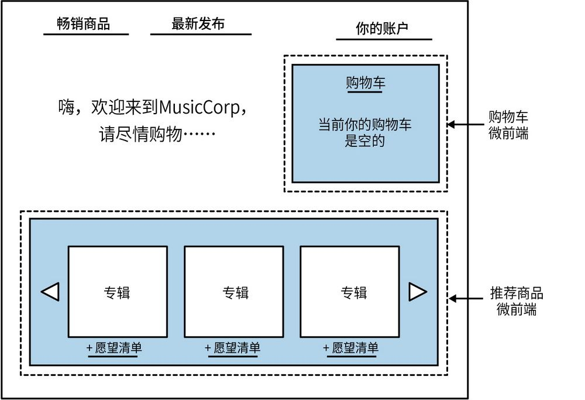

图14-5：在MusicCorp前端应用购物车和推荐栏这两个部件

MusicCorp的推荐栏部件从后端获取了一个推荐列表，使其被循环播放和过滤。如图14-6所示，当用户操作推荐部件时（比如循环展现下一组推荐列表，或向愿望清单添加专辑），会调用所需的微服务，在这里是推荐微服务和愿望清单微服务。如果有一个团队能够统一负责这些微服务和组件，那中间的对齐协调将更容易做好。

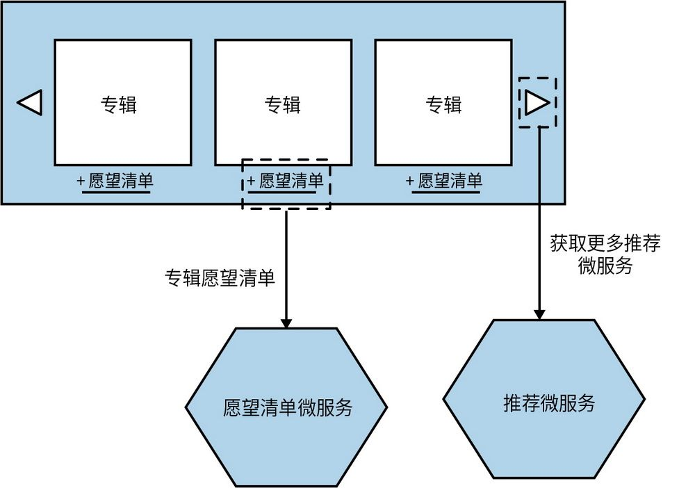

图14-6：推荐商品微前端和所需微服务之间的交互

通常来说，我们需要一个“容器”应用来定义界面的主导航和其他一些必要的部件。如果从面向端到端业务团队的角度考虑，那么可以想象一个团队不仅要提供推荐部件，也要负责推荐相关的微服务。

这种模式在现实世界中很常见，比如Spotify的用户界面就大量使用了这种模式。第一个部件可能包含一个播放列表，第二个部件可能包含艺术家的信息，第三个部件可能包含艺术家以及你关注的其他Spotify用户的信息。这些部件在不同的情况下还能以不同的方式进行组合。

最终，你仍然需要借助某种组装层将这些部分组合到一起。这可以很简单，比如利用服务端模板或客户端的模板就能搞定。

#### 14.7.1 实施视角

如何将一个部件拼接到用户界面中主要取决于用户界面是如何创建的。对一个简单的网站来说，有一种非常直接的做法，即使用客户端模板或服务端模板将部件作为HTML片段，尽管这样做可能会由于部件过于复杂而带来一些问题。如果推荐部件包含大量的JavaScript功能，那么如何确保不会与其被加载到Web页面的其他部分的行为发生冲突呢？理想情况下，整个部件是可以按这种方式组装的，并且不会破坏用户界面中其他相关的部分。

从过去的经验来看，如何在不破坏其他功能的情况下将自成一体的功能部件提供给用户界面对单页应用来说尤其棘手，其中一个原因是在创建SPA框架时似乎并没有优先考虑支持模块化的概念。因此这里面的挑战非常值得进一步探讨。

**0****1****.****依****赖**

尽管iFrames在过去是一种被广泛使用的技术，但我们倾向于避免使用它来将不同的部件拼接到同一个Web页面中。使用iFrames时存在一系列的挑战，比如尺寸的控制，以及前端的不同部分之间难以相互沟通。相反，部件通常是使用服务端模板构造的并最终拼接到用户界面中，或者是在客户端中构造并动态插入浏览器中的。在这两种情况下，存在一个共同的挑战，即部件与前端的其他部分运行在同一个浏览器页面中，这就意味着我们需要非常小心地避免它们之间发生冲突。

例如，推荐部件可能使用的是React v16，而购物车部件仍然使用React v15。这当然是件好事，因为它可以帮助我们尝试不同的技术（对于不同的部件，我们可以使用不同的SPA框架），而且当涉及更新所使用的框架版本时，它也会有所帮助。我曾与一些团队交谈过，他们在Angular版本或React版本之间迁移时遇到的较大的挑战，主要是由于较新的框架版本中使用的约定不同。升级整个单体用户界面可能是非常危险的，但如果你能以渐进的方式进行，逐个更新前端的部分，则不仅能把工作分解开来，也能降低升级带来新问题的风险。

采用这种模式的弊端是，最终会出现大量的依赖关系重复，而这反过来又会导致页面加载尺寸的巨大膨胀。例如，最终会存在多个不同版本的React框架及其相关的过渡性依赖。现在许多网站的页面加载大小比某些操作系统的大小要大好几倍，这已经不足为奇了。作为一个快速但不够严谨的调研，我在写作时检查了CNN网站的页面加载，结果是7.9 MB，这比Alpine Linux（大小为5 MB）还要大。实际上，在我看到的一些页面中7.9 MB并不算大。

**0****2****.****同****页****面****中****的****部****件****间****通****信**

尽管部件可以独立构建和部署，但我们仍然希望它们能够交互协同。以MusicCorp网站为例，当用户选中畅销榜中的一张专辑时，我们希望用户界面的其他部分能够响应用户的选择（进行更新加载），如图14-7所示。

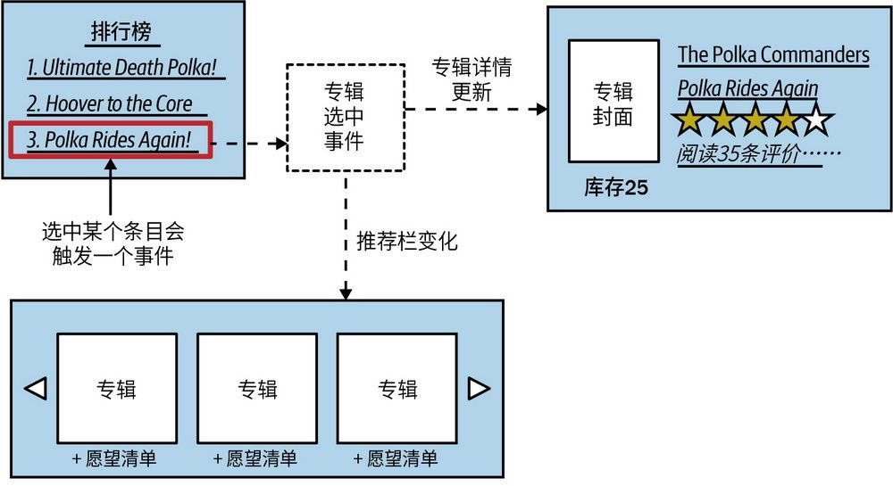

图14-7：排行榜部件可以发出事件，以让用户界面的其他部分监听

实现这一目标的方法是让排行榜部件发出一个自定义的事件。浏览器已经支持一些标准事件，我们可以用这些事件来触发一些行为。因此，我们可以在按下按钮、滚动鼠标等事件发生时做出反应。如果你有构建JavaScript前端应用的经验，那么可能已经多次使用了这种事件处理机制。创建自定义的事件很容易。

因此，在我们的案例中，当一个排行榜中的列表项被选中时，该部件会触发一个自定义的专辑选择事件。推荐部件和专辑详情部件都会订阅该事件并做出相应的反应，推荐部件会根据选择进行更新，而专辑详情部件会被加载。当然，这种交互已被我们熟知，因为它模仿了4.8节中讨论过的微服务之间的事件驱动的交互机制。唯一真正的区别是，这些事件交互仅发生在浏览器内部。

**W****e****b****组****件**

乍一看，Web组件标准应该是实现这些部件的一种简单明了的方式。Web组件标准描述了如何创建一个可以包含HTML、CSS和JavaScript的沙盒式用户界面组件。不幸的是，Web组件标准似乎花了很长时间才定下来，而且花了更长时间才被浏览器以恰当的方式支持。许多围绕Web组件的初始工作似乎已经停滞不前，这显然已经影响了Web组件标准的广泛采用。至少我还没有遇到过使用微服务来提供Web组件的组织。

鉴于现在Web组件标准已经得到了广泛的支持，因此未来它有可能成为实现沙盒部件或更大型微前端的常见方式，但对此我已等待多年，并不再抱有很大期望了。

#### 14.7.2 应用时机

这种模式使得多个业务流团队能够更轻松地为同一个用户界面做出贡献。与基于页面的拆分模式相比，这种模式带来了更多的灵活性，因为由不同团队提供的部件可以同时在用户界面中共存。它还为赋能团队创造了提供可复用部件的机会，这些部件可以被业务流团队使用——这也体现在我之前分享的《金融时报》的Origami团队作用的例子中。

如果你正在构建一个富Web用户界面，那么基于部件拆分模式是非常有用的，而且我强烈建议在任何情况下（包括以下情况：你正在使用SPA框架并希望拆分前端的职责，朝着微前端的方法演进）都优先使用部件。在过去的几年里，围绕这个概念的技术已经有了明显的改善，以至于在构建一个基于SPA的Web界面时，我会把用户界面拆分成微前端作为默认方案。

在SPA中进行部件拆分时，我的主要关注点是如何设置独立的组件包，以及如何处理与载荷（payload）大小相关的问题。前一个问题可能一次就能搞定，只需找出最适合你现有工具链的打包方式即可。后一个问题就比较麻烦了。一个部件的依赖中的小变化可能会造成应用中一大堆新的依赖关系出现，大大增加页面大小。如果你正在构建一个用户界面，而页面负载是需要关注的问题，我建议在页面负载超过某个可接受的阈值时，设置一些自动检查来进行提醒。

另外，如果部件原本比较简单，并且主要是静态组件，那么相比之下，使用像客户端模板或服务端模板这样简单的方式来对它们进行打包就能满足需要了。

### 14.8 约束

继续讨论下一个模式之前，我想再谈谈约束的问题。如今，越来越多的用户通过不同的设备来与我们的软件进行交互。每种设备都有不同的约束，而我们的软件必须适应这些约束。例如，在一个桌面Web应用中，我们必须考虑一些限制因素，比如用户使用的是什么浏览器，或者他们的屏幕分辨率如何。视力受损的人可能会通过屏幕阅读器来使用我们的软件，而行动不便的人可能更倾向于使用键盘输入来浏览屏幕。

因此，尽管核心服务或核心产品可能是不变的，但我们需要一种方法来调整它们，以适应每种类型的界面所面对的不同约束，以及用户的不同需求。我们可以仅从财务角度出发（如果你愿意的话）——得到更多客户的满意就意味着能赚更多的钱。但是也要从人性、道德的角度来考量：当我们忽视那些有特殊需求的客户时，就剥夺了他们使用我们服务的机会。在某些情况下，当设计导致一些人无法浏览用户界面时，会引来法律的制裁和罚款，例如，英国以及其他一些国家和地区都制定了相关的法律，以确保残障人士能够访问网站。
	 

移动设备带来了一大堆新的限制。移动应用与服务器的通信方式会产生影响。这不仅仅是纯粹的带宽问题，移动网络本身的特点（如稳定性差）也会带来限制。不同类型的交互会消耗电池电量，甚至会让一些客户感到不满。

交互的本质也随着设备的不同而发生变化。在平板电脑上，我不擅长用鼠标右键进行操作；在手机上，我会把界面设计成更易于单手使用，并且大部分操作由拇指来控制的形式；在其他地方，人们可能会在带宽有限的情况下通过短信与服务进行交互，例如，在南半球，短信是一种广泛使用的交互方式。

尽管关于用户界面可及性的更广泛讨论不在本书的范围之内，但我们还是会探讨不同类型的客户端（如移动设备）所带来的具体挑战。处理不同设备上客户端需求的常见解决方案是在客户端进行某种过滤和调用聚合。不需要的数据会被剥离，不会被发送到设备上，而且多个调用也可以合并成一个调用。

接下来，我们将看看在这一领域非常实用的两种模式，即中心聚合网关模式和服务于前端的后端（BFF）模式。我们还将看看如何用GraphQL来为不同类型的界面提供定制化的响应。

### 14.9 中心聚合网关模式

中心聚合网关位于外部用户界面和下游微服务之间，为所有用户界面执行的请求-响应进行过滤和聚合。如果没有聚合，那么用户界面可能不得不进行多次调用来获取所需的信息，而这往往会导致主动丢掉那些已经获取但不需要的数据。

下面来看看图14-8展示的一个场景。我们想在屏幕上显示客户最近的订单信息。因此，屏幕上需要显示客户信息，然后按日期顺序列出他们的一些订单，以及显示了每个订单的日期、状态以及价格的摘要信息。

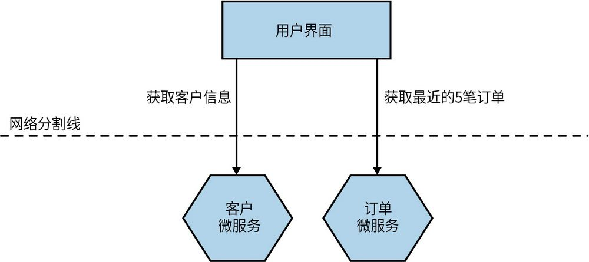

图14-8：单个屏幕进行多次调用以获取信息

我们直接调用客户微服务，拉回客户的全部信息，即使只会用到其中的几个字段。然后再从订单微服务中获取订单的详细信息。如果要在某种程度上改善这种情况，那么也许可以通过修改客户微服务或订单微服务来返回更符合这种特定情况下需要的数据，但仍然需要进行两次调用。

使用中心聚合网关，我们可以从用户界面向网关发起一次请求。然后，聚合网关会执行所有需要的调用，将结果合并为一个响应，并丢弃用户界面不需要的数据，如图14-9所示。

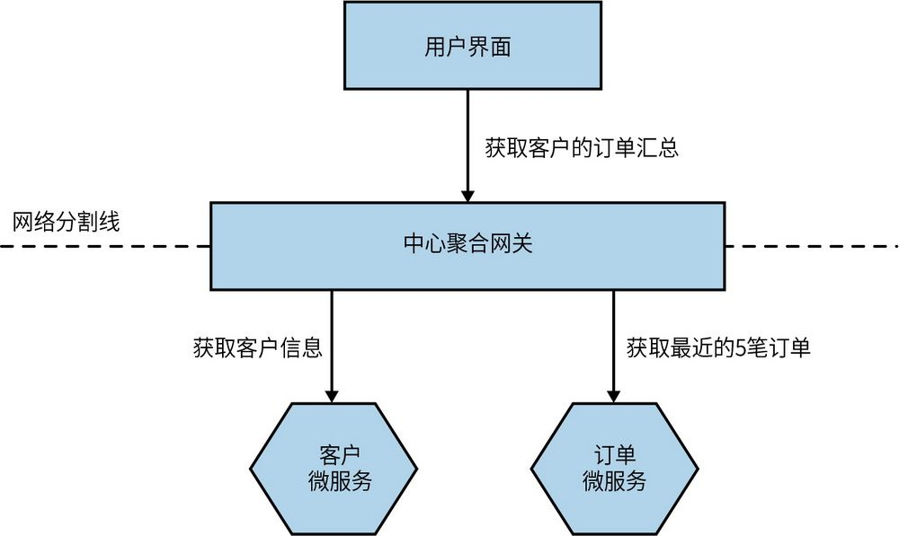

图14-9：服务端的中心聚合网关会处理针对下游微服务的过滤和聚合调用

还可以借助这样一个网关处理批量调用。例如，我们不需要通过一次次地单独调用查询10个订单ID，只需向聚合网关发送一个批处理请求，它就可以进行处理并得到最终结果。

从根本上说，拥有某种聚合网关不仅可以减少外部客户端进行调用的次数，还可以减少需要返回的数据量。这在减少带宽使用和改善应用的延迟方面可以带来显著的好处。

#### 14.9.1 归属权

随着越来越多的用户界面使用中心聚合网关，以及越来越多的微服务需要借助其聚合和过滤逻辑来处理用户界面的调用，网关成了一个潜在的争用源。那么，谁负责网关呢？是创建用户界面的人，还是负责微服务的人？我经常发现，中心聚合网关会做很多事情，以至于它最终被归属到了一个专门的团队中。是不是很熟悉，孤岛式的分层架构又出现了。

从根本上说，聚合和过滤的初衷在很大程度上来自外部用户界面的需求。因此，网关由创建用户界面的团队所负责是很自然的事。不幸的是，当组织中的前端是一个专门的团队时，该团队可能没有相关的专业能力来构建和维护这样一个重要的后端组件。

无论最终负责中心聚合网关的人是谁，其都有可能成为交付过程中的瓶颈。如果多个团队需要对网关进行修改，那么网关的开发就需要这些团队之间的各种协调，从而使各方的事情推进变得缓慢。如果只有一个团队负责它，那么该团队就有可能成为交付过程中的瓶颈。不过不必担心，很快我们就会看到如何借助BFF模式解决这些问题。

#### 14.9.2 不同类型的用户界面

如果所有权相关的复杂性能够被管理起来，那么除了无法应对多设备带来的差异化需求和问题，中心聚合网关仍然可以正常运作。正如我们已经讨论过的，移动设备的承载能力是非常不同的。更小的屏幕空间意味着不得不显示更少的数据。频繁地与服务端资源建立连接可能会消耗电池寿命和有限的数据套餐流量。此外，我们期望在移动设备上提供的交互方式会有很大的不同。以一家典型的实体店零售商为例。在桌面应用上，顾客可以浏览其出售的商品，然后在线订购或在商店预订，而在移动设备上，顾客可以扫描条形码来进行比价，或在商店里获得基于当前消费场景的优惠。随着构建的移动应用越来越多，我们逐步认识到人们使用它们的方式截然不同，因此就需要提供不同的功能。

所以，在实践中，移动设备希望进行有差异且较少的调用，并希望显示与桌面设备不同（可能更少）的数据。这意味着我们需要为API后端添加额外的功能，以支持不同类型的用户界面。在图14-10中，MusicCorp网站的Web界面和移动设备界面使用了相同的网关来显示客户摘要界面，但每个客户端想要的信息并不相同。Web界面想要呈现更多关于客户的信息，同时还要显示每个订单项中的概要。这就导致我们在后台网关中实现了不同的聚合和过滤处理逻辑。

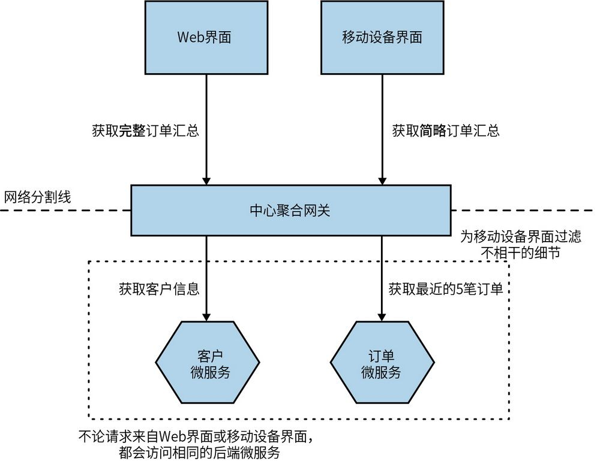

图14-10：支持不同设备的不同聚合调用

特别是，如果考虑到不同的原生移动应用、面向客户的网站、内部管理界面等，那么可能还会导致网关变得臃肿不堪。当然，这里还有一个问题，虽然这些不同的用户界面可能由不同的团队负责，但网关是一个唯一的单元——我们遇到了同样的老问题，即多个团队必须在同一个部署单元工作。这里的单一聚合后端可能会成为一个瓶颈，因为有非常多的变化源试图在同一个部署工件上工作。

#### 14.9.3 热点问题

当涉及处理API调用时，可能有一大堆的问题需要在服务端解决。除了调用聚合和过滤，我们还需要考虑更多的通用问题，比如API密钥管理、用户认证或调用路由。通常情况下，这些通用问题可以由相关的API网关产品来处理，这些产品功能丰富程度不一，有不同的价位（其中一些价位高得令人咋舌）。根据你所需要的复杂程度，购买一个产品（或授权一项服务）也是一种很明智的做法。你能想象把API密钥的发放、追踪、速率限制等都交给自己的团队管理吗？无论如何，还是优先看看这个领域的产品，通过它们来直接解决这些通用问题，但更要警惕试图使用这些产品来承载你的调用聚合和过滤逻辑的想法，就算它们具备这样的能力也不行。

当定制别人构建的产品时，你往往不得不在他们的约束（规则）下工作。你的工具链受到了限制，因为你可能无法使用自己的编程语言和开发实践。你不是在写Java代码，而是在用一些特定产品的DSL（很可能是使用JSON）配置路由规则。这可能是一段令人沮丧的经历，你甚至正在把现有系统的一些业务行为植入第三方产品中。你可能要为迁移这些行为付出高昂的代价。通常情况下，我们会意识到采用聚合模式实际上与一些领域功能有关，而这些功能本身就具备成为一个微服务的理由（后文在介绍BFF模式时，会更加深入地探讨这个问题）。如果这种行为是在特定供应商的配置中，那么迁移这种功能可能还会有更多的问题，因为考虑到整体可用的情况，你可能要重新开发它。

如果聚合网关复杂到需要一个专门的团队来负责和管理，那么情况就会变得更糟。在最坏的情况下，如果采用横向分层的团队管理模式来处理所有权，那么可能会出现这样的局面：为了推出一些新功能，前端团队、聚合网关团队，以及负责微服务的团队都要参与修改。突然间，一切都开始变得更加缓慢。

因此，如果你想使用一个专门的API网关，请继续，但强烈建议你将过滤和聚合逻辑放在其他地方。

#### 14.9.4 应用时机

对于由单个团队负责的解决方案，如果这个团队同时开发用户界面和后端微服务，那么使用一个独立的中心聚合网关是可以的。但是，这也意味着这个团队可能要承担大量的工作。在这种情况下，我通常会看到用户界面之间有很大程度的一致性，而这又减少了建设这种聚合点的需求。

如果你决定使用一个独立的中心聚合网关，请谨慎加入不必要的新功能。例如，在将业务相关功能加入通用API网关产品中时要非常小心，具体原因前面已经讲过了。

尽管在优化用户体验方面将类似过滤和聚合的调用放在后端处理起到了非常重要的作用，但是在一个存在多团队交付的组织中，中心网关会导致团队之间需要大量不必要的协调。

因此，如果想在后端进行聚合和过滤，但又想避免与中心网关的所有权模型带来的问题，则可以采用BFF模式。

### 14.10 服务于前端的后端模式

服务于前端的后端（BFF）解决的问题是单一的，它是专为特定用户界面而开发的，这也是它与中心聚合网关的主要区别。BFF已经被证实在帮助处理用户界面的不同需求方面非常成功，据我观察，目前它在一些组织（包括SoundCloud 
	 和REA）中运作得非常好。如图14-11所示，我们重新审视了MusicCorp网站，如今Web界面和移动设备界面都有自己的聚合后端。

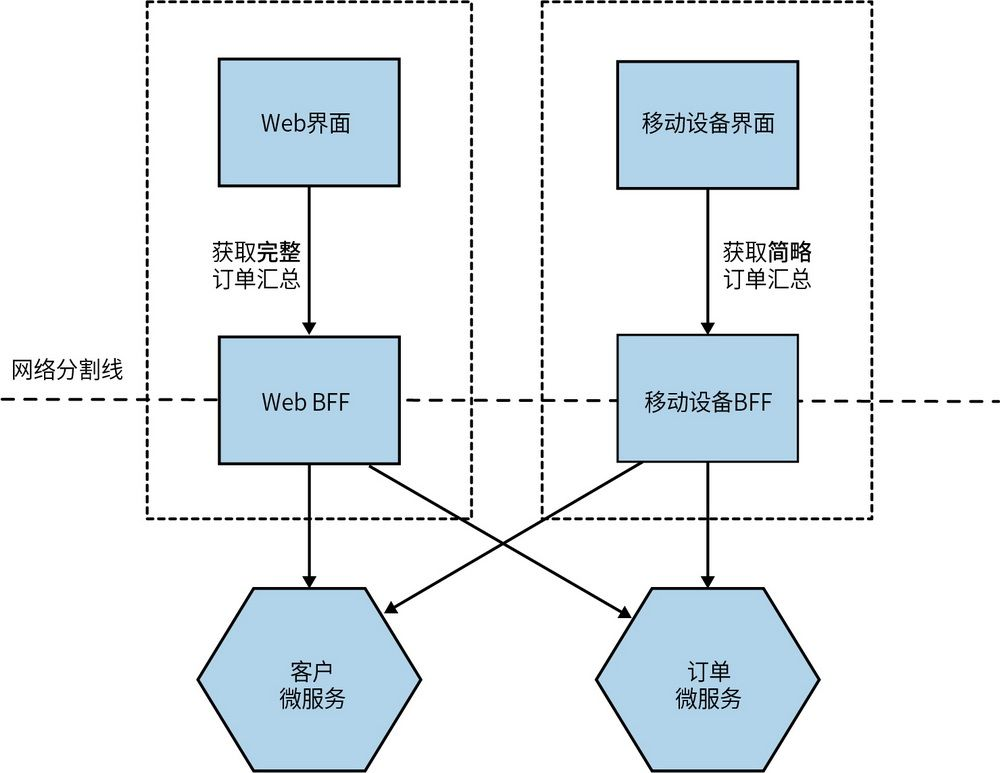

图14-11：每种用户界面都有自己的BFF

由于其特殊的性质，BFF天然规避了一些中心聚合网关相关的问题。因为我们并不试图满足所有人的需求，所以这也避免了BFF成为开发的瓶颈：多个团队试图共享所有权。我们也不太担心与用户界面的耦合问题，因为耦合更容易接受。BFF是专为特定的用户界面而生的。如果它们由同一个团队负责，那么固有的耦合也更容易管理。我经常将用户界面与BFF的使用描述为用户界面实际上被分成了两部分：一部分位于客户端设备（Web界面或原生移动应用）上，另一部分，即BFF，被嵌入到了服务端，以支撑更定制化的页面数据显示逻辑。

BFF与特定的用户体验联系非常紧密，通常由同一个团队来维护，因此更容易根据用户界面的需求来定义和调整API，这也简化了客户端和服务端组件的发布排队（等待）过程。

#### 14.10.1 如何确定BFF的数量

当涉及在不同平台上提供相同（或相似）的用户体验时，通常有两种方法。我更喜欢的模式（也是我最常看到的模式）是严格地为每一个不同类型的客户端部署一个单独的BFF——这是我在REA中看到的模式。虽然Android应用和iOS应用涵盖了类似的功能，但它们都有自己的BFF，如图14-12所示。

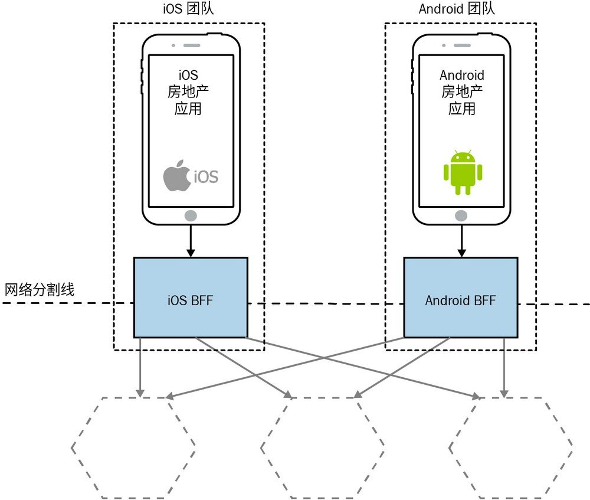

图14-12：REA的iOS应用和Android应用有不同的BFF

上述模式的变体模式是寻找将同一个BFF用于多种类型客户端的可能性，目的是为同一类型的用户界面提供服务。例如，SoundCloud的播放应用就允许用户同时在Android设备和iOS设备上收听内容。因此SoundCloud会让Android和iOS使用同一个BFF，如图14-13所示。

我对第二种模式的主要担心是，使用同一个BFF的客户端类型越多，BFF就越有可能因为处理多个关注点而变得臃肿。不过，这里需要注意的是，即使客户端共享同一个BFF，也是针对同一类别的用户界面。因此，虽然SoundCloud的iOS和Android的原生播放应用使用了相同的BFF，但其他原生应用会使用不同的BFF。如果一个团队同时负责Android应用和iOS应用，并且也负责BFF，那么我对使用这种模式不会太担心，但如果这些应用由不同的团队维护，那么我倾向于使用更严格的模式。因此，你可能也意识到了，组织结构是决定哪种模式最合理的一个主要驱动因素（康威定律再次得到验证）。

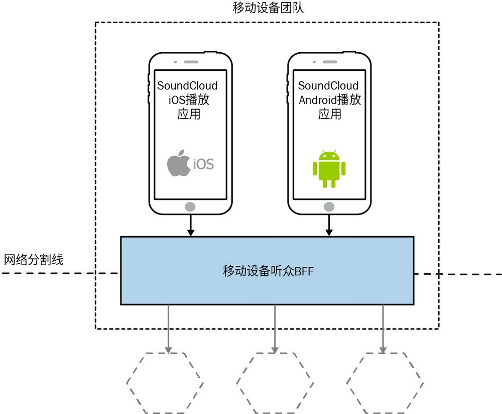

图14-13：SoundCloud让iOS应用和Android应用共享同一个BFF

来自REA的Stewart Gleadow提出了“一种体验，一个BFF”的准则。因此，如果iOS和Android的体验非常相似，那么使用单一的BFF就更加合理。
	 然而，如果它们之间有很大的差异，则拥有不同的BFF更有意义。在REA的案例中，尽管两种体验之间有重叠，但不同的团队分别负责它们，并以不同的方式推出了类似的功能。有时，同一个功能可能会在不同的移动设备上以不同的方式部署，如果希望将Android应用的原生体验放到iOS应用上，那么可能需要重新适配才可以。

从REA的故事中我也得到了另一个经验（也是我们已经讨论过很多次的）：软件在围绕团队边界进行调整时往往效果最好，而BFF也不例外。SoundCloud有一个独立的移动设备团队，这使得乍看之下他们负责一个BFF非常合理，正如REA为两个独立的团队设立了两个不同的BFF一样。值得注意的是，我与SoundCloud的工程师交谈时他们提到，可能会考虑重新为Android和iOS的播放应用分别设立一个BFF，因为虽然他们有一个单一的移动设备团队，但实际上团队是Android专家和iOS专家的混合体，他们发现大部分时间他们会同时专注在一个或另一个应用上，这意味着实际上他们是两个团队。

通常情况下，构建尽可能少的BFF的动力是希望复用服务端的功能，以避免过多的重复，但我们会用其他方法来处理这个问题，接下来会介绍。

#### 14.10.2 BFF如何应对复用问题

每种用户界面都有一个唯一的BFF时会导致一个问题，即BFF之间可能会出现很多重复。例如，它们最终可能会执行相同类型的聚合、有相同或类似的代码用于调用下游服务接口，等等。如果你正在试图提取共同的功能，那么通常面临的一个挑战是发现这些重复。这种重复既可能发生在BFF本身，也可能存在于不同的客户端中。由于这些客户端使用了完全不同的技术栈，因此识别出正在产生的这种重复可能很困难。如果组织逐步统一技术栈来构建服务端组件，那么当有多个BFF存在重复时可能更容易发现和排除。

有些人希望将BFF重新合并在一起以应对这种重复，这样最终他们就能得到一个通用的中心聚合网关。我对倒退到独立聚合网关很担心，因为最终我们可能会得不偿失，特别是当有其他方法可以处理这种重复时。

如前所述，我对跨微服务的重复代码并不排斥。也就是说，虽然在单一的微服务边界中我通常会尽自己所能将重复的代码重构到合适的抽象中，但在面对跨微服务的重复时，我不会这样做。这主要是因为我通常更担心提取共享代码可能会导致服务之间的紧密耦合（我们在5.8节中探讨过这个话题）。但不排除在一些情况下，这样做也是有必要的。

当确实需要提取共同代码来实现BFF之间的复用时，通常有两种选择。一种选择是提取某种共享库，这通常比较简单，但也有它的麻烦之处。这里的问题是，共享库是耦合的主要来源，特别是当它被用于调用下游服务的客户端库时。但是，在有些情况下，这样做其实是正确的，特别是当被抽象出的代码纯粹是作用于服务内部问题时。

另一种选择是将共享功能提取到一个新的微服务中。如果被提取的功能代表了某个业务领域的功能，那么这种方法会很有效。这种方法的一个变体可能是将聚合的责任推到更下游的微服务中。考虑这样一种情况：我们想显示客户愿望清单中的项目列表，以及关于每一项的库存情况和当前价格的信息，如表14-1所示。

表14-1：MusicCorp网站客户的愿望清单

The Brakes, Give Blood有货5.99美元

Blue Juice, Retrospectable缺货7.50美元

Hot Chip, Why Make Sense?尽快下单（仅剩两张）9.99美元

客户微服务存储了关于愿望清单的信息和每个项目的ID。专辑目录微服务存储了每个专辑的名称和价格。库存情况存储在库存微服务中。为了在iOS应用和Android应用上显示这个相同的控件，两个BFF都需要对支持的微服务进行3次相同的调用，如图14-14所示。

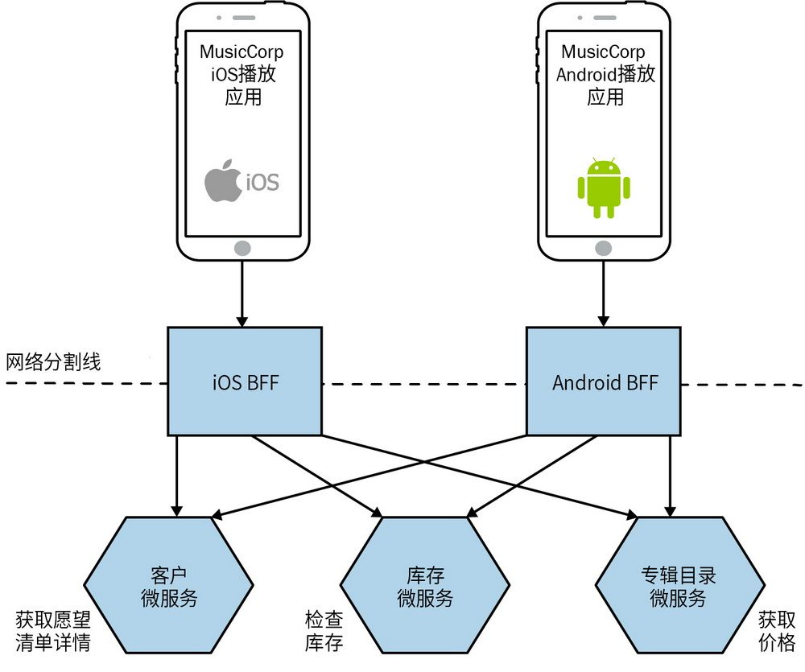

图14-14：两个BFF都在执行相同的操作，以显示一个愿望清单

减少这种类型的功能重复的方法是将共同的行为提取到一个新的微服务中。图14-15展示了一个新的Android应用和iOS应用都可以使用的专用愿望清单微服务。

不得不说，在两个地方使用相同的代码并不会很自然地让我想要提取一个服务，但如果创建一个新服务的成本足够低，或者会在多个地方使用这些代码，那我肯定会考虑这样做。如果还需要在Web界面上显示愿望清单，那么一个专门的微服务看起来将会更加有吸引力。我认为，建议大家在第三次实现某个东西时就考虑使用抽象，这种经验在服务层面仍然值得采纳。

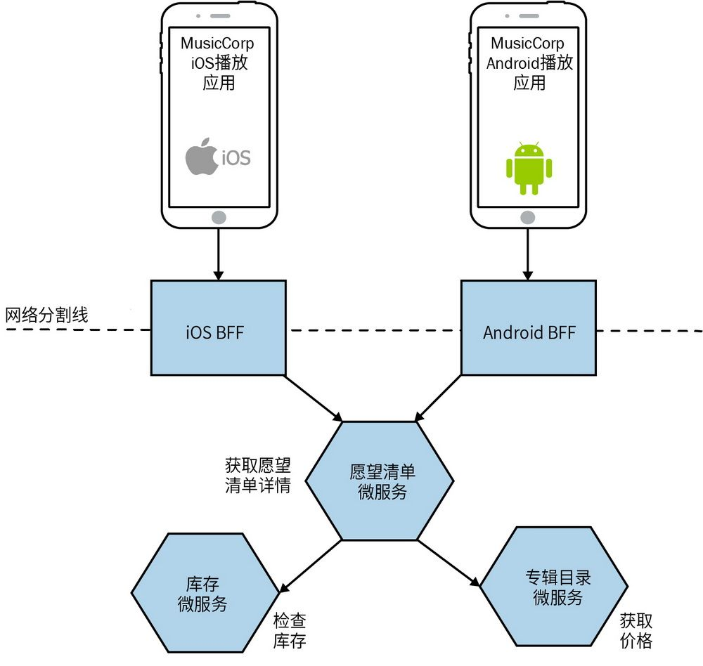

图14-15：共有的功能被提取到愿望清单微服务中以实现跨BFF复用

#### 14.10.3 BFF在桌面Web和更多场景中的应用

有人可能认为BFF仅在解决移动设备的限制方面很有用。因为桌面Web体验通常在更强大的设备上提供，具有稳定的连接，当在这些设备上进行多个下游调用时成本是可控的，所以，不需要BFF，可以让Web应用直接向下游服务进行多次调用。

不过，我也看到过BFF在Web应用中很有用的情况。当需要在服务端生成较大部分的Web用户界面时（比如使用服务端模板），BFF显然是一种好的解决方法。这种方法在一定程度上还可以使缓存变得容易，因为你可以在BFF的前面放置一个反向代理来缓存聚合调用的结果。

我看到不止一个组织在应对第三方外部调用时使用BFF。再回到MusicCorp网站的例子。我可能会暴露一个BFF来允许第三方获取版税支付信息，或者允许音乐流向一系列机顶盒设备，正如图14-16所展示的那样。这些不再是真正的BFF了，因为外部各方并没有提供一个“用户界面”来进行对接，但这确实是在不同的上下文中使用相同模式的例子，所以我认为很值得分享出来。

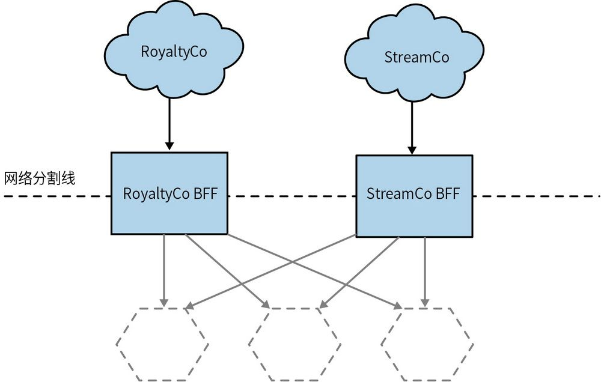

图14-16：使用BFF来管理外部API

这种方法可能会特别有效，因为第三方通常只有有限的能力（或愿望）来使用或改变他们的API调用。在集中式API后端架构中，你可能仅仅为了满足一小部分无法做出改变的外部调用方而不得不保留旧版本的API。有了BFF，这种问题就大大减少了。它也限制了破坏性变更的影响。你可能会因为改变对Facebook API的调用破坏了与其他各方的兼容性，但由于他们使用的是不同的BFF，反而不会受到这种变化的影响。

#### 14.10.4 应用时机

对一个只提供Web用户界面的应用来说，我认为只有当你在服务端有大量的聚合需求时才应该考虑BFF。否则，应该优先考虑我们已经介绍过的其他一些用户界面组合技术，而不需要引入额外的服务端组件。

不过，当我们需要为移动用户界面或第三方提供特定功能时，我倾向于从一开始就为每个客户端提供BFF。如果部署额外服务的成本过高，那么我会重新考虑，但在大多数情况下，BFF所带来的关注点分离使它成了一种相当有说服力的解决方案。如果构建用户界面的人与负责下游服务的人是两个团队，那么我会更倾向于使用BFF，具体原因前面已经介绍过了。

接下来就到了如何实现BFF的问题，让我们来看看GraphQL以及它能发挥哪些作用。

### 14.11 GraphQL

GraphQL是一种查询语言，允许客户端发出查询请求来访问或变更数据。与SQL一样，GraphQL允许动态修改查询规则，也允许客户端动态地定义它想要获取的信息。如果是一个标准的基于HTTP的REST调用，那么当我们对一个订单资源发出GET请求时，就会获得该订单的所有字段。但是，如果在这种特殊情况下，你只想要获取订单的总金额，该怎么办呢？当然，你可以在获取所需信息后忽略其他字段，或者提供一个新的资源（也许是订单摘要），其中只包含你需要的信息。如果使用GraphQL，则可以发出一个只包含所需字段的请求，正如示例14-1所展示的那样。

**示****例****1****4****-****1** 用于获取订单信息的GraphQL查询的例子

{

order(id: 123) {

date

total

status

delivery {

company

driver

duedate

}

}

}

在这个查询中，我们指定了ID为123的订单，获取了总价和订单的状态。同时，我们还进一步获取了关于这个订单的物流信息，由此又获取了运输包裹的司机的名字、其所属的物流公司以及包裹预计到达的日期。在普通的REST API中，除非物流信息包含在订单资源中，否则还需要进行额外调用来获取这些信息。因此，GraphQL不仅可以帮助我们精确地获取想要的字段，而且可以减少调用的次数。像上面这样的要求我们明确定义所访问数据类型的查询，是GraphQL查询的一个关键部分。

使用GraphQL时，解析器会被用来处理查询。GraphQL解析器位于服务端，它可以将GraphQL查询映射为实际获取信息的调用。因此，在微服务架构的情况下，我们需要一个这样的解析器，该解析器可以将ID为123的订单请求映射为对应微服务的等价调用。

通过这种方式，我们可以使用GraphQL来实现一个聚合网关，甚至实现一个BFF。GraphQL的好处如下：仅通过改变客户端的查询，就可以很容易地按需改变聚合和过滤逻辑；只要GraphQL数据类型支持我们想要的查询，就不需要在GraphQL服务端做任何改变。如果不希望在示例查询中看到运输包裹的司机的名字，那么只需从查询语句中将其去掉即可，这样它就不再被发送了。换一种场景，如果想要查看这个订单的积分数，那么只要这个信息在订单类型中可用，就可以直接把这个类型添加到查询中，信息就会被返回。与需要在服务端改变聚合逻辑的BFF实现方式相比，这种方式具有显著的优势。

在不修改服务端的前提下，GraphQL为客户端设备提供了可以按需调整正在进行的查询的灵活性，这意味着GraphQL服务器很难像通用聚合网关那样变成共享的、被争夺的资源。必须说明的是，如果需要公开新类型或向现有类型添加新字段，那么仍然要对服务端进行修改。这样一来，你可能仍然需要多个GraphQL后端服务，以便遵循团队的边界进行调整，这样GraphQL也就成了实现BFF的一种方式。

我确实对GraphQL还有顾虑，第5章也详细谈到了我的顾虑。但里面也提到，它是一种整洁的解决方案，允许以动态查询来适应不同类型用户界面的需求。

### 14.12 模式的混合应用

前面提到的许多选择并不需要一刀切。如果一个组织采用基于部件拆分模式来创建网站，那么当涉及它的移动应用时，也可以采用BFF模式。关键点是，我们不仅需要保持为用户提供的底层能力的内聚性，还需要确保与订购音乐或修改客户资料相关的业务逻辑位于处理这些操作的服务中，而不是遍布整个系统。把太多行为直接放入某些中间层可能会带来麻烦，必须要避免这些麻烦，而做到这一点确实需要一些把握平衡的技巧。

### 14.13 小结

我希望通过本章已经阐明，功能的拆分不一定只局限于服务端，拥有独立的前端团队也并非不可避免。在本章中，我分享了构建用户界面的不同方法，这些方法在用于支持微服务架构的同时可以帮助团队更加专注于端到端的交付。

第15章会更详细地探讨微服务和组织结构的相互作用，届时我们会将注意力从技术层面转向人的层面。
