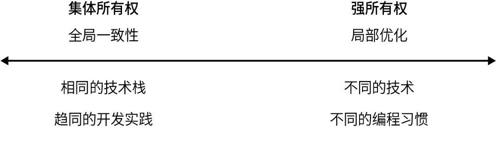
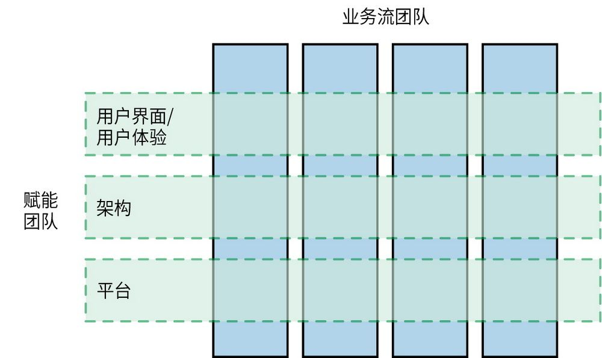
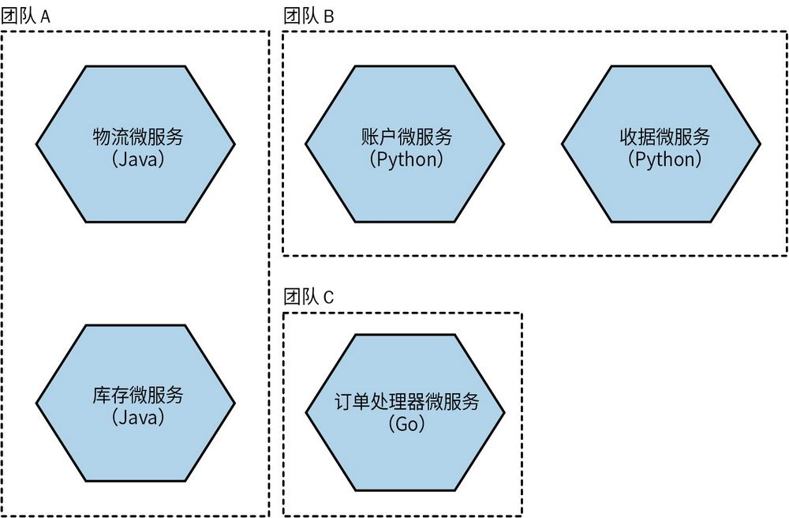
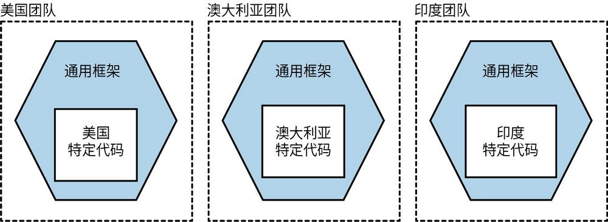
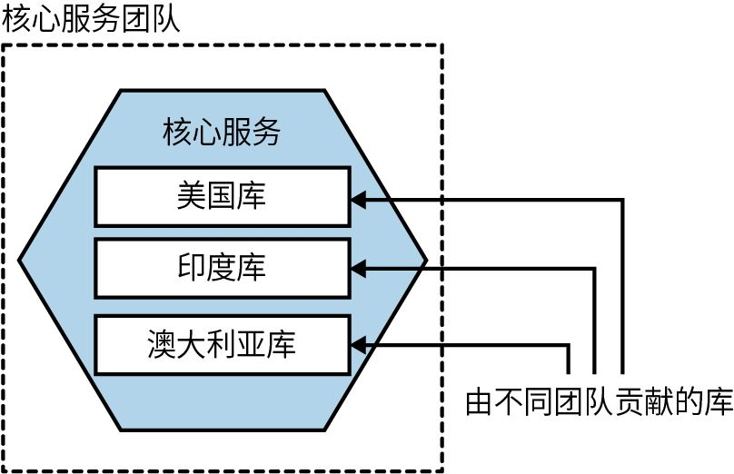
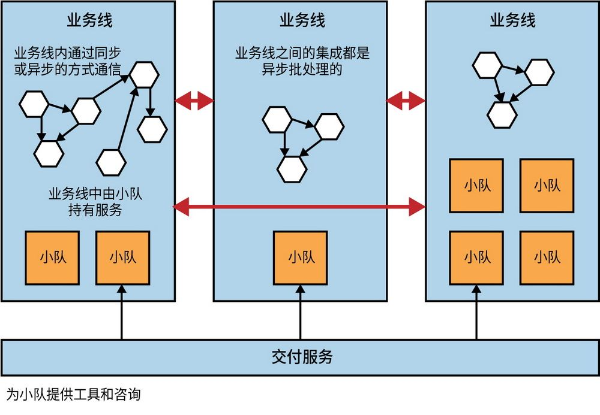

## 第15章 组织结构

到目前为止，本书大部分内容聚焦在应用微服务架构过程中技术上的挑战，同时我们也考察了微服务架构与团队组织方式之间的相互作用。在14.3节中，我们已经探索了业务流团队的概念，其中提到了如何用微服务实现这种团队结构，使之能做到端到端交付面向用户的功能。

现在我们需要进一步详细阐述这些想法，并考虑其他组织方面的因素。如果你想从微服务中获得更多好处，那么忽视公司的组织结构将是一种冒险行为。

### 15.1 低耦合组织结构

纵观全书，我一直主张松散耦合的架构，并强调让架构与更自治的、松散耦合的业务流团队匹配，这样通常才能交付最佳的成果。在不改变组织结构的情况下转向微服务架构，将会削弱微服务的作用——你可能为架构的变化付出了相当大的代价，最终却没有获得相应的回报。我曾经写过一些文章，内容大致是关于减少团队间协作，来帮助加快交付速度，反过来这会促使团队拥有更多的自主决策权。在本章中，我们将对这些想法进行更充分的探讨，同时还会补充一些组织和行为方面转变的必要建议，但在此之前，我想先分享一下对松散耦合组织的看法。

在《加速：企业数字化转型的24项核心能力》一书中，作者研究了自主、松散耦合团队的特点，帮助我们更好地理解了哪些行为更有助于实现最佳绩效。根据作者的观点，关键在于团队是否能做到以下几点。

·无须经过团队之外的人批准，即可对他们所负责的系统设计进行大范围的变更。

·无须依赖其他团队，即可对他们所负责的系统设计进行大范围的变更，同时不会给其他团队带来巨大的工作量。

·无须与团队外部的人员沟通和协调，即可完成自己的工作。

·按需部署和发布产品或服务，无须考虑其依赖的其他服务如何。

·无须集成测试环境，即可按需进行大部分测试。

·在正常的上班时间执行部署操作，且停机时间可忽略不计。

业务流团队是我们在第1章中首次接触到的概念，其与这种松散耦合的组织愿景相一致。如果你正在尝试向业务流团队结构转型，那么可以将上述内容作为一张很好的检查表，以确保转型方向正确。

上述特征中有些看起来更偏技术视角，例如，期望能在正常的上班时间执行部署操作，可以通过支持零停机部署的架构来实现。但事实上，所有这些都需要行为上的改变。为了让团队对他们的系统有更强烈的主人翁意识，就要摆脱集中控制，包括如何进行架构决策（参见第16章）。从本质上说，实现松散耦合的组织结构需要将权力和责任**去****中****心****化**。

本章的大部分内容会探讨如何实现低耦合组织结构，我们会探究团队大小、所有权模型、平台的角色元素等如何发挥作用。如此一来，你可以根据情况做出一系列改变，以使你的组织朝着正确的方向发展。

不过，在这之前，让我们进一步探讨一下组织和架构之间的相互作用。

### 15.2 康威定律

虽然我们的行业很年轻，还在不断地自我革新，但有几个关键的“定律”确实经受住了时间的考验。例如，摩尔定律指出，集成电路上的晶体管密度每两年翻一番，而且事实证明它准确无误（尽管这一趋势已经放缓）。还有一条定律几乎是普遍适用的，而且在我的日常工作中更加有用，它就是康威定律。

梅尔文·康威在1968年4月发表在*D**a**t**a**m**a**t**i**o**n*杂志上的文章“How Do Committees Invent?”中指出：

任何组织在设计一个系统（这里的定义比信息系统更广泛）时，将不可避免地产生这样一种设计，即其结构是组织间沟通结构的副本。

这句话经常以各种形式被引用为“康威定律”。Eric S. Raymond在*T**h**e**N**e**w**H**a**c**k**e**r**'**s**D**i**c**t**i**o**n**a**r**y*一书中总结了这一现象，他说：“如果你有4个小组在做一个编译器，那么就会得到包含4个pass
	 的编译器。”

康威定律告诉我们，松散耦合的组织必然会得到松散耦合的架构（反之亦然），这也再次强化了如下想法：不考虑构造软件的组织结构，却想从松散耦合微服务架构中受益，这种思路是有问题的。

**定****律****的****证****实**

故事是这样的：当梅尔文·康威将他关于这个话题的论文提交给《哈佛商业评论》时，该杂志拒绝了这篇论文，声称康威没有证明他的论点。但我已经看到康威的理论在许多不同的情况下得到证实，所以我接受了该论文的真实性。这不仅仅是我的一面之词：自康威最初提交论文以来，这个领域陆续出现了大量的研究，其中，许多研究探讨了组织结构和它们所创造的系统的相互关系与影响。

**0****1****.****松****散****耦****合****的****组****织****和****紧****密****耦****合****的****组****织**

在“Exploring the Duality Between Product and Organizational Architectures”
	 一文中，3位作者研究了许多不同的软件系统，这些系统被松散地归类为由“松散耦合的组织”或“紧密耦合的组织”创建。紧密耦合的组织的代表是商业产品公司，它们通常集中管理，有着强烈一致的愿景和目标，而松散耦合的组织的代表是分布式的开源社区。

在以上研究中，3位作者对每一类组织的类似产品都进行了匹配，结果发现松散耦合的组织实际上创造了更多模块化、更少耦合的系统，紧密耦合的组织中的模块化软件则较少。

**0****2****.****W****i****n****d****o****w****s****V****i****s****t****a**

微软曾做过一项实证研究，以调查自己的组织结构如何影响一款特定的软件产品——Windows Vista的质量。
	 具体来说，研究人员考察了多个因素，以确定系统中的一个组件会有多大的出错率。
	 在研究了多个指标（包括常用的软件质量指标，如代码复杂度）后，他们发现与组织结构相关指标（比如在一段代码上工作过的工程师人数）在统计学上被证明和出错率的相关性是最高的。

下面是另一个例子，它可以说明一个组织的结构如何从根本上影响该组织所创建的系统。

**0****3****.****亚****马****逊****和****N****e****t****f****l****i****x**

亚马逊和Netflix应该是“组织和架构应保持一致”这一观点的两个杰出践行者。早期，亚马逊就开始理解团队拥有其管理系统整个生命周期的好处。它希望团队能够拥有并运营他们所负责的系统，并管理整个生命周期。但亚马逊也知道，小团队比大团队工作效率更高。这就导致了所谓的“两张比萨团队”模式，即一个团队的人数不应该多到订两张比萨都不够吃。这显然不是一个完全有用的评估指标，我们从来不在意是在午餐还是晚餐（或早餐）吃比萨，也不会关注一张比萨应该有多大，但通常来说，8~10人是最佳的团队规模，而且团队应该直接面向客户。使小团队能够负责其服务的整个生命周期也是亚马逊开发AWS的主要原因。小团队需要工具的支撑，以保证自给自足。

吸取了亚马逊的经验，Netflix确保从一开始就围绕小型、独立的团队来构建自己的系统架构，因此他们所创建的服务也是相互独立的。这就确保了系统架构的优化能够对速度产生影响。令人印象深刻的是，Netflix还针对想要的系统架构设计了组织结构。我还听说，这一理念甚至延伸到了Netflix团队的工位规划中：那些服务间相互通信的团队会被分在同一区域。这样做的目的是促进团队之间更频繁地交流。

### 15.3 团队规模

当我们问任何一名开发人员，单个团队规模应该有多大时，虽然会得到不同的答案，但大家普遍认为小团队相对来说更好一些。如果让他们给出一个团队的理想人数，那么通常我们得到的答案是5~10人。

我对最适合软件开发的团队规模做了一些研究。最终，我找到了很多研究报告，但其中大多数存在缺陷，以至于很难得出一个普遍适用于软件世界的结论。目前我所找到的最好的研究报告是“Empirical Findings on Team Size and Productivity in Software Development”
	 ，这篇报告至少能够让我从大量的数据中得出结论，尽管该结论不一定能代表整个软件开发行业的情况。研究人员发现：“正如文献的预设，那些平均团队规模大于或等于9人的项目，其生产力是最差的。”这项研究看起来至少和我的工作经验相吻合。

显而易见的是，我们喜欢在小团队中工作，因为一小群人都专注于同一个成果，不仅更容易保持一致，也更容易协调工作。我其实有一个（未经测试的）假设，即团队成员之间存在时间和空间的距离时，会造成工作上的挑战，由此会进一步限制最佳的团队规模。不过，相比于自己来验证这个假设，我觉得由其他人来验证反而更好。

因此，小团队好，大团队不好，这似乎理所当然。回到现实世界，如果你可以用一个团队来完成需要做的所有工作，那么很好，你的世界还很简单，你可以跳过本章的大部分内容了。但是如果对手头的工作来说你的时间远远不够该怎么办呢？一个显而易见的反应是增加人数。但我们都知道，增加人数并不一定能完成更多的工作。

### 15.4 理解康威定律

实战和经验表明，我们的组织结构对我们创建的系统的性质（和质量）有很大影响。我们也知道更小的团队才是最好的选择。那么，如何通过这种认知得到帮助呢？从事情的本质来看，如果希望拥有一个松散耦合的架构，以便更容易进行更改，那么相应的就需要有一个松散耦合的组织。换句话说，我们希望拥有一个更松散耦合的组织的原因是，我们希望组织的不同部分能够更快、更高效地做出决策和行动，而松散耦合的系统架构对此有很大帮助。

在《加速：企业数字化转型的24项核心能力》一书中，作者发现，那些拥有松散耦合架构的组织与其更高效地运作大型交付团队的能力之间存在明显的相关性。

如果实现了松散耦合且封装良好的架构，并且拥有与之匹配的组织结构，那么我们会有两大收获。首先，我们能够提高软件交付绩效，加快开发节奏，提高系统的稳定性，同时降低部署工作的难度并缓解团队倦怠感。其次，我们还能够大幅扩大工程团队的规模，同时线性提升生产力（甚至超越线性提升）。

从组织的视角来看，有些观念已经被扭转过来了，尤其是，对那些大规模运作的组织来说，需要摆脱集中的指挥和控制模式。在集中决策的情况下，组织的响应速度会被大大减弱。伴随组织的发展，这种情况也会愈加严重。也就是说，组织规模越大，其中心化的性质对决策效率和行动速度的影响就越大。

很多组织已经逐步意识到，如果想在扩大组织规模的同时保持快速发展，那么就要更有效地分配职责、去中心化决策，并将决策权分配到组织的各个部分，使其能够自主运作。

因此，诀窍在于，将大型组织建立在小型、自主的团队之上。

### 15.5 小团队，大组织

为延期的软件项目增加人手会使它加倍延期。

——小弗雷德里克·布鲁克斯（布鲁克斯定律）

在《人月神话》
	 中，作者小弗雷德里克·布鲁克斯试图解释了为什么使用“人月”作为估算技术是有问题的。这是因为它使我们落入了一个陷阱，认为投入更多的人解决问题，就能加快进度。基于这个理论来推导：如果一项工作需要一个开发人员花6个月的时间才能完成，那么如果增加一个开发人员，则完成这项工作只需要3个月。如果增加5个开发人员，使总人数达到6个人，那么这项工作应该只需要一个月就能完成。然而，对软件开发来说，这是不现实的。

为了能通过增添更多的人（或团队）来加速解决某个问题，工作需要能够被拆分为可以在一定程度上并行进行的任务。如果一个开发者正在做某项工作，而另一个开发者在等待这项工作，那么工作就不能并行进行，它必须按顺序完成。即使某项工作可以并行完成，也往往需要开发人员同时多线程工作以及与他人协作，而这会导致额外的开销。工作相互交织得越多，增加更多人手的效果就越差。

在没有把工作拆解成多个可独立完成的子任务之前就直接将问题抛给团队的做法是不可取的。更糟糕的是，这可能还会导致项目整体进度变慢。增加新成员或组建新团队是有成本的，因为我们不得不花额外的时间来帮助这些人提高工作效率。通常来讲，在花时间帮助团队提效的同时，提供帮助的这些开发人员本身也承担着大量的工作。

在大规模软件交付过程中，协作是高效工作的最大成本。多个从事不同任务的团队之间协作越多，项目整体进度就会越慢。对亚马逊公司来说，他们已经意识到了这一点，并从组织结构上减少了“两张比萨团队”之间需要的协作。同时，他们也有意识地限制了团队协作的时间占比，并尽可能将协作限制在了一些绝对必要的领域，比如有依赖关系的微服务的团队之间的协作。以下这段文字摘自*T**h**i**n**k**L**i**k**e**A**m**a**z**o**n*，作者是亚马逊前高管John Rossman。

“两张比萨团队”是能够自治的。他们与其他团队的交互是受限的，当协作发生时，会被详细地记录下来，并且会定义明确的接口。他们拥有并负责其系统的每个方面。这些团队的主要目标之一是降低组织中的沟通成本，包括会议的数量、协调点、计划、测试或发布。总之，团队越独立，干活就越快。

搞清楚如何让团队适配更大的组织至关重要。**团****队****拓****扑**定义了团队API的概念，其中**团****队****A****P****I**又大体定义了该团队如何与组织的其他部分进行交互，这种交互不仅体现在微服务接口方面，还囊括工作实践方面。以下这段文字摘自《高效能团队模式》。

我们应该明确地考虑API对其他团队的易用性。对其他团队来说，与我们的交互究竟是很容易、很直接，还是很困难、很麻烦？对一个新团队来说，了解我们的代码和工作实践容易吗？我们如何回应其他团队的拉取请求（pull request）和建议？我们团队的需求列表和产品路线图是否很容易被其他团队看到和理解？

### 15.6 关注团队自治

无论你经营的是什么类型的企业，都应该把员工放在第一位，确保他们做正确的事情，并为他们提供信心、动力、自由和各种需要，以发挥他们真正的潜力。

——John Timpson

仅仅拥有大量的小团队并不能帮助解决问题，尤其是这些团队只成了更多依赖其他团队来完成任务的孤岛。我们需要确保每个小团队都有自主权来完成所负责的工作。这就意味着我们需要赋予这些团队更多的权力来做决定，并提供工具来确保他们在尽可能少地与其他团队协调工作的情况下，尽可能多地完成任务。因此，实现自治是关键。

许多组织已经展现出构建自治团队所带来的益处。保持组织中团队规模小型化，并在没有引入过多官僚作风的情况下有效协作，已经帮助许多组织比其同行更有效地成长和扩展。例如，W.L.Gore & Associates公司
	 发现，其取得巨大成功的背后是确保每条业务线不超过150人，从而让业务线上的每个人都能相互认识。这种小规模业务线需要被授予权利和职责，以形成自治的运作模式。

许多组织似乎借鉴了人类学家罗宾·邓巴所完成的工作。邓巴研究了人类形成社会团体的能力，并提出了著名的“邓巴数字”概念，即人类社交网络的极限规模约为150人。他认为，我们的认知能力对如何有效地维持不同形式的社会关系造成了限制。当一个群体发展到超过150人的规模时，就需要被拆分为更小的群组，否则会极易崩溃。

Timpson是一家非常成功的英国零售公司。通过向员工授权，使其减少对中央职能部门的依赖，以及允许当地商店自主决策（比如自行拟定给投诉顾客的退款金额），Timpson已经实现了大规模发展。公司现任董事长John Timpson也因将内部规则替换为以下两条规则而闻名：

·扮演好自己的角色；

·把钱放进收款机。

自治在较小的规模上也能发挥作用，我合作过的大多数现代公司希望在其组织内部创建更多的自治团队，但他们的做法往往是试图复制其他组织的模式，比如亚马逊的“两张比萨团队”模式，或以“部落制”闻名的“Spotify模式”
	 。在此我要提醒大家，当然可以尽一切办法学习其他组织的做法，但在真正了解其他组织**为****什****么**这样做之前就原样照搬，可能不会产生期望的结果。

如果做得好，那么团队自治可以为人们赋能，帮助他们更快地成长，更高效地完成工作。当团队负责微服务并完全掌控这些微服务时，他们就能在一个更大的组织中拥有更多的自主权。

自治的概念已经开始转变我们对微服务架构中所有权的理解，接下来我们会对此进行详细介绍。

### 15.7 强所有权与集体所有权

在7.3.3节中，我们不仅讨论了不同类型的所有权，还探讨了这些所有权风格在代码协作层面的不同影响。简要回顾一下，我们讲到的两种主要的代码所有权形式如下。

**强****所****有****权**

每个微服务都由一个团队负责，这个团队可以决定对该微服务进行哪些修改。如果一个外部团队想要进行修改，则需要请求该团队代表它执行此操作，或者它可能需要发送一个拉取请求，然后完全由拥有所有权的团队决定在什么情况下接受这个请求。一个团队可以拥有多个微服务。

**集****体****所****有****权**

每一个团队可以对所有的微服务进行修改，但需要特别注意团队间的协调，以确保他们不会妨碍彼此的工作。

接下来我们会进一步探讨这些所有权模式的含义，以及它们如何帮助（或阻碍）提升团队的自治性。

#### 15.7.1 强所有权

在强所有权的情况下，拥有微服务的团队可以完全自己说了算。最基本的，它可以完全控制对代码的修改。具体来说，该团队可以决定编码标准、编程习惯、部署平台、何时部署软件、使用什么技术来构建微服务等。同时该团队也对软件的变更承担最大的责任。拥有强所有权的团队将拥有更高的自治性，并可以享受由此带来的所有好处。

强所有权最终是为了增强团队的自治性。再来看看*T**h**i**n**k**L**i**k**e**A**m**a**z**o**n*中亚马逊的做事方式。

当谈到亚马逊著名的“两张比萨团队”时，大多数人忽略了这一点。重点不是团队的规模，而是团队的自主权、问责制和创业心态。“两张比萨团队”的出发点是让组织内的小型团队有能力独立和灵活地运作。

强所有权模式支持团队内部的多样化选择。例如，一个团队能够自如地决定是否使用Java函数式风格来创建微服务，因为这只影响其自身的一个决策。当然，这种多样化确实需要有所限制，因为有些决策需要考虑一定程度的一致性。如果其他人都使用基于HTTP的REST API作为他们的微服务端点，而你决定使用gRPC，那么这可能会给其他想要使用你的微服务的人带来一些问题。换一种情况，如果该gRPC端点只在你的团队内部使用，则不会有什么问题。但是，当做出对其他团队有影响的决策时，仍然可能需要协调。当我们探讨平衡本地与全局优化的问题时，会讨论何时以及如何让更大范围的组织参与到这种协调中。

从本质上说，一个团队能够采用的所有权模式越强，需要的协调就越少，最终团队的生产力就越高。

**强****所****有****权****能****走****多****远**

截止到目前，我们主要谈论的方面都与代码或技术选择相关。其实，所有权还能更进一步。有些组织采用了一种我称之为“**全****生****命****周****期****所****有****权**”的模式。在这种全生命周期所有权模式中，以下所有工作都由一个团队负责完成：提出设计、完成实现、部署微服务、管理微服务在生产环境中的运行，以及在不再需要微服务时最终将其关闭。

这种全生命周期所有权模式进一步提高了团队的自治能力，因为对外部协调的要求减少了。既不需要向运维团队提出部署申请，也不需要外部各方签署更改，团队自身便可决定需要更改什么以及何时部署交付。

对许多人来说，可能觉得这种模式有些异想天开，因为他们已经有了一些关于必须如何处理事情的固定想法。而且，团队中可能也没有适当技能的人来承担完全的所有权，或者他们需要新的工具（比如自动部署机制）来支持。无论如何，值得注意的是，团队不可能在一夜之间达到全生命周期所有权，即使你认为它是一个理想的目标。如果这种变化需要几年时间才能被人完全接受，也不要感到惊讶，特别是对于较大的组织。全生命周期所有权的许多方面可能还需要文化上的改变，以及在对人的期望方面做出较大的调整，比如需要团队成员在工作时间之外提供相应的软件支持。总之，当你能够将微服务各方面的更多职责放回到团队中时，将会进一步提高团队的自治能力。

我并不是在表达这种模式对应用微服务来说必不可少，但我坚信对多团队组织来说，强所有权是获得微服务最大效益的最明智模式。围绕代码的强所有权模式是一个很好的开始，随着时间的推移，你可以努力朝全生命周期所有权的方向迈进。

#### 15.7.2 集体所有权

在集体所有权模式下，一个微服务可以被许多团队中的任一团队修改。集体所有权的主要好处之一是可以把每个人分配到需要他们的地方。如果交付过程中的瓶颈是由于人员短缺造成的，那么这种方式会非常有用。例如，为了实现每月自动计费，需要对支付微服务进行多个变更时，可以直接分配额外的人来实施这些变更。当然，直接将人员分配到问题上并不总是能提高效率，但是有了集体所有权，你在这方面肯定会更加灵活。

随着团队和人员更频繁地在微服务之间流动，我们需要以更高程度的一致性来完成任务。

如果你希望开发人员每周都在不同的微服务上工作，那么就无法支持广泛的技术多样性或多种类型的部署模式。为了从微服务的集体所有权模式中获得一定程度的效益，最终你需要确保每个微服务上工作的一致程度。

从根本上来说，这可能会削弱微服务的一个核心优势。正如本书开头部分所引用的James Lewis的名言所说：“微服务带给你更多的选择”，引入集体所有权模式可能需要**牺****牲**一些选择，以便在团队工作和微服务实现方式上引入更强的一致性。

集体所有权要求个人和其所在的团队之间高度协调。这种更高程度的协调导致组织层面的耦合程度不断增加。回到本章开头提到的MacCormack等人的文章，我们得出以下结论：

在紧密耦合的组织中……即使不是显式地管理决策，设计也会自然而然地变得更紧密耦合。

更多的协调会导致更多的组织耦合，这反过来又会导致更多的系统设计耦合。当微服务能够完全接受独立部署的概念时，其效果最佳，但紧密耦合的架构一定不是你想要的。

如果你只有为数不多的开发人员，也许只有一个团队，那么集体所有权模式可能完全没有问题。但是，随着开发人员数量的增加，协调随之而来的繁杂协作会最终逐渐抵消微服务架构带来的优势。

#### 15.7.3 团队层面与组织层面

强所有权和集体所有权的概念可以应用于组织的不同层面。在一个团队中，我们希望所有成员都能站在同一起跑线上，有效地相互协作，从而形成高度的集体所有权。例如，对专注于客户软件的多技能端到端交付团队而言，一个关键点是所有成员都可以直接对代码库进行修改。因此，集体所有权的应用是非常重要的。在组织层面上，如果你希望团队能够高度自治，那么他们必须拥有强大的所有权模式来支撑。

#### 15.7.4 模式之间的平衡

最终，越是倾向于集体所有权，就越需要在处理事情时保持一致。如图15-1所示，当组织倾向于强所有权时，就会更注重局部优化。这种平衡并不是固定不变的，我们可能会在不同时间和不同因素下进行调整。例如，虽然可以赋予团队足够的自由来选择编程语言，但仍需要求他们在同一云平台上进行部署。

图15-1：全局一致性和局部优化之间的平衡

从根本上说，在集体所有权模式下，几乎总是被迫向平衡点左侧发展，即要求更高的全局一致性。根据我的经验，那些能够从微服务中获得最大收益的组织都在不断尝试向平衡点右侧移动。因此，对最佳组织而言，这不是固定不变的，而是需要不断评估和调整。

实际情况是，如果对整个组织正在发生的事情没有一定程度的了解，那么就无法进行任何平衡。即使将大量责任推给团队，交付组织仍然需要具备可以平衡此类行为的能力。

### 15.8 赋能团队

在14.3.1节中，我们了解到了赋能团队在用户界面上下文中的作用，但实际上，他们可应用的范围更广泛。如《高效能团队模式》一书所述，赋能团队旨在为业务流团队提供支持。无论微服务的所有权在何处，专注于端到端业务流程的团队将一直专注于提供面向用户的功能，但他们需要其他人来帮助完成这项工作。在讨论用户界面时，我们提到了组建一个可以帮助其他团队创建有效且一致用户体验的赋能团队的想法。因此，如图15-2所示，我们可以预见，赋能团队将支持多个业务流团队在不同横切面上工作。

图15-2：赋能团队支持多个业务流团队

但是，赋能团队可以有不同的形式和规模。

如图15-3所示，每个团队都决定选择一种不同的编程语言。从单个团队的角度来看，这些决策似乎是合理的，因为每个团队都选择了他们最满意的编程语言。然而，对整个组织而言，其是否希望支持不同的编程语言？这将对人员轮换和招聘产生怎样的影响？

你可能会得出结论，实际上不需要这么多的局部优化，但你需要认识到这些不同，并且如果想要进行某种程度上的控制，就需要有能力来讨论这些变化。通常我看到的是，一些非常小的支持小组会在团队之间“牵线搭桥”，将人们连接起来，从而使这些讨论能够恰当地发生。

图15-3：每个团队都选择了不同的编程语言

在这些跨领域的支持团队中，我可以看到架构师的显著作用。一个经验丰富的架构师会指导人们应该怎样做。在新的、现代的且分散的组织中，架构师正在调查整体情况、发现趋势、帮助人们建立联系，并作为一个传声筒来帮助其他团队完成任务。在这个世界上，他们不是一个控制性单元，而是肩负着另一种功能：赋能。（通常他们会有一个新名字，比如**首****席****工****程****师**就是我所认为的架构师的角色。）第16章将进一步探讨架构师的作用。

赋能团队还能帮助识别出那些最好在团队之外解决的问题。想象这样一个场景：每个团队都发现启动带测试数据的数据库很麻烦。虽然每个团队都以不同的方式解决了这个问题，但该问题似乎并没有引起任何团队的关注。然而，当我观察了多个团队后，发现许多人可以从这个问题的正确解决方案中受益。因此，这个问题的重要性变得显而易见，需要得到解决。

#### 15.8.1 实践社区

**实****践****社****区**（CoP）是一个跨领域的团体，旨在促进同行之间的分享和学习。好的实践社区将是创建一个人们能够在其中不断学习和成长的组织的绝佳方式。Emily Webber在她的著作*B**u**i**l**d**i**n**g**S**u**c**c**e**s**s**f**u**l**C**o**m**m**u**n**i**t**i**e**s**o**f**P**r**a**c**t**i**c**e*中提到：

实践社区为社会性学习、体验式学习和完善的课程设置创造了合适的环境，能够领导其成员加速学习……有学习文化的氛围可以鼓励人们寻求更好的方法来做事，而不是仅重复现有的模式。

目前来看，我认为在某些情况下，同一小组可能既是实践社区又是赋能团队，但根据我的经验，这种情况并不常见。不过，这两者之间有一定的重叠。赋能团队和实践社区都能让你深入了解整个组织中不同团队发生了什么。这种洞察可以帮助你确定是否需要重新平衡全局与局部的优化，或者帮助你明确是否需要提供更集中的帮助，但具体侧重取决于这个团队被赋予的责任和具备的能力。

赋能团队的成员通常会全职负责团队的某部分工作，或者利用更多的时间来专注于某个目标。因此，他们有更多的可用“带宽”来实施一些改变——与其他团队合作并为他们提供帮助。实践社区则更关注对学习的促进，小组中的成员通常每周最多参加几小时的研讨或活动，并且像这样的小组其成员通常不固定。

当然，实践社区和赋能团队可以非常高效地合作。通常情况下，实践社区能够提供有价值的见解，帮助赋能团队更好地理解其需要什么。如果一个Kubernetes实践社区觉得在公司的开发集群上工作非常痛苦，则可以与管理开发集群的平台团队分享他们的使用体验。接下来我们将更深入地探讨平台团队的问题。

#### 15.8.2 平台

回到我们松散耦合的业务流团队，我们希望他们能在隔离的环境中运行自己的测试、在白天完成部署管理，并在需要时对系统架构进行修改。所有这些似乎都在把越来越多的责任和工作推给这些团队。一般来说，赋能团队在这里就能有所帮助，但最终，业务流团队需要一套能够帮助他们完成工作的自助式工具——这就是平台。

实际上，如果没有一个平台，你可能会发现很难改变组织。RVU的首席技术官Paul Ingles在他的文章“Convergence to Kubernetes”
	 中分享了比价网站Uswitch从直接使用低级别的AWS服务转向基于Kubernetes的高度抽象化平台的经验。Paul的想法是，这个平台能够让RVU的业务流团队更专注于提供新的功能，减少他们在管理基础设施上的时间。正如Paul所言：

我们不是因为想要使用Kubernetes而改变组织，而是因为想要改变组织而使用Kubernetes。

一个能够处理微服务状态管理、日志聚合、微服务间授权和认证等通用功能的平台，可以大大提高生产力，让团队能够在不大幅增加其工作量的同时承担更多的责任。实际上，一个平台应该为团队节省出更多的带宽，以使其专注于功能交付。

**0****1****.****平****台****团****队**

平台的运营和管理需要专人负责。平台所涉及的技术栈可能比较复杂，需要用户具备一些特定的专业知识。但我所担心的是，有时平台团队可能会忽视自己存在的原因。

就像其他团队一样，平台团队有自己的用户——其他的开发者。如果在一个平台团队中，你的工作就是让他们的生活变得更轻松（当然这也是任何赋能团队的工作），那么这就意味着你所创建的平台需要适配使用它的团队的需求。同时，这也意味着平台团队需要与应用该平台的团队合作，不仅要帮助他们很好地使用平台，还要接受他们的反馈和需求，以对平台进行改进。

以前我更喜欢把这样的团队称为“交付服务”团队或“交付支撑”团队，因为这样可以更好地表达他们的目标。实际上，平台团队的工作**不****仅****仅**是构建一个平台，而是让开发和功能交付变得更容易。构建平台只是平台团队成员实现这一目标的一种方式。我确实担心，如果他们把自己称为平台团队，则会简单地认为所有问题都应该通过建设平台来解决，而不是更广泛地思考其他方法来简化开发者的生活。

与任何出色的赋能团队一样，在某种程度上平台团队需要像内部顾问一样运作。如果你在平台团队中，则需要走出去了解人们面临的问题并与他们合作，进而帮助他们解决这些问题。但由于你最终还是要构建平台，因此也需要做大量的产品开发工作。实际上，像开发产品一样构建平台是一个很好的想法，同时这也是帮助新手产品经理快速成长的一种手段。

**0****2****.****铺****好****的****路**

在软件开发中，“铺好的路”这一概念变得越来越流行。其大致含义是，我们需要明确传达想要完成的事情，然后提供机制以使这些事情轻松完成。例如，你可能想确保所有微服务通过彼此之间的双向加密通道（TLS）进行通信。这时，可以通过提供一个通用框架或部署平台（该平台将自动为其上运行的微服务提供相互交互的TLS）来提供支持。平台可以成为铺设这条道路的最佳方式。

“铺好的路”背后的关键概念是，使用铺好的路并不是强制性的，这只是更容易到达目的地的一种方式。因此，如果一个团队想确保其微服务通过相互之间的TLS进行通信而不使用通用框架，那么它将不得不寻找其他方法，然而这样做也是被允许的。这就好比虽然我们希望每个人都能到达同一目的地，但他们可以自由地选择自己的路线。不过，我们还是希望铺好的路是到达目的地最简单的方式。

“铺好的路”这个概念旨在使常见情况变得简单，同时为必要的例外情况留出空间。

如果将平台看作一条铺好的路，想要让它变得低感知，则需要激励平台团队让平台更容易使用。下面是Paul Ingles有关衡量平台团队有效性的观点。
	 

我们将围绕采用平台的团队数量、使用平台自动扩展服务的应用数量、切换到平台动态证书服务的应用比例等设定目标和关键结果（OKR），其中一些会在较长时间内进行追踪，而其他一些会帮助我们了解当前季度的进展，过后我们就会忘掉它们，转而继续专注于其他事情。

我们从未强制要求使用平台，因此将入驻团队的数量设定为关键结果会迫使我们专注于解决有助于团队接入的相关问题。我们也在寻找衡量进展的客观标准，比如由平台提供的流量占比和通过平台服务提供的收入占比都是不错的例子。

如果在人们前行的道路上任意妄为地设计障碍，那么他们就会找到绕过障碍的方法来完成工作。因此，通常来说，我认为更高效的方法是先解释清楚事情为什么应该按照某种方式完成，然后再让事情以更容易的方式完成，而不是试图让事情看起来无法完成。

向更加自治的业务流团队转变既没有忽略组织拥有的清晰的技术愿景，也没有对所有团队必须遵守的规范做出妥协。如果存在特定限制（比如必须使用特定的云供应商）或需要所有团队遵守的具体要求（所有PII必须使用特定算法进行静态加密），那么这些仍然需要进行清晰沟通并说明原因。接下来，平台可以让这些事情变得更容易。使用平台，你可以沿着铺好的路走，最终无须花费太多精力即可完成许多正确的事情。

另外，我发现一些组织会试图通过强制使用平台来进行管理。他们没有明确说明需要完成什么任务以及具体原因，而只是简单地说“你必须使用这个平台”。这种做法的问题是，如果平台不易使用或者不适合某个特定的用例，则人们会想方设法绕过平台。当团队在平台之外工作时，他们不清楚哪些限制对组织来说很重要，因此可能会无意中做出“错误”的决定。

### 15.9 共享微服务

正如我之前说过的，我是微服务的强所有权模式的坚定支持者，即每个微服务应该由一个团队拥有。尽管如此，我发现微服务被多个团队拥有的情况很普遍。这是为什么呢？我们能（或应该）做些什么？了解导致微服务被多个团队共享的原因非常重要，尤其是当我们需要找到一些令人信服的替代模式来解决人们的根本困扰时。

#### 15.9.1 难以划分

很明显，一个微服务被不止一个团队拥有，既可能是因为将其拆分成多个能够被不同团队独立负责的形态成本过高，也可能是因为你的组织没有意识到这种情况所导致的严重后果。这在大型单体系统中很常见。如果这是你所面临的主要挑战，那么我希望第3章中提供的一些建议能够对你有所帮助。你也可以考虑合并团队，以便更紧密地与架构趋于一致。

FinanceCo是一家金融科技公司，我们在14.3节中介绍过，它采用了强所有权模式，赋予了团队高度的自主权。然而，该公司依旧拥有一个正在逐渐拆分的单体系统。这个单体应用事实上会被多个团队所共享，显然，多个团队同时在这个共享代码库中工作的成本会不断增加。

#### 15.9.2 跨领域的变更

迄今为止，本书中讨论组织结构和架构相互作用的大部分内容是为了减少团队之间协调的需求，特别是跨领域的变更。然而，我们也必须承认，一些跨领域的变更是不可避免的。

FinanceCo就面临这样一个问题：公司在初建时规定一个账户只能绑定一个用户。但随着公司的发展，以及为了吸引更多的企业用户（之前主要关注消费者），这项规定成了一个阻碍。FinanceCo希望转变成一个账户可以容纳多个用户的模式。这是一个根本性的改变，因为在此之前，整个系统的假设就是一个账户只能绑定一个用户。

因此，FinanceCo组建了一个专门的团队来实现这个变化。但是问题在于，许多工作涉及修改其他团队所拥有的微服务。这意味着该团队必须做出修改并提交拉取请求，或要求其他团队进行修改。协调这些变化是非常痛苦的，因为为了支持新功能，该团队需要修改大量的微服务。

通过重组我们的团队和架构来消除的一系列跨领域的变更，实际上可能还会引发另一系列会有显著影响的变更。这就是FinanceCo的例子，被要求通过重组来降低新增多用户功能的成本，可能会不可避免地带来其他常见变更的成本增加。FinanceCo明白，这种变更将是非常痛苦的，但这其实是一种特殊的变革，因此痛苦也是可以接受的。

#### 15.9.3 交付瓶颈

随着微服务在团队之间共享，人们转向集体所有权的一个关键原因是想避免交付瓶颈。但是，如果有大量的变更积压在单个服务中，该怎么办呢？回到MusicCorp网站，想象一下，我们正在推出让客户在产品中查看音乐流派的功能，并增加了一种全新的库存类型：手机铃声。网站端团队需要做出相应的修改来展示这些作品的信息，移动端团队则专注于让用户浏览、预览和购买铃声。这两个变更都需要在专辑目录微服务中进行，但不幸的是，专辑目录微服务团队有一半成员被困在诊断生产故障中，另一半成员则在最近的户外活动中因食物中毒而无法工作。

为了避免网站端团队和移动端团队共享专辑目录微服务，我们有几个选项可以考虑。第一个选项是等待，让两个团队继续做其他的事情。根据该功能的重要性和可能的延迟时长，这种做法可能是适合的，也可能存在问题。

第二个选项是将人员加入专辑目录微服务团队，以帮助他们更快地完成工作。整个系统中使用的技术栈和编程习惯越标准化，其他人就越容易对你的服务进行修改。然而，正如我们之前所讨论的，标准化的另一面是可能削弱团队采用正确解决方案的能力，并可能导致各种效率低下。

第三个选项是将目录分为独立的普通音乐目录和铃声目录。但如果为支持铃声所做的更改相当小，而且这也不是未来大力发展的一个领域，则这样做可能为之过早。另外，如果已经累积了10周的与铃声相关的未开发功能，那么由移动端团队来拆分服务可能是有意义的。

不过，也可以考虑其他一些模式。稍后，我们将讨论如何让共享微服务“可插拔”，以允许其他团队通过类库提供他们的代码，或者从一个通用框架来进行扩展。但首先，我们应该探索一下将开源世界的一些想法引入公司的可能性。

### 15.10 内部开源

许多组织已经决定采取某种形式的内部开源，这既是为了帮助管理共享代码库的问题，也是为了使团队之外的人能够更容易为其正在使用的微服务做出贡献。

对于通用的开源模式，一小群人被认为是核心提交者，他们是代码库的保管者。如果你想修改开源项目，则既可以要求其中一个提交者进行修改，也可以自己进行修改并向他们发送拉取请求。核心提交者仍然是代码库的负责人，他们是代码库的所有者。

在组织内部，这种模式也可以很好地发挥作用。也许最初开发这个服务的人已经不在同一个团队中，或者他们现在分散在整个组织中。如果他们仍然有提交权，则可以联系他们并寻求帮助，也许可以和他们进行结对编程。如果你有合适的工具，那么也可以向他们发送拉取请求。

#### 15.10.1 核心提交者的作用

我们仍然希望我们的服务是朴素而实用的，希望代码具有良好的质量，并且微服务本身在组合方式上表现出某种一致性。我们也希望确保现在所做的改变不会使得未来可能的变化更加困难。这意味着我们需要在内部采用通用的开源模式，并将受信任的提交者（核心团队的人）与不受信任的提交者（核心团队之外的人）分开。

核心团队需要用某种方式来审查和批准更改，它需要确保更改在习惯上是一致的，即遵循代码库中其他部分的通用编码准则。因此，进行审核的人必须花时间与提交者一起工作，以确保每一处更改都具有较高的质量。

优秀的“守门员”在这方面做了大量的工作：与提交者进行明确的沟通以及鼓励良好的行为。蹩脚的“守门员”可能会以此为借口对他人发号施令，或对武断的技术决策挑起宗教战争。看到这两种行为后，我可以明确地告诉你：无论哪种方式都需要时间。当考虑允许不受信任的提交者向代码库提交修改时，作为“守门员”，你必须决定这种开销是否值得，即核心团队是否可以将审核提交的时间用在更有价值的事情上。

#### 15.10.2 成熟度

服务越不稳定或者越不成熟，越难让核心团队之外的人参与代码修改。在服务的关键骨架成形之前，团队可能难以确定“好”的提交应该是什么样子，因此提交的质量可能不高。在这个阶段，服务本身也会经历大幅变化。

在大多数开源项目中，在第一个版本的核心内容完成之前，通常不会接受来自更广泛或不受信任的提交者的提交。遵循类似的模式对于组织也是有意义的。如果一个服务已经相当成熟且很少发生变化（比如购物车服务），那么这也许是对其他提交者进行开放的时机。

#### 15.10.3 工具支撑

为了最好地支持内部开源代码模式，你需要使用一些工具来做支撑。分布式版本控制工具是必不可少的，它可以让人们提交拉取请求（或类似的东西）。根据组织的规模，你可能还需要一些工具来对请求中的补丁进行讨论和进度追踪。这可能需要（也可能不需要）一个全面的代码审查系统，但是支持对补丁进行代码行级别的讨论是非常有用的。最后，你需要让提交者非常轻松地构建和部署软件，并将其提供给其他人使用。通常，这包括拥有设计良好的构建和部署流水线以及一个集中式制品库。技术栈的标准化程度越高，其他团队就越容易对微服务进行修改并提供补丁。

### 15.11 可插拔式模块化微服务

在FinanceCo，我遇到了一个有趣的挑战，事关某个微服务正在成为许多团队的瓶颈。对于每个国家/地区，FinanceCo都有一个专门的团队负责该国家/地区的特定功能。这种做法是合理的，因为每个国家/地区都有特定的需求和挑战。但是，这给中心化服务带来了问题，因为它需要为每个国家/地区更新特定的功能。拥有中心化微服务的团队被提交的拉取请求压得喘不过气来。该团队在快速处理这些拉取请求方面表现出色，实际上，它专注于将此作为其职责的核心部分，但从结构上看，这种情况是不可持续的。

这个例子说明，某个团队有大量的拉取请求可能是许多不同潜在问题的征兆。其他团队提交的拉取请求是否得到了认真对待？或者这些拉取请求是否表明微服务应该改变其所有权？

如果组织中的一个团队持续收到大量的拉取请求，那么这可能表明该组织真的拥有一个被多个团队共享的微服务。

**0****1****.****正****在****改****变****的****所****有****权**

有时候，更改微服务的所有权是正确的做法。以MusicCorp网站为例。客户服务团队不得不向营销团队和促销团队发送大量与推荐微服务相关的拉取请求。这不仅是因为客户信息领域发生的变化，也因为推荐方式在发生变化。

在这种情况下，客户服务团队可以成为推荐微服务的所有者。但是，在FinanceCo的例子中，这是不可行的，因为拉取请求的来源是**多****个**不同的团队。那么，还有什么其他的方法吗？

**0****2****.****运****作****多****种****变****体**

我们正在探讨一种可能性，即每个国家/地区的团队都将运行自己的共享微服务变体，例如，美国团队将运行自己的版本，新加坡团队将运行自己的变体，以此类推。

当然，这种方法的问题是会造成代码重复。尽管共享微服务实现了一套标准的行为和通用规则，但是某些功能需要根据每个国家/地区的特定需求进行修改，而我们不希望重复实现通用的功能。因此，我们的想法是让目前负责管理共享微服务的团队提供一个框架，该框架实际上只是由现有的仅提供通用功能的微服务组成。每个国家/地区的团队可以启动自己的骨架微服务实例，并插入自己的自定义功能，如图15-4所示。

图15-4：一个通用的框架可以让不同团队来运作同一个微服务的多个变体

需要注意的是，尽管在这个例子中我们可以让每个国家/地区的微服务变体共享相同的功能，但如果不进行大规模同步发布，那这些共同的功能就无法在所有微服务变体中同时更新。管理框架的核心团队可能会创建一个新版本，但最终将由每个团队负责拉取最新版本的通用代码并各自重新部署。在这种特殊情况下，FinanceCo可以接受这一限制。

需要强调的是，这种特殊情况非常罕见，我以前只遇到过一两次。我最初的关注点是寻找方法来拆分这个中心化共享微服务的责任或重新分配所有权。我之前担心的是，创建内部框架可能非常麻烦。框架很容易变得过于臃肿，也很容易限制使用它的团队的发展。这种问题可能不会一开始就显现出来，因为在创建一个内部框架时，一切都是从最好的意图开始的。虽然在FinanceCo所处的情况下这是正确的做法，但是需要提醒大家，不要轻易采用这种方法，除非你已经尝试了所有其他的选择。

**0****3****.****以****库****的****形****式****提****供****外****部****贡****献**

这种方法的一个变体是，让每个国家/地区的团队都贡献一个包含其国家/地区的特定功能的库，然后将这些库打包成一个共享微服务，如图15-5所示。

图15-5：团队向中央微服务贡献带有其自定义行为的库

这里的意思是，如果美国团队需要实现其特有的逻辑，那么它会在一个单独的库中进行修改，然后将其作为中央微服务构建的一部分。

如果采用这种方法，就没必要运行那么多额外的微服务了。因此，我们不必再为每个国家/地区运行一个服务，而是可以运行一个中央微服务来处理**每****个**国家/地区的定制功能。然而，这里的挑战是，相应国家/地区的团队并不负责决定其自定义功能何时上线。他们可以进行变更并要求部署这个新变更，但中央团队必须安排进行这个部署。

此外，这些国家/地区特定库中的一个bug可能会导致生产问题，然后需要中央团队负责解决。因此，这可能会使生产中的故障排除变得更加复杂。

尽管如此，如果可以帮你避免集体所有权的中央微服务，特别是当你无法圆满解决运行同一微服务多个变体的问题时，这种方法可能值得考虑。

**变****更****审****查**

当采用内部开源的方式时，审查是一个核心原则，在变更被接受之前，必须对其进行审核。但即使是团队内部工作，在一个你拥有直接提交权限的代码库上，让你的变更经过审核仍然是有价值的。

我个人非常喜欢让别人审查我对代码的修改。我一直认为，我的代码能够从第二双眼睛的检查中获益。到目前为止，我最喜欢的审查方式是结对编程过程中的即时审查。我可以和另一个开发人员一起写代码、互相讨论修改，并在提交代码之前进行审查。

这并非我的个人想法，《加速：企业数字化转型的24项核心能力》一书中也多次提到了这一点。

我们发现，仅审批高风险的变更完全无助于提高软件交付绩效，而不需要审批变更或依赖同行评审的团队实现了更高的软件交付绩效。最后，对于需要外部人员审批变更的团队，其绩效较低。

因此，同行变更审查和外部变更审查之间存在明显区别。同行变更审查很可能由同一团队的成员完成，这些成员和你在同一个代码库上工作。他们显然能更好地评估哪些修改是好的，并且可能会更快地进行审查（稍后我们将展开讨论这个问题）。然而，外部审查总是更加困难。由于外部审查人员来自不同的团队，他们会根据一系列不甚合理的标准来评估你的变更，并且由于他们属于别的团队，可能在一段时间内无法审查到你的变更。正如《加速：企业数字化转型的24项核心能力》一书中所指出的：

一个不太熟悉系统的外部机构，通过审查那数百名工程师写出来的数万行代码，就能确认这些代码对复杂生产系统的影响，这种可能性有多大呢？

因此，通常情况下，我们希望实行同行变更审查，避免外部变更审查。

**0****1****.****同****步****代****码****审****查****与****异****步****代****码****审****查**

在结对编程中，代码审查是在编写代码过程中即时进行的。事实上，这不仅仅是审查。在结对编程时，“驾驶员”（操作键盘的人）和“导航员”（担任第二双眼睛）会持续讨论和审查正在进行的修改。审查和做出修改是同时进行的，审查成了结对编程中隐含的、持续的一部分。这意味着，一旦发现问题，就会立即修复。

如果你没有结对编程，那么理想情况下审查应该在编写代码后立即进行。同时，最好能够进行同步审查，直接与审查者讨论他们提出的任何问题，共同商定调整方向，进行修改，然后再继续推进。

获得反馈的速度越快，你查看反馈、评估并要求澄清的行动就越及时，如果需要，可以进一步讨论这个问题，并最终做出任何必要的修改。从提交代码修改到实际审查所需的时间越长，就越难结束反馈到修改的闭环。

如果你提交了一个代码修改以供审查，但几天后才收到有关该修改的反馈，而那时你很可能已经开始处理其他工作了。为了处理这些反馈，你不得不转换环境，重新参与之前的工作。你如果同意了审查者的修改意见，那么在这种情况下，你会完成修改并重新提交以供再次审批。最坏的情况是，你可能需要对审查者所提出的观点进行进一步讨论。提交者和审查者之间的这种一来一往的反复很容易使修改的过程花费数天时间。
	

**及****时****进****行****代****码****审****查**

如果你不想结对编程而想做代码审查，那么在提交修改后应尽快做审查，并尽可能以同步的方式进行反馈，最好是与审查者面对面交流。

**0****2****.****群****体****编****程**

群体编程（又称“暴徒编程”
	 ）有时被讨论作为代码行审查的一种方式。在群体编程中，更大的群体（也许是整个团队）在同一个代码变更上共同工作。这主要是为了集思广益解决一个问题。

在我接触过的使用群体编程的团队中，大多数团队只是偶尔将其用于特定的、棘手的问题或重要的变更，但更多开发工作是在群体编程实践之外完成的。因此，群体编程实践会对合作期间所做变更提供更充分的审查，而且是以一种非常同步的方式，但仍然需要有办法来确保对其他方式完成的代码变更进行审查。

有些人认为只需要对高风险的变更进行审查，因此，他们觉得只需审查部分工作即可。然而，《加速：企业数字化转型的24项核心能力》的作者出人意料地发现，软件交付绩效与只审查高风险的变更之间**没****有**大的关联，当所有变更都经过同行审查时，这种审查和交付绩效之间才存在正相关关系。因此，如果你确实想进行群体编程，那就去尝试吧。但是，你也需要考虑群体编程之外的其他审查方式。

就我个人而言，我对群体编程的某些方面持保留意见。你会发现你的团队实际上是由认知和思维各异的人组成的，而内部的权力不平衡可能会破坏集体解决问题的整体目标。而且，并不是每个人都能适应在团体中工作，对群体编程来说，也是如此。有些人会在这样的环境中茁壮成长，有些人则会感到完全无法做出贡献。当我向群体编程的一些拥护者提出这个问题时，得到了不同的回应，其中很多回答可以归结为这样的信念：如果创造了合适的群体编程环境，那么任何人都能“走出自己的壳儿，做出贡献”。然而，对这些观点我感到相当程度的怀疑。公正地说，对于结对编程，我也存在类似的担忧。

尽管我确信许多群体编程的支持者不会对上面的担忧视而不见，但重要的是我们要明白，打造具备包容性的工作空间，关键在于理解如何创造一种氛围，在这种氛围里，每个团队成员都能在一个确保自身的安全和舒适的情况下充分做出自己的贡献。不要仅仅因为把每个人都集中在一个房间里，就自然而然地认为每个人都在做出实质性的贡献。如果想了解一些关于群体编程的具体技巧，那么我建议你阅读Maaret Pyhäjärvi撰写的简明扼要的图书*E**n**s**e**m**b**l**e**P**r**o**g**r**a**m**m**i**n**g**G**u**i**d**e**b**o**o**k*
 。

### 15.12 孤儿服务

那些不再被积极维护的服务又该怎么办呢？随着我们向更细粒度的架构发展，微服务本身也会变得更小。正如我们之前讨论的，较小的微服务的一个优点是，它们更简单。功能较少的简单微服务可能在一段时间内不需要更改。以一个简单的购物车微服务为例，它提供了一些相当普通的功能，比如添加到购物车、从购物车中删除等。可以预见的是，即使其他开发事宜仍在活跃地进行，这个微服务在首次开发后的几个月内也可能不再需要更改。那它会怎么样呢？谁拥有这个微服务？

如果你的团队结构与组织的上下文边界是对齐的，那么即使不经常更改服务，也仍然会有一个实际的所有者。例如，一个属于Web在线销售上下文的团队可能会处理基于Web的用户界面、购物车微服务和推荐微服务。如果需要对购物车服务进行更改，那么即使它在几个月内没有被更改过，团队也会自然而然地承担这项任务。当然，微服务的一个好处是，如果团队在添加新功能时发现不符合预期，那么即便重写也不会花费太长时间。

话虽如此，如果你已经支持多编程语言，并且还使用了多种技术栈，那么当团队不再了解相关技术栈时，对一个孤儿服务进行修改会更具挑战。

### 15.13 案例研究：Real Estate网站

为了撰写第1版，我花了些时间与Real Estate网站（REA）交流其在微服务方面的实践，学到了很多值得分享出来的微服务实战经验，其中，我觉得REA的组织结构和架构的相互作用非常有吸引力。以下这个关于它的组织结构的概述来源于我与他们在2014年的讨论。

我确信，如今REA的组织结构和当初相比已经有很大的不同。这个概述仅代表当时那个时间点的状态。我并不是说这就是组织结构的最佳实践——这只是在当时对REA最有效的方式。学习其他组织的做法是很明智的，但如果不了解他们采取某种做法的原因就直接照搬，则不是明智的做法。

与今天一样，REA一直以来的核心业务就是房地产相关的各种业务。2014年，REA被拆分成了多个独立的业务线（LOB）。例如，一条业务线负责澳大利亚的住宅地产，一条业务线负责处理商业地产，还有一条业务线负责REA在海外的业务。每条业务线都有与之相关的IT交付团队（或者叫“小队”）。一些业务线只有一个小队，而最大的业务线有4个小队。因此，对住宅地产而言，多个团队会同时参与建设网站和房产列表服务，让客户可以浏览房产。团队成员会定期在这些团队之间轮换，但通常会在该业务线上停留较长时间，以确保能够形成对该领域的更深入的理解。这进而又有助于促进各业务干系人和为他们提供功能的团队之间的沟通。

每条业务线内的小队都期望拥有其所创建服务的全生命周期，包括构建、测试、发布、支持和关闭。核心交付服务团队的工作是为业务线内的小队提供建议、指导和工具，以帮助他们更有效地交付产品。如果用较新的术语来描述，那么核心交付服务团队扮演的是赋能团队的角色，其中，强调自动化的文化是关键，为了提高团队自治，REA着力赋能给各个团队使用AWS的各项服务。图15-6说明了这一切的运作方式。

图15-6：REA的组织和团队结构以及与架构的一致性概述

不仅要使组织结构与业务运作方式一致，这种模式也涉及架构。一个例子是集成方式。在业务线内部，所有服务都可以自由地以它们认为合适的方式相互通信，这由其持有小队决定。但业务线之间的通信必须采用异步批处理方式，这是微服务团队少数几个固定规则之一。这个粗粒度的通信规则和事实上的业务部门的沟通形势是匹配的。遵循这条批处理通信规则，每条业务线在其内部如何行动和管理方面可以具有极大的自由度。业务线可以在任何时候关闭自己的服务，因为它知道只要能满足自己业务干系人的要求（内部沟通很容易），以及与其他部门业务的异步批处理的集成要求（异步集成约束少），就不会出问题。

这种结构不仅赋予团队之间，也赋予业务线之间相当大的自主权，而且它带来的高效交付变更的能力为公司在本地市场获得成功提供了极大的帮助。这种更具自治性的结构也使得公司从2010年的少数几个服务项目迅速发展到2014年的数百个项目，可以说它确实让公司更快实现了变革。

那些既能够改变系统架构又能够改变组织结构，进而提高团队自主权并缩短新功能上市时间的组织，可以获得巨大的收益。REA是众多意识到系统架构并不能独立提供价值的组织之一。

### 15.14 地域分布

对同地办公的团队来说，同步交流非常容易，因为他们通常不用担心时间和空间的问题。对分布式团队而言，如果团队成员处于相同或相近的时区中，那么同步交流也是可行的。然而，当需要与位于不同时区的人交流时，协调的成本会急剧增加。作为一名架构师，我曾经协助位于印度、英国、巴西和美国的团队，而我在澳大利亚。与各个团队的负责人安排会议是非常困难的。因此，我们通常不能频繁地召开会议，就算召开，也必须确保会议上只讨论最重要的问题，因为该会议会占用一半以上与会者的工作之外的时间。

除了召开会议，我们主要通过电子邮件进行异步交流，以讨论不那么紧急的问题。由于我身处澳大利亚，这种异步交流的延迟会特别明显。我在周一早上醒来，一周的工作也会在安静中开始，因为世界上其他地方的人还没有起床，这就给了我时间来处理来自英国、巴西和美国的团队在周五下午（我的周六上午）发送的电子邮件。

我记得参与过一个客户项目，其中一个微服务的所有权在处于两个不同地理位置的团队之间共享。最终，这两个团队开始明确各自处理哪一部分。同时这也让两个团队可以明确拥有代码哪一部分的所有权。显然，这样的所有权的明确可以降低成本（主要是沟通成本）。之后，两个团队只需就粗粒度的关联关系进行必要的交流即可。实际上，这里的组织结构内的沟通途径和代码库两半边边界上的粗粒度API最后是相匹配的。

那么，这对我们考虑演进自己的服务设计有哪些启示呢？我建议在探寻和定义团队边界以及软件边界时，将参与开发的人之间的地理边界作为重点因素来考虑。当团队成员在同一地点时，组建一个团队会更容易。如果无法在同一地点工作，并且你想要组建一个分布式团队，那么确保团队成员处于相同或非常相似的时区，也将有助于团队内部的沟通，因为这将减少异步沟通的需要。

也许你的组织决定通过在另一个国家/地区开设办公室来增加项目的人数。在这种情况下，你应该积极思考系统的哪些部分可以迁移过去。这很可能也是影响你决定下一步要拆分哪些功能的因素。

此外，根据我前面提到的“Exploring the Duality Between Product and Organizational Architectures”一文中作者的观察，构建系统的组织越是松散耦合的（例如，由按地理分布的团队组成），正在构建的系统就越趋向于模块化，以期减少耦合。拥有许多服务的单一团队倾向于更紧密的集成，这种趋势在更分散的组织中很难持续。

### 15.15 逆康威定律

迄今为止，我们已经讨论了组织如何影响系统设计。但反过来呢？也就是说，系统设计可以改变组织吗？虽然还没有找到同样有说服力的证据来支持逆康威定律的观点，但我已经看到了它的一些轶事。

最好的例子可能来自多年前我曾合作的一个客户。在网络刚兴起时，互联网只是一扇进入AOL软盘的门，作为一家大型印刷公司，该客户拥有一个小型但适度的网站。创建网站纯粹只是因为公司想这么做而已，但在整体规划中，网站对企业的运营并不重要。在最初建设系统时，这个公司对系统如何工作做了相当随意的技术决策。

这个系统的内容是通过多种方式获得的，但大部分内容来自第三方，这些第三方会投放广告供公众观看，其中有一个输入系统可供已付费的第三方在系统内创建内容，另一个核心系统获取并处理这些数据，最后由输出系统创建出包含这些内容的网站供观众浏览。

初期的设计决策是否正确已经不再重要，多年来，该公司经历了相当大的变化，我和我的许多同事开始怀疑这个系统设计是否适合这家公司的现状。实体印刷业务已经大幅减少，现在组织的收入和业务运营主要来自在线业务。

我们当时看到的是与3个系统对齐的组织结构。在业务的IT侧有3个渠道或部门，分别对应业务的输入部分、核心部分和输出部分。这些部门内有独立的交付团队。我没有意识到的是，这些组织结构并非在系统设计之前就存在，而是围绕着系统设计逐渐形成的。随着印刷业务的减少和数字业务的增长，系统设计不经意间为组织的发展铺好了道路。

最终，我们意识到，无论系统设计有什么缺陷，都必须改变组织结构以实现转型。现在这家公司已经发生了很大的变化，但这并不是在一夜之间发生的。

### 15.16

### 人

无论最初看起来如何，最终都是人的问题。

——Gerry Weinberg，咨询第二定律

我们必须认识到，在微服务环境下，开发人员不能仅考虑在自己的小世界中编写代码。他们必须更清楚地认识到诸如跨网络的调用或故障等的影响。在本书中，我们也谈到了微服务可以带来的能力，它可以让开发人员更容易尝试新技术，无论是数据存储还是编程语言。但是，如果将开发人员从单体系统（大多数开发人员只能使用一种语言，并且完全不考虑运维问题）的世界转移到微服务的世界，那么这对他们来说可能会过于简单粗暴。

同样，将权力交给开发团队以提高其自治性也会充满挑战。那些过去习惯于将工作交给别人，以让别人承担责任的人，在要对自己的工作负全部责任的情况下，可能会感到无法适应。你甚至可能会发现让开发人员携带支持工作需要的寻呼机也会成为其签订入职合同的障碍。这些改变可以循序渐进地进行。一开始就将责任赋予那些最愿意和最有能力做出改变的人是很合理的做法。

虽然本书主要讨论技术问题，但人的因素也不应该被轻视，他们是建立你目前所拥有的以及接下来想要建立的东西的人。如果不考虑现有员工的感受和能力，只想着如何实现自己的愿景，那么很可能会导致一个糟糕的结果。

围绕这个主题每个组织都有一套自己的激励机制。了解员工对改变的渴望，不要把他们逼得太急。也许你会让一个单独的团队在短期内处理前线支持或实施工作，要给你的开发人员足够的时间来适应新的实践。然而，你可能需要接受一个事实：要想使事情顺利进行，你的组织可能需要有不同类型的人。你可能需要改变招聘方式，实际上，引入已经拥有你期望工作方式和经验的新成员可以更容易地展示什么是你想要的。合适的新成员可能在向其他人展示更多可能性方面起到很大的作用。

无论采用什么方法，你都要清楚地定义好你的员工在微服务世界中的职责，同时也要明白为什么这些职责对你很重要。这可以帮助你了解成员之间可能存的技能差距是什么，并思考如何弥补它们。对许多人来说，这将是一个相当可怕的过程。你需要记住，如果没有人加入，那么你想做的任何改变可能从一开始就注定要失败。

### 15.17 小结

康威定律强调了实施与组织不匹配的系统设计的危险性。这告诉我们，至少对微服务来说，要尽量建立一种以强所有权为规范的组织模式。共享微服务或试图大规模实践集体所有权，往往会破坏微服务所带来的好处。

正如本章所讲的那样，当组织和架构不一致时，我们会遇到由此而引发的矛盾冲突。通过学习两者之间的关系，我们才能确保所构建的系统符合组织的要求。

如果你想进一步探讨这个话题，除了前面提到的《高效能团队模式》一书，我还强烈推荐观看James Lewis的题为“Scale, Microservices and Flow”的演讲视频，我从中获取了许多有助于形成本章观点的见解。如果你有兴趣更深入地研究本章中提及的一些观点，那么这个视频非常值得一看。

第16章将更深入地探讨前面已经涉及的一个话题——架构师角色。
