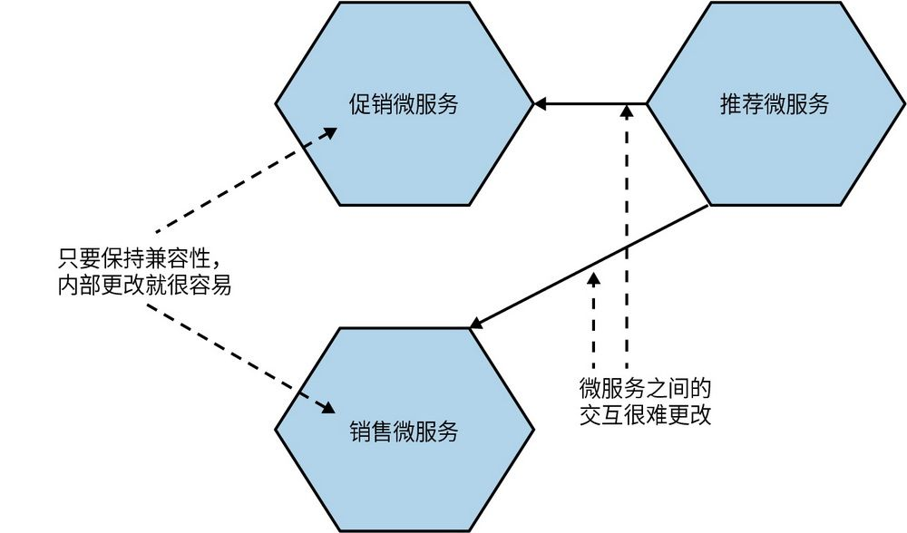
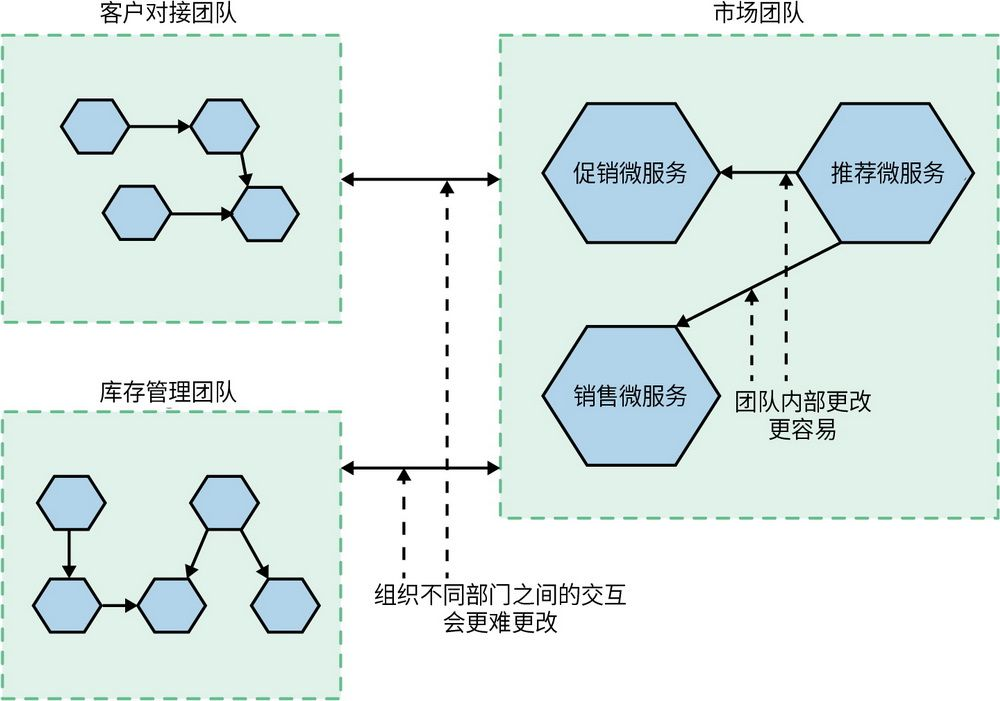
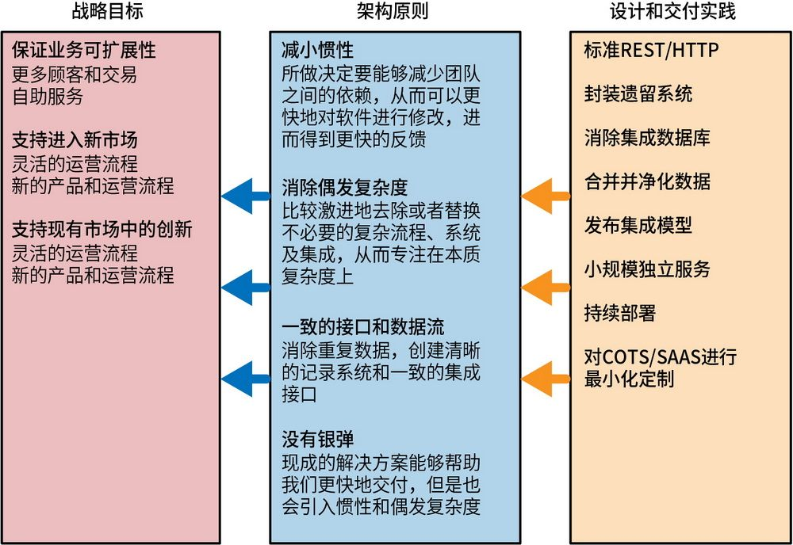
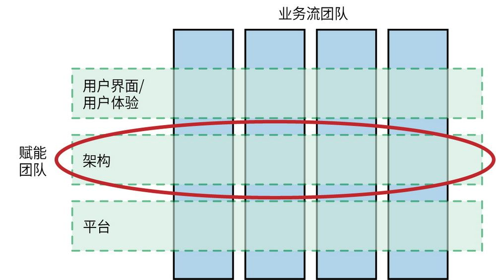

## 第16章 演进式架构师

正如我们当下所看到的，微服务给了我们很多可能性，也随之带来了更多决策要做。例如，我们应该使用多少种技术，我们是否应该让不同的团队使用不同的编程习惯，以及我们是否应该拆分或合并某个微服务？我们应该如何去做这些决策？随着架构所允许的变化速度提高和环境的不稳定性加剧，架构师的职能也必须随之改变。本章将呈现我对于架构师这个角色定位的个人坚持，希望能对象牙塔发起最后的冲击。

### 16.1 名字的意义

你一直在使用这个词。我认为它的含义与你理解的意思不一样。

——Inigo Montoya，电影《公主新娘》

架构师是一个重要的职位。架构师的职责是确保系统有一个广为人知的技术愿景，这个愿景应该有助于为客户提供满足其需求的软件。在某些情况下，架构师可能只需要与一个团队合作，这时他们的角色与技术负责人的角色通常是相同的。而在其他情况下，他们可能需要为整个项目定义愿景，并与世界各地的多个团队甚至整个组织协同工作。无论在哪个层面上工作，架构师的角色都是很难确定的。尽管在企业/组织中通常将架构师这一职位视为开发人员明确的职业发展方向，但是在软件开发这个领域中架构师比其他任何角色承担的责任都要多。与其他任何角色相比，架构师对所建系统的质量、团队的工作条件以及组织应对变更的能力有着直接影响，然而，他们所起到的作用并没有被充分理解。这是为什么呢？

我们的行业仍非常年轻。我们在所熟知的计算机上创建和运行程序仅有75年左右的历史。我们的专业并不像电工、水管工、医生或工程师那样直观可见。每当你在聚会上告诉别人从事的是软件开发工作时，聊天就无法继续下去，这是时有发生的情况。整个世界都在努力理解软件开发——正如本书中多次提到的那样，我们自己对它往往也是一知半解。

因此，我们借鉴了其他职业的命名方式，称自己为软件“工程师”或“架构师”。然而，我们的角色并不像建筑师或工程师那样被社会普遍认知。建筑师和工程师拥有我们梦寐以求的严谨性和纪律性，并且他们在社会中的重要性也是众所周知的。我记得我有一个朋友，他在成为一名合格的建筑师的前一天告诉我：“如果明天我在酒吧里建议你如何建造某个东西，那我就是在犯错，会被追究责任。我可能还会被起诉，因为在法律面前，我已经是一名合格的建筑师，如果我犯了错误，就必须为此负责。”建筑师和工程师这类工作的重要性对整个社会来说意味着人们必须具备特定的资格才可以。例如，在英国，如果想成为建筑师，那么至少要学习7年。而且，建筑师和工程师这类工作的基础知识体系是建立在几千年前的知识体系之上的。然而，如果是软件架构师呢？情况相差甚大。这也是我认为许多形式的IT认证毫无价值的原因之一，因为我们对于“好的”软件知之甚少。

我这么说并不是想贬低**软****件****工****程**这个由Margaret Hamilton在20世纪60年代创造的术语。
	 它不仅代表了一种愿景，也反映了我们当前所处的现实。该术语的提出是为了呼吁提高软件开发过程中的质量，并认识到软件项目往往会面临失败的风险，但是越来越多的关键任务和安全领域需要使用软件。自那时以来，我们已经做了很多工作来改善这种情况，但在我从业20年后，我认为为了提高软件开发质量，我们需要学习的东西还有很多。

有些人渴望得到认可，因此会借用已经在其他行业获得认可的名字。但是，如果在不了解这些职业的思维方式的情况下就借用他们的**工****作****实****践**，或者没有考虑到软件开发与土木工程的不同，则很可能会带来问题。并不是说我们不应该在工作中追求更高的要求，而是不能简单地从其他地方借鉴想法，并认为这些想法可以对我们产生相同的效果。由于我们的行业还非常年轻，因此能够达成共识的绝对因素要少得多。

也许**架****构****师**这个词本身，或者大众对架构师工作的普遍认知，让人们产生了误解：认为架构师是起草详细计划，并等待其他人来理解以及执行的角色。换句话说，架构师需要自己负责平衡艺术和工程，监督创作一个独特的构想，而其他人的观点通常会被边缘化，只有结构工程师偶尔会对物理规律提出疑问。在我们的行业中，架构师的这种观点导致了一些可怕的做法，即他们创建了大量的图表和文档，以期为完美系统的构建提供信息，却没有从根本上考虑未来的不可知性，忽略了计划实施起来的困难性或者这些计划是否真的能够发挥作用，更不用说随着学习的深入，我们是否有能力去做出改变。

但建筑环境的建筑师与软件架构师的领域是不同的。他们面临的限制不同，最终产品也不同。在建筑领域，变更的成本比软件开发要高得多。混凝土一旦浇注就无法回到本来状态，但代码可以修改，而且得益于虚拟化技术，我们运行代码的基础设施变得比以前更加灵活。建筑物一旦建成，它们基本是固定不变的——虽然可以进行改造、扩建或拆除，但相关成本非常高昂。不过，我们期望我们的软件能够不断变化以满足我们的需求。

因此，如果软件架构与建筑环境的架构不同，那么也许我们应该更清楚地了解一下到底什么是软件架构。

### 16.2 什么是软件架构

软件架构最著名的一个定义来自Ralph Johnson的一封电子邮件：“架构是关于重要的东西，不管那是什么。”
	 那么，这是否意味着任何重要的事情都应由架构师来完成？这是否也意味着所有其他正在进行的工作都是**不****重****要**的？这就导致人们常常孤立地使用这个经常被引用的说法，而不能理解Ralph Johnson分享它的更深的用意。首先，很明显，Ralph Johnson是从一个软件开发者的角度来谈论这个问题的。让我们接着往下看。

因此，一个更好的定义是：在大多数成功的软件项目中，从事该项目的专业开发人员对系统设计有共同的理解。这种共同理解被称为“架构”。这种理解包括如何将系统划分为组件，以及这些组件如何通过接口进行交互。这些组件通常由更小的组件组成，但架构只包括所有开发人员都理解的组件和接口。

这将是一个更好的定义，因为它明确了架构是一种社会建构（确实，软件也是，但架构更是如此），它不仅取决于软件本身，还取决于团队共识，即软件的哪些部分看起来很重要。

在这里，Ralph对**组****件**这个术语的定义较为抽象。在本书的上下文中，我们可以将组件视为微服务或是这些微服务中的模块。

软件架构是对系统形态的表达。架构的存在，可能是设计或意外带来的。我们做了一系列的临时决定，最终都得到了结果，也就是说，我们没有从架构的角度考虑问题，最终还是得到了架构。所以架构有时可能是在我们忙于制订其他计划时开始的。

专职的架构师应该看到并理解整个系统，了解对系统的各种作用力。他们需要确保有一个能适配目标且被清楚理解的架构愿景，而这个架构愿景不仅要满足系统和用户的需要，也要满足构建系统的人的需要。如果仅从某一个方面来看，例如，只看逻辑而不看真实环境，只看形态而不看开发者的经验，则会限制架构师的效用。如果接受架构仅是关于对系统的理解这个观点，那么你所关注范围本身就会影响你判断和适应变化的能力。

架构对生活在其中的人来说可能并不可见。它可以很轻微，以至于没有存在感。它可以是指导和帮助实现正确结果的事物。它可能会“令人窒息”且非常“霸道”。它可以在你没有意识到它是一个事物的情况下让你感到喜悦，并在没有任何恶意的情况下将你的精神粉碎。因此，无论架构是不是“关于重要的东西”，它都很**重****要**。

另一句经常被用来定义软件架构的精辟名言同样来自那篇Martin Fowler分享Ralph观点的文章：“最终你可能会把架构定义为**人****们****认****为****难****以****改****变****的****东****西**。”Martin认为架构是难以改变的东西，这在某种程度上是有道理的，并使我们回到了建筑环境中的架构概念。在事情较难改变的地方，他们需要更多的前置思考来确保方向正确。但是，对复杂的想法下一个简单的定义，并以此作为工作定义是有问题的。如果这完全是你对软件架构的思考方式，则你会错过很多东西。没错，很多软件架构就是思考那些难以改变的东西，但它还涉及创造空间以允许在设计上做出改变。

### 16.3 让改变成为可能

回到建筑世界，可以说，建筑大师Mies van der Rohe对塑造我们如今所熟知的现代摩天大楼领域的贡献胜过了其他建筑师，由他设计的著名的西格拉姆大厦成了后来许多建筑的蓝图。西格拉姆大厦与之前的建筑有很多不同之处。大楼并没有外部结构墙，其整体被一个钢制的外框架包裹了起来。楼宇建筑设备主要有电梯、楼梯、空调、供水与排水，以及贯穿混凝土中轴的电力系统。观察一下今天我们正在建造的现代高层建筑，你会发现首先建造的就是这个混凝土中轴，所采用的建筑工具是我们经常会看到的巨型起重机。西格拉姆大厦的每一层也没有内部结构墙，这意味着在如何使用空间方面，你有绝对的灵活性。你可以根据需要重新配置空间，通过天花板上和地板下的管道将电线和空调铺设到每层楼的不同地方。

有趣的是，在西格拉姆大厦开发过程中，建筑的设计是随着施工的进行不断演进的。那么我们以前在哪里见过这种想法呢？

这种设计的理念是为了实现Mies van der Rohe所说的“通用空间”——可以通过重新配置来适应不同需求的大型单跨空间。建筑物的用途会发生变化，所以我们的想法是提供尽可能灵活的空间，以满足它的使用方式。这样一来，Mies van der Rohe不仅要关注建筑的基本美学，为核心服务找到一个空间，而这些空间以后很难甚至不可能改变，而且他必须确保该建筑的使用方式与最初设想的不同。稍后，你将看到我们如何允许在微服务架构的空间里做出改变。

### 16.4 架构师的可演进愿景

作为软件架构师，与设计和建造建筑物的人相比，我们面对的需求变化得更快，我们所掌握的工具和技术变化得也很快。我们所创造的东西并非固定不变，一旦投入生产，软件将随着使用方式的改变而持续演进。对于我们创造的大多数东西，我们必须接受这样一个事实：一旦软件进入用户手中，我们就不得不做出响应并进行调整，而不是期待它成为一个永远不会改变的艺术品。因此，软件架构师需要将他们的思维从创建完美的最终产品转移到帮助创建一个**框****架**上，让正确的系统能够涌现并随着我们的学习不断发展。

虽然在本章的大部分篇幅里我不鼓励将软件架构师与其他职业进行比较，但在谈到IT架构师的角色时，有一个比喻我很喜欢，我认为它很好地概括了这个角色的特点。Thoughtworks的Erik Doernenburg最早与我分享了这个想法：我们应该将架构师的角色看作城市规划师而不是建筑师。对那些玩过《模拟城市》《都市：天际线》的玩家来说，应该非常熟悉城市规划师的角色。城市规划师的职责是查看大量信息来源，然后尝试优化城市的布局，以最大限度地满足当今市民的需求，同时兼顾未来的使用。然而，他们影响城市发展的方式很有意思。他们不会说：“在这个特定的地方建造这个特定的建筑”，而是会定义一些区域，允许在某些限制条件下做出地方建设决策。因此，就像在《模拟城市》中一样，你可以将城市的一部分指定为工业区，另一部分指定为住宅区。然后由其他人来决定建造什么建筑，但是会有一些限制：如果你想建一个工厂，则这个工厂必须位于工业区内。城市规划师不会过多地担心一个区域的情况，而是会花更多的时间来研究人员和公用事业如何从一个区域转移到另一个区域。

很多人把城市比作过生物。城市会随着时间的推移而发生改变。随着居住者以不同的方式使用它，或者随着外部力量不断对它进行塑造，城市会随之发生转变和演变。城市规划师会尽最大努力预测这些变化，但他们也承认，试图直接控制所发生的一切是徒劳的。因此，就像城市规划师一样，架构师需要在大体上确定方向，并在有限的情况下参与到高度具体的实施细节中。他们需要确保该系统不仅适用于现在的目标，也为未来的发展提供了一个平台。

用软件来做类比应该比较容易理解。当用户使用软件时，我们需要做出响应和改变。我们不可能预见所有会发生的事情，因此，与其为每一个可能发生的情况做计划，不如通过避免过度规定每一件事情来允许变化。我们的城市，也就是这个系统，需要成为一个让每个使用者都感到满意、快乐的地方。

### 16.5 定义系统边界

继续使用将架构师比作城市规划师的比喻，这样一来我们的区域即为微服务边界，或者说是微服务组的粒度。作为架构师，我们不必太关注区域**内****部**发生的事情，而应该多关注区域之间发生的事情。这意味着我们需要花时间考虑微服务之间的通信，并确保能够正确地监测系统的整体健康状况。从架构空间来看，这就是如何创建**通****用****空****间**：通过定义一些特定的边界，我们向构建系统的同事强调，在不破坏架构的基础部分的情况下，哪些区域可以更自由地进行修改。

来看一个非常简单的例子。在图16-1中，可以看到推荐微服务从促销微服务和销售微服务中获取信息。根据架构的设计，我们可以自由地修改这3个微服务中隐藏的功能，而不必担心破坏整个系统。只要对推荐微服务如何与这些下游微服务进行交互的预期保持不变，就可以随意更改销售微服务或促销微服务中的任何内容。

图16-1：只要微服务之间的交互不发生变化，就很容易进行微服务边界内的更改

也可以在更大范围的层面上为变化创造空间。如图16-2所示，可以看到图16-1中的微服务实际上存在于映射到特定团队边界的促销微服务区域中。我们已经定义了促销微服务功能与更大系统互动的预期行为。在促销微服务区域内，只要保持与更大系统的兼容性，就可以做出任何想要的改变。回到“理解哪些事情难以改变”的思考上，组织结构往往属于这个范畴，因此现有的团队结构可以帮助你定义这些区域。协调团队内跨微服务的更改将比更改跨团队之间的交互所需的接口更为简单。

图16-2：区域内的更改比区域间的更改更容易进行

这与15.5节中讨论的团队API的概念非常吻合。架构师可以帮助促进团队API的创建，确保团队的微服务和工作实践与更大范围的组织相适应。

通过定义进行这些更改的空间，使其不影响系统的整体情况，不仅可以使开发者的工作更轻松，也可以使我们将注意力集中在系统中较难改变的部分。还记得第2章中探讨过的信息隐藏的概念吗？就像我们所讨论的那样，将信息隐藏在微服务的边界内，可以更容易地为消费者创建一个稳定的接口。当我们对微服务进行修改时，更容易确保没有破坏与外部消费者的兼容性。在这里，我们可以定义一个架构，在团队层面而不仅仅是微服务层面提供信息隐藏。这为我们提供了另一个层面的信息隐藏，并创造了一个更大的安全空间，在这个空间里，团队可以进行局部改变而不破坏更大范围的系统。

在每个微服务或更大的区域内，你可能会接受该区域的团队选择不同的技术栈或数据存储方式。当然，这里还需要权衡其他方面的关注点。如果你需要支持10个不同的技术栈，那么让团队自由选择可能需要三思，因为这将导致很难雇用人员或在团队之间调动人员。

同样，如果每个团队选择完全不同的数据存储方式，则你可能会发现自己缺乏足够的经验来大规模运行任何一种存储方式。例如，Netflix已经将Cassandra作为主要的数据存储技术标准。虽然它可能不是在所有情况下的最佳选择，但Netflix认为，与必须支持和运维多个规模化的平台相比，通过建立围绕Cassandra的工具和专业知识所获得的价值更为重要。Netflix是一个极端例子，规模可能是最强有力的压倒性因素，但你应该能明白我的意思。

然而，在微服务之间，情况变得更加混乱。如果第一个微服务决定通过HTTP公开REST，第二个微服务使用的是gRPC，第三个微服务使用的是Java RMI，那么集成将成为一场噩梦，因为消费者的微服务必须理解和支持多种交互方式。这就是为什么我试图坚持如下原则：我们应该“关注盒子之间发生的事情，而对盒子内部发生的事情置之不理”。

因此，与其他任何事情一样，一个成功的架构应该允许进行更改以适应用户的需求。但是，人们经常忘记的一件事是，我们的系统不仅是为了满足用户的需求，也是为了满足实际构建软件的人的需求。成功的架构也有助于创造良好的工作环境。

### 16.6 一种社会结构

作战计划往往经不住敌军的检验。

——Helmuth von Moltke（深度改编）

因此，你已经考虑了愿景、制约因素和需要完成的事情。你认为你了解什么是难以改变的，以及哪里有改变的空间。那么接下来呢？实际上，架构很少按照预期完美落地，这是现实与愿景之间的差距。在建筑环境中，建筑师不仅需要与施工人员合作，帮助他们理解愿景，也要根据实际挑战不断地改变计划。可能你觉得这是不可能的事情。如果架构师没有与创建系统的人“打成一片”，那么他们就不能有效地与这些人交流愿景，同时也不会明白这个愿景在哪里已经不再适合目标。施工人员可能会在现场遇到超出预期的问题，或者也许由于供应短缺还可能会导致重新思考设计。

架构是实际发生的事情，而不会仅仅停留在计划阶段。作为架构师，如果你将自己从实施过程中分离出来，那么你就只是一个梦想家，而不是真正的架构师。最终成形的架构可能与你的愿景有关，也可能无关，但无论你是否参与其中，它都将建成。实施架构需要许多人一起努力并制定一系列大小不一的决策。

正如Grady Booch所说
	 ：

一个软件密集型系统的架构在一开始只是愿景声明，最终，在沿途数十亿个大大小小、有意或无意的设计决策下，每个这样的系统的架构都得到了体现。

这意味着，即使你有一个最终对架构负责的人，也需要许多人负责将这个愿景付诸实践。实施一个成功的架构将是全体团队成员努力的结果。回到前面Ralph Johnson说过的一句话：“架构是一种社会建构。”在这方面，康卡斯特提供了一个很好的例子，分享了如何通过使用架构协会来分散决策权的经验。
	 鉴于其规模，康卡斯特决定利用行业指导小组的经验，其中集体决策是关键。

在康卡斯特，我们意识到这个问题看起来与开放标准机构的工作方式非常相似，即让多个自治团体就技术方法达成一致。因此，我们成立了一个内部架构协会，该协会的运作方式模仿了一个非常成功的标准机构——互联网工程任务组（IETF），这个任务组定义了许多重要的互联网协议。

——Jon Moore，康卡斯特有线电视公司首席软件架构师

康卡斯特的方法有一定程度的正规性，致使一些组织可能会觉得很烦琐。但考虑到公司的规模和分布情况，这种方法对康卡斯特来说收效甚广。

### 16.7 宜居性

还有一个来自建筑环境并在软件开发领域产生共鸣的概念是**宜****居****性**。我是从Frank Buschmann那里了解到这个术语的，他解释说，架构师有责任确保他们创造的环境适合于工作。如果架构是描述如何将那些难以改变的东西组合在一起的系统的框架，那么有时候也需要放置适当的约束条件。但是，如果约束条件不合适，那么在系统中工作就会变得很痛苦，并且容易出错。

正如*P**a**t**t**e**r**n**s**o**f**S**o**f**t**w**a**r**e*
 的作者Richard Gabriel所解释的那样：

惯性是源代码的一种特性，它使程序员在以后使用代码时能够理解其结构和意图，并轻松自信地对其进行修改。

这意味着，现代软件开发生态系统不仅仅由代码构成，还包括我们使用的技术和采用的工作实践。我经常听到开发人员抱怨说要被迫使用从未使用过的技术，而这些技术往往是由那些从不需要使用它们的人选择的。如果让架构演进和所使用的工具与技术的选择成为协同的过程，那么就能确保最终结果是一个“适合居住的环境”，构建系统的人也会在其中感到快乐和富有成效。

如果要确保所创建的系统适合开发人员的工作，那么架构师和其他决策者就需要理解他们的决策所带来的影响。至少，这意味着他们要花时间与团队在一起，最好是花时间与团队一起编码。对那些练习结对编程的人来说，架构师作为结对的一员在短期内加入一个团队很容易实现。参加集体编程练习也能带来显著的好处，然而参加这种团队活动的架构师还需要注意，他们的存在可能会改变原本的计划。

理想情况下，作为架构师，你应该参与日常任务，以真正了解“正常”工作的情况。我觉得再怎么强调架构师需要花时间与构建系统的团队在一起也不为过。这比打电话或仅仅查看他们的代码要有效得多。至于频率如何，这在很大程度上取决于你所合作的团队的规模。但关键是，这应该是一项日常活动。如果你与4个团队一起工作，那么也许就要确保每4周花半天时间与每个团队接触，与他们一起完成交付任务，进而确保与团队建立关系并加强沟通。

### 16.8 原则方法

规则指导智者，约束傻瓜。

——一般认为出自Douglas Bader

通常情况下，在系统设计中所做出的决策需要进行权衡，而微服务架构给了我们很多权衡的机会。例如，在选择数据存储时，我们是否应该选择一个经验不足但更易于扩展的平台？我们的系统可以使用两个技术栈吗？或者使用3个？只要拥有足够的信息，有些决策是比较容易做出的。然而，那些在信息不充分的情况下做出的决策会更具挑战性。

框架在这种情况下可以提供帮助，其中根据目标定义一组指导决策的原则和实践是一种不错的方法。下面我们会对框架设计的这些方面进行逐一探讨。

#### 16.8.1 战略目标

架构师的职责已经足够令人生畏了，但令人庆幸的是，我们通常不需要定义战略目标。战略目标应该用来说明公司的发展方向，以及如何最好地满足客户的需求。这些目标通常是高级别的，可能与技术无关（比如“拓展至东南亚以打开新市场”或者“尽可能多地让客户使用自助服务”），因此可以在公司层面或部门层面进行定义。重要的是，这些目标定义了组织的发展方向，因此需要确保技术与之保持一致。

如果你是定义公司技术愿景的人，那么这可能意味着你需要花更多时间与组织中的非技术部门（也称为“业务部门”）合作。你需要了解推动业务愿景的因素是什么以及它是如何发生改变的。

#### 16.8.2 原则

所谓原则，就是为了使你所做的事情与某个更大的目标保持一致而制定的规则。原则有时会发生变化。如果组织的战略目标之一是缩短新功能的上市时间，那么你就可以制定一个原则，即交付团队在软件整个生命周期中拥有完全的控制权，只要软件准备就绪，就可以独立于其他团队发布。如果你的组织还希望积极扩展产品到其他国家/地区，那么你可能需要定义另一个原则，即为了尊重数据的主权，整个系统必须是可移植的，以便在本地部署。

你可能并不需要太多这样的原则。建议保留不超过10条原则，这样团队就可以记住它们，或者可以将其打印出来贴在小海报上。原则越多，它们发生重叠和冲突的可能性就越大。

Heroku的十二因子是一套设计原则，旨在帮助你创建能在Heroku平台上良好运行的应用。这些原则在其他环境中也可能是有意义的，其中一些实际上是对应用展现行为的约束，其目的是能在Heroku上运行。约束实际上是很难（或几乎不可能）改变的，但原则是我们自己决定的。你应该明确地指出哪些是原则，哪些是约束，这样用户就会很清楚哪些是不能变的。就我个人而言，我认为把原则和约束放在同一个列表中是有价值的，这样就可以不时地鼓励去挑战约束，时刻关注它们是否真的不可改变。

#### 16.8.3 实践

实践用于确保原则如何被执行。它们是一套详细、实用的执行任务指南。它们通常是针对技术的，而且是比较底层的，所以任何开发人员都能理解。实践可以包括编码指南、日志数据集中捕获或HTTP/REST作为标准集成风格等。由于其技术性质，实践通常比原则改变得更频繁。

与原则一样，有时实践反映了组织内的限制。如果已经决定选择Azure作为云平台，那么这将需要反映在你的实践中。

实践应该巩固原则。如果有一项原则是“交付团队在软件整个生命周期中拥有完全的控制权”，那么实际操作中可能会出现下面的做法：所有的微服务都被部署到独立的AWS账户中，以便提供资源的自助管理并与其他团队隔离。

#### 16.8.4 原则与实践相结合

有些东西对一些人来说是原则，对另一些人来说则可能是实践。例如，你可能会把使用HTTP/REST作为原则而非实践，这是没有问题的。关键是要有一个指导系统演进的总体思想，并提供足够的细节，确保大家知道如何实现这些想法，这样才是有价值的。对于足够小的团队（比如单独的团队），将原则和实践结合起来是没问题的。然而，对于较大的组织，技术原则和工作实践通常会因地制宜，你可能希望不同的地方有不同的实践，只要它们符合一套共同的原则就好了。例如，.NET团队可能有一套实践，Java团队可能有另一套实践，但两个团队遵循的原则可能是相同的。

#### 16.8.5 一个真实的例子

我的一位老同事Evan Bottcher在与他的一位客户合作的过程中开发了图16-3所示的图表。该图很清晰地显示了目标、原则和实践的相互作用。几年间，实践在定期发生变化，而原则基本上没怎么变。可以将这样的图表打印出来并共享给其他人员，其中每个想法都很简单，一般的开发人员都能记住。当然，每条实践背后还有更多的细节，但能够以这么精炼的形式表述出来也是非常有用的。

有文档来支持其中一些条目当然很好，最好是能够同时提供展示这些实践如何实现的工作代码。在15.8.2节中，我们探讨过如何创建一套通用的工具以保障开发人员更容易做正确的事情。理想情况下，平台应该简化遵循这些实践的流程，而且随着实践的改变，平台也应该随之调整。

图16-3：现实世界中原则和实践的例子

### 16.9

### 演进式架构

如果架构不是静态的，而是不断变化和演进的，那么该如何确保它按照我们期望那样成长和改变，而不是变成无法控制的巨大痛苦、折磨和相互指责呢？在《演进式架构》
	 一书中，作者提出了适应度函数的概念，以收集有关架构的相对“适应度”的信息，进而帮助架构师做出是否需要采取行动的决策。

演进式计算有多种机制，通过对每一代软件进行小的变更使方案逐渐成形。工程师会评估每一代解决方案的当前状态，来判断当前方案与最终目标的距离。比如，在通过遗传算法优化机翼设计时，适应度函数会评估风阻、重量、气流，以及好的机翼设计应具备的其他特征。架构师通过适应度函数解释什么方案更好，并用它衡量何时能达到目标。在软件中，我们使用适应度函数检查开发人员是否保留了架构的重要特征。

适应度函数的理念是：用于理解某个重要属性的当前状态，因此，如果该属性的变化超出了某些允许的范围，那么就需要对这些变化进行深入研究。通常情况下，适应度函数用于确保架构是否遵循了已经制定的原则和约束。

借用《演进式架构》的一个例子。考虑这样一个性能需求：所有服务调用必须在100毫秒内响应。你可以实现一个适应度函数来收集这个服务的性能数据，也许是在性能测试环境中，也许是在实际运行的系统中，从而确保系统的实际行为符合要求。《演进式架构》对这一主题进行了更详细的阐述，如果你想进一步探索这一概念，我极力推荐这本书。

架构的适应度函数可以采用多种形式。然而，其基本概念是收集实际数据，以了解架构是否符合特定标准的“适应性”。这可能涉及系统性能、代码耦合、周期时间或许多其他方面。这些适应度函数充当了一种信息来源，用于帮助架构师了解何处可能需要介入。请注意，通过与构建系统的人密切合作来定义的适应度函数效果最佳。适应度函数应该是帮助你了解架构是否朝着正确方向发展的一种有效方式，但它们并不能替代实际与基层人员的必要沟通。事实上，我认为定义正确的适应度函数将需要密切合作。

### 16.10 业务流组织中的架构

在第15章中，我们看到了现代软件交付组织如何转向一个更加面向业务流的模型，在这个模型中，自治独立的团队会专注于端到端功能交付，他们的优先级是由产品驱动的。我们还讨论了跨领域的团队——用于支持业务流团队的**赋****能****团****队**。那么，在这个模型中，架构师的定位是什么呢？有时候，业务流团队的范围非常复杂，需要一个专门的架构师来负责（这里又一次展示了传统技术领导和架构师二者的角色界限非常模糊）。然而，在许多情况下，架构师会被要求跨多个团队工作。

架构师的许多职责（比如清晰地传达技术愿景、了解出现的挑战，以及帮助团队对技术愿景做相应调整）可以被看作在对团队赋能。架构师可以帮助人们建立联系，他们关注大局，可以帮助团队了解他们所做的事情如何才能适应更大的整体。这正好符合架构师作为赋能团队一分子的理念，如图16-4所示。这样一个赋能团队可能由不同的人组成，既可能是全职在团队中工作的人，也可能是兼职对团队提供帮助的人。

图16-4：作为赋能团队的架构功能

我非常喜欢的一种模式是团队中有一小部分专职的架构师（在许多情况下可能只有一两个人），但随着时间的推移，会有来自每个交付团队的技术人员（至少包括每个团队的技术负责人）加入该团队。架构师负责确保团队正常运作，这将能够确保工作被合理分配，并有更高水平的推进。同时，它还可以确保信息自由地从赋能团队流向业务流团队，从而使决策制定更加合理和明智。

有时，团队可能会做出与架构师完全不同的决定。在这种情况下，架构师应该采取什么措施呢？我以前遇到过这种情况，可以说这是最具挑战性的情况之一。通常我采取的措施是尊重团队的决定。我认为我已经尽了最大努力去说服人们，但最终我的说服力还是不够强。团队往往比个人更明智，我已经不止一次验证了自己的决策是错误的。想象一下，给予团队决策空间，最终却选择忽略大家的意见，这会极大打击团队的士气。不过，有时我也会否决团队的意见。你肯定想知道为什么？这是在什么情况下发生的？如何把握这个度？

想想我们教小孩子骑自行车。你不能替他们骑。你看着他们摇摇晃晃，但如果每次在他们可能会掉下来时你都介入，那么他们就永远都学不会，而且在任何情况下，他们掉下来的次数可能比你想象的要少得多。但如果看到他们即将转向马路或进入附近的鸭子池塘，你就必须介入了。当然，在这种情况下，我也经常被证明是做了错误的决策，我让团队去做一些我认为不正确的事情，而他们所做的事情奏效了。同样，作为一名架构师，你需要牢牢把握团队什么时候正进入一个“鸭子池塘”。你还需要意识到，即使你清楚自己是正确的，那么如果否决团队，则不仅会损害你的地位，也会让团队觉得他们没有发言权。有时正确的做法是同意你不同意的决定。虽然知道某件事什么时候该做、什么时候不该做很困难，但有时也至关重要。

正如稍后我们将要讨论的那样，当架构师必须参与治理活动时，事情变得有趣了。这可能会对跨领域架构团队的作用造成一些困惑。业务流团队偏离技术战略时会如何？他们可以这样做吗？也许这是一个合理的例外，但它也可能导致更根本的问题。以权宜之计的名义做出的短期决策可能会造成后续更大的改变。试想一下，架构组试图帮助组织摆脱集中式数据的使用（因为这些数据会导致耦合和运维问题），但其中一个团队决定将一些新产生的数据放入共享数据库中，因为该团队面临快速交付的压力。那么，后续会产生什么影响呢？

根据我的经验，这一切都归结于良好且清晰的沟通以及对职责的理解。如果一个产品负责人做出的决策破坏了我正在努力的一些跨领域活动，那么我会与其进行沟通。也许短期决策是正确的（可以说，这最终会成为我们有意识地承担的某种技术债务）。在其他情况下，产品负责人也许能够改变计划的内容，以更好地应对整体策略。而在最坏的情况下，这个问题可能需要升级。

在REA（本书前面提到的澳大利亚房地产公司）中，产品负责人偶尔会做出决策，但他们确定工作优先次序的方式可能会导致技术债务积累和后续问题的出现。这是因为产品负责人主要负责确保交付功能并让客户满意，而技术债务问题往往由技术负责人承担。改变这种局面的一种方式是让产品负责人也负责软件技术方面，也就是说，产品负责人必须更积极地了解系统的技术部分（如安全性或性能），并在确定工作的优先次序方面多与技术专家合作。虽然让非技术性的产品负责人承担更多与技术活动的优先次序有关的责任不是一件简单的事情，但根据我的经验，这绝对值得一试。

### 16.11 组建团队

作为系统技术愿景的主要负责人，仅做出正确的技术决策远远不够，你还需要确保技术愿景能够执行，而这要依靠那些与你一起工作的人。对任何技术领导者来说，就是帮助队友成长，帮助他们成为创造愿景的一部分，并保证他们可以积极参与到愿景的实施和调整中来。

帮助我们周围的人实现他们的职业发展有很多种形式，其中大部分不在本书的讨论范围内。不过，有一种形式是与微服务架构特别相关的。对于更大的单体系统，我们很少有机会去“负责”一些东西，而对于微服务架构，我们有多个自治的代码库，每个代码库都有自己独立的生命周期。因此，在让这些人承担更多责任之前，可以让他们先负责单个微服务，这不仅是帮助他们实现自己职业目标的好方法，也可以减轻负责人的负担。

我坚信，伟大的软件来自伟大的人。因此，如果你只关注到了技术方面的问题，那就错过了大半以上的风景，因为团队也是不可忽略的部分。

### 16.12 必要标准

当你审视实践并思考做出权衡时，要找到的最重要的平衡之一是系统中允许有多少变化。有个很关键的方式是，通过定义一个表现良好、行为可控的微服务是什么样子的来确定微服务之间的不变量。什么样的微服务算是系统中的“一等公民”？它需要具备哪些能力来确保整个系统是可管理的，甚至当一个有问题的微服务出现时，也不会导致整个系统崩溃？就像人一样，作为“好公民”的微服务在某个环境中是什么样子，并不说明它在其他地方也能如此。但是，有一些行为良好的微服务是具备共同特征的，找到它们相当重要。如果在一些关键部分允许有太多差异，则可能会导致相当糟糕的局面。正如Facebook的Ben Christensen所言，当你从更大的全景图考虑时，“系统应该由许多具有自主生命周期的小部件组成，这些小部件之间有很强的凝聚力”。所以你需要在优化单个微服务的自主权和兼顾全局之间找到一个平衡点。一种能帮我们实现平衡的方法是，明确地定义每个微服务应该具有的属性。下面我们来聊聊其中的一些属性。

#### 16.12.1 可监控性

建立一致、跨服务且系统健康的视图至关重要。这必须是一个系统级别的视图，而不限于某个微服务。正如第10章中所讨论的那样，通常只有当你需要诊断更广泛的问题或想要了解更大的趋势时，才需要知道单个微服务的健康状况。为了尽可能地简化这一点，我建议确保所有微服务都以相同的方式暴露健康和常规监控相关的指标。

你可能会选择采用推送机制，即每个微服务需要将这些数据推送到一个集中的位置。但无论你选择什么，都应尽量保持标准化。让盒子里的实现不透明，不要让你的监控系统为了支持它而改变。日志在这里也属于同一类别：我们需要它以一致的方式记录、收集和呈现。

#### 16.12.2 接口

挑选少量已定义的接口技术有助于集成新的消费者。使用一种标准方式很好，两种也不算坏，但如果使用20种集成方式那可就太糟糕了。这不仅仅是选择技术和协议的问题，它带来的影响远大于此。如果选择HTTP/REST，那么你会使用动词还是名词？你会如何处理资源的分页？你会如何处理各端点的版本问题？

#### 16.12.3 架构安全性

由于一个微服务的不当行为而毁了整个系统是我们无法承受的。我们必须确保微服务适当地屏蔽掉不健康下游调用的影响。不能正确处理潜在下游调用故障的微服务越多，我们的系统就会越脆弱。这可能意味着你要围绕服务间通信强制执行某些做法，比如要求使用断路器（12.5节探讨过这个话题）。

当涉及响应编码时，遵守规则也很重要。如果断路器依赖于HTTP编码，而一个微服务决定用2XX编码返回错误，或混淆使用了4XX编码和5XX编码，那么这些安全措施就会崩溃。即使你使用的不是HTTP，也应该注意类似的问题。我们需要了解一个请求是否被正确处理：是因为错误而被微服务拦截，还是因为服务器故障而无法确定请求的状态。这对我们快速发现并追踪问题是非常关键的。如果我们的微服务不遵守这些规则，那么最终整个系统就会更加脆弱。

### 16.13 治理并铺路

治理是架构师工作的一部分。那这里所说的**治****理**是什么意思呢？COBIT（信息系统及技术的控制目标）框架给出了一个相当好的定义。
	 

治理通过评估干系人的需求、条件和选项来确保企业的目标实现，通过优先排序和决策来制定方向，并根据商定的方向和目标来监测绩效、合规和进展情况。

简而言之，我们可以将治理视为关于如何行事的共识，确保人们知道事情应该如何做，并确保事情以某种方式完成。在一些环境下，治理只需非正式地进行，会被作为日程软件开发活动的一部分。在另一些环境下，特别是在较大的组织中，可能需要一个更具体的职能来承担治理工作。

IT场景中有很多事情需要治理，而架构师会承担技术治理这方面的职责。如果架构师的职责之一是确保有一个技术愿景，那么治理就是确保我们所构建的系统与这个愿景相匹配，并可以在需要时对其进行演化。

从根本上说，治理应该是一项集体活动。一个日常运作的治理小组可以一起分担工作并塑造愿景。它可以是与一个较小的团队进行非正式沟通，也可以是在较大的范围内与有着正式成员的小组开展一系列会议。在这些会议上，我们可以讨论之前提到的那些原则，并根据需要进行必要的修改。如果需要一个正式的小组，那么它的成员应该主要来自实际执行治理工作的人。这个小组还应该负责追踪和管理技术风险。

虽然将人们聚在一起就如何做事达成一致是很好的做法，但是花时间确保大家遵循这些准则并没有那么有趣，这就像把实现所有微服务标准的负担都放在开发人员身上一样。我坚持认为要让人们轻松地做正确的事情，就像第15章中讨论的那样，预先铺好的路是一个非常有用的概念。架构师的职责是清楚地阐明愿景（确定目标），并让实现这个愿景的过程变得没那么难。因此，无论要铺设什么样的道路，他们都应该积极参与。对许多人来说，平台是一个有力的例子，架构师最终会成为平台团队的重要干系人。

我们已经比较深入地研究了平台的作用，接下来再看看其他一些技术，通过这些技术，人们可以更轻松地做正确的事情。

#### 16.13.1 榜样的力量

编写文档非常好，也非常有用，我清楚地看到了这样做的价值，这也是我撰写本书的原因。但是开发人员更喜欢可以运行和探索的代码。如果你有一套想鼓励大家使用的标准或最佳实践，那么拥有可以指导人们的示例是非常有用的。我们的想法是，人们只要能模仿系统中一些较好的部分就可以了。

理想情况下，这些微服务应该是运行在系统中的真实微服务，而不是仅仅作为“完美示例”实现的孤立微服务。通过确保示例被实际使用，你还可以印证拥有的所有原则在真实上下文中都是合理的。

#### 16.13.2 定制的微服务模板

如果所有开发人员仅需做很少的工作就能非常容易地遵循大部分准则，那不是很好吗？如果开发人员编写的大部分代码是用来实现微服务需要的核心属性，能够开箱即用，那会怎么样？

当前有许多针对不同编程语言的框架，它们会试图为你的微服务模板提供组件。Spring Boot可能是像JVM这样的框架中最成功的例子。核心Spring Boot框架相当轻，但你可以将一组库组合在一起，以提供健康状况检查、HTTP服务或发布指标等功能。所以开箱即用就有了一个简单的“Hello World”微服务，它可以从命令行启动。

因此，许多人会采用这些框架，并根据具体情况将这种初始化方法标准化。例如，当启动新的微服务时，他们可能会编写脚本，以获得一个带有组织核心库的Spring Boot模板，其中可能已经引入了库来处理断路器，并被配置为用JWT身份验证来处理入站调用。通常，这样的自动化模板创建也会创建一个匹配的构建流水线。

**注****意****事****项**

选择和配置这些定制的微服务模板通常是平台团队的任务。例如，他们可以为每一种所支持的语言提供一个模板，以确保在使用模板时产生的微服务能在平台上很好地工作。然而，这也可能会带来一些挑战。

团队的士气和生产力被强制性的框架所摧毁的例子我见过很多。在提高代码复用性的驱动下，越来越多的工作被放在一个集中的框架中，直到它变成一个巨大的怪物。如果你决定使用定制的微服务模板，请仔细考虑它的作用。理想情况下，它的使用应该是完全可选的，但是如果想要更大限度地使用它，那么对开发人员来说“易用性”才是关键。允许使用模板的开发人员提出建议甚至直接贡献对框架的修改，或是遵循内部开源模式，都会有极大帮助。

正如5.8节中所讨论的那样，我们必须意识到共享代码的危险性。为了创建可复用的代码，我们可能会引入微服务之间的耦合源。在我采访过的组织中，至少有一家对此非常担心，以至于他们手动将其微服务模板代码复制到了每个微服务中。这意味着对核心微服务模板的升级需要更长的时间才能应用到整个系统中，但对组织来说，耦合的危险比这更重要。在我接触过的其他团队中，尽管他们非常勤奋地遵循DRY原则以防止出现过度耦合的系统，但依然把微服务模板视作一个共享的二进制依赖。

#### 16.13.3 将铺好的路规模化

拥有大量微服务的组织中经常会出现使用内部微服务模板和框架的情况。Netflix和Monzo就是这样的两个组织。它们都决定在某种程度上对自己的技术栈进行标准化（Netflix是基于JVM的，Monzo是基于Go的），这样就可以通过一套通用的工具来加速创建具备标准、预期行为的新微服务。但随着技术栈的多样化，通过一个标准的微服务模板来满足所有的需求变得更加困难。

如果你的组织要使用多个不同的技术栈，那么就需要为每个技术栈提供一个匹配的微服务模板。不过，这可能是你在团队中巧妙地限制语言选择的一种方式。如果内部微服务模板只支持JVM，那么选用其他技术栈就意味着开发人员需要自己做很多额外的工作。Netflix非常在意服务的容错性，它不希望因系统的一个部分停止工作而造成整个系统都无法正常工作。为了解决这个问题，Netflix已经做了大量的工作，包括但不限于确保JVM上有相应的客户端库、为团队提供他们需要的工具，以保持微服务的良好运行。引入一个新技术栈将意味着不得不重复所有这些工作。Netflix主要担心的不是重复的工作，而是这样做很容易出错。如果一个新实现的微服务的容错出现问题，那么可能会影响系统的更多部分，导致风险的升高。Netflix使用“sidecar服务”来缓解这一问题，这些sidecar服务会与应用适当库的JVM进行本地通信。

服务网格为我们提供了复用通用功能的另一种可能的方式。一些通常被视为微服务内部职责的功能现在可以被推到微服务网格中。这不仅可以确保用不同编程语言编写的微服务之间行为的一致性，也可以减少这些微服务模板的职责。

### 16.14 技术债务

我们经常被置于这样的境地，即无法完全贯彻我们的技术愿景。通常情况下，我们需要做出选择，走一些弯路来完成一些紧急功能。这是我们不得不做出的又一个权衡。我们的技术愿景的存在是有道理的，如果偏离这个愿景，那么虽然短期内可能会有好处，但长期来看是要付出代价的。技术债务的概念可以帮助我们理解这种权衡。就像现实世界中的债务一样，它有一个持续的成本，我们积累的技术债务越多，需要偿还的东西就越多。

有时候，技术债务并不仅仅是走捷径造成的。如果我们对系统的设想发生了改变，但不是所有的系统都能与之匹配，那么会发生什么呢？在这种情况下，我们也创造了新技术债务。

架构师的职责是着眼于大局并理解如何做权衡。对债务程度和哪里需要介入的了解是很重要的。对于某些组织，架构师可以提供温和的指导，让团队自行决定如何追踪和偿还这些技术债务。而对于其他组织，可能需要采取更加结构化的方式，比如维护一个需要定期审查的债务日志。

### 16.15 异常处理

因此，原则和实践可以指导我们如何构建系统。但是，当系统偏离了这些指导时会发生什么呢？有时我们会做出一个不符合规则的例外决策。在这些情况下，也许值得把这样的决策记录在某处的日志中，以供将来参考。如果发现了足够多的**例****外****情****况**，那么最终改变适用的原则或实践来反映对世界的新理解可能也是有意义的。例如，可能我们有一个实践，规定总是使用MySQL进行数据存储，但后来发现有个令人信服的理由使用Cassandra进行高度可扩展的存储，这时我们就会改变相应的实践，比如“使用MySQL来满足大多数存储需求，如果预期会有大量的增长，则使用Cassandra。”

不过，值得重申的是，每个组织都是不同的。在我曾合作过的一些公司中，它们具有高度自治的开发团队，这些团队也得到了公司的信任。在这种情况下，通常来说原则是轻量级的（公开的异常处理即使没有完全消除，也被大大减少了）。而在结构化较强的组织中，开发人员拥有较小的自由度，这时通过追踪异常来确保现有规则的合理性则至关重要。现实情况非常复杂，但我个人非常支持使用拥有高度自治的微服务团队，以让他们更加自由地解决手头问题。如果你所在的组织对开发人员的工作方式有很多限制，那么微服务可能并不适合你。

### 16.16 小结

总结一下本章吧，以下是我认为一个演进式架构师应该承担的核心职责。

**愿****景**

确保在系统级有一个能简明沟通的技术愿景，这个愿景能帮助你满足客户和组织的要求。

**同****理****心**

充分理解你所做的决定给客户和同事带来的影响。

**协****作**

与尽可能多的队友和同事进行沟通，从而更好地定义、完善和执行愿景。

**适****应****性**

确保在你的客户和组织需要的时候调整技术愿景。

**自****治****性**

在标准化和实现团队自治之间找到适当的平衡。

**治****理**

保障正在实施的系统符合技术愿景，并确保人们轻松地做正确的事情。

对演进式架构师来说，他应该理解，成功要靠不断地取舍来实现。总会存在一些原因需要你改变工作的方式，而具体做哪些改变往往只能依赖于自己的经验。但僵化地固守自己的想法无疑是最糟糕的做法。

虽然本章中的大部分建议对任何一个系统架构师来说都适用，但在微服务系统中，架构师需要做更多的决策。因此，能够更好地平衡所有这些权衡是至关重要的。如果你想更深入地探讨这个话题，推荐阅读前面已经引用过的《演进式架构》一书，另外，也可以阅读一下Gregor Hohpe的*T**h**e**S**o**f**t**w**a**r**e**A**r**c**h**i**t**e**c**t**E**l**e**v**a**t**o**r*，该书有助于架构师了解如何在高层的战略思考和落地的交付之间架起桥梁。

快到本书的结尾了，前面已经覆盖了很多话题。在“后记”中，我们一起来总结一下所学到的东西吧。
