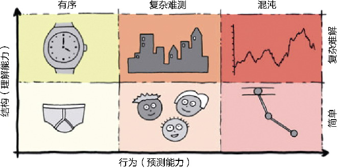
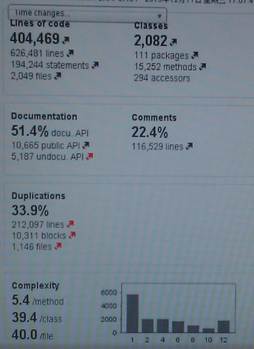
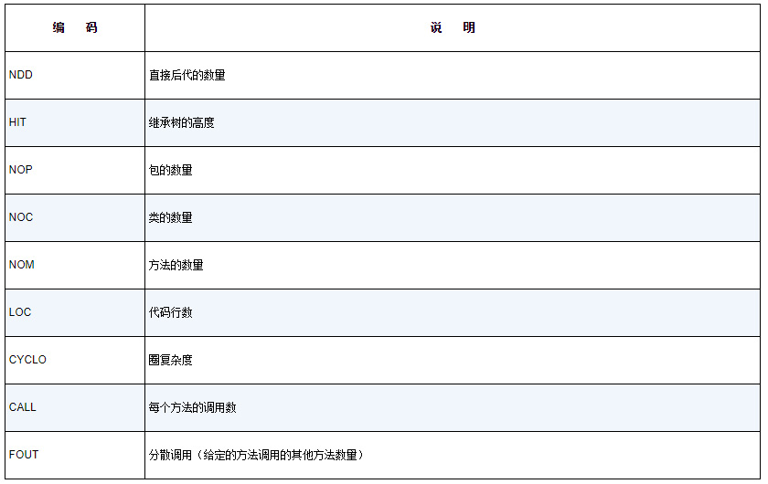
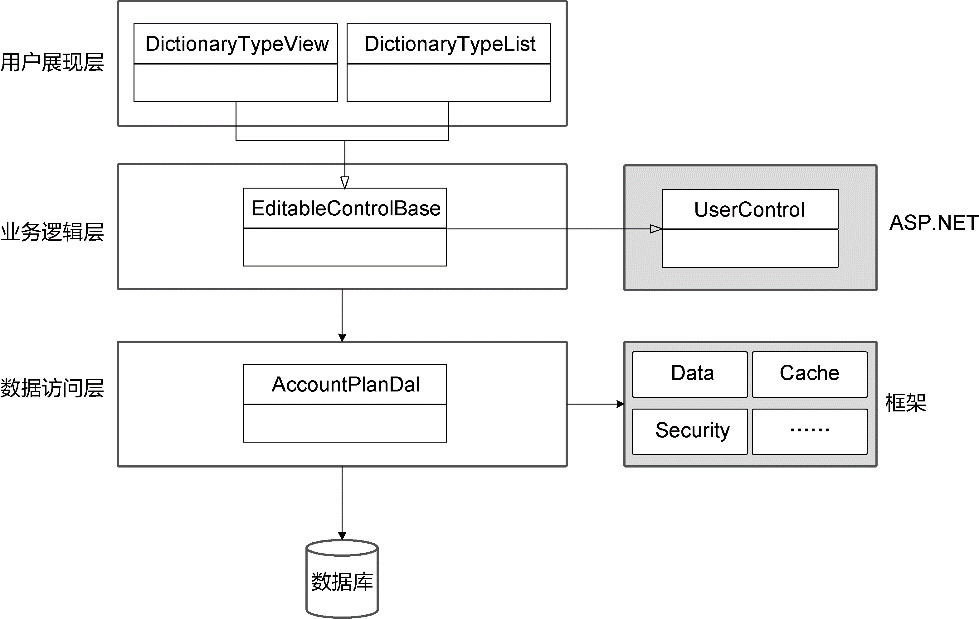
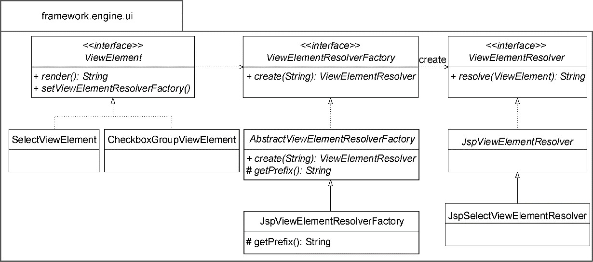
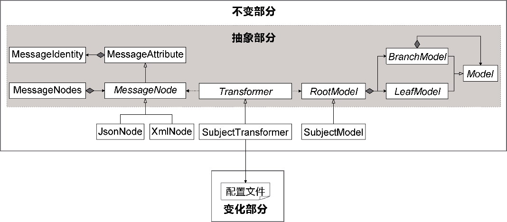

## 第1章 软件复杂度剖析

> 计算机编程的本质就是控制复杂度。

> ——Brian Kernighan

复杂的事物中蕴含着无穷的变化，让人既沉迷其美，又深恐自己无法掌控。我们每日每时对软件的构建就在与复杂的斗争中不断前行。软件系统的复杂度让我觉得设计有趣，因为每次发现不同的问题，都会有一种让人耳目一新的滋味油然而生，仿佛开启了新的旅程，看到了不同的风景。同时，软件系统的复杂度又让我觉得设计无趣，因为要探索的空间实在太辽阔，一旦视野被风景所惑，就会迷失前进的方向，感到复杂难以掌控，从而失去构建高质量系统的信心。

那么，什么是复杂系统？

### 1.1 什么是复杂系统

我们很难给复杂系统下一个举世公认的定义。专门从事复杂系统研究的Melanie Mitchell在接受Ubiquity杂志专访时，“勉为其难”地为复杂系统给出了一个相对通俗的定义：“由大量相互作用的部分组成的系统。与整个系统比起来，这些组成部分相对简单，没有中央控制，组成部分之间也没有全局性的通信，并且组成部分的相互作用导致了复杂行为。”^388

这个定义庶几可以表达软件复杂度的特征。定义中的“组成部分”对于软件系统，就是所谓的“软件元素”，基于粒度的不同可以是函数、类、模块、组件和服务等。这些软件元素相对简单，然而彼此之间的相互作用却导致了软件系统的复杂行为。软件系统符合复杂系统的定义，不过是进一步证明了软件系统的复杂度。然而该如何控制软件系统的复杂度呢？恐怕还要从复杂度的成因开始剖析。

Jurgen Appelo从理解能力与预测能力两个维度分析了复杂度的成因^39。这两个维度各自分为不同的复杂层次：

·理解能力维度——简单的(simple)和复杂的(complicated)；

·预测能力维度——有序的(ordered)、复杂的(complex)和混沌的(chaotic)。

两个维度都蕴含了“复杂”的含义：前者与简单相对，意为复杂至难以理解，可阐释为“复杂难解”；后者与有序相对，意为它的发展规律难以预测，可阐释为“复杂难测”。在预测能力维度，“难测”还不是最复杂的层次，最高层次为混沌，即根本不可预测。两个维度交叉，可以形成6种代表不同复杂意义的层次定义，Jurgen Appelo通过图1-1形象地说明了各个复杂层次的特征。



*图1-1 复杂系统的特征*

以下是Jurgen Appelo对这些例子给出的说明^39：

我的内衣很简单。我很容易理解它们的工作原理。我的手表是精密复杂的，如果把它拆开，我需要很长时间才能了解其设计原理和组件。但是我的手表或我的内衣都没有什么让人吃惊的（至少对我而言）。它们是有序的、可以预测的系统。

一个三人软件开发团队也是简单的，只需要开几次会议，提供一些晚餐，外加几杯啤酒，就可以了解这个团队的每一个人了。一座城市是不简单的、繁杂的，出租车司机需要几年时间才能熟悉这座城市的所有街道、胡同、宾馆和饭店。但同时，团队和城市又都是复杂的。不管你有多了解它们，总会有意想不到的事情发生它们身上。在某种程度上，它们是可预测的，但是你永远不清楚明天会发生什么。

双摆（两个摆锤互相连接）也是一个简单的系统，容易制作也很容易理解。但因为对钟摆的初始设置具有高度敏感性，所以它进行的是不可预测的混沌运动。股票市场也是混沌的，根据定义，它是不可预测的，否则每个人都知道怎么利用股票交易来赚钱，就会导致整个系统崩盘。但是，股票市场又不像钟摆那样，它是相当繁杂的。

软件系统属于哪一个复杂层次呢？

大多数软件系统需要实现的整体功能往往是难以理解的，同时，随着需求的不断演进，它又在一定程度具有未来的不可预测性，这意味着软件系统的“复杂”同时覆盖了“复杂难解”(complicated)与“复杂难测”(complex)两个层面，对标图1-1给出的案例，就是一座城市的复杂特征。无独有偶，Pete Goodliffe也将软件系统类比为城市，他说：“软件系统就像一座由建筑和后面的路构成的城市——由公路和旅馆构成的错综复杂的网络。在繁忙的城市里发生着许多事情，控制流不断产生，它们的生命在城市中交织在一起，然后死亡。丰富的数据积聚在一起、存储起来，然后销毁。有各式各样的建筑：有的高大美丽，有的低矮实用，还有的坍塌破损。数据围绕着它们流动，形成了交通堵塞和追尾、高峰时段和道路维护。”^33既然如此，那么设计一个软件系统就像规划一座城市，既要考虑城市布局，以便居民的生活与工作，满足外来游客或商务人员的旅游或出差需求，又要考虑未来因素的变化，例如“当居民对城市的使用方式有所变化，或者受到外力的影响时，城市就会相应地演化”^13。参考城市的复杂度特征，我们要剖析软件系统的复杂度，就可以从理解能力与预测能力这两个维度探索软件复杂度的成因。

### 1.2 理解能力

是什么阻碍了开发人员对软件系统的理解？设想项目组招入一位新人，当这位新人需要理解整个项目时，就像一位游客来到一座陌生的城市。他是否会迷失在错综复杂的城市交通体系中，不辨方向？倘若这座城市实则是乡野郊外的一座村落，只有房屋数间，一条街道连通城市的两头，他还会生出迷失之感吗？

因而，影响理解能力的第一要素是规模。

#### 1.2.1 规模

软件的需求决定了系统的规模。一个只有数十万行代码的软件系统自然不可与有数千万行代码的大规模系统相提并论。软件系统的规模取决于需求的数量，更何况需求还会像树木那样生长。一棵小树会随着时间增长渐渐长成一棵参天大树，只有到了某个时间节点，需求的数量才会慢慢稳定下来。当需求呈现线性增长的趋势时，为了实现这些功能，软件规模也会以近似的速度增长。

系统规模的扩张，不仅取决需求的数量，还取决于需求功能点之间的关系。需求的每个功能不可能做到完全独立，彼此之间相互影响相互依赖，修改一处就会牵一发而动全身，就好似城市中的某条道路因为施工需要临时关闭，车辆只得改道绕行，这又导致了其他原本已经饱和的道路因为涌入更多车辆而变得更加拥堵。这种拥堵现象又会顺势向其他分叉道路蔓延，形成辐射效应。

软件开发的拥堵现象或许更严重，这是因为：

·函数存在副作用，调用时可能对函数的结果做了隐含的假设；

·类的职责繁多，导致开发人员不敢轻易修改，因为不知会影响到哪些模块；

·热点代码被频繁变更，职责被包裹了一层又一层，没有清晰的边界；

·在系统某个角落，隐藏着伺机而动的bug，当诱发条件具备时，就会让整条调用链瘫痪；

·不同的业务场景包含了不同的例外场景，每种例外场景的处理方式都各不相同；

·同步处理代码与异步处理代码纠缠在一起，不可预知程序执行的顺序。

随着软件系统规模的扩张，软件复杂度也会增长。这种增长并非线性的，而是呈现出更加陡峭的指数级趋势。这实际上是软件的熵发挥着副作用。正如David Thomas与Andrew Hunt认为的：“虽然软件开发不受绝大多数物理法则的约束，但我们无法躲避来自熵的增加的重击。熵是一个物理学术语，它定义了一个系统的‘无序’总量。不幸的是，热力学法则决定了宇宙中的熵会趋向最大化。当软件中的无序化增加时，程序员会说‘软件在腐烂’。”^6

软件之所以无法躲避熵的重击，源于我们在构建软件时无法避免技术债(technical debt)。不管软件的架构师与开发人员有多么的优秀，他们针对目前需求做出的看似合理的技术决策，都会随着软件的演化变得不堪一击，区别仅在于债务的多少，以及偿还的利息有多高。根据Ward Cunningham的建议，对付技术债的唯一方案就是尽量让它可见，例如通过技术债列表或者技术债雷达等可视化形式及时呈现给团队成员，并制订计划主动地消除或降低技术债。

我曾经负责设计与开发一款商业智能(business intelligence，BI)产品，它需要展现报表下的所有视图。这些视图的数据来自多个不同的数据集，视图的展现类型多种多样，如柱状图、折线图、散点图和热力图等。在这个“逼仄”的报表问题空间中，需要满足如下业务需求：

·在编辑状态下，支持对每个视图进行拖曳以改变视图的位置；

·在编辑状态下，允许通过拖曳边框调整视图的尺寸；

·点击视图的图形区域时，应高亮显示当前图形对应的组成部分；

·点击视图的图形区域时，获取当前值，并对属于相同数据集的视图进行联动；

·如果打开钻取开关，则在点击视图的图形区域时，获取当前值，并根据事先设定的钻取路径对视图进行钻取；

·支持创建筛选器这样的特殊视图，通过筛选器选择数据，对当前报表中所有相同数据集的视图进行筛选。

以上业务需求都是事先规划好，并且可以清晰预见的，由于它们都对视图进行操作，因此视图控件的多个操作之间出现冲突。例如，高亮与级联都需要响应相同的点击事件。钻取同样如此，不同之处在于它要判断钻取开关是否已经打开。在操作效果上，高亮与钻取仅针对当前视图，联动与筛选则会因为当前视图的操作影响到同一张报表下相同数据集的其他视图。对于拖曳操作，虽然它监听的是MouseDown事件，但该事件与Click事件存在一定的冲突。

多个功能点的开发实现以及功能点之间存在的千丝万缕的关系带来了软件规模的成倍扩张：不同的业务场景会增加不同的分支，导致圈复杂度的增加；设计上如果未能做到功能之间的正交，就会使得功能之间相互影响，导致代码维护成本的增加；没有为业务逻辑编写单元测试，建立功能代码的测试网，就可能因为对某一处功能实现的修改引入了潜在的缺陷，导致系统运行的风险增加。纷至沓来的技术债逐渐积累，一旦累积到某个临界点，就会由量变引起质变，在软件系统的规模达到巅峰之时，迅速步入衰亡的老年期，成为“可怕”的遗留系统(legacy system)。这遵循了饲养场的奶牛规则：奶牛逐渐衰老，最终无奶可挤；与此同时，奶牛的饲养成本却在上升。

软件规模的一个显著特征是代码行数(lines of code)。然而，代码行数常常具有欺骗性。如果需求的功能数量与代码行数之间呈现出不成比例的关系，说明该系统的生命体征可能出现了异常，例如，代码行数的庞大其实可能是一种肥胖症，意味着可能出现了大量的重复代码。

我曾经利用Sonar工具对咨询项目的一个模块执行代码静态分析，分析结果如图1-2所示。



*图1-2 代码静态分析结果*

该模块代码共计40多万行，重复代码竟然占到了惊人的33.9%，超过一半的代码文件混入了重复代码。显然，这里估算的代码行数并没有真实地体现软件规模；相反，重复的代码还额外增加了软件的复杂度。

Neal Ford认为需要通过指标指导设计，例如使用面向对象设计质量评估的平台工具iPlasma，通过它生成的指标可以作为评价软件规模的要素，如表1-1所示。

*表1-1 质量评估指标*



在面向对象设计的软件项目里，除了代码行数，包、类、方法的数量，继承的层次以及方法的调用数，还有我们常常提及的圈复杂度，都会或多或少地影响整个软件系统的规模。

#### 1.2.2 结构

你去过迷宫吗？相似而回旋繁复的结构使得封闭狭小的空间被魔法般地扩展为一个无限的空间，变得无穷大，仿佛这空间被安置了一个循环，倘若没有找到正确的退出条件，循环就会无休无止，永远无法退出。许多规模较小却格外复杂的软件系统，就好似这样的一座迷宫。

此时，结构成了决定系统复杂度的一个关键因素。

结构之所以变得复杂，多数情况下还是由系统的质量属性(quality attribute)决定的。例如，我们需要满足高性能、高并发的需求，就需要考虑在系统中引入缓存、并行处理、CDN、异步消息以及支持分区的可伸缩结构；又例如，我们需要支持对海量数据的高效分析，就得考虑这些海量数据该如何分布存储，并如何有效地利用各个节点的内存与CPU资源执行运算。

从系统结构的视角看，单体架构一定比微服务架构更简单，更便于掌控，正如单细胞生物比人体的生理结构要简单。那么，为何还有这么多软件组织开始清算自己的软件资产，花费大量人力物力对现有的单体架构进行重构，走向微服务化？究其主因，还是系统的质量属性。

纵观软件设计的历史，不是分久必合合久必分，而是不断拆分的微型化过程。分解的软件元素不可能单兵作战。怎么协同，怎么通信，就成了系统分解后面临的主要问题。如果没有控制好，这些问题固有的复杂度甚至会在某些场景下超过分解带来的收益。例如，对企业IT系统而言，系统与系统之间的集成往往通过与平台无关的消息通信来完成，由此就会在各个系统乃至模块之间形成复杂的通信网结构。要理清这种通信网结构的脉络，就得弄清楚系统之间消息的传递方式，明确消息格式的定义，即使在系统之间引入企业服务总线(Enterprise Service Bus，ESB)，也只能减少点对点的通信量，而不能改变分布式系统固有的复杂度，例如消息通信不可靠，数据不一致等因为分布式通信导致的意外场景。换言之，系统因为结构的繁复增加了复杂度。

软件系统的结构繁复还会增加软件组织的复杂度。系统架构的分解促成了软件构建工作的分工，这种分工虽然使得高效的并行开发成为可能，却也可能因为沟通成本的增加为管理带来挑战。管理一个十人团队和百人团队，其难度显然不可相提并论，对百人团队的管理也不仅仅是细分为10个十人团队这么简单，这其中牵涉到团队的划分依据、团队的协作模式、团队成员组成与角色构成等管理因素。

康威定律(Conway’s law)就指出：“任何组织在设计一套系统（广义概念上的系统）时，所交付的设计方案在结构上都与该组织的沟通结构保持一致。”Sam Newman认为是需要“适应沟通途径”使得康威定律在软件结构与组织结构中生效^163。他分析了一种典型的分处异地的分布式团队。整个团队共享单个服务的代码所有权，由于分布式团队的地域和时区界限使得沟通成本变高，因此团队之间只能进行粗粒度的沟通。当协调变化的成本增加后，人们就会想方设法降低协调和沟通的成本。直截了当的做法就是分解代码，分配代码所有权，物理分隔的团队各自负责一部分代码库，从而能够更容易地修改代码，团队之间会有更多关于如何集成两部分代码的粗粒度的沟通。最终，与这种沟通路径匹配形成的粗粒度应用程序编程接口(application programming interface，API)构成了代码库中两部分之间的边界。

注意，与设计方案相匹配的团队结构指的是负责开发的团队组织，而非使用软件产品的客户团队。我们常常遇见分布式的客户团队，例如，一些客户团队的不同的部门位于不同的地理位置，他们的使用场景也不尽相同，甚至用户的角色也不相同，但在对软件系统进行架构设计时，我们却不能按照部门组织、地理位置或用户角色来分解模块（服务），并错以为这遵循了康威定律。

我曾经参与过一款通信产品的改进与维护工作。这是一款为通信运营商提供对宽带网的授权、认证与计费工作的产品，它的终端用户主要由两种角色组成：营业厅的营业员与购买宽带网服务的消费者。最初，设计该产品的架构师就错误地按照这两种不同的角色，将整个软件系统划分为后台管理系统与服务门户两个完全独立的子系统，为营业员与消费者都提供了资费套餐管理、话单查询、客户信息维护等相似的业务。两个子系统产生了大量重复代码，增加了软件系统的复杂度。在我接手该通信产品时，因为数据库性能瓶颈而考虑对话单数据库进行分库分表，发现该方案的调整需要同时修改后台管理系统与服务门户的话单查询功能。

无论设计是优雅还是拙劣，系统结构都可能因为某种设计权衡而变得复杂。唯一的区别在于前者是主动地控制结构的复杂度，而后者带来的复杂度是偶发的，是错误的滋生，是一种技术债，它会随着系统规模的增大产生一种无序设计。《架构之美》中第2章“两个系统的故事：现代软件神话”详细地罗列了无序设计系统的几种警告信号^34：

·代码没有显而易见的进入系统中的路径；

·不存在一致性，不存在风格，也没有能够将不同的部分组织在一起的统一概念；

·系统中的控制流让人觉得不舒服，无法预测；

·系统中有太多的“坏味道”；

·数据很少放在它被使用的地方，经常引入额外的巴洛克式缓存层，试图让数据停留在更方便的地方。

看一个无序设计的软件系统，就好像隔着一层半透明的玻璃观察事物，系统的软件元素都变得模糊不清，充斥着各种技术债。细节层面，代码污浊不堪，违背了“高内聚松耦合”的设计原则，要么许多代码放错了位置，要么出现重复的代码块；架构层面，缺乏清晰的边界，各种通信与调用依赖纠缠在一起，同一问题空间的解决方案各式各样，让人眼花缭乱，仿佛进入了没有规则的无序社会。

分层架构的引入原本是为了维护系统的有序性，而如果团队却不注意维护逻辑分层确定的边界，不按照架构规定的层次分配各个类的职责，就会随着职责的乱入让逻辑分层形成的边界变得越来越模糊。我在对一个项目进行架构评审时，曾看到图1-3所示的三层架构。



*图1-3 层次混乱的架构*

虽然架构师根据关注点的不同划分了不同的层次，但各个逻辑层没有守住自己的边界：业务逻辑层定义了EditableControlBase、EditablePageBase与PageBase等类，它们都继承自ASP.NET框架的UserControl用户控件类，同时又作为自定义用户控件的父类，提供了控件数据加载、提交等通用职责；继承这些父类的子类属于用户控件，定义在用户展现层，如EditablePageBase类的子类（如DictionaryTypeView、DictionaryView和DictionaryTypeList等）。一旦逻辑层没有守住自己的边界，分层架构模式就失去了规划清晰结构的价值。随着需求的增加，系统结构会变得越来越混乱，最终陷入无序设计的泥沼。

### 1.3 预测能力

当我们掌握了事物发展的客观规律时，就具有了一定的对未来的预测能力。例如，我们洞察了万有引力的本质，就能够对观察到的宇宙天体建立模型，相对准确地推测出各个天体在未来一段时间的运行轨迹。然而，宇宙空间变化莫测，或许一个星球“死亡”产生的黑洞的吸噬能力，就可能导致那一片星域产生剧烈的动荡，这种动荡会传递到更远的星空，从而使天体的运行轨迹偏离我们的预测结果。毫无疑问，影响预测能力的关键要素在于变化。对变化的应对不妥，就会导致过度设计或设计不足。

#### 1.3.1 过度设计

设计软件系统时，变化让我们患得患失，不知道如何把握系统设计的度。若拒绝对变化做出理智的预测，系统的设计会变得僵化，一旦有新的变化发生，修改的成本会非常大；若过于看重变化产生的影响，渴望涵盖一切变化的可能，若预期的变化没有发生，我们之前为变化付出的成本就再也补偿不回来了，这就是所谓的“过度设计”。

我曾经在设计一款教育行业产品时，因为考虑太多未来可能的变化，引入了不必要的抽象来保证产品的可扩展性，使得整个设计方案变得过于复杂。更加不幸的是，我所预知的变化根本不曾发生。该设计方案针对产品的UI引擎(UI engine)模块。作为驱动界面的引擎，它主要负责从界面元数据获取与界面相关的视图属性，并根据这些属性来构造界面，实现界面的可定制。产品展现的视图由诸多视图元素组合而成，这些视图元素的属性通过界面元数据进行定制。为此，我为视图元素定义了抽象的ViewElement接口，作为所有视图元素类型包括SelectView、CheckboxGroupView的抽象类型。

ViewElement决定了视图元素的类型，从而确定呈现的格式；至于真正生成视图呈现代码的职责，则交给了视图元素的解析器。由于我认为视图元素的呈现除需要支持现有的JSP之外，未来可能还要支持HTML、Excel等实现元素，因此在设计解析器时，定义了ViewElementResolver接口：

```
public interface ViewElementResolver {
   String resolve(ViewElement element);
}
```

ViewElementResolver接口确保了解析功能的可扩展性，为了更好地满足未来功能的变化，我又引入了解析器的工厂接口ViewElementResolverFactory以及实现该接口的抽象工厂类AbstractViewElementResolverFactory：

```
public interface ViewElementResolverFactory {
   ViewElementResolver create(String viewElementClassName);
}
public abstract class AbstractViewElementResolverFactory implements 
    ViewElementResolverFactory {
   public ViewElementResolver create(String viewElementClassName) {
      String className = generateResolverClassName(viewElementClassName);
      //通过反射创建ViewElementResolver对象
   }
   private String generateResolverClassName(String viewElementClassName) {
      return getPrefix() + viewElementClassName + "Resolver";
   }
   protected abstract String getPrefix();
}
public class JspViewElementResolverFactory extends AbstractViewElementResolverFactory {
   @Override
   protected String getPrefix() {
      return "Jsp";
   }
}
```

ViewElement接口可以注入ViewElementResolverFactory对象，由它来创建ViewElementResolver，由此完成视图元素的呈现，例如SelectViewElement：

```
public class SelectViewElement implements ViewElement {
   private ViewElementResolver resolver;
   private ViewElementResolverFactory resolverFactory;
   public void setViewElementResolverFactory(ViewElementResolverFactory resolverFactory) {
      this.resolverFactory = resolverFactory;
   }
   public String Render() {
      resolverFactory.create(this.getClass().getName()).resolve(this);
   }
}
```

整个UI引擎模块的设计如图1-4所示。

如此设计看似保证了视图元素呈现的可扩展性，也遵循了单一职责原则，却因为抽象过度而增加了方案的复杂度。扩展式设计是为不可知的未来做投资，一旦未来的变化不符合预期，就会导致过度设计。具有实证主义态度的设计理念是面对不可预测的变化时，应首先保证方案的简单性。当变化真正发生时，可以通过诸如提炼接口(extract interface)^341的重构手法，满足解析逻辑的扩展。方案中工厂接口与抽象工厂类的引入，根本没有贡献任何解耦与扩展的价值，反而带来了不必要的间接逻辑，让设计变得更加复杂。到产品研发的后期，我所预期的HTML和Excel呈现的需求变化实际并没有发生。



*图1-4 UI引擎模块的类图*

#### 1.3.2 设计不足

要应对需求变化，终归需要一些设计技巧。很多时候，因为设计人员的技能不足，没有明确识别出未来确认会发生的变化，或者对需求变化发展的方向缺乏前瞻，所以导致整个设计变得过于僵化，修改的成本太高，从而走向了过度设计的另外一个极端，我将这一问题称为“设计不足”。

设计不足的方案只顾眼前，对于一定要发生的变化视而不见，这不仅导致方案缺乏可扩展性，甚至有可能出现技术实现方向的错误。这样的设计不是恰如其分的简单设计，而是对于糟糕质量视而不见的简陋处置，是为了应付进度蒙混过关用的临时花招，表面看来满足了进度要求，但在未来偿还欠下的债务时，需要付出几倍的成本。如果整个软件系统都由这样设计不足的方案构成，那么未来任何一次需求的变更或增加，都可能成为压垮系统的最后一根稻草。

我曾负责一个基于大数据的数据平台的设计与开发，该数据平台需要实时采集来自某行业各个系统各种协议的业务数据，并按照主题区的数据模型标准来治理数据。当时，我对整个行业的数据标准与规范尚不了解，对于数据平台未来的产品规划也缺乏充分认识。迫于进度压力，我选择了采用快速而简洁的硬编码方式实现从原始数据到主题区模型对象的转换，这一设计让我们能够在规定的进度周期满足同时应对多家客户治理数据的要求。

然而，作为一款数据平台产品，在该行业内进行广泛推广时，随着面向的客户越来越多，需要采集数据的上游系统也变得越来越多。此时，回首之前的方案设计，不由后悔不迭：方案的简陋导致了开发质量的低下和生产力的降低。此时的主题区划分已经趋于稳定，虽然需要支持的客户和上游系统越来越多，但要治理的数据所属的主题仍然在已有主题区范围之内，换言之，原始数据的协议是变化的，主题区的范围却相对稳定。通过对主题区模型与数据治理逻辑进行共性与可变性分析^，我识别出了原始数据消息的共性特征，建立了抽象的消息模型，又为主题区模型抽象出一套树形结构的核心主题模型，并基于此核心模型建立新的主题区模型。在确保主题区模型不变的情况下，找到数据治理逻辑中不变的转换过程与规则，将不同上游系统遵循不同数据协议而带来的变化转移到一个定义映射关系的样式配置文件中，形成对变化的隔离，实现了一个相对稳定的数据治理方案，如图1-5所示。



*图1-5 隔离变化的设计方案*

采用新方案之后，如果需要采集一个不超出主题区范围的全新系统，只需定义一个样式映射文件，并付出极少量定制开发的成本，就能以最快的迭代进度满足新的数据治理需求。正因为改进了旧有方案，团队才能够在不断涌入新需求的功能压力下，基本满足产品研发的进度要求。只可惜，之前的数据治理功能已经被多家客户广泛运用到生产环境中，对应的数据交换逻辑也依托于旧的主题区模型，使得整个数据平台产品在近两年的开发周期中一直处于新旧两套主题区模型共存的尴尬局面。由于一部分数据治理和数据交换逻辑要对接两套主题区模型，因此，迫于无奈，也必须实现两套数据治理和数据交换逻辑，无谓地增加了团队的工作量。由于改造旧模型的工作量极为繁重，团队一直未能获得喘息的机会对模型以新汰旧，因此这一尴尬局面还会在一段时间内继续维持下去。这正是设计不足在应对变化时带来的负面影响。

我们无法预知未来，自然就无法预测未来可能发生的变化，这就带来了软件系统的不可预测性。软件设计者不可能对变化听之任之，却又因为它的不可预测性而无可适从。在软件系统不断演化的过程中，面对变化，我们需要尽可能地保证方案的平衡：既要避免因为设计不足使得变化对系统产生根本影响，又要防止因为满足可扩展性让方案变得格外复杂，最后背上过度设计的坏名声。故而，变化之难，难在如何在设计不足与过度设计之间取得平衡。
