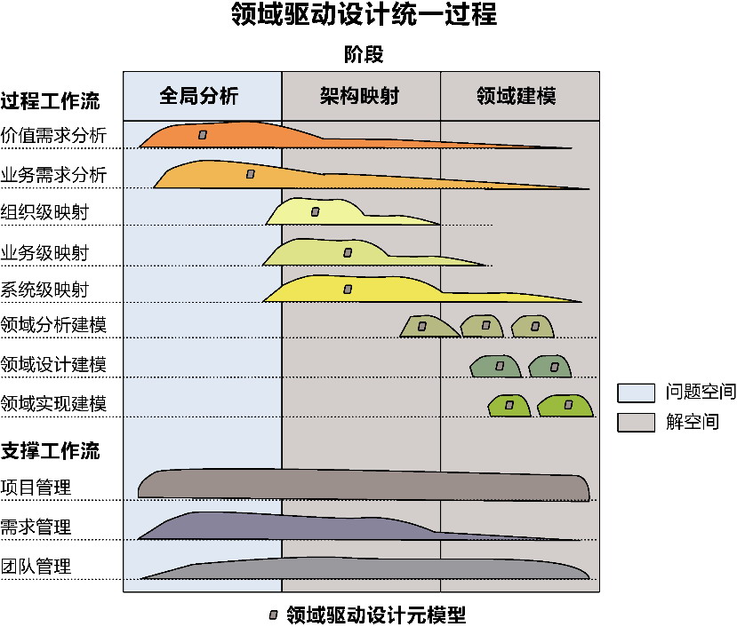
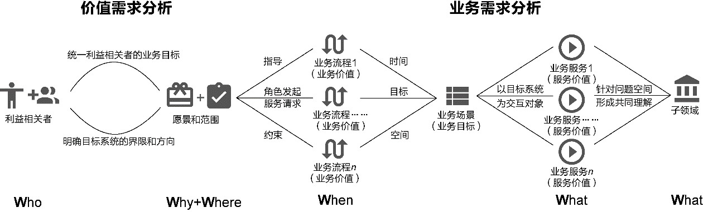
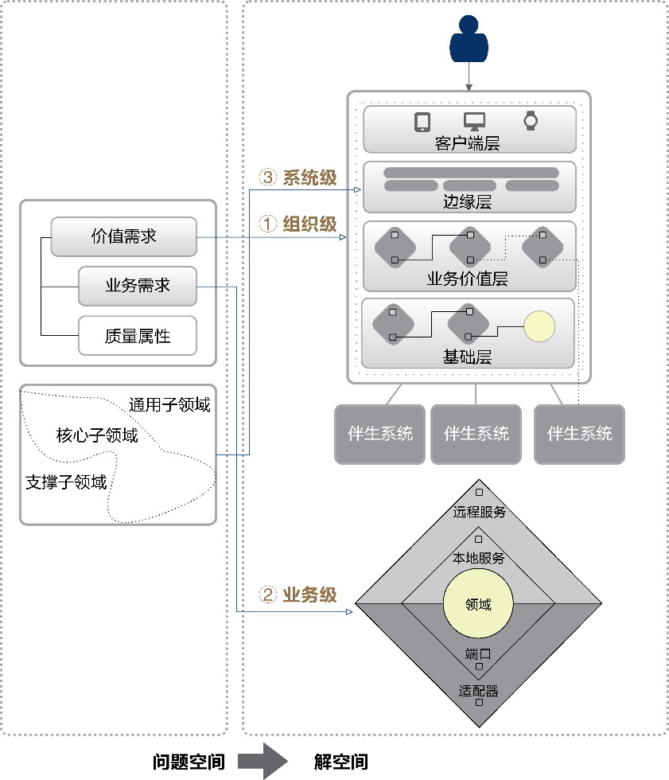
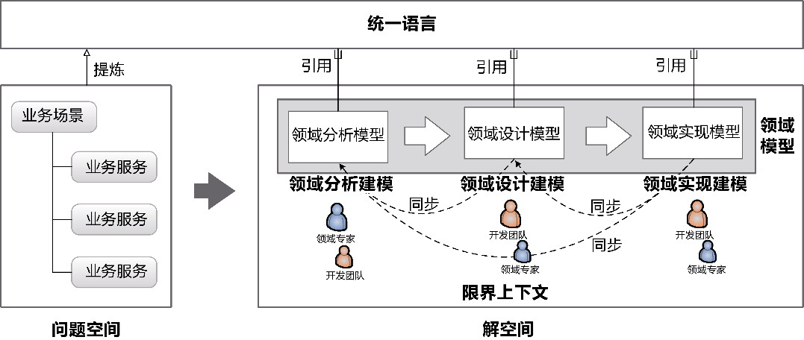
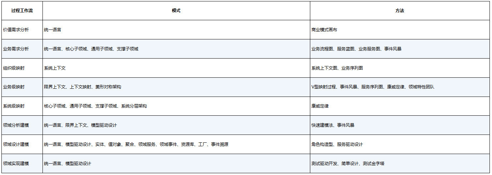
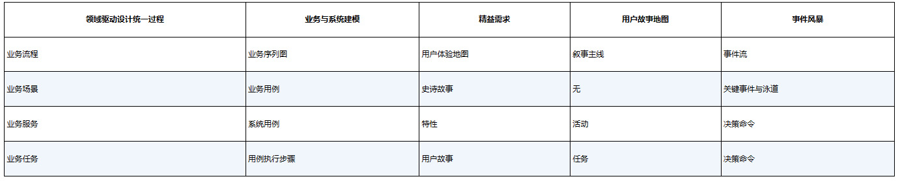

## 第3章 领域驱动设计统一过程

> 只凭经验，我们得经过遥遥辽远的汗漫之游，才能得到便利直捷之径。

> ——洛节·爱铿，转引自托马斯·哈代的《德伯家的苔丝》

距离领域驱动设计的提出已有十余年，开发人员面对的软件开发模式、开发技术和IT规模都有了天翻地覆的变化。即使领域驱动设计作为一种设计思维方式与软件设计过程，并未涉及具体的开发技术，但技术的发展仍然会对它产生影响，就连Eric Evans自己也认为：“如果在推行领域驱动设计时继续照本宣科地使用《领域驱动设计》一书，这就不太光彩了！”

领域驱动设计具有一定的开放性，只要遵循“以领域为驱动力”的核心原则，就可以在软件构建过程中使用不限于领域驱动设计提出的方法，以控制软件复杂度。事实上，在领域驱动设计社区的努力下，如今的领域驱动设计包容的实践方法与模型已经超越了Eric Evans最初提出的领域驱动设计范畴。这是一套可以自我成长自我完善的过程体系，只要软件仍然以满足用户的业务需求为己任，领域驱动设计就不会脱离它成长的土壤。

既然看到了领域驱动设计的开放性，只要不违背它的核心原则，我们自然可以按照对它的理解，结合自身在项目中的实践来扩展整套方法论。社区对领域驱动设计的补充更多地体现在对设计元模型的不断丰富上。以“模式”作为表达方式的设计元模型是一种松散的组织方式，每个模式都有其意图与适用性，这意味着我们可以轻松地添加新的模式。目前，社区已经为这套设计元模型分别增加了诸如支撑子领域、领域事件、事件溯源、命令查询职责分离(command query responsibility segregation，CQRS)等模式，本书也针对上下文映射提出了发布者/订阅者模式（参见第10章），为限界上下文定义了菱形对称架构模式（参见第12章），在领域建模阶段增加了角色构造型（参见第16章）的概念，提出了服务驱动设计（参见第16章）方法。

领域驱动设计的开放性还体现在适用范围的扩大。它作为一种方法论，囊括了在软件设计领域提炼出来的诸多真知灼见，并以设计原则和模式的形式将其呈现出来。这些设计原则和模式具备技术领先性和前瞻性，体现了顽强的生命力，仿佛可以预见技术发展的未来。例如：它“预见”了微服务架构，可以将限界上下文作为设计和识别微服务边界的参考模式；它“预见”了文档型的NoSQL数据库，可以使用聚合模式封装NoSQL数据库的每一项；它“预见”了中台战略，可以通过对子领域的划分提供能力中心构建的设计支持。

领域驱动设计的开放性是其永葆青春的秘诀。当然，在选择为这套方法论添砖加瓦时，也不能率意而为，肆意扩大领域驱动设计的外延，仿佛它是一个筐，什么都能向里面装。本着实证主义的态度，在对现有领域驱动设计体系进行完善之前，需要充分了解它现存的不足。

### 3.1 领域驱动设计现存的不足

领域驱动设计体系构建在设计元模型的基础之上，具有前所未有的开放性。然而，这种由各种模式构成的松散模型却也使得它对设计上的指导过于随意，对技能的要求过高。如果没有掌握其精髓，就难以合理地运用这些设计元模型。归根结底，领域驱动设计缺乏一个系统的统一过程作为指导。虽然领域驱动设计划分了战略设计阶段与战术设计阶段，但这两个阶段的划分仅仅是对构成元模型的模式进行类别上的划分，例如将限界上下文、上下文映射等模式划分到战略设计阶段，将聚合、实体、值对象等模式划分到战术设计阶段，却没有一个统一过程去规范这两个阶段需要执行的活动、交付的工件以及阶段里程碑，甚至没有清晰定义这两个阶段该如何衔接、它们之间执行的工作流到底是怎样的。毕竟，除了极少数精英团队，大多数开发团队都需要一个清晰的软件构建过程作为指导。领域驱动设计没能形成这样的统一过程，使得其缺乏可操作性。团队在运用领域驱动设计时，更多取决于设计者的行业知识与设计经验，使得领域驱动设计在项目上的成功存在较大的偶然性。因此，领域驱动设计缺乏规范的统一过程，是其不足之一。

领域驱动设计倡导以“领域”为设计的核心驱动力，这就需要针对问题空间的业务需求进行领域知识的抽象和精炼。可是，系统的问题空间是如何识别和界定出来的？问题空间的业务需求又该如何获得，具备什么样的特征？如何定义它们的粒度和层次？如何规范和约定团队各个角色对问题空间的探索和分析？在不同阶段，业务需求的表现形式与验证标准分别是什么？针对种种问题，领域驱动设计都没有给出答案，甚至根本未曾提及这些内容！虽说可以将这些问题纳入需求管理体系，从而认为它们不属于领域驱动设计的范畴，可是，不同层次的业务需求贯穿于领域驱动设计过程的每个环节，例如识别限界上下文需要对业务需求和业务流程有着清晰的理解，建立领域模型需要的领域知识和概念也都来自于细粒度层次的业务需求，更不用说领域驱动设计本身就强调领域专家需要就领域知识与开发团队进行充分沟通。可以说，没有好的问题空间分析，就不可能获得高质量的领域架构与领域模型。因此，领域驱动设计缺乏与之匹配的需求分析方法，是其不足之二。

领域驱动设计战略设计阶段的核心模式是限界上下文，指导架构设计的核心模式是分层架构，前者决定了业务架构和应用架构，后者决定了技术架构。领域驱动设计的核心诉求是让业务架构和应用架构形成绑定关系，同时降低与技术架构的耦合，使得在面对需求变化时，应用架构能够适应业务架构的调整，并隔离业务复杂度与技术复杂度，满足架构的演进性。领域驱动设计虽然给出了这些模式的特征，却失之于简单松散，不足以支撑复杂软件项目的架构需求。更何况，对于如何从问题空间映射到战略层次的解空间、问题空间的业务需求如何为限界上下文与上下文映射的识别提供参考等问题，领域驱动设计完全语焉不详。因此，领域驱动设计缺乏规范化的、具有指导意义的架构体系，是其不足之三。

在战术设计阶段，领域驱动设计虽然以模型驱动设计为主线，却没有给出明确的领域建模方法。无论是否采用敏捷的迭代建模过程，整个建模过程分为分析、设计和实现这3个不同的活动都是客观存在的事实。虽然要保证领域模型的一致性，但这3个活动存在明显的存续关系，每个活动的目标、参与角色和建模知识存在本质差异，这也是客观存在的事实。领域驱动设计却没有为领域分析建模、领域设计建模和领域实现建模提供对应的方法指导，建模活动率性而为，要获得高质量的领域模型，主要凭借建模人员的经验。因此，领域驱动设计的领域建模方法缺乏固化的指导方法，是其不足之四。

### 3.2 领域驱动设计统一过程

针对领域驱动设计现存的这4个不足，我对领域驱动设计体系进行了精简与丰富。精简，意味着做减法，就是要剔除设计元模型中不太重要的模式，凸显核心模式的重要性，并对领域驱动设计过程进行固化，提供简单有效的实践方法，建立具有目的性和可操作性的构建过程；丰富，意味着做加法，就是突破领域驱动设计的范畴，扩大领域驱动设计的外延，引入更多与之相关的方法与模式来丰富它，弥补其自身的不足。

软件构建的过程就是不断对问题空间求解获得解决方案，进而组成完整的解空间的过程。在这个过程中，若要构建出优良的软件系统，就需要不断控制软件的复杂度。因此，我对领域驱动设计的完善，就是在问题空间与解空间背景下，定义能够控制软件复杂度的领域驱动设计过程，并将该过程执行的工作流限定在领域关注点的边界之内，避免该过程的扩大化。我将这一过程称为领域驱动设计统一过程(domain-driven design unified process，DDDUP)。

#### 3.2.1 统一过程的二维模型

领域驱动设计统一过程参考了统一过程(rational unified process，RUP)的二维开发模型。整个过程的二维模型如图3-1所示，横轴代表推动领域驱动设计在构建过程中的时间，体现了过程的动态结构，构成元素主要为3个阶段(phase)，每个阶段可以由多个迭代构成；纵轴表现了领域驱动设计在各个阶段中执行的活动，体现了过程的静态结构，构成元素包括工作流(work flow)和元模型(meta model)。

不同于RUP等项目管理过程，领域驱动设计统一过程并没有也不需要覆盖完整的软件构建生命周期，例如软件的部署与发布就不在该统一过程的考虑范围内。结合领域驱动设计对问题空间和解空间的阶段划分、对战略设计和战术设计的层次划分，整个统一过程分为3个连续的阶段：

·全局分析阶段；

·架构映射阶段；

·领域建模阶段。

每个阶段都规定了自己的里程碑和产出物。里程碑作为阶段目标，可以作为该阶段结束的标志，避免团队无休止地投入人力物力到该阶段的工作流中；每个阶段都必须输出产出物，这些产出物无论形式如何，都是领域知识的一部分，并作为输入，成为执行下一阶段工作流的重要参考，甚至可以指导下一个阶段工作流的执行。根据情况，团队可以对每个阶段的产出物进行评审。每个团队可以设定验收规则，甚至做出严格规定，只有本阶段产出物通过了评审，才可以进入下一个阶段。

*图3-1 领域驱动设计统一过程*

统一过程的每个阶段要执行的活动主要通过工作流来表现，一个工作流就是一个具有可观察结果的活动序列。整个统一过程的工作流分为过程工作流(process work flow)与支撑工作流(supporting work flow)。每个工作流都可能贯穿统一过程的所有阶段，只不过因为阶段目标与工作流活动的不同，工作流在不同阶段所占的比重各不相同，意味着在不同阶段花费的人力成本与时间成本的不同。图3-1中工作流图例的面积直观地体现了这种成本的差异。例如，价值需求分析工作流主要用于确定系统的利益相关者、系统愿景和系统范围，这些活动与全局分析阶段需要达成的里程碑相吻合，但这并不意味着在项目进入架构映射阶段时就不需要执行该工作。软件系统就像一座不断扩张的城市，通过价值需求分析获得的利益相关者、系统愿景和系统范围也会随着软件系统问题空间的变化而发生调整，其他工作流同样如此。

过程工作流构成了领域驱动设计统一过程的主要活动，它融合了领域驱动设计元模型，为工作流提供设计原则和模式的指导。这也使得整个统一过程保留了领域驱动设计的特征，遵循了“以领域为驱动力”的核心原则。支撑工作流严格说来不属于领域驱动设计的范围，但对它们的选择却会在整个统一过程中不断地影响着实施领域驱动设计的效果。领域驱动设计不能与它们强行绑定，毕竟不同企业、不同团队的文化基因和管理机制存在差异，但需要选择与领域驱动设计统一过程具有高匹配度的支撑工作流。

#### 3.2.2 统一过程的动态结构

领域驱动设计统一过程的动态结构通过3个阶段，从问题空间到解空间完整而准确地展现了运用领域驱动设计构建目标系统的过程。这里所谓的“目标系统”是一个抽象的概念，取决于领域驱动设计统一过程的运用范围，既可大至整个组织，将该组织的所有IT系统都囊括在这一统一过程之下（问题空间的范围也将由此扩大至整个组织），也可小至一个已有系统的新开发功能模块，将其独立出来，严格遵循该统一过程，运用领域驱动设计完成其构建。目标系统的大小直接决定了问题空间的大小，自然也就决定了它所映射的解空间的大小。

**1.全局分析阶段**

全局分析（big picture analysis）阶段的目标是探索与分析问题空间。该阶段主要通过对目标系统执行价值需求分析与业务需求分析这两个工作流，完全抛开对解决方案的思考与选择，仅仅从需求分析的角度以递进方式开展对问题空间的深入剖析。整个全局分析过程如图3-2所示。

*图3-2 全局分析*

从价值需求开始，识别目标系统的利益相关者，明确系统愿景，识别系统范围。只有明确了利益相关者，才能就不同利益相关者的项目目标达成共识，以明确组织对目标系统树立的愿景，确保构建的目标系统能够对准组织的战略目标，避免软件投资方向的偏离。通过了解目标系统的当前状态和预期的未来状态，可以确定目标系统的范围，从而界定问题空间的边界，为进一步探索目标系统的解决方案提供战略指导。价值需求分析的成果看似虚无缥缈，似乎都是宏观层次言不及义的大话、套话，实则描绘了目标系统的蓝图，避免开发团队只见树木不见森林，缺乏对系统的整体把控。同时，它还指明了目标系统的方向，为我们确定和排列业务需求优先级提供了参考，为解空间进行技术选型和技术决策提供了依据，做出恰如其分的设计。

在价值需求的指导和约束下，根据用户发起的服务请求，逐一梳理出提供业务价值的动态业务流程，体现了多个角色在不同阶段进行协作的执行序列。每个业务流程都具有时间属性，通过划定里程碑时间节点，即可在业务目标的指导下将业务流程划分为不同时间阶段的多个业务场景。业务场景由多个角色共同参与，每个角色在该场景下与目标系统的一次功能交互，都是为了满足该角色希望获得的服务价值，由此即可获得业务服务。

在对业务需求进行深入分析后，可以结合价值需求分析的结果，将那些对准系统愿景的业务需求放到核心子领域，将提供支撑作用的业务需求放到支撑子领域，将提供公共功能的业务需求放到通用子领域，由此就可以从价值角度完成对问题空间的分解。

全局分析阶段的里程碑目标是探索和固定目标系统的问题空间，通过分析价值需求与业务需求，获得以业务服务为业务需求单元的全局分析规格说明书（参见附录D）。

参与全局分析阶段的角色包括客户或客户代表、业务分析师、产品经理、用户体验设计师、架构师或技术负责人、测试负责人。其中，客户、业务分析师、产品经理共同扮演领域专家的角色，并在本阶段作为关键的引导者和推动者。

**2.架构映射阶段**

架构映射(architectural mapping)阶段根据全局分析阶段获得的产出物，即价值需求与业务需求，分别从组织级、业务级与系统级3个层次完成对问题空间的求解，映射为架构层面的解决方案。整个架构映射阶段与主要工作流的关系如图3-3所示。

*图3-3 架构映射*

通过全局分析阶段完成对问题空间的探索后，对解空间架构层面的解决方案映射，几乎可以做到顺势而为。通过执行组织级映射、业务级映射与系统级映射这3个过程工作流，分别获得组织级架构、业务级架构与系统级架构。

在执行组织级映射时，设计者站在整个组织的高度，在全局分析阶段输出的价值需求的指导下，通过系统上下文呈现利益相关者、目标系统与伴生系统之间的关系。系统上下文实际上确定了解空间的边界，除了系统边界与外部环境之间必要的集成，整个开发团队都工作在系统上下文的边界之内。

一旦确定了系统上下文，就可以根据全局分析阶段输出的业务需求执行业务级映射。根据语义相关性和功能相关性对业务服务表达出来的业务知识进行归类与归纳，即可识别出边界相对合理的限界上下文。限界上下文的内部架构遵循菱形对称架构模式，充分体现它作为自治的架构单元、领域模型的知识语境，提供独立完整的业务能力；限界上下文之间则通过不同的上下文映射模式表达上游和下游之间的协作方式，规范服务契约。

系统级映射建立在限界上下文之上，在全局分析阶段划分的子领域的指导下，在系统上下文的边界内部建立系统分层架构。该分层架构将属于核心子领域的限界上下文映射为业务价值层，将支撑子领域和通用子领域的限界上下文映射为基础层，并从前端用户体验的角度考虑引入边缘层，为前端提供一个统一的网关入口，并通过聚合服务的方式响应前端发来的客户端请求。

架构映射阶段的里程碑目标是完成从问题空间到解空间的架构映射，通过组织级映射、业务级映射和系统级映射获得遵循领域驱动架构风格的架构映射战略设计方案（参见附录D）。

架构映射阶段就是目标系统的架构战略设计。解决方案的获得建立在全局分析结果的基础之上，不同层次的映射方法引入了不同的领域驱动设计元模型，建立的领域驱动架构风格发挥了这些设计元模型的价值，保证了目标系统架构的一致性，以限界上下文为核心的业务级架构与系统级架构也成了响应业务变化的关键。

参与架构映射阶段的角色包括业务分析师、产品经理、用户体验设计师、项目经理、架构师、技术负责人、开发人员。其中，业务分析师和产品经理共同扮演领域专家的角色。由于架构映射阶段属于解空间的范畴，邀请客户参与本阶段的战略设计活动，可能会适得其反。若有必要，在执行组织级映射获得系统上下文的过程中，可以咨询和参考客户的意见。在本阶段，架构师（尤其是业务架构师与应用架构师）应成为关键的引导者和推动者。

**3.领域建模阶段**

领域建模阶段是对问题空间战术层次的求解过程，它的目标是建立领域模型。领域建模必须在领域驱动架构风格的约束下，在限界上下文的边界内进行。这样一方面用分而治之的思想降低了领域建模的难度，另一方面也体现了领域建模依据的统一语言存在限定的语境，这也是模型驱动设计区别于其他建模过程的根本特征。根据领域模型表现特征的不同，领域建模可分为领域分析建模、领域设计建模和领域实现建模，对应于本阶段的3个主要过程工作流。整个领域建模阶段与主要工作流的关系如图3-4所示。

*图3-4 领域建模*

领域建模是一个统一而连续的过程。执行领域分析建模时，以领域专家为主导，整个领域特性团队共同针对限界上下文对应的领域开展分析建模，即在统一语言的指导下对业务服务进行提炼与抽象，获得的领域概念形成领域分析模型；执行领域设计建模时，以开发团队为主导，围绕每个完整的业务服务开展设计工作，获得领域设计模型；领域实现建模仍然由开发团队主导，在拆分业务服务为任务的基础上开展测试驱动开发，编写出领域相关的产品代码和单元测试代码，形成领域实现模型。

领域分析模型、领域设计模型和领域实现模型共同组成了领域模型。在执行主要的过程工作流时，还需要注意领域分析模型、领域设计模型和领域实现模型之间的同步，保证领域模型的统一。

推动领域建模完成从问题空间到解空间战术求解的核心驱动力是“领域”，在领域驱动设计统一过程中，就是通过业务服务表达领域知识，成为领域分析建模、领域设计建模和领域实现建模的驱动力。

领域建模阶段的里程碑目标是完成从问题空间到解空间的模型构建，通过领域分析建模、领域设计建模和领域实现建模逐步获得领域模型。领域模型包括如下内容。

·领域分析模型：业务服务规约和领域模型概念图。

·领域设计模型：以聚合为核心的静态设计类图和由角色构造型组成的动态序列图与序列图脚本。

·领域实现模型：实现业务功能的产品代码和验证业务功能的测试代码。

参与领域建模阶段的角色主要为领域特性团队业务分析师、开发人员和测试人员，其中业务分析师负责细化业务服务，测试人员为业务服务编写验收标准，开发人员进行服务驱动设计和测试驱动开发，共同完成领域建模。

#### 3.2.3 统一过程的静态结构

领域驱动设计统一过程通过纵轴展现了工作流(work flow)，包括过程工作流与支撑工作流。其中，在执行过程工作流时，还需要应用领域驱动设计元模型中的模式(pattern)或丰富到领域驱动设计体系中的方法(method)。

**1.过程工作流**

在讲解领域驱动设计统一过程的各个阶段时，我已阐述了这些阶段与各个过程工作流之间的关系，图3-1也通过工作流图示的面积大小体现了这种关系。这一对应关系主要体现了各个阶段执行活动的主次之分，过程工作流的执行效果会直接影响阶段的里程碑与产出物。

统一过程的所有过程工作流都运用了领域驱动设计的设计元模型。正是通过这种方式将相对零散的设计元模型糅合到一个完整的设计过程中，为开发团队运用领域驱动设计提供过程指导。为了更好地使领域驱动设计落地，我在沿用设计元模型的基础上，丰富了领域驱动设计体系，增加了一些新的方法，这些方法也可以认为是设计元模型的一部分。过程工作流与其运用的设计元模型之间的关系如表3-1所示。

*表3-1 过程工作流与设计元模型*

无论模式还是方法，都有知识零散之虞，它们就像一颗颗晶莹剔透的珍珠，在实践落地时常常会有遗珠之憾，因此需要用领域驱动设计统一过程这条线把它们串联起来，打造成一件完整的珠宝首饰，如此才能发出整体的耀眼光芒。

**2.支撑工作流**

虽说领域驱动设计是以“领域”为核心关注点的软件构建过程，但它仍然属于软件构建的技术范畴；而我们在软件构建工作中面对的太多问题，实际属于管理学的范畴。《人件》认为：“开发的本质迥异于生产；然而，开发管理者的思想却通常被生产环境衍生而来的管理哲学所左右。”^同理，当我们改变了软件构建的过程时，如果还在沿用过去那一套管理软件构建的方法，就会出现“水土不服”的现象。因此，领域驱动设计统一过程需要对项目管理流程、需求管理体系和团队管理制度做出相应的调整，这些共同组成了统一过程的支撑工作流。

关于项目管理，Eric Evans早在十余年前就提到了敏捷开发过程与领域驱动设计之间的关系，他提出了两个开发实践^3：

·迭代开发；

·开发人员与领域专家具有密切的关系。

领域驱动设计统一过程并未对项目管理流程做出硬性的规定，然而迭代开发因为其增量开发、小步前行、快速反馈、响应变化等优势，能够非常好地与领域驱动设计相结合，可考虑将其引入领域建模阶段，形成分析、设计和实现的迭代建模与开发流程。全局分析阶段与架构映射阶段也可采用迭代模式，但它们在管理流程上更像RUP的先启阶段。短暂快速的先启阶段与迭代建模的增量开发相结合，形成一种“最小计划式设计”。它是软件开发过程的中庸之道，既避免了瀑布型的计划式设计因为庞大的问题空间形成分析瘫痪(analysis paralysis)，又不至于走向无设计的另一个极端。

领域驱动设计的成败很大程度上取决于需求的质量。全局分析阶段的主要目标就是对问题空间进行价值需求分析与业务需求分析；在领域建模阶段，也需要领域特性团队的业务分析师针对全局分析获得的业务服务进行深入分析。这些都是领域驱动设计统一过程对需求管理流程的要求。

与需求管理流程不同，领域驱动设计统一过程并没有强制约定需求分析的方法，团队可以根据自身能力和方法的要求，选择用例需求分析方法，也可以选择协作性更强的用户故事地图或者事件风暴，甚至将多种需求分析方法与实践结合起来，只要能获得更有价值的业务需求。当然，为了让参与者能够在需求分析与管理过程中达成共识，也需要就需求术语定义“统一语言”。表3-2列出了统一过程使用的技术术语与主流需求分析方法使用的技术术语之间的对应关系。

*表3-2 需求分析的统一语言*

领域驱动设计统一过程使用业务流程、业务场景、业务服务和业务任务4个层次的技术术语来体现不同层级的业务需求。

领域驱动设计对团队管理也提出了要求：“团队共同应用领域驱动设计方法，并且将领域模型作为项目沟通的核心。”^6这一要求的目的是让团队成员更好地沟通与交流，并在团队内部形成一种公共语言，在开发节奏上保持与建模过程的步调一致。为了促进团队的充分交流，应为提供业务能力的限界上下文建立领域特性团队，为具有内聚功能的模块建立组件团队，针对客户端调用者尤其是前端UI建立前端组件团队，这种团队组建方式也符合康威定律的要求。
