## 第4章 问题空间探索

> 一旦你了解了问题所在，答案就变得相对简单了。我从中得出结论：我们应该立志去增强人类的自我意识，这样才能更好地去理解问题所在。

> ——埃隆·马斯克，《埃隆·马斯克的冒险人生》

在项目之初，问题空间对我们而言是完全未知的。我们就像进入一座陌生城市的游客，充满了困惑。想要游刃有余、悠然自得地穿梭于这座城市的巷陌街衢，就必须事先做一番有计划的探索。考虑到巨细无遗的探索会耗费大量的时间，在项目开发的早期，我们应在宏观层次对问题空间做一次全方位的梳理和分析，这就是领域驱动设计统一过程的全局分析阶段。

探索问题空间并非兴之所至、率性而为的一场漫游，其目的在于获得合理的“求解方程”，若取漫游的态度作漫无目的之探索，既费时又费力，还不能取得最佳效果，结果可能像一只无头苍蝇撞入错综复杂的蜘蛛网中，越挣扎，越没有出路。对问题空间的探索如做路径规划，需要体现问题的方向与层次，否则就会在重重迷雾中失去前进的方向；又像一场遇见美好自己的旅游，以游客的心境融入时空的场景中，享受一场视觉的盛宴。既要做到空间的规划，又要融入场景的体验，最佳方法就是通过5W模型展开对问题空间的探索。

### 4.1 全局分析的5W模型

要清晰地描述一件事情，可以遵循6W要素的情景叙述法：谁(Who)基于什么原因(Why)在什么地点(Where)什么时候(When)做了什么事情(What)，是怎么做到的(hoW)。

6W要素中的前5个要素皆与问题空间需要探索的内容存在对应关系。

·Who：利益相关者。

·Why：系统愿景。

·Where：系统范围。

·When：业务流程。

·What：业务服务。

由于全局分析是在宏观层次对问题空间的分析，因此无须考虑属于怎么做(hoW)的具体实现细节，由此就构成了图4-1所示的全局分析的5W模型。

全局分析的5W模型包含价值需求和业务需求，它们共同组成了目标系统的问题空间。

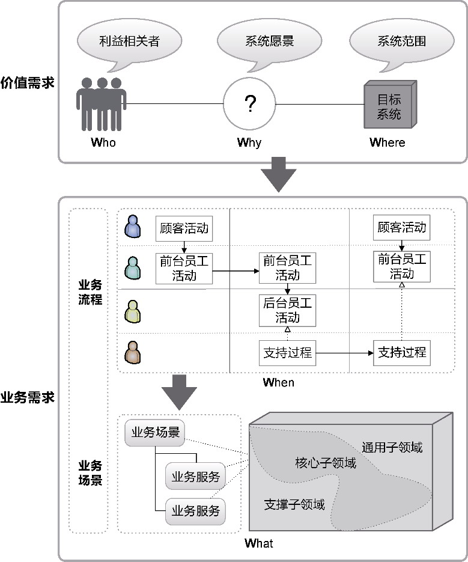

*图4-1 全局分析的5W模型*

价值需求需要从系统价值的角度进行分析获得。没有价值，系统就没有开发的必要，而价值一定是为人提供的。不同角色的人对于该系统的期望并不相同，牵涉到的利益也不相同，这也是将系统的参与者称为“利益相关者”(stakeholder)的原因。利益相关者是团队进行需求调研的主要访谈对象。在综合利益相关者提出的各种价值之后，我们需要对这些价值进行提炼和概括，并将所有利益相关者关注的主要价值统一到一个方向上，如此就明确了系统的愿景。确定了系统的愿景，就可将其作为业务目标的衡量标准，并通过分析目标系统的当前状态与未来状态，确定目标系统的范围。利益相关者、系统愿景和系统范围共同组成了目标系统的价值需求，分属于5W模型中的Who模型、Why模型与Where模型。

业务需求由动态的业务流程与静态的业务场景、业务服务构成。每个业务流程都体现了一个业务价值，多个角色在不同阶段参与到这个业务流程中，所执行的所有业务行为都是为完成该业务价值服务的。整个流程由处于不同时间点的执行步骤构成，具有时间属性，属于5W模型中的When模型。根据流程环节中不同的业务目标，可以将一个完整的业务流程划分为多个阶段，每个阶段都完成自己的业务目标。因此，可以在业务目标的指导下将业务流程划分为多个业务场景。业务场景好像业务目标在业务流程中的投影，形成了对业务流程的纵向切割，组成了多个角色执行业务服务的时空背景。每个角色在该时空背景下与目标系统的一次完整功能交互，都是为了获得服务价值，这就是业务场景下的一个业务服务。业务服务是全局分析阶段获得的基本业务单元。业务服务描述了目标系统到底做什么，即目标系统提供的业务功能，属于5W模型中的What模型。

不同业务服务的重要性并不相同。如果某个业务服务提供了目标系统的核心价值，或者具有不可替代的作用，满足了最重要的利益相关者的价值需求，就应划入核心子领域；如果某个业务服务并没有鲜明的领域特征，虽然仍然属于业务需求的一部分，但在面向各个领域的业务系统中都能看到，又不可或缺，形成了不具有个性特征的通用功能，自然就应划入通用子领域；如果某个业务服务为另外一些提供了核心价值的业务服务提供支撑，具有辅助价值却又不具有通用意义，就应划入支撑子领域。核心子领域、通用子领域和支撑子领域共同构成了整个目标系统的问题空间。

### 4.2 高效沟通

全局分析的5W模型撑起了精准获得问题空间的整个骨架，在价值需求分析与业务需求分析过程中，需要引入不同的方法与实践帮助分析者探索问题空间不同层次的模型要素。运用正确的方法、遵循正确的过程是正确做事的原则，但对于全局分析这样一个探索问题空间的特殊阶段，还离不开业务分析师与利益相关者的高效沟通，它是探索问题空间的前提。

在探索问题空间时，业务分析师不仅要竖起双耳聆听各个利益相关者的“心声”，还要擦亮眼睛观察用户的操作行为，听其言观其行，细心发掘需求。业务分析师必须是一名循循善诱的引导者，与利益相关者共同组成一个密不可分的利益共同体，共同培育需求。发掘和培育需求的过程需要双向的沟通、反馈，更要达成对领域知识理解上的共识。每个人心中都对原始需求有自己的理解，如果没有正确的沟通交流方式，团队达成的所谓“需求一致”不过是一种假象罢了。因此，高效沟通的基础是达成共识。

#### 4.2.1 达成共识

每个人获得的信息不同、知识背景不同，各自的角色不同又导致我们设想的上下文也不相同。诸多的不同使得我们在对话交流中好似被蒙住了双眼，面对需求这头大象，各自获得了局部的知识，却自以为掌控了全局，如图4-2所示。

或许有人会认为利益相关者提出的需求就应该是全部，我们只需理解利益相关者的需求，然后积极响应这些需求即可。传统的开发合作模式更妄图以合同的形式约定需求知识，要求甲乙双方在一份沉甸甸的需求规格说明书上签字画押，以为如此即可约定需求内容和边界。一旦出现超出合同范围的变更，就需要将变更申请提交到需求变更委员会进行评审。这种方式一开始就站不住脚，因为我们对客户需求的理解存在3个方向的偏差：

·我们从利益相关者了解到的需求并非最终用户的需求；

·若无有效的沟通方式，需求的理解偏差会导致结果与预期大相径庭；

·理解到的需求并没有揭示完整的领域知识，导致领域建模与设计出现认知偏差。

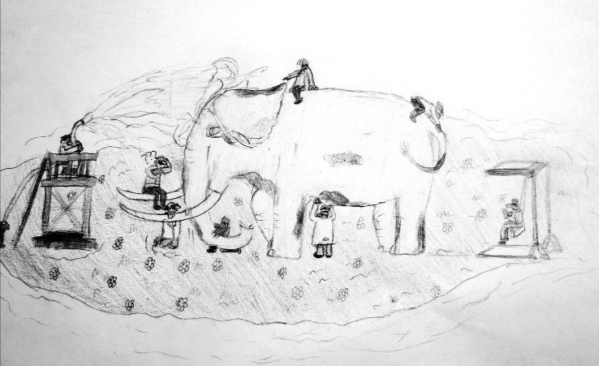

*图4-2 盲人摸象*

Jeff Patton使用图4-3所示的漫画来描述达成共识的过程^25。

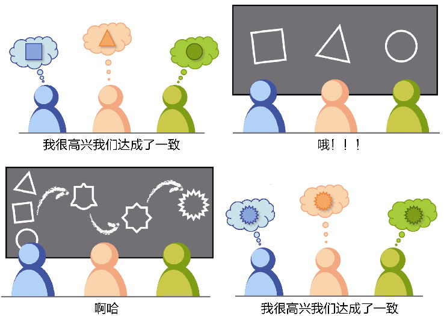

*图4-3 达成一致*

这幅漫画形象地展现了多个角色之间如何通过可视化的交流形式逐渐达成共识。正如前面所述，在团队交流中，每个人都可能“盲人摸象”。怎么避免认知偏差？很简单，就是要用可视化的方式展现出来。绘图、使用便签、编写用户故事或测试用例，都是重要的辅助手段。可视化形式的交流可以让不同角色看到需求之间的差异。一旦明确了这些差异，就可以利用各自掌握的知识互补不足去掉有余，最终得到大家都一致认可的需求，形成统一的认知模型。

#### 4.2.2 统一语言

达成共识的目的是确定目标系统的统一语言(ubiquitous language)。获得统一语言就是在全局分析过程中不断达成共识的过程，即团队中各个角色就系统愿景、范围和业务需求达成一致，并通过一种直观的形式体现出来，以作为沟通与协作的基础。

使用统一语言可以帮助我们将参与讨论的利益相关者、领域专家和开发团队拉到同一个维度空间进行讨论。没有达成这种一致，那就是鸡同鸭讲，毫无沟通效率，甚至会造成误解。因此，在沟通需求时，团队中的每个人都应使用统一语言进行交流。

一旦确定了统一语言，无论是与领域专家的讨论，还是最终的实现代码，都可以通过相同的术语清晰准确地定义和表达领域知识。重要的是，当我们建立了符合整个团队皆认同的一套统一语言后，就可以在此基础上寻找正确的领域概念，为建立领域模型提供重要参考。利用统一语言还可以对领域模型做完整性检查，保证团队中的每位成员共享相同的领域知识。

**1.统一的领域术语**

形成统一的领域术语，尤其是基于模型的语言概念，是让沟通达成一致的前提。开发人员与领域专家掌握的知识存在差异，开发人员更擅长技术细节，领域专家更熟悉业务，两种角色之间的交流就好似使用两种不同语言的人直接交谈，必然磕磕绊绊。从需求中提炼统一语言，就是在两种不同的语言之间进行正确翻译的过程。

某些领域术语是有行业规范的，例如财会领域就有标准的会计准则，对于账目、对账、成本、利润等概念都有标准的定义，在一定程度上避免了分歧。然而，标准并非绝对的，在某些行业甚至存在多种标准共存的现象。以民航业的运输统计指标为例，牵涉到与运量、运力和周转量相关的术语，就存在国际民用航空组织(International Civil Aviation Organization，ICAO)与国际航空运输协会(International Air Transport Association，IATA)两大体系，而中国民航局又有自己的中文解释，航空公司和各大机场亦有自己衍生的定义。

例如，针对一次航空运输的运量，分为城市对与航段的运量统计。城市对运量统计的是出发城市到目的城市两点之间的旅客数量，机场将其称为流向。ICAO定义的领域术语为City-pair(On-Flight Origin and Destination，OFOD)，而IATA则将其命名为O&D。航段运量又称为载客量，指某个特定航段上承载的旅客总数量，ICAO将其称为TFS(Traffic by flight stage)，而IATA则将其称为Segment Traffic。

城市对与航段这两个概念很容易混淆。以航班CZ5724为例，该航班从北京（目的港代码PEK）出发，经停武汉（目的港代码WUH）飞往广州（目的港代码CAN）。假定从北京到武汉的旅客数为105，从北京到广州的旅客数为14，从武汉到广州的旅客数为83，则统计该次航班的城市对运量时，应该对3个城市对（即PEK-WUH、PEK-CAN、WUH-CAN）分别进行统计，而航段运量的统计则仅仅分为两个航段（即PEK-WUH与WUH-CAN）。至于从北京到广州的14名旅客，则被截分为了两段，分别计数。如图4-4所示。

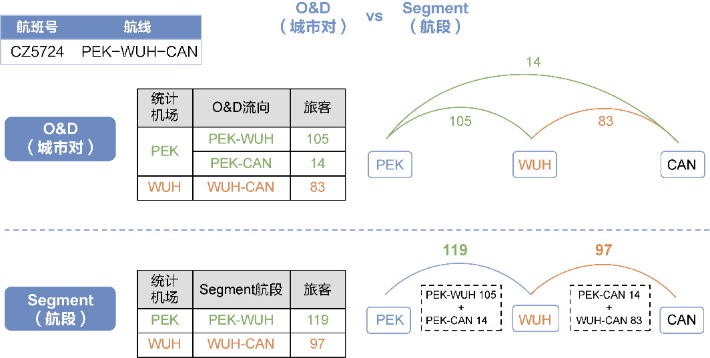

*图4-4 城市对和航段的差异*

如果我们不明白城市对运量与航段运量的真正含义，就可能混淆两种指标的统计计算规则。这种术语理解错误带来的缺陷往往难以发现，除非业务分析师、开发人员和测试人员能就此知识的理解达成一致。

可以通过定义一个大家一致认可的术语表来建立统一语言。术语表包含整个团队精炼出来的术语概念，以及对该术语的清晰明了的解释。若有可能，可以为难以理解的术语提供具体的案例。该术语表是领域建模的关键，是模型的重要参考规范，能够真实地反映模型的领域意义。一旦术语发生变更，也需要及时更新。

在维护领域术语表时，建议给出对应的英文术语，否则可能直接影响到代码实现，因为从中文到英文的翻译可能多种多样，甚至千奇百怪。翻译得不够纯正地道倒也罢了，糟糕的是针对同一个确定无疑的领域概念形成了多套英文术语。例如在数据分析领域，针对“维度”与“指标”两个术语，可能会衍生出两套英文定义，分别为dimension与metric、category与measure。这种混乱人为地制造了沟通障碍。好的统一语言既是正确的，又是一致的，如果真的无法找到准确的英文概念表达，我宁愿牺牲正确性，也要保证统一语言的一致性。

**2.领域行为描述**

领域行为描述可以视为领域术语甄别的一种延伸。领域行为是对业务过程的描述，相对于领域术语，它体现了更加完整的业务需求以及复杂的业务规则。在描述领域行为时，需要满足以下要求：

·从领域的角度而非实现角度描述领域行为；

·若涉及领域术语，必须遵循术语表的规范；

·强调动词的精确性，符合业务动作在该领域的合理性；

·要突出与领域行为有关的领域概念。

以项目管理系统为例，我们采用Scrum敏捷项目管理流程，要描述Sprint Backlog的任务安排，可以编写如下所示的用户故事：

作为一名Scrum Master，

我想要将Sprint Backlog分配给团队成员，

以便明确Backlog的负责人并跟踪进度。

验收标准：

* 被分配的Sprint Backlog没有被关闭；

* 分配成功后，系统会发送邮件给指定的团队成员；

* 一个Sprint Backlog只能分配给一个团队成员；

* 若已有负责人与新的负责人为同一个人，则取消本次分配；

* 每次对Sprint Backlog的分配都需要保存，以便查询。

在用户故事中，将Sprint Backlog分配给团队成员就是一种领域行为，它是角色在特定上下文中触发的动作。该领域行为规定了服务提供者与消费者之间的业务关系，形成行为的契约，即领域行为的前置条件、执行主语、宾语和执行结果。这些描述丰富了该领域的统一语言，直接影响了API的设计。针对分配Sprint Backlog的行为，用户故事明确了未关闭的Sprint Backlog只能分配给一个团队成员，且不允许重复分配，体现了分配行为的业务规则。验收标准中提出对任务分配的保存，实际上也帮助我们得到了SprintBacklogAssignment这个领域概念。

显然，领域行为同样是统一语言的一部分。我们可将其加入领域术语表，并给出对应的英文术语，在领域建模时，相应的术语需与其保持一致。

**3.大声说出来**

定义和确定统一语言，有利于消除领域专家与团队之间、团队成员之间的分歧与误解，使得各种角色能够在相同的语境下行事，避免“盲人摸象”的“视觉”障碍。

在明确统一语言时，需要“大声说出来”，清晰地表达出统一语言蕴含的领域概念，否则就可能像图4-3揭示的那样，在出现理解偏差的时候尚不自知，各个角色还以为达成了统一语言的共识。知之为知之，不知为不知，千万不要以你的“知道”去揣测别人的“知道”。在需求沟通中，但凡有不明确的领域概念，就要大声说出来，不要胆怯，也不要害怕在客户面前暴露你的业务知识盲区：有时候，你不知道的业务知识，客户同样懵懂不知呢。

有一次，我参加某机场系统的用户访谈，对客户反复提到的“过站航班”“过夜航班”“停场航班”等概念感到茫然，便大声说出了我的困惑，没想到，机场的业务部门其实对这些概念也没有一致的定义，由于各个机场的情形并不相同，民航局也未就这些概念给出定义。于是，我们和客户一起探索，结合他们自身的业务要求和背景，最终确定了这些领域概念的定义，至少在该机场内确定了他们的统一语言。

要“大声说出来”，除了积极地沟通并引入可视化的手段，有时候还需要“局外人”的介入。局外人不了解业务，任何领域概念对他而言可能都是陌生的。通过局外人的不断提问，有可能发现，所谓“已达成一致”的领域概念，不过是成员各自思维模型中的固有概念：大家都以为已经向局外人明确了自己对概念的理解，实际上不同人的理解相去甚远。

在针对一款供应链产品进行用例分析时，资金团队通过可视化的方式标识了各个用例。他（她）们用各种颜色的即时贴代表各种用例，将它们张贴在白板上，形成图4-5所示的用例图，然后一起就此进行沟通。

图4-5中的“付现汇”和“付票据”主用例都包含“提交银行”子用例。团队在描述该子用例时，根据自己理解的业务就用例的描述达成了一致，而我作为一名“局外人”，却无法理解“提交银行”这一子用例。同时我也发现，既然付现汇和付票据都包含“提交银行”子用例，为何不复用该子用例呢？我提出了我的困惑，希望团队成员为我讲解什么是“提交银行”。结果发现，分别负责付现汇和付票据的团队成员讲出来的子用例存在显著差异：付现汇主用例中的“提交银行”子用例指的是“提交收款指令”，付票据主用例的“提交银行”子用例指的则是“提交电票指令”。直到大声说出该子用例的业务含义时，团队成员方才恍然大悟，认识到统一语言的意义不仅在于统一概念，还要统一认识，确定以无歧义的方式精确描述业务。这些团队成员都是深耕该行业十余年的资深分析人员与开发人员，而他们早已烂熟于胸的业务知识却遮掩了真相，这也算得上是一种“知见障”了吧。

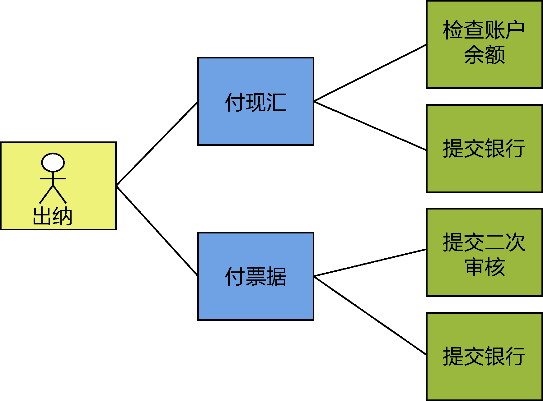

*图4-5 付现汇和付票据的用例图*

**4.价值**

在领域驱动设计中，怎么强调统一语言都不为过！如果我们不能做到使用统一语言来表达业务逻辑，就不敢奢谈领域驱动设计了。

建立统一语言不限于全局分析阶段，实际上它贯穿了整个领域驱动设计统一过程。在全局分析阶段，所有参与价值需求分析与业务需求分析的领域专家和开发团队成员都通过统一语言来就业务知识达成共识，以此来探索问题空间；在架构映射阶段，需要统一语言来规范对业务服务的描述，才能通过语义相关性与功能相关性识别限界上下文；到了领域建模阶段，领域模型与统一语言的关系更是成为一种相辅相成的关系，统一语言指导着领域建模，而领域建模的成果又反过来丰富了统一语言，确保了领域模型与统一语言的一致性。

毋庸讳言，若能在全局分析阶段准确地把握统一语言，就能在进入解空间后，给架构映射阶段和领域建模阶段带来更好的指导。

我在为一家物流公司提供领域驱动设计的咨询时，发现他们对运输的定义未曾形成统一语言。他们认为运输是一个单段运输，整体的一个多式联运则被认为是一项委托，而委托又是客户提出的需求订单。这就导致团队在使用运输、委托和订单等概念时总是产生混淆，形成了混乱的领域概念，在进行架构设计与领域建模时，就显得格外别扭。

我为该项目引入了领域驱动设计统一过程，清晰地划出了全局分析阶段，要求团队在全面梳理产品需求时，进一步确定各种领域概念的统一语言。我和他们一起分析，结合不同的业务场景分别理解运输、委托和订单等领域概念，发现承运人在确认委托时，需要对整个运输过程制订计划。在制订计划时，所谓的一次运输可能是从A到B的铁路运输，也可能是从B到C的公路运输，还可能是从A经B到C的多式联运。如果是铁路运输，到达的B站就是铁路堆场，如果是公路运输，到达的C站就是货站。至于一次运输委托，则是一次完整的运输过程。

我们一致认为：应该将“运输”理解为从起点到终点的整个运输过程。整个运输过程可能经过多个“站点”，包括堆场和货站，两个站点之间的运输则称为“运输段”。当我们在谈论运输这一领域概念时，往往指的是运输计划与路径规划，在这一业务背景下，无须考虑委托合同的签订、履行，也无须考虑运输指令的执行以及堆场与货站的差异。这些概念实际上各自代表了限界上下文的知识语境（参见第9章）。运输、站点和运输段属于运输上下文，用于管理运输计划与运输路线，站点是堆场和货站的抽象。在运输过程中，堆场和货站是两个完全不同的概念：堆场针对的资源是集装箱，货站针对的资源是件散货。用于装卸货的工作区域和用于存储货物的仓库组成一个独立的货站上下文，而堆场上下文则包含堆场区域的信息管理以及掏箱、转场和修箱等业务操作。运输上下文中的站点概念并不牵涉对站点内部的管理，这就使得运输与站点之间的逻辑互不干扰，如图4-6所示。

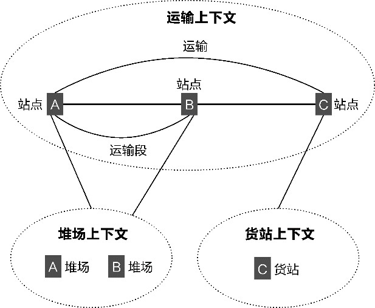

*图4-6 不同限界上下文的领域概念*

在建立了运输上下文的领域模型之后，我们发现铁路运输和公路运输可以合并到同一个运输领域模型中，并体现为运输的两种方式。开发团队在日常交流和讨论中提及的委托、规划、计划，其实是同一个概念。我们定义其统一语言为运输规划，它与运输形成了一对一的关系。

没有统一语言，就不能消除沟通的歧义，也不能就正确的领域逻辑达成一致认识。对问题空间的全局分析就是梳理各种需求问题的领域概念，如果能在这个阶段逐步形成统一语言，就能清晰地明确问题，在对问题进行求解时，就有了参考的标准。当然，我们不要简单地认为统一语言是一个术语表，或者一份文档、模板、规范。统一语言是领域驱动设计的指导原则，无论是编写全局分析规格说明书，还是确定架构映射战略设计方案，抑或建立领域模型，都需要“虔诚”地体现它的意志，甚至说统一语言统领整个领域驱动设计过程，似乎也不为过。

### 4.3 高效协作

难以想象，一个仅靠文字组成的文档进行纸面（或电子邮件）交流的团队，会是一个高效协作的团队。在我开展咨询工作时，每次与客户一起开会讨论问题，倘若会议室没有一块白板，或者没有准备白板纸与即时贴，我就感觉没法把团队调动起来，也无法准确表达我想要说明的含义。

“一图胜千言”，通过引入分析与设计图形来丰富表达力是交流方式的进步，然而，面临高复杂度的大规模业务系统，仅靠直观的分析图形来进行全局分析显然不够，我们还需要改变协作的方式。

Scott Millett就建议：“要让你的知识提炼环节充满有趣的互动，可以引入一些有促进作用的游戏以及其他形式的需求收集方式来吸引你的业务用户。”^19归根结底，全局分析阶段就是从宏观层面对领域知识的提炼。在这个过程中，没有高效的协作方法，就无法实现高效的交流，更难说达成共识形成统一语言了。

要让全局分析过程“充满有趣的互动”，就要以视觉方式引导团队，召开视觉会议来促进团队的高效沟通。这种视觉会议具有更强的参与感，在互动过程中提高了参与者的投入意识；共同协作创造的全景图，体现了团队整体的全景思维；创建了更容易记忆的媒介，极大地增加了群体记忆^18。

正因为如此，我在全局分析阶段引入了视觉会议形式的各种协作方法。这些方法的共同特征是通过可视化的互动方式建立开发团队、领域专家和利益相关者之间的高效协作。

#### 4.3.1 商业模式画布

Alexander Osterwalder和Yves Pigneur提出的商业模式画布(business model canvas)可以用于价值需求分析。这一方法适合分析师通过召集团队进行头脑风暴，并以画布的可视化方式引导大家一起梳理目标系统（当然也可以说是产品）的价值需求。一个典型的商业模式画布如图4-7所示。

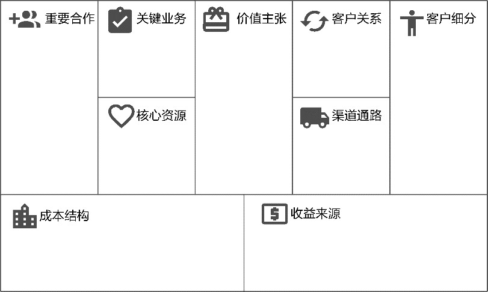

*图4-7 商业模式画布*

商业模式画布由9个板块构成。

·客户细分(customer segments)：企业所服务的一个或多个客户分类群体，可以是企业组织、最终用户等。

·价值主张(value propositions)：通过价值主张来解决客户难题和满足客户需求，为客户提供有价值的服务。

·渠道通路(channels)：通过沟通、分销和销售渠道向客户传递价值主张，即企业将销售的商品或服务交付给客户的方式。

·客户关系(customer relationships)：在每一个客户细分市场建立和维护企业与客户之间的关系。

·收益来源(revenue streams)：通过成功提供给客户的价值主张获得营业收入，是企业的盈利模式。

·核心资源(key resources)：企业最重要的资产，也是保证企业保持竞争力的关键，这些资源包括人力和物力。

·关键业务(key activities)：通过执行一些关键业务活动，运转企业的商业模式。

·重要合作(key partnership)：需要从企业外部获得资源，就需要寻求合作伙伴。

·成本结构(cost structure)：该商业模式要获得成功所引发的成本构成。

要建立团队的高效协作，需要选择一位引导师在白板（或白板纸）上绘制好商业模式画布的模板，然后分别针对这9个板块向参会者提出对应的问题。为了让交流变得更加高效，在引导师提出问题之后，可以让参会者针对这些问题将个人的想法写在即时贴上。引导师将大家写好的即时贴张贴在画布对应的板块上，然后逐项进行讨论，以求达成共识。在询问问题时，选择板块的顺序是有讲究的：顺序代表了思考的方向、认知的递进，或者准确地说就是一种心流，是一种层层递进的因与果的驱动力，如图4-8所示。

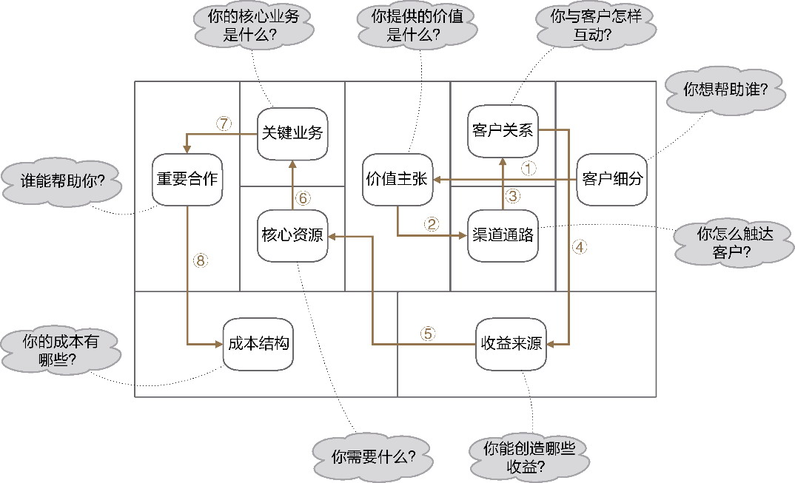

*图4-8 商业模式画布的驱动方向*

针对目标系统而言，首先需要确定目标系统要帮助的各类型细分的客户，以更好地明确它的价值主张。然而，有了意向客户，也有了为客户提供的价值，又该如何将价值传递给客户呢？这就驱动出目标系统的渠道通路。渠道通路的形式取决于目标系统如何与客户互动，因而需定义出客户关系。理清楚了客户关系，就可以思考目标系统能够创造哪些收益，确定收益来源。至此，目标系统的方向与轮廓已大致确定，接下来需要考虑如何落地的问题。这时需要识别企业的可用资源，并与实现该目标系统需要的资源相比对，以确定核心资源。这些核心资源是为目标系统的关键业务服务的。要推进关键业务，只靠一家公司或一个团队独木难支，需要得到合作伙伴的帮助。最后，需要确定要实现该目标系统需要的成本，如此才能确定采用该商业模式的目标系统是否有利润可期。

#### 4.3.2 业务流程图

业务流程图(transaction flow diagram，TFD)善于表现业务流程。它通过使用诸如任务流程图、泳道图等图形形象地描述真实世界中各种业务流程的执行步骤与处理过程。

在绘制业务流程图时，尽量使用标准的可视化符号，如此就可以形成一种交流的统一语言。常用的流程图符号如图4-9所示。

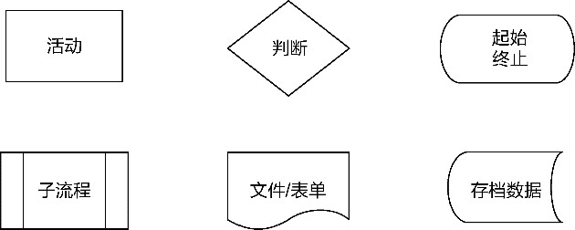

*图4-9 常用的流程图符号*

泳道图(swimlane)是最为常用的业务流程图表现形式，它能够很好体现部门或者角色在流程中的职责以及上下游的协作关系。泳道图通过两个维度分别表现业务流程的划分阶段与参与部门（或岗位），分别称为阶段维度与部门/岗位维度，如图4-10所示。

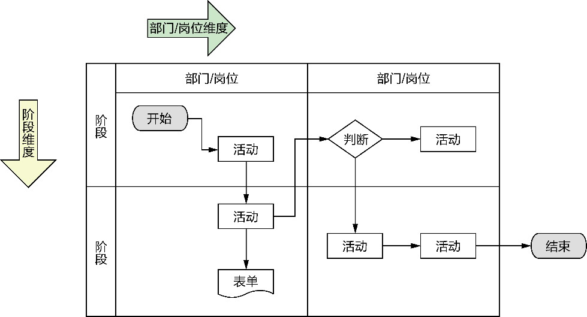

*图4-10 泳道图*

部门/岗位维度决定了某个活动由哪个部门或岗位完成，例如企业的人力资源部、商城运营的客服；阶段维度由不同的阶段组成，每个阶段体现了各个部门或岗位执行活动的一个业务目标，流程图中的各个阶段应处于同一个层级。垂直和水平方向的泳道决定了一个网格内的活动由该部门该岗位在该阶段执行。泳道图并没有死板地规定部门/岗位维度与阶段维度所在的方向，例如，阶段维度可以放在水平方向，也可以放在垂直方向；有的泳道图甚至可能只有部门/岗位维度，而没有清晰地刻画阶段维度。

绘制业务流程图时，为保证业务流程的清晰度，倘若一个主业务流程中还牵涉到多个嵌套的子流程，可以使用子流程符号来“封装”子流程的执行步骤细节。

#### 4.3.3 服务蓝图

服务蓝图是用于服务设计的主要工具，相较于用户体验地图或用户旅程，它以更加全面的视角展现了客户与前台员工、前台员工与后台员工、后台员工与内部支持者（包括支持部门或支持系统）之间的协作。因此，服务蓝图能够全方位地展现具有完整业务价值的业务流程。如果将一个业务流程理解为是对客户提供的服务，那么一个服务蓝图就对应了一个业务流程。

服务蓝图通过3条分界线（即可见性分界线、交互分界线、内部交互分界线）将一个完整的业务流程分割为不同参与角色执行业务活动的不同区域。分割出来的各个区域代表了不同角色的活动类型，也体现了不同的观察视图，在保证业务流程全貌的基础上清晰地体现了参与角色、活动类型、活动阶段的不同特征。服务蓝图的可视化模板如图4-11所示。

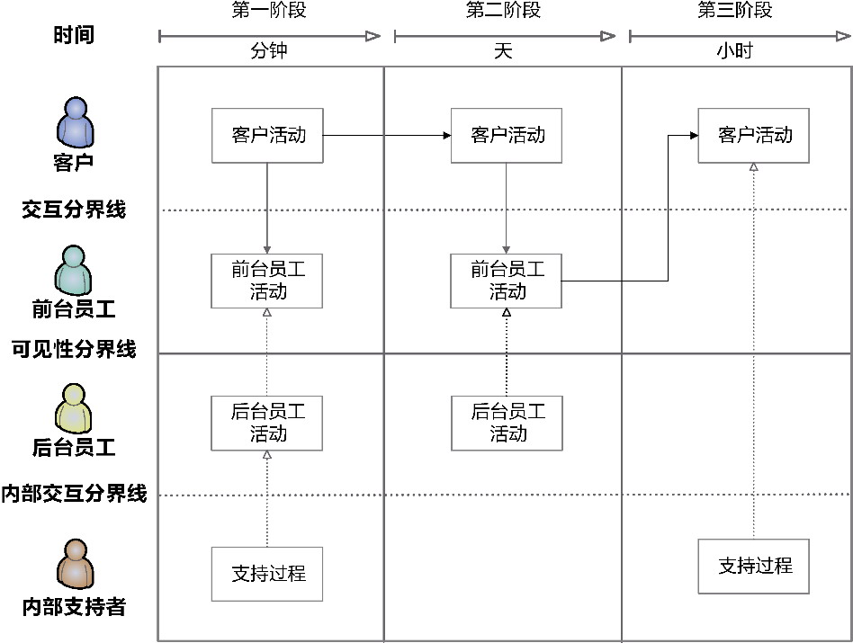

*图4-11 服务蓝图*

这3条分界线清晰地展现了各个角色的职责边界，形成了以下4个活动区域。

·客户活动(customer actions)：客户为了满足自己的服务要求执行的操作。

·前台员工活动(onstage employee actions)：客户能够看到的前台员工操作的行为和步骤。

·后台员工活动(backstage employee actions)：发生在客户看不到的后台，支持前台的后台员工活动。

·支持过程(support process)：内部支持者为前台、后台员工履行服务提供支持。

在这4个活动区域面向的角色中，客户通常属于组织外的角色，前台员工和后台员工属于组织内的角色。不同角色履行不同的职责，构成了各自的活动类型：客户只会与前台员工发生行为上的互动协作，互动分界线清晰地划分了组织的边界；前台员工与后台员工也存在行为上的互动协作，可见性分界线体现了前台与后台的差异，同时也向客户屏蔽了他（她）不需要了解的业务环节（即后台员工行为与支持过程），杜绝了客户与后台员工之间的行为交互。在可见性分界线的内部，支持过程又被内部交互分界线隔出。参与支持过程的角色为内部支持者，而支持过程的行为往往组成了业务流程的支持流程。4个活动区域在分界线的保护下，泾渭分明地执行各自的活动。

时间因素将服务地图展现的角色活动分为不同的阶段，形成了具有时间节点的纵向区域。在划分时间阶段时，不要仅从客户的角度考虑，而要使所有角色参与到整个业务流程中，为了实现一个共同业务价值，在不同阶段满足了不同的业务目标。例如，对于购买商品这一业务流程，从客户角度看，可以划分为商品浏览、购买、消费和评价4个阶段，对电商平台而言，前台员工与客户的互动发生在购买（商品咨询）与评价（售后服务）两个阶段，后台员工的活动包括出货、配送等阶段。这些阶段虽然是客户不需要了解的，但缺少了这些阶段，客户又无法完成商品的购买。

在运用服务蓝图展现一个完整的业务流程之前，团队需要事先了解服务企业的组织结构和员工角色，这些角色与客户一起共同组成参与服务蓝图的角色。绘制服务蓝图需要团队与提供服务的组织成员共同协作，协作的过程就是将业务流程逐步呈现的过程，具体步骤如下：

(1)在空白的白板上画出交互分界线，在左侧对应位置分别贴上当前业务流程的客户角色；

(2)从客户角度描绘整个业务流程中为客户提供服务的过程，写在即时贴上，按照时间顺序依次贴在交互分界线的上方；

(3)识别出与客户活动存在互动关系的前台员工活动，写在即时贴上并标记出前台员工角色，贴在对应活动下方，用带箭头的实线表示活动之间的调用关系，箭头方向体现了流程方向；

(4)画出可见性分界线，在左侧对应位置贴上后台员工角色；

(5)识别出支持前台员工活动的后台员工活动，写在即时贴上并标记出后台员工角色，贴在对应活动下方，用带箭头的虚线表示支持关系，箭头指向被支持的活动；

(6)画出内部交互分界线；

(7)识别出支持各类活动的支持过程，并标记出内部支持者角色，用带箭头的虚线表示支持关系，箭头指向被支持的活动。

服务蓝图是展现业务流程的全景图。无论是线上活动还是线下活动，也不管是顺序调用还是等待消息通知，只要是该业务流程的执行步骤，都需要在服务蓝图中体现出来。服务蓝图是真实世界业务流程的真实体现。

#### 4.3.4 用例图

用例(use case)是对一系列活动（包括活动变体）的描述；主体(subject)执行并产生可观察的有价值的结果，并将结果返回给参与者(actor)^226。如果将整个组织作为用例的主体，参与者就应该是组织外的角色，用例表现的就是该角色与组织之间的一次交互，此时的用例称为业务用例，代表了组织的本质价值^75；如果将目标系统作为用例的主体，参与者就变成了目标系统外的角色（人或者外部系统），此时的用例称为系统用例，表现的是角色与目标系统之间的一次交互，通过这种交互，参与者获得了目标系统提供的业务价值。显然，用例的主体体现了边界的大小与层次，它决定了参与者的角色、价值的层次以及参与者和主体之间的交互形式。

可以通过用例图对主体行为进行可视化建模。一个用例图由火柴棍人表示的参与者、椭圆形表示的用例、矩形表示的主体边界和连线表示的关系共同构成。如果还需要表现一个用例内部的执行步骤，还可以有用例的包含用例、扩展用例，以及可能具有的泛化关系（参与者的泛化或用例的泛化），如图4-12所示。

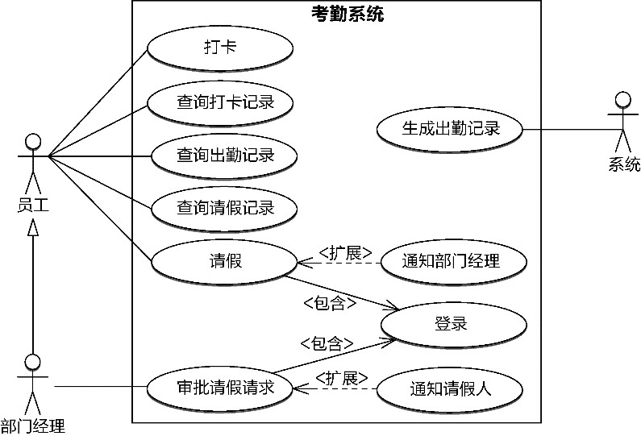

*图4-12 考勤系统的用例图*

用例名是领域知识的呈现，更是统一语言的有效输入。用例名应使用动词短语，描述时需要字斟句酌，把握每一个动词和名词的精确表达。动词是领域行为的体现，名词是领域概念的象征，这些行为与概念就能再借助领域模型传递给设计模型，最终通过可读性强的代码来体现。

采用视觉形式的用例图可以更好地促进团队的交流，让所有团队成员与领域专家一起参与业务需求分析。抛开一本正经的UML建模工具，使用即时贴以头脑风暴的形式协作地绘制用例图，会取得意想不到的良好效果。

在进行可视化用例图协作时，分析者将整张白板当作用例图的主体，并就主体的边界（是组织还是目标系统）达成共识，然后分别找出所有参与者，在黄色即时贴上写上参与者的名称，贴在白板上。接下来，选择其中一个参与者，站在主体边界的角度思考该参与者与主体之间的交互，或者该主体能为参与者提供什么具有价值的服务，以动词短语描述出来，写在蓝色即时贴上，贴在白板相应位置，作为系统用例。若有必要，可继续针对用例识别出绿色的包含用例与扩展用例。识别出该参与者的所有用例后，依次调整顺序，并在确认用例没有错误或疏漏后，在白板上绘制连线将它们连起来。注意用例与统一语言之间的关系：用例的描述是统一语言的一部分，而在命名用例时，又要从已有的统一语言中提取描述精确的领域概念。

#### 4.3.5 事件风暴

Alberto Brandolini提出的事件风暴（参见附录B）是以一种工作坊形式对复杂业务领域进行探索的高效协作方法。它对业务探索的改进体现在两点：

·以事件为核心驱动力对业务开展探索；

·强调可视化的互动，更好地调动所有参与者共同对业务展开探索。

白色画卷纸、胶带纸条、各种颜色的即时贴以及马克笔成了开展事件风暴的利器。将白色画卷纸张贴在一面足够宽的墙上，它就成了所有参与者的“作战沙盘”，所有人都面对着这面墙开始互动：识别业务流程中的事件、讨论描述事件的统一语言、拿着即时贴进行张贴或者调整位置……一场轰轰烈烈的糊墙游戏面壁而展开，如图4-13所示。

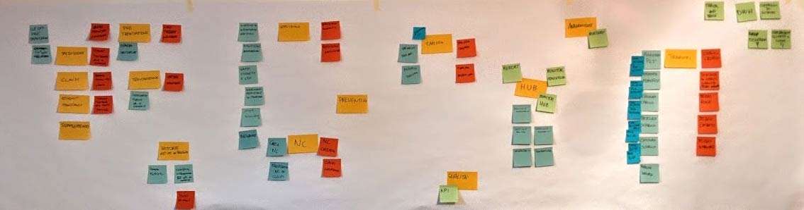

*图4-13 事件风暴*

用于领域驱动设计的事件风暴有以下两个层次。

·探索业务全景：属于宏观层次，寻找业务流程产生的事件，形成一个全景的事件流。

·领域分析建模：属于设计层次，通过探索业务全景获得的事件流，围绕着事件获得领域分析模型。

在全局分析阶段，可以引入宏观层次的事件风暴，探索目标系统的问题空间，获得与业务流程对应的事件流。由于事件流具有时间属性，通过标记时间轴上的关键时间点或者识别关键事件，可以划分出业务场景，而由角色触发的事件则体现了业务场景下的业务服务，由此即可获得问题空间的业务需求。

#### 4.3.6 学习循环

商业模式画布、服务蓝图、事件风暴之类的协作方法都是视觉会议形式的协作方法。这种协作方法之所以能够促进团队高效协作，是因为它使得每个与会者都能充分参与，形成一种良性的群体思考过程，这一过程就是图4-14所示的学习循环。

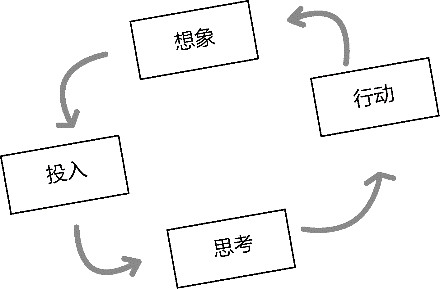

*图4-14 学习循环*

学习循环“开始于对意图和任务焦点的想象，接着是探索与投入，然后是思考和发现模式，最后是决定行动与应用。这些步骤整合了我们认知的知觉、情绪、思考和感觉部分。”^11探索问题空间本身就是从未知到已知的学习过程，视觉会议协作方式对传统协作方式最大的变革在于它将原本属于个人的学习过程转变为群体共同工作的学习过程。协作的难能可贵之处就是要向着一个共同目标以正确而高效的步伐迈进，不止如此，在这个过程中还需要创意与见解形成脑力的激荡。从想象开始，通过视觉化吸引团队投入，然后用视觉思维呈现每个人的想法，最后就可以收获探索的结果，以决定下一步的行动。

如上所述的各种视觉协作方式虽然并非领域驱动设计的内容，但是，它们都遵循了学习循环的过程，不仅通过可视化的互动协作方式提高每一位团队成员的主观能动性，让他们积极参与到每一次全局分析活动中，还促进了领域专家和开发团队的交流，促使其达成共识，定义统一语言，完成对问题空间的探索。
