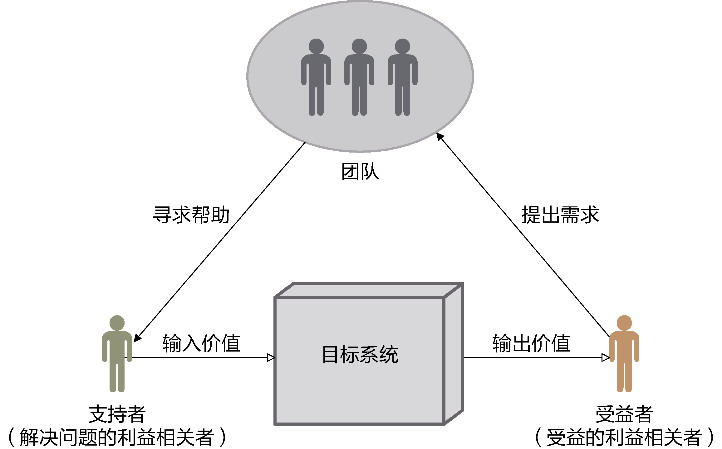
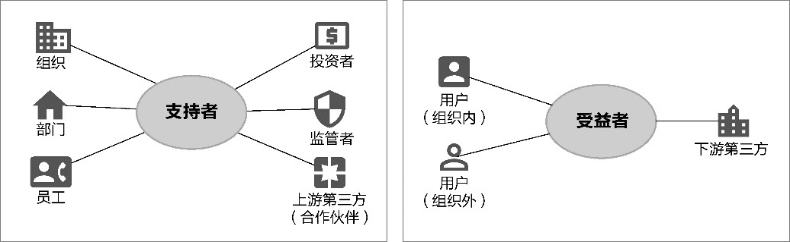
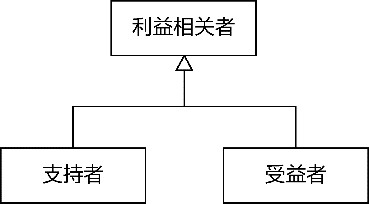
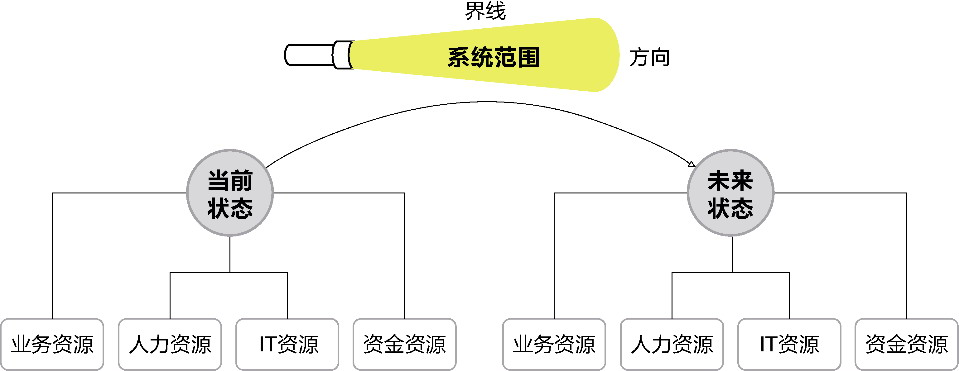
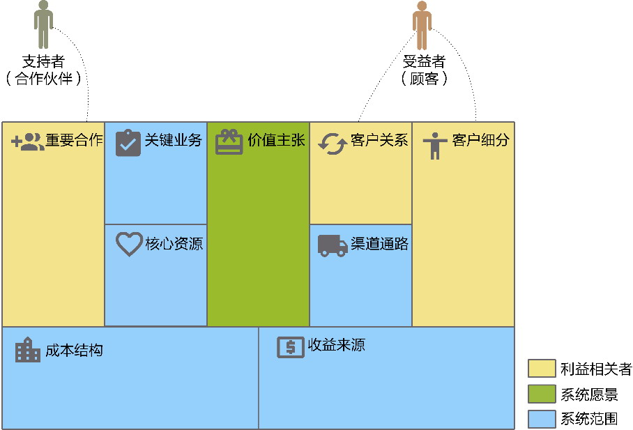
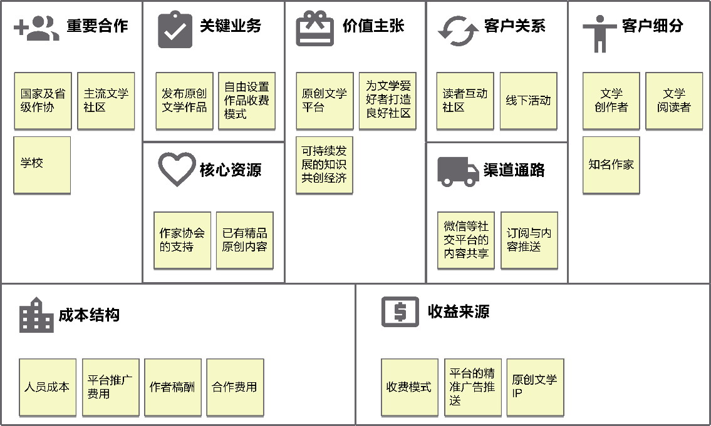

## 第5章 价值需求分析

> 如果观众告诉我，“你的动机与效果已经一致”，就等于告诉我，创作是成功的；如果反之，观众觉得动机与效果是矛盾的，就宣告了创作的失败。

> ——木心，《动机与效果》

“天下熙熙，皆为利来；天下攘攘，皆为利往。”不得不说这句话道破了世情的现实与无奈，然而折射到软件开发领域，倒也点明了软件开发的本质：开发软件系统，皆为利来利往。软件系统的利，就是为客户解决问题、创造机会，也就是为客户带来价值。

价值需求分析会对整个目标系统进行价值判断，识别利益相关者、明确系统愿景、确定系统范围，从而构成全局分析阶段要获得的价值需求。让利益相关者希望获得的价值清晰地浮现出来，就能确认系统的定位，站在宏观层次把握全局分析的目标与方向。价值需求就好像一把标尺，每当我们捕获到一条业务需求，就用这把标尺度量它的尺寸是否满足我们的要求；价值需求又好像一杆秤，每当我们挖掘到一条业务需求，就拿到这杆秤上称一称，然后根据它的质量（俗称重量）来确定优先级。

### 5.1 识别利益相关者

要识别利益相关者，要先明确什么是利益相关者，以及利益相关者到底包括哪些角色。

#### 5.1.1 什么是利益相关者

“利益相关者是积极参与项目、受项目结果影响，或者能够影响项目结果的个人、团队或组织。”^57由于全局分析阶段的分析目标是我们的目标系统，且该系统为要处理的问题空间，因此可以将利益相关者定义为与目标系统存在利益关系的个人、团队或组织。当然，在识别利益相关者时，眼光不能局限在目标系统，而应放到整个企业乃至整个行业生态圈的大背景。

利益相关性并不仅指获得利益，也指损害利益。利益可以是经济上诸如投资回报这样实际可以量化的指标，也可以是开发的目标系统解决了相关人的痛点与问题，由此改进了工作流程，提高了工作效率，为相关人提供了原来不曾拥有的价值等抽象概念。从正向理解，那就是展望目标系统的成功开发会给哪些人或角色带来如上价值；反过来，则是如果目标系统的开发遇到了障碍甚至遭遇了滑铁卢，又会影响到哪些人或角色。

以网约车平台为例。存在利益关系的角色包括网约车公司、出租车司机、专车或快车司机、乘客。负责运营网约车平台的公司作为一家企业，需进一步细化该企业哪些部门的利益与打车软件的成败息息相关，例如负责运营的出租车事业部、专车事业部等，负责体验的后台支撑部、公关部等，牵涉到的角色包括策略制订人、管理人员、技术开发人员、设计团队、实现人员、运营人员、销售人员、服务人员以及营销人员等。网约车平台支持出租车叫车，解决了出租车司机接单不够便捷的问题，同时也牵涉出租车司机与网约车公司间的账务关系。由于出租车司机也可以不通过网约车平台为乘客提供服务，因此他们与网约车平台间的利益关系远不如专车或快车司机与平台的关系这么紧密，在某些城市，网约车平台甚至损害了出租车司机的利益。乘客是网约车平台的主要用户，软件的功能直接影响到他们的利益，例如提供预约时间订车的功能，解决了乘客叫车难的痛点。

上述角色是存在显而易见利益关系的利益相关者。除此之外，还有一些不那么明显的利益关系，如对网约车平台的投资人来说，软件的成败直接影响投资回报率。同样存在利益关系的还有竞争者或者潜在的竞争者，如别的网约车公司以及出租车公司。如果网约车公司除了利用共享车资源，还自己提供专车，那么提供专车的供应商也可能成为打车软件的利益相关者。此外，还有网约车相关法律法规的制定者，网约车安全的监管者，乃至与地面出行有关的交通部门，影响网约车经营范围的交通地域（如火车站、机场等场所）的所属机构，也可能是网约车平台的利益相关者。举例来说，在网约车人身安全事故频频发生之后，在监管部门的要求下，网约车平台增加了提供紧急联系电话、路线偏离警示、司机身份验证等与安全相关的业务需求。

如果目标系统不是整个网约车平台，而是仅包含网约车平台的专车服务平台，由于目标系统发生了变化，利益相关者的范围也需要做出相应调整。例如，出租车公司与出租车司机就不再属于该目标系统的利益相关者，除非我们将出租车公司当作专车服务平台的竞争者。虽然运营网约车平台的企业仍然是专车服务平台的利益相关者，但与目标系统利益相关的部门也会发生变化，如专车事业部才是主要的利益相关者。因此，全局分析阶段的价值需求分析是明确目标系统的利益相关者，而不是对企业做战略分析，虽然二者之间或多或少存在一定的关系。企业的战略规划必然会影响目标系统的开发计划，开发一个目标系统也需要对准企业的战略目标。

#### 5.1.2 利益相关者的分类

可以简单地根据范围将利益相关者分为组织内部和组织外部。这一分类标准最简单，只需确定该利益相关者到底是在目标系统所在组织的范围内还是范围外。由于利益相关者并不一定是具体的人，也可以指参与该目标系统的角色，因此组织内的部门也可被认为是利益相关者。角色不同，与其相关的利益关系自然也有所不同。

按照组织范围划分利益相关者过于简单，参考价值不大。在分辨利益相关者时，可以分析价值需求的影响方向。目标系统提供的业务需求会输出价值，使得利益相关者能够从目标系统的成功开发中获取利益，这类利益相关者又可称为受益的利益相关者(beneficial stakeholder)，或者简称为“受益者”(beneficiary)^233；另一种利益相关者会为目标系统的成功输入价值，因而团队可以“从他们那里获取解决问题所需的东西”，此类利益相关者可称为解决问题的利益相关者(problem stakeholder)^233，或者简称为“支持者”。这两类利益相关者与团队、目标系统的关系如图5-1所示。

*图5-1 利益相关者的分类*

图5-1所示的关系图隐含着两条上下游关系链。

一条是价值流向的上下游关系链。我们可以结合价值交换理论来理解它们之间的关系。“利益相关者理论的一个核心原则，就是认为利益相关者的价值是从交换中得来的。”^238在确定受益者时，可以提出如下问题：谁会从目标系统输出的价值中受益？显然，根据这一问题确定利益相关者时，其实也驱动出了目标系统的价值需求和业务需求，即利益相关者的期望以及满足该期望需要输出的特性功能。例如，网约车平台一旦上线，直接获得输出价值的主要利益相关者就是乘客，乘客的期望为“随时随地的叫车服务与安全舒适的乘坐体验”，并由此催生出该平台需要开发的特性功能。在确定支持者时，可以提出如下问题：目标系统要获得成功的输入值，需由谁来提供？根据这一问题确定利益相关者，意味着找出了目标系统要获得成功需要的先决条件，也决定了团队需要获得这些利益相关者的支持与帮助。例如，网约车平台需要取得成功，需要投资者的资金投入，需要企业运营部门的业务支持，还需要通过交通监管者的审批，如果不具备这些先决条件，团队再怎么努力也无法顺利地完成目标系统。通过价值交换理论提出的这两个问题可被认为是价值交换过程的两个组成部分，前者是输出价值满足受益者的需求，后者是支持者的输入价值满足团队的需求。

另一条是服务方向的上下游关系链。受益者拥有需求，要让需求得到满足，就需要团队为其提供服务，团队是受益者的上游；支持者为团队提供了必要的输入，团队要让目标系统取得成功，就需要寻求他们的帮助，但目标系统的成功却未必给支持者带来价值，因此，支持者是团队的上游。这种上下游关系也决定了利益相关者的重要性与优先级。在价值需求分析阶段，支持者更加重要，他们决定目标系统的愿景与范围，确定开发目标系统的约束条件；在业务需求分析阶段，受益者更加重要，他们决定了目标系统的业务流程与业务场景，前提是这些业务需求必须获得支持者的认可。

在价值需求分析阶段，我们需要识别所有的利益相关者，包括支持者与受益者。识别的方法就是根据价值交换理论对目标系统提出前面所述的两个问题。支持者通常包括组织、组织下的相关部门与员工、投资者、监管者以及参与目标系统的上游第三方（可能是合作伙伴，也可能是第三方系统所属的组织），受益者通常包括组织内用户、组织外用户和参与目标系统的下游第三方，如图5-2所示。

*图5-2 支持者和受益者*

受益者中的组织内用户通常就是组织的员工，组织外用户通常为客户。要注意区分作为支持者的员工与作为受益者的组织内用户的差异，后者更强调他（她）是目标系统的操作者，即实际要操作和使用目标系统的角色，如网约车组织内的车辆调度人员。

明确“用户是目标系统的实际操作者”这一点有助于分辨一个角色是否是受益者。如果目标系统是为火车站开发的售票系统，作为购票者的旅客就不是用户，因为他（她）不是该售票系统的实际操作者，火车站的售票工作人员才是。有的火车站在售票时特别体贴地用另一台显示器向旅客展示工作人员售票的操作过程，便于旅客了解火车路线、时刻和车票的基本信息，但操作权仍然掌握在售票工作人员手上。倘若目标系统是“12306”App，那么旅客在购买车票时，就是App的实际操作者。

图5-3直观地说明了利益相关者是支持者与受益者的抽象。

*图5-3 支持者与受益者的抽象*

在不同项目类型的背景下，支持者与受益者还可能参差多态地“表演”不同的角色。在识别利益相关者时，需要定位这些角色到底是为目标系统输入价值的支持者，还是目标系统输出价值的受益者，如此才能明确在进行价值需求分析时应该找谁，进行业务需求分析时又该找谁，不会因为混淆角色而影响团队的判断。例如，对面向B端的企业项目而言，作为支持者的员工同时又是受益者（作为用户角色），在进行需求访谈和调研时，就要分辨对方提出的内容，哪些属于项目的愿景，哪些属于业务需求；如果是企业的自研项目，则团队与作为支持者的部门可能属于同一家组织，甚至团队成员自身也可能成为利益相关者，此时辨明利益相关者的身份就显得至关重要了；倘若目标系统面向C端的互联网产品，则支持者与受益者之间普遍存在明确的分界线，而我们很难直接面对作为受益者的产品最终用户，这时，企业内部的产品经理就在其中扮演用户代表的角色，可以被认为是受益者。

### 5.2 明确系统愿景

系统愿景(system vision)是对目标系统价值需求的精炼提取，若能以精简的话语清晰描述出来，就能帮助团队就项目需要达成的目标达成共识。明确系统愿景的一种方式是将其描绘为一张蓝图，利用一种贴切的比喻向利益相关者对蓝图进行勾勒。一次，我去拜访一家民航业通航领域的龙头企业，企业负责人向我们描述的系统愿景就一句话：打造一个通航领域的淘宝平台。在我们已经了解通航领域业务背景、经营模式和盈利方式的前提下，这样动人的描述确实能够一下子抓住我们的眼球，并能瞬间把握主要利益相关者的业务期望，毕竟淘宝是如何取得商业成功的，所有人都了然于胸。

借鉴电梯演讲(elevator pitch)也可以帮我们快速确定系统愿景。可以认为电梯演讲是一种交流方法，在价值需求分析阶段，就可以通过它来组织语言，描述系统愿景。电梯演讲的参考模板如下：

产品名称；

产品所属类别；

描述目标客户的需求或机会；

阐释产品能够带来的关键价值（或者说购买的理由）；

与竞争产品的不同之处。

譬如，我们要打造一款敏捷商业智能(bussiness intelligence，BI)工具，使用电梯演讲的模板，就可将系统愿景描述为：

产品名称：超级BI。

产品所属类别：一款基于大数据平台的敏捷BI工具。

描述目标客户的需求或机会：它能够让普通用户像数据分析师那样洞察数据，以可视化形式展现自己或领导需要看到的数据分析结果。

阐释产品能够带来的关键价值（或者说购买的理由）：购买我们的BI产品可以让数据分析变得更简单，让数据变得更有价值。

与竞争产品的不同之处：与Tableau、PowerBI等竞争产品的不同之处在于，它更加轻量级、操作更简单、支持中国式报表定制，而且价格更便宜。

倘若仅仅是在全局分析阶段定义系统愿景，还可以进一步简化上述电梯演讲模板，只需描述系统要做什么，为何要做。描述系统要做什么，是对系统核心功能的一种概括，决定了该系统的特征，简言之，可以由此决定产品名或产品类型。阐释为何要做该系统，就是从价值的角度分析该系统能够从利益相关者获得什么样的利益、得到什么样的机会、解决什么样的问题。

倘若不能一下子抓住目标系统的愿景，也可以通过精细的分析来获得。一个好的系统愿景，会将所有利益相关者统一到一个方向上。如何统一？答案就是分析利益相关者提出的业务期望。由于系统愿景由支持者决定，甚至准确地讲，由于监管者与上游合作伙伴属于纯粹的问题解决者，因此真正需要统一业务期望的是组织和投资者。

组织和投资者提出的业务期望，实则就是他（她）们为系统设定的业务目标(business object)。组织和投资者的关注点有所不同：前者偏向于经营相关的业务目标，后者偏向于财务相关的业务目标。例如，目标系统上线后，顾客满意度至少达到××，就属于经营相关的业务目标；目标系统上线后，在6个月取得××%的市场份额，就属于财务相关的业务目标。当然，这两种类型的业务目标并不矛盾，因为最终目标还在于目标系统给组织带来收益（包括成本控制与收入利润）。要提炼目标系统的愿景，可以梳理客户与投资者各个角色的业务目标，然后根据利益相关者的重要性和优先级对每个角色提出的目标进行取舍与平衡，进而统一到一个方向，形成最终的系统愿景。

### 5.3 确定系统范围

确定系统范围是为了确定目标系统问题空间的边界。系统范围保证了问题空间的开放性，同时又能确保问题空间内业务需求的收敛性。系统范围并非一个密闭的问题空间，而是为业务需求是否属于目标系统划定了变化的方向以及范围的界线，正如图5-4所示的手电筒那样，它照射出一束光线，被光线笼罩的部分都属于系统的范围，而光线可以沿着一个方向不断延伸。

*图5-4 系统范围*

系统范围确定的界线可以将无效的、不合理的需求拒之门外，确保了业务需求的收敛性；系统范围认定的方向又提供了指导依据，允许接纳吻合此方向的新的业务需求，保证了问题空间的开放性。静态的界线确定了问题空间的边界，代表趋势的方向保证了系统范围的动态性，允许团队在项目进度、预算、资源和质量的约束内对每个版本的内容进行调整。

光线笼罩的范围取决于光源与光线的尽头。系统范围与之类似，取决于目标系统的当前状态（光源）与未来状态（光线的尽头），只要我们明确了二者，自然就可勾画出系统的范围界线与变化方向。

无论是改造旧系统或为旧系统增加功能，还是启动一个全新项目，都需要了解目标系统的当前状态。或许有人会心存疑惑：一个全新项目的当前状态不应该是零吗，还有何了解的必要？实际并非如此，虽然对一个全新项目而言，目标系统还没有开始构建，但有可能已经存在一个隐含运行的业务流程。这就好似18世纪、19世纪的古老银行早已存在存款、取款、贷款等业务流程了，只是不具备取代某些人工操作的IT系统罢了。类似这样表达当前真实状态的业务流程，未必是目标系统需要实现的目标，却可以作为确定系统范围的起点。

要了解目标系统的状态，需要识别出它的可用资源，包括业务资源、人力资源、IT资源和资金资源。业务流程属于业务资源的一部分，除了业务流程，还需要了解用户当前已有的操作手册、需求文档、业务知识（包括专业领域的行业知识）。在条件允许的情况下，在全局分析阶段收集到的业务资源越详尽，越有利于我们对问题空间的探索，自然也越有利于确定目标系统的当前状态。

要识别的人力资源，就是与目标系统相关的利益相关者与参与构建整个目标系统的团队资源。识别利益相关者自不待言，了解可用的团队资源自然也很重要，如果缺乏足够的人力，就更要学会控制系统的范围，否则就会影响项目的交付与迭代计划。

IT资源就是目标系统所在组织现有的系统资源情况，包括硬件资源与软件资源，尤其需要了解与目标系统范围可能存在交集、重叠和集成的现有系统的当前状态。明确这些系统非常重要，目标系统的部分功能可能会取代这些系统，也可能需要和这些系统集成，无论如何，它们的现状会直接影响到目标系统的范围，甚至影响到整个构建过程。

毫无疑问，资金资源至关重要，没有资金，软件研发也就寸步难行，资金的多少决定了构建的系统能够走多远，能够涵盖多少业务需求。团队需要就资金资源进行成本收益的评估，也会影响对系统范围的界定。

了解目标系统的未来状态，就是要了解那束光究竟能走多远！既然那束光代表了目标系统的未来，就会融合利益相关者的目标。业务目标、组织的战略规划和产品规划（或者产品路线图）共同构成了未来状态的业务资源。与了解当前状态相同，除了需要识别业务资源，还需要识别人力资源、IT资源和资金资源，只不过这些资源是就未来期望的状态做出的前瞻性规划，存在较大的不确定性，在目标系统的构建过程中，需要随时对这些资源做出调整。

在确定了目标系统的未来状态与当前状态之后，就可根据未来状态与当前状态识别出来的资源界定系统的界线与方向。所谓“界线与方向”是一种较为模糊的定义，为了清晰地勾勒出系统的范围，需要通过整合当前状态与未来状态之后的目标列表的方式来呈现，如图5-5所示。

*图5-5 当前状态与未来状态确定系统范围*

业务目标是系统边界的判断标准。通过需求调研获得的原始需求，必须吻合系统范围中目标列表的其中一条或多条目标，才被认为是问题空间中业务需求的一部分。

目标系统的当前状态、未来状态和目标列表共同构成了目标系统的范围。

### 5.4 使用商业模式画布

分析价值需求，就是对尚处于“懵懂状态”的目标系统进行探索。目标系统要么是过去的旧模样，需要以新汰旧，要么还存在客户心中，只是一种若隐若现的概念……种种情形，不一而足。如果没有分析清楚目标系统的价值需求，就无法定位业务需求，更谈不上进行领域驱动设计了。

在还未确定价值需求之前，目标系统的模样真可以说是“千人千面”。要就价值需求达成共识，单靠开发团队对需求展开调研，对客户进行引导，然后就期望获得客户一致认可的价值需求定义，无异于天方夜谭。分析价值需求时，一定要让客户和团队坐在一起，通过有效的互动形式进行协作与交流，将价值需求通过可视化方式明白无误地表达出来，以达成共识。这种高效的协作方法就是前面提及的商业模式画布。

商业模式画布的9大板块与价值需求之间的关系如图5-6所示。

*图5-6 商业模式画布与价值需求*

假设一家创业公司希望打造一款面向广大文学创作者和文学爱好者的文学平台，在对其进行价值需求分析时，可采用视觉会议的形式，让创业公司、领域专家（产品经理）与开发团队一起在商业模式画布的指导与规范下进行头脑风暴。遵循画布9大板块的顺序，引导者依次向与会人员提出问题，通过即时贴展示大家对当前版本的想法与意见。与会人员对这些想法和意见依次进行讨论，得到图5-7所示的商业模式画布。

*图5-7 文学平台的商业模式画布*

这一过程当然不是一蹴而就的，例如对客户进行细分时，一开始并没有找出“知名作家”，待到考虑收益来源时，考虑到文学平台的影响力与品牌塑造，才想到邀请知名作家入驻文学平台，并由此确定引入作家协会的支持，考虑和作家协会的合作。商业模式画布的好处在于它可以有效地启发和约束思维，采用面对面互动的高效协作方式，也有助于尽快就目标系统的价值需求达成一致。
