## 第6章 业务需求分析

> 就改善你自己好了，那是你为改善世界能做的一切。

> ——路德维希·维特根斯坦，《维特根斯坦传：天才之为责任》

如果说价值需求是纲领，业务需求就是填充纲领的具体内容，用以清晰地表达利益相关者对目标系统提出的业务功能要求。属于问题空间的业务需求一定要站在用户视角展开，属于“问题级需求”^，千万勿受所谓“功能”的影响，错将解决方案视为需求，这也就要求业务需求必须在价值需求的指引之下进行分析。尤其在明确了各种利益相关者之后，应当在支持者的帮助下，更多地考虑受益者的业务目标，思考目标系统能够为受益者提供什么样的服务。

要完整地展现问题空间的业务需求，需要通过动静结合的方式进行需求分析，既要体现多个角色为实现同一个业务价值进行协作的执行序列，又要体现角色与目标系统之间为完成业务目标进行的功能性交互，即动态的业务流程与静态的业务场景。

如果从需求层次来看，业务需求根据价值和目标可分为如下3个层次。

·业务流程：体现了一个完整的业务价值。

·业务场景：在一个阶段内共同满足多个角色的业务目标，也可认为是该阶段的里程碑目标。

·业务服务：系统为一个角色提供的服务价值。

其中，业务服务属于业务场景的进一步细化，是全局分析阶段的基本业务单元。

### 6.1 业务流程

软件系统的核心价值在于响应用户的服务请求，系统内部以及系统之间通过一系列的协作各自履行不同的业务职责，共同满足该服务请求对应的各阶段业务目标，从而为用户提供业务价值。这一协作的过程可以称为“业务流程”。

#### 6.1.1 业务流程的关键点

在识别目标系统的业务流程时，需要把握两个关键点：完整和边界。

一个有效的业务流程必须是完整的、端对端的服务过程，简言之，发起一个业务流程必有其起因，也有其结果（体现为业务价值），从因到果体现的就是端到端的完整性。原因只能有一个，但它带来的结果存在多种可能。例如，顾客购买商品是一个完整的端对端业务流程。购买商品的请求就是因，商品买到顾客手上就是果；商品缺货，顾客未能如意买到自己想要的商品也是果；顾客账户余额不足，导致购买交易失败同样还是果。构成该购买流程的诸多活动，如加入购物车、结算、支付等活动都不是购买请求的业务价值，不具备端对端的完整性，这些活动实则属于购买商品业务流程的执行步骤。

针对目标系统识别业务流程，就需要结合系统范围确定业务流程的边界。例如目标系统为挂号系统，则挂号系统满足了病人的挂号请求后，就履行了它的职责，为病人提供了业务价值，至于病人接受医生诊断与治疗的流程则不在要识别的业务流程范围之内。在界定业务流程边界时，还需要结合完整性进行综合判断。还是考虑挂号系统，病人挂号时需要支付挂号费用，虽然具体的支付活动发生在挂号系统之外，但由于支付活动属于挂号业务流程不可缺少的环节，因而需要纳入挂号流程中。

业务流程的起点往往由一个角色向目标系统发起服务请求，而要完成整个流程，则需要多个角色共同参与协作。在梳理业务流程时，必须采用全方位视角来观察目标系统和目标系统所在的组织，确定各个角色在该流程中应该履行的职责和它们的协作顺序。

#### 6.1.2 业务流程的分类

从业务流程的特征看，可以分为主业务流、变体业务流和支撑业务流。主业务流代表从因到果的端到端主体流程；变体业务流是主业务流的变体，即从主业务流中脱离而形成的独立业务流（因为出现了干扰主业务流并导致主业务流无法完成的主客观因素）；支撑业务流则是为主业务流与变体业务流提供支持的辅助流程。

从业务流程的发起者看，可以分为外部业务流、内部业务流和管理业务流。外部业务流往往由组织外用户（客户）主动发起服务请求；内部业务流则由组织内用户（员工）主动发起服务请求的流程；管理业务流由负责管理职能的业务部门人员主动发起的服务请求，且该服务请求主要在于实现控制、监督、审批等管理意图的流程。

#### 6.1.3 业务流程的呈现

呈现业务流程最为直接的方式自然是运用业务流程图。业务流程图为动态的业务需求提供了简单清晰的可视化方案，可以帮助受众快速了解业务本身的运作形式，明确业务规则。

以文学平台为例，可使用业务流程图中的泳道图呈现用户、作者、读者和平台之间的关系，如图6-1所示。

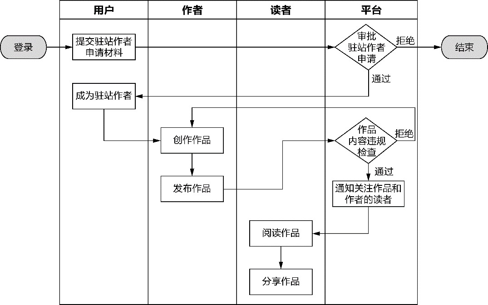

*图6-1 文学平台的业务流程图*

业务流程图更像对真实世界业务执行流程的真实反映，直观地体现了各个角色、部门之间的交流与协作。业务流程图的各个角色（或部门）是平等的，并无主次之分，都是参与流程的协作方。

根据业务流程的分类，一个完整的业务流程可能牵涉到组织内外各种用户角色，组成业务流程的执行活动虽然都是为了最后要满足的业务价值，但在执行环节中的操作目的与意图却不相同。组织内的一些执行步骤对主动发起服务请求的角色而言，甚至是不可见的。一些提供业务支撑或管理意图的执行步骤，可能出现在多个不同的业务流程中。因此，对于一个复杂的业务流程，既要从全景视角体现其完整性，又要准确地划分边界，可以使用服务蓝图来呈现。

以文学平台为例，阅读作品的业务流程涉及的参与角色只有阅读者，属于服务蓝图中的客户角色。在使用服务蓝图表示该业务流程时，不会牵涉到组织内的前台员工和后台员工，自然不会产生与他（她）们的交互。使用服务蓝图表达阅读作品的业务流程如图6-2所示。

服务蓝图从左到右体现了时间因素。倘若两个活动没有明显的时间先后顺序，可以纵向排列，表示二者不分先后，例如“撰写读书笔记”和“标记精彩内容”就没有先后顺序之分。纵向区域根据参与角色的业务目标进行划分，如“决定购买”“加入书架”等活动虽然看起来和阅读无关，但实际上它们为阅读作品这一业务目标提供了必要的执行步骤，离开了“阅读作品”这一业务目标，它们就没有存在的价值了；“评价作品”和“分享作品”具有独立的业务目标，因此它们被分为两个独立的纵向区域，虽然这两个活动与“撰写读书笔记”等活动并无时间先后顺序，但受限于二维图形的表达力，只能横向排列，这时可以辅以箭头来表示流程执行顺序。

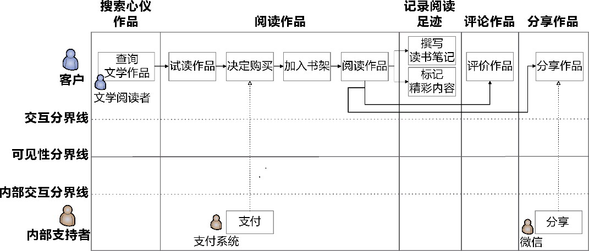

*图6-2 阅读作品的服务蓝图*

在阅读作品的服务蓝图中，只有阅读者参与到了流程中。除此之外，还引入了支持过程。不同于前台员工和后台员工，内部支持者可以是组织内的支持部门，也可以是业务流程提供支持的目标系统自身或外部的伴生系统（参见第8章），如图中的支付系统与微信就属于文学平台的伴生系统。实际上，服务蓝图中的支持行为往往组成了业务流程中的支撑业务流，如图6-2中的支付活动与分享活动其实都是阅读主流程的支撑业务流。

每个业务流程只有一个起点，该起点必然由服务蓝图的客户角色发起服务请求。这意味着，在一张服务蓝图中只能由一个客户参与，它所反映的业务流程其实是一个客户的旅程。以文学创作的业务流程为例，它的服务蓝图如图6-3所示。

交互分界线之外的客户活动都由一个客户执行。注意理解这里提到的一个客户，指的是一个实实在在的人，如果采用了用户画像，就是你从海量真实客户中提炼和刻画出来的有名有姓的虚拟人物，而不是这个人头上戴着的角色帽子。在文学创作的业务流程中，客户可以是托尔斯泰，但他在还没有申请成为驻站作者时，他的角色为注册用户。换言之，参与该业务流程的客户角色包含了注册用户与作者，甚至还可以细粒度地识别出申请人（针对提交申请活动）角色，但参与到业务流程中的客户只是托尔斯泰这个具体的人，就是写出《战争与和平》和《安娜·卡列尼娜》的那个人。

如果目标系统只面向组织用户，根本没有组织外的客户角色参与业务流程，又或者服务蓝图要描绘的业务流程完全属于组织的内部过程，那么，参与服务的员工亦可视为服务蓝图中的客户角色。

服务蓝图中的前台员工与后台员工都属于组织内员工，该如何区分二者的差异呢？关键在于可见性分界线，它恰好隔离了前台员工活动和后台员工活动，意味着前者在幕前发生，后者在幕后发生。这也解释了为何客户不会与后台员工产生行为交互，因为后台员工对客户而言，是完全不可见的。以文学创作流程的服务蓝图为例，审批人对申请的审批就属于后台员工活动，从流程图看，当审批人审批通过申请后，会向申请人发送通知，这也正是图6-3中由“审批申请”到“提交申请”的箭头的含义，但这两个角色并没有直接产生行为交互。与之相对，编辑角色作为前台员工，在咨询和建议时，直接与注册用户和作者发生了对话，形成了可见的协作关系。

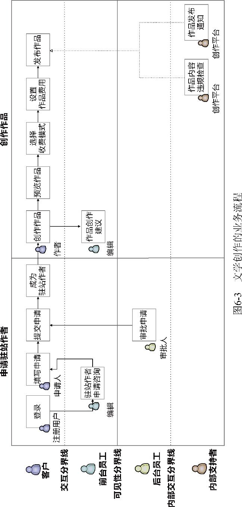

在实际进行业务流程分析时，可以将业务流程图与服务蓝图结合起来，体现不同层次的业务流程。例如，先使用泳道图形式的业务流程图梳理业务流程的总体运行过程，这一总体运行过程对准了价值需求中的系统愿景，再使用服务蓝图进行细化，建立相对独立的体现业务价值的主业务流，以及与之对应的变体业务流和支撑业务流。除了业务流程图与服务蓝图，诸如线框图和UML图中的活动图与序列图都可以表示业务流程，只是表现形式各异，为分析人员提供的观察角度也不尽相同罢了。

### 6.2 业务场景

什么是场景？从字面理解，“场”是时间和空间的概念，“景”是情景和互动。场景就是角色之间为了实现共同的业务目标进行互动的时空背景，通过角色在特定时间、空间内执行的活动来推动情景的发展，形成角色与目标系统之间的体验与互动。当我们用场景来描述业务需求时，可以将体现业务目标的场景称为“业务场景”。在理解业务需求时，业务场景以用户为中心，采用一种身临其境的方式体验用户角色的操作行为。作为通过业务场景体现用户对产品的使用状态的例子，图6-4展示了手机的来电显示界面，左侧为锁屏场景下的来电显示，右侧为未锁屏场景下的来电显示。

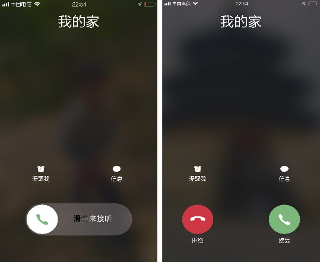

*图6-4 不同场景下的来电显示*

为何需要设计两种不同的来电显示界面呢？因为它们各自体现了不同的用户使用场景。设计者假设用户会将锁屏后的手机放进裤兜，如果仍然通过触碰按钮来接听或拒绝电话，出现误操作的概率要远大于采用滑动接听的方式。

#### 6.2.1 业务场景的5W模型

接听电话的业务场景体现了构成业务场景的5个要素：角色(Who)、时间(When)、空间(Where)、活动(What)和业务目标(Why)：要下班了（时间），我将手机锁屏后放进裤兜（空间），家里人（角色）打来电话（活动），我（角色）拿出手机（活动），通过滑动接听电话（活动），与家里人建立了联系（业务目标）。与之相对的是业务流程，通过服务蓝图也体现了这5个要素，不同之处在于，一个业务流程的不同阶段体现了不同的业务目标。这充分说明：一个动态的业务流程是由一到多个静态的业务场景构成的，业务流程是端对端的完整协作过程，业务场景则是在业务目标的指导下在时间维度对业务流程的纵向切分。

组成业务场景的5个要素恰好构成了图6-5所示的问题描述的5W模型，可以认为它是粒度更细的问题空间。

在一个业务场景中，所有角色执行的活动都是为了满足一个共同的业务目标，这是确定业务场景的关键。业务服务之间的协作存在时间流逝的痕迹，即这些服务在某个时间阶段内通过协作形成了相对完整的执行序列。这些活动都发生在确定的空间范围内，也就是目标系统的系统范围。

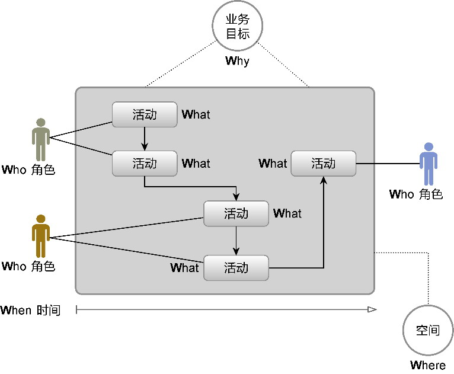

*图6-5 业务场景的5W模型*

只要按照阶段性的业务目标划分业务流程，就可以获得业务场景。以文学创作的业务流程为例，参考该流程的服务蓝图，可以获得如下业务场景：

·驻站作者申请；

·原创作品创作。

业务场景的名称直接体现了该场景的业务目标，参与场景的角色可能存在多个，每个角色为了满足共同的业务目标执行各自的活动。划分业务场景时，活动是业务流程的各个执行步骤，不能直接映射为业务服务。业务服务是组成业务需求的基本业务单元，对它的识别是业务需求分析阶段的关键。

#### 6.2.2 业务服务

分析业务需求时，分析人员往往受困于需求功能层次的界定。例如，Alistair Cockburn就用云朵（或风筝）、海平面和鱼（或蛤）3个层次来展现不同的目标层次^50，分别对应概要层次目标(summary-level goal)、用户目标(user goal)和子功能层次目标(subfunction-level goal)，图6-6阐释了这些目标层次^50。

在Cockburn的隐喻中，海平面是一条可见的分界线，Jeff Patton就说：“一个海平面级别的任务，是指我们会连续完成的、通常在完成之后才去做其他事情的任务。”^88即便如此，在分析业务需求时，分析人员往往难以辨别正确的用户目标层次，因为所谓的“用户目标”会受到不同领域、不同视角的影响，就连Cockburn自己也说：“找出正确的目标层次是关于用例的一个最棘手的问题。”^如图6-6中的注册用户，为何不是用户目标，而被放到海平面之下的子功能层次目标中呢？这是因为在广告和订单领域，注册用户并非市场人员或买家的用户目标。如果切换到身份管理领域，情形就不同了，对于游客角色，注册用户属于可见的用户目标，应该位于海平面。

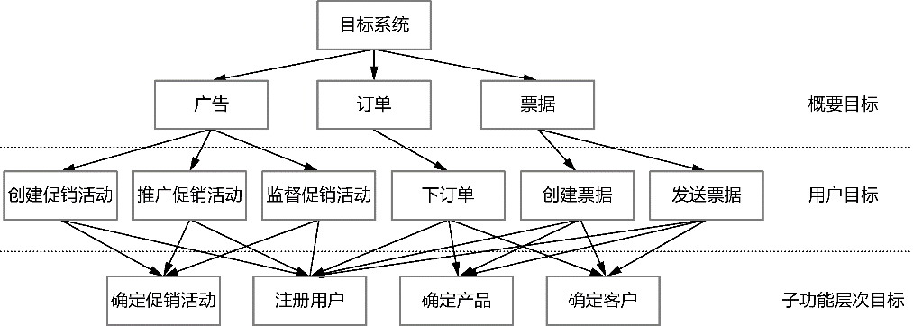

*图6-6 3个目标层次*

如果能够引入相对客观的判断标准作为基本业务单元的划分依据，就能规避主观对层次或目标的判断带来的模棱两可。业务服务解决了这一问题，它是角色主动向目标系统发起服务请求完成的一次完整的功能交互，体现了服务价值的业务行为。业务服务的定义实则包含了3条用于判断的客观标准：服务价值、角色和执行序列。

**1.服务价值**

所谓“服务价值”，就是要站在目标系统的角度，思考它能为执行业务服务的角色提供什么样的服务。服务价值决定了业务服务是否满足角色的服务请求，回答了角色为何要参与该业务服务的原因。例如，“提交订单”是一个具有服务价值的业务服务，如果客户不执行该业务服务，整个购买流程就无法完成；验证订单虽然提供了验证订单有效性的价值，但它对客户而言却是隐藏不知的，因为如果订单为有效订单，那么客户可能不知道在提交订单时还存在这一操作。实际说来，验证订单其实是提交订单的一个执行步骤。

**2.角色**

一个业务服务必须有一个角色作为发起者，它会触发业务请求，通常包括用户(user)、策略(policy)或伴生系统(accompanying system)。

用户是关心业务服务的人或组织（部门），通过执行某个操作触发服务请求，例如发送一条消息、按一个按钮或者输入一个按键。作为角色的策略较为特殊，它属于规则的一种特殊情况，需要通过定时器按照条件定时主动触发，因此也可以认为策略是封装了业务规则的定时器。位于目标系统之外的伴生系统作为角色，也可以主动触发一个业务服务，前提是触发后的执行逻辑属于目标系统的范围。

以电商平台作为目标系统。客户要购买商品，需要通过点击“提交订单”按钮发起提交订单的服务请求，此时的业务服务为“提交订单”，角色为客户用户。客户在提交订单之后，业务规则要求在15分钟内完成订单支付，若按照规则未完成支付请求，系统会自动取消订单，此时的业务服务为“取消订单”，角色为取消订单策略。商家在收到下单通知后，通过进销存系统查看订单详情，此时的业务服务为“查询订单详情”，它会调用目标系统获得订单的详细内容。由于进销存系统在电商平台的范围之外，故而角色为进销存系统。

无论是用户、策略还是伴生系统，要成为业务服务的角色，都必须主动触发服务请求，目标系统响应该请求，执行业务逻辑规定的步骤，直到满足角色的服务价值。触发服务请求的角色也可以是多个，例如取消订单的角色，可以是提交订单的客户，也可以是取消订单策略。

**3.执行序列**

业务服务的执行序列意味着执行的所有步骤都是连续且不可中断的，如此才能完成一次完整的功能交互。考虑顾客在超市购物的业务场景，顾客推着购物车在超市中寻找自己要买的商品，并将它们一一放到购物车，选好商品后推车到收银台结账；收银员扫完所有商品的条形码后，计算出总价；顾客付款，拿好已购商品走出超市，业务场景结束。如果将整个超市视为我们要设计的目标系统，那么目标系统中的角色就是顾客与收银员。

顾客参与的业务服务包括：

·加入购物车；

·付款。

收银员参与的业务服务包括：

·扫描商品条形码；

·收款。

这4个业务服务都是连续且不可中断的完整过程。“加入购物车”与“付款”是两个分开的业务服务，因为顾客有可能在将商品加入购物车后，突然接到一个电话，没有买东西就离开了超市。在收银员的“收款”业务服务中，还有“计算商品总价”“计算商品折扣”“增加会员积分”等操作，但是它们都是连续执行的。收银员计算了商品总价后，如果不执行收款工作，顾客就没法付款，这意味着“收款”才是完整的业务服务，“计算商品总价”只是它的一个执行步骤。

在理解执行序列的完整功能交互时，还需结合需求的业务规则而定。以订单为例，假定业务规则规定，用户在提交订单后必须通过商户对订单进行人工审批，这意味着“提交订单”和“审批订单”的执行序列存在中断，它们是两次独立而完整的功能交互，应各自定义为业务服务；如果审批订单在客户提交订单后由系统按照审批规则自动完成，审批订单就没有发起请求的角色，它就变成了提交订单业务服务的一个执行步骤。

业务服务的上述3个关键要素相辅相成，缺一不可，共同决定了一个业务功能是否是一个正确的业务服务。

为什么引入业务服务

业务服务代表了角色与目标系统的一次交互，它的含义与位于用户目标的系统用例非常相似。那为何我还要引入一个新的概念？

一直以来，通过业务建模进行软件设计都存在一个误区和一个难点。误区在于团队进行需求分析时，没有拎清问题空间与解空间的差异，混淆了问题级需求与方案级需求，也容易让技术实现干扰需求分析。难点在于如何消除需求分析到软件设计的鸿沟，使得需求分析的结果能够作为指导设计的参考。

业务服务规避了用例层次的含混不清，它不看业务功能的粒度和层次，只考虑是否是角色向目标系统发起的一次完整功能交互，并以此作为划分业务服务的标准。这一标准界定的粒度使得问题空间的一个业务服务恰好对应解空间的一个服务契约，即第12章定义的菱形对称架构的北向网关。不仅如此，业务服务还可以帮助确定限界上下文，并通过建立业务服务与限界上下文的映射关系，确定限界上下文之间以及限界上下文与伴生系统之间的协作关系；业务服务规约则为领域建模提供了建模依据，帮助分解任务和明确职责分配，并在通过测试驱动开发进行领域实现建模时，作为识别和编写测试用例的主要参考。换言之，业务服务虽然位于问题空间，但它又成为解空间中架构、设计与编码的核心驱动力。

即使如此，它并没有混淆问题空间和解空间。在识别和细化业务服务时，领域专家并不需要知道解空间的设计要素，只需针对目标系统进行业务需求分析，并遵循统一语言对其进行准确描述即可。

#### 6.2.3 业务服务的识别

要获得业务服务，可以基于业务流程和业务场景，分别梳理执行环节的每个用户活动，然后根据业务服务的3个标准判断并梳理出问题空间的业务服务。表6-1列出了阅读作品和文学创作业务流程中的所有业务服务。

*表6-1 文学平台的业务服务*

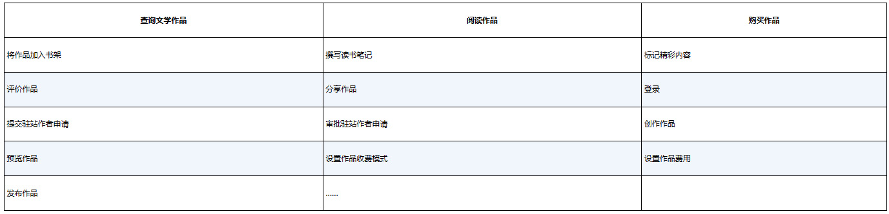

对比表6-1中的业务服务与业务流程图（参见图6-3）中的用户活动，它们存在细微的差异，例如，在图6-3所示的文学创作的业务流程中，包含了“作品内容违规检查”和“作品发布通知”用户活动，然而根据业务服务的判断标准，这两个用户活动只是“发布作品”业务服务执行序列中的执行步骤，不属于业务服务。

#### 6.2.4 业务服务的呈现

业务流程可以通过业务流程图与服务蓝图以可视化协作的形式进行呈现，而业务场景和业务服务的可视化呈现，则借用了UML用例图形式的业务服务图。

**1.业务服务图**

用例图的组成要素与业务场景的5W模型颇为相似，二者形成了如下对应关系。

·参与者：代表了场景5W模型的Who。

·用例：代表了场景5W模型的What。

·用例关系：包括使用、包含、扩展、泛化、特化等关系，其中，使用(use)关系代表了场景5W模型的Why，即用例为参与者提供了价值。

·边界：代表了场景5W模型的Where。

用例图是领域专家与开发团队之间进行沟通的一种可视化手段，它以目标系统为主体边界，例如，以整个文学平台作为主体边界形成的用例图如图6-7所示。

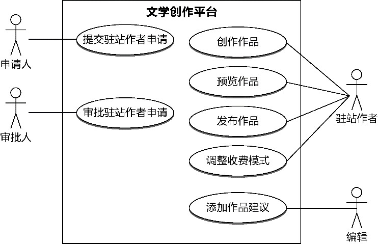

*图6-7 文学平台的用例图*

用例图中的椭圆形本来表示一个系统用例，这里用来表示业务服务。图6-7列出的业务服务仅仅是该平台的“冰山一角”，因为用例图将目标系统看作“能独立对外提供服务的整体”^146，也就是说，整个目标系统是用例图的主体边界。如果目标系统的规模较大，就会形成一个非常庞大的用例图。虽说一图胜千言，但如果图形太过庞大，密密麻麻的连线像一张蜘蛛网一般，带来的可视化效果恐怕还不如诚恳的文本描述。

引入业务场景，可为每个业务场景绘制一个用例图，主体边界就变成了业务场景，如图6-8所示。

图6-8通过业务场景表现主体边界，内部的椭圆呈现了一个个业务服务，可将这样的图称为业务服务图，以示业务服务与用例的区别。注意，业务场景虽然成为业务服务图的主体边界，但业务服务面对的主体仍然为目标系统，否则就有悖于业务服务的本质。

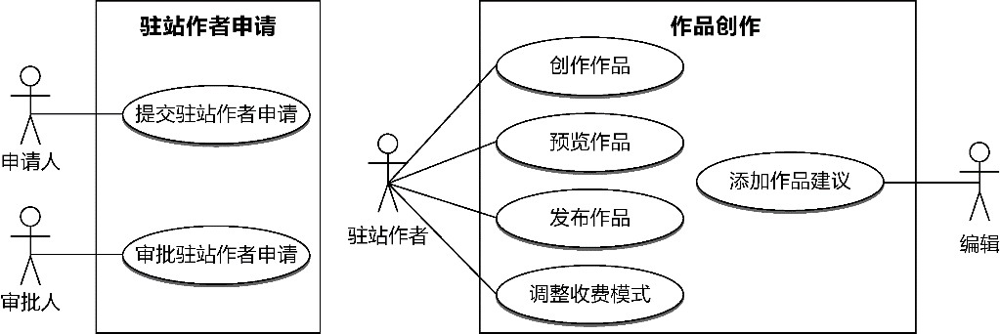

*图6-8 业务服务图*

**2.业务服务规约**

除了可以使用业务服务图对业务服务进行可视化呈现，还可以为其编写文本形式的业务服务规约。为了更好地表现业务服务角色、服务价值和执行序列这3个特征，我糅合了用户故事和用例规约的形式，将业务服务规约分为表6-2所示的组成元素。

*表6-2 业务服务规约的组成元素*

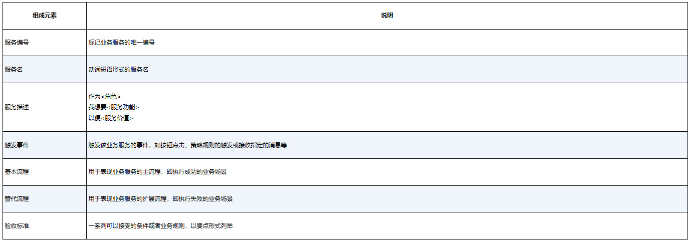

要编写业务服务规约，需要深入业务服务内部，展现它的执行步骤，描述的内容可以作为服务序列图（参见第11章）与领域分析建模（参见第14章）的参考，也是服务驱动设计（参见第16章）进行任务分解的重要输入。在全局分析阶段，为保持对问题空间整体的把握，也为了避免出现分析瘫痪，只需对业务需求细分到业务服务粒度即可。

### 6.3 子领域

当目标系统的问题空间通过业务流程、业务场景和业务服务呈现在团队面前时，问题空间的面貌才变得清晰起来。然而，即使我们将全局分析的粒度控制在业务服务层次，倘若面临一个庞大的问题空间，这些业务单元仍然过散、过细，不利于形成利益相关者、领域专家和开发团队对问题空间的共同理解。

问题空间太大，业务服务又太小，我们需要寻找一个粒度合理的业务单元，一方面降低问题空间规模过大带来的业务复杂度，另一方面帮助领域专家与开发团队更好地把握问题空间而不至于迷失在业务细节中。这个业务单元就是“子领域”。

#### 6.3.1 子领域元模型

经过领域驱动设计十多年的发展，社区就子领域达成了如下共识：

·子领域属于问题空间的范畴；

·子领域用于分辨问题空间的核心问题和次要问题。

为了区分问题空间的核心问题和次要问题，领域驱动设计引入了图6-9所示的元模型。

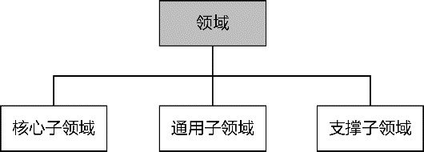

*图6-9 子领域的元模型*

核心子领域是目标系统最为核心的业务资产，体现了目标系统的核心价值。核心子领域体现了问题空间的核心问题，它的成败直接影响了系统愿景，而通用子领域和支撑子领域则体现了问题空间的次要问题，它们包含的内容并非利益相关者的主要关注点：通用子领域包含的内容缺乏领域个性，例如各行各业的领域都需要授权认证、企业组织等业务；支撑子领域包含的内容往往为核心子领域的功能提供了支撑，例如物流系统的路径规划业务需要用到地图服务，则地图功能就属于支撑子领域。

通过判断价值高低可以确定哪些业务属于核心子领域、通用子领域或支撑子领域，它们都很重要，因为缺失了任何一个子领域，目标系统都会变得不完整，没有通用子领域与支撑子领域，核心子领域的功能也无法运行。

子领域的划分并非绝对，对于不同的行业背景、不同的目标系统，对领域核心问题的认识也会随之发生变化。正如前面提及的地图服务，在物流系统中属于支撑子领域，但从地图服务供应商的角度来看，地图服务是供应商的核心竞争力所在，属于其核心子领域。对于专注做授权认证的公司，授权认证业务具有了专有领域的特点，提供了核心价值，应该归属为该公司软件系统的核心子领域。

当我们将问题空间的业务需求划归为核心子领域时，意味着这些业务需求优先级更高，值得投入更多的成本（时间成本、人力成本和资金成本）去实现与完善。Eric Evans甚至建议：“让最有才能的人来开发核心子领域，并据此要求进行相应的招聘。在核心子领域中努力开发能够确保实现系统蓝图的深层模型和柔性设计。仔细判断任何其他部分的投入，看它是否能够支持这个提炼出来的核心。”^280让最有才能的团队成员工作在核心子领域，可能会让那些参与通用子领域与支撑子领域开发的团队成员对自身能力产生怀疑，从而影响团队文化建设。但不可否认，很多企业确实会考虑以购买或外包的方式构建通用子领域与支撑子领域。

为了保证企业的核心竞争力，不仅需要最有才能的团队成员参与开发目标系统的核心子领域，还要改变对它的认识。Scott Millett与Nick Tune就提出将核心子领域当作一款产品而非一个项目来对待^36。这是因为产品需要结合企业战略进行规划，它的功能需要不断演化，属于核心子领域的领域模型也需要不断演进和重构，形成深层模型，作为企业的核心资产来被维护。

全局分析阶段是在确定了目标系统的范围之后才开始确定子领域。我们划分出核心子领域、通用子领域和支撑子领域，其目的是促进团队对问题空间的共同理解，包括确定业务功能的优先级。至于这些子领域该如何构建，选择什么样的解决方案，究竟是购买现有产品还是交给外包团队，诸如此类的问题都属于解空间的内容，通常会在架构映射阶段解决。全局分析阶段要解决的应是子领域的识别与划分。

#### 6.3.2 子领域的划分

划分问题空间的子领域仍然是“分而治之”思想的体现，是控制问题空间复杂度的一种手段。要划分子领域，关键在于确定核心子领域。Eric Evans给出的方法是领域愿景描述(domain vision statement)，即“写一份核心子领域的简短描述以及它将会创造的价值，也就是‘价值主张’”^288。这实际上就是价值需求分析中需要确定的系统愿景，以及组成系统范围的业务目标列表。

价值需求的指引可以帮助团队确定哪些是核心子领域，哪些是通用或支撑子领域。至于问题空间到底该分为哪些子领域，就需要团队对目标系统整体进行探索，然后根据目标系统的功能分类策略对其进行子领域的分解。这些功能分类策略有以下几种。

·业务职能：当目标系统运用于企业的生产和管理时，与目标系统业务有关的职能部门往往会影响目标系统的子领域划分，并形成一种简单的映射关系。

·业务产品：当目标系统为客户提供诸多具有业务价值的产品时，可以按照产品的内容与方向进行子领域划分。

·业务环节：对贯穿目标系统的核心业务流进行阶段划分，然后按照划分出来的每个环节确定子领域。

·业务概念：捕捉目标系统中一目了然的业务概念，将其作为子领域。

如果按照业务职能划分子领域，只需要了解企业的组织结构，就可以轻而易举地获得对应的子领域。例如为一所学校开发一套管理系统，按照学校的业务职能划分，就可以获得教务、学生管理、科研、财务、人事等子领域，这些子领域实际上恰好对应学校的职能部门，如教务处、学生处、科研处、财务处、人事处等。在识别子领域时，需要就目标系统的范围确定组织结构的范围，例如管理系统的范围没有要求支持图书馆的管理，我们就不需要考虑图书馆这一机构，也不会识别出图书馆子领域。

如果按照业务产品划分子领域，就可以确定企业的产品线或业务线，根据描绘出的业务结构得到各个与之对应的子领域。例如，为银行开发网银系统，就可以根据储蓄业务、信用卡业务、理财业务、外汇业务、保险业务等业务产品确定对应的子领域。同理，在确定这些子领域时，也需要界定它是否在目标系统的范围内。

若根据业务环节划分子领域，确定核心业务流就成为重中之重。对一个全景流程而言，一定存在多个明显的时间节点，将流程划分为具有不同目标的业务环节。例如，一个典型的电商平台，买家购买商品的业务流程就是该目标系统的其中一个核心业务流，该业务流明显可以划分为购买、仓储、配送、售后等业务环节。这些业务环节不正好形成了电商平台的子领域吗？

如果要通过捕捉业务概念的方法识别子领域，就需要依靠对问题空间的深刻理解和一种分析中的直觉。寻找的业务概念往往属于人、事、物中的一种，由此形成的子领域其实就是对这些业务概念的管理。例如，当我们想到一款音乐在线平台时，一下子浮现在我们脑海中的业务概念会有哪些？音乐、歌手、直播、电台……这些业务概念是否一目了然呢？当然！根据这些业务概念就能找到与之对应的管理这些业务概念的子领域，如歌手子领域的主要功能，就是对歌手的管理。

划分了子领域后，还需要结合价值需求中的系统愿景判断哪些子领域是核心子领域，哪些子领域是通用或支撑子领域。当然，上述列出的功能分类策略未必能帮助我们穷尽整个问题空间的子领域，但它们确实为子领域的识别提供了不错的参考。识别子领域时，确定核心子领域是关键，也是识别过程的起点。在获得了核心子领域之后，再来通盘考虑这些核心子领域都需要哪些通用功能，又或者针对一个个核心子领域，去寻找与它相关却并非核心关注点的支撑功能，即可获得通用子领域和支撑子领域。

不可否认，划分子领域的过程存在很多经验因素，一个对该行业领域知识了如指掌的领域专家，可以在确定了目标系统的愿景与范围之后，快速地给出一份子领域列表。因此，领域专家的参与就显得至关重要！开发团队要和领域专家协作，把这份可能存在于领域专家脑海中的子领域列表显现出来，然后就子领域的划分、名称和分类进行讨论，一旦确定了子领域，再将之前识别出来的业务服务分配到各个子领域，形成对问题空间的共同理解。

#### 6.3.3 子领域映射图

获得的子领域最好以子领域映射图的形式进行可视化。用整个椭圆形代表目标系统的问题空间，从椭圆中划分出来的每一个区域代表一个子领域。每个子领域标记了它究竟是核心子领域、通用子领域还是支撑子领域。文学平台的子领域映射图如图6-10所示。

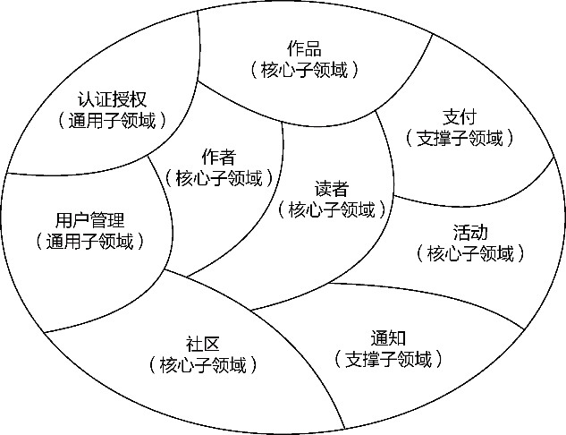

*图6-10 文学平台的子领域映射图*

分析问题空间时，必须从业务角度进行沟通和交流，对子领域的划分也不例外。如果将技术方案带入这个过程中，全局分析就会变味，获得的子领域就会掺杂解决方案的内容，或者干脆受到解决方案的影响，形成一些偏技术的子领域。领域驱动设计统一过程旗帜鲜明地将全局分析阶段划入问题空间的范畴，正是基于这一目的。为了减少技术方案对子领域的影响，可以考虑在划分子领域时，将那些具有技术背景的团队角色（如技术负责人、开发人员）排除在外，只保留领域专家、业务分析师、业务架构师、项目经理和测试人员，除非技术角色能够分清问题空间与解空间的界限。
