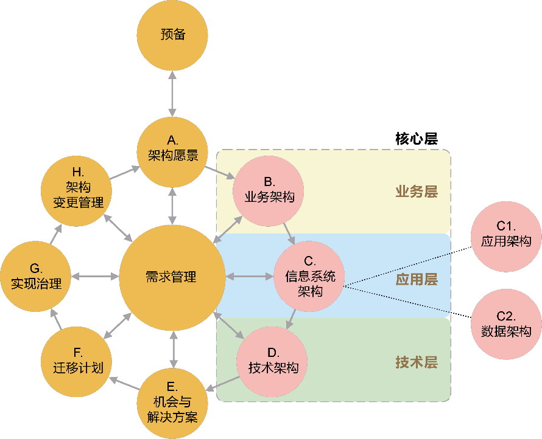
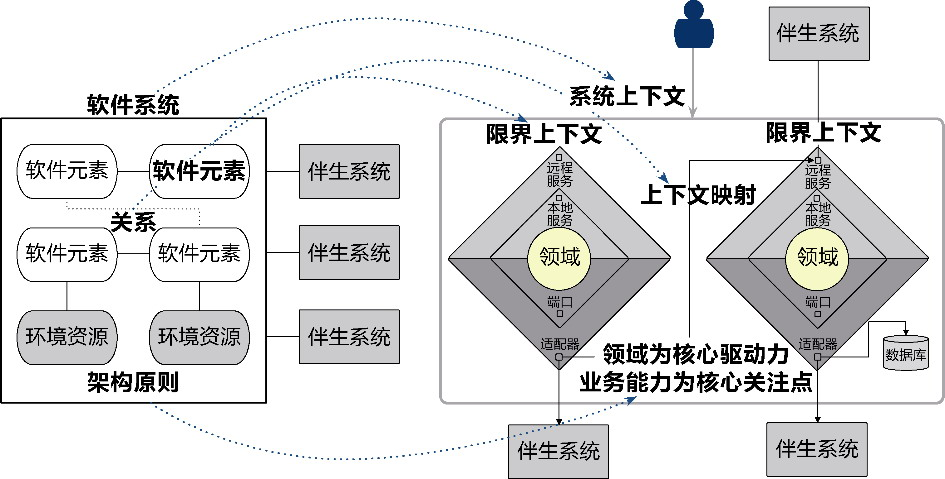
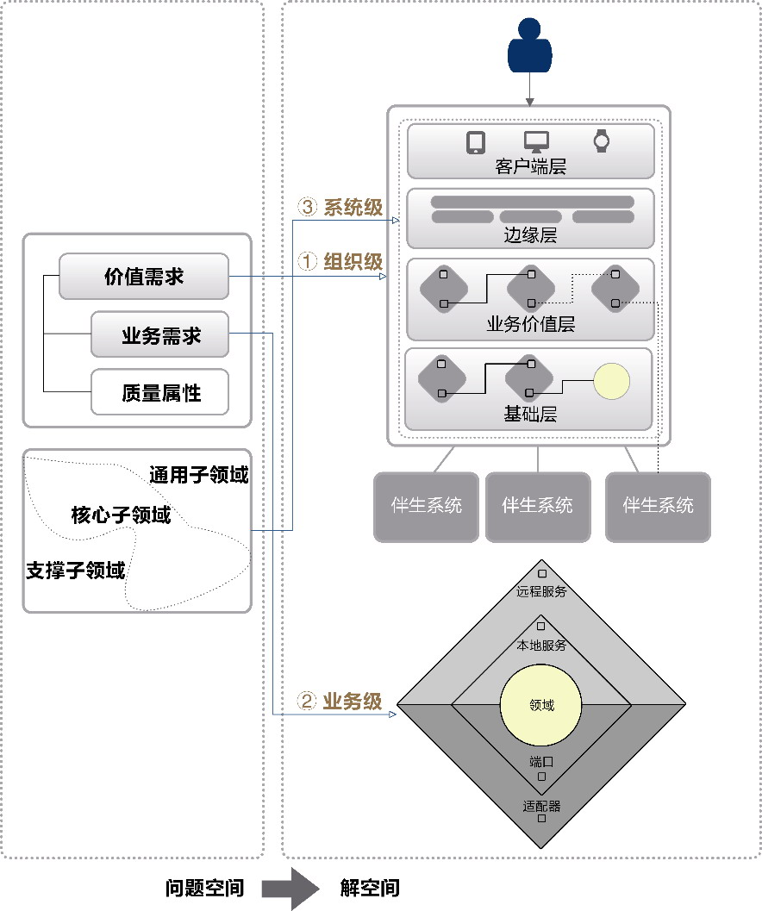
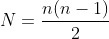
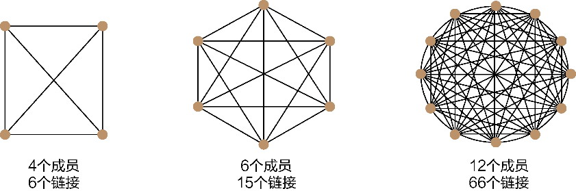
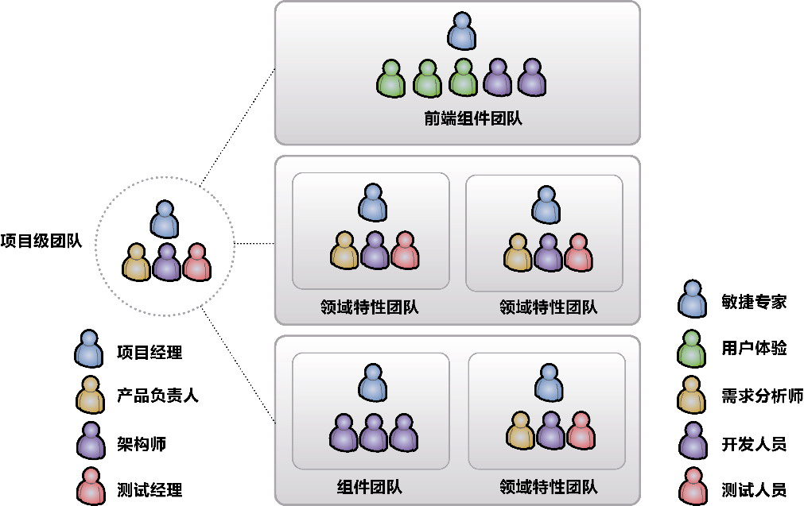

## 第7章 同构系统

> 城堡所在的那处山峰连个影子都望不见，雾霭和黑暗完全吞噬了它，同样地，也不存在哪怕一点点能够昭示出那座巨大城堡所在位置的光亮。

> ——弗兰茨·卡夫卡，《城堡》

对于同一个目标系统，问题空间代表了真实世界的真实系统，解空间是一面镜子，利用求解过程照射的光，将这一真实的系统映成理念世界的虚拟系统。虚拟系统是通过对真实世界的概念进行抽象与提炼获得的：如果求解的光足够明亮，解空间这面镜子足够光滑而平整，映出的虚拟系统就足够逼真。除了系统的本质不同，真实系统和虚拟系统的结构应保持一致，形成两个“同构”的系统。侯世达认为所谓同构系统，就是“两个复杂结构可以互相映射，并且每一个结构的每一部分在另一个结构中都有一个相应的部分”^67，这说明，同构系统的组成部分可以形成一一对应的映射关系，这正是架构映射的存在前提。

在领域驱动设计统一过程的架构映射阶段，不只存在真实系统与虚拟系统这一组同构系统。从问题空间到解空间的架构映射属于领域驱动设计的战略层面，在该层面获得的解决方案通过架构呈现其战略意义。几乎所有设计良好的软件系统的架构都是相似的，它们共同具有的架构之美符合优良架构的定义；反过来，若能在架构设计时遵循优良架构的定义，也能收获设计良好的软件系统。架构定义的概念系统与架构设计的模式系统只有形成同构系统，才能保证架构设计的过程不会偏离架构定义的方向。在领域驱动设计统一过程中，这一组同构系统的映射关系是通过领域驱动架构风格来完成的。

康威定律的定义明确指出团队组织与系统结构互为映射关系，因而我们也可将团队组织形成的管理系统与设计方案形成的架构系统视为一组同构系统。在开篇讲解支撑工作流（参见第3章）时，正是在这一映射关系的作用下，领域驱动设计统一过程对团队管理提出了要求。虽然属于团队管理范畴，但也可以认为这是团队管理对架构设计的一种约束，在架构映射阶段需要考虑这一组同构系统之间的映射关系。

整个架构映射阶段由如下3组同构系统构成。

·架构定义的概念系统与架构设计的模式系统：对应架构映射阶段的概念层次。

·问题空间的真实系统与解空间的软件系统：对应架构映射阶段的设计层次。

·设计方案的架构系统与团队组织的管理系统：对应架构映射阶段的管理层次。

概念层次的同构系统为架构映射建立了理论基础，设计层次的同构系统体现了动态的架构映射过程，而管理层次的同构系统则对映射获得的架构提出了划分软件元素的约束，使得在战略层次（架构层次）对问题空间的求解变得有序而富有指导意义。

“认识到两个已知结构有同构关系，这是知识的一个重要发展——正是这种对于同构的认识在人们的头脑中创造了意义。”^67在我们对问题空间进行求解时，当发现在问题空间中存在一个系统、在解空间也存在一个对应的同构系统的时候，只要确定了二者的映射原则，就可以进行系统的推导。利用同构系统的特征，就可以让战略阶段的求解过程变得更加简单：一旦确定同构系统一侧的组成部分，就能根据映射原则获得另一侧的组成部分。这就好似两个存在映射函数的集合，在已知一个集合的前提下，通过映射函数就能轻而易举获得另一个集合。

### 7.1 概念层次的同构系统

概念层次的同构系统围绕着架构的定义展开映射。在软件领域，架构(architecture)是最引人注目的概念，表达了高层次的设计指引、原则和具体的设计模型。正如Martin Fowler认为的：“无论架构是什么，它都与重要的事物有关。”然而，这一含混不清的定义显然不能让人满意。虽然至今仍然没有一个得到业界公认的架构定义，不过，若能比较一些获得大多数人认可的架构定义，或许能窥见架构定义的基本特征。

#### 7.1.1 架构的定义

IEEE 1471对架构的定义为：“架构是以组件、组件之间的关系、组件与环境之间的关系为内容的某一系统的基本组织结构，以及指导上述内容设计与演化的原则。”^

RUP 4+1视图模型的提出者Philippe Kruchten对架构的定义为：“软件架构包含了关于以下内容的重要决策：软件系统的组织；选择组成系统的结构元素和它们之间的接口，以及当这些元素相互协作时所体现的行为；如何组合这些元素，使它们逐渐合成为更大的子系统；用于指导这个系统组织的架构风格：这些元素以及它们的接口、协作和组合。”^

卡内基·梅隆大学软件工程研究院的Len Bass等人则将架构定义为：“系统的软件架构是对系统进行推演获得的一组结构，每个结构均由软件元素、这些元素的关系以及它们的属性组成。”^4

软件标准组织和架构大师对架构的定义虽然有着不同的表现形式，但它们蕴含的本质特征极为相似，概括而言，一个设计良好的架构应具有如下基本设计要素：

·功能分解的软件元素；

·软件元素之间的关系；

·软件元素与外部环境之间的关系；

·指导架构设计与演化的原则。

架构是解空间控制软件复杂度的核心力量。对解空间进行功能分解，并以一个封装良好的软件元素来表达系统的结构，可以有效地控制软件系统的规模；管理好软件元素之间的关系以及软件元素与外部环境之间的关系，可以保证系统结构的清晰度；无论是软件元素的分解，还是关系的梳理，都需要响应需求的变化并随之对架构进行演化。至于该如何设计、如何演化，不可能给出过于具体的“解题方法”，只能“直指本心”，给出符合软件架构思想的设计原则与演化原则。由是观之：

·软件元素的分解能够有效地控制规模；

·梳理软件元素及外部环境的关系可以清晰结构；

·架构设计与演化原则保证了架构能够响应变化。

显然，架构定义的设计要素实际上是对软件复杂度的一种回答。

然而，这样的架构定义并没有回答以下问题：

·该如何分解软件元素；

·软件元素体现为什么形式；

·该如何梳理关系；

·设计与演化的原则是什么。

这些问题显然不该由一个统一的架构定义来回答。它们甚至没有一个确定的答案，而需要架构师在设计具体系统的架构时，一一做出符合具体系统现状的解答——这是架构师需要面临的挑战。

#### 7.1.2 架构方案的推演

为了让这一挑战变得更加容易，可以在抽象和具体之间寻找到一种平衡的架构设计方法，获得具有指导意义的架构方案。

要取得架构设计方法的平衡，需要弄清楚各种架构之间的关系。TOGAF的架构开发方法(architecture development method，ADM)规划了组成企业架构的内容：业务架构、信息系统架构（分为应用架构和数据架构）和技术架构。它们分别对应架构模型的3个层次：业务层、应用层和技术层，如图7-1所示。

在企业架构中，业务架构“从企业战略出发，按照企业战略设计业务及业务过程；业务过程是需要业务能力支撑的，从战略到业务再到对业务能力的需要，就形成了支持企业战略实现的能力布局”^15。信息系统架构中的数据架构梳理和治理企业数据资产，建立数据标准与数据模型，形成企业全域数据的全生命周期管理；应用架构则描述了各种用于支持业务架构并对数据架构所定义的各种数据进行处理的应用系统；应用系统的划分需要从功能布局的角度支撑业务架构需要提供的业务能力，并就业务能力需要使用的数据进行处理。到了技术架构阶段，就需要将应用架构定义的应用组件映射为对应的技术组件，并从物理层面和逻辑层面对架构进行分解，就技术实现做出设计决策与技术选型。

*图7-1 TOGAF架构开发方法*

运用到体现企业战略规划的企业架构中，3个架构在架构开发方法中存在明显的前后延续关系：业务架构定义业务能力，指导信息系统架构的设计，确定与之对应的数据模型与应用系统；技术架构根据技术参考模型与所处行业的通用技术模型确定融合了业务逻辑与技术实现的解决方案。它们的观察视角自然有所不同，由此也分别形成了不同的架构师角色，各自撷取整体架构景观的一部分，在架构开发方法的指导下进行融合，形成企业架构的解决方案全景图。

如果将企业架构的关注层次从企业下沉到目标系统，要获得目标系统的架构解决方案，仍然需要从业务、数据、应用和技术这4个观察视角来思考系统的整体架构。不同的观察视角可以分离不同的关注点，也可以降低架构设计的复杂度，这是一种行之有效的办法。问题在于：当业务需求发生变化时，如果需要调整目标系统的业务架构，该怎么让数据架构、应用架构和技术架构随之发生的变化降到最少？

当变化不可避免时，一种行之有效的方法是共同顺应变化的方向，如此就能降低变化带来的影响。若能寻找到一种“软件元素”将业务架构与应用架构绑定起来，就能让它们共同顺应业务需求变化的方向。在领域驱动设计中，这样的软件元素就是限界上下文（参见第9章）。

限界上下文是根据领域知识语境对业务进行的功能分解，体现了独立的业务能力。作为一个表达业务能力的自治架构单元，它可以在业务架构中维护业务的边界。同时，它又通过对应用架构的纵向切分来支持业务能力，使得业务架构的业务边界与应用架构的应用边界保持一定的重叠，遵守相同的边界划分原则，完成对业务架构与应用架构之间的绑定。我们通过限界上下文获得组成业务架构的软件元素时，实际上已经同步地获得了应用架构的应用系统，保证了二者的同步演进。

限界上下文通过领域模型表达领域知识，它的边界实则是领域的知识语境。在知识语境的边界内，通过领域模型定义数据架构的数据模型，形成从领域模型到数据模型的映射关系，就能将数据模型的变化控制在限界上下文的业务边界中，保证数据架构与业务架构的同步演进，提高数据架构响应业务需求变化的能力。

业务、应用和数据都以限界上下文为边界构成其架构的软件元素，就能确保业务架构、应用架构和数据架构遵循一致的业务变化方向。

考虑到业务复杂度与技术复杂度的成因不同，我们无法将目标系统的技术架构也绑定到业务架构上。既然无法建立一致的绑定关系，就需要从解耦的角度分离二者，让业务需求谨慎地与具体的技术因素保持距离。领域驱动设计统一过程通过在限界上下文内部建立的菱形对称架构（参见第12章），清晰地划分了业务逻辑与技术实现的边界，确定了业务与技术在架构层次的正交关系，使得引起业务架构与技术架构变化的原因被分离开，形成了两种架构之间的松耦合。同时，从复用和变化的角度对技术关注点进行横向切分，形成由业务价值层(value-added layer)、基础层(foundation layer)、边缘层(edge layer)和客户端层(client layer)组成的系统分层架构(system layered architecture)。

#### 7.1.3 领域驱动架构风格

构建在限界上下文之上的系统体现了一种相同的架构风格，我将其称为领域驱动架构风格(domain-driven architectural style)。该架构风格由领域驱动设计元模型中用于解空间战略设计的模式构成，规范了目标系统架构的设计，定义了指导架构演进的原则。由该架构风格形成的模式系统做到了对抽象的架构定义的具体化：

·通过限界上下文划分软件元素；

·通过限界上下文的菱形对称架构管理软件元素之间的关系；

·通过系统上下文界定软件元素与外部环境中伴生系统的关系，通过菱形对称架构与系统分层架构管理软件元素与环境资源之间的关系；

·确立以领域为核心驱动力、业务能力为核心关注点作为指导架构设计与演化的原则。

由此形成了图7-2所示的架构定义的概念系统与架构设计的模式系统之间的映射关系。

整个目标系统的解空间分为系统上下文与限界上下文两个层次。系统上下文层次界定了目标系统与伴生系统之间的关系，通过系统分层架构模式进行约束；限界上下文体现了领域模型和业务能力的边界，通过菱形对称架构模式进行约束。它们同指导设计与演化的架构原则共同组成了领域驱动架构风格的模式系统。

从抽象的架构定义映射为具体的领域驱动架构风格，就在抽象和具体之间找到了架构设计方法的平衡，形成了一种固化的架构映射规范，作为在设计层次将问题空间映射到解空间形成架构解决方案的设计指导。

*图7-2 概念层次的同构系统*

### 7.2 设计层次的同构系统

对问题空间的求解，就是从问题空间跨入解空间，形成能够满足价值需求与业务需求的架构方案。遵循领域驱动架构风格，可以尝试将问题空间的价值需求与业务需求分别映射为构成领域驱动架构风格的设计要素。

首先，价值需求以组织为视角分析了目标系统的愿景与范围，形成以系统上下文为核心的组织级映射；其次，业务需求的业务服务以目标系统为视角体现了具体的业务功能，形成以限界上下文与菱形对称架构为核心的业务级映射；最后，业务需求对子领域的划分从业务价值的角度确定了各个业务功能所处的层次，形成以系统分层架构为核心的系统级映射。组织、业务和系统3个层次映射的结果共同构成了解空间的架构方案，形成了设计层次的同构系统，即问题空间的真实系统与解空间的软件系统。

两个同构系统的映射关系蕴含了不断细化与深入的动态映射过程，该过程如图7-3所示。整个映射过程根据不同层次分为3个步骤。

·组织级映射：站在整个组织的高度，通过全局分析阶段输出的价值需求确定组织级的系统上下文。

·业务级映射：通过全局分析阶段输出的业务需求，根据业务相关性对业务服务进行归类与归纳，识别出边界合理的限界上下文，并为其建立菱形对称架构。

·系统级映射：进入系统内部，在全局分析阶段划分的子领域指导下，建立系统分层架构，将属于核心子领域的限界上下文映射为业务价值层，将通用子领域和支撑子领域的限界上下文映射为基础层，并确定它们之间协作的上下文映射模式，定义服务契约。

*图7-3 设计层次的同构系统*

这3个步骤实则就是领域驱动设计统一过程架构映射阶段的3个核心工作流。

架构映射过程实则借鉴了数学思维中的问题求解思路：将需要求解的问题当作未知内容，针对问题，层层逆推，寻找更小的未知问题，直到能够根据现有的已知内容求解。此时，目标系统的架构解决方案就呼之欲出了。

让我们一起来推演一下对问题层层逆推的过程。“如何获得问题空间的架构方案”是团队需要求解的问题，解决该问题的前提在于以下两个问题。

·待求解的问题空间是什么？

·问题空间与解空间架构方案的关系是什么？

逆推获得了这两个问题后，我们分别求解。

价值需求与业务需求相对完整地反映了问题空间，因此，第一个问题在全局分析阶段已经得到了解决。对于第二个问题，我们通过概念层次的同构系统建立的架构映射规范，确定了由系统上下文、限界上下文、菱形对称架构和系统分层架构组成的领域驱动架构风格。该风格构成了解空间的架构方案，并与构成问题空间的价值需求和业务需求形成映射关系。一旦建立了映射关系，第二个问题就转换为如下几个问题。

·如何通过价值需求获得组织级的系统上下文？

·如何通过业务需求获得业务级的限界上下文，并确定菱形对称架构？

·如何通过子领域获得系统分层架构？

对目标系统进行架构设计是一个发散的问题，而问题空间与解空间的架构映射关系就像一片棱镜膜，对这一发散的问题进行了适度的收敛。收敛后的3个问题更为具体，在问题空间已经确定的前提下，更容易得出领域驱动架构风格，这也说明了全局分析阶段与架构映射阶段之间具有延续性。对这3个问题的求解，也是架构映射阶段主要讨论的内容。

### 7.3 管理层次的同构系统

管理层次的同构系统是对康威定律的一种解释。架构设计的目标系统投影在设计方案上，形成了架构系统，在领域驱动设计中，它的基本构成单元就是代表软件元素的限界上下文；投影在组织结构上，就形成了管理系统，它的基本构成单元则为开发该限界上下文的团队。为了满足团队的高效开发需求，在将架构系统映射为管理系统时，必须考虑交流与协作的成本，组建的团队需要符合领域驱动设计统一过程中团队管理支撑工作流的要求。

#### 7.3.1 组建团队的原则

要符合团队管理支撑工作流的要求，首先需要考虑团队的规模。一个理想的开发团队规模最好能符合亚马逊公司创始人Jeff Bezos提出的“Two-Pizza Teams规则”，即2PTs规则。该规则认为“如果两个比萨都不能喂饱一个团队的成员，那这个团队的规模就太大了”。大体而言，2PTs规则就是要将团队成员人数控制在5～9人，以形成一个高效沟通的小团队。

2PTs规则自有其科学依据。哈佛心理学教授J. Richard Hackman提出了“链接管理”(link management)的想法。所谓“链接”(link)，就是人与人之间的沟通，链接数N遵循如下公式（其中n为团队的人数）：

链接的数量直接决定了沟通的成本：4个成员的团队，链接数为6；6个成员的团队，链接数增长到15；6个成员团队的规模再翻倍，链接数就会陡增至66。图7-4直观地展现了链接数增长带来的沟通障碍。

*图7-4 沟通的成本*

随着沟通成本的增加，团队的适应性也会下降。Jim Highsmith认为：“最佳的单节点（你可以想象成是通信网络中可以唯一定位的人或群体）链接数是一个比较小的值，它不太容易受网络规模的影响。即使网络变大，节点数量增加，每个节点所拥有的链接数量也一定保持着相对稳定的状态。”^要做到人数增加不影响到链接数，就是要找到这个节点网络中的最佳沟通数量，这正是2PTs规则的科学依据。

控制了团队规模，并不能完全解决沟通问题。如果划分权责不当，即使遵循了2PTs规则，交流不畅的现象依然存在。Edsger Wybe Dijkstra就程序员的分工问题举了一个非常贴切的例子^：

假设有3位住在不同城市的作曲家，决定共同谱写一首弦乐四重奏。一种分工方式是你写第一乐章、我写慢板乐章、他写终曲。另一种方式是你写第一小提琴，我写大提琴，他写中提琴。如果是后一种划分，作曲家们就需要进行大量的沟通。这个例子很好地说明了实用与不实用的劳动分工。程序员必须考虑到这一点。

按照曲谱篇章分工的方式，实际上就是按照特性来组织软件开发团队，这种团队被称为“特性团队”(feature team)；按照乐器分工的方式，那就是按照成员的专业技能划分团队，这样的团队被称为“组件团队”(component team)。

组件团队强调专业技能与功能的复用，例如熟练掌握数据库开发技能的成员组建一个数据库团队、深谙前端框架的成员组建一个前端开发团队。这种团队组织模式强调专业的事情交给专业的人去做，可以更好地发挥每个人的技能特长，保持技术学习的专注度，然而短处是团队成员业务知识的缺失、对客户价值的漠视。

还有一种特殊的组件团队，它按照团队成员的职能而非专业技能组织团队，如业务分析人员组成业务团队，开发人员组成开发团队，测试人员组成测试团队，甚至还有专门的文档团队。这种团队可以被称为“单一功能的组件团队”。职能的划分往往意味着企业组织结构的部门分解，如开发部、测试部、业务分析部等，这种团队组织模式往往与企业组织结构匹配，适合人力资源的日常管理，故而在许多大型组织中屡见不鲜。

开发一个完整特性，需要协调参与该特性开发的多个组件团队；从业务分析到最后发布该特性，又需要协调多个单一功能的团队，从而导致团队之间的交流频繁发生，造成交流成本的增加。当业务变更发生时，更是一场灾难！例如，当客户提出需要调整用户信息的一个字段，需要业务团队协调开发团队与测试团队讨论这一变更，再由开发团队修改代码，测试团队修改测试用例。开发团队了解到这一业务变更后，还需要协调数据库组件团队、业务组件团队和前端组件团队，分别对数据表、领域模型和视图模型进行修改。完成修改后，还要通知测试团队对该修改进行测试。倘若测试团队又分为集成测试团队、系统测试团队等组件团队，又需要协调这些测试组件团队的工作。倘若这样的团队还分处不同城市，且包含了来自不同供应商组成的外包团队，可以想象这样的场景会是多么糟糕！

特性团队就能规避不必要的跨团队沟通与交流。大力推进特性团队建设的爱立信公司在一份报告中指出：“特性是我们开发并交付给客户功能的自然构成单位，是团队理想的任务。在给定时间、质量标准和预算范围内，特性团队将负责把这一特性交付给客户。特性团队必须是跨专业功能的，因为工作范围需要涵盖从联系客户到系统测试的各个阶段，并且包含系统中所有受特性影响的领域（跨组件领域）。”

这一定义说明了特性团队是一个交付领域特性的跨功能团队，它将需求分析、架构设计、开发测试等多个角色糅合在一起，且包含了该领域特性所需的专业领域的专家，不同角色共同协作实现该领域特性的完整的端对端开发。注意，特性团队并未要求其成员是通才型的全栈工程师，毕竟术业有专攻，在学习精力和时间有限的情况下，只要保证该特性团队作为一个整体能够打通软件开发的全栈即可。Craig Larman总结了一个理想特性团队的特征：

·长期存在，即团队凝聚成一体以取得较高的绩效，不间断地负责新特性的开发；

·跨专业功能、跨组件；

·同地协作；

·横跨所有组件和科目（分析、编程、测试等），共同开发一个完整的以客户为中心的特性；

·有许多通用型专家组成；

·在Scrum中团队人数通常为7±2人。

特性团队的人数特征满足了2PTs规则，以特性进行分工的特征也符合限界上下文作为控制领域模型的业务边界的要求，也就是说特性团队与限界上下文之间存在映射关系。一旦确定限界上下文，就等同于确定了特性团队的工作边界；确定了限界上下文之间的关系，也就意味着确定了特性团队之间的合作模式，反之亦然。在领域驱动设计统一过程中，为了凸显面向领域的特征，我们可以将满足2PTs原则的特性团队称为领域特性团队。

#### 7.3.2 康威定律的运用

遵循领域驱动架构风格，目标系统的系统分层架构自底向上分别由基础层、业务价值层、边缘层和客户端层构成。根据康威定律，基础层的限界上下文取决于上下文映射模式，可映射为管理系统的组件团队或领域特性团队；业务价值层由限界上下文体现纵向的业务能力，故而映射为管理系统的领域特性团队；边缘层与客户端层主要面向客户，是站在客户体验的角度思考功能的划分，需要的技能主要为前端开发的单一技能，故而映射为管理系统的前端组件团队。根据这样的映射关系，就可获得对应的团队组织结构，如图7-5所示。

*图7-5 团队组织结构*

按照领域特性组建团队可以使同一个限界上下文的团队成员沟通更加顺畅，因为领域特性团队共享了该限界上下文的领域知识。倘若位于基础层的通用型限界上下文或支撑型限界上下文为目标系统提供了专有功能，需要具有专门知识去解决那些公共型的基础问题，也可以为其建立专门的组件团队。
