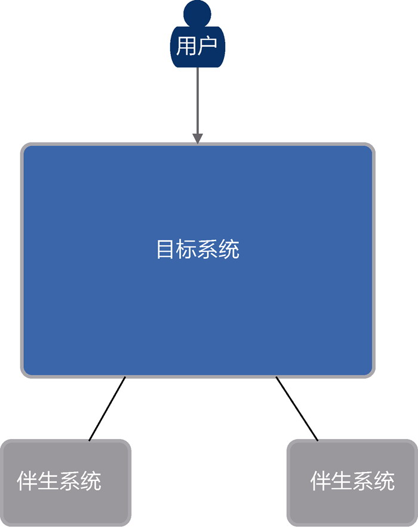
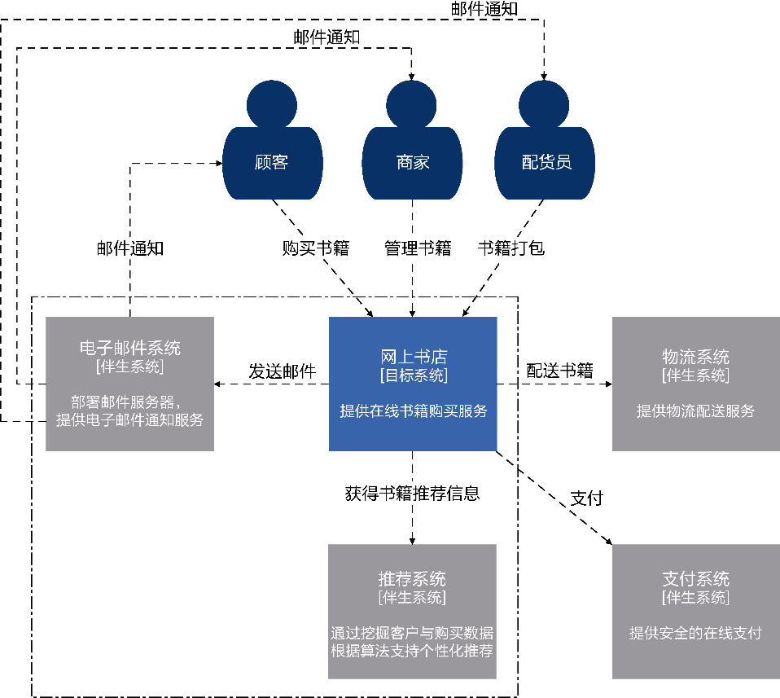
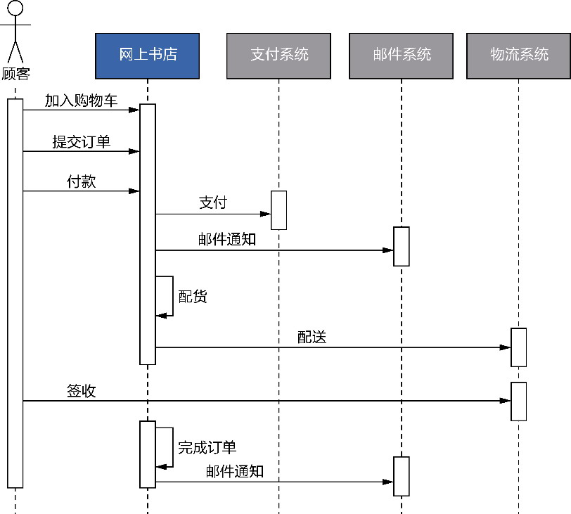

## 第8章 系统上下文

> 所有系统都有边界（可能宇宙是个例外）。

> ——Edward Crawley、Bruce Cameron和Daniel Selva，《系统架构：复杂系统的产品设计与开发》

软件系统当然不是无边无际的，却往往没有定义清晰的边界。每个人心中都有一个自己定义的系统边界，这种“自以为是”让人失去了探索外界的好奇心。系统之外到底还有什么呢？仿佛边界是一堵墙，只需轻身一攀，就能看清系统内外的风景，心里觉得触手可及，也就不再迫切探寻了。殊不知我们以为明确存在的边界并非那么清晰。谁都以为系统边界已经确定，所以谁也不曾想到要去证明边界的存在，或者去追问它有没有清晰地显现。

### 8.1 “系统内”和“系统外”

系统边界总这样含糊不清地存在着：开发团队嘴里说着“系统”，其实连系统的范围到底有哪些都语焉不详。这是许多软件项目的真实状况。侯世达剖析了更为普遍的状况。他认为，出现这种情况要么是因为无人意识到这是一个系统，要么是因为每个人对系统边界的定义并不相同。他举了一个生动的例子^51：

假设一个人A正在看电视，另一个人B进了屋子，并且明显地表示不喜欢当时的状况。A可能认为自己理解了问题的所在，并且试图通过从当前系统（那时的电视节目）退出来改变现状，于是A轻轻按了一下频道按钮，找一个好一点儿的节目。不过B可能对于什么是“退出系统”有更极端的概念——把电视机关掉！当然也有这种情况：只有极少数的人有那种眼光，看出一个支配着许多人生活的系统，而以前却从来没有人认为这是一个系统。

A和B对系统的理解完全不一样，甚至可能A并没有认识到这是一个系统。让我们把侯世达描绘的场景搬到软件开发领域：

假设一个软件团队成员A正在进行架构设计，绘制了漂亮的框图表现各个业务功能与基础模块之间的关系，成员B与之沟通，并且明显地表示不喜欢当时的架构设计。A可能认为自己理解了问题的所在，并且试图通过调整架构的软件元素来改变这个现状，于是他轻轻拖了一下鼠标，调整了架构中模块的位置。不过B可能对于架构的调整有更极端的概念——把调整的模块删掉！

你以为这是一个虚拟的场景吗？并非如此！

一家运营商想要创建一个针对全网的端到端检测系统，以发挥开发运营一体化的优势。该系统希望覆盖全国所有省（自治区、直辖市）网点，部署硬探针实时采集各网点的数据，以支持业务数据分析的需求。系统由整个集团组建开发团队，建立全国统一的平台。在开发团队对该系统进行架构设计时，我作为咨询师被邀请参与了对该架构的咨询。在了解系统需求后，我评审了他们初步给出的系统架构，对数据采集模块提出了我的疑问：数据采集模块需要接入全国各省（自治区、直辖市）网点，由于各网点存在多套硬探针系统，数据协议和接口皆不一致，该如何实现不同系统的实时数据采集？

我的疑问提醒了团队：究竟是由集团定义数据采集的规范与协议，各网点负责部署硬探针实现自己的采集功能，并按照集团规定的协议与规范推送到系统；还是将各网点的数据采集纳入系统范围内，作为系统的一部分功能？显然，团队还未考虑到这一点。换言之，网点数据采集模块是否属于系统的边界之内，仍然处于含糊不清的状态。团队对系统的理解存在分歧，在我提出这个问题之前，团队成员甚至还未认识到系统边界并未确定。

侯世达提到：“在人类的日常事务经验中，几乎不可能将‘在系统之内’和‘在系统之外’清楚地区别开，生活是由许多连接并交织又常常不协调的‘系统’组成的，用‘系统内’‘系统外’这类词汇来思考似乎过于简单化了”^52。在架构映射阶段，我们不能想当然地认为团队成员都理解了系统的意义，并能清楚地区分系统内和系统外。这就解释了为何要为软件系统引入系统上下文。

### 8.2 系统上下文

系统上下文(system context)属于Simon Brown提出的C4模型，该模型“通过在不同的抽象层次上重新定义方块和虚线框的含义来将我们的表达限制在一个抽象层次上，从而避免在表达的时候产生抽象层次混乱的问题”。不同的抽象层次关注点不同，需要考虑的细节也有所不同。

系统上下文代表了目标系统的解空间。要注意，问题空间和解空间的边界并不一定完全重叠。在确定系统上下文时，可以从目标系统向外延伸，寻找那些虽然不是本系统的部件，却对系统的价值体现具有重要意义的对象：这些对象就是目标系统范围之外的伴生系统(accompanying system)^75。伴生系统位于系统上下文的边界之外，但它提供的功能可能属于问题空间的业务需求范畴。

#### 8.2.1 伴生系统

伴生系统的类型直接影响了目标系统与伴生系统的协作。如果目标系统与伴生系统对应的团队处于同一组织下，就有了紧密协作的可能，目标系统所在的团队甚至可以与伴生系统共同协商接口的定义；如果伴生系统是对外采购的外部系统，我们作为采购方，就具有一定的控制权，可以决定选择哪一款系统，这一决定可以作为架构决策的一部分。

了解伴生系统的状态也很重要。如果伴生系统是已经在生产环境中运行的现有系统或遗留系统，对伴生系统提出改进要求就几乎不可行，我们只能被动地做出决策，如通过了解它对外公开的接口与通信协议，以确定目标系统与伴生系统之间的交互形式。倘若伴生系统也处于开发过程中（通常在这种情形下，伴生系统的开发团队属于同一组织），目标系统的开发团队就应该尝试与之建立良好的协作与交流机制，共同协商接口以及集成方式，讨论和确定合理的发布计划。

#### 8.2.2 系统上下文图

可以通过系统上下文图表示系统上下文。在系统上下文图中，两种颜色的框图各自代表目标系统和伴生系统，整个系统上下文图如图8-1所示，以目标系统为核心，勾勒出用户、目标系统和伴生系统之间的关系。

系统上下文图不会展现目标系统的细节，目标系统是一个黑箱，代表解空间的边界，环绕在解空间边界之外的是目标系统的外围环境，如此即可直观地体现“系统内”与“系统外”的内涵与外延。

绘制系统上下文图时，需要弄明白目标系统与伴生系统之间的依赖方向。北向依赖意味着伴生系统会调用目标系统的服务，需要考虑目标系统定义了什么样的服务契约；南向依赖意味着目标系统调用伴生系统的服务，需要了解伴生系统定义的接口、调用方式、通信机制，甚至判断当伴生系统出现故障时，目标系统该如何处理。

*图8-1 系统上下文图*

### 8.3 系统上下文的确定

全局分析阶段输出的价值需求有助于确定系统上下文。

#### 8.3.1 参考价值需求

价值需求中的利益相关者可以充当系统上下文的用户，系统范围可以帮助界定系统解空间的边界，分辨哪些功能属于目标系统，哪些属于伴生系统，也就是区分“系统内”和“系统外”。对解空间边界的确定还需要结合系统愿景进行判断，因为在进行设计决策时，与系统愿景不相匹配的功能往往不会作为目标系统的核心功能，如果构建成本太高，就可能优先考虑购买。

以一家经营网上书店的企业为例。企业的战略目标是拓展线上销售。为了满足这一战略目标，要求开发一个个性书店系统。该系统的愿景是为顾客提供个性化的购书体验，以达到提高在线销售量的目的；系统范围主要包括在线销售与售后服务；顾客、商家和配货员是该系统的利益相关者。

根据企业当前的业务生态与运行状况，结合目标系统的愿景和范围，明确推荐、支付和配送属于目标系统之外的伴生系统。推荐功能由推荐系统提供，作为企业内的系统由另一个团队负责开发和运营维护，在获取顾客的购买偏好与个性特征后，结合大数据建立推荐算法模型，提供高匹配度的图书推荐服务；支付功能与配送功能分别由企业外部的第三方支付系统和物流系统提供服务。由此确定了用户、目标系统和伴生系统之间的关系，绘制图8-2所示的系统上下文图。

*图8-2 网上书店的系统上下文图*

#### 8.3.2 业务序列图

系统上下文图虽然直观体现了企业级的利益相关者、目标系统和伴生系统之间的关系，但它主要体现的是这些参与对象的静态视图。要展现目标系统与伴生系统之间的动态协作关系，可以引入业务序列图。

业务序列图实际脱胎于UML的序列图。序列图可以从左侧的角色开始，体现消息传递的次序。这隐含了一种驱动力：我们每次从左侧的参与对象开始，寻找与之直接协作的执行步骤，然后层层递进地推导出整个完整的协作流程。

倘若将序列图用于企业级的系统抽象层次，就可以通过它直观地表示利益相关人员、目标系统和伴生系统之间的协作顺序，以一种运动的态势展现价值流阶段。这就形成了业务序列图^101。

绘制业务序列图时，参与协作的系统是一个完整的整体，所以我们不需要也不应该考虑参与系统的内部实现细节。序列图上的消息代表的不是数据之间的流动，而是参与系统承担的职责。以顾客购买书籍为例，其业务序列图如图8-3所示。

*图8-3 顾客购买书籍的业务序列图*

无论是系统上下文图还是业务序列图，核心的目标都是明确目标系统解空间的范围，也就是勾勒出界定系统外与系统内的那条边界线。在确定了解空间的范围后，目标系统就固定下来，由系统上下文明确它与利益相关者、伴生系统之间的关系，以便正确地建立目标系统位于解空间的架构。
