## 第9章 限界上下文

> 细胞之所以能够存在，是因为细胞膜限定了什么在细胞内，什么在细胞外，并且确定了什么物质可以通过细胞膜。

> ——Eric Evans，《领域驱动设计》

我曾经有机会向事件风暴的提出者Alberto Brandolini请教他对限界上下文的理解。他做了一个非常精彩的总结：“限界上下文意味着安全。”我问他安全应做何解？他解释说：“安全在于控制，不会带来惊讶。”控制，意味着目标系统的架构与组织结构是可控的；没有惊讶，虽然显得不够浪漫，却能让团队避免过大的压力。正如Alberto进一步告诉我的：“出乎意料的惊讶会导致压力，而压力就会使得团队疲于加班，缺少学习。”

这当然是真正看清限界上下文本质的高论！然而曲高和寡，这一理解并不能解除我们对限界上下文的困惑。虽说限界上下文的重要性无须多言，随着微服务的兴起，限界上下文更是被拔高到战略设计的核心地位，也成了连接问题空间与解空间的重要桥梁，但不可否认，一方面，领域驱动设计社区纷纷发声强调它的重要性；另一方面，还有很多人依旧弄不清楚限界上下文到底是什么。

### 9.1 限界上下文的定义

什么是限界上下文(bounded context)？我认为，要明确限界上下文的定义，需要从“限界”与“上下文”这两个词的含义来理解。上下文表现了业务流程的场景片段，整个业务流程由诸多具有时序的活动组成，随着流程的进行，不同的活动需要不同的角色参与，并导致上下文因为某个活动的执行发生切换，形成了场景的边界。因而，上下文其实是动态的业务流程被边界静态切分的产物。

假设有这样一个业务场景：我作为一名咨询师从成都出发前往深圳为客户做领域驱动设计的咨询。无论是从家乘坐地铁到达成都双流机场，还是乘坐飞机到达深圳宝安机场，抑或从宝安机场乘坐出租车到达酒店，我的身份都是一名乘客，虽然因为交通工具的不同，我参与的活动也不尽相同，但无论是上车下车，还是办理登机手续、安检、登机以及下机等活动，都与交通出行有关。

那么，我坐在交通工具上，是否就一定代表我属于这个上下文？未必！注意，其实交通出行上下文模糊了“我”而强调了“乘客”这个概念。这一概念代表了参与到该上下文的“角色”，或者说“身份”。我坐在飞机上，忽然想起给客户提供的咨询方案有待完善，于是拿出电脑，在万米高空完善我的领域驱动设计咨询方案。此时的我虽然还在飞机上，身份却切换成了一名咨询师，执行的业务活动也与咨询内容有关，当前的上下文也就从出行上下文切换为咨询上下文。

当我作为乘客乘坐出租车前往酒店，并至前台办理入住手续时，我又“撕下了乘客的面具”，摇身一变成为酒店上下文的宾客角色，当前的上下文随之切换为住宿上下文。次日清晨，我离开酒店前往客户公司。随着我走出酒店这一活动的发生，住宿上下文又切换回交通出行。我到达客户所在地开始以一名咨询师身份与客户团队交谈，了解他们的咨询目标与现有痛点，制订咨询计划与方案，并与客户一起评审咨询方案，于是，当前的上下文又切换为咨询上下文了。

无论是交通出行还是入住酒店，都需要支付费用。支付的费用虽然不同，支付的行为也有所差别，需要用到的领域知识却是相同的，因此支付活动又可以归为支付上下文。

上下文在流程中的切换犹如同一个演员在不同电影扮演了不同的角色，参与了不同的活动。由于活动的目标发生了改变，履行的职责亦有所不同。上述场景如图9-1所示。

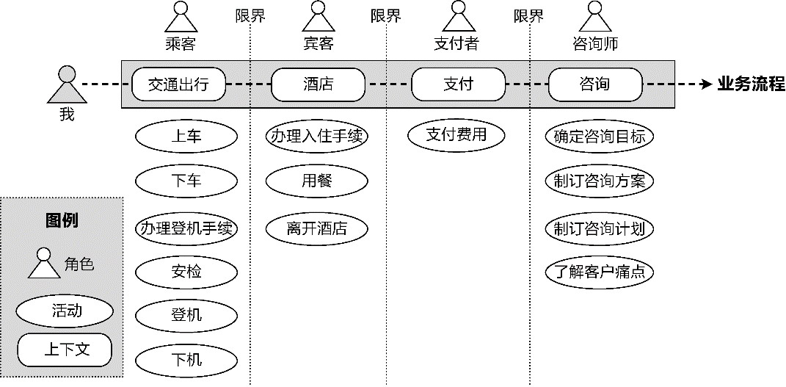

*图9-1 咨询活动的上下文切换*

每个限界上下文提供了不同的业务能力，以满足当前上下文中各个角色的目标。这些角色只会执行满足当前限界上下文业务能力的活动，因为限界上下文划定了领域知识的边界，不同的限界上下文需要不同的领域知识，形成了各自的知识语境。业务能力与领域知识存在业务相关性，要提供该业务能力，需要具备对应的领域知识。领域知识由限界上下文的领域对象所拥有，或者说，这些领域对象共同提供了符合当前知识语境的业务能力，并被分散到对象扮演的各个角色之上，由角色履行的活动来体现。如果该角色执行该活动却不具备对应的领域知识，说明对活动的分配不合理；如果该活动的目标与该限界上下文保持一致，却缺乏相应知识，说明该活动需要与别的限界上下文协作。领域知识、领域对象、角色、活动、知识语境以及业务能力之间的关系可以通过图9-2形象地展现。

由图9-2可知，封装了领域知识的领域对象组成了领域模型，在知识语境的界定下，不同的领域对象扮演不同的角色，执行不同的业务活动，并与限界上下文内的其他非领域模型对象一起，对外提供完整的业务能力。

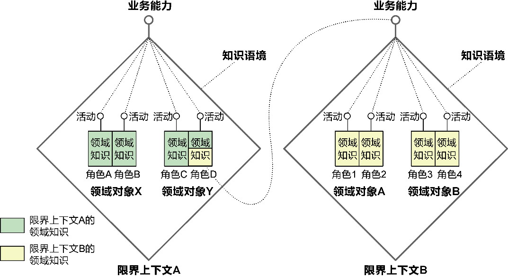

*图9-2 限界上下文的关键要素*

为了更形象地说明限界上下文关键要素的关系，我们来看一个物流运输系统的案例。该系统能够支持集装箱在铁路运输与公路运输的多式联运，需要计算每次多式联运的运费，以管理公司与委托公司之间的往来账。系统定义了运输上下文和财务上下文，现在思考一下：运费计算活动是否可以放在财务上下文？

如果从“知识”和“能力”的角度去理解，财务上下文的领域模型对象并不具备计算运费的领域知识，不了解运输过程中的各种费率，如运输费、货站租赁费、货物装卸人工费、保费，也不了解运输费用的计算规则。缺乏这些知识，自然也就不具备计算运费的能力。财务上下文其实只需要获得与往来账有关的结算费用，而不是具体的运费计算过程。

既然财务上下文不具备计算运费的能力，就不应该将运费计算活动放到财务上下文，而应考虑将其放到运输上下文，因为计算运费需要的领域知识都在它的知识语境内。财务需要运费计算的结果，说明财务上下文需要运输上下文的支持，调用运输上下文提供的业务能力。结合前面对限界上下文的理解，生成运输委托往来账的业务场景就可体现为两个限界上下文业务能力的协作，如图9-3所示。

限界上下文之间业务能力的协作是复用性的体现，显然，限界上下文之间的复用体现为对业务能力的复用，而非对知识语境边界内领域模型的复用。

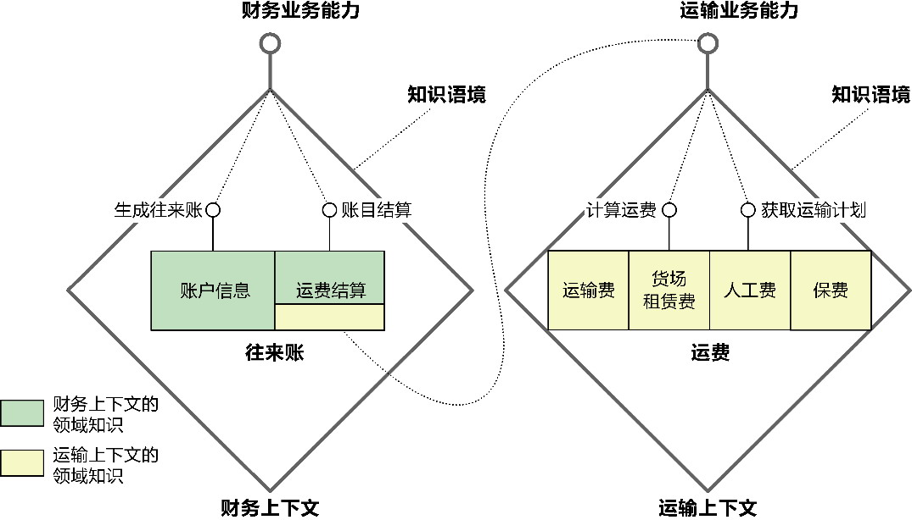

*图9-3 业务能力的协作*

### 9.2 限界上下文的特征

根据限界上下文的定义，可以明确它的业务特征与设计特征。

在识别限界上下文时，必须考虑它的业务特征：

·它是领域模型的知识语境；

·它是业务能力的纵向切分。

在设计限界上下文时，必须考虑它的设计特征：

·它是自治的架构单元。

#### 9.2.1 领域模型的知识语境

让我们先来读一个句子：

wǒ yǒu kuài dì.

到底是什么意思？究竟是“我有快递”还是“我有块地”？哪个意思才是正确的呢？确定不了，或者说即使确定了也可能引起误解！我们需要结合说话人说这句话的语境来理解。例如：

·wǒ yǒu kuài dì，zǔ shàng liú xià lái de. ——我有块地，祖上留下来的。

·wǒ yǒu kuài dì，shùn fēng de. ——我有快递，顺丰的。

日常对话中，说话的语境就是帮助我们理解对话含义的上下文。理解业务需求时，同样需要借助这样的上下文，形成能够达成共识的知识语境。

限界上下文形成的这种知识语境就好似对领域对象指定了“定语”。在代码中，就是类的命名空间。例如，当我们谈论“合同”时，它的语义是模棱两可的，在引入“员工招聘”上下文后，“合同”概念就变得明朗了，它隐含地表示了“员工招聘的合同”这一概念，代码体现为recruitingcontext. Contract。如果熟悉相关领域知识，即可明确合同概念代表了员工与公司签订的“劳务合同”，这一概念不会与同一系统的其他“合同”概念混淆，例如属于营销上下文的“合同”，其本质含义是“销售合同”。

没有限界上下文的边界保护，建立的领域模型就会面向整个系统乃至整个企业，要保证领域概念的一致性，就需要为那些出现知识冲突的领域概念添加显式的定语修饰，如“合同”概念就需要明确细分，分别命名为“销售合同”“租赁合同”“培训合同”“劳务合同”等。这些领域概念固然都在统一语言的指导下进行，但当目标系统的问题空间变得规模庞大时，统一语言也将变得规模庞大。一个目标系统需要多个团队共同协作完成。即使明确了这种显式定语修饰的规则，在一个团队不了解其他团队需要面对的领域知识的情况下，团队成员也往往意识不到这种概念的冲突，而倾向于选择适合自己团队的命名，不会刻意保留与相似概念的区别。没有限界上下文的界定，就可能悄无声息地出现了领域概念的冲突。所以Eric Evans就提到：“在整个企业系统中保持这种水平的统一是一件得不偿失的事情。在系统的各个不同部门中开发多个模型是很有必要的，但我们必须慎重地选择系统的哪些部分可以分开，以及它们之间是什么关系……大型系统领域模型的完全统一既不可行，也不划算。”^234

这种“得不偿失”还体现在界定领域知识的难度上。领域概念的一致性与完整性并不仅仅体现在领域模型的命名上，它蕴含的业务规则也必须保证一致而完整。许多时候，在同一个目标系统表达相同领域概念的模型对象，在不同上下文，需要关注的领域知识也可能并不相同。Martin Fowler在解释限界上下文的文章中，就给出了图9-4所示的领域模型图。

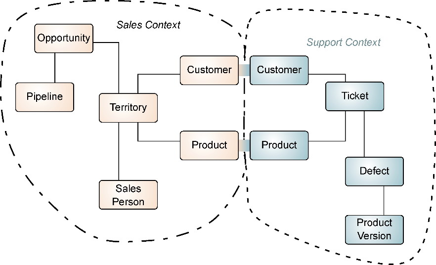

*图9-4 领域概念冲突的领域模型*

在图9-4中，销售人员和售后人员面对的客户(Customer)是同一个领域概念，机缘巧合下，甚至可能是同一个人，扮演的也是同一个角色，产品(Product)也如此。然而，因为销售人员与售后人员工作内容和工作性质的不同，他们需要了解客户和产品的领域知识存在较大差异：为了精准营销，销售人员需要掌握客户的信息越详细越好，包括客户的职业、收入、消费习惯等，而售后人员为了提供售后服务，掌握客户的联系方式与联系地址就足矣。如果没有限界上下文引入的知识语境，要么需要生硬地造出一个个细小的具有修饰语的领域概念，要么就创造出一个合并了各种属性的庞大类。

在问题空间，统一语言形成了团队对领域知识的共识，它贯穿于领域驱动设计统一过程始终，在架构映射阶段与领域建模阶段起到的作用就是维护领域模型的一致性。Eric Evans将模型的一致性视为模型的最基本要求：“模型最基本的要求是它应该保持内部一致，术语总具有相同的意义，并且不包含互相矛盾的规则：虽然我们很少明确地考虑这些要求。模型的内部一致性又叫作统一(unification)，在这种情况下，每个术语都不会有模棱两可的意义，也不会有规则冲突。除非模型在逻辑上是一致的，否则它就没有意义。”^233限界上下文的边界就是领域模型的边界，它的目的就在于维护领域模型的一致性，这一目的与统一语言的作用重合，因此可以认为：统一语言在解空间的作用域针对每个限界上下文。

#### 9.2.2 业务能力的纵向切分

要理解所谓“业务能力的纵向切分”，就要明确一个问题：为何领域驱动设计不使用模块(module)、服务(service)、库(library)或组件(component)这些耳熟能详的概念来表现业务能力？

要回答这一疑问，需要先弄清这些概念的真正含义。Neal Ford认为：“模块意味着逻辑分组，而组件意味着物理划分。” ^39且组件有两种物理划分形式，分别为库和服务：“库……往往和调用代码在相同的内存地址内运行，通过编程语言的函数调用机制进行通信……服务倾向于在自己的地址空间中运行，通过低级网络协议（比如TCP/IP）、更高级的网络协议（比如SOAP），或REST进行通信。”^39

模块属于逻辑架构视图的软件元素，组件（库和服务）属于物理架构视图的软件元素。模块与组件的区别体现了观察视图的不同，它们之间并不存在必然的映射关系。模块虽然是逻辑分组的结果，却不仅仅针对业务逻辑，某些基础设施的功能如文件操作、文件传输、网络通信等，也可以视为功能的逻辑划分，并在逻辑架构视图中被定义为模块，然后在物理架构视图中根据具体的质量属性要求实现为库或者服务。为了与限界上下文做对比，不妨将体现了业务逻辑划分的模块称为“业务模块”。

业务模块是否就是限界上下文呢？非也！因为模块作为体现职责内聚性的设计概念，缺乏一套完整的架构体系支撑，它的边界是模糊不清的。业务模块是从业务角度针对纯粹的业务逻辑的归类与组织，仅此而已。它缺乏自顶向下端对端的独立架构，使得自身无法支撑业务能力的实现，如图9-5所示。

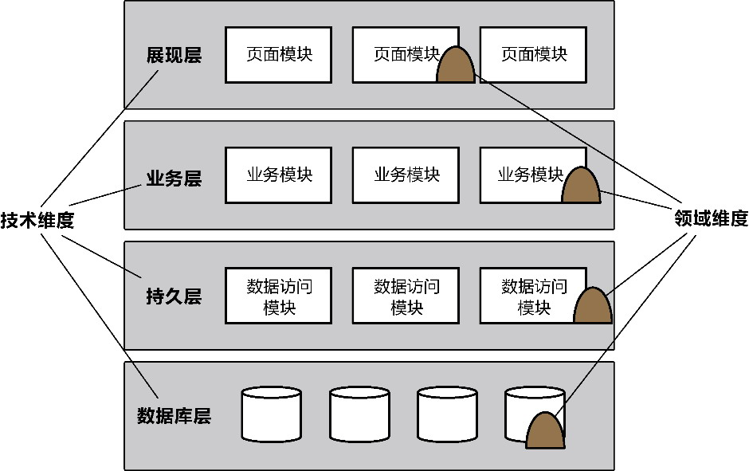

*图9-5 模块的划分*

图9-5所示的架构首先从技术维度进行关注点切分，形成一个分层架构；然后，业务模块又在此基础上针对业务层进行了领域维度^56的再度切分，封装了纯粹的领域逻辑。业务模块不具备独立的业务能力，只有把分散在各层中与对应领域维度有关的业务模块、数据访问模块以及数据库层的数据库或数据表整合起来，才能为展现层的页面模块提供完整的业务能力支撑——这正是业务模块的致命缺陷。分散在分层架构各个层次的领域维度切片也说明了模块的划分没有按照同一个业务变化方向进行，一旦该领域维度的业务逻辑发生变化，就需要更改整个系统的每一层。这正是我所谓的“模块缺乏一套完整架构体系支撑”的原因所在。

限界上下文与之相反。Eric Evans指出：“根据团队的组织、软件系统的各个部分的用法以及物理表现（代码和数据库模式等）来设置模型的边界。在这些边界中严格保持模型的一致性，而不要受到边界之外问题的干扰和混淆。”^236这意味着限界上下文边界的控制力不只限于业务，还包括实现业务能力的技术内容，如代码与数据库模式。它是对目标系统架构的纵向切分，切分的依据是从业务进行考虑的领域维度。为了提供完整的业务能力，在根据领域维度进行切分时，还需要考虑支撑业务能力的基础设施实现，如与该业务相关的数据访问逻辑，以及将领域知识持久化的数据库模型，形成纵向的逻辑边界，即限界上下文的边界。然后，在限界上下文的内部，再从技术维度根据关注点进行横向切分，分离业务逻辑与技术实现，形成内部的独立架构。当然，考虑到前后端分离的架构以及用户体验的特殊性，通常，限界上下文并不包含对展现层的纵向切分。切分后的架构如图9-6所示。

对比图9-5和图9-6可以发现，模块与限界上下文在设计思想上有本质区别。

·模块：先从技术维度进行横向切分，再从领域维度针对领域层进行纵向切分。业务模块仅包含业务逻辑，需要其他层模块的支持才能提供完整的业务能力。这样的架构没有将业务架构、应用架构、数据架构绑定起来，一旦业务发生变化，就会影响到横向层次的各个模块。

·限界上下文：先从领域维度进行纵向切分，再从技术维度对限界上下文进行横向切分，因此限界上下文是一个对外暴露业务能力的架构整体。无论是业务架构、应用架构，还是数据架构，都在一个边界中，一旦业务发生变化，只会影响到与该业务相关的限界上下文。

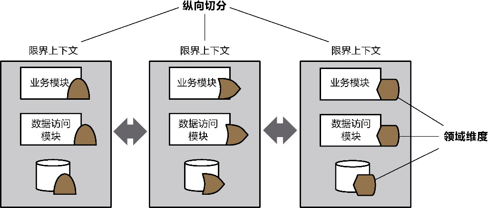

*图9-6 纵向切分的限界上下文*

限界上下文的引入改变了架构的格局。限界上下文是一个整体，与之强相关的领域维度切片被集中在一处，如此就能降低业务变化带来的影响，因为变化影响的内容被收拢在一处。限界上下文自身又可视为一个小型的应用系统。按照关注点分离原则进行横向切分，把蕴含业务逻辑的领域层单独剥离出来，形成清晰的结构，隔离业务复杂度与技术复杂度。

限界上下文是领域驱动设计战略层面最重要、最基本的架构设计单元。对外，限界上下文提供了清晰的边界，在边界保护下，整个目标系统的业务架构、应用架构与数据架构才能统一起来；对内，限界上下文的内部架构又确定了业务与技术的边界，实现了对技术架构的解耦。内外结合，就形成了业务能力的纵向切分。

#### 9.2.3 自治的架构单元

限界上下文作为基本的架构设计单元，既要体现领域模型的知识语境，又要能独立提供业务能力。这就要求它具有自治性，形成自治的架构单元。

自治的架构单元具备4个要素，即最小完备、自我履行、稳定空间和独立进化，如图9-7所示。

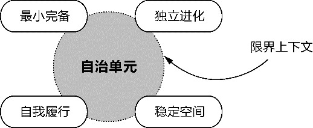

*图9-7 自治的4个要素*

最小完备是实现限界上下文自治的基本条件。所谓“完备”，是指限界上下文在履行属于自己的业务能力时，拥有的领域知识是完整的，无须针对自己的信息去求助别的限界上下文，这就避免了不必要的领域模型依赖。简言之，限界上下文的完备性，就是领域模型的完备性，也就是领域知识的完备性。当然，仅追求限界上下文的完备性是不够的。要知道，一个大而全的领域模型必然是完备的，所以为了避免领域模型被盲目扩大，就必须通过“最小”加以限制，避免将不必要的职责错误地添加到当前限界上下文。最小完备体现了限界上下文作为领域模型知识语境的特征。

自我履行意味着由限界上下文自己决定要做什么。限界上下文就好似拥有了智能，能够根据自我拥有的知识对外部请求做出符合自身利益的明智判断。分配业务功能时，设计者就应该化身为限界上下文，模拟它的思考过程：“我拥有足够的领域知识来履行这一业务能力吗？”如果没有，而领域知识的分配又是合理的，就说明该业务能力不该由当前限界上下文独立承担。“履行”是对能力的承担，而非对数据或信息单纯地拥有与传递，这就暗示着，当一个限界上下文具有自我履行的意识时，它就不会轻易突破边界，企图复用别人的领域模型，甚至绕过限界上下文直接访问不属于它的数据，而会优先以业务能力协作进行复用。自我履行体现了限界上下文纵向切分业务能力的特征。

稳定空间要求限界上下文必须防止和减少外部变化带来的影响。在满足了“最小完备”与“自我履行”特征的前提下，一个限界上下文已经拥有了必备的领域知识。这些领域知识代表的逻辑即使发生了变化，也是可控的。只有面对发生在限界上下文外界的变化，限界上下文才鞭长莫及、力不从心。因此，要保证内部空间的稳定性，就是要解除或降低对外部软件元素的依赖，包括必须访问的环境资源如数据库、文件、消息队列等，也包括当前限界上下文之外的其他限界上下文或伴生系统。解决之道就是通过抽象的方式降低耦合，只要保证访问接口的稳定性，外界的变化就不会产生影响。

独立进化则与稳定空间相反，指减少限界上下文内部变化对外界产生的影响。这体现了边界的控制力，对外公开稳定的接口，而将内部领域模型的变化封装在限界上下文的内部。显然，满足独立进化的核心思想是封装。抽象与封装都要求限界上下文划分合理而清晰的内外层次，在其边界内部形成独立的架构空间，即通过菱形对称架构的网关层（参见第12章）满足限界上下文响应变化的能力。

限界上下文自治的4个要素相辅相成。最小完备是基础，只有赋予了限界上下文足够的知识，才能保证它的自我履行。稳定空间对内，独立进化对外，二者都是对变化的有效应对，而它们又通过最小完备和自我履行来保证限界上下文受到变化的影响最小。遵循自治特性的限界上下文构成了整个系统的架构单元，成为响应业务变化与技术变化的关键支撑点。

#### 9.2.4 案例：供应链的商品模型

让我们通过供应链的一个案例，深刻体会自治的限界上下文与模块的不同之处。供应链系统的一个核心资源是商品，无论是采购、订单、运输还是库存，都需要用到商品的信息，因而需要在供应链系统的领域模型中定义“商品”(Product)模型。在未引入限界上下文边界之前，领域模型如图9-8所示。

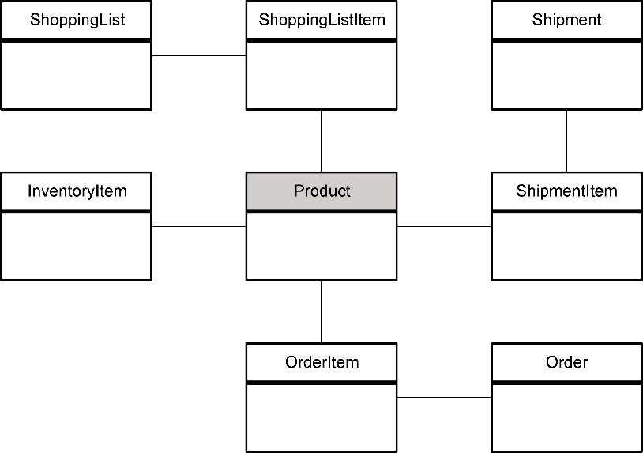

*图9-8 供应链的领域模型*

为了便于理解，图9-8对供应链的领域模型做了精简，仅仅展现了与商品概念相关的领域模型。代表商品概念的Product类在整个领域模型中唯一表达了真实世界的商品概念，但在采购、订单、运输、库存等不同视角中，商品却呈现了不同的面貌。例如，采购员在采购商品时，并不需要了解与运输相关的商品知识，如商品的高度、宽度和深度；运输商品时，配送人员并不关心商品的进价、最小起订量和供货周期。在没有边界的领域模型中，Product类若要完整呈现这些差异性，就必须包含与之相关的领域知识，使得Product领域模型变得越发臃肿，最后可能被定义为图9-9所示的类。

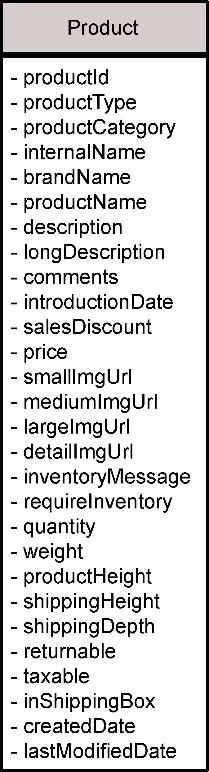

*图9-9 Product类的定义*

Product类涵盖了整个供应链系统范围的商品知识。没有边界限定这些知识，就可能因为定义的模棱两可引起领域概念的冲突。例如，管理库存时，仓储团队需要知道商品的高度，以便确定它在仓库的存放空间。于是，仓储团队在建模时为Product类定义了height属性来代表商品的高度。运输商品时，运输团队也需要知道商品的高度，目的是计算每个包裹的占用空间。同样都是高度，却在库存和运输这两个场景中，代表了不同的含义：前者是商品的实际高度，后者为商品的包装高度。如果将它们混为一谈，就会引起计算错误。在同一模型下为了避免这种冲突，只能为属性添加定语来修饰，图9-9中的模型就将高度分别定义为productHeight和shippingHeight。

这样一个庞大的Product类必然违背了“单一职责原则”^，包含了多个引起它变化的原因。当采购功能对商品的需求发生变化时，需要修改它；当运输功能对商品的需求发生变化时，也需要修改它……它成了一个极不稳定的热点。它为不同的业务场景公开了不同的信息，因此封装遭到了破坏，依赖变得更多，就像一块巨大的磁铁，产生了强大的吸力，将与之相关的模块或类吸附其上，造成了业务逻辑的强耦合。

为供应链系统引入业务模块是否能解决这些问题呢？业务模块是对业务逻辑的划分。可划分为采购模块、运输模块、库存模块、订单模块和商品模块，根据业务功能的相关性强弱，Product类应定义在商品模块中，形成图9-10所示的模块结构。

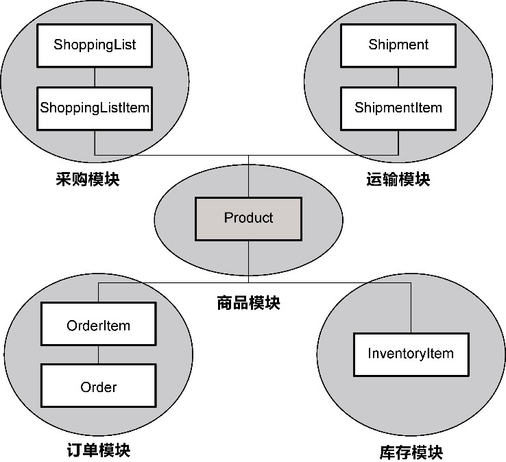

*图9-10 引入业务模块*

由于业务模块的内部没有一个层次清晰的架构，不具备对模块边界的控制能力。当各个模块都需要Product类封装的领域知识时，根据模块（包）的共同复用原则(common reuse principle，CRP)^，为了复用Product类，调用Product的业务模块都需要依赖整个商品模块，一个类的复用导致了多个业务模块紧紧地耦合在一起。随着需求不断变化，这些业务模块的边界会变得越来越模糊。模块之间存在若有若无的依赖，原本的内聚力缺乏了边界的有效隔离，就会慢慢吸附上诸多灰尘，渐渐填补模块之间的空隙，变成一个“大泥球”。一个直观的现象就是庞大的Product类在各个模块之间传来传去，而在Product类的实现中，随处可见采购、订单、运输和库存等业务逻辑的踪影，形成了“你中有我、我中有你”的狎昵关系^85。目标系统的架构因为缺乏空隙变得没有弹性，无法响应业务变化，架构的演化也会变得步履蹒跚。

究其原因，业务模块没有按照领域模型的知识语境划分商品概念的边界，使得商品的领域知识被汇聚到了一处。在不同的业务场景下，不同的业务能力需要商品的不同知识，但这样一个集中的Product类显然无法做到业务能力的纵向切分。模块缺失了自治能力，使得它控制边界的能力太弱，无法满足大型项目响应业务变化的架构需求。

限界上下文首先需要满足“最小完备”的自治特征，根据不同的知识语境划分专属于自己的领域模型。不同业务场景对商品领域知识的需求是分散的，相同业务场景需要的商品领域知识却是内聚的，如果仍然定义为一个Product类，就会形成多个具有不同内聚性的领域知识，如图9-11所示。

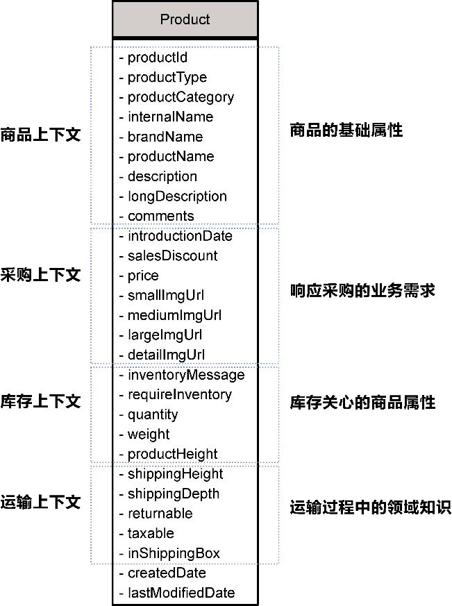

*图9-11 不同内聚性的领域知识*

如果不将商品的运输高度、宽度、是否装箱等领域知识赋给运输上下文，运输上下文就缺乏“完备性”，可要是将商品进价、最小起订量和供货周期也一股脑儿提供给它，就破坏了“最小性”对知识完备的约束。因此，“最小完备”要求限界上下文对领域模型各取所需，拥有自己专属的领域模型，根据知识语境定义独立的Product类，如图9-12所示。

不同的限界上下文都定义了Product类。理解领域模型时，应基于当前上下文的知识语境，如ShoppingListItem关联的Product类表达了与采购相关的商品领域知识。倘若要确认多个限界上下文的商品是否属于同一件商品，可由商品上下文统一维护商品的唯一身份标识，将限界上下文之间对Product类的依赖更改为对productId的依赖，并以此维持商品的唯一性。

基于“自我履行”的要求，一个限界上下文应该根据自己拥有的信息判断该由谁来履行基于领域知识提供的业务能力。例如，运输上下文需要了解商品是否装箱，即获得inShoppingBox的领域知识，由于在它的知识语境中定义了包含该领域知识的Product类，它就可以自己履行这一业务能力；倘若它还需要了解商品的详情，这一领域知识交给了商品上下文，此时，它不应该越俎代庖绕开商品上下文，直接访问存储了商品详情的数据表，因为这破坏了“自我履行”原则。这进一步说明了限界上下文之间的复用是通过业务能力进行的。

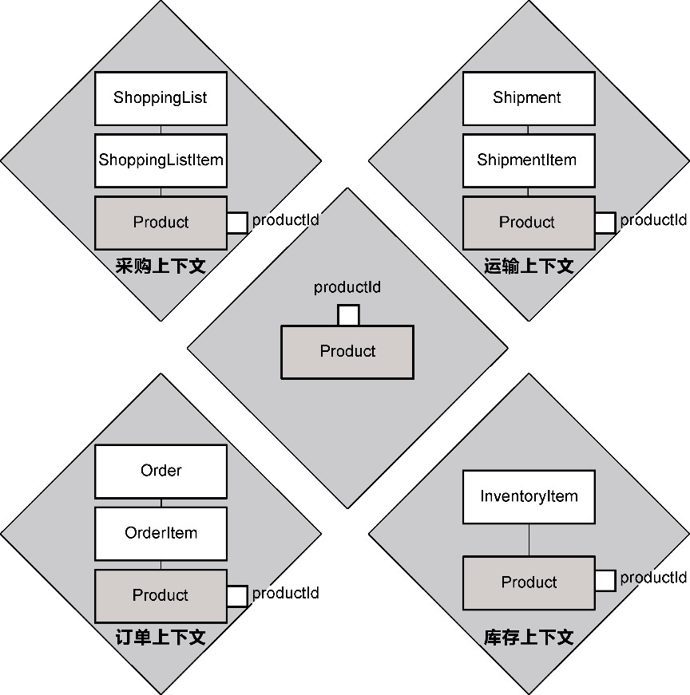

*图9-12 对商品概念形成知识语境*

为了确保“独立进化”的能力，菱形对称架构的北向网关保护了领域模型，不允许领域模型“穿透”限界上下文的边界。一个限界上下文不能直接访问另一个限界上下文的领域模型，而是需要调用北向网关的服务，该服务体现了限界上下文对外公开的业务能力，服务返回了满足该请求需要的消息契约模型。服务与消息的引入避免了二者的耦合，保留了领域模型独立进化的能力。例如，商品上下文定义了“获取商品基本信息”服务，库存上下文定义了“检查库存量”服务，分别返回ProductResponse与InventoryResponse消息对象。

要想维持限界上下文的“稳定空间”，可以通过菱形对称架构的南向网关建立抽象的客户端端口，将变化封装在适配器的实现中。例如，订单上下文需要调用库存上下文公开的“检查库存量”服务，为了抵御该服务可能的变化，就需要通过抽象的客户端端口InventoryClient，将变化封装在适配器InventoryClientAdapter中。库存上下文为了检查库存量，需要访问库存数据库。数据库属于外部的环境资源，为了不让它的变化影响领域模型，亦需要定义抽象的资源库端口InventoryRepository，隔离访问数据库的实现。

对比业务模块，限界上下文更加淋漓尽致地展现了“自治”的特征。它通过其边界维持了各自领域模型的一致性，避免出现一个庞大而臃肿的领域模型，并利用内部的菱形对称架构保证了限界上下文之间的松耦合，支撑它对业务能力的实现，建立了保证领域模型不受污染的边界屏障。

### 9.3 限界上下文的识别

不少领域驱动设计专家都非常重视限界上下文，越来越多的实践者也看到了它的重要性。Mike Mogosanu认为：“限界上下文是领域驱动设计中最难解释的原则，但或许也是最重要的原则。可以说，没有限界上下文，就不能做领域驱动设计。在了解聚合根(aggregate root)、聚合(aggregate)、实体(entity)等概念之前，需要先了解限界上下文。”遗憾的是，即使是领域驱动设计之父Eric Evans对于如何识别限界上下文，也语焉不详。

限界上下文的质量直接制约我们的设计，而高明的架构师雅擅于此，一个个限界上下文随着他们的设计而跃然于纸上，让我们惊叹于概念的准确性和边界的合理性。当被问起如何获得这些时，他们却笑称这是妙手偶得。软件设计亦是一门艺术，似乎需要凭借一种妙至毫巅、心领神会的神秘力量，于刹那之间迸发灵感，促生设计的奇思妙想——实情当然不是这样。若要说让人秘而不宣的神奇力量真的存在，那就是架构师们经过千锤百炼造就的“经验”。

Andy Hunt分析了德雷福斯模型(Dreyfus model)的5个成长阶段，即新手、高级新手、胜任者、精通者和专家。对于最高阶段的“专家”，Andy Hunt得出一个有趣的结论：“专家根据直觉工作，而不需要理由。”^21这一结论充满了神秘色彩，让人反复回味，却又显得理所当然：专家的“直觉”实际就是通过不断的项目实践磨炼出来的。当然，经验的累积过程需要方法，否则所谓数年经验不过是相同的经验重复多次，没有价值。Andy Hunt认为：“需要给新手提供某种形式的规则去参照，之后，高级新手会逐渐形成一些总体原则，然后通过系统思考和自我纠正，建立或者遵循一套体系方法，慢慢成长为胜任者、精通者乃至专家。”因此，从新手到专家是一个量变引起质变的过程，在没有能够依靠直觉的经验之前，我们需要一套方法。

Edward Crawley谈到过系统思考者在对复杂系统进行分析或综合时可以运用的技巧：“自顶向下和自底向上是思考系统时的两种方向……我们先从系统的目标开始，然后思考概念及高层架构。在制订架构时，我们会反复地对架构进行细化，并在我们所关注的范围内，把架构中的实体分解到最小……自底向上……就是先思考工件、能力或服务等最底层的实体，然后沿着这些实体向上构建，以预测系统的涌现物。除了这两种方式，还有一种方法是同时从顶部和底部向中间行进，这叫作由外向内的思考方式。”^44在识别限界上下文时，可以借鉴这一思路。

#### 9.3.1 业务维度

识别限界上下文的过程，就是将问题空间的业务需求映射到解空间限界上下文的过程。全局分析阶段的业务需求分析工作流采取自顶向下的分析方法：将问题空间中的业务流程根据时间维度切分为各个相对独立的业务场景，再根据角色维度将业务场景分解为业务服务。然后，架构映射阶段的业务级映射工作流又采取自底向上的求解方法：从业务服务逆行而上，通过逐步的归类与归纳获得体现业务能力的限界上下文。问题空间的分析过程与解空间的求解过程共同组成了图9-13所示的识别限界上下文的V型映射过程。

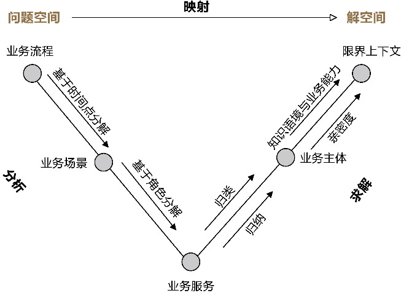

*图9-13 V型映射过程*

整个映射过程从分解、归类和归纳，到边界梳理，形成了一套相对固化的映射过程，在一定程度上消解了我们对经验的依赖。全局分析阶段输出的业务服务，作为分析过程的终点，同时又是求解过程的起点，在V型映射过程中起了关键作用。

**1.业务知识的归类**

业务服务是表达业务知识的最基本元素，按照业务相关性对其进行归类，就是按照“高内聚”原则划定业务知识的边界，就好像整理房间，相同类别的物品会整理放在一处，例如衣服类，鞋子类，图书类……每个类别其实就是所谓的“主体”。业务相关性主要体现为：

·语义相关性；

·功能相关性。

业务服务的定义遵循了统一语言，通过动词短语对其进行描述，动词代表领域行为，动词短语中的名词代表它要操作的对象。

语义相关性意味着存在相同或相似的领域概念，对应于业务服务描述的名词，如果不同的业务服务操作了相同或相似的对象，即可认为它们存在语义相关性。

功能相关性体现为领域行为的相关性，但它并非设计意义上领域行为之间的功能依赖，而是指业务服务是否服务于同一个业务目标。

以文学平台为例，诸如“查询作品”“预览作品”“发布作品”“阅读作品”“收藏作品”“评价作品”“购买作品”等业务服务皆体现了“作品”语义，可考虑将其归为同一类；“标记精彩内容”“撰写读书笔记”“评价作者”“加入书架”等业务服务与“作品”“作者”“书架”等语义有关，属于比较分散的业务服务，但从业务目标来看，实则都是为平台的读者提供服务，为此，可以认为它们具有功能相关性，可归为同一类。

语义相关性的归类方法属于一种表象的分析，只要业务服务的名称准确地体现了业务知识，归类就变得非常容易；分析功能相关性需要挖掘各个业务服务的业务目标，站在业务需求的角度进行深入分析，需要付出更多的心血才能获得正确的分类。

**2.业务知识的归纳**

对业务服务进行了归类，就划定了业务的主体边界。接下来，就需要对主体边界内的所有业务服务进行业务知识的归纳。

归纳的过程就是抽象的过程，需要概括所有业务服务所属的主体特征，并使用准确的名词表达它们，形成业务主体。业务主体是候选的限界上下文，主要原因在于它的主体边界还需要结合限界上下文的特征做进一步梳理。归纳的过程就是对业务主体命名的过程。业务主体的命名遵循单一职责原则，即这个名称只能代表唯一的最能体现其特征的领域概念。倘若对业务服务的归类欠妥当，命名就会变得困难，要是找不到准确的名称，就该反过来思考之前的归类是否合理，又或者在之前的归类之上建立一个更高的抽象。因此，归纳业务主体时，对其命名亦可作为检验限界上下文是否识别合理的一种手段。

以文学平台为例，如下业务服务具有“读者群”的语义，可归类为同一业务主体：

·建立读者群；

·加入读者群；

·发布群内消息；

如下业务服务从行为上具有交流的相同业务目标，可从功能相关性归类为同一业务主体：

·实时聊天；

·发送离线消息；

·一对一私聊；

·发送私信。

进一步归纳，无论是读者群的语义概念，还是交流的业务目标，都满足“社交”这一主体特征，就可将它们统一归纳为“社交”业务主体。

在对业务服务进行归类时，倘若将“阅读作品”“收藏作品”“关注作者”“查看作者信息”等业务服务归为一类，在为该业务主体进行命名时，就会发现它们实际存在两个交叉的主体，即“作品”和“作者”，这时，我们不能强行将其命名为“作品和作者”业务主体，因为这样的命名违背了单一职责原则，传递出主体边界识别不合理的信号！

**3.业务主体的边界梳理**

业务主体的确定依据了业务相关性，体现了“高内聚”原则，位于同一主体内的业务服务相关性显然要强于不同主体的业务服务，这种“亲疏”关系决定了业务主体的边界是否合理。因此，分析亲密度可以帮助我们进一步梳理业务主体的边界。对亲密度的判断，实则需要明确业务服务需要的领域知识和哪一个业务主体相关性更强，它的服务价值与哪一个业务主体的业务目标更接近。例如，对比图9-14所示的两个业务主体，是否发现了亲密度的差异？

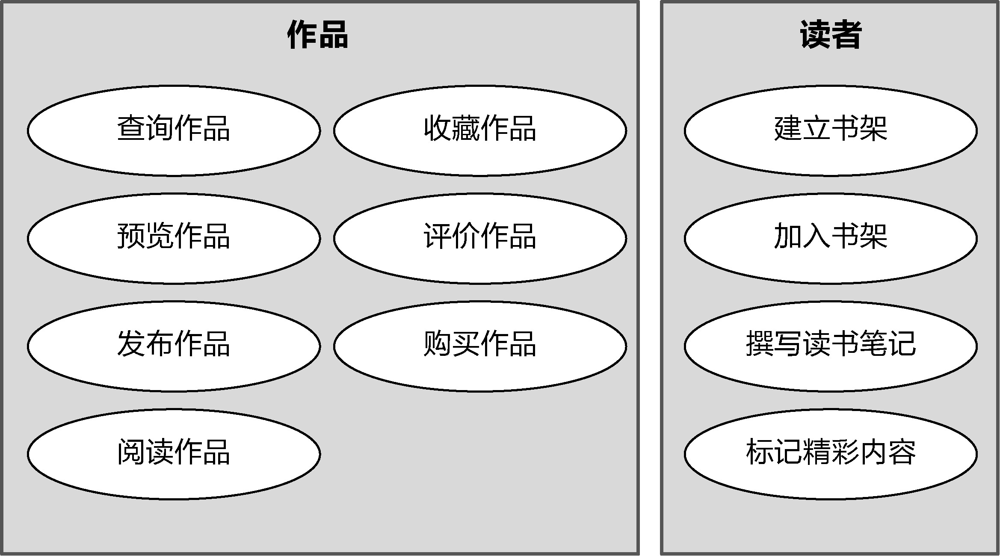

*图9-14 两个业务主体的业务服务*

虽然作品业务主体内的“收藏作品”“评价作品”与“购买作品”都与“作品”语义有关，但它们与“查询作品”等业务服务不同，除了要用到作品的领域知识，还需要用到读者的领域知识；同时，它们的服务价值也都是为读者服务的。分析亲密度，我认为“收藏作品”“评价作品”与“购买作品”等业务服务更适合放在读者业务主体。若对领域知识的归纳还存在犹疑不定之处，可进一步探索业务服务规约，从更为细节的业务服务描述确定领域知识的主次之分，进一步明确业务服务到底归属于哪一个限界上下文更为合适。

在梳理业务主体的边界时，还要结合限界上下文特征对其进行判断。

一个重要的判断依据是领域模型的知识语境。倘若在多个业务主体中存在相同或相似的概念，不要盲目地从语义相关性对其进行归类，还要考虑它们在不同的业务主体边界内，是否代表了不同的领域概念。限界上下文规定了解空间领域模型边界的统一语言，两个相同或相似的概念如果代表了不同的领域概念，却存在于同一个限界上下文，必然会带来领域概念的冲突。

例如，文学平台识别出了会员业务主体，该主体定义了账户和银行账户领域概念，前者为会员的账户信息，包括“会员ID”“名称”“会员类别”等属性，后者提供了支付需要的银行信息，二者代表的概念完全不同。银行账户通过定语修饰说明了概念用于支付，并不会导致领域概念的冲突，然而从领域概念的知识语境来看，假设将会员业务主体定义为限界上下文，银行账户是否应该放在会员上下文？表面看来，银行账户也是账户的属性，但它与会员ID、会员名称等属性不同，它仅适用于支付相关的业务场景，倘若文学平台还定义了支付上下文，银行账户领域概念更适合归类到支付上下文。

另一个重要的判断依据是业务能力的纵向切分。位于同一个限界上下文的业务服务应提供统一的业务能力，要么是业务能力的核心功能，要么为业务能力提供辅助能力支撑。分析业务能力的角度接近于功能相关性的分析，服务于同一个业务目标，实则就是要提供完整的业务能力。

仍以文学平台为例，它为了促进文学爱好者关注平台，加强与文学创作者之间的互动，由平台组织定期的文学创作大赛、线下作者见面会，文学爱好者可以报名参加这些线上和线下的活动。文学创作大赛的业务服务属于活动业务主体，这是将比赛当作平台组织的活动；线下作者见面会的业务服务属于社交业务主体，因为它的目的是促进平台成员的交流与互动。活动业务主体定义了“报名参加比赛”业务服务，社交业务主体定义了“报名参加作者见面会”业务服务，显然，这两个业务服务都需要平台提供报名的业务能力，该业务能力放在上述任何一个业务主体都不合适，遵循纵向切分业务能力的要求，将其放在一个单独的限界上下文才能更好地为它们提供能力支撑。

通过对业务主体的边界梳理，就确定了业务维度的限界上下文。

**4.呈现限界上下文**

业务服务图可以用来呈现业务维度的限界上下文。全局分析阶段获得了业务服务图，它可作为识别限界上下文的起点。针对业务服务图中每个业务场景的业务服务进行业务相关性分析，通过归类和归纳，形成业务主体，再对其边界进行梳理，获得业务维度的限界上下文，图9-15所示的业务服务图呈现了作品上下文。

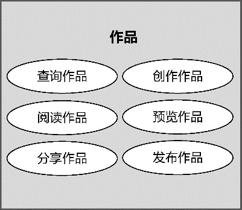

*图9-15 作品上下文*

此时的业务服务图是对业务服务的归纳，它抹去了角色的信息，因为在映射限界上下文时，角色概念变得无关紧要，甚至角色的存在可能会误导我们对限界上下文的判断。

虽然都是业务服务图，全局分析阶段的业务服务图是对问题空间的探索，业务服务图的边界体现了业务场景；架构映射阶段的业务服务图是对问题空间的求解，它的边界是解空间的业务边界，即业务维度的限界上下文边界。二者的映射关系体现了业务级架构映射的特点。

为何要进行业务服务到限界上下文的映射

在对问题空间进行全局分析后，即使凭借经验，也能识别出一部分正确的限界上下文。例如，对于一个电商后台系统，即使不采用V型映射过程，也可以轻易地识别出“订单”“商品”“库存”“购物车”“交易”“支付”“发票”“物流”等限界上下文，为何要需要进行业务服务到限界上下文的映射呢？

一方面，如此凭经验识别出的限界上下文边界是否合理，需要进一步验证，又或者可能漏掉一些必要的限界上下文；另一方面，即使获得了这样的限界上下文，也对架构的落地没有指导意义。如果不确定业务服务究竟属于哪一个限界上下文，就无法确定领域模型的边界，也无法真实地探知限界上下文之间的协作关系和协作方式，实际上就等同于没有清晰地勾勒出限界上下文的边界。没有划定清晰的边界，最后仍然会导致领域代码的混乱，形成事实上的“大泥球”。

通过V型映射过程不仅获得了业务维度的限界上下文，同时还确定了限界上下文与业务服务之间的映射关系，这对于在设计服务契约时确定限界上下文之间的协作关系，在领域分析建模时确定领域模型与限界上下文的关系，在领域设计建模时确定由哪个限界上下文的远程服务响应服务请求，都具有非常重要的参考价值。

#### 9.3.2 验证原则

在获得了限界上下文之后，还应该遵循限界上下文的验证原则对边界的合理性进行验证。

**1.正交原则**

正交性要求：“如果两个或更多事物中的一个发生变化，不会影响其他事物，这些事物就是正交的。”^变化的影响主要体现在变化的传递性，即一个事物的变化会传递到另一个事物引起它的变化，但这个变化影响并不包含彼此正交的点。例如，限界上下文之间存在调用关系，当被调用的限界上下文公开的接口发生变化，自然会影响调用方。这一影响是合理的，也是软件设计很难避免的依赖。故而限界上下文存在正交性，指的是各自边界封装的业务知识不存在变化的传递性。

要破除变化的传递性，就要保证每个限界上下文对外提供的业务能力不能出现雷同，这就需要保证为完成该业务能力需要的领域知识不能出现交叉；要让领域知识不能出现交叉，就要保证封装了领域知识的领域模型不能出现重叠。业务能力、领域知识、领域模型，三者之间存在层次的递进关系，无论是自顶向下去推演，还是自底向上来概括，都不允许同一层次之间存在非正交的事物，如图9-16所示。

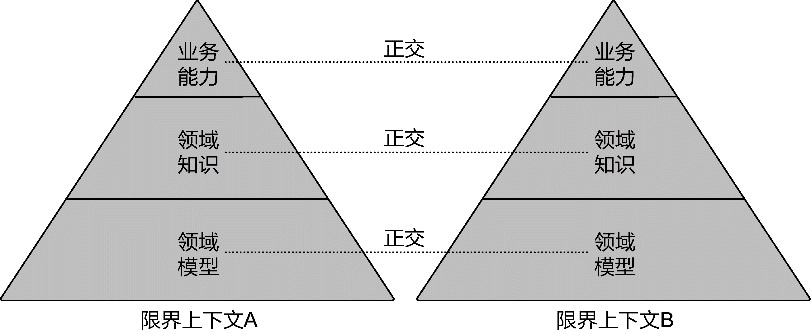

*图9-16 限界上下文的正交性*

领域模型违背了正交性，意味着各自定义的领域模型对象代表的领域概念出现了重复。注意，限界上下文展现的领域概念具有知识语境，不能因为领域概念名称相同就认为领域概念出现了重复。判断领域模型的重复性，必须将限界上下文作为修饰，将二者组合起来共同评判。例如，在供应链系统中，商品限界上下文、运输限界上下文与库存限界上下文的领域模型都定义了Product类，但结合各自的知识语境，这一领域模型类实际代表了不同的领域概念；在保险系统，车险限界上下文、寿险限界上下文的领域模型都定义了Customer类，关注的客户属性也是近似的，属于相同的领域概念，导致领域模型的重复。

领域知识违背了正交性，代表了业务问题的解决方案出现了重复，通常包含了领域行为与业务规则，例如在电商系统中，运费计算的规则不能同时存在于多个限界上下文，如果在订单上下文和配送上下文都各自实现了运费计算的逻辑，就会使得这一重复蔓延到系统各处，一旦运费计算规则发生变化，就需要同时修改多个限界上下文，修改时，如果遗漏了某个重复的实现，还会引入潜在的缺陷。

业务能力违背了正交性，意味着业务服务出现的重复。例如，在一个物流系统中，地图上下文提供了地理位置定位的业务服务，结果在导航上下文又定义了这一服务。之所以出现这一结果，可能是因为各个领域特性团队沟通不畅。

**2.单一抽象层次原则**

单一抽象层次原则(Single Level of Abstraction Principle，SLAP)来自Kent Beck的编码实践，他在组合方法(Composed Method)模式中要求：“保证一个方法中的所有操作都在同一个抽象层次”^24。不过，这一原则却是由Gleann Vanderburg在理解了这一概念之后提炼出来的。识别限界上下文时，归纳业务知识的过程就是抽象的过程，限界上下文的名称代表一个抽象的概念，因此，我们可以引入该原则作为限界上下文的验证原则。

要理解单一抽象层次原则，需要先了解什么是概念的抽象层次。

抽象这个词的拉丁文为abstractio，原意为排除、抽出。中文对这个词语的翻译也很巧妙，顾名思义，可以理解为抽出具体形象的东西。例如，人是一个抽象的概念，一个具体的人有性别、年龄、身高、相貌、社会关系等具体特征，而抽象的人就是不包含这些具体特征的一个概念。抽象概念指代一类事物，因此，抽象实际上并非真正抽出这些具体特征，而是对一类具有共同特征的事物进行归纳，从而抹掉具体类型之间的差异。

抽象层次与概念的内涵有关，概念的内涵即事物的特征。内涵越小，意味着抽象的特征越少，抽象的层次就越高，外延也越大，反之亦然。例如，男人和女人有性别特征的具体值，人抽象了性别特征，使得该概念的内涵要少于男人或女人，而外延的范围却更大，抽象层次也就更高。同理，生物的概念层次要高于人，物质的概念层次又要高于生物。

违背了单一抽象层次原则的限界上下文会导致概念层次的混乱。一个高抽象层次的概念由于内涵更小，使得它的外延更大，就有可能包含低抽象层次的概念，使得位于不同抽象层次的限界上下文存在概念上的包含关系，这实际上也违背了正交原则。例如，在一个集装箱多式联运系统中，商务上下文与合同上下文就不在一个抽象层次上，因为商务的概念实际涵盖了合同、客户、项目等更低抽象层次的概念；运输、堆场、货站限界上下文则遵循了单一抽象层次原则，运输上下文是对运输计划和路线的抽象，堆场上下文是对铁路运输场区概念的抽象，货站上下文则是对公路运输站点工作区域相关概念的抽象，它们关注的业务维度可能并不相同，但不影响它们的抽象层次位于同一条水平线上。

抽象层次与重要程度无关，不能说提供支撑功能的限界上下文低于提供核心业务能力的限界上下文。仍然是在集装箱多式联运系统，运输、堆场以及货站等限界上下文都需要作业和作业指令，区别在于操作的作业内容不同。提炼出来的作业上下文为运输、堆场以及货站等限界上下文提供了业务功能的支撑，但它们属于同一抽象层次的限界上下文。

**3.奥卡姆剃刀原理**

限界上下文作为高层的抽象机制，体现了我们在软件构建过程中对领域思考的本质，它是架构映射阶段的核心模式。因此，限界上下文的识别直接影响了领域驱动设计的架构质量。通过分解、归类、归纳到最后的验证之后，如果对识别出来的限界上下文的准确性依然心存疑虑，比较务实的做法是保证限界上下文具备一定的粗粒度。

这正是奥卡姆剃刀原理的体现，即“切勿浪费较多东西去做用较少的东西同样可以做好的事情”，更文雅的说法就是“如无必要，勿增实体”^352。遵循该原则，意味着当我们没有寻找到必须切分限界上下文的必要证据时，就不要增加新的限界上下文。倘若觉得功能的边界不好把握分寸，可以考虑将这些模棱两可的功能放在同一个限界上下文中。待到该限界上下文变得越来越庞大，以至于一个领域特性团队无法完成交付目标；又或者违背了限界上下文的自治原则，或者质量属性要求它的边界需要再次切分时，再对该限界上下文进行分解，增加新的限界上下文。这才是设计的实证主义态度。

#### 9.3.3 管理维度

正如架构设计需要多个视图全方位体现架构的诸多要素，我们也应从更多的维度全方位分析限界上下文。如果说从业务维度识别限界上下文更偏向于从业务相关性判断业务的归属，那么基于团队合作划分限界上下文的边界则是从管理维度思考和确定限界上下文合理的工作粒度。

管理层次的同构系统实现了架构系统与管理系统的映射，其中扮演关键作用的是限界上下文与领域特性团队之间的映射。这一映射的理论基础来自康威定律。如果团队的工作边界与限界上下文的业务边界不匹配，就需要调整团队或限界上下文的边界，使得二者的分配更加合理，降低沟通成本，提高开发效率。

这是否意味着限界上下文与领域特性团队之间的关系是一对一的关系呢？如果是，就意味着团队的工作边界与限界上下文的边界重合，自然是理想的；可惜，限界上下文与团队的划分标准并不一致。如果目标系统为软件产品，领域特性团队可以在很长一段时间保证其稳定性；如果目标系统为项目，参与研发的领域特性团队就很难保证它的稳定了。此外，团队的规模是可以控制的，限界上下文的粒度却要受到业务因素、技术因素以及时间因素的影响，要让二者的边界完全吻合，实在有些勉为其难。

如果无法做到二者一对一的映射，至少要避免出现将一个限界上下文分配给两个或多个团队的情形。因此，在识别限界上下文时，团队的工作边界可以对限界上下文的边界划分以启发：“限界上下文的粒度是过粗，还是过细？”当一个限界上下文的粒度过粗，以至于计划中的功能特性完全超出了领域特性团队的工作量，就应该考虑分解限界上下文。因此，领域特性团队与限界上下文的映射关系应如图9-17所示。

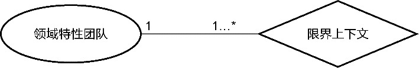

*图9-17 领域特性团队与限界上下文*

一个领域特性团队与限界上下文形成一对一或者一对多的关系，意味着项目经理需要将一个或多个限界上下文分配给6～9人的领域特性团队。对限界上下文的粒度识别就变成了对团队工作量的估算。

基于管理维度判断限界上下文工作边界划分是否合理时，还可以依据限界上下文之间是否允许并行开发进行判断。无法并行开发，意味着限界上下文之间的依赖太强，违背了“高内聚松耦合”原则。

无论是限界上下文，还是领域特性团队，都会随着时间推移发生动态的演化。康威就认为：“大多数情况下，最先产生的设计都不是最完美的，主导的系统设计理念可能需要更改。因此，组织的灵活性对于有效的设计有着举足轻重的作用。必须找到可以鼓励设计经理保持他们的组织精简与灵活的方法。”根据二者的映射关系，ThoughtWorks的技术雷达提出了“康威逆定律”(Inverse Conway Maneuver)，即“围绕业务领域而非技术分层组建跨功能团队”。这里所谓的“业务领域”，在领域驱动设计的语境中，就是指限界上下文。换言之，就是先确定限界上下文的边界，再由此组织与之对应的领域特性团队。倘若限界上下文的边界发生演进，则领域特性团队也随之演进，以保证二者的匹配度。限界上下文与领域特性团队的边界相互影响，意味着在管理层面，每个领域特性团队的负责人也需要判断新分配的任务是否属于限界上下文的边界。不当的任务分配会导致团队边界的模糊，进而导致限界上下文边界的模糊，影响它对领域模型的控制。利用康威定律与康威逆定律，就能将限界上下文与领域特性团队结合起来。二者相互影响，形成对限界上下文边界动态的持续改进。

领域特性团队对识别限界上下文的促进不只体现为团队规模传递的分解信号，它的组建原则同样有助于加深我们对限界上下文边界的认识。Jurgen Appelo认为，一个高效的团队需要满足两点要求^：

·共同的目标；

·团队的边界。

虽然Jurgen Appelo在提及边界时，是站在团队结构的角度来分析的，但在确定团队的工作边界时，恰恰与限界上下文的边界暗暗相合。建立一个良好的领域特性团队，需要保证如下两点。

·团队成员应对团队的边界形成共识。这意味着团队成员需要了解自己负责的限界上下文边界，以及该限界上下文如何与外部的资源以及其他限界上下文进行通信；同时，限界上下文内的领域模型也是在统一语言指导下达成的共识。

·团队的边界不能太封闭（拒绝外部输入），也不能太开放（失去内聚力），即所谓的“渗透性边界”^。这种渗透性边界恰恰与“高内聚松耦合”的设计原则完全契合。

针对这种“渗透性边界”，团队成员需要对自己负责开发的需求“抱有成见”。在识别限界上下文时，“任劳任怨”的好员工并不是真正的好员工。一个好的员工明确地知道团队的职责边界，应该学会勇于承担属于团队边界内的需求开发任务，也要敢于拒绝强加于他（她）的职责范围之外的需求。通过团队每个人的主观能动，促进组织结构的“自治单元”逐渐形成，进而催生出架构设计上的“自治单元”。同理，“任劳任怨”的好团队也不是真正的好团队。团队对自己的边界已经达成了共识，为什么还要违背这个共识去承接不属于自己边界内的工作呢？这并非团队之间的恶性竞争，也不是工作上的互相推诿，恰恰相反，这实际上是一种良好的合作：表面上是在维持自己的利益，然而在一个组织下，如果每个团队都以这种方式维持自我利益，反而会形成一种“你给我搔背，我也替你抓抓痒”的“互利主义”。

互利主义最终会形成团队之间的良好协作。如果团队领导者与团队成员能够充分认识到这一点，就可以从团队层面思考限界上下文。此时，限界上下文就不仅仅是架构师局限于一孔之见去完成甄别，而是每个团队成员自发组织的内在驱动力。当每个人都在思考这项工作该不该我做时，他们就是在变相地思考职责的分配是否合理、限界上下文的划分是否合理。

#### 9.3.4 技术维度

Martin Fowler认为：“架构是重要的东西，是不容易改变的决策。如果我们未曾预测到系统存在的风险，不幸它又发生了，带给架构的改变可能是灾难性的。”利用限界上下文的边界，就可以将这种风险带来的影响控制在一个极小的范围。从技术维度看限界上下文，首先要关注目标系统的质量属性(quality attribute)。

**1.质量属性**

架构映射阶段虽然是以“领域”为中心的问题求解过程，但这并非意味在整个过程中可以完全不考虑质量需求、技术因素和实现手段。对一名架构师而言，考虑系统的质量属性应该成为一种工作习惯。John Klein和David Weiss就认为：“软件架构师的首要关注点不是系统的功能……你关注的是需要满足的品质（即质量属性）。品质关注点指明了功能必须以何种方式交付，才能被系统的利益相关人所接受，系统的结果包含这些人的既定利益。”^19

既要面向领域进行架构映射，又要确保质量属性得到满足，还不能让业务复杂度与技术复杂度混淆在一起——该如何兼顾这些关键点？领域驱动设计要求：

·识别限界上下文时，应首先考虑业务需求对边界的影响，在限界上下文满足了业务需求之后，再考虑质量属性的影响；

·技术因素在影响限界上下文的边界时，仍然要保证领域模型的完整性与一致性。

在确定了系统上下文即解空间的边界之后，业务级映射是从领域维度对整个目标系统进行的纵向切分，由限界上下文实现业务之间的正交性。例如，订单业务与商品业务各自业务的变化互不影响，只有协作关系会成为垂直相交的交点。在限界上下文内部，菱形对称架构（参见第12章）定义了内部的领域层与外部的网关层，完成对限界上下文内部架构的内外切分，实现了业务功能与技术实现的正交性。例如，订单业务与订单数据库的操作变化互不影响，它们之间的调用关系通过端口的解耦，形成了唯一依赖的垂直交点。

如果认为某个限界上下文的部分业务功能不能满足质量属性需求，就需要调整限界上下文的边界。虽然变化因素是质量属性，但影响到的内容却是对应的业务功能。为了不破坏设计的正交性，仍应按照业务变化的方向进行切分，也就是通过纵向切分，将质量因素影响的那部分业务功能完整地分解出来，形成一个个纵向的业务切片，组成一个单独的限界上下文。同时仍然在限界上下文内部保持菱形对称架构，以隔离业务功能与技术实现，并在一个更小的范围维持领域模型的统一性和一致性。

考虑电商平台开展的秒杀业务。一种秒杀方式同时规定了秒杀数量和秒杀时间，如果商品秒杀完毕或者达到规定时间，就会结束秒杀活动；另一种秒杀是超低价的限量抢购，如“一元抢购”，价格只有一元，限量一件商品。无论秒杀采用什么样的业务规则，其本质仍然是一种电商的营销行为，业务流程仍然是下订单、扣除库存、支付订单、配送和售后，只是部分流程根据秒杀业务的特性进行了精简。遵循领域驱动架构风格（参见第12章），假定我们设计了图9-18所示的由限界上下文构成的电商平台架构。

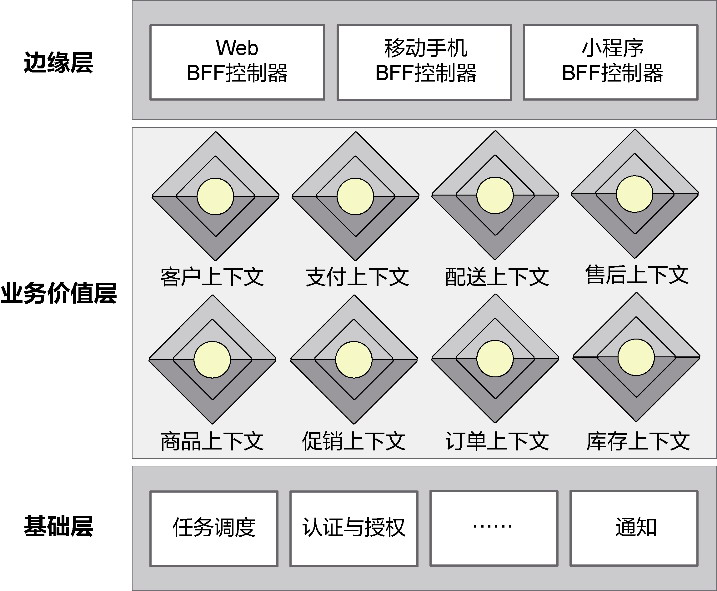

*图9-18 电商平台架构*

从业务需求角度考虑，由于秒杀业务属于促销规则的一种，因此与秒杀有关的领域模型被定义在促销上下文内。买家完成秒杀之后，提交的订单、扣减的库存和购买商品的配送，与其他营销行为并无任何区别，与秒杀相关的订单模型、库存模型以及配送模型也都放在各自的限界上下文内。当电商平台引入了新的秒杀业务后，原有架构的订单上下文、库存上下文和配送上下文都不需要调整，唯一需要改变的是促销上下文的领域模型能够表达秒杀的领域知识，这正是正交性的体现。

然而，秒杀业务的增加不止于领域逻辑的变化，还包括其他特性。

·瞬时并发量大：秒杀时会有大量用户在同一时间进行抢购，瞬时并发访问量突增数十乃至数百倍；

·库存量少：参与秒杀活动的商品库存量通常很少，只有极少数用户能够成功购买，这样才能增加秒杀的刺激性，并保证价格超低的情况下不至于影响销售利润。

瞬时并发量大，就要求系统能在极高峰值的并发访问下，既保证系统的高可用，又要满足低延迟的要求，确保用户的访问体验不受影响；库存量少，就要求系统能在极高峰值的并发访问下，在不影响正常购买的情况下避免超卖。在保证秒杀业务的高可用时，还必须保证其他业务功能的正常访问，不因为秒杀业务的高并发占用其他业务服务的资源。在高并发访问要求下，可扩展性、高可用性、资源独占性、数据一致性等多个质量属性决定了秒杀业务对已有架构产生了影响，除了必要的技术手段，如限流、削峰、异步、缓存，还有一种根本的手段，就是分离秒杀业务与已有业务。从领域驱动设计的角度讲，秒杀业务的技术因素影响了电商平台的限界上下文划分。

遵循领域驱动架构风格，虽然这些技术因素看起来影响了系统的技术实现层面，但我们对现有架构的改造并不是提炼出与技术因素有关的模块，如异步处理模块、缓存模块，因为这些模块从变化频率与方向看，不只是为秒杀业务提供支撑，而是面向了整个系统，属于系统分层架构定义的基础层内容。

分析引起架构调整的这些质量属性需求，导致变化的主因还是秒杀业务，自然就该在各个限界上下文中提炼出与秒杀业务相关的功能，形成纵向的秒杀业务切片。这些业务切片仍然按照领域层与网关层的内外层次组织，形成一个专有的限界上下文——秒杀上下文，如图9-19所示。

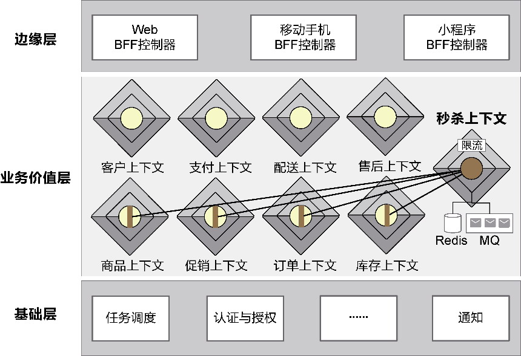

*图9-19 引入秒杀上下文*

秒杀上下文相当于为秒杀业务建立了一个独立王国。供秒杀业务的商品、秒杀业务的促销规则、秒杀订单和库存都定义在秒杀上下文的领域模型中。当秒杀请求从客户端传递到秒杀限界上下文时，可对北向网关的远程服务进行技术调整（如增加专门的限流功能），只允许少部分流量进入服务端；在提交订单请求时，可以调整南向网关资源库适配器的实现，并不直接访问秒杀的订单数据库，而是访问Redis缓存数据库，以提高访问效率。客户在支付秒杀订单时，仍然发生在秒杀限界上下文内部，可选择由北向网关的本地服务发布PaymentRequested事件，引入消息队列作为事件总线完成异步支付，以减轻秒杀服务端的压力。这一系列改进的关键在于引入了一个纵向切片的秒杀上下文，于是就可以将秒杀的整体业务从已有系统中独立出来，为其分配单独的资源，保证资源的隔离性以及秒杀服务自身的可伸缩性。

**2.复用和变化**

不管是复用领域逻辑还是复用技术实现，都是设计层面考虑的因素。需求变化更是影响设计策略的关键因素。基于限界上下文自治性的4个特征，可以认为这个自治的单元其实就是逻辑复用和封装变化的设计单元。这时对限界上下文边界的考虑，更多出于技术设计因素，而非出于业务因素。

运用复用原则分离出来的限界上下文往往对应于支撑子领域，作为支撑功能可以同时服务于多个限界上下文。我曾经为一个多式联运管理系统团队提供领域驱动设计咨询服务，通过与领域专家的沟通，我注意到他在描述运输、货站和堆场的相关业务时，都提到了作业和指令的概念。虽然属于不同的领域，但作业的制订与调度、指令的收发都是相同的，区别只在于作业与指令的内容，以及作业调度的周期。为了避免在运输、货站和堆场各自的限界上下文中重复设计和实现作业与指令等领域模型，可以将作业与指令单独划分到一个专门的限界上下文中。它作为上游限界上下文，提供对运输、货站和堆场的业务支撑。

限界上下文对变化的应对，其实体现了“单一职责原则”，即对于一个限界上下文，不应该存在两个引起它变化的原因。依然考虑物流联运管理系统。团队的设计人员最初将运费计算与账目、结账等功能放在了财务上下文中。这样，当国家的企业征税政策发生变化时，财务上下文也会相应变化。此时，引起变化的原因是财务规则与政策的调整。倘若运费计算的规则也发生了变化，也会引起财务上下文的变化，但此时引起变化的原因却是物流运输的业务需求。如果我们将运费计算单独从财务上下文中分离出来，就可以让它们独立演化，这样就符合限界上下文的自治原则，实现了两种不同关注点的分离。

**3.遗留系统**

限界上下文自治原则的唯一例外是遗留系统。如果目标系统需要与遗留系统协作（注意，它并不一定是系统上下文之外的伴生系统），通常需要为它单独建立一个限界上下文。无论该遗留系统是否定义了领域模型，都可以通过限界上下文的边界作为屏障，以避免遗留系统的混乱结构对系统整体架构的污染，也可以避免开发人员在开发过程中陷入遗留系统庞大代码库的泥沼。

系统之所以要将现有遗留系统当作一个限界上下文，要么是因为还要继续维护遗留系统，满足新增需求，要么是因为系统的一部分业务功能需要与遗留系统集成。对于前者，遗留系统限界上下文定义了一个独立进化的自治边界，它能小心翼翼控制新增需求的代码，并以适合遗留系统特性的方式自行选择开发与设计模式；对于后者，与之集成的限界上下文由于采用了菱形对称架构模式，因此可通过南向网关的客户端端口来固定当前限界上下文，使之不受遗留系统的影响，甚至可以通过此方式，慢慢对遗留系统进行重构。在重构的过程中，仍然需要遵循自治原则，站在调用者的角度观察遗留系统，考虑如何与它集成，然后逐步对其进行抽取与迁移，形成自治的限界上下文。
