## 第10章 上下文映射

> 甘其食，美其服，安其居，乐其俗。邻国相望，鸡犬之声相闻，民至老死不相往来。

> ——老子，《道德经》

限界上下文即使都被设计为自治的独立王国，也不可能“老死不相往来”。要完成一个完整的业务场景，可能需要多个限界上下文的共同协作。只有如此，才能提供系统的全局视图。

每个限界上下文的边界只能控制属于自己的领域模型，对于彼此之间的协作空间却无能为力。在将不同的限界上下文划分给不同的领域特性团队进行开发时，每个团队只了解自己工作边界内的内容，跨团队交流的成本会阻碍知识的正常传递。随着变化不断发生，难免会在协作过程中产生边界的裂隙，导致限界上下文之间产生无人管控的灰色地带。当灰色地带逐渐陷入混沌时，就需要引入上下文映射(context map)让其恢复有序。

### 10.1 上下文映射概述

软件系统的架构，无非分分合合的艺术。限界上下文封装了分离的业务能力，上下文映射则建立了限界上下文之间的关系。二者合一，就体现了高内聚松耦合的架构原则。高内聚的限界上下文要形成松耦合的协作关系，就需要在控制边界的基础上管理边界之间的协作关系。业务场景的协作是起因，它突破了限界上下文的业务边界。当我们将限界上下文视为团队的工作边界时，这种协作关系就转换成团队的协作，需要用项目管理手段来解决。为了避免限界上下文之间产生混乱的灰色地带，还需要引入一些软件设计手段，让跨限界上下文之间的协作变得更加可控。

以客户提交订单业务场景为例。验证订单时，需要检查商品的库存量，提交订单时需要锁定库存，由此产生订单上下文与库存上下文的协作。协作必然带来领域知识的传递，意味着两者的模型需要互通有无。为了满足这一业务协作关系，工作在订单上下文的团队需要库存团队配合提供检查库存与锁定库存的服务接口，由此产生了两个团队之间的协作。如果库存团队提供的服务总在变化，订单团队就需要采取一定的设计手段来避免服务变化带来的干扰。

上下文映射的目的是让软件模型、团队组织和通信集成之间的协作关系能够清晰呈现，为整个系统的各个领域特性团队提供一个清晰的视图。呈现出来的这个视图就是上下文映射图。

上下文映射图将提供服务的限界上下文称为“上游”上下文，与之对应，消费（调用）服务的限界上下文自然称为“下游”上下文。“上游”和“下游”这两个术语其实是借喻于河流。一条大河奔流而下，上游水质、水量和流速的任何变化都会影响到下游，下游浩浩汤汤的河水也主要来自上游，因此，上下游关系既表达了影响作用力的方向，也代表了知识的传递方向。

绘制上下文映射图时，使用U代表上游，D代表下游，如图10-1所示。

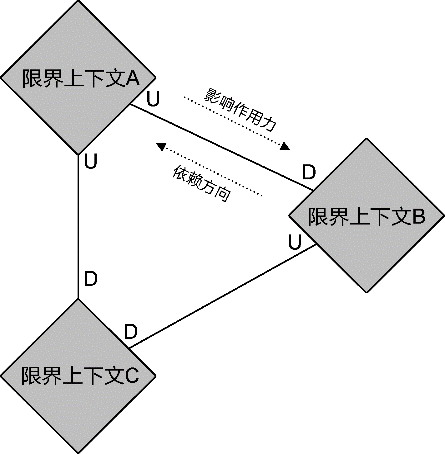

*图10-1 上下游关系*

以订单上下文与库存上下文为例。库存为订单提供了检查库存与锁定库存的服务，如果服务的接口发生了变化，就会影响到订单上下文。知识的传递也如此，库存上下文为订单上下文提供这两个服务时，会将库存量的知识传递给位于下游的订单上下文。因此，库存上下文是订单上下文的上游，如图10-2所示。


*图10-2 订单上下文与库存上下文*

上下文映射图的可视化呈现只是一种形式，重要的是限界上下文的协作模式，它们组成了上下文映射的元模型。Eric Evans定义的上下文映射模式包括客户方/供应方、共享内核、遵奉者、分离方式、防腐层、开放主机服务与发布语言。随着领域驱动设计社区的发展，又诞生了合作关系模式与大泥球模式。它们也被Eric Evans编入了Domain-Driven Design Reference，算是得到了“官方”的认可。

为了更好地理解上下文映射模式，分析这些模式的特征与应用场景，我将它们归纳为两个类别：通信集成模式与团队协作模式。通信集成模式从技术实现角度讨论了限界上下文之间的通信集成方式，关注点主要体现在对限界上下文边界的定义与保护，确定模型之间的协作关系以及通信集成的机制和协议；团队协作模式将限界上下文的边界视为领域特性团队的工作边界，限界上下文之间的协作实际上展现了团队之间的协作方式。

### 10.2 通信集成模式

通信集成模式决定了限界上下文之间的协作质量。只要产生了协作，就必然会带来依赖，选择正确的通信集成方式，就是要在保证协作的基础上尽可能降低依赖，维护限界上下文的自治性。

与通信集成有关的上下文映射模式如图10-3所示。

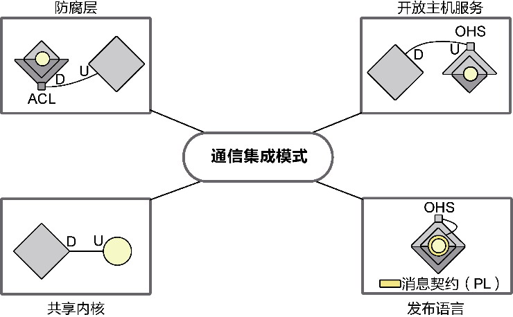

*图10-3 通信集成模式*

在图10-3中，我以菱形代表采用了菱形对称架构（参见第12章）的限界上下文，以U和D分别代表上游和下游，以圆形代表只有领域模型的领域层。

#### 10.2.1 防腐层

正如David Wheeler所说：“计算机科学中的大多数问题都可以通过增加一层间接性来解决。”防腐层(anti corruption layer，ACL)的引入正是“间接”设计思想的一种体现。在架构层面，为限界上下文之间的协作引入一个间接的层，就可以有效隔离彼此的耦合。

防腐层往往位于下游，通过它隔离上游限界上下文可能发生的变化，这也正是“防腐层”得名的由来。若下游限界上下文的领域模型直接调用了上游限界上下文的服务，就会产生多个依赖点，如图10-4所示。

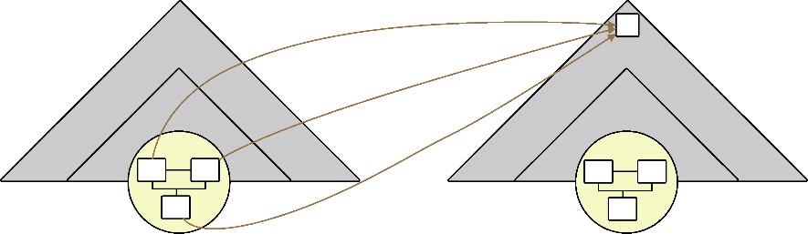

*图10-4 下游对上游的依赖*

下游团队无法掌控上游的变化。变化会影响到下游领域模型的多处代码，破坏了限界上下文的自治性，引入防腐层，在下游定义一个与上游服务相对应的接口，就可以将掌控权转移到下游团队，即使上游发生了变化，影响的也仅仅是防腐层的单一变化点，只要防腐层的接口不变，下游限界上下文的其他实现不会受到影响，如图10-5所示。

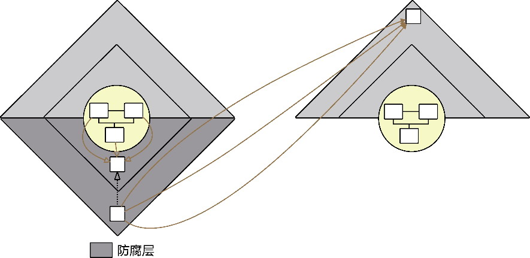

*图10-5 引入防腐层*

当上游限界上下文存在多个下游时，倘若都需要隔离变化，就需要在每个下游限界上下文的自治边界内定义相同的防腐层，造成防腐层代码的重复。如果该防腐层封装的转换逻辑较为复杂，重复的成本就太大了。为了避免这种重复，可以考虑将防腐层的内容升级为一个独立的限界上下文。

例如，在确定电商平台的系统上下文不包含支付系统的前提下，所有的支付逻辑都被推给了外部的支付系统，订单上下文在支付订单时、售后上下文在发起商品退货请求时都需要调用。虽说支付逻辑封装在支付系统中，但在向支付系统发起请求时，难免需要定义一些与支付逻辑相关的消息模型。可以认为，它们都是集成支付系统的适配逻辑。这些逻辑该放在哪里呢？原本防腐层是这些逻辑的最佳去处，但位于下游的订单上下文与售后上下文都需要这些逻辑，就会带来支付适配逻辑的重复。这时就有必要引入一个简单的支付上下文，用来封装与外部支付系统的集成逻辑。

该支付上下文仅仅是一层薄薄的适配业务，是从各个下游上下文的防腐层代码成长起来的，其逻辑简单到不需要定义领域模型。它成为订单上下文与售后上下文的上游，故而需要定义对外公开的服务。服务的实现是对支付系统服务的适配，同时还包括与之对应的消息契约（参见第11章）。

不要将这个由防腐层升级成的限界上下文与其他提供了业务能力的限界上下文混为一谈。说起来，防腐层升级成的限界上下文更像伴生系统放在系统上下文内部的一个代理。

在讲解如何识别限界上下文时我提到，从技术维度考虑，可将遗留系统视为一个单独的限界上下文，通常作为上游而存在。为了避免遗留系统对下游限界上下文造成污染，也可为消费遗留系统的下游限界上下文引入防腐层。

为防腐层的调用引入一个新的限界上下文，就能帮助我们渐进地完成对遗留系统的迁移。迁移时要从调用者的角度观察遗留系统，先在新的限界上下文中建立防腐层需要消费的服务接口，并在接口实现中指向遗留系统的已有实现；在验证了集成的功能无误后，站在调用者角度分辨遗留系统中需要复用的业务功能，再将其复制到这个新的限界上下文。整个迁移过程需要小步前行，针对一个一个业务功能逐步完成映射。如果这些业务功能属于核心子领域，则应该以领域建模的方式改写、重写或重构遗留代码。一旦通过对迁移功能的测试和验证，遗留系统也就完成了历史使命。整个迁移过程如图10-6所示。

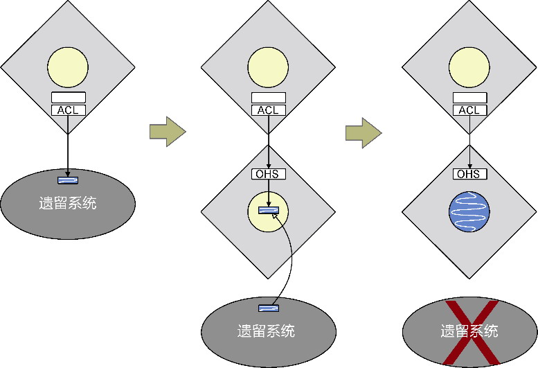

*图10-6 对遗留系统的迁移*

在逐步替换遗留系统功能的过程中，防腐层仅仅扮演了“隔离”的作用，防腐层从未提供真正的业务实现，业务实现被放到了另一个限界上下文中，防腐层会向它发起调用。

#### 10.2.2 开放主机服务

如果说防腐层是下游限界上下文对抗上游变化的利器，开放主机服务(open host service，OHS)就是上游服务招徕更多下游调用者的“诱饵”。设计开放主机服务，就是定义公开服务的协议，包括通信的方式、传递消息的格式（协议）。同时，开放主机服务也可被视为一种承诺，保证开放的服务不会轻易做出变化。

Eric Evans在提出开放主机服务模式时，并未明确地定义限界上下文的通信边界。不同的部署方式，例如本机系统和分布式系统，需要不同的通信机制：本地通信与分布式通信的区别主要体现在是否需要跨越进程边界。

之所以将“进程”作为划分通信边界的标准，是因为它代表了两种不同的编程模式：

·进程内组件之间的调用方式；

·跨进程组件之间的调用方式。

这两种编程模式直接影响了限界上下文之间的通信集成模式，可以以进程为单位将通信边界分为进程内与进程间两种边界。对开放主机服务而言，服务的契约定义可能完全相同，进程内与进程间的调用形式却大相径庭。为示区别，我将进程内的开放主机服务称为本地服务（即领域驱动设计概念中的应用服务），将进程间的开放主机服务称为远程服务，它们应尽可能地共享同一套对外公开的服务契约。服务契约不属于领域模型的一部分（参见第11章）。

倘若上下游的限界上下文位于同一个进程，下游就应该直接调用上游的应用服务，以规避分布式通信引发的问题，例如序列化带来的性能问题、分布式事务的一致性问题以及远程通信带来的不可靠问题；若它们位于不同进程，下游就需要调用上游的远程服务，自然也需要遵循分布式通信的架构约束。因为通信机制的不同，一旦限界上下文的通信边界发生了变化，就不可避免地要影响下游限界上下文的调用者。为了响应这一变化，需要将防腐层与开放主机服务结合起来。防腐层就好像开放主机服务的“代理”：由于应用服务与远程服务的服务契约相同，因此防腐层在指向开放主机服务时就可以保证接口不变，而仅仅改变内部的调用方式。

即使同为远程服务，选择了不同的分布式通信技术，也会定义出不同类型的远程服务。用于远程服务的主流分布式通信技术包括RPC、消息中间件、REST风格服务，以及少量遗留的Web服务。基于RPC通信机制定义的远程服务被命名为提供者(provider)，面向的是服务行为；基于表述性状态迁移(REpresentational State Transfer，REST)风格定义的远程服务被命名为资源(resource)，面向的是服务资源；基于消息中间件通信机制定义的远程服务被命名为订阅者(subscriber)，面向的是事件。还有一种远程服务面向前端UI，可能采用Web服务或REST风格服务，为前端视图提供了模型对象，因此被命名为控制器(controller)。

#### 10.2.3 发布语言

发布语言(published language)是一种公共语言，用于两个限界上下文之间的模型转换。防腐层和开放主机服务都是访问领域模型时建立的一层包装，前者针对发起调用的下游，后者针对响应请求的上游，以避免上下游之间的通信集成将各自的领域模型引入进来，造成彼此之间的强耦合。因此，防腐层和开放主机服务操作的对象都不应该是各自的领域模型，这正是引入发布语言的原因。

如果下游防腐层调用了上游的开放主机服务，则二者操作的发布语言存在一一映射。例如，订单上下文作为库存上下文的下游，它会调用检查库存的开放主机服务InventoryResource：

```
package com.dddexplained.ecommerce.inventorycontext.northbound.remote.resource;
@RestController
@RequestMapping(value="/inventories")
public class InventoryResource {
   @Autowired
   private InventoryAppService inventoryAppService;
   @PostMapping
   public ResponseEntity<InventoryReviewResponse> check(CheckingInventoryRequest request) {
      InventoryReviewResponse reviewResponse = inventoryAppService.checkInventory(request);
      return new ResponseEntity<>(reviewResponse, HttpStatus.OK);
   }
}
```

CheckingInventoryRequest和InventoryReviewResponse作为服务接口方法check()的请求消息与响应消息，组成了该服务的发布语言。

订单上下文引入了防腐层，定义了抽象接口InventoryClient。它使用的是当前限界上下文定义的领域对象：

```
package com.dddexplained.ecommerce.ordercontext.southbound.port.client;
public interface InventoryClient {
   InventoryReview check(Order order);
}
```

它的实现需要调用库存上下文InventoryResource服务的接口方法checkInventory()，这意味着它需要发送与之对应的请求消息，并获得该服务返回的响应消息：

```
package com.dddexplained.ecommerce.ordercontext.southbound.adapter.client;
public class InventoryClientAdapter implements InventoryClient {
   private static final String INVENTORIES_RESOURCE_URL = "http://inventory-service/
inventories";
   @Autowired
   private RestTemplate restTemplate;
   @Override
   public InventoryReview check(Order order) {
      CheckingInventoryRequest request = CheckingInventoryRequest.from(order);
      InventoryReviewResponse reviewResponse = restTemplate.postForObject(INVENTORIES_
RESOURCE_URL, request, InventoryReviewResponse.class);
      return reviewResponse.to();
   }
}
```

在InventoryClientAdapter的实现中，领域模型对象转换的CheckingInventoryRequest和InventoryReviewResponse类与上游限界上下文的发布语言对应，可以认为是防腐层的发布语言。之所以要重复定义，是因为库存上下文与订单上下文分属不同进程，需要支持各自进程内对消息协议的序列化与反序列化。当然，若上下游的限界上下文位于同一进程内，则下游的防腐层也可以调用上游的本地服务，并复用上游的发布语言，无须重复定义。

我将开放主机服务操作的发布语言称为“消息契约”(message contract)。防腐层调用开放主机服务时用到的发布语言，亦可认为是消息契约。

遵循发布语言模式的消息契约模型为领域模型提供了一层隔离和封装。这样做除了能避免领域模型的外泄，也在于二者变化的原因和方向并不一致。

·粒度不同：开放主机服务通常设计为粗粒度服务，位于领域模型的领域服务则需要满足单一职责原则，粒度更细。细粒度的领域服务操作领域模型，粗粒度的开放主机服务操作消息契约模型。例如，下订单领域服务或许只需要完成对订单的验证与创建，而下订单开放主机服务有可能还需要在成功创建订单之后，通知下订单的买家以及商品的卖家。

·持有的信息完整度不同：开放主机服务面向限界上下文外部的调用者。调用者在发起请求消息时，了解的信息并不完整，基于“最小知识原则”，不应苛求调用者提供太多的信息。例如，提供转账功能的开放主机服务，请求消息只需提供转出账户与转入账户的ID，并不需要整个Account领域模型对象。调用者在获得服务返回的响应消息时，可能只需要转换后的信息，例如在获取客户信息时，调用者需要的客户名可能就是一个全名。有的服务调用者还可能需要多个领域对象的组合，例如查询航班信息时，除了需要获得航班的基本信息，还需要了解航班动态与航班资源信息，客户端希望发起一次调用请求，就能获得所有完整的信息。

·稳定性不同：因为开放主机服务要公开给外部调用者，所以应尽量保证服务契约的稳定性。消息契约作为服务契约的组成部分，它的稳定性实际上决定了服务契约的稳定性。一个频繁变更的开放主机服务是无法讨取调用者“欢心”的。领域模型则不然。设计时本身就应该考虑领域模型对需求变化的响应，即使没有需求变化，我们也要允许它遵循统一语言或者满足代码可读性而对其进行频繁的重构。

发布语言需要定义一种标准协议，以体现几个层面的含义。

一个层面是为开放主机服务定义标准的通信消息协议，使得双方在进行分布式通信时能够遵循标准进行序列化和反序列化。可以选择的协议包括XML、JSON和Protocol Buffers等，当然，消息协议的选择还要取决于远程服务选择的通信机制。

另一个层面是为消息内容定义的标准协议，这样的标准协议可以采用行业标准，也可采用组织标准，或者采用为项目定义的一套内部标准。针对特定的领域，还可以使用领域特定语言(Domain Specific Language，DSL)来定义发布语言。它的实践往往是在领域层之外包装一层DSL。一般会使用外部DSL表达发布语言，通过清晰明白、接近自然语言的方式来定义脚本。

#### 10.2.4 共享内核

当我们将一个限界上下文标记为共享内核时，一定要认识到它实际上暴露了自己的领域模型，这就削弱了限界上下文边界的控制力。

任何软件设计决策都要考量成本与收益，只有收益高于成本，决策才是合理的。共享内核的收益不言而喻，成本则来自耦合。这违背了自治单元的“独立进化”原则，一个限界上下文一旦决定复用共享内核，就得承担它可能发生变化的风险。要让收益高于成本，就必须能够控制共享内核模型的变化。Eric Evans就指出：“共享内核不能像其他设计部分那样自由更改。”^249因此，我们只能将那些稳定且具有复用价值的领域模型对象封装到共享内核上下文中。

一些行业通用的值对象（参见第15章）是相对稳定的，例如金融领域的Money、Currency类，用户领域的Address、Phone类，运输领域的QuantityBreak类，零售领域的Price、Quantity类等。这些类型通常属于通用子领域，会被系统中几乎所有的限界上下文复用。

核心子领域最为关键的抽象模型也可能是稳定的。这些抽象模型往往与行业核心业务的本质特征有关，并经历了漫长时间的淬炼，形成了稳定的结构。建立这样的模型，就是要找到领域知识与业务流程中最本质的特征，并对其进行合理抽象。Martin Fowler总结的“分析模式”^亦是为了达到这一目的，即定义稳定的可复用的领域对象模型。Peter Coad等人提出的彩色UML方法，则提炼出与领域无关的组件^13，然后在其基础上梳理与领域有关的组件，形成的领域对象模型存在较高的稳定性和复用性。诸如这样通过分析模式或彩色建模获得的领域模型，皆有可能作为共享内核，至少也可作为核心领域模型的参考。这些领域模型都是对行业核心知识的分析，在保证足够抽象层次的同时，又形成了固定的行业惯例。它们又都属于问题空间的核心子领域，属于企业的核心资产，因此值得付出大量的时间成本与人力成本去打造。

由于共享内核缺乏自治能力，往往以库的形式被其他限界上下文复用，因此可以认为它是一种特殊的进程内通信集成模式。

### 10.3 团队协作模式

如果将限界上下文理解为对团队工作边界的控制，且遵循康威定律和康威逆定律，就可将限界上下文之间的关系映射为领域特性团队之间的协作。Vaughn Vernon就认为：“上下文映射展现了一种组织动态能力，它可以帮助我们识别出有碍项目进展的一些管理问题。”^因此，在确定限界上下文的团队协作模式时，需要更多站在团队管理与角色配合的角度去思考。

依据团队的协作方式与紧密程度，我定义了5种团队协作模式，如图10-7所示。

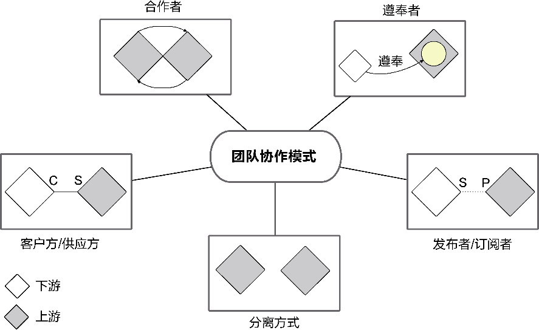

*图10-7 团队协作模式*

图10-7用菱形图示代表限界上下文映射的领域特性团队，菱形之间的关联线代表它们之间的关系，菱形的位置代表团队所处的地位。

#### 10.3.1 合作者

Vaughn Vernon将合作者(partnership)模式定义为：“如果两个限界上下文的团队要么一起成功，要么一起失败，此时他们需要建立起一种合作关系。他们需要一起协调开发计划和集成管理。两个团队应该在接口的演化上进行合作以同时满足两个系统的需求。应该为相互关联的软件功能制订好计划表，这样可以确保这些功能在同一个发布中完成。”^

团队之间的良好协作当然是好事，可要是变为一起成功或一起失败的“同生共死”关系，就未必是好事了：那样只能说明两个团队分别开发的限界上下文存在强耦合关系，正是设计限界上下文时需要竭力避免的。同生共死，意味着彼此影响，设计上就是双向依赖或循环依赖的体现。解决的办法通常有如下3种。

·合并：既然限界上下文存在如此紧密的合作关系，就说明当初拆分的理由较为牵强。与其让它们因为分开而“难分难舍”，不如干脆让它们合在一起。

·重新分配：将产生特性依赖的职责分配到正确的位置，尽力移除一个方向的多余依赖，减少两个团队之间不必要的沟通。

·抽取：识别产生双向（循环）依赖的原因，然后将它们从各个限界上下文中抽取出来，并为其建立单独的限界上下文。

倘若限界上下文之间存在相互依赖(mutually dependent)，又没有更好的技术手段解决这种职责纠缠问题，那么，在上下文映射中明确声明团队之间采用“合作者”模式是引入这一模式的主要目的。Eric Evans明确提出：“当两个上下文中任意一个的开发失败会导致整个交付失败时，就需要努力迫使负责这两个上下文的团队加强合作。”这时，合作者模式成了一种风险标记，提醒我们要加强管理手段和技术手段去促进两个团队紧密的合作，如采用敏捷发布火车(agile release train)建立一种持续的团队合作机制，要求参与的团队一起做计划、一起提交代码、一起开发和部署，采用持续集成(continuous integration，CI)的方式保证两个限界上下文的集成度与一致性，避免因为其中一个团队的修改影响集成点的失败。

因此，我们要认识到合作者模式是一种“不当”设计引起的“适当”的团队协作模式。

#### 10.3.2 客户方/供应方

当一个限界上下文单向地为另一个限界上下文提供服务时，它们对应的团队就形成了客户方/供应方(customer/supplier)模式。这是最为常见的团队协作模式，客户方作为下游团队，供应方作为上游团队，二者协作的主要内容包括：

·下游团队对上游团队提出的服务调用需求；

·上游团队提供的服务采用什么样的协议与调用方式；

·下游团队针对上游服务的测试策略；

·上游团队给下游团队承诺的交付日期；

·当上游服务的协议或调用方式发生变更时，如何控制变更。

供应方的上游团队面对的下游团队往往不止一个。如何排定不同服务的优先级，如何为服务建立统一的抽象，都是上游团队需要考虑的问题。下游团队需要考虑上游服务还未实现时该如何模拟上游服务，以及当上游团队不能按时履行交付承诺时的应对方案。上游团队定义的服务接口形成了上下游团队共同遵守的契约，在架构映射阶段与领域建模阶段，双方团队需要事先确定服务接口定义。若因为存在需求变化或技术实现带来的问题需要变更服务接口的定义，则上游团队要及时与所有下游团队进行协商，或告知该变更，由下游团队评估该变更可能带来的影响。若下游团队因为需求变化对上游服务的定义提出了不同的消费需求，也应及时告知上游团队。

例如，人力资源系统的通知上下文作为供应方定义了通知服务，该服务需要为许多下游的限界上下文提供功能支撑。在上下文映射中，将通知上下文与其他限界上下文标记为“客户方/供应方”关系时，就要求与通知服务相关的团队充分协作。客户方应结合自己的业务需求对通知服务提出要求，例如培训上下文要求提供邮件、站内信息推送等通知方式，并要求通知内容能够支持模板定义，而招聘上下文则要求支持短信通知，以便更加方便地通知到应聘者。供应方团队在了解到这些多样化需求后，确定服务的接口定义与调用方式，告知客户方。客户方若认为设计的服务存在不妥，可以要求供应方对服务做出调整，至少也可以就该服务的定义进行协商或设计评审。

通常，供应方希望定义一个通用的服务一劳永逸地解决各个客户方提出的调用请求，例如将短信、邮件和站内消息推送等通知方式糅合在一个服务里，并通过服务请求中的notificationType来区分通知类型。相反，客户方希望调用的服务具有清晰的意图、简单的接口。由于供应方与客户方各自了解的信息并不对等，这就需要双方就服务的通用性与易用性达成设计方案的一致。例如，招聘上下文只需要供应方提供短信通知服务，并不了解培训上下文需要的邮件与站内信息通知服务，因此有可能无法理解为何在调用服务时，还需要传递notificationType值。此外，不同通知类型要求的请求信息也不相同，例如短信通知需要知道手机号码，邮件通知需要电子邮件地址，站内信息通知则需要用户ID。当客户端请求差异过大时，统一服务的代价就会太高，服务的调用信息也可能存在部分冗余。

协商服务接口的定义时，还需要根据限界上下文拥有的领域知识，维持各自的职责边界。譬如，通知上下文定义了Message与Template领域对象，后者内部封装了一个Map<String,String&gt;类型的属性。Map的key对应模板中的变量，value为实际填充的值。由于通知上下文并不了解各种组装通知内容的业务规则，因此，在协调上下文的映射关系时，供应方团队需要明确：通知服务仅履行填充模板内容的职责，但不负责对值的解析。显然，供应方团队作为上游服务的提供者，有权拒绝超出自己职责范围的要求，严格地恪守自己的自治边界。

客户方对供应方服务的调用形成了两个限界上下文之间的集成点，因此应采用持续集成分别为上、下游限界上下文建立集成测试、API测试等自动化测试，完成从构建、测试到发布的持续集成管道，规避两个限界上下文之间的集成风险，及时而持续地反馈上游服务的变更。若二者位于不同的进程边界，还需要跟踪和监控调用链，并考虑引入熔断器，避免引起服务失败带来的连锁反应。

#### 10.3.3 发布者/订阅者

发布者/订阅者(publisher/subscriber)模式并不在Eric Evans提出的上下文映射模式之列，但在事件成为领域驱动设计建模的“一等公民”之后，发布者/订阅者模式也被普遍用于处理限界上下文之间的协作关系，因此，我认为是时候将它列入上下文映射模式了。

发布者/订阅者模式本身是一种通信集成模式。本质上，它脱胎于设计模式中的观察者(observer)模式^194，当它用于系统之间的集成时，即企业集成模式中的发布者-订阅者通道(publisher-subscriber channel)模式

^71。采用这一模式时，往往由消息队列担任事件总线发布与订阅事件。在消息处理场景中，这是一种惯用的设计模式，故而Java消息服务(Java Message Service，JMS)定义了TopicPublisher与TopicSubscriber接口分别代表发布者与订阅者，用以指导和规范这一模式的设计。Frank Buschmann等人也将发布者/订阅者模式列入分布式基础设施模式中，将其作为一种消息通知机制，用以告知组件相关状态的变化和其他需要关注的事件^。

现有的通信集成模式已经涵盖了发布者和订阅者的职责：事件订阅者可以视为开放主机服务，事件发布者则是防腐层的一部分。通过发布/订阅事件参与协作的限界上下文，以更松散的耦合度对团队协作提出了新的要求。事件的发布者属于上游团队，但它与供应方团队不同之处在于，前者主动发布事件提供服务，后者被动提供服务供客户方调用。事件的订阅者属于下游团队，但它会主动监听事件总线，一旦接收到事件，就会执行对应的事件处理逻辑。除了事件，双方感知不到对方的存在。

当我们将团队协作标记为发布者/订阅者模式时，意味着他们之间的协作将围绕着“事件”进行。无论事件是领域事件，还是应用事件，都属于业务事件而非技术事件，因而在发布与订阅过程中产生的事件流，代表了贯穿多个场景的业务流程，决定了团队之间的协作方式。例如，如果我们将电商系统中订单上下文与配送上下文之间的上下文映射定义为发布者/订阅者模式，意味着它包含了一个由事件流组成的业务场景：

·订单在完成支付后，需要发布OrderConfirmed事件，配送上下文监听到该事件后，执行配送流程；

·当配送结束后，配送上下文又会发布ShipmentDelivered事件，订单上下文监听到该事件后，会关闭订单，将订单的状态标记为“COMPLETED”。

该事件流可以通过表10-1来表示。

*表10-1 事件的发布者与订阅者*


很明显，采用发布者/订阅者映射模式的这两个团队，他们互为发布者和订阅者，这样的协作方式看起来更像合作者模式，但协作的紧密程度却远远没有达到“同生共死”的关系；若说是客户方/供应方模式也有不妥，因为两个不同的事件决定的上下游关系是互逆的。

这正体现了发布者/订阅者模式有别于其他协作模式的特殊性。

#### 10.3.4 分离方式

分离方式(separate way)的团队协作模式是指两个限界上下文之间没有一丁点儿的关系。这种“无关系”仍然是一种关系，而且是一种最好的关系，意味着我们无须考虑它们之间的集成与依赖，它们可以独立变化，互相不影响。还有什么比这更美好的呢？

电商网站的支付上下文与商品上下文之间就没有任何关系，二者是“分离方式”的体现。虽然从业务角度理解，客户购买商品，确乎是为商品进行支付，但在商品上下文中，我们关心的是商品的价格，而在支付上下文，关注的却是每笔交易的金额。商品价格的变化也不会影响支付上下文，支付上下文只负责按照传递过来的支付金额完成付款交易，并不关心这个支付金额是如何计算出来的。

不过，二者的领域模型都依赖Money值对象，如果其中一方的领域模型复用了另一方的领域模型，就不可避免地带来了协作关系。这也正是要求在上下文映射中确定这种“无关系”协作模式的原因所在。一旦确定为“分离方式”映射模式，就要彻底隔断这两个团队之间的任何联系。既然双方都需要Money值对象，要遵循分离方式模式，就可以通过在两个限界上下文中重复定义Money值对象来完成解耦。不要害怕这样的重复，在领域驱动设计中，我们遵循的原则应该是“只有在一个限界上下文中才能消除重复”^249。

如果我们深为它产生的重复感到羞愧，还可以运用“共享内核”模式。毕竟Money值对象还会牵涉到复杂的货币转换以及高精度的运算逻辑。当重复的代价太高，且该模型属于一个稳定的领域概念时，共享内核能以更优雅的方式平衡重复与耦合的冲突。例如单独定义一个货币上下文，将其作为支付上下文与商品上下文的共享内核，同时保持了支付上下文与商品上下文之间的分离关系，如图10-8所示。

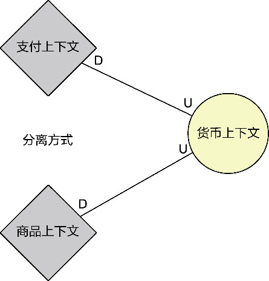

*图10-8 保持分离方式*

一旦系统的领域知识变得越来越复杂，导致多个限界上下文之间存在错综复杂的关系时，要识别两个限界上下文之间压根没有一点关系，就需要敏锐的“视力”了。同时，要将两个限界上下文的团队协作定义为“分离方式”模式，也需要承担设计的压力，一旦确定有误，就可能因为隐含的关系没有发现，导致遗漏必要的服务定义。有时候，我们也会刻意追求这种模式，如果解耦的价值远远大于复用的价值，即使两个限界上下文之间存在复用形成的上下游关系，也可以通过引入少许重复，彻底解除它们之间的耦合。

没有关系的关系看起来似乎无足轻重，其实不然。它对设计质量的改进以及团队的组织都有较大帮助。两个毫无交流与协作关系的团队看似冷漠无情，然而，正是这种“无情”才能促进它们独立发展，彼此不受影响。

#### 10.3.5 遵奉者

不管是客户方/供应方，还是发布者/订阅者，它们所在的团队之间都存在清晰的上下游关系，用于指导上游团队与下游团队之间的协作。虽然服务由上游团队提供，但它本质上应该是应下游团队的需求做出的响应。然而，一旦控制权发生了反转，服务的定义与实现交由上游团队全权负责时，遵奉者(conformist)模式就产生了。

这种情形在现实的团队合作中可谓频频发生，尤其当两个团队分属于不同的管理者时，牵涉到的因素不仅仅与技术有关。限界上下文影响的不仅仅是设计决策与技术实现，还与企业文化、组织结构直接有关。许多企业推行领域驱动设计之所以不够成功，除了团队成员不具备领域驱动设计的能力，还要归咎于企业文化和组织结构层面，比如企业的组织结构人为地制造了领域专家与开发团队的壁垒，又比如两个限界上下文因为利益倾轧而导致协作障碍。团队领导的求稳心态，也可能导致领域驱动设计的改良屡屡碰壁，无法将这种良性的改变顺利地传递下去。从这一角度看，遵奉者模式更像一种“反模式”。当两个团队的协作模式被标记为“遵奉者”时，其实传递了一种组织管理的风险。

当上游团队不积极响应下游团队的需求时，下游团队该如何应对？Eric Evan给出了如下3种可能的解决途径^253。

·分离方式：下游团队切断对上游团队的依赖，由自己来实现。

·防腐层：如果自行实现的代价太高，可以考虑复用上游的服务，但领域模型由下游团队自行开发，然后由防腐层实现模型之间的转换。

·遵奉者：严格遵从上游团队的模型，以消除复杂的转换逻辑。

最后一种方式，实际上是权衡了复用成本和依赖成本的情况下做出的取舍。当下游团队选择“遵奉”于上游团队设计的模型时，意味着：

·可以直接复用上游上下文的模型（好的）；

·减少了两个限界上下文之间模型的转换成本（好的）；

·使得下游限界上下文对上游产生了模型上的强依赖（坏的）。

Eric Evans告诫我们对领域模型的复用要保持清醒的认识，他说：“限界上下文之间的代码复用是很危险的，应该避免。”^241如果不是因为重复开发的成本太高，应避免出现遵奉者模式。

采用遵奉者模式时，需要明确这两个限界上下文的统一语言是否存在一致性，毕竟，限界上下文的边界本身就是为了维护这种一致性而存在的。理想状态下，互为协作的两个限界上下文都应该使用自己专属的领域模型，因为不同限界上下文观察统一语言的视角多少会出现分歧，但模型转换的成本确实会令人左右为难。设计总是如此，没有绝对好的解决方案，只能依据具体的业务场景权衡利弊得失，以求得到相对好（而不是最好）的方案。这是软件设计让人感觉棘手的原因，却也是它的魅力所在。

虽然共享内核与遵奉者模式都是下游限界上下文对上游限界上下文领域模型的复用，选择它们的起因却迥然不同。选择遵奉者模式是被动的选择，因为上游团队对下游团队的合作不感兴趣，只得无可奈何地顺从于它。共享内核却是团队高度合作的结果，从团队协作的角度看，它与合作者模式、客户方/供应方模式并无太大差异，之所以采用共享内核，完全可以看作是对通信集成方式的选择。

### 10.4 上下文映射的设计误区

在确定上下文映射之前，需要先确定两个限界上下文之间是否真正存在协作关系。

#### 10.4.1 语义关系形成的误区

一个常见误区是惯以语义之间的关系去揣测限界上下文之间的关系。譬如，客户提交订单的业务服务如图10-9所示。


*图10-9 提交订单业务服务*

其中，“客户”作为业务服务的角色，是一个领域概念；“订单”是另一个领域概念。这两个领域概念从语义上分属客户上下文与订单上下文。客户提交订单时，是否意味着客户所属的客户上下文需要发起对订单上下文的调用？如果是，就意味着订单上下文是客户上下文的上游，二者可映射为客户方/供应方模式。

然而，我们不可妄下判断，而需从对象的职责进行判断。对象履行职责的方式有3种，Rebecca Wirfs-Brock将其总结为3种形式^：

·亲自完成所有的工作；

·请求其他对象帮忙完成部分工作（和其他对象协作）；

·将整个服务请求委托给另外的帮助对象。

只有后两种形式才会产生对象的协作。两个限界上下文之间若存在上下游的同步调用关系，必然意味着参与协作的对象分属两个限界上下文。关键需要明确这样的对象协作是否存在：

·职责由谁来履行，这牵涉到领域行为该放置在哪一个限界上下文的对象；

·谁发起对该职责的调用，倘若发起调用者与职责履行者在不同限界上下文，意味着二者存在协作关系，并能确定上下游关系。

提交订单的职责由谁来履行呢？依据面向对象的设计原则，一个对象是否该履行某一个职责，是由它所具备的信息（即对象的知识）决定的。职责就是对象的行为，它具备的信息就是对象的数据。遵循信息专家模式(information expert pattern)^，要求“将职责分配给拥有履行一个职责所必需信息的类”，即“信息专家”。既然提交订单职责操作的信息主体就是订单，就应该考虑将该职责分配给拥有订单信息的订单上下文。

提交订单的职责又该由谁发起调用呢？在真实世界，当然由客户提交订单，因此客户是发起提交订单服务请求的用户角色。但是，对限界上下文而言，提交订单是订单上下文对外公开的远程服务，调用者并非客户上下文，而是前端的用户界面。客户通过前端的用户界面与后端的限界上下文产生交互，如图10-10所示。

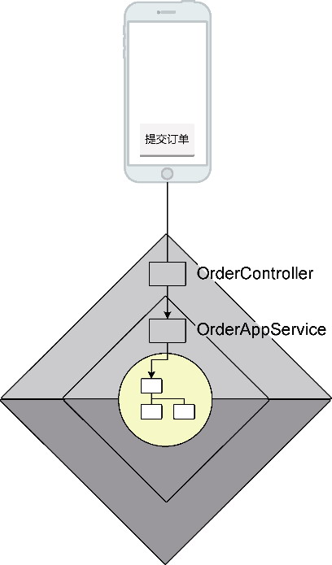

*图10-10 前端与后端之间的交互*

由于限界上下文的边界并不包含前端的用户界面，用户界面层发起对限界上下文的调用自然也不属于限界上下文之间的协作。真实世界中真正点击“提交订单”按钮的那个客户，其实是委托前端发起对订单上下文的调用。

当我们将调用职责分配给前端的用户界面时，需要保持警惕，切忌不分青红皂白，一股脑儿地将本该由限界上下文调用的工作全都交给前端，以此来解除限界上下文之间的耦合。前端确乎是发起调用的最佳位置，但前提是，我们不能让前端承担本由后端封装的业务逻辑。前端只该做界面呈现的工作，职责的分配不公，会带来角色的错位。如果我们一味地让前端承担了太多业务职责，当一个系统需要多种前端类型支持时，过分的职责分配就会让前端出现大量重复代码，业务逻辑也会“偷偷”地泄露到限界上下文之外。

#### 10.4.2 对象模型形成的误区

如果说通过语义关系推导限界上下文关系是犯了将真实世界与对象的理想世界混为一谈的错误，那么，识别上下文映射的另一种误区就是将对象的理想世界与领域模型世界混为一谈了。例如，在分析客户与订单的关系时，会得到图10-11所示的一对多的对象模型。


*图10-11 一对多的对象模型*

Customer类属于客户上下文，Order类属于订单上下文，遵循二者的一对多关系，就会产生两个限界上下文的依赖。但在设计领域模型时，实际并非如此。Customer与Order之间的关系通过CustomerId来维持彼此的关联。虽然Customer与Order之间共享了CustomerId，但这种共享仅限于值而非类型，不会产生领域模型的依赖，如图10-12所示。

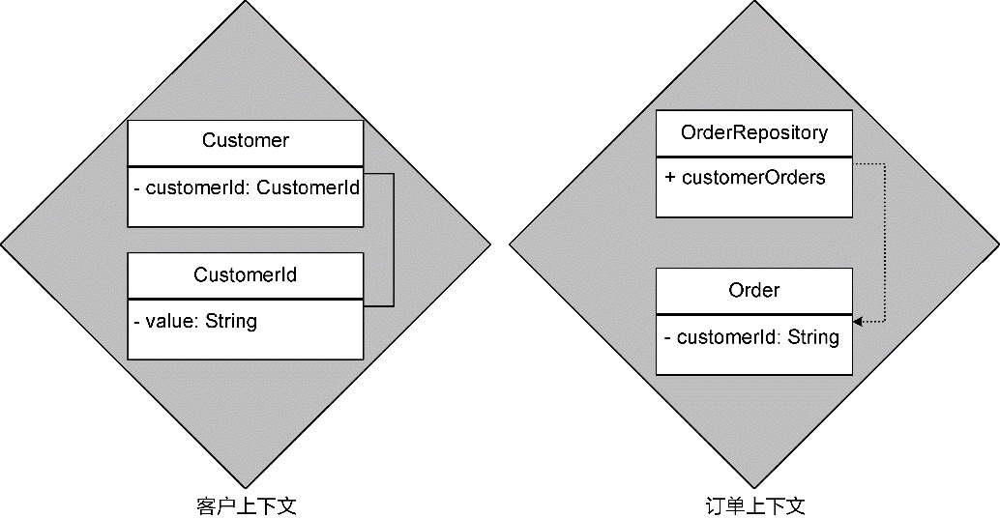

*图10-12 没有模型依赖的限界上下文*

与客户提交订单相同，客户查询订单仍然通过前端向订单上下文远程服务OrderController发起调用，在进入领域层后，又通过OrderRepository获得订单数据。Customer与Order之间不存在模型依赖，不会引起两个限界上下文的协作。

### 10.5 上下文映射的确定

只有当一个领域行为成为另一个领域行为“内嵌”的执行步骤，二者操作的领域逻辑分属不同的限界上下文，才会产生真正的协作，形成除“分离方式”之外的上下文映射模式。

#### 10.5.1 任务分解的影响

要解决一个工程问题，可以通过任务分解把一个大问题拆分成多个小问题，为这些小问题形成各自的解决方案，再组合在一起^108。以计算订单总价为例，它需要根据客户类别确定促销策略，计算促销折扣，从而计算出订单的总价。计算订单总价是当前场景最高层次的目标，可以分解为以下任务：

·获得客户类别；

·确定促销策略；

·计算促销折扣。

这3个任务为“计算订单总价”提供了功能支撑，形成了所谓的“内嵌”执行步骤。根据职责分配的原则，计算订单总价属于订单上下文，获得客户类别属于客户上下文，确定促销策略并计算促销折扣属于促销上下文。这些领域行为彼此内嵌，形成一种“犬牙交错”的协作方式，横跨了3个不同的限界上下文。

任务分解存在不同的抽象层次，观察的视角不同，抽象的特征不同，分解出来的任务所处的抽象层次也会不同，进而影响到限界上下文协作的顺序。

一种任务分解方式是将计算订单总价视为一个总控制者，由它协调所有的支撑任务，层次如下：

·

      计算订单总价——订单上下文。

·获得客户类别——客户上下文。

·获得促销策略——促销上下文。

·计算促销折扣——促销上下文。

订单上下文总览全局，分别通过客户上下文与促销上下文执行对应的子任务。最后，由订单上下文完成订单总价的计算。客户上下文与促销上下文互不知晓，它们同时作为订单上下文的上游被动地接收下游发起的调用，获得的上下文映射图如图10-13所示。

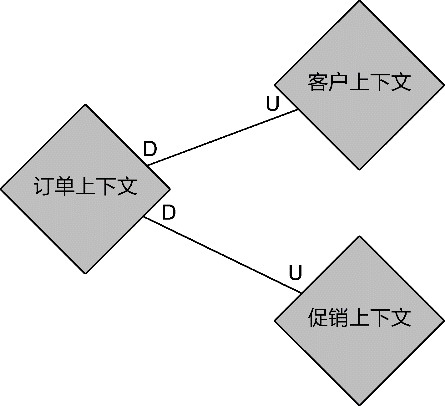

*图10-13 订单上下文为总控制者*

如果将获得客户类别视为获得促销策略的实现细节，它的抽象层次就会降低，成为获得促销策略任务的子任务，任务分解的层次与顺序就变为：

·

      计算订单总价——订单上下文。

·

          获得促销策略——促销上下文。

·获得客户类别——客户上下文。

·计算促销折扣——促销上下文。

订单上下文只需了解获得的促销策略。至于该策略如何而来，属于促销上下文的内部职责。于是，促销上下文成了订单上下文的上游，客户上下文又成了促销上下文的上游，如图10-14所示。


*图10-14 促销上下文封装了细节*

可以进一步对职责进行封装。对计算订单总价而言，它只需要知道最终的促销折扣。获得促销策略是计算促销折扣的细节，获得客户类别又是获得促销策略的细节，从而形成了层层递进的抽象：

·

      计算订单总价——订单上下文。

·

          计算促销折扣——促销上下文。

·

              获得促销策略——促销上下文。

·获得客户类别——客户上下文。

这样的任务分解方式建立了更多的抽象层次，因而封装更加彻底。合理的封装让订单上下文了解的细节更少，减少了限界上下文的协作次数。对促销上下文而言，“计算促销折扣”才是提供服务价值的用例，更加适合定义为开放主机服务，“获得促销策略”则属于内部的领域行为，无须公开。

第二种和第三种任务分解方式形成的上下文映射图完全一样，协作序列则有所不同。第二种任务分解形成的协作序列如图10-15所示。

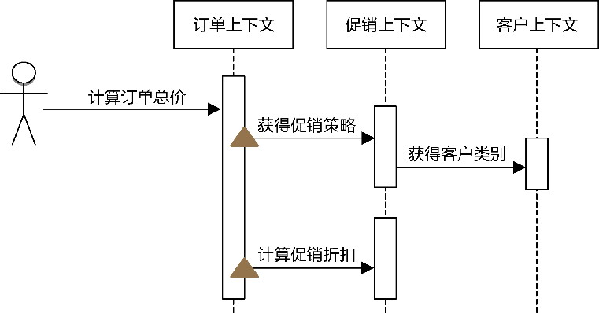

*图10-15 公开两个服务的促销上下文*

图10-15中的三角形体现了订单上下文与促销上下文的协作，意味着促销上下文需要定义两个开放主机服务，订单上下文会发起两次调用。

第三种任务分解形成的协作序列如图10-16所示。

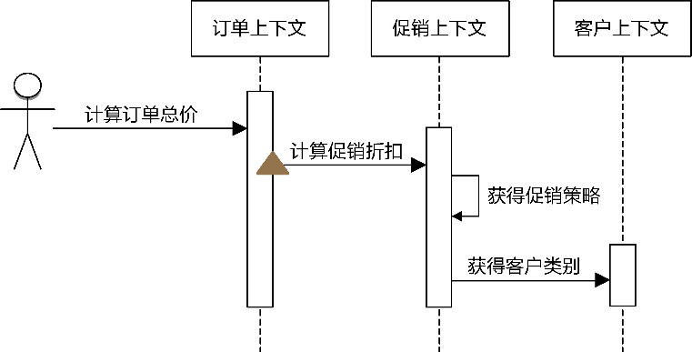

*图10-16 公开一个服务的促销上下文*

很明显，这种任务分解方式更加合理：订单上下文与促销上下文之间的协作减少为一次，后者公开的开放主机服务只有一个。

对比几种任务分解的方式，最小知识法则(principle of least knowledge)成了最后的胜者。它好像一个魅惑的精灵，让限界上下文乐意屈从，甘心成为一个了解最少知识的快乐“傻子”。有舍才有得，限界上下文克制住了刺探别人隐私的好奇心，反而保全了属于自己的自治权。

要正确认识限界上下文之间真正的协作关系，仅凭臆测是不对的。确定上下文映射模式的工作是与服务契约设计（参见第11章）的工作同时进行的。设计服务契约时，需要通过为业务服务建立服务序列图（参见第11章）才能真正弄明白限界上下文之间的真实协作关系，在确定服务契约的同时，上下文映射模式自然也就确定了。

#### 10.5.2 呈现上下文映射

在确定了上下文映射后，还需要将其可视化，以便直观地呈现目标系统限界上下文关系的全貌，这个可视化工具就是上下文映射图。

上下文映射图利用椭圆框代表限界上下文，连线代表限界上下文之间的关系，并在连线上通过文字标记出上下游关系或选择的上下文映射模式，如图10-17所示。

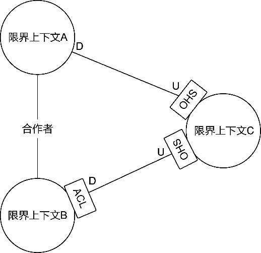

*图10-17 上下文映射图*

如果为限界上下文引入了菱形对称架构（参见第12章），由于它结合了防腐层模式、开发主机服务模式和发布语言模式，故而在上下文映射图中，若以菱形代表限界上下文，就已经说明了对应的通信集成模式。一个例外是共享内核模式，它对应的领域模型直接公开在外。为示区别，可使用椭圆表示采用共享内核模式的限界上下文。由此，上下文映射图可对各个图例进行明确规定：

·菱形或椭圆代表限界上下文，无须说明它们之间采用的通信集成模式；

·连线代表限界上下文之间的协作关系，其中虚线仅适用于发布者/订阅者模式；

·连线两端，若C和S结合，代表客户方/供应方(Customer /Supplier)模式；若P和S结合，代表发布者/订阅者(Publisher /Subscriber)模式；遵奉者模式需要在连线上清晰说明为遵奉者(conformist)；没有连线，说明为分离方式模式；有连线无说明文字，则为合作者模式，也可用带有双向箭头的连线表示。

以一个供应链项目为例，图10-18是它的上下文映射图。

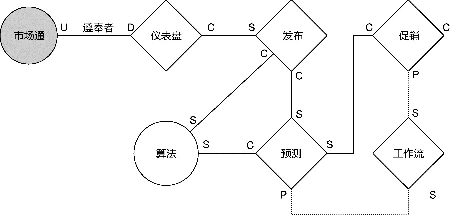

*图10-18 供应链的上下文映射图*

解读此图，可以直接得出彼此之间的团队协作模式，由于菱形和椭圆已经说明了它们采用的通信集成模式，故而无须另行说明。

如果目标系统的规模较大，识别出来的限界上下文数量较多，绘制出的上下文映射图可能显得极度复杂，让人无法快速地辨别出它们之间的关系。这时，可以降低要求，不去呈现整个目标系统所有限界上下文的协作全貌，借鉴由Kent Beck与Ward Cunningham提出的图10-19所示的类-职责-协作者索引卡（Class-Responsibility-Collaborator index card，CRC索引卡）。


*图10-19 CRC索引卡*

此工具的目的是清晰地描述对象之间的协作关系，且这种协作关系是从对象的职责角度进行思考，从而驱动出合理的类。明确限界上下文之间的协作关系，相当于将限界上下文作为参与业务服务的对象，定义的服务契约即它所应履行的职责。至于协作者，则需要区分上游和下游，以说明谁影响了当前限界上下文，而它又影响了谁。既然该卡片的主体是限界上下文，可以将这样的卡片称为限界上下文-职责-协作者卡（BoundedContext-Responsibility-Collaborator card，BRC卡）。其中，还要在协作者区域划分出上游和下游两个子区域，如图10-20所示。

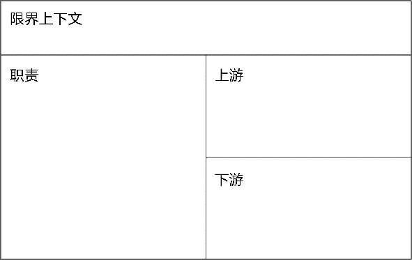

*图10-20 BRC卡*

为限界上下文绘制上下文映射图的目的是以可视化方式直观地展现限界上下文之间的协作关系。对上下文映射模式的选择会对系统的架构产生影响，甚至可以认为是一种架构决策，例如发布者/订阅者模式的选择、遵奉者模式的选择、共享内核模式的选择都会影响系统的架构风格。上下文映射图及BRC卡可以和服务契约定义放在一起，共同组成服务定义文档，并作为组成架构映射战略设计方案的重要部分。
